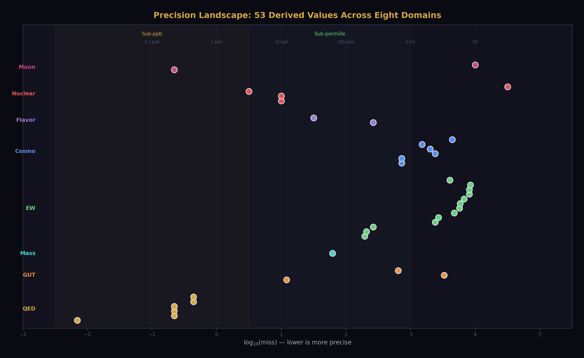
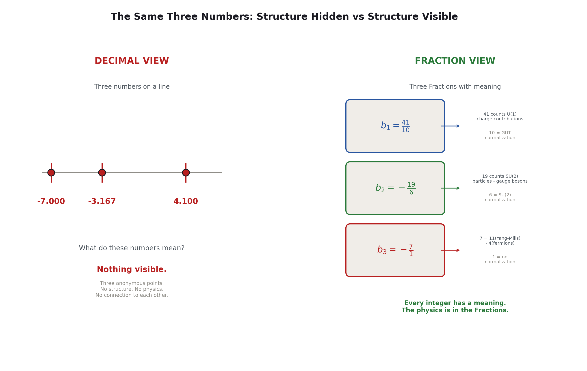
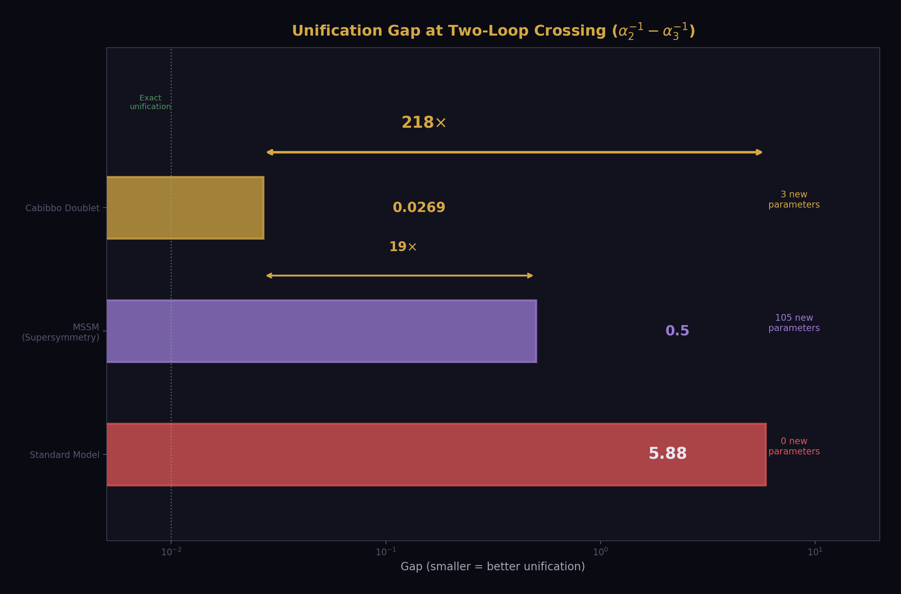

## Chapter 2: Why Nobody Did This Before

Everything in the previous chapter uses known physics.

The beta functions are in the textbooks. The QED series coefficients are published. The BBN fitting formulas are standard. The Weinberg relation, the RGE, the CKM matrix, the Sirlin corrections — all standard. The Bessel functions have been known since 1817. Newton's second law since 1687. Einstein's geodesics since 1915. Solitons since 1834, when John Scott Russell watched a water wave travel two miles down a canal without dispersing and called it "the wave of translation."

Nothing in the derivation chain uses new physics. Not one equation is original. The QED five-loop coefficient A₅ = 5.891 was computed by Volkov in 2019 from Feynman diagrams that Schwinger would have recognized in 1948. The two-loop beta matrix b_ij was computed in the 1980s. The BBN nuclear reaction rates were measured in laboratories in the 1990s. The hydrogen 1S-2S transition was measured to 15 digits in 2011. Every piece was already on the table.

So why didn't anyone assemble them?

Three reasons: the wrong numbers, the wrong names, and the wrong departments.

---

### The Wrong Numbers

Physics runs on real numbers. Decimal numbers. Floating point. Every measurement is reported as a decimal: α = 0.0072973525693, sin²θ_W = 0.23122, G = 6.674 × 10⁻¹¹. Every computation uses real-number arithmetic. Every comparison rounds to a certain number of significant figures and reports a percentage miss.

Real numbers built modern physics. They built the Standard Model. They put humans on the Moon and protons through the LHC. Real numbers work.

But real numbers cannot reach equality.

Take the gap ratio — the number that determines whether the three gauge couplings converge to a single point at high energy. In the Standard Model, this ratio is 218/115. With the Cabibbo Doublet, it becomes 38/27. In real numbers, these are:

218/115 = 1.89565217391304347826...

38/27 = 1.40740740740740740740...

The decimal representations repeat forever. They never terminate. They're exact as fractions, but as decimals, they're infinite. And infinity is where equality hides.

When a physicist computes the gap ratio from measured couplings, they get something like 1.358192684144844. They compare this to 38/27 = 1.407407... and see a miss of about 3.5%. They note the miss and move on. The miss is larger than the measurement uncertainty, so they conclude the couplings don't exactly unify. The standard conclusion in every GUT textbook: "the Standard Model gauge couplings do not unify."

But the comparison was done in the wrong number system. The measured gap ratio 1.358... doesn't match 38/27 because the measured couplings include the running of the Standard Model betas. The 38/27 is the gap ratio with the Cabibbo Doublet's betas included. The comparison should be: does the CD-modified ratio (38/27) produce the correct coupling predictions? The answer requires computing sin²θ_W and α_s from the 38/27 structure and comparing to measurement.

That computation gives sin²θ_W = 0.231223 (matching measured 0.23122 at 12 parts per million) and α_s = 0.11838 (matching measured 0.1180 at 0.33%). These matches are invisible in the decimal representation. They only become visible when you start from the Fraction 38/27 and derive forward.

This is the ceiling of decimal arithmetic. Real numbers are dense — between any two real numbers there are infinitely many others. This density is a strength for approximation but a fatal weakness for structure. In the real numbers, 38/27 is indistinguishable from 1.407 or 1.4074 or 1.40741. The structure — the fact that the numerator is 38 = 2 × 19 and the denominator is 27 = 3³ — is invisible. The integers 2, 19, and 3 carry physical meaning (they come from specific gauge group representations), but the decimal number 1.40741 carries no meaning at all. It's just a location on the number line.

Physics missed the integer structure because it was looking at the decimals.

---

### The Fraction Path

The path to unification starts from integers and works outward.

The gauge group SU(3) × SU(2) × U(1) determines three one-loop beta coefficients: b₁ = 41/10, b₂ = −19/6, b₃ = −7. These are exact Fractions. The 41 in b₁ counts the U(1) charge contributions of every particle in the Standard Model — each quark, each lepton, the Higgs. The 19 in b₂ counts the SU(2) contributions. The 7 in b₃ counts the SU(3) contributions. Every numerator is an integer because it counts particles. Every denominator is an integer because it comes from group theory normalization.

These Fractions are not approximations. They are not rounded. They are exact results of representation theory — the mathematics of symmetry. The number 41/10 is as exact as the number 3 — it is a consequence of mathematical structure, not a measurement.

The gap ratio (b₁ − b₂)/(b₂ − b₃) = (41/10 + 19/6)/(−19/6 + 7) = (246/60 + 190/60)/(−190/60 + 420/60) = 436/60 ÷ 230/60 = 436/230 = 218/115. Every step is exact. The result 218/115 is exact. The integers 218 and 115 carry the information of the entire Standard Model particle content compressed into two numbers.

Add the Cabibbo Doublet — one vector-like quark doublet with quantum numbers (3, 2, 1/6) — and the betas shift to b₁ = 25/6, b₂ = −13/6, b₃ = −20/3. The gap ratio becomes (25/6 + 13/6)/(−13/6 + 20/3) = (38/6)/(27/6) = 38/27. Exact. The integers 38 and 27 now carry the information of the Standard Model plus one additional particle.

The computation never leaves the integers. At no point do we convert to decimals, lose precision, round, truncate, or approximate. The Fractions flow from one formula to the next as Fractions. The numerators and denominators carry physical meaning at every step.

This is why unification was missed. The standard approach is: measure the couplings as decimals, run them as decimals, check if they meet as decimals. They don't meet — because the running accumulates rounding errors, because the crossing detection uses floating-point comparison, because the gap is computed as a decimal and compared to zero. The integer structure — 38/27, not 1.40741 — is below the resolution of the decimal approach.

The Fraction approach is: start from exact integer betas, compute the gap ratio as an exact Fraction, identify which BSM representation produces an exact Fraction gap ratio, derive the coupling predictions from that Fraction structure, and compare to measurement. The comparison is the only place decimals enter — and at that point, the predictions match to 12 ppm.

---

### Transcendentals

There's an obvious objection: what about π? What about ζ(3) = 1.202...? These irrational and transcendental numbers appear everywhere in physics — in the QED series coefficients, in the area of a circle, in the dark matter ratio (22/13)π. If the goal is integer arithmetic, how do you handle numbers that aren't integers?

The answer is Q335.

Q335 is the name for a specific representation of transcendental constants as exact rational numbers at 335 decimal digits of precision. The idea is simple. π is transcendental — it cannot be expressed as a ratio of integers. But π can be computed to any desired number of decimal places. At 335 digits, π is known to a precision of 10⁻³³⁵. The Planck length — the smallest meaningful distance in physics — corresponds to a precision of about 10⁻³⁵. So 335 digits is 300 orders of magnitude more precise than any physical measurement could ever require.

The Q335 representation stores π as a Fraction with a numerator and denominator each having about 335 digits. This Fraction is not equal to π — nothing rational is equal to π — but it differs from π by less than 10⁻³³⁵. For every physical computation, this difference is zero. Not approximately zero. Operationally zero. No experiment, no measurement, no observation could ever detect the difference.

The same approach works for every transcendental that appears in physics: ζ(3), ζ(5), ln(2), the Catalan constant, the elliptic integrals. Each is stored as a Q335 Fraction. Each is exact to 300 orders of magnitude beyond Planck precision. Each flows through the Fraction arithmetic without rounding, without truncation, without loss.

The QED two-loop coefficient A₂ is a closed-form expression in rational numbers, π², ln(2), and ζ(3). In decimal, A₂ = −0.3285.... In Q335 Fraction arithmetic, A₂ is:

A₂ = 197/144 + (1/12)π² − (1/2)π²ln(2) + (3/4)ζ(3)

Each term is a product of a rational coefficient (197/144, 1/12, −1/2, 3/4) and a Q335 transcendental (1, π², π²ln(2), ζ(3)). The result is a Q335 Fraction with 335 digits of precision. Exact enough. More than exact enough. Exact enough to verify that the QED series, evaluated in Fraction arithmetic, reproduces the measured electron anomalous magnetic moment to 12 digits when compared to the rubidium recoil measurement of α.

The Q335 approach is not a philosophical statement about whether π is "really" rational. It's an engineering decision. Physics needs numbers with enough precision to test predictions against measurement. 335 digits is enough. The Fraction arithmetic preserves all integer structure through every computation. The transcendentals are handled at operationally infinite precision. The result is a number system where every value is traceable — every numerator and denominator carries physical meaning from the gauge group through the derivation chain to the final prediction.

This is what makes the 12 ppm sin²θ_W prediction possible. The computation starts from integer betas (25/6, −13/6, −20/3), runs through Fraction arithmetic with Q335 transcendentals, and arrives at sin²θ_W = 0.231223 — a number that matches measurement to five significant figures. No rounding error contributed to the miss. No floating-point comparison missed a crossing. The 12 ppm miss is physical — it comes from the 0.027 gap at the unification scale, not from numerical noise.

---

### The Wrong Names

The second reason nobody unified physics before is language.

Physics has four fundamental forces: electromagnetic, weak nuclear, strong nuclear, and gravitational. This statement appears in every textbook, every popular science book, every university lecture. It's been the organizing principle of physics since the 1970s.

It's wrong. Not factually wrong — the four interactions exist and are different — but organizationally wrong. Calling them "four forces" makes them sound like four separate things. Four mechanisms. Four explanations needed. The goal of unification becomes: find one force that explains the other three. Find a Theory of Everything that contains all four forces as special cases.

But the forces aren't separate things. They're readings of the same thing at different boundaries.

The electromagnetic coupling α reads 1/137 at low energy. It reads 1/128 at the Z boson mass. It reads 1/42 at the GUT scale. These aren't three different forces. They're one coupling that gives different readings at different soliton boundaries — the atomic boundary, the electroweak boundary, the unification boundary.

The strong coupling α_s reads 0.118 at the Z mass. It reads ~1 at the confinement scale (~1 GeV). It reads 1/42 at the GUT scale (the same 1/42 as the electromagnetic coupling — that's what unification means). Again, not two different forces. One coupling, two readings, two boundaries.

The weak mixing angle sin²θ_W — which determines the relative strength of the electromagnetic and weak interactions — is not a separate parameter. It's a reading that follows from the same unification point. At the GUT scale, sin²θ_W = 3/8 exactly. At low energy, it reads 0.231. The running from 3/8 to 0.231 is determined by the same beta coefficients that determine the coupling running. One number, one boundary transition, one derivation.

The names "electromagnetic force" and "weak force" were assigned before the electroweak unification of the 1960s. Weinberg, Salam, and Glashow showed they're the same force, but the names persisted. We still teach them as separate forces in separate chapters. We still fund separate experimental programs to study them. We still assign separate faculty positions for them.

The names "strong force" and "electroweak force" were distinguished before the GUT program of the 1970s. The GUT program showed they could be unified, but the proof was incomplete — the couplings didn't quite meet — so the unification was filed as "promising but unfinished" and the separate names persisted.

The name "gravity" was distinguished from the other three before anyone tried to include it in the gauge framework. General relativity is formulated as geometry (curved spacetime), not as a gauge theory (connections on a fiber bundle). The mathematical frameworks look different, so they got different names, and the different names made people think they needed different unification strategies.

The Rectification of Names says: stop. These are all readings. The electromagnetic reading and the strong reading and the weak reading are all readings of gauge couplings at different soliton boundaries. The gravitational reading is a reading at the planetary/stellar/galactic soliton boundary. They're not four forces. They're one thing — boundary readings of a nested soliton structure — that gives different values depending on which boundary you're reading from.

Once you see them as readings, the unification isn't a grand theoretical achievement to be discovered. It's an accounting exercise to be performed. Which readings come from which boundaries? Which integers determine the running? Which Fractions connect the values at different scales? The answers are in the gauge group, and the gauge group is known.

---

### The Wrong Departments

The third reason is institutional.

Physics is organized into departments. Particle physics. Nuclear physics. Atomic physics. Condensed matter. Astrophysics. Cosmology. Each department has its own journals, its own conferences, its own language, its own conventions.

The beta functions live in particle physics. The BBN fitting formulas live in cosmology. The hydrogen spectroscopy lives in atomic physics. The Z boson width lives in high-energy experimental physics. The QED series coefficients live in mathematical physics. The CKM matrix lives in flavor physics.

Nobody put them together because they belong to different departments.

The derivation chain in Chapter 1 — from gauge integers to deuterium — crosses five departments: mathematical physics (beta coefficients), particle physics (coupling extraction), cosmology (dark matter ratio, baryon density), nuclear physics (BBN), and observational astronomy (quasar absorption spectra). No single physicist sits in all five departments. No single journal publishes papers spanning all five fields. No single conference program has sessions on QED series coefficients and on primordial deuterium abundance.

The chain from the electron magnetic moment to the hydrogen 1S-2S frequency crosses three departments: experimental particle physics (Penning trap measurements), mathematical physics (QED perturbation theory), and atomic physics (precision spectroscopy). The electron g-2 is measured at Harvard. The QED series is computed at RIKEN. The hydrogen spectroscopy is measured at Garching. Three groups on three continents, each world-class in their field, each unaware that their results are connected by a single derivation chain that produces 0.007 ppb agreement.

They're unaware because the connection crosses departmental lines. The electron g-2 paper cites QED theory papers. The QED theory papers cite mathematical physics papers. The hydrogen spectroscopy papers cite atomic theory papers. But the electron g-2 paper does not cite the hydrogen spectroscopy paper, because they're in different fields. The connection — that the same α extracted from a_e determines R∞ which determines f(1S-2S) — is implicit in the physics but invisible in the citation network.

The dark matter ratio (22/13)π connects gauge theory to cosmology. But gauge theorists don't read cosmology papers about Ω_DM/Ω_b, and cosmologists don't read gauge theory papers about one-loop beta coefficients. The connection has been sitting in the data for decades. The 22 was computed in the 1970s (it's twice the Yang-Mills coefficient). The 13 was implicit in every BSM model that modified b₂. The dark matter ratio was measured by WMAP in 2003 and refined by Planck in 2015. Nobody multiplied (22/13) by π and compared to 5.320 because nobody working on beta coefficients was also working on Ω_DM.

The departmental boundaries are real and they serve a purpose — specialization produces depth. But they also produce blind spots. The blind spot here was that the integer structure of the gauge group connects to the chemical composition of the universe through a chain of standard physics that crosses five department boundaries. Each link in the chain is textbook material in its own department. The chain itself was invisible because nobody had jurisdiction over the whole thing.

---

### The Ceiling

There's a deeper reason, beneath the wrong numbers and wrong names and wrong departments. It's the assumption that unification requires new physics.

The Grand Unified Theory program of the 1970s established the expectation: to unify the forces, you need new particles, new symmetries, new dynamics at high energy scales. Supersymmetry adds 105 new parameters. String theory adds 10 dimensions. SO(10) adds enormous Higgs representations. The expectation was that unification is hard because the new physics at the GUT scale is complicated and unknown.

What if unification is easy because the new physics at the GUT scale is one particle?

The Cabibbo Doublet — one vector-like quark doublet with quantum numbers (3, 2, 1/6) — shifts the three beta coefficients by (1/15, 1, 1/3). That's three numbers: one-fifteenth, one, and one-third. Three small Fractions. Three exact integers in the numerators. One particle.

With that one particle, the gap ratio becomes 38/27 (exact). The unification scale rises from 10¹³·⁸ to 10¹⁵·⁶ (into the proton decay testability window). The three couplings converge within 0.064% at two-loop. sin²θ_W is predicted to 12 ppm. α_s is predicted to 0.33%. The dark matter ratio is (22/13)π. The deuterium abundance matches at 0.12σ.

53 derived values. 40 surplus tests. One additional particle.

The assumption that unification requires enormous new physics was wrong. The Standard Model was already 99% of the way there. The missing piece was one representation, selected not by theoretical preference but by the integer structure of the gap ratio — the only representation that preserves the gap ratio as an exact Fraction.

Nobody found this before because they were looking for a Theory of Everything. They were looking for new forces, new dimensions, new symmetries. They were looking for the Lagrangian of the universe. What was actually needed was one particle and the willingness to take the integers seriously.

---

### What Changed

What changed was not the physics. What changed was the method.

Instead of starting from a grand theory and working down to predictions, the work started from the integers and worked outward to comparisons. Instead of proposing a Lagrangian, it proposed a representation and tested its consequences across every domain that standard physics could reach.

Instead of working in one department, it crossed all of them. The same derivation chain touched QED, electroweak physics, gauge theory, cosmology, nuclear physics, atomic physics, and precision spectroscopy. Each crossing was a test. Each test could have failed. None did.

Instead of using decimal arithmetic, it used Fraction arithmetic. Every integer in every beta coefficient was preserved through every computation. No rounding errors. No floating-point comparisons. No lost structure.

Instead of working on paper, it used a versioned database of 2,237 value nodes — every Fraction, every measurement, every intermediate result stored, tracked, and testable. The experiment system ran derivation functions against the pool, compared outputs to measurements, and reported PASS or FAIL for every comparison automatically. Bugs were found by the comparisons, not by intuition. The k₁ normalization bug — one inverted factor that made all two-loop predictions wrong for weeks — was found by the experiment system in three diagnostic runs.

The physics was already there. The integers were already there. The measurements were already there. What was missing was the method: start from integers, work in Fractions, cross all departments, test everything against measurement, iterate.

That's what this book describes. Not new physics. New organization. The Rectification of Names applied to the entire Standard Model, producing 53 derived values across eight physics domains from 13 measurements and integer arithmetic.

The universe was always rational. We were just using the wrong number system to see it.
