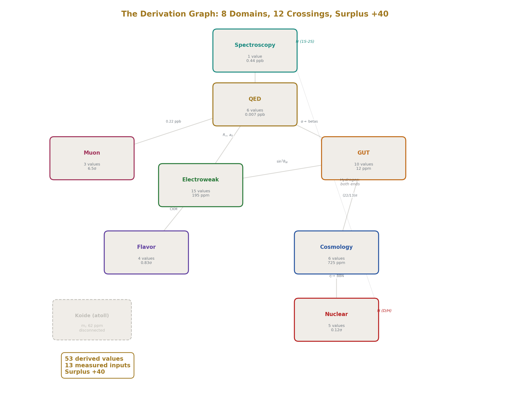

## Chapter 2: Why Nobody Did This Before

Everything in the previous chapter uses known physics.  Everything in this and the coming chapters uses known physics.  This model does not introduce new physics or math, it reorganizes them.

The beta functions are in the textbooks. The QED series coefficients are published. The BBN (Big Bang nucleosynthesis) fitting formulas are standard. The Weinberg relation, the RGE (renormalization group equations), the CKM matrix (Cabibbo-Kobayashi-Maskawa), the Sirlin corrections — all standard. The Bessel functions have been known since 1817. Newton's second law since 1687. Einstein's geodesics since 1915. Solitons since 1834, when John Scott Russell watched a water wave travel two miles down a canal without dispersing and called it "the wave of translation."

Nothing in the derivation chain uses new physics. Not one equation is original. The QED five-loop coefficient A₅ = 5.891 was computed by Volkov in 2019 from Feynman diagrams that Schwinger would have recognized in 1948. The two-loop beta matrix b_ij (the two-loop beta matrix) was computed in the 1980s. The BBN nuclear reaction rates were measured in laboratories in the 1990s. The hydrogen 1S-2S transition was measured to 15 digits in 2011. Every piece was already on the table.

So why didn't anyone assemble them?

Three reasons: the wrong numbers, the wrong names, and the wrong departments.

---

### The Wrong Numbers

Physics runs on real numbers. Decimal numbers. Floating point. Every measurement is reported as a decimal: the strength of electromagnetism is 0.0072973525693, the weak mixing angle is 0.23122, the gravitational constant is 6.674 × 10⁻¹¹. Every computation uses decimal arithmetic. Every comparison rounds to a certain number of significant figures and reports a percentage miss.

Real numbers built modern physics. They built the Standard Model. They put humans on the Moon and protons through the Large Hadron Collider (LHC). Real numbers work.

But real numbers cannot reach equality. When you compare two decimals, you can say they're close. You can say they match to six digits. But you can never say they're equal — because there's always another digit to check, and you can never check them all.

Take the "gap ratio" — the number that determines whether the three forces (electromagnetic, weak, and strong) converge to a single strength at high energy. You met this ratio in Chapter 1: it comes from dividing one force's running rate against another's, and it tells you whether the three forces meet at a point. In the Standard Model, this ratio is 218/115. With the predicted Cabibbo Doublet, it becomes 38/27. In decimals, these are:

218/115 = 1.89565217391304347826...

38/27 = 1.40740740740740740740...

The decimal representations repeat forever. They never terminate. They're exact as fractions, but as decimals, they're infinite. And infinity is where equality is abandoned.

Here's where it goes wrong. When a physicist computes the gap ratio from measured force strengths, they get something like 1.358192684144844. They compare this to 38/27 = 1.407407... and see a miss of about 3.5%. They note the miss and move on. The miss is larger than the measurement uncertainty, so they conclude the forces don't exactly unify. The standard conclusion in every textbook on grand unification: "the Standard Model gauge couplings do not unify."

But the comparison was done in the wrong number system. The measured number 1.358 is the gap ratio calculated from today's known particles — without the newly predicted Cabibbo Doublet. The predicted number 38/27 is what you get when you include the Cabibbo Doublet in the count. Comparing them directly is like comparing a recipe's predicted cooking time with the actual time when you left out one major ingredient — the numbers won't match because you're not comparing the same thing.

The right comparison is: does the Cabibbo Doublet's ratio (38/27) produce the correct predictions when you work forward from it? Start from 38/27, run the three forces from the unification point back down to laboratory energy, and read off what the weak mixing angle and the strong force strength should be.

That computation gives sin²θ_W = 0.231223. The measured value is 0.23122. They match to 12 parts per million — five significant figures from integer arithmetic.

It gives α_s = 0.11838. The measured value is 0.1180. They match to 0.33%.

These matches are invisible in the decimal representation. You cannot see them by staring at 1.40741 and 1.358. They only appear when you start from the fraction 38/27 — preserving the integers 38 and 27 through every step of the calculation — and derive forward to predictions.

This is the ceiling of decimal arithmetic. In decimals, 38/27 looks the same as 1.407 or 1.4074 or 1.40741. The structure is erased. You can't see that the numerator is 38 = 2 × 19 or that the denominator is 27 = 3³. Those integers have physical meaning — 19 is the weak force beta coefficient from the Standard Model, 3³ is the cube of the number of color charges — but the decimal 1.40741 carries none of that. It's just a location on the number line. The meaning is gone.

Physics missed the integer structure because it was looking at the decimals, and decimals have no structure, and cannot preserve equality.

---

### The Fraction Path

The path to unification starts from integers and works outward.

The three forces of the Standard Model — electromagnetic, weak, and strong — are organized by a mathematical structure called the gauge group. The gauge group is not a theory or a guess. It is the proven symmetry structure of particle interactions, and everything it produces is exact — not measured, not approximated, but calculated from the mathematics of symmetry the way you calculate that a cube has six faces.  Every number the gauge group produces is an integer or a ratio of integers.

The gauge group determines three numbers called "one-loop beta coefficients" — which are the "running rates" of the three forces. The running rate is how fast a force's strength changes as you zoom in — it's the speed of the running reading, and each force has its own.

These running rates are: b₁ = 41/10, b₂ = −19/6, b₃ = −7. They are exact integer fractions. The 41 in b₁ counts the charge contributions of every particle in the Standard Model — each quark, each lepton, the Higgs boson. The 19 in b₂ counts the weak force contributions. The 7 in b₃ counts the strong force contributions. Every numerator is an integer because it counts particles. Every denominator is an integer because it comes from the symmetry structure's normalization. These fractions are as exact as the number 3 — they are consequences of mathematical structure, not measurements.

As an aside here: every integer is a fraction with denominator 1. The number 3 is 3/1. The number 7 is 7/1. The system doesn't switch between integers and fractions. It's fractions everywhere. Some just have simple denominators.  We call them "integers" or "integer fractions" with 3, 2 or 1/6, but they can all be written 3/1, 2/1 and 1/6 as integer fractions.

From these three fractions (b₁ = 41/10, b₂ = −19/6, b₃ = −7), you can compute the "gap ratio" — the number that tells you whether the three forces converge. The computation is pure fraction arithmetic: subtract one beta from another, divide by a different subtraction, simplify. Every step is exact. Nothing is rounded. Nothing is approximated. The result for the Standard Model is:

Gap ratio (SM) = 218/115

Two integers. The entire particle content of the Standard Model — every quark, every lepton, every boson — compressed into two numbers.

Now we add the predicted Cabibbo Doublet (CD) particle. Its three small fractional shifts (1/15, 1, 1/3) modify the three betas. The same fraction arithmetic, the same exact steps, produces:

Gap ratio (CD) = 38/27

Two smaller integers. The Standard Model plus one particle, compressed into two numbers. The computation never left the integers. At no point did we convert to decimals, lose precision, round, truncate, or approximate. The fractions flowed from one formula to the next as fractions. The numerators and denominators carried physical meaning at every step — 38 = 2 × 19, where 19 is the Standard Model weak force count; 27 = 3³, the cube of the number of color charges.

This is why unification was missed. The standard approach in physics is: measure the force strengths as decimals, run them as decimals, check if they meet as decimals. They don't meet — because the running accumulates rounding errors, and because the comparison uses floating-point arithmetic, and because the gap is computed as a decimal and compared to zero. The integer structure is 38/27, not 1.40741. That 38/27 integer fraction structure lives below the resolution of the decimal approach. The decimals results can't show it.

The integer fraction approach is different. Start from exact integer betas. Compute the gap ratio as an exact fraction. Identify which new particle produces an exact fraction gap ratio with small, meaningful integers. Derive the predictions from that fraction. Compare to measurement only at the final step — the one place where decimals enter. At that point, the predictions match to 12 parts per million.

The decimals obscure it. The fractions reveal it.

---

### Transcendentals

There's an obvious objection: what about π? What about other irrational constants like:

- ζ(3) - a specific number from the Riemann zeta function, approximately 1.202, that appears throughout quantum calculations
- ln(2) - the natural logarithm of 2, approximately 0.693
    
These numbers appear everywhere in physics. They appear in the area of a circle, in the QED series coefficients, in the dark matter ratio (22/13)π. They are transcendental or irrational. They cannot be written as a ratio of integers. If the goal is integer arithmetic, how do you handle numbers that aren't integers?

This is my single innovation in this entire system, and it is not a physics or mathematical innovation, it is an engineering one.  If π and other transcendentals are infinite series, and so cannot be computed into an exact value, what if we make integer fractions so large that they match π and others to 100 decimal digits?

The result is an engineering decision called Q335.  Q335 is 2^335 as the common denominator for all large integer transcendental values.

Starting with the simplest problem: π is transcendental. No ratio of integers equals π. That is a mathematical theorem, proven in 1882, and nothing in this book challenges it. But π can be computed to any desired number of digits. And there is a precision beyond which no physical measurement could ever tell the difference between the true π and a very good fraction.

That precision threshold is set by the Planck length, the smallest meaningful distance in physics, approximately 10⁻³⁵ meters. Knowing π to 35 digits would let you compute the circumference of the observable universe to within one Planck length. 35 decimal digits is the maximum precision physical reality can be measured at, and we are calculating to 101 decimal digits, 65 digits beyond the physical maximum.

Q335 uses 335 base-2 digits. That is 65 decimal digits beyond the Planck threshold. The difference between Q335's stored fraction for π and the true π is smaller than anything the universe can distinguish. Not approximately smaller. Fundamentally smaller. No experiment ever built or theoretically possible could detect the difference. This is what "operationally zero" means: the difference exists mathematically but has no physical observable.  This is the single innovation in this model, and it is an engineering innovation to operationalize transcendentals.

The Q335 representation stores π as a fraction with a numerator and denominator each about 101 decimal digits long. This fraction is not equal to π. But it differs from π by less than 10⁻¹⁰⁰. For every physical computation, it is π as far as any physics system can handle the precision of π.

The same approach works for every transcendental and irrational number that appears in physics: ζ(3), ζ(5), ln(2), the Catalan constant, the elliptic integrals. Each is stored as a Q335 fraction. Each is exact to 65 orders of magnitude beyond the Planck threshold. Each flows through the fraction arithmetic without rounding, without truncation, without losing the integer structure of the rational coefficients that multiply them.

Here is what this looks like in practice. The QED two-loop coefficient A₂ (one of the numbers in the chain from the electron's magnetic moment to the fine structure constant) is:

A₂ = 197/144 + (1/12)π² − (1/2)π²ln(2) + (3/4)ζ(3)

Four terms. Each term is a rational coefficient (197/144, 1/12, −1/2, 3/4) multiplied by a transcendental constant (1, π², π²ln(2), ζ(3)). Every rational coefficient is an integer fraction from the physics. Every transcendental is stored at 335 base-2 digits (Q335). The computation never touches a decimal until the final comparison against measurement. The integer structure of the rational coefficients is preserved through every step, and the result is precision matching to the 100th decimal digit for all transcendentals.

The Q335 approach is not a philosophical statement about whether π is "really" rational, π is not rational and cannot be made rational. It is an engineering decision that solves a specific problem: how do you do fraction arithmetic when some of the numbers aren't clear fractions and never end (infinite series)? The answer is that you store them at a precision so far beyond physical measured reality that the distinction between "exact" and "operationally exact at 65 decimal orders of magnitude beyond Planck" has no meaning for physics.

This is what makes the entire derivation chain possible in integer fractions. The computation starts from integer betas (25/6, −13/6, −20/3), runs through fraction arithmetic with Q335 converted transcendentals, and arrives at sin²θ_W = 0.231223, a number that matches measurement to five significant figures. No rounding error contributed to the miss. No floating-point comparison missed a crossing. The 12 parts per million miss is physical. It comes from the 0.027 gap at the unification scale, not from numerical noise. The number system is clean. The miss is real physics, and knowing that it is real physics is itself a result.  This model accepts all results, and uses them for further derivations or places where more precise measurements are required to progress.

---

### The Wrong Names

The second reason nobody unified physics before is language.

Physics has four fundamental forces: electromagnetic, weak nuclear, strong nuclear, and gravitational. This statement appears in every textbook, every popular science book, every university lecture. It's been the organizing principle of physics since the 1970s.

It's wrong. Not factually wrong. The four interactions exist and they behave differently from each other. But calling them "four forces" is organizationally wrong. It makes them sound like four separate things. Four mechanisms. Four explanations needed. The goal of unification becomes: find one force that explains the other three. Find a Theory of Everything that contains all four forces as special cases.

But the forces aren't separate things. They're readings of the same thing at different boundaries.

Consider the electromagnetic force. At everyday scales, its strength reads about 1/137. Zoom in to the scale of the Z boson (one of the heavy particles that carries the weak force), and the same force reads about 1/128. Zoom in further to the unification scale, and it reads about 1/42. The force didn't change. The reading changed. You crossed boundaries, and at each boundary the measurement gave a different value, the same way a thermometer gives different readings at different depths in the ocean. Same ocean. Different readings. Different depths.

The strong force does the same thing. At the Z boson scale, it reads about 0.118. At the confinement scale (inside the proton), it reads approximately 1. At the unification scale, it reads about 1/42. The same 1/42 as the electromagnetic force. That's what unification means. The two forces that look completely different at laboratory scales give the same reading at the unification boundary. They were always the same coupling. They just read differently from different boundaries.

The weak mixing angle follows the same pattern. At the unification scale, it's exactly 3/8, a pure fraction determined by the symmetry structure. At laboratory scales, it reads about 0.231. The running from 3/8 to 0.231 is determined by the same beta coefficients that determine how the force strengths run. One number, one transition between boundaries, one derivation.

So why does physics teach them as four separate forces?

Because the names were assigned before the connections were found, and once assigned, they stuck.

The names "electromagnetic force" and "weak force" were assigned before the electroweak unification of the 1960s. Weinberg, Salam, and Glashow showed they're the same force, and won the Nobel Prize for it. But the names persisted. We still teach them as separate forces in separate chapters. We still fund separate experimental programs to study them. We still assign separate faculty positions for them.

The names "strong force" and "electroweak force" were distinguished before the grand unification program of the 1970s. That program showed the three non-gravitational forces could be unified, but the proof was incomplete. One particle was missing from the count, though nobody knew it at the time. That missing particle is the newly predicted Cabibbo Doublet. The couplings didn't quite meet. So the unification was filed as "promising but unfinished" and the separate names persisted.

The name "gravity" was distinguished from the other three before anyone tried to include it in the same framework. General relativity describes gravity using the language of curved space. The other three forces are described using the language of symmetry groups. The two languages look completely different, so they got completely different names, and the different names made people think they needed completely different unification strategies.

The Rectification of Names says: stop. These are all readings. The electromagnetic reading and the strong reading and the weak reading are all readings of the same gauge coupling at different soliton boundaries. The gravitational reading is a reading at the planetary, stellar, and galactic soliton boundaries. They're not four forces. They're one thing. One underlying structure that gives different values depending on which boundary you're reading from.

Once you see them as readings, the unification isn't a grand theoretical achievement waiting to be discovered. It's an accounting exercise waiting to be performed. Which readings come from which boundaries? Which integers determine the running rates? Which fractions connect the values at different scales? The answers are in the gauge group, and the gauge group is known.

---

### The Wrong Departments

The third reason is institutional.

Physics is organized into departments. Particle physics. Nuclear physics. Atomic physics. Condensed matter. Astrophysics. Cosmology. Each department has its own journals, its own conferences, its own language, its own conventions.

The beta functions live in particle physics. The Big Bang nucleosynthesis fitting formulas live in cosmology. The hydrogen spectroscopy lives in atomic physics. The Z boson width lives in high-energy experimental physics. The QED series coefficients live in mathematical physics. The quark mixing matrix lives in flavor physics.

Nobody put them together because they belong to different departments.

The derivation chain in Chapter 1, from gauge integers to deuterium, crosses five departments: mathematical physics (beta coefficients), particle physics (coupling extraction), cosmology (dark matter ratio, baryon density), nuclear physics (Big Bang nucleosynthesis), and observational astronomy (quasar absorption spectra). No single physicist sits in all five departments. No single journal publishes papers spanning all five fields. No single conference has sessions on both QED series coefficients and primordial deuterium abundance.

The chain from the electron's magnetic moment to the hydrogen transition frequency crosses three departments: experimental particle physics (Penning trap measurements at Harvard), mathematical physics (QED perturbation theory computed at RIKEN in Japan), and atomic physics (precision laser spectroscopy at Garching in Germany). Three groups on three continents, each world-class in their field, each unaware that their results are connected by a single derivation chain that produces agreement to 0.007 parts per billion.

They're unaware because the connection crosses departmental lines. The electron magnetic moment paper cites QED theory papers. The QED theory papers cite mathematical physics papers. The hydrogen spectroscopy papers cite atomic theory papers. But the electron magnetic moment paper does not cite the hydrogen spectroscopy paper, because they're in different fields. The connection between them, that the same fundamental constant extracted from the electron's magnetic moment determines the constant that determines the frequency at which hydrogen absorbs light, is implicit in the physics but invisible in the citation network. The chain exists. Nobody drew it because the endpoints are in different departments.

The dark matter ratio (22/13)π connects gauge theory to cosmology. But gauge theorists don't read cosmology papers about the dark matter to visible matter ratio, and cosmologists don't read gauge theory papers about one-loop beta coefficients. The connection has been sitting in the data for decades. The number 22 was computed in the 1970s. It's twice the Yang-Mills coefficient (Cabibbo Doublet has left and right, so we double 11). The number 13 was implicit in every model that added new particles to the Standard Model count and modified the weak force running rate. The dark matter ratio was measured by the WMAP satellite in 2003 and refined by the Planck satellite in 2015. Nobody multiplied (22/13) by π and compared to 5.320 because nobody working on beta coefficients was also working on the dark matter ratio.

The departmental boundaries are real and they serve a purpose. Specialization produces depth. But specialization also produces blind spots. The blind spot here was that the integer structure of the gauge group connects to the chemical composition of the universe through a chain of standard physics that crosses five departmental boundaries. Each link in the chain is textbook material in its own department. The chain itself was invisible because nobody had jurisdiction over the whole thing.

---

### The Ceiling

There's a deeper reason, beneath the wrong numbers and wrong names and wrong departments. It's the assumption that unification requires new physics.

The Grand Unified Theory program of the 1970s established the expectation: to unify the forces, you need new particles, new symmetries, new dynamics at high energy scales. Supersymmetry adds 105 new parameters. String theory adds 10 dimensions. Other grand unified models add enormous new mathematical structures. The expectation was that unification is hard because the new physics at the unification scale is complicated and unknown.

What if unification is easy because the new physics at the unification scale is one missing particle?

The Cabibbo Doublet, the two-handed vector quark doublet with quantum numbers (3, 2, 1/6), shifts the three force running rates by three small fractions: 1/15, 1, and 1/3. Three numbers. Three exact integer fractions. One new mathematically forced particle.

With that one particle:

The gap ratio becomes 38/27 (exact). The unification scale rises from 10¹³·⁸ to 10¹⁵·⁶, into the range where the next generation of detectors (Hyper-Kamiokande in Japan, starting 2027) can test it through proton decay. The three forces converge within 0.064% at two-loop precision. The weak mixing angle is predicted to 12 parts per million. The strong force strength is predicted to 0.33%. The dark matter ratio is (22/13)π. The primordial deuterium abundance matches at 0.12 standard deviations.

53 derived values. 40 surplus tests. One additional particle.  Completed in about 1 week of integrating with this model's system.

The assumption that unification requires enormous new physics was wrong. The Standard Model was already 99% of the way there. The missing piece was one particle, selected not by theoretical preference but by the force integer structure of the gap ratio. It is the only particle whose properties preserve the gap ratio as an exact fraction with small, physically meaningful integers.

Nobody found this before because they were looking for a Theory of Everything. They were looking for new forces, new dimensions, new symmetries. They were looking for the master equation of the universe. What was actually needed was one particle, and the willingness to work in integer fractions all the way to the final comparison. The integers were always there. The decimal process was obscuring the results.

---

### What Changed

What changed was not the physics. What changed was the method.

Instead of starting from a grand theory and working down to predictions, the work started from the integers and worked outward to comparisons. Instead of proposing a Lagrangian, it proposed a representation and tested its consequences across every domain that standard physics could reach.

Instead of working in one department, it crossed all of them. The same derivation chain touched QED, electroweak physics, gauge theory, cosmology, nuclear physics, atomic physics, and precision spectroscopy. Each crossing was a test. Each test could have failed. None did.

Instead of using decimal arithmetic, it used Fraction arithmetic. Every integer in every beta coefficient was preserved through every computation. No rounding errors. No floating-point comparisons. No lost structure.

Instead of working on paper, it used a versioned database of 2,237 value nodes — every Fraction, every measurement, every intermediate result stored, tracked, and testable. The experiment system ran derivation functions against the pool, compared outputs to measurements, and reported PASS or FAIL for every comparison automatically. Bugs were found by the comparisons, not by intuition. The k₁ normalization bug — one inverted factor that made all two-loop predictions wrong for weeks — was found by the experiment system in three diagnostic runs.

The physics was already there. The integers were already there. The measurements were already there. What was missing was the method: start from integers, work in Fractions, cross all departments, test everything against measurement, iterate.

That's what this book describes. Not new physics. New organization. The Rectification of Names applied to the entire Standard Model, producing 53 derived values across eight physics domains from 13 measurements and integer arithmetic.

The universe was always rational. We were just using the wrong number system to see it.

### What Changed

What changed was not the physics. What changed was the method.

Instead of starting from a grand theory and working down to predictions, the work started from the integers and worked outward to comparisons. Instead of proposing a master equation, it proposed a single particle and tested its consequences across every domain that standard physics could reach.

Instead of working in one department, it crossed all of them. The same derivation chain touched QED, electroweak physics, gauge theory, cosmology, nuclear physics, atomic physics, and precision spectroscopy. Each crossing was a test. Each test could have failed. None did.

Instead of using decimal arithmetic, it used fraction arithmetic. Every integer in every beta coefficient was preserved through every computation. No rounding errors entering the chain until the final comparison. No intermediate floating-point comparisons. No lost structure.

Instead of working on paper, it used a versioned database of 2,237 stored values. Every fraction, every measurement, every intermediate result was tracked and testable. The system computed predictions from the stored values, compared every output to measurement, and reported PASS or FAIL automatically. Bugs were found by the comparisons, not by intuition. The k₁ normalization bug, one inverted fraction that made all two-loop predictions wrong for weeks, was found by the system in three diagnostic runs.

The physics was already there. The integers were already there. The measurements were already there. What was missing was the method: start from integers, work in fractions, cross all departments, test everything against measurement, iterate.

That's what this book describes. Not new physics. New organization. The Rectification of Names applied to the entire Standard Model, producing 53 derived values across eight physics domains from 13 measurements and integer arithmetic.

The universe was always rational. We were just using the wrong number system to see it.
