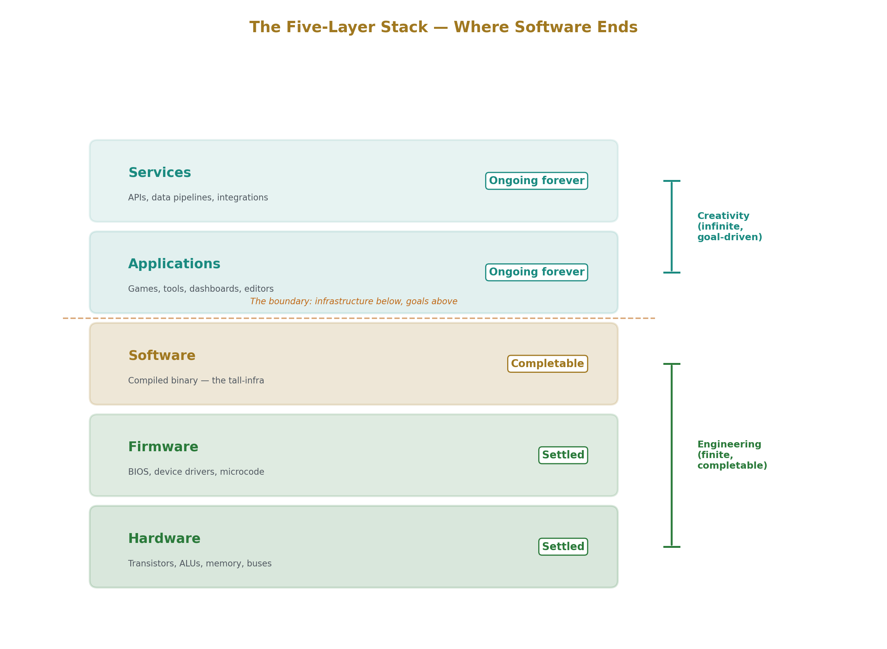
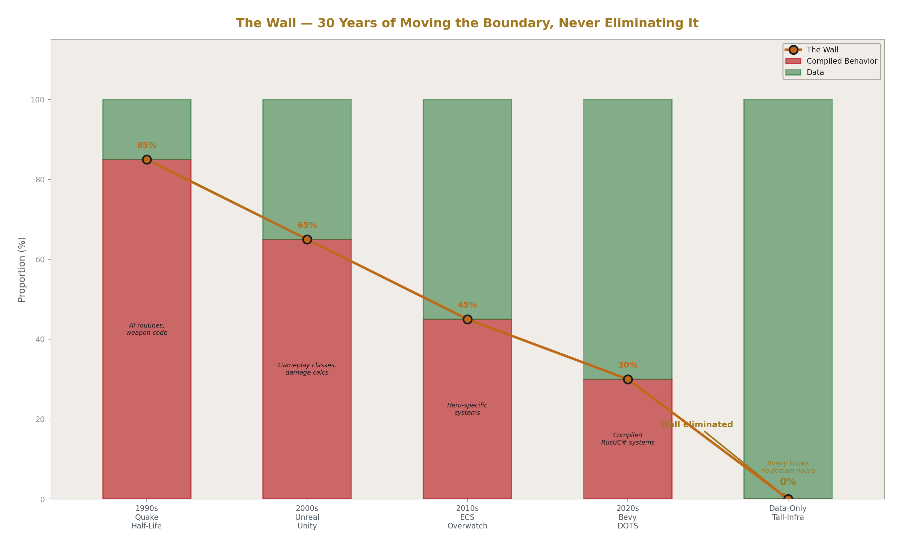
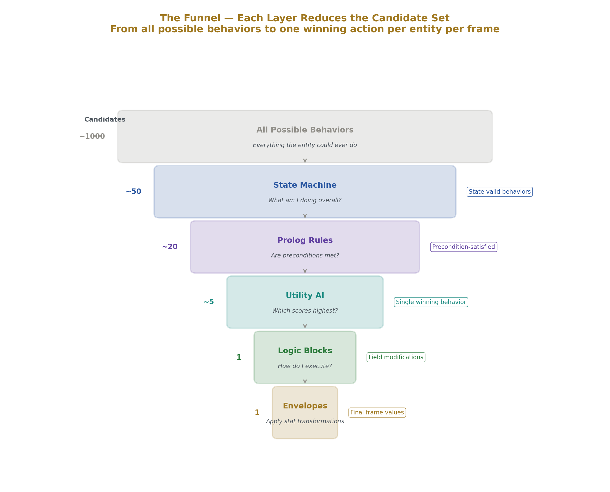
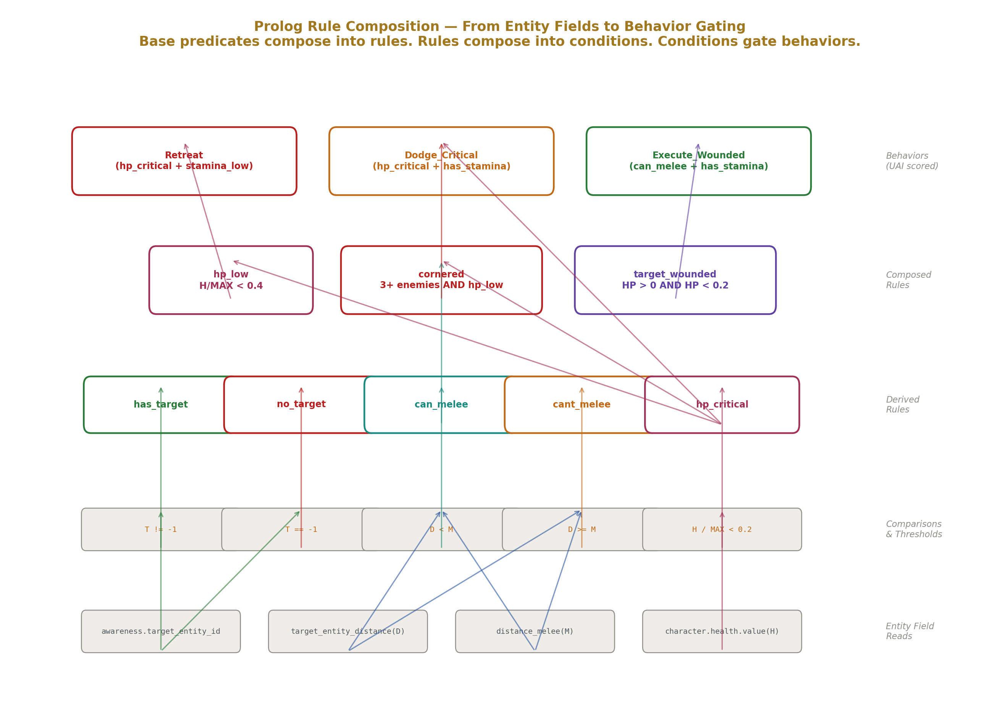
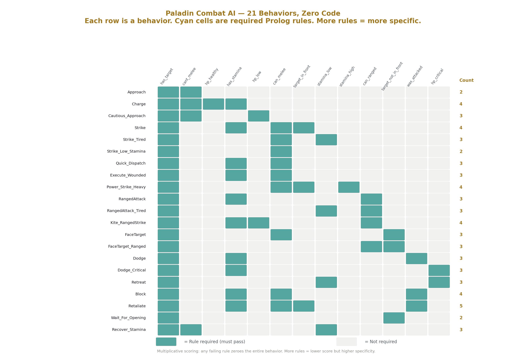
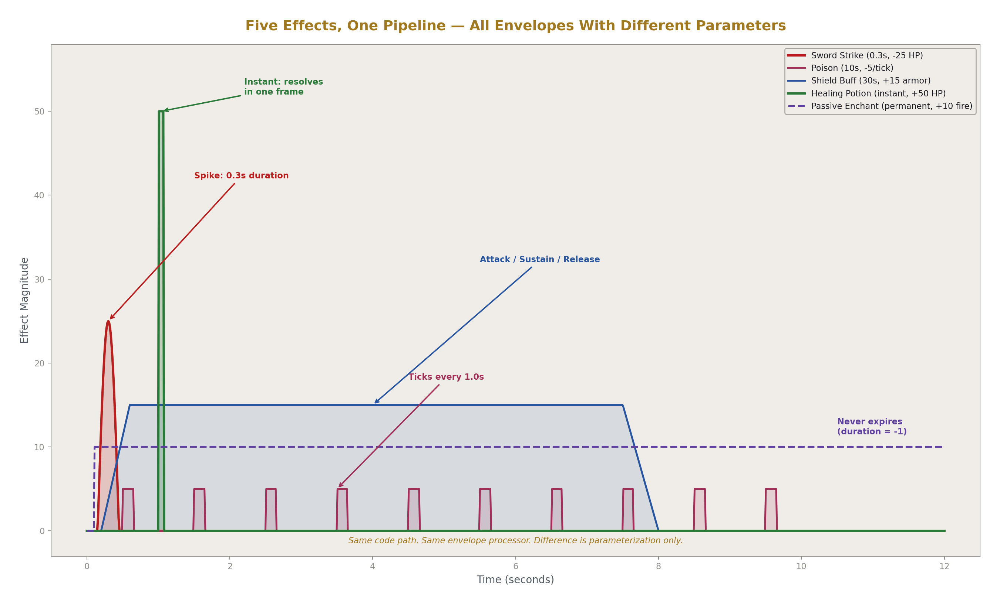
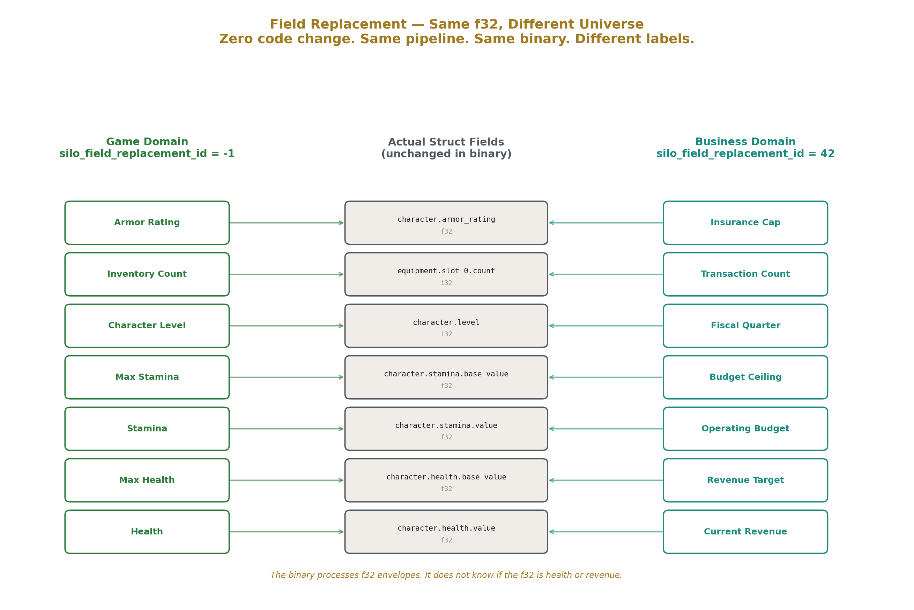
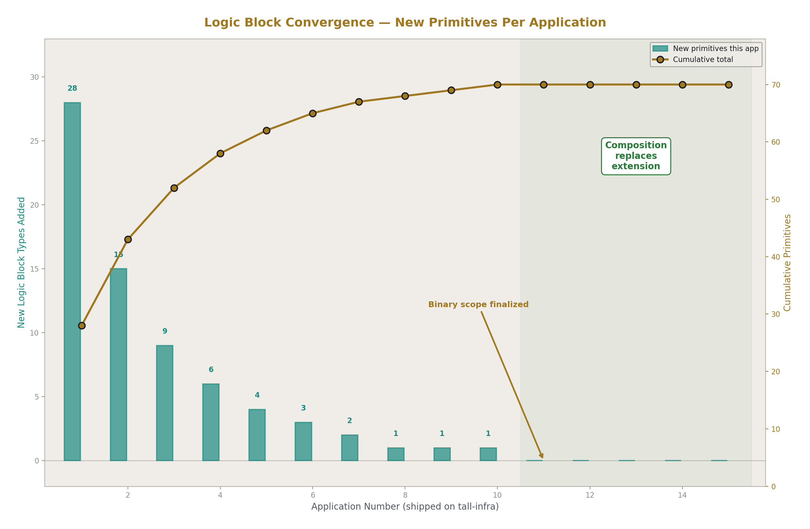

# Tall-Infra Data-Only Execution
## The End of the Software Layer Is in Sight

**Registry:** [@HOWL-COMP-10-2026]

**Series Path:** [@HOWL-COMP-1-2026] → [@HOWL-COMP-2-2026] → [@HOWL-COMP-3-2026] → [@HOWL-COMP-4-2026] → [@HOWL-COMP-5-2026] → [@HOWL-COMP-6-2026] → [@HOWL-COMP-7-2026] → [@HOWL-COMP-8-2026] → [@HOWL-COMP-9-2026] → [@HOWL-COMP-10-2026]

**DOI:** 10.5281/zenodo.20175816

**Date:** May 2026

**Domain:** Software Architecture / Systems Engineering

**Status:** Architectural Blueprint for Independent Implementation

**AI Usage Disclosure:** Only the top metadata, figures, refs and final copyright sections were edited by the author. All paper content was LLM-generated using Anthropic's Claude 4.5 Sonnet. 

---

### Abstract

This paper argues that the software layer — the compiled binary that sits between firmware and applications — has a completion condition. Like hardware and firmware before it, software infrastructure can be built, tested, finished, and closed. The industry has failed to recognize this because it has never cleanly separated infrastructure from application logic, fusing the two into binaries that must change every time a business goal changes. By building comprehensive infrastructure that processes arbitrary data transformations — using games as the maximal requirements domain — the compiled binary converges to a finished artifact. Applications become datasets interpreted by that infrastructure, not compiled code. What remains after completion is dataset authoring: a creative activity tied to human goals, running on a platform that never needs to change again.

---

### 1. The Five-Layer Stack

Modern computing rests on five layers:

**Hardware** — transistors, logic gates, arithmetic units, memory, buses. The physical substrate that moves bits.

**Firmware** — the software baked into hardware that maps its capabilities upward. BIOS, microcontroller code, device drivers at the lowest level.

**Software** — compiled binaries that run on hardware, managed by operating systems. The programs that transform data.

**Applications** — the things users interact with. Games, spreadsheets, chat clients, dashboards. Software configured or built to serve a specific human goal.

**Services** — applications that talk to each other. APIs, microservices, data pipelines. Structurally identical to applications, distinguished only by their audience being other software rather than humans directly.

Hardware is effectively settled. We have working processors, memory, storage, and networking. Improvements continue — faster, smaller, more efficient — but these are market maneuvers, not functional necessities. A 2015 server can do everything a 2025 server can do. The instruction set is stable. Nobody is trying to "solve" the CPU.

Firmware is settled in lockstep. It changes only when hardware changes. Once the hardware is stable, firmware is stable.

Applications and services are inherently ongoing. They track human goals, and human goals change daily. A business pivots, a market shifts, a user wants something new. This layer is supposed to change. It will never be "done" and should never be.

The software layer sits between these two resolved boundaries — stable substrate below, ever-changing goals above. The question this paper poses: is the software layer more like hardware (completable) or more like applications (inherently ongoing)?

The software industry implicitly assumes the latter. There is always a new language, a new framework, a new architecture pattern, a new paradigm. The assumption is that software is an open research frontier — that there is always more to discover, more to build, more to rearchitect.

This paper argues the opposite. The software layer is an engineering problem, not a research problem. Like building a bridge from Roman concrete, it can be designed, constructed, tested, and finished. The water flows across it forever. The bridge does not need to be rebuilt because someone wants to ship different cargo.

---

### 2. All Software Is Data Transformation

Consider the simplest program a student might write: read a number from the keyboard, convert it to Roman numerals, print the result.

This program is a pipeline. Data enters (a string from stdin), passes through a transformation stage (parse string to integer), passes through another (convert integer to Roman numeral representation), and exits (print to stdout). Input → transform → transform → output.

But the student doesn't build it that way. They start from `main()`. They open an empty file with a cursor blinking at line 1. The compiler wants syntax — expressions, statements, functions. So they start writing code, building upward from language primitives, trying to reach the pipeline. How do I read stdin? How do I handle the error if it's not a number? Should the conversion use a loop or a lookup table? The pipeline — the actual data flow — gets buried under implementation decisions that have nothing to do with the transformation itself.

This is bottom-up development: starting from code primitives and trying to build toward coherent data flow.

For the Roman numeral converter, the pipeline remains visible despite bottom-up construction because the program is simple enough. But scale this to a business application with hundreds of classes and services, and the pipeline disappears completely. Developers can no longer see the data flow. They add more code to manage complexity that only exists because the pipeline was never made explicit.

Mike Acton, in his influential work on Data-Oriented Design, made this observation at the hardware level: the CPU is a data transformation machine. It doesn't know what an object is, what a class hierarchy is, what a design pattern is. It moves data from one location to another, transforms it, and stores the result. Every abstraction built on top — object-oriented programming, service architectures, design patterns — is an attempt to organize data transformation. But these abstractions describe the code that performs the transformation, not the transformation itself.

Acton's insight was applied to performance: if you respect how the CPU actually processes data — cache-friendly layouts, structs of arrays, no pointer chasing — your code runs faster. But the insight extends far beyond performance. It is an architectural insight. It is a design insight. It is an insight about what software fundamentally is.

Every program, from the trivial to the complex, is a data transformation pipeline. A web server: request arrives, gets parsed, routed, processed, response constructed, sent. A business application: data enters from users or systems, gets validated, transformed, stored, queried, displayed. A game: input events arrive, AI evaluates decisions, physics updates positions, rendering draws frames. All of them: data comes in, flows through stages, gets transformed, goes somewhere.

The top-down alternative starts from the pipeline itself. What data enters? What stages does it pass through? What are the connections between stages? What comes out? Define the transformation chain first. Then write the minimum code to execute it. The code serves the pipeline, not the other way around.

---

### 3. The Wall

The game industry provides the clearest historical lens on the relationship between data and compiled behavior, because games have pushed hardest against the boundary between the two.

**The 1990s** — Quake, Half-Life. Data meant textures, sounds, and 3D models. Level geometry could be authored in external tools. But AI routines, weapon behavior, and level triggers were compiled into the binary. Want a new enemy type? Write C code, recompile.

**The 2000s** — Unreal Engine, Unity. Data expanded to include meshes, prefabs, material parameters, and editor-configured properties. Designers could adjust values in the editor without recompiling. But gameplay classes, damage calculations, and quest logic remained compiled code — C++ in Unreal, C# in Unity. Want a new mechanic? Write code, recompile.

**The 2010s** — Stingray, Overwatch's ECS. Entity-Component-System architectures separated data (components) from logic (systems). Components were pure data — position, health, velocity. But the systems that processed those components contained compiled behavior. Overwatch's ECS had hero-specific systems: Reinhardt's charge, Tracer's blink, Mercy's resurrect — all compiled. Want a new hero? Write a new system, recompile.

**The 2020s** — Bevy, Unity DOTS. Data became column-oriented component storage with archetype-based queries. Performance improved dramatically. But the systems that process components are still compiled Rust or C#. The behavior still lives in code.

Across three decades, a pattern emerges: the boundary between data and compiled behavior — call it "the wall" — moved steadily. More things became data over time. But the wall never disappeared. In every generation, compiled behavior existed somewhere in the binary. Every engine claimed to be "data-driven," and every engine preserved the wall.

Concrete examples make this vivid:

**Unity ScriptableObjects** — Unity promotes ScriptableObjects as a data-driven approach. Data lives in SOs, configured in the editor. But `class Goblin : MonoBehaviour` with an `Attack()` method is still compiled C#. New enemy types still require new classes.

**Unreal Data Tables** — Unreal offers Data Tables for configuration. But damage calculations, quest branching, and AI task trees are Blueprint graphs or C++ — compiled behavior with a visual interface. New mechanics require new node types.

**Overwatch ECS** — Often cited as a pure ECS architecture. But each hero has compiled systems with specific logic. The ECS processes data generically, but the behavior that makes Reinhardt different from Tracer is compiled code. New heroes require new systems.

**Factorio Prototypes** — Factorio separates prototype definitions (data) from runtime logic (code). Prototypes define what exists — items, recipes, entities. But combat AI, train pathfinding, and electrical network simulation are compiled. Prototypes describe what things are; code describes how they behave. New transport types require new code.

In every case, the claim is "data-driven." In every case, the reality is: data owns the nouns (what exists), code owns the verbs (how things behave). The wall between data and behavior is present in every system. It moved over thirty years. It never disappeared.

---

### 4. Data-Only Execution Defined

Data-only execution eliminates the wall entirely. The compiled binary contains zero gameplay types, zero domain nouns, zero behavioral logic. The binary is infrastructure only: state machine runners, predicate evaluators, utility scorers, effect processors, renderers, input handlers, audio players, network routers. It does not know what a goblin is, what a sword does, what health means, what a quest is, or what a fireball looks like.

The dataset teaches the binary everything, every frame. A dragon is not a compiled class — it is an entity row that references a state machine row, which references a behavior set row, which references skill rows with envelope parameters. The binary processes generic state machines, scores generic behaviors, and applies generic envelopes. The dataset provides the semantics.

This is distinct from data-driven development, which has been practiced for thirty years. Data-driven means: code owns the types, data owns the numbers. The programmer writes `class Sword : Weapon` with compiled attack logic; the designer adjusts damage values in a spreadsheet. The wall is present. Behavior is in code. Data tunes parameters of behavior that was already defined.

Data-only means: the binary forgets what a sword is. The dataset defines a world item with a skill set reference, and the skill set defines an envelope with a stat target, a modifier, a duration, and a curve. The binary applies the envelope without knowing it represents a sword strike. If the dataset changes the stat target from health to account_balance, the binary processes it identically. The semantics are entirely in the data.

The distinction can be tested with four questions:

**Can a designer add a living market economy without engineering involvement?** Not "tweak prices" but "create the economic system" — supply, demand, price discovery, merchant behavior, trade routes — entirely through data configuration. If engineering must write code, the wall is present.

**Can `stat.health` be repurposed as `bank_account.balance` with zero code change?** Same data type (f32), same envelope pipeline, different domain meaning. If repurposing requires code changes, the wall is present.

**Can every texture, sound, and behavioral rule be swapped while the executable runs?** Not hot-reload of compiled code, but replacement of data tables that take effect next frame. If any behavioral change requires recompilation, the wall is present.

**Does the compiled binary know any domain noun exists?** Search the source code for "goblin," "sword," "quest," "fireball." If any appear in compiled code as types, enums, or string comparisons that drive behavior, the wall is present.

Any "no" means the wall is present. The system may be data-driven — perhaps highly data-driven — but it is not data-only. Compiled behavior exists somewhere in the binary.

---

### 5. The DSP Architecture

The architecture that enables data-only execution borrows its core metaphor from digital signal processing. In audio DSP, sound is shaped by envelopes — time-bounded modifiers with attack, sustain, and release phases, applied through curves over duration. A synthesizer note, a reverb tail, and a compressor gain reduction are all envelopes applied to an audio signal. The DSP processor doesn't know what "music" is. It applies envelopes to signals.

The same principle generalizes to all gameplay — and, as this paper argues, to all application behavior. A sword strike is an envelope: duration ~0.3 seconds, immediate tick, target stat health, modifier -25, triggered on animation frame event. A poison effect is an envelope: duration 10 seconds, tick every 1.0 seconds, target stat health, modifier -5, linear curve. A shield buff is an envelope: duration 30 seconds, continuous, target stat armor_rating, modifier +15. A healing potion is an envelope: duration 0 (immediate), target stat health, modifier +50.

These are not four different systems. They are four parameterizations of the same pipeline. The infrastructure processes all of them identically: apply the modifier to the target stat, shaped by the curve, over the duration, at the tick rate. The difference between a sword and a poison is not code — it is data: different duration, different tick rate, different modifier, same pipeline.

The execution pipeline is a funnel. Each layer narrows the candidate set:

**Layer 1 — State Machine: "What am I doing overall?"** The state machine is pure topology — named states with transitions between them. A state contains no behavior code. It references a behavior set and defines exit conditions: events (animation finished, hit received), durations (minimum time in state), and Prolog rules (conditions evaluated each frame). The state machine determines which behaviors are available by selecting which behavior set is active.

**Layer 2 — Prolog: "Are the preconditions met?"** Prolog-style predicate logic evaluates rules against facts. Facts are regenerated every frame from entity state — does the entity have a target, what is the distance to the target, is health below 20%, how many enemies are in melee range. Rules compose these facts declaratively: `can_melee` requires `has_target_entity`, `target_entity_distance(D)`, `distance_melee(M)`, and `D < M`. The evaluator performs unification — it does not know what "melee" means. It matches predicates against facts.

**Layer 3 — Utility AI: "Which behavior scores highest?"** Available behaviors are scored multiplicatively. Each behavior has considerations — inputs normalized to [0,1], shaped by curves (linear, quadratic, sigmoid, exponential, boolean), weighted and multiplied together. Any consideration that evaluates to zero kills the entire behavior's score — a hard gate requiring no special logic. The highest-scoring behavior wins. Critically, behaviors with more considerations naturally score lower (more multiplications below 1.0) but are more specific. Specificity is self-balancing through the mathematics.

**Layer 4 — Logic Blocks: "How do I execute this?"** The winning behavior either triggers an action type (which flows into the equipment/skill/envelope chain) or executes a logic block stack — a stack-based bytecode interpreter with ~100+ block types for control flow, arithmetic, logic, and data access. The interpreter reads and writes entity fields via runtime-resolved paths. It cannot crash: invalid paths return default values, math operations clamp and saturate, array access is bounds-checked, and each block type has fixed input/output types that the editing UI enforces.

**Layer 5 — Envelopes: "Apply stat transformations."** The winning action produces envelopes — time-bounded stat modifications with curves. The envelope processor applies them each frame based on elapsed time. This is the DSP core: signals (stat values) modified by envelopes (time-bounded curve-driven transformations), processed by a single code path regardless of domain meaning.

The entire pipeline — state machine evaluation, predicate unification, utility scoring, bytecode execution, envelope application — is domain-agnostic. It does not know whether it is running a combat encounter, a crafting system, a weather simulation, or a bank transaction. The dataset provides the semantics. The pipeline provides the mechanics.

---

### 6. Scene as Application, SceneSet as Operating System

A **scene** is an isolated execution context. It contains its own entity pool, its own state machines and behavior sets, its own Prolog rule sets, its own time tracking, its own delta time, and — critically — its own `silo_field_replacement_id`.

Field replacement is the mechanism that makes the architecture domain-independent. Every entity has the same struct — the universal container. Fields like `character.health.value` (an f32) exist on every entity. The field replacement ID references a table that remaps these field labels to alternative domain terms. Set the replacement ID, and the UI displays `inside_account.last_month.revenue` instead of `character.health.value`. The data underneath is identical — the same f32, processed by the same envelope pipeline. Only the label changes. Health is revenue. Armor rating is insurance cap. Stamina is operating budget. No code change. No infrastructure modification.

Field replacement operates at two levels. The scene carries a default replacement ID. Individual entities can override it. Within a single scene, one entity might display its stats as health and mana while another displays the same struct fields as revenue and operating cost. Same pipeline, same frame, different domain semantics.

A **SceneSetItem** wraps a scene in a process container. It controls:

- **Windowing** — maximized, minimized, floating with a draggable rectangle, z-ordering for layering, focus for input routing.
- **Time** — `update_speed` scales delta time per scene. A game runs at full speed (1.0), a dashboard updates slowly (0.1), a background process runs at zero when minimized.
- **Permissions** — `allow_read_scene_ids` and `allow_write_scene_ids` control which scenes can access this scene's data. `allow_read_paths` and `allow_write_paths` filter access to specific data paths within the scene. Both scene ID and path must match. Default is deny-all.
- **Cross-scene data sharing** — `SceneToSceneActorClone` subscribes one scene to another's entity data, filtered by path globs, at a configurable frame rate. A debugging tool can observe a running game's entity state without the game granting write access.

The **SceneSetManager** manages all active scenes. It is, structurally, a window manager and process scheduler. Multiple scenes run simultaneously in the same binary — a game, a data browser, a performance monitor, a debugging tool — each with its own isolated data, its own update rate, its own permissions.

This is not a metaphor. This is literally an operating system. The binary is the kernel. Scenes are processes. The SceneSetManager is the process scheduler and window compositor. Inter-scene communication is permission-gated IPC. The security model — fixed-size data paths, whitelist-based access control, no pointer sharing, no arbitrary memory access — is process isolation.

The implication is that the binary can host arbitrary numbers of applications simultaneously. Ten thousand scenes, each with its own field replacements and entity configurations, all running in the same process, managed by the same scheduler, isolated by the same permission system. A game, a spreadsheet, a chat client, and a business dashboard coexist because there is nothing to conflict — they are different datasets flowing through the same domain-agnostic pipeline.

No bottom-up software architecture can achieve this, because bottom-up software compiles domain types into the binary. A spreadsheet application has spreadsheet types. A game has game types. Combining them means merging codebases or building an abstraction layer — which is building an operating system on top of an operating system. The data-only architecture skips this entirely. The binary already is the operating system. It never compiled any domain types. Applications are datasets that teach it what to be.

---

### 7. The Completion Checklist

If the software layer is completable, the completion condition must be concrete and falsifiable. It is derived from the maximal requirements domain: real-time games.

Games are chosen not because the goal is a game engine, but because games impose the maximum simultaneous requirements on a general-purpose data transformation platform. A game requires real-time rendering, real-time animation, real-time audio, real-time input handling, real-time AI decision-making, real-time physics and collision, real-time networking, real-time UI with layout and interaction, and all of this within a frame budget — typically 16.67ms at 60 frames per second. No other application domain demands all of these simultaneously.

If the infrastructure handles all of these as data-driven subsystems, then anything simpler than a game is a subset that is already covered. A business dashboard needs UI and data binding. A chat application needs UI, networking, and input. A database tool needs UI, query processing, and serialization. None of these stress the infrastructure in ways the game did not already stress it.

The checklist:

**Rendering** — any image, animation, or visual effect can be drawn. Sprite layers, frame sets, bone-point attachments, render layer ordering, camera management. For 2D, this is a bounded set of operations. 3D extends it with skeletal animation, materials, and lighting, but the architecture remains the same — more data in the entity's visual system, not more code.

**Animation** — frame sequences driven by content data, with events that trigger gameplay effects. Animation is not a separate system — it is content frames played in sequence, with frame events that propagate into the envelope pipeline.

**Audio** — sounds triggered by state changes, animation events, or direct entity field changes. Spatial audio positioned by entity transforms. Mixing, volume, looping — bounded operations on audio buffers.

**Input** — gamepads, keyboards, mice, touch screens. All produce the same thing: an input event with a source, a type, and a value. The infrastructure maps physical inputs to entity data paths via binding tables. The pipeline does not care what generated the event.

**UI and Layout** — declarative layout rules that produce positioned, sized rectangles. Box model with margin, padding, and border. Flex and grid layout. Text flow and wrapping. Scroll containers. Input routing to focused elements. State updates that feed back into entity data, driving new UI next frame. This is what a browser's layout engine does, expressed as data-driven rules rather than compiled HTML/CSS parsing.

**Text Editing** — cursor position (an i32 index), selection range (two i32s), keyboard event handling for movement and editing. Multi-line editing extends this vertically. Syntax highlighting as a parallel style array. Copy/paste as buffer operations. A bounded set of operations that, once implemented, covers every text editing need from chat input to code editors.

**State Management** — state machine evaluation, transition conditions, forced actions. Already core to the pipeline.

**AI Decision-Making** — Prolog rule evaluation, utility AI scoring, behavior selection. Already core to the pipeline.

**Physics and Collision** — velocity integration, spatial queries, collision detection and response. Bounded algorithms operating on entity transform data.

**Networking** — fixed-size packet ingress and egress, path-based routing, permission-gated access control. The wire carries data into entity fields; entity fields produce data onto the wire. The infrastructure handles transport. Wire format (JSON, XML, YAML, binary) is a logic block utility — a compiled function invoked by data configuration.

**Threading** — NUMA-aware work distribution, exclusive entity ranges per thread, barrier synchronization. No locks, no contention, no shared mutable state during frame computation.

**Serialization** — fixed structs serialize trivially. No object graphs, no pointer chasing, no schema versioning. Data in, data out.

**Debugging and Tracing** — per-entity per-frame structured traces: state before and after, all behavior scores with per-consideration breakdowns, logic block execution with inputs and outputs, stat diffs. Query the trace in domain terms, not memory addresses. Blue/green frame replay: pause, examine, modify rules, replay the same frame, compare outcomes.

**Query and Live Editing** — path-based query language against the runtime data tree. Set statements that modify live data. Auto-refresh polling. Re-entrant safe results. The development tool and the runtime speak the same language because they both read and write the same data tree.

**Tooling** — tools are scenes. A data browser is a scene. A debugger is a scene. A profiler is a scene. A level editor is a scene. All built on the same infrastructure they inspect, running alongside the application they observe.

Every item on this list is a bounded engineering task. None of them are open research problems. None of them grow with application complexity. And once each one is implemented, tested, and its bugs are fixed, it is done — in the same way a bridge is done. It carries traffic forever.

The checklist is falsifiable: if any item requires unbounded work, the thesis fails. The claim is that none of them do.

---

### 8. Logic Blocks as the Miscellaneous Drawer

The DSP pipeline — state machines, Prolog, utility AI, envelopes — handles approximately 95% of all application behavior. Entities evaluate transitions, satisfy preconditions, score behaviors, and apply stat modifications through the standard flow. No code is invoked. No compiled functions are called. The pipeline is purely data-driven.

The remaining 5% consists of operations that do not fit the standard flow but are nonetheless necessary. These are utility operations — data reshaping tasks that are too specific to bake into the universal pipeline but too fundamental to express as compositions of pipeline primitives.

The canonical example is wire format conversion. The tall-infra handles networking: fixed packets, ingress and egress, path-based routing. But the wire format — JSON, XML, YAML, MessagePack, Protocol Buffers — is a per-scene choice. The infrastructure does not pick a format because no single format is universally correct. So logic blocks provide compiled functions: `WrapJSON`, `UnwrapJSON`, `WrapXML`, `UnwrapXML`. Each is a compiled function in the binary. The data layer selects which one to invoke based on scene configuration.

This is the "miscellaneous drawer" of the instruction set. Every CPU ISA has one — byte-swapping instructions, bit manipulation operations, specialized arithmetic that doesn't fit neatly into the standard ALU pipeline but needs to exist. The drawer is finite because the number of data types is finite and the number of ways data needs to be reshaped is finite.

The critical discipline is that logic blocks are not available from day one of application development. The methodology requires shipping multiple complete applications — games, tools, dashboards — with zero logic blocks, forcing everything through the standard pipeline. This accomplishes two things: it proves the pipeline is as complete as possible, and it ensures that developers learn to think in data flow rather than reaching for escape hatches.

Only after multiple applications have shipped with zero logic blocks does probing begin: what genuinely cannot be expressed through the state machine → Prolog → utility AI → envelope flow? What requires a compiled utility function? The answers are discovered empirically, not speculatively.

The convergence signal is observable. Early in the build-out phase, new logic block types are added frequently because the infrastructure is young. By the 5th application, the rate slows. By the 10th, it approaches zero. New applications stop requiring new primitives because they compose existing ones. When composition replaces extension, the drawer is full and the binary's scope is finalized.

---

### 9. One and Only One Implementation

The software industry cannot enforce a simple rule: one and only one implementation per capability.

React implements text input. Angular implements text input. Flutter implements text input. SwiftUI implements text input. Every game engine implements text input. They are all solving the same bounded engineering problem — cursor position, selection range, keyboard event mapping — and they are all solving it independently, with independent bugs, independent edge cases, and independent maintenance burdens.

Multiply this across every capability — layout, serialization, networking, state management, authentication, audio playback, animation, input routing — and the result is the modern software industry: millions of engineers reimplementing the same finite set of solved problems, perpetually.

Open source attempted to address this with shared libraries. It did not succeed because libraries have APIs, APIs have versions, versions have incompatibilities, and the compiled behavior boundary means implementations cannot be swapped without recompiling everything above them. Dependency conflicts — "dependency hell" — are the direct symptom of the inability to enforce one implementation.

Frameworks attempted to address this by providing canonical implementations and asking developers to build on top. They did not succeed because frameworks impose their own compiled behavior assumptions — lifecycle hooks, state models, data flow conventions — and applications eventually conflict with those assumptions.

The data-only architecture enforces one implementation structurally. There is one text input implementation in the tall-infra. Every scene, every entity, every application uses the same one. When cursor selection is fixed, it is fixed everywhere, for everything, permanently. There is no version. There is no API. There is no dependency. There is only the infrastructure, and it works.

When a bug is found in the Prolog evaluator, it is fixed once. Every application on every scene benefits immediately. This is not a theoretical advantage — it is a structural guarantee of the architecture. Traditional software has per-application vulnerabilities requiring per-application fixes. Data-only infrastructure has per-infrastructure vulnerabilities requiring one-time fixes that protect all consumers.

This is what "done" means in practice. Not "done for this project." Not "done for this release." Done. One implementation, correct, tested, permanent. Then the capability is never revisited, and all attention moves to what the application should actually do.

---

### 10. The Completion Condition

The full picture has three layers:

**Layer 1: Pipeline primitives.** State machine evaluation, Prolog unification, utility AI scoring, envelope processing, rendering, animation, audio, input, UI layout, text editing, physics, collision, networking, threading, serialization, scene management, tracing, query, tooling. These are the main flow of the infrastructure. Each is a bounded engineering task. The set is enumerable, buildable, testable, and completable.

**Layer 2: Logic block utilities.** Wire format converters, special data reshaping operations, edge-case transformations that do not belong in the main pipeline. Discovered through real usage across multiple shipped applications. The set converges empirically as new applications stop requiring new primitives.

**Layer 3: Datasets.** Applications, services, games, tools, dashboards, editors. The things humans want to build and use. Defined entirely as data configurations — entities, states, transitions, rules, behaviors, envelopes, field replacements. This layer is infinite because human goals are infinite. It will never be complete. It is not supposed to be.

Layers 1 and 2 are engineering. They are finite. They converge. They complete.

Layer 3 is creativity. It is infinite. It changes daily. It is the reason the platform exists.

The methodology for reaching completion:

**Build games first.** Games impose the maximal requirements. If the infrastructure runs a real-time action game with AI entities, multiplayer networking, animated sprites, spatial audio, gamepad input, and UI overlays — all at 60 frames per second with headroom — it can run anything simpler.

**Then prove generalization.** Build 10 or more applications across different domains: games of different genres, business tools, dashboards, editors, communication apps. Each application exercises the infrastructure in different combinations, revealing missing primitives and boundary cases.

**Fix all bugs.** The surface area is finite. Each subsystem has bounded scope. Bugs are found and fixed permanently. The count converges to zero because the functionality is fully exercised across many datasets.

**Verify performance and security.** Threading utilization above 95% per core. NUMA-aware placement with zero cross-node traffic during frame computation. Geometric security: fixed-shape structs, constrained fields, path-based access control. The worst case for any input — a developer's live edit, a designer's mistake, or an attacker's crafted packet — is the same: values clamped to min/max, processed through the pipeline, producing bounded behavior that cannot crash, corrupt, escalate, or exfiltrate.

**Close the binary.** The infrastructure is complete. The instruction set is fixed. No more primitives, no more logic block types, no more compiled functions. The binary becomes infrastructure in the same way a CPU is infrastructure: a fixed transformation engine that interprets arbitrary datasets.

The 10,001st application does not change the binary, any more than the 10,001st program changes the x86 instruction set.

---

### 11. The End of Software

The five-layer stack, revisited with completion status:

**Hardware** — done. Improvements continue but are optional refinements, not functional necessities.

**Firmware** — done. Changes only when hardware changes.

**Software** — completable. The tall-infra binary has a finite scope defined by the maximal requirements domain. It can be built, tested, finished, and closed.

**Applications** — ongoing forever. Tied to human goals, which change daily.

**Services** — ongoing forever. Applications that communicate. Structurally identical to applications.

Three layers that are finished (or finishable). One layer that is alive forever, and correctly so. The entire middle of the industry — the layer that employs millions of developers writing, testing, deploying, patching, and rewriting compiled behavior — collapses into a finished artifact.

This does not mean the end of computation. It does not mean the end of applications. It does not mean the end of creative work. It means the end of software development as the industry currently practices it: the endless cycle of compiling behavior into binaries that never stabilize because they fuse infrastructure with application logic.

The activity that remains is dataset authoring. Defining entities, configuring state machines, writing Prolog rules, setting up behavior sets with utility considerations, parameterizing envelopes, arranging UI layouts, mapping field replacements. This is similar to programming — it requires logical thinking, data-relational reasoning, and understanding of how the pipeline processes configurations. But it is not software development. It cannot produce syntax errors. It cannot crash. It cannot introduce security vulnerabilities. It cannot regress previously working functionality. The failure mode is misalignment — the dataset describes something other than what the author intended — and the debugging tool is the structured trace, not the stack trace.

The reduction is severe. What would require twenty thousand lines of compiled code in a traditional engine requires roughly five hundred lines of data configuration in the tall-infra system. And those five hundred lines operate in a fundamentally different failure regime: they can be wrong, but they cannot break.

The software industry has spent fifty years treating its central problem as unsolvable — an infinite frontier of complexity requiring permanent engineering effort. But the problem was never infinite. The infrastructure layer is finite. Human goals are infinite, and they were always supposed to be addressed by data, not code. The confusion arose because the two layers were never separated cleanly enough to observe that one of them has a completion condition.

The tall-infra data-only architecture separates them. The infrastructure converges, stabilizes, and finishes. The datasets change freely, endlessly, safely. The bridge is built. The water flows.
