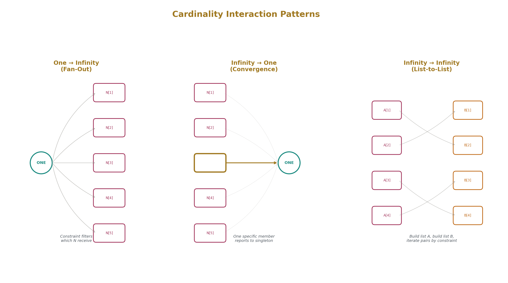
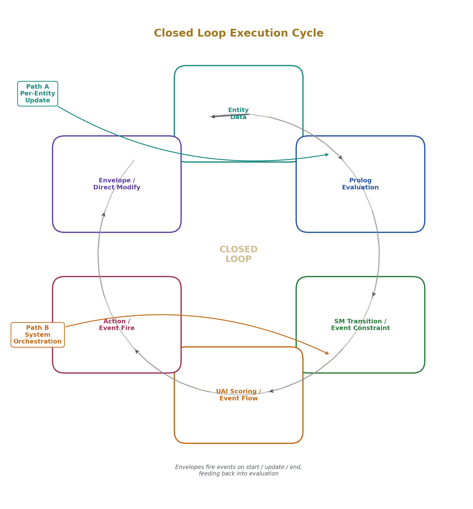
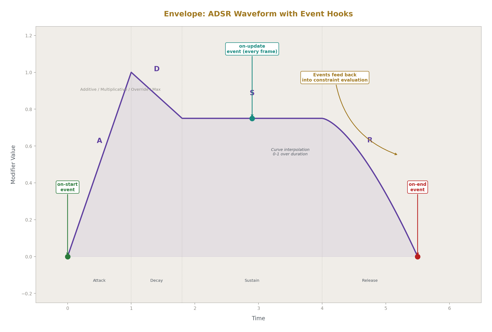
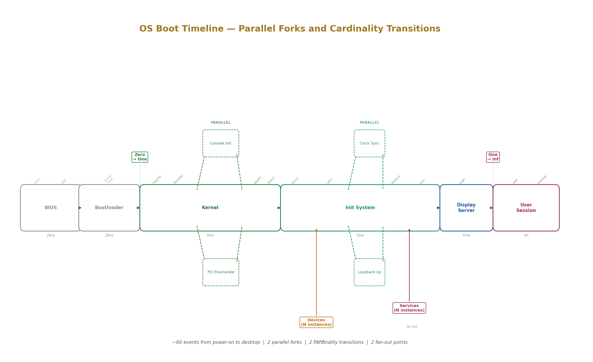
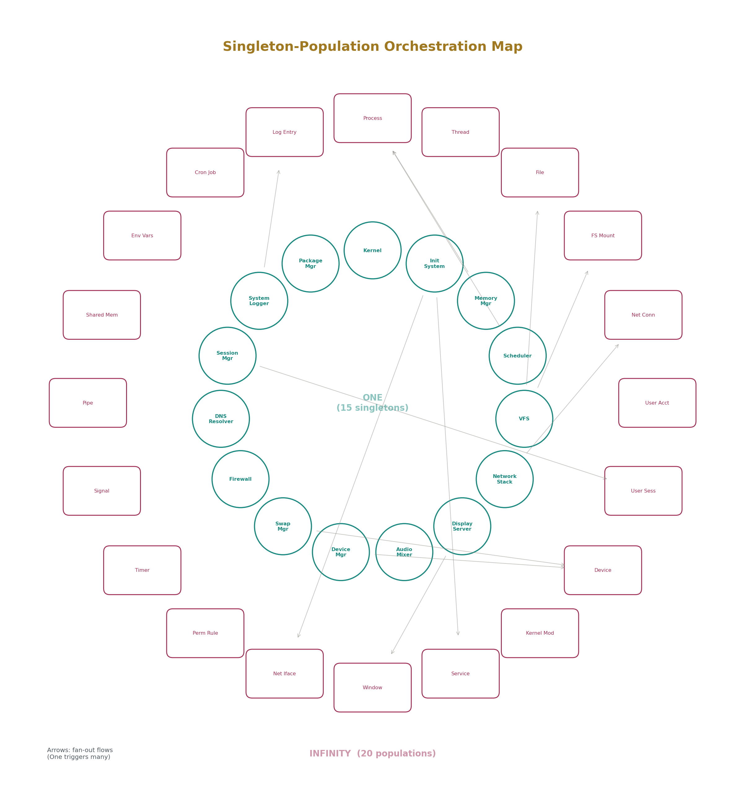
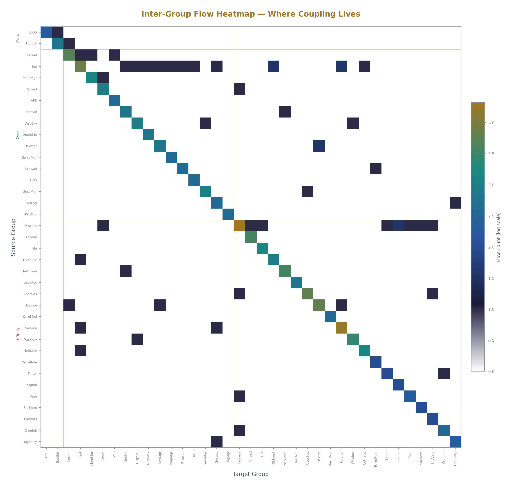
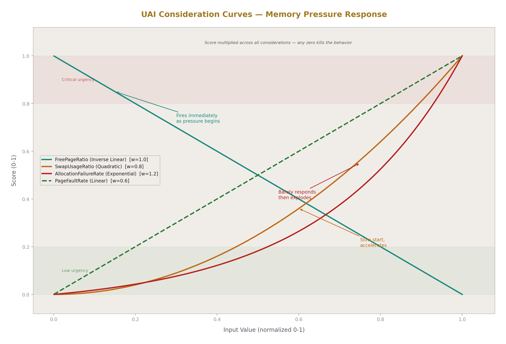
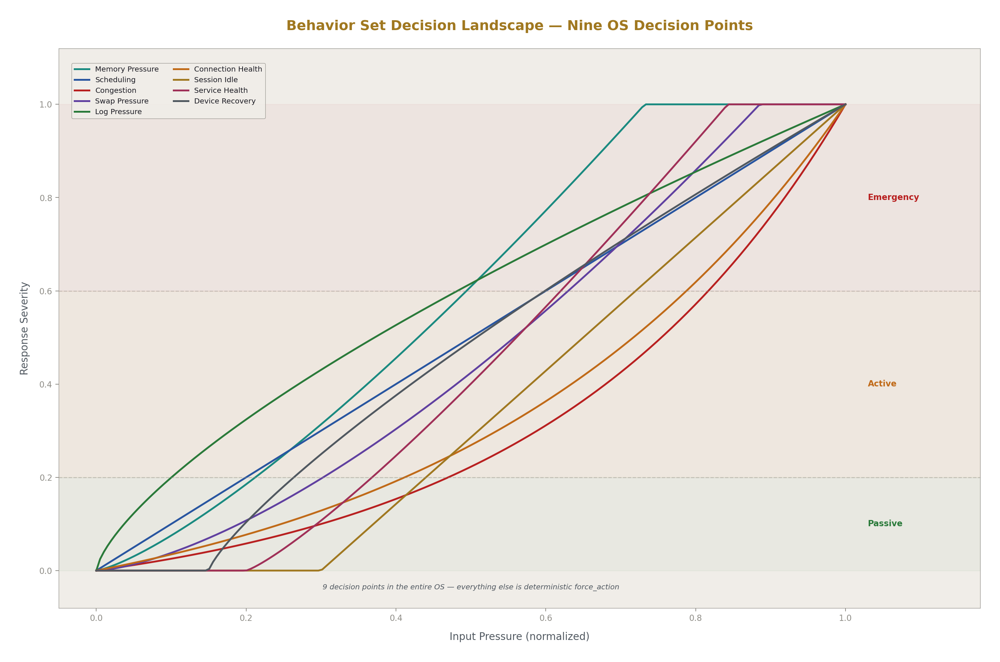

# Closed Loop Architecture
## A Complete OS in Four Flat Lists

**Registry:** [@HOWL-COMP-12-2026]

**Series Path:** [@HOWL-COMP-1-2026] → [@HOWL-COMP-2-2026] → [@HOWL-COMP-3-2026] → [@HOWL-COMP-4-2026] → [@HOWL-COMP-5-2026] → [@HOWL-COMP-6-2026] → [@HOWL-COMP-7-2026] → [@HOWL-COMP-8-2026] → [@HOWL-COMP-9-2026] → [@HOWL-COMP-10-2026] → [@HOWL-COMP-11-2026] → [@HOWL-COMP-12-2026]

**DOI:** 10.5281/zenodo.20615398

**Date:** June 2026

**Domain:** Software Architecture / Systems Engineering

**AI Usage Disclosure:** Only the top metadata, figures, refs and final copyright sections were edited by the author. All paper content was LLM-generated using Anthropic's Claude 4.5 Sonnet. 

---

### 1. The Problem With Partial Views

Most software design methods produce partial views of a system. A class diagram shows structure but not behavior. A sequence diagram shows one interaction path but not all of them. A state diagram shows one component's lifecycle but not how it connects to others. Each diagram is a projection — it takes the full system and flattens it onto one plane, discarding information in the process. Understanding the system means mentally reassembling these projections into a coherent whole. This reassembly is where designs break, where assumptions diverge between team members, and where implicit dependencies hide until they surface as bugs in production.

The root cause is that projection-based methods divide the system by *view type* rather than by *what the system contains*. You get a structural view, a behavioral view, a data view — each cutting across every component. No single artifact tells you everything about one component, and no single artifact tells you everything about the system from any one angle.

Closed Loop Architecture takes a different approach. Instead of projecting a system onto multiple partial views, it slices the system into four flat lists. Each list is complete from its own angle. The union of all four lists is the complete system. Adding a new slice — a new component, a new feature — means adding entries to the four lists. The existing entries do not change. The new entries interact with existing ones only through declared references, never through implicit coupling. The specification is closed under addition: you can grow it without opening it up.

This paper describes the method, demonstrates it by specifying a complete operating system, and examines what the specification reveals about OS design that was not previously visible.

---

### 2. The Four Lists

Closed Loop Architecture specifies a system using four data structures, written in order, each building on the previous one. They are flat lists — not trees, not graphs, not diagrams. Each entry in each list is a small record with a few fields. The entire specification of a non-trivial system fits in a single document readable in an afternoon.

**List 1: EntityGroups.** Every noun in the system, with a cardinality. The cardinality has three values. Zero means the noun exists as a concept in the system's vocabulary but has no runtime representation — it is named so the specification is complete, but no code manages it. One means exactly one instance exists at runtime — a singleton. Infinity means a population of instances exists at runtime, with members created and destroyed dynamically. An EntityGroup entry is a name and a cardinality. Nothing more. The full set of EntityGroups is the system's ontology — every thing the system knows about, categorized by how many of that thing exist.

**List 2: EventSets.** Every verb in the system, tied to the EntityGroup it belongs to. An event is something that happens to or within a specific kind of thing. Each event carries custom data — whatever information the event needs to deliver. The events belonging to an EntityGroup form that group's lifecycle: how instances of that kind of thing come into existence, change state, interact with other things, and cease to exist. The full set of events across all groups is everything that can happen in the system.

**List 3: EventFlows.** The ordering relationships between events. A flow is a record saying: after this event, that event can follow. Flows can be linear (A then B), branching (A then either B or C), parallel (A enables both B and C simultaneously), fan-out (one event triggers many instances of another), convergence (many instances of one event enable a single other event), or cyclic (A and B repeat). Flows exist within a single EntityGroup (intra-group) and between different EntityGroups (inter-group). The full set of flows is the system's complete behavior — every possible sequence of events, readable by walking the flow declarations.

**List 4: EventConstraints.** The conditions under which each event is allowed to fire. A constraint is a set of logical conditions evaluated against the data of the entities involved. If the conditions pass, the event can fire. If they fail, the event is blocked. Constraints reference entity data — the fields and states of the things in the system. For a singleton (One cardinality), the constraint reads the one instance's data directly. For a population (Infinity cardinality), the constraint binds a variable to a specific member and tests that member's data, functioning as a filter over the population. For a concept with no runtime instance (Zero cardinality), the constraint can only test whether other events have fired — there is no entity data to read.

These four lists — what exists, what happens, in what order, under what conditions — are the complete specification. Every behavior of the system is traceable through them. Every gap is visible by inspection: an EntityGroup with no events has no lifecycle. An event with no flows is disconnected. An event with no constraint fires unconditionally, which is either intentional or a specification error.

---

### 3. Cardinality as Architecture

The three cardinalities — Zero, One, Infinity — appear to be a minor bookkeeping detail. They are not. They determine the fundamental interaction patterns of the system, and they do so mechanically, without design decisions.

**Zero** declares the boundary between what the software knows about and what it manages. A concept with Zero cardinality appears in the specification, participates in event flows, and has events — but no code creates, updates, or destroys instances of it. It exists so that the specification is complete. Consider firmware in an operating system: the OS does not manage the BIOS, but the BIOS performs actions that the OS must account for. Naming it with Zero cardinality means the specification includes the BIOS's events and their flows into the rest of the system, without pretending the OS has a BIOS entity to manage. Zero is not "optional" — it is categorically not instantiated. It can never become One or Infinity. It is the state of a named concept that the system references but does not implement.

**One** declares a singleton — a unique instance that exists for the lifetime of the system. Singletons are typically orchestrators, managers, or shared resources. The kernel is one. The scheduler is one. The filesystem layer is one. They coordinate and manage other things.

**Infinity** declares a population. Processes, files, network connections, devices — these are populations. Members are created and destroyed. The system manages N of them at any time, where N changes.

When two EntityGroups interact, their cardinalities determine the interaction pattern:

One interacting with Infinity is always fan-out or convergence. A singleton event triggers events on multiple members of a population (fan-out: the init system starts each service), or a specific member of a population reports to a singleton (convergence: a critical service failing triggers an init system event). The singleton addresses the population through constraint filtering. The population member addresses the singleton directly — there is only one.

Infinity interacting with Infinity is list-to-list. Build a list of matching members from population A, build a list of matching members from population B, iterate. A device becoming ready triggers the corresponding service to start. Both are populations, both filtered by constraint.

Zero interacting with anything is pure event sequencing. There is no entity data to query, no instance to address. The only constraint possible is whether prior events have fired.

These patterns are not designed. They are consequences of the cardinality declarations. The developer declares "there is one scheduler" and "there are many processes" and the interaction pattern — the scheduler fans out to processes, processes converge back to the scheduler — falls out automatically.

---

### 4. The Execution Pipeline

A specification is inert without a runtime that executes it. Closed Loop Architecture connects to an execution pipeline with two paths that share a common mechanism.

**The entity data model.** Everything in the system that has a runtime instance (One or Infinity cardinality) is represented as an entity — a flat collection of optional subsystems. An entity can have a transform (position, velocity), a character system (stats, health, progression), an awareness system (proximity tracking), a combat system, a crafting system, a needs system, and roughly twenty-five others. Every entity has the same shape. Subsystems not relevant to a particular entity are inactive. All entity data is available for logical evaluation.

**Path A: the per-entity update.** Each entity has a state machine. Every tick, the state machine evaluates its transitions by testing logical rules against the entity's own data. If a transition's conditions pass and a minimum time in the current state has elapsed, the entity moves to a new state. The new state either forces a specific action (deterministic — the state dictates exactly what happens) or contains a behavior set that scores multiple possible actions using utility AI. The utility AI evaluates considerations — each one a logical gate combined with a normalized, curved, weighted score derived from entity data. Scores multiply across considerations, so any zero kills a behavior entirely. The winning behavior triggers an action. Actions flow through a skill chain that produces envelopes.

**Envelopes.** An envelope is a time-bounded modifier on entity data. It is a full signal envelope — attack, sustain, decay, release — with curve interpolation from start to end. It can modify a stat continuously over time (damage that ramps up along a curve), or function as a boolean toggle (a buff that is on then off). It can execute logic every tick, not just modify a number. Crucially, an envelope has three event hooks: it fires an event when it starts, an event every frame it is active, and an event when it ends. These events feed back into the system. A poison effect creates an envelope that fires a damage event every frame. A shield buff fires an expiration event when it ends. The envelope is both a write mechanism and an event source.

**Path B: system-level orchestration.** Events fire when their constraints pass. Event flows determine what fires next. Events carry custom data. Events can trigger state machine transitions, create envelopes, spawn entities, or modify state directly. This path handles everything that is not a per-entity tick update — system lifecycle, initialization sequences, cross-component coordination, error handling.

**The closed loop.** Entity data is evaluated by logical rules. Rules determine state transitions and event firing. Transitions and events trigger actions. Actions produce envelopes. Envelopes modify entity data over time and fire events. Events feed back into the constraint evaluation. The loop is: data → evaluation → decision → action → data change → evaluation. Both paths read through the same logical evaluation. Both paths write through envelopes or direct modification. Both paths produce events. The system is closed — there is no external control flow, no imperative orchestration, no ad-hoc logic. Every decision bottlenecks through declared rules evaluated against declared data.

---

### 5. Worked Example: The Operating System

A computer powers on. Hardware initializes itself and selects a boot device. A bootloader loads the kernel into memory. The kernel initializes memory, discovers hardware, and mounts the root filesystem. An init process starts system services. A display server presents a login screen. The user authenticates and arrives at a working desktop.

Seven sentences. From these, Closed Loop Architecture produces four lists that specify the entire system. What follows walks through each list and the process of constructing it.

---

### 6. List 1: What Exists

The first step is naming every noun in the system and assigning its cardinality. This requires answering one question per noun: does the software manage zero, one, or many of this thing?

**Zero cardinality — concepts with no runtime entity.** The BIOS performs the power-on self test, enumerates hardware, selects a boot device, and hands off to the bootloader. The OS does not manage the BIOS. It does not create a BIOS entity, update its state, or track its lifecycle. But the BIOS's actions matter — they are preconditions for everything that follows. Naming the BIOS with Zero cardinality means its events exist in the specification, its flows connect to the rest of the boot sequence, but no code implements a BIOS subsystem. The same applies to the Bootloader — it executes before the OS exists.

**One cardinality — singletons.** The Kernel is one instance. The Init System is one. The Memory Manager, Scheduler, Virtual Filesystem, Network Stack, Display Server, Audio Mixer, Device Manager, Swap Manager, Firewall, DNS Resolver, Session Manager, System Logger, and Package Manager are each one. These are the orchestrators and shared resources of the OS. There is exactly one of each for the lifetime of the system.

**Infinity cardinality — populations.** Processes are a population. So are Threads, open Files, Filesystem Mounts, Network Connections, User Accounts, User Sessions, Devices, Kernel Modules, Services, Windows, Network Interfaces, Permission Rules, Timers, Signals, Pipes, Shared Memory Regions, Environment Variable Sets, Cron Jobs, and Log Entries. These are the managed things — created and destroyed dynamically, with the system handling N of them at any time.

The complete EntityGroup list for the OS contains 37 entries: 2 Zero, 15 One, 20 Infinity. This is the entire ontology. Every thing the OS knows about is on this list. If something is missing, it will be discovered when writing the events — a verb without a noun means a missing EntityGroup.

The first structural insight is already visible. The OS is 15 singletons managing 20 populations. The fundamental pattern is orchestrators coordinating populations. This ratio — roughly equal numbers of singletons and populations, with singletons doing the coordination — is the shape of the OS.

---

### 7. List 2: What Happens

Each EntityGroup gets its events — every state change that instances of that group can undergo. Events are written by reading the specification and extracting every verb-noun pair, then assigning each to its owning group.

**Zero groups have events that describe what happens conceptually.** The BIOS has five events: Power On Self Test, Hardware Enumerated, Boot Device Selected, MBR Loaded, Bootloader Transferred. The Bootloader has seven: Stage1 Loaded through Control Transferred. These events exist in the specification, participate in flows, and have constraints — but they describe things happening outside the software's control. They are the system's awareness of its context.

**One groups have events describing their lifecycle and operations.** The Kernel has thirteen events covering entry, memory initialization, hardware discovery, filesystem mounting, module loading, and the panic case. The Init System has fifteen events covering its orchestration sequence from process start through network configuration, plus a failure event. The Memory Manager has eleven events covering initialization, allocation, freeing, compaction, reclamation, OOM triggering, and degradation states. Each singleton's events tell the complete story of what that singleton does.

**Infinity groups have events describing the lifecycle of individual members.** A Process has sixteen events: Created, Forked, Exec, Ready, Running, Blocked, Sleeping, Resumed, Syscall, Page Fault, Signal Received, Yielded, Exited, Zombie, Waited, Terminated. A Service has fourteen events covering start, run, health check, degradation, failure, restart, reload, stop, and escalation. A Device has twelve events from discovery through driver loading, initialization, self-test, readiness, error, suspension, and removal.

Each event carries custom data — the specific information that event delivers. Process Created carries the PID and parent PID. Device Discovered carries the device ID, bus type, vendor ID, and product ID. Kernel Panic carries a reason string. The data is specific to each event, not a universal carrier.

**The compression effect.** In a flat event list without EntityGroups, each service would need unique events: SSH Started, Cron Started, Dbus Started, Network Manager Started. With EntityGroups, the Service group (Infinity cardinality) has generic lifecycle events — Service Start Requested, Service Started, Service Running, Service Failed — and the specific service (SSH, Cron, Dbus) is identified by the entity instance, not by the event name. Nine unique names become three generic event types on a population. The cardinality does the work that naming was doing manually.

The complete EventSet for the OS contains approximately 311 events across all 37 groups. This is everything that can happen in the system.

---

### 8. List 3: In What Order

Event flows declare the ordering relationships between events. They answer: after this event fires, what can happen next?

**Intra-group flows are mostly simple.** The BIOS events flow in strict linear sequence — POST, then enumerate, then select, then load, then transfer. The Bootloader is the same. The Kernel is mostly linear with one parallel opportunity: console initialization and PCI bus enumeration can happen simultaneously after the timer starts, and both must complete before block device discovery. The Init System is mostly linear with a similar parallel section: clock synchronization and loopback interface bring-up can happen simultaneously after swap is enabled.

Infinity groups have richer intra-group flows because their members have lifecycle state machines. A Process flows from Created to Ready to Running, with branches to Blocked, Sleeping, and back to Ready, eventually flowing to Exited, Zombie, Waited, and Terminated. A Service flows from Start Requested through Started, Running, and the health check cycle, with branches to Degraded, Failed, Restart, and Stop. These flows are the same for every member of the population — the specific instance is determined by constraint, not by flow.

**Inter-group flows reveal the real architecture.** The inter-group flows are where the system's structure becomes visible. They follow the cardinality patterns described earlier.

Zero to Zero: the BIOS's last event (Bootloader Transferred) flows to the Bootloader's first event (Stage1 Loaded). Pure sequencing between two concepts the OS doesn't manage.

Zero to One: the Bootloader's last event (Control Transferred) flows to the Kernel's first event (Kernel Entered). This is the moment the OS begins to exist. A concept hands off to a real entity.

One to One: the Kernel's Root Switched event flows to the Init System's Process Started event. The Init System's DNS Resolver Configured flows to the Display Server Started. These are singleton-to-singleton handoffs — one orchestrator completing a phase and enabling the next.

One to Infinity (fan-out): the Init System's Runlevel Determined event flows to Service Start Requested — not for one service, but for every service in the runlevel. One event on a singleton fans out to N events on a population. The Device Manager's Started event flows to Device Discovered for every detected hardware device. The Scheduler's initialization enables Process Created. These fan-outs are where singletons create and manage their populations.

Infinity to One (convergence): a specific Device entity reaching Ready flows back to the Kernel's Root Filesystem Mounted — but only if that device is the root disk. A specific Service entity reaching Running (the logging service) flows to the System Logger becoming fully operational. These are population members reporting back to singletons. The constraint filters which member triggers the convergence.

Infinity to Infinity: a Device entity reaching Ready triggers a Service entity starting (the GPU device enables the display driver service). A Process creating triggers Thread creation within it, File opening by it, Pipe creation by it. A Timer firing triggers a Cron Job executing. These are cross-population interactions, both sides filtered by constraint.

The complete flow list for the OS contains approximately 349 entries. Reading these flows from beginning to end, starting at BIOS Power On Self Test and following every path, tells the complete story of how the OS boots, runs, and manages its components. No code is needed to understand the system's behavior — the flows are the behavior.

---

### 9. List 4: Under What Conditions

Event constraints are logical conditions that must pass before an event can fire. They are expressed as rules evaluated against entity data, using a logic programming model where facts about the system's current state are tested against declared conditions.

**Zero group constraints are trivial.** The BIOS and Bootloader events have no entity data to test. Their constraints are purely: did the previous event complete? BIOS Hardware Enumerated fires when BIOS Power On Self Test has completed. Bootloader Stage2 Loaded fires when Stage1 Loaded has completed. This confirms what Zero cardinality means — these concepts have no state to query, only event ordering.

**One group constraints read entity data.** The Kernel's Block Devices Discovered event requires that both Console Initialized and PCI Bus Enumerated have completed — this is the join point for the parallel section. But it also requires that the root device is ready, which is a fact about a Device entity (Infinity cardinality). The One singleton reaches into the Infinity population to test a specific member's state. The Init System's Filesystems Mounted event requires that all filesystem checks passed — a derived fact aggregated across the Filesystem Mount population. The Init System's Network Interfaces Configured requires that at least one network interface exists, reading from the Network Interface population. Singleton constraints routinely cross EntityGroup boundaries, querying populations to make orchestration decisions.

**Infinity group constraints bind Self.** Every constraint on a population event begins by binding a variable to the specific entity instance being evaluated. A Service's Running event requires: this service entity exists, it has started, and its first health check passed. A Device's Ready event requires: this device entity exists and its self-test passed. A Process's Blocked event requires: this process entity exists and it is waiting on a resource. The Self-binding is what makes population constraints work — the same constraint definition applies to every member, but evaluates against each member's individual data.

**Cross-group constraints express the real dependencies.** The Init System's Swap Enabled event requires that filesystems are mounted (an Init System event) and that the swap device is ready (a Device entity's state). The Display Server's Started event requires that Init has completed DNS configuration and that the GPU device is ready. A Service Start Requested requires that the service's dependencies — other services — are already in the Running state. These cross-group constraints make every dependency between subsystems explicit and visible. In a traditional OS codebase, these dependencies are implicit in function call chains, callback registrations, and initialization ordering buried across hundreds of source files. In CLA, they are individual entries in a flat list.

The complete constraint list contains approximately 311 entries — one per event. Reading the constraints for any event tells you exactly what must be true in the system before that event can fire. Reading all constraints for a single EntityGroup tells you every condition that affects that group's lifecycle. Reading all cross-group constraints tells you the complete dependency structure of the system.

---

### 10. States, Actions, and Decision Points

With the four lists complete, the next step is assigning each EntityGroup its state machine — the states it can occupy, the actions it performs in each state, and whether those actions are deterministic or scored by utility AI.

**Most EntityGroups use deterministic actions.** The Kernel has seven states (Unloaded through Panic) and twelve actions (InitializePageTables, StartMemoryManager, BuildInterruptTable, and so on). Every state has a forced action — the state dictates exactly what happens, with no decision-making. The Init System is the same: fifteen deterministic actions driven by state. The VFS, Display Server, Audio Mixer, Device Manager, DNS Resolver, Session Manager, and Package Manager are all deterministic. They respond to events and execute the one appropriate action for their current state.

Most Infinity groups are also deterministic. Process, Thread, File, Pipe, Shared Memory Region, Signal, Timer, Permission Rule, Kernel Module, Filesystem Mount, Window, Network Interface, Environment Variable Set, Cron Job, and Log Entry all have states and actions driven entirely by events from other groups. They do not make autonomous decisions. They are acted upon.

**Exactly nine EntityGroups have behavior sets — places where the system must choose between alternatives.** The Memory Manager has a pressure response behavior set: when free pages are low, it scores whether to do nothing, compact memory, reclaim cached pages, swap out, or invoke the OOM killer, based on considerations like free page ratio, swap usage, and allocation failure rate. The Scheduler has a scheduling decision behavior set: it scores whether to continue the current process, preempt it, rebalance across CPUs, migrate a process, or adjust priorities, based on run queue length, CPU load imbalance, time slice exhaustion, and whether interactive or real-time processes are waiting. The Network Stack scores congestion responses. The Swap Manager scores pressure responses. The System Logger scores buffer management. Network Connections score health responses. User Sessions score idle policy. Services score health monitoring. Devices score error recovery.

Nine behavior sets in the entire operating system. Nine places where the system weighs multiple options using scored considerations. Everything else — every other EntityGroup, every other state, every other action — is deterministic.

---

### 11. What the Specification Reveals

Constructing the four lists produces insights about OS design that are not visible in source code, in documentation, or in traditional design artifacts.

**The OS has exactly nine decision points.** Before this enumeration, the assumption is that an operating system is complex decision-making throughout. It is not. Nine behavior sets, nine places where the system weighs options. The rest is mechanical state transitions. The complexity of an OS is overwhelmingly sequencing — getting things to happen in the right order — not deciding what to do.

**Almost all decision-making is resource pressure response.** Memory pressure, swap pressure, network congestion, log buffer pressure, connection health, device error recovery. The OS reacts to exhaustion. The utility AI considerations in these behavior sets are almost all ratio-of-capacity measurements: free pages over total pages, swap used over swap total, drop rate, buffer occupancy. The intelligence of an OS is pressure management.

**The only user-facing decision is session idle policy.** Out of nine behavior sets, one faces the user — deciding when to dim the screen, lock the session, or suspend. The rest are internal resource management invisible to anyone using the system. The OS makes almost no decisions that a human would perceive as a choice being made.

**Zero-cardinality groups are real architectural components.** The BIOS and Bootloader are part of the OS specification but have no runtime entities. Traditional OS design either ignores them (they are "not the OS") or awkwardly includes them. Zero cardinality makes them first-class members of the specification — complete with events and flows — without forcing fake runtime representations. The specification is complete because Zero lets you name what you do not manage.

**The fundamental pattern is singletons orchestrating populations.** Fifteen singletons, twenty populations. The Scheduler manages Processes. The VFS manages Files and Filesystem Mounts. The Device Manager manages Devices. The Network Stack manages Connections. This is obvious in hindsight but is never stated this cleanly in traditional design artifacts because class hierarchies and module boundaries obscure the singleton-population relationship.

**Populations are passive.** Process, Thread, File, Pipe, Shared Memory, Signal, Timer, Permission Rule, Kernel Module, Filesystem Mount, Window, Network Interface, Environment Variable Set, Cron Job, Log Entry — all purely reactive. They have state machines, but every transition is driven by events from singletons or from other populations. They never autonomously decide anything. Complexity does not scale with entity count. A million processes are not complex. The one scheduler is complex.

**Failure handling is structurally identical to normal operation.** Device Failed, Service Failed, Kernel Panic — these are states in the same state machine, with the same flow and constraint mechanism. The error recovery behavior sets use the same utility AI scoring as normal operation. There is no separate "error handling architecture." Failure is just another state with transitions and constraints. This means failure paths receive the same completeness guarantee as success paths — if the state exists, it has events, flows, and constraints.

**Inter-group flows expose the actual dependency architecture.** The fan-out from Init to Services and Devices, the convergence from specific Devices back to the Kernel, the cross-population flows between Devices and Services — these structural dependencies are invisible in source code, where they are spread across subsystem boundaries and encoded in function call chains. In the flow list, they are individual entries, each one a declared relationship between two events in two groups.

**Cross-group constraints are where coupling lives.** Every place where one EntityGroup depends on another's data is visible as a constraint entry. The Init System reading Device states to decide when to mount filesystems. The Display Server requiring GPU readiness. Service start requiring dependency services to be running. In a traditional codebase, these dependencies are implicit. In the constraint list, they are explicit, enumerable, and auditable.

**The entire OS is approximately 1,000 entries across four lists.** Thirty-seven EntityGroups, 311 events, 349 flows, 311 constraints. This is the complete specification of an operating system from power-on to desktop, including boot sequencing, hardware management, process lifecycle, networking, display, audio, user session management, error handling, and all cross-subsystem dependencies. Readable in an afternoon. Not a diagram. Not a codebase. Four lists.

---

### 12. Closedness

The defining property of Closed Loop Architecture is that the specification is closed under addition. Adding a new component to the system means adding entries to the four lists. The existing entries do not change.

Consider adding Bluetooth support to the OS. This means adding one EntityGroup (Bluetooth Adapter, Infinity cardinality), its events (Adapter Discovered, Adapter Initialized, Device Paired, Device Connected, Data Transferred, Device Disconnected, Adapter Failed), its intra-group flows (Discovered through Initialized through Paired and the pairing lifecycle), its inter-group flows (Device Manager discovery fans out to Bluetooth Adapter Discovered; Bluetooth Adapter Ready converges to enable the Bluetooth Service), and its constraints (Adapter Discovered requires Device Manager running and Bluetooth hardware detected; Device Paired requires adapter initialized and pairing credentials valid).

None of the existing 37 EntityGroups change. None of the existing 311 events change. The existing flows and constraints are untouched. The new Bluetooth group interacts with existing groups — Device Manager, Service — through new flow entries that reference existing events, and new constraint entries that query existing entity data. The interaction surface is declared and visible. The Bluetooth addition cannot introduce implicit dependencies, cannot alter the Init sequence, cannot affect the Memory Manager's pressure response. It can only declare new flows from and to existing events and new constraints that read existing entity data.

This closedness comes from the architecture's constraints on interaction. EntityGroups do not share state. They interact through two mechanisms only: event flows (declared ordering) and constraint evaluation (logical queries against entity data, which are read-only). There is no shared mutable state between groups. There is no callback registration. There is no global event handler that might intercept events meant for other groups. Every interaction between groups is an entry in the flow list or the constraint list, visible by inspection.

Contrast this with adding Bluetooth to a traditional OS architecture. The Device Manager module needs modification to recognize Bluetooth hardware. The service management system needs a new service definition. The network stack may need protocol extensions. The power management system needs to know about Bluetooth power states. The user settings interface needs Bluetooth configuration. Each of these modifications touches existing code, creates new implicit dependencies through function calls and shared data structures, and risks introducing bugs in components that were previously working. The blast radius of the addition is unbounded and must be tested empirically.

In CLA, the blast radius is bounded by the new entries. The existing entries are unchanged. The specification of the pre-Bluetooth system is a strict subset of the post-Bluetooth system. This is what it means for a specification to be closed under addition.

---

### 13. The Specification-Execution Bridge

The four lists specify what the system does. The execution pipeline, described in [@HOWL-COMP-1-2026], runs it. The bridge between specification and execution is direct because both sides use the same primitives.

EntityGroups map to entity definitions in the runtime. Each entity is a flat bag of optional subsystems with known struct shapes. The EntityGroup's cardinality determines allocation strategy — singletons are pre-allocated, populations use pooled allocation.

Events map to entries in the entity's event system. Each event fires through the runtime's event processing, carrying its custom data. The event's EntityGroup determines how the runtime resolves which entity or entities are involved — singletons are direct references, populations require constraint evaluation to select members.

Flows map to the orchestrator's sequencing logic. The orchestrator walks flows, checking each target event's constraints, and fires events whose constraints pass. Parallel flows are evaluated concurrently. Branching flows are evaluated in declaration order with the first passing branch taken. Fan-out flows iterate over the population applying constraints to each member.

Constraints map to logical rules in the runtime's rule evaluation system. The rules reference entity data through the same fact-based query mechanism used by state machine transitions and utility AI considerations. There is one query mechanism, used everywhere.

The gap between specification and running software is the action logic behind each event — the code that executes when the event fires. The four lists tell you what every action is, what data it receives, what must be true before it runs, and what happens after it completes. The action implementation is the mechanical work of writing the code behind each name. Everything else — the sequencing, the gating, the cross-group coordination, the lifecycle management — is already specified in the lists and already executable by the pipeline.

---

### 14. Relationship to Name Driven Development

Closed Loop Architecture extends Name Driven Development [@HOWL-COMP-11-2026]. NDD says: name every state change before writing code. The names become the specification, the architecture, the task list, and the documentation simultaneously. Implementation is the mechanical process of writing the action behind each name.

CLA adds structure to the names. NDD produces a flat list of events grouped by domain. CLA organizes those events into four related structures: what owns each event (EntityGroups), how events sequence (Flows), and what gates each event (Constraints). The NDD event list is CLA's List 2 — but now it has context.

The key addition is the EntityGroup and its cardinality. NDD names events but does not formally declare what things exist in the system or how many. The developer's grouping of events into domains (BIOS, Kernel, Services) implies ontology but does not make it explicit. CLA makes it the first step — before naming events, name the things the events happen to, and declare how many of each thing exist. This single act determines the interaction patterns for the entire system.

The other addition is that CLA's specification is machine-readable data, not a document. NDD's event list is a markdown file that a human reads and then implements. CLA's four lists are data structures that the execution pipeline can consume directly. The distance between specification and execution shrinks because the specification is already in the shape the runtime expects.

---

### 15. How to Use Closed Loop Architecture

The method is sequential. Each step produces one list. Each list builds on the previous ones. Completeness checks are mechanical at each step.

**Step 1: Write the EntityGroups.** Read the specification or requirements and extract every noun. For each noun, answer: does the software manage zero, one, or many of this? Write the list. Check: does every concept in the requirements appear as a group? If a verb in the requirements has no corresponding noun in the groups, a group is missing.

**Step 2: Write the EventSets.** For each EntityGroup, extract every verb — every state change, every action, every transition. Each event belongs to exactly one group. Each event carries the custom data it needs. Check: does every group have events? Does every requirement verb appear as an event? If two events always fire together with identical data, they are one event. If one event does two things, it is two events.

**Step 3: Write the EventFlows.** For each event, declare what can follow it. Start with intra-group flows — the lifecycle within each group. Then write inter-group flows — the connections between groups. Check: does every event appear in at least one flow? Is there a path from the system's starting event to every other event? Are there events that are unreachable? Unreachable events are either errors in the flows or events that are triggered externally (user input, hardware interrupts) and should be marked as external entry points.

**Step 4: Write the EventConstraints.** For each event, declare the conditions under which it fires. Zero-group events constrain on prior event completion. One-group events constrain on singleton entity data and cross-group queries. Infinity-group events bind Self and constrain on member data. Check: does every event have a constraint? Are there constraints that reference entity data fields that do not exist in the entity definitions? If so, the entity model is incomplete.

After all four lists are written, the specification is complete. Progress tracking is counting: events with implemented actions versus events without. The four lists are the project's task list. Estimation is per-event, not per-module. Each event is a unit of functionality — small, bounded, independently testable.

---

### 16. Boundaries

Closed Loop Architecture is suited to systems with a finite, enumerable set of state changes. This is most software: order processing, device management, user session handling, network protocol implementation, game loops, CI/CD pipelines, operating systems, enterprise platforms, IoT device management.

It is less natural for pure data transformation — compilers, image processors, numerical simulations — where complexity lives inside algorithms rather than between state transitions. The interesting work in a compiler is parsing and optimization, not the transitions between pipeline stages. CLA can describe the pipeline stages, but the value of the four lists is lower when the bulk of the work is inside a single action's implementation rather than in the sequencing of many actions.

It is also less natural for systems where the ontology is genuinely unknown at specification time — truly exploratory systems where you do not yet know what kinds of things will exist. CLA assumes you can enumerate EntityGroups before writing events. If the groups are unknowable in advance, the method's first step cannot be completed.

Within its domain — the majority of software that manages state transitions across subsystems — the method is scale-independent. A script with ten events is a well-organized script. A platform with two thousand events across four lists is a comprehensible platform, readable in an afternoon. The same cannot be said of two thousand handlers scattered across hundreds of source files. The four lists do not grow less readable as they grow larger, because each entry is self-contained, references others by ID, and the flat structure eliminates nesting.

---

### 17. Conclusion

An operating system specified in four flat lists totals approximately 1,000 entries. Those entries contain the complete ontology (37 EntityGroups), the complete lifecycle of every component (311 events), the complete behavior (349 flows), and the complete set of conditions governing every state change (311 constraints). The specification is readable in an afternoon, checkable for completeness by mechanical inspection, and closed under addition — new components add entries without modifying existing ones.

The specification reveals that the OS has nine autonomous decision points, that its intelligence is almost entirely resource pressure response, that its fundamental pattern is singletons orchestrating populations, that its populations are passive, and that its failure handling is structurally identical to its normal operation. These insights are not visible in source code or in traditional design artifacts. They are visible in four flat lists because the lists enforce exhaustive enumeration and explicit declaration of every dependency.

Closed Loop Architecture is not a new programming paradigm or a new runtime. It is a specification discipline: declare what exists, what happens, in what order, and under what conditions. Write it as data, not as diagrams. Keep the whole visible at every step. Slice the pie instead of projecting the shadow. The specification is the architecture, and the architecture is four lists.

---

# Appendix: Supporting Tables

## HOWL-COMP-12-2026

---

### Table A: Entity Groups

| ID | Name | Cardinality | Description |
|----|------|-------------|-------------|
| G1 | BIOS | Zero | Firmware self-test and handoff to bootloader. Named so the specification includes pre-OS events. No runtime entity. |
| G2 | Bootloader | Zero | Loads kernel into memory and transfers control. Executes before the OS exists. No runtime entity. |
| G3 | Kernel | One | Core OS. Memory initialization, interrupt handling, hardware discovery, filesystem mounting, module loading. |
| G4 | Init System | One | System startup orchestration. Reads runlevel, configures hostname, devices, filesystems, network, and launches services. |
| G5 | Memory Manager | One | Page allocation, deallocation, compaction, reclamation, and OOM handling. |
| G6 | Scheduler | One | Process scheduling, CPU assignment, load balancing, priority management. |
| G7 | VFS | One | Virtual filesystem layer. Filesystem type registration, mount management, file descriptor handling, path resolution. |
| G8 | Network Stack | One | TCP/IP protocol handling. Packet processing, routing, congestion management, retransmission. |
| G9 | Display Server | One | Compositor, window management, input routing, session management for graphical output. |
| G10 | Audio Mixer | One | Audio stream mixing, volume control, device routing, suspend/resume. |
| G11 | Device Manager | One | Hardware discovery, driver matching, driver loading, device node creation, hotplug notification. |
| G12 | Swap Manager | One | Swap partition activation, page-level read/write, defragmentation, pressure monitoring. |
| G13 | Firewall | One | Packet filtering. Ruleset loading, packet evaluation, allow/drop/reject decisions. |
| G14 | DNS Resolver | One | Hostname resolution, response caching, cache eviction, nameserver failover. |
| G15 | Session Manager | One | Login presentation, credential validation, session creation/destruction, session switching. |
| G16 | System Logger | One | Log collection, buffer management, file rotation, remote forwarding. |
| G17 | Package Manager | One | Package index management, dependency resolution, download, install, remove, integrity verification. |
| G18 | Process | Infinity | Running process instance. Fork, exec, scheduling states, syscalls, signals, exit, zombie/wait lifecycle. |
| G19 | Thread | Infinity | Thread within a process. Start, block, resume, lock/unlock, condition wait/signal, join, detach, terminate. |
| G20 | File | Infinity | Open file descriptor. Open, read, write, seek, lock, sync, close. |
| G21 | Filesystem Mount | Infinity | Mounted filesystem instance. Check, mount, remount, sync, unmount. |
| G22 | Network Connection | Infinity | TCP/UDP socket. Connect, establish, send, receive, retransmit, close, reset, terminate. |
| G23 | User Account | Infinity | System user record. Create, activate, lock, unlock, disable, delete, password/permission changes. |
| G24 | User Session | Infinity | Active login session. Authenticate, create, load environment, autostart, lock, suspend, logout. |
| G25 | Device | Infinity | Hardware device instance. Discover, load driver, initialize, self-test, ready, error, suspend, remove. |
| G26 | Kernel Module | Infinity | Loaded kernel module. Load, initialize, run, unload. |
| G27 | Service | Infinity | Managed daemon. Start, run, health check, degrade, fail, restart, reload, stop, escalate. |
| G28 | Window | Infinity | Application window surface. Create, show, hide, focus, minimize, maximize, resize, move, close. |
| G29 | Network Interface | Infinity | Network interface, physical or virtual. Detect, configure, address assign, up, degrade, down, DHCP renew, reset. |
| G30 | Permission Rule | Infinity | ACL entry. Grant, evaluate, expire, revoke. |
| G31 | Timer | Infinity | Scheduled callback. Arm, fire, reset, cancel. |
| G32 | Signal | Infinity | Pending signal. Send, deliver, handle, ignore, default action. |
| G33 | Pipe | Infinity | IPC pipe. Create, write, read, full, end close, break. |
| G34 | Shared Memory Region | Infinity | Shared memory segment. Allocate, map, unmap, sync, free. |
| G35 | Environment Variable Set | Infinity | Per-process environment block. Load, set, unset, export. |
| G36 | Cron Job | Infinity | Scheduled recurring task. Schedule, execute, complete, fail, reschedule. |
| G37 | Log Entry | Infinity | Log record. Buffer, write, rotate, archive, delete. |

**Summary:** 2 Zero, 15 One, 20 Infinity. Total: 37 EntityGroups.

---

### Table B: Event Sets

#### B.1 — BIOS (G1, Zero)

| ID | Event | Carries | Description |
|----|-------|---------|-------------|
| EV1 | BIOS_Power_On_Self_Test | diagnostic_result:bool | Hardware self-test at power on |
| EV2 | BIOS_Hardware_Enumerated | device_count:i32 | All hardware detected |
| EV3 | BIOS_Boot_Device_Selected | device_path:Text | Boot device chosen |
| EV4 | BIOS_MBR_Loaded | sector_address:i32 | Master boot record read |
| EV5 | BIOS_Bootloader_Transferred | entry_address:i32 | Control passed to bootloader |

#### B.2 — Bootloader (G2, Zero)

| ID | Event | Carries | Description |
|----|-------|---------|-------------|
| EV6 | Bootloader_Stage1_Loaded | load_address:i32 | First stage loaded from MBR |
| EV7 | Bootloader_Stage2_Loaded | load_address:i32 | Second stage loaded |
| EV8 | Bootloader_Kernel_Located | kernel_path:Text | Kernel image found on disk |
| EV9 | Bootloader_Kernel_Loaded_To_Memory | memory_address:i32, kernel_size:i32 | Kernel copied to RAM |
| EV10 | Bootloader_Initrd_Loaded | memory_address:i32, initrd_size:i32 | Initial ramdisk copied to RAM |
| EV11 | Bootloader_Kernel_Parameters_Set | param_string:Text | Boot parameters configured |
| EV12 | Bootloader_Control_Transferred | entry_address:i32 | Execution jumps to kernel |

#### B.3 — Kernel (G3, One)

| ID | Event | Carries | Description |
|----|-------|---------|-------------|
| EV13 | Kernel_Entered | entry_address:i32 | First kernel instruction |
| EV14 | Kernel_Page_Tables_Initialized | page_count:i32 | Virtual memory mapping set up |
| EV15 | Kernel_Memory_Manager_Started | total_memory:i32 | Allocator active |
| EV16 | Kernel_Interrupt_Table_Built | vector_count:i32 | Interrupt handlers registered |
| EV17 | Kernel_Timer_Started | frequency_hz:i32 | System clock ticking |
| EV18 | Kernel_Console_Initialized | console_device:Text | Kernel console output available |
| EV19 | Kernel_PCI_Bus_Enumerated | device_count:i32 | PCI devices discovered |
| EV20 | Kernel_Block_Devices_Discovered | device_count:i32 | Storage devices found |
| EV21 | Kernel_Root_Filesystem_Mounted | device_path:Text, mount_point:Text | Root filesystem available |
| EV22 | Kernel_Initrd_Unpacked | file_count:i32 | Initial ramdisk contents extracted |
| EV23 | Kernel_Modules_Loaded | module_count:i32 | Kernel modules from initrd loaded |
| EV24 | Kernel_Root_Switched | new_root:Text | Pivot from initrd to real root |
| EV25 | Kernel_Panic | reason:Text | Unrecoverable error, system halt |

#### B.4 — Init System (G4, One)

| ID | Event | Carries | Description |
|----|-------|---------|-------------|
| EV26 | Init_Process_Started | pid:i32 | PID 1 running |
| EV27 | Init_Runlevel_Determined | runlevel:i32 | Target runlevel read from config |
| EV28 | Init_Hostname_Set | hostname:Text | System hostname applied |
| EV29 | Init_Sysctl_Applied | param_count:i32 | Kernel parameters tuned |
| EV30 | Init_Udev_Started | pid:i32 | Device manager daemon launched |
| EV31 | Init_Devices_Populated | device_count:i32 | Device scan complete |
| EV32 | Init_Filesystems_Checked | clean_count:i32, dirty_count:i32 | fsck results |
| EV33 | Init_Filesystems_Mounted | mount_count:i32 | fstab entries mounted |
| EV34 | Init_Swap_Enabled | swap_size:i32 | Swap partitions active |
| EV35 | Init_Clock_Synchronized | offset_ms:f32 | System clock synced |
| EV36 | Init_Loopback_Interface_Up | address:Text | Loopback interface configured |
| EV37 | Init_Network_Interfaces_Configured | interface_count:i32 | Network interfaces up |
| EV38 | Init_Firewall_Rules_Applied | rule_count:i32 | Packet filter rules loaded |
| EV39 | Init_DNS_Resolver_Configured | nameserver_count:i32 | DNS resolution ready |
| EV40 | Init_Failed | reason:Text | Init step failed |

#### B.5 — Memory Manager (G5, One)

| ID | Event | Carries | Description |
|----|-------|---------|-------------|
| EV41 | MemoryManager_Initialized | total_pages:i32 | Allocator structures set up |
| EV42 | MemoryManager_Page_Allocated | page_address:i32, requesting_process_id:i32 | Page given to requester |
| EV43 | MemoryManager_Page_Freed | page_address:i32 | Page returned to pool |
| EV44 | MemoryManager_Compaction_Started | fragmentation_ratio:f32 | Defragmentation begun |
| EV45 | MemoryManager_Compaction_Completed | pages_moved:i32 | Defragmentation finished |
| EV46 | MemoryManager_Reclaim_Started | target_pages:i32 | Cache eviction begun |
| EV47 | MemoryManager_Reclaim_Completed | pages_reclaimed:i32 | Cache eviction finished |
| EV48 | MemoryManager_OOM_Triggered | requesting_process_id:i32 | Out of memory, victim selection begins |
| EV49 | MemoryManager_OOM_Kill | killed_process_id:i32, memory_freed:i32 | Victim terminated |
| EV50 | MemoryManager_Degraded | free_ratio:f32 | Free pages below warning threshold |
| EV51 | MemoryManager_Critical | free_pages:i32 | Free pages below critical threshold |

#### B.6 — Scheduler (G6, One)

| ID | Event | Carries | Description |
|----|-------|---------|-------------|
| EV52 | Scheduler_Initialized | cpu_count:i32 | Per-CPU run queues created |
| EV53 | Scheduler_Context_Switch | from_process_id:i32, to_process_id:i32, cpu_id:i32 | CPU switches processes |
| EV54 | Scheduler_Rebalance_Started | imbalance_ratio:f32 | Load rebalance begun |
| EV55 | Scheduler_Rebalance_Completed | migrations:i32 | Rebalance finished |
| EV56 | Scheduler_Priority_Adjusted | process_id:i32, old_priority:i32, new_priority:i32 | Anti-starvation adjustment |
| EV57 | Scheduler_Process_Migrated | process_id:i32, from_cpu:i32, to_cpu:i32 | Process moved to different CPU |
| EV58 | Scheduler_Preemption | process_id:i32, reason:Text | Forced switch from current process |
| EV59 | Scheduler_Overloaded | run_queue_length:i32 | Excessive run queue depth |

#### B.7 — VFS (G7, One)

| ID | Event | Carries | Description |
|----|-------|---------|-------------|
| EV60 | VFS_Initialized | filesystem_type_count:i32 | VFS layer active |
| EV61 | VFS_Filesystem_Registered | filesystem_type:Text | New filesystem type available |
| EV62 | VFS_Mount_Completed | device:Text, mount_point:Text, filesystem_type:Text | Filesystem attached to VFS |
| EV63 | VFS_Unmount_Completed | mount_point:Text | Filesystem detached |
| EV64 | VFS_File_Opened | fd:i32, path:Text, process_id:i32 | File descriptor created |
| EV65 | VFS_File_Closed | fd:i32, process_id:i32 | File descriptor released |
| EV66 | VFS_Sync_Completed | mount_point:Text, pages_flushed:i32 | Dirty pages flushed |
| EV67 | VFS_Path_Resolved | path:Text, inode:i32 | Path walked to inode |

#### B.8 — Network Stack (G8, One)

| ID | Event | Carries | Description |
|----|-------|---------|-------------|
| EV68 | NetworkStack_Initialized | protocol_count:i32 | Protocol handlers registered |
| EV69 | NetworkStack_Packet_Received | interface_id:i32, size:i32, protocol:Text | Inbound packet for processing |
| EV70 | NetworkStack_Packet_Sent | interface_id:i32, size:i32, protocol:Text | Outbound packet transmitted |
| EV71 | NetworkStack_Packet_Dropped | reason:Text | Packet discarded |
| EV72 | NetworkStack_Congestion_Detected | interface_id:i32, drop_rate:f32 | Drop rate exceeded threshold |
| EV73 | NetworkStack_Congestion_Cleared | interface_id:i32 | Drop rate returned to normal |
| EV74 | NetworkStack_Route_Updated | destination:Text, gateway:Text, interface_id:i32 | Routing table modified |
| EV75 | NetworkStack_Retransmit | connection_id:i32, segment_id:i32 | Lost segment resent |

#### B.9 — Display Server (G9, One)

| ID | Event | Carries | Description |
|----|-------|---------|-------------|
| EV76 | DisplayServer_Started | backend:Text | Compositor initialized |
| EV77 | DisplayServer_Frame_Composited | window_count:i32, frame_time_ms:f32 | One frame rendered |
| EV78 | DisplayServer_Input_Routed | window_id:i32, input_type:Text | Input delivered to window |
| EV79 | DisplayServer_Session_Manager_Started | pid:i32 | Session manager launched |
| EV80 | DisplayServer_Login_Screen_Rendered | display_id:i32 | Login prompt visible |
| EV81 | DisplayServer_Suspended | reason:Text | Display off |
| EV82 | DisplayServer_Resumed | resume_time_ms:f32 | Display restored |
| EV83 | DisplayServer_Failed | reason:Text | Unrecoverable display error |

#### B.10 — Audio Mixer (G10, One)

| ID | Event | Carries | Description |
|----|-------|---------|-------------|
| EV84 | AudioMixer_Initialized | device:Text, sample_rate:i32 | Audio hardware opened |
| EV85 | AudioMixer_Channels_Mixed | channel_count:i32 | Active streams combined |
| EV86 | AudioMixer_Volume_Adjusted | channel:Text, volume:f32 | Volume changed |
| EV87 | AudioMixer_Muted | reason:Text | All output silenced |
| EV88 | AudioMixer_Unmuted | — | Output restored |
| EV89 | AudioMixer_Suspended | — | Hardware released |
| EV90 | AudioMixer_Resumed | — | Hardware reacquired |
| EV91 | AudioMixer_Failed | reason:Text | Unrecoverable audio error |

#### B.11 — Device Manager (G11, One)

| ID | Event | Carries | Description |
|----|-------|---------|-------------|
| EV92 | DeviceManager_Started | — | Device manager daemon running |
| EV93 | DeviceManager_Bus_Scanned | bus_type:Text, device_count:i32 | Bus enumeration complete |
| EV94 | DeviceManager_Driver_Matched | device_id:i32, driver:Text | Driver found for device |
| EV95 | DeviceManager_Driver_Loaded | device_id:i32, driver:Text | Kernel module loaded for device |
| EV96 | DeviceManager_Node_Created | device_path:Text | /dev entry created |
| EV97 | DeviceManager_Node_Removed | device_path:Text | /dev entry removed |
| EV98 | DeviceManager_Event_Notified | device_id:i32, event_type:Text | Listeners notified of device change |
| EV99 | DeviceManager_Failed | reason:Text | Device manager error |

#### B.12 — Swap Manager (G12, One)

| ID | Event | Carries | Description |
|----|-------|---------|-------------|
| EV100 | SwapManager_Activated | device:Text, size:i32 | Swap partition enabled |
| EV101 | SwapManager_Deactivated | device:Text | Swap partition disabled |
| EV102 | SwapManager_Page_Written | page_address:i32 | Page swapped out |
| EV103 | SwapManager_Page_Read | page_address:i32 | Page swapped in |
| EV104 | SwapManager_Defragment_Started | fragmentation_ratio:f32 | Swap defrag begun |
| EV105 | SwapManager_Defragment_Completed | pages_moved:i32 | Swap defrag finished |
| EV106 | SwapManager_Full | used_ratio:f32 | Swap space exhausted |
| EV107 | SwapManager_Degraded | io_rate:f32 | Excessive swap IO, possible thrashing |

#### B.13 — Firewall (G13, One)

| ID | Event | Carries | Description |
|----|-------|---------|-------------|
| EV108 | Firewall_Ruleset_Loaded | rule_count:i32 | Packet filter rules active |
| EV109 | Firewall_Packet_Allowed | source:Text, destination:Text, port:i32 | Packet passed |
| EV110 | Firewall_Packet_Dropped | source:Text, destination:Text, port:i32, rule_id:i32 | Packet silently discarded |
| EV111 | Firewall_Packet_Rejected | source:Text, destination:Text, port:i32, rule_id:i32 | Packet discarded with ICMP response |
| EV112 | Firewall_Ruleset_Reloaded | rule_count:i32 | Rules hot-reloaded |
| EV113 | Firewall_Failed | reason:Text | Firewall error |

#### B.14 — DNS Resolver (G14, One)

| ID | Event | Carries | Description |
|----|-------|---------|-------------|
| EV114 | DNSResolver_Configured | nameserver_count:i32 | Resolver ready |
| EV115 | DNSResolver_Query_Resolved | hostname:Text, address:Text, ttl:i32 | Successful resolution |
| EV116 | DNSResolver_Query_Failed | hostname:Text, reason:Text | Resolution failed |
| EV117 | DNSResolver_Cache_Hit | hostname:Text | Served from cache |
| EV118 | DNSResolver_Cache_Evicted | entry_count:i32 | Expired entries removed |
| EV119 | DNSResolver_Failover | from_server:Text, to_server:Text | Switched nameserver |
| EV120 | DNSResolver_Failed | reason:Text | Resolver error |

#### B.15 — Session Manager (G15, One)

| ID | Event | Carries | Description |
|----|-------|---------|-------------|
| EV121 | SessionManager_Started | — | Session manager running |
| EV122 | SessionManager_Login_Presented | display_id:i32 | Login prompt shown |
| EV123 | SessionManager_Credentials_Received | username:Text | User submitted credentials |
| EV124 | SessionManager_Session_Created | session_id:i32, user_id:i32 | New session allocated |
| EV125 | SessionManager_Session_Destroyed | session_id:i32 | Session cleaned up |
| EV126 | SessionManager_Session_Switched | from_session_id:i32, to_session_id:i32 | Active session changed |
| EV127 | SessionManager_Session_Locked | session_id:i32 | Session locked |
| EV128 | SessionManager_Failed | reason:Text | Session manager error |

#### B.16 — System Logger (G16, One)

| ID | Event | Carries | Description |
|----|-------|---------|-------------|
| EV129 | SystemLogger_Started | log_path:Text | Logger running |
| EV130 | SystemLogger_Entry_Written | severity:i32, source:Text | Log entry recorded |
| EV131 | SystemLogger_Buffer_Flushed | entry_count:i32 | Buffer written to disk |
| EV132 | SystemLogger_Log_Rotated | old_path:Text, new_path:Text | Log file cycled |
| EV133 | SystemLogger_Log_Forwarded | destination:Text, entry_count:i32 | Entries sent to remote |
| EV134 | SystemLogger_Buffer_Full | buffered_count:i32 | Buffer capacity reached |
| EV135 | SystemLogger_Failed | reason:Text | Logger error |

#### B.17 — Package Manager (G17, One)

| ID | Event | Carries | Description |
|----|-------|---------|-------------|
| EV136 | PackageManager_Index_Refreshed | package_count:i32 | Package database updated |
| EV137 | PackageManager_Dependencies_Resolved | package:Text, dependency_count:i32 | Dependency graph computed |
| EV138 | PackageManager_Package_Downloaded | package:Text, size:i32 | Package fetched |
| EV139 | PackageManager_Package_Installed | package:Text, version:Text | Package configured |
| EV140 | PackageManager_Package_Removed | package:Text | Package uninstalled |
| EV141 | PackageManager_Integrity_Verified | checked_count:i32, failed_count:i32 | Installed packages checked |
| EV142 | PackageManager_Failed | package:Text, reason:Text | Package operation failed |

#### B.18 — Process (G18, Infinity)

| ID | Event | Carries | Description |
|----|-------|---------|-------------|
| EV143 | Process_Created | pid:i32, parent_pid:i32 | New process allocated |
| EV144 | Process_Forked | parent_pid:i32, child_pid:i32 | Fork completed |
| EV145 | Process_Exec | pid:i32, executable:Text | Process image replaced |
| EV146 | Process_Ready | pid:i32 | On run queue, waiting for CPU |
| EV147 | Process_Running | pid:i32, cpu_id:i32 | Executing on CPU |
| EV148 | Process_Blocked | pid:i32, reason:Text | Waiting on resource |
| EV149 | Process_Sleeping | pid:i32, duration_ms:i32 | Sleep syscall |
| EV150 | Process_Resumed | pid:i32 | Unblocked, back to ready |
| EV151 | Process_Syscall | pid:i32, syscall_id:i32 | Trap to kernel |
| EV152 | Process_Page_Fault | pid:i32, address:i32, fault_type:Text | Virtual page missing |
| EV153 | Process_Signal_Received | pid:i32, signal:i32 | Signal delivered |
| EV154 | Process_Yielded | pid:i32 | Voluntary CPU release |
| EV155 | Process_Exited | pid:i32, exit_code:i32 | Exit syscall or fatal signal |
| EV156 | Process_Zombie | pid:i32 | Exited, parent hasn't waited |
| EV157 | Process_Waited | parent_pid:i32, child_pid:i32, exit_code:i32 | Parent collected exit status |
| EV158 | Process_Terminated | pid:i32 | Fully cleaned up |

#### B.19 — Thread (G19, Infinity)

| ID | Event | Carries | Description |
|----|-------|---------|-------------|
| EV159 | Thread_Created | thread_id:i32, process_id:i32 | Thread allocated |
| EV160 | Thread_Started | thread_id:i32 | Thread running |
| EV161 | Thread_Blocked | thread_id:i32, reason:Text | Waiting on lock/IO |
| EV162 | Thread_Resumed | thread_id:i32 | Unblocked |
| EV163 | Thread_Joined | thread_id:i32, joining_thread_id:i32 | Another thread waiting on this one |
| EV164 | Thread_Detached | thread_id:i32 | Detached from parent |
| EV165 | Thread_Lock_Acquired | thread_id:i32, mutex_id:i32 | Mutex obtained |
| EV166 | Thread_Lock_Released | thread_id:i32, mutex_id:i32 | Mutex released |
| EV167 | Thread_Condition_Wait | thread_id:i32, condition_id:i32 | Waiting on condition variable |
| EV168 | Thread_Condition_Signaled | thread_id:i32, condition_id:i32 | Condition variable signaled |
| EV169 | Thread_Terminated | thread_id:i32 | Thread done |

#### B.20 — File (G20, Infinity)

| ID | Event | Carries | Description |
|----|-------|---------|-------------|
| EV170 | File_Opened | fd:i32, path:Text, mode:Text, process_id:i32 | Descriptor created |
| EV171 | File_Read | fd:i32, bytes:i32 | Data read |
| EV172 | File_Written | fd:i32, bytes:i32 | Data written |
| EV173 | File_Seeked | fd:i32, position:i32 | Position changed |
| EV174 | File_Locked | fd:i32, lock_type:Text | File lock acquired |
| EV175 | File_Unlocked | fd:i32 | File lock released |
| EV176 | File_Synced | fd:i32 | Dirty data flushed |
| EV177 | File_Error | fd:i32, error:Text | IO error |
| EV178 | File_Closed | fd:i32 | Descriptor released |

#### B.21 — Filesystem Mount (G21, Infinity)

| ID | Event | Carries | Description |
|----|-------|---------|-------------|
| EV179 | Filesystem_Check_Started | device:Text | fsck begun |
| EV180 | Filesystem_Check_Completed | device:Text, clean:bool | fsck result |
| EV181 | Filesystem_Mount_Started | device:Text, mount_point:Text, fs_type:Text | Mount in progress |
| EV182 | Filesystem_Mounted | device:Text, mount_point:Text | Mount complete |
| EV183 | Filesystem_Remounted | mount_point:Text, new_options:Text | Mount options changed |
| EV184 | Filesystem_Sync_Completed | mount_point:Text, pages_flushed:i32 | Dirty pages written |
| EV185 | Filesystem_Unmount_Started | mount_point:Text | Unmount in progress |
| EV186 | Filesystem_Unmounted | mount_point:Text | Unmount complete |
| EV187 | Filesystem_Error | mount_point:Text, error:Text | Filesystem error |

#### B.22 — Network Connection (G22, Infinity)

| ID | Event | Carries | Description |
|----|-------|---------|-------------|
| EV188 | Connection_Initiated | connection_id:i32, local_address:Text, remote_address:Text | Connect syscall |
| EV189 | Connection_SYN_Sent | connection_id:i32 | TCP handshake begun |
| EV190 | Connection_Established | connection_id:i32 | Handshake complete |
| EV191 | Connection_Data_Sent | connection_id:i32, bytes:i32 | Data transmitted |
| EV192 | Connection_Data_Received | connection_id:i32, bytes:i32 | Data received |
| EV193 | Connection_Retransmit | connection_id:i32, segment_id:i32 | Lost segment resent |
| EV194 | Connection_Window_Reduced | connection_id:i32, new_window:i32 | Congestion backoff |
| EV195 | Connection_Close_Initiated | connection_id:i32 | Graceful close begun |
| EV196 | Connection_Close_Wait | connection_id:i32 | Waiting for remote FIN |
| EV197 | Connection_Time_Wait | connection_id:i32 | 2MSL timer running |
| EV198 | Connection_Reset | connection_id:i32, reason:Text | Forced close |
| EV199 | Connection_Terminated | connection_id:i32 | Fully closed |

#### B.23 — User Account (G23, Infinity)

| ID | Event | Carries | Description |
|----|-------|---------|-------------|
| EV200 | Account_Created | user_id:i32, username:Text | User added to system |
| EV201 | Account_Activated | user_id:i32 | Login enabled |
| EV202 | Account_Locked | user_id:i32, reason:Text | Login temporarily blocked |
| EV203 | Account_Unlocked | user_id:i32 | Lock removed |
| EV204 | Account_Disabled | user_id:i32, reason:Text | Administratively blocked |
| EV205 | Account_Deleted | user_id:i32 | User removed |
| EV206 | Account_Password_Changed | user_id:i32 | Credentials updated |
| EV207 | Account_Permissions_Updated | user_id:i32, groups:Text | Group memberships changed |

#### B.24 — User Session (G24, Infinity)

| ID | Event | Carries | Description |
|----|-------|---------|-------------|
| EV208 | Session_Credentials_Entered | session_id:i32, username:Text | User submitted login |
| EV209 | Session_Authenticated | session_id:i32, user_id:i32 | Credentials valid |
| EV210 | Session_Authentication_Failed | session_id:i32, reason:Text | Credentials invalid |
| EV211 | Session_Created | session_id:i32, user_id:i32 | Session allocated |
| EV212 | Session_Environment_Loaded | session_id:i32, var_count:i32 | Profile and env vars applied |
| EV213 | Session_Autostart_Launched | session_id:i32, app_count:i32 | Session applications started |
| EV214 | Session_Desktop_Rendered | session_id:i32 | Desktop visible |
| EV215 | Session_Input_Ready | session_id:i32 | User can interact |
| EV216 | Session_Locked | session_id:i32 | Screen locked |
| EV217 | Session_Unlocked | session_id:i32 | Lock removed |
| EV218 | Session_Suspended | session_id:i32 | Session paused |
| EV219 | Session_Resumed | session_id:i32 | Session restored |
| EV220 | Session_Logout | session_id:i32 | User logged out |
| EV221 | Session_Terminated | session_id:i32 | Session cleaned up |

#### B.25 — Device (G25, Infinity)

| ID | Event | Carries | Description |
|----|-------|---------|-------------|
| EV222 | Device_Discovered | device_id:i32, bus_type:Text, vendor_id:i32, product_id:i32 | Hardware detected |
| EV223 | Device_Driver_Loading | device_id:i32, driver:Text | Driver load in progress |
| EV224 | Device_Driver_Loaded | device_id:i32, driver:Text | Driver loaded |
| EV225 | Device_Initializing | device_id:i32 | Device init sequence running |
| EV226 | Device_Self_Test_Passed | device_id:i32 | Self-test success |
| EV227 | Device_Self_Test_Failed | device_id:i32, reason:Text | Self-test failure |
| EV228 | Device_Ready | device_id:i32 | Device operational |
| EV229 | Device_Error | device_id:i32, error:Text, error_count:i32 | Device error |
| EV230 | Device_Reset | device_id:i32 | Recovery attempt |
| EV231 | Device_Suspended | device_id:i32 | Low power state |
| EV232 | Device_Resumed | device_id:i32 | Woken from suspend |
| EV233 | Device_Removed | device_id:i32 | Hotplug removal or unrecoverable |

#### B.26 — Kernel Module (G26, Infinity)

| ID | Event | Carries | Description |
|----|-------|---------|-------------|
| EV234 | Module_Load_Started | module_name:Text | Module load begun |
| EV235 | Module_Loaded | module_name:Text | Module in kernel memory |
| EV236 | Module_Init_Completed | module_name:Text | Module init function succeeded |
| EV237 | Module_Init_Failed | module_name:Text, reason:Text | Module init function failed |
| EV238 | Module_Unload_Started | module_name:Text | Module unload begun |
| EV239 | Module_Unloaded | module_name:Text | Module removed from kernel |

#### B.27 — Service (G27, Infinity)

| ID | Event | Carries | Description |
|----|-------|---------|-------------|
| EV240 | Service_Start_Requested | service_id:i32, service_name:Text | Start command issued |
| EV241 | Service_Started | service_id:i32, pid:i32 | Process launched |
| EV242 | Service_Running | service_id:i32 | Healthy and operational |
| EV243 | Service_Health_Check_Passed | service_id:i32 | Periodic check succeeded |
| EV244 | Service_Health_Check_Failed | service_id:i32, reason:Text | Periodic check failed |
| EV245 | Service_Degraded | service_id:i32, reason:Text | Partially functional |
| EV246 | Service_Failed | service_id:i32, exit_code:i32 | Process died or unresponsive |
| EV247 | Service_Restart_Requested | service_id:i32, restart_count:i32 | Auto-restart triggered |
| EV248 | Service_Restarted | service_id:i32, pid:i32 | New process launched |
| EV249 | Service_Reload_Requested | service_id:i32 | Config reload triggered |
| EV250 | Service_Reloaded | service_id:i32 | Config applied without restart |
| EV251 | Service_Stop_Requested | service_id:i32 | Stop command issued |
| EV252 | Service_Stopped | service_id:i32 | Process terminated cleanly |
| EV253 | Service_Escalated | service_id:i32, reason:Text | Retries exhausted, reported to Init |

#### B.28 — Window (G28, Infinity)

| ID | Event | Carries | Description |
|----|-------|---------|-------------|
| EV254 | Window_Created | window_id:i32, process_id:i32, title:Text | Surface allocated |
| EV255 | Window_Shown | window_id:i32 | Made visible |
| EV256 | Window_Hidden | window_id:i32 | Removed from composition |
| EV257 | Window_Focused | window_id:i32 | Receiving input |
| EV258 | Window_Unfocused | window_id:i32 | Lost input focus |
| EV259 | Window_Minimized | window_id:i32 | Reduced to taskbar |
| EV260 | Window_Maximized | window_id:i32 | Filled screen |
| EV261 | Window_Restored | window_id:i32 | Returned to normal size |
| EV262 | Window_Resized | window_id:i32, width:i32, height:i32 | Geometry changed |
| EV263 | Window_Moved | window_id:i32, x:i32, y:i32 | Position changed |
| EV264 | Window_Closed | window_id:i32 | Destroyed |

#### B.29 — Network Interface (G29, Infinity)

| ID | Event | Carries | Description |
|----|-------|---------|-------------|
| EV265 | Interface_Detected | interface_id:i32, name:Text, mac:Text | Hardware or virtual interface found |
| EV266 | Interface_Configuring | interface_id:i32 | Configuration in progress |
| EV267 | Interface_Address_Assigned | interface_id:i32, address:Text, mask:Text | IP address applied |
| EV268 | Interface_Up | interface_id:i32 | Interface operational |
| EV269 | Interface_Degraded | interface_id:i32, reason:Text | Errors above threshold |
| EV270 | Interface_Down | interface_id:i32 | Interface disabled |
| EV271 | Interface_DHCP_Renewed | interface_id:i32, address:Text, lease_seconds:i32 | DHCP lease refreshed |
| EV272 | Interface_Failed | interface_id:i32, reason:Text | Unrecoverable interface error |
| EV273 | Interface_Reset | interface_id:i32 | Recovery attempted |

#### B.30 — Permission Rule (G30, Infinity)

| ID | Event | Carries | Description |
|----|-------|---------|-------------|
| EV274 | Permission_Granted | rule_id:i32, subject_id:i32, resource:Text, action:Text | ACL entry created |
| EV275 | Permission_Evaluated | rule_id:i32, result:bool | Access check performed |
| EV276 | Permission_Expired | rule_id:i32 | Time-based deactivation |
| EV277 | Permission_Revoked | rule_id:i32 | Explicitly removed |

#### B.31 — Timer (G31, Infinity)

| ID | Event | Carries | Description |
|----|-------|---------|-------------|
| EV278 | Timer_Armed | timer_id:i32, duration_ms:i32, callback_event_id:i32 | Timer started |
| EV279 | Timer_Fired | timer_id:i32, callback_event_id:i32 | Timer expired, callback emitted |
| EV280 | Timer_Reset | timer_id:i32, new_duration_ms:i32 | Timer restarted |
| EV281 | Timer_Cancelled | timer_id:i32 | Timer deactivated |

#### B.32 — Signal (G32, Infinity)

| ID | Event | Carries | Description |
|----|-------|---------|-------------|
| EV282 | Signal_Sent | signal_id:i32, signal_number:i32, source_pid:i32, target_pid:i32 | Signal queued |
| EV283 | Signal_Delivered | signal_id:i32 | Signal presented to target |
| EV284 | Signal_Handled | signal_id:i32, handler_address:i32 | Custom handler executed |
| EV285 | Signal_Ignored | signal_id:i32 | Signal masked |
| EV286 | Signal_Default_Action | signal_id:i32, action:Text | Default behavior (term, stop, core) |

#### B.33 — Pipe (G33, Infinity)

| ID | Event | Carries | Description |
|----|-------|---------|-------------|
| EV287 | Pipe_Created | pipe_id:i32, read_fd:i32, write_fd:i32 | Pipe allocated |
| EV288 | Pipe_Written | pipe_id:i32, bytes:i32 | Data written to pipe |
| EV289 | Pipe_Read | pipe_id:i32, bytes:i32 | Data read from pipe |
| EV290 | Pipe_Full | pipe_id:i32 | Buffer capacity reached |
| EV291 | Pipe_End_Closed | pipe_id:i32, end:Text | One end closed |
| EV292 | Pipe_Broken | pipe_id:i32 | Writer gone |

#### B.34 — Shared Memory Region (G34, Infinity)

| ID | Event | Carries | Description |
|----|-------|---------|-------------|
| EV293 | SharedMem_Allocated | region_id:i32, size:i32 | Region reserved |
| EV294 | SharedMem_Mapped | region_id:i32, process_id:i32, address:i32 | Attached to process address space |
| EV295 | SharedMem_Unmapped | region_id:i32, process_id:i32 | Detached from process |
| EV296 | SharedMem_Synced | region_id:i32 | Flushed to backing store |
| EV297 | SharedMem_Freed | region_id:i32 | Region released |

#### B.35 — Environment Variable Set (G35, Infinity)

| ID | Event | Carries | Description |
|----|-------|---------|-------------|
| EV298 | EnvVars_Loaded | process_id:i32, var_count:i32 | Environment inherited or read from profile |
| EV299 | EnvVar_Set | process_id:i32, key:Text, value:Text | Variable added or updated |
| EV300 | EnvVar_Unset | process_id:i32, key:Text | Variable removed |
| EV301 | EnvVars_Exported | process_id:i32, child_pid:i32 | Environment passed to child process |

#### B.36 — Cron Job (G36, Infinity)

| ID | Event | Carries | Description |
|----|-------|---------|-------------|
| EV302 | CronJob_Scheduled | job_id:i32, expression:Text | Job registered with timer |
| EV303 | CronJob_Executing | job_id:i32, pid:i32 | Job process launched |
| EV304 | CronJob_Completed | job_id:i32, exit_code:i32 | Job finished successfully |
| EV305 | CronJob_Failed | job_id:i32, exit_code:i32, reason:Text | Job exited with error |
| EV306 | CronJob_Rescheduled | job_id:i32, next_time:f32 | Next run time calculated |

#### B.37 — Log Entry (G37, Infinity)

| ID | Event | Carries | Description |
|----|-------|---------|-------------|
| EV307 | Log_Buffered | entry_id:i32, severity:i32, source:Text, message:Text | Entry accepted into memory buffer |
| EV308 | Log_Written | entry_id:i32 | Entry flushed to disk |
| EV309 | Log_Rotated | entry_id:i32, new_file:Text | Entry's file rotated |
| EV310 | Log_Archived | entry_id:i32 | Rotated file compressed |
| EV311 | Log_Deleted | entry_id:i32 | Archive aged out and removed |

**Event count summary:** 311 total events across 37 EntityGroups.

---

### Table C: Event Flows

#### C.1 — Intra-Group Flows

| ID | From | To | Type | Description |
|----|------|----|------|-------------|
| FL1 | EV1 | EV2 | linear | POST completes, enumerate hardware |
| FL2 | EV2 | EV3 | linear | Hardware known, select boot device |
| FL3 | EV3 | EV4 | linear | Boot device selected, read MBR |
| FL4 | EV4 | EV5 | linear | MBR loaded, transfer to bootloader |
| FL5 | EV6 | EV7 | linear | Stage1 loads stage2 |
| FL6 | EV7 | EV8 | linear | Stage2 locates kernel |
| FL7 | EV8 | EV9 | linear | Kernel found, load to memory |
| FL8 | EV9 | EV10 | linear | Kernel loaded, load initrd |
| FL9 | EV10 | EV11 | linear | Initrd loaded, set kernel params |
| FL10 | EV11 | EV12 | linear | Params set, transfer control |
| FL11 | EV13 | EV14 | linear | Entered kernel, init page tables |
| FL12 | EV14 | EV15 | linear | Pages ready, start memory manager |
| FL13 | EV15 | EV16 | linear | Memory ready, build interrupt table |
| FL14 | EV16 | EV17 | linear | Interrupts ready, start timer |
| FL15 | EV17 | EV18 | parallel | Timer ready, init console |
| FL16 | EV17 | EV19 | parallel | Timer ready, enumerate PCI |
| FL17 | EV18 | EV20 | converge | Console done, join for block device discovery |
| FL18 | EV19 | EV20 | converge | PCI done, join for block device discovery |
| FL19 | EV20 | EV21 | linear | Block devices known, mount root |
| FL20 | EV21 | EV22 | linear | Root mounted, unpack initrd |
| FL21 | EV22 | EV23 | linear | Initrd unpacked, load modules |
| FL22 | EV23 | EV24 | linear | Modules loaded, switch root |
| FL23 | EV13 | EV25 | branch | Any kernel event can panic on failure |
| FL24 | EV26 | EV27 | linear | Init started, determine runlevel |
| FL25 | EV27 | EV28 | linear | Runlevel known, set hostname |
| FL26 | EV28 | EV29 | linear | Hostname set, apply sysctl |
| FL27 | EV29 | EV30 | linear | Sysctl applied, start udev |
| FL28 | EV30 | EV31 | linear | Udev running, populate devices |
| FL29 | EV31 | EV32 | linear | Devices populated, check filesystems |
| FL30 | EV32 | EV33 | linear | Filesystems clean, mount them |
| FL31 | EV33 | EV34 | linear | Filesystems mounted, enable swap |
| FL32 | EV34 | EV35 | parallel | Swap enabled, sync clock |
| FL33 | EV34 | EV36 | parallel | Swap enabled, bring up loopback |
| FL34 | EV35 | EV37 | converge | Clock synced, join for network config |
| FL35 | EV36 | EV37 | converge | Loopback up, join for network config |
| FL36 | EV37 | EV38 | linear | Network up, apply firewall |
| FL37 | EV38 | EV39 | linear | Firewall applied, configure DNS |
| FL38 | EV26 | EV40 | branch | Any init step can fail |
| FL39 | EV41 | EV42 | linear | Initialized, ready for allocations |
| FL40 | EV42 | EV43 | cycle | Alloc and free cycle continuously |
| FL41 | EV43 | EV42 | cycle | Free and alloc cycle continuously |
| FL42 | EV50 | EV44 | linear | Degraded, start compaction |
| FL43 | EV44 | EV45 | linear | Compaction started, completes |
| FL44 | EV50 | EV46 | linear | Degraded, start reclaim |
| FL45 | EV46 | EV47 | linear | Reclaim started, completes |
| FL46 | EV51 | EV48 | linear | Critical, trigger OOM |
| FL47 | EV48 | EV49 | linear | OOM triggered, kill process |
| FL48 | EV52 | EV53 | linear | Initialized, begin scheduling |
| FL49 | EV53 | EV53 | cycle | Continuous context switching |
| FL50 | EV59 | EV54 | linear | Overloaded, start rebalance |
| FL51 | EV54 | EV55 | linear | Rebalance started, completes |
| FL52 | EV53 | EV56 | branch | Switch may trigger priority adjust |
| FL53 | EV53 | EV57 | branch | Switch may trigger migration |
| FL54 | EV53 | EV58 | branch | Switch may be preemption |
| FL55 | EV60 | EV61 | linear | Initialized, register filesystem types |
| FL56 | EV61 | EV62 | linear | Type registered, mounts can proceed |
| FL57 | EV64 | EV65 | cycle | Open and close cycle |
| FL58 | EV62 | EV66 | linear | Mounted, sync can occur |
| FL59 | EV62 | EV63 | linear | Mounted, can unmount |
| FL60 | EV68 | EV69 | linear | Initialized, ready to receive |
| FL61 | EV69 | EV70 | linear | Received packet may generate outbound |
| FL62 | EV69 | EV71 | branch | Received packet may be dropped |
| FL63 | EV72 | EV71 | linear | Congestion detected, packets dropped |
| FL64 | EV72 | EV75 | linear | Congestion causes retransmits |
| FL65 | EV73 | EV69 | linear | Congestion cleared, resume normal |
| FL66 | EV68 | EV74 | linear | Initialized, routes can be updated |
| FL67 | EV76 | EV79 | linear | Started, start session manager |
| FL68 | EV79 | EV80 | linear | Session manager up, render login |
| FL69 | EV76 | EV77 | cycle | Started, composite every frame |
| FL70 | EV77 | EV78 | linear | Frame composited, route input |
| FL71 | EV76 | EV81 | branch | Can suspend |
| FL72 | EV81 | EV82 | linear | Suspended, can resume |
| FL73 | EV76 | EV83 | branch | Can fail |
| FL74 | EV84 | EV85 | cycle | Initialized, mix channels every tick |
| FL75 | EV85 | EV86 | branch | Mix may adjust volume |
| FL76 | EV84 | EV87 | branch | Can mute |
| FL77 | EV87 | EV88 | linear | Muted, can unmute |
| FL78 | EV84 | EV89 | branch | Can suspend |
| FL79 | EV89 | EV90 | linear | Suspended, can resume |
| FL80 | EV84 | EV91 | branch | Can fail |
| FL81 | EV92 | EV93 | linear | Started, scan buses |
| FL82 | EV93 | EV94 | linear | Bus scanned, match drivers |
| FL83 | EV94 | EV95 | linear | Driver matched, load it |
| FL84 | EV95 | EV96 | linear | Driver loaded, create dev node |
| FL85 | EV96 | EV98 | linear | Node created, notify listeners |
| FL86 | EV97 | EV98 | linear | Node removed, notify listeners |
| FL87 | EV92 | EV99 | branch | Can fail |
| FL88 | EV100 | EV102 | cycle | Activated, page writes begin |
| FL89 | EV102 | EV103 | cycle | Write and read cycle |
| FL90 | EV106 | EV104 | linear | Full, start defragment |
| FL91 | EV104 | EV105 | linear | Defragment started, completes |
| FL92 | EV107 | EV101 | branch | Degraded may deactivate |
| FL93 | EV100 | EV101 | branch | Can deactivate |
| FL94 | EV108 | EV109 | cycle | Loaded, evaluate packets continuously |
| FL95 | EV108 | EV110 | cycle | Loaded, drop matching packets |
| FL96 | EV108 | EV111 | cycle | Loaded, reject matching packets |
| FL97 | EV108 | EV112 | branch | Can reload ruleset |
| FL98 | EV108 | EV113 | branch | Can fail |
| FL99 | EV114 | EV115 | cycle | Configured, resolve queries |
| FL100 | EV114 | EV116 | branch | Query can fail |
| FL101 | EV115 | EV117 | linear | Resolved, may cache |
| FL102 | EV117 | EV118 | linear | Cache grows, eviction occurs |
| FL103 | EV116 | EV119 | branch | Failure may trigger failover |
| FL104 | EV114 | EV120 | branch | Can fail |
| FL105 | EV121 | EV122 | linear | Started, present login |
| FL106 | EV122 | EV123 | linear | Login shown, credentials received |
| FL107 | EV123 | EV124 | branch | Valid credentials, create session |
| FL108 | EV123 | EV122 | branch | Invalid credentials, re-present login |
| FL109 | EV124 | EV125 | branch | Session can be destroyed |
| FL110 | EV124 | EV126 | branch | Can switch sessions |
| FL111 | EV124 | EV127 | branch | Can lock session |
| FL112 | EV121 | EV128 | branch | Can fail |
| FL113 | EV129 | EV130 | cycle | Started, write entries continuously |
| FL114 | EV134 | EV131 | linear | Buffer full, flush |
| FL115 | EV130 | EV132 | branch | Write may trigger rotation |
| FL116 | EV130 | EV133 | branch | Write may trigger forwarding |
| FL117 | EV129 | EV135 | branch | Can fail |
| FL118 | EV136 | EV137 | linear | Index refreshed, resolve deps |
| FL119 | EV137 | EV138 | linear | Deps resolved, download |
| FL120 | EV138 | EV139 | linear | Downloaded, install |
| FL121 | EV139 | EV141 | linear | Installed, verify integrity |
| FL122 | EV140 | EV141 | linear | Removed, verify integrity |
| FL123 | EV136 | EV142 | branch | Any step can fail |
| FL124 | EV143 | EV146 | linear | Created, become ready |
| FL125 | EV146 | EV147 | linear | Ready, scheduled to run |
| FL126 | EV147 | EV148 | branch | Running, can block |
| FL127 | EV147 | EV149 | branch | Running, can sleep |
| FL128 | EV148 | EV150 | linear | Blocked, resume when unblocked |
| FL129 | EV149 | EV150 | linear | Sleeping, resume when woken |
| FL130 | EV150 | EV146 | linear | Resumed, back to ready |
| FL131 | EV147 | EV151 | branch | Running, may syscall |
| FL132 | EV147 | EV152 | branch | Running, may page fault |
| FL133 | EV147 | EV153 | branch | Running, may receive signal |
| FL134 | EV147 | EV154 | branch | Running, may yield |
| FL135 | EV154 | EV146 | linear | Yielded, back to ready |
| FL136 | EV147 | EV155 | branch | Running, may exit |
| FL137 | EV155 | EV156 | linear | Exited, become zombie |
| FL138 | EV156 | EV157 | linear | Zombie, parent waits |
| FL139 | EV157 | EV158 | linear | Waited, terminated |
| FL140 | EV143 | EV144 | branch | Created by fork |
| FL141 | EV144 | EV145 | branch | Forked, may exec |
| FL142 | EV159 | EV160 | linear | Created, start |
| FL143 | EV160 | EV161 | branch | Started, can block |
| FL144 | EV161 | EV162 | linear | Blocked, resume |
| FL145 | EV162 | EV160 | linear | Resumed, running again |
| FL146 | EV160 | EV165 | branch | Running, may acquire lock |
| FL147 | EV165 | EV166 | linear | Locked, eventually release |
| FL148 | EV160 | EV167 | branch | Running, may wait on condition |
| FL149 | EV167 | EV168 | linear | Waiting, signaled |
| FL150 | EV168 | EV162 | linear | Signaled, resume |
| FL151 | EV160 | EV163 | branch | Running, may be joined |
| FL152 | EV160 | EV164 | branch | Running, may detach |
| FL153 | EV160 | EV169 | linear | Running, eventually terminate |
| FL154 | EV170 | EV171 | cycle | Opened, read |
| FL155 | EV170 | EV172 | cycle | Opened, write |
| FL156 | EV170 | EV173 | branch | Opened, may seek |
| FL157 | EV170 | EV174 | branch | Opened, may lock |
| FL158 | EV174 | EV175 | linear | Locked, eventually unlock |
| FL159 | EV172 | EV176 | branch | Write may trigger sync |
| FL160 | EV170 | EV177 | branch | Any operation may error |
| FL161 | EV170 | EV178 | linear | Opened, eventually close |
| FL162 | EV179 | EV180 | linear | Check started, check completed |
| FL163 | EV180 | EV181 | branch | If clean, start mount |
| FL164 | EV181 | EV182 | linear | Mount started, mounted |
| FL165 | EV182 | EV183 | branch | Mounted, may remount |
| FL166 | EV182 | EV184 | branch | Mounted, may sync |
| FL167 | EV182 | EV185 | branch | Mounted, may start unmount |
| FL168 | EV185 | EV186 | linear | Unmount started, unmounted |
| FL169 | EV181 | EV187 | branch | Mount can error |
| FL170 | EV188 | EV189 | linear | Initiated, SYN sent |
| FL171 | EV189 | EV190 | linear | SYN sent, established |
| FL172 | EV190 | EV191 | cycle | Established, send data |
| FL173 | EV190 | EV192 | cycle | Established, receive data |
| FL174 | EV190 | EV193 | branch | Established, may retransmit |
| FL175 | EV190 | EV194 | branch | Established, window may reduce |
| FL176 | EV190 | EV195 | branch | Established, may close |
| FL177 | EV195 | EV196 | linear | Close initiated, close wait |
| FL178 | EV196 | EV197 | linear | Close wait, time wait |
| FL179 | EV197 | EV199 | linear | Time wait, terminated |
| FL180 | EV190 | EV198 | branch | Established, may reset |
| FL181 | EV198 | EV199 | linear | Reset, terminated |
| FL182 | EV200 | EV201 | linear | Created, activate |
| FL183 | EV201 | EV202 | branch | Active, may lock |
| FL184 | EV202 | EV203 | linear | Locked, may unlock |
| FL185 | EV201 | EV204 | branch | Active, may disable |
| FL186 | EV204 | EV205 | branch | Disabled, may delete |
| FL187 | EV201 | EV206 | branch | Active, may change password |
| FL188 | EV201 | EV207 | branch | Active, may update permissions |
| FL189 | EV208 | EV209 | branch | Credentials entered, authenticate success |
| FL190 | EV208 | EV210 | branch | Credentials entered, authenticate fail |
| FL191 | EV210 | EV208 | cycle | Failed, re-enter credentials |
| FL192 | EV209 | EV211 | linear | Authenticated, create session |
| FL193 | EV211 | EV212 | linear | Session created, load environment |
| FL194 | EV212 | EV213 | linear | Environment loaded, launch autostart |
| FL195 | EV213 | EV214 | linear | Autostart done, render desktop |
| FL196 | EV214 | EV215 | linear | Desktop rendered, input ready |
| FL197 | EV215 | EV216 | branch | Active, may lock |
| FL198 | EV216 | EV217 | linear | Locked, may unlock |
| FL199 | EV215 | EV218 | branch | Active, may suspend |
| FL200 | EV218 | EV219 | linear | Suspended, may resume |
| FL201 | EV215 | EV220 | branch | Active, may logout |
| FL202 | EV220 | EV221 | linear | Logout, terminate |
| FL203 | EV222 | EV223 | linear | Discovered, load driver |
| FL204 | EV223 | EV224 | linear | Driver loading, loaded |
| FL205 | EV224 | EV225 | linear | Driver loaded, initializing |
| FL206 | EV225 | EV226 | branch | Initializing, self test pass |
| FL207 | EV225 | EV227 | branch | Initializing, self test fail |
| FL208 | EV226 | EV228 | linear | Test passed, ready |
| FL209 | EV228 | EV229 | branch | Ready, may error |
| FL210 | EV229 | EV230 | branch | Error, may reset |
| FL211 | EV230 | EV225 | linear | Reset, re-initialize |
| FL212 | EV228 | EV231 | branch | Ready, may suspend |
| FL213 | EV231 | EV232 | linear | Suspended, may resume |
| FL214 | EV228 | EV233 | branch | Ready, may be removed |
| FL215 | EV227 | EV233 | branch | Test failed, may remove |
| FL216 | EV229 | EV233 | branch | Error unrecoverable, remove |
| FL217 | EV234 | EV235 | linear | Load started, loaded |
| FL218 | EV235 | EV236 | branch | Loaded, init success |
| FL219 | EV235 | EV237 | branch | Loaded, init failed |
| FL220 | EV236 | EV238 | branch | Running, may start unload |
| FL221 | EV238 | EV239 | linear | Unload started, unloaded |
| FL222 | EV240 | EV241 | linear | Start requested, started |
| FL223 | EV241 | EV242 | linear | Started, running |
| FL224 | EV242 | EV243 | cycle | Running, health checks pass |
| FL225 | EV243 | EV242 | cycle | Health passed, continue running |
| FL226 | EV242 | EV244 | branch | Running, health check fail |
| FL227 | EV244 | EV245 | branch | Health failed, degraded |
| FL228 | EV244 | EV246 | branch | Health failed, fully failed |
| FL229 | EV246 | EV247 | branch | Failed, request restart |
| FL230 | EV247 | EV248 | linear | Restart requested, restarted |
| FL231 | EV248 | EV242 | linear | Restarted, running again |
| FL232 | EV246 | EV252 | branch | Failed, may stop |
| FL233 | EV246 | EV253 | branch | Failed, may escalate |
| FL234 | EV242 | EV249 | branch | Running, reload requested |
| FL235 | EV249 | EV250 | linear | Reload requested, reloaded |
| FL236 | EV250 | EV242 | linear | Reloaded, continue running |
| FL237 | EV242 | EV251 | branch | Running, stop requested |
| FL238 | EV251 | EV252 | linear | Stop requested, stopped |
| FL239 | EV254 | EV255 | linear | Created, show |
| FL240 | EV255 | EV257 | branch | Shown, may focus |
| FL241 | EV257 | EV258 | branch | Focused, may unfocus |
| FL242 | EV255 | EV259 | branch | Shown, may minimize |
| FL243 | EV255 | EV260 | branch | Shown, may maximize |
| FL244 | EV259 | EV261 | linear | Minimized, restore |
| FL245 | EV260 | EV261 | linear | Maximized, restore |
| FL246 | EV255 | EV262 | branch | Shown, may resize |
| FL247 | EV255 | EV263 | branch | Shown, may move |
| FL248 | EV255 | EV256 | branch | Shown, may hide |
| FL249 | EV255 | EV264 | branch | Shown, may close |
| FL250 | EV265 | EV266 | linear | Detected, configuring |
| FL251 | EV266 | EV267 | linear | Configuring, address assigned |
| FL252 | EV267 | EV268 | linear | Address assigned, up |
| FL253 | EV268 | EV269 | branch | Up, may degrade |
| FL254 | EV268 | EV270 | branch | Up, may go down |
| FL255 | EV268 | EV271 | branch | Up, DHCP renew |
| FL256 | EV269 | EV273 | branch | Degraded, may reset |
| FL257 | EV272 | EV273 | branch | Failed, may reset |
| FL258 | EV273 | EV266 | linear | Reset, reconfigure |
| FL259 | EV274 | EV275 | cycle | Granted, evaluated on access |
| FL260 | EV274 | EV276 | branch | Granted, may expire |
| FL261 | EV274 | EV277 | branch | Granted, may be revoked |
| FL262 | EV278 | EV279 | linear | Armed, fires |
| FL263 | EV279 | EV278 | cycle | Fired, may re-arm |
| FL264 | EV278 | EV280 | branch | Armed, may reset |
| FL265 | EV278 | EV281 | branch | Armed, may cancel |
| FL266 | EV282 | EV283 | linear | Sent, delivered |
| FL267 | EV283 | EV284 | branch | Delivered, handled |
| FL268 | EV283 | EV285 | branch | Delivered, ignored |
| FL269 | EV283 | EV286 | branch | Delivered, default action |
| FL270 | EV287 | EV288 | cycle | Created, write |
| FL271 | EV287 | EV289 | cycle | Created, read |
| FL272 | EV288 | EV290 | branch | Write may fill pipe |
| FL273 | EV287 | EV291 | branch | Created, end may close |
| FL274 | EV291 | EV292 | branch | End closed, may break |
| FL275 | EV293 | EV294 | linear | Allocated, map |
| FL276 | EV294 | EV295 | branch | Mapped, may unmap |
| FL277 | EV294 | EV296 | branch | Mapped, may sync |
| FL278 | EV295 | EV297 | branch | Unmapped, may free |
| FL279 | EV298 | EV299 | cycle | Loaded, set vars |
| FL280 | EV298 | EV300 | cycle | Loaded, unset vars |
| FL281 | EV298 | EV301 | branch | Loaded, may export to child |
| FL282 | EV302 | EV303 | linear | Scheduled, executing |
| FL283 | EV303 | EV304 | branch | Executing, may complete |
| FL284 | EV303 | EV305 | branch | Executing, may fail |
| FL285 | EV304 | EV306 | linear | Completed, reschedule |
| FL286 | EV305 | EV306 | linear | Failed, reschedule |
| FL287 | EV306 | EV302 | cycle | Rescheduled, back to scheduled |
| FL288 | EV307 | EV308 | linear | Buffered, written |
| FL289 | EV308 | EV309 | branch | Written, may rotate |
| FL290 | EV309 | EV310 | linear | Rotated, archive |
| FL291 | EV310 | EV311 | linear | Archived, eventually delete |

#### C.2 — Inter-Group Flows

| ID | From | To | Type | Description |
|----|------|----|------|-------------|
| FL292 | EV5 | EV6 | linear | BIOS transfers to Bootloader stage1 |
| FL293 | EV12 | EV13 | linear | Bootloader transfers to Kernel entry |
| FL294 | EV24 | EV26 | linear | Kernel root switched, Init starts |
| FL295 | EV15 | EV41 | linear | Kernel memory manager started, MemoryManager initializes |
| FL296 | EV41 | EV52 | linear | MemoryManager ready, Scheduler initializes |
| FL297 | EV21 | EV60 | linear | Kernel root mounted, VFS initializes |
| FL298 | EV37 | EV68 | linear | Init network configured, NetworkStack initializes |
| FL299 | EV39 | EV76 | linear | Init DNS configured, DisplayServer starts |
| FL300 | EV39 | EV84 | linear | Init DNS configured, AudioMixer initializes |
| FL301 | EV39 | EV129 | linear | Init DNS configured, SystemLogger starts |
| FL302 | EV38 | EV108 | linear | Init firewall applied, Firewall ruleset loads |
| FL303 | EV39 | EV114 | linear | Init DNS configured, DNSResolver configured |
| FL304 | EV80 | EV121 | linear | DisplayServer login rendered, SessionManager starts |
| FL305 | EV34 | EV100 | linear | Init swap enabled, SwapManager activates |
| FL306 | EV30 | EV92 | linear | Init udev started, DeviceManager starts |
| FL307 | EV92 | EV222 | fan_out | DeviceManager started, discover each device |
| FL308 | EV27 | EV240 | fan_out | Init runlevel determined, start each service in runlevel |
| FL309 | EV31 | EV265 | fan_out | Init devices populated, detect each network interface |
| FL310 | EV32 | EV179 | fan_out | Init filesystems checked, check each filesystem |
| FL311 | EV33 | EV181 | fan_out | Init filesystems mounted, mount each filesystem |
| FL312 | EV52 | EV143 | fan_out | Scheduler initialized, processes can be created |
| FL313 | EV121 | EV208 | fan_out | SessionManager started, user sessions can begin |
| FL314 | EV76 | EV254 | fan_out | DisplayServer started, windows can be created |
| FL315 | EV129 | EV307 | fan_out | SystemLogger started, log entries can be buffered |
| FL316 | EV68 | EV188 | fan_out | NetworkStack initialized, connections can be initiated |
| FL317 | EV108 | EV274 | fan_out | Firewall loaded, permission rules can be granted |
| FL318 | EV84 | EV85 | fan_out | AudioMixer initialized, channels mixed from process streams |
| FL319 | EV242 | EV129 | converge | Service[logging] running, SystemLogger fully operational |
| FL320 | EV228 | EV21 | converge | Device[root_disk] ready, Kernel can mount root |
| FL321 | EV228 | EV95 | converge | Device[any] ready, DeviceManager creates node |
| FL322 | EV182 | EV33 | converge | All Filesystems mounted, Init mount step complete |
| FL323 | EV268 | EV37 | converge | All Interfaces up, Init network configured |
| FL324 | EV246 | EV253 | converge | Service[critical] failed, escalate to Init |
| FL325 | EV155 | EV52 | converge | Process exits, Scheduler reclaims slot |
| FL326 | EV199 | EV68 | converge | Connection terminated, NetworkStack reclaims socket |
| FL327 | EV264 | EV76 | converge | Window closed, DisplayServer removes from compositor |
| FL328 | EV308 | EV129 | converge | LogEntry written, SystemLogger updates buffer count |
| FL329 | EV228 | EV240 | fan_out | Device[gpu] ready, Service[display_driver] starts |
| FL330 | EV242 | EV240 | fan_out | Service[network_manager] running, Service[vpn] can start |
| FL331 | EV242 | EV240 | fan_out | Service[dbus] running, dependent Services can start |
| FL332 | EV143 | EV159 | fan_out | Process created, Threads can be created within it |
| FL333 | EV143 | EV298 | fan_out | Process created, EnvironmentVars loaded for it |
| FL334 | EV143 | EV170 | fan_out | Process created, Files can be opened by it |
| FL335 | EV143 | EV287 | fan_out | Process created, Pipes can be created by it |
| FL336 | EV143 | EV293 | fan_out | Process created, SharedMem can be allocated by it |
| FL337 | EV147 | EV282 | fan_out | Process running, Signals can be sent to it |
| FL338 | EV147 | EV151 | fan_out | Process running, Syscalls invoke kernel services |
| FL339 | EV151 | EV170 | fan_out | Process syscall[open], File opened |
| FL340 | EV151 | EV188 | fan_out | Process syscall[connect], Connection initiated |
| FL341 | EV151 | EV287 | fan_out | Process syscall[pipe], Pipe created |
| FL342 | EV151 | EV293 | fan_out | Process syscall[mmap], SharedMem allocated |
| FL343 | EV151 | EV278 | fan_out | Process syscall[timer_create], Timer armed |
| FL344 | EV279 | EV303 | linear | Timer[cron] fired, CronJob executes |
| FL345 | EV303 | EV143 | fan_out | CronJob executing, Process created for it |
| FL346 | EV211 | EV143 | fan_out | UserSession created, session processes spawned |
| FL347 | EV211 | EV298 | fan_out | UserSession created, session env vars loaded |
| FL348 | EV155 | EV282 | fan_out | Process exited, Signals sent to children |
| FL349 | EV292 | EV153 | fan_out | Pipe broken, Signal to writing process |

**Flow count summary:** 291 intra-group + 58 inter-group = 349 total flows.

---

### Table D: Event Constraints

#### D.1 — BIOS (G1, Zero)

| ID | Event | Constraint | Note |
|----|-------|-----------|------|
| EC1 | EV1 | true | Initial event, no precondition |
| EC2 | EV2 | event_completed(ev1) | POST passed |
| EC3 | EV3 | event_completed(ev2) | Hardware enumerated |
| EC4 | EV4 | event_completed(ev3) | Boot device selected |
| EC5 | EV5 | event_completed(ev4) | MBR loaded |

#### D.2 — Bootloader (G2, Zero)

| ID | Event | Constraint | Note |
|----|-------|-----------|------|
| EC6 | EV6 | event_completed(ev5) | BIOS transferred control |
| EC7 | EV7 | event_completed(ev6) | Stage1 loaded |
| EC8 | EV8 | event_completed(ev7) | Stage2 loaded |
| EC9 | EV9 | event_completed(ev8) | Kernel located |
| EC10 | EV10 | event_completed(ev9) | Kernel in memory |
| EC11 | EV11 | event_completed(ev10) | Initrd loaded |
| EC12 | EV12 | event_completed(ev11) | Params set |

#### D.3 — Kernel (G3, One)

| ID | Event | Constraint | Note |
|----|-------|-----------|------|
| EC13 | EV13 | event_completed(ev12) | Bootloader transferred control |
| EC14 | EV14 | event_completed(ev13) | Kernel entered |
| EC15 | EV15 | event_completed(ev14) | Page tables initialized |
| EC16 | EV16 | event_completed(ev15) | Memory manager started |
| EC17 | EV17 | event_completed(ev16) | Interrupt table built |
| EC18 | EV18 | event_completed(ev17) | Timer started |
| EC19 | EV19 | event_completed(ev17) | Timer started, parallel with console |
| EC20 | EV20 | event_completed(ev18), event_completed(ev19) | Console and PCI both done |
| EC21 | EV21 | event_completed(ev20), device_ready(Self, root_disk, DevicePath) | Block devices found and root device ready |
| EC22 | EV22 | event_completed(ev21) | Root filesystem mounted |
| EC23 | EV23 | event_completed(ev22), filesystem_contains(initrd, modules) | Initrd unpacked and modules present |
| EC24 | EV24 | event_completed(ev23), filesystem_mounted(Self, root, RootPath) | Modules loaded and root mounted |
| EC25 | EV25 | unrecoverable_error(Self, Reason) | Any unrecoverable kernel error |

#### D.4 — Init System (G4, One)

| ID | Event | Constraint | Note |
|----|-------|-----------|------|
| EC26 | EV26 | event_completed(ev24) | Kernel root switched |
| EC27 | EV27 | event_completed(ev26), config_readable(inittab, RunLevel) | Init started, inittab readable |
| EC28 | EV28 | event_completed(ev27) | Runlevel determined |
| EC29 | EV29 | event_completed(ev28), config_readable(sysctl_conf, Params) | Hostname set, sysctl config readable |
| EC30 | EV30 | event_completed(ev29) | Sysctl applied |
| EC31 | EV31 | event_completed(ev30), device_scan_complete(Count), Count > 0 | Udev started, devices found |
| EC32 | EV32 | event_completed(ev31) | Devices populated |
| EC33 | EV33 | event_completed(ev32), all_checks_passed(true) | Filesystems checked and clean |
| EC34 | EV34 | event_completed(ev33), device_ready(swap, SwapPath) | Filesystems mounted, swap device ready |
| EC35 | EV35 | event_completed(ev34) | Swap enabled, parallel with loopback |
| EC36 | EV36 | event_completed(ev34) | Swap enabled, parallel with clock |
| EC37 | EV37 | event_completed(ev35), event_completed(ev36), network_interface_exists(Iface, Count), Count > 0 | Clock synced, loopback up, interfaces exist |
| EC38 | EV38 | event_completed(ev37), config_readable(firewall_rules, Rules) | Network configured, rules readable |
| EC39 | EV39 | event_completed(ev38), network_interface_active(Iface, true) | Firewall applied, interface active |
| EC40 | EV40 | error_occurred(Self, Step, Reason) | Any init step failed |

#### D.5 — Memory Manager (G5, One)

| ID | Event | Constraint | Note |
|----|-------|-----------|------|
| EC41 | EV41 | event_completed(ev15) | Kernel memory manager started |
| EC42 | EV42 | initialized(Self, true), page_available(Self, Address) | Initialized and free page exists |
| EC43 | EV43 | page_allocated(Self, Address), refcount(Self, Address, 0) | Page allocated and no references |
| EC44 | EV44 | free_page_ratio(Self, R), R < 0.3, fragmentation_ratio(Self, F), F > 0.5 | Low free pages and high fragmentation |
| EC45 | EV45 | compaction_running(Self, true) | Compaction was started |
| EC46 | EV46 | free_page_ratio(Self, R), R < 0.2 | Very low free pages |
| EC47 | EV47 | reclaim_running(Self, true) | Reclaim was started |
| EC48 | EV48 | free_page_ratio(Self, R), R < 0.05, reclaim_exhausted(Self, true) | Critical, nothing left to reclaim |
| EC49 | EV49 | oom_triggered(Self, true), victim_selected(Self, PID) | OOM triggered, victim identified |
| EC50 | EV50 | free_page_ratio(Self, R), R < 0.3 | Entering degraded |
| EC51 | EV51 | free_page_ratio(Self, R), R < 0.05 | Entering critical |

#### D.6 — Scheduler (G6, One)

| ID | Event | Constraint | Note |
|----|-------|-----------|------|
| EC52 | EV52 | event_completed(ev41) | Memory manager initialized |
| EC53 | EV53 | run_queue_nonempty(Self, true) | At least one process ready |
| EC54 | EV54 | run_queue_imbalance(Self, R), R > 0.3 | Significant CPU load imbalance |
| EC55 | EV55 | rebalance_running(Self, true) | Rebalance was started |
| EC56 | EV56 | starvation_detected(Self, PID, D), D > 5.0 | Process starved 5+ seconds |
| EC57 | EV57 | process_on_wrong_cpu(Self, PID, Cur, Best), Cur \= Best | Process affinity mismatch |
| EC58 | EV58 | timeslice_exhausted(Self, PID, true) | Current process used its quantum |
| EC59 | EV59 | run_queue_length(Self, L), L > 100 | Run queue excessively long |

#### D.7 — VFS (G7, One)

| ID | Event | Constraint | Note |
|----|-------|-----------|------|
| EC60 | EV60 | event_completed(ev21) | Kernel root filesystem mounted |
| EC61 | EV61 | initialized(Self, true) | VFS initialized |
| EC62 | EV62 | filesystem_type_registered(Self, T), device_ready(DevID, true) | Type registered, device ready |
| EC63 | EV63 | mount_active(Self, MP), no_open_files(Self, MP) | Mount exists, no open files |
| EC64 | EV64 | mount_active(Self, MP), path_valid(Self, Path) | Mount active, path resolves |
| EC65 | EV65 | fd_open(Self, FD, true) | File descriptor is open |
| EC66 | EV66 | mount_active(Self, MP), dirty_pages(Self, MP, C), C > 0 | Dirty pages exist |
| EC67 | EV67 | mount_active(Self, MP) | Mount active for path resolution |

#### D.8 — Network Stack (G8, One)

| ID | Event | Constraint | Note |
|----|-------|-----------|------|
| EC68 | EV68 | event_completed(ev37) | Init network interfaces configured |
| EC69 | EV69 | initialized(Self, true), packet_in_buffer(Self, Iface, true) | Inbound packet waiting |
| EC70 | EV70 | initialized(Self, true), packet_in_outbound_queue(Self, true) | Outbound packet queued |
| EC71 | EV71 | packet_matches_drop_rule(Self, Pkt, true) | Packet matches drop condition |
| EC72 | EV72 | drop_rate(Self, Iface, R), R > 0.05 | Drop rate exceeds 5% |
| EC73 | EV73 | drop_rate(Self, Iface, R), R < 0.01 | Drop rate below 1% |
| EC74 | EV74 | route_change_pending(Self, true) | Routing update received |
| EC75 | EV75 | segment_ack_timeout(Self, CID, SID, true) | ACK timeout on segment |

#### D.9 — Display Server (G9, One)

| ID | Event | Constraint | Note |
|----|-------|-----------|------|
| EC76 | EV76 | event_completed(ev39), gpu_device_ready(true) | Init complete, GPU ready |
| EC77 | EV77 | running(Self, true), frame_due(Self, true) | Compositor running, frame tick |
| EC78 | EV78 | running(Self, true), input_pending(Self, true) | Input event waiting |
| EC79 | EV79 | event_completed(ev76) | Display server started |
| EC80 | EV80 | event_completed(ev79) | Session manager started |
| EC81 | EV81 | suspend_requested(Self, true) | System suspend requested |
| EC82 | EV82 | resume_requested(Self, true) | System resume requested |
| EC83 | EV83 | unrecoverable_error(Self, Reason) | Display server error |

#### D.10 — Audio Mixer (G10, One)

| ID | Event | Constraint | Note |
|----|-------|-----------|------|
| EC84 | EV84 | event_completed(ev39), audio_device_ready(true) | Init complete, audio device ready |
| EC85 | EV85 | running(Self, true), active_channels(Self, C), C > 0 | Running, channels to mix |
| EC86 | EV86 | running(Self, true), volume_change_requested(Self, Ch, V) | Volume change request |
| EC87 | EV87 | running(Self, true), mute_requested(Self, true) | Mute requested |
| EC88 | EV88 | muted(Self, true), unmute_requested(Self, true) | Unmute requested |
| EC89 | EV89 | running(Self, true), suspend_requested(Self, true) | Suspend requested |
| EC90 | EV90 | suspended(Self, true), resume_requested(Self, true) | Resume requested |
| EC91 | EV91 | unrecoverable_error(Self, Reason) | Audio error |

#### D.11 — Device Manager (G11, One)

| ID | Event | Constraint | Note |
|----|-------|-----------|------|
| EC92 | EV92 | event_completed(ev30) | Init udev started |
| EC93 | EV93 | running(Self, true), bus_scan_requested(Self, BusType) | Bus scan triggered |
| EC94 | EV94 | device_discovered(DID), driver_exists(DID, Driver) | Device found, driver available |
| EC95 | EV95 | driver_matched(DID, Driver), module_available(Driver) | Driver matched, module loadable |
| EC96 | EV96 | driver_loaded(DID, true) | Driver loaded for device |
| EC97 | EV97 | device_removed(DID, true) | Device hotplug removal |
| EC98 | EV98 | device_state_changed(DID, true) | Any device state change |
| EC99 | EV99 | unrecoverable_error(Self, Reason) | Device manager error |

#### D.12 — Swap Manager (G12, One)

| ID | Event | Constraint | Note |
|----|-------|-----------|------|
| EC100 | EV100 | event_completed(ev34), swap_device_valid(Device) | Init swap enabled, device valid |
| EC101 | EV101 | active(Self, Device), deactivate_requested(Self, Device) | Deactivation requested |
| EC102 | EV102 | active(Self, true), page_swap_out_requested(Self, Addr) | Swap out from memory manager |
| EC103 | EV103 | active(Self, true), page_swap_in_requested(Self, Addr) | Swap in from memory manager |
| EC104 | EV104 | active(Self, true), fragmentation_ratio(Self, R), R > 0.5 | High fragmentation |
| EC105 | EV105 | defragmenting(Self, true) | Defrag was started |
| EC106 | EV106 | usage_ratio(Self, R), R > 0.95 | Swap nearly full |
| EC107 | EV107 | io_rate(Self, R), R > 1000 | Excessive swap IO |

#### D.13 — Firewall (G13, One)

| ID | Event | Constraint | Note |
|----|-------|-----------|------|
| EC108 | EV108 | event_completed(ev38), rules_valid(Self, true) | Init firewall applied, rules valid |
| EC109 | EV109 | packet_evaluated(Self, Pkt), rule_result(Self, Pkt, allow) | Packet matches allow |
| EC110 | EV110 | packet_evaluated(Self, Pkt), rule_result(Self, Pkt, drop) | Packet matches drop |
| EC111 | EV111 | packet_evaluated(Self, Pkt), rule_result(Self, Pkt, reject) | Packet matches reject |
| EC112 | EV112 | reload_requested(Self, true), rules_valid(Self, true) | Reload requested, new rules valid |
| EC113 | EV113 | unrecoverable_error(Self, Reason) | Firewall error |

#### D.14 — DNS Resolver (G14, One)

| ID | Event | Constraint | Note |
|----|-------|-----------|------|
| EC114 | EV114 | event_completed(ev39), config_readable(resolv_conf, Servers) | Init DNS configured, resolv.conf readable |
| EC115 | EV115 | query_pending(Self, H), resolution_succeeded(Self, H, Addr) | Query resolved |
| EC116 | EV116 | query_pending(Self, H), resolution_failed(Self, H, Reason) | Query failed |
| EC117 | EV117 | query_pending(Self, H), cache_contains(Self, H, true), cache_ttl_valid(Self, H, true) | Cache hit, not expired |
| EC118 | EV118 | cache_size(Self, S), cache_max(Self, M), S > M | Cache exceeds max |
| EC119 | EV119 | resolution_failed(Self, H, R), alternate_server_available(Self, Srv) | Failure, alternate exists |
| EC120 | EV120 | unrecoverable_error(Self, Reason) | Resolver error |

#### D.15 — Session Manager (G15, One)

| ID | Event | Constraint | Note |
|----|-------|-----------|------|
| EC121 | EV121 | event_completed(ev80) | Display server login rendered |
| EC122 | EV122 | running(Self, true), no_active_session(Self, true) | Running, no session active |
| EC123 | EV123 | login_presented(Self, true), credentials_submitted(Self, U) | Login shown, credentials received |
| EC124 | EV124 | credentials_valid(Self, U, true), session_slot_available(Self, true) | Valid credentials, slot open |
| EC125 | EV125 | session_active(Self, SID), logout_requested(Self, SID) | Session exists, logout requested |
| EC126 | EV126 | session_active(Self, F), session_active(Self, T), switch_requested(Self, T) | Both sessions exist, switch requested |
| EC127 | EV127 | session_active(Self, SID), lock_requested(Self, SID) | Session active, lock requested |
| EC128 | EV128 | unrecoverable_error(Self, Reason) | Session manager error |

#### D.16 — System Logger (G16, One)

| ID | Event | Constraint | Note |
|----|-------|-----------|------|
| EC129 | EV129 | event_completed(ev39) | Init DNS configured |
| EC130 | EV130 | running(Self, true), entry_pending(Self, true) | Running, log entry waiting |
| EC131 | EV131 | buffer_count(Self, C), C > 0, flush_requested(Self, true) | Buffer has entries, flush triggered |
| EC132 | EV132 | log_file_size(Self, P, S), max_size(Self, P, M), S > M | Log file exceeds max |
| EC133 | EV133 | running(Self, true), remote_configured(Self, D), entry_pending_forward(Self, true) | Remote configured, entry to forward |
| EC134 | EV134 | buffer_count(Self, C), buffer_max(Self, M), C >= M | Buffer full |
| EC135 | EV135 | unrecoverable_error(Self, Reason) | Logger error |

#### D.17 — Package Manager (G17, One)

| ID | Event | Constraint | Note |
|----|-------|-----------|------|
| EC136 | EV136 | refresh_requested(Self, true), network_available(true) | Refresh requested, network up |
| EC137 | EV137 | index_current(Self, true), install_requested(Self, Pkg) | Index current, install requested |
| EC138 | EV138 | dependencies_resolved(Self, Pkg, true), download_source_available(Self, true) | Deps resolved, source reachable |
| EC139 | EV139 | package_downloaded(Self, Pkg, true), checksum_valid(Self, Pkg, true) | Downloaded, verified |
| EC140 | EV140 | remove_requested(Self, Pkg), no_dependents(Self, Pkg, true) | Remove requested, nothing depends on it |
| EC141 | EV141 | verify_requested(Self, true) | Integrity check requested |
| EC142 | EV142 | operation_failed(Self, Pkg, Reason) | Any package operation failed |

#### D.18 — Process (G18, Infinity)

| ID | Event | Constraint | Note |
|----|-------|-----------|------|
| EC143 | EV143 | fork_requested(Parent, true) | Parent requested fork |
| EC144 | EV144 | process_entity(Self), fork_executing(Self, true) | Fork in progress |
| EC145 | EV145 | process_entity(Self), exec_requested(Self, Executable) | Exec requested |
| EC146 | EV146 | process_entity(Self), resources_allocated(Self, true) | Process resources ready |
| EC147 | EV147 | process_entity(Self), scheduled(Self, CPU) | Scheduler assigned CPU |
| EC148 | EV148 | process_entity(Self), waiting_on(Self, Resource, true) | Waiting for IO/lock |
| EC149 | EV149 | process_entity(Self), sleep_requested(Self, Duration) | Sleep syscall |
| EC150 | EV150 | process_entity(Self), wait_condition_met(Self, true) | Blocked condition resolved |
| EC151 | EV151 | process_entity(Self), syscall_requested(Self, SyscallID) | Trap to kernel |
| EC152 | EV152 | process_entity(Self), page_not_present(Self, Address) | Virtual page missing |
| EC153 | EV153 | process_entity(Self), signal_pending(Self, Signal) | Signal queued |
| EC154 | EV154 | process_entity(Self), yield_requested(Self, true) | Voluntary yield |
| EC155 | EV155 | process_entity(Self), exit_requested(Self, ExitCode) | Exit syscall or fatal signal |
| EC156 | EV156 | process_entity(Self), exited(Self, true), parent_alive(Self, true) | Exited, parent hasn't waited |
| EC157 | EV157 | process_entity(Self), zombie(Self, true), parent_waiting(Self, true) | Parent called wait |
| EC158 | EV158 | process_entity(Self), waited(Self, true) | Wait collected |

#### D.19 — Thread (G19, Infinity)

| ID | Event | Constraint | Note |
|----|-------|-----------|------|
| EC159 | EV159 | thread_create_requested(Parent, ProcessID) | Creation requested |
| EC160 | EV160 | thread_entity(Self), resources_allocated(Self, true) | Resources ready |
| EC161 | EV161 | thread_entity(Self), waiting_on(Self, Resource, true) | Blocked on lock/condition/IO |
| EC162 | EV162 | thread_entity(Self), wait_condition_met(Self, true) | Unblocked |
| EC163 | EV163 | thread_entity(Self), join_requested(Self, JoiningThread) | Another thread joining |
| EC164 | EV164 | thread_entity(Self), detach_requested(Self, true) | Detach from parent |
| EC165 | EV165 | thread_entity(Self), mutex_available(Self, MutexID) | Mutex is free |
| EC166 | EV166 | thread_entity(Self), mutex_held(Self, MutexID) | This thread holds mutex |
| EC167 | EV167 | thread_entity(Self), condition_wait_requested(Self, CondID) | Waiting on condition |
| EC168 | EV168 | thread_entity(Self), condition_signaled(Self, CondID) | Condition signaled |
| EC169 | EV169 | thread_entity(Self), exit_requested(Self, true) | Thread termination |

#### D.20 — File (G20, Infinity)

| ID | Event | Constraint | Note |
|----|-------|-----------|------|
| EC170 | EV170 | file_open_requested(ProcessID, Path, Mode) | Open syscall |
| EC171 | EV171 | file_entity(Self), open(Self, true), read_requested(Self, true) | Open, read requested |
| EC172 | EV172 | file_entity(Self), open(Self, true), write_requested(Self, true), writable(Self, true) | Open, writable, write requested |
| EC173 | EV173 | file_entity(Self), open(Self, true), seek_requested(Self, Pos) | Seek requested |
| EC174 | EV174 | file_entity(Self), open(Self, true), lock_requested(Self, LT), not_locked(Self, true) | Open, unlocked, lock requested |
| EC175 | EV175 | file_entity(Self), locked(Self, true), unlock_requested(Self, true) | Locked, unlock requested |
| EC176 | EV176 | file_entity(Self), open(Self, true), sync_requested(Self, true) | Sync requested |
| EC177 | EV177 | file_entity(Self), io_error(Self, Error) | IO error occurred |
| EC178 | EV178 | file_entity(Self), open(Self, true), close_requested(Self, true) | Close requested |

#### D.21 — Filesystem Mount (G21, Infinity)

| ID | Event | Constraint | Note |
|----|-------|-----------|------|
| EC179 | EV179 | mount_entity(Self), check_requested(Self, true) | fsck requested |
| EC180 | EV180 | mount_entity(Self), check_running(Self, true) | fsck completed |
| EC181 | EV181 | mount_entity(Self), checked(Self, clean), device_ready(Self, Device) | Clean, device ready |
| EC182 | EV182 | mount_entity(Self), mount_in_progress(Self, true) | Mount completing |
| EC183 | EV183 | mount_entity(Self), mounted(Self, true), remount_requested(Self, Opts) | Remount requested |
| EC184 | EV184 | mount_entity(Self), mounted(Self, true), dirty_pages(Self, C), C > 0 | Dirty pages to flush |
| EC185 | EV185 | mount_entity(Self), mounted(Self, true), unmount_requested(Self, true), no_open_files(Self, true) | Unmount requested, no open files |
| EC186 | EV186 | mount_entity(Self), unmounting(Self, true) | Unmount completing |
| EC187 | EV187 | mount_entity(Self), error_occurred(Self, Error) | Filesystem error |

#### D.22 — Network Connection (G22, Infinity)

| ID | Event | Constraint | Note |
|----|-------|-----------|------|
| EC188 | EV188 | connect_requested(ProcessID, LocalAddr, RemoteAddr) | Connect syscall |
| EC189 | EV189 | connection_entity(Self), initiated(Self, true) | Connection initiated |
| EC190 | EV190 | connection_entity(Self), syn_acked(Self, true) | SYN-ACK received |
| EC191 | EV191 | connection_entity(Self), established(Self, true), send_buffer_nonempty(Self, true) | Data to send |
| EC192 | EV192 | connection_entity(Self), established(Self, true), recv_buffer_nonempty(Self, true) | Data received |
| EC193 | EV193 | connection_entity(Self), established(Self, true), ack_timeout(Self, SegID) | Segment ACK timed out |
| EC194 | EV194 | connection_entity(Self), established(Self, true), loss_detected(Self, true) | Packet loss detected |
| EC195 | EV195 | connection_entity(Self), established(Self, true), close_requested(Self, true) | Close initiated |
| EC196 | EV196 | connection_entity(Self), fin_received(Self, true) | FIN from remote |
| EC197 | EV197 | connection_entity(Self), both_fins_sent(Self, true) | Both sides closing |
| EC198 | EV198 | connection_entity(Self), reset_requested(Self, true) | RST condition |
| EC199 | EV199 | connection_entity(Self), time_wait_expired(Self, true) | 2MSL timer expired |

#### D.23 — User Account (G23, Infinity)

| ID | Event | Constraint | Note |
|----|-------|-----------|------|
| EC200 | EV200 | account_create_requested(Username) | Admin create request |
| EC201 | EV201 | account_entity(Self), created(Self, true), activation_approved(Self, true) | Created, approved |
| EC202 | EV202 | account_entity(Self), active(Self, true), lock_condition(Self, Reason) | Lock triggered |
| EC203 | EV203 | account_entity(Self), locked(Self, true), unlock_authorized(Self, true) | Unlock authorized |
| EC204 | EV204 | account_entity(Self), active(Self, true), disable_requested(Self, Reason) | Admin disable |
| EC205 | EV205 | account_entity(Self), disabled(Self, true), delete_requested(Self, true) | Admin delete |
| EC206 | EV206 | account_entity(Self), active(Self, true), password_change_requested(Self, true) | Password change |
| EC207 | EV207 | account_entity(Self), active(Self, true), permission_change_requested(Self, Groups) | Permission update |

#### D.24 — User Session (G24, Infinity)

| ID | Event | Constraint | Note |
|----|-------|-----------|------|
| EC208 | EV208 | session_entity(Self), login_presented(true), credentials_entered(Self, Username) | Credentials submitted |
| EC209 | EV209 | session_entity(Self), credentials_valid(Self, true) | Valid credentials |
| EC210 | EV210 | session_entity(Self), credentials_valid(Self, false) | Invalid credentials |
| EC211 | EV211 | session_entity(Self), authenticated(Self, true), session_slot_available(true) | Authenticated, slot open |
| EC212 | EV212 | session_entity(Self), created(Self, true), home_directory_accessible(Self, true) | Session created, home accessible |
| EC213 | EV213 | session_entity(Self), environment_loaded(Self, true), autostart_list_resolved(Self, true) | Env loaded, autostart ready |
| EC214 | EV214 | session_entity(Self), autostart_complete(Self, true), window_manager_ready(Self, true) | Autostart done, WM ready |
| EC215 | EV215 | session_entity(Self), desktop_rendered(Self, true), input_focus_granted(Self, true) | Desktop rendered, input active |
| EC216 | EV216 | session_entity(Self), active(Self, true), idle_time(Self, T), idle_lock_threshold(Self, Th), T > Th | Idle exceeded lock threshold |
| EC217 | EV217 | session_entity(Self), locked(Self, true), credentials_valid(Self, true) | Locked, re-authenticated |
| EC218 | EV218 | session_entity(Self), active(Self, true), suspend_requested(Self, true) | Suspend requested |
| EC219 | EV219 | session_entity(Self), suspended(Self, true), resume_requested(Self, true) | Resume requested |
| EC220 | EV220 | session_entity(Self), active(Self, true), logout_requested(Self, true) | Logout requested |
| EC221 | EV221 | session_entity(Self), logout_complete(Self, true) | Logout cleanup done |

#### D.25 — Device (G25, Infinity)

| ID | Event | Constraint | Note |
|----|-------|-----------|------|
| EC222 | EV222 | hardware_detected(BusType, VID, PID), not(device_entity_exists(VID, PID)) | Hardware found, no existing entity |
| EC223 | EV223 | device_entity(Self), discovered(Self, true), driver_available(Self, Driver) | Discovered, driver exists |
| EC224 | EV224 | device_entity(Self), driver_loading(Self, true) | Driver load completed |
| EC225 | EV225 | device_entity(Self), driver_loaded(Self, true), resources_allocated(Self, true) | Driver loaded, resources ready |
| EC226 | EV226 | device_entity(Self), initializing(Self, true), self_test_result(Self, pass) | Self test passed |
| EC227 | EV227 | device_entity(Self), initializing(Self, true), self_test_result(Self, fail) | Self test failed |
| EC228 | EV228 | device_entity(Self), self_test_passed(Self, true) | Test passed, device ready |
| EC229 | EV229 | device_entity(Self), ready(Self, true), error_detected(Self, Error) | Error on ready device |
| EC230 | EV230 | device_entity(Self), error_state(Self, true), reset_possible(Self, true), recent_reset_count(Self, N), N < 3 | Can reset, retries remaining |
| EC231 | EV231 | device_entity(Self), ready(Self, true), suspend_requested(Self, true) | Suspend requested |
| EC232 | EV232 | device_entity(Self), suspended(Self, true), resume_requested(Self, true) | Resume requested |
| EC233 | EV233 | device_entity(Self), removal_detected(Self, true) | Hotplug removal or unrecoverable |

#### D.26 — Kernel Module (G26, Infinity)

| ID | Event | Constraint | Note |
|----|-------|-----------|------|
| EC234 | EV234 | module_load_requested(ModName), module_available(ModName) | Load requested, module exists |
| EC235 | EV235 | module_entity(Self), loading(Self, true) | Load completed |
| EC236 | EV236 | module_entity(Self), loaded(Self, true), init_result(Self, success) | Init succeeded |
| EC237 | EV237 | module_entity(Self), loaded(Self, true), init_result(Self, failure) | Init failed |
| EC238 | EV238 | module_entity(Self), running(Self, true), unload_requested(Self, true), refcount(Self, 0) | Unload requested, not in use |
| EC239 | EV239 | module_entity(Self), unloading(Self, true) | Unload completed |

#### D.27 — Service (G27, Infinity)

| ID | Event | Constraint | Note |
|----|-------|-----------|------|
| EC240 | EV240 | service_entity(Self), start_requested(Self, true), dependencies_met(Self, true) | Start requested, deps running |
| EC241 | EV241 | service_entity(Self), starting(Self, true), process_alive(Self, PID) | Process launched |
| EC242 | EV242 | service_entity(Self), started(Self, true), health_check_passed(Self, true) | Started, first health check passed |
| EC243 | EV243 | service_entity(Self), running(Self, true), health_check_due(Self, true), health_check_result(Self, pass) | Periodic check passed |
| EC244 | EV244 | service_entity(Self), running(Self, true), health_check_due(Self, true), health_check_result(Self, fail) | Periodic check failed |
| EC245 | EV245 | service_entity(Self), health_fail_count(Self, N), N > 1, N < 3 | Multiple failures, not terminal |
| EC246 | EV246 | service_entity(Self), process_alive(Self, false) | Process died |
| EC247 | EV247 | service_entity(Self), failed(Self, true), restart_policy(Self, auto), restart_count(Self, N), max_restarts(Self, M), N < M | Auto restart, retries remaining |
| EC248 | EV248 | service_entity(Self), restarting(Self, true), restart_delay_elapsed(Self, true) | Restart delay passed |
| EC249 | EV249 | service_entity(Self), running(Self, true), reload_requested(Self, true) | Reload requested |
| EC250 | EV250 | service_entity(Self), reloading(Self, true) | Reload completed |
| EC251 | EV251 | service_entity(Self), running(Self, true), stop_requested(Self, true) | Stop requested |
| EC252 | EV252 | service_entity(Self), stopping(Self, true), process_alive(Self, false) | Process terminated |
| EC253 | EV253 | service_entity(Self), failed(Self, true), restart_count(Self, N), max_restarts(Self, M), N >= M | Retries exhausted |

#### D.28 — Window (G28, Infinity)

| ID | Event | Constraint | Note |
|----|-------|-----------|------|
| EC254 | EV254 | window_create_requested(ProcessID, Title) | Process requested window |
| EC255 | EV255 | window_entity(Self), created(Self, true), show_requested(Self, true) | Show requested |
| EC256 | EV256 | window_entity(Self), visible(Self, true), hide_requested(Self, true) | Hide requested |
| EC257 | EV257 | window_entity(Self), visible(Self, true), focus_requested(Self, true) | Focus requested |
| EC258 | EV258 | window_entity(Self), focused(Self, true), focus_lost(Self, true) | Another window took focus |
| EC259 | EV259 | window_entity(Self), visible(Self, true), minimize_requested(Self, true) | Minimize requested |
| EC260 | EV260 | window_entity(Self), visible(Self, true), maximize_requested(Self, true) | Maximize requested |
| EC261 | EV261 | window_entity(Self), minimized_or_maximized(Self, true), restore_requested(Self, true) | Restore requested |
| EC262 | EV262 | window_entity(Self), visible(Self, true), resize_requested(Self, W, H) | Resize requested |
| EC263 | EV263 | window_entity(Self), visible(Self, true), move_requested(Self, X, Y) | Move requested |
| EC264 | EV264 | window_entity(Self), close_requested(Self, true) | Close requested |

#### D.29 — Network Interface (G29, Infinity)

| ID | Event | Constraint | Note |
|----|-------|-----------|------|
| EC265 | EV265 | interface_hardware_detected(Name, MAC) | Hardware detected |
| EC266 | EV266 | interface_entity(Self), detected(Self, true), config_available(Self, true) | Detected, config exists |
| EC267 | EV267 | interface_entity(Self), configuring(Self, true), address_assigned(Self, Addr, Mask) | Address obtained |
| EC268 | EV268 | interface_entity(Self), address_assigned(Self, true), link_up(Self, true) | Address and link ready |
| EC269 | EV269 | interface_entity(Self), up(Self, true), error_rate(Self, R), R > 0.01 | Errors exceeding threshold |
| EC270 | EV270 | interface_entity(Self), up(Self, true), down_requested(Self, true) | Down requested |
| EC271 | EV271 | interface_entity(Self), up(Self, true), dhcp_lease_expiring(Self, true), dhcp_renew_succeeded(Self, Addr, Lease) | DHCP renewal |
| EC272 | EV272 | interface_entity(Self), error_rate(Self, R), R > 0.1 | Severe errors |
| EC273 | EV273 | interface_entity(Self), failed_or_degraded(Self, true), reset_requested(Self, true) | Reset requested |

#### D.30 — Permission Rule (G30, Infinity)

| ID | Event | Constraint | Note |
|----|-------|-----------|------|
| EC274 | EV274 | permission_grant_requested(SubjectID, Resource, Action) | Grant requested |
| EC275 | EV275 | permission_entity(Self), active(Self, true), access_requested(Self, SubjectID) | Access check |
| EC276 | EV276 | permission_entity(Self), active(Self, true), expiry_time(Self, T), current_time(Now), Now > T | Expired |
| EC277 | EV277 | permission_entity(Self), active(Self, true), revoke_requested(Self, true) | Revocation |

#### D.31 — Timer (G31, Infinity)

| ID | Event | Constraint | Note |
|----|-------|-----------|------|
| EC278 | EV278 | timer_create_requested(Duration, CallbackEventID) | Timer arm requested |
| EC279 | EV279 | timer_entity(Self), armed(Self, true), elapsed(Self, E), duration(Self, D), E >= D | Timer expired |
| EC280 | EV280 | timer_entity(Self), armed(Self, true), reset_requested(Self, NewDuration) | Reset requested |
| EC281 | EV281 | timer_entity(Self), armed(Self, true), cancel_requested(Self, true) | Cancel requested |

#### D.32 — Signal (G32, Infinity)

| ID | Event | Constraint | Note |
|----|-------|-----------|------|
| EC282 | EV282 | signal_send_requested(SourcePID, TargetPID, SignalNum) | kill/raise syscall |
| EC283 | EV283 | signal_entity(Self), pending(Self, true), target_ready(Self, TargetPID) | Target can receive |
| EC284 | EV284 | signal_entity(Self), delivered(Self, true), handler_registered(Self, Handler) | Custom handler exists |
| EC285 | EV285 | signal_entity(Self), delivered(Self, true), signal_masked(Self, true) | Signal in mask |
| EC286 | EV286 | signal_entity(Self), delivered(Self, true), not(handler_registered(Self, _)), not(signal_masked(Self, true)) | No handler, not masked |

#### D.33 — Pipe (G33, Infinity)

| ID | Event | Constraint | Note |
|----|-------|-----------|------|
| EC287 | EV287 | pipe_create_requested(ProcessID) | Pipe syscall |
| EC288 | EV288 | pipe_entity(Self), open(Self, true), write_requested(Self, true), not(full(Self, true)) | Write requested, space available |
| EC289 | EV289 | pipe_entity(Self), open(Self, true), read_requested(Self, true), data_available(Self, true) | Read requested, data present |
| EC290 | EV290 | pipe_entity(Self), open(Self, true), buffer_full(Self, true) | Buffer capacity reached |
| EC291 | EV291 | pipe_entity(Self), open(Self, true), end_close_requested(Self, End) | One end closing |
| EC292 | EV292 | pipe_entity(Self), write_end_closed(Self, true) | Writer gone |

#### D.34 — Shared Memory Region (G34, Infinity)

| ID | Event | Constraint | Note |
|----|-------|-----------|------|
| EC293 | EV293 | shm_allocate_requested(ProcessID, Size) | mmap/shmget syscall |
| EC294 | EV294 | shm_entity(Self), allocated(Self, true), map_requested(Self, ProcessID) | Map requested |
| EC295 | EV295 | shm_entity(Self), mapped(Self, ProcessID), unmap_requested(Self, ProcessID) | Unmap requested |
| EC296 | EV296 | shm_entity(Self), mapped_count(Self, C), C > 0, sync_requested(Self, true) | Sync requested |
| EC297 | EV297 | shm_entity(Self), mapped_count(Self, 0), free_requested(Self, true) | No mappings, free requested |

#### D.35 — Environment Variable Set (G35, Infinity)

| ID | Event | Constraint | Note |
|----|-------|-----------|------|
| EC298 | EV298 | env_load_requested(ProcessID) | Process starting, load env |
| EC299 | EV299 | env_entity(Self), loaded(Self, true), set_requested(Self, Key, Value) | Set var requested |
| EC300 | EV300 | env_entity(Self), loaded(Self, true), unset_requested(Self, Key) | Unset var requested |
| EC301 | EV301 | env_entity(Self), loaded(Self, true), export_requested(Self, ChildPID) | Fork/exec inheriting env |

#### D.36 — Cron Job (G36, Infinity)

| ID | Event | Constraint | Note |
|----|-------|-----------|------|
| EC302 | EV302 | cron_schedule_requested(Expression, Command) | Crontab entry |
| EC303 | EV303 | cron_entity(Self), scheduled(Self, true), timer_fired(Self, true) | Cron timer expired |
| EC304 | EV304 | cron_entity(Self), executing(Self, true), process_exited(Self, 0) | Job exited success |
| EC305 | EV305 | cron_entity(Self), executing(Self, true), process_exited(Self, Code), Code \= 0 | Job exited failure |
| EC306 | EV306 | cron_entity(Self), completed_or_failed(Self, true) | Ready to reschedule |

#### D.37 — Log Entry (G37, Infinity)

| ID | Event | Constraint | Note |
|----|-------|-----------|------|
| EC307 | EV307 | log_submit_requested(Severity, Source, Message) | Any system submits log |
| EC308 | EV308 | log_entity(Self), buffered(Self, true), flush_triggered(Self, true) | Buffer flushed |
| EC309 | EV309 | log_entity(Self), written(Self, true), rotation_triggered(Self, true) | File rotated |
| EC310 | EV310 | log_entity(Self), rotated(Self, true), archive_triggered(Self, true) | Old file archived |
| EC311 | EV311 | log_entity(Self), archived(Self, true), age(Self, A), max_age(MA), A > MA | Aged past retention |

**Constraint count summary:** 311 total constraints, one per event.

---

### Table E: States and Behavior Sets

| Group | Cardinality | States | Action Count | Behavior Set | Behavior Set Type |
|-------|-------------|--------|-------------|--------------|-------------------|
| G1 BIOS | Zero | — | — | — | — |
| G2 Bootloader | Zero | — | — | — | — |
| G3 Kernel | One | Unloaded → Initializing → MemoryReady → HardwareReady → FilesystemReady → Running → Panic | 12 | None | force_action |
| G4 Init System | One | NotStarted → Starting → ConfiguringSystem → ConfiguringDevices → ConfiguringFilesystems → ConfiguringNetwork → Ready → Failed | 13 | None | force_action |
| G5 Memory Manager | One | Inactive → Initializing → Running → Degraded → Critical | 8 | MemoryPressureResponse | pressure |
| G6 Scheduler | One | Inactive → Running → Overloaded → Degraded | 7 | SchedulingDecision | resource |
| G7 VFS | One | Inactive → Initializing → Running → Degraded | 9 | None | force_action |
| G8 Network Stack | One | Inactive → Initializing → Running → Degraded → Congested | 7 | CongestionResponse | pressure |
| G9 Display Server | One | Inactive → Starting → Running → Suspended → Failed | 8 | None | force_action |
| G10 Audio Mixer | One | Inactive → Initializing → Running → Muted → Failed | 8 | None | force_action |
| G11 Device Manager | One | Inactive → Running → Failed | 6 | None | force_action |
| G12 Swap Manager | One | Inactive → Active → Full → Degraded | 5 | SwapPressureResponse | pressure |
| G13 Firewall | One | Inactive → Loading → Active → Failed | 7 | None | force_action |
| G14 DNS Resolver | One | Inactive → Configured → Running → Failed | 5 | None | force_action |
| G15 Session Manager | One | Inactive → Running → Failed | 6 | None | force_action |
| G16 System Logger | One | Inactive → Running → BufferFull → Failed | 5 | LogPressureResponse | pressure |
| G17 Package Manager | One | Inactive → Ready → Updating → Installing → Failed | 6 | None | force_action |
| G18 Process | Infinity | Created → Ready → Running → Blocked → Sleeping → Zombie → Terminated | 8 | None | force_action |
| G19 Thread | Infinity | Created → Ready → Running → Blocked → Terminated | 7 | None | force_action |
| G20 File | Infinity | Closed → Open → Locked → Error | 8 | None | force_action |
| G21 Filesystem Mount | Infinity | Unmounted → Checking → Mounting → Mounted → ReadOnly → Unmounting → Failed | 5 | None | force_action |
| G22 Network Connection | Infinity | Closed → SynSent → Established → CloseWait → TimeWait → Terminated | 7 | ConnectionHealth | pressure |
| G23 User Account | Infinity | Inactive → Active → Locked → Disabled → Deleted | 8 | None | force_action |
| G24 User Session | Infinity | Authenticating → Active → Locked → Suspended → Terminated | 8 | SessionIdleResponse | user-facing |
| G25 Device | Infinity | Discovered → DriverLoading → Initializing → Ready → Error → Suspended → Removed | 7 | DeviceErrorRecovery | recovery |
| G26 Kernel Module | Infinity | Unloaded → Loading → Loaded → Failed → Unloading | 4 | None | force_action |
| G27 Service | Infinity | Stopped → Starting → Running → Degraded → Failed → Restarting → Stopping | 6 | ServiceHealthMonitor | health |
| G28 Window | Infinity | Created → Visible → Focused → Minimized → Maximized → Closed | 10 | None | force_action |
| G29 Network Interface | Infinity | Down → Configuring → Up → Degraded → Failed | 6 | None | force_action |
| G30 Permission Rule | Infinity | Inactive → Active → Expired → Revoked | 4 | None | force_action |
| G31 Timer | Infinity | Inactive → Armed → Fired → Repeating → Cancelled | 4 | None | force_action |
| G32 Signal | Infinity | Pending → Delivered → Handled → Ignored | 5 | None | force_action |
| G33 Pipe | Infinity | Created → Open → Full → Closed → Broken | 5 | None | force_action |
| G34 Shared Memory Region | Infinity | Allocated → Mapped → Shared → Unmapped → Freed | 5 | None | force_action |
| G35 Environment Variable Set | Infinity | Empty → Loaded → Modified | 4 | None | force_action |
| G36 Cron Job | Infinity | Inactive → Scheduled → Executing → Completed → Failed | 5 | None | force_action |
| G37 Log Entry | Infinity | Buffered → Written → Rotated → Archived → Deleted | 5 | None | force_action |

**Behavior set summary:** 9 behavior sets out of 37 EntityGroups. 28 EntityGroups are entirely deterministic.

---

### Table F: Behavior Set Details

#### F.1 — MemoryPressureResponse (G5, Memory Manager)

| Consideration | Input Source | Range | Curve | Weight | Description |
|--------------|-------------|-------|-------|--------|-------------|
| FreePageRatio | free_pages / total_pages | 0–1 | InverseLinear | 1.0 | Low ratio = high urgency |
| SwapUsageRatio | swap_used / swap_total | 0–1 | Quadratic | 0.8 | High swap = running out of options |
| AllocationFailureRate | recent_failures / recent_requests | 0–1 | Exponential | 1.2 | Active failures = immediate problem |
| PageFaultRate | faults_per_second / max_expected | 0–1 | Linear | 0.6 | Background pressure signal |

| Behavior | Action | Description |
|----------|--------|-------------|
| DoNothing | — | Free pages healthy |
| CompactMemory | CompactMemory | Moderate fragmentation, pages scattered |
| ReclaimPages | ReclaimPages | Low free pages, cache evictable |
| SwapOut | SwapOut | Very low free pages, must use disk |
| ReportOOM | ReportOOM | Critical, nothing left |

#### F.2 — SchedulingDecision (G6, Scheduler)

| Consideration | Input Source | Range | Curve | Weight | Description |
|--------------|-------------|-------|-------|--------|-------------|
| RunQueueLength | queue_length / max_expected | 0–1 | Linear | 1.0 | Process pressure |
| CPULoadImbalance | variance_across_cpus / max_variance | 0–1 | Quadratic | 0.8 | Rebalance signal |
| CurrentProcessTimeSlice | time_used / quantum | 0–1 | Linear | 1.0 | Preemption signal |
| InteractiveProcessWaiting | bool 0/1 | 0–1 | Step | 0.9 | Interactive priority boost |
| RealTimeProcessPending | bool 0/1 | 0–1 | Step | 1.5 | RT always preempts |

| Behavior | Action | Description |
|----------|--------|-------------|
| ContinueCurrent | — | Time slice not exhausted |
| PreemptProcess | PreemptProcess | Quantum exhausted or higher priority waiting |
| RebalanceQueues | RebalanceQueues | CPUs unevenly loaded |
| MigrateProcess | MigrateProcess | Process on wrong CPU |
| AdjustPriorities | AdjustPriorities | Starvation detected |

#### F.3 — CongestionResponse (G8, Network Stack)

| Consideration | Input Source | Range | Curve | Weight | Description |
|--------------|-------------|-------|-------|--------|-------------|
| PacketDropRate | drops / total_packets | 0–1 | Exponential | 1.2 | Primary congestion signal |
| RetransmitRate | retransmits / sent | 0–1 | Quadratic | 1.0 | Loss indicator |
| BufferOccupancy | buffer_used / buffer_total | 0–1 | Linear | 0.8 | Backpressure signal |
| ActiveConnectionCount | connections / max_connections | 0–1 | Linear | 0.5 | Scale factor |

| Behavior | Action | Description |
|----------|--------|-------------|
| ReduceWindow | ManageCongestionWindow | Moderate congestion, back off |
| DropLowPriority | DropPacket | High congestion, shed non-critical |
| RetransmitCritical | RetransmitPacket | Loss on critical connections |
| ResetCongested | — | Congestion cleared, return to Running |

#### F.4 — SwapPressureResponse (G12, Swap Manager)

| Consideration | Input Source | Range | Curve | Weight | Description |
|--------------|-------------|-------|-------|--------|-------------|
| SwapUsageRatio | used / total | 0–1 | Quadratic | 1.0 | Space pressure |
| SwapIORate | reads_writes_per_second / max_expected | 0–1 | Exponential | 1.2 | Thrashing signal |
| FreeSwapPages | free_pages / total_pages | 0–1 | InverseLinear | 0.8 | Absolute space remaining |
| MemoryPressureLevel | memory_manager.free_ratio | 0–1 | Linear | 0.6 | Cross-group pressure context |

| Behavior | Action | Description |
|----------|--------|-------------|
| DoNothing | — | Swap healthy |
| DefragmentSwap | DefragmentSwap | High fragmentation |
| AlertMemoryManager | — | Swap filling, memory manager should reclaim harder |
| DeactivateSwapPartition | DeactivateSwapPartition | Swap device failing |

#### F.5 — LogPressureResponse (G16, System Logger)

| Consideration | Input Source | Range | Curve | Weight | Description |
|--------------|-------------|-------|-------|--------|-------------|
| BufferOccupancy | buffer_used / buffer_total | 0–1 | Quadratic | 1.0 | Buffer pressure |
| LogRatePerSecond | entries_per_second / max_expected | 0–1 | Linear | 0.8 | Burst signal |
| DiskSpaceRemaining | free_space / partition_size | 0–1 | InverseLinear | 1.0 | Storage pressure |
| CriticalEntryPending | bool 0/1 | 0–1 | Step | 1.5 | Critical severity demands flush |

| Behavior | Action | Description |
|----------|--------|-------------|
| DoNothing | — | Buffer healthy |
| FlushBuffer | FlushBuffer | Buffer filling or critical pending |
| RotateLog | RotateLog | Disk space low |
| ForwardLog | ForwardLog | Local disk critical, send to remote |

#### F.6 — ConnectionHealth (G22, Network Connection)

| Consideration | Input Source | Range | Curve | Weight | Description |
|--------------|-------------|-------|-------|--------|-------------|
| RoundTripTime | rtt / max_acceptable_rtt | 0–1 | Quadratic | 0.8 | Latency |
| PacketLossRate | lost / sent | 0–1 | Exponential | 1.2 | Path quality |
| WindowUtilization | used / available | 0–1 | Linear | 0.6 | Saturation |
| IdleTime | seconds_idle / max_idle | 0–1 | Linear | 0.5 | Possibly dead connection |

| Behavior | Action | Description |
|----------|--------|-------------|
| DoNothing | — | Connection healthy |
| ReduceWindow | — | Loss detected, back off |
| Retransmit | Retransmit | Specific segment lost |
| Close | Close | Idle too long |
| Reset | Reset | Unrecoverable state |

#### F.7 — SessionIdleResponse (G24, User Session)

| Consideration | Input Source | Range | Curve | Weight | Description |
|--------------|-------------|-------|-------|--------|-------------|
| IdleTime | seconds_since_input / max_idle | 0–1 | Linear | 1.0 | Primary idle signal |
| BatteryLevel | battery_percent | 0–1 | InverseLinear | 0.6 | Power save urgency |
| ActiveProcessCount | active_processes / expected | 0–1 | Linear | 0.4 | User activity proxy |
| UnsavedWork | bool 0/1 | 0–1 | Step | 2.0 | Blocks aggressive power save |

| Behavior | Action | Description |
|----------|--------|-------------|
| DoNothing | — | User active |
| DimScreen | — | Idle threshold 1 |
| LockScreen | LockSession | Idle threshold 2 |
| SuspendSession | SuspendSession | Idle threshold 3, blocked if unsaved work |

#### F.8 — ServiceHealthMonitor (G27, Service)

| Consideration | Input Source | Range | Curve | Weight | Description |
|--------------|-------------|-------|-------|--------|-------------|
| HealthCheckResult | pass=0, fail=1 | 0–1 | Step | 1.5 | Primary health signal |
| MemoryUsage | rss / memory_limit | 0–1 | Quadratic | 0.8 | Possible leak |
| CPUUsage | cpu_percent / 100 | 0–1 | Linear | 0.6 | Possible runaway |
| RestartCount | recent_restarts / max_restarts | 0–1 | Exponential | 1.0 | Flapping signal |
| DependencyHealth | unhealthy_deps / total_deps | 0–1 | Step | 1.2 | External failure |

| Behavior | Action | Description |
|----------|--------|-------------|
| DoNothing | — | All healthy |
| Reload | Reload | Config changed |
| Restart | Restart | Health check failing |
| Escalate | Escalate | Repeated failures |
| Stop | Stop | Dependency down |

#### F.9 — DeviceErrorRecovery (G25, Device)

| Consideration | Input Source | Range | Curve | Weight | Description |
|--------------|-------------|-------|-------|--------|-------------|
| ErrorCount | errors / max_tolerable | 0–1 | Linear | 1.0 | Cumulative errors |
| ErrorRate | errors_per_second / max_rate | 0–1 | Exponential | 1.2 | Getting worse |
| TimeSinceLastReset | seconds / min_reset_interval | 0–1 | InverseLinear | 0.8 | Already tried recently |
| DeviceCriticality | bool 0/1 (root disk, boot NIC) | 0–1 | Step | 2.0 | Critical device escalates |

| Behavior | Action | Description |
|----------|--------|-------------|
| Reset | Reset | Errors low, try recovery |
| Suspend | Suspend | Errors climbing, take offline |
| Remove | Remove | Unrecoverable or reset failed |
| EscalateToKernel | — | Critical device failing |

---

### Table G: Specification Summary

| Metric | Count |
|--------|-------|
| EntityGroups (Zero) | 2 |
| EntityGroups (One) | 15 |
| EntityGroups (Infinity) | 20 |
| **EntityGroups Total** | **37** |
| Events | 311 |
| Flows (intra-group) | 291 |
| Flows (inter-group) | 58 |
| **Flows Total** | **349** |
| Constraints | 311 |
| **Specification Entries Total** | **1,008** |
| States (total across all groups) | ~155 |
| Actions (total across all groups) | ~220 |
| Behavior Sets | 9 |
| Deterministic EntityGroups | 28 |
| Behavior Set Considerations (total) | 38 |
| Behavior Set Behaviors (total) | 41 |

---

*HOWL-COMP-12-2026 Appendix. Supporting Tables for Closed Loop Architecture: A Complete OS in Four Flat Lists.*

