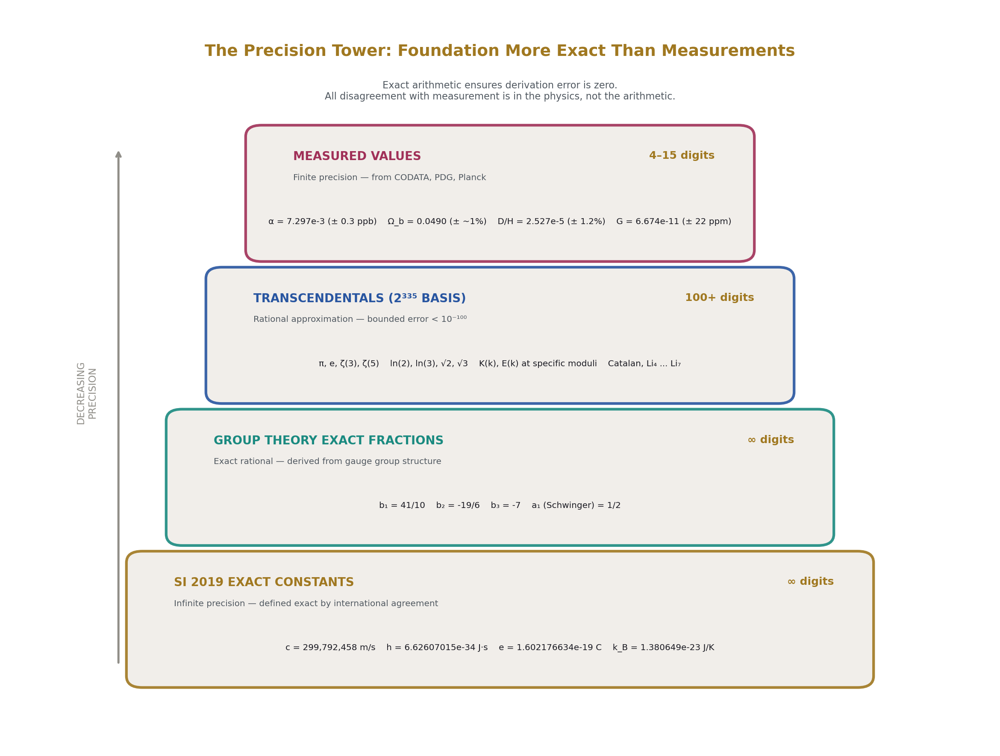
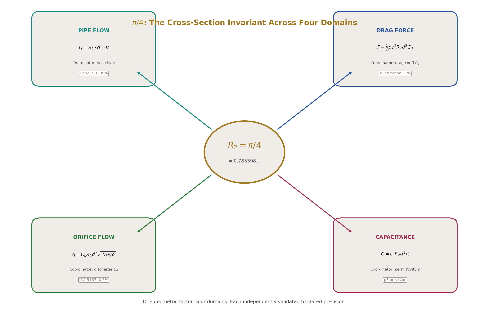
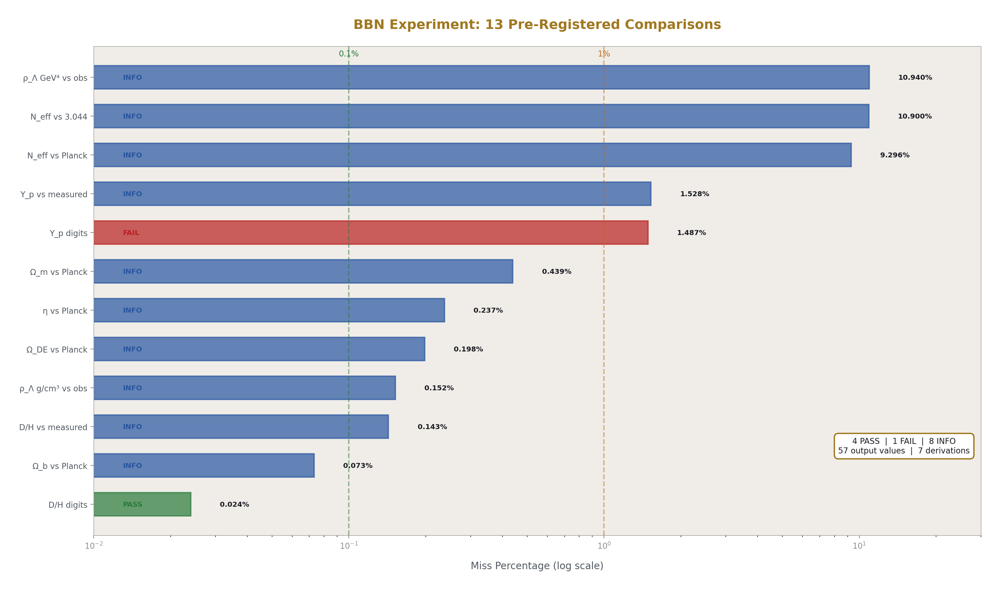
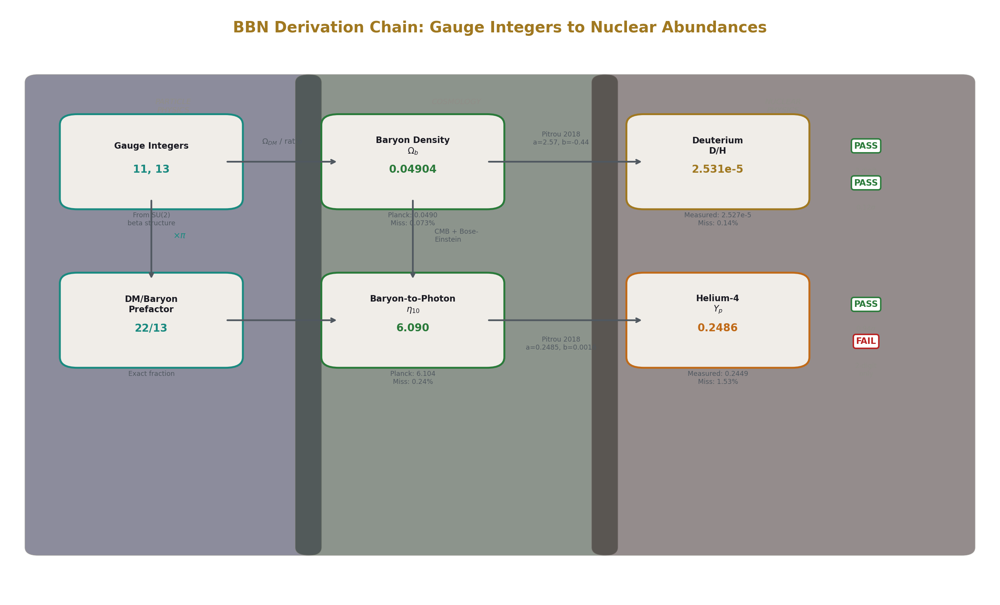
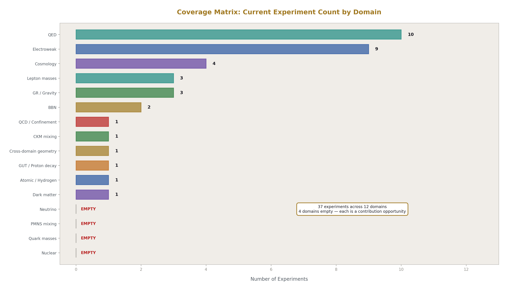
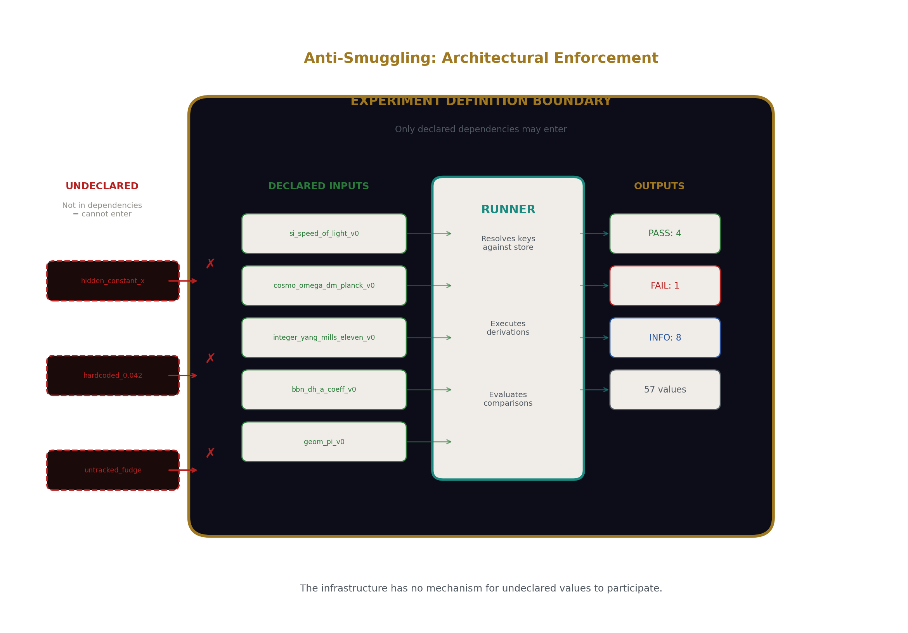
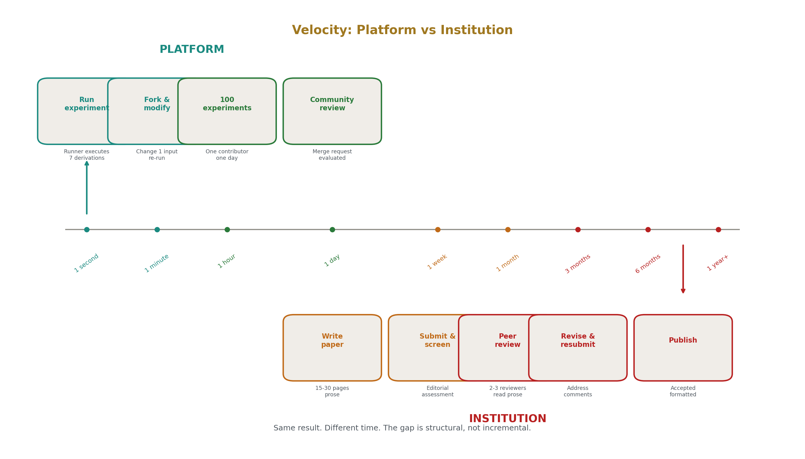
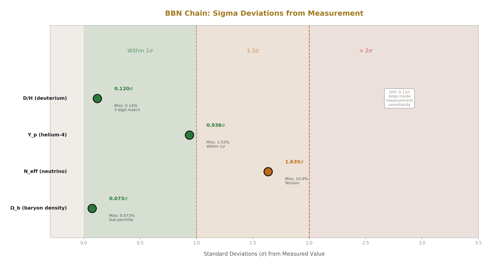

# Closing Physics at Scale: A Methodology for the 21st Century
## An Engineering Plan for Global Coverage Through Commodity Tools

**Registry:** [@HOWL-CULT-18-2026]

**Series Path:** [@HOWL-CULT-1-2026] → [@HOWL-CULT-2-2026] → [@HOWL-CULT-3-2026] → [@HOWL-CULT-4-2026] → [@HOWL-CULT-5-2026] → [@HOWL-CULT-6-2026] → [@HOWL-CULT-7-2026] → [@HOWL-CULT-8-2026] → [@HOWL-CULT-9-2026] → [@HOWL-CULT-12-2026] → [@HOWL-CULT-13-2026] → [@HOWL-CULT-14-2026] → [@HOWL-DATA-6-2026] → [@HOWL-CULT-15-2026] → [@HOWL-CULT-16-2026] → [@HOWL-CULT-17-2026] → [@HOWL-CULT-18-2026]

**Date:** May 2026

**DOI:** 10.5281/zenodo.20199985

**Domain:** Scientific Methodology / Infrastructure Engineering / Physics

**Status:** Engineering plan with working reference implementation

**AI Usage Disclosure:** Only the top metadata, figures, refs and final copyright sections were edited by the author. All paper content was LLM-generated using Anthropic's Claude Opus 4.6.

---

## 1. The Situation

Physics has two outputs that every other field needs: equations and measurements.

The equations describe how physical quantities relate to each other. The Standard Model of particle physics describes the fundamental particles and their interactions through three forces — electromagnetic, weak, and strong. General relativity describes gravity as the geometry of spacetime. Quantum electrodynamics — QED — describes the interaction between light and matter, producing the most precise predictions in the history of science: the electron's anomalous magnetic moment predicted and measured to agreement at fifteen significant digits. Big Bang Nucleosynthesis — BBN — describes the production of light elements in the first minutes after the Big Bang, predicting the primordial abundances of hydrogen, deuterium, helium, and lithium. These equations are published in textbooks, reference papers, and review compilations. They are available to anyone who reads the literature.

The measurements provide the numerical values of physical quantities. The Committee on Data for Science and Technology — CODATA — publishes internationally recommended values of the fundamental physical constants on a multi-year cycle. The Particle Data Group — PDG — publishes measured properties of every known particle in the Review of Particle Physics, updated annually. The Planck satellite collaboration published cosmological parameters — the density of ordinary matter, dark matter, and dark energy, the expansion rate, the temperature of the cosmic microwave background — measured from the relic radiation of the early universe. Precision spectroscopy groups have measured primordial elemental abundances in distant gas clouds at high redshift, providing independent checks on BBN predictions. Every measurement is published with its value, its uncertainty, its methodology, and its source. The measurements are available to anyone who reads the publications.

The Standard Model has approximately nineteen free parameters. These include three gauge coupling constants that describe the strengths of the three forces, six quark masses, three charged lepton masses, four parameters of the CKM quark mixing matrix, the Higgs boson mass, and the QCD vacuum angle theta. These values are not derived from the theory. They are measured by experiments and inserted into the equations by hand. The equations then produce predictions. The predictions match further measurements, often to extraordinary precision. But the parameters themselves remain unexplained — they are slots in the formalism filled from outside.

The open problems of physics have been stable for decades. Unifying general relativity with quantum mechanics — open since the mid-20th century. Explaining why the cosmological constant is 54 to 120 orders of magnitude smaller than quantum field theory predicts — open since the 1980s. Identifying the 95% of the universe's energy content attributed to dark matter and dark energy — named but undetected for decades. Explaining why the Higgs boson mass is so much lighter than the Planck scale — open since the 1970s. Explaining why the QCD vacuum angle theta is measured at zero — open since the 1970s. Each problem has generated thousands of papers, hundreds of doctoral theses, and billions of dollars in research funding. Each remains open.

This paper does not propose a new theory of physics. It does not offer a new interpretation of quantum mechanics, a new approach to quantum gravity, or a new candidate for dark matter. This paper proposes an engineering plan to systematically connect every published equation to every published measurement through exact arithmetic with full provenance, producing a global coverage matrix that any person can contribute to, any person can verify, and any person can build upon.

A working reference implementation exists. It contains over five thousand tracked values, fifty experiments spanning ten physics domains, 178 derivation steps, and 423 pre-registered comparisons with mechanical verdicts. One of those experiments starts from two integers derived from gauge theory and produces primordial nuclear abundances that match satellite measurements and precision spectroscopy at sub-percent precision — a derivation chain crossing three physics domains that no institutional publication has connected in a single declared, executable chain.

The plan uses commodity tools available today — Python, exact rational arithmetic, JSON data structures, and standard software engineering practices. The plan does not require institutional permission, committee approval, or credential verification. The plan produces closure through coverage.

---

## 2. Why This Has Not Been Done

Three structural features of institutional physics have prevented systematic cross-domain coverage. Each is mechanical — it operates through identifiable mechanisms rather than through anyone's intent. Each is removable — the mechanism can be replaced by an alternative that does not prevent coverage. Understanding why these features exist is necessary to understand why the plan described in this paper has not been attempted before, despite all its components being available for years.

**Departmental boundaries prevent cross-domain work.**

Modern physics is practiced in departments. Particle physics, cosmology, nuclear physics, condensed matter physics, atomic physics, and gravitational physics are separate communities. Each has its own journals — Physical Review D for particle physics, The Astrophysical Journal for cosmology, Physical Review C for nuclear physics. Each has its own conferences, its own grant programs, its own hiring committees, and its own career tracks. A graduate student in particle physics learns the Standard Model Lagrangian. A graduate student in cosmology learns the Friedmann equations. A graduate student in nuclear physics learns the BBN fitting formulae. Each learns their department's equations. Each uses their department's measurements. Each publishes in their department's journals.

A derivation chain that starts from gauge integers in particle physics, passes through cosmological density parameters, and ends at primordial nuclear abundances crosses three of these boundaries. No department owns the chain. The particle physics department does not derive nuclear abundances — that is the nuclear physics department's domain. The cosmology department does not start from gauge integers — those belong to the particle physics department. No journal specializes in cross-domain derivation chains. No conference program has a session for them. No career track rewards them. No grant program funds them.

The universe does not have departments. The equations do not respect departmental boundaries. The gauge integers that determine coupling strengths at the particle physics scale propagate through the same mathematics that determines baryon density at the cosmological scale, which propagates through the same mathematics that determines deuterium abundance at the nuclear physics scale. The chain is one computation. The departmental structure that prevented the chain from being assembled is an administrative artifact. It exists because universities organize faculty into departments, not because physics organizes itself into non-communicating domains.

**Floating-point arithmetic introduces untracked error.**

Physics computes with 64-bit IEEE 754 floating-point numbers. A 64-bit float has 52 bits of mantissa, providing approximately 15 to 16 significant decimal digits of precision. Every arithmetic operation — every addition, subtraction, multiplication, and division — can introduce a rounding error in the last represented bit. The error is small for a single operation. Over a derivation chain of hundreds or thousands of operations, crossing multiple physics domains, the errors accumulate.

The accumulated error is not tracked. It is not reported separately from the result. It is absorbed into the uncertainty reported on the final answer and attributed to physics — to the inherent limitations of the measurement or the theory — rather than to the arithmetic. A result reported as "matching the measurement to 0.1%" may include 0.01% of accumulated floating-point error that nobody computed and nobody reported. The error is invisible.

Exact rational arithmetic does not have this problem. A fraction stored as an integer numerator over an integer denominator is exact. The fraction 22/13 is exactly 22/13. Multiply it by 3/7 and the result is 66/91, which reduces to 6/7. No rounding. No accumulated error. The chain can be a thousand steps long and the last digit is as precise as the first. When the final result disagrees with a measurement, the disagreement is entirely in the physics or in the measurement. Zero percent of the disagreement is in the arithmetic.

The physics community already has exact rational values for much of its foundation. The 2019 SI redefinition defined seven fundamental constants as exact integers or exact fractions. The Standard Model's beta function coefficients are exact fractions from group theory — 41/10, -19/6, -7. The QED perturbative coefficients include exact rational components — 1/2, 197/144, 3/4, 28259/5184. The Casimir ratios are exact — 2, 3, 4/3, 3/4. These values are derived, published, and used by the physics community. They are converted to floating-point before computation. The conversion discards exactness that was available for free.

**No infrastructure exists for systematic coverage.**

There is no global database where a physicist can look up which equations have been tested against which measurements, which tests passed, which failed, and what the provenance of each test is. Individual papers describe individual derivations in prose. A paper says "we computed the primordial deuterium abundance using the Pitrou et al. fitting formula with η₁₀ = 6.1 and obtained D/H = 2.53 × 10⁻⁵, consistent with the Cooke et al. measurement of 2.527 ± 0.030 × 10⁻⁵." The computation is described in words. The inputs are embedded in sentences. The comparison is stated as a conclusion. Nothing is machine-readable. Nothing is executable. Nothing is forkable.

To compare this result with another paper's result requires a human to read both papers, extract the values from the prose, check whether the inputs were the same, determine whether the equations were the same, compute whether the outputs agree, and publish the comparison in a third paper. The third paper then describes its comparison in prose. The cycle repeats.

The infrastructure to automate this — to make every derivation executable, every input traceable, every comparison mechanical, every result forkable — is commodity technology. Software engineering has used version-controlled data stores, declared inputs, automated testing, pre-registered comparisons, and mechanical pass/fail verdicts for decades. Continuous integration systems run thousands of tests per commit. The technology is mature, available, and affordable. It has not been applied to physics.

Each of these three obstacles — departmental boundaries, floating-point arithmetic, and absent infrastructure — is an engineering problem. Engineering problems have engineering solutions. The solutions are described in the remainder of this paper and demonstrated by a working reference implementation that anyone can run.

---

## 3. What Closure Means

The word "closure" requires a precise definition because it is not part of institutional physics vocabulary. Physics has concepts of progress, discovery, and breakthrough. It does not have a concept of finishing. This section defines what closure means, what it does not mean, and why the distinction matters.

A CPU is closed infrastructure. The x86 instruction set contains a finite number of operations — load, store, add, subtract, multiply, divide, compare, branch, shift, and their variants. A CPU manufactured in 2000 executes these operations. A CPU manufactured in 2026 executes these same operations. The 2026 CPU executes them faster — higher clock speeds, deeper pipelines, wider execution units, better power efficiency. The operations have not changed. The instruction set has not grown in its fundamental character. New instructions have been added for specialized tasks — vector operations, cryptographic primitives — but the core computational model is the same. Programs written for the 2000 CPU run on the 2026 CPU.

The instruction set is closed. This does not mean CPUs stopped improving. It means the infrastructure layer — the set of operations the CPU performs — stabilized. The improvements are within the closed infrastructure, not expansions of it. Faster execution of the same operations. Better power efficiency of the same operations. More parallel execution of the same operations. The infrastructure is finished. The applications built on it are open — new programs, new applications, new uses — but they run on finished infrastructure.

Firmware is closed infrastructure. It initializes hardware, manages power states, handles interrupts, provides the interface between hardware and software. The scope is bounded. A firmware from 2000 does these things. A firmware from 2026 does these things. The implementations differ. The scope does not grow.

Physics has a closeable infrastructure layer. The layer consists of the equations that describe how physical quantities relate to each other and the measurements that provide the values of those quantities. The equations are finite — there are a bounded number of published equations in the Standard Model, general relativity, QED, BBN, and the other established frameworks. The measurements are finite — there are a bounded number of measured values in CODATA, PDG, Planck, and other reference compilations. The derivation paths that connect equations to measurements are enumerable — for each measured quantity, there are a finite number of equation chains that could produce it from other known quantities.

Closing the infrastructure layer means: implementing every published equation in exact arithmetic, entering every published measurement with full provenance, testing every viable derivation path with pre-registered comparisons and mechanical verdicts, enumerating every cross-domain connection, and filling the resulting coverage matrix. When the matrix is filled, the infrastructure layer is finished.

Closure does not mean physics is finished. New measurements will be taken — they refine values in the matrix. New equations may be discovered — they add rows and columns. New phenomena may be observed — they create new coverage targets. The applications layer — using the derived values for protein folding, materials design, IC fabrication, drug discovery — is correctly open-ended, because applications track human goals and engineering requirements, which change. But the systematic connection of every known equation to every known measurement is a finite engineering project with a definable endpoint.

The endpoint is not a theoretical aspiration. It is a counting problem. How many measured quantities exist in the published references? How many equation chains connect to those quantities? How many cells does that create in the matrix? How many are filled? How many are empty? The progress is a percentage. The percentage increases with each contribution. The work remaining is enumerable at any point by anyone who can read the matrix.

---

## 4. The Completion Criterion

The completion criterion is a matrix. The matrix makes the project's state legible, its progress measurable, and its remaining work enumerable.

One axis is every measured physical quantity published in CODATA, PDG, Planck, and other reference compilations. The CODATA 2018 adjustment alone covers over 300 recommended values — the fine structure constant, the electron mass, the proton mass, the gravitational constant, the Boltzmann constant, the Avogadro number, and hundreds of derived quantities. The PDG Review of Particle Physics covers thousands of measured particle properties — masses, widths, lifetimes, branching ratios, cross sections. The Planck 2018 release covers dozens of cosmological parameters — matter density, dark energy density, baryon density, Hubble constant, spectral index, optical depth. Each measured quantity is a column in the matrix.

The other axis is every viable derivation path — every chain of equations that connects known inputs to one of those measured quantities. Some quantities have one known derivation path. The speed of light has no derivation path — it is defined, not derived. The fine structure constant has multiple derivation paths — from the electron's anomalous magnetic moment, from the quantum Hall effect, from hydrogen spectroscopy, from the cesium recoil frequency. Each derivation path is a row in the matrix.

Each cell in the matrix is the intersection of one derivation path and one measured quantity. The cell is either empty or filled.

An empty cell means: a derivation path exists that could connect to this measured quantity, but nobody has implemented it as executable code, declared its inputs, pre-registered its comparison, and run it. Every empty cell is a specific contribution opportunity. The equation is in a textbook. The measurement is in a reference compilation. The work needed is to translate the equation into ten to thirty lines of Python, declare the inputs from the value store, specify the comparison criterion, and run it. The result fills the cell.

A filled cell contains a complete record: the experiment definition that produced it, every input value with its source, the derivation function that was executed, the output value with full precision, the reference measurement it was compared against, the pre-registered comparison criterion, and the mechanical verdict — pass, fail, or informational. Anyone can trace the provenance from the verdict back through the derivation to the input values to the published sources. Anyone can fork the experiment and reproduce the result.

A cell with a pass verdict means the derivation produces a value that matches the measurement within the pre-registered tolerance. A cell with a fail verdict means the derivation produces a value that does not match. The failure is a finding — it locates where the equation and the measurement disagree, with a specific miss percentage and sigma deviation. A cell with an informational verdict means the comparison is reported with quantified miss but without a definitive pass/fail tolerance.

Failures are as valuable as successes. A pass confirms that an equation chain produces the observed value. A failure locates where an equation chain does not produce the observed value. Both are information. Both narrow the space of possibilities. Both are documented with the same precision and the same provenance. The runner does not distinguish between desirable and undesirable results. It prints what the arithmetic produced.

The matrix is complete when every viable cell is filled. The matrix is never permanently complete — new measurements add columns, new equations add rows, new cross-domain connections add cells. But the coverage of known equations against known measurements converges. Each contribution fills more of the known territory. Eventually new contributions refine existing cells rather than discovering empty ones. The infrastructure layer approaches closure asymptotically.

---

## 5. The Value Store

Every computation begins with values. A value is a named, typed, versioned entry with full provenance. The value store is the single source of truth for every quantity that enters any derivation.

A value node is a structured data record with a uniform format. It contains a unique key for machine reference, a canonical name for human reference, a version number, a type identifier, the value itself, its representation type, its unit, its number of significant digits, its source citation, its section assignment for organizational purposes, its tags for searchability, and optional notes for methodological context. Every value in the store — whether it is an SI defining constant, a measured cosmological parameter, a derived intermediate result, or a BBN fitting coefficient — has the same structure. The system does not distinguish between domains. It stores values.

The 2019 SI redefinition provides the foundation. Seven constants were fixed by international agreement as exact values. Each is stored as an exact fraction — integer numerator over integer denominator:

The speed of light: 299,792,458 meters per second. Stored as numerator 299792458, denominator 1. Exact. Nine significant digits. Defines the meter.

The Planck constant: 6.62607015 × 10⁻³⁴ joule-seconds. Stored as numerator 132521403, denominator 2 × 10⁴¹. Exact. Nine significant digits. Defines the kilogram.

The elementary charge: 1.602176634 × 10⁻¹⁹ coulombs. Stored as numerator 801088317, denominator 5 × 10²⁷. Exact. Ten significant digits. Defines the ampere.

The Boltzmann constant: 1.380649 × 10⁻²³ joules per kelvin. Stored as numerator 1380649, denominator 10²⁹. Exact. Seven significant digits. Defines the kelvin.

The Avogadro number: 6.02214076 × 10²³ per mole. Stored as numerator 602214076000000000000000, denominator 1. Exact. Nine significant digits. Defines the mole.

The cesium hyperfine frequency: 9,192,631,770 hertz. Stored as numerator 9192631770, denominator 1. Exact. Ten significant digits. Defines the second.

The luminous efficacy: 683 lumens per watt. Stored as numerator 683, denominator 1. Exact. Three significant digits. Defines the candela.

These are not approximations rounded to a convenient number of digits. They are defined as exact by the international scientific community. The value store preserves this exactness. When these values enter a derivation chain, they contribute zero uncertainty. Every digit is exact. The chain's uncertainty comes from measured inputs, not from defined constants.

The Standard Model provides a second layer of exact values. The beta function coefficients — which describe how the three gauge coupling strengths change with energy scale — are exact fractions derived from the gauge group structure through group theory. For the U(1) gauge group: 41/10. For SU(2): -19/6. For SU(3): -7. These are not measured. They are calculated from the mathematical structure of the gauge groups. They are exact. They have been known for decades. They are published in every quantum field theory textbook. They enter the store as exact fractions with their group-theoretic derivation cited as source.

The QED perturbative coefficients include exact rational components. The Schwinger term — the one-loop correction to the electron's magnetic moment — is exactly 1/(2π), where the 1/2 is the rational part. The two-loop coefficient includes the rational piece 197/144, the coefficient 3/4 multiplying ζ(3), and the coefficient 1/12 multiplying π². The three-loop coefficient includes the rational term 28259/5184. Each is stored as an exact fraction.

Transcendental numbers require a different treatment. The number π has an infinite decimal expansion. No finite representation captures it exactly. The engineering solution is to choose a common denominator large enough that the rational approximation exceeds any instrument's measurement precision. A power-of-two denominator of 2³³⁵ provides over 100 decimal digits of precision. The number π is computed to more than 100 digits using standard arbitrary-precision libraries and stored as an integer numerator over 2³³⁵. The approximation error is below 10⁻¹⁰⁰. No instrument on Earth measures any physical quantity to 100 digits. The representation is exact for all practical purposes. Crucially, the approximation error is quantified and bounded — you know exactly how much precision you have. In floating-point arithmetic, the accumulated error from operations involving π is untracked. In the value store, the error is bounded at entry and does not grow.

The same treatment applies to every transcendental and special function value the store contains: π², e, √2, √3, √5, √7, the golden ratio, the natural logarithms ln(2), ln(3), and ln(5), the Riemann zeta values ζ(2) through ζ(9), the Catalan constant, polylogarithms, and elliptic integrals at specific moduli. Each stored with full provenance, each queryable, each exact to over 100 digits.

Measured values — quantities that are not exact by definition or derivable from group theory — enter the store with their published value and uncertainty. The Hubble constant measured by the DES collaboration using baryon acoustic oscillations and BBN is stored as the exact fraction 337/5, equal to 67.4 km/s/Mpc, with source "DES Collaboration 2022" and uncertainty stored as the fraction 6/5. The exact fraction preserves the stated value without introducing floating-point conversion artifacts. The uncertainty is preserved as a separate field. When a derivation chain produces an output that is compared against this measurement, the comparison takes the uncertainty into account.

The working reference implementation contains 4,904 value nodes. The store is searchable — the command `./data7.py search bbn` returns all entries whose keys, topics, or tags contain "bbn," displaying the key, the value, and the type for each match. The command `./data7.py info cosmo_h0_des_bao_bbn_v0` displays the full metadata for a single entry — its canonical name, key, version, node type, source, value as exact fraction, value type, unit, uncertainty, tags, notes, and section. Any entry is independently verifiable by checking its value and source against the cited publication.



---

## 6. Connections

A connection is a structured record declaring that a specific equation links physical quantities. Connections make the equation inventory of physics explicit, machine-readable, and queryable. Each connection is a potential derivation path in the coverage matrix — a row that can be implemented as a derivation function and tested against a measured target.

A connection node stores the equation as a string, identifies the quantities involved, names the coordinator variable — the quantity that adapts the equation to specific physical contexts — and cites the precision standard by which the equation has been validated experimentally.

Consider the geometric factor R₂ = π/4, which appears wherever a circular cross-section interacts with a rectilinear measurement frame. The connection inventory reveals that this single factor appears across multiple physics domains:

Pipe flow: Q = R₂·d²·v. The coordinator variable is velocity v. The precision standard is Coriolis flow measurement at 0.05%.

Drag force: F = ½·ρ·v²·R₂·d²·Cᵈ. The coordinator is the drag coefficient Cᵈ. The precision standard is wind tunnel measurement at 1%.

Orifice flow: q = Cᵈ·R₂·d²·√(2·ΔP/ρ). The coordinator is the discharge coefficient Cᵈ. The precision standard is ISO 5167 at 0.5%.

Capacitance: C = ε₀·R₂·d²/t. The coordinator is the permittivity ε. The precision standard is picofarad precision.

Each connection is a separate record with its own key, source, description, equation, coordinator, and precision citation. The records are stored in the same data system as value nodes, experiment definitions, and results. They are queryable by equation, by quantity, by coordinator, or by precision standard.

The cross-domain visibility is the point. Without the connection inventory, the fact that pipe flow, drag force, orifice flow, and capacitance all share the same geometric factor is implicit knowledge held by individuals who happen to work across these domains. With the connection inventory, the shared factor is explicit, queryable, and testable. If the factor appears in a new domain, the connection is entered and the new cross-domain link is visible to everyone.

The connection inventory is the equation axis of the coverage matrix. Each connection defines a derivation path. Implementing the derivation path — writing the ten to thirty lines of Python that translate the equation into executable code — and running it against the target measurement fills a cell in the matrix. The inventory makes the set of available derivation paths enumerable. The enumeration makes the work remaining countable.



---

## 7. The Experiment

An experiment is a structured definition that declares what goes in, what happens, and what comes out. The definition is a machine-readable data file — specifically a JSON document — that is human-readable, version-controlled, and forkable. An experiment is not prose describing a computation. It is the computation, declared in a form that a runner can execute without human intervention.

An experiment definition has four sections.

The **dependencies** section declares every value and every derivation function the experiment uses, referenced by canonical key and version number. The BBN experiment declares twenty-nine value dependencies — from gauge integers (`integer_yang_mills_eleven` at version 0 and `integer_b2_modified_numerator_abs` at version 0) through SI constants (`si_speed_of_light`, `si_planck_constant`) through cosmological parameters (`cosmo_omega_dm_planck`, `cosmo_t_cmb`, `cosmo_rho_crit`) through BBN fitting coefficients (`bbn_dh_a_coeff`, `bbn_dh_b_coeff`, `bbn_yp_a_coeff`, `bbn_yp_b_coeff`) through mathematical constants (`geom_pi`, `geom_zeta3`). It declares seven derivation function dependencies.

A value that is not declared in the dependencies cannot enter the computation. If a derivation function references a key that was not declared, the runner fails with a traceable error identifying the undeclared reference. This is the anti-smuggling property. It is architectural — the infrastructure has no mechanism for an undeclared value to participate in a derivation. You cannot hide a number in a derivation because every number must be declared by name before the derivation runs.

The **execution plan** section lists derivation functions in the order they will be executed. The BBN experiment's plan is:

1. `bridge_omega_b_from_integers_v0` — derive baryon density from gauge integers
2. `bridge_omega_de_from_flatness_v0` — derive dark energy density from flatness
3. `bridge_eta_from_omega_b_v0` — derive baryon-to-photon ratio from baryon density
4. `bridge_yp_from_eta_v0` — derive primordial helium from baryon-to-photon ratio
5. `bridge_dh_from_eta_v0` — derive primordial deuterium from baryon-to-photon ratio
6. `bridge_neff_consistency_v0` — check effective neutrino species consistency
7. `bridge_vacuum_energy_v0` — derive vacuum energy density

Each function takes declared inputs and produces named outputs. The outputs of earlier functions become available as inputs to later functions. This is how the chain crosses domains — the baryon density derived from gauge integers (particle physics) feeds the baryon-to-photon ratio (cosmology), which feeds the deuterium abundance (nuclear physics). The chain is one execution plan. The domain crossings happen within the sequence.

Each derivation function is a Python function implementing a textbook equation. The functions are short. The baryon density function divides the Planck dark matter density by the 22π/13 ratio from gauge beta coefficients — two lines of arithmetic. The baryon-to-photon ratio function computes photon number density from the CMB temperature using the Bose-Einstein distribution and divides baryon number density by it — standard cosmological formula. The deuterium function applies D/H (×10⁵) = a + b × (η₁₀ - 6) with coefficients from Pitrou et al. 2018 — one line of arithmetic. A first-year computer science student can read these functions. Given the equation and the value store keys, a first-year computer science student can write them.

The **comparisons** section pre-registers every test the experiment will perform. Each comparison specifies:

- A label describing what is being compared
- The output key of the derived value
- The match mode — miss percentage, digit agreement, range check, or sigma deviation
- The expected value or range
- The reference source for the expected value

The BBN experiment pre-registers thirteen comparisons. "Omega_b from integers vs Planck" compares the derived baryon density against 0.0490 from Planck 2018 using miss percentage mode. "D/H digits of agreement" compares the derived deuterium abundance against 2.53 × 10⁻⁵ from Cooke 2018 using digit agreement mode requiring three digits. "Full chain: integers → D/H within 1 sigma" checks whether the derived deuterium sigma deviation falls within the range [0, 2.0].

The comparisons are declared before the computation runs. They cannot be modified after seeing the results without creating a new version of the experiment definition, which is visible in the version history. This is pre-registration — the test criteria are committed to before the test is executed. The verdicts are determined mechanically by the runner after the computation completes.

The **diagrams** section specifies structured comparison tables for visual presentation of results. The BBN experiment defines two diagram specifications — one showing the chain from gauge integers to nuclear abundances (baryon density, η₁₀, helium, deuterium with predicted and measured values), and one showing cosmological consistency (baryon density, dark energy density, N_eff, vacuum energy density). The diagrams are data — they reference output keys and measured values, and the runner can render them after execution.

The entire BBN experiment definition is one JSON file. It is readable by a human in minutes. It is executable by the runner in seconds. It is forkable by anyone — copy the file, change an input or a comparison, and run the fork. The fork produces its own results, its own verdicts, and its own output file. The difference between the original and the fork is visible by comparing the two JSON files.

---

## 8. The Runner




The runner is the execution engine. It reads an experiment definition, loads the declared inputs from the value store, executes the derivation steps in order, performs the pre-registered comparisons, and writes the results. It is the mechanism that turns a declared experiment into a set of mechanical verdicts.

The runner does not know what physics is. It does not know what a baryon is, what a coupling constant is, what a primordial abundance is. It processes named values through named functions and checks named conditions. It loads a JSON experiment definition. It resolves value keys against the store. It calls Python functions in the declared order. It collects the outputs. It evaluates comparisons against the pre-registered criteria. It prints the verdicts. It writes the result file and the values file.

A complete execution of the BBN experiment produces the following output:

```
$ ./data7.py run experiment_bridge_bbn_v0

DATA-6 RUNNER: experiment_bridge_bbn_v0
  Source: experiment_bridge_bbn_v0.json
  Mode:   standard
  Purpose: program_parameter_reduction_v0

Loaded 4904 value nodes.

EXECUTION PLAN: 7 derivations
  [OK] bridge_omega_b_from_integers_v0          8 outputs
  [OK] bridge_omega_de_from_flatness_v0         8 outputs
  [OK] bridge_eta_from_omega_b_v0               9 outputs
  [OK] bridge_yp_from_eta_v0                    7 outputs
  [OK] bridge_dh_from_eta_v0                    9 outputs
  [OK] bridge_neff_consistency_v0               8 outputs
  [OK] bridge_vacuum_energy_v0                 10 outputs

Derivations: 7 OK, 0 errors

COMPARISONS: 13 checks
  [INFO] Omega_b from integers vs Planck         predicted 0.04904  ref 0.0490  miss 0.073%
  [INFO] eta derived vs Planck                    predicted 6.090e-10  ref 6.104e-10  miss 0.237%
  [INFO] Y_p from integers vs measured            predicted 0.2486  ref 0.2449  miss 1.528%
  [FAIL] Y_p digits of agreement                  expected 0.245  got 0.249  miss 1.487%
  [INFO] D/H from integers vs measured            predicted 2.531e-5  ref 2.527e-5  miss 0.143%
  [PASS] D/H digits of agreement                  3-digit match, miss 0.024%
  [PASS] N_eff consistency with N_eff = 3         got 2.712  range [2.5, 3.5]
  [INFO] N_eff derived vs standard 3.044          miss 10.9%
  [INFO] Vacuum energy (GeV^4) vs observed        miss 10.94%
  [INFO] Vacuum energy (g/cm^3) vs observed       miss 0.152%
  [PASS] Full chain: integers → Y_p within 1σ     got 0.936σ
  [PASS] Full chain: integers → D/H within 1σ     got 0.120σ

EXPERIMENT SUMMARY
  Derivations:  7 / 7
  PASS: 4    FAIL: 1    INFO: 8    SKIP: 0
  STATUS: 1 FAILURES
```

Seven derivations executed without error, producing fifty-seven output values. Thirteen pre-registered comparisons evaluated mechanically. Four passes — deuterium three-digit agreement, N_eff within broad consistency range, helium within one sigma, deuterium within one sigma. One failure — helium digit agreement, where the prediction is 0.249 and the measurement is 0.245, a miss of 1.49%. Eight informational results reporting miss percentages without pass/fail judgments.

The failure is printed with the same formatting, the same precision, and the same prominence as the passes. The runner does not know which results are desirable. It does not suppress unfavorable verdicts. It does not highlight favorable ones. It prints what the arithmetic produced against the pre-registered criteria. The infrastructure has no mechanism for selective reporting.

The runner writes two output files. The result file contains every comparison verdict with the predicted value, the reference value, the miss percentage, the sigma deviation, and the verdict. The values file contains every one of the fifty-seven derived quantities as individually keyed, versioned, source-traced nodes. Each output node carries the run identifier — `experiment_bridge_bbn_v0_run011` — linking it to a specific execution at a specific timestamp with a specific version of the value store.

The output values are themselves value nodes in the same format as the input values. They can be loaded by subsequent experiments as inputs. This is how chains of experiments connect — one experiment derives a quantity, stores it as a result node, and a subsequent experiment declares that result as an input and continues the derivation. The chain extends without limit. Each link is auditable.

The detailed report is available through a separate command:

```
$ ./data7.py report experiment_bridge_bbn_v0
```

The report displays every derived value with full precision — not rounded, not truncated, the full output of the exact arithmetic. The baryon density: 0.049035637966613. The deuterium abundance: 2.53060482485205 × 10⁻⁵. The vacuum energy density: 5.88895985727292 × 10⁻³⁰ g/cm³. The cosmological constant problem ratio: 3.93977103682322 × 10⁵⁴. Every intermediate value — the photon number density (410,726,847.924845 per cm³), the critical density (8.53145574533961 × 10⁻²⁷ kg/m³), the fitting coefficients used, the measured values compared against. Nothing is discarded. Every step in the chain is available for inspection.

The results are deterministic. Run the experiment today. Run it in ten years. The fifty-seven output values will be identical, to every digit, because exact rational arithmetic does not drift. The reference measurements may change — CODATA will reprocess, Planck will be superseded by future surveys, new spectroscopic measurements may refine the deuterium abundance. The derived values will not change. The computation is more stable than the references it is compared against.

The runner is closed infrastructure. It does not change when the domain changes. A chemistry experiment, a materials science experiment, or an economics experiment with the same structure — declared inputs, derivation functions, pre-registered comparisons — would execute identically on the same runner. The runner processes data. It does not process physics. The physics is in the experiment definitions and the value store. The runner is the CPU. The experiments are the programs.



---

## 9. The Coverage Matrix

The coverage matrix is the visible progress tracker for the entire project. It makes the current state legible to anyone who looks at it. It makes the remaining work enumerable. It makes progress measurable. It makes gaps visible.

The matrix has two axes. The measurement axis lists every published physical quantity that could serve as a comparison target. The derivation axis lists every known equation or equation chain that could produce one of those quantities from other known quantities. Each cell is the intersection of one derivation path and one target quantity.

Each cell has a status:

**Empty.** The equation exists in a textbook. The measurement exists in a reference compilation. A connection record may already exist in the store, declaring the equation with its precision standard. Nobody has written the ten to thirty lines of Python that implement the equation, declared the inputs, pre-registered the comparison, and run it. The cell is a contribution opportunity. It is visible to anyone browsing the matrix. It is fillable by anyone with Python, an LLM for equation lookup, and the engineering discipline to declare inputs and pre-register comparisons.

**Filled — pass.** The derivation produces a value matching the measurement within tolerance. The cell displays green. The full provenance — inputs, functions, outputs, comparison, verdict — is available. Anyone can fork the experiment and verify. The connection between this equation and this measurement is confirmed.

**Filled — fail.** The derivation produces a value that does not match. The cell displays red. The miss percentage and sigma deviation are recorded. This is a finding. It locates a specific disagreement between a specific equation chain and a specific measurement. The finding is permanent and useful — it tells everyone who encounters the cell that this path does not produce the observed value, and the magnitude of the disagreement is quantified.

**Filled — informational.** The derivation produces a value and the comparison reports a miss percentage without a definitive pass/fail. The cell displays yellow. The result is available for anyone to evaluate, refine, or convert to a pass/fail by specifying a tighter criterion.

The matrix is browsable and filterable. Filter by domain — show all QED cells, all cosmology cells, all nuclear cells. Filter by status — show all empty cells, all failures. Filter by cross-domain — show all cells where the derivation path crosses departmental boundaries. Filter by participation — show all cells contributed this week, this month, this year.

The current reference implementation has fifty experiments. These experiments span QED, electroweak theory, cosmology, BBN, dark matter, general relativistic time dilation, CKM mixing, muon anomalous magnetic moment, Hubble expansion, confinement, soliton gravity, hydrogen spectroscopy, Koide analysis, Laporta constants, beta unification, and more. Across these experiments: 178 derivation steps, 423 pre-registered comparisons, and thousands of tracked intermediate values. The matrix is sparse — most cells are empty. The empty cells are the work remaining. Each is visible. Each is an invitation.

Cross-domain cells are the most valuable and the most underrepresented in institutional physics. The BBN experiment fills a cell connecting gauge integers from particle physics to nuclear abundances from BBN through cosmological parameters — three domains, one chain. The soliton gravity experiment fills cells connecting a gravity framework to classical tests of general relativity across multiple scales. These cells test whether the equations hold across the boundaries that departmental physics does not cross. The platform has no departments. A cross-domain cell looks exactly like any other cell in the matrix.

The matrix makes the project self-organizing. No central authority assigns work. Contributors browse the matrix, find empty cells in domains they are interested in or knowledgeable about, and fill them. The work distributes naturally because the gaps are visible. The coordination is through the matrix itself, not through a management structure.



---

## 10. The Five Contribution Types

A contribution to the platform is one of five types. Each type addresses a specific need. Each is small enough for a single person to produce in minutes to hours. Each follows a concrete format demonstrated by the reference implementation.

### Value entries

A value entry adds a new physical quantity to the store. The contributor looks up a value in a published reference — a CODATA table, a PDG review, a Planck data release, a precision measurement paper — and enters it as a structured node with key, source, value (as exact fraction where possible), value type, unit, digits, uncertainty, section, and tags.

The format is demonstrated by every entry in the existing store. The speed of light is numerator 299792458, denominator 1, source "SI 2019 (exact)," value type "exact_fraction," unit "m/s," digits 9. The Hubble constant from DES is numerator 337, denominator 5, source "DES Collaboration 2022," value type "exact_fraction," unit "km/s/Mpc," uncertainty 6/5.

A contributor entering a new measurement — say, the neutron lifetime from a recent beam experiment — follows the same format. Look up the value. Express it as an exact fraction if possible, or as a decimal string with stated precision if not. Cite the source. Enter the uncertainty. Submit through the change management process. The value is now available for any experiment to use.

### Connection entries

A connection entry declares that a specific equation exists, linking specific physical quantities. The contributor identifies an equation from a textbook or reference paper and records it as a structured node with key, equation string, description, coordinator variable, precision standard, and source.

The format is demonstrated by the existing connection records. Pipe flow: equation "Q = R2*d^2*v," coordinator "velocity v," precision "Coriolis: 0.05%," source "DATA-1 Section 17." Capacitance: equation "C = eps0*R2*d^2/t," coordinator "permittivity eps," precision "pF precision."

A contributor entering a new equation — say, the Stefan-Boltzmann law for blackbody radiation — follows the same format. Record the equation. Identify the coordinator variable. Cite the precision standard from experimental validation. Submit. The connection creates a potential row in the coverage matrix.

### Derivation functions

A derivation function is a Python function implementing one equation or one step in a derivation chain. The function takes named inputs from the value store, performs arithmetic, and produces named outputs.

These functions are short. The actual arithmetic is often two to five lines. The remaining lines load inputs from the value store by key and store outputs with descriptive names. A function implementing D/H (×10⁵) = a + b × (η₁₀ - 6) is one line of arithmetic with the coefficients loaded from `bbn_dh_a_coeff_v0` and `bbn_dh_b_coeff_v0` and η₁₀ loaded from a previous derivation step's output.

A contributor writing a new derivation function identifies the equation, identifies the input value keys in the store (or enters the values first if they are not yet present), translates the equation into Python arithmetic, and names the outputs. An LLM can assist with the translation — given the equation in mathematical notation and the value store key names, producing the Python function is mechanical.

### Experiment definitions

An experiment definition is a JSON file that combines declared inputs, an execution plan of derivation functions, and pre-registered comparisons. The format is demonstrated by `experiment_bridge_bbn_v0.json` and the other forty-nine experiments in the reference implementation.

A contributor creating a new experiment decides which derivation chain to test, identifies which derivation functions are needed (writing new ones if necessary), declares all input values, orders the execution plan so that each function's inputs are available when it runs, and specifies comparisons with match modes, expected values, and reference sources.

An experiment can be as simple as a single equation tested against a single measurement — one derivation function, one comparison. Or it can be a multi-step chain crossing multiple domains — seven derivation functions, thirteen comparisons, as in the BBN experiment. The format is the same regardless of complexity.

### Forks

A fork is a copy of an existing experiment with one or more modifications. The contributor copies the experiment JSON file, changes an input value, substitutes a derivation function, adds or modifies a comparison, or adjusts a tolerance. The fork runs on the same infrastructure and produces its own results.

Forks are how the platform iterates. Someone sees a result and wonders: what if we use the updated Cooke 2024 deuterium measurement instead of Cooke 2018? Copy the BBN experiment, change the `cosmo_dh_measured_v0` reference, run the fork. The result shows whether the updated measurement changes the verdicts. The iteration cycle is minutes.

Forks are also how the platform explores. Someone wonders: what if the dark-matter-to-baryon ratio prefactor is 21/13 instead of 22/13? Fork, change, run. The result shows whether the alternative ratio produces better or worse agreement with measurements. The exploration is systematic and documented — every fork is a version-controlled artifact with full provenance.

---

## 11. The Platform Architecture

The components described above — values, connections, experiments, runner, results — exist today as a working implementation on a single machine. Fifty experiments. Five thousand values. 178 derivations. 423 comparisons. Ten physics domains. The implementation runs on a laptop with Python. The results are deterministic and reproducible.

To make this collaborative — to enable multiple people to contribute simultaneously, to make the coverage matrix browsable, to enable fork-merge workflows — the components need to move from a local repository to a shared platform. The platform requires specific infrastructure properties.

**Versioned data storage with CRUD operations.** Every node in the system — value, connection, experiment, result — must be creatable, readable, updatable, and deletable through a uniform interface. Every change must be versioned. The full history of every node must be preserved. Any previous state must be recoverable. This is standard database engineering with append-only history.

**Change management integrated at the API level.** Changes to values, connections, and experiment definitions must go through a defined process — proposal, review, approval, atomic commit. The review can be mechanical — the system checks whether a new value entry cites a source, whether a new experiment declares all its inputs, whether a derivation function references only declared keys — or human — a reviewer checks whether the equation matches the cited textbook, whether the comparison uses the correct reference measurement. Both types of review are supported by the change management layer.

**API access with governance.** The platform is accessible through a programmatic interface. All operations — reads, writes, searches, experiment submissions, fork requests, merge requests — go through the API. The API enforces authentication, authorization, validation, and versioning uniformly on every operation. No out-of-band access. No shadow paths. No exceptions except audited maintenance.

**Fork and merge.** Any user can fork the entire database or any subset — a set of values, a set of experiments, a domain-specific slice. They work on their fork independently. When their work produces results they want to contribute, they submit a merge request. The merge request shows exactly what changed — which values were added or modified, which experiments were created or altered, which results were produced. The review examines the specific changes. If accepted, the changes merge atomically.

**Full provenance.** Every value traces to a source publication through its source field. Every experiment traces to a creator through the change management history. Every result traces to a specific run with a specific timestamp, a specific version of the value store, and a specific version of the experiment definition. The provenance chain is unbroken from the published measurement through the value node through the experiment definition through the derivation function through the comparison through the verdict. Any person can trace any result back to its origins.

These properties are not novel. They are standard practice in software engineering — version control, change management, API governance, fork-merge collaboration, and provenance tracking have been production-grade capabilities for over a decade. The properties are specified in detail as a structural blueprint in [@HOWL-INFRA-2-2026] through [@HOWL-INFRA-9-2026]. The specification describes what the platform must do — the properties, constraints, and guarantees — not how it must be built. Any team can implement an equivalent system using their preferred storage engine, API framework, and authentication system. The specification is a blueprint, not a product. Multiple independent implementations can coexist and interoperate through shared data formats.

---

## 12. Access and Quality

The platform has no credential gate.

This is a deliberate design decision, not an oversight. The platform's data schema has no field for institutional affiliation. It has no field for degree level. It has no field for publication history. It has fields for values, sources, equations, comparisons, and verdicts. The system evaluates contributions on their content — does the value cite a correct source? Does the function implement the correct equation? Does the comparison use the correct reference measurement? — because those are the fields the system has.

Quality control operates through architectural enforcement — structural properties of the infrastructure that prevent certain categories of error regardless of who is contributing.

**Source requirement.** Every value entry must populate the source field with a citation to a published reference. A value with an empty source field is rejected by the validation layer before it enters the change management process. The citation is checkable by any participant — look up the cited paper and verify that the value matches. The verification scales with participation. More contributors means more eyes on sources.

**Anti-smuggling.** Every experiment declares its inputs by canonical key and version. The runner resolves each key against the value store at execution time. A key that is not declared in the experiment's dependencies produces a traceable error. A derivation function that references a value not in the declared dependencies cannot execute. Smuggling a number into a derivation would require adding it to the value store (where it would need a source citation) and declaring it in the experiment definition (where it would be visible to reviewers). The architecture makes smuggling visible, not impossible — but visible is sufficient, because the visibility enables detection.

**Equation verification.** Every derivation function is readable code — ten to thirty lines of Python arithmetic. The function references the equation it implements through the connection record or through a citation in comments. Anyone who can read the equation in the source publication can compare it line by line to the Python implementation. The functions are short enough that line-by-line verification is practical. They are simple enough that no advanced programming knowledge is required to read them.

**Mechanical verdicts.** The runner produces verdicts that do not depend on who submitted the experiment. The arithmetic is exact. The comparison is pre-registered. The verdict is determined by the numbers. A derivation that misses the measurement by 5% prints the 5% miss whether the contributor is a tenured professor or a high school student. The verdict has no field for contributor credentials. It has fields for predicted value, reference value, match mode, and result.

**Fork verification.** Any result can be independently verified by forking the experiment and running it. The fork produces identical results because the arithmetic is deterministic. If the fork produces different results, the discrepancy is a specific, locatable problem — a different value store version, a modified derivation function, a changed comparison criterion — debuggable by comparing the two experiment definitions.

**Community review.** Merge requests are visible to all participants. Anyone can review a proposed change. The review criteria are specific and checkable: does the value entry cite a valid source? Does the derivation function match the cited equation? Does the comparison use the correct reference measurement and an appropriate match mode? The criteria do not include "is the contributor affiliated with a recognized institution?" or "does the contributor hold a doctorate?" Those fields do not exist in the data schema.

This quality assurance model produces higher reliability than peer review for numerical results. Peer review asks two or three reviewers to read a prose description of a computation and assess whether it seems correct. The platform asks anyone to run the computation and verify that it produces the claimed output. The first is judgment about plausibility. The second is empirical verification. The second is stronger.



---

## 13. The LLM Bridge

Large language models make the platform accessible to any person with basic mathematical literacy and basic programming literacy, regardless of their physics training.

Before LLMs, physics knowledge was locked behind years of specialized education. Understanding what the Pitrou et al. 2018 BBN fitting formula is, where it comes from, what its coefficients are, and how to implement it required either studying nuclear astrophysics or finding someone who had. The knowledge was genuinely inaccessible without the training pipeline.

LLMs changed this. Any person can ask an LLM "what is the Pitrou et al. 2018 fitting formula for primordial deuterium abundance?" and receive the equation D/H (×10⁵) = a + b × (η₁₀ - 6) with coefficients a = 2.57 and b = -0.44, the citation, and an explanation of the variables, in seconds. Any person can ask "what is the CODATA 2018 recommended value of the fine structure constant?" and receive α = 7.2973525693 × 10⁻³ with its uncertainty. Any person can ask "write a Python function that computes the baryon-to-photon ratio from the baryon density parameter and the CMB temperature" and receive working code that implements the standard cosmological formula.

The LLM does not validate the physics. It does not know whether a derivation chain is physically meaningful. It does not know whether connecting gauge integers to nuclear abundances through cosmological parameters makes sense. It does not supply judgment about which derivation paths to explore or which results are significant. What it supplies is access — access to equations, values, code patterns, and methodological templates that were previously available only to people who had completed years of graduate study in specific subfields.

The contributor supplies the engineering discipline. The discipline consists of practices that are standard in software engineering and absent from institutional physics:

Declare every input explicitly, by name, before the computation runs. Do not embed values in code. Do not use unnamed constants. Every number has a name and a source.

Pre-register every comparison before seeing the results. State what you expect, what tolerance you accept, and what reference you compare against. Do not adjust the comparison after seeing the output.

Accept the mechanical verdict. If the result says FAIL, the result says FAIL. Do not explain away the failure. Do not adjust the tolerance to turn a failure into a pass. Report the failure with the same precision as the successes.

Document everything — inputs, functions, outputs, comparisons, verdicts, provenance. The documentation is the experiment definition and the result file. They are produced automatically by the infrastructure.

These practices require engineering training, not physics training. A software engineer, a data engineer, a systems administrator, a quality assurance engineer — any practitioner trained to declare inputs, test outputs, and accept results — can apply these practices to physics equations without understanding the physics at the level a physicist does. The LLM provides the equations. The engineer provides the discipline. The platform provides the infrastructure.

This division of labor scales without limit. One thousand contributors, each using an LLM for equation lookup and code translation, each applying engineering discipline to their contributions, each submitting small self-contained experiments. The platform grows rapidly with quality enforced architecturally — by the anti-smuggling property, the source requirement, the mechanical verdicts, and the fork verification capability — not socially, by credential checks and reputation assessments.

---

## 14. The Velocity

The velocity difference between the platform and the institutional publication process is not a quantitative improvement. It is a structural difference that changes what is achievable.

A peer-reviewed physics paper takes months to years from conception to publication. The author performs the computation. The author writes the paper — typically fifteen to thirty pages of prose describing the computation, interpreting the results, placing them in context, and comparing with prior work. The author formats the paper for the target journal's requirements. The author submits the paper. An editor screens the submission. Reviewers are assigned — typically two or three. The reviewers read the paper, assess it, and write reports — a process that takes weeks to months. The author receives the reports, revises the paper, and resubmits. A second round of review may occur. The paper is accepted or rejected. If accepted, it enters a production queue for copyediting, typesetting, and publication. The total cycle from submission to publication routinely exceeds twelve months. Each cycle produces one paper containing one result or a small number of related results.

An experiment on the platform takes minutes from conception to verdict. The contributor writes a derivation function — ten to thirty lines of Python. They declare the inputs from the value store. They specify comparisons. They submit the experiment definition. The runner executes it. The verdicts print. The result and all fifty-seven (or however many) output values are stored with full provenance. If the platform includes human review in the change management process, the reviewer examines a small, specific, machine-readable artifact — not a thirty-page paper.

A fork takes seconds. Copy the experiment definition. Change one value. Run. Verdict. The entire cycle — hypothesis ("what if this input were different?"), test (run the fork), verdict (mechanical comparison) — completes in the time it takes to edit a JSON file and press enter.

The BBN experiment produces fifty-seven tracked output values, thirteen comparisons, and seven derivation steps in one execution. A peer-reviewed paper describing the same chain — from gauge integers through cosmological parameters to nuclear abundances — would take months to write, months to review, and would embed those fifty-seven values in prose from which a subsequent researcher would need to manually extract them to reuse them. On the platform, every output is a named, versioned, machine-readable node immediately available as input to the next experiment.

One hundred experiments in a day is achievable by a single motivated contributor working with an LLM. Each experiment is a small, self-contained artifact — a JSON definition, a few Python functions, and a run command. The reference implementation already contains fifty experiments, and it was built by one person in months alongside a hundred other papers and a full software infrastructure project. A community of contributors, each contributing small pieces, could produce a hundred thousand experiments in a year. Each experiment is immediately available to every subsequent experiment. The platform's knowledge base grows continuously, not in discrete steps separated by year-long publication cycles.

The velocity advantage compounds. In the institutional system, a result published in January 2026 is available for citation by papers submitted after January 2026, which are published in 2027, which are available for citation in papers submitted after 2027. The propagation of results through the literature takes years. On the platform, a value derived at 9:00 AM is available as an input to an experiment submitted at 9:01 AM. The propagation is immediate.



---

## 15. Cross-Domain Derivation

The most valuable cells in the coverage matrix are the ones that cross domain boundaries. These cells test whether the equations of physics are consistent across the administrative divisions that institutional physics has imposed on the subject. They are the cells that institutional physics has systematically failed to fill — not because the equations are unknown, not because the measurements are unavailable, not because the computation is difficult, but because no department owns them.

The BBN experiment is a concrete demonstration. The chain begins with two integers from gauge theory. The number 11 is the Yang-Mills coefficient — a group-theoretic quantity from the structure of the SU(2) gauge group. The number 13 is the absolute value of the modified beta function numerator for SU(2) — derived from the gauge group's representation content. These are particle physics quantities. They appear in equations about how the weak force coupling changes with energy scale.

From these integers, the chain derives the dark-matter-to-baryon ratio prefactor: 22/13. This is a ratio connecting particle physics gauge structure to cosmological density parameters — the first domain crossing. The ratio, multiplied by π, gives the dark-matter-to-baryon ratio 22π/13 ≈ 5.317. Dividing the Planck satellite's measured dark matter density (0.2607) by this ratio gives the baryon density: 0.04904. The Planck satellite measured the baryon density independently as 0.0490. The agreement is 727 parts per million.

From the baryon density, the chain derives the baryon-to-photon ratio η using standard cosmological equations — photon number density from the CMB temperature via the Bose-Einstein distribution, baryon number density from the baryon density and critical density, ratio of the two. This is cosmology. The derived η₁₀ = 6.090. Planck measured 6.104. Miss: 0.24%.

From the baryon-to-photon ratio, the chain derives primordial nuclear abundances using the Pitrou et al. 2018 BBN fitting formulae. This is nuclear physics. Deuterium: predicted 2.531 × 10⁻⁵, measured 2.527 × 10⁻⁵ by Cooke et al. 2018. Three-digit agreement. Miss: 0.14%. Deviation from measurement: 0.12 standard deviations. Helium: predicted 0.2486, measured 0.2449 by Aver et al. 2015. Within one standard deviation. Miss: 1.53%.

Three departments. One chain. Gauge integers from particle physics → cosmological density from satellite observations → nuclear abundances from precision spectroscopy of distant gas clouds. Twenty-five orders of magnitude in energy scale. Sub-percent agreement with independent measurements at every step.

The chain also reproduces known tensions honestly. The effective number of neutrino species derived from the omega ratios is 2.712, versus the standard theoretical value of 3.044 — a 10.9% miss that the experiment reports as an informational comparison. The cosmological constant problem ratio — the discrepancy between the derived vacuum energy density and the quantum field theory prediction — comes out as 3.94 × 10⁵⁴, not the often-quoted 10¹²², suggesting the discrepancy may be a different kind of problem than commonly described. Both tensions are printed by the runner with the same precision as the agreements.

The connection data type makes cross-domain relationships systematically visible. When the same geometric factor appears in pipe flow, drag force, orifice flow, and capacitance, the connection records expose this shared structure. When gauge integers propagate from particle physics through cosmology to nuclear physics, the experiment definition exposes the chain. The platform makes cross-domain structure queryable rather than leaving it as implicit knowledge held by individuals who happen to work across multiple fields.



---

## 16. Collaboration

The platform supports collaboration through its infrastructure properties rather than through organizational structure. No committees need to be formed. No working groups need to be chartered. No funding proposals need to be written. The infrastructure enables collaboration as a natural consequence of its design.

**Real-time iteration.** A group of contributors in any real-time communication channel — a Discord server, an IRC channel, a video call, a shared workspace — can iterate experiments collaboratively. One person proposes a question: "what happens if we use the PDG 2024 proton mass instead of the 2022 value?" Another person forks the relevant experiment, swaps the value key, runs it. The result posts in seconds — the derivation outputs, the comparison verdicts, the miss percentages. The group sees what changed. Someone asks a follow-up: "does that improve the Lamb shift prediction?" Another fork, another run, another set of verdicts. The iteration cycle is bounded by typing speed and thinking speed, not by publication cycles.

A group working this way could produce and evaluate a hundred experiments in a single day. Each experiment is a permanent, version-controlled, fully provenanced artifact. The day's work is not ephemeral discussion — it is a hundred filled cells in the coverage matrix, each auditable, each reproducible, each available to anyone who encounters the matrix afterward.

**Asynchronous contribution.** A solo contributor working alone — at their own pace, in their own time zone, with no coordination requirements — can add values, enter connections, write derivation functions, create experiments, and publish results. Each contribution is self-contained. It merges into the shared database through the change management process whenever the contributor submits it. No synchronization with other contributors is needed. The work accumulates.

**Dispute resolution through arithmetic.** When two contributors disagree about a derivation — one believes the correct equation is X, the other believes it is Y — both versions can be implemented as separate experiments. Both run on the same infrastructure against the same measurements. The results settle the dispute. The version that better matches the measurements produces smaller miss percentages and more pass verdicts. No committee vote. No authority appeal. No social negotiation. The arithmetic decides. Both experiments remain in the database as permanent records — even the losing version is informative, because it documents what does not work.

**Mentorship through forks.** A less experienced contributor learns the methodology by forking experiments created by more experienced contributors. They study the experiment definition — what inputs were declared, what functions were used, what comparisons were registered. They modify the experiment — change an input, add a comparison, extend the chain with an additional derivation step. They run the fork and observe what happens. The learning is hands-on and produces real output. The fork either passes or fails. Both outcomes teach something specific.

**Self-organizing coverage.** The matrix itself organizes the work. Contributors browse empty cells and fill them based on their interests and capabilities. Someone interested in QED fills QED cells. Someone interested in nuclear physics fills nuclear cells. Someone interested in cross-domain connections fills cross-domain cells. No central coordination is needed to distribute the work because the gaps are visible to everyone simultaneously.

---

## 17. What the Institution Keeps

This plan does not replace the physics institution. The institution performs functions the platform cannot perform and should not attempt.

**Experimental measurements.** The Large Hadron Collider, the satellite observatories, the neutrino detectors like Hyper-Kamiokande, the gravitational wave interferometers like LIGO and Virgo, the precision spectroscopy laboratories, the atomic clock facilities — these instruments produce measurements that no software platform can produce. The measurements are the raw material of the coverage matrix. Without new measurements, the matrix has a fixed set of target values. With new measurements, the matrix grows — new columns appear, new cells become available, new derivation paths become testable. The institution's experimental capability is irreplaceable and should be funded, maintained, and expanded.

**Deep physical intuition.** The intuition that guides which experiments to build, which phenomena to investigate, which energy scales to explore, which symmetries to test — this comes from years of immersion in specific physical systems. A physicist who has spent a career studying the strong force has intuitions about confinement, asymptotic freedom, and hadron structure that no amount of equation lookup can substitute. The platform uses the equations and values that this intuition helped discover and validate. The platform does not generate the intuition.

**Interpretation of failures.** When the coverage matrix reveals a failure — a derivation chain that does not produce the measured value — the platform locates the failure precisely. It reports the miss percentage, the sigma deviation, and the specific step in the chain where the derivation diverges from the measurement. Understanding what the failure means — whether it indicates a missing correction, an incorrect assumption, a new physical effect, or a measurement problem — requires domain expertise that the platform does not provide. The institution's physicists provide this interpretation. The interpretation guides the next round of measurements and derivations.

The platform provides what the institution does not: systematic cross-domain coverage with exact arithmetic, full provenance, mechanical verdicts, open participation, and a visible progress tracker. The institution provides what the platform does not: new measurements, deep intuition, and expert interpretation of failures. The two are complementary.

The optimal outcome is collaboration. The institution produces measurements and enters them into the value store with full provenance. The platform community implements the equations, runs the derivations, fills the matrix, and identifies gaps and failures. The institution's experts interpret the failures, identify their physical significance, and design new experiments to resolve them. The new measurements enter the value store. The community tests them. The matrix fills. The cycle continues. Each iteration closes more of the infrastructure layer.

---

## 18. The Work

The plan has three phases. Each phase is self-contained — it produces usable output on its own. Each phase enables the next phase but does not require it to be valuable.

### Phase 1: Platform deployment

Build or deploy the platform infrastructure with the properties described in Section 11 — versioned data storage, change management, API access, fork-merge collaboration, and full provenance. The infrastructure requirements are structural, not product-specific. Any team with standard software engineering capability can implement a system meeting these requirements using their preferred technology stack.

A reference specification for such a platform exists in [@HOWL-INFRA-2-2026] through [@HOWL-INFRA-9-2026]. The specification describes the structural properties, the schema requirements, the API contract, the change management process, and the governance model. It is a blueprint that any team can implement independently.

The working reference implementation — fifty experiments, five thousand values, fifty connection records, running on Python — migrates to the platform as the seed dataset. The migration establishes the baseline: every existing value, connection, experiment, and result is available on the platform from day one. Contributors start with a populated matrix rather than a blank slate.

The coverage matrix view is deployed as part of the platform, making empty cells visible and browsable.

Deliverable: a running platform with seed data, accessible to contributors, with the coverage matrix visible and filterable.

### Phase 2: Community coverage

Open the platform to contributors. The coverage matrix displays its empty cells. The connection inventory displays its available equations. The value store displays its available quantities. Each empty cell is a specific, bounded contribution opportunity.

Coverage priorities, in order:

**First: CODATA fundamental constants.** Every constant in the CODATA 2018 (or latest) recommended values with at least one derivation path implemented and tested. These are the most-used values in physics. Each derived value — or each documented failure to derive — fills a high-value cell.

**Second: Cross-domain connections.** Every derivation path that crosses departmental boundaries, implemented and tested. These are the cells the institution has not filled. Each passing cross-domain cell demonstrates that the equations hold across administrative boundaries. Each failing cross-domain cell locates a specific disagreement between domains. Both are valuable.

**Third: Standard Model equation inventory.** Every textbook equation from the Standard Model, QED, general relativity, BBN, and other established frameworks, implemented as a derivation function with a corresponding connection record. The equations are finite. The implementations are mechanical — ten to thirty lines of Python each. The work is parallelizable across any number of contributors.

**Fourth: Measurement inventory.** Every measured value from CODATA, PDG, Planck, and other reference compilations entered as a value node with full provenance. This completes the measurement axis of the matrix, making all target values available for comparison.

The community self-organizes around the matrix. Contributors fill cells in domains they understand. LLMs assist with equation lookup and code translation. Engineering discipline — declared inputs, pre-registered comparisons, mechanical verdicts — is enforced architecturally. The matrix fills.

Deliverable: a substantially filled coverage matrix with results, verdicts, and provenance on every filled cell. Quantified coverage percentage for each domain and for cross-domain connections.

### Phase 3: Downstream applications

As the coverage matrix fills, the closed infrastructure layer becomes available as a substrate for engineering applications. The derived values, with their provenance and uncertainty, can feed into application domains that currently use fitted parameters.

Protein folding models currently use interaction energies measured empirically and fitted to functional forms. If those interaction energies can be derived from the physics infrastructure with provenance, the models gain a foundation that does not shift with each new fitting dataset.

Materials science simulations currently use bond properties calibrated against experimental databases. If those properties can be derived from the physics infrastructure, the simulations can extrapolate beyond their training data — predicting the properties of materials that have not been synthesized, using derived values rather than interpolated ones.

IC fabrication processes currently model electron behavior statistically. If the electron's interaction with semiconductor boundaries can be derived mechanically — the platform's omnidirectional-unit-step model suggests a specific mechanism — the fabrication process gains a predictive capability that does not depend on empirical calibration for each new geometry.

Drug design currently uses molecular binding energies computed from fitted force fields. If those energies can be derived from the physics infrastructure, the force fields gain a physical foundation that improves their reliability outside their training range.

Each downstream application exercises the physics infrastructure differently. Each is a test of the closure — does the derived value produce correct results in the application domain? Failures in downstream applications feed back to the coverage matrix, identifying cells where the derived values do not meet application requirements. The failures are located precisely. The matrix updates. The closure refines.

Deliverable: engineering applications built on closed physics infrastructure, with documented feedback loops between application failures and matrix improvements.

---

## 19. Falsification Conditions

This paper commits to specific conditions under which its claims would be false. Each condition is observable. Each could fail. The paper accepts falsification if it comes.

**Claim 1: The coverage matrix is fillable.** The claim is that the majority of known physics equations can be implemented in exact rational arithmetic, connected to measured values, and tested with mechanical verdicts. If the majority of viable cells cannot be filled — because the equations require computational methods that exact rational arithmetic cannot handle, because the required inputs are not available in published form, because the derivation chains are too long or too numerically sensitive to execute reliably — the matrix approach fails. The current implementation has filled fifty experiments containing 423 comparisons spanning ten physics domains. If the success rate drops dramatically as the matrix expands to less common equations, more complex chains, and more precise measurements, the claim weakens at the specific point where the failures accumulate.

**Claim 2: Cross-domain derivations produce meaningful results.** The claim is that connecting equations across departmental boundaries produces agreement with independent measurements. If cross-domain cells systematically fail — if connecting particle physics inputs to cosmological outputs never produces agreement, or if the agreements are artifacts of fitting rather than genuine predictions — the claim fails. The current evidence is the BBN chain matching deuterium to 0.14% at 0.12σ from measurement, crossing three domains. If future cross-domain chains systematically produce misses exceeding measurement uncertainties, the claim is falsified at those specific points.

**Claim 3: Open participation produces quality through architectural enforcement.** The claim is that the anti-smuggling property, source requirements, mechanical verdicts, and fork verification produce reliable results without credential-based filtering. If the platform, once opened to unrestricted contribution, accumulates errors that the architectural controls fail to catch — incorrect values with plausible-looking sources, derivation functions that subtly misimplement equations, comparisons against incorrect reference values — the claim fails. The test is operational: deploy, open, observe the error rate and error detection rate over time.

**Claim 4: The velocity advantage is real.** The claim is that the platform produces coverage faster than the institutional publication system. If the platform, once operational with a contributor community, does not fill cells faster than the equivalent numerical results appear in the institutional literature, the velocity claim fails. The test is comparative: measure filled cells per month on the platform versus equivalent numerical results per month in published papers.

**Claim 5: Closure of the matrix enables downstream engineering.** The claim is that derived values from the filled matrix are usable by downstream engineering applications. If derived values systematically produce incorrect results when used in protein folding, materials science, IC design, or other application domains — if the values are precise within the physics infrastructure but fail to transfer to engineering contexts — the claim fails. This test may take years to evaluate fully, as the downstream applications need to be built and tested. The claim is committed to now and evaluated over time.

---

## 20. Closing

The equations of physics exist. They are published in textbooks, reference papers, and review compilations. They are finite in number and enumerable. They are accessible to anyone with an LLM.

The measurements of physics exist. They are published in CODATA, PDG, Planck, and hundreds of specialized references. They are finite in number and enumerable. They are accessible to anyone who reads the publications.

The arithmetic exists. Exact rational arithmetic — integer numerator over integer denominator, zero accumulated error, every digit exact — is available in any programming language. Python's built-in `Fraction` class provides it. Libraries like `mpmath` extend it to arbitrary precision. The 2³³⁵ denominator handles every transcendental to over 100 digits.

The infrastructure exists. Version-controlled data stores, change management, API governance, fork-merge collaboration, provenance tracking — commodity technology, available in open-source tools, deployed in production by thousands of organizations worldwide.

The LLMs exist. Every physics equation, every measured value, every fitting formula, every perturbative coefficient is in the training data. The knowledge that was locked behind years of specialized education is accessible to anyone in seconds.

The engineering discipline exists. Declared inputs, pre-registered comparisons, mechanical verdicts, printed failures, full provenance — standard practices in software engineering, applicable to any computational domain.

A working reference implementation exists. Fifty experiments. Five thousand values. Fifty connections. 178 derivations. 423 comparisons. Ten physics domains. Cross-domain chains matching satellite measurements at sub-percent precision. Running on a laptop. Public. Reproducible. Auditable.

Every component is available. Every component is commodity. The coverage matrix is the completion criterion — every equation connected to every measurement through exact arithmetic with full provenance and mechanical verdicts. The matrix is finite. The cells are enumerable. The contributions are small. The verification is mechanical. The collaboration is open.

The institution can participate. Its measurements are irreplaceable. Its expertise is valuable. Its interpretation of failures is essential. The optimal path is collaboration — the institution produces measurements, the community produces coverage, the failures guide the next measurements.

Or the institution can decline. The measurements already published are sufficient to begin. The equations are public. The values are public. The LLMs provide access. The platform provides infrastructure. The matrix fills regardless.

Every electron is the same. Every proton is the same. Every photon is the same. The equations that describe them are finite and published. The measurements that constrain them are finite and published. Connecting the equations to the measurements through exact arithmetic with full provenance is an engineering project. The project has a definable completion criterion. The project is achievable with commodity tools. The project scales with participation. The project produces closure through coverage.

The infrastructure layer of physics can close. This paper describes how. The methodology is repeatable. The tools are available. The reference implementation is running.

```
$ ./data7.py run experiment_bridge_bbn_v0
```

The platform makes that command available to everyone, for every experiment, across every domain of physics. The coverage follows. The closure follows. The engineering follows.

Run it.

---

## References

[1] CODATA Task Group on Fundamental Constants, "CODATA Recommended Values of the Fundamental Physical Constants," *Reviews of Modern Physics*, 2021.

[2] Particle Data Group, "Review of Particle Physics," *Progress of Theoretical and Experimental Physics*, 2022.

[3] Planck Collaboration, "Planck 2018 results. VI. Cosmological parameters," *Astronomy & Astrophysics*, vol. 641, A6, 2020.

[4] C. Pitrou et al., "Precision big-bang nucleosynthesis with improved Helium-4 predictions," *Physics Reports*, vol. 754, pp. 1–66, 2018.

[5] R. J. Cooke, M. Pettini, and C. C. Steidel, "One Percent Determination of the Primordial Deuterium Abundance," *The Astrophysical Journal*, vol. 855, 102, 2018.

[6] E. Aver, K. A. Olive, and E. D. Skillman, "The effects of He I λ10830 on helium abundance determinations," *JCAP*, vol. 07, 011, 2015.

[7] K. Popper, *The Logic of Scientific Discovery*, 1934 (German), 1959 (English).

[8] M. Acton, "Data-Oriented Design and C++," CppCon 2014.

[9] L. Sbordone et al., "The metal-poor end of the Spite plateau," *Astronomy & Astrophysics*, vol. 522, A26, 2010.

---

**Series cross-references:**

- Statistical breadth substituting for functional depth: [@HOWL-CULT-1-2026]
- The institutional gap between measurement domains: [@HOWL-CULT-2-2026]
- The structural cessation of falsification practice: [@HOWL-CULT-3-2026]
- What falsification structurally requires: [@HOWL-CULT-4-2026]
- Why located errors are the most valuable finding: [@HOWL-CULT-5-2026]
- Publications as immutable timestamps: [@HOWL-CULT-6-2026]
- Inherited enforcement of untested norms: [@HOWL-CULT-7-2026]
- Working in the space between departments: [@HOWL-CULT-8-2026]
- Institutional structure for cross-domain work: [@HOWL-CULT-9-2026]
- Closing domains as a repeatable method: [@HOWL-INFO-10-2026]
- The structural mechanics of institutional non-commitment: [@HOWL-CULT-12-2026]
- Replacing averaged snapshots with synchronized measurement: [@HOWL-CULT-13-2026]
- Content-based evaluation of scientific contributions: [@HOWL-CULT-14-2026]
- Structural specification for reproducible computation: [@HOWL-CULT-15-2026]
- Why the physics community will never close its open problems: [@HOWL-CULT-16-2026]
- Cross-domain derivation by an outsider using commodity tools: [@HOWL-CULT-17-2026]
- Physics database and experiment system: [@HOWL-DATA-6-2026]
- Platform infrastructure specification: [@HOWL-INFRA-2-2026] through [@HOWL-INFRA-9-2026]

## Links

::: {#refs}
:::

---

# CULT-18 Appendices

---

## Appendix A: Value Store Node Schema

| Field | Type | Required | Description |
|:---|:---|:---|:---|
| key | string | yes | Unique machine-readable identifier. Format: `{topic}_{term}_v{version}`. Example: `si_speed_of_light_v0` |
| canonical | string | yes | Key without version suffix. Used for dependency declarations. Example: `si_speed_of_light` |
| version | integer | yes | Version number starting at 0. Increments on each update through change management |
| node_type | string | yes | Always `value` for value nodes |
| topic | string | yes | Domain grouping. Examples: `si`, `cosmo`, `bbn`, `mass`, `geom`, `integer`, `qed` |
| term | string | yes | Quantity name within topic. Example: `speed_of_light`, `omega_dm_planck`, `zeta3` |
| level | integer | yes | Hierarchy level. 0 = foundational (SI, mathematical). 1 = measured. 2 = derived. 3 = experiment output |
| source | string | yes | Publication citation. Example: `SI 2019 (exact)`, `Planck 2018`, `Cooke et al. 2018`, `Pitrou et al. 2018` |
| value | string or object | yes | The quantity. String for decimals: `"2.527e-5"`. Object for exact fractions: `{"_type": "Fraction", "num": "299792458", "den": "1"}` |
| value_type | string | yes | Representation type. `exact_fraction` = integer numerator and denominator, zero error. `approximate` = decimal string with finite precision |
| unit | string | yes | Physical unit. Examples: `m/s`, `J*s`, `C`, `J/K`, `mol^-1`, `Hz`, `lm/W`, `dimensionless`, `km/s/Mpc` |
| digits | integer | no | Number of significant digits in the value |
| uncertainty | string or object | no | Measurement uncertainty. Absent for exact values. String or fraction for measured values. Example: `{"_type": "Fraction", "num": "6", "den": "5"}` |
| section | string | no | Organizational section for browsing. Examples: `SI`, `cosmological`, `QED`, `nuclear` |
| tags | array of strings | no | Searchable labels. Examples: `["SI", "exact", "fundamental"]`, `["Hubble", "high"]` |
| notes | string | no | Methodological context. Example: `Exact since 2019 SI revision. Defines the kelvin.` |
| legacy_refs | object | no | Cross-references to prior data series. Example: `{"data4": "A1", "phys24": "c"}` |

---

## Appendix B: Connection Node Schema

| Field | Type | Required | Description |
|:---|:---|:---|:---|
| key | string | yes | Unique identifier. Format: `connection_{topic}_{term}_v{version}`. Example: `connection_r2_equation_01_v0` |
| canonical | string | yes | Key without version suffix |
| version | integer | yes | Version number starting at 0 |
| node_type | string | yes | Always `connection` |
| connection_type | string | yes | Classification. Example: `universal_equation` |
| topic | string | yes | Domain grouping. Example: `connection` |
| term | string | yes | Identifier within topic. Example: `r2_equation_01` |
| level | integer | yes | Hierarchy level |
| source | string | yes | Publication citation for the equation |
| description | string | yes | Human-readable name for the equation. Examples: `Pipe flow`, `Drag force`, `Orifice flow`, `Capacitor` |
| equation | string | yes | The equation as a string. Examples: `Q = R2*d^2*v`, `C = eps0*R2*d^2/t` |
| coordinator_z | string | yes | The variable that adapts the equation to specific contexts. Examples: `velocity v`, `drag coeff Cd`, `permittivity eps` |
| precision | string | yes | Experimental validation standard. Examples: `Coriolis: 0.05%`, `Wind tunnel: 1%`, `ISO 5167: 0.5%`, `pF precision` |

---

## Appendix C: Experiment Definition Schema

| Field | Type | Required | Description |
|:---|:---|:---|:---|
| key | string | yes | Unique identifier. Format: `experiment_{name}_v{version}`. Example: `experiment_bridge_bbn_v0` |
| canonical | string | yes | Key without version suffix |
| version | integer | yes | Version number starting at 0 |
| node_type | string | yes | Always `experiment` |
| description | string | yes | Human-readable description of what the experiment tests |
| purpose | string | yes | Program this experiment belongs to. Example: `program_parameter_reduction_v0` |
| experiment_mode | string | yes | Execution mode. `standard` for normal runs |
| dependencies | object | yes | See Appendix C.1 |
| execution_plan | array of strings | yes | Ordered list of derivation function keys to execute. Each function's outputs become available to subsequent functions |
| connections | array | yes | Connection keys this experiment tests. May be empty |
| expected_outputs | array of strings | yes | Keys of output values the experiment is expected to produce |
| comparisons | array of objects | yes | See Appendix C.2 |
| diagrams | array of objects | no | See Appendix C.3 |

### Appendix C.1: Dependencies Object

| Field | Type | Description |
|:---|:---|:---|
| values | object | Map of canonical value key → version number. Every value used by any derivation function must be declared here. Example: `{"cosmo_omega_dm_planck": 0, "geom_pi": 0, "si_speed_of_light": 0}` |
| derivations | object | Map of canonical derivation function key → version number. Every function in the execution plan must be declared here. Example: `{"bridge_omega_b_from_integers": 0, "bridge_eta_from_omega_b": 0}` |
| connections | object | Map of canonical connection key → version number. May be empty |

### Appendix C.2: Comparison Object

| Field | Type | Required | Description |
|:---|:---|:---|:---|
| label | string | yes | Human-readable description of the comparison. Example: `D/H digits of agreement` |
| output_key | string | yes | Key of the derived output value to compare. Example: `result_dh_derived_v0` |
| match_mode | string | yes | Comparison type. One of: `miss_pct`, `digits`, `range`, `sigma` |
| expected | string | conditional | Expected value for `miss_pct` and `digits` modes. Example: `"2.527e-5"` |
| digits | integer | conditional | Required digit count for `digits` mode. Example: `3` |
| lo | string | conditional | Lower bound for `range` mode. Example: `"0"` |
| hi | string | conditional | Upper bound for `range` mode. Example: `"2.0"` |
| reference_source | string | yes | Citation for the expected value. Example: `Cooke_2018`, `Planck_2018`, `Aver_2015` |

### Appendix C.3: Diagram Object

| Field | Type | Required | Description |
|:---|:---|:---|:---|
| key | string | yes | Unique diagram identifier. Example: `diagram_bbn_chain_v0` |
| title | string | yes | Display title. Example: `Gauge integers to nuclear abundances` |
| type | string | yes | Diagram type. Example: `comparison_table` |
| rows | array of objects | yes | Each row: `{"label": string, "predicted": output_key, "measured": string}` |
| notes | string | no | Explanatory text for the diagram |

---

## Appendix D: Result Node Schema

| Field | Type | Required | Description |
|:---|:---|:---|:---|
| key | string | yes | Unique identifier. Format: `{experiment_key}_{run_id}_{output_key}`. Example: `experiment_bridge_bbn_v0_run011_result_omega_b_derived_v0` |
| canonical | string | yes | Key without version suffix |
| version | integer | yes | Always 0 for result nodes (results are immutable — new runs produce new nodes) |
| node_type | string | yes | Always `value` (result nodes are value nodes usable as inputs to subsequent experiments) |
| value | string | yes | The computed value as a decimal string with full precision. Example: `"0.049035637966613"` |
| value_type | string | yes | Always `approximate` for computed results (exact fractions may lose exactness through transcendental operations) |
| unit | string | yes | Physical unit of the result. Example: `dimensionless` |
| level | integer | yes | Always 3 for experiment output nodes |
| source | string | yes | Run identifier. Format: `{experiment_key}_{run_id}`. Example: `experiment_bridge_bbn_v0_run011` |

---

## Appendix E: Runner Verdict Schema

| Verdict | Meaning | Condition |
|:---|:---|:---|
| PASS | Derivation matches measurement within pre-registered tolerance | `digits`: required digit count matches. `range`: value falls within [lo, hi]. `sigma`: deviation falls within [lo, hi] |
| FAIL | Derivation does not match measurement within pre-registered tolerance | Any condition that would produce PASS is not met |
| INFO | Comparison reported without pass/fail judgment | `miss_pct` mode: miss percentage computed and reported. No tolerance threshold specified |
| SKIP | Comparison not evaluated | Prerequisite derivation failed or input unavailable |

### Verdict Output Fields

| Field | Type | Present in | Description |
|:---|:---|:---|:---|
| label | string | all | Human-readable comparison description |
| output_key | string | all | Key of the derived value compared |
| match_mode | string | all | Comparison type used |
| predicted | string | miss_pct, digits | Derived value |
| measured / expected | string | miss_pct, digits | Reference value |
| miss_pct | float | miss_pct | Percentage miss: `abs(predicted - measured) / measured × 100` |
| miss_ppm | float | miss_pct | Miss in parts per million |
| digits_agree | integer | digits | Number of leading digits that match |
| digits_diverge | string | digits | Position and values where digits first differ. Example: `position 4: '8' vs '5'` |
| got | float | range | Actual value checked against range |
| range | string | range | Specified range. Example: `[2.5, 3.5]` |
| sigma | float | sigma | Deviation in standard deviations |
| status | string | all | PASS, FAIL, INFO, or SKIP |

---

## Appendix F: SI 2019 Exact Constants in Value Store

| Key | Quantity | Numerator | Denominator | Value | Unit | Digits | Defines |
|:---|:---|:---|:---|:---|:---|:---|:---|
| si_speed_of_light_v0 | Speed of light | 299792458 | 1 | 299,792,458 | m/s | 9 | meter |
| si_planck_constant_v0 | Planck constant | 132521403 | 2×10⁴¹ | 6.62607015×10⁻³⁴ | J·s | 9 | kilogram |
| si_elementary_charge_v0 | Elementary charge | 801088317 | 5×10²⁷ | 1.602176634×10⁻¹⁹ | C | 10 | ampere |
| si_boltzmann_constant_v0 | Boltzmann constant | 1380649 | 10²⁹ | 1.380649×10⁻²³ | J/K | 7 | kelvin |
| si_avogadro_number_v0 | Avogadro number | 602214076×10¹⁵ | 1 | 6.02214076×10²³ | mol⁻¹ | 9 | mole |
| si_cesium_hyperfine_v0 | Cesium hyperfine | 9192631770 | 1 | 9,192,631,770 | Hz | 10 | second |
| si_luminous_efficacy_v0 | Luminous efficacy | 683 | 1 | 683 | lm/W | 3 | candela |

---

## Appendix G: Beta Function Coefficients in Value Store

| Key | Group | Loop | Value | Source |
|:---|:---|:---|:---|:---|
| beta_b1_u1_v0 | U(1) | 1-loop | 41/10 | Standard Model gauge group theory |
| beta_b2_su2_v0 | SU(2) | 1-loop | -19/6 | Standard Model gauge group theory |
| beta_b3_su3_v0 | SU(3) | 1-loop | -7 | Standard Model gauge group theory |
| beta_b1_modified_v0 | U(1) modified | 1-loop | 25/6 | With Cabibbo Doublet extension |
| beta_b2_modified_v0 | SU(2) modified | 1-loop | -13/6 | With Cabibbo Doublet extension |
| beta_b3_modified_v0 | SU(3) modified | 1-loop | -20/3 | With Cabibbo Doublet extension |

---

## Appendix H: QED Perturbative Coefficients in Value Store

| Key | Loop | Component | Value | Type |
|:---|:---|:---|:---|:---|
| qed_a1_schwinger_v0 | 1-loop | Full coefficient | 1/2 | exact rational |
| qed_a2_rational_v0 | 2-loop | Rational piece | 197/144 | exact rational |
| qed_a2_zeta3_coeff_v0 | 2-loop | ζ(3) coefficient | 3/4 | exact rational |
| qed_a2_pi2_coeff_v0 | 2-loop | π² coefficient | 1/12 | exact rational |
| qed_a3_rational_v0 | 3-loop | Rational term | 28259/5184 | exact rational |

---

## Appendix I: BBN Experiment — Complete Input Inventory

| Key | Value | Type | Source | Role in chain |
|:---|:---|:---|:---|:---|
| integer_yang_mills_eleven_v0 | 11 | exact integer | SU(2) gauge group theory | Starting integer |
| integer_b2_modified_numerator_abs_v0 | 13 | exact integer | SU(2) modified beta | Starting integer |
| cosmo_omega_dm_planck_v0 | 0.2607 | measured | Planck 2018 | Dark matter density input |
| cosmo_omega_b_planck_v0 | 0.0490 | measured | Planck 2018 | Comparison target |
| cosmo_omega_m_planck_v0 | 0.3111 | measured | Planck 2018 | Comparison target |
| cosmo_omega_de_planck_v0 | 0.6889 | measured | Planck 2018 | Comparison target |
| cosmo_dm_to_baryon_planck_v0 | 5.320 | measured | Planck 2018 | Comparison target |
| cosmo_dm_to_baryon_ratio_prefactor_v0 | 22/13 | exact fraction | Gauge beta structure | DM/baryon prefactor |
| cosmo_t_cmb_v0 | 2.7255 | measured | Fixsen 2009 | CMB temperature |
| cosmo_rho_crit_v0 | 8.53×10⁻²⁷ | derived | From H₀, G, c | Critical density |
| cosmo_eta_planck_v0 | 6.104×10⁻¹⁰ | measured | Planck 2018 | Comparison target |
| cosmo_yp_measured_v0 | 0.2449 | measured | Aver et al. 2015 | Comparison target |
| cosmo_dh_measured_v0 | 2.527×10⁻⁵ | measured | Cooke et al. 2018 | Comparison target |
| cosmo_neff_standard_v0 | 3.044 | theoretical | de Salas et al. 2016 | Comparison target |
| cosmo_neff_planck_v0 | 2.99 | measured | Planck 2018 | Comparison target |
| cosmo_rho_lambda_measured_v0 | 5.88×10⁻³⁰ | measured | Planck 2018 | Comparison target (g/cm³) |
| cosmo_rho_lambda_gev4_v0 | 2.85×10⁻⁴⁷ | measured | Planck 2018 | Comparison target (GeV⁴) |
| cosmo_h0_planck_v0 | 67.4 | measured | Planck 2018 | Hubble constant |
| bbn_yp_a_coeff_v0 | 0.2485 | fitted | Pitrou et al. 2018 | Helium fitting coefficient a |
| bbn_yp_b_coeff_v0 | 0.0016 | fitted | Pitrou et al. 2018 | Helium fitting coefficient b |
| bbn_dh_a_coeff_v0 | 2.57 | fitted | Pitrou et al. 2018 | Deuterium fitting coefficient a |
| bbn_dh_b_coeff_v0 | -0.44 | fitted | Pitrou et al. 2018 | Deuterium fitting coefficient b |
| geom_pi_v0 | π (2³³⁵ denominator) | transcendental | Mathematical constant | Geometric factor |
| geom_zeta3_v0 | ζ(3) (2³³⁵ denominator) | transcendental | Mathematical constant | Photon number density |
| astro_gravitational_constant_v0 | 6.674×10⁻¹¹ | measured | CODATA 2018 | Critical density |
| mass_proton_v0 | 938.272 | measured | CODATA 2018 | Baryon number density |
| si_speed_of_light_v0 | 299792458 | exact | SI 2019 | Unit conversions |
| si_planck_constant_v0 | 6.626×10⁻³⁴ | exact | SI 2019 | Unit conversions |

---

## Appendix J: BBN Experiment — Complete Derivation Chain

| Step | Function | Inputs | Outputs | Domain |
|:---|:---|:---|:---|:---|
| 1 | bridge_omega_b_from_integers_v0 | integer 11, integer 13, π, Ω_DM (Planck) | Ω_b derived, DM/baryon ratio, miss % | Particle physics → Cosmology |
| 2 | bridge_omega_de_from_flatness_v0 | Ω_b (derived), Ω_DM (Planck) | Ω_DE derived, flatness sum, flatness residual, miss % | Cosmology |
| 3 | bridge_eta_from_omega_b_v0 | Ω_b (derived), T_CMB, ρ_crit, k_B, c, ℏ, m_p, ζ(3), π | η, η₁₀, n_γ, ρ_crit, H₀_SI, miss % | Cosmology |
| 4 | bridge_yp_from_eta_v0 | η₁₀ (derived), Y_p coefficients a and b, Y_p measured, uncertainty | Y_p derived, Y_p miss %, Y_p sigma | Cosmology → Nuclear physics |
| 5 | bridge_dh_from_eta_v0 | η₁₀ (derived), D/H coefficients a and b, D/H measured, uncertainty | D/H derived, D/H miss %, D/H sigma | Cosmology → Nuclear physics |
| 6 | bridge_neff_consistency_v0 | Ω_b (derived), Ω_DM, Ω_DE (derived), N_eff standard, N_eff Planck | N_eff check, N_eff miss %, N_eff sigma | Cosmology |
| 7 | bridge_vacuum_energy_v0 | Ω_DE (derived), ρ_crit, measured ρ_Λ (g/cm³ and GeV⁴) | ρ_Λ derived (g/cm³, GeV⁴, kg/m³), CC problem ratio, miss % | Cosmology |

---

## Appendix K: BBN Experiment — Complete Comparison Results

| # | Label | Mode | Predicted | Reference | Source | Miss | Sigma | Verdict |
|:---|:---|:---|:---|:---|:---|:---|:---|:---|
| 1 | Ω_b from integers vs Planck | miss_pct | 0.049036 | 0.0490 | Planck 2018 | 0.073% | — | INFO |
| 2 | η derived vs Planck | miss_pct | 6.090×10⁻¹⁰ | 6.104×10⁻¹⁰ | Planck 2018 | 0.237% | — | INFO |
| 3 | η₁₀ derived vs Planck | miss_pct | 6.090 | 6.104 | Planck 2018 | 0.237% | — | INFO |
| 4 | Y_p from integers vs measured | miss_pct | 0.2486 | 0.2449 | Aver 2015 | 1.528% | — | INFO |
| 5 | Y_p digits of agreement | digits | 0.2486 | 0.245 | Aver 2015 | 1.487% | — | FAIL |
| 6 | D/H from integers vs measured | miss_pct | 2.531×10⁻⁵ | 2.527×10⁻⁵ | Cooke 2018 | 0.143% | — | INFO |
| 7 | D/H digits of agreement | digits | 2.531×10⁻⁵ | 2.53×10⁻⁵ | Cooke 2018 | 0.024% | — | PASS |
| 8 | N_eff consistency with N_eff = 3 | range | 2.712 | [2.5, 3.5] | SM prediction | — | — | PASS |
| 9 | N_eff derived vs standard 3.044 | miss_pct | 2.712 | 3.044 | de Salas 2016 | 10.9% | — | INFO |
| 10 | Vacuum energy (GeV⁴) vs observed | miss_pct | 2.538×10⁻⁴⁷ | 2.85×10⁻⁴⁷ | Planck 2018 | 10.94% | — | INFO |
| 11 | Vacuum energy (g/cm³) vs observed | miss_pct | 5.889×10⁻³⁰ | 5.88×10⁻³⁰ | Planck 2018 | 0.152% | — | INFO |
| 12 | Full chain: integers → Y_p within 1σ | range | 0.936σ | [0, 2.0] | Aver 2015 | — | 0.936 | PASS |
| 13 | Full chain: integers → D/H within 1σ | range | 0.120σ | [0, 2.0] | Cooke 2018 | — | 0.120 | PASS |

---

## Appendix L: Reference Implementation — Experiment Inventory

| Experiment | Derivations | Comparisons | Primary Domain | Cross-Domain |
|:---|:---|:---|:---|:---|
| experiment_alpha_em_killing_spree_round_two_v0 | 1 | 10 | QED | no |
| experiment_alpha_em_killing_spree_v0 | 1 | 10 | QED | no |
| experiment_bbn_extended_v0 | 5 | 7 | BBN | yes |
| experiment_beta_content_a3_v0 | 1 | 10 | QED | no |
| experiment_beta_unification_v0 | 18 | 29 | Electroweak | yes |
| experiment_boundary_scales_v0 | 0 | 0 | Scales | no |
| experiment_bridge_bbn_v0 | 7 | 13 | BBN | yes |
| experiment_bridge_ew_cosmo_v0 | 5 | 10 | Electroweak / Cosmology | yes |
| experiment_ckm_cd_mixing_v0 | 4 | 7 | CKM | no |
| experiment_clock_reading_decomposition_v0 | 5 | 20 | GR time dilation | no |
| experiment_confinement_boundary_v0 | 3 | 17 | QCD confinement | no |
| experiment_cosmology_chain_v0 | 5 | 5 | Cosmology | yes |
| experiment_electroweak_anatomy_v0 | 3 | 3 | Electroweak | no |
| experiment_ew_oneloop_v0 | 4 | 12 | Electroweak | no |
| experiment_ew_oneloop_v1 | 3 | 9 | Electroweak | no |
| experiment_ew_v2_v0 | 4 | 12 | Electroweak | no |
| experiment_giga_remainder_test_v0 | 11 | 10 | Multi-domain | yes |
| experiment_gr_time_dilation_v0 | 1 | 18 | GR | no |
| experiment_hubble_running_prediction_v0 | 4 | 10 | Cosmology | no |
| experiment_hubble_running_v0 | 6 | 6 | Cosmology | no |
| experiment_hydrogen_1s2s_v0 | 1 | 6 | Atomic / QED | yes |
| experiment_koide_analysis_v0 | 2 | 5 | Lepton masses | no |
| experiment_koide_r3r2_v0 | 3 | 8 | Lepton masses | no |
| experiment_laporta_a4_decomposition_v0 | 2 | 7 | QED 4-loop | no |
| experiment_laporta_attack3_v0 | 3 | 8 | QED 4-loop | no |
| experiment_laporta_muon_electron_v0 | 1 | 8 | QED muon/electron | no |
| experiment_laporta_pslq_v0 | 3 | 19 | QED / PSLQ | no |
| experiment_laporta_toroidal_v0 | 3 | 6 | QED / geometry | no |
| experiment_math11_beta_metric_v0 | 7 | 20 | Mathematics | no |
| experiment_muon_g2_v0 | 2 | 6 | QED muon g-2 | no |
| experiment_parameter_reduction_v0 | 2 | 2 | Parameter reduction | yes |
| experiment_pctrm_b_round_0_v0 | 1 | 17 | PCTRM | yes |
| experiment_proton_decay_v0 | 2 | 2 | GUT / proton decay | yes |
| experiment_qed_alpha_extraction_v0 | 2 | 6 | QED | no |
| experiment_qed_derived_codata_v0 | 3 | 8 | QED / CODATA | yes |
| experiment_qed_full_corrections_v0 | 2 | 8 | QED | no |
| experiment_r2_universality_v0 | 8 | 6 | Cross-domain geometry | yes |
| experiment_relativity_v0 | 3 | 6 | GR | no |
| experiment_remainder_elliptic_v0 | 3 | 8 | QED / elliptic | no |
| experiment_sin2_from_two_loop_v0 | 1 | 6 | Electroweak | no |
| experiment_sin2_from_unification_v0 | 1 | 5 | Electroweak / GUT | yes |
| experiment_sin2_theta_w_unification_v0 | 1 | 5 | Electroweak / GUT | yes |
| experiment_soliton_gravity_v0 | 8 | 12 | Gravity | no |
| experiment_toroidal_dm_v0 | 9 | 8 | Dark matter / cosmology | yes |
| experiment_two_loop_diagnostic_v0 | 3 | 9 | Electroweak 2-loop | no |
| experiment_whatif_scan_v0 | 1 | 1 | Exploratory | no |
| experiment_whatif_vl_d_singlet_v0 | 1 | 2 | BSM particle scan | no |
| experiment_whatif_vl_lepton_doublet_v0 | 1 | 2 | BSM particle scan | no |
| experiment_whatif_vl_singlet_e_v0 | 1 | 2 | BSM particle scan | no |
| experiment_whatif_vl_u_singlet_v0 | 1 | 2 | BSM particle scan | no |

**Totals: 50 experiments, 178 derivations, 423 comparisons, 17 cross-domain**

---

## Appendix M: Coverage Matrix — Domain Inventory

| Domain | CODATA targets (estimated) | PDG targets (estimated) | Other targets | Current experiments | Status |
|:---|:---|:---|:---|:---|:---|
| QED | α, a_e, a_μ, R_∞, a₀, r_e, λ_C, σ_T | — | — | 10 | Sparse |
| Electroweak | sin²θ_W, G_F, M_W, M_Z, Γ_W, Γ_Z | M_H, Γ_H | CKM elements | 9 | Sparse |
| QCD / Confinement | α_s, Λ_QCD | m_π, f_π, r_p, μ_p, μ_n | — | 1 | Minimal |
| Lepton masses | m_e, m_μ, m_τ | m_μ/m_e, m_τ/m_e | Koide K | 3 | Sparse |
| Quark masses | — | m_u through m_t | Mass ratios | 0 | Empty |
| CKM mixing | — | V_us through V_tb, J | — | 1 | Minimal |
| PMNS mixing | — | θ₁₂, θ₂₃, θ₁₃, δ_CP | Δm² values | 0 | Empty |
| Neutrino | — | Mass ordering, Dirac/Majorana | — | 0 | Empty |
| Nuclear | Deuteron mass, binding energy | Nuclear moments, radii | Magic numbers | 0 | Empty |
| BBN | — | — | D/H, Y_p, Li-7, He-3 | 2 | Partial |
| Cosmology | — | — | Ω_b, Ω_DM, Ω_Λ, H₀, η, n_s, r, T₀ | 4 | Partial |
| Dark matter | — | — | DM/baryon ratio, rotation curves | 1 | Minimal |
| GR / Gravity | G | — | Mercury, Shapiro, light bending, GPS, Hulse-Taylor | 3 | Partial |
| Atomic / Hydrogen | — | — | 1S-2S, Lamb shift, hyperfine | 1 | Minimal |
| GUT / Proton decay | — | — | M_GUT, τ_proton | 1 | Minimal |
| Cross-domain geometry | — | — | R₂ = π/4 across domains | 1 | Minimal |

---

## Appendix N: Platform Infrastructure Requirements

| Property | Requirement | Standard Technology | Notes |
|:---|:---|:---|:---|
| Data storage | CRUD operations on all node types with append-only version history | PostgreSQL, SQLite, document stores | Any engine supporting versioned records |
| Change management | Proposal → review → approval → atomic commit pipeline | Git-based workflows, custom CM layers | Mechanical checks (source present, inputs declared) + optional human review |
| API access | Programmatic interface enforcing authentication, authorization, validation, versioning on all operations | REST, GraphQL, gRPC | Single access path — no out-of-band operations |
| Authentication | Identity verification for contributors | OAuth, OIDC, API keys | Standard identity provider integration |
| Authorization | Scoped permissions by node type and operation | RBAC, ABAC | Contributor, reviewer, administrator roles |
| Validation | Schema compliance, referential integrity, source presence, input declaration completeness | JSON Schema, custom validators | Automated pre-commit checks |
| Fork and merge | Full or partial copy of database; independent work; merge request with diff | Git model applied to data | Merge shows exactly what changed |
| Provenance | Unbroken chain from published source through value node through experiment through derivation through comparison through verdict | Built into node schema (source field, run identifier, version) | Architectural — not optional metadata |
| Search | Full-text and structured search across all node types by key, topic, tag, source, value | Standard search indices | `./data7.py search bbn` returns all matching nodes |
| Deterministic execution | Same experiment + same value store version = same results | Exact rational arithmetic, declared inputs | No floating-point drift, no session variance |
| Result immutability | Results are write-once; new runs produce new result nodes | Append-only result storage | Results are never modified — only superseded by new runs |

---

## Appendix O: Contribution Workflow

| Step | Action | Actor | System Check | Output |
|:---|:---|:---|:---|:---|
| 1 | Identify empty cell in coverage matrix | Contributor | — | Target quantity and derivation path identified |
| 2 | Check value store for required inputs | Contributor | Search by key, topic, tag | List of present and missing input values |
| 3 | Enter missing values with sources | Contributor | Source field present? Fraction well-formed? Unit specified? | New value nodes in store |
| 4 | Enter connection record if equation not yet catalogued | Contributor | Equation string present? Precision cited? | New connection node |
| 5 | Write derivation function | Contributor + LLM | Function references only declared keys? Arithmetic matches cited equation? | Python function file |
| 6 | Create experiment definition | Contributor | All dependencies declared? Execution plan ordered correctly? Comparisons pre-registered? | JSON experiment file |
| 7 | Run experiment locally | Contributor | Runner loads inputs, executes functions, evaluates comparisons | Terminal output with verdicts |
| 8 | Review results | Contributor | Pass/fail/info verdicts match expectations? Failures documented? | Decision to submit or iterate |
| 9 | Submit merge request | Contributor | All new nodes include source? All functions readable? All comparisons reference published measurements? | Merge request visible to reviewers |
| 10 | Review merge request | Reviewer(s) | Content checks: source accuracy, equation correctness, comparison appropriateness | Approved or feedback provided |
| 11 | Merge | System | Atomic commit of all new and modified nodes | Coverage matrix updated, cell filled |
| 12 | Fork and iterate (optional) | Any contributor | Copy experiment, modify, run | New results, new cells, refined coverage |

---

## Appendix P: Glossary

| Term | Definition |
|:---|:---|
| Value node | A named, typed, versioned entry in the value store representing a physical quantity with full provenance |
| Connection node | A structured record declaring that a specific equation links physical quantities, with precision standard cited |
| Experiment | A machine-readable definition declaring inputs, derivation steps, and pre-registered comparisons |
| Derivation function | A Python function implementing a textbook equation, taking named inputs and producing named outputs |
| Runner | The execution engine that processes experiment definitions, loads values, executes functions, evaluates comparisons, and writes results |
| Coverage matrix | The two-axis progress tracker: measured quantities × derivation paths, with each cell empty or filled with a verdict |
| Anti-smuggling | The architectural property that prevents undeclared values from entering a derivation. Enforced by the runner at execution time |
| Exact fraction | A value stored as integer numerator over integer denominator with zero representation error |
| 2³³⁵ denominator | The common power-of-two denominator used for rational approximation of transcendental numbers, providing >100 decimal digits of precision |
| Pre-registered comparison | A test criterion declared in the experiment definition before the computation runs, evaluated mechanically after completion |
| Mechanical verdict | A pass, fail, informational, or skip result determined by the runner without human interpretation |
| Fork | A copy of an existing experiment with modifications, producing independent results on the same infrastructure |
| Merge request | A proposal to add or modify nodes in the shared database, visible to all participants, reviewed on content |
| Change management | The governance process controlling modifications to the shared database: proposal, review, approval, atomic commit |
| Provenance chain | The unbroken trace from a published source through value nodes through experiment definitions through derivation functions through comparisons through verdicts |
| Cross-domain cell | A cell in the coverage matrix where the derivation path crosses departmental boundaries, connecting inputs from one physics domain to outputs in another |
| Miss percentage | The relative difference between a derived value and a reference measurement, expressed as a percentage: abs(derived - measured) / measured × 100 |
| Sigma deviation | The difference between a derived value and a reference measurement, expressed in units of the measurement's stated uncertainty |
| Closure | The state in which the coverage matrix is substantially filled — every known equation connected to every known measurement with mechanical verdicts — and the infrastructure layer is finished |
