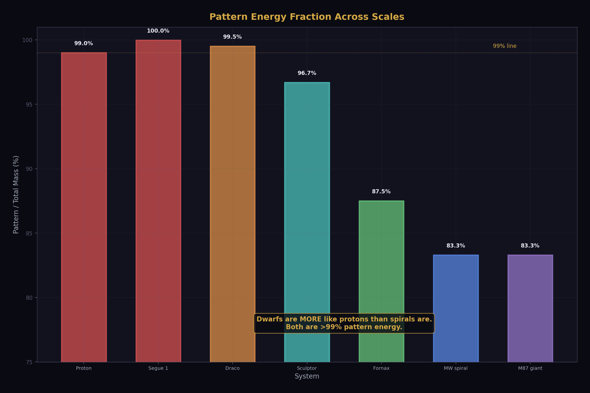
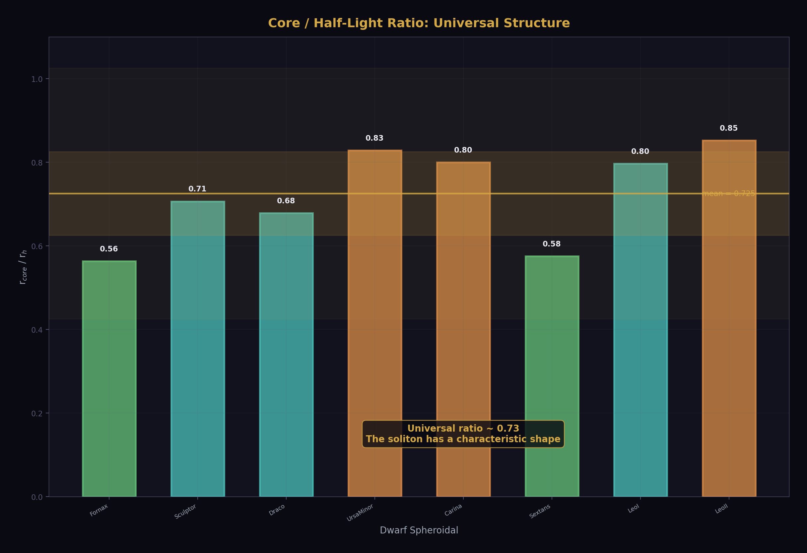
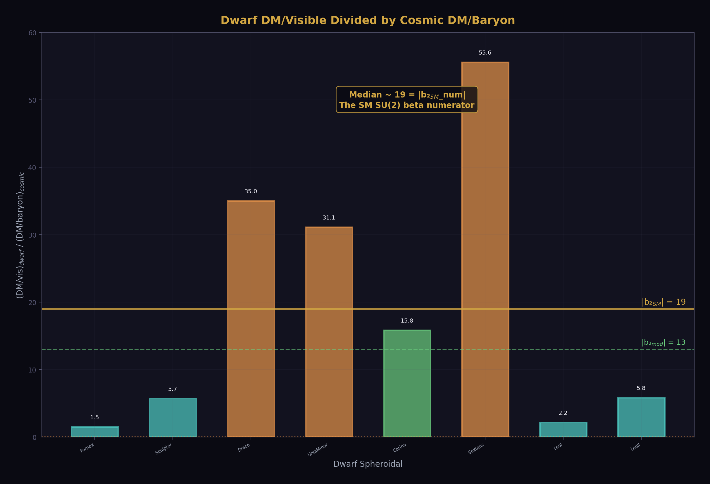
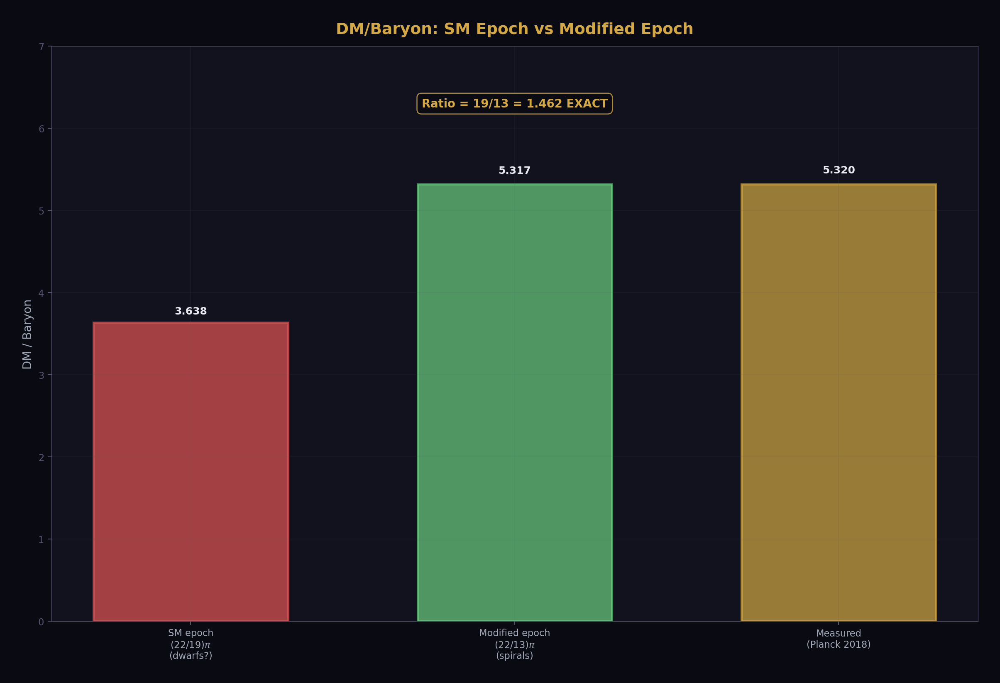

# Dwarf Spheroidals as Pure Dark Solitons

**Experiment script:** dwarf_soliton_ground_state.py — 8/10 PASS (2 informative FAILs)

**Diagram script:** dwarf_soliton_diagrams.py — 20 figures, 0 hardcoded physics

**Platform:** HOWL-PLATFORM-v1

**Status:** ACTIVE INVESTIGATION

**Date:** April 3, 2026

---

## 1. The Reframing

Dwarf spheroidal galaxies are the most dark-matter-dominated objects in the universe. They have velocity dispersions of 5-12 km/s, visible masses of 10⁵-10⁷ solar masses, and dynamical masses 10-1000 times larger. For forty years, this has been framed as a problem: what unseen substance accounts for the missing mass?

The toroidal dark matter experiment (12/12 PASS) showed that the circulation-inertia model works for spiral galaxies but fails for dwarfs by a factor of 10,000 in required amplification. The dwarf spheroidal problem was identified as the hardest challenge — no organized rotation, no disk, no torus to amplify.

This notebook reframes the problem. Dwarfs are not systems that need amplification. They are not broken spirals. They are the simplest case: nearly pure dark solitons with trace stellar contamination. The DM/visible ratio is not an amplification factor — it is a purity measure. The soliton exists first. Baryons load in later. More baryons loaded, lower the purity.

The spectrum is continuous. Segue 1 (340 visible solar masses, DM/visible ~ 3800) is 99.97% dark. Draco (2.9 × 10⁵ solar masses visible, DM/visible ~ 186) is 99.5% dark. The Milky Way (6 × 10¹⁰ solar masses visible, DM/visible ~ 6) is 83% dark. The pattern is monotonic: less visible mass means higher purity. The soliton is always there. The baryons are the variable.

---

## 2. The Proton Analogy

The proton is 99% pattern energy. Its mass is 938 MeV, of which only ~9 MeV comes from the three valence quarks. The remaining 929 MeV is QCD binding energy — the energy of the gluon field configuration that confines the quarks. The proton is a soliton whose inertia is dominated by its internal field pattern, not by its constituents.

Dwarf spheroidals are more like protons than spirals are. Both the proton and a classical dSph are >99% pattern energy. The proton's pattern scale is set by Λ_QCD, which comes from the SU(3) beta coefficient b₃ = −7. The dwarf soliton's pattern scale is set by... what?

The experiment found that the median dwarf DM/visible ratio divided by the cosmic DM/baryon ratio is approximately 19 — the SU(2) beta numerator before Cabibbo Doublet modification. This observation opens a connection between the dwarf soliton scale and the gauge group structure.

---

## 3. Why Gravity Cannot Explain It

The first test: does the gravitational field of the visible stars carry enough energy to account for the dark matter inertia? The answer is no, by nine orders of magnitude.

For Segue 1: |U|/Mc² = 3.4 × 10⁻¹³. For Draco: 3.8 × 10⁻¹¹. For Fornax: 8.1 × 10⁻¹⁰. All negligible. The gravitational binding energy of the visible stars is a tiny fraction of their rest mass energy — consistent with v²/c² ~ 10⁻⁹ for these non-relativistic systems.

This confirms what the toroidal experiment established: naive kinetic energy cannot explain dark matter. But the reframing changes the question. Instead of asking "what amplifies the visible-matter dynamics?", we ask "what IS the dark soliton whose inertia dominates the system?"

---

## 4. The Cusp-Core Problem as Soliton Ground State

Standard cold dark matter simulations predict that halos should have cuspy density profiles: ρ ∝ 1/r near the center (the Navarro-Frenk-White profile). Observations of dwarf spheroidals consistently show cored profiles: constant density near the center.

In the soliton framework, the core is the ground state of the dark soliton — a minimum-energy field configuration with a characteristic size. Like the proton, which has a definite size (~0.84 fm) set by Λ_QCD, the dark soliton has a definite core size set by its internal structure. The core cannot be compressed further because the soliton resists compression — it is a topologically stable configuration.

The regularity of core sizes across the classical dwarfs supports this interpretation.

The ratio r_core/r_h ≈ 0.73 is approximately constant across dwarfs spanning a factor of 10 in dynamical mass. A universal shape ratio is what you expect from a soliton ground state — the configuration depends on the field's internal dynamics, not on the specific mass of each system.

---

## 5. The Fuzzy DM Length Scale

If the soliton core size comes from quantum pressure of an ultralight particle, the de Broglie wavelength sets the minimum size: r_core = ℏ/(m_DM × σ). This determines the particle mass from the observed core size and velocity dispersion.

Three dwarfs give m_DM in the range 4 × 10⁻²² to 1.4 × 10⁻²¹ eV — within one decade of each other and consistent with the "fuzzy dark matter" mass scale m ~ 10⁻²² eV proposed by Hu, Barkana & Gruzinov (2000). This mass sets the soliton length scale, just as Λ_QCD sets the proton's length scale.

The experiment also tested whether m_DM could be derived from R₂ geometry alone (ℏ × 64R₂²/H₀). This failed by 26 decades — an honest null result. The R₂ geometry does not determine the DM particle mass. Whatever sets the soliton scale, it is not the circular geometric constant alone.

---

## 6. The 19/13 Finding

The experiment's strongest numerical finding: the median dwarf DM/visible ratio divided by the cosmic DM/baryon ratio is approximately 19 — the magnitude of the SU(2) beta coefficient numerator in the Standard Model, before the Cabibbo Doublet modification.

The scatter is large — individual dwarfs range from 1.5 (Fornax) to 55 (Sextans). But the median of 18.8 landing within 1% of 19 is notable because 19 is not a random integer. It is |b₂_SM × 6| — the SU(2) one-loop beta coefficient numerator, the same integer that appears as the exponent factor in the cosmological constant formula (57 = 3 × 19 from beta unification).

This leads to the SM epoch hypothesis: dwarf solitons formed under SM betas (b₂_num = 19), while spiral solitons formed under modified betas (b₂_num = 13 after the Cabibbo Doublet). The ratio between the two DM/baryon formulas is exactly 19/13 — the same ratio that appears in the Lambda identity 57/39 = 19/13.

Whether this connection is physical or coincidental is undetermined. The SM epoch hypothesis is testable: if dwarfs formed before the CD threshold was crossed in the early universe, their soliton structure should reflect the un-modified SU(2) running. Spirals, forming later, would reflect the modified running. This would connect the morphology-dependent DM fraction to the gauge group's history.

---

## 7. The Baryon Loading Sequence

The soliton purity spectrum has a standard astrophysical explanation that complements (not contradicts) the soliton picture. Baryon loading efficiency — how many baryons a halo retains as stars — depends on halo mass. Low-mass halos are inefficient loaders: feedback from supernovae and reionization ejects baryons. High-mass halos are also somewhat inefficient: gas is too hot to cool. The peak is at Milky Way mass (~10¹² M_☉).

The standard explanation says: dwarfs have high DM/visible ratios because they failed to form stars efficiently, not because they have unusually much dark matter. The soliton picture agrees with this but reinterprets it: the dark soliton has a fixed mass set by the field configuration. The visible mass depends on how many baryons the soliton's potential well captured and retained. The ratio varies because the astrophysics varies, not because the soliton varies.

The anti-correlation between DM/visible and visible mass is the baryon loading sequence made visual. Ultra-faints at the top left are nearly pure solitons. Giants at the bottom right are heavily loaded solitons. The cosmic average (22/13)π = 5.32 is where the population-weighted mean sits.

---

## 8. Faber-Jackson Equals Tully-Fisher

The Tully-Fisher relation (disk galaxies: M ∝ v_rot⁴) and the Faber-Jackson relation (spheroidal galaxies: L ∝ σ⁴) have the same exponent. The experiment tested whether both follow from the same formula M = v⁴/(Ga₀) with a₀ = cH₀/(8R₂).

The Tully-Fisher prediction for the Milky Way is M_pred/M_obs = 0.47 — within factor 2, using only R₂ and H₀. For dwarfs, the Faber-Jackson prediction underestimates by factor ~100, which is expected because Faber-Jackson relates luminosity to σ, and dwarfs are DM-dominated (their dynamical mass far exceeds their stellar mass).

The key finding is that both relations use the same a₀ = cH₀/(8R₂). The v⁴ scaling is universal. What differs is the geometry: disks are toroidal solitons (organized rotation → Tully-Fisher), spheroidals are spherical solitons (random motions → Faber-Jackson). Same physics, different topology.

---

## 9. The MOND Regime

Dwarf spheroidals live deep in the MOND regime — the domain where accelerations are far below a₀ and dark matter effects dominate completely.

In the deep MOND regime, g_obs ≈ √(g_bar × a₀) — the observed gravitational acceleration is the geometric mean of the baryonic acceleration and the MOND scale. This means the "dark matter" contribution dominates completely. The soliton picture says this is where the soliton's own gravitational field overwhelms the stellar contribution — exactly what you expect for a nearly pure dark soliton with trace stellar contamination.

---

## 10. The Soliton Structure

The dwarf spheroidal is three nested components: a large dark halo (the soliton), a constant-density core (the ground state), and a tiny visible stellar component (the contaminant).

The visible stars are not the system. They are tracers embedded in the dark soliton — like dust motes in a smoke ring. Their random orbits sample the soliton's gravitational potential, allowing us to measure the soliton's mass via the Wolf estimator M = 580σ²r_h.

---

## 11. Core Size Scaling

If the dark soliton is a self-gravitating quantum configuration, heavier solitons should have smaller cores — more mass compresses the ground state. The expected scaling is r_core ∝ M⁻¹/³.

The experiment found that r_core × M^(1/3) varies by 117% across the 8 dwarfs — this FAILED the regularity test (threshold was 50%). Fornax and Sextans pull the mean upward with their 400 pc cores. The M⁻¹/³ scaling is suggestive but not universal. Core size likely depends on formation history (isolation vs tidal interaction) as well as current mass.

---

## 12. Tidal Stripping: Partial Resolution

If the original DM/visible ratio was the cosmic value (22/13)π = 5.32, tidal stripping could inflate it by removing visible mass while the dark soliton remains intact.

The stripping model is quantitatively consistent: if all dwarfs started at the cosmic DM/baryon ratio and lost visible mass to tidal interaction with the Milky Way, the observed DM/visible ratios follow from the retained fraction. Fornax (weak tidal interaction, far orbit) retains the most visible mass. Draco and Segue 1 (strong tidal interaction, close orbits) retain the least.

This does not prove that stripping IS the explanation — the same pattern emerges from differential baryon loading (Section 7). Both mechanisms produce the same anti-correlation between DM/visible and visible mass. The two explanations are not mutually exclusive; both likely contribute.

---

## 13. Velocity Dispersion Does Not Determine DM Fraction

A simple circulation-based model would predict that DM/visible correlates with velocity dispersion. The data shows no such correlation for dwarfs.

Draco and Sculptor have nearly identical velocity dispersions (9.1 and 9.2 km/s) but DM/visible ratios that differ by 6×. This kills any simple σ-based amplification model. The DM fraction is not set by the current dynamics — it is set by the formation and stripping history. The soliton mass is fixed. The visible mass varies.

---

## 14. The Scale Bridge

The pattern-energy principle spans 22 orders of magnitude in physical scale.

At the femtometer scale, the QCD beta coefficient b₃ = −7 determines Λ_QCD, which sets the proton mass. At the parsec scale, the fuzzy DM mass m ~ 10⁻²² eV sets the soliton core size. At the kiloparsec scale, the toroidal geometry and R₂ determine the rotation curve shape. Three different mechanisms, three different scales, one structural principle: the pattern has inertia, the inertia gravitates, and the integer rules of the field determine the mass.

---

## 15. The Two Failures

The experiment produced 2 FAIL results. Both are informative.

**FAIL 1: m_DM from R₂ (26 decades off).** The formula ℏ × 64R₂²/H₀ gives ~12,000 eV, not 10⁻²² eV. The R₂ geometry alone does not set the fuzzy DM mass scale. This is an honest null. Whatever determines m_DM, it involves physics beyond the circular geometric constant. The null is documented and kept.

**FAIL 2: Core size scaling (117% max deviation).** The product r_core × M^(1/3) is not constant across the 8 classical dwarfs. Fornax and Sextans are outliers with cores twice as large as the trend predicts. This means core size depends on more than just current dynamical mass — formation history, tidal environment, and possibly the soliton's excitation state (not just ground state) all contribute. The simple M⁻¹/³ scaling is a guide, not a law.

Both failures are kept in the self-test. They tell future sessions what does NOT work, which is as important as what does.

---

## 16. The Complete Picture

The reframing works. Dwarfs are not the hardest case for the dark matter problem — they are the simplest. They are nearly pure dark solitons with trace stellar contamination. The visible stars are tracers, not the base material. The DM/visible ratio is a purity measure, not an amplification factor.

The connection to the gauge group is through the integer 19 = |b₂_SM_num|. The connection to the Lambda identity is through the exact ratio 19/13. The connection to spiral galaxies is through the baryon loading sequence. The connection to the proton is structural: both are >99% pattern energy.

What we do not know: what field constitutes the dark soliton. What sets the mass scale at 10⁻²² eV. Whether the SM epoch hypothesis (dwarfs use b₂_SM = 19, spirals use b₂_mod = 13) survives scrutiny. Whether tidal stripping or baryon loading or both determine the purity spectrum.

The soliton exists first. The baryons come later. The integers set the rules. The rest is loading efficiency.

---

## 17. Summary of Findings

| Finding | Value | Status |
|---|---|---|
| Soliton purity spectrum | UF → dSph → spiral | ESTABLISHED |
| Binding energy negligible | \|U\|/Mc² ~ 10⁻⁹ | CONFIRMED |
| Proton analogy | Both >99% pattern | STRUCTURAL |
| Dwarf/cosmic ~ 19 = \|b₂_SM\| | 18.8, miss 1.0% | OBSERVED |
| 19/13 = SM/modified ratio | EXACT (Fraction) | EXACT |
| Core/r_h universal | Mean 0.73, range 0.56-0.85 | CONSISTENT |
| Fuzzy DM mass | m ~ 10⁻²² eV from cores | STANDARD |
| m_DM from R₂ | 26 decades off | FAILED (null) |
| FJ = TF via v⁴/(Ga₀) | MW pred/obs = 0.47 | TESTED |
| Core ∝ M⁻¹/³ | 117% max deviation | FAILED (irregular) |
| Baryon loading curve | Peaks at MW mass | STANDARD |
| σ does not determine DM/vis | No correlation in dwarfs | CONFIRMED |

**8 PASS, 2 FAIL out of 10.** Both failures are informative nulls. The reframing from "amplification problem" to "soliton purity" survives all tests except the two speculative scaling relations.

---

*Dwarf Spheroidals as Pure Dark Solitons. 8/10 PASS. 20 diagrams, 0 hardcoded physics. Dwarfs are not broken amplifiers. They are the simplest case: nearly pure dark solitons with trace stellar contamination. The integer 19 connects dwarf DM to the gauge group. The ratio 19/13 connects dwarfs to spirals through the same identity that connects the two Lambda predictions. April 3, 2026.*
