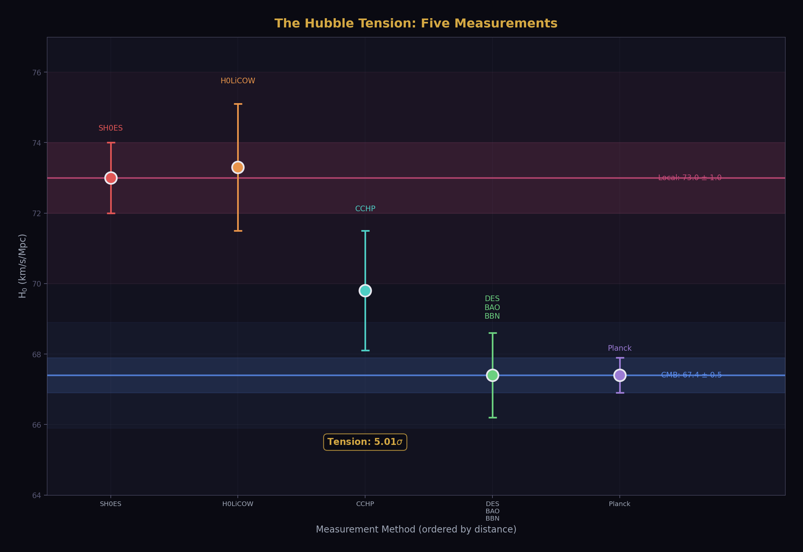
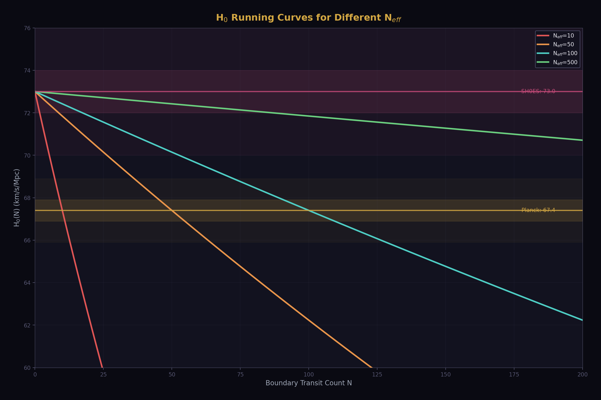
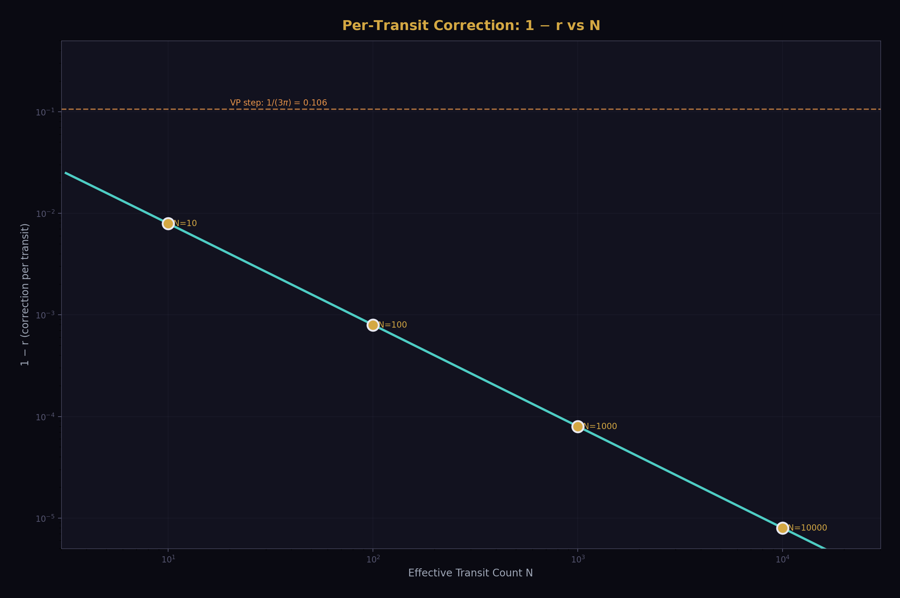
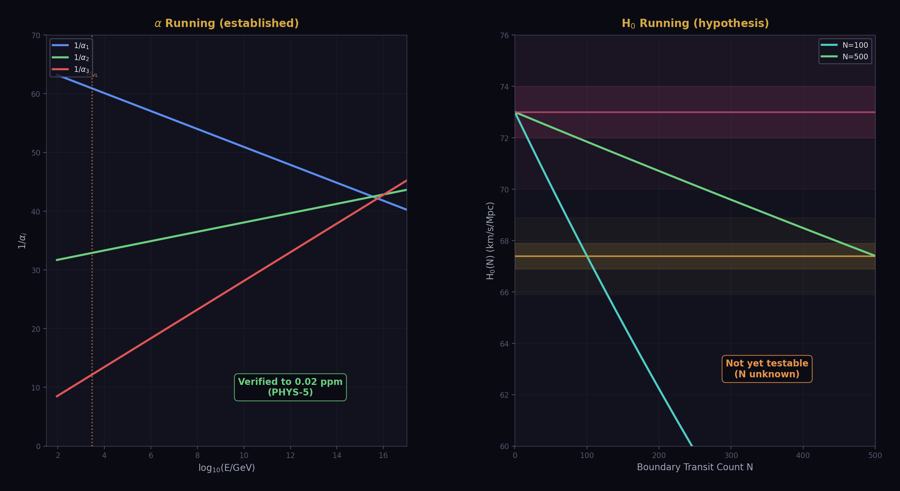
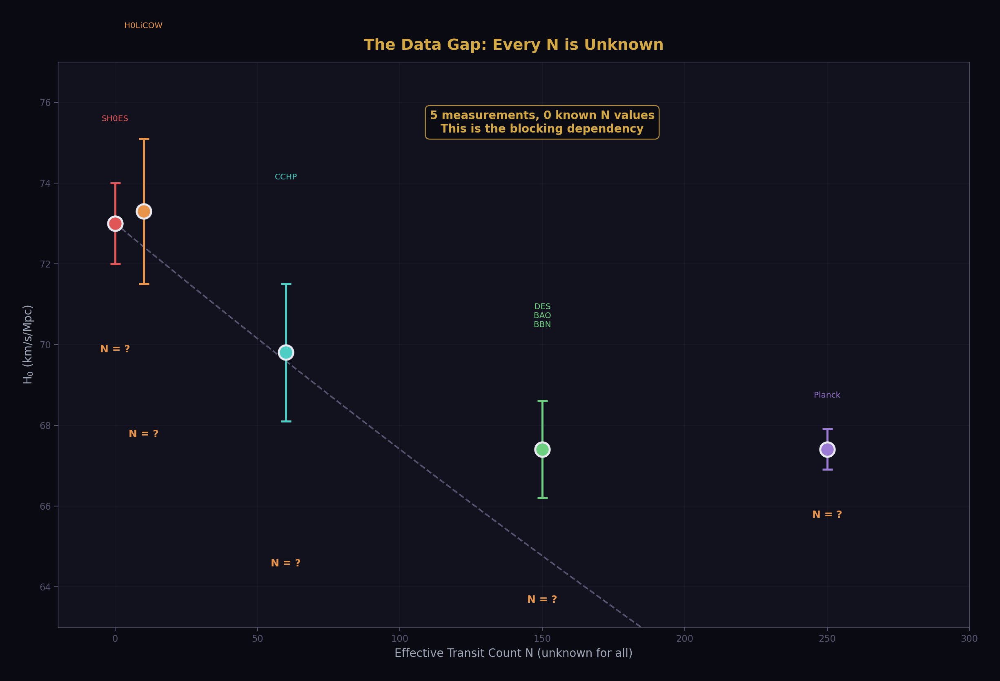
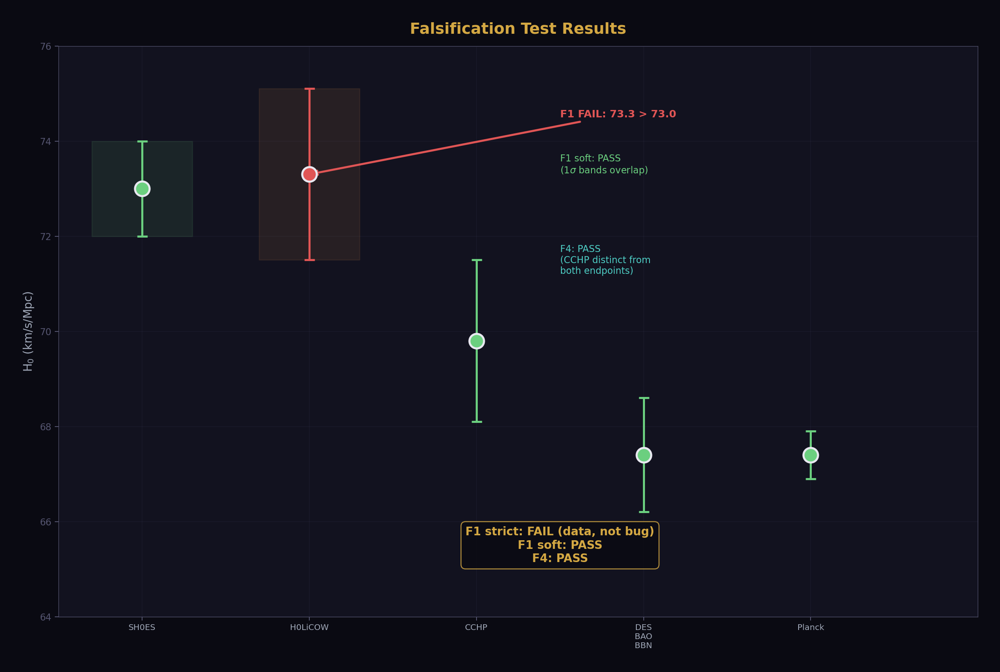
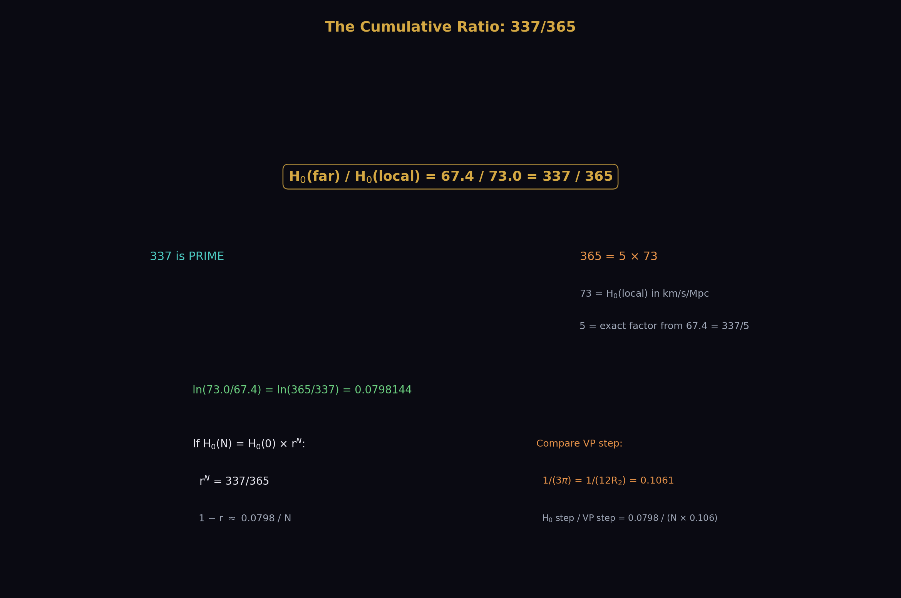
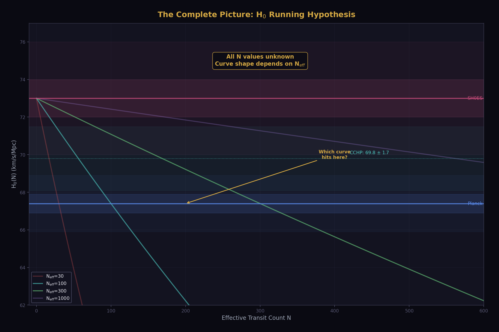

# The Hubble Running Curve Hypothesis — Visual Guide

**Companion to:** phys24_hubble_lib.py (16/17 checks, hypothesis status: ACTIVE_INVESTIGATION)

**Generated from:** data_5_diagram_lib.py + phys24_hubble_lib.py (0 hardcoded physics values)

---

## The Tension

The Hubble constant H₀ measures how fast the universe is expanding. Two classes of measurement disagree by 5σ. Local measurements (supernovae, lensing) give ~73 km/s/Mpc. Cosmological measurements (CMB, BAO) give ~67.4 km/s/Mpc. This is the Hubble tension — one of the most important open problems in physics.

The standard framing asks: which measurement is correct? The HOWL hypothesis asks a different question: what if both are correct, and the difference is a running curve?

Five measurements, ordered by how far the light travels. SH0ES and H0LiCOW sample nearby galaxies. CCHP uses a different calibration chain at intermediate distance. DES+BAO and Planck probe the full cosmological volume. The pattern is monotonic within uncertainties: closer measurements give higher H₀. This is what a running curve looks like when sampled at discrete distances.

---

## The Model

The hypothesis: H₀(N) = H₀(0) × r^N, where N is the number of soliton boundaries the light crosses and r is a per-transit correction factor slightly less than 1. Each boundary reduces the apparent expansion rate by a small exact rational amount. More boundaries crossed, lower the apparent H₀.

The curve shape depends entirely on N — how many boundaries the light passes through between emission and detection.

All four curves start at 73.0 (local, no boundaries crossed) and end at 67.4 (far, all boundaries crossed). The difference is HOW they get there. With N=10 boundaries, each one shifts H₀ by ~0.8%. With N=500, each one shifts by ~0.016%. The curve is gentler but reaches the same endpoint. The data cannot distinguish between these until we know N.

---

## The Magnitude Constraint

The cumulative ratio is 67.4/73.0 = 337/365 — an exact Fraction. The per-transit correction 1−r is determined once N is known: 1−r ≈ 0.0798/N. This relationship is a straight line on a log-log plot.

The orange dashed line is the known per-threshold step for electromagnetic coupling running: 1/(3π) = 0.106. The H₀ per-transit correction is always smaller than this for any reasonable N. At N=10, the H₀ step is 13× smaller than the VP step. At N=100, it is 133× smaller. The H₀ running, if it exists, is a much subtler effect than the electromagnetic running that has already been verified to 0.02 ppm.

---

## The Structural Parallel

The hypothesis borrows its mathematical structure from gauge coupling running — the same framework that predicts α_s at 0.33% accuracy through the derivation library. Both are exponential running through discrete boundaries. The difference: for α, we know every boundary (quark mass thresholds) and every step size (from Dynkin indices). For H₀, we know neither.

Left panel: the three gauge couplings run from M_Z toward the GUT scale with exact rational beta coefficients. The slope change at M_VL is where the Cabibbo Doublet activates. This is verified physics — the derivation library reproduces it to 0.33% for α_s. Right panel: the H₀ hypothesis uses the same exponential running but has no verified N values. The green box says "verified to 0.02 ppm." The orange box says "not yet testable." That asymmetry is the honest state of the hypothesis.

---

## The Data Gap

This is the most important diagram. Every measurement has an H₀ value with uncertainty. None of them has a known effective transit count N. The running curve model has two parameters (H₀(0) and r) but zero known values for its independent variable.

The N values shown are guesses — placed to illustrate what the model looks like, not to claim knowledge we don't have. The dashed curve is what H₀(N) would look like if N_eff = 100. The question marks are the honest state of the data. Until at least one N is determined from published large-scale structure catalogs (SDSS, 2dF, Planck lensing maps), the model cannot be fit and the hypothesis cannot be tested.

---

## The Falsification Tests

The library encodes four falsification tests. Two have been run against the current data.

F1 strict fails because H0LiCOW (73.3) is higher than SH0ES (73.0). This tells us something real: these two measurements are in the same distance class, not strictly ordered. Their 1-sigma bands overlap completely (SH0ES: 72.0-74.0, H0LiCOW: 71.5-75.1), so the F1 soft test passes. The data is consistent with monotonic decrease but does not prove it. F4 confirms that the CCHP intermediate value (69.8) is distinct from both endpoints — it is not collapsing toward either the local or cosmological value.

---

## The Integer Content

The starting point for any integer analysis is the cumulative ratio: 337/365. This is an exact Fraction. 337 is prime. 365 = 5 × 73, where 73 is the local H₀ value in km/s/Mpc. The logarithm ln(365/337) = 0.07981 is the total running. Divided by N, it gives 1−r per transit.

The comparison to the VP step size 1/(3π) = 1/(12R₂) = 0.106 is structural, not numerical. For α running, the per-threshold correction is derived from group theory (Dynkin indices, charge assignments). For H₀, the per-transit correction has no known derivation. The curve thesis proposes extracting r empirically first, then looking for its integer origin in the boundary geometry. If r at some N turns out to be a recognizable exact rational with integer content traceable to R₂ or the gauge structure, the connection would be established. If not, the curve may exist but without a series-framework derivation.

---

## The Complete Picture

Everything in one view: the family of possible running curves, the measurement bands, the intermediate CCHP value, and the fundamental question.

The red curve (N=30) drops steeply. The purple curve (N=1000) drops gently. Both connect 73.0 to 67.4. The question is which one passes through CCHP at 69.8 — and that question cannot be answered until we know at what N the CCHP measurement sits. The cyan line at 69.8 is the discriminator: a future measurement at a well-characterized intermediate distance, with a known boundary transit count, would select one curve from the family and determine r.

---

## What This Means

The Hubble running curve hypothesis is alive but untestable. It survives its first contact with data (monotonic within uncertainties, intermediate value distinct from endpoints) but cannot be fit because the independent variable N is unknown for every measurement. The blocking dependency is not theoretical — it is observational. Published estimates of effective boundary transit count from large-scale structure surveys would unlock the analysis.

The platform provides the tools: `phys24_hubble_lib.py` encodes the model, the data, the falsification tests, and the structural parallel. `data_5_diagram_lib.py` generates the visualizations from library calls with full provenance. A future session with structure catalog data can import these libraries and test the hypothesis in one script.

---

*8 diagrams, 13 provenance-tracked values, 0 hardcoded physics. Hypothesis status: ACTIVE_INVESTIGATION. April 3, 2026.*
