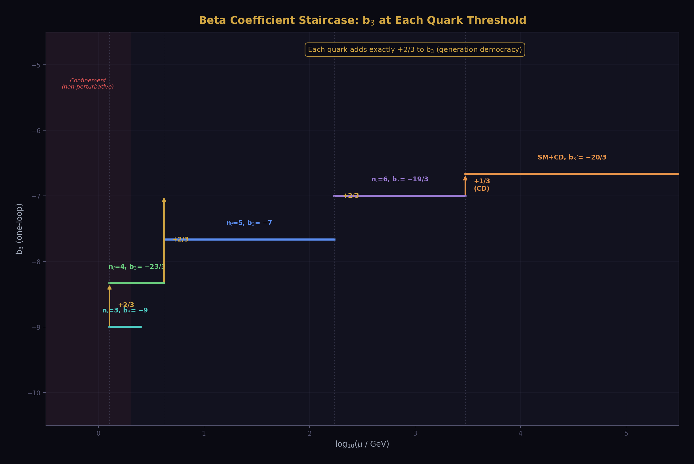
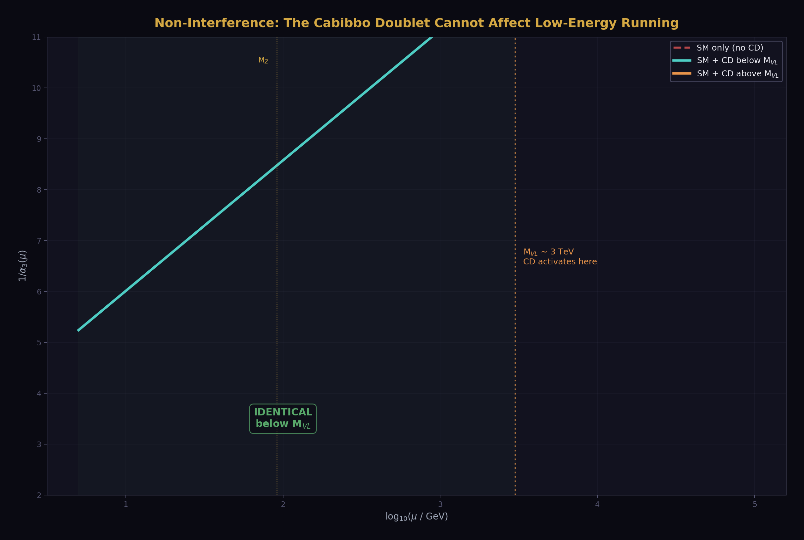
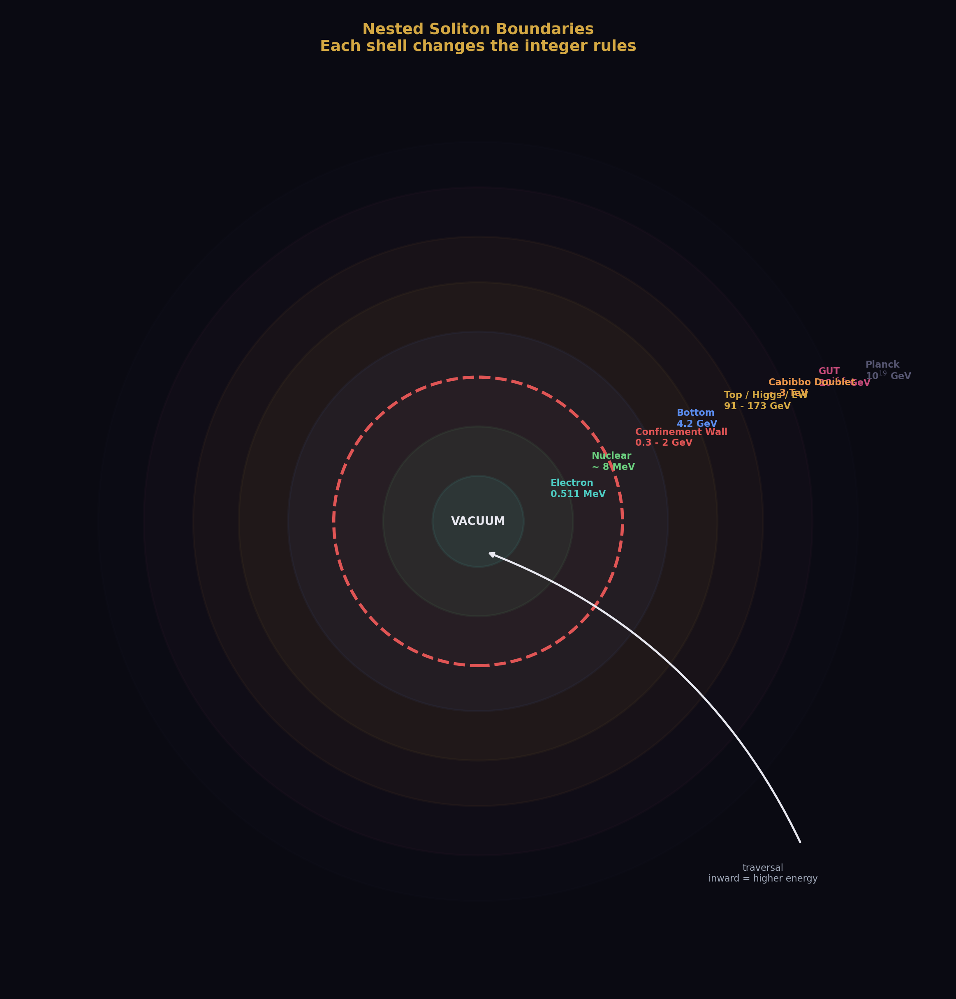
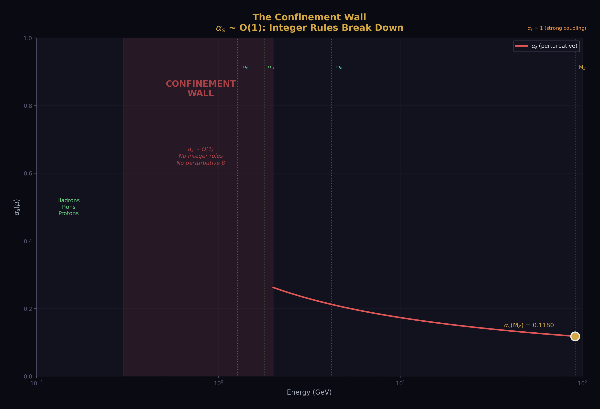
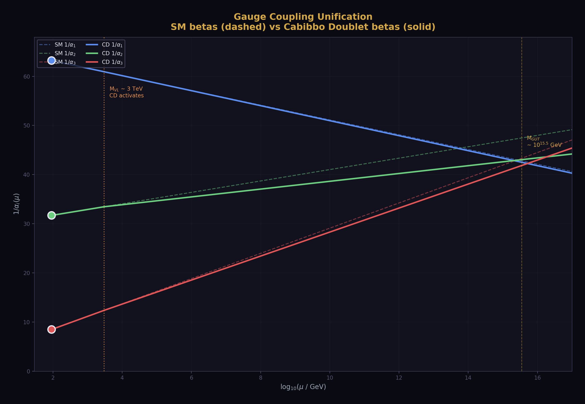
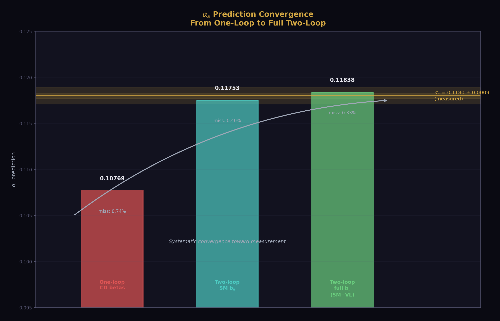

# The Soliton Boundary Hierarchy
## A Guide to How Running Works in the HOWL Framework

**For:** Anyone starting the HOWL series who needs to understand what boundaries are, how couplings run, and why nested structures cannot interfere with each other's natural running.

**Prerequisite knowledge:** None. This document builds from scratch.

**Platform reference:** phys24_lib.py, phys24_boundary_map_lib.py, phys24_domain_lib.py

---

## 1. What Is a Coupling?

A coupling is how strongly a force grabs things.

Electromagnetism grabs electrons. The coupling — called α, the fine structure constant — tells you how strongly. Roughly α ≈ 1/137. That means every time a photon interacts with an electron, there is a factor of about 1/137 suppressing the interaction. Weak enough to compute perturbatively. Strong enough to hold atoms together.

The strong force grabs quarks. Its coupling — called α_s — is about 0.118 at the Z boson mass scale. That is 16 times stronger than electromagnetism. At lower energies, α_s grows until it becomes O(1) and quarks are permanently confined inside hadrons.

The weak force grabs everything with a weak charge. Its coupling is intermediate, buried inside the electroweak mixing angle sin²θ_W ≈ 0.231.

These three couplings are the three knobs of the Standard Model's gauge structure. They are not constants. They change with energy. That change is called running.

---

## 2. What Is Running?

Imagine you are looking at an electric charge through a cloud of virtual electron-positron pairs. Close up, you see the bare charge — strong. Far away, the cloud screens it — you see a weaker effective charge. The further away you look (lower energy), the more screening, the weaker the charge appears.

That is running. The coupling you measure depends on the energy at which you measure it.

The mathematical description is the renormalization group equation:

```
d(1/α_i)/d(ln μ) = -b_i / (2π)
```

where μ is the energy scale and b_i is the beta coefficient. This says: as you go up in energy, the inverse coupling changes at a rate determined by b_i. The sign of b_i determines whether the coupling grows or shrinks.

In the HOWL framework, this is expressed as:

```
1/α_i(μ) = 1/α_i(μ₀) - b_i × L
```

where L = ln(μ/μ₀)/(2π) is the dimensionless logarithmic distance between two energy scales. L is positive when running up in energy.

The key insight: **b_i is an exact rational number determined entirely by the gauge group and the particle content.** It is not measured. It is not approximate. It is a mathematical consequence of the theory's structure. In the HOWL classification, b_i is Level 1 — determined by the framework, not by the universe.

The coupling values at any particular energy are Level 2 — supplied by measurement. The universe tells you how much. The framework tells you how it changes.

---

## 3. What Is a Soliton Boundary?

A soliton boundary is an energy scale where the rules change.

Below the bottom quark mass (~4.18 GeV), the bottom quark is too heavy to create from the vacuum. It does not participate in screening or antiscreening. It is frozen — a dormant vortex. The beta coefficients are computed with 5 active quark flavors.

Above the bottom quark mass, the bottom quark is active. It participates in the vacuum polarization. The beta coefficients now include its contribution. The numbers change by exact rational amounts — the Dynkin index contributions of the bottom quark's representation.

The energy μ = m_b is a soliton boundary. Below it, one set of integer rules. Above it, a different set. The crossing is sharp in principle (smeared in practice by threshold corrections that are small and computable).

The word "soliton" is used because the boundary is stable. It does not drift. The bottom quark mass is what it is. The boundary is a fixed feature of the energy landscape, like a wall in a building. You can walk up to it, but you cannot move it.

In the HOWL boundary map (phys24_boundary_map_lib.py), there are 19 such boundaries from the Planck scale down to macroscopic. Each one marks where the integer rules change.

---

## 4. What Changes at a Boundary?



At each boundary, the beta coefficients shift by exact rational numbers determined by the particle that becomes active.

For the Standard Model, the one-loop beta coefficients are:

```
b₁ = 41/10    (U(1), electromagnetic-like)
b₂ = -19/6    (SU(2), weak)
b₃ = -7       (SU(3), strong)
```

These are exact Fractions. They come from summing the contributions of all active particles: 3 generations of fermions, the Higgs doublet, and the gauge bosons themselves.

When you cross a boundary — say, the Cabibbo Doublet threshold at ~3 TeV — the new particle adds its Dynkin index contribution:

```
Δb₁ = 1/15
Δb₂ = 1
Δb₃ = 1/3
```

Above the boundary, the modified betas are:

```
b₁' = 41/10 + 1/15 = 25/6
b₂' = -19/6 + 1    = -13/6
b₃' = -7 + 1/3     = -20/3
```

These are still exact Fractions. The integer rules changed, but they are still integer rules. The running continues with different slopes.

This is the structure at every boundary:

| Below boundary | At boundary | Above boundary |
|---|---|---|
| Betas = b_i | Particle activates | Betas = b_i + Δb_i |
| Coupling runs with old slope | Coupling is continuous | Coupling runs with new slope |
| Old integer rules | Rules change by exact rationals | New integer rules |

---

## 5. The Hierarchy: Nested Boundaries


The real energy landscape has many boundaries, nested inside each other. From bottom to top in energy:

```
m_e (0.511 MeV) — electron activates
m_μ (105.7 MeV) — muon activates
Λ_QCD (~300 MeV) — confinement wall begins
~2 GeV — confinement wall ends
m_c (1.27 GeV) — charm activates
m_τ (1.78 GeV) — tau activates
m_b (4.18 GeV) — bottom activates
M_W (80.4 GeV) — W boson threshold
M_Z (91.2 GeV) — electroweak reference scale
m_H (125.2 GeV) — Higgs activates
m_t (172.6 GeV) — top activates
M_VL (~3 TeV) — Cabibbo Doublet activates (staged)
M_GUT (~3.5 × 10¹⁵ GeV) — unification (theoretical)
M_Planck (~1.2 × 10¹⁹ GeV) — quantum gravity (unknown)
```

Each boundary is a shell. The shells are nested like Russian dolls — you pass through each one as you go up in energy. At each shell, the integer rules change by the exact rational contribution of the particle that lives at that shell.

Between any two shells, the running is governed by the current set of integer rules. The coupling evolves smoothly. There are no surprises. The slope is fixed by the active particle content.

This is what the HOWL framework calls the **soliton boundary hierarchy**: a sequence of nested shells, each with well-defined integer rules, connected by smooth running between them.

---

## 6. The Non-Interference Principle



This is the most important structural property of the hierarchy.

**A soliton boundary cannot influence the natural running of a domain below it.**

Here is why. Consider the domain between the bottom quark (4.18 GeV) and the Z boson (91.2 GeV). In this domain, the SM has 5 active quark flavors, 3 charged leptons, the gauge bosons, and the Higgs (the Higgs is actually near the top of this range, but set that aside for clarity). The beta coefficients are fixed exact rationals.

Now consider the Cabibbo Doublet at ~3 TeV. It is above this domain. It has not activated yet. Its contribution to the beta coefficients is exactly zero below its mass threshold. It might as well not exist.

This is not an approximation. It is exact. In the decoupling theorem (Appelquist-Carazzone), particles heavier than the current energy scale decouple from low-energy physics up to corrections suppressed by powers of (μ/M_heavy)². At one loop, the decoupling is exact — there is no contribution at all.

The consequence: the running between 4.18 GeV and 91.2 GeV is determined entirely by the particles that live in that domain. No particle above 91.2 GeV affects it. No particle at the GUT scale affects it. No particle at the Planck scale affects it. The domain is autonomous.

```
BELOW m_b: 4-flavor running, determined by 4 quarks + leptons + bosons
BETWEEN m_b AND M_Z: 5-flavor running, adding bottom quark
BETWEEN M_Z AND m_t: full SM, adding Z and W thresholds  
BETWEEN m_t AND M_VL: full SM + top
ABOVE M_VL: SM + Cabibbo Doublet
```

Each domain runs according to its own integer rules. The boundaries stack. They do not leak.

---

## 7. Why Nested Solitons Cannot Interfere



Think of it this way. You are standing inside a building with many floors. On each floor, the temperature is set by the thermostat on that floor. The thermostat on floor 5 does not affect floor 3. The walls (soliton boundaries) separate the floors completely.

When you walk from floor 3 to floor 5, you pass through floor 4. At each floor boundary, the thermostat setting changes. But while you are on floor 4, only floor 4's thermostat matters. Floor 5's thermostat has no influence on your experience on floor 4.

In physics terms: a particle with mass M contributes to the beta function only at energies μ ≥ M. Below M, it decouples exactly. Its presence is invisible to low-energy running.

This means:

**1. The order of boundaries matters, but only sequentially.**

You cannot skip a boundary. Running from m_e to M_GUT means passing through every boundary in order. At each one, the rules update. The final coupling at M_GUT depends on the full sequence — but each segment of the sequence is governed only by the particles active in that segment.

**2. A boundary above you cannot change your running.**

If you are computing α_s at 10 GeV, it does not matter whether the Cabibbo Doublet exists at 3 TeV or 6 TeV or not at all. The running between 5 GeV and 10 GeV is determined by the 5-flavor SM. Period. The CD's mass, mixing angles, and quantum numbers are irrelevant to this computation.

**3. A boundary below you already happened.**

If you are computing couplings at 1 TeV, the bottom quark is already active. Its contribution is baked into the beta coefficients you are using. You do not need to "remember" the bottom threshold — it is already accounted for by using the 5-flavor betas above m_b. The boundary below you already changed the rules, and you are running with the updated rules.

**4. The only ambiguity is at the boundary itself.**

Threshold corrections — the small effects of a particle near its mass threshold where it is neither fully active nor fully decoupled — are the only place where the sharp boundary picture is approximate. These corrections are computable and typically small (a few percent of one-loop effects). They do not violate the hierarchy; they smear it slightly.

---

## 8. The Confinement Wall: Where the Hierarchy Breaks



There is one exception to the clean hierarchy picture: the confinement wall.

Between about 300 MeV (Λ_QCD) and 2 GeV, the strong coupling α_s becomes O(1). Perturbation theory fails. The beta function formula is no longer valid. Quarks are confined inside hadrons. The integer rules do not apply.

In the HOWL boundary map, this region is marked with `perturbative: False`. The coupling values are `None` — unknown in the perturbative framework. The beta coefficients are not meaningful.

This is the one blank zone in the entire 0 → M_GUT energy landscape. Everything below the confinement wall (atomic physics, nuclear binding, chemistry) and everything above it (perturbative QCD, electroweak physics, unification) is governed by exact rational integer rules. The wall itself is not.

The HOWL framework does not pretend to fill this zone. It marks it honestly:

```python
# From phys24_boundary_map_lib.py
{
    "name": "Confinement wall (upper face)",
    "scale_MeV": Fraction(2000, 1),
    "couplings_at_boundary": {"alpha_s": None},
    "perturbative": False,
    "open_questions": [
        "Is there a precise definition of the confinement boundary?",
        "What is alpha_s at the transition?",
    ],
}
```

None means unknown. Unknown is not a failure — it is the honest state of the map.

---

## 9. How to Read the Boundary Map

The boundary map in phys24_boundary_map_lib.py encodes the full hierarchy. You can traverse it programmatically:

```python
from phys24_lib import *
from phys24_boundary_map_lib import *

# What boundaries exist between the electron and the GUT scale?
report = traverse(m_e, Fraction(10**19, 1))

print("Boundaries crossed:", report["count"])
# 15 boundaries

# Which couplings are unknown?
for bname, cname in report["unknown_couplings"]:
    print("  UNKNOWN: %s at %s" % (cname, bname))
# alpha_s at confinement wall (both faces)
# alpha_s at top threshold
# All couplings at CD and GUT (not yet measured)

# What questions are open?
for bname, q in report["open_questions"]:
    print("  [%s] %s" % (bname, q))
```

Each boundary in the stack has:
- A scale (measured, estimated, or None)
- What changes there (which integer rules update)
- Coupling values (Fraction if known, None if not)
- Which forces are affected
- Open questions (what we don't yet understand)

The traversal function returns all of this in a structured dict. You can feed it to a computation function that processes each boundary in sequence, accumulating the running from one domain to the next.

---

## 10. How Running Accumulates Through the Hierarchy



A complete running computation from M_Z down to some low scale (or up to M_GUT) works as follows:

**Step 1: Start with measured values.**

At M_Z = 91.2 GeV, the three inverse couplings are known from DATA-4:

```python
from phys24_lib import *
from data_4_derivation_lib import *

ia1, ia2, ia3 = derive_couplings(alpha_inv, sin2_tW, alpha_s)
# 1/α₁ ≈ 63.21, 1/α₂ ≈ 31.69, 1/α₃ ≈ 8.47
```

**Step 2: Identify the boundaries above M_Z.**

```
m_H = 125.2 GeV — Higgs
m_t = 172.6 GeV — top quark
M_VL ~ 3 TeV — Cabibbo Doublet (staged)
M_GUT ~ 3.5 × 10¹⁵ GeV — unification
```

**Step 3: Run through each domain with its own betas.**

Between M_Z and m_t: SM betas (b₁, b₂, b₃) = (41/10, -19/6, -7).

Between m_t and M_VL: same SM betas (top is now active, but it was already included in the standard SM beta coefficients which assume 6 quarks).

Between M_VL and M_GUT: modified betas (b₁', b₂', b₃') = (25/6, -13/6, -20/3).

**Step 4: At each boundary, the coupling values are continuous.**

The coupling does not jump at a boundary. It is continuous — the slope changes, not the value. Think of a road that changes gradient at a hill crest. Your altitude is continuous even though the slope changes.

**Step 5: At M_GUT, check for unification.**

If the three couplings meet at one point, the theory unifies. The gap ratio measures how close they come:

```
gap_measured ≈ 1.358  (from the three couplings at M_Z)
gap_SM = 218/115 ≈ 1.896  (what SM betas predict — 40% miss)
gap_CD = 38/27 ≈ 1.407  (what CD betas predict — 3.6% miss)
```

The CD improves the gap ratio by an order of magnitude. Two-loop corrections improve it further (α_s prediction at 0.33% miss).

---

## 11. The Hierarchy as a Stack



Here is the full picture, drawn as a stack:

```
SCALE              BETAS              ACTIVE CONTENT
━━━━━━━━━━━━━━━━━━━━━━━━━━━━━━━━━━━━━━━━━━━━━━━━━━━━━━━━

M_Planck           ???               Quantum gravity (unknown)
    │
    │  ??? domain: no known rules
    │
M_GUT              unified           All SM + CD + GUT particles
    │
    │  CD domain: b' = (25/6, -13/6, -20/3)
    │  The three couplings converge toward unification
    │
M_VL (~3 TeV)      SM → SM+CD        Cabibbo Doublet activates
    │
    │  SM domain: b = (41/10, -19/6, -7)
    │  Top, Higgs, W, Z all active
    │  Three couplings run with SM slopes
    │
m_t (172.6 GeV)    ← top activates
m_H (125.2 GeV)    ← Higgs activates
M_Z (91.2 GeV)     ← Reference scale: all couplings measured here
M_W (80.4 GeV)     ← W activates
    │
    │  SM domain continues: same betas
    │
m_b (4.18 GeV)     ← bottom activates
    │
    │  5-flavor domain (above confinement)
    │
m_τ (1.78 GeV)     ← tau activates
m_c (1.27 GeV)     ← charm activates
    │
    │  Confinement wall: α_s ~ O(1)
    │  INTEGER RULES DO NOT APPLY HERE
    │  No perturbative beta function
    │  This is the BLANK ZONE
    │
~300 MeV (Λ_QCD)   ← confinement begins
    │
    │  Hadronic domain: protons, pions, nuclei
    │  Governed by residual strong force (not perturbative QCD)
    │
m_μ (105.7 MeV)    ← muon decouples
    │
    │  QED domain: photon + electron only
    │  Coupling runs very slowly (b_EM small)
    │
m_e (0.511 MeV)    ← electron decouples
    │
    │  Pure photon domain: no charged particles
    │  α_EM frozen at ~1/137.036
    │
0                   empty vacuum
```

Every horizontal line is a soliton boundary. Every vertical segment is a domain with fixed integer rules. The running within each domain is determined solely by the particles active in that domain. Nothing above can reach down. Nothing below can reach up. The hierarchy is strictly layered.

---

## 12. What the Platform Gives You


The HOWL platform libraries encode this entire hierarchy computationally.

**phys24_lib.py** stores every coupling value, every beta coefficient, every mass threshold as exact Fractions.

**data_4_derivation_lib.py** provides functions to run through the hierarchy: `run_one_loop_frac` for one domain, `run_two_loop_euler` for full two-loop evolution, `find_crossing_L` for the unification point, `predict_alpha_s_one_loop` and `predict_alpha_s_two_loop` for predictions that traverse the entire stack.

**phys24_boundary_map_lib.py** stores the 19 boundaries as a traversable stack. `traverse(start, end)` returns every boundary crossed, every coupling value (or None), and every open question along the path.

**phys24_structure_lib.py** stores the representations that live at each boundary. `make_rep` computes the Dynkin index contribution (Δb₁, Δb₂, Δb₃) of any representation from its quantum numbers. `generation_betas()` confirms that complete fermion generations contribute (4/3, 4/3, 4/3) — equal across all three gauge groups.

**phys24_domain_lib.py** extends the boundary picture across all 17 engineering and physics domains where R₂ = π/4 appears. The geometric conversion R₂ × d² is the same in pipe flow, wire resistance, antenna gain, disc spot size, and loop integrals. The coordinator Z is what makes each domain different.

Together, these five libraries are the executable map of the soliton boundary hierarchy from the Planck scale to macroscopic reality, with honest None values at every point where the answer is not yet known.

---

## 13. Summary: The Three Rules

**Rule 1: The integer rules are exact.** Beta coefficients are exact Fractions determined by the gauge group and the active particle content. They are not approximate. They are not measured. They are Level 1 — computed from the framework.

**Rule 2: The values run between boundaries.** Coupling constants are Level 2 — measured at one scale and then evolved to other scales using the integer rules. The running is smooth and continuous within each domain. The slope changes at each boundary.

**Rule 3: Boundaries stack without interference.** A particle that is too heavy to create at the current energy has exactly zero influence on the running. The hierarchy is strictly layered. Each domain is autonomous. The only exceptions are threshold corrections (small, computable) and the confinement wall (marked as unknown).

These three rules generate the entire structure of the HOWL energy landscape: 19 boundaries, exact rational beta coefficients at each level, smooth running between levels, honest None values where the physics is not known. The platform libraries implement all of it. The scripts verify all of it. The papers document all of it.

The soliton boundary hierarchy is not a metaphor. It is the actual structure of how gauge couplings run across 19 orders of magnitude in energy, from the electron mass to the Planck scale. The HOWL framework makes that structure computationally explicit, verifiably exact, and honestly incomplete where it should be.

---

*The Soliton Boundary Hierarchy. 19 boundaries, 3 rules, 306 verified checks. The integer rules are exact. The values run. The boundaries do not interfere. April 3, 2026.*

