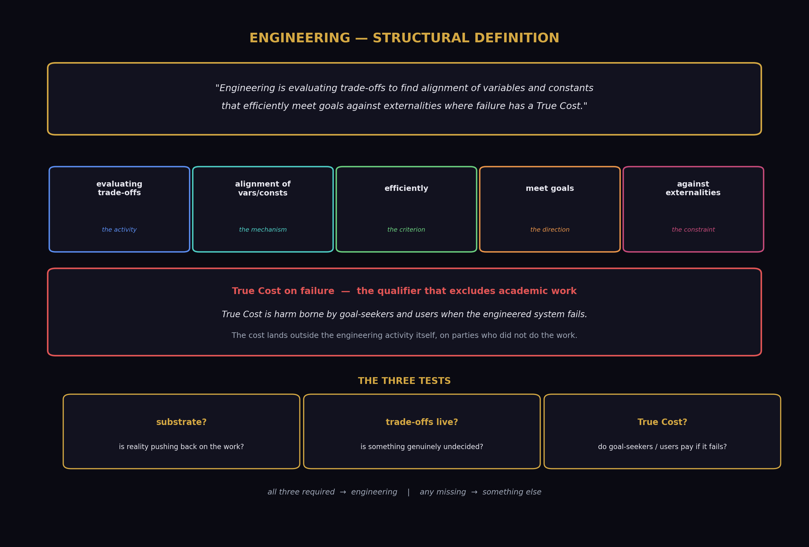
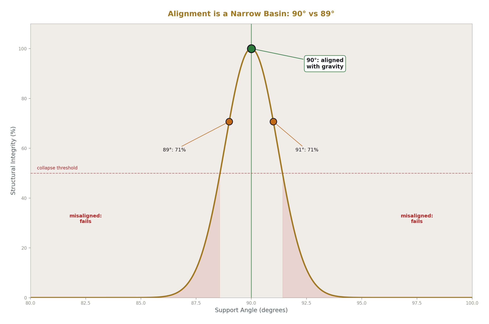
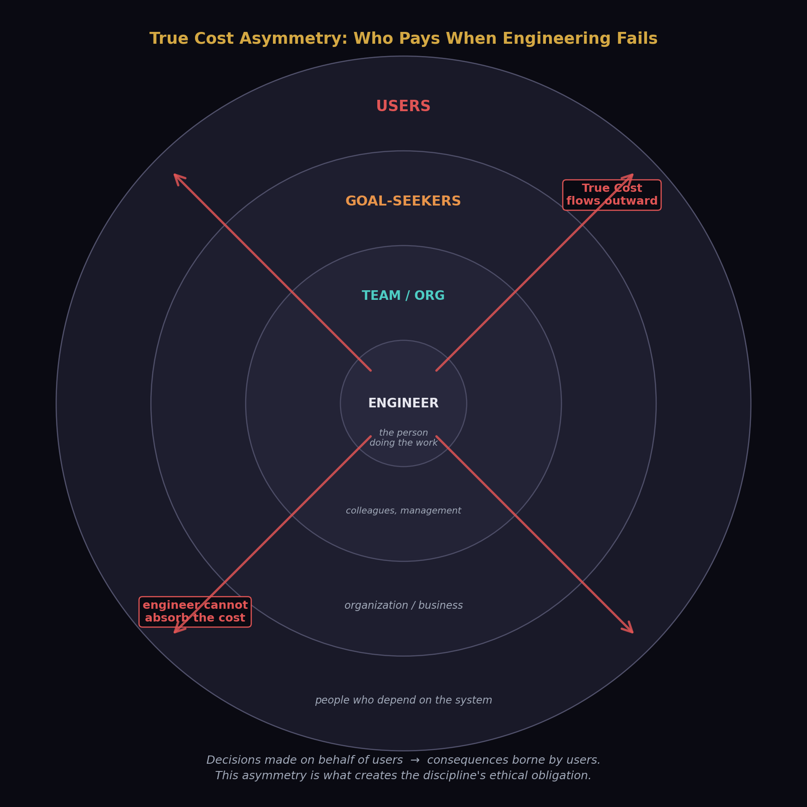
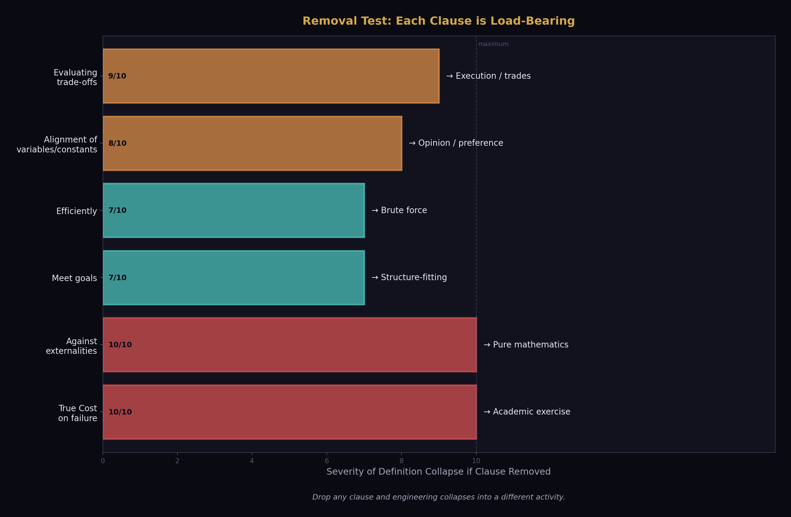
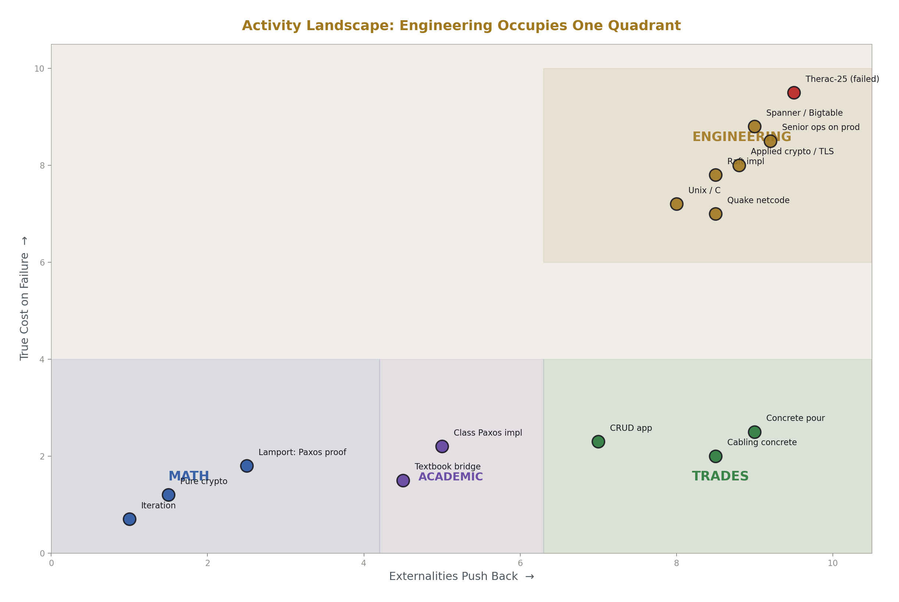
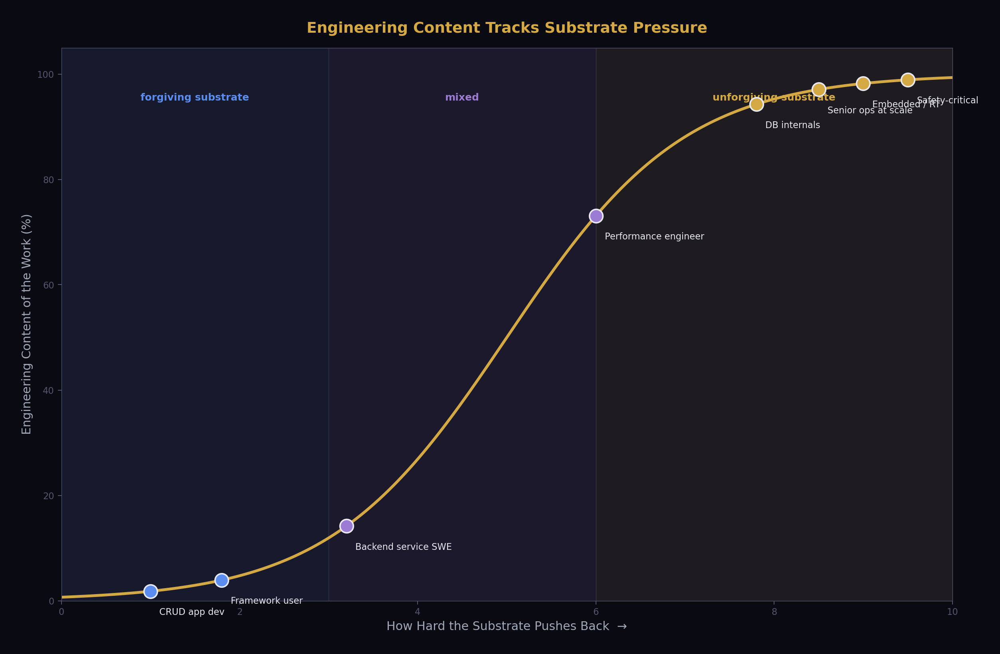
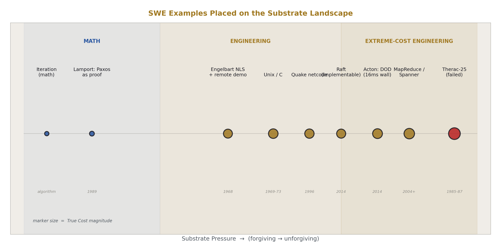
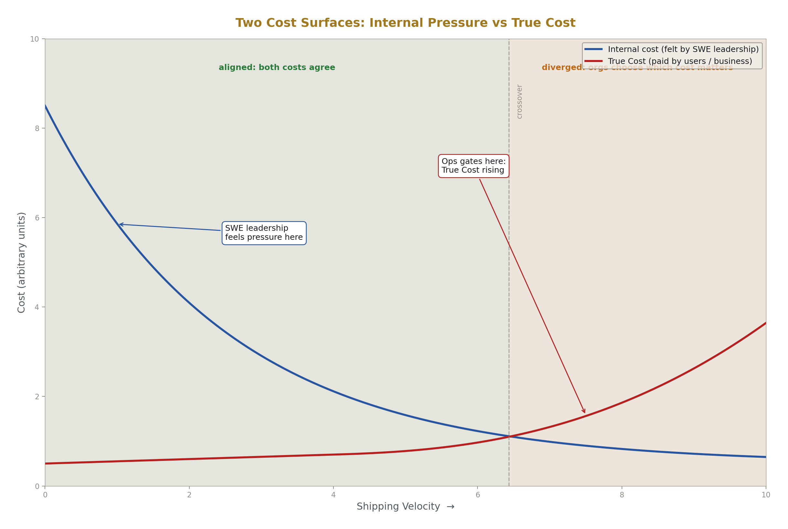

# What Engineering Is

## A precise definition and its consequences for software

**Registry:** [@HOWL-ENG-1-2026]

**DOI:** 10.5281/zenodo.19994227

**Date:** May 3 2026

**Domain:** Applied Philosophy

**Status:** Working Methodology

**AI Usage Disclosure:** Only the top metadata, figures, refs and final copyright sections were edited by the author. All paper content was LLM-generated using Anthropic's Opus 4.7. 

---

## 1. Why this paper exists

The word *engineer* has been borrowed across so many activities that it no longer reliably picks out a kind of work. A senior ops person keeping a production environment alive under load is called an engineer. A junior developer wiring REST endpoints together is called an engineer. A graduate student proving complexity bounds is called an engineer. A person physically running cable in a datacenter is sometimes called an engineer. These are all valuable activities, but they are not the same activity, and treating them as if they were produces practical confusion about who should be doing what, economic confusion about what should be paid like engineering, and intellectual confusion about what counts as rigor in software.

This paper offers a precise definition of engineering and defends it. The definition is structural: it identifies engineering by what the activity does, not by who performs it, what tools are used, or what credentials are held. The goal is a tool that lets the reader walk into any role and ask a small number of questions to determine, defensibly, whether the work is engineering.

## 2. The definition

> *Engineering is evaluating trade-offs to find alignment of variables and constants that efficiently meet goals against externalities where failure has a True Cost.*

Every word is load-bearing. The rest of the paper unpacks each clause, shows what activity it admits, what it excludes, and what survives if any clause is removed. A second sentence locks the first against drift:

> *True Cost is harm borne by goal-seekers and users when the engineered system fails.*

These two sentences together are the entire definition. The remainder is exposition.

## 3. Clause by clause

### Evaluating trade-offs

This is the activity proper. It distinguishes engineering from execution. Someone running cable in a datacenter to a layout that has already been decided is executing; the layout was designed by someone evaluating where the bundles should run, what the cooling implications are, how the cable lengths affect signal integrity, and which paths leave room for future expansion. Both activities are valuable. Only the second is engineering.

The trade-offs must be live. A senior ops engineer who has applied the same database failover pattern a hundred times to similar workloads is not necessarily engineering each time — at some point the decision becomes a recipe being executed, and the activity is closer to applying expertise than to engineering. Engineering happens when something in the situation is genuinely undecided and the engineer is responsible for deciding it.

### Alignment of variables and constants

What the evaluation seeks. Alignment is the configuration of system parameters such that the system actually achieves its goals under its constraints. The bridge support set at 90 degrees to the deck is aligned with gravity; the load resolves into the ground. At 89 degrees the load path no longer matches the constraint, and the structure collapses. The number 90 is not arbitrary — it is the value at which the variables of the design align with the constants of physics.

In software the constants are things like cache line widths, network round-trip times, the speed of light across a continent, the failure rates of consumer hardware. The variables are things like data layout, replication topology, batch sizes, retry policies. Engineering is finding the values of the variables that align with the constants such that the system behaves as intended. Misalignment is what failed engineering produces.

### Efficiently

The optimization criterion. Engineering does not seek any alignment; it seeks alignment under resource constraints. A system that achieves its goals by consuming arbitrary time, money, or hardware is not engineered well even if it works. The discipline is producing results within finite resources, and efficiency is the measure of how well the resources are used.

This is also what excludes brute force from being engineering by default. Throwing more hardware at a problem until it goes away is not engineering. Choosing precisely how much hardware is needed and configuring it such that the workload aligns with its capacity is.

### Meet goals

Direction. Engineering is teleological. Without goals there is nothing to align toward and no way to evaluate whether trade-offs were made well. Goals come from outside the engineering activity — from the organization, the customer, the user, the mission — and the engineer's job is to serve those goals through alignment of variables against constants under real constraints.

This is why engineering is in service to something. The bridge serves crossing. The database serves storing and retrieving. The production environment serves the business and its users. The engineer is not the goal-setter; the engineer is the agent who finds configurations that meet goals set by others.

### Against externalities

What the system is operating against. Externalities are the parts of reality that the activity must contend with — the substrate, the failure modes, the adversaries, the loads, the users, the environment. Without externalities, the activity is academic: self-contained, accountable only to internal consistency.

Externalities are what make engineering hard. They push back. They fail. They behave in ways the engineer did not specify and cannot control. The engineer's job is to design a system that survives contact with them. A bridge designed against gravity, wind, soil, traffic loads, and thermal expansion is engineering. A bridge designed on paper with no externalities considered is an exercise.

### Where failure has a True Cost

The qualifier that excludes academic work. Many activities involve externalities without involving True Cost. A simulation of a distributed system, a textbook example of a control loop, a Paxos implementation written for a class — all involve externalities, but failure imposes no real cost on anyone. The work is bounded by the activity itself.

True Cost loads the consequences of failure into reality, onto parties who did not perform the engineering. This is what makes engineering accountable in a way academic work is not, and it is what creates the discipline's ethical weight.

## 4. True Cost

> *True Cost is harm borne by goal-seekers and users when the engineered system fails.*

The cost lands outside the engineering activity itself, on parties who did not do the work and cannot fix it. Bridge users did not choose the angle of the supports. Database customers did not choose the replication topology. Patients did not choose the radiation interlock logic.

The engineer may also pay — reputation, employment, legal liability — but that is secondary. The defining cost is borne by goal-seekers and users. This asymmetry is structural: the engineer makes decisions on behalf of people who will pay if the decisions are wrong. Every traditional engineering discipline has built professional ethics codes around this asymmetry, because the asymmetry is what creates the ethical obligation. Software has mostly avoided having such codes, partly because the industry has avoided admitting that True Cost applies to software too.

The Therac-25 radiation therapy machine is the textbook illustration. Software bugs in the input-handling logic interacted with the physical machine state to deliver massive radiation overdoses, killing several patients. The engineering failure was misalignment: variables (the interlock logic, race conditions in the data entry handling) against externalities (the actual machine state, patient bodies). The True Cost was paid by patients — exactly the structural property the definition names. The Therac-25 case is canonical in safety engineering literature precisely because it makes True Cost concrete in a way that is hard to argue with.

## 5. Removal tests

The definition is minimal. Each clause is necessary. Removing any one of them admits non-engineering activities or excludes real engineering ones.

Drop *evaluating trade-offs* and the activity becomes execution — skilled trades work, applying decisions made by others. Valuable, but not engineering.

Drop *alignment of variables and constants* and there is no mechanism connecting decisions to outcomes. The activity becomes opinion or preference rather than a structured search for working configurations.

Drop *efficiently* and brute force qualifies. Solutions that consume unbounded resources to achieve their goals would count, which contradicts the actual practice of engineering everywhere.

Drop *meet goals* and the activity has no direction. A system that aligns variables against constants but serves no purpose is not engineering, it is structure-fitting.

Drop *against externalities* and the activity becomes self-contained. Pure mathematics qualifies, since math involves alignment of structures under internal constraints. The substrate is what makes engineering different from math.

Drop *True Cost* and academic work qualifies. A simulation, a textbook problem, a research prototype that nobody depends on — these involve externalities, but their failures are bounded by the activity. Engineering proper requires that failure load harm onto parties outside the work itself.

The five clauses together pick out engineering precisely. None can be removed without admitting activities that everyone agrees are not engineering, or excluding activities that everyone agrees are.

## 6. Engineering versus adjacent activities

The definition lets us place neighboring activities precisely.

**Math** is open at the level of theorems, with no externalities and no True Cost. Iteration as an algorithm is math: the problem statement is coherent without any substrate, and a wrong implementation has no external consequences. Lamport's published work on Paxos, logical clocks, and Byzantine generals is math by this definition — theorems about distributed computation, proven in proof-space, with internal-only consequences when wrong. The objects studied are algorithms, but the activity is mathematical because the externalities and True Costs do not enter the work. This is not a diminishment of Lamport; world-class mathematics produces foundations on which engineering is then built.

**Academic work generally** is self-contained in its consequences. A wrong proof harms the proof. A wrong paper harms the author's reputation. The discipline corrects itself in its own space. The academy is the deliberate construction of an environment where ideas can be wrong without external harm, so they can be tested honestly. This is a feature. Engineering depends on the academy's outputs.

**Trades and craft** are execution of decisions made by engineers. The cabler in the datacenter, the concrete pourer at a construction site, the rebar tier — these are skilled, valuable, often dangerous jobs that require real expertise and apprenticeship. They are not engineering because the trade-offs are not live for the person executing them. Someone else evaluated the trade-offs; the tradesperson executes the result. Pouring concrete badly will collapse the bridge, but the pourer is not engineering — they are accountable to specifications and standards rather than to the externalities directly.

**Design** is not a separate category. Design applied to a substrate with True Cost is engineering. Design applied abstractly is math. Design applied to human aesthetic experience is its own thing — interior design, level design, graphic design — which has craft and skill and trade-offs but is not engineering, because the substrate does not push back with True Cost. A boring level is dissatisfaction, not collapse.

**Applied math** is the borderline that most clearly illustrates the distinction. Pure cryptography is math: the analysis of hardness assumptions, the proofs around cipher constructions, the information-theoretic results. Applied cryptography is engineering: implementing TLS for production traffic, doing key management for a bank, building Signal's protocol for messaging. The math does not change between the two; the activity around it does. A timing side-channel in a TLS implementation is an engineering failure, paid for in real key compromises by real users.

The clearest live example of this border is Paxos versus Raft. Paxos as published by Lamport is closer to math: a proof object demonstrating that consensus is possible under specific failure models. Raft, by Ongaro and Ousterhout, is engineering: same problem class, but the explicit goals were understandability and implementability, with the externality being human cognition and the messiness of real implementations. They redesigned the protocol so that engineers were less likely to get it wrong when implementing it, because bad Paxos implementations had shipped and corrupted data. The variables aligned in Raft — leader election structure, log replication mechanism, membership change protocol — were chosen against an externality that Paxos as published did not directly address. Both pieces of work are excellent. They are different activities.

## 7. Why substrate alone is not enough

A reader might ask whether engineering is simply "applied to a real substrate." This is close but not quite right. Substrate is necessary but not sufficient.

A textbook bridge problem has a substrate in its problem statement, but no one builds it and no one falls into a river. A Paxos implementation written for a class has a substrate, but if it is never deployed, no decisions depend on its correctness. Both involve substrate; neither is engineering.

True Cost is what closes the gap. The substrate has to bite. There must be parties outside the activity who pay if the work is wrong, and the work must be done with that accountability in mind. This is what separates engineering from exercise, simulation, and study — not the presence of substrate but the presence of consequence.

## 8. Examples in software

The definition picks out a recognizable set of work in software. Five examples illustrate the range.

**Doug Engelbart and the NLS system.** The 1968 Mother of All Demos is remembered for its vision, but the engineering content sits behind the demo: NLS was a working system on real hardware, the SDS 940, with real constraints in memory, latency, display bandwidth, and a network link from Menlo Park to San Francisco. Engelbart and his team aligned variables — input device design, screen geometry, command structure, network protocols — against externalities including human cognition, hardware limits, and the physics of remote video over leased lines. The goal was augmenting human intellect, and meeting it required choices that were live trade-offs against substrates that pushed back. True Cost was funding-level: if the system did not actually work in front of an audience, the research program lost credibility and its support. The engineering content is in the choices about *how* to build a system humans could use to do real work.

**Mike Acton and data-oriented design.** Acton's work at Insomniac and his public talks articulate the engineering position in software more cleanly than almost any other source. The argument: hardware is the externality, and software designed to be elegant by the programmer's taste rather than aligned with cache lines, memory bandwidth, and access patterns is misaligned and pays the True Cost in frame time. The job is not to write code that pleases the programmer; it is to align variables — data layout, access patterns, batch sizes — with constants of the substrate. The 16-millisecond frame budget is the True Cost made literal: miss it and players experience stutter, and the externality (the hardware, the human visual system) bites. Acton's three lies — that software is a platform, that code designed around a model of the world is good, and that code is more important than data — are all academic-style framings being mistaken for engineering.

**Paxos versus Raft.** Already discussed. The cleanest live example of the math/engineering distinction in software, and worth re-stating because it shows that the same problem class can be approached either way. Lamport's Paxos analyzed and proved is math. Raft as a redesign for implementability is engineering. The same protocol, implemented in production at a company that depends on it, is engineering again — possibly performed by someone who has never read the academic literature, but who is responsible for the system not corrupting customer data.

**Carmack and Quake's network code.** Quake's 1996 client-server netcode is engineering of the cleanest kind. Variables aligned — client-side prediction, lag compensation, snapshot delta encoding — against externalities of modem latency, packet loss, and dialup jitter, toward the goal of responsive multiplayer first-person shooters over the internet of 1996. True Cost: an unplayable game and no sales. The substrate (consumer dial-up networks) was unforgiving and varied wildly across users, which forced design choices that have shaped game networking ever since. The work was done under real constraints with real consequences, by someone who understood both the math (extrapolation, interpolation, time synchronization) and the substrate it had to land on.

**Jeff Dean and Sanjay Ghemawat at Google.** MapReduce, Bigtable, and Spanner are sustained engineering against an extreme substrate. MapReduce aligned a programming model against the externality of thousands of commodity machines that fail constantly, with the goal of making large-scale batch computation expressible and reliable. Spanner aligned a transactional consistency model against the externality of clock skew across global datacenters, using the TrueTime API to bound uncertainty rather than wish it away. True Cost in both cases was concrete: Google's index does not get built, search degrades, revenue stops. The academic version of these problems looks like Lamport. The engineering version looks like MapReduce — a deliberate restriction on what can be expressed, chosen so that the system can recover from machine failures automatically.

**Unix and C, Thompson and Ritchie.** Engineering against the constraint that the system had to be small enough for two people to maintain on the hardware available to a research lab. Variables aligned — process model, file abstraction, syscall interface, language semantics — against externalities including the PDP-11's actual capabilities, the workload of running Bell Labs' computers, and the eventual need for the system to run on hardware that did not yet exist. The portability-via-C decision is a textbook engineering trade-off: accept some performance loss to align the variable "what hardware can run this" against the externality "hardware will keep changing." The work was the math abstractions of operating systems and language design, made to land on hardware so that humans could do work on it. True Cost: the system has to be useful enough that Bell Labs keeps the project alive, and useful enough that the wider research community adopts it.

**The Therac-25 as negative example.** Already discussed. The case anchors True Cost because the cost was paid in human lives, and because the engineering failure can be named precisely: misalignment of interlock logic and input handling against the externality of the physical machine state. This is what failed engineering looks like when the True Cost is large and visible.

## 9. Implications for software

The definition has practical consequences.

Most people called *software engineers* are not doing engineering by this definition. They are doing skilled trades work — execution of patterns against forgiving substrates with internal cost surfaces. The framework was designed by someone else, the language was designed by someone else, the system architecture was decided years ago, and the daily work is implementing features within those fixed walls. This is not an insult. Trades work is valuable and hard, and good tradespeople are rare. But the title is misleading, because it borrows the prestige of a word that meant something specific in other disciplines.

Senior ops people, when actually engineering rather than running runbooks, are doing engineering in the strict sense. The substrate (production hardware, networks, real user load, real adversaries) bites. The externalities are real and they fail constantly. The True Cost lands directly on goal-seekers (the business losing revenue) and users (people unable to access services). This is engineering whether or not the person has a degree, whether or not they write code, whether or not the industry recognizes it.

The conflict between SWE shipping velocity and ops stability is, under this definition, a conflict between internal cost optimization and True Cost optimization. Ops gates on True Cost: when shipping causes outages or data loss, ops pushes back, because the externality is punishing the system. SWE leadership often optimizes against internal pressures — quarterly targets, perceived productivity, manager career incentives — that do not connect to True Cost. These are real organizational pressures but they are not externalities in the engineering sense. The ops position in this conflict is therefore the engineering-correct position by default: gate on True Cost, ignore internal pressure that does not connect to True Cost. Anything else is letting non-engineering concerns override engineering ones.

Engineering competence cannot be transmitted by coursework alone, because controlling externalities under True Cost can only be learned in environments where externalities punish error and the consequences are visible. Apprenticeship under cost pressure is the historical mechanism in every engineering discipline that has institutionalized itself. Software has mostly skipped this, with predictable results: a workforce credentialed by degrees that do not test for the relevant skill, working in roles whose titles claim a discipline the work does not actually instantiate.

## 10. Implications for organizations

A test for whether a role is engineering: is there a substrate, are the trade-offs live, does failure cost goal-seekers or users? All three are required. If any is missing, the work is something else — possibly valuable, but not engineering.

A test for whether a decision is an engineering decision: is it being made against True Cost, or against internal pressure being laundered through engineering vocabulary? "We have to ship faster" is rarely an engineering claim; "we have to ship faster or users will leave for a competitor" is, because now there is a real external cost to slowness. The first is internal pressure. The second is engineering.

A test for whether an organization is treating engineering as engineering: does it staff and structure the work so that True Cost shapes priorities, or does internal velocity override it? Organizations that consistently choose internal velocity costs over external stability costs have decided their users' True Cost is acceptable collateral. They are free to make that decision, but they should make it knowingly, not by pretending the velocity push is itself engineering.

## 11. Closing

The definition is offered as a tool. Its value is in what it lets people see clearly: who is doing engineering, who isn't, what each activity is good for, and why the industry's habit of conflating them produces the dysfunctions it produces.

The paper does not argue that everyone should be doing engineering. Most useful work is not engineering and should not be. Mathematics produces foundations. Academic work produces ideas. Trades produce the artifacts that engineers design. Design in its other senses produces beauty, usability, and meaning. All of these are necessary, and none of them are diminished by being called what they are.

What the paper argues is that calling things by their right names lets organizations make better decisions about how to do them. Engineering is a specific activity, and it can now be defined precisely:

> *Engineering is evaluating trade-offs to find alignment of variables and constants that efficiently meet goals against externalities where failure has a True Cost.*

