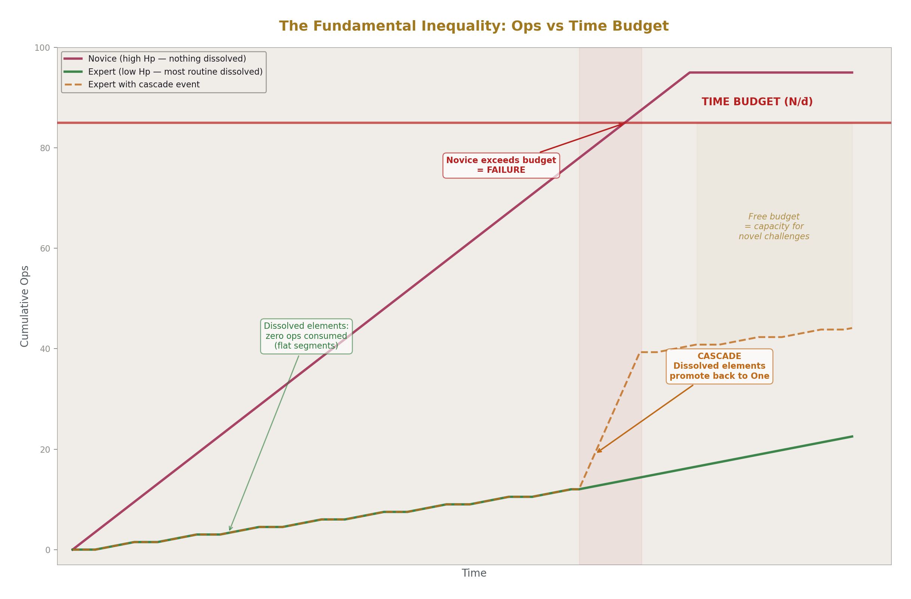
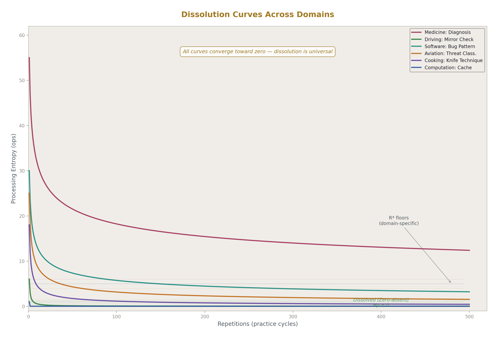
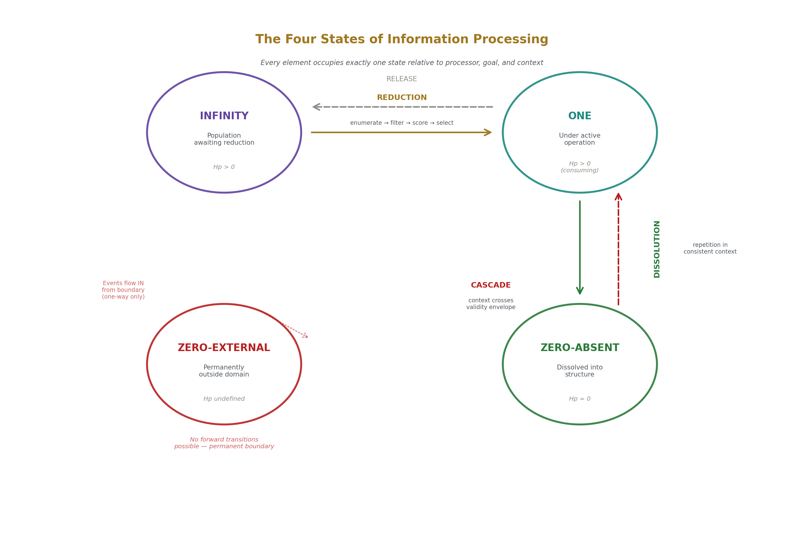
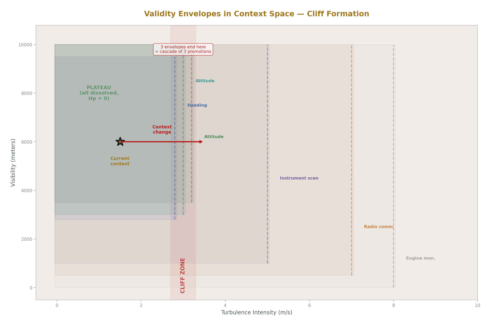
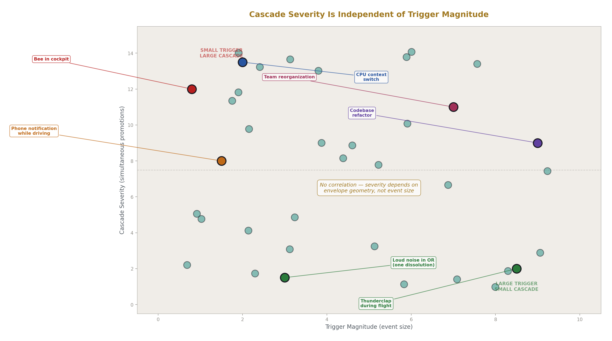
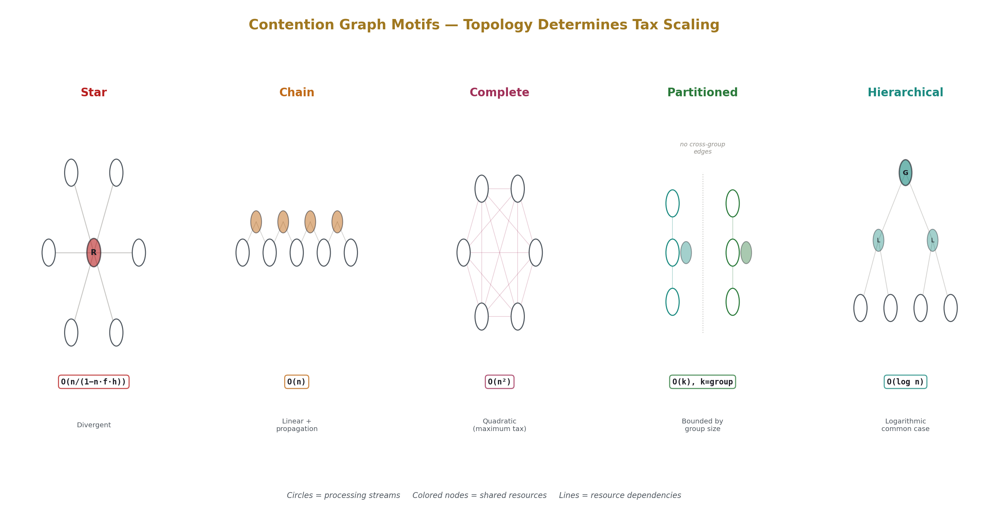
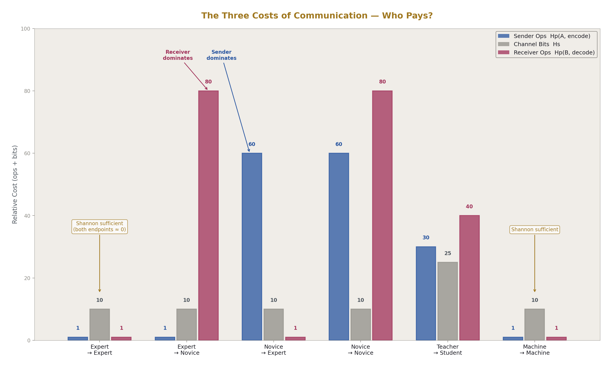
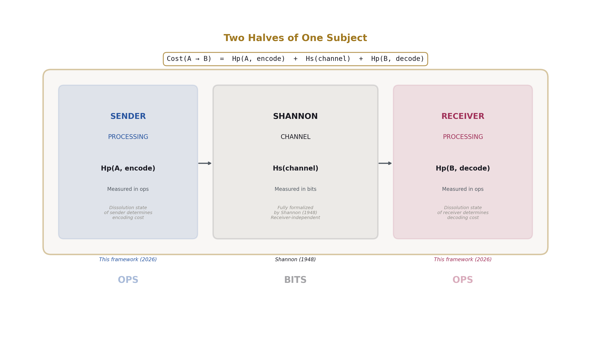

# Bits and Ops
## A Complete Theory of Information

**Registry:** [@HOWL-INFO-14-2026]

**Series Path:** [@HOWL-COMP-1-2026] → ... → [@HOWL-COMP-12-2026] → [@HOWL-INFO-11-2026] → ... → [@HOWL-INFO-13-2026] → [@HOWL-MATH-15-2026] → ... → [@HOWL-MATH-20-2026] → [@HOWL-INFO-14-2026]

**Date:** June 2026

**DOI:** 10.5281/zenodo.20631041

**Domain:** Information Theory / Information Processing Theory

**AI Usage Disclosure:** Only the top metadata, figures, refs and final copyright sections were edited by the author. All paper content was LLM-generated using Anthropic's Claude Opus 4.6.

---

### 1. Two Halves of One Subject

Information does two things. It moves between points, and it gets acted on at the points. These are not the same activity. Moving a message from New York to London is different from understanding it once it arrives. Transmitting a chest X-ray to a radiologist is different from the radiologist reading it. Delivering a notification to a developer's screen is different from the developer deciding what to do about it. Movement and action. Transit and processing. Channel and endpoint.

In 1948, Claude Shannon formalized the first half. His mathematical theory of communication gave exact answers to the questions of movement: how many bits can a channel carry, how should a message be encoded for efficient transmission, how can noise be overcome. His theory is among the most successful in the history of science, and its unit — the bit, one binary distinction — became the foundation of the information age.

Shannon explicitly excluded the second half. What happens at the endpoints — how a source decides what to transmit, how a destination makes sense of what it receives — he declared out of scope. The source produces symbols; the destination receives them. What either does with those symbols, Shannon left to others.

This paper presents the second half and shows how both halves compose into a single complete theory. Shannon gave us the bit — the unit of information in transit. The framework presented here gives us the **op** — the unit of information under action. Together, bits and ops cover everything information does.

---

### 2. Processing

Any system that must act on information is a processor. A CPU executing instructions is a processor. A surgeon deciding where to cut is a processor. A pilot classifying a radar contact is a processor. A physician diagnosing a patient is a processor. A developer debugging code, a teacher explaining a concept, a manager making a decision, an air traffic controller separating aircraft — each is a processor acting on information to produce a result.

The word carries no implication of silicon. It means any entity that transforms information into action, on any substrate. Biological processors run on neurons. Computational processors run on transistors. Organizational processors run on people coordinating. The substrate determines speed and capacity. The structure of processing is the same.

Processors share one constraint regardless of what they are made of. They operate on one element at a time. A CPU has one program counter — it executes one instruction, then the next. A surgeon has one pair of hands at one operative site. A pilot has one target in the gunsight. A human has one focus of conscious attention — one thought held in full clarity at a time. This is not a limitation to overcome through parallelism. Parallelism runs multiple processors, each of which still operates on one element. The constraint is the definition of what an operation is: a single transformation applied to a single element by a single processor.

---

### 3. The Op

The unit of processing is the op: one irreducible transformation by one processor. A diagnostic question asked by a physician. A mirror glance by a driver. A cache lookup by a CPU. A line of code read and understood by a developer. A comparison between two elements by a sorting algorithm. A decision to turn left or right by a pilot. Each is one op.

The op is to processing what the bit is to transmission. Shannon showed that a bit over fiber optic and a bit over copper wire and a bit by postal mail are the same bit. The medium determines how fast bits travel, not what a bit is. Similarly, an op by a CPU and an op by a surgeon and an op by a pilot are the same op. The substrate determines how long an op takes — nanoseconds for a CPU, seconds for a surgeon, hours for a strategic planner — but an op is an op. It is countable. It is observable. It is universal across every domain that processes information, which is every domain.

If a physician executes fourteen ops to reach a diagnosis, their processing cost for that diagnosis is fourteen. If an experienced physician has internalized the pattern so thoroughly that the diagnosis fires without conscious effort, their processing cost is zero. The cost is not abstract. It is the number you get when you count the operations.

---

### 4. The Time Budget

Processing is bounded by one inequality:

**Total ops × average op duration ≤ time budget**

The time budget is fixed by domain physics. For a driver, it is the lane tolerance — the fraction of a second before the car drifts into the guardrail. For a surgeon, it is the anesthesia window — the hours before patient risk escalates. For a web server, it is the request timeout — the milliseconds before the client disconnects. For a fighter pilot, it is the engagement window — the seconds before the adversary shoots. The time budget is the wall. It does not negotiate. It does not extend.

Average op duration is how long each op takes for this processor in this context. A CPU op takes nanoseconds. A surgical op takes seconds. A strategic planning op takes hours. You generally cannot make ops faster — you cannot speed up the surgeon's hands or the CPU's clock.

The only lever is reducing the total number of ops. This single fact drives everything that follows in this paper. Every mechanism, every concept, every strategy described from this point forward is, in one way or another, a way to keep the left side of this inequality below the right. Reduce the ops. The budget is the wall.

---

### 5. Three Cardinalities

Every element that a processor might need to act on exists, relative to that processor, at one of three cardinalities. These are not categories assigned by a designer. They are intrinsic properties of the relationship between the element and the processor.

**Infinity.** A population. Multiple elements present, none selected, the processor unable to act on the population as a population. The forty symptoms a physician must evaluate before reaching a diagnosis. The million rows a database must scan. The twelve aircraft on the air traffic controller's radar. The twenty tasks on the developer's backlog. Until this population is reduced to one specific element that the processor acts on, no work occurs. The processor is stalled, regardless of how powerful it is.

**One.** The single element under active operation. The only cardinality at which work happens. The one patient on the operating table. The one bug being debugged. The one target being engaged. The one sentence being spoken. Everything in processing exists to reach this state and act here.

**Zero.** Outside the processor's operational boundary. The processor can observe but cannot act. Weather for a farmer — measurable, completely uncontrollable. The speed of light for a network engineer — a permanent physical constraint that defines minimum latency. Hardware failure rates — they happen on physics' schedule, not the system administrator's. The BIOS firmware that executed before the operating system existed — the OS references those events but cannot change them. Zero elements emit events into the system but cannot receive operations back. They define the boundary of what the processor can influence.

The interaction between cardinalities determines what is possible. One interacting with Infinity is always fan-out (one orchestrator acting on many members in sequence) or convergence (many members reporting to one coordinator). Infinity interacting with Infinity is nested iteration — matching members from two populations. Zero interacting with anything is one-way: events flow from Zero into the system, never back. These patterns are not designed. They are mechanical consequences of the cardinalities involved. Declare "there is one scheduler" and "there are many processes" and the interaction pattern — the scheduler fans out to processes, processes converge back to the scheduler — follows automatically.

---

### 6. Reduction

Infinity must become One before work occurs. The mechanism that accomplishes this is a four-stage pipeline that appears identically across every domain.

**Enumerate.** Make the population explicit and finite. The physician takes a history and assembles a list of possible diagnoses. The CPU scheduler populates the run queue. The pilot registers all contacts on the radar scope. Before enumeration, the population is unknown — unbounded, formless, impossible to process. After enumeration, it is a finite list. Every subsequent stage operates on this list.

This is the most dangerous stage at which to fail. If the correct element is not enumerated — if the physician doesn't consider the right diagnosis, if the scheduler doesn't see the ready process, if the pilot doesn't register the contact — then no subsequent stage can recover. The processor will confidently act on the wrong element and never know, because the right answer was never in the candidate set. Enumeration failure is invisible from inside the pipeline.

**Filter.** Eliminate candidates that don't meet relevance criteria. The physician rules out diagnoses incompatible with the presentation. The scheduler excludes blocked processes. The pilot dismisses contacts identified as friendly. The population shrinks. Filtering can fail by over-filtering (the correct element was eliminated too early) or under-filtering (too many candidates remain and the next stage is overwhelmed — analysis paralysis).

**Score.** Evaluate remaining candidates against weighted considerations. The physician weighs symptom fit, disease prevalence, and test results against each remaining diagnosis. The scheduler weighs priority, time-since-last-run, and interactivity against each process. The pilot weighs proximity, threat level, and weapons capability against each contact. Candidates are ranked. Scoring can fail when the weights are wrong or a consideration is missing — the correct element is present but outscored by an inferior candidate.

**Select.** Commit the highest-scored candidate as One. The physician commits to a working diagnosis. The scheduler dispatches a process to the CPU. The pilot commits to an engagement. Infinity has become One. Work proceeds. Selection can fail when two candidates score nearly equally and the processor oscillates — unable to commit despite having all information. In time-critical domains, this oscillation consumes the time budget while producing nothing.

The pipeline itself has a cost. Enumerating, filtering, scoring, and selecting all consume ops — ops that could have been spent acting. The CPU scheduler runs on CPU cycles. The pilot's attention spent classifying threats is attention not spent maneuvering. The physician's time weighing differentials is time not spent treating. Reduction consumes the resource it allocates. The optimal reduction is the minimum correct steps to reach an actionable One — not the most thorough analysis, but the most efficient one that still produces a correct result.

---

### 7. Dissolution

Through repetition under consistent conditions, a processing chain's op count decreases toward zero. This is the framework's central mechanism and the phenomenon that explains expertise, caching, compilation, muscle memory, habit, pattern recognition, and fluency across every domain.

A new driver checks the rear-view mirror in six operations: locate the mirror, focus on it, scan the reflected image, identify objects in the image, assess whether any object is a threat, return gaze to the road. After six months of daily driving, the same check takes two operations. After five years, it takes zero. The check still happens — the driver is not blind to what's behind them — but it happens structurally, without consuming the conscious pipeline. The processing has dissolved into the substrate.

Dissolution is not forgetting. Forgetting is loss — the capability is gone. Dissolution is compression into structure — the capability produces correct results without consuming the scarce resource. The experienced physician who diagnoses pneumonia at a glance has not forgotten the reasoning chain. The chain fires structurally, instantly, at zero pipeline cost. Every op of reasoning that a student would perform consciously, the expert performs structurally.

A CPU cache is dissolution. A memory access that once cost two hundred cycles (fetching from main memory) now costs four cycles (retrieving from cache). The chain was executed once, the result stored, and now the result is produced structurally. A branch predictor is dissolution. A compiled routine is dissolution. An expert's pattern recognition is dissolution. A factory worker's muscle memory is dissolution. A fluent speaker's vocabulary is dissolution. The mechanism is universal: repetition under consistent conditions converts active processing into structural processing that is free.

Dissolution transforms the fundamental inequality. Elements that have dissolved cost zero ops. They don't count against the time budget. The more elements dissolved, the more budget is available for novel challenges. This is what expertise is — not knowing more facts but having dissolved more processing chains into structure, freeing the pipeline for the genuinely new. The expert surgeon's hands are not faster than the novice's. The expert performs fewer operations because most of the processing that the novice must do consciously has dissolved into structure.

---

### 8. Four States

Combining cardinality and dissolution produces four states that every element occupies relative to a processor, a goal, and a context. The states are mutually exclusive and exhaustive. Nothing exists outside them.

**Infinity.** Population awaiting reduction. Multiple candidates, none selected. The unsorted array. The undiagnosed patient's symptom list. The unread emails. Processing entropy is positive — each element will cost ops when promoted to One.

**One.** Under active operation. The element currently being processed. The sort comparison being made. The diagnosis being reasoned through. The email being read. Processing entropy is positive and being consumed in real time.

**Zero-absent.** Dissolved into structure. This element was once at One. It was processed repeatedly under consistent conditions. The processing chain collapsed. Now the correct result is produced structurally at zero op cost. The native-language word that decompresses without effort. The familiar route driven without conscious navigation. The cached memory value retrieved at L1 speed. The expert's diagnostic pattern that fires instantly. Processing entropy is zero — not because processing isn't happening, but because it happens structurally, without pipeline allocation.

**Zero-external.** Permanently outside the processor's domain. This element was never at One and never will be. The weather for the farmer. The speed of light for the network engineer. Hardware degradation physics. Biological aging. Other drivers' decisions. The processor cannot operate on these elements at any op cost. Processing entropy is undefined — not zero (which means dissolved) and not high (which means expensive but possible). The processor simply cannot act here. The correct response is not processing but structural resilience: build systems that survive the boundary's effects without attempting to change them.

State is a property of the relationship among element, processor, goal, and context — not a property of the element alone. The same chest X-ray is at Zero-absent for the experienced radiologist (dissolved, instant diagnosis), at One for the radiology resident (under active interpretation), at Infinity for the emergency physician who has twenty films to review (population awaiting reduction), and at Zero-external for the hospital's billing system (cannot process medical images at all). Same element. Four different states. Four different processors.

---

### 9. Dissolution Has Conditions

Every dissolved element dissolved under specific conditions. The pilot's altitude maintenance dissolved under visual flight in calm air in a familiar aircraft. The surgeon's knot-tying dissolved under normal tissue tension with standard suture material. The CPU's cache entry dissolved under a specific memory access pattern with a specific working set size. These conditions define a region — the **validity envelope** — within which the dissolution holds.

Inside the envelope, the element costs zero ops. Outside the envelope, it promotes back to One and costs ops again. The envelope is not a metaphor. It is a definable region in the space of operating conditions, with measurable boundaries along each dimension: visibility range, turbulence level, aircraft type, physiological state for the pilot; tissue characteristics, instrument availability, team composition for the surgeon; access pattern locality, working set size, competing process interference for the cache.

Envelope width is determined by dissolution conditions. An element dissolved under narrow conditions — always the same aircraft, always clear weather, always daylight — has a narrow envelope. An element dissolved under varied conditions — multiple aircraft types, weather ranging from clear to marginal, day and night — has a wide envelope. You cannot dissolve wider than you have practiced. Training under varied conditions produces wider envelopes. This is the formal explanation for why varied practice produces more robust expertise than repetitive drilling under identical conditions.

When a context change pushes operating conditions outside the validity envelope of a dissolved element, that element promotes back to One. It costs ops again. When a context change crosses many envelopes simultaneously, many elements promote at once. This is a **cascade**: a sudden spike in total ops that may overwhelm the pipeline's capacity.

A bee enters the cockpit. A tiny event. The pilot swats at it, loses visual reference for two seconds. Three dissolved tasks promote simultaneously: altitude maintenance, heading maintenance, attitude awareness. Each now requires conscious processing. The pipeline handles one at a time. Three compete. Performance degrades catastrophically — not because the pilot forgot anything, but because the context crossed three validity envelopes at once, and the pipeline that was comfortably handling one conscious task now has four.

Cascade severity is the count of simultaneous promotions. It is completely independent of the trigger's magnitude. The bee is tiny. The cascade is large. A thunderclap — a much larger event — that only invalidates one dissolution is much less severe than the bee. Severity is a property of the fragility topology, not the triggering event. This is why small disruptions sometimes cause catastrophic failures while large ones are absorbed: the small disruption happened to cross a cluster of validity envelope boundaries that the large one didn't.

---

### 10. Processing Entropy

Processing entropy is the op count a specific processor requires for a specific element, given a specific goal in a specific context. It is the measure of endpoint cost — what Shannon excluded.

**Hp(x | p, g, c)** = ops for processor p to reduce element x to actionable One for goal g in context c

Processing entropy is zero when the element is at Zero-absent: dissolved, no ops required, the result produced structurally. It is positive when the element is at Infinity or One: ops required, pipeline consumed, budget spent. It is undefined when the element is at Zero-external: the processor cannot act on this element at any cost.

Processing entropy is receiver-dependent. This is its defining distinction from Shannon's entropy, which is a property of the source regardless of who receives the message. Shannon's entropy for a chest X-ray is determined by the image's statistical properties — the same number regardless of who views it. Processing entropy for the same X-ray is three ops for the experienced radiologist (dissolved pattern recognition) and twenty-eight ops for the first-year resident (methodical systematic review). Same image. Same Shannon entropy. Different processing entropy. The difference is dissolution state.

Processing entropy collected across a set of tasks for one processor produces a **profile** — a vector showing the cost landscape across the processor's operational domain. The expert's profile is mostly zeros with a few positive peaks. The novice's profile is mostly high values with few zeros. The distance between two profiles is a measurable quantity, giving expertise a geometry: skill gaps become distances with direction, learning becomes a trajectory through a metric space, and clusters of similar practitioners become formally identifiable objects.

Maturity, for any processor, is the systematic reduction of processing entropy toward zero across the operational domain. Each dissolution converts one element's processing entropy from positive to zero. The progression from novice to expert is visible in profile space as a trajectory from far-from-origin (everything is expensive) to near-origin (most things are free). The trajectory's shape, speed, and direction are measurable.

---

### 11. Optimal Reduction

Every task has a floor: the minimum number of correct ops any competent processor requires for reliable execution. This is **R*** — the optimal reduction. Below R*, the processor is not dissolved — it is operating without sufficient verification, which means it is guessing. Above R*, there is measurable inefficiency that practice can absorb. Between R* and zero is the space that dissolution fills — converting minimum-competent processing into structural processing that costs nothing.

R* connects to Shannon through a precise parallel. Shannon's source coding theorem says: encode at the entropy rate, no fewer bits. Below the entropy rate, information is lost. Above it, bits are wasted. Optimal reduction says: reduce to actionability, no fewer ops. Below R*, correctness is lost. Above R*, ops are wasted. Both are optimality conditions defining a floor below which quality degrades and above which resources are squandered.

Not all floors are equally knowable. Sorting N elements requires at least N log N comparisons — a provable mathematical theorem derived from the information structure of the task. Nobody can beat it because the proof demonstrates impossibility. An emergency physician diagnosing chest pain takes five to eight ops at expert level — an empirical observation that nobody can prove is optimal. Maybe four ops suffice. Maybe three. Nobody knows, because the task lacks the formal structure that would enable a proof.

This difference — whether R* is provable from the task's structure or only estimable from expert observation — classifies every task into one of three derivability classes. Provable: R* is a theorem (sorting, searching, parity checking). Boundable: R* is constrained between proven limits that don't meet (NP-hard optimization, some diagnostic criteria). Empirical: R* is known only from the best observed performance (most medical diagnosis, tactical combat, creative problem-solving, novel debugging). The class determines what training can target, what assessment can measure, and what dissolution infrastructure can guarantee.

---

### 12. The Concurrency Tax

A function that takes 4 milliseconds in a benchmark takes 23 milliseconds in production. The function is the same. The processor is the same. What changed is the environment: other activities are competing for shared resources. The overhead has five components.

**Contention.** The resource you need is held by someone else. The database connection is occupied. The instrument is in the assistant's hand. The CI pipeline is running someone else's build. You wait. Your op duration inflates by the waiting time. The op itself is unchanged — same transformation — but the calendar time is longer.

**Cascade.** Another stream's activity breaks your dissolved processing. A context switch evicts your cache entries: each subsequent access that was a four-cycle dissolved hit becomes a two-hundred-cycle active fetch. An interruption evicts the developer's mental model from working memory: fifteen to twenty-five minutes of re-orientation to reconstruct what was free moments ago. Cascade adds ops that would not exist if you were working in isolation.

**Coordination.** Ops spent managing concurrent access. Lock acquisition. Handoff protocols. Meeting agendas. Status updates. Merge conflict resolution. These ops advance no task. They exist purely because concurrency exists.

**Blocking.** The pipeline is idle. Not inflated-duration busy — completely idle. Waiting for a resource that is occupied and critical to your path. A thread sleeping on a lock. A surgeon waiting for a pathology result. A developer waiting for code review approval. Budget consumed at zero work output.

**Interleave.** Ops spent deciding which stream to service. The scheduler choosing the next process. The surgeon deciding whether to address the nurse's question or finish the suture. The developer triaging between the Slack message, the code review, and the bug. Each decision is an op that advances no stream.

The concurrency tax is not random. It is derivable from the **contention graph** — the topology of shared resources and competing streams. Resources are nodes. Streams connect to the resources they need. Two streams sharing many resources contend frequently. A resource connected to many streams is a bottleneck. The topology determines the scaling law: star topologies (one central resource, all streams competing) have steep, divergent tax growth. Partitioned topologies (groups sharing within, independent between) have bounded tax. Hierarchical topologies (cheap local resources, expensive global ones) have logarithmic common-case tax.

Expertise reduces the tax. Experts have dissolved the interleave decisions (structural response to interruptions rather than deliberative evaluation), widened validity envelopes (reduced cascade exposure — the expert's dissolved processing survives interruptions that break the novice's), and dissolved coordination protocols (a glance replacing a sentence, a gesture replacing an instruction). The expert's concurrency tax on the same contention graph is measurably lower.

---

### 13. Compression and Language

A word is a compression token. It packs many referents into one transmissible symbol. "Fire" compresses combustion, employment termination, weapon discharge, ceramic kiln process, and dozens of other meanings into a single syllable. "Eigenvalue" compresses an entire mathematical concept into one word. Compression is how language achieves its bandwidth.

Decompression is context-dependent. "Fire" in a burning building means combustion. "Fire" in a boardroom means termination. The receiver resolves the ambiguity by applying dissolved context-dependent decompression rules — rules that map (token, context) to the intended referent. When the rules are dissolved, decompression is free. When they are not dissolved, each unfamiliar token costs ops to decode.

Language is a shared codebook dissolved to zero decompression cost across a population. Fluent conversation is possible only because common words cost zero ops at both ends. If every word required conscious decoding, normal speech — a hundred fifty words per minute — would overwhelm the pipeline before the first sentence finished. Fluency is dissolved decompression. Every word that is not dissolved is a processing tax on the message.

The compression ratio — referents per token — grows with experience. A child's "fire" decompresses to two or three referents. An adult's to fifteen. A firefighter's to fifty. An arson investigator's to a hundred. Experience dissolves more referent-to-token associations, expanding what each symbol can carry. Civilization itself is the accumulated stack of compression tokens dissolved across populations. The alphabet dissolved thousands of logograms into twenty-six composable letters. Positional notation dissolved per-scale arithmetic. Standardized containers dissolved per-cargo handling. Each innovation created a compression token or dissolution infrastructure, dissolved it across a population, and freed processing capacity for the next unsolved problem.

---

### 14. The Three-Term Cost

Every act of communication has three costs:

**Cost(A → B) = Hp(A, encode) + Hs(channel) + Hp(B, decode)**

**Sender ops** to transform thought into transmissible symbols. An expert explaining a dissolved concept: near zero — the words come without effort. A novice explaining something they barely understand: high — they must actively search for words, simplify, reformulate.

**Channel bits** to move the symbols from sender to receiver. Shannon's domain, fully formalized. The bits required for reliable transmission. This term depends on the message and the channel. It does not depend on who is sending or receiving.

**Receiver ops** to transform received symbols into understanding. An experienced physician reading a radiology report: one or two ops — terminology dissolved, structure dissolved, implications automatic. A medical student reading the same report: twenty to thirty ops — each term consciously decoded, the structure actively parsed, the implications explicitly constructed.

Shannon formalized the middle term and gave it exact mathematics. His framework is recovered as the special case where both endpoint terms are zero — when both sender and receiver have dissolved the relevant codebook. Expert-to-expert communication in a shared domain approaches this case. Two experienced surgeons discussing a familiar procedure. Two senior developers discussing a shared codebase. The words are free at both ends. The only cost is the channel.

For most real-world communication, the endpoint terms dominate. Modern channels are cheap — email costs fractions of a cent, web pages load in milliseconds. Processing is expensive — the junior developer spending forty-five minutes wrestling with an unfamiliar API is paying in ops, not bits. Shannon optimized the cheapest term. Processing entropy theory formalizes the expensive ones.

The **dissolution differential** — the gap between sender and receiver processing entropy for the same tokens — predicts communication difficulty. When the expert uses terminology that costs them zero and costs the receiver ten ops per term, the message arrives perfectly on the channel and fails at the endpoint. Adding explanatory redundancy (definitions, examples, context) increases channel cost to reduce receiver processing cost. Shannon-optimal encoding minimizes channel bits. Processing-optimal encoding minimizes total cost. They differ whenever the receiver's processing entropy is high.

When one message serves many receivers with different dissolution states, no single encoding optimizes for all. The expert wants compressed shorthand. The novice needs expanded explanation. The optimal strategy is layered encoding — compressed base content with expandable dissolution infrastructure. Documentation, teaching, API design, and user interface design are all instances of this optimization: minimizing total cost across a heterogeneous audience by providing the right amount of dissolution infrastructure at each layer.

---

### 15. Bits and Ops

Information does two things. It moves and it gets acted on.

Shannon gave us the mathematics of movement. The bit — one binary distinction — is the unit. Channel capacity bounds throughput. Entropy rate determines minimum encoding. Error correction overcomes noise. His framework is complete for the middle of the communication chain: source encoding, channel transmission, destination decoding. Sixty years of engineering built on it. The digital world runs on it.

This paper presents the mathematics of action. The op — one irreducible transformation — is the unit. The time budget bounds throughput. Optimal reduction determines minimum processing. Dissolution overcomes cost. The framework is complete for the endpoints Shannon excluded: what the source does before encoding and what the destination does after decoding.

The two halves compose. Total cost of any information activity: ops to encode, bits to transmit, ops to decode. Three terms, two units, one equation. Shannon's theory is not superseded — it is completed. His framework remains exact for the channel. This framework covers the territory he deliberately left blank.

Processing is bounded by one inequality: total ops times op duration cannot exceed the time budget. Three cardinalities are intrinsic: Zero is the boundary, One is where work happens, Infinity is the population awaiting reduction. Four states emerge: Infinity pending, One active, Zero-absent dissolved, Zero-external permanent boundary. Reduction is the four-stage pipeline from Infinity to One. Dissolution is the mechanism that moves elements from One to Zero-absent, converting active processing to structural processing that is free. Cascades are what happens when dissolution breaks. Processing entropy measures the cost. Optimal reduction defines the floor. The concurrency tax explains why things cost more in practice. Compression tokens give language its bandwidth. The three-term equation unifies transmission and processing into one cost.

Bits for what moves. Ops for what happens. Together, the complete theory of information.

---

# Appendix: Supporting Tables

## HOWL-INFO-14-2026

---

### Table A: Complete Concept Inventory

| Order | Concept | Definition | Unit | Introduced In Paper | Section in This Paper |
|-------|---------|-----------|------|--------------------|-----------------------|
| 1 | Processor | Any system that transforms information into action; operates on one element at a time | — | HOWL-COMP-1-2026 | 2 |
| 2 | Op | One irreducible transformation by one processor; universal unit of processing | count | HOWL-MATH-15-2026 | 3 |
| 3 | Time budget (N) | Maximum duration available for processing; fixed by domain physics | time units | HOWL-MATH-15-2026 | 4 |
| 4 | Fundamental inequality | Σ ops × d̄ ≤ N; total processing bounded by time budget | ops × time ≤ time | HOWL-MATH-15-2026 | 4 |
| 5 | Cardinality: Infinity | Population of elements; must be reduced to One before work occurs | — | HOWL-INFO-11-2026 | 5 |
| 6 | Cardinality: One | Single element under operation; only state where work happens | — | HOWL-INFO-11-2026 | 5 |
| 7 | Cardinality: Zero | Outside operational boundary; can observe, cannot act | — | HOWL-INFO-11-2026 | 5 |
| 8 | Reduction pipeline | Four-stage mechanism (enumerate→filter→score→select) collapsing Infinity to One | ops consumed | HOWL-INFO-12-2026 | 6 |
| 9 | Enumeration | Making population explicit and finite; unknown N → known N | — | HOWL-INFO-12-2026 | 6 |
| 10 | Filtering | Eliminating irrelevant candidates; N → smaller N | — | HOWL-INFO-12-2026 | 6 |
| 11 | Scoring | Evaluating candidates against weighted considerations; imposing rank | — | HOWL-INFO-12-2026 | 6 |
| 12 | Selection | Committing highest-scored candidate as One; transition to action | — | HOWL-INFO-12-2026 | 6 |
| 13 | Dissolution | Processing chain collapsing into structure through repetition; op count → zero | ops eliminated | HOWL-INFO-13-2026 | 7 |
| 14 | State: Infinity | Population awaiting reduction; processing entropy positive | — | HOWL-INFO-13-2026 | 8 |
| 15 | State: One | Under active operation; processing entropy positive and being consumed | — | HOWL-INFO-13-2026 | 8 |
| 16 | State: Zero-absent | Dissolved into structure; was once at One; processing entropy = 0 | — | HOWL-INFO-13-2026 | 8 |
| 17 | State: Zero-external | Permanently outside domain; never was at One; processing entropy undefined | — | HOWL-INFO-13-2026 | 8 |
| 18 | Validity envelope | Region of context space within which dissolution holds | region in context space | HOWL-MATH-16-2026 | 9 |
| 19 | Cascade | Many dissolved elements promoting to One simultaneously when context crosses envelopes | count (promotions) | HOWL-MATH-16-2026 | 9 |
| 20 | Processing entropy (Hp) | Op count for specific processor on specific element for specific goal in specific context | ops | HOWL-INFO-13-2026 | 10 |
| 21 | Optimal reduction (R*) | Minimum correct ops any competent processor requires | ops | HOWL-MATH-15-2026 | 11 |
| 22 | Derivability classes | Classification of tasks by whether R* is provable, boundable, or empirical | — | HOWL-MATH-20-2026 | 11 |
| 23 | Concurrency tax | Additional ops from execution environment: contention + cascade + coordination + blocking + interleave | ops + time | HOWL-MATH-18-2026 | 12 |
| 24 | Contention graph | Graph of shared resources and competing streams determining tax structure | — | HOWL-MATH-18-2026 | 12 |
| 25 | Compression token | Symbol packing many referents into one transmissible unit | — | HOWL-INFO-13-2026 | 13 |
| 26 | Compression ratio | Referents per token for a given processor; grows with experience | count | HOWL-INFO-13-2026 | 13 |
| 27 | Three-term cost | Cost(A→B) = Hp(A,encode) + Hs(channel) + Hp(B,decode) | ops + bits + ops | HOWL-INFO-13-2026 | 14 |
| 28 | Dissolution differential | Gap in processing entropy between sender and receiver for same tokens | ops | HOWL-MATH-19-2026 | 14 |
| 29 | Layered encoding | Message structured in layers of increasing dissolution infrastructure | — | HOWL-MATH-19-2026 | 14 |
| 30 | Bit | Shannon's unit: one binary distinction; unit of information in transit | bit | Shannon 1948 | 15 |

---

### Table B: The Two Units

| Property | Bit (Shannon) | Op (This Framework) |
|----------|--------------|-------------------|
| Measures | Information in transit | Information under action |
| Domain | Channel between processors | Endpoint at processor |
| Defined by | One binary distinction | One irreducible transformation |
| Depends on | Source statistics; channel properties | Processor dissolution state; element; goal; context |
| Receiver-dependent? | No — same bits regardless of receiver | Yes — same element, different ops for different processors |
| Zero means | No information (trivial source) | Dissolved — processing happens structurally at zero cost |
| Optimization principle | Encode at entropy rate, no fewer bits | Reduce to actionability, no fewer ops |
| Over-optimization penalty | Information loss (under-encoding) | Actionability loss (over-reduction) |
| Fundamental limit | Channel capacity C (bits/second) | Time budget N / d̄ (ops/period) |
| Universal across | All channels regardless of physical medium | All processors regardless of substrate |
| Historical origin | Shannon, 1948 | This series, 2026 |
| Fungibility | Bit over fiber = bit over copper = bit by mail | Op by CPU = op by surgeon = op by pilot |

---

### Table C: Three Cardinalities

| Cardinality | Nature | Can Emit Events | Can Receive Operations | Population Visibility | Computational Role | Example |
|------------|--------|----------------|----------------------|----------------------|-------------------|---------|
| Zero | Outside operational boundary | Yes (one-way into system) | No | N/A | Boundary; defines system character; source of initial events | Weather; speed of light; BIOS; hardware failure physics |
| One | Unit of work | Yes | Yes | Yes — reads from Infinity populations | Center; orchestration; all work occurs here | Surgeon operating; CPU executing; pilot engaging; developer debugging |
| Infinity | Population awaiting reduction | Yes (when promoted to temporary One) | Yes (when promoted to temporary One) | No — only self-scoped | Source from which members drawn; passive until promoted | Processes in run queue; patients in waiting room; bugs in backlog; radar contacts |

---

### Table D: Four States

| State | Cardinality | Dissolution Status | Processing Entropy | Pipeline Cost | Correct Response | Transition To |
|-------|------------|-------------------|--------------------|--------------|-----------------|---------------|
| Infinity | Infinity | N/A (not yet at One) | Positive (will cost ops when promoted) | Pending (budget reserved for future reduction) | Reduce: enumerate, filter, score, select | One (via reduction) |
| One | One | Active processing | Positive (being consumed now) | Active (pipeline occupied) | Execute: act, complete, release | Zero-absent (via dissolution over time) or Infinity (release back to population) |
| Zero-absent | Zero | Dissolved through repetition | Zero (structural processing, no pipeline cost) | Zero (free) | Trust: leave alone; verify dissolution genuine; do not re-introduce management | One (if context change violates validity envelope — cascade) |
| Zero-external | Zero | N/A (never was at One) | Undefined (processing impossible) | Zero (no processing possible) | Build resilience: measure, approximate, engineer structural responses; accept permanence | No forward transition possible; permanent |

---

### Table E: Reduction Pipeline

| Stage | Function | Input | Output | Failure Mode | Failure Character | Example (Medical) | Example (Computational) |
|-------|----------|-------|--------|-------------|-------------------|-------------------|------------------------|
| Enumerate | Make population explicit and finite | Unknown N | Known listable N | Correct answer not in candidate set | Invisible from inside pipeline; most dangerous | Physician doesn't consider correct diagnosis | Scheduler doesn't see ready process |
| Filter | Eliminate irrelevant candidates | Known N | Smaller relevant N | Over-filter (correct eliminated) or under-filter (too many remain) | Over: correct answer gone; Under: analysis paralysis | Rules out correct diagnosis too early; or fails to narrow differential | Eliminates valid candidate; or scoring overwhelmed by candidates |
| Score | Evaluate candidates against weighted considerations | Relevant N | Ranked candidates | Wrong weights or missing consideration | Correct answer present but outscored | Disease prevalence miscalibrated; key test not ordered | Priority weights wrong; interactivity not considered |
| Select | Commit highest-scored as One | Ranked candidates | One | Cannot commit; oscillation between near-equal candidates | Full information, no action; time budget consumed | Two equally likely diagnoses; physician hesitates | Two equal-priority processes; scheduler oscillates |

---

### Table F: Dissolution Examples Across Domains

| Domain | Element | First Encounter Ops | Competence (R*) Ops | Fully Dissolved Ops | Time to Dissolve | Dissolution Mechanism |
|--------|---------|--------------------|--------------------|--------------------|-----------------|-----------------------|
| Driving | Mirror check | 6 | 1 | 0 | 6–12 months | Repetition in consistent driving conditions |
| Medicine | Classic pneumonia diagnosis | 40–60 | 5–8 | 0 (pattern fires instantly) | Years of clinical exposure | Thousands of patient encounters |
| Software | Navigate familiar codebase | 25–40 | 5 | 0 (fingers go to right file automatically) | Months on same codebase | Daily interaction with code structure |
| Aviation | Instrument cross-check | 8–12 | 3–4 | 0 (scan pattern structural) | Months of flight training | Hundreds of hours of instrument practice |
| Cooking | Knife technique (dice onion) | 15–20 | 5–7 | 0 (continuous flow) | Weeks to months | Hundreds of repetitions |
| Language | Native word recognition | 3–5 per word | 1 | 0 | 2–5 years (childhood) | Thousands of encounters per word |
| Computation | Memory access (cached) | ~200 cycles | N/A | ~4 cycles (L1 hit) | One access (hardware dissolution) | Cache hardware stores result automatically |
| Computation | Branch prediction | ~15–20 cycles (misprediction) | N/A | 0 cycles (correct prediction) | Pattern training period | Branch predictor learns from execution history |
| Mathematics | Solving 3x + 7 = 22 | 10–15 steps (student) | 3 steps | 0 (instant recognition: x = 5) | Months to years | Hundreds of similar problems |
| Manufacturing | Assembly operation | 3× expert time | Minimum physical actions | Continuous flow (near zero conscious ops) | Weeks to months | Repetition with jig support |
| Music | Scale on instrument | 10+ conscious ops per note | 1 op per note | 0 (fluid performance) | Months to years | Thousands of practice repetitions |
| Customer support | Known issue resolution | 12 ops | 2–3 | 0 (recognized and resolved from pattern) | Weeks to months on support queue | Hundreds of similar tickets |

---

### Table G: Cascade Examples

| Trigger | Trigger Magnitude | Dissolved Elements Promoted | Cascade Severity | Time Budget | Outcome | Key Insight |
|---------|-------------------|-----------------------------|-----------------|-------------|---------|-------------|
| Bee in cockpit | Negligible | 3 (altitude, heading, attitude) | High | 1–2 seconds at cruise | Lane departure likely; performance degradation | Tiny trigger, large cascade |
| Thunderclap during flight | Large | 1 (calm-environment assumption) | Low | Same | Momentary startle, rapid recovery | Large trigger, small cascade |
| Context switch (CPU) | 1 instruction | Hundreds of cache entries | High (hundreds of inflated accesses) | Microseconds | Latency spike; measurable performance hit | Direct cost tiny; cascade cost dominates by 100× |
| Codebase refactor | Medium | 6–15 navigation patterns | High | Days to weeks | 60–80% productivity drop for weeks | Developer's dissolved codebase knowledge invalidated |
| Surgeon announcement (unexpected finding) | Small (one sentence) | 3–5 (dissection plan, spatial model, monitoring pattern) | Moderate to high | Anesthesia window | Procedure time extends; risk increases | Information event cascades through dissolved surgical plan |
| Phone notification while driving | Small | 2–3 (lane, speed, following distance) | Moderate | 0.5–1 seconds | Elevated accident risk for 15–30 seconds | Dissolved driving skills temporarily promoted |
| Team reorganization | Large | 8–15 per team member × team size | Very high (organizational) | Weeks to months | Sustained productivity drop across organization | Each person's dissolved organizational navigation breaks |
| Language immersion (new country) | Large (environmental) | 20–50 (greetings, requests, reading, conventions) | Very high | Real-time conversation speed | Communication failure for weeks; gradual re-dissolution | Entire dissolved communication codebook invalidated |

---

### Table H: Processing Entropy Comparison

| Property | Processing Entropy (Hp) | Shannon Entropy (H) |
|----------|------------------------|---------------------|
| Measures | Work to reduce element to actionable One | Uncertainty in source; information content |
| Formula | Hp(x \| p, g, c) = op count | H = −Σ p(x) log₂ p(x) |
| Unit | ops | bits |
| Property of | Relationship: element × processor × goal × context | Source statistics (receiver-independent) |
| Receiver-dependent? | Yes — same element, different Hp for different processors | No — same H regardless of receiver |
| Zero means | Dissolved: processing structural, zero pipeline cost | Deterministic source: no uncertainty |
| Undefined means | Zero-external: outside processor's domain | N/A (always defined for a source) |
| Optimization | Reduce to actionability, no further (R*) | Encode at entropy rate, no fewer bits |
| Changes with | Processor's dissolution state (decreases with expertise) | Source statistics (fixed for given source) |
| Maturity trajectory | Decreases toward zero through dissolution | N/A (not a developmental quantity) |
| Scope | Endpoints (what Shannon excluded) | Channel (what Shannon formalized) |

---

### Table I: Concurrency Tax Components

| Component | Mechanism | Affects Op Count | Affects Op Duration | Affects Pipeline State | Scales With | Domain Example (Computation) | Domain Example (Human) |
|-----------|-----------|-----------------|--------------------|-----------------------|-------------|-----------------------------|-----------------------|
| Contention | Resource needed by stream is held by another | No | Yes (inflated by wait) | Occupied (waiting) | Resource utilization ρ; nonlinear as ρ→1 | DB connection pool exhausted; thread waits | Surgeon waits for instrument held by assistant |
| Cascade | Other stream's activity invalidates dissolution | Yes (promoted elements cost ops) | No | Active (re-processing) | Coupling coefficient × activity rate × inventory size | Context switch evicts cache; misses spike | Interruption evicts working memory; 15–25 min recovery |
| Coordination | Managing concurrent access protocols | Yes (coordination ops added) | No | Active (overhead) | Shared resource count × access frequency × protocol cost | Mutex lock/unlock; atomic operations | Meeting protocols; status updates; handoff confirmation |
| Blocking | Pipeline idle waiting for critical resource | No | N/A (no op executing) | Idle (dead time) | Critical resource utilization; competing hold times | Thread sleeping on lock; I/O wait | Waiting for code review; waiting for decision from lead |
| Interleave | Deciding which stream to service next | Yes (decision ops added) | No | Active (meta-decision) | Number of ready streams; decision complexity | Scheduler algorithm choosing next process | Developer triaging Slack vs code review vs current bug |

---

### Table J: Three-Term Communication Cost

| Scenario | Hp(A, encode) | Hs(channel) | Hp(B, decode) | Dominant Term | Shannon Sufficient? | Total Cost Character |
|----------|--------------|-------------|---------------|---------------|--------------------|-----------------------|
| Expert → Expert (shared domain) | ~0 | Fixed | ~0 | Channel | Yes | Minimum; Shannon's special case |
| Expert → Novice | ~0 | Fixed | High (5–10 ops/undissolved token) | Receiver | No | Receiver overwhelmed; channel perfect |
| Novice → Expert | High | Fixed | ~0 | Sender | No | Expert compensates; slow but successful |
| Novice → Novice | High | Fixed | High | Both endpoints | No | Maximum cost; both struggle |
| Expert → Mixed audience | ~0 | Fixed | Σᵢ Hp(Bᵢ) — highly varied | Sum of receivers | No | Heterogeneous audience problem |
| Machine → Machine | ~0 (compiled) | Fixed | ~0 (compiled) | Channel | Yes | Shannon's original model |
| Teacher → Student (over lesson) | Moderate (adapting) | Increasing | Decreasing (dissolving) | Shifts over time | Approaches yes as student dissolves | Dynamic optimization |
| Documentation → reader population | One-time (author) | Fixed per reader | Varies enormously by reader | Σ receiver terms | No | Same document, different cost per reader |

---

### Table K: Derivability Classes of R*

| Class | R* Status | Knowledge Source | Training Target | Assessment Standard | Example Tasks |
|-------|-----------|-----------------|----------------|--------------------|--------------| 
| P (Provable) | Exact value, proven | Task structure (mathematical proof) | Exact: achieve R* | Absolute: distance from proven floor | Sorting (N log N); binary search (log N); parity (N); checklist protocols |
| B (Boundable) | Range: R_lower ≤ R* ≤ R_upper | Structural bounds (partial proofs) | Range: achieve R_upper, aspire to R_lower | Bounded: position within proven range | TSP approximation; numerical integration; criteria-based diagnosis; compressed sensing |
| E (Empirical) | Best observed; revisable | Expert population (measurement) | Relative: match best observed | Percentile: rank in population | General medical diagnosis; tactical combat; creative proof; novel debugging; cooking |

---

### Table L: Framework Applications

| Application Domain | Primary Framework Contribution | Key Mechanism | Measurable Quantity |
|-------------------|-------------------------------|---------------|-------------------|
| System specification | Four flat lists: EntityGroups, EventSets, EventFlows, EventConstraints | Cardinality determines interaction patterns; specification closed under addition | Entry count; completeness by inspection; gap identification |
| Performance engineering | Fundamental inequality; dissolution as op elimination | Reduce ops, not increase speed; dissolve routine to free budget for novel | Op count; dissolution curve; throughput = N/(d̄ × H̄p) |
| Training design | Dissolution curves; validity envelopes; derivability classes | Target R*; widen envelopes through varied practice; smooth cascade cliffs | Op count over repetitions; envelope width; cascade count under context variation |
| Expertise assessment | Processing entropy profiles; metric space; skill gap vector | Distance between profiles measures skill difference; direction identifies specific gaps | Profile distance; gap magnitude; gap direction; closure rate |
| Communication design | Three-term cost; dissolution differential; layered encoding | Minimize total cost (sender ops + bits + receiver ops); add infrastructure where differential is high | Total cost per receiver; dissolution differential per token; audience-weighted efficiency |
| Documentation quality | Processing entropy minimization across reader population | Quality = content / total cost; layered encoding for heterogeneous audiences | Reader processing time; lookup rate; completion rate; comprehension score |
| API design | Processing entropy per consumer; layered surface | Consistent conventions dissolve; progressive disclosure serves heterogeneous consumers | Consumer op count per API call; error rate; time to first successful call |
| Organizational design | Contention graph; concurrency tax; Brooks's Law derivation | Topology determines tax scaling; optimal team size computable from graph | Tax per team member; marginal tax of additional member; throughput vs team size |
| Failure prediction | Cascade severity function; fragility profile; dissolution inventory | Predict cascade count from dissolution inventory and validity envelopes before event occurs | Maximum cascade count; cliff locations; plateau coverage |
| Reliability engineering | Zero-external classification; structural resilience | Classify boundaries correctly; build resilience, not control | Misclassification rate; response infrastructure coverage; cascade recovery capacity |

---

### Table M: Complete Equation Reference

| Equation | Name | Meaning | Scope |
|----------|------|---------|-------|
| Σ ops × d̄ ≤ N | Fundamental inequality | Total processing bounded by time budget; every mechanism in framework reduces left side | Universal; all processors, all domains |
| Cost(A→B) = Hp(A,encode) + Hs + Hp(B,decode) | Three-term communication cost | Total communication cost spans both frameworks; Shannon is middle term | Universal; all communication |
| Hp(x \| p,g,c) | Processing entropy | Op count for specific processor, element, goal, context; receiver-dependent | Per element-processor-goal-context tuple |
| D(n \| x,p,κ) = C₀ × f(n,λ,κ) + R* | Dissolution curve | Op count decreasing over repetitions toward zero | Per element-processor pair under consistent context |
| S(Δc) = \|{e : c₀ ∈ V(e) ∧ (c₀+Δc) ∉ V(e)}\| | Cascade severity function | Count of dissolved elements whose envelopes don't contain new context | Per processor's dissolution inventory |
| tax(s,G) = contention + cascade + coordination + blocking + interleave | Concurrency tax equation | Total overhead from execution environment; derivable from contention graph | Per stream in contention graph |
| d₂(p,q) = √(Σᵢ(Hp(tᵢ)−Hq(tᵢ))²) | Processor distance | Euclidean distance between processing entropy profiles | Per processor pair over shared task set |
| g(p,r) = H(p) − H(r) | Skill gap vector | Per-task cost difference from reference; has magnitude and direction | Per processor-reference pair |
| η(word,B) = −ΔHp(B) / ΔHs | Dissolution efficiency | Receiver cost reduction per unit channel cost; guides message optimization | Per word-receiver pair |
| Throughput = N / (d̄ × H̄p) | Throughput formula | Units completed per period; increases as average Hp decreases through dissolution | Per processor in operational domain |

---

### Table N: Series Map

| Paper | Title | Core Contribution | Key Concept Introduced |
|-------|-------|-------------------|----------------------|
| HOWL-COMP-1 through 10 | (Execution pipeline and architecture series) | Runtime architecture; entity system; state machines; utility AI; envelopes | Execution pipeline; envelope mechanism; behavior sets |
| HOWL-COMP-11 | Name Driven Development | Specification method: name every state change before coding | The enum as architecture; the naming act; carrier; action; orchestrator |
| HOWL-COMP-12 | Closed Loop Architecture | Four flat lists specifying complete systems | EntityGroups with cardinality; EventSets; EventFlows; EventConstraints |
| HOWL-INFO-11 | Zero, One, and Infinity | Three cardinalities as intrinsic properties | Permanent/temporary One; interaction patterns; cardinality violations; Zero-to-One transitions |
| HOWL-INFO-12 | Reduction to Cardinality One | Four-stage reduction pipeline | Enumerate→filter→score→select; pipeline cost; pre-computed reductions; OODA mapping |
| HOWL-INFO-13 | Six States / Mathematical Theory / Measurement Theory | Manageability axis; formalization; measurement unit | Six cells; state function; dissolution; processing entropy; the op; fundamental inequality |
| HOWL-MATH-15 | (Measurement Theory) | The op as fundamental unit; fundamental inequality | Op; time budget; throughput formula; dissolution trajectories; concurrency tax definition |
| HOWL-MATH-16 | Geometry of Dissolution and Fragility | Validity envelopes; cascade severity function | Dissolution curve; validity envelope; cascade severity function; cliff/plateau topology; training as envelope engineering |
| HOWL-MATH-17 | Processing Entropy as Metric Space | Expertise has geometry | Processing entropy profile; processor/task distance; matrix factorization; skill gap vector; trajectories |
| HOWL-MATH-18 | Concurrency Tax from System Structure | Overhead derivable from architecture | Contention graph; five tax components; architectural motifs; expert tax discount; Brooks's Law derivation |
| HOWL-MATH-19 | Mathematics of Processing-Aware Communication | Three-term cost equation developed | Compression tokens; dissolution differential; redundancy as infrastructure; heterogeneous audience; layered encoding |
| HOWL-MATH-20 | Derivability Classes of Optimal Reduction | R* classification: provable, boundable, empirical | Three derivability classes; structural properties determining class; hierarchy; classification procedure |
| **HOWL-INFO-14** | **Bits and Ops** | **Complete framework in one document** | **All of the above, in dependency order, self-contained** |

---

### Table O: Specification Summary

| Metric | Count |
|--------|-------|
| Core concepts introduced (in dependency order) | 30 |
| Equations presented | 10 |
| States defined | 4 (Infinity, One, Zero-absent, Zero-external) |
| Cardinalities defined | 3 (Zero, One, Infinity) |
| Reduction pipeline stages | 4 (enumerate, filter, score, select) |
| Concurrency tax components | 5 (contention, cascade, coordination, blocking, interleave) |
| Three-term cost terms | 3 (sender ops, channel bits, receiver ops) |
| Derivability classes | 3 (Provable, Boundable, Empirical) |
| Units defined | 2 (bit, op) |
| Dissolution examples across domains | 12 |
| Cascade examples | 8 |
| Communication scenarios analyzed | 8 |
| Framework applications mapped | 10 |
| Prior papers compressed | 20+ |
| Words in main paper | ~9,500 |
| Intended reading time | 40–60 minutes |

---

*HOWL-INFO-14-2026. Bits and Ops: A Complete Theory of Information.*