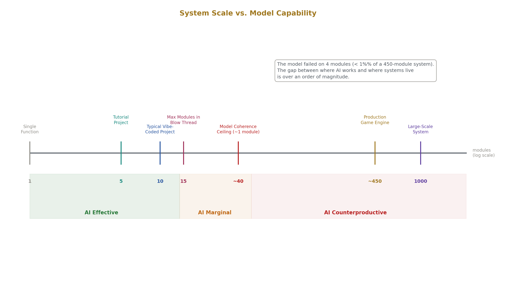
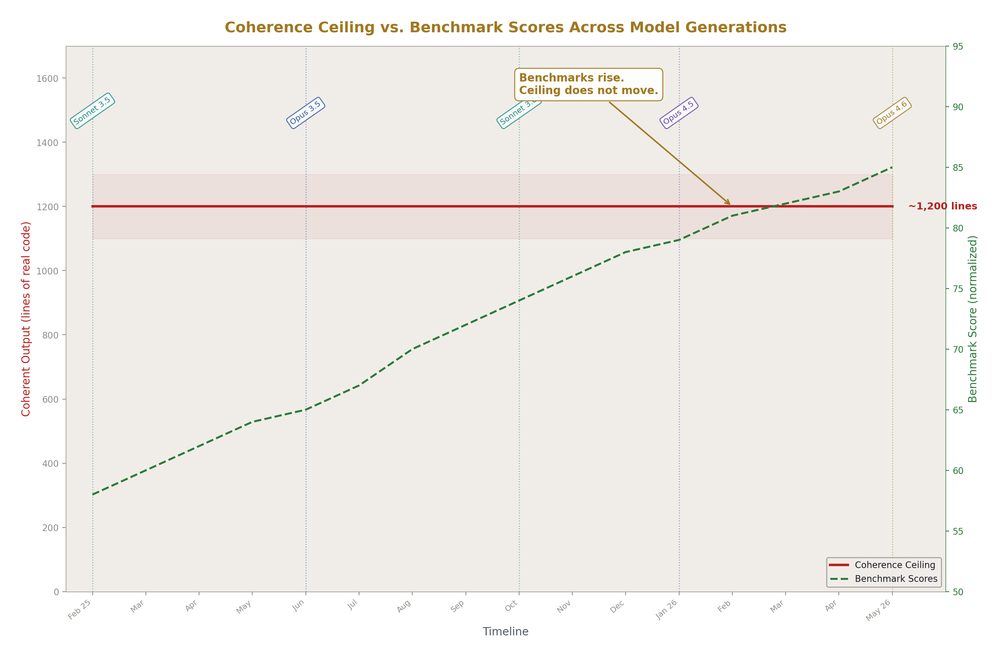
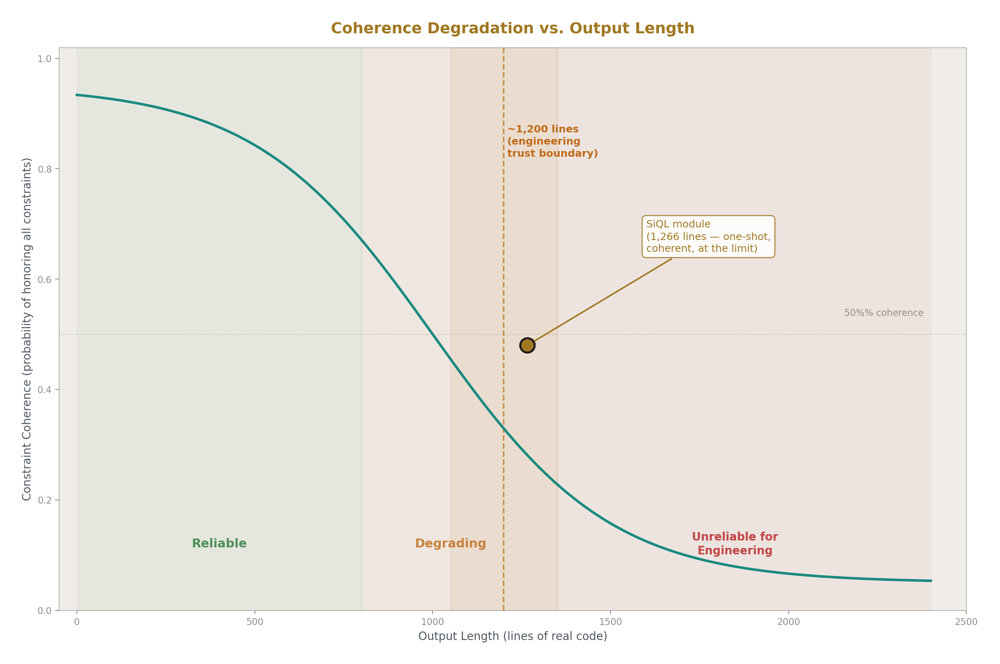
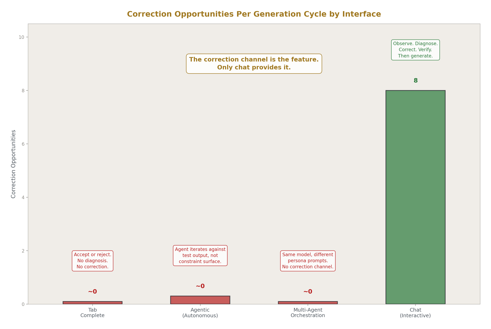
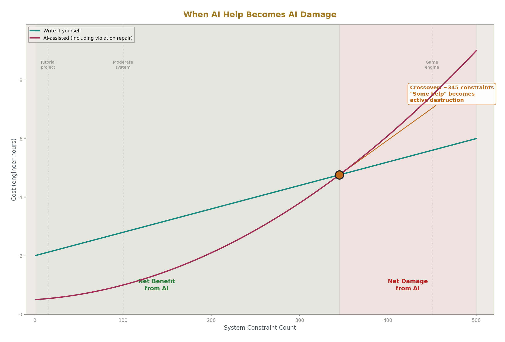
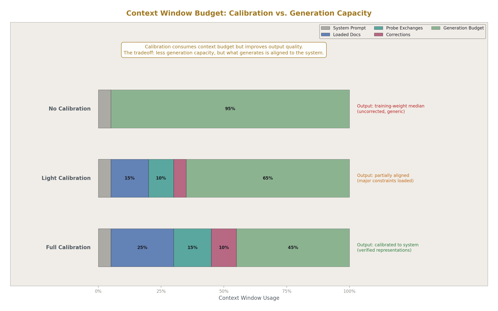
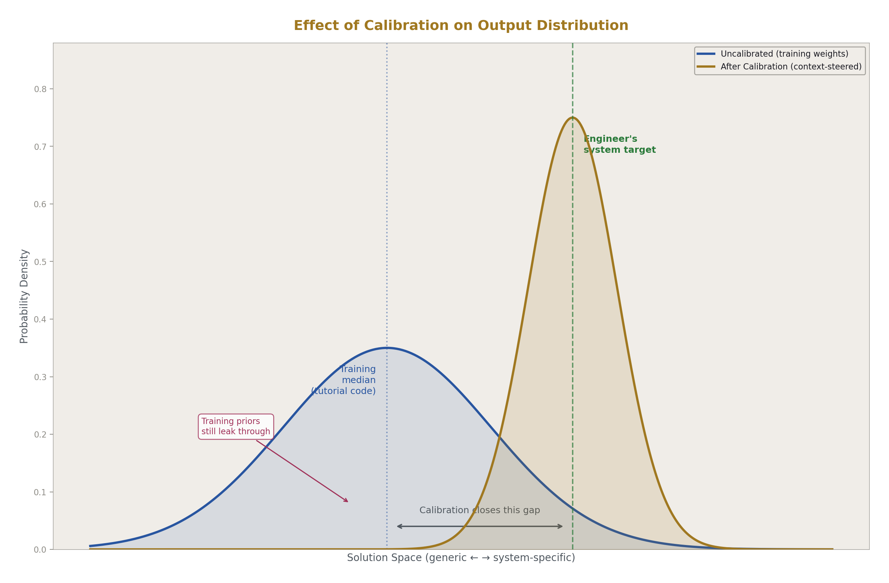
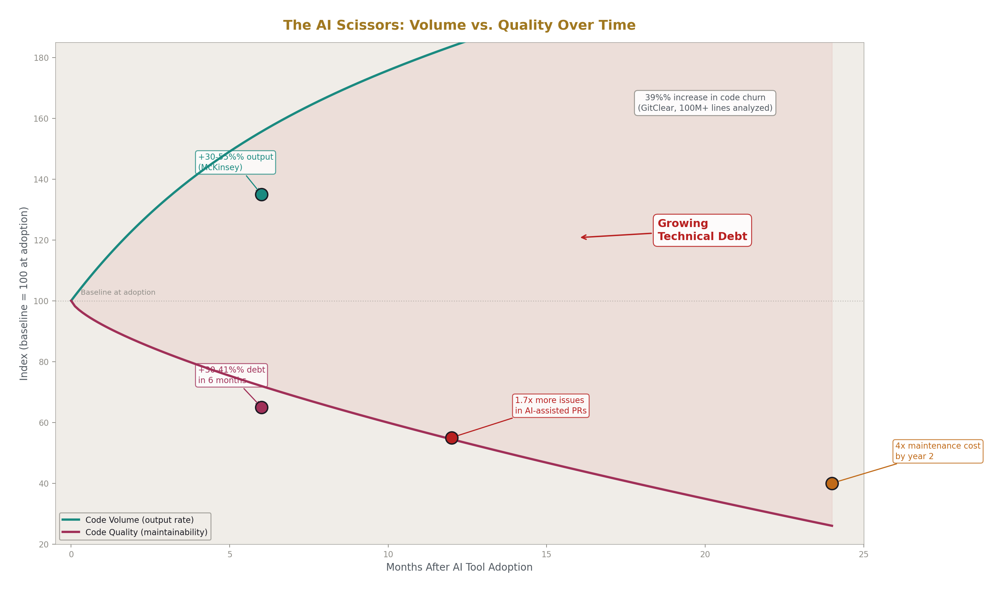

# Calibrate, Extract, Refine
## 1-Shot Pseudo-Gold from LLM Chat Sessions

**Registry:** [@HOWL-LLM-2-2026]

**DOI:** 10.5281/zenodo.20096290

**Date:** May 2026

**Domain:** LLM Usage Methodology

**AI Usage Disclosure:** Only the top metadata, figures, refs and final copyright sections and one biographical note were edited by the author. All paper content was LLM-generated using Anthropic's Claude Opus 4.6. 

---

## Abstract

This paper documents a method for using LLM chat sessions to produce usable engineering output. The method treats each chat session as a finite instrument that must be calibrated through diagnostic probing before use, used for bounded one-shot extraction within the model's coherence ceiling, and left behind while the engineer refines the output by hand. The method is grounded in architectural properties of transformer models — the absence of constraint checking, the degradation of attention across context length, the gravitational pull toward training-weight medians — and shaped by fifteen months of empirical observation that the coherence ceiling for real code generation has not moved across model generations. Chat is the only LLM interface that provides a correction channel: the ability to observe output, diagnose session-specific misalignment, and correct it before further generation. All other interfaces — tab completion, agentic, autonomous — remove this channel and leave the engineer with output that trends toward generic patterns that violate system-specific constraints. The paper is not a claim that this method is universally superior. It is a claim that for engineers working on systems that exceed the model's coherence ceiling, the correction channel is the feature that makes AI usable at all, and this method is how to use it.

---

## 1. What You Are Reading This For

You use LLMs for engineering work. You have had them produce useful output — a module skeleton, a first-pass implementation, a mapping between two domains you needed combined. You have also had them produce output that looked correct and was wrong in ways that cost you hours to find. You may have a model of what AI is doing when it helps and when it breaks. That model probably includes concepts like "it's good at boilerplate but bad at complex logic," or "you need better prompts," or "the next model will be better at this."

This paper replaces that model with a specific one. The replacement is built on what transformer models actually do when they generate code, why they fail where they fail, and what that means for how you use them. The method that follows from this understanding is a loop — calibrate the session, extract bounded output, refine it by hand — and each step exists because of a specific architectural property of the model. When you finish this paper, you should be able to predict where an LLM will fail before it fails, scope your requests to avoid those failures, and extract usable material from every session before it ends.

If you currently believe that LLMs are collaborative partners that will improve with scale until they can handle whole-system engineering, this paper will present evidence against that belief. The evidence is architectural and empirical, not theoretical. You can evaluate it against your own experience.

---

## 2. What an LLM Actually Is In Your Session

When you open a chat session with an LLM, you are running inference on a transformer model. The model generates tokens one at a time, each token selected from a probability distribution shaped by two things: the training weights (what the model learned from its training corpus) and the context window (everything currently loaded into the session — your messages, the model's previous responses, any documents you uploaded).

The training weights are fixed. They encode statistical regularities across the training corpus — predominantly public code, documentation, blog posts, Stack Overflow answers, textbooks, and open-source repositories. The distribution of this corpus is heavily skewed toward small projects, tutorials, and example code. Large-scale production codebases with hundreds of interrelated components are either proprietary or represent a tiny fraction of public repositories. The statistical center of the model's code generation capability is firmly in the tutorial-to-moderate range.

The context window is variable. You control what goes into it. Your messages, your uploaded documents, your corrections — these enter the context and shift the probability distribution the model samples from. This is the only mechanism you have for steering the model away from its training-weight defaults toward your specific system's requirements.

Five properties of this architecture matter for the method:

**No persistent state.** The model has no memory across sessions and no memory within a session beyond what is in the context window. Every token is generated from the current context. There is no mechanism that says "I decided X earlier, so I must remain consistent with X." Consistency with earlier output is maintained only insofar as that output is still in context and the pattern matching happens to reproduce compatible decisions.

**No constraint checker.** The model does not build a constraint model and verify its output against it. If constraints are stated in the prompt, they enter the context and probabilistically influence generation. But there is no verification step. The model can violate a constraint stated 800 tokens ago because the local probability distribution at the current generation step does not weight that constraint strongly enough. This is fundamentally different from a compiler, a type checker, or any system that deterministically rejects constraint violations.

**Attention degradation.** Transformer attention is effective at local coherence — syntax, function-level structure, nearby relationships — and degrades on global coherence — system-wide invariants, cross-cutting concerns, constraints that touch every module. Information at the beginning and end of context receives more attention than information in the middle. For code, where every line can carry a constraint that matters, this means the model becomes less likely to honor early constraints as generation length increases.

**Training-weight gravity.** Every generation trends toward the statistical median of the training corpus unless context steers it elsewhere. When the model encounters a pattern that matches something common in its training data, it will tend to reproduce the common version, even if the context specifies a different version. Strong training priors can override context during generation, especially in long outputs where the context's influence attenuates.

**No local knowledge.** The model has no information about your specific system, your constraint surface, your architectural decisions, or your conventions, except what you load into context. Its suggestions come from patterns seen across millions of other codebases, not from understanding yours. When it suggests a pattern, it is suggesting the most probable pattern from its training distribution, not the correct pattern for your system.

These properties are architectural. They are not bugs, training gaps, or temporary limitations. They are consequences of how transformer models work, and they define the boundaries of what you can reliably use the model for.

---

## 3. The Coherence Ceiling

The model has a maximum length of coherent output for real code generation. Beyond this length, the model begins violating its own earlier decisions — using a different naming convention than it established at the top, importing across a boundary it was told not to cross, adopting a pattern from its training data that conflicts with the pattern it was following from context.

The ceiling is approximately 1,200 lines of real code in a single generation pass. This is not a theoretical number. It is an empirical observation from fifteen months of daily use across multiple model generations — Claude Opus 4.5, earlier Sonnet models, and current releases. During that period, context windows grew, benchmark scores improved, and new capabilities were announced. The coherence ceiling did not move.

This stability is consistent with the ceiling being an architectural property rather than a training or scale issue. Larger models and better training improve the quality of output within the ceiling — better syntax, more accurate pattern matching, more appropriate library choices. They do not extend the ceiling itself, because the ceiling is set by how attention degrades under the constraint load of real code, not by how capable the model is at any single point in the generation.

The ceiling is not a cliff. Degradation is gradual. A 400-line module will be more internally coherent than a 1,000-line module. But the practical boundary — the point where coherence becomes unreliable enough that the engineer cannot trust the output for engineering purposes — lands at approximately 1,200 lines. Beyond that, the cost of finding and fixing constraint violations introduced by the model exceeds the cost of writing the code from scratch.

The ceiling defines the maximum scope of any single extraction. Every request to the model must be scoped to produce output that fits beneath it. This is not a limitation to work around. It is the fundamental constraint that the entire method is built on. An engineer who does not know the ceiling will attempt generations that exceed it and attribute the resulting failures to their prompting technique, their tool choice, or the model's intelligence. The failures are architectural and no prompting technique will overcome them.

---

## 4. Why Chat Is the Only Usable Interface

LLMs are accessed through multiple interfaces: tab completion in an editor, chat windows, agentic tools that plan and execute autonomously, and multi-agent systems that chain models together. These interfaces differ in how they present the model's output, but underneath every interface is the same transformer running inference on whatever is in its context window. Tab completion, Cursor Agent mode, Claude Code in a terminal, and a chat window are the same model with different context and different amounts of human intervention.

The critical difference is the correction channel.

Tab completion gives the model a few lines of surrounding code as context. It generates the most probable next tokens. The engineer accepts or rejects. If the model was wrong, the engineer rejects and types the correct code themselves. There is no mechanism to diagnose why the model was wrong or correct the model's representation before the next suggestion. Each suggestion is independent, generated from the narrow local context.

Agentic tools give the model more files as context and a system prompt instructing it to plan, execute, test, and iterate. The model generates a plan from its training distribution, executes it, checks the result against test output, and iterates. If the plan reflects a training prior that conflicts with the engineer's system constraints, there is no mechanism to correct it mid-execution. The iteration loop corrects against test output, not against the engineer's constraint surface. If the tests pass but the code violates an architectural invariant that is not tested, the agent declares success.

Multi-agent systems multiply the problem. Each "agent" is the same model wearing a different system prompt, generating text that sounds like a different perspective, with identical underlying capabilities and identical training-weight limitations at every step. The appearance of diverse perspectives is a language-level illusion produced by different persona prompts. The analysis underneath each persona comes from the same distribution.

Chat provides what the others remove: the ability to observe the model's output, diagnose whether this specific session has a misalignment, and correct it before the model generates more output on top of the wrong foundation. The engineer can load context, ask the model to explain its understanding mechanically, see where the understanding is wrong, correct the specific error, verify the correction took hold, and only then ask for generation. This diagnostic-correction loop is the only mechanism available for aligning a session to the engineer's actual system.

For engineers working on systems that exceed the coherence ceiling — systems with hundreds of modules, global constraints that all components must satisfy, architectural conventions accumulated over years — uncorrected LLM output is not "some help." It is active destruction. A suggestion that is structurally plausible but violates a global constraint does not cost the engineer the time to undo the suggestion. It costs the time to trace every place the wrong assumption propagated, verify what it broke, and re-establish the invariants. That cost is multiplicative, not additive. The more autonomous the model, the more decisions it makes from uncorrected training priors, and the more constraint violations it introduces that the engineer must find later.

The industry sells autonomy as the premium feature. For engineers at this scale, autonomy is the thing that breaks the model. The correction channel is the feature. And only the simplest interface — chat — provides it.

---

## 5. Calibrate

The first phase of the method is calibration: preparing the session so that its context contains a corrected representation of the relevant domain before any generation occurs.

**Load context.** Upload documentation, code files, specifications, and examples that define the task and its constraints. The model will generate from whatever is in context; if the context contains only training weights (no uploaded material), the output will be the training-weight median — generic patterns from the most common codebases in the training corpus. Loading context shifts the distribution toward your system's specific patterns.

**Probe with mechanical decomposition.** Before asking the model to produce anything, ask it to explain the mechanics of the thing you need it to work with. Not "do you understand X?" — the model will always say yes. "Explain the mechanical breakdown of X: what are the parts, how do they interact, what are the state transitions, what are the failure modes." This forces the model out of recognition-and-label mode ("it's a singleton pattern") and into enumeration-of-parts mode, where its understanding becomes concrete enough to audit.

Converting the explanation to structs or code raises the stakes further. Prose can hide vagueness. A struct definition cannot — either the fields are there and the types make sense, or they do not. The engineer uses code's compiler-like properties as a forcing function to make the model's understanding concrete and therefore auditable.

**Diagnose before correcting.** The mechanical explanation is a diagnostic, not a correction step. If the model's representation is correct, there is nothing to correct and the context is clean. If the model's representation is wrong, the engineer now knows what specifically is wrong and corrects that specific misalignment. Applying a correction to a session that did not have the problem introduces a conflicting signal into the context window — the model is now holding both its original (correct) representation and the engineer's correction for an error that did not exist, and these can interfere unpredictably during generation.

This is why generic prompting advice ("always tell the AI to think step by step," "always correct its first response") is unreliable as a universal practice. These are blanket interventions applied without diagnosis. They work sometimes and cause context pollution other times. The method requires checking first.

**Query weights as a database, not through personas.** "From your training weights, compare X against Y with respect to Z" asks the model to treat its weights as a dataset and report what is in them. "As a senior developer, review X" asks the model to role-play, which adds a characterization filter — the model generates text that co-occurred with senior developer personas in training data, adopting their vocabulary and framing patterns without gaining their experience. The persona adds a transformation between the raw signal and the output. The direct query removes it. The output is still limited by what is in the training data, but it is one less transformation from the actual signal.

**Narrow the distribution iteratively.** Each calibration step constrains the distribution the model samples from. Loading docs shifts it from generic to domain-specific. Mechanical probing reveals where the session's representation diverges from reality. Corrections repair specific divergences. By the time calibration is complete, the context contains a representation that the engineer has verified against their actual system, and the model's generation will be steered by that verified representation rather than by training-weight defaults.

The calibration phase is an investment. It costs tokens and time. The return is that the subsequent extraction produces output aligned to the engineer's system rather than to the statistical median of all systems in the training corpus. Skipping calibration and going directly to generation is faster in the short term and more expensive in total, because uncalibrated output requires more correction after extraction, if it is usable at all.

---

## 6. Extract

Once the session is calibrated, the engineer requests a single bounded output. The output must fit beneath the coherence ceiling. The target is "it runs and does the first thing" — minimum viable, not complete.

**Scope beneath the ceiling.** The request must produce output that stays within approximately 1,200 lines of real code. If the task requires more, the engineer must decompose it into independent modules, each scoped beneath the ceiling, and manage the integration between modules themselves. The integration is engineering — cross-module constraints, architectural alignment, convention enforcement — and it cannot be delegated to the model because it requires the global system knowledge the model does not have.

**Supply the architecture, receive the typing.** The engineer specifies the architectural placement of the module — what layer it lives in, what it is allowed to import, what conventions it must follow, what types it uses. The model fills in the implementation. The engineer is composing from primitives and correcting the model's output, like sculpting with the model as hands that type. The engineering decisions are the engineer's. The model contributes typing speed and pattern assembly from its training data.

**One-shot, then stop editing with the model.** Do not iterate on the same code with the model in subsequent prompts. Later prompts shift the context, which shifts the distribution, which causes the model to generate output that is consistent with the current context but not necessarily consistent with the earlier generation. Once complexity passes a threshold, subsequent prompts break what earlier prompts built. The engineer takes the one-shot output and leaves.

**If the session has life remaining, keep extracting.** Sessions end — by token limit, by time, or by task completion. That ending is a fact of the architecture, not a choice. The method is extraction under a deadline. If calibration was fast and the session has tokens remaining after the primary extraction, the engineer continues extracting secondary outputs: a technical specification, a design document, an enumeration pass for coverage checking, a syntax reference for an unfamiliar domain. Work the session until it ends or you do. Everything extracted is pseudo-gold — closer to right than a blank page, but never finished without the engineer's refinement.

**Do not delegate judgment.** At no point during extraction does the engineer ask the model to make engineering decisions. The model does not choose architectures, select patterns, evaluate tradeoffs, or decide what constraints matter. It produces output shaped by the calibrated context, and the engineer evaluates every piece of that output against their constraint surface. The model is a typist with a library card — fast hands, wide but shallow reading, no understanding of the engineer's system.

---

## 7. Refine

After extraction, the session is gone. The context window that was calibrated to the engineer's system no longer exists. What remains is the extracted output — code, specs, documents — sitting in the engineer's files, disconnected from the model that produced it.

The output is pseudo-gold. It is structurally close to what the engineer needs because the calibration phase aligned the session to the right domain and conventions. It compiles, or nearly compiles. It handles the first operation, or the basic case. The types are mostly right. The function signatures follow the conventions that were in context.

It is not finished. It contains decisions the model made from training priors that leaked through the calibration — a slightly wrong pattern here, a convention violation there, an import that crosses a boundary the model did not fully internalize. These are not catastrophic failures; they are the residue of generating from a probability distribution that was steered but not perfectly constrained. They are expected, and finding them is part of the method.

The engineer refines the output by hand. They read every line against their knowledge of the system. They fix convention violations. They adjust types. They enforce the global constraints that the model could not hold. Over time — hours, days, weeks of continued development — the model's fingerprint disappears entirely. What remains is code that is the engineer's: shaped by their constraints, integrated into their architecture, maintained by their understanding. The structure the model produced may still be visible in the overall organization, but the specific decisions are the engineer's.

This is why the output is pseudo-gold and not gold. Gold would be shippable as-is. Pseudo-gold is raw material that is faster to refine than to produce from scratch. The value of the method is not that the model produces finished work. The value is that the model produces a starting point that is close enough to right — because the session was calibrated — that refinement is a net time savings over writing from a blank page.

The refine phase is where the engineering happens. The model contributed raw material and typing speed. The final product is the engineer's.

---

## 8. The Search and Enumeration Modes

Alongside the calibrate-extract-refine loop for code generation, the model serves three additional roles that exploit the same architectural properties from a different angle.

**Design-space search.** The model's training weights encode a wide map of algorithmic and structural patterns across many domains. The map is shallow — the model cannot reliably engineer solutions from these patterns — but it is broad. When the engineer has a design target that requires combining subpatterns from domains they have not individually explored, the model can surface combinatorial possibilities. The engineer describes the target, the model proposes candidate building blocks, and the engineer evaluates each candidate against their constraint surface. Dead paths found during search are engineering — they constrain the design space and are not waste. The model did not engineer the solution. It searched a space of possibilities the engineer could not have enumerated alone, and the engineer assembled the solution from what the search surfaced.

**Enumeration oracle.** The model can enumerate known problem categories within established domains. "What are all the failure modes of X?" "What data structures serve this access pattern?" "What does the full set of security concerns look like for Y?" The output is low quality as advice — it is generic, drawn from training weights, unaware of the engineer's specific system. But the engineer is not using it as advice. They are using it as a coverage checklist against their own design. If the design addresses fourteen of seventeen enumerated concerns, the engineer has three specific items to evaluate — not to adopt the model's solution for, but to determine whether they are relevant to the system and whether the design already handles them implicitly.

This works precisely because the training weights are broad and generic. The breadth that makes the model unreliable as an engineering advisor makes it useful as an enumerator. The engineer exploits the property the model has (wide coverage of known problem categories) while discarding the property it lacks (judgment about which ones matter in the specific system).

**Comprehension mirror.** The engineer feeds their own code — structs, type definitions, module interfaces — to the model and asks it to derive what the code can do. This is a reverse enumeration: instead of "enumerate the problem space so I can check my design against it," it is "enumerate what my design implies so I can check it against my intentions." When the model finds a capability the engineer did not plan for, that is either a bonus or a warning that the code exposes something it should not. This works because the task is analysis of concrete types within the model's reliable coherence window, operating on the engineer's local information rather than on training priors.

In all three roles, the model is queried as a database, not consulted as an advisor. The engineering judgment — what to keep, what to discard, what to investigate further — is entirely the engineer's.

---

## 9. What the Model Cannot Do

The method is defined by its limits. Every scoping decision, every choice to extract rather than iterate, every refusal to delegate judgment, follows from a specific thing the model cannot do. These limits are architectural. They have not changed across fifteen months of model releases, and the evidence that they will change requires a mechanism that does not currently exist in transformer architectures.

**Maintain global constraints across a system.** A system with hundreds of modules where every module must satisfy shared invariants — naming conventions, import rules, allocator patterns, architectural layer boundaries — requires a persistent constraint model checked against every change. The model has no such mechanism. It approximates constraint satisfaction through pattern matching, and the approximation degrades as the number and distance of constraints increases.

**Hold coherence beyond the ceiling.** At approximately 1,200 lines of real code, the model begins violating its own earlier decisions. This is not a failure of intelligence. It is attention degradation under constraint load across context length. Better models improve quality within the ceiling. They do not raise it.

**Act as a peer to the engineer.** The model cannot reason about hundreds of modules simultaneously. The engineer can. This is not a spectrum where "pair programming" sits somewhere in the middle. It is a categorical difference. A peer who is wrong in ways that require the engineer's full expertise to detect is not a partner. They are an interruption source with plausible output. The evaluation cost of checking their suggestions against the full constraint surface exceeds the cost of producing the correct solution directly.

**Gain capabilities through persona prompting.** "You are a senior developer" shifts the model's output distribution toward text that co-occurred with senior developer personas in training data. It does not give the model a senior developer's experience, pattern recognition, or system knowledge. The model gains a voice, not capability. The persona adds a characterization filter that produces the performance of expertise without the substance. For engineers who know how to query the model's weights directly, the persona is pure noise — one more transformation between signal and output.

**Improve its ceiling across model generations.** This is the empirical claim. From February 2025 through May 2026, across multiple Claude model generations with increasing benchmark scores and expanding context windows, the coherence ceiling for real code generation remained at approximately 1,200 lines. The benchmarks improve because benchmarks test tasks that fit within the ceiling. The ceiling does not move because the ceiling is set by architectural properties that model scaling does not address.

Knowing these limits is not a concession. It is what opens the model's actual use surfaces. The engineer who knows the model cannot maintain global constraints does not attempt multi-module generation and instead scopes each extraction to a single module. The engineer who knows the ceiling does not request 3,000-line outputs and instead decomposes the task. The engineer who knows personas add noise queries weights directly and gets cleaner signal. Every productive use of the model in this method follows from an accurate understanding of what the model cannot do.

---

## 10. The Industry Claims, Stripped

The dominant industry claims about AI-assisted coding, as of mid-2026, follow a consistent pattern: measure the easy thing, ignore the hard thing, present the easy measurement as if it answers the hard question.

**"41% of all code is AI-generated."** The number may be accurate. What it means is overclaimed. The majority of that percentage is tab completion and boilerplate — AI doing the typing, not the engineering. The number describes typing delegation, not problem-solving delegation. It sounds like "AI writes half the software" but means "AI does half the typing."

**"Developers save 30–75% of their time."** The range is so wide it is not a finding. When measured precisely, the number is roughly 3.6 hours per week on a 40-hour week — 9%. The larger percentages come from specific subtasks (boilerplate generation, documentation drafts) measured in isolation and presented as if they apply to the whole workflow.

**"Top users ship 126% more projects weekly."** What projects? What size? The data shows that smaller teams on smaller projects see the largest multipliers, with gains diminishing as system complexity increases. Nobody is shipping 126% more large-scale systems. The claim conflates project count with engineering output.

**"The defining shift of 2026 is from AI as autocomplete to AI as agent."** This is a product positioning narrative, not an engineering finding. Fewer than one in four organizations have scaled agents to production. Industry analysts estimate only about 130 of thousands of claimed "AI agent" vendors are building genuinely agentic systems. The rest is "agent washing" — rebranding existing automation. The agentic framing hides the constraint problem: the more autonomous the agent, the more it generates from uncorrected training priors, and the more expensive the review.

**"86% of AI users treat output as a starting point, not a final answer."** This sounds responsible. The behavioral data contradicts it. 76% of developers using AI tools report generating code they do not fully understand at least some of the time. Developers accept AI suggestions with minimal modification 40–60% of the time, even when those suggestions contain bugs. "Starting point" in practice means "I glance at it and accept it." The stated belief describes aspiration, not practice.

**"AI-assisted code has 1.7x more issues than human-written code."** This finding holds and is probably underreported, because it only counts issues that were detected. Issues that look correct but violate global constraints — exactly the kind the model cannot check — will not appear in automated PR review tools.

**"AI boosts short-term output by 30–55% but technical debt increases 30–41% within six months."** Both halves hold, and they are the same phenomenon measured from two angles. The model is good at generating new code and cannot assess where it fits in the existing system. More code, faster, with less cleanup. Code duplication increases while refactoring declines. Unmanaged AI-generated code drives maintenance costs to four times traditional levels by year two.

**"43% of advanced AI users intentionally do non-AI work to keep their skills from atrophying."** This is an accidental admission that the tool degrades its users. No previous generation of productivity tools required practitioners to deliberately practice not using the tool to maintain professional competence.

One respondent in a public accountability thread on the claimed 100x productivity multiplier offered the most credible self-report: "I would say I'm only getting about 2x as much done with agents." In the same thread, with 262,000 views, nobody posted a project that approximated even a single year of traditional engineering work, let alone twenty-five. Multiple respondents independently described the same output: habit trackers, word games, small apps — tutorial-scale projects that are exactly the regime where AI is effective, and exactly the regime that tells you nothing about engineering productivity at system scale.

---

## 11. The Missing Feature

The method would be more efficient with one feature that does not currently exist for service-level users: session snapshots.

The ability to calibrate a session to a known-good state, snapshot it, and branch from that state for multiple extraction runs would let the engineer amortize calibration cost across many tasks. Currently, every session is linear and terminal. The calibration work — loading docs, probing understanding, correcting misalignments, building verified context — is spent once and lost when the session ends. The next session on the same system starts from zero.

Snapshots would not change the method's structure. The calibrate-extract-refine loop would still apply. The coherence ceiling would still limit each extraction. The engineer would still supply the constraint knowledge and the architectural judgment. What would change is efficiency: a session calibrated to a specific subsystem could be branched ten times for ten different module extractions, each starting from the same verified baseline, without repeating the calibration each time.

This is a tooling improvement, not a capability improvement. It makes the existing method faster. It does not remove the limits that define it.

---

## 12. What You Can Now Do

If the transmission worked, you now have the following installed:

You can predict where an LLM will fail before it fails. You know the five architectural properties — no persistent state, no constraint checker, attention degradation, training-weight gravity, no local knowledge — and you can trace any specific failure to one or more of them. You do not attribute failures to prompting technique or model intelligence when the cause is architectural.

You can calibrate a session before using it. You load context, probe with mechanical decomposition, diagnose before correcting, and query weights directly without persona distortion. You know that calibration is an investment that pays for itself in extraction quality, and that skipping it produces output that costs more to fix than it saved to generate.

You can scope extractions beneath the coherence ceiling. You know the ceiling is approximately 1,200 lines and has not moved in fifteen months. You decompose tasks that exceed it into independent modules and manage integration yourself. You do not attempt multi-module generation because you know it will fail architecturally.

You can extract once and leave. You do not iterate on the same code with the model in subsequent prompts, because you know that later prompts shift the distribution and break coherence with earlier output past a complexity threshold. You take the one-shot output and refine it by hand.

You can use the model for search, enumeration, and comprehension without delegating judgment. You query it as a database for design-space exploration, as an enumerator for coverage checking, and as a comprehension mirror for reverse-reading your own code. In all three modes, you evaluate every result against your constraint surface and discard what does not fit.

You can strip industry claims against architectural reality. When someone claims 100x productivity, you ask what was measured. When someone claims agentic AI will handle complex systems, you ask how it maintains global constraints. When someone claims the next model will fix the ceiling, you ask for the mechanism.

You can explain why chat is the only interface that provides the correction channel and why the correction channel is the feature that matters for engineering at scale.

You recognize that the method is defined by the limit it respects. The value comes from knowing the boundary, not from pushing it.

---

## 13. Closing

This method is not novel. It is what experienced engineers converge on when they use LLMs long enough to develop an accurate model of what the tool can and cannot do. The convergence happens because the architectural properties are real and the consequences are consistent — every engineer working above the coherence ceiling eventually discovers the same limits and develops similar workarounds.

What this paper adds is the explicit framework: name the limits, ground them in architecture, document the method that follows from them, and strip the industry claims that obscure them. The engineer who has the method does not need to rediscover the limits through trial and error. They can start with an accurate model and use the tool productively from the first session.

The current industry narrative pushes in the opposite direction — toward more autonomy, more delegation, more agent-driven workflows, more tool-mediated interaction that removes the engineer from the loop. This narrative is driven by product positioning and benchmark optimization, not by engineering outcomes. The empirical data — increasing technical debt, increasing code churn, increasing defect rates in AI-assisted code, a coherence ceiling that has not moved in fifteen months — tells the counter-story. The tool is useful. The tool has hard limits. The limits are architectural. The method is how to work within them.

The practice is the point. Reading this paper installs the framework conceptually. Running the loop — calibrate, extract, refine — on real engineering tasks is what turns the concepts into a working discipline. The first sessions run with the method consciously applied will feel slow, because the calibration steps are deliberate and the scoping decisions require thought. With practice, they compress. The engineer eventually calibrates by habit, scopes by instinct, and extracts without conscious reference to the steps. The steps are still present but no longer require deliberate execution.

The model is a typist with a library card. Fast hands, wide but shallow reading, no understanding of your system, and a hard limit on how much it can hold together at once. Use it for what that description makes it good at. Do not use it for anything else. Know the ceiling. Work beneath it. Extract the pseudo-gold before the session ends, and refine it into real gold after the session is gone.

---

