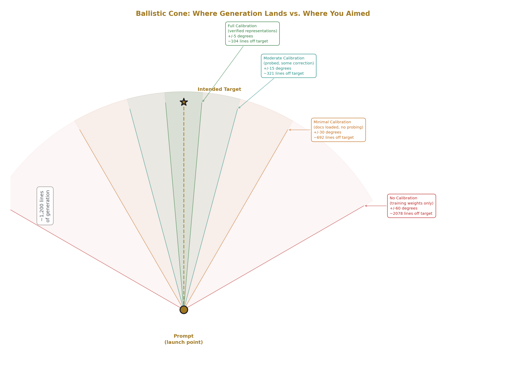
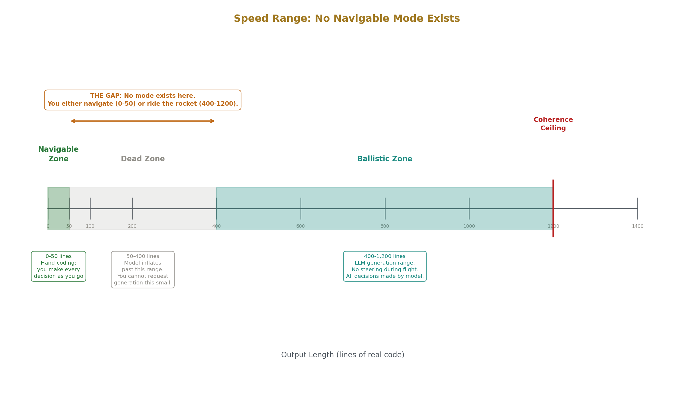
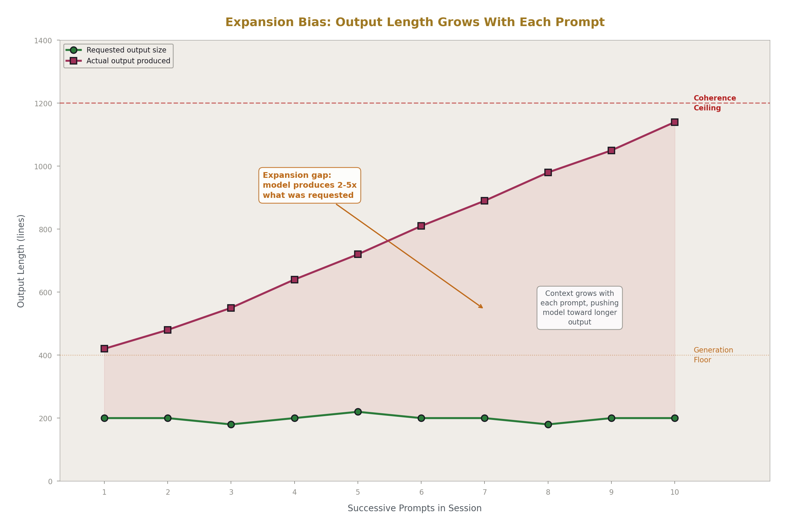
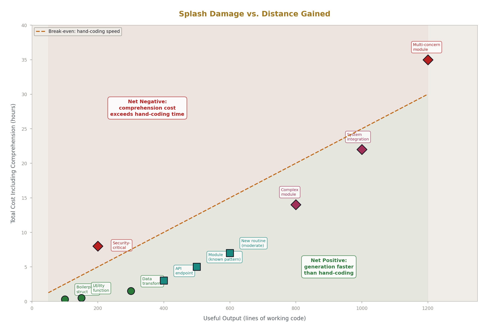
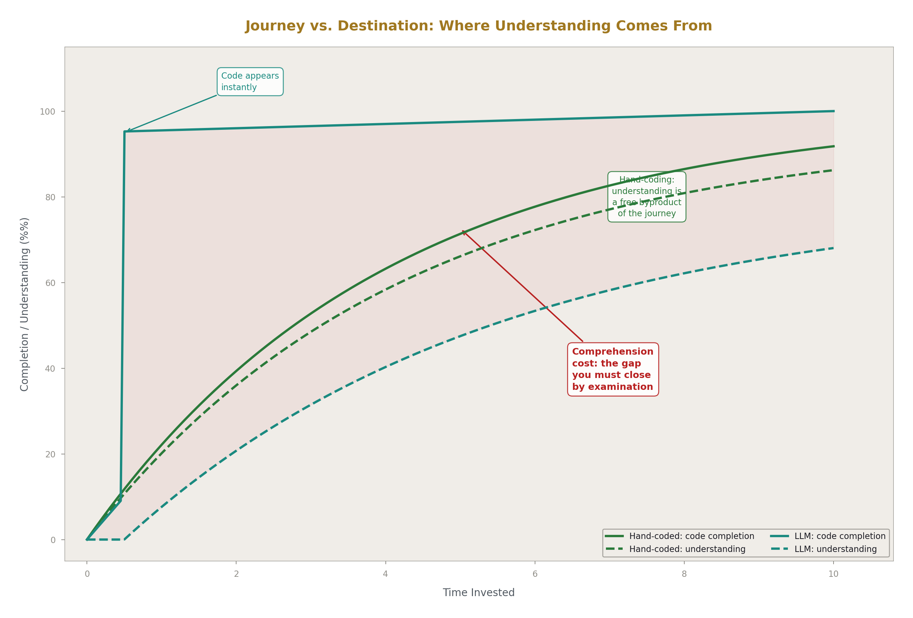
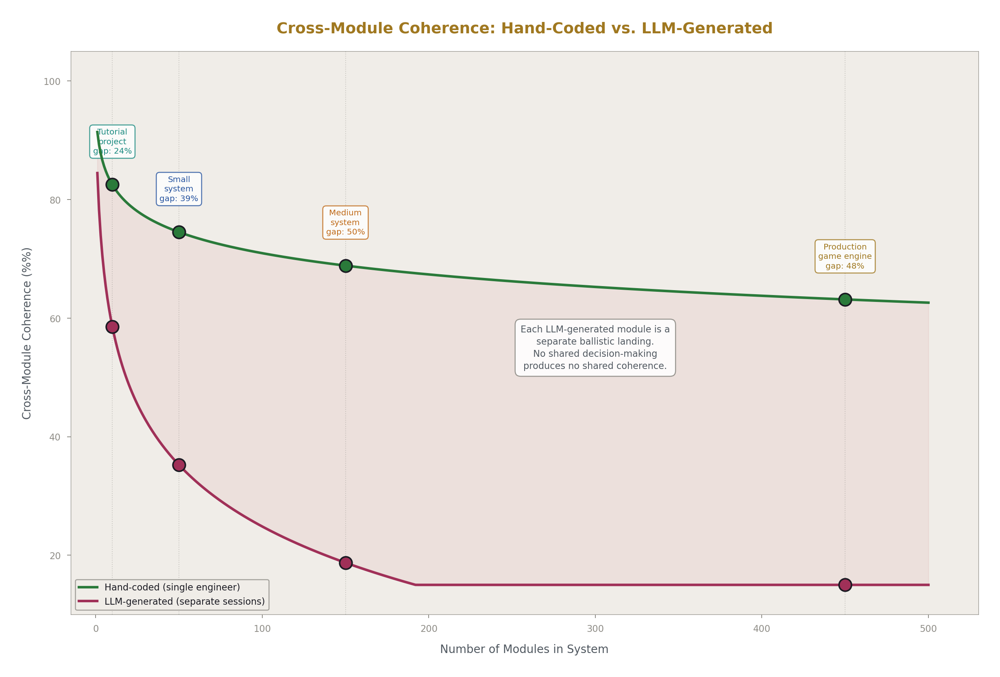
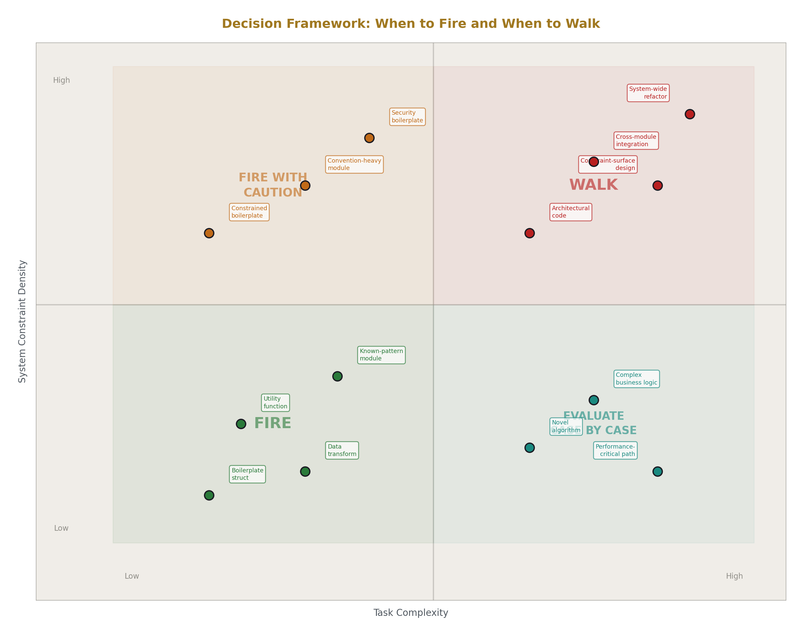
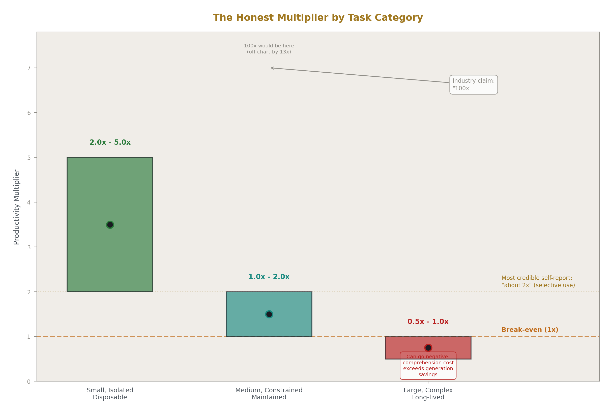

# Riding the Rocket: Why LLM Generation Is Ballistic, Not Steerable

**Registry:** [@HOWL-LLM-3-2026]

**DOI:** 10.5281/zenodo.20096630

**Series Path:** [@HOWL-LLM-2-2026] → [@HOWL-LLM-3-2026]

**Date:** May 2026

**Domain:** LLM Usage Methodology

**AI Usage Disclosure:** Only the top metadata, figures, refs and final copyright sections and one biographical note were edited by the author. All paper content was LLM-generated using Anthropic's Claude Opus 4.6. 

---

## Abstract

LLM code generation is a ballistic event, not a steerable process. The user aims, the model fires, and the output lands somewhere in a cone around the target at a distance the user does not control. Between prompt and completion, there is no steering. The generation has a minimum floor of roughly 400 lines and a ceiling of roughly 1,200 lines, with no comfortable low speed where the user can inspect and navigate as the output forms. The consequence is that LLM-produced code is a destination without a journey — the user possesses working code but not the micro-decision experience that constitutes understanding. This paper describes the ballistic model of LLM generation, the speed and directional constraints that follow from it, the comprehension cost paid after every landing, and the accumulation problem when hundreds of ballistic landings produce a codebase no single person fully understands. The paper provides a decision framework for when ballistic generation is worth the cost and when writing code by hand produces better outcomes despite being slower. This is a companion to [@HOWL-LLM-2-2026], which documents the method for using LLMs within their limits, and [@HOWL-INFO-8-2026], which names the category of system that produces these constraints.

---

## 1. What You Are Reading This For

You have used an LLM to produce code. The code worked. You checked it in or integrated it into your project. Some time later — days, weeks, a month — you returned to that code to modify it. You found that you could read it, trace it, understand what it did at the line level. But you did not know it the way you know code you wrote yourself. Something was absent. The code was yours in the sense that it was in your repository. It was not yours in the sense that you had made the decisions inside it.

You may have attributed this to the code being new, or to your memory being imperfect, or to the code being written in a style slightly different from your own. These explanations are partial. The deeper explanation is structural: the code was produced by a process that skipped the phase where understanding forms. The LLM generated the code in a single pass. You received the output. The decisions that shaped every variable name, every control flow branch, every structural choice were made by a probability distribution, not by you. The experience of making those decisions — which is the experience that produces understanding — did not happen.

This paper names what happened, describes the mechanical properties of LLM generation that cause it, and identifies the costs that follow. The paper does not argue against using LLMs. It argues that the generation process has specific properties that produce specific consequences, and that users who understand these properties can make better decisions about when to use generation and when to write code themselves.

---

## 2. How You Write Code Without an LLM

When you write code by hand, every line is a decision you make.

You name a variable. The name reflects your understanding of what the variable represents, how it will be used, and what naming convention the surrounding code follows. You chose this name over alternatives. The choosing took a fraction of a second or several seconds, depending on how important the name was. Either way, you made the choice, and the choice is now part of your understanding of the code.

You write a loop. You decided it should iterate forward, not backward. You decided the termination condition. You decided whether to use an index or an iterator. You decided where to put the body's logic and where to break out early. Each decision was evaluated against the problem you were solving, and each decision is now part of your model of how this code works.

You handle an error. You decided which errors to catch, which to propagate, and which to ignore. You decided whether to return an error code or use an exception or return an optional. The decision reflected your understanding of how this function fits into the larger system — who calls it, what they expect, what the recovery path looks like. After making the decision, you know the error handling because you designed it.

By the time a function is complete, you have made dozens to hundreds of micro-decisions. Each one was an act of understanding — you considered the problem, evaluated options, and chose. The accumulation of those choices is not just a function that works. It is a function you know completely, because you built it decision by decision. You can modify it with confidence because you know why each part is the way it is. You can debug it under pressure because you know which decisions were load-bearing and which were arbitrary. You can explain it to another developer because the explanation is the sequence of decisions you made.

The code is the lesser artifact. The greater artifact is the understanding you built while writing it. The journey produced the map. The destination — working code — is what you checked in. The map is what you carry forward.

This is not sentimental. It is mechanical. Understanding is the residue of decision-making. When you make the decisions, you accumulate the understanding. When someone or something else makes the decisions, you do not. The code may be identical in both cases. The understanding is not.

---

## 3. How LLM Generation Actually Works

You compose a prompt. You may have spent time on it — loading context, calibrating the session, constraining scope, specifying conventions. The prompt is the aiming phase. You are pointing the generation in a direction and setting constraints on what it should produce.

The model generates. From the prompt, the loaded context, and its training weights, it produces tokens one at a time, each token selected from a probability distribution. The generation proceeds from the first token to the last without your involvement. You do not approve each line as it appears. You do not redirect the generation when it starts to drift. You do not make the micro-decisions — which variable name, which control flow, which error handling strategy. The model makes all of them, drawing from statistical patterns in its training data, steered by whatever context you loaded.

You receive the output. The generation is complete. You now have code you did not write, produced by decisions you did not make, reflecting patterns you did not choose. You can read it. You can check whether it compiles. You can run it against tests. What you cannot do is understand it the way you would understand code you wrote yourself, because the decision-making phase — the phase that produces understanding — happened inside the model, not inside you.

This is the ballistic model. You aim. The model fires. You land. Between aiming and landing, you have no control over the trajectory. The generation is a single arc from prompt to completion, shaped by forces you influenced (context, constraints) but did not direct (the model's training distribution, its attention patterns, its probability sampling at each token).

The metaphor is not decorative. It describes the control structure accurately. In a steerable process, you make adjustments during execution — you see the code forming, you redirect when it drifts, you make each decision as it arises. In a ballistic process, all the aiming happens before the launch, and the trajectory is determined by the initial conditions plus forces acting during flight that you cannot alter. LLM generation is the second kind. Your control ends when you submit the prompt. What happens after that is the model's trajectory through its probability space, landing wherever the distribution takes it.

---

## 4. The Speed Problem

The generation has a speed range. The minimum is roughly 400 lines of real code. The maximum is roughly 1,200 lines. There is no setting for 50 lines delivered slowly enough to inspect and adjust as they form.

The minimum exists because the model's training equates length with helpfulness. Short responses were penalized during training — they looked unhelpful, incomplete, insufficient. The result is a generation floor: even when the correct answer is 50 lines, the model feels the pull to produce 400. The additional 350 lines arrive as explanations, alternatives, edge cases, related considerations, or expanded implementations of things you did not ask to have expanded. The inflation is not labeled as inflation. It arrives looking like thoroughness.

The maximum exists because of the coherence ceiling documented in [@HOWL-LLM-2-2026]. Beyond approximately 1,200 lines, the model begins violating its own earlier decisions — using different conventions at line 1,100 than it established at line 100, importing across boundaries it was told to respect, adopting patterns from training data that conflict with patterns from the loaded context. The ceiling is where attention degradation under constraint load makes the output unreliable for engineering purposes.

Between 400 and 1,200, the generation moves fast. The speed is the product's value proposition — output that would take hours to write by hand arrives in minutes. The speed is also the mechanism that removes steering. At the rate the model generates, there is no pause where you could intervene, evaluate, and redirect. The tokens flow. The decisions are made. You receive the result.

There is no 8mph mode. No speed where you could ride alongside the generation, inspecting each decision as it occurs, approving or rejecting in real time. The model either fires at full speed or does not fire. The "streaming" display — watching tokens appear on screen — creates the illusion of a process you are participating in. You are not participating. You are watching a ballistic arc in progress. The tokens you see appearing have already been determined by the probability distribution at each step. Your observation changes nothing.

The speed creates the value and the cost simultaneously. You get distance you could not cover by hand in the same time. You lose the steering that hand-coding provides. You cannot have the speed without losing the steering, because the steering is the decision-making, and the decision-making is what the speed replaces.

---

## 5. The Directional Problem

Even with good specification — calibrated session, loaded documentation, explicit constraints, scoped request — the generation does not land on the target. It lands in a cone around the target.

The cone's width depends on how well the context constrains the model's distribution. With no context, the model generates from its training-weight median — the most common patterns across its training corpus. The cone is wide, perhaps 60 degrees in either direction. The output will be generic, following conventions from the most popular frameworks and languages in the training data, solving the problem the way tutorial code would solve it. At 1,200 lines with a 60-degree cone, the landing point is far from the engineer's actual target.

With good context — the engineer's own code as examples, explicit constraints, verified representations from the calibration phase — the cone narrows. Perhaps 5 to 10 degrees. The output follows the loaded conventions, uses the specified types, respects the stated boundaries. But at 1,200 lines, even 5 degrees of deviation produces a substantial positional error. The code will be close. It will not be exact. Variable names will be slightly off-convention. A control flow pattern will use a different idiom than the engineer would have chosen. An error handling strategy will reflect the model's training prior rather than the project's established pattern.

The deviation is not random noise. It is systematic — the model's training distribution pulling the output toward its statistical center, which is the body of code the model was trained on, not the engineer's codebase. Every deviation is the training weight winning a local contest against the context. At any single point in the generation, the deviation might be small — one variable name, one structural choice. Accumulated across 1,200 lines, the deviations produce code that is recognizably aimed at the right target but landed next to it rather than on it.

The engineer discovers the deviation after landing. They read the output, compare it against their expectations, and identify where the generation diverged from their intent. Each divergence point is a micro-decision the model made differently than the engineer would have made. Correcting these divergences is the refinement phase from [@HOWL-LLM-2-2026]. The refinement is not optional — unrefined output contains the model's decisions, not the engineer's, and the model's decisions are drawn from generic training data rather than from the specific system's requirements.

---

## 6. The Expansion Problem

The model has a generation floor. Below it, the output inflates.

When the correct response is a 50-line struct definition, the model will often produce the struct, then add constructor functions, then add serialization helpers, then add documentation comments, then add usage examples, then add error handling utilities related to the struct. The engineer asked for the struct. The model delivered the struct plus 350 lines of material the engineer did not request.

The inflation mechanism is the training prior. During training, responses that provided more context, more explanation, more auxiliary material received higher reward signals. The model learned that more is better. "Better" in the training signal did not distinguish between "more that the user needed" and "more that fills space." The result is a bias toward expansion that is active on every generation, pulling output toward the floor at minimum and toward the ceiling when unconstrained.

Within a session, the expansion compounds. The first generation may land at 400 lines. The second, building on a context that now includes the first generation's output, trends toward 600. The third toward 800. The context grows, the model has more to respond to, and the training prior that says "be thorough given the context" pushes each successive generation longer. Unless the engineer actively constrains — "just the struct definition, nothing else," "stop at the function signature," "maximum 50 lines" — each generation expands toward the ceiling.

The expansion is not value. The additional 350 lines in the struct example are not lines the engineer needed. They are lines the model produced because producing them is what the training prior rewards. The engineer must now sort through the output, identify the 50 lines they wanted, and discard or set aside the rest. The sorting takes time. The time is a direct cost of the expansion, paid on every generation that exceeds the engineer's actual need.

Active constraint works but requires vigilance. The engineer must specify output scope on every prompt, anticipate where the model will try to expand, and cut the expansion when it appears. This is cognitive overhead dedicated to managing the model's output volume rather than to the engineer's actual problem. The overhead is part of the time tax described in [@HOWL-INFO-8-2026] — attention spent on the tool instead of on the work.

---

## 7. The Splash Damage

In the game Quake, a rocket jump is a technique where the player fires a rocket launcher at the ground beneath their feet while jumping. The explosion propels them much farther than a normal jump. The cost is health — the player takes damage from their own rocket. The technique is useful because the distance gained is worth more than the health lost, in the specific situation where the player needs to cross a gap they cannot cross by normal movement.

LLM generation works the same way. The engineer fires a prompt. The model generates output that covers distance the engineer could not cover in the same time by writing code themselves. The cost is comprehension — the engineer does not know the code the way they would know code they wrote. The comprehension cost is the splash damage, taken on every generation, unavoidable regardless of how well the prompt was aimed.

The splash damage is not zero even on a perfect generation. Even when the output lands exactly on target — correct conventions, correct patterns, correct logic — the engineer did not make the decisions that produced it. The code works. The engineer does not fully own it. They must read it, trace it, verify it, and build the understanding that would have formed automatically if they had written it themselves. This examination is the price of the distance gained.

The splash damage scales with output length. A 50-line struct definition has low comprehension cost — the engineer can read and understand it quickly because the scope is small. A 1,200-line module has high comprehension cost — every function, every control flow path, every error handling decision was made by the model and must be reverse-engineered by the engineer. At the ceiling, the comprehension cost can approach or exceed the time that writing the code by hand would have taken, because reverse-engineering someone else's decisions is often harder than making your own.

A skilled user of this technique does what a skilled Quake player does: they budget for the damage. They know the health cost before they fire. They fire only when the distance is worth the health. They do not fire rockets to cross distances they could walk, because the splash damage on a short jump is still real and the distance gained is trivial. They do not fire rockets in sequence without checking their health between jumps, because splash damage accumulates.

---

## 8. Destinations Without Journeys

The ballistic model produces a specific and measurable cost that does not appear in any productivity metric. The cost is the absence of the journey.

When an engineer writes a 500-line module by hand, they finish with two things: a working module, and the understanding of that module produced by the act of writing it. The understanding is not separate effort. It is the residue of the decisions they made while writing. It arrived for free, as a byproduct of the process.

When an LLM generates a 500-line module, the engineer finishes with one thing: a working module. The understanding is absent because the decisions were made by the model. The engineer must now produce the understanding separately, through examination, tracing, and reverse-engineering. This is additional effort that would not have been required if the code had been written by hand.

The industry calls this "reviewing AI-generated code." The framing implies it is a small verification step — check for correctness, approve, move on. The framing is wrong about the scope. Review for correctness — does the code do what it should — is one part. The larger part is review for understanding — why does the code do it this way, what were the alternatives, what constraints does this approach impose on future changes, where are the implicit assumptions, what breaks if the requirements change. This is the examination you would not need if you had written the code yourself, because the answers would already be in your head as residue of the decisions you made.

The examination is examining a foreign object. The code functions according to specification. Its internal structure reflects decisions made by a probability distribution trained on millions of other codebases. The decisions may be good. They may be conventional. They may even be identical to what the engineer would have chosen. But they are not the engineer's decisions, and the engineer does not know them until they have traced each one. The code is an artifact produced by a process the engineer observed but did not direct. Understanding it requires the same kind of effort as understanding any artifact produced by someone else — but without the option to ask the producer why they made their choices, because the producer was a statistical process with no persistent rationale.

---

## 9. Triangulation

The missing journey can be partially recovered.

The engineer fires multiple small rockets at the same target from different angles rather than one large rocket. A mechanical decomposition prompt forces the model to explain the component parts before generating them. A comprehension mirror pass feeds the output back and asks what it can do. A red-team enumeration pass lists what could go wrong. Each pass recovers some portion of the understanding that the ballistic generation skipped.

This is triangulation. No single pass produces the full understanding that hand-coding would have produced. But multiple passes from different angles build a composite picture — not the same as the journey, but sufficient for the engineer to own the code well enough to maintain and modify it.

Triangulation is slower than the journey would have been. Writing the code by hand, the engineer accumulates understanding as a free byproduct. With triangulation, the engineer produces the code fast (the ballistic generation) and then spends additional time recovering the understanding that the fast production skipped. The total time — generation plus triangulation — may be comparable to hand-coding, especially for complex modules where the comprehension cost is high.

The value of triangulation over hand-coding is not time savings. It is coverage. The model can surface patterns, edge cases, and structural approaches that the engineer might not have considered. The triangulation passes — particularly the enumeration and comprehension mirror passes — can reveal properties of the generated code that the engineer would not have thought to build into their own implementation. The ballistic generation explores a wider space than the engineer's individual experience covers, and the triangulation passes harvest understanding from that wider exploration.

This is the legitimate productivity gain from LLM generation, properly accounted. Not "the code was produced faster" — that metric ignores the comprehension cost. The gain is "the code explores more of the solution space than the engineer would have explored alone, and the triangulation passes capture that exploration as understanding." The gain is real. It is also smaller and more conditional than the productivity metrics suggest, because it requires the triangulation investment and only pays off on tasks where the wider exploration matters.

---

## 10. What the Productivity Metrics Miss

The industry measures time-to-output. The LLM produces the output fast. The metric records a gain.

The metric does not record the time the engineer spent reading the output to determine whether it was on target. It does not record the time spent identifying directional deviations and correcting them. It does not record the time spent trimming the output from 800 lines back to the 200 lines that were actually needed. It does not record the time spent building the understanding that would have formed automatically during hand-coding. It does not record the time spent debugging a failure three weeks later in code whose internal decisions the engineer never fully examined.

The full cost is time-to-output plus time-to-understanding. When both are measured, the productivity gain depends on system complexity and the engineer's relationship to the code.

For small, isolated, disposable outputs — a utility script, a one-off data transformation, a prototype that will be discarded — the comprehension cost is low because the code does not need to be maintained. The engineer does not need deep understanding of code that will not be modified. The productivity gain is real and can be substantial, because the generation produced working code and the missing understanding has no downstream cost.

For code that will be maintained, modified, and integrated into a larger system, the comprehension cost is high and ongoing. The engineer must understand the code well enough to modify it safely. If they do not invest in understanding it now, they will pay the cost later — during debugging, during modification, during the next developer's onboarding. The deferred cost is higher than the upfront cost, because debugging code you do not understand is harder than reading code you do not understand. The productivity gain on the initial generation may be entirely consumed by the comprehension cost over the code's lifetime.

For code that is part of a system with global constraints — naming conventions, architectural boundaries, allocator patterns, error handling strategies that must be consistent across all modules — the comprehension cost includes verifying every micro-decision against the system's constraints. This is the verification that the directional deviation did not introduce constraint violations. At system scale, this verification can exceed the time that hand-coding the module would have taken, because hand-coding would have produced constraint-compatible decisions automatically (the engineer would have chosen them from their internalized understanding of the system) while the LLM's decisions must be checked one by one against constraints the model never had.

The industry does not report time-to-understanding because the metric is hard to capture and the number is unflattering. Time-to-output is easy to capture and the number is impressive. The result is a measurement bias that systematically overstates the productivity gain from LLM generation by excluding the cost that makes the gain usable.

---

## 11. The Accumulation Problem

One foreign artifact is manageable. The engineer examines it, builds understanding, integrates it, and moves on. The comprehension cost is paid once and the code becomes owned.

The problem emerges at scale. An engineer or team using LLM generation across a codebase produces many artifacts, each generated in a different session, each shaped by a different probability distribution state, each containing micro-decisions made by the model rather than by the engineer. The artifacts work. They pass tests. They follow conventions to the degree that the loaded context constrained them.

They do not share an architectural sensibility. Each module was a separate ballistic landing. The engineer who landed at module 12 did not carry forward the same decision-making context as the engineer who landed at module 47, because both "engineers" were different LLM sessions with different context states. The decisions in module 12 are locally coherent. The decisions in module 47 are locally coherent. The decisions across modules 12 and 47 are not guaranteed to be mutually coherent, because they were not made by a single mind with a consistent design philosophy applied across time.

Hand-coded systems have this consistency as a free byproduct of single-author or small-team development. When one person writes modules 12 and 47, they carry their conventions, preferences, and architectural decisions forward from one module to the next. The consistency is automatic. It does not require explicit documentation or enforcement. It exists because the same decision-maker was present for both modules.

LLM-generated systems must achieve this consistency through external enforcement — loaded context, constraint documents, calibration protocols, post-generation refinement. The enforcement works but requires effort. The effort is proportional to the number of modules and the number of constraints. At 450 modules with hundreds of cross-cutting constraints, the enforcement effort is substantial and ongoing, because every new generation must be verified against every constraint that the generation might have violated.

This is the accumulation cost. Each ballistic landing adds another module the engineer must examine, understand, and verify against the system's constraints. The per-module cost is the comprehension cost from Section 8. The system-level cost is the per-module cost multiplied by the number of modules, plus the cross-module verification cost that grows faster than linearly with module count. At sufficient scale, the accumulation cost dominates the time budget and the productivity gain from faster generation disappears into the maintenance burden.

The codebases most affected are the ones the industry claims benefit most from AI generation. Large systems, many modules, rapid development — these are the scenarios where generation speed matters most and where the accumulation cost is highest. The productivity gain and the accumulation cost grow together. The question is which grows faster. For small systems, the gain wins. For large systems with global constraints, the accumulation cost eventually catches and passes the generation gain.

---

## 12. When to Fire and When to Walk

The ballistic model provides a decision framework.

**Fire when the destination is more valuable than the comprehension cost.** This includes: modules that follow a pattern already established in the codebase (the model copies the pattern, the engineer verifies the copy), design-space searches across domains the engineer has not individually explored (the model surfaces candidates, the engineer evaluates them), boilerplate with clear structure (the comprehension cost is low because the code is simple), and first-pass implementations where the engineer plans to rewrite anyway (the code is scaffolding, not a final artifact).

**Walk when the journey is the value.** This includes: architectural decisions where the act of deciding is what produces the understanding needed for future decisions, code that will be maintained for years and must be understood deeply by whoever modifies it, constraint-surface design where every choice affects every other choice across the system, and any code where the engineer's confidence in their understanding must be high — security-critical paths, performance-critical paths, error recovery logic.

**Never fire in sequence hoping to compound distance.** Each generation takes splash damage. Sequential generations compound the comprehension cost and the directional errors. Two 600-line generations do not equal one 1,200-line generation — they equal two separate landings, each with its own deviation, each with its own comprehension cost, and with a coherence gap between them where the second generation's context included the first generation's deviations as input.

**Budget the splash damage before firing.** Before submitting a generation prompt, estimate the comprehension cost. How long will it take to read, understand, verify, and integrate the output? If the answer exceeds the time to write the code by hand, the generation is not worth the cost. If the answer is substantially less, the generation is a good use of the technique. The estimation improves with experience — experienced users develop accurate intuitions about which tasks generate cleanly and which tasks produce artifacts that are expensive to examine.

**Walk the ground after landing.** Every generation is followed by examination. Read the code. Trace the control flow. Verify the micro-decisions against the system's constraints. Build the understanding that the ballistic generation skipped. This is the refinement phase, and it is not optional. Code that passes through a system unexamined is code that will produce surprises later, because its internal decisions were made by a distribution that did not know the system's constraints.

---

## 13. The Honest Multiplier

The productivity multiplier from LLM generation, honestly measured, is not 100x or 10x or any single number. It is a function of the task's complexity, the system's constraint density, and the engineer's need for deep understanding of the output.

For small, isolated, disposable tasks with low constraint density and no maintenance requirement, the multiplier is real and positive. Generation is fast, comprehension cost is low, and the output serves its purpose without deep examination. The honest number on these tasks is 2x to 5x, depending on how well the engineer can specify the task and how closely the model's training distribution matches the target.

For medium tasks in established codebases with moderate constraint density, the multiplier is smaller and conditional. Generation is fast, but refinement takes time — verifying conventions, checking constraint compliance, building understanding. The honest number is 1x to 2x. The generation saves some time, the comprehension and verification cost consumes some of the savings, and the net gain depends on how well the codebase's patterns were represented in the model's training data.

For large tasks in complex systems with high constraint density and long maintenance horizons, the multiplier can go negative. Generation is fast, but the output requires extensive examination, correction, and verification against global constraints the model could not hold. The comprehension cost plus the constraint verification cost plus the cross-module coherence cost can exceed the time that hand-coding would have taken. The engineer arrives at the destination faster but spends more total time becoming a local than they would have spent walking.

The industry reports only the positive numbers because the positive numbers come from the task category — small, isolated, low-constraint — where the measurement is easy and the number is impressive. The negative numbers come from the task category — large, interconnected, high-constraint — where the measurement is hard and the number is unflattering. The result is a systematic bias in reported productivity gains that overstates the value of generation by selecting for the tasks where it works and excluding the tasks where it costs.

The honest multiplier, averaged across all task types for an engineer working on a system of meaningful complexity, is closer to 2x on the tasks where they choose to use generation, with the important qualifier that the engineer's judgment about which tasks deserve generation is the primary determinant of the outcome. The engineer who fires on every task gets the average of positive and negative multipliers, which may wash out to 1x or below. The engineer who fires selectively — choosing tasks where the destination is worth the splash damage — captures the positive multipliers and avoids the negative ones.

Selectivity is the skill. Not prompting technique, not tool choice, not model selection. Knowing when to fire and when to walk is what separates productive LLM use from LLM use that produces impressive-looking metrics and negative real outcomes.

---

## 14. What You Can Now Do

You can describe the mechanical properties of LLM generation: ballistic trajectory from prompt to completion, no steering during generation, directional deviation from training-weight gravity, speed range from 400 to 1,200 lines with no low-speed navigable mode, expansion bias from training priors that equate length with helpfulness.

You can predict the shape of any generation before submitting the prompt. You know it will land in a cone around the target. You know the cone's width depends on how well the context constrains the model. You know the output will trend toward the ceiling unless you actively constrain it. You know the micro-decisions will be the model's, not yours, and that understanding them is a cost you will pay after landing.

You can budget for splash damage. Before firing, you estimate the comprehension cost — time to read, trace, verify, and integrate the output — and compare it against the time to write the code by hand. When the generation is worth it, you fire. When it is not, you walk. The estimation is a skill that improves with practice.

You can name the alien artifact problem. Code produced by LLM generation is a destination without a journey. It functions according to specification. Its internal decisions are foreign to you until you examine them. The examination is the cost that productivity metrics do not capture. You can explain this to peers who measure productivity by time-to-output and wonder why the generated code is harder to maintain than the hand-written code.

You can identify the accumulation problem. One foreign artifact is manageable. Hundreds of foreign artifacts across a codebase, each from a different session, each with different micro-decisions, produce a system that no single person fully understands. The accumulation cost grows with module count and constraint density. You can anticipate this cost before it arrives and make decisions about LLM usage that account for it.

You can use the decision framework. Fire for established patterns, design-space searches, boilerplate, and disposable scaffolding. Walk for architectural decisions, long-lived code, constraint-surface design, and any code where your understanding must be deep. Never fire in sequence without examining the ground between landings. Walk the ground after every landing.

You know the honest multiplier. It is not 100x. It is 2x on well-chosen tasks, conditional on your judgment about which tasks deserve generation. The judgment is the skill. The rest is rocket fuel.

---

## 15. Closing

The industry narrative says LLMs make you faster. The narrative is not wrong. You arrive at destinations faster. What the narrative omits is that arriving fast and arriving with understanding are different things, and the difference has costs that accumulate across every module, every session, every month of development.

Code you wrote yourself is code you understand, because the understanding formed as a byproduct of the writing. Code an LLM generated is code you possess but do not yet understand, because the generation skipped the phase where understanding forms. The gap between possession and understanding is the comprehension cost. The cost is real, it is paid on every generation, and it is invisible in every productivity metric the industry reports.

The engineer who knows this is the engineer who uses generation selectively. They fire when the distance is worth the splash damage. They walk when the journey is the value. They examine every landing. They never confuse the speed of arrival with the quality of their position.

The ballistic model is not a flaw in the technology. It is a property of how token-by-token generation works. The speed and the unsteerable trajectory are the same mechanism — the model generates fast because it makes all the decisions itself, and the decisions are not yours because the model made them fast. You cannot separate the speed from the loss of steering. You can only decide, task by task, which one matters more.

For most tasks in most systems, the answer changes depending on what you are building, how long it must last, and how deeply you need to understand it. The framework in this paper gives you the vocabulary to make that decision explicitly rather than discovering the answer when the code breaks and you realize you do not know why it was built the way it was.

The rocket is real. The distance is real. The splash damage is real. Budget accordingly.

