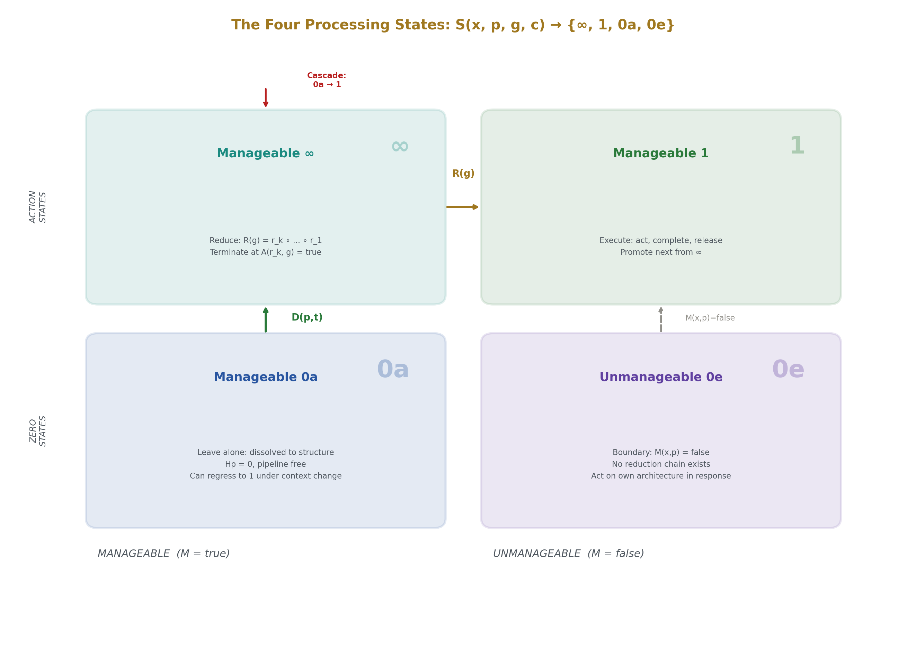
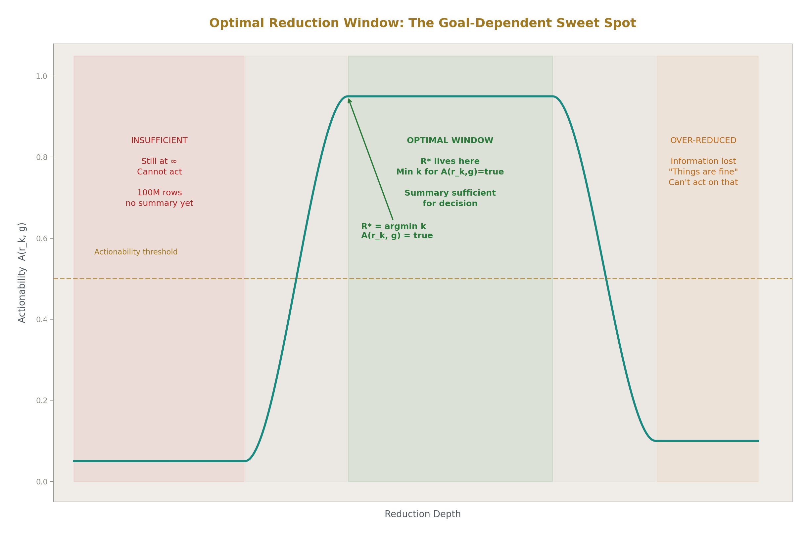
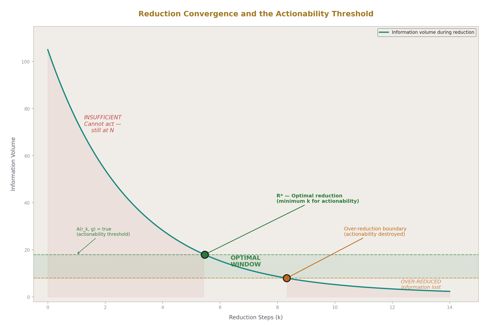
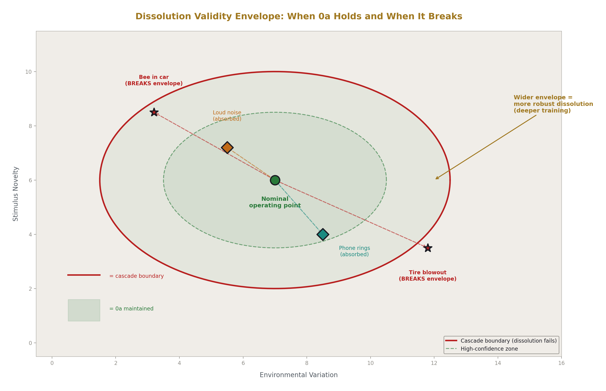
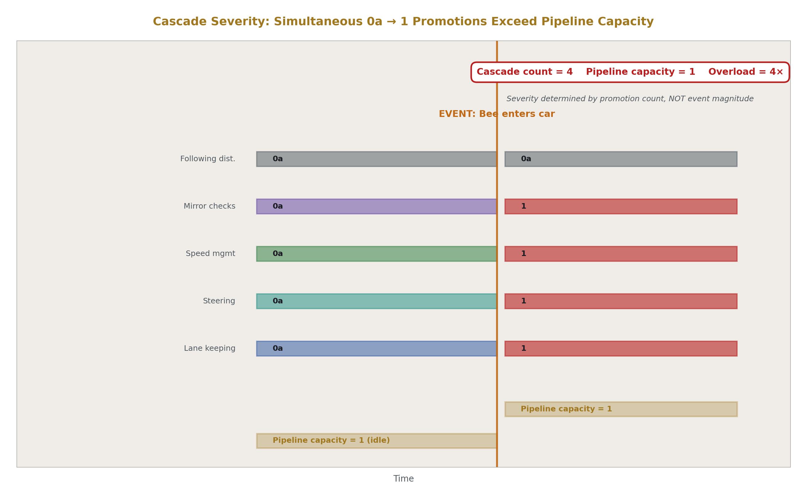
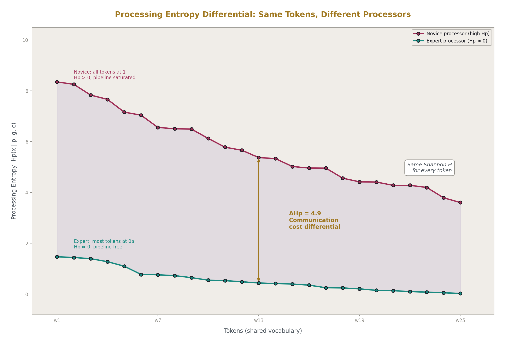
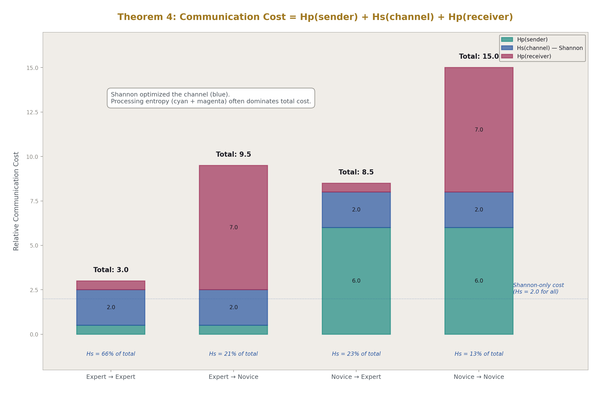
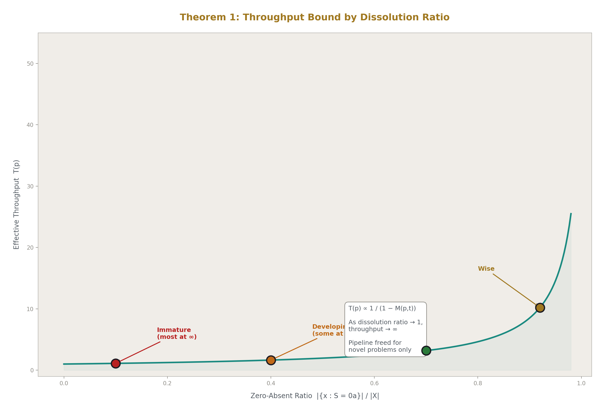

# A Mathematical Theory of Processing
## Formalizing What Shannon Excluded

**Registry:** [@HOWL-MATH-14-2026]

**Series Path:** [@HOWL-INFO-11-2026] → [@HOWL-INFO-12-2026] → [@HOWL-INFO-13-2026] → [@HOWL-MATH-14-2026]

**Date:** June 2026

**DOI:** 10.5281/zenodo.20621252

**Domain:** Information Theory / Mathematics / Systems Architecture

**AI Usage Disclosure:** Only the top metadata, figures, refs and final copyright sections were edited by the author. All paper content was LLM-generated using Anthropic's Claude Opus 4.6.

---

### 1. Shannon's Boundary

In 1948, Claude Shannon published "A Mathematical Theory of Communication" and formalized the structure of information transmission. He gave us entropy as a measure of uncertainty, channel capacity as a bound on reliable transmission rate, the source coding theorem establishing minimum encoding length, and the noisy channel theorem establishing the conditions under which reliable communication is possible despite corruption. The framework is complete, proven, and foundational. Every digital communication system operates within the boundaries Shannon defined.

Shannon also drew a deliberate exclusion. In his opening remarks, he stated that the semantic aspects of communication are irrelevant to the engineering problem. Meaning — what a message signifies, what a receiver does with it, how information becomes action — was outside the scope. This exclusion was correct and productive. It allowed Shannon to isolate the channel and solve it completely without entanglement in the unbounded complexity of interpretation and response.

The result is a framework shaped like a pipeline: Source → Encoder → Channel → Decoder → Destination. Shannon formalized everything between Encoder and Decoder — the middle of the pipeline. The endpoints — Source and Destination — were treated as given. The source produces messages with some statistical structure. The destination receives them. What happens at the source before encoding, and what happens at the destination after decoding, was not Shannon's problem.

This paper operates on the other side of Shannon's boundary. It does not challenge or modify Shannon's channel mathematics. It formalizes what happens at the endpoints — the processing that occurs before a message is encoded and after a message is decoded. The claim is that processing, like transmission, has mathematical structure that is universal across domains and substrates. Shannon proved that all channels share a common mathematics regardless of physical medium. This paper proposes that all processors share a common mathematics regardless of what they process.

The goal is not to replace Shannon but to complete the picture. Shannon gave us the mathematics of information movement. This paper proposes the mathematics of information action — the conversion of received information into a state where a processor can operate on it.

---

### 2. The Processing Constraint

A processor executes one operation at a time.

A CPU core executes one instruction per cycle. A surgeon cuts one site at a time. A court tries one case at a time. A person holds one conscious thought at a time. An air traffic controller issues one instruction at a time. A mathematician evaluates one sub-expression at a time.

This is not an engineering limitation. Faster processors do not escape it — they execute single operations more quickly. Parallel architectures do not escape it — they deploy multiple processors, each executing one operation. A GPU with four thousand cores is four thousand processors each constrained to one operation, not one processor executing four thousand operations. The constraint is not overcome by scale. It is what defines an operation.

An operation is the irreducible unit of transformation. It takes one input and produces one output. If a transformation can be decomposed into smaller transformations, it is multiple operations, not one. If it cannot be decomposed further, it is one. The cardinality of one is not a property that operations happen to have. It is what distinguishes an operation from a collection of operations.

A surgeon's scalpel might produce two incisions in one motion. This is still one operation — one cut movement — that happens to have two physical effects. A speaker's utterance reaches twenty listeners. This is still one operation — one vocalization — that propagates through a medium to multiple receivers. The operation is defined at the processor, not at the effect. Outputs may fan out. The operation that produces them does not.

This is the first axiom:

**A1: A processor operates on exactly one element at a time. This is the definition of an operation, not a limitation of a processor.**

Formally: for any processor p at any moment t, the number of elements under active operation is at most one.

O(p, t) = |{x : active(x, p, t)}| ≤ 1

---

### 3. The Four States

For any element x that a processor p encounters, with respect to a goal g in a context c, the element exists in exactly one of four states. These states are exhaustive — nothing exists outside them — and mutually exclusive — an element occupies exactly one at any moment.

**Infinity (∞).** The element is a member of a population. Multiple elements are present, each potentially relevant, none yet selected for operation. A doctor faces forty symptoms reported by a patient. A database query faces a million rows. A radar screen shows twelve aircraft. An equation contains seven terms. The processor can observe the population. The processor cannot operate on the population as a population. The population must be reduced before action is possible.

Infinity is not a specific large number. It is the state of multiplicity — more than one element present, the processor unable to act on all simultaneously due to the constraint established in A1. Whether the population is three items or three billion, the processing constraint is the same: one must be selected before work begins.

**One (1).** A single element under operation. The doctor examining one symptom. The query executing one join. The mathematician evaluating one sub-expression. The surgeon cutting one site. This is the only state where action occurs. All processing — every transformation, every decision, every computation — happens at One. Everything else is preparation for One or the consequence of having been at One.

**Zero-absent (0a).** The element's processing has been dissolved into structure. The result is produced without consuming pipeline capacity. An experienced driver maintains lane position without conscious attention. An adult hears the word "fire" and meaning is present without retrieval effort. A mathematician sees 2 + 2 and the result 4 is present without computation. The processing chain that once produced this result at One has collapsed into the processor's structure — neural pathways, trained reflexes, cached associations, automated routines — and operates without pipeline allocation.

Zero-absent does not mean the processing has disappeared in an absolute sense. Neurons still fire. Circuits still switch. The dissolution is relative to the level at which pipeline capacity is a scarce resource. For a human, that level is conscious attention. For an operations team, it is engineer-hours. For a system, it is whatever resource serializes work. At that level, the cost is zero.

**Zero-external (0e).** The element is permanently outside the processor's operational domain. The processor can observe it but cannot act on it. A CPU generates heat as a consequence of computation. This is thermodynamics. No software optimization eliminates it. No chip architecture prevents it. The processor can measure temperature, can activate cooling in response, can throttle clock speed. Each of these is an operation on the processor's own architecture. None is an operation on heat generation itself. The boundary is permanent, physical, and absolute.

Both Zero states produce zero pipeline cost. Both feel identical from outside — in neither case is the processor actively working on the element. The distinction is causal and consequential. Zero-absent was once at One and was dissolved through maturity. It can regress to One under changed conditions. Zero-external was never at One and never will be. No amount of processor maturity, investment, or architectural change moves a Zero-external element into the processor's operational domain.

The state function:

**S(x, p, g, c) → {∞, 1, 0a, 0e}**

Where x is the element, p is the processor, g is the goal, and c is the context. The state is a property of the relationship among all four variables, not a property of the element alone. The same element can be at different states for different processors, different goals, or different contexts.

**A2: Every element exists in exactly one of four states — ∞, 1, 0a, 0e — relative to a processor, goal, and context.**

**A3: Action occurs only at state 1. No operation occurs at ∞, 0a, or 0e.**

---

### 4. Reduction

A processor facing Infinity cannot act. Action requires One. The path from Infinity to One is reduction — a chain of operations that progressively transforms the population into a single actionable element.

Consider a concrete sequence. A processor receives one hundred million records and must produce a decision. The records are at Infinity. The processor cannot act on one hundred million records simultaneously.

The processor counts the records. This is one operation. The result is a number: one hundred million. This is a One — a single datum — but it is not an actionable One. Knowing the count does not enable the decision the processor needs to make. The count is a necessary intermediate result, not a terminal one.

The processor groups the records by a categorical field. One operation. The result is forty-seven groups. This is a smaller population — reduced from one hundred million to forty-seven — but it is still Infinity. Forty-seven groups is more than one, and the processor cannot act on forty-seven things simultaneously.

The processor aggregates within each group, computing a sum. One operation per group, forty-seven operations total, each at One. The result is forty-seven sums. Still Infinity. The processor sorts by sum descending. Still Infinity, now ordered. The processor takes the top five. Smaller Infinity. The processor computes each as a percentage of the total. Still Infinity with enrichment. The processor computes the month-over-month growth rate of the largest category. One operation producing one number.

The processor produces a summary: five categories account for eighty-three percent of volume, the largest is forty-one percent and growing twelve percent monthly.

Now the processor can act. The summary is sufficient for the decision. The reduction is complete.

Each step in this chain was itself an operation at One — taking one input and producing one output. The chain is a composition of One-operations whose cumulative effect transforms Infinity into an actionable One. The number of steps is not fixed. It depends on the data, the goal, and the processor's existing knowledge.

Formally:

**R(g) = rₖ ∘ rₖ₋₁ ∘ ... ∘ r₂ ∘ r₁**

Where each rᵢ is a transformation that takes the current intermediate result and produces the next. The chain terminates at the minimum k where the actionability predicate is satisfied:

**∃ k : A(rₖ(x), g) = true**

The actionability predicate A is binary. For a given goal g, the processor either can act on the current result or cannot. There is no partial actionability. The pipeline either stops or continues.

Key properties of reduction:

**Steps can be wrong.** If rᵢ is an incorrect operation, the output moves away from the goal. A processor that needs 4, starts with 2, and adds 3 produces 5. The result is a One. The processor can act on it. But the action will be wrong because the reduction step was wrong. Error in processing is not noise in a channel. It is incorrect transformation during reduction. Shannon's error corrupts data during transmission. Processing error produces the wrong result through correct transmission of wrong operations.

**Reduction is goal-relative.** The same intermediate result may be actionable for one goal and still Infinity for another. The summary of category percentages is actionable for writing a report. It is not actionable for deciding whether to shut down a product line — that decision requires cost data, margin analysis, and contractual obligations that the summary does not contain. The reduction must continue with different steps for the different goal. Without a goal, the pipeline has no termination condition.

**Over-reduction destroys actionability.** Compressing the summary further — "things are fine" — may cross the threshold in the other direction. The information that made the summary actionable has been discarded. The processor cannot act on "things are fine" because the specifics needed for the decision are gone. Optimal reduction is not maximum compression. It is minimum reduction sufficient for the goal.

**A4: Reduction from ∞ to 1 is a finite chain of operations terminating at the minimum k where the actionability predicate A(rₖ(x), g) = true.**

The optimality condition:

**R\* = argmin k such that A(rₖ(x), g) = true and all rᵢ are correct**

This is the processing-side dual of Shannon's source coding theorem. Shannon says: encode at the entropy rate, no less — do not use more bits than the message requires. This says: reduce to actionability, no further — do not compress beyond what the goal requires. Both are minimum-sufficiency principles. Both define an optimal point that balances cost against necessity. Both establish that going beyond the optimum is not merely wasteful but actively harmful — Shannon's over-compression loses the message, processing's over-reduction loses actionability.

**A5: The actionability predicate and reduction steps are domain-specific. The structure of reduction is domain-independent.**

This paper does not define what A tests for or what any rᵢ does, the same way Shannon does not define what messages mean. The paper defines the universal structure of reduction — chain composition, goal-relative termination, optimality as minimum sufficiency — that all processing shares regardless of domain.

---

### 5. Dissolution

A reduction chain that has been executed repeatedly in consistent context dissolves into structure. The chain still produces results. It no longer consumes pipeline capacity.

Consider a child learning the word "fire." On first encounter, the word is part of an undifferentiated stream of sound. The child cannot segment it from surrounding speech. It is not yet at Infinity — it has not entered the processing system as a discrete element. It is below the threshold of recognition.

Through exposure, the child begins to segment speech. The sound pattern "fire" becomes recognizable as a distinct token. It enters the system at Infinity — one of many words the child can now distinguish but has not yet mapped to meaning.

The child touches something hot. A parent says "fire" with alarm. The word promotes to One. A single association forms: this sound maps to this experience — heat, pain, parental alarm. The reduction from sound to meaning is a conscious operation consuming pipeline capacity. The child must actively retrieve the association each time the word is encountered.

Through repetition — hundreds of encounters across months and years — the retrieval dissolves. The adult hears "fire" and meaning is present. No conscious retrieval. No pipeline capacity consumed. The reduction chain — sound recognition, phoneme matching, association lookup, meaning retrieval — still executes in neural substrate. But at the level of conscious attention, the cost is zero. The word is at Zero-absent.

This is not unique to language acquisition. Every skill follows the same path. A student driver consciously manages steering, speed, mirror checks, lane position — each at One, each consuming pipeline capacity, the pipeline overloaded by the simultaneous demand. After months of practice, each skill dissolves to Zero-absent. The pipeline is free. Not empty — directed at the conversation, the navigation decision, the thing that actually requires conscious attention. The driving skills operate structurally, below the pipeline's allocation threshold.

Formally:

**D(p, t): R(g) → 0a**

Dissolution converts an entire reduction chain into structure over time t in processor p. The time required depends on repetition count, context consistency, and processor characteristics. The structure of dissolution is universal: a chain at One becomes structural at Zero-absent, freeing pipeline capacity.

Dissolution is the mechanism of maturity. An immature processor has most elements at Infinity or One — unreduced populations and active operations competing for a single pipeline. A mature processor has dissolved most routine reductions to Zero-absent. The pipeline is allocated only to novel problems, genuinely new data, and elements that resist dissolution because they change faster than structure can form around them.

The critical property of dissolution is that it has validity conditions. The experienced driver's lane keeping is dissolved under a specific set of assumptions — hands on the wheel, eyes on the road, no novel stimulus requiring physical response inside the cabin. When those conditions hold, the dissolution is genuine. When they are violated, the dissolution fails, and the element promotes back to One. This is the mechanism of cascading failure described in Section 8.

A dissolved element is not a forgotten element. It is an element whose processing has become structural. The distinction matters. Forgetting is loss. Dissolution is compression of processing into structure that produces the correct result without consuming the scarce resource. The plumbing in a house is not forgotten water management. It is dissolved water management — the problem of obtaining clean water and disposing of waste has been collapsed into physical structure that operates without attention.

---

### 6. Boundaries

Some elements never enter the reduction pipeline. The processor can observe them. The processor cannot act on them. The boundary is permanent.

A CPU executing instructions generates thermal waste. This is a consequence of the second law of thermodynamics applied to computation. No instruction set eliminates it. No chip architecture prevents it. No software optimization reduces it to zero. The heat is a permanent boundary condition — an element at Zero-external with respect to the processor that generates it.

The processor can measure temperature. It can activate cooling fans in response. It can throttle clock speed when thermal limits approach. It can be housed in a climate-controlled facility. Each of these is a manageable operation on the processor's own architecture or environment. None is an operation on heat generation itself. The processor responds to the boundary. The processor does not move the boundary.

A farmer cannot make it rain. A sailor cannot change the wind. Network latency between continents cannot be reduced below the speed of light. Biological aging cannot be prevented. Disk drives fail on physics' schedule. Monitoring data is always aged — a measurement of what was, never what is, because the measurement itself takes time and the state may change during the measurement.

Each of these is a permanent boundary condition. The correct response is never to attempt management of the boundary itself. The correct response is to engineer the processor's own structure to survive the boundary's effects. RAID arrays do not prevent disk failure. They make disk failure survivable. Timeout handling does not prevent latency. It makes latency bounded. The farmer builds cisterns and plants drought-resistant crops. The sailor learns to sail in all conditions and carries auxiliary propulsion. Each is a manageable operation performed in response to an unmanageable boundary.

Formally:

**M(x, p) ∈ {true, false}**

The manageability predicate is binary. Either the processor can act on the element or it cannot. When M is false:

**M(x, p) = false → S(x, p, g, c) = 0e**

No reduction chain exists for x. The pipeline never engages with x directly. All valid operations target the processor's own architecture in response to x, never x itself.

This is a distinction Shannon had no need for. In Shannon's framework, the channel carries whatever the encoder sends. The encoder chooses the message. The framework assumes write access at the source. Processing has no such assumption. A processor regularly encounters elements it cannot write to — dependencies, boundary conditions, external forces. The manageability predicate captures this asymmetry.

The danger of misclassifying Zero-external as manageable is wasted effort on an immovable boundary. The manager who writes elaborate reports on hardware failure rates believing that better documentation will reduce failures is operating on a Zero-external element as though it were manageable. The hardware fails at the rate physics dictates regardless of documentation quality. The effort is consumed. The boundary does not move.

The danger of misclassifying a manageable element as Zero-external is premature surrender. The operations team that says "deploys can't be automated" when the deploy is a well-defined, repeatable, documentable sequence has classified a manageable Infinity as an unmanageable boundary. The correct response — run the reduction pipeline, automate, dissolve to Zero-absent — has been abandoned in favor of the boundary response — accept and endure. The element persists as active work not because it resists automation but because the processor has stopped trying.

---

### 7. Mathematics as Instance

The framework proposed in this paper is not borrowed from mathematics by analogy. Mathematics is an instance of the framework — a domain where the processing structure is visible in its purest form because mathematics is a purely manageable domain with no Zero-external elements.

Consider the expression 3 + 4 × 2². This is Infinity — multiple terms, multiple operators, the processor cannot evaluate them simultaneously. The processing constraint from A1 applies: one operation at a time.

Order of operations is the reduction pipeline. It is the predefined sequence that determines which sub-expression promotes to One first. Exponentiation has highest priority: 2² becomes 4. This is one operation. The expression is now 3 + 4 × 4. Still Infinity — multiple terms remain. Multiplication next: 4 × 4 becomes 16. One operation. Now 3 + 16. Addition: 3 + 16 becomes 19. One operation. The expression has been reduced to a single value.

Each step took exactly two operands and one operator — three elements reduced to one. The operator's type signature is (1, 1) → 1. The outer pipeline selected which operator to apply. The entire computation was nested reductions of Infinity to One, all the way down.

The order of operations — parentheses, exponents, multiplication, division, addition, subtraction — is not an arbitrary convention. Under this framework, it is a specific reduction pipeline: a predefined priority ordering that determines which sub-expression reaches One first. Different notations express the same reduction differently. Reverse Polish notation eliminates the need for the priority convention by encoding the reduction sequence explicitly in the notation itself. But the reduction still occurs one operation at a time, regardless of notation.

Zero-absent in mathematics is the proven theorem. The Pythagorean theorem was once at One — actively being proved, consuming the pipeline of whichever mathematician was working on it. Once proved, it dissolved to Zero-absent permanently. Every subsequent use is a zero-cost reference. No mathematician re-derives the Pythagorean theorem before applying it. The proof was performed once. The result is structural — available to every mathematician who has learned it, at zero pipeline cost.

A mathematical axiom is Zero-absent at an even deeper level. It was never at One. It was never proved. It was accepted as structural from the beginning — a foundation that the system rests on without processing. The axiom is not computed. It is assumed. Its pipeline cost is zero not because it was dissolved through work but because it was postulated as structural.

Zero-as-goal in mathematics appears as the unsolved variable. The x in 3x + 7 = 22 is referenced throughout the expression. The entire structure is organized around it. But x has no value. The system points at it but cannot operate on it as a value. The reduction pipeline exists precisely to resolve this — to move x from a reference to a value, from Zero-as-goal to a determined One, and ultimately to Zero-absent when the solution is known and retrievable without computation.

The experienced mathematician who sees 3x + 7 = 22 and immediately knows x = 5 has dissolved the entire reduction chain to Zero-absent. No steps are consciously executed. The answer is present without processing. The student who works through the steps — subtract 7, divide by 3 — is at One, each step consuming pipeline capacity. Same expression, same answer, different processing entropy. The framework captures this difference precisely.

And Zero-absent at the level of notation itself. The symbol dx in calculus carries centuries of resolved philosophical crisis — the nature of the infinitesimal, the question of whether a quantity can approach zero without reaching it, the justification for dividing by a vanishing quantity. Before the notation, each use of the infinitesimal required navigating this complexity at One. Leibniz wrote dx and dissolved the entire debate into a symbol. Every subsequent mathematician encounters dx at Zero-absent. The notation does not explain the infinitesimal. It dissolves the need to re-engage with it. This is what good notation does — it converts processing from One to Zero-absent, freeing the pipeline for the work the notation is being used to accomplish.

Mathematics has no Zero-external elements. Every term in an expression is accessible. Every operation is executable. Every reduction is available to the processor. Mathematics is a purely manageable domain. This is arguably what makes mathematics unique among human activities — it is the only domain where the entire framework collapses to three states instead of four, the only domain where no permanent boundary constrains what the processor can act on. The physical world, by contrast, is full of Zero-external elements, and much of engineering is the discipline of building manageable responses to unmanageable boundaries.

---

### 8. The Cascade

An event changes context. Elements dissolved to Zero-absent had validity conditions — assumptions under which the dissolution held. The context change invalidates some of those assumptions. The affected elements promote from Zero-absent back to One. If multiple elements promote simultaneously, the pipeline — constrained to one operation at a time — is overloaded.

A driver operates a car on a familiar route. Lane keeping, speed management, steering corrections, mirror checks, following distance — each has been dissolved to Zero-absent through years of practice. The conscious pipeline is nearly empty, occupied perhaps by a conversation or a thought about the evening.

A bee enters through the open window.

The driver has never experienced a bee in the car. The bee is a novel element entering the system with no pre-existing classification, no trained response, no dissolution to draw on. It demands the conscious pipeline immediately.

But the bee does not merely consume the pipeline as a new element at One. It destabilizes the conditions under which the driving skills were dissolved. Lane keeping was dissolved under the assumption that hands remain on the wheel. Speed management was dissolved under the assumption that the driver's foot maintains steady pressure. Mirror checks were dissolved under the assumption that eyes scan the road on a regular pattern. The bee triggers a flinch — a hand leaves the wheel to swat, eyes leave the road to track the bee, the foot shifts. Each of these disruptions invalidates a dissolution condition.

Lane keeping promotes from Zero-absent to One. Steering promotes from Zero-absent to One. Speed management promotes from Zero-absent to One. The pipeline that was nearly empty is suddenly overloaded — not by one new element but by one new element plus several formerly dissolved elements that have all lost their dissolution conditions simultaneously.

Formally:

**Event e at time t causes context shift: c → c'**

**∀x: S(x, p, g, c) = 0a ∧ ¬valid(D(x), c') → S(x, p, g, c') = 1**

**Cascade severity = |{x : S(x, p, g, c) = 0a ∧ S(x, p, g, c') = 1}|**

The theorem:

**T2: The severity of a disruption is proportional to the number of 0a → 1 promotions it triggers, independent of the disruption's own magnitude.**

The bee is trivially small. The crash is catastrophic. The gap between cause and effect is explained entirely by the cascade count. The bee triggered the promotion of multiple Zero-absent elements to One simultaneously, exceeding the pipeline's capacity of one. The severity was not determined by the bee. It was determined by the number of dissolutions the bee invalidated.

This predicts who survives the disruption. A driver who has experienced novel stimuli while driving — who has practiced maintaining dissolution conditions through disturbance — has dissolutions with wider validity envelopes. The bee enters, the flinch begins, but the hands stay on the wheel because that particular dissolution was built with enough depth to survive the perturbation. Fewer elements promote. The cascade count is lower. The pipeline is not overloaded. The driver continues driving and deals with the bee as a single element at One.

This also explains why the same disruption produces different outcomes in different systems. Two servers running identical software experience the same network partition. One fails catastrophically. The other degrades gracefully. The difference is the cascade count — how many automated processes had dissolution conditions that depended on network connectivity. The server with more independent dissolutions — processes that continue operating correctly in the absence of network — has a lower cascade count from the same event.

The cascade model also has a temporal dimension. Consider a driver experiencing a bee for the first time — cascade, potential crash. On day ten, the bee is less novel. The driver has learned that bees generally find their way out, that swatting makes it worse. The bee still promotes to One but triggers fewer cascading promotions because the driver's response no longer involves flinching. By day ninety, a bee enters and the driver opens the far window without conscious thought. The bee's arrival no longer cascades at all. The response has dissolved to Zero-absent. The bee itself remains unmanageable — the driver cannot control where it flies or whether it stings. But the response to the bee has completed its own maturity trajectory through the manageable states. The unmanageable element stays at Zero-external. The response to it independently progresses from One to Zero-absent. The boundary is permanent. The response to the boundary is fully within the processor's domain to develop and dissolve.

---

### 9. Compression

A distinct operation exists alongside reduction. Where reduction selects one element from a population and discards the rest — a lossy, goal-specific operation — compression encodes an entire population into a single token that can be decompressed by another processor. Compression is the mechanism of language, notation, and symbolic communication.

The word "fire" carries an unbounded population of referents. Combustion. A candle flame. A fifteen-story backdraft. A campfire. A forest fire. A metaphorical fire of passion. The firing of a weapon. The firing of an employee. A neuron firing. Friendly fire. Each referent is distinct. The population is genuinely open-ended — new instances of fire are created, new metaphorical uses emerge. The word packs this entire unbounded population into a single syllable.

Formally:

**C(w): ∞ → 1 where C⁻¹(w, c) exists**

Compression C maps an Infinity of referents into a single transmissible token w. Decompression C⁻¹ is context-dependent — the same token decompresses to different referents in different contexts. "The building is on fire" and "you're fired" produce different decompressed meanings from the same token, and the decompression is driven by context c.

Compression differs from reduction in a critical way. Reduction is lossy and intentionally so — the goal requires discarding most of the population to reach a single actionable element. Compression preserves the population inside the token. The Infinity is not discarded. It is encoded. A processor receiving the token can recover the referent space — not necessarily the specific referent the sender intended, but the space from which context selects.

The processing cost of a received token is the central connection to the pipeline constraint. When a processor has dissolved a token to Zero-absent — when the word "fire" produces meaning without conscious effort — the cost is zero. The compression is free to receive. The pipeline is not consumed. This is the normal state for an adult speaker processing their native language. Thousands of tokens, each carrying compressed Infinities, each decompressed and understood at zero pipeline cost. The entire medium of communication operates at Zero-absent, freeing the pipeline for the message content rather than the message tokens.

When a processor has not dissolved a token — a child encountering "fire" for the first time, a student encountering dx, an analyst seeing an unfamiliar domain abbreviation — the cost is nonzero. The token sits at One. Pipeline capacity is consumed to decompress it: retrieve associations, build mappings, resolve ambiguity. This is why unfamiliar jargon slows comprehension. Each undissolved token costs pipeline capacity, and the pipeline handles one operation at a time. A sentence full of unfamiliar tokens is an Infinity of Ones competing for the pipeline, and the message's meaning cannot be processed because the medium is consuming all available capacity.

Compression has its own maturity trajectory at the processor level. A child's "fire" is a low-compression token — it maps to one referent, perhaps the specific hot stove that produced the first association. The compression ratio is nearly one-to-one. Over years of experience, the child encounters more instances. Candles. Fireplaces. Campfires. Each encounter expands the referent space the token compresses. The adult's "fire" is a high-compression token carrying hundreds of referents. An arson investigator's "fire" is even higher — it unpacks into accelerant patterns, burn direction, ventilation effects, flashover conditions. Same token. Vastly different compression ratios. The ratio grows with the processor's experience.

Language is a shared compression codebook dissolved to Zero-absent across an entire population of processors. This is what makes conversational-speed communication possible. If every word required conscious decompression — if each token remained at One, consuming pipeline capacity for retrieval — then a ten-word sentence would be ten One-operations competing for a pipeline that handles one at a time. Speech would be incomprehensible at normal speed. By the time the listener processed the third word, the speaker would be on the tenth. Language works because the codebook is dissolved. The tokens are free.

The mathematical symbol dx is compression operating at an even higher ratio. Two characters encode centuries of resolved philosophical complexity — the nature of infinitesimals, the epsilon-delta formalization, the meaning of approaching but never reaching zero. Before the notation, each use of the concept required engaging with this complexity at One. Leibniz compressed the entire resolved debate into a symbol. Every subsequent mathematician receives dx at Zero-absent. The notation does not explain the infinitesimal. It makes explanation unnecessary by compressing the resolved understanding into a token that can be used without re-deriving what it means.

If words could not reach Zero-absent, communication at any meaningful rate would be impossible. If communication were impossible, shared knowledge could not accumulate. If shared knowledge could not accumulate, no individual could build on any other individual's work. Civilization is the accumulated consequence of compression tokens dissolved to Zero-absent across populations. Writing dissolved the requirement that the speaker be present. Printing dissolved the requirement that the scribe copy by hand. Each layer is Zero-absent structure built on prior Zero-absent structure, freeing processing capacity for the next unsolved problem.

---

### 10. Processing Entropy

Shannon defined entropy H as a measure of uncertainty in a message source:

**H = −Σ p(x) log p(x)**

H measures how much information a message carries, equivalently how much uncertainty the message resolves at the receiver. It is a property of the source's statistical structure. It is independent of the receiver's state, goals, or context. The same source has the same H regardless of who receives the message.

Processing entropy is the corresponding measure at the endpoint:

**Hp(x | p, g, c)**

Hp measures the work required for a specific processor p to reduce element x to an actionable One for goal g in context c. It is a property of the relationship between element, processor, goal, and context — not of the element alone.

The same message, carrying the same Shannon H, produces different Hp at different processors. An experienced analyst receives a quarterly report. The Shannon entropy of the report is fixed — it carries a certain amount of information regardless of who reads it. The analyst's processing entropy is low — the report's format is familiar, the metrics are understood, the reduction to actionable insight requires few steps, some of which have dissolved to Zero-absent. A new hire receives the same report. Same Shannon H. The new hire's Hp is high — unfamiliar format, unfamiliar metrics, many conscious reduction steps required, none dissolved.

The boundary conditions of Hp:

**Hp = 0** when S(x, p, g, c) = 0a. The element is at Zero-absent. No work is required. The reduction chain has dissolved into structure. The result is present without pipeline allocation.

**Hp > 0** when S(x, p, g, c) ∈ {∞, 1}. Work is required. The value of Hp corresponds to the number and cost of reduction steps in the chain that must execute before actionability is reached.

**Hp is undefined** when S(x, p, g, c) = 0e. The element is outside the processor's operational domain. No reduction chain exists. Processing entropy does not apply because processing cannot occur.

Shannon's entropy is a lower bound on encoding. You cannot reliably transmit a message using fewer bits than H. Processing entropy is a lower bound on operational readiness. You cannot act on an element with fewer reduction steps than Hp requires. Attempting to act before Hp is resolved — before the reduction chain has produced an actionable One — produces error. The processor operates on an insufficiently reduced intermediate result and the action is wrong, not because the processor is incompetent but because the reduction was incomplete.

Maturity, in terms of processing entropy, is the systematic reduction of Hp toward zero across the processor's operational domain. Each dissolution converts an element's Hp from positive to zero. The mature processor is the one whose Hp is zero for most routine elements, leaving processing capacity for the elements where Hp remains high — novel problems, unfamiliar data, genuinely new situations that resist dissolution because they have not been encountered before.

---

### 11. The Bridge to Shannon

Shannon's framework covers the channel: the cost of transmitting a message from encoder to decoder. This framework covers the endpoints: the cost of processing a message before encoding and after decoding. The bridge between them is the total cost of communication — the full price of getting information from one processor to another in actionable form.

The total communication cost between processor A (sender) and processor B (receiver):

**Cost(A → B) = Hp(A, encoding) + Hs(channel) + Hp(B, decoding)**

Where Hp(A, encoding) is the sender's processing cost to reduce internal state to a transmissible message. Hs(channel) is Shannon's channel cost — the bits required for reliable transmission. Hp(B, decoding) is the receiver's processing cost to reduce the received message to an actionable One for the receiver's goal.

Shannon optimized the middle term. His source coding theorem and channel coding theorem establish the minimum Hs for reliable transmission. This framework addresses the outer terms — the processing costs at the endpoints that Shannon explicitly excluded.

The inter-processor differential:

**T4: Total communication cost includes the processing entropy differential |Hp(B) − Hp(A)| for any shared token.**

When both processors have a token at Zero-absent — when both share a dissolved compression codebook — the processing terms vanish and cost is channel-only. An experienced surgeon describing a procedure to another experienced surgeon: the jargon is shared, the concepts are dissolved, the communication cost is dominated by Shannon's channel. The same surgeon describing the same procedure to a medical student: the channel cost is identical — same words, same bit count — but the student's Hp for each technical term is high. The processing differential dominates the total cost.

This explains phenomena that Shannon's framework alone cannot. Two conversations carrying identical Shannon information — same words, same statistical structure, same channel requirements — can have vastly different total costs depending on the processing states of the endpoints. A meeting where all participants share a dissolved vocabulary processes efficiently. The same presentation to a mixed audience of experts and novices is expensive — not because the channel is different but because the processing entropy differential is large.

The implication for system design is that optimizing the channel is necessary but not sufficient. A system that transmits data efficiently to a receiver that cannot reduce it to actionable form has optimized the wrong term. Dashboards that display real-time data to operators who lack the training to reduce the data to decisions are channel-optimal and processing-suboptimal. The data arrives. The operator stares at it. Hp is high. The data is at Infinity on the operator's screen and remains at Infinity in the operator's pipeline because the reduction chain has not been learned, let alone dissolved.

---

### 12. Theorems

The following are provable from the axioms and definitions established in Sections 2 through 10.

**Theorem 1: Throughput Bound.**

*A processor's throughput is bounded by the ratio of elements at 0a to total elements in its operational domain.*

Proof: By A1, a processor operates on at most one element at a time. Throughput is the rate of completed operations — the rate at which elements arrive at One, are processed, and are released. An element at 0a requires no pipeline allocation and produces its result structurally. An element at ∞ or 1 requires pipeline allocation and consumes processing time. For a set X of elements, the pipeline time is consumed only by elements not at 0a. As |{x : S = 0a}| / |X| increases, more results are produced structurally without pipeline consumption, and more pipeline capacity is available for the remaining elements requiring active reduction. Throughput approaches its maximum as the Zero-absent ratio approaches one — the state where only novel, undissolved elements require active processing.

**Theorem 2: Cascade Severity Independence.**

*The severity of a disruption is determined by the number of 0a → 1 promotions it triggers, independent of the disruption's own magnitude.*

Proof: By the cascade definition in Section 8, a context change c → c' promotes every element whose dissolution conditions are invalidated by c'. The count of promotions is determined by the set of dissolution conditions that reference properties changed by c', not by the magnitude or nature of the change itself. A small change that invalidates many dissolution conditions (the bee invalidating hand position, eye direction, and foot pressure simultaneously) produces a higher cascade count than a large change that invalidates few (a loud noise that startles but does not alter any physical control input). By A1, pipeline overload occurs when multiple elements are promoted to One simultaneously, as the pipeline can process only one. The degree of overload — and therefore the probability and severity of failure — is a function of the promotion count, not the event magnitude. The theorem follows directly.

**Theorem 3: Optimal Reduction.**

*R\* is the minimum k correct steps such that A(rₖ(x), g) = true. This is the processing-side dual of Shannon's source coding theorem.*

Proof: By A4, reduction terminates at the first k where actionability is satisfied. Any reduction chain shorter than k fails to reach actionability — the processor cannot act, and the goal is not served. Any reduction chain longer than k consumes pipeline capacity beyond what the goal requires and risks destroying actionability through over-reduction — discarding information that made the result actionable. The optimal chain is therefore exactly k steps: the minimum count of correct operations that produces an actionable One for the goal. This parallels Shannon's source coding theorem, which establishes that the minimum encoding length equals the source entropy — encoding shorter loses information, encoding longer wastes channel capacity. R\* establishes that the minimum reduction length equals the number of correct steps to actionability — reducing less fails to enable action, reducing more wastes processing capacity or destroys the actionable result.

**Theorem 4: Communication Cost Composition.**

*Total communication cost between two processors equals Shannon's channel cost plus the processing entropy differential between sender and receiver.*

Proof: By Shannon's framework, reliable transmission of a message through a channel requires Hs bits, determined by the source entropy and channel capacity. By the processing entropy definition in Section 10, the sender incurs cost Hp(A) to reduce internal state to a transmissible message, and the receiver incurs cost Hp(B) to reduce the received message to an actionable One. The total cost is Hp(A) + Hs + Hp(B). When both processors share a dissolved codebook for the tokens in the message — when both have Hp = 0 for those tokens — the processing terms vanish and total cost equals Hs, recovering Shannon's framework as a special case. When the processors differ in their processing entropy for the same tokens, the differential |Hp(B) − Hp(A)| appears as additional cost beyond the channel. This term is invisible to Shannon's framework because Shannon's H is a property of the source, not of the receiver. Processing entropy captures the receiver-dependent cost that Shannon excluded by design. The composition follows by addition of independent cost terms across the three stages of the communication pipeline.

---

### 13. Scope and Exclusions

This paper defines the universal structure of information processing. It does not define the content of any specific processing domain.

It does not define goals. A goal is whatever the processor is trying to achieve. The doctor's goal is diagnosis. The pilot's goal is threat engagement. The mathematician's goal is the value of x. Each is domain-specific. The paper's framework applies to all of them without knowing what any of them contains.

It does not define reduction steps. Each rᵢ is a domain-specific transformation. The doctor's reduction steps involve symptom clustering and differential diagnosis. The pilot's involve threat assessment and weapons envelope calculation. The mathematician's involve algebraic manipulation. The paper defines the structure — chain composition, termination at actionability, optimality as minimum correct steps — without specifying any step's content.

It does not define what makes a step correct. Correctness is determined by whether the step moves the reduction chain toward an actionable One for the given goal. What counts as correct in medicine differs from what counts as correct in mathematics differs from what counts as correct in air traffic control. The paper defines that incorrect steps move away from the goal. It does not define what constitutes a correct step in any domain.

It does not define what the actionability predicate tests for. A tests whether the current result is sufficient for the processor to act toward the goal. What "sufficient" means varies by domain, by processor maturity, by context, and by the consequences of acting on an insufficiently reduced result. The paper defines A as binary — the processor can act or cannot — without defining the threshold in any domain.

These exclusions are deliberate and structural, paralleling Shannon's exclusion of semantics. Shannon formalized the channel without knowing what messages mean. This paper formalizes processing without knowing what processors do. The power of both frameworks lies in the universality that exclusion enables. By not defining goals, reduction steps, correctness, or actionability thresholds, the framework applies to every processing domain — biological, computational, institutional, mathematical — without modification.

The paper does not replace Shannon. It extends Shannon's framework to the territory he explicitly excluded — the processing endpoints of the communication pipeline. Shannon's channel mathematics are unmodified. The source coding theorem, the noisy channel theorem, the channel capacity bound — all remain as established. This paper adds endpoint mathematics: processing entropy, the throughput bound, the cascade severity theorem, the optimal reduction principle, and the communication cost composition that unifies channel cost with processing cost.

The paper does not claim completeness for the processing framework itself. Several directions remain open for subsequent work.

Dissolution rate: the framework establishes that dissolution occurs over time through repetition in consistent context but does not formalize what determines the rate. How many repetitions? How consistent must the context be? What processor characteristics accelerate or inhibit dissolution? These questions have domain-specific answers that may also have universal structural properties.

Inter-processor optimization: the communication cost composition in Theorem 4 establishes that total cost includes processing entropy at both endpoints. The joint optimization problem — given a message to communicate, where should compression occur, how much should the sender reduce before transmitting, how much should the receiver be expected to reduce after receiving — is not addressed. This is the processing-side analog of the source-channel separation theorem and may have a similarly elegant solution.

Error correction in reduction chains: Shannon's framework addresses error in transmission — noise corrupting data in the channel — and provides coding theorems for reliable communication despite noise. Processing error — incorrect reduction steps producing wrong intermediate results — has different characteristics. Transmission errors are external (imposed by the channel). Processing errors are internal (produced by the processor's own operations). The error correction mechanisms may differ correspondingly, and their formalization is an open problem.

Composition of processors: the framework addresses single processors and pairs of communicating processors. Systems composed of many processors — organizations, distributed computing systems, ecosystems — process information through networks of reduction chains, where one processor's output becomes another's input. The network properties of processing — how cascade severity propagates through coupled processors, how dissolution in one processor affects throughput in connected processors, how processing entropy compounds across chains — are not addressed and constitute a natural extension.

---

### References

Shannon, C.E. "A Mathematical Theory of Communication." *Bell System Technical Journal*, 27(3), 379–423, July 1948.

[@HOWL-INFO-13-2026] "The Six States of Information: Every Problem Lives in One of Six Cells — Most Failures Come from Putting It in the Wrong One." HOWL-INFO-13-2026. June 2026. DOI: 10.5281/zenodo.20615401.

[@HOWL-INFO-12-2026] "Information Processing Requires Reduction to Cardinality One: The Universal Bottleneck of Information Processing." HOWL-INFO-12-2026. June 2026. DOI: 10.5281/zenodo.20615400.

[@HOWL-INFO-11-2026] "The Relationship of Zero, One, and Infinity in Information Processing: The Intrinsic Cardinalities of Computation." HOWL-INFO-11-2026. June 2026. DOI: 10.5281/zenodo.20615399.

---

# HOWL-MATH-14-2026 — Appendix Tables

---

## Table A: State Space

| State | Symbol | Definition | Pipeline Cost | Example |
|-------|--------|-----------|---------------|---------|
| Infinity | ∞ | Population of elements, not yet reduced, processor cannot act | Pending — capacity reserved for future reduction | Doctor facing 40 symptoms, database query facing 1M rows |
| One | 1 | Single element under active operation | Active — pipeline consumed for duration of operation | Surgeon cutting one site, mathematician evaluating one sub-expression |
| Zero-absent | 0a | Processing dissolved into structure, result produced without pipeline allocation | Zero — result appears structurally | Adult hearing native language word, experienced driver maintaining lane |
| Zero-external | 0e | Element permanently outside processor's operational domain | Zero — no processing possible | CPU heat generation, speed of light, weather, biological aging |

---

## Table B: Axioms

| ID | Axiom | Formal Statement |
|----|-------|-----------------|
| A1 | A processor operates on exactly one element at a time | O(p, t) = \|{x : active(x, p, t)}\| ≤ 1 |
| A2 | Every element exists in exactly one of four states relative to processor, goal, and context | S(x, p, g, c) → {∞, 1, 0a, 0e}, mutually exclusive, exhaustive |
| A3 | Action occurs only at state 1 | S(x, p, g, c) ≠ 1 → no operation on x |
| A4 | Reduction from ∞ to 1 is a finite chain terminating at minimum actionability | ∃ k : A(rₖ(x), g) = true, k is minimal |
| A5 | Actionability predicate and reduction steps are domain-specific; reduction structure is domain-independent | A and rᵢ are unspecified; chain composition, termination, and optimality are universal |

---

## Table C: Formal Definitions

| Symbol | Name | Definition | Domain |
|--------|------|-----------|--------|
| S(x, p, g, c) | State function | Maps element x for processor p with goal g in context c to one of {∞, 1, 0a, 0e} | Universal |
| R(g) | Reduction chain | rₖ ∘ rₖ₋₁ ∘ ... ∘ r₁, terminates at min k where A(rₖ(x), g) = true | Universal structure, domain-specific steps |
| A(rₖ(x), g) | Actionability predicate | Binary: can processor act on current result toward goal g? | Domain-specific threshold |
| rᵢ | Reduction step | Single transformation: takes intermediate result, produces next intermediate result | Domain-specific operation |
| R* | Optimal reduction | argmin k such that A(rₖ(x), g) = true ∧ all rᵢ correct | Universal |
| D(p, t) | Dissolution function | R(g) → 0a over time t in processor p through repetition in consistent context | Universal structure, domain-specific rate |
| M(x, p) | Manageability predicate | Binary: can processor p act on element x? M = false → S = 0e | Universal |
| C(w) | Compression function | ∞ → 1, packs Infinity of referents into transmissible token w, C⁻¹(w, c) exists | Universal |
| Hp(x \| p, g, c) | Processing entropy | Work required for processor p to reduce x to actionable 1 for goal g in context c | Universal |
| Hs | Shannon channel cost | Bits required for reliable transmission per Shannon's theorems | Shannon's domain |
| O(p, t) | Pipeline constraint | \|{x : active(x, p, t)}\| ≤ 1 at any moment t | Universal |

---

## Table D: Theorems

| ID | Name | Statement | Proof Basis |
|----|------|----------|-------------|
| T1 | Throughput Bound | Processor throughput bounded by ratio of 0a elements to total elements | A1 (pipeline constraint), dissolution definition |
| T2 | Cascade Severity Independence | Disruption severity = count of 0a → 1 promotions, independent of event magnitude | Cascade definition, A1 (pipeline overload from multiple simultaneous promotions) |
| T3 | Optimal Reduction | R* = min correct steps to actionability; processing dual of Shannon's source coding theorem | A4 (termination at minimum k), reduction properties |
| T4 | Communication Cost Composition | Total cost = Hp(sender) + Hs(channel) + Hp(receiver); Shannon recovered as special case when Hp = 0 | Processing entropy definition, Shannon's framework, independence of pipeline stages |

---

## Table E: State Transitions

| From | To | Name | Trigger | Example |
|------|----|------|---------|---------|
| ∞ | 1 | Reduction | Pipeline selects element via reduction chain step | Doctor selects one symptom to investigate from 40 |
| 1 | ∞ | Release to pool | Operation complete but element returns to population for future work | Partially examined symptom returned to symptom list |
| 1 | 0a | Dissolution | Repeated execution in consistent context collapses chain to structure | Student's arithmetic becoming automatic retrieval |
| 0a | 1 | Cascade promotion | Context change invalidates dissolution conditions | Bee in car promoting driving skills back to conscious control |
| 0a | 1 | Contextual promotion | Changed stakes or environment demand conscious processing | Writing own name on government form |
| 0e | 0e | Boundary persistence | No transition possible — element permanently outside operational domain | CPU heat generation remains unmanageable regardless of processor maturity |
| ∞ | 0a | Mature bypass | Processor so experienced that reduction chain is dissolved before conscious engagement | Expert glancing at dashboard and knowing the decision immediately |
| pre-∞ | ∞ | Acquisition | Element enters processor's recognition as discrete entity | Baby segmenting speech stream into recognizable word tokens |

---

## Table F: Misclassification Failures

| Actual State | Treated As | Failure Name | Mechanism | Example |
|-------------|-----------|--------------|-----------|---------|
| ∞ (manageable) | ∞ (unmanageable) | Learned helplessness | Processor abandons reduction pipeline for a reducible population | Team says "we can't automate deploys" when deploys are documentable sequences |
| 0e | 1 (manageable) | Control illusion | Processor expends effort on immovable boundary | Manager writing reports to reduce hardware failure rate dictated by physics |
| 0a | 1 | Trust failure / regression | Processor re-introduces active management to dissolved structure | Adding manual approval steps to fully automated deployment pipeline |
| 1 | 0a | Premature dissolution | Processor stops attending to element still requiring active work | Declaring feature "done" with known unaddressed edge cases |
| ∞ (unmanageable) | ∞ (manageable) | Enumeration trap | Processor attempts reduction pipeline on unenumerable population | Security team writing firewall rule for every possible attack vector |
| 0e (unmanageable) | 1 (manageable) | Dependency illusion | Processor conflates observation with control | Building monitoring dashboard for upstream API and believing dependency is "handled" |

---

## Table G: Shannon vs Processing Framework Comparison

| Property | Shannon (Channel) | Processing (Endpoint) |
|----------|-------------------|----------------------|
| Fundamental measure | H = −Σ p(x) log p(x) | Hp(x \| p, g, c) |
| Measures | Uncertainty in source | Work to reduce element to actionable One |
| Property of | Source statistics | Relationship of element, processor, goal, context |
| Receiver-dependent | No — H is fixed for a source | Yes — Hp varies by processor, goal, context |
| Optimization principle | Encode at entropy rate, no less | Reduce to actionability, no further |
| Error source | Noise in channel corrupts data | Incorrect transformation in reduction chain |
| Error nature | External — imposed by medium | Internal — produced by processor's own operations |
| Cost unit | Bits | Reduction steps |
| Lower bound | Channel capacity — max reliable transmission rate | Pipeline constraint — one operation at a time |
| Zero state | N/A | 0a: processing dissolved to structure, cost = 0 |
| Boundary state | N/A | 0e: element outside operational domain, processing impossible |
| Optimal point | Minimum bits for reliable transmission | Minimum steps for actionable result |
| Over-optimization penalty | Information loss from under-encoding | Actionability loss from over-reduction |
| Scope | Source → Encoder → Channel → Decoder → Destination (middle) | Source processing and Destination processing (endpoints) |
| Composability | Cost(A → B) = Hs | Cost(A → B) = Hp(A) + Hs + Hp(B) |

---

## Table H: Compression vs Reduction

| Property | Reduction R(g) | Compression C(w) |
|----------|---------------|-----------------|
| Operation | ∞ →* 1(g) | ∞ → 1 |
| Lossy/Reversible | Lossy — selects one, discards rest | Reversible — C⁻¹(w, c) exists |
| Goal-dependent | Yes — termination determined by A(rₖ, g) | No — compression is goal-independent |
| Context-dependent | Goal provides termination condition | Context determines decompression target |
| Purpose | Enable action by the processor | Enable transmission between processors |
| Output | Actionable element for a specific goal | Transmissible token carrying encoded Infinity |
| Maturity trajectory | Chain dissolves to 0a through repetition | Token dissolves to 0a at receiver through familiarity |
| Over-application | Destroys actionability — discards needed information | Destroys referent space — ambiguity becomes irrecoverable |
| Example | 100M rows → summary → decision | All instances of combustion → "fire" |
| Shannon analog | Source coding (lossy) | Source coding (lossless) |

---

## Table I: Maturity Progression in Processing Entropy

| Stage | State Distribution | Hp Profile | Pipeline State | Characteristic |
|-------|-------------------|-----------|---------------|----------------|
| Immature | Most elements at ∞, some at 1 | Hp high across domain | Saturated — competing reductions overwhelm capacity | Everything feels urgent, nothing reduced |
| Developing | Some at 1 (stable processes), most at ∞ | Hp decreasing for routine elements | Committed — organized but fully allocated | Processes work but require attention |
| Mature | Most routine elements at 0a, novel elements at ∞ or 1 | Hp ≈ 0 for routine, Hp > 0 only for novel | Available — capacity free for novel problems | Routine dissolved, attention directed to new challenges |
| Wise | Same as mature, plus accurate classification under pressure | Hp stable under context disruption, cascade count minimized | Resilient — pipeline remains available during disruption | Classification accuracy persists when stakes are highest |

---

## Table J: Domain Instances of the Processing Framework

| Domain | Infinity (∞) | Reduction R(g) | Actionable One | Zero-absent (0a) | Zero-external (0e) |
|--------|-------------|---------------|---------------|-------------------|---------------------|
| Medicine | 40 reported symptoms | Symptom clustering, differential diagnosis, lab filtering | One diagnosis sufficient to begin treatment | Experienced physician's pattern recognition — diagnosis without conscious differential | Biological aging, genetic predisposition, disease progression rate |
| Air traffic control | Dozens of aircraft on radar | Filter by sector/altitude, score by proximity/conflict, select highest-risk pair | One instruction to one aircraft resolving immediate conflict | Veteran controller's continuous reduction — perpetual selection at near-zero conscious cost | Weather, wind shear, aircraft mechanical state |
| Mathematics | Expression with multiple terms and operators | Order of operations — evaluate sub-expressions by priority | Single numeric result, or sufficient intermediate for next proof step | Memorized identities, pattern recognition of equation forms, dissolved notation (dx) | None — mathematics is a purely manageable domain |
| Software operations | Queue of alerts, backlog of tickets, fleet of unpatched servers | Triage by severity, filter by affected service, score by customer impact | One ticket to work on next, one alert to investigate, one patch to deploy | Automated remediation, self-healing infrastructure, auto-rotating certificates | Hardware degradation, network physics, monitoring data age |
| Combat aviation | Multiple bogeys on radar | Filter by threat axis/closure rate, score by weapons envelope/energy state, select | One threat to engage now | Dissolved flying skills — airspeed, G-management, weapons arming at zero pipeline cost | Weather, enemy decisions, equipment reliability |
| Language acquisition | Undifferentiated sound stream of speech | Segment phonemes, map to meanings, build associations | One word-meaning pair understood | Adult native speaker processing all words at zero pipeline cost | Sound propagation physics, speaker's intent, dialect variation |
| Database processing | 100M rows in a table | Count, group, aggregate, sort, filter top-k, compute percentages | Summary sentence sufficient for business decision | Experienced analyst who sees the dashboard and knows the answer | Hardware failure, network latency, clock skew between nodes |
| Cooking | Kitchen full of ingredients, tools, and recipes | Select dish, enumerate ingredients, sequence preparation steps | One action: chop this vegetable, heat this pan | Experienced chef whose knife skills, heat management, and timing are structural | Ingredient freshness variation, altitude effects on boiling, oven hot spots |
| Driving | Road conditions, traffic, navigation, vehicle controls, weather | Scan environment, filter by proximity and trajectory, score by collision risk | One steering or braking input responding to most immediate condition | All routine driving skills — lane keeping, speed management, mirror checks | Road surface conditions, other drivers' decisions, weather, mechanical wear |
| Organizational decision-making | Market data, internal metrics, competitive intelligence, stakeholder input | Filter by relevance to decision, score by reliability and recency, weight by strategic priority | One strategic decision with sufficient supporting rationale | Mature organization's routine decisions following established criteria without deliberation | Competitor actions, regulatory changes, macroeconomic conditions, consumer sentiment shifts |

---

## Table K: Cascade Analysis Template

| Component | Definition | Measurement |
|-----------|-----------|-------------|
| Triggering event (e) | The context change that initiates the cascade | Describe the event |
| Context shift (c → c') | The specific change in operating conditions | List conditions that changed |
| Dissolution inventory | All elements at 0a before the event | List elements dissolved to structural processing |
| Validity conditions per element | The assumptions under which each dissolution holds | List assumptions per dissolved element |
| Invalidated dissolutions | Elements whose validity conditions are broken by c' | Subset of inventory where ¬valid(D(x), c') |
| Cascade count | Number of 0a → 1 promotions | \|{x : 0a → 1}\| |
| Pipeline capacity | Processor's ability to handle simultaneous Ones | O(p, t) ≤ 1; overload when cascade count > 1 |
| Predicted severity | Proportional to cascade count, independent of event magnitude | Cascade count vs pipeline capacity |
| Mitigation | Widen dissolution validity envelopes through training under varied conditions | Reduce cascade count for likely events |

**Cascade Example: Bee in Car**

| Component | Value |
|-----------|-------|
| Triggering event | Bee enters through open window |
| Context shift | Novel physical stimulus inside cabin requiring motor response |
| Dissolution inventory | Lane keeping, steering, speed management, mirror checks, following distance |
| Validity conditions | Hands on wheel, eyes on road, feet steady on pedals, no novel cabin stimulus |
| Invalidated dissolutions | Lane keeping (hand leaves wheel), steering (hand leaves wheel), speed management (foot shifts), mirror checks (eyes track bee) |
| Cascade count | 4 |
| Pipeline capacity | 1 |
| Predicted severity | High — 4 elements at One, pipeline can handle 1 |
| Mitigation | Practice maintaining driving controls through distraction; widen dissolution validity envelopes |

---

## Table L: Processing Entropy Comparative Analysis

| Scenario | Element (x) | Processor A | Processor B | Shannon H | Hp(A) | Hp(B) | Differential |
|----------|------------|-------------|-------------|-----------|-------|-------|-------------|
| Medical report | Lab results panel | Senior physician | First-year resident | Same | ≈ 0 (pattern recognition) | High (conscious analysis of each value) | Large |
| Code review | Pull request | Senior developer on codebase | New team member | Same | Low (familiar patterns, known architecture) | High (unfamiliar codebase, unknown conventions) | Large |
| Air traffic instruction | "Descend flight level 250" | Veteran controller | Student controller | Same | ≈ 0 (dissolved) | High (conscious procedure) | Large |
| Word: "fire" | Spoken word | Adult native speaker | Toddler | Same | 0 (dissolved) | High (active association building) | Large |
| Word: "fire" | Spoken word | Adult native speaker | Adult native speaker | Same | 0 | 0 | Zero |
| Symbol: dx | Written notation | Experienced mathematician | Calculus student | Same | 0 (dissolved) | High (conceptual processing required) | Large |
| Dashboard metric | CPU utilization graph | Experienced SRE | New operations hire | Same | ≈ 0 (immediate pattern match) | High (must interpret scale, context, baseline) | Large |
| Government form field | Own name | Person writing casually | Person writing on legal form | Same | 0 (dissolved) | > 0 (conscious verification, each letter checked) | Nonzero — same processor, different context |

---

## Table M: Open Problems

| Problem | Description | Relation to Shannon | Potential Direction |
|---------|------------|--------------------|--------------------|
| Dissolution rate | What determines how quickly a reduction chain dissolves to 0a? Repetition count, context consistency, processor characteristics | Analog of learning rate in coding theory — how quickly can a decoder adapt to source statistics | Formalize as function of repetition count, context variance, and chain complexity |
| Inter-processor optimization | Given a message, where should reduction occur — at sender, receiver, or both? How much should sender pre-reduce? | Analog of source-channel separation theorem | Joint optimization of Hp(sender) + Hs + Hp(receiver) |
| Processing error correction | How do processors detect and correct incorrect reduction steps? | Analog of error-correcting codes for channel noise | Characterize processing errors vs channel errors; different correction mechanisms for internal vs external error |
| Processor network composition | How does processing entropy propagate through networks of coupled processors? | Analog of network information theory | Cascade propagation models, dissolution dependencies between processors |
| Compression ratio dynamics | How does C(w) change over a processor's lifetime? What determines the rate of referent space expansion for a token? | Analog of adaptive source coding | Formalize compression ratio as function of processor experience and domain exposure |
| Dissolution validity envelopes | What determines the width of conditions under which a dissolution holds? How to measure robustness of 0a? | No direct Shannon analog — unique to processing | Formalize as a set of conditions with measurable boundaries; cascade count becomes function of envelope width |
| Goal interaction | When a processor has multiple active goals, how do their reduction chains interact? Do they compete for pipeline or share intermediate results? | Analog of multi-user information theory | Model goal multiplexing on single pipeline; identify shared reduction sub-chains |
| Pre-Infinity formalization | The state before an element enters the processor's recognition — the baby before speech segmentation — is not captured by the four states | No Shannon analog — Shannon assumes source exists | Define acquisition formally as transition from outside the state space to ∞ |

---

*HOWL-MATH-14-2026 — Appendix Tables. A Mathematical Theory of Processing: Formalizing What Shannon Excluded.*

