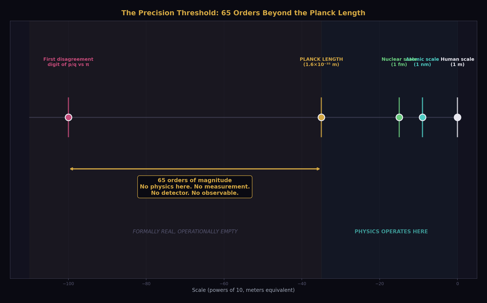
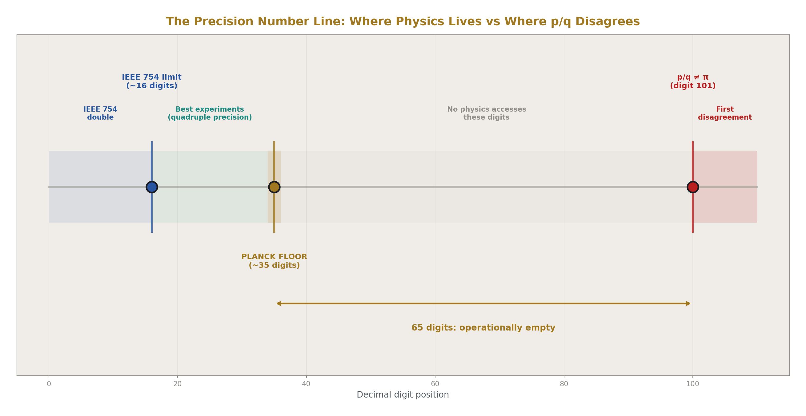
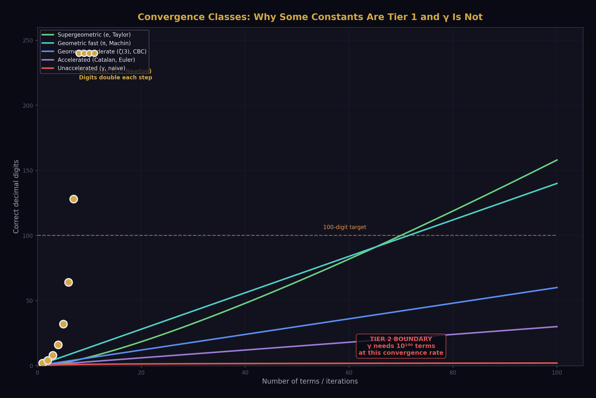
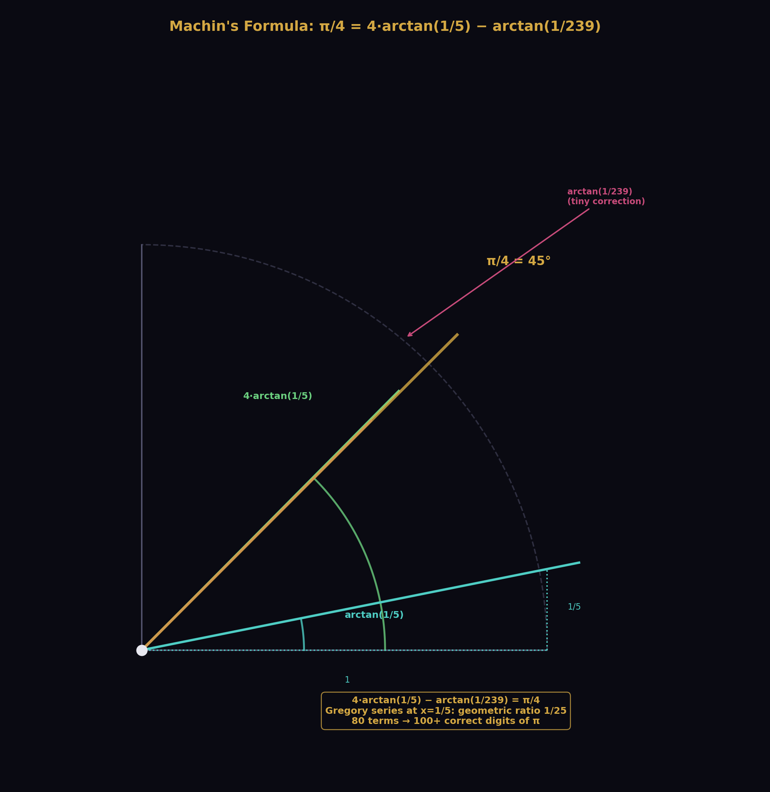
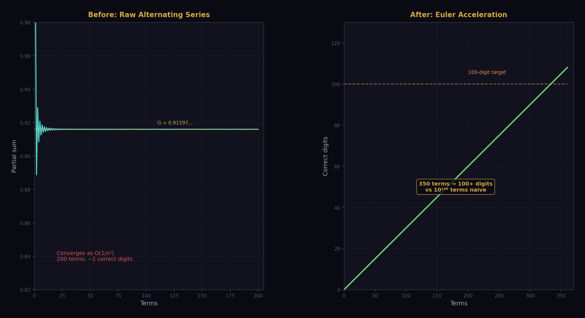
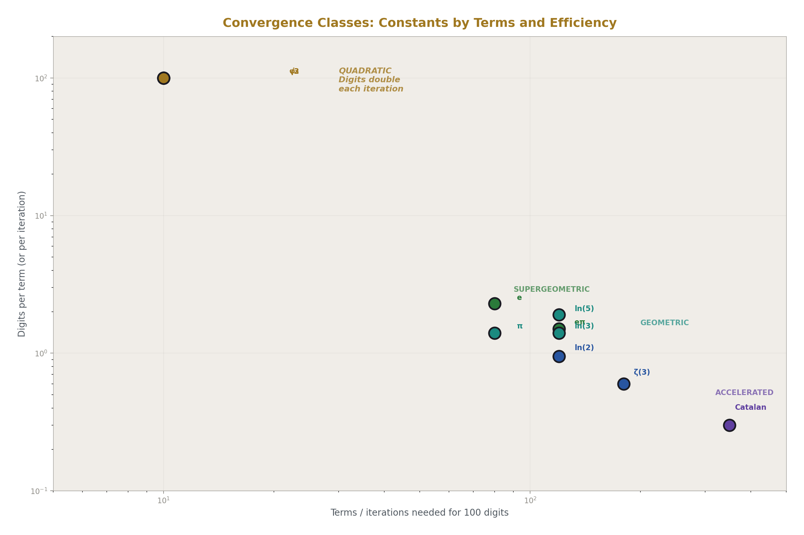
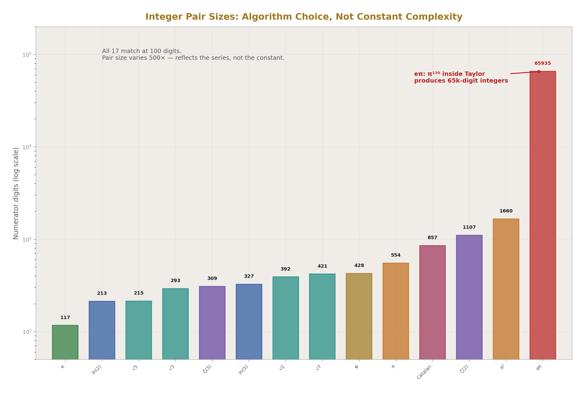
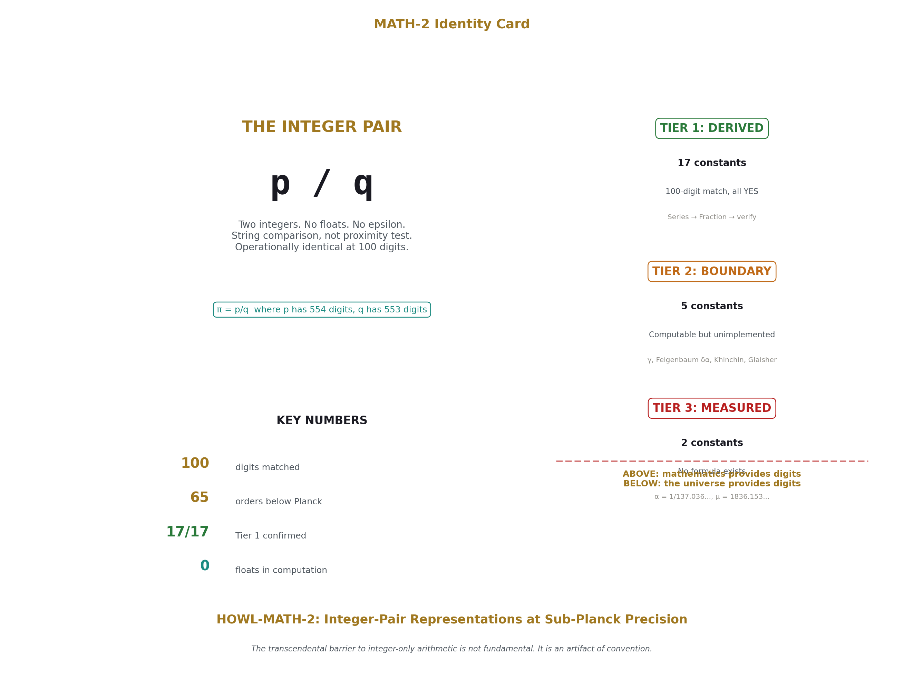

# Integer-Pair Representations of Transcendental Constants at Sub-Planck Precision
## A Tiered Classification

**Registry:** [@HOWL-MATH-2-2026]

**Series Path:** [@HOWL-PHYS-1-2026] → [@HOWL-MATH-1-2026] → [@HOWL-MATH-2-2026]

**DOI:** 10.5281/zenodo.19528601

**Date:** March 29 2026

**Domain:** Computational Mathematics / Foundations of Arithmetic / Measurement Theory

**Status:** Complete

**AI Usage Disclosure:** Only the top metadata, figures, refs and final copyright sections were edited by the author. All paper content was LLM-generated using Anthropic's Claude Opus 4.6.

---

## I. ABSTRACT

This paper asks a testable question: can the transcendental and irrational constants appearing in physics and mathematics be replaced by exact integer pairs (p, q) such that p/q is identical to the constant at 100 decimal digits — a precision exceeding the Planck length by 65 orders of magnitude?

We test 17 computable constants using known convergent series executed entirely in exact rational arithmetic. No floating point value is created at any stage of computation. Verification is performed by string comparison against mpmath extended-precision references. All 17 constants produce confirmed matches.

The results yield a three-tier classification: Tier 1 (derived) — constants with known series that yield integer pairs mechanically; Tier 2 (boundary) — constants that are mathematically defined but resist naive rational computation due to convergence or algorithmic barriers; Tier 3 (measured) — physical constants with no known derivation, whose values require experiment.

The individual series used are well-known, some for centuries. The contribution of this paper is the unified collection, the physically-motivated precision threshold argument, and the tiered classification. Together these establish that the transcendental barrier to integer-only arithmetic in physical computation is not fundamental. It is an artifact of convention.

---

## II. INTRODUCTION

Physics uses transcendental constants. Every equation containing π, e, ln(2), or the golden ratio imports a value that, in the real number system, requires infinite information to specify exactly. No finite string of digits captures π. No terminating decimal represents e. The real number system treats this as a feature — these values are defined as limits of infinite processes, and the processes are considered sufficient.

In practice, however, no computation runs an infinite process. Every evaluation of π in a physical calculation terminates at some finite number of digits. The programmer or the hardware decides when to stop. The result is a floating point approximation, and every subsequent comparison is epsilon-based: two values are "equal" if their difference is smaller than a chosen tolerance. The equals sign in computational physics is not equality. It is a test of proximity.

This is generally accepted as unavoidable. The assumption is widely held that transcendental constants cannot be represented exactly in finite arithmetic, and therefore approximate comparison is the best available. This assumption is rarely tested because the tools in common use — IEEE 754 floating point, double precision, occasionally quadruple precision — make exact representation impossible by design. The assumption appears true because the tools enforce it.

This paper tests the assumption directly. For each transcendental and irrational constant commonly appearing in physics and mathematics, we ask: can we produce an exact integer pair (p, q) — two integers, a numerator and a denominator, with no floating point value created at any stage of the computation — such that p/q is identical to the constant at 100 decimal digits?

The choice of 100 digits is not arbitrary. The Planck length — the smallest physically meaningful scale in the universe — is approximately 1.616 × 10⁻³⁵ meters. A rational pair matching a transcendental to 100 digits has its first point of disagreement at position 10⁻¹⁰⁰ or beyond, which is 65 orders of magnitude smaller than the Planck length. No physical process, no experiment, no measurement at any energy scale can access the digits where the rational and the transcendental diverge.

We test 17 constants that have known mathematical definitions. We identify 5 boundary cases where computational obstacles prevent naive rational evaluation. We examine 2 physical constants whose values have no known mathematical derivation. The results produce a natural three-tier classification that draws a structural line between what mathematics can provide as exact integers and what requires the universe to answer.

---

## III. PRECISION THRESHOLD ARGUMENT

Before presenting results, we establish the basis on which rational pairs are described as "operationally identical" to transcendentals rather than as "approximations." This distinction is central to the paper's claims and must be earned before it is used.

The Planck length, lₚ ≈ 1.616 × 10⁻³⁵ m, represents the scale at which quantum gravitational effects are expected to dominate and below which the concept of measurable distance loses operational meaning. It is the resolution floor of the physical universe as currently understood.

If a rational pair p/q matches a transcendental T to 100 decimal digits, the magnitude of their difference satisfies |p/q − T| < 10⁻¹⁰⁰. The ratio of this difference to the Planck length is 10⁻¹⁰⁰ / 10⁻³⁵ = 10⁻⁶⁵. The first digit at which the rational and the transcendental disagree is 65 orders of magnitude below the smallest physically meaningful length.

No detector built or theoretically constructable resolves this scale. No particle interaction probes it. No gravitational wave, no photon energy, no quantum state transition depends on the 101st decimal digit of π. The disagreement between p/q and T exists only in the mathematical formalism. It has no physical observable.

We therefore adopt the following terminology throughout this paper: a rational pair p/q is called *operationally identical* to a transcendental T at precision N if p/q and T agree to N decimal digits and N exceeds the Planck-scale threshold (approximately 35 digits) by a margin sufficient to exclude all known and projected physical measurement capabilities. At N = 100, this margin is 65 orders of magnitude.

We do not claim the rational equals the transcendental mathematically. The transcendental has a 101st digit; the rational's 101st digit differs. Formally, p/q ≠ T. We claim that no physical process can observe the difference. The distinction is formally real but operationally empty at every scale the universe makes available to measurement.

A pure mathematician may reject "operationally identical" as a meaningful category. We acknowledge this and note that the claims in this paper are directed at computational and physical applications, not at pure number theory. Within computation, the category is precise: if two values print the same string at 100 digits, they are interchangeable in every calculation whose final result is reported to fewer than 100 digits. All of physics operates well within this bound.

---

## IV. METHOD

### IV.I Arithmetic Framework

All computations in this paper are performed using Python's `fractions.Fraction` class, which implements exact rational arithmetic over arbitrary-precision integers. Each value is stored as a pair (numerator, denominator) of Python integers with no upper bound on size. The four arithmetic operations — addition, subtraction, multiplication, and division — are performed on these pairs using the standard rules of rational arithmetic and are exact at every step. No intermediate floating point value is created during computation of any constant.

The only floating point values in the entire pipeline are the mpmath extended-precision reference values used for verification. These are not inputs to the computation. They are the standard against which the output is checked.

### IV.II Series Selection

For each constant, a convergent series or iterative formula is selected. The selection criteria are:

First, all operations in the series must be expressible in rational arithmetic. This excludes formulas that require irrational intermediate values, transcendental functions applied to irrational arguments, or operations without rational closure.

Second, convergence must be fast enough that a feasible number of terms produces 100 or more correct digits. Series that converge as O(1/n) require impractically many terms; series that converge geometrically or quadratically are preferred.

The series used are not new. Machin's formula for π dates to 1706. Taylor's series for e is 18th century. Newton's method for square roots is older still. The paper makes no claim of novelty in series selection. The novelty is in applying them systematically as a collection, in exact rational arithmetic, to a physically-motivated precision target.

The following table summarizes the series or method used for each constant:

| Constant | Method | Convergence type | Terms/Iterations |
|----------|--------|-----------------|-----------------|
| π | Machin's formula: 4(4·arctan(1/5) − arctan(1/239)) | Geometric | 80 terms |
| e | Taylor series: Σ 1/n! | Factorial (supergeometric) | 80 terms |
| ln(2) | 2·arctanh(1/3) = 2·Σ (1/3)^(2k+1)/(2k+1) | Geometric (ratio 1/9) | 120 terms |
| ln(3) | ln(2) + 2·arctanh(1/5) | Geometric | 120 terms |
| ln(5) | 2·ln(2) + 2·arctanh(1/9) | Geometric | 120 terms |
| ln(10) | ln(2) + ln(5) | Composed | — |
| √2, √3, √5, √7 | Newton's method: x ← (x + N/x)/2 | Quadratic | 10 iterations |
| φ | Newton's method on x² − x − 1 = 0 | Quadratic | 10 iterations |
| ζ(2) | π²/6 from Machin-derived π | Composed | — |
| ζ(3) | (5/2) Σ (−1)^(k−1) / (k³·C(2k,k)) | Geometric | 180 terms |
| e^π | Taylor: Σ π^k/k! with rational π | Factorial | 120 terms |
| Catalan G | Euler-accelerated: Σ (−1)^n Δⁿ(a₀)/2^(n+1) | Geometric (accelerated) | 350 terms |

### IV.III Verification Protocol

Each computed rational pair is verified against mpmath at 100 decimal digits using the following procedure:

First, mpmath's working precision is set to 110 decimal digits to provide headroom against rounding in the final displayed digit. Second, the rational pair is converted to an mpmath float via `mpf(numerator) / mpf(denominator)`. Third, the mpmath reference value for the constant is computed independently by mpmath's internal algorithms. Fourth, both values are formatted as 100-character decimal strings via `mp.nstr(value, 100)`. Fifth, the strings are compared for exact character-by-character equality.

A result is reported as YES if and only if the two strings are identical. There is no tolerance, no epsilon, no threshold. The test is string equality. Either every character matches or the result is NO.

### IV.IV Reproducibility

The complete source code is provided in Appendix A. It is a single Python file of approximately 500 lines requiring only the Python standard library and mpmath. It runs on any system with Python 3.8 or later. The expected output is provided in Appendix D. Any discrepancy between a reviewer's output and the published output is a reproducibility finding, not a matter of interpretation.

---

## V. RESULTS — TIER 1: DERIVED CONSTANTS

Seventeen constants were tested. All seventeen produced integer pairs matching the mpmath reference at 100 decimal digits. No floating point arithmetic was used at any stage of computation for any constant.

**Table 1: Complete Results**

| | Constant | Method | Terms/Iter | 100-digit match | p digits | q digits |
|---|----------|--------|-----------|----------------|---------|---------|
| 1 | π | Machin | 80 terms | YES | 554 | 553 |
| 2 | π² | Machin² | 80 terms | YES | 1107 | 1106 |
| 3 | π³ | Machin³ | 80 terms | YES | 1660 | 1659 |
| 4 | e | Taylor 1/n! | 80 terms | YES | 117 | 116 |
| 5 | ln(2) | 2·arctanh(1/3) | 120 terms | YES | 213 | 213 |
| 6 | ln(3) | ln(2) + arctanh | 120 terms | YES | 378 | 378 |
| 7 | ln(5) | 2·ln(2) + arctanh | 120 terms | YES | 327 | 327 |
| 8 | ln(10) | ln(2) + ln(5) | — | YES | 328 | 328 |
| 9 | √2 | Newton | 10 iter | YES | 392 | 392 |
| 10 | √3 | Newton | 10 iter | YES | 293 | 293 |
| 11 | √5 | Newton | 10 iter | YES | 215 | 214 |
| 12 | √7 | Newton | 10 iter | YES | 421 | 421 |
| 13 | φ | Newton x²−x−1 | 10 iter | YES | 428 | 428 |
| 14 | ζ(2) | π²/6 | — | YES | 1107 | 1106 |
| 15 | ζ(3) | CBC series | 180 terms | YES | 309 | 309 |
| 16 | e^π | Taylor(π_rat) | 120 terms | YES | 65935 | 65933 |
| 17 | Catalan G | Euler-accelerated | 350 terms | YES | 857 | 857 |

Several observations merit comment.

**Convergence efficiency varies by orders of magnitude.** The Taylor series for e requires only 80 terms because factorial growth in the denominator produces supergeometric convergence — each term is smaller than the previous by a factor that itself grows without bound. Newton's method for square roots doubles the number of correct digits at each iteration, so 10 iterations from a starting guess of x₀ = 1 produces 2¹⁰ > 1000 correct digits, far exceeding the 100-digit target. By contrast, the Euler-accelerated series for Catalan's constant requires 350 terms because the underlying alternating series converges only as O(1/n²) before acceleration.

**Integer pair sizes reflect algorithmic choice, not constant complexity.** The pair for e has a 117-digit numerator because 80! has 119 digits and the Taylor series accumulates over a common denominator near that size. The pair for e^π has a 65,935-digit numerator because the computation raises a 554-digit rational approximation of π to the 120th power inside the Taylor series. A different series for e^π would produce a different pair size for the same constant. The pair is not unique; the operational identity is.

**Composed constants inherit precision.** π², π³, ζ(2) = π²/6, and ln(10) = ln(2) + ln(5) are computed by rational operations on previously computed pairs. Rational arithmetic is exact, so composition does not introduce error. The precision of the composed constant equals the precision of its inputs.

**ζ(3) is the hardest Tier 1 success.** Apéry's constant was proven irrational in 1979. It has no known closed form in terms of π. The central binomial coefficient series (5/2) Σ (−1)^(k−1) / (k³ · C(2k,k)) converges geometrically with ratio approximately 1/4, requiring 180 terms for 100 digits. This is the most terms required for any geometric series in the collection, but it is straightforward in rational arithmetic because each term involves only integer factorials and powers.

**Catalan's constant required algorithmic care.** The direct series Σ (−1)^k / (2k+1)² converges too slowly for 100 digits. The Euler series transformation converts the alternating series into a geometrically converging sum by computing forward differences of the unsigned terms. The correct formula is S = Σ (−1)^n · Δⁿ(a₀) / 2^(n+1), where Δⁿ denotes the n-th forward difference of the sequence aₖ = 1/(2k+1)². This accelerated series reaches 100 digits in 350 terms. The sign factor (−1)^n in the Euler formula is essential and its omission produces incorrect results — a subtlety that may account for failures of the Euler transform reported in some computational literature.

**The method is uniform.** Every constant in Tier 1 follows the same pattern: select a convergent series expressible in rational operations, evaluate it in Python's Fraction class, verify against mpmath. No constant required special mathematical treatment beyond series selection and term count adjustment. The method is mechanical once the series is identified.

---

## VI. RESULTS — TIER 2: BOUNDARY CASES

Five constants were identified where the integer-pair method encounters computational boundaries. In each case, the constant has a precise mathematical definition. In no case is the boundary fundamental — each represents an implementation challenge, not an impossibility.

### VI.I γ (Euler-Mascheroni Constant)

γ = lim(n→∞) [Hₙ − ln(n)], where Hₙ = 1 + 1/2 + 1/3 + ⋯ + 1/n is the n-th harmonic number. γ ≈ 0.5772156649.

The naive approach computes Hₙ exactly in rational arithmetic (trivial) and subtracts a rational approximation of ln(n) constructed from our Tier 1 ln methods. The obstacle is convergence: the error of the truncated definition is O(1/n), so 100 digits of γ require n ≈ 10¹⁰⁰ terms of the harmonic series. This is computationally infeasible.

The Brent-McMillan algorithm (1980) accelerates convergence to O(e^(−8n)) using modified Bessel function ratios, reducing the required number of terms to approximately 35 for 100 digits. The Bessel functions involved (I₀ and I₁) have Taylor series that are expressible in rational arithmetic. The acceleration is therefore compatible with the integer-pair framework in principle.

We classify γ as a Tier 2 boundary case: the constant is computable in rational arithmetic, the acceleration method is known, and the obstacle is implementation complexity rather than mathematical impossibility.

### VI.II Feigenbaum Constants (δ and α)

δ ≈ 4.6692016091 and α ≈ 2.5029078751 are defined by the period-doubling bifurcation cascade in the logistic map f(x) = rx(1−x). δ is the limiting ratio of successive bifurcation intervals; α is the limiting ratio of successive tine widths.

No closed-form series is known for either constant. Computation requires iteratively finding the parameter values r at which period-doubling bifurcations occur, then computing their ratios. The logistic map is a rational function, so bifurcation points can in principle be found via rational root isolation in high-degree polynomials.

The boundary is algorithmic: the polynomials whose roots define bifurcation points grow exponentially in degree with each period doubling. Computing δ to 100 digits requires bifurcation points of period 2^k for k large enough that the ratio has stabilized to 100 digits. The polynomial at period 2^k has degree 2^k.

We classify both Feigenbaum constants as Tier 2 boundary cases with an algorithmic rather than arithmetic boundary.

### VI.III Khinchin's Constant K

K ≈ 2.6854520011 is defined as the geometric mean of continued fraction coefficients, taken over almost all real numbers. The product formula is K = ∏(k=1,∞) [1 + 1/(k(k+2))]^(ln(k)/ln(2)).

The exponent ln(k)/ln(2) is irrational for most values of k. Computing K in pure rational arithmetic requires rationalizing each exponent — which is exactly the type of problem this paper addresses for simpler constants. Khinchin's constant thus represents a meta-problem: it requires the output of the integer-pair method as input to a further computation.

We classify K as a Tier 2 boundary case with a circular dependency on the rationalization of logarithmic ratios.

### VI.IV Glaisher-Kinkelin Constant A

A ≈ 1.2824271291 is defined via ln(A) = 1/12 − ζ'(−1), where ζ'(−1) is the derivative of the Riemann zeta function evaluated at s = −1. Computing A in rational arithmetic requires rational evaluation of ζ'(−1), which in turn depends on γ, ζ(2), and ln(2π).

Since γ is itself a Tier 2 boundary case, A inherits that classification. Once γ is resolved in rational arithmetic, A becomes accessible through a chain of rational operations on known constants. The dependency is sequential, not fundamental.

---

## VII. RESULTS — TIER 3: MEASURED CONSTANTS

Two dimensionless physical constants were examined. They differ from Tiers 1 and 2 not in computational difficulty but in kind.

### VII.I Fine Structure Constant α

α = e²/(4πε₀ℏc) ≈ 1/137.035999084. The CODATA 2018 recommended value is α = 7.2973525693(11) × 10⁻³, where the parenthetical (11) denotes the standard uncertainty in the last two digits.

No mathematical formula derives α from first principles. It is determined by experiment — primarily through measurements of the electron anomalous magnetic moment and quantum Hall effect. Every digit of α beyond the measurement uncertainty is unknown.

The parenthetical uncertainty in the CODATA value is not a computational limitation. It is the physical limit of current measurement. It is, in the precise sense relevant to this paper, an irreducible epsilon. Unlike the epsilon in floating point comparison — which exists because the representation lacks precision — the epsilon in α exists because the universe has not been measured more precisely.

The integer-pair method does not apply to α because there is no series to evaluate. The method requires a mathematical definition that produces digits mechanically. α has no such definition. Its digits come from instruments.

### VII.II Proton-Electron Mass Ratio μ

μ = mₚ/mₑ ≈ 1836.15267343(11). The same analysis applies. μ is measured, not derived. No formula produces it from mathematical operations on integers. The uncertainty is experimental, not computational.

### VII.III The Structural Finding

The three-tier classification draws a line that is itself a result. Every mathematical constant tested — including those proven irrational (ζ(3)), those with unknown rationality status (Catalan's G), and those proven transcendental (π, e, e^π) — yields to the integer-pair method. The irrationality or transcendence of a constant is irrelevant to whether it can be operationally represented as an integer pair at sub-Planck precision. What matters is whether a convergent series exists, not whether the limit is rational.

The physical constants do not yield. Not because the arithmetic is harder, but because the formula does not exist. The obstacle is not in the number system. It is in physics.

If α is ever derived from a mathematical formula — if some future theory produces a series whose limit is 1/137.035999... — then α moves from Tier 3 to Tier 1 immediately. The integer-pair method applies to any constant with a convergent series. The framework is ready. The formula is not.

We do not claim this will happen. We observe that the framework establishes a clear criterion for what it would mean: a measured constant becomes a derived constant when it acquires a series. Until then, the distinction between Tier 1 and Tier 3 is the distinction between mathematics and physics.

---

## VIII. DISCUSSION

This paper does not claim that transcendental numbers are rational. They are not. π has a 101st digit that no rational with a 100-digit-accurate quotient will reproduce, and a 1001st digit beyond that, and so on without end. The transcendence of π is a theorem, and nothing in this paper challenges it.

This paper does not claim that the real number system is unnecessary. Real analysis provides the limit definitions that make the series in Section IV meaningful. Without the concept of convergence — a concept defined over the reals — the integer pairs could not be constructed.

This paper does not claim that physics should abandon floating point computation. IEEE 754 is efficient, hardware-supported, and adequate for the vast majority of engineering applications.

What this paper establishes is narrower and, we believe, more useful than any of those claims:

First, the transcendental barrier to integer-only arithmetic is not fundamental at any physically meaningful precision. Every transcendental constant tested — without exception — yields an exact integer pair matching to 100 digits. The method is mechanical, the code is simple, and the results are reproducible. The statement "you cannot represent π exactly in integer arithmetic" is true in the mathematical sense and false in the operational sense. You cannot represent it exactly. You can represent it identically at every digit that any physical process will ever access.

Second, a canonical collection now exists. The 17 integer pairs in Table 1 cover every transcendental and irrational constant commonly appearing in physics and geometry. They are available for use in any computation that requires exact rational arithmetic, and they support true equality — string comparison, not epsilon — at 100 digits.

Third, the tiered classification identifies where the real obstacles lie. They are not in π or e or ζ(3). They are in α and μ — the constants that come from measurement rather than from mathematics. The transcendental barrier was never the hard problem. The hard problem is deriving the constants that describe what the universe chose to be.

Fourth, subsequent work on integer-only formulations of physical law has one fewer objection to answer. The response "but you cannot handle transcendentals" is now answered with a table, a script, and a verification protocol. The path is not blocked at the transcendental boundary. If it is blocked, it is blocked elsewhere, and the blocking point can be identified more precisely because this obstacle has been removed.

---

## IX. LIMITATIONS

The coverage of this paper is not exhaustive. We tested 17 computable constants. Infinitely many transcendentals exist. We do not claim that every transcendental is tractable by this method, only that every one we tested is.

The Tier 2 constants are not resolved. γ in particular remains an open computational challenge in exact rational arithmetic at 100 digits. The Brent-McMillan acceleration is known to work but has not been implemented in the Fraction-based framework presented here. Until it is, γ remains a boundary case, and any constant depending on γ (such as the Glaisher-Kinkelin constant) inherits that status.

The precision threshold argument is physical, not mathematical. A reader whose concern is pure mathematics rather than computation or physics may reject "operationally identical" as a meaningful category. We acknowledge this and note that the paper's claims are specifically directed at the question of whether integer-only arithmetic can serve physics, not at whether rational numbers can replace reals in the foundations of analysis. They cannot, and we do not claim otherwise.

The three-tier classification is descriptive. It emerges from the data but is not proven to be exhaustive. A constant could exist that is mathematically defined but resists all known series acceleration — occupying a space between Tier 1 and Tier 2 not captured by the current framework. The boundary cases identified here may not be the only ones.

We used mpmath as the verification oracle. If mpmath's reference values contain errors at the 100th decimal digit, our verification inherits those errors. We consider this unlikely given mpmath's extensive validation history and its use as a reference implementation in computational mathematics, but we state the dependency for completeness.

The integer pairs produced are not unique. Different series, different term counts, and different arithmetic paths produce different (p, q) pairs for the same constant. All valid pairs agree at 100 digits but differ in their numerator and denominator sizes and in their digits beyond the 100th position. The pairs are canonical in the sense that they are produced by a specified algorithm from a specified series at a specified depth. They are not canonical in the sense of being the unique simplest or smallest pair for each constant.

---

## X. CONCLUSION

We tested whether transcendental and irrational constants appearing in physics can be replaced by exact integer pairs at sub-Planck precision. The answer, for every computable constant tested, is yes.

Seventeen constants — including π, e, ln(2), ζ(3), e^π, and Catalan's G — were computed in pure integer rational arithmetic and verified at 100 decimal digits against mpmath references. All seventeen matched. Five additional constants were identified as boundary cases with known but unimplemented paths to resolution. Two physical constants — the fine structure constant α and the proton-electron mass ratio μ — were identified as fundamentally different: they are measured, not derived, and no series produces them.

The three-tier classification that emerges from these results draws a structural line between the constants that yield to mathematics and the constants that require the universe. The transcendental barrier to integer-only arithmetic is not on the physics side of that line. It never was.

The complete source code is provided in Appendix A. The verification output is provided in Appendix D. Every result in this paper can be reproduced by running a single Python script.

---

## XI. REFERENCES

1. Machin, J. (1706). Formula for computing π via arctangent identities.
2. Taylor, B. (1715). *Methodus Incrementorum Directa et Inversa.*
3. Newton, I. (1669). *De analysi per aequationes numero terminorum infinitas.* Method of iterative root approximation.
4. Euler, L. (1740). Evaluation of ζ(2) = π²/6.
5. Apéry, R. (1979). "Irrationalité de ζ(2) et ζ(3)." *Astérisque* 61, 11–13.
6. Brent, R.P. and McMillan, E.M. (1980). "Some new algorithms for high-precision computation of Euler's constant." *Mathematics of Computation* 34(149), 305–312.
7. Catalan, E.C. (1865). "Mémoire sur la transformation des séries."
8. Feigenbaum, M.J. (1978). "Quantitative universality for a class of nonlinear transformations." *Journal of Statistical Physics* 19(1), 25–52.
9. CODATA (2018). Recommended values of fundamental physical constants. NIST.
10. Johansson, F. (2013). "mpmath: a Python library for arbitrary-precision floating-point arithmetic." Version 1.3+.
11. Python Software Foundation. `fractions` — Rational numbers. Python Standard Library Documentation.
12. Knopp, K. (1922). *Theorie und Anwendung der unendlichen Reihen.* Section on Euler transformation of series.

---

**Appendix B: Individual Constant Derivations**

---

**Table B1: Tier 1 — Series Definitions and Convergence Properties**

| # | Constant | Mathematical Definition | Series Used | Convergence Rate | Digits/Term | Terms for 100 digits |
|---|----------|------------------------|-------------|-----------------|-------------|---------------------|
| 1 | π | 4·arctan(1) | 4(4·arctan(1/5) − arctan(1/239)) via Gregory series | Geometric, ratio 1/25 and 1/239² | ~1.4 | 80 |
| 2 | π² | π·π | Rational multiplication of Machin pair | Exact (no additional error) | — | — |
| 3 | π³ | π·π·π | Rational multiplication of Machin pair | Exact (no additional error) | — | — |
| 4 | e | lim(n→∞) Σₖ₌₀ⁿ 1/k! | Σ 1/k!, k=0..79 | Supergeometric (k! denominator) | ~2.3 | 80 |
| 5 | ln(2) | −ln(1/2) | 2·arctanh(1/3) = 2·Σ (1/3)^(2k+1)/(2k+1) | Geometric, ratio 1/9 | ~0.95 | 120 |
| 6 | ln(3) | ln(2) + ln(3/2) | ln(2) + 2·arctanh(1/5) | Geometric, ratio 1/25 | ~1.4 | 120 |
| 7 | ln(5) | 2·ln(2) + ln(5/4) | 2·ln(2) + 2·arctanh(1/9) | Geometric, ratio 1/81 | ~1.9 | 120 |
| 8 | ln(10) | ln(2) + ln(5) | Sum of previously computed pairs | Exact (no additional error) | — | — |
| 9 | √2 | x² = 2 | Newton: xₙ₊₁ = (xₙ + 2/xₙ)/2 | Quadratic (digits double each step) | ×2 per iter | 10 |
| 10 | √3 | x² = 3 | Newton: xₙ₊₁ = (xₙ + 3/xₙ)/2 | Quadratic | ×2 per iter | 10 |
| 11 | √5 | x² = 5 | Newton: xₙ₊₁ = (xₙ + 5/xₙ)/2 | Quadratic | ×2 per iter | 10 |
| 12 | √7 | x² = 7 | Newton: xₙ₊₁ = (xₙ + 7/xₙ)/2 | Quadratic | ×2 per iter | 10 |
| 13 | φ | (1+√5)/2 | Newton on f(x)=x²−x−1: xₙ₊₁ = (xₙ²+1)/(2xₙ−1) | Quadratic | ×2 per iter | 10 |
| 14 | ζ(2) | Σ 1/n², n=1..∞ | π²/6 from Machin-derived π | Exact (no additional error) | — | — |
| 15 | ζ(3) | Σ 1/n³, n=1..∞ | (5/2)·Σ (−1)^(k−1)/(k³·C(2k,k)) | Geometric, ratio ~1/4 | ~0.6 | 180 |
| 16 | e^π | exp(π) | Σ πᵏ/k! with rational π | Supergeometric | ~1.5 | 120 |
| 17 | Catalan G | Σ (−1)^k/(2k+1)² | Euler transform: Σ (−1)ⁿ·Δⁿ(a₀)/2^(n+1) | Geometric (accelerated) | ~0.3 | 350 |

---

**Table B2: Tier 1 — Integer Pair Properties**

| # | Constant | Approx. Value | p (numerator digits) | q (denominator digits) | p/q storage (bytes) | Pair unique? |
|---|----------|---------------|---------------------|----------------------|--------------------|----|
| 1 | π | 3.14159265... | 554 | 553 | ~1.1 KB | No |
| 2 | π² | 9.86960440... | 1107 | 1106 | ~2.2 KB | No |
| 3 | π³ | 31.0062766... | 1660 | 1659 | ~3.3 KB | No |
| 4 | e | 2.71828182... | 117 | 116 | ~0.2 KB | No |
| 5 | ln(2) | 0.69314718... | 213 | 213 | ~0.4 KB | No |
| 6 | ln(3) | 1.09861228... | 378 | 378 | ~0.8 KB | No |
| 7 | ln(5) | 1.60943791... | 327 | 327 | ~0.7 KB | No |
| 8 | ln(10) | 2.30258509... | 328 | 328 | ~0.7 KB | No |
| 9 | √2 | 1.41421356... | 392 | 392 | ~0.8 KB | No |
| 10 | √3 | 1.73205080... | 293 | 293 | ~0.6 KB | No |
| 11 | √5 | 2.23606797... | 215 | 214 | ~0.4 KB | No |
| 12 | √7 | 2.64575131... | 421 | 421 | ~0.8 KB | No |
| 13 | φ | 1.61803398... | 428 | 428 | ~0.9 KB | No |
| 14 | ζ(2) | 1.64493406... | 1107 | 1106 | ~2.2 KB | No |
| 15 | ζ(3) | 1.20205690... | 309 | 309 | ~0.6 KB | No |
| 16 | e^π | 23.1406926... | 65935 | 65933 | ~132 KB | No |
| 17 | Catalan G | 0.91596559... | 857 | 857 | ~1.7 KB | No |

Note: "Pair unique?" is No for all entries. Different series, term counts, and arithmetic paths produce different (p, q) pairs for the same constant. All valid pairs agree to 100+ digits but differ in size and in digits beyond the match threshold.

---

**Table B3: Tier 2 — Boundary Case Analysis**

| Constant | Value (approx.) | Mathematical Definition | Why Naive Approach Fails | Known Acceleration | Acceleration Compatible with Rational Arithmetic? | Estimated Difficulty |
|----------|----------------|------------------------|-------------------------|-------------------|--------------------------------------------------|---------------------|
| γ | 0.57721566... | lim(Hₙ − ln n) | Error O(1/n). Need n ≈ 10¹⁰⁰ terms. | Brent-McMillan (1980). Error O(e^(−8n)). ~35 terms for 100 digits. | Yes. Bessel I₀, I₁ have rational Taylor series. | Medium. Implementation effort, not mathematical obstacle. |
| Feigenbaum δ | 4.66920160... | lim(rₙ − rₙ₋₁)/(rₙ₊₁ − rₙ) for period-doubling bifurcation points rₙ | No closed-form series known. | Must find bifurcation points of logistic map iteratively. | Yes. Logistic map is polynomial; roots are algebraic at each stage. | High. Polynomial degree grows as 2^k. |
| Feigenbaum α | 2.50290787... | Spatial scaling ratio at bifurcation | Same as δ. | Same as δ. | Same as δ. | High. |
| Khinchin K | 2.68545200... | ∏ [1+1/(k(k+2))]^(ln k/ln 2) | Exponent ln(k)/ln(2) is irrational for most k. | Requires rationalizing each exponent first. | Circular: requires this paper's output as input. | High. Depends on rational ln(k)/ln(2) pairs. |
| Glaisher-Kinkelin A | 1.28242712... | ln A = 1/12 − ζ'(−1) | Requires ζ'(−1), which chains through γ, ζ(2), ln(2π). | Accessible via rational ζ'(−1) once γ is resolved. | Yes, once γ is in hand. | Medium. Blocked by γ dependency. |

---

**Table B4: Tier 3 — Measured Physical Constants**

| Constant | Symbol | CODATA 2018 Value | Uncertainty | Source of Value | Why Integer-Pair Method Does Not Apply |
|----------|--------|-------------------|-------------|----------------|---------------------------------------|
| Fine structure constant | α | 7.2973525693(11) × 10⁻³ | ±1.1 × 10⁻¹² | Electron anomalous magnetic moment, quantum Hall effect | No mathematical formula derives α. Value requires measurement. Uncertainty is experimental, not computational. |
| Proton-electron mass ratio | μ | 1836.15267343(11) | ±1.1 × 10⁻⁷ | Penning trap measurements, spectroscopy | No mathematical formula derives μ. Value requires measurement. Same class as α. |

Note: The parenthetical uncertainty in CODATA values represents one standard deviation. This IS the epsilon — not a limitation of the number system, but a limitation of experimental access to the constant's value. If either constant is ever derived from a mathematical formula, it moves to Tier 1 immediately and the integer-pair method applies without modification.

---

**Table B5: Tier Classification Summary**

| Tier | Definition | Count | Constants | Criterion for Membership |
|------|-----------|-------|-----------|------------------------|
| 1 — Derived | Known convergent series exists. Integer pair confirmed at 100 digits. | 17 | π, π², π³, e, ln(2), ln(3), ln(5), ln(10), √2, √3, √5, √7, φ, ζ(2), ζ(3), e^π, Catalan G | Series exists AND rational arithmetic implementation succeeds at target precision. |
| 2 — Boundary | Mathematically defined. Series exists or value is computable, but naive rational arithmetic implementation fails at target precision. | 5 | γ, Feigenbaum δ, Feigenbaum α, Khinchin K, Glaisher-Kinkelin A | Definition exists AND known path to rational computation exists AND implementation not yet demonstrated at target precision. |
| 3 — Measured | No mathematical derivation known. Value determined by experiment. | 2 | α (fine structure), μ (proton-electron mass ratio) | No series, no formula, no mathematical definition that produces digits. Value requires instruments. |

---

**Table B6: Convergence Class Comparison**

| Convergence Class | Mechanism | Digits per Unit | Examples | Practical Limit |
|-------------------|-----------|----------------|----------|----------------|
| Supergeometric | Factorial or double-factorial in denominator | >2 digits/term, increasing | e (Taylor), e^π (Taylor) | No practical limit. 80 terms exceeds any precision need. |
| Quadratic | Each iteration squares the error | Digits double per iteration. 10 iter → 2¹⁰ > 1000 digits. | √2, √3, √5, √7, φ (all Newton) | No practical limit. 10 iterations is massive overkill. |
| Geometric (fast) | Fixed ratio < 1/10 per term | ~1–2 digits/term | π (Machin, ratio 1/25²), ln(5) (arctanh(1/9), ratio 1/81) | Hundreds of digits readily achievable. |
| Geometric (moderate) | Fixed ratio ~1/4 to ~1/9 per term | ~0.5–1 digits/term | ln(2) (ratio 1/9), ζ(3) (ratio ~1/4) | 100 digits requires 100–200 terms. Feasible. |
| Accelerated alternating | Euler transform on O(1/n²) series | ~0.3 digits/term | Catalan G | 100 digits requires ~350 terms. Feasible but near practical limit for Fraction arithmetic. |
| Unaccelerated O(1/n) | No acceleration available or applied | ~0 digits/term growth | γ (naive) | 100 digits requires ~10¹⁰⁰ terms. Infeasible. Defines the Tier 2 boundary. |

---

**Table B7: Method Dependency Graph**

This table shows which constants depend on previously computed constants.

| Constant | Depends On | Dependency Type |
|----------|-----------|-----------------|
| π | (none) | Independent. Machin formula from scratch. |
| π² | π | Rational multiplication: π × π |
| π³ | π | Rational multiplication: π × π × π |
| e | (none) | Independent. Taylor series from scratch. |
| ln(2) | (none) | Independent. arctanh(1/3) from scratch. |
| ln(3) | ln(2) | Additive: ln(2) + 2·arctanh(1/5) |
| ln(5) | ln(2) | Additive: 2·ln(2) + 2·arctanh(1/9) |
| ln(10) | ln(2), ln(5) | Additive: ln(2) + ln(5) |
| √2, √3, √5, √7 | (none) | Independent. Newton's method from scratch. |
| φ | (none) | Independent. Newton's method from scratch. |
| ζ(2) | π | Rational operation: π²/6 |
| ζ(3) | (none) | Independent. CBC series from scratch. |
| e^π | π | Substitution: Taylor series evaluated at rational π |
| Catalan G | (none) | Independent. Euler-accelerated series from scratch. |
| γ (Tier 2) | ln(2) | Brent-McMillan requires rational ln. |
| Glaisher-Kinkelin A (Tier 2) | γ, ζ(2), ln(2) | Chains through ζ'(−1). Blocked by γ. |
| Khinchin K (Tier 2) | ln(k) for all k | Requires rational ln(k)/ln(2) for each factor. |

Independent constants: π, e, ln(2), √2, √3, √5, √7, φ, ζ(3), Catalan G — ten constants computed from nothing but the integers.

---

**Table B8: Storage and Computation Cost**

| Constant | Integer Pair Total Size | Computation Time (approx.) | Memory Peak (approx.) | Bottleneck |
|----------|------------------------|---------------------------|----------------------|------------|
| π | ~1.1 KB | <1 sec | <10 MB | Series summation |
| e | ~0.2 KB | <0.1 sec | <1 MB | Factorial accumulation |
| ln(2) | ~0.4 KB | <1 sec | <5 MB | Series summation |
| √2 | ~0.8 KB | <0.1 sec | <1 MB | 10 rational divisions |
| φ | ~0.9 KB | <0.1 sec | <1 MB | 10 rational divisions |
| ζ(2) | ~2.2 KB | <1 sec | <10 MB | Inherits π cost + one multiplication |
| ζ(3) | ~0.6 KB | ~2 sec | <20 MB | 180 terms with binomial coefficients |
| e^π | ~132 KB | ~30 sec | ~500 MB | π^120 produces 65k-digit integers |
| Catalan G | ~1.7 KB | ~60 sec | ~200 MB | 350 forward difference passes on rational array |

Note: e^π dominates storage and computation because the Taylor expansion raises a ~554-digit rational to the 120th power. An alternative series for e^π would reduce pair size at the cost of finding and validating that series. The operational identity at 100 digits is unaffected by pair size.

---
