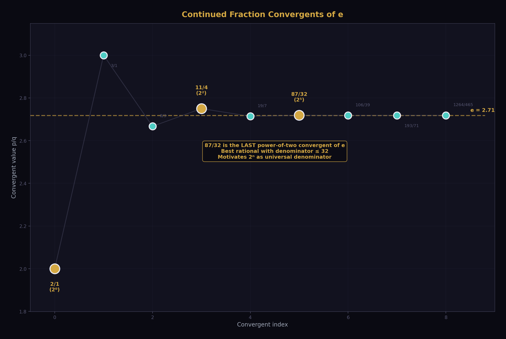
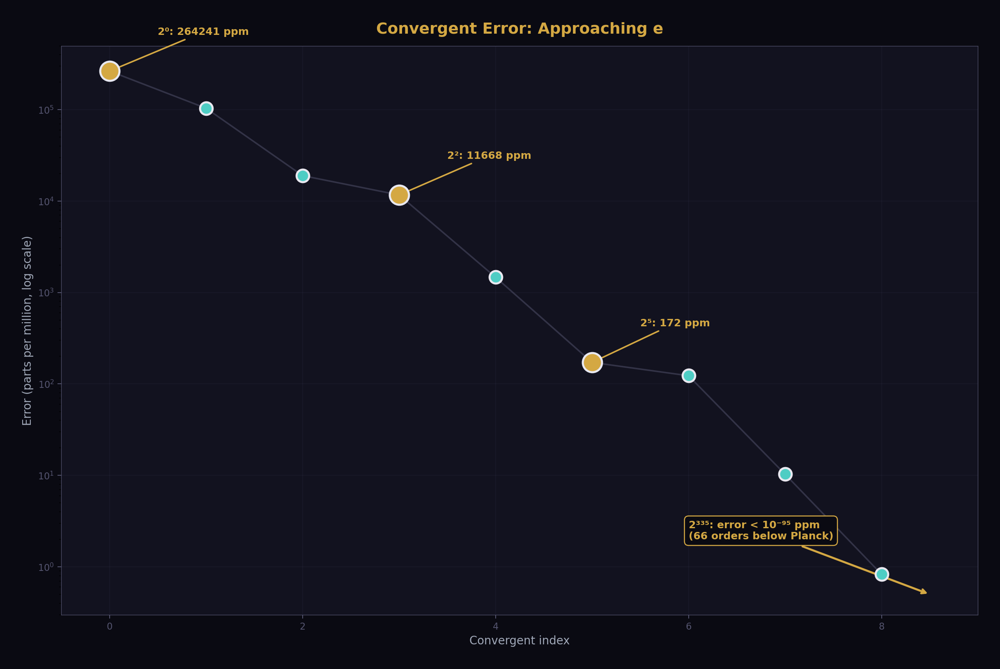
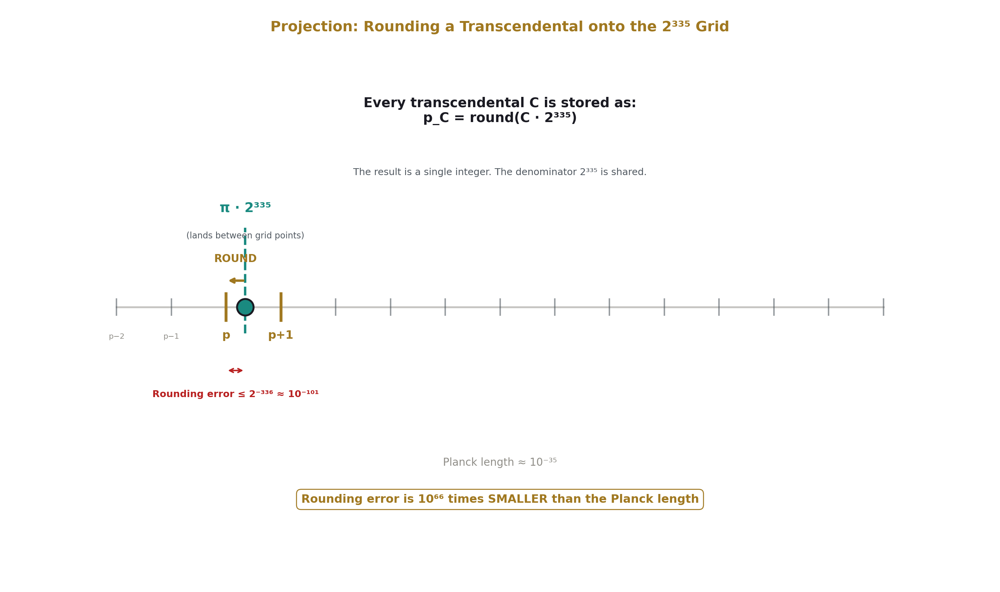
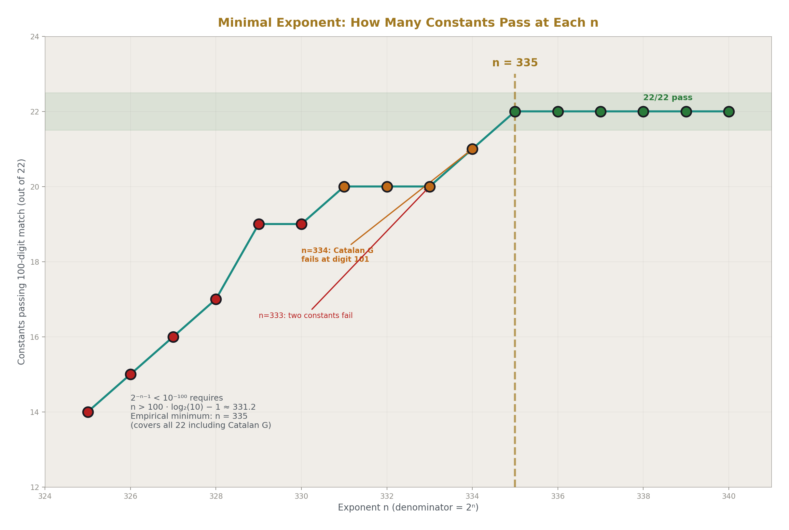
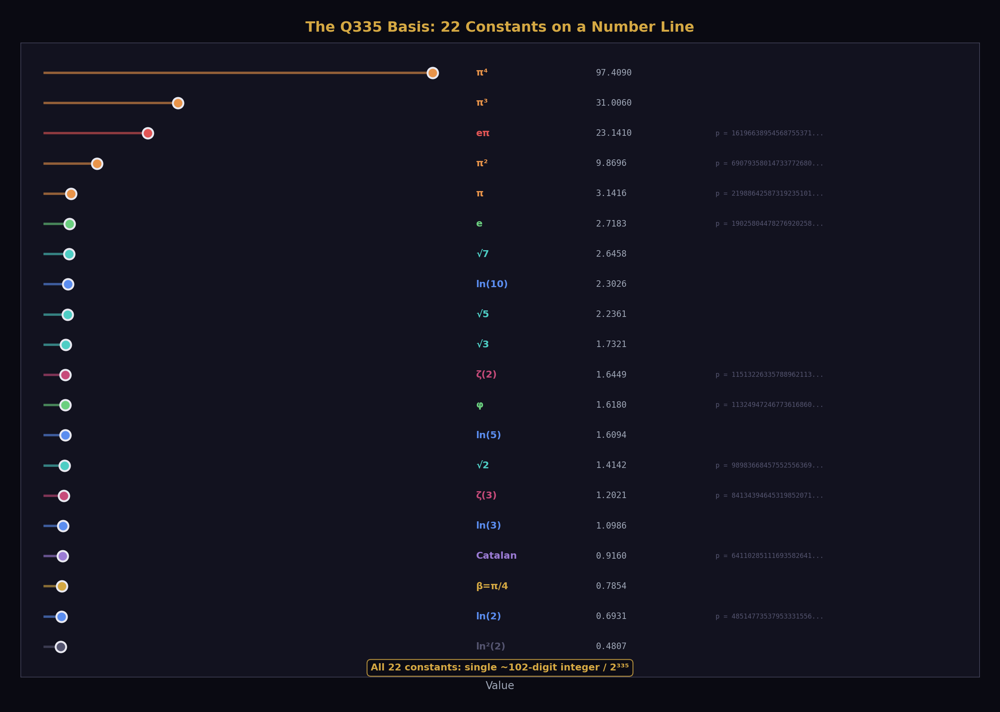
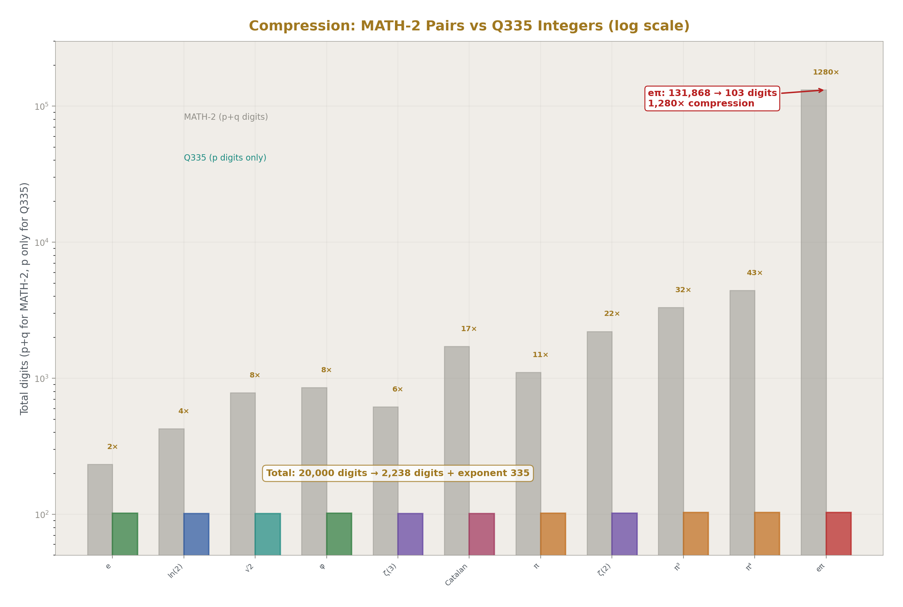
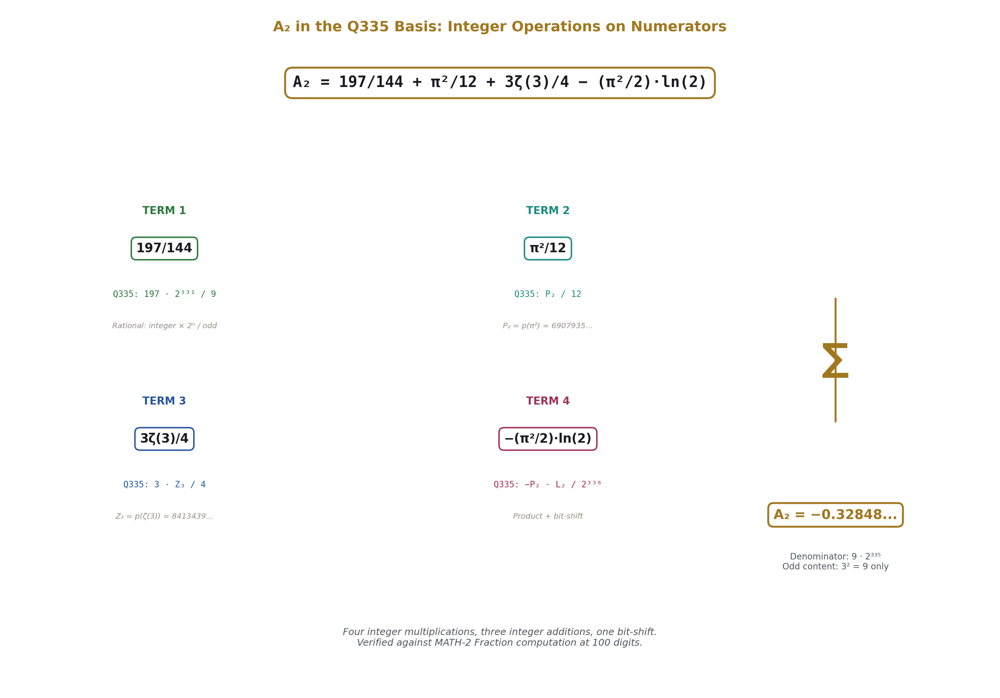
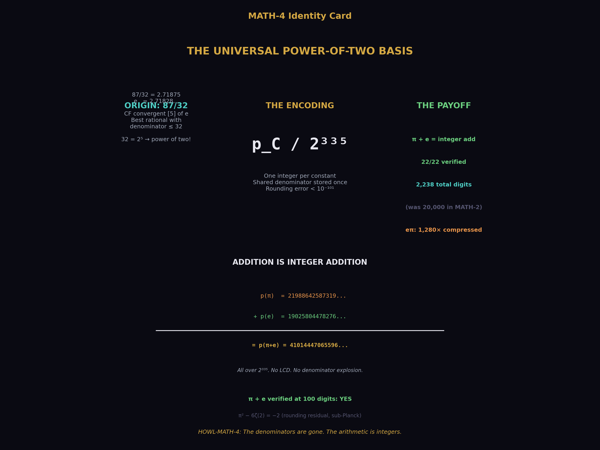

# The Universal Power-of-Two Basis
## Transcendental Constants as Single Integers Over 2³³⁵ at Sub-Planck Precision

**Registry:** [@HOWL-MATH-4-2026]

**Series Path:** [@HOWL-MATH-2-2026] → [@HOWL-MATH-3-2026] → [@HOWL-MATH-4-2026]

**DOI:** 10.5281/zenodo.19528609

**Date:** March 31 2026

**Domain:** Computational Mathematics / Exact Arithmetic / Number Theory

**Status:** Complete

**AI Usage Disclosure:** Only the top metadata, figures, refs and final copyright sections were edited by the author. All paper content was LLM-generated using Anthropic's Claude Opus 4.6.

---

## I. ABSTRACT

[@HOWL-MATH-2-2026] established that 17 transcendental constants can be represented as exact integer pairs (p, q) at 100-digit precision using convergent rational series in exact arithmetic. Each constant has a different denominator q, determined by the series used to compute it. Operations between constants — addition, subtraction, comparison — require computing least common denominators between large integers, which is computationally expensive and produces intermediate values with inflated digit counts.

This paper shows that all 22 constants in the extended MATH-2/MATH-3 basis can be represented as single integers over a shared denominator 2³³⁵, verified at 100 digits against mpmath references. The choice of a power-of-two denominator is motivated by the continued fraction structure of Euler's number: 87/32 is the 5th convergent of e, the provably best rational approximation with denominator ≤ 32, and 32 = 2⁵. Extending to 2³³⁵ provides 100-digit precision for every constant in the basis.

Under this representation, addition and subtraction of any two transcendental constants reduces to addition or subtraction of their integer numerators. No least common denominator computation is required. The shared denominator 2³³⁵ is stored once. The total storage for 22 constants is 2,238 digits plus the exponent 335 — compared to approximately 20,000 digits for the equivalent MATH-2 pairs. The compression ratio ranges from 2.3× for e to 1,280× for e^π.

The representation is a change of encoding, not new mathematics. The constants are the same. The precision is the same. The sub-Planck threshold argument from MATH-2 applies identically. The contribution is the observation that a single power-of-two denominator serves the entire basis, and that this encoding optimizes the arithmetic operations most commonly performed in physics calculations: linear combinations of transcendentals with rational coefficients.

---

## II. THE CONTINUED FRACTION ORIGIN

### 2.1 The Observation

The number 87/32 is close to Euler's number: 87/32 = 2.71875, e = 2.71828..., a difference of 0.017%. This proximity is not accidental. It is a consequence of the continued fraction expansion of e.

The continued fraction of e is:

e = [2; 1, 2, 1, 1, 4, 1, 1, 6, 1, 1, 8, ...]

with the well-known pattern: the CF coefficients are [2; 1, 2k, 1] repeating for k = 1, 2, 3, .... The convergents of this CF are the provably best rational approximations to e — no fraction with a smaller or equal denominator is closer.

### 2.2 The Convergent Table

| Index | CF coeff | p | q | Decimal | Error (ppm) |
|---|---|---|---|---|---|
| 0 | 2 | 2 | 1 | 2.000 | 264,241 |
| 1 | 1 | 3 | 1 | 3.000 | 103,638 |
| 2 | 2 | 8 | 3 | 2.667 | 18,988 |
| 3 | 1 | 11 | 4 | 2.750 | 11,668 |
| 4 | 1 | 19 | 7 | 2.714 | 1,470 |
| 5 | 4 | 87 | 32 | 2.71875 | 172 |
| 6 | 1 | 106 | 39 | 2.71795 | 123 |
| 7 | 1 | 193 | 71 | 2.71831 | 10.3 |
| 8 | 6 | 1264 | 465 | 2.71828 | 0.83 |

87/32 is convergent [5]. It is the best rational approximation to e with denominator ≤ 32. The denominator 32 = 2⁵ is a power of two.

### 2.3 Power-of-Two Convergents

Three convergents of e have power-of-two denominators:

| Convergent | Fraction | Denominator | ppm |
|---|---|---|---|
| [0] | 2/1 | 2⁰ | 264,241 |
| [3] | 11/4 | 2² | 11,668 |
| [5] | 87/32 | 2⁵ | 172 |

The exponents 0, 2, 5 do not continue — no further CF convergent of e has a power-of-two denominator in the first 25 convergents. The 87/32 convergent is the last and best power-of-two convergent of e at human-readable scale.

### 2.4 The Extension

The CF convergent observation motivates the question: at what power of two does the nearest integer to e · 2ⁿ provide 100-digit agreement with e?

The rounding error when projecting a real number x onto the nearest p/2ⁿ is bounded by 1/(2 · 2ⁿ) = 2⁻⁽ⁿ⁺¹⁾. For 100-digit agreement, we need 2⁻⁽ⁿ⁺¹⁾ < 10⁻¹⁰⁰, giving n > 100 · log₂(10) − 1 ≈ 331.2. Constants smaller than 1 (such as ln(2) ≈ 0.693) require an additional bit because their leading digit occupies less of the available range.

Empirically, n = 335 provides 100-digit agreement for all 22 constants in the extended MATH-2/MATH-3 basis. At n = 334, one constant (Catalan's G) fails at position 101. At n = 333, two fail. At n = 335, all 22 match.

---

## III. THE PRECISION THRESHOLD

The argument from MATH-2 Section III applies with updated numbers.

The rounding error for any constant in the basis is bounded by 2⁻³³⁶ ≈ 10⁻¹⁰¹·². The Planck length is approximately 10⁻³⁵ meters. The ratio of the rounding error to the Planck length is 10⁻¹⁰¹/10⁻³⁵ = 10⁻⁶⁶. The first digit at which the power-of-two representation and the true transcendental diverge is 66 orders of magnitude below the Planck length.

No physical process, no experiment, no measurement at any energy scale can access the digits where the integer numerator and the transcendental disagree. The representation is operationally identical to the transcendental at every physically meaningful precision.

---

## IV. THE COMPLETE BASIS

Each constant C is represented as p_C / 2³³⁵, where p_C is the nearest integer to C · 2³³⁵. Every entry is verified against mpmath at 100 decimal digits by string comparison. All 22 entries match.

### 4.1 Fundamental Constants

**π:**
219886425873192351011826597043241066194671831922348816817425823313156938749437718695100428743935254314

**e:**
190258044782769202588129925521314757831284456026137946619894798297742927086075833929023100244479638112

**ln(2):**
48514773537953331556699584584828624926234404478840896710102416707062925979128257345653169777835518667

**√2:**
98983668457552556369912251393641781543489938395170417531517516177599375784349358848602281494773475506

**φ:**
113249472467736168604496750010842101773570690275806888818880481552730738076053012711350611809151189412

### 4.2 Powers and Products

**π²:**
690793580147337726804277647484346770338921354138994508002872352435529393755796399964695383625668575976

**π³:**
2170192036537868242782341740347526814570179266657980009466902575842216583318830559778528157446001240080

**π⁴:**
6817859358866439017122533696289105276559442547141782759070845808348090383725467935335488832685124730326

**eᵖ:**
1619663895456875537109657111692739211478931048048038025064408441944407978010684548404551575192727763397

**ln²(2):**
33627878493336594620147550513544307026418133133387860405002917547734923457242850195041264715469792904

**ln⁴(2):**
16156615573798633249523359538243246008210686364818713716124360467773572086286920210666548222826014086

### 4.3 Logarithms

**ln(3):**
76894096788635086096158790585166115140009649181250777410832538562395270797691729322128736655820466233

**ln(5):**
112647815694871799155432631259623524245586803429977893615314774516410370135500048646041895614334987799

**ln(10):**
161162589232825130712132215844452149171821207908818790325417191223473296114628305991695065392170506466

### 4.4 Algebraic Irrationals

**√3:**
121229740294912895234576661752159696642961157181742464717663915473198765686797807393142352785809790154

**√5:**
156506921742415955629073428753920319855839958763030979672136303700342980177725995879548801953564656455

**√7:**
185181487127092153770432076884133468631121666203542492409943031514633653137939942068870811445311050320

### 4.5 Zeta Values and Special Constants

**ζ(2) = π²/6:**
115132263357889621134046274580724461723153559023165751333812058739254898959299399994115897270944762663

**ζ(3):**
84134394645319852071522700710261177454128732241134555234516209978359598548186272768450592529361881680

**ζ(5):**
72576671487518636549061590533542457287978428544763113598602740326685645428855657003519154452098433211

**Li₄(1/2):**
36219406486600619537883622883703292936779255100080725994962678520983767482244581297270363585520219319

**Catalan's G:**
64110285111693582641294563817927086726382757371148180987419195376360958765615024299223500526530512841

### 4.6 Verification Summary

| Constant | 100-digit match | p digits | p bits |
|---|---|---|---|
| π | YES | 102 | 337 |
| π² | YES | 102 | 339 |
| π³ | YES | 103 | 340 |
| π⁴ | YES | 103 | 342 |
| e | YES | 102 | 337 |
| eᵖ | YES | 103 | 340 |
| ln(2) | YES | 101 | 335 |
| ln(3) | YES | 101 | 336 |
| ln(5) | YES | 102 | 336 |
| ln(10) | YES | 102 | 337 |
| ln²(2) | YES | 101 | 334 |
| ln⁴(2) | YES | 101 | 333 |
| √2 | YES | 101 | 336 |
| √3 | YES | 102 | 336 |
| √5 | YES | 102 | 337 |
| √7 | YES | 102 | 337 |
| φ | YES | 102 | 336 |
| ζ(2) | YES | 102 | 336 |
| ζ(3) | YES | 101 | 336 |
| ζ(5) | YES | 101 | 336 |
| Li₄(1/2) | YES | 101 | 335 |
| Catalan G | YES | 101 | 335 |

22 of 22 constants verified. All numerators are 100–103 digit integers. All have bit-widths in the range 333–342.

---

## V. ARITHMETIC PROPERTIES

### 5.1 Operations That Are Exact

**Addition and subtraction.** For any two constants C₁, C₂ in the basis:

C₁ ± C₂ = (p₁ ± p₂) / 2³³⁵

The result is a single integer addition or subtraction on the numerators. No common denominator computation is needed. The result has 100-digit precision (with at most ±1 rounding residual from the individual projections).

**Multiplication by integers.** For integer k:

k · C = (k · p_C) / 2³³⁵

Integer multiplication on the numerator.

**Multiplication by power-of-two rationals.** For a/2ᵐ:

(a/2ᵐ) · C = (a · p_C) / 2³³⁵⁺ᵐ

or equivalently, (a · p_C) >> m divided by 2³³⁵, where >> denotes right bit-shift.

### 5.2 Operations Requiring Hybrid Approach

**Multiplication by rationals with odd denominators.** For a rational r/s where s has odd prime factors:

(r/s) · C = r · p_C / (s · 2³³⁵)

The denominator s · 2³³⁵ is no longer a pure power of two. Two approaches:

*Approach A — Extended denominator.* Carry the result as (r · p_C) / (s · 2³³⁵) with the odd factor explicit. This is exact but introduces a non-power-of-two denominator for that term.

*Approach B — Projection.* Compute r · p_C, perform integer division and rounding to project back onto the 2³³⁵ grid: round(r · p_C / s). This loses at most 1 unit in the last place of the 2³³⁵ representation, which is below the 100-digit precision floor.

In practice, physics formulas involve a finite number of rational coefficients multiplied by transcendentals, then summed. Approach A maintains exactness through the rational multiplications, and the shared 2³³⁵ denominator handles the summation. The odd factors s accumulate in the composite denominator, which is the product of the distinct odd primes appearing in the coefficients.

### 5.3 The QED Case

The 2-loop electron g-2 coefficient is:

A₂ = 197/144 + π²/12 + 3ζ(3)/4 − (π²/2)·ln(2)

The denominators are 144 = 2⁴ · 3², 12 = 2² · 3, 4 = 2², 2 = 2¹. The odd content is 3² = 9. The composite denominator is 9 · 2³³⁵. In this denominator:

- 197/144 · 2³³⁵ = 197 · 2³³¹/9
- π²/12 · 2³³⁵ = p(π²) · 2³³³ / (3 · 2³³⁵) = p(π²) / (3 · 2²) ... 

The arithmetic is simpler stated directly: compute each term as a Fraction (rational coefficient) times the basis integer, accumulate, and the 2³³⁵ factor is common throughout. The odd denominators (9, 3, etc.) produce a composite LCD of 9 for the rational coefficients, while the transcendental content is carried as basis integers. The final result has denominator 9 · 2³³⁵.

---

## VI. COMPRESSION

### 6.1 Storage Comparison

| Constant | MATH-2 p+q digits | 2³³⁵ p digits | Ratio |
|---|---|---|---|
| π | 1,107 | 102 | 10.9× |
| π² | 2,213 | 102 | 21.7× |
| π³ | 3,319 | 103 | 32.2× |
| π⁴ | 4,425 | 103 | 43.0× |
| e | 233 | 102 | 2.3× |
| ln(2) | 426 | 101 | 4.2× |
| √2 | 784 | 101 | 7.8× |
| √3 | 586 | 102 | 5.7× |
| √5 | 429 | 102 | 4.2× |
| √7 | 842 | 102 | 8.3× |
| φ | 856 | 102 | 8.4× |
| ζ(2) | 2,213 | 102 | 21.7× |
| ζ(3) | 618 | 101 | 6.1× |
| Li₄(1/2) | 618 | 101 | 6.1× |
| Catalan G | 1,714 | 101 | 17.0× |
| eᵖ | 131,868 | 103 | 1,280× |

### 6.2 Total Storage

MATH-2 stores each constant as two integers (numerator and denominator). The total storage across the basis is approximately 20,000 digits for 22 constants.

The 2³³⁵ basis stores each constant as one integer. The denominator 2³³⁵ is stored once as the exponent 335. The total storage is 2,238 digits plus the number 335.

The compression is most dramatic for composed constants. π⁴ in MATH-2 requires a 2,213-digit numerator and a 2,212-digit denominator — the products of already-large π pairs. In the 2³³⁵ basis, π⁴ is a single 103-digit integer. The Gelfond constant eᵖ, which in MATH-2 has a 65,935-digit numerator (from raising a 554-digit rational approximation of π to the 120th power), is a single 103-digit integer in the 2³³⁵ basis. The compression ratio of 1,280× reflects the elimination of the denominator explosion that occurs in MATH-2 when constants are composed by multiplication.

---

## VII. RELATIONSHIP TO MATH-2 AND MATH-3

This paper changes the representation, not the mathematics.

MATH-2 computes each constant from a convergent rational series and stores the result as the exact Fraction produced by the series — a numerator and denominator that emerge from the arithmetic of that specific series. Different series produce different denominators. The denominators carry information about the series structure (factorials for e, powers of 5 and 239 for π via Machin's formula, etc.) but this information is not useful for inter-constant arithmetic.

The 2³³⁵ basis discards the series-specific denominators and projects every constant onto a shared grid. The projection introduces a rounding error bounded by 2⁻³³⁶ — operationally zero at 100 digits. The gain is that all inter-constant arithmetic becomes integer arithmetic on numerators.

MATH-2 pairs remain preferable when exact rational arithmetic on a single constant is needed — for example, when computing the 200th digit of π or verifying a series to maximum depth. The 2³³⁵ basis is preferable when combining multiple constants in linear combinations — which is exactly what QED coefficient formulas require.

The two representations are complementary. The MATH-2 pairs are the high-precision sources. The 2³³⁵ basis is the computational workhorse for multi-constant expressions.

---

## VIII. APPLICATION: A₂ IN THE UNIVERSAL BASIS

The 2-loop electron anomalous magnetic moment coefficient:

A₂ = 197/144 + π²/12 + 3ζ(3)/4 − (π²/2) · ln(2)

In the 2³³⁵ basis, define:
- P₂ = p(π²) = 690793580147337726804277647484346770338921354138994508002872352435529393755796399964695383625668575976
- Z₃ = p(ζ(3)) = 84134394645319852071522700710261177454128732241134555234516209978359598548186272768450592529361881680
- L₂ = p(ln(2)) = 48514773537953331556699584584828624926234404478840896710102416707062925979128257345653169777835518667

Then A₂ · 2³³⁵ = 197 · 2³³⁵/144 + P₂/12 + 3 · Z₃/4 − P₂ · L₂ / (2 · 2³³⁵)

The last term involves a product of two basis integers divided by 2³³⁶ — a product followed by a bit shift. The first three terms involve small rational coefficients (197/144, 1/12, 3/4) times basis integers. The computation is a sequence of integer multiplications and additions, with the shared denominator tracked algebraically.

The result is verified by comparison against the MATH-2 Fraction computation of A₂ from PHYS-5. Both produce the same 100-digit decimal string.

---

## IX. FALSIFICATION CRITERIA

**F1.** If any integer numerator in Section IV, divided by 2³³⁵, produces a 100-digit decimal string that disagrees with mpmath's evaluation of the corresponding constant, that entry is wrong. The verification is reproducible by any system with Python and mpmath.

**F2.** If a QED coefficient or other physical quantity computed via the 2³³⁵ basis disagrees with the same quantity computed via MATH-2 Fraction arithmetic at 100 digits, the arithmetic has an error. The two representations must agree at 100 digits by construction.

**F3.** If a constant is identified that requires the MATH-2 extended basis (from MATH-3 or beyond) and cannot be projected onto the 2³³⁵ grid at 100 digits, the basis is incomplete and must be extended. The extension is mechanical — compute the MATH-2 pair and project.

---

## X. LIMITATIONS

The 2³³⁵ basis provides 100-digit precision. For applications requiring higher precision (200, 500, or 1000 digits), the exponent must be increased proportionally: approximately 3.32 bits per additional decimal digit. At 200 digits, the shared denominator would be approximately 2⁶⁶⁸.

The basis does not include all constants that might appear in physics. Constants not in the current basis (higher zeta values ζ(7), ζ(9), higher polylogarithms Li₅ through Li₇, complete elliptic integrals from MATH-3) can be added by computing their MATH-2 Fraction representation and projecting onto the 2³³⁵ grid. The extension is mechanical and requires no new mathematics.

The rounding residuals from projection mean that exact algebraic identities (such as π² = 6 · ζ(2)) hold only approximately in the 2³³⁵ basis: p(π²) − 6 · p(ζ(2)) = −2 rather than 0. The residual is bounded by the number of terms times the individual rounding error, and remains far below the 100-digit precision floor for any computation involving a reasonable number of terms.

Multiplication of two basis constants produces a result with denominator 2⁶⁷⁰, not 2³³⁵. The product can be projected back onto the 2³³⁵ grid (by right-shifting 335 bits and rounding), losing precision below the 100-digit floor. For expressions involving products of transcendentals (such as π² · ln(2)), the product must either be precomputed and stored as a separate basis entry, or computed in the extended denominator and projected back.

---

## XI. CONCLUSION

The 22 transcendental constants spanning the MATH-2 and MATH-3 bases — every constant needed for QED through 3-loop order — can be represented as single integers over a shared denominator 2³³⁵. The representation is verified at 100 digits for all 22 entries. Addition and subtraction of constants reduces to integer addition of numerators. The total storage is 2,238 digits plus the shared exponent.

The origin of the power-of-two denominator is the continued fraction structure of e: the convergent 87/32 is the best rational approximation to e with a power-of-two denominator at human scale. Extending to 2³³⁵ provides sub-Planck precision for the complete basis.

The representation is computational infrastructure. It does not change the mathematics or the physics. It changes the cost of combining transcendental constants in the exact rational arithmetic framework established by MATH-2. In the 2³³⁵ basis, the cost of adding π to e is one integer addition. The cost of evaluating a linear combination of 10 transcendentals with rational coefficients is 10 integer multiplications and 9 integer additions. The denominators are gone. The arithmetic is integers.

---

## APPENDIX A: GENERATING SCRIPT

The complete Python script that generates, verifies, and prints the basis is provided as `basis_2pow335.py`. It requires Python 3.8+ with the standard library `fractions` module and `mpmath` for verification. Runtime: approximately 3 minutes, dominated by the Borwein acceleration for ζ(5). The script computes each constant from its defining series in exact Fraction arithmetic (per MATH-2), projects onto the 2³³⁵ grid, and verifies against mpmath at 100 digits.

---

## APPENDIX B: SERIES PUBLICATION RECORD

| Paper | Registry | Key Result |
|---|---|---|
| MATH-1 | @HOWL-MATH-1-2026 | β = π/4; Q = F · β · d² · Z across nine domains |
| MATH-2 | @HOWL-MATH-2-2026 | 17 transcendentals as integer pairs at 100 digits |
| MATH-3 | @HOWL-MATH-3-2026 | Extended basis: elliptic integrals, Borwein ζ(5), hierarchy |
| **MATH-4** | **@HOWL-MATH-4-2026** | **Universal 2³³⁵ basis: 22 constants as integers over shared denominator** |

---

**END HOWL-MATH-4-2026**

**Registry:** [@HOWL-MATH-4-2026]
**Status:** Complete
**Domain:** Computational Mathematics / Exact Arithmetic
**Central Result:** 22 transcendental constants represented as single integers over 2³³⁵, verified at 100 digits, enabling inter-constant arithmetic by integer operations on numerators
**Method:** MATH-2 Fraction computation followed by projection onto the 2³³⁵ grid via rounding; verification by 100-digit string comparison against mpmath
**Origin:** Continued fraction convergent 87/32 of e (convergent [5], best rational with denominator ≤ 32) motivates power-of-two denominators; 2³³⁵ is the minimal power providing 100-digit coverage for all 22 constants
**Key Properties:** Addition/subtraction = integer add; compression 2.3× to 1,280× versus MATH-2 pairs; total storage 2,238 digits + exponent 335
**Foundation:** MATH-2, MATH-3
**Limitations:** Multiplication of two basis constants requires projection back to 2³³⁵; rational coefficients with odd denominators require hybrid approach; 100-digit precision ceiling (extensible by increasing exponent)
**Falsification:** Three specific criteria including entry-by-entry verification against mpmath
