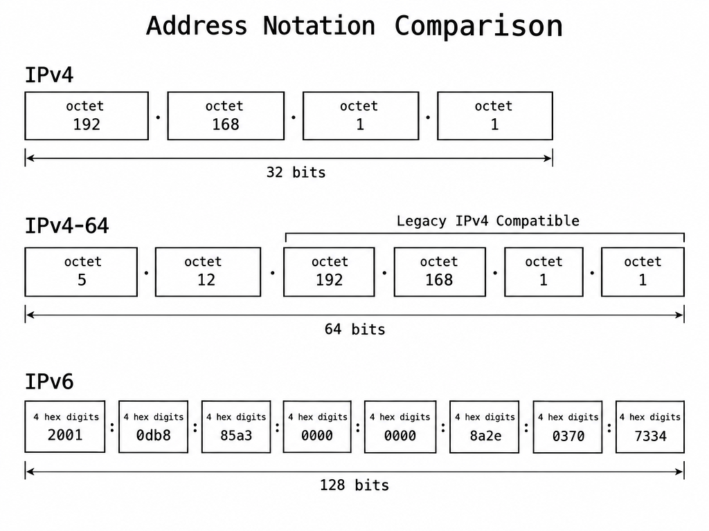
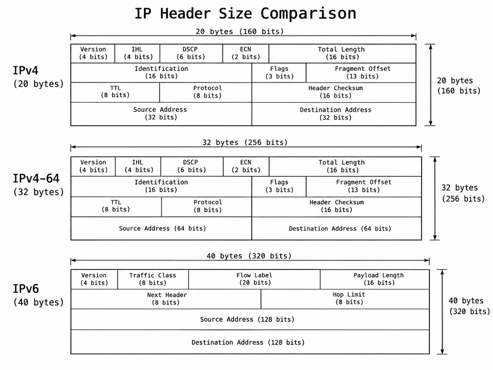
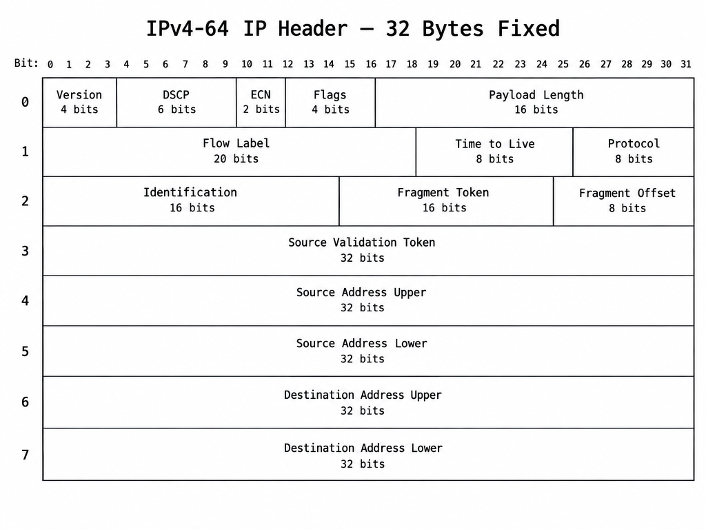
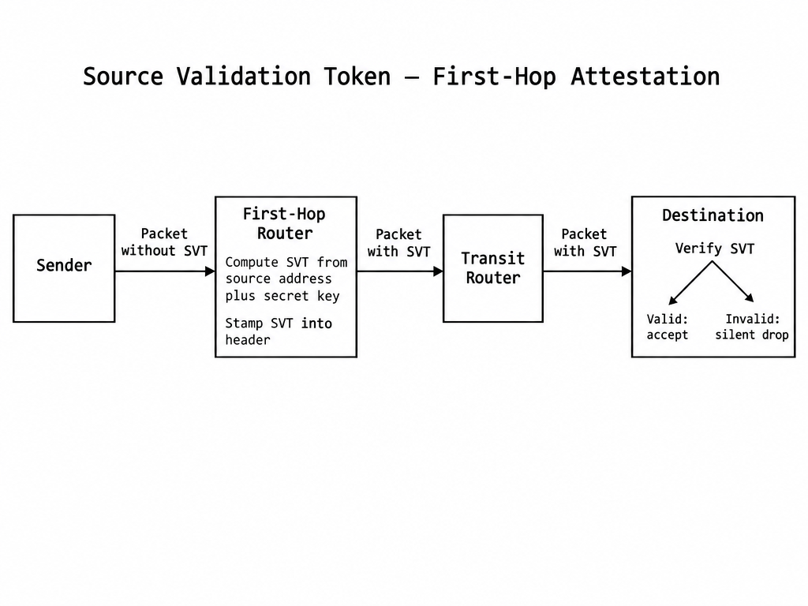
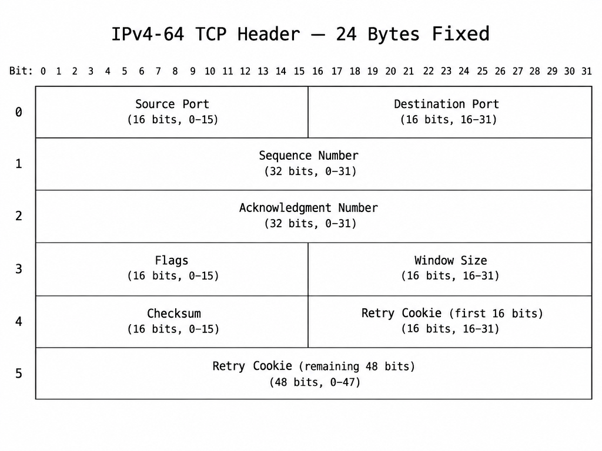
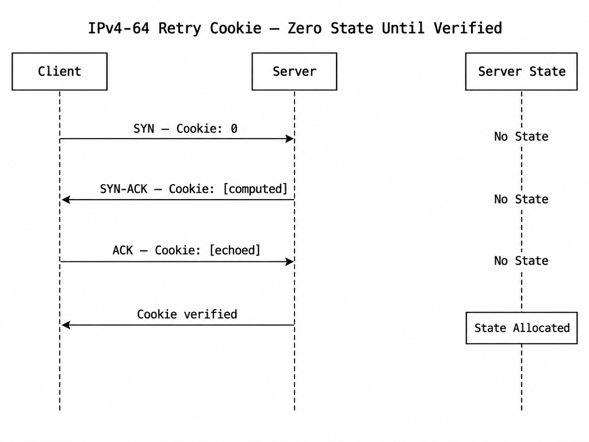
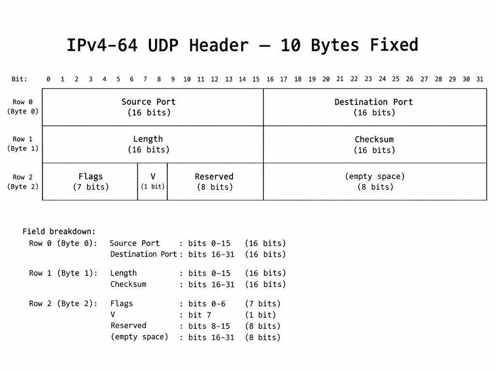
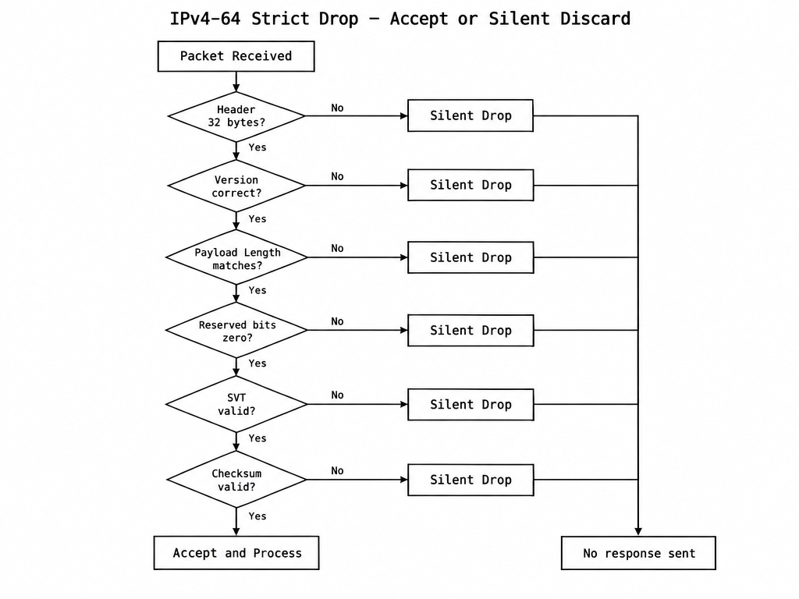
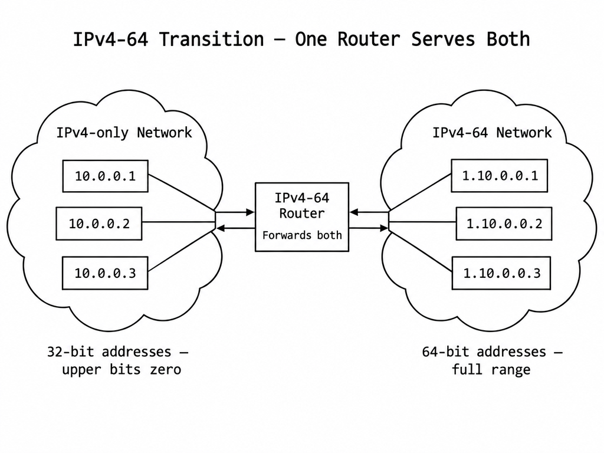

# IPv4-64: A 64-Bit In-Place Upgrade to IPv4 with Modern Security and Performance
## A proposal for extending IPv4 address space while preserving dotted-decimal notation, backward-compatible addressing, and fixed-header simplicity

**Registry:** [@HOWL-NET-1-2026]

**Series Path:** [@HOWL-NET-1-2026]

**DOI:** 10.5281/zenodo.23104391

**Date:** October 2026

**Domain:** Network Protocol Design / Internet Architecture

**Status:** Proposal — Not submitted to any standards body. Published for public review and discussion.

**AI Usage Disclosure:** Only the top metadata, figures, refs and final copyright sections and one biographical note were edited by the author. All paper content was LLM-generated using Anthropic's Claude 4.5 Sonnet. 

---

## 1. Purpose

This document proposes IPv4-64, a network protocol that extends the IPv4 address space from 32 bits to 64 bits. The protocol keeps the dotted-decimal address notation, keeps the fixed-header design, adds the Flow Label field from IPv6 for modern load balancing, adds source validation and anti-spoofing fields directly in the header, and removes all variable-length parsing from the IP, TCP, and UDP headers.

IPv4-64 is not a replacement for IPv6. It is an alternative path for networks where IPv6 adoption is not practical, not desired, or not justified by operational requirements. It takes the lessons learned from IPv6, QUIC, and 28 years of internet security incidents, and applies them to an IPv4-compatible design.

---

## 2. Background

### 2.1 IPv4

IPv4 is the Internet Protocol version 4, defined in 1981. It uses 32-bit addresses, written in dotted-decimal notation: four numbers separated by dots, each ranging from 0 to 255. Example: `192.168.1.1`. The 32-bit address space provides approximately 4.3 billion unique addresses. This space is exhausted. No new IPv4 address blocks are available from the global registries.

Organizations extend the usable life of IPv4 through Network Address Translation (NAT), which allows many devices to share a single public address. NAT works. It introduces complexity for peer-to-peer applications and adds state to the network, but it has sustained IPv4 for over 30 years past the point where exhaustion was predicted to cause failure.

### 2.2 IPv6

IPv6 is the Internet Protocol version 6, defined in 1998. It uses 128-bit addresses, written in colon-separated hexadecimal: eight groups of four hex digits. Example: `2001:0db8:85a3:0000:0000:8a2e:0370:7334`. The 128-bit address space provides approximately 3.4 × 10³⁸ unique addresses.

IPv6 is not backward compatible with IPv4. The address notation is different. The header format is different. The supporting protocols are different (ICMPv6 replaces ICMP, Neighbor Discovery replaces ARP). A network that adopts IPv6 must run both IPv4 and IPv6 in parallel (dual-stack) or deploy translation gateways. Both options add cost and complexity.

As of March 2026, IPv6 traffic to Google crossed 50% for the first time. This number is driven primarily by mobile carriers (T-Mobile US carries 91.8% IPv6, Reliance Jio carries over 91%) and residential ISPs in countries like France (73%) and India (72%). Enterprise internal networks remain predominantly IPv4. Google's own statistics run higher on weekends (when mobile and residential traffic dominates) and lower on weekdays (when enterprise IPv4 traffic weighs more heavily).

IPv6 introduced several valuable technical features: the Flow Label for load balancing, the removal of the header checksum to reduce per-hop processing, and mandatory UDP checksums. It also introduced features that created operational problems: the extension header chain (which firewalls struggle to parse), source-only fragmentation (which causes path MTU discovery black holes when ICMP is blocked), and 128-bit addresses (which are larger than necessary and difficult for humans to read, remember, or communicate verbally).

### 2.3 The Gap

There is no protocol that provides a larger address space than IPv4 while keeping the dotted-decimal notation, backward-compatible addressing, and operational simplicity that IPv4 offers. IPv4-64 fills this gap.

---

## 3. Address Format

### 3.1 Structure

An IPv4-64 address is 64 bits wide. It is written in dotted-decimal notation using up to 8 octets. Each octet is a number from 0 to 255, separated by dots.

### 3.2 Backward Compatibility

Every existing IPv4 address is a valid IPv4-64 address. The existing 32-bit address occupies the lower 32 bits. The upper 32 bits are zero.

The address `182.17.0.53` is an IPv4 address. It is also an IPv4-64 address with the upper 32 bits zeroed. It can optionally be written `0.182.17.0.53` or `0.0.0.0.182.17.0.53`. The short form is always valid.

### 3.3 Extended Addresses

When the upper bits are nonzero, additional octets appear on the left:

| Address | Octets | Meaning |
|---|---|---|
| `182.17.0.53` | 4 | Lower 32 bits only. Upper 32 bits are zero. |
| `1.182.17.0.53` | 5 | Upper byte is 1, lower 32 bits are 182.17.0.53 |
| `3.12.182.17.0.53` | 6 | Upper 16 bits are 3.12, lower 32 bits are 182.17.0.53 |
| `0.0.3.12.182.17.0.53` | 8 | Full 64-bit representation |

Leading zero octets may be omitted. The shortest unambiguous form is the canonical form.

### 3.4 Address Space

64 bits provides 18,446,744,073,709,551,616 unique addresses (approximately 18.4 quintillion). This is 4.3 billion times larger than IPv4. It is sufficient for every device on earth many times over.

IPv6's 128-bit space is 2⁶⁴ times larger than IPv4-64. The additional space has no practical value. IPv6 routing uses /64 prefixes, meaning the upper 64 bits identify the network and the lower 64 bits identify the host. The host portion alone equals the entire IPv4-64 address space. No network requires 2⁶⁴ host addresses per subnet.



### 3.5 Comparison to IPv6 Notation

| Property | IPv4 | IPv6 | IPv4-64 |
|---|---|---|---|
| Example address | `192.168.1.1` |  |  |
| Example address |  | `2001:0db8:85a3::8a2e:0370:7334` |  |
| Example address |  |  | `5.12.192.168.1.1` |
| Notation | Dotted decimal | Colon hexadecimal | Dotted decimal |
| Maximum characters | 15 | 39 | 23 |
| Can dictate over phone | Yes | No | Yes |
| Existing IPv4 address valid | Yes | No | Yes |

### 3.6 DNS

Existing A records (32-bit IPv4 addresses) are valid IPv4-64 addresses with the upper bits zeroed. No migration is required for existing DNS entries.

New records for extended addresses use a new record type (proposed: AA) that carries the 64-bit address. The text representation in zone files uses the same dotted-decimal notation. A zone file entry looks like:

```
host.example.com.  IN  AA  5.12.192.168.1.1
```

Resolvers that do not understand AA records ignore them and fall back to A records, which continue to work for all addresses in the legacy 32-bit space.

---



## 4. IP Header

### 4.1 Design Principles

The IPv4-64 IP header is fixed at 32 bytes. There are no options. There are no extension headers. Every field is at a known offset. A router or firewall reads fixed positions to make forwarding and filtering decisions. There is no variable-length parsing.

### 4.2 Header Layout



### 4.3 Field Definitions

**Version (4 bits):** Protocol version identifier. Set to the assigned version number for IPv4-64.

**DSCP (6 bits):** Differentiated Services Code Point. Identifies the quality-of-service class for the packet. Unchanged from IPv4. Routers use this field to prioritize voice, video, and interactive traffic over bulk data.

**ECN (2 bits):** Explicit Congestion Notification. Allows routers to signal congestion to endpoints without dropping packets. Endpoints that support ECN reduce their sending rate in response. This field exists in IPv4 and is used by QUIC and modern TCP implementations. Unchanged.

**Flags (4 bits):** DF (Don't Fragment): when set, routers must not fragment this packet. MF (More Fragments): when set, more fragments follow. Two bits are reserved and must be zero.

**Payload Length (16 bits):** The number of bytes following the 32-byte fixed header. This differs from IPv4's Total Length (which included the header). The change removes one dependency: the router does not need to know the header length to compute the payload size.

**Flow Label (20 bits):** Adopted from IPv6. The source sets this value once per traffic flow (typically hashed from source port, destination port, and protocol). Routers along the path use it for equal-cost multi-path (ECMP) load balancing. Without this field, routers must inspect transport-layer ports to distribute flows across links. On encrypted traffic (QUIC, IPsec, encrypted DNS), the transport headers are not visible, and without a flow label the router cannot distribute load. This is the single most operationally valuable addition from IPv6.

**Time to Live (8 bits):** Hop limit. Each router decrements this value by one. When it reaches zero, the packet is dropped. Prevents routing loops from circulating packets indefinitely. Unchanged from IPv4.

**Protocol (8 bits):** Identifies the upper-layer protocol carried in the payload. TCP is 6, UDP is 17. This field is at a fixed offset in the header. A firewall reads one byte at byte position 11 to determine the transport protocol. There is no extension header chain to walk. Unchanged from IPv4.

**Identification (16 bits):** Groups fragments that belong to the same original datagram. The source assigns the same Identification value to all fragments of one datagram. The receiver uses it to reassemble them. Unchanged from IPv4.

**Fragment Token (16 bits):** New field. The source computes this value from the Identification field and a per-connection secret. All fragments of the same datagram carry the same Fragment Token. The receiver drops fragments with mismatched tokens. This prevents blind fragment injection by off-path attackers who can guess the Identification but not the token.

**Fragment Offset (8 bits):** The position of this fragment's data in the original datagram, measured in 256-byte units. 8 bits gives a maximum reassembly range of 65,280 bytes, which covers all current MTUs including 9000-byte jumbo frames. Narrower than IPv4's 13-bit field because the 256-byte granularity is sufficient and the freed bits are used for the Fragment Token.



**Source Validation Token (32 bits):** New field. The first-hop router (the router directly connected to the sender's network) computes this value using a keyed hash of the source address and a periodically rotating secret. The router stamps the packet on egress. Downstream routers and the destination can verify that the packet entered the network from a router that attested to the source address.

This is ingress filtering (BCP 38) encoded in the packet itself. BCP 38 has been a recommended practice since the year 2000. It is not universally deployed because it requires every ISP to configure ingress filters, and compliance is voluntary. The SVT makes the proof of origin visible on the wire. A packet without a valid SVT is spoofed. Firewalls and endpoints can drop it at wire speed without allocating state.

**Source Address (64 bits):** The sender's address. Dotted-decimal notation. Backward compatible with 32-bit IPv4 addresses (upper 32 bits zero).

**Destination Address (64 bits):** The recipient's address. Same format as the source address.

### 4.4 Fields Removed from IPv4

**IHL (Internet Header Length, 4 bits):** Removed. The header is fixed at 32 bytes. There are no options. Routers do not need to compute where the payload starts. It is always at byte 32.

**Header Checksum (16 bits):** Removed. The link layer (Ethernet CRC) and transport layer (TCP/UDP checksums) already verify integrity. IPv4 required every router to recompute the header checksum after decrementing the TTL. This per-hop computation adds latency on every forwarding decision. IPv6 removed it for the same reason. IPv4-64 removes it.

**Options (variable length):** Removed entirely. IPv4 options were used for source routing, record route, and timestamps. In practice, most routers and firewalls drop packets with options because they are used almost exclusively for attacks. Removing options from the base header eliminates variable-length parsing, which is the primary source of parser vulnerabilities in IPv4 implementations.

### 4.5 Overhead Comparison

| Protocol | Header Size | Address Bits | Header Overhead on 1500-byte MTU |
|---|---|---|---|
| IPv4 | 20 bytes | 32 | 1.33% |
| IPv6 | 40 bytes | 128 | 2.67% |
| IPv4-64 | 32 bytes | 64 | 2.13% |

IPv4-64 is 12 bytes smaller than IPv6 per packet. On small packets (VoIP at 160 bytes payload, gaming at 64 bytes payload, real-time telemetry), the 12-byte saving is significant. At scale, it reduces bandwidth consumption and processing load.

---

## 5. TCP Header

### 5.1 Design Principles

The IPv4-64 TCP header is fixed at 24 bytes. There are no TCP options. Fields that were previously negotiated through options (window scaling, selective acknowledgment support) are represented as flags in the fixed header. The Retry Cookie provides stateless connection validation without encoding it in the sequence number.

### 5.2 Header Layout



### 5.3 Field Definitions

**Source Port (16 bits):** The sender's port number. Unchanged from TCP.

**Destination Port (16 bits):** The recipient's port number. Unchanged from TCP.

**Sequence Number (32 bits):** The sequence number of the first byte of data in this segment. Unchanged from TCP.

**Acknowledgment Number (32 bits):** The next sequence number the sender expects to receive. Unchanged from TCP.

**Flags (16 bits):** Expanded from 12 bits to 16 bits. Contains the existing TCP flags (SYN, ACK, FIN, RST, PSH, URG, ECE, CWR, NS) plus three new flags:

- **CV (Connection Validated):** Set after the three-way handshake completes and the Retry Cookie has been verified. Routers and firewalls can use this bit to distinguish established flows from unvalidated connection attempts at wire speed, without maintaining TCP state.
- **SACK-OK:** Indicates selective acknowledgment capability. In IPv4 TCP, this is negotiated through a TCP option during the handshake. Moving it to a fixed-position flag eliminates the need to parse variable-length options.
- **WS (Window Scale):** Indicates that window scaling is in effect. The scale factor is negotiated during the handshake via the Retry Cookie exchange. In IPv4 TCP, this is a TCP option that middleboxes frequently interfere with because they must parse variable-length headers to find it.

Five bits are reserved and must be zero.

**Window Size (16 bits):** The number of bytes the sender is willing to receive, optionally scaled by the window scale factor when the WS flag is set. Unchanged from TCP in semantics.

**Checksum (16 bits):** Computed over a pseudo-header that includes the 64-bit source and destination addresses, the protocol number, and the TCP segment length, plus the TCP header and data. This ensures that a packet delivered to the wrong address is detected.



**Retry Cookie (64 bits):** New field. On a SYN packet, this field is zero. On a SYN-ACK, the server fills it with a value computed from a keyed hash of the client's address, port, server secret, and a timestamp. On the client's ACK, the client echoes the cookie. The server verifies the cookie and only then allocates connection state.

This replaces the implementation-level SYN cookie hack used in current TCP stacks. Current SYN cookies encode the cookie in the TCP sequence number, which works but sacrifices TCP options (window scaling, SACK, timestamps) because the sequence number space is overloaded. A dedicated 64-bit field preserves all other TCP features while providing stateless SYN flood protection.

When no handshake is in progress, the Retry Cookie is zero.

### 5.4 Fields Removed from IPv4 TCP

**Data Offset (4 bits):** Removed. The header is fixed at 24 bytes. The payload always begins at byte 24.

**Options (variable length):** Removed. Window scaling and SACK capability are flags. Timestamps, if needed for a specific application, are carried as payload-level data identified by the Protocol field. This eliminates the variable-length TCP header that middleboxes and firewalls must parse.

---

## 6. UDP Header

### 6.1 Design Principles

The IPv4-64 UDP header is fixed at 10 bytes. It adds a Validated flag for amplification attack mitigation and makes the checksum mandatory.

### 6.2 Header Layout



### 6.3 Field Definitions

**Source Port (16 bits):** Unchanged from UDP.

**Destination Port (16 bits):** Unchanged from UDP.

**Length (16 bits):** The total length of the UDP header plus data. Unchanged from UDP.

**Checksum (16 bits):** Mandatory. Computed over a pseudo-header that includes the 64-bit source and destination addresses. IPv4 allowed the UDP checksum to be optional (set to zero to skip). IPv6 made it mandatory. IPv4-64 makes it mandatory. A UDP packet with a zero checksum is dropped.

**Flags (7 bits):** Reserved for future use. Must be zero.

**V — Validated (1 bit):** Set by a UDP server that has previously verified the source through application-layer challenge-response or Source Validation Token verification. Middleboxes can rate-limit UDP responses where the Validated flag is not set. This throttles amplification attacks (DNS amplification, NTP amplification, memcached amplification) at the network layer without requiring the middlebox to understand the application protocol.

**Reserved (8 bits):** Must be zero.

### 6.4 Changes from IPv4 UDP

The header grows from 8 bytes to 10 bytes. The 2 additional bytes provide the Validated flag, 7 flag bits for future use, and 8 reserved bits. The checksum becomes mandatory.

---

## 7. Security Model

### 7.1 Design Principle

IPv4 was designed in 1981 when every host on the network was trusted. The engineering priority was interoperability. The guiding rule was Postel's Law: "Be liberal in what you accept."

In 2026, generosity in what you accept is a vulnerability. Every byte of tolerance in the packet parser is an attack surface. Every error response is information leakage. Every attempt to repair a malformed packet is CPU time donated to the attacker.

IPv4-64 inverts Postel's Law: **be strict in what you accept, be silent in what you reject.**

### 7.2 Strict Drop Rule

A packet is either perfectly formed or it is dropped. There is no third state. The receiver does not send an error response. The receiver does not attempt to repair the packet. The receiver does not notify the sender. The receiver drops the packet and processes the next one.

In 2026, every legitimate network stack produces well-formed packets. A malformed packet is not a bug. It is an attack.



### 7.3 Drop Conditions

The following conditions cause an immediate silent drop with no response:

**Payload Length mismatch:** The actual received data does not match the Payload Length field. One byte short or one byte over: drop.

**Version field wrong:** The Version field does not contain the IPv4-64 version number: drop.

**Reserved bits nonzero:** Any reserved bit in any header (IP, TCP, UDP) is nonzero: drop.

**Fragment Token mismatch:** Fragments in the same Identification group carry different Fragment Token values: drop all fragments in the group.

**Source Validation Token invalid:** The SVT does not validate against the source address using the known key set: drop.

**Retry Cookie invalid:** A TCP ACK echoes a Retry Cookie that the server did not issue or that has expired: drop. No RST is sent. A RST would confirm the host is alive and listening.

**TTL zero:** Drop. Generating ICMP Time Exceeded is optional, not required. Traceroute functions through timeout inference.

**Protocol field unknown:** The receiver does not implement the specified protocol: drop. No ICMP Protocol Unreachable is sent.

**Invalid TCP flag combination:** SYN+FIN, SYN+RST, FIN+RST, or other impossible combinations: drop. These are scanner signatures.

**Fragment overlap:** A fragment's offset and length would overlap with a previously received fragment: drop the entire fragment group.

**Packet smaller than minimum header:** Less than 32 bytes (IP) or less than the transport header minimum: drop.

**Checksum mismatch:** TCP or UDP checksum does not match: drop.

**UDP checksum zero:** UDP checksum is zero (indicating the sender skipped the checksum): drop.

### 7.4 No Mandatory IPsec

IPv6 originally mandated IPsec support. This was later relaxed to a recommendation. IPv4-64 does not mandate or recommend any specific encryption at the network layer. Encryption is a choice made at the appropriate layer for the application. TLS secures HTTP. QUIC secures its own transport. SSH secures remote access. Mandating encryption at the IP layer adds complexity without adding value when encryption is already provided above.

### 7.5 Security Comparison

| Attack | IPv4 Defense | IPv6 Defense | IPv4-64 Defense |
|---|---|---|---|
| Source spoofing | None in header | None in header | Source Validation Token |
| SYN flood | SYN cookies (implementation hack) | Same as IPv4 | Retry Cookie (dedicated field) |
| UDP amplification | None in header | None in header | Validated flag |
| Fragment injection | None | Source-only fragmentation | Fragment Token |
| Scanner reconnaissance | ICMP responses reveal host | ICMPv6 responses reveal host | Silent drop reveals nothing |
| Parser exploitation | Variable-length options | Extension header chain | Fixed header, no parsing branches |
| Firewall evasion via header manipulation | Variable-length headers | Extension header walking | All fields at fixed offsets |

---

## 8. Transition

### 8.1 Incremental Deployment

IPv4-64 does not require a flag day. It does not require dual-stack. It does not require translation gateways for communication between old and new addresses.

Routers and operating system network stacks are updated through normal hardware and software replacement cycles. A router that understands IPv4-64 forwards both legacy 32-bit addresses (which are valid IPv4-64 addresses with upper bits zeroed) and new 64-bit addresses. A router that does not understand IPv4-64 continues to forward legacy addresses unchanged.



### 8.2 Coexistence

During the transition period, a network contains both IPv4-only and IPv4-64 devices. IPv4-only devices communicate using 32-bit addresses. IPv4-64 devices communicate using 64-bit addresses. When an IPv4-64 device communicates with an IPv4-only device, it uses a 32-bit address (upper bits zero), which produces a standard IPv4 packet on the wire.

Extended addresses (upper bits nonzero) are only used between IPv4-64-capable devices. The DNS resolver returns an AA record (64-bit) or an A record (32-bit) depending on what the destination supports. The source stack selects the appropriate address.

### 8.3 Timeline

The transition completes when the last IPv4-only router in a network path is replaced. This happens through normal equipment lifecycle replacement (typically 5 to 10 years). No forced migration is required. No parallel infrastructure is required. No bridge protocol is required.

### 8.4 Comparison to IPv6 Transition

| Property | IPv6 Transition | IPv4-64 Transition |
|---|---|---|
| Parallel stacks required | Yes (dual-stack) | No |
| Bridge/translation protocol | Multiple (6to4, Teredo, NAT64, DNS64, 464XLAT) | None |
| Existing addresses valid | No (new format required) | Yes |
| Existing DNS records valid | No (AAAA required alongside A) | Yes (A records unchanged) |
| Existing firewall rules valid | No (separate IPv6 rules required) | Yes (dotted decimal unchanged) |
| Equipment replacement model | Forced upgrade for IPv6 support | Natural lifecycle replacement |
| Time to date | 28 years, not complete | Not yet deployed |

---

## 9. Summary

IPv4-64 provides:

- 18.4 quintillion addresses (2⁶⁴), sufficient for all foreseeable requirements.
- Full backward compatibility with every existing IPv4 address in text form.
- Dotted-decimal notation that humans can read, dictate, and remember.
- A fixed 32-byte IP header with no options and no extension headers.
- Flow Label for modern ECMP load balancing across encrypted traffic.
- Source Validation Token for anti-spoofing at wire speed.
- Fragment Token for fragment injection prevention.
- A fixed 24-byte TCP header with a dedicated Retry Cookie for stateless SYN flood protection.
- A 10-byte UDP header with a Validated flag for amplification attack mitigation.
- Strict drop semantics: malformed packets are silently discarded with no response.
- A 32-byte IP header that is 8 bytes smaller than IPv6's 40-byte header.
- An incremental transition model that requires no dual-stack, no translation gateways, and no parallel infrastructure.

---

## Appendix A — IPv4-64 Address Encoding Examples

**Example 1:** `10.0.0.1` (4 octets)
```
Upper 32:  00000000 00000000 00000000 00000000
Lower 32:  00001010 00000000 00000000 00000001
Hex:       0x00000000 0A000001
```

**Example 2:** `0.10.0.0.1` (5 octets)
```
Same encoding as Example 1.
Leading zero octet is implicit.
```

**Example 3:** `1.10.0.0.1` (5 octets)
```
Upper 32:  00000000 00000000 00000000 00000001
Lower 32:  00001010 00000000 00000000 00000001
Hex:       0x00000001 0A000001
```

**Example 4:** `255.1.10.0.0.1` (6 octets)
```
Upper 32:  00000000 00000000 11111111 00000001
Lower 32:  00001010 00000000 00000000 00000001
Hex:       0x0000FF01 0A000001
```

**Example 5:** `1.0.255.1.10.0.0.1` (8 octets)
```
Upper 32:  00000001 00000000 11111111 00000001
Lower 32:  00001010 00000000 00000000 00000001
Hex:       0x0100FF01 0A000001
```

**Example 6:** `255.255.255.255.255.255.255.255`
(8 octets, maximum address)
```
Upper 32:  11111111 11111111 11111111 11111111
Lower 32:  11111111 11111111 11111111 11111111
Hex:       0xFFFFFFFF FFFFFFFF
```

---

## Appendix B — Octet Count Disambiguation Rules

When a dotted-decimal string is parsed, the number of octets determines the interpretation.

| Octet Count | Upper Bits Provided | Upper Bits Assumed Zero |
|---|---|---|
| 4 | 0 | 32 |
| 5 | 8 | 24 |
| 6 | 16 | 16 |
| 7 | 24 | 8 |
| 8 | 32 | 0 |

Fewer than 4 octets: invalid. More than 8 octets: invalid. Any octet value outside 0–255: invalid. All three conditions are parse-time errors. The address is rejected. No attempt is made to interpret it.

Leading zero octets may be omitted. The canonical form is the shortest representation that preserves the nonzero upper bits. `0.0.0.1.10.0.0.1` is valid but non-canonical. The canonical form is `1.10.0.0.1`.

---

## Appendix C — DNS Record Mapping

| Record Type | Width | Notation | Compatibility |
|---|---|---|---|
| A | 32 bits | Dotted decimal (4 octets) | Existing. Unchanged. All current resolvers support it. |
| AA | 64 bits | Dotted decimal (4–8 octets) | New. Resolvers that do not understand AA ignore it. |
| AAAA | 128 bits | Colon hexadecimal | IPv6. Unrelated to IPv4-64. Continues to function independently. |

### Resolution Priority

A resolver querying for a hostname receives one or more of: A, AA, AAAA.

| Source Stack | Destination Records Available | Record Selected |
|---|---|---|
| IPv4-only | A only | A |
| IPv4-only | A + AA | A |
| IPv4-64 | A only | A (upper bits zero, produces legacy IPv4 packet) |
| IPv4-64 | AA only | AA |
| IPv4-64 | A + AA | AA preferred, A fallback |
| IPv4-64 | A + AA + AAAA | AA preferred, A fallback. AAAA ignored. |
| IPv6-only | AAAA only | AAAA |
| IPv6-only | A + AA + AAAA | AAAA |

No happy eyeballs algorithm is needed between A and AA. Both are dotted decimal. Both use the same protocol stack. The resolver selects the widest address available. If the path does not support 64-bit addresses (an intermediate IPv4-only router), the connection falls back to the A record naturally.

---

## Appendix D — Source Validation Token Computation

### Inputs

| Input | Source | Size |
|---|---|---|
| Source Address | IP header, bytes 16–23 | 64 bits |
| Router Secret | Local configuration, rotated periodically | 128 bits |
| Epoch Counter | Derived from current time, increments every N minutes | 32 bits |

### Computation

```
SVT = truncate_to_32( HMAC-SHA256( Router_Secret, Source_Address || Epoch_Counter ) )
```

The router maintains two active secrets: the current epoch and the previous epoch. A packet is valid if its SVT matches either secret. This allows for clock skew and in-flight packets during key rotation.

### Verification Points

| Location | Action |
|---|---|
| First-hop router (egress) | Computes SVT and stamps the packet |
| Transit routers | May verify SVT if they share the key distribution. Not required. |
| Destination host | Verifies SVT if it participates in the key distribution. Not required. |
| Destination firewall | Drops packets with invalid SVT if configured to enforce. Recommended. |

The SVT is not end-to-end cryptographic authentication. It is first-hop attestation. It proves the packet entered the network through a router that confirmed the source address belongs to that network segment. It does not prove the identity of the sender. Identity is an application-layer concern (TLS certificates, SSH keys, authentication tokens).

---

## Appendix E — Retry Cookie Computation

### Inputs

| Input | Source | Size |
|---|---|---|
| Client Source Address | IP header | 64 bits |
| Client Source Port | TCP header | 16 bits |
| Server Destination Port | TCP header | 16 bits |
| Server Secret | Local configuration, rotated periodically | 128 bits |
| Timestamp | Server clock, truncated to 64-second windows | 32 bits |
| Client MSS | Derived from SYN, encoded in 3 bits | 3 bits |
| Window Scale | Derived from SYN WS flag and initial window, encoded in 4 bits | 4 bits |
| SACK-OK | Derived from SYN SACK-OK flag | 1 bit |

### Computation

```
Cookie = truncate_to_64(
    HMAC-SHA256(
        Server_Secret,
        Client_Address || Client_Port || Server_Port || Timestamp
    )
) | (MSS_encoded << 8) | (WScale_encoded << 4) | (SACK_encoded << 3)
```

The lower 8 bits of the cookie carry the negotiated TCP parameters (MSS, window scale factor, SACK capability). This allows the server to recover these values from the echoed cookie without storing any state.

### Lifecycle

| Step | Packet | Retry Cookie Value | Server State Allocated |
|---|---|---|---|
| 1 | Client → Server SYN | Zero | None |
| 2 | Server → Client SYN-ACK | Server-computed cookie | None |
| 3 | Client → Server ACK | Client echoes cookie | None (cookie not yet verified) |
| 4 | Server verifies cookie | — | Connection state allocated |

If step 3 never arrives, the server has allocated zero state. If step 3 arrives with an invalid cookie, the packet is silently dropped and zero state is allocated.

### Comparison to IPv4 SYN Cookies

| Property | IPv4 SYN Cookies | IPv4-64 Retry Cookie |
|---|---|---|
| Location | Encoded in 32-bit sequence number | Dedicated 64-bit field |
| MSS preserved | 3 bits (8 MSS values) | 3 bits (8 MSS values) |
| Window scaling preserved | No (lost during SYN cookie mode) | Yes (4 bits in cookie) |
| SACK preserved | No (lost during SYN cookie mode) | Yes (1 bit in cookie) |
| Timestamps preserved | No (lost during SYN cookie mode) | Timestamp is cookie input, not TCP option |
| Cookie strength | 32 bits (brute-forceable on fast links) | 64 bits |
| Activation | Emergency mode only (performance penalty) | Always active (no penalty) |

---

## Appendix F — Fragment Token Computation

### Inputs

| Input | Source | Size |
|---|---|---|
| Identification | IP header | 16 bits |
| Source Address | IP header | 64 bits |
| Destination Address | IP header | 64 bits |
| Per-connection Secret | Maintained by source OS | 64 bits |

### Computation

```
Fragment_Token = truncate_to_16(
    SipHash-2-4( Per_Connection_Secret, Identification || Source_Address || Destination_Address )
)
```

SipHash is used because it is fast (sub-nanosecond per computation on modern hardware), keyed, and produces well-distributed outputs. It is not a cryptographic hash. It does not need to be. The Fragment Token prevents blind injection by off-path attackers who can guess the Identification value but do not know the per-connection secret. An on-path attacker who can observe packets can read the Fragment Token, but an on-path attacker can already inject fragments without guessing.

---

## Appendix G — Strict Drop Condition Reference

| # | Condition | Layer | Response |
|---|---|---|---|
| 1 | Payload Length does not match received bytes | IP | Silent drop |
| 2 | Version field is not IPv4-64 | IP | Silent drop |
| 3 | Any reserved bit is nonzero | IP/TCP/UDP | Silent drop |
| 4 | Fragment Token mismatch within Identification group | IP | Drop all fragments in group |
| 5 | Source Validation Token invalid | IP | Silent drop |
| 6 | Retry Cookie invalid or expired | TCP | Silent drop |
| 7 | TTL is zero | IP | Silent drop (ICMP Time Exceeded optional) |
| 8 | Protocol field not implemented by receiver | IP | Silent drop |
| 9 | Invalid TCP flag combination (SYN+FIN, SYN+RST, FIN+RST) | TCP | Silent drop |
| 10 | Fragment offset creates overlap with existing fragment | IP | Drop entire fragment group |
| 11 | Packet smaller than 32 bytes | IP | Silent drop |
| 12 | Packet smaller than transport header minimum | TCP/UDP | Silent drop |
| 13 | TCP or UDP checksum mismatch | TCP/UDP | Silent drop |
| 14 | UDP checksum is zero | UDP | Silent drop |
| 15 | Any octet value in address outside 0–255 | Parse | Reject at parse time |
| 16 | Address has fewer than 4 or more than 8 octets | Parse | Reject at parse time |

---

## Appendix H — Header Size Comparison Across Protocols

### IP Layer

| Protocol | Fixed Header | Variable Options | Total Minimum | Total Maximum | Address Bits |
|---|---|---|---|---|---|
| IPv4 | 20 bytes | 0–40 bytes | 20 bytes | 60 bytes | 32 |
| IPv6 | 40 bytes | Extension headers (unbounded) | 40 bytes | Unbounded | 128 |
| IPv4-64 | 32 bytes | None | 32 bytes | 32 bytes | 64 |

### TCP Layer

| Protocol | Fixed Header | Variable Options | Total Minimum | Total Maximum |
|---|---|---|---|---|
| IPv4 TCP | 20 bytes | 0–40 bytes | 20 bytes | 60 bytes |
| IPv6 TCP | 20 bytes | 0–40 bytes | 20 bytes | 60 bytes |
| IPv4-64 TCP | 24 bytes | None | 24 bytes | 24 bytes |

### UDP Layer

| Protocol | Fixed Header | Total |
|---|---|---|
| IPv4 UDP | 8 bytes | 8 bytes |
| IPv6 UDP | 8 bytes | 8 bytes |
| IPv4-64 UDP | 10 bytes | 10 bytes |

### Combined IP + Transport Overhead

| Stack | IP + TCP | IP + UDP |
|---|---|---|
| IPv4 | 40 bytes minimum | 28 bytes |
| IPv6 | 60 bytes | 48 bytes |
| IPv4-64 | 56 bytes | 42 bytes |

### Overhead as Percentage of 1500-byte MTU Frame

| Stack | IP + TCP | IP + UDP |
|---|---|---|
| IPv4 | 2.67% | 1.87% |
| IPv6 | 4.00% | 3.20% |
| IPv4-64 | 3.73% | 2.80% |

### Overhead as Percentage of 64-byte VoIP Payload

| Stack | IP + UDP + 64 bytes payload | Header % of total |
|---|---|---|
| IPv4 | 92 bytes | 30.4% |
| IPv6 | 112 bytes | 42.9% |
| IPv4-64 | 106 bytes | 39.6% |

---

## Appendix I — Flag Field Layouts

### IP Flags (4 bits)

| Bit | Name | Meaning |
|---|---|---|
| 0 | DF | Don't Fragment. Router must not fragment this packet. |
| 1 | MF | More Fragments. Additional fragments follow. |
| 2 | Reserved | Must be zero. |
| 3 | Reserved | Must be zero. |

### TCP Flags (16 bits)

| Bit | Name | Meaning |
|---|---|---|
| 0 | SYN | Synchronize sequence numbers. Initiates connection. |
| 1 | ACK | Acknowledgment field is valid. |
| 2 | FIN | Sender has finished sending data. |
| 3 | RST | Reset the connection. |
| 4 | PSH | Push buffered data to the application immediately. |
| 5 | URG | Urgent pointer field is valid. |
| 6 | ECE | ECN-Echo. Congestion was experienced. |
| 7 | CWR | Congestion Window Reduced. Sender reduced its rate. |
| 8 | NS | ECN-Nonce Sum. Protects against accidental or malicious ECN manipulation. |
| 9 | CV | Connection Validated. Set after Retry Cookie verification. |
| 10 | SACK-OK | Selective Acknowledgment capability advertised. |
| 11 | WS | Window Scale is in effect. |
| 12–15 | Reserved | Must be zero. |

### UDP Flags (8 bits, split across Flags and V fields)

| Bit | Name | Meaning |
|---|---|---|
| 0–6 | Reserved | Must be zero. |
| 7 | V | Validated. Server has verified this source through application-layer means. |

---

## Appendix J — Protocol Number Assignments

IPv4-64 uses the same Protocol field values as IPv4 for all existing transport protocols.

| Value | Protocol | Notes |
|---|---|---|
| 1 | ICMP | IPv4-64 uses ICMP unchanged. No ICMPv6 equivalent needed. Responses are optional per Section 7. |
| 6 | TCP | IPv4-64 TCP as defined in Section 5 of this document. |
| 17 | UDP | IPv4-64 UDP as defined in Section 6 of this document. |
| 41 | IPv6 encapsulation | Tunneling IPv6 within IPv4-64, if needed for interoperation. |
| 47 | GRE | Generic Routing Encapsulation. Unchanged. |
| 50 | ESP | Encapsulating Security Payload. IPsec is not mandated but is supported. |
| 51 | AH | Authentication Header. IPsec is not mandated but is supported. |
| 132 | SCTP | Stream Control Transmission Protocol. Unchanged. |

New protocol numbers are assigned through the existing IANA registry process.

---

## Appendix K — Comparison to IETF IPv10 (Omar Draft)

| Property | IETF IPv10 (draft-omar-ipv10) | IPv4-64 |
|---|---|---|
| Goal | Allow IPv4 and IPv6 hosts to communicate | Extend IPv4 address space |
| Address format | Mixed IPv4 and IPv6 in one header | Extended dotted decimal (4–8 octets) |
| New address space | None (uses existing IPv4 + IPv6) | 2⁶⁴ new addresses |
| Protocol stacks required | Three (IPv4, IPv6, IPv10 tunnel) | One |
| Backward compatible text | No (two different notations coexist) | Yes (every IPv4 address unchanged) |
| DNS impact | Both A and AAAA records still required | Existing A records unchanged, new AA type added |
| IETF status | Draft expired, not adopted | Proposal (this document) |
| Relationship to IPv6 | Bridge between IPv4 and IPv6 | Independent alternative to IPv6 |

---

## Appendix L — Lessons Adopted from IPv6

| IPv6 Feature | Adopted | Rationale |
|---|---|---|
| Flow Label (20 bits) | Yes | Required for ECMP load balancing on encrypted traffic. No alternative exists. |
| No header checksum | Yes | Per-hop recomputation wastes router CPU. Link and transport checksums provide integrity. |
| Payload Length (vs Total Length) | Yes | Removes dependency on header length for payload size computation. |
| Mandatory UDP checksum | Yes | IPv4's optional UDP checksum allowed silent corruption. |
| 128-bit addresses | No | 64 bits is sufficient. 128 bits adds header size without operational value. |
| Extension header chain | No | Creates parsing complexity. Firewalls drop packets with unknown extensions. |
| Source-only fragmentation | No | Causes PMTUD black holes when ICMP is blocked. IPv4-64 allows both source and transit fragmentation. |
| Mandatory IPsec | No | Encryption belongs at the appropriate layer for the application, not mandated at the network layer. |
| Neighbor Discovery | No | ARP is simpler and well-understood. IPv4-64 uses ARP extended for 64-bit addresses. |
| Stateless Address Autoconfiguration (SLAAC) | No | DHCP is the standard enterprise address assignment mechanism. SLAAC adds a parallel system with weaker administrative control. |

---

## Appendix M — Lessons Adopted from QUIC

| QUIC Feature | Adopted | Location | Rationale |
|---|---|---|---|
| Stateless retry for connection establishment | Yes | TCP Retry Cookie | QUIC proved that zero-state handshakes work at scale. The Retry Cookie applies the same principle to TCP. |
| Encrypted transport headers | No | — | Encryption is an application/transport decision. IPv4-64 does not mandate it. |
| Connection migration via Connection ID | No | — | Connection migration is a transport-layer concern. It does not belong in the IP or TCP header. |
| ECN support | Preserved | IP header ECN field | QUIC uses ECN when available. The field already exists in IPv4. No change needed. |
| Multiplexed streams over one connection | No | — | Stream multiplexing is a transport-layer feature. It does not belong in the IP header. |

---

## Appendix N — Private Address Space Allocation for IPv4-64

The existing RFC 1918 private ranges are valid IPv4-64 addresses with the upper 32 bits zeroed. They continue to function unchanged.

For organizations that need private address space in the extended 64-bit range, a new private block is reserved:

**Block 1 — Extended 10/8**
```
Range:   1.10.0.0.0 – 1.10.255.255.255
Basis:   Upper byte 1, lower 32 in 10.0.0.0/8
Size:    2⁵⁶ addresses
Purpose: Extended private space
```

**Block 2 — Extended 172.16/12**
```
Range:   1.172.16.0.0 – 1.172.31.255.255
Basis:   Upper byte 1, lower 32 in 172.16.0.0/12
Size:    2⁴⁴ addresses
Purpose: Extended private space
```

**Block 3 — Extended 192.168/16**
```
Range:   1.192.168.0.0 – 1.192.168.255.255
Basis:   Upper byte 1, lower 32 in 192.168.0.0/16
Size:    2⁴⁰ addresses
Purpose: Extended private space
```

Additional extended private blocks at upper bytes
2, 3, etc. are reserved for future allocation.

The pattern is: the upper byte is 1, and the lower 32 bits fall within an existing RFC 1918 range. This makes the extended private space visually recognizable and easy to filter. A firewall rule that blocks `1.10.*` blocks extended private traffic, the same way `10.*` blocks legacy private traffic.

Additional extended private blocks at upper bytes 2, 3, etc. are reserved for future allocation.

---

## Appendix O — Wire Format Byte Map

### IPv4-64 IP Header (32 bytes)

| Byte Offset | Field | Size |
|---|---|---|
| 0 | Version (upper nibble), DSCP (6 bits), ECN (2 bits) | 2 bytes |
| 2 | Flags (4 bits), Payload Length (16 bits) | 2.5 bytes |
| — | *(Flags occupy upper 4 bits of byte 2, Payload Length occupies lower 4 bits of byte 2 and all of byte 3)* | — |
| 4 | Flow Label (20 bits), TTL (8 bits), Protocol (8 bits) | 4.5 bytes |
| — | *(Flow Label occupies bytes 4–6 upper 4 bits, TTL is byte 6 lower nibble + byte 7 upper nibble, Protocol is byte 7 lower nibble + byte 8 upper nibble)* | — |
| 8 | Identification (16 bits) | 2 bytes |
| 10 | Fragment Token (16 bits) | 2 bytes |
| 12 | Fragment Offset (8 bits) | 1 byte |
| 13–15 | *(3 bytes implicit from bit packing above)* | — |
| 12 | Source Validation Token (32 bits) | 4 bytes |
| 16 | Source Address Upper (32 bits) | 4 bytes |
| 20 | Source Address Lower (32 bits) | 4 bytes |
| 24 | Destination Address Upper (32 bits) | 4 bytes |
| 28 | Destination Address Lower (32 bits) | 4 bytes |

### IPv4-64 TCP Header (24 bytes)

| Byte Offset | Field | Size |
|---|---|---|
| 0 | Source Port | 2 bytes |
| 2 | Destination Port | 2 bytes |
| 4 | Sequence Number | 4 bytes |
| 8 | Acknowledgment Number | 4 bytes |
| 12 | Flags (16 bits) | 2 bytes |
| 14 | Window Size | 2 bytes |
| 16 | Checksum | 2 bytes |
| 18 | Retry Cookie | 6 bytes |
| — | *(Cookie continues)* | — |
| 24 | *(Payload starts)* | — |

### IPv4-64 UDP Header (10 bytes)

| Byte Offset | Field | Size |
|---|---|---|
| 0 | Source Port | 2 bytes |
| 2 | Destination Port | 2 bytes |
| 4 | Length | 2 bytes |
| 6 | Checksum | 2 bytes |
| 8 | Flags (7 bits) + V (1 bit) | 1 byte |
| 9 | Reserved | 1 byte |
| 10 | *(Payload starts)* | — |
