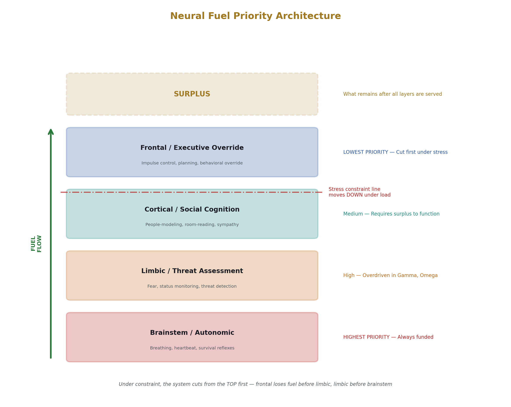
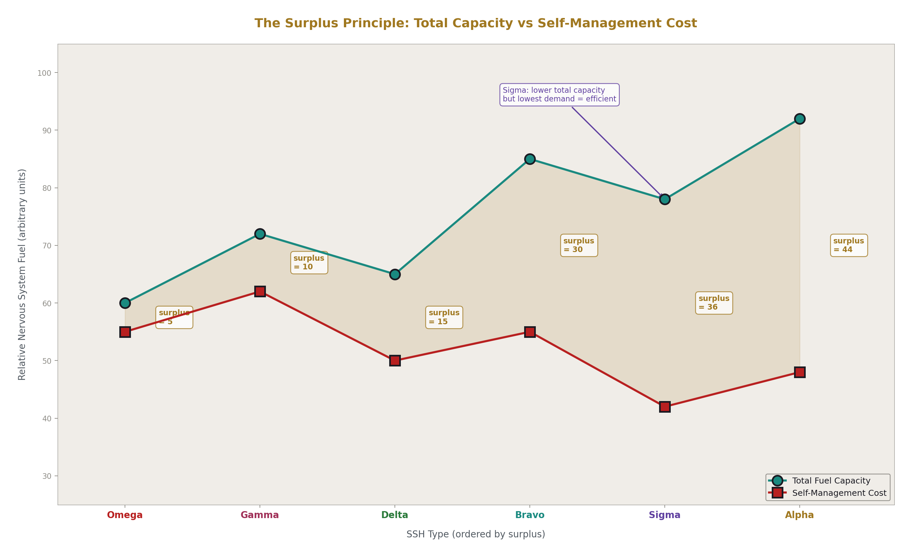
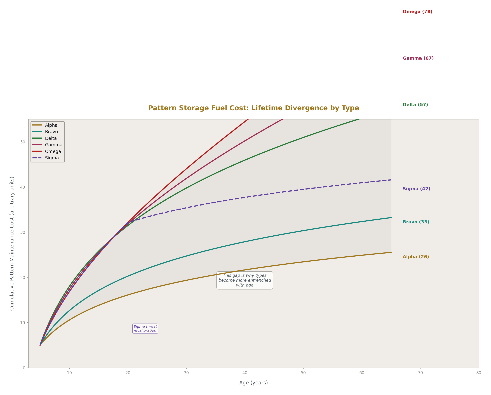
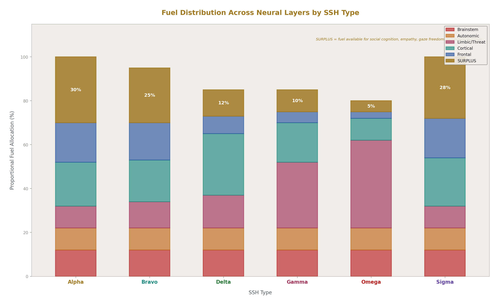
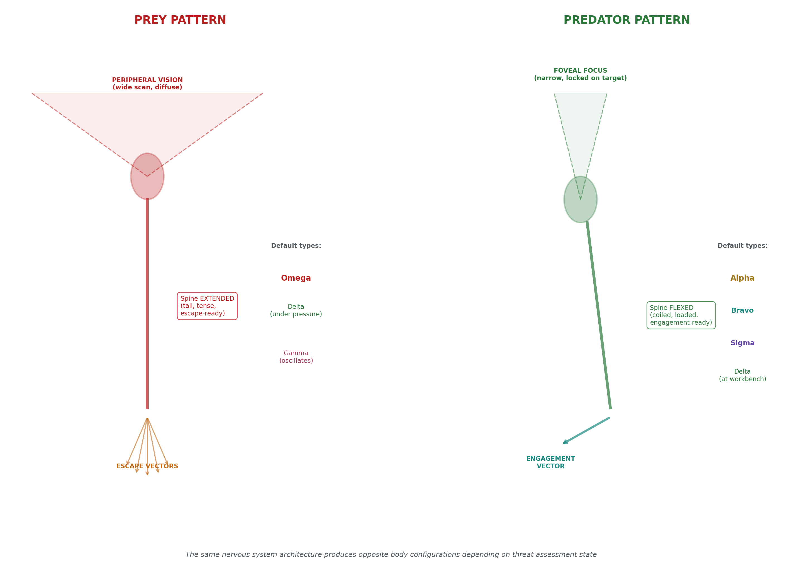
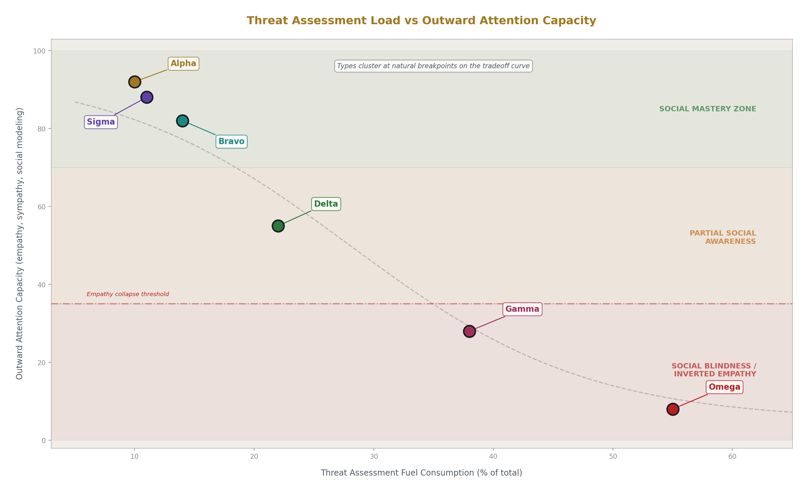
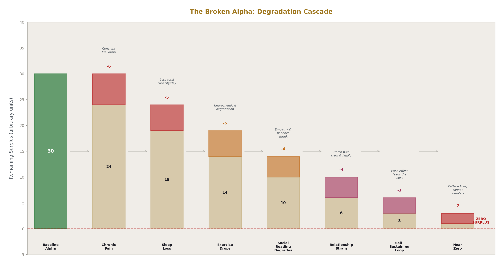
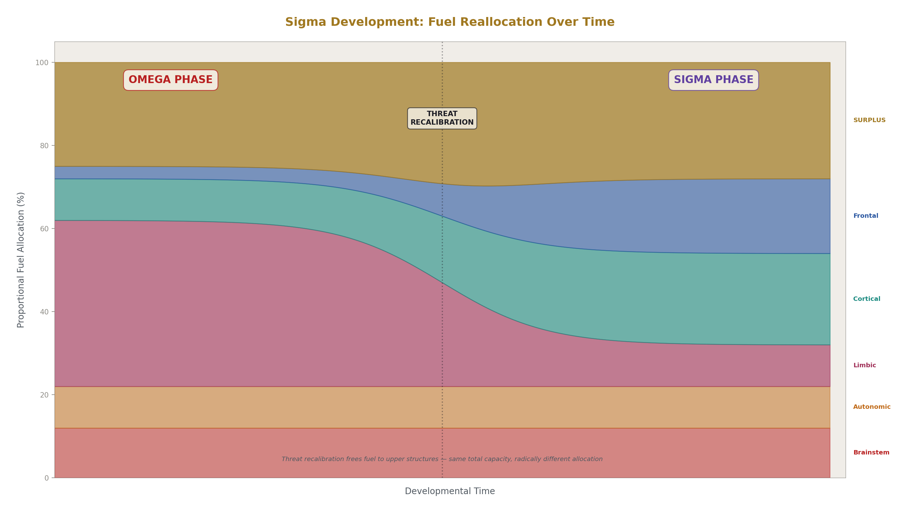

# Fuel and Frame
## Nervous System Resource Allocation as a Contributing Mechanism to SSH Type Formation

**Registry:** [@HOWL-NEURO-2-2026]

**DOI:** 10.5281/zenodo.zzz

**Date:** May 2026

**Domain:** Applied Philosophy

**AI Usage Disclosure:** Only the top metadata, figures, refs and final copyright sections were edited by the author. All paper content was LLM-generated using Anthropic's Opus 4.6. 

---

## 1. Introduction

The Socio-Sexual Hierarchy (SSH) is a predictive behavioral taxonomy for male social and sexual behavior created by Vox Day. It defines seven male behavioral types based on recurring patterns of social interaction, sexual dynamics, and how other people — both male and female — react to those patterns. The SSH is not a personality test, a moral framework, or a status ranking system. It is a prediction engine. It exists because the predictions it makes are recurring and stable across populations.

The SSH defines its types against two axes: social and sexual. The social axis describes how a male interacts with other males in group and hierarchical contexts. The sexual axis describes how a male interacts with females in romantic and sexual contexts and, critically, how females react to him. These two axes give the model its name — socio-sexual — and both are always in play when making predictions.

Of the seven defined types, this paper examines six: Alpha, Bravo, Delta, Gamma, Omega, and Sigma. The seventh type, Lambda, describes males whose sexual behavior is directed toward other males. Lambda is excluded from this analysis not as a value judgment but because its inclusion would break the comparison framework. The other six types are defined against male-female sexual dynamics in which female preferences — for time, resources, status, excitement, safety — create one prediction axis, and male social behavior creates the other. Lambda introduces entirely different behavioral axes and response dynamics that would expand the argument without clarifying it. A separate analysis with its own comparison framework would be required to address Lambda adequately.

The taxonomy covers approximately 45% of humanity — the heterosexual male population — and is scientific in the predictive sense. The types exist because the behavioral clusters they describe are stable and recurring. If deltas did not reliably exhibit task-focus at the expense of social awareness, there would be no delta category. If gammas did not reliably reframe failures as intended outcomes, there would be no gamma category. The labels survive because the patterns recur, and the patterns recur because something is generating them consistently.

This paper proposes one contributing mechanism for that consistency: nervous system fuel allocation. The human nervous system distributes metabolic resources according to a priority hierarchy, funding survival-critical lower structures first and higher cognitive structures with whatever remains. This paper argues that the distribution profile — how much fuel reaches the upper structures after lower-level demands are met — maps cleanly onto the behavioral clusters the SSH describes, and that differences in this distribution profile contribute to the formation and stability of the six examined types.

This is explicitly proposed as a contributing factor. Fuel allocation is not claimed as the sole or complete explanation for SSH type formation. Genetic factors, developmental environment, accumulated experience, neurochemical profiles, and other mechanisms almost certainly contribute. But the fuel allocation model provides a parsimonious framework that explains several key SSH phenomena: why the types form as distinct clusters rather than a continuum, why they are stable over time, why they revert under stress, and why they can be partially modified through deliberate training.

---

## 2. The Socio-Sexual Hierarchy — Type Definitions

Each type is defined here across three dimensions: behavioral pattern (what the type does), social prediction (how other males react), and sexual prediction (how females react). These definitions reflect Vox Day's taxonomy as the authoritative source.

### 2.1 Alpha

The alpha expects to lead. This is not a decision but an operating assumption. He enters social situations expecting to set the frame, and most people allow it because the behavior is natural and confident.

**Behavioral pattern.** The alpha is a master of social situations. He reads people accurately and instinctively understands group dynamics. He is comfortable making decisions quickly, though decision comfort says nothing about decision quality — quality is a function of intelligence, experience, and personality, all of which are orthogonal to SSH type. He protects everyone in his group, including weaker members, but will also pressure weaker members — particularly omegas — because he reads them accurately and recognizes that an unmanaged omega will say and do things that fracture group cohesion. The alpha enforces a contract he likely is not conscious of making: group membership includes protection, but also the obligation not to cause problems. How roughly or gently the alpha enforces this is a function of individual disposition, which is orthogonal to type. Some alphas are gentle managers, some are bulldozers. The dominance pattern is the constant; its expression varies.

**Social prediction.** When two alphas occupy the same social space, they collide — testing, competing, pushing — until one submits to the other's frame or leaves. There is no stable two-alpha equilibrium within a single frame. Other males defer to the alpha's frame-setting naturally. The alpha's social mastery means he can lead without being a tyrant, though some alphas are tyrannical — again, disposition, not type.

**Sexual prediction.** Almost every heterosexual woman finds the alpha attractive. On dating platforms, the alpha has no difficulty generating casual sexual encounters — it is essentially his choice. In conventional dating through to marriage, women are maximally available. Married women will sometimes offer themselves to an alpha given the opportunity, because their existing partner does not provide what the alpha represents. Alphas are almost always married to attractive women. They may cheat on their wives, often with less attractive women, because infidelity for the alpha is driven by availability and impulse rather than upgrading. Risk tolerance is high.

**Stress behavior.** Under stress, the alpha's natural patterns become more visible rather than different. Learned moderation and collaborative behavior strip away, and the core pattern of expecting to lead and managing people through social mastery reasserts.

**Amorality.** An alpha may build a successful company, lead one to failure through bad decisions, or steal from it. All are alpha-pattern outcomes at different frequencies. Being an alpha does not make someone good or bad. The label describes social and sexual mechanics, not moral character.

### 2.2 Bravo

The bravo seeks an alpha. When he finds the right one, he serves that specific alpha. This is called bravo, not beta — the terminology matters because "beta" carries cultural connotations that misrepresent this type.

**Behavioral pattern.** The bravo leads the people under the alpha. The alpha faces outward and operates as a full alpha in the world. The bravo faces inward and ensures the alpha's will is carried out across the group day to day. He does not merely execute tasks — he leads the troops under the alpha's direction. He studies his alpha, learns the alpha's patterns, priorities, and blind spots, and begins filling gaps before being asked. He tries to understand what the alpha wants so he can execute both what the alpha says and what the alpha doesn't say. The bravo can lead. He is a competent leader. But he prefers to operate under an alpha, and when the alpha is absent — leaves, dies, moves on — the bravo can experience decision hesitation. He functions, but there is a persistent low-grade discomfort without an alpha to orient toward. He may seek a new alpha to align with before he feels fully settled.

**Social prediction.** Other males respect the bravo's competence and position. The bravo is often stricter than the alpha in enforcing standards because his role is enforcement and maintenance of the alpha's will. He does not generate the same collision dynamic that alpha-alpha contact produces.

**Sexual prediction.** Bravos are very successful with women. They project competence, loyalty, and purpose without the constant dominance-collision energy of the alpha. They usually have attractive wives. Their relationships tend to be more stable than alpha marriages.

**Archetypal example.** In the film Top Gun, the character Goose is a bravo who sees the character Maverick (a sigma) as his alpha. Goose serves Maverick's mission, anticipates his needs, backs his plays, and is most functional and happy in that role. The bravo does not require his alpha to be a traditional hierarchy-leading alpha — he needs someone whose frame he can operate within.

### 2.3 Delta

Deltas are the majority of the male population. Civilization runs on them.

**Behavioral pattern.** The delta is competent, job-focused, and dedicated. He focuses on one thing at a time to the exclusion of other things and must be managed accordingly — the last thing he hears becomes his mission. He is competent at everything he cares about and is loyal to his employer and his wife. He is results-focused but only on his own work, not on others' work. This makes deltas poor managers. Promote a strong delta performer to a management role and he will convert management into personal task execution — doing the work himself rather than optimizing the team, reading people, or having difficult performance conversations. Managing others does not register as "the work" in the way that direct competence execution does.

**Social prediction.** Deltas are reliable and valued in structured environments. They take direction well and execute competently. They do not generate conflict or competition within hierarchies. They are the backbone of any functioning organization or society.

**Sexual prediction.** Many women do not fully appreciate deltas because they are stable but not exciting. The social relationship is solid but the sexual dynamic often lacks the intensity that generates desire. The delta is not higher-status in the way that creates excitement. He is perceived as boring and stable, which is valuable but not attractive in the way alphas and bravos are attractive. Deltas sometimes get cheated on if the wife encounters a higher-status male, because the delta does not provide excitement or the sense of threat. He is not the partner more likely to leave the relationship, and both partners know this at some level, which shifts the power dynamic.

When a delta's relationship struggles, he responds by working harder — being more reliable, earning more, doing more. This addresses the wrong problem. What is actually needed is leadership behavior: pushing back on tests, holding boundaries, creating productive friction. This would earn his wife's respect because it signals social strength. But this requires comfort with social confrontation, which is precisely what deltas lack. They should try to fix the relationship, but they lack the social awareness that alphas and bravos possess naturally to know how. They default to competence because that is their tool, and they will endure bad relationships out of loyalty, believing harder work will fix things.

### 2.4 Gamma

The gamma is the most internally complicated type and the most likely to generate social conflict without anyone — including the gamma — understanding why.

**Behavioral pattern.** The gamma is social but self-focused. He wants to be right. He wants to hold a higher position than he occupies. He is typically more intelligent than average, generally in the 115-125 IQ range. This is high enough to see that most people are not thinking carefully, but not high enough to appreciate the depth that exists above him. A 140+ person sees depths the gamma cannot follow. The gamma can sense these connections exist but cannot trace them to completion. The 160+ level is visible to the gamma as something real but unreachable. This creates a persistent misalignment: the gamma is the smartest person in most rooms and believes this should confer more status and authority than it does.

He corrects people, gives unsolicited advice, and offers his opinion when it was not requested. He genuinely believes he is helping and is confused when people react negatively. When he feels his position is threatened or perceives a slight — and he takes everything personally regardless of whether it concerns him — he sabotages socially but not physically. He undermines credibility, withholds information, and makes passive-aggressive moves.

**The gamma delusion bubble.** The gamma receives corrective signals from reality constantly — social rejection, exclusion, being pushed out of groups — but these signals never update his self-model. Each negative outcome is reframed through the "secret king" narrative. Being banned from a community was his plan. Losing the argument proved his deeper point. "Secret king wins again" is the internal refrain. The gamma knows something is wrong at a subconscious level — there is a persistent bitterness and unease about his actual status — but rather than examining this discomfort, he redirects. When he encounters someone genuinely above him intellectually, he shifts the axis of comparison to morality: the smarter person is arrogant, cold, or ethically compromised, and the gamma positions himself as superior on this reframed axis. The measurement axis keeps moving to wherever the gamma can claim a win.

**Relationship with rules.** When the gamma is a rule enforcer — moderator, compliance officer, process gatekeeper, HOA board member — rules are sacred and applied rigorously, sometimes punitively, because enforcement gives him legitimate authority over others. When the rule applies to him, he believes his situation warrants exception because he operates at a level above the people the rule was designed for. The double standard is invisible to him. If it is pointed out, that is a personal attack, not a valid observation. Gammas gravitate toward positions with rule-based authority — moderation, HR, regulatory bodies, homeowner associations — because these provide structured power that does not require the social fluency of an alpha or the trust relationship of a bravo. The rules do the heavy lifting, and the gamma wields them.

**Conflict venue-shifting.** When the gamma loses in a domain with concrete outcomes — a physical confrontation, a clear social rejection — he moves the contest to a venue where his tools work. A physical loss becomes a lawsuit. The legal system is the ideal gamma arena: rule-based, mental rather than physical, adversarial without bodily risk, and critically, it uses someone else's power (the court, the state) to force the alpha to comply. The gamma cannot make the alpha submit through any personal channel, but the legal system is a proxy authority that even an alpha must submit to.

**Behavioral meme prototypes.** Four internet memes serve as gamma behavioral archetypes:

"M'lady" — performing chivalry as a transaction, expecting romantic reciprocity for courteous behavior, blaming women for not appreciating good men when the transaction fails.

"While you were partying, I studied the blade" — reframing social exclusion as a superior choice. The bitterness is embedded in the structure — the gamma knows what he missed — but it is instantly converted to a superiority narrative.

"Source?" — not genuine inquiry but a dominance move disguised as intellectual rigor, dragging the interaction onto a formal axis where credentials and citations matter because the gamma cannot win the social frame. It also functions to shut down someone speaking from valid experience or pattern recognition that the gamma senses is real but cannot match, by demanding translation into a format he can attack.

"Well, actually..." — the correction reflex. Someone says something slightly imprecise and the gamma cannot let it pass because being the one with the precise answer is his primary status source. The social cost of the correction never registers because the need to be right overrides social awareness.

All four express the same underlying mechanic: status-seeking redirected onto axes where the gamma believes he can win, combined with inability to read or prioritize social feedback.

**Social prediction.** Gammas attack alphas and bravos too persistently to remain in their groups — not through direct confrontation but through social sabotage patterns that are eventually identified. The alpha or bravo pushes the gamma out. Gammas are tolerated in workplaces as specialists where their intelligence is valuable and their social patterns have a limited blast radius. Gammas often end up in proximity to deltas because the dynamic superficially functions — the delta takes direction, the gamma gives it — though neither fully understands what the other is experiencing.

**Sexual prediction.** Many women are repulsed by gamma behavior because it is erratic and can escalate to danger. The gamma has a specific dysfunction in romantic contexts: he develops feelings for a woman and assumes reciprocity. There may be an inverted empathy mechanism at work — a pattern where emotional bonding generates assumed mutual attachment, projecting his own internal state onto the female rather than modeling her actual state. When the woman does not reciprocate, the gamma processes this as a misunderstanding rather than a boundary. This can escalate to stalking behavior — persistent contact, showing up in her spaces, interpreting rejection as something to be corrected. This is not predatory in the way violent aggression is predatory. It is an inability to separate internal emotional state from external reality in this specific domain. Gammas can marry, but the woman frequently selected the gamma more than he pursued her. In the marriage, the woman tends to be in charge. The gamma may or may not be aware of this dynamic.

### 2.5 Omega

The omega is not at the bottom of the hierarchy. He is outside of it.

**Behavioral pattern.** The omega is anti-social. He is not invited to things and does not want to go. The defining internal posture is the expectation of being hit — not necessarily physically, but socially. He expects rejection, mockery, and exclusion, and preempts it by not engaging, not showing up, and not following the social rules that would make him visible. Hygiene and personal care sometimes deteriorate because maintaining appearance is a social behavior and the omega is not participating in the social system that rewards it. Communication is poor because communication develops through social practice he has not had.

The omega does not perceive where the boundary between acceptable and disruptive behavior falls. Without management, he will say and do things that fracture group cohesion — not maliciously, but because the social awareness that tells other types "don't say that here" is absent or weak.

**The omega risk.** The omega is not day-to-day volatile. He absorbs and stores. When whatever was holding him together finally breaks, the release is disproportionate to the triggering event — it is proportional to everything accumulated. The film Office Space provides the archetype in the character Milton: mumbling, ignored, pushed to progressively worse conditions, enduring with a low simmer, until a breaking point produces a catastrophic response.

**Functional niches.** Omegas are not universally dysfunctional. Some have niche spaces — a specific interest group, an online community, a hobby — where they function well because the social rules are narrow, explicit, and understood. They can have small close friend groups, usually with other omegas or gammas, where interaction patterns are familiar and safe. Within these niches they can be knowledgeable, generous, and engaged. This does not generalize to broader social contexts.

**Social prediction.** Omegas are managed by alphas who see them accurately. The alpha pressures the omega into compliance, which looks harsh but serves a functional purpose: the omega gets group membership and protection, the alpha gets a non-disruptive group member. Omegas are more likely to cluster with gammas, sharing outsider status for different reasons and tolerating each other's patterns.

**Sexual prediction.** Omegas are mostly celibate by outcome, not ideology. The combination of poor social skills, low status signals, and sometimes poor self-care renders them invisible to most women. An omega who puts deliberate work into basics — hygiene, communication, social participation — can find a partner, but the underlying patterns are managed, not eliminated. The partner must be someone who can handle the patterns long-term, which significantly limits the available pool.

### 2.6 Sigma

The sigma operates outside the hierarchy by choice and disposition. He does not seek group leadership, does not want to maintain a dominance position, and does not need group validation.

**Behavioral pattern.** Vox Day has described the sigma as like a late-blooming omega. The sigma started in omega territory — off the hierarchy, outside the social structure — but developed the capability to produce alpha-level outcomes when he chooses to engage. He clashes with institutional hierarchy because he does not accept frames imposed on him, but he does not seek to replace them with his own frame the way an alpha does. He engages with social structures when he chooses and disengages when he doesn't. He is solo mission oriented, where the alpha is pack mission oriented.

**Social prediction.** People often treat the sigma as if he were an alpha because his behavioral outputs — steady gaze, stable posture, comfort with friction, social competence — match alpha signals. The alpha may read the sigma's signals as a dominance challenge because the alpha's system codes all peer-level sustained signals as dominance probes. But the sigma is not sending challenge. He is not competing on the hierarchy. This creates a slightly unresolved interaction that is uncomfortable for the alpha, whose system wants every dominance-relevant encounter to resolve into submission or departure.

**Sexual prediction.** The sigma occupies a unique sexual niche. He produces the same hardware signals that make alphas maximally attractive to women — the female nervous system evaluates him and receives the same readings of resource, capability, and safety. But unlike the alpha, the sigma is not the social center. He does not have a pack orbiting him, he is not holding court, he is not the person everyone in the room is tracking. He can be present and then not present and nobody notices the transition. This low social visibility combined with alpha-quality signals makes the sigma optimally suited to female short-term sexual strategy. A woman pursuing a short-term encounter with a high-quality male faces detection risk if that male is an alpha, because the alpha is always being watched. The sigma provides the same genetic quality signal with dramatically lower detection risk. Both parties' systems are aligned toward the same interaction structure: high intensity, low visibility, low ongoing social obligation.

**Archetypal example.** Maverick in Top Gun. Operates outside the institutional hierarchy, clashes with formal authority structures, produces top-tier results when engaged, does not seek to build or lead a permanent group. His bravo (Goose) attaches to him as to an alpha, demonstrating that the bravo does not need his alpha to be a traditional hierarchy leader — he needs someone whose frame he can operate within.

---

## 3. Core Principles of the SSH

Before introducing the proposed physiological mechanism, the operating rules of the taxonomy must be established. These principles govern how the SSH is applied and constrain what the model does and does not claim.

**Predictive, not prescriptive.** The SSH predicts what behavioral patterns will emerge and how others will react. It does not prescribe what should happen or assign value to outcomes.

**Amoral.** No SSH type is inherently good or bad. All types can be prosocial or antisocial. A loyal delta father may contribute more to society than a charismatic alpha who destroys relationships. The model does not evaluate this. It predicts patterns.

**Dual hierarchy.** The SSH measures position on two axes — social and sexual — which are related but not identical. A male may hold different effective positions on each axis.

**Two prediction modes.** The SSH supports two simultaneous predictions: what the individual will do (based on type), and how others will react to him (with male and female reactions predicted separately).

**Suppression and reversion.** All types can suppress their natural patterns through discipline and conscious effort. Under stress, failure, emotional pressure, or crisis, individuals revert to their natural type patterns. The longer or more intense the pressure, the more completely the natural pattern reasserts. Learned behavior is an overlay, not a replacement.

**Situational performance.** People can step into roles that do not match their natural type and learn to perform them competently. This is distinct from being that type. A delta can learn to lead teams effectively through studied understanding of what leadership requires, without possessing the alpha's natural drive to create and lead groups. The performance is real and functional but is engineered rather than instinctive, and the distinction becomes visible under stress.

**Fractal structure.** The hierarchy reproduces at any group scale and within any type composition. A group composed entirely of gammas will still produce an internal hierarchy where one gamma functions as the alpha of that group — he critiques, redirects, holds the group together, and the others accept his frame. He is not an alpha in the broader SSH model, but he occupies that functional role within the local context.

**Disposition is orthogonal.** How a type expresses — gently, harshly, kindly, cruelly — is a function of individual personality, not SSH type. The type defines the pattern; disposition defines its texture.

**Health is pattern completion.** When the body and circumstances allow the type's pattern to complete its natural circuit, the type functions. When they cannot — through injury, illness, loss of platform, or circumstantial change — the unresolved pattern energy produces blowback. Labels do not determine health any more than they determine morality. They determine the pattern, and health is whether the pattern can complete.

---

## 4. The Fuel Allocation Model

### 4.1 Nervous System Resource Hierarchy

The human nervous system distributes metabolic resources according to a structural priority. Lower structures — brainstem, autonomic regulation centers, basic survival circuits — are fueled first because they maintain life. The general direction of priority is bottom-to-top (brainstem through cortex to neocortex) and back-to-front (cerebellum through parietal and temporal regions to frontal cortex).

Under conditions of abundant total fuel, all levels receive adequate resourcing. Under constraint — whether from reduced supply (poor sleep, poor nutrition, illness) or increased demand (chronic pain, sustained threat, emotional crisis) — the system cuts from the top first. Frontal executive function loses fuel before limbic processing does. Limbic processing loses fuel before autonomic regulation does. Autonomic regulation loses fuel before brainstem survival functions do. This is not a choice the system makes. It is a structural priority built into the architecture of the nervous system. The system is conservative and survival-oriented: it will always sacrifice higher cognition before it sacrifices breathing.

### 4.2 The Surplus Principle

After self-management costs are met — survival functions, autonomic regulation, threat assessment, emotional baseline processing — the remainder is surplus. Surplus is what funds everything that makes a human socially functional beyond basic survival:

- Social cognition: the ability to model other people's states, intentions, and likely reactions
- Sympathy: the ability to understand that another person has a situation
- Empathy: the ability to feel another person's situation, allowing their state to affect your own internal state
- Impulse regulation: the ability to consciously override automatic behavioral patterns
- Long-term planning: the ability to model future states and act on them rather than reacting to immediate stimuli
- Conscious behavioral override: the ability to suppress natural type patterns through deliberate effort

The capacity for outward attention — looking beyond one's own internal state to perceive and model others — is a direct function of available surplus. When a person has abundant resources after self-management, they can afford to look outward. When a person does not have enough resources to manage their own internal state, outward attention is restricted because the system cannot afford to allocate resources to modeling others when it is failing to manage itself.

This principle is mechanical, not moral. The person with low surplus is not choosing to be self-focused. Their system is rationing a scarce resource according to structural priority, and outward attention is expensive enough that it gets cut when resources are constrained.

### 4.3 Threat Assessment as Fuel Consumer

Threat assessment is one of the most significant fuel consumers in the nervous system. Once activated, it runs continuously, scanning the environment for signals that match stored threat patterns. This process is expensive because it requires monitoring multiple sensory channels simultaneously, comparing incoming data against stored patterns, and maintaining readiness to trigger defensive responses.

The prey-predator distinction provides a useful framework for understanding threat assessment fuel costs. An organism running prey pattern is in a high-fuel-consumption state: peripheral vision is engaged to maximize detection area, the body is maintained in escape-ready posture (spinal extension), and the visual system is scanning the entire environment simultaneously because the threat could come from any direction. This is expensive because it is processing everything at once.

An organism running predator pattern is in a comparatively fuel-efficient state for social purposes: foveal vision is engaged on a single target, the body is maintained in engagement-ready posture (spinal flexion), and resources are concentrated rather than distributed. The system is processing one thing deeply rather than everything broadly.

Types whose baseline nervous system state runs closer to prey pattern — constant environmental scanning, escape readiness, diffuse attention — consume more fuel on threat assessment and have less surplus available for higher functions. Types whose baseline state runs closer to predator pattern — targeted attention, engagement readiness, focused processing — consume less fuel on threat assessment and have more surplus available.

### 4.4 Pattern Storage as Cumulative Fuel Load

Lived experience writes reactive patterns into the nervous system. A sensory input that was paired with a significant outcome — pain, pleasure, social reward, social punishment — creates a stored pattern that will activate when similar input is detected in the future. The pattern activates before conscious processing intervenes, generating a behavioral response that reflects the stored outcome rather than the current situation.

Critically, the same experience writes different patterns depending on the hardware receiving it. A rejection at age 15 writes a different pattern on an alpha-baseline system (tactical update, adjust approach) than on an omega-baseline system (confirmation of social danger, increase threat surveillance). The hardware filters the experience, and the pattern that gets stored reflects both the event and the system that processed it.

Over time, accumulated patterns add to baseline fuel demand. Each stored threat pattern requires monitoring fuel to maintain readiness — the system must continuously check incoming sensory data against the stored pattern to determine if the threat is present. A person with a small number of stored threat patterns has a low monitoring cost. A person with thousands of stored threat patterns from years of social pain, rejection, and failure has a high monitoring cost that runs continuously and consumes fuel that would otherwise reach higher structures.

This is why types become more entrenched over time. Each year of lived experience adds pattern storage that increases the fuel demand characteristic of that type. The alpha's patterns are mostly tactical updates that cost little to maintain. The omega's patterns are densely layered threat associations that cost enormously to maintain. By adulthood, the accumulated pattern storage functions like hardware — it runs automatically, is triggered by environmental input before conscious processing, and is deeply resistant to modification. The deep patterns and the original hardware configuration become functionally indistinguishable, which is why SSH types are stable and predictive even though they are ultimately built from the interaction of biology and experience.

---

## 5. Fuel Allocation by Type

### 5.1 Alpha

The alpha's fuel picture is characterized by high total supply relative to demand, producing large surplus.

Survival and autonomic layers are adequately fueled without being overdriven. Threat assessment runs but does not dominate the fuel budget because the alpha's baseline does not include chronic ambient social threat. His system is not spending significant resources on threat surveillance because social environments do not register as dangerous at the hardware level.

This leaves substantial fuel reaching cortical and frontal structures. Social cognition is fully resourced — the alpha can model other people, read group dynamics, build accurate representations of what others are experiencing and likely to do. This is why the alpha is a master of social situations: the neural systems that support social mastery are running on full fuel.

Frontal executive function is fully online. Impulse regulation is available when the alpha chooses to use it, long-term strategic thinking is accessible, and conscious override of automatic patterns is possible. The alpha doesn't always use these capacities — disposition determines whether he moderates himself — but the fuel is there.

The behavioral expression of this fuel state is the alpha's characteristic effortlessness. Relaxed predator posture, free gaze that can be directed anywhere without involuntary aversion, comfort with all social situations, the ability to look outward and model others from abundance rather than deficit. He can afford sympathy because understanding someone else's situation costs fuel he has. He can afford empathy — actually feeling someone else's state — because allowing external input to affect his internal state is only safe when the baseline is stable and well-resourced. His baseline is stable and well-resourced. He can lead without tyranny because he can actually see his people, model their individual states, and calibrate his pressure accordingly. This is not kindness as strategy. It is a nervous system with enough free capacity to model people accurately and respond with appropriate nuance.

### 5.2 Bravo

The bravo's fuel picture is similar to the alpha's but with one additional constant demand: the alpha-orientation monitoring process.

The bravo's system runs a background process that continuously tracks his alpha's state, intent, needs, and direction. This is not an acute process that activates and deactivates — it is always running when the bravo has an alpha, because the bravo's entire operational orientation depends on receiving and interpreting signal from his alpha. This process is not enormously expensive, but it is constant, and it draws from the same total fuel supply.

The result is strong cortical and frontal resourcing with marginally less surplus than the alpha after accounting for the orientation cost. Social cognition is strong — the bravo reads people well and leads effectively. But slightly less surplus means slightly less capacity for the nuanced, case-by-case social modeling that allows the alpha to calibrate his management to each individual. This is why the bravo is often stricter than the alpha. Strictness is the efficient default when you have slightly less fuel for nuanced individual assessment. Rules applied consistently cost less processing fuel than rules applied with individual calibration.

When the alpha is absent, the orientation process continues running but receives no signal. The system is searching for input that is not there, consuming fuel on a process that cannot complete. This is the fuel basis of the bravo's decision hesitation without an alpha. The fuel is being spent on a monitoring loop that returns nothing, draining resources that would otherwise support independent decision-making. The bravo can function without his alpha — he has enough total capacity — but there is a persistent inefficiency in the system that manifests as discomfort and slower decision commitment.

### 5.3 Delta

The delta's fuel picture is characterized by moderate total supply with a distinctive allocation pattern: disproportionate cortical fuel flow to task-focused processing.

The delta's system channels fuel toward deep engagement with his competence domain. Whatever he is focused on — his engineering work, his carpentry, his accounting — receives heavy fuel allocation. This is why deltas are excellent at their work. The cortical regions supporting task execution are well-fueled and deeply practiced.

The cost is that social cognition receives less. The delta is not socially incompetent — there is enough fuel for basic social operation in normal conditions. But there is insufficient surplus for the kind of real-time social modeling that alphas and bravos perform naturally. The delta cannot dynamically reallocate under social pressure because the task-focus fuel pathways are deeply established. When social demand spikes — a wife's emotional distress, a management challenge requiring people-reading — the fuel doesn't redirect to social processing. It keeps flowing to the task circuits because those pathways are where it has always gone.

Frontal resourcing is adequate for task planning but insufficient for social override and leadership friction. The delta cannot push back on his wife's tests, hold a social boundary, or create productive friction, because these behaviors require frontal resources allocated to social confrontation — a domain his system has never prioritized for fuel. He solves social problems with competence tools because competence is where the fuel goes. He works harder, earns more, does more around the house, and none of it addresses the social and sexual dynamic that is actually failing, because addressing that dynamic would require fuel in neural circuits that are chronically underserved.

### 5.4 Gamma

The gamma's fuel picture is perhaps the most instructive case for the fuel allocation model, because it demonstrates what happens when genuine cognitive capability is undermined by demand-side fuel diversion.

The gamma's total fuel supply is moderate to moderately high. The 115-125 IQ range indicates real cortical hardware — the processing capability exists. But the demand side is where the problem lives. The gamma's limbic system is overdriven. Status anxiety, self-referential processing, constant internal monitoring of position relative to others, and the ongoing computational cost of maintaining the delusion bubble all consume disproportionate fuel at the limbic and lower cortical levels.

The cortical hardware is capable but fuel-starved relative to its potential. The intelligence is there but cannot be deployed effectively because the fuel that would power the gamma's best thinking is being consumed by emotional and status processing in lower structures. The gamma is smart but underperforms his own capability, and this gap — which he can sense but cannot explain — feeds the status anxiety that is consuming the fuel in the first place. A self-reinforcing cycle.

There is one exception to the cortical fuel starvation: when status is directly on the line in a mental conflict, the limbic urgency temporarily drives fuel toward the cortical regions handling the conflict. This is why the gamma can be sharp and effective in argument despite general dysfunction. The fuel flows toward threat and status because that is what the limbic system is demanding. The gamma in an argument is not operating from surplus — he is operating from limbic emergency allocation, which is intense but narrow and unsustainable.

Frontal executive function is chronically underfueled. This is why the gamma cannot stop himself from correcting people, offering unsolicited advice, or engaging in the social sabotage patterns he might intellectually recognize as counterproductive. The override system does not have enough fuel to restrain what the limbic system is driving. He knows he shouldn't say it. He says it anyway. Not from choice, but from the frontal circuits lacking the fuel to veto what the limbic circuits are initiating.

### 5.5 Omega

The omega's total fuel supply may be adequate in absolute terms, but the demand from chronic threat surveillance consumes almost everything.

The survival and limbic layers take an oversized share of total fuel because threat assessment is chronically activated. This is not acute crisis — it is persistent, low-grade alarm that never fully resolves. The "always expecting to be punched" state is expressed in fuel terms as a constant high-cost monitoring process that scans all social channels for danger signals. This process runs during every social interaction, consuming fuel continuously.

What reaches cortical structures after this demand is met is severely limited. Social cognition is underfueled — the omega cannot model other people's reactions, cannot predict the impact of his words on group cohesion, cannot read the room. These are not skill deficits in the conventional sense. They are fuel deficits. The neural systems that support social modeling exist but do not receive enough fuel to operate.

Frontal function is similarly underfueled. Hygiene slips because maintaining personal appearance is a planned behavior that requires frontal initiation — you have to decide to shower, decide to do laundry, decide to groom. These decisions require frontal fuel that is not available because it has been consumed downstream. Self-care degrades not from indifference but from a system that cannot allocate resources to frontal-mediated maintenance behaviors.

In niche safe environments — a specific interest group, an online community, a familiar hobby space — the fuel picture changes temporarily. The threat load drops because the social rules are narrow, explicit, and familiar, and the system is not scanning for danger in an environment it has learned is safe. When the threat load drops, fuel reaches cortical structures, and the omega becomes knowledgeable, engaged, and sometimes impressive within that narrow domain. This does not generalize because the fuel is only available when the threat load decreases, and the threat load only decreases in these specific controlled contexts.

### 5.6 Sigma

The sigma's fuel picture is the most developmentally complex because it reflects a transformed state rather than a baseline.

The sigma's system was once running an omega fuel pattern. Most resources were consumed by threat surveillance, leaving minimal cortical surplus. But something shifted in development — individual achievement, intellectual maturation, some process that provided the system with evidence that it could handle the environment without constant surveillance. The threat assessment recalibrated downward. As the threat load decreased, fuel became available to upper structures that had been starved.

The sigma reached alpha-level cortical and frontal resourcing through a different path than the alpha. The alpha's system was always abundantly supplied — his fuel allocation developed under conditions of plenty. The sigma's system developed under scarcity. It learned to allocate efficiently because there was no margin for waste. The sigma's fuel pathways are more efficient than the alpha's, not because the sigma is superior, but because efficiency is what scarcity teaches.

The surplus flows differently than the alpha's. The alpha's surplus naturally flows to social management — reading the group, maintaining relationships, managing hierarchy — because his system developed in social contexts where group management was rewarded. The sigma's surplus flows to mission-oriented processing because his fuel pathways were laid down during the omega period when social engagement was a cost, not a benefit. The system learned that social channels drain fuel and individual channels conserve it, and those pathways persist even after the threat load has receded.

The practical result is alpha-equivalent total cortical horsepower with different allocation. The fuel that the alpha spends on group management and social infrastructure is available to the sigma for individual mission execution. Same engine output, different drivetrain. This is why the sigma can match alpha outcomes without building or maintaining a social structure — he is putting all the fuel into the mission and none into the group, because his system never learned to value the group as a fuel investment.

---

## 6. Mechanical Substrates

The fuel allocation model predicts specific observable physical signatures for each type. This section maps those signatures to the fuel framework without overspecifying the biological mechanisms involved.

### 6.1 Eye Mechanics

The eyes are the most visible indicator of nervous system fuel state because they are driven directly by the same systems that manage threat assessment, social cognition, and attentional allocation.

**Gaze capacity** — the ability to sustain eye contact without involuntary aversion — maps directly to threat assessment fuel load. When threat assessment is low (large surplus reaching cortical structures), the gaze is free. The person can look at anyone, hold gaze as long as they choose, and break it when they choose. There is no involuntary aversion signal firing. When threat assessment is high (most fuel consumed by threat monitoring), the eyes are not free. The threat assessment system generates aversion signals that pull the gaze away before conscious processing can intervene. The person does not decide to look away. Their system breaks the contact for them.

The alpha's eyes are free because social situations do not cross his threat threshold. The bravo's eyes are mostly free but will yield against an alpha unless the context is protecting his own alpha, in which case a protective drive overrides the yield signal. The delta's eyes are stable in neutral contexts but lose freedom under hostile social pressure — a wife's angry gaze, a superior's confrontation — because these cross his threat threshold and trigger involuntary aversion. The gamma's eyes are unstable because his system is oscillating between approach (status-seeking) and withdrawal (threat detection), pulling the gaze in competing directions. The omega's eyes break almost immediately in social contexts because his threat threshold is set extremely low and nearly all social eye contact triggers aversion. The sigma's eyes are free but carry no hierarchical signal — he can look at an alpha or not, and his system does not code it as challenge or submission.

**Gaze signaling** — what sustained eye contact means — depends on the type producing it and the type receiving it. Alpha-to-alpha sustained gaze is a dominance probe because both systems code peer-level sustained eye contact as status challenge. Neither fires aversion, so the interaction escalates until one yields or leaves. Alpha-to-sigma sustained gaze may be misread by the alpha as mutual challenge, because the alpha's system codes all peer-level sustained signals as dominance probes, but the sigma's system is not sending challenge — it is simply looking, uninvested in the hierarchical meaning the alpha's system assigns.

**Saccade and blink rate** indicate system load regardless of cause. High internal load produces involuntary eye instability — increased saccades, increased blink rate — because the visual system is being pulled between competing processes. A person under load produces the same eye behavior whether they are lying, experiencing social threat, or simply running high internal processing demand. This means an omega in a normal social situation can display the eye signatures of deception — rapid blinking, gaze instability, saccading — even when being completely honest, because his baseline system load is producing the same signals. Other people read this instinctively as untrustworthiness or weakness.

**Incongruent gaze** is a critical concept for understanding cross-type sexual dynamics. When a person forces intense eye contact (predator-lock signal) while the rest of their system is broadcasting prey-pattern signals (tense posture, shallow breathing, social anxiety leaking through every non-ocular channel), the receiving person's nervous system detects the mismatch. A female receiving intense gaze from a male whose body is broadcasting prey signals cannot resolve the incongruence into a safe category. A relaxed predator is a potential mate. A stressed predator is a threat. Intensity without backing reads as fixation rather than attraction, and the female's system codes it as danger. This is why gaze training must target soft gaze calibrated to actual system state rather than intense gaze that claims a capability the system cannot back up.

**Connection to the cornered animal.** The shifting eyes of a cornered animal before it commits to fight are the same system as the shifting eyes of a person under social threat. The visual system is being driven by the survival circuit, scanning for escape routes or threat resolution options. Each saccade is a query — is that a way out? When the animal commits to fight, the eyes lock on target because the ambiguity has resolved and all resources are allocated to engagement. The alpha's social gaze is analogous to the committed predator — resolved, locked, stable — because his system has resolved the social environment as non-threatening and allocated resources to engagement rather than scanning. The omega's social gaze is analogous to the cornered animal in the pre-commitment scanning phase — the social environment is an ambient threat that never resolves, so the scanning never stops.

### 6.2 Postural Mechanics

Body posture is organized by the same prey-predator system that drives eye mechanics.

Prey posture is built around escape readiness. The spine extends — the body opens up and lengthens because extension is preparation for flight. Peripheral vision dominates because the threat could come from any direction. The body is configured to detect and flee.

Predator posture is built around capture and engagement. The spine flexes — the body coils, compresses, loads energy for the strike. Foveal vision dominates because the target has been identified and maximum resolution on a single point is needed. Extension in a predator is strategic — pulling back to create range for a stronger flexion, the way drawing a bow increases the power of the release.

The alpha's default social posture is predator at rest. Settled height — tall but without the tension of escape readiness. Spinal flexion readiness — the body leans into engagement, orients toward what he is attending to. This posture is not maintained through effort. It is the resting state of a nervous system that is not under threat, which is why it reads as effortless to observers.

The omega's default social posture is prey. Peripheral scanning, spinal extension for withdrawal readiness, shoulders elevated, head pulled back or down, the whole system configured for escape rather than engagement. He looks like prey because his nervous system is running the prey pattern, and other people — both male and female — read this instantly at a level below conscious awareness.

The delta shifts between postures depending on context. At his workbench doing focused competence work — foveal, flexion, predator pattern, locked on his task. In a confrontation with his wife — he tips into prey pattern, peripheral awareness increases, spine extends, gaze breaks, body opens into escape readiness. The shift is involuntary and immediate.

The gamma's posture is characteristically unstable, oscillating between approach and withdrawal, flexion and extension. His system is trying to run predator pattern (he wants to engage, claim status, correct, advise) but keeps being interrupted by threat signals that pull him toward prey pattern (status anxiety, fear of exposure, social danger detection). The body reflects this conflict by shifting between modes, and people read this instability as erratic behavior — because it is, at the postural level.

The bravo runs predator pattern oriented through his alpha. His postural engagement is directed by the alpha's direction. When the alpha is absent, some of this postural organization loosens — the system partially loses its orienting target and the posture becomes less resolved, the physical expression of the decision hesitation he experiences without his alpha.

**Sexual reading of posture.** These postural patterns are read by female nervous systems as part of the mate-viability evaluation. A male in settled predator-at-rest posture signals to the female system: this organism is not under threat, is resourced, can engage rather than flee, and proximity to him is proximity to safety. A male in prey posture signals: this organism is under threat from the environment, cannot protect itself let alone a mate, and proximity does not confer safety. A male in unstable oscillating posture signals: this organism's state is unpredictable, which itself constitutes a threat because unpredictability in a potential mate is dangerous. These readings happen below conscious awareness and inform sexual attraction or repulsion before the female has formed any conscious evaluation.

### 6.3 Conflict Engagement

Conflict preference maps to fuel allocation and pattern-completion mechanics.

**Physical conflict.** The alpha is comfortable with physical conflict because his system does not code physical confrontation as existential threat — it is a resolution mechanism. Two alphas collide physically, someone wins, someone loses, the outcome is concrete and the situation resolves. The bravo is comfortable with physical conflict in service of his alpha. The delta can handle it but does not seek it. The omega avoids it because all confrontation is threat. The sigma can engage on his own terms as part of his mission.

The gamma avoids physical conflict because the outcome is concrete and visible. He cannot reframe being knocked down. The delusion bubble does not function in domains where outcomes are physical and undeniable. However, the gamma can shift the venue after a physical loss — moving the contest to a legal arena where the rules are codified, the conflict is mental rather than physical, there is no risk of a second concrete loss, and the power wielded is someone else's (the court, the state). The gamma's venue-shifting is itself a fuel reallocation: moving from a domain where his pattern fails to a domain where his pattern — intelligence, rule-exploitation, mental argumentation — can function.

**Emotional conflict.** The alpha generally does not engage in negative emotional conflict because it is inefficient — his surplus is better spent on social management than emotional churning. The bravo is similar, with emotional energy oriented toward mission rather than interpersonal processing. The delta does not like emotional conflict because he lacks the tools — his system does not fuel the social processing needed to navigate it, so emotional conflict is pure cost with no path to resolution. The gamma is continuously in emotional conflict, both externally (creating friction through correction, sabotage, status-grabbing) and internally (the unresolved gap between self-image and reality). The gamma is drawn to emotional conflict because outcomes are ambiguous enough for the delusion bubble to operate — you can decide you won an argument in a way you cannot decide you won a fight. The omega is already running internal emotional conflict from accumulated stored pain and cannot take additional emotional load without risking the catastrophic release pattern.

**Mental conflict.** The delta enjoys mental conflict within his competence domain because that is where his fuel flows and his pattern completes. Getting deep into details, debating the right approach to a technical problem, engaging in task-level friction — this is where the delta is resourced and engaged. The gamma enjoys mental conflict because it is an arena where his genuine intelligence provides real capability and where outcomes are ambiguous enough to serve status goals. But the gamma's mental conflict is oriented toward winning rather than toward truth or depth. The exchange is a status tool, not an inquiry tool. The omega may enjoy mental conflict in his niche domain where fuel is temporarily available, for the same reasons the delta does — it is a safe space where his pattern can engage.

### 6.4 Sympathy, Empathy, and Outward Attention

Sympathy — modeling another person's situation — requires surplus to fund outward attention. The system must be able to attend to another person's signals long enough to build a representation of their state. This costs fuel.

Empathy — feeling another person's situation — requires additional surplus because the system is allowing external state information to modulate its own internal state. This is only safe when the baseline is stable and well-resourced, because allowing someone else's emotional state to affect yours when your own state is already unstable risks destabilization.

The alpha has both available from abundance. He can model others (sympathy) and feel their states (empathy) because his system can afford the fuel cost and the stability risk. The bravo has strong sympathy and available empathy, slightly constrained by the fuel cost of the alpha-orientation process. The delta has sympathy available under calm conditions but loses it under social pressure when fuel is reallocated to threat management — he stops being able to model his wife's state precisely when she most needs him to. The gamma has little sympathy because outward attention is restricted by internal processing load, and empathy that is either absent or inverted. The inverted form is critical: the gamma's system cannot afford to build an independent model of another person's emotional state, so it takes a shortcut — it copies the gamma's own state onto the other person and assumes they share it. This is not malice. It is a resource-starved system generating a cheap approximation, and it is the mechanical basis for the gamma's assumption that his feelings for a woman are reciprocated.

The omega has neither sympathy nor empathy available in social contexts because all fuel is consumed by self-management. He cannot model others because he cannot afford to look outward. This is the mechanical basis for his boundary-blindness — he says things that fracture group cohesion not from malice but because the neural systems that would model the impact of his words on others are not receiving fuel.

---

## 7. Dynamic Conditions

The fuel allocation model gains additional explanatory power when applied to changing conditions. If the model is correct, it should predict what happens when the fuel picture changes — and it does.

### 7.1 The Broken Alpha

When an alpha suffers injury, illness, or major circumstantial loss, the fuel picture changes at the most fundamental level.

Chronic pain is a constant nervous system load. It runs during sleep, conversation, decision-making, and every social interaction. The system that was previously allocating surplus to social cognition, empathy, gaze freedom, and relaxed predator posture now diverts a significant constant portion of total capacity to managing the pain signal.

The cascade is predictable from the fuel model. Pain increases baseline demand. Sleep degrades because pain interrupts restorative cycles. Less restorative sleep means less total capacity the following day. Exercise drops because the body cannot perform, removing a mechanism that maintained neurochemical balance — endorphins, testosterone regulation, cortisol clearance. The neurochemical environment degrades, further reducing the fuel available for surplus.

Everything funded by surplus degrades proportionally. Sympathy and empathy shrink because outward attention is increasingly consumed by inward pain management. Patience decreases because patience is the ability to hold space for someone else's processing, which requires surplus. Communication becomes less clear because clear communication requires modeling what the listener needs to hear, which requires building a model of their state, which requires outward attention, which requires surplus.

The alpha's type pattern does not change. He still expects to lead, still reads the room, still moves to set frame. But the pattern cannot complete cleanly because the resources it needs are being consumed by pain management. The pattern fires and fails to complete, and each failure writes a new stored pattern. Where the alpha's pattern storage was previously dominated by tactical successes, it now accumulates incomplete patterns. Over time, this can produce bitterness, aggression, withdrawal, or tyrannical overcompensation in the shrinking domains where the pattern still completes — becoming harsh with family, domineering with people who cannot challenge back.

The effects cascade downstream through the hierarchy. The bravo receives degraded signal from a less-clear alpha and must guess more, check more, compensate more. He may become stricter with those below him to compensate for the uncertainty above. The deltas receive inconsistent instructions — what the alpha said was not what the alpha needed because the alpha lacked the surplus to model what the delta needed to hear — and execute the wrong task competently.

The degradation can become self-sustaining. Each downstream effect — poor sleep, no exercise, strained relationships, harsher interactions — is itself a new source of load. The original injury may heal or stabilize, but if the secondary effects are not addressed, the surplus does not return. The alpha runs alpha patterns on a system that can no longer fund them, and the blowback continues independently of the original cause.

### 7.2 Stress and Reversion

The SSH principle that types revert under stress is directly predicted by the fuel model.

Conscious behavioral override — the ability to suppress natural type patterns through deliberate effort — is frontal-mediated and expensive. It requires sustained fuel allocation to the frontal executive systems, which sit at the top of the priority hierarchy and are the first to lose fuel under constraint.

When stress increases total system demand, the priority hierarchy reallocates fuel downward. Frontal override capacity diminishes first. The learned behavioral overlays — the delta who took leadership training, the gamma who learned to hold his tongue, the omega who practiced social skills — are stored in the more recent, more voluntary pattern layers that depend on frontal fuel to execute. When the frontal fuel is pulled away by stress, these overlays stop functioning.

What remains are the deep patterns — the ones written earliest, reinforced most frequently, and stored closest to the hardware level. These patterns do not require frontal fuel to execute because they are automatic. They are triggered by environmental input and generate behavioral responses without conscious mediation. Under stress, the deep patterns run unopposed because the system that was overriding them has lost its fuel supply.

This is why a delta who learned to be assertive with his wife reverts to appeasement during a financial crisis. The assertiveness was a frontal-mediated learned overlay. The financial crisis increased system demand, fuel was pulled from frontal structures, and the deep pattern — avoid confrontation, work harder, try to fix it through competence — reasserted because it runs on older, deeper, cheaper neural pathways that don't need frontal fuel.

### 7.3 The Sigma Development Path

The sigma's development from omega-like origins to alpha-equivalent capability is a fuel allocation transformation.

The starting state is an omega fuel pattern: chronic threat surveillance consuming most available fuel, minimal cortical surplus, severely restricted outward attention. The system is in permanent defensive allocation, funding threat monitoring at the expense of everything above it.

At some point in development — and the model does not specify what triggers this — the threat assessment recalibrates downward. The system receives evidence, through some combination of individual achievement, intellectual development, physical maturation, or accumulated experience, that it can handle the environment without constant surveillance. The threat load begins to decrease.

As the threat load decreases, fuel becomes available to upper structures. Cortical and frontal systems that were starved begin receiving resources. Social cognition comes online — not through social practice, as it would for a normal developmental path, but through raw fuel availability enabling processing that was previously impossible. The sigma begins to be able to model other people, hold gaze, engage with social situations from something other than defensive scanning.

But the fuel pathways were laid down during the omega period. The system learned to allocate under scarcity and learned that social channels are expensive and often painful. These pathway preferences persist even after the threat load has receded. The sigma's surplus flows to individual mission-oriented processing rather than social management processing because the fuel architecture was built in an environment where individual capability was survival-relevant and social engagement was a cost.

The result is a system with alpha-equivalent horsepower and omega-derived efficiency, directed toward solo mission execution rather than group management. The sigma can match alpha social and sexual outputs when he engages because the fuel is there, but he doesn't maintain the engagement because his fuel architecture doesn't naturally sustain the social channels the way the alpha's does.

### 7.4 Training and Recovery

The fuel model predicts specific training interventions and explains why they work.

**Mirror gaze exercise.** Looking at oneself in a mirror and maintaining eye contact isolates the gaze circuit from social threat. There is no external nervous system evaluating the person, so the threat assessment system is not triggered. The fuel cost of the exercise is minimal because the threat load is minimal. This allows the gaze-sustaining circuits to practice without competing for fuel against active threat monitoring.

If the person cannot hold their own gaze and say something positive to themselves, this is diagnostic. The system is so loaded with negative self-assessment patterns that even the safest possible version of eye contact triggers aversion. This reveals the depth of the stored patterns and provides a measurable baseline.

As the hold duration increases and positive self-address becomes tolerable, the system is writing new patterns. Each repetition in which sustained eye contact plus positive speech did not result in punishment weakens the association between eye contact and threat. Consistency matters more than intensity — a thousand brief comfortable holds write more corrective pattern storage than one forced stare that puts the system back into threat mode and reinforces the association the exercise is trying to weaken.

**Soft gaze versus intense gaze.** Soft gaze with slightly longer holds is the correct training target because it is honest signaling matched to actual system state. It communicates that the system is becoming more comfortable without claiming predator-lock capability that the rest of the system cannot back up. Intense gaze from a system broadcasting prey signals everywhere else triggers incongruence detection in observers, particularly females, whose nervous systems code the mismatch as danger rather than attraction.

**Behavioral reduction.** Stopping surplus-draining behaviors — constant helping, unsolicited advising, correcting, opinion-giving — serves a direct fuel purpose. Each of these behaviors is a surplus expenditure aimed at extracting a social return (attention, acknowledgment, status, gratitude). The expenditure is real. The return is minimal or negative because other people's nervous systems read the need underneath the help, which registers as demand rather than generosity.

Stopping these behaviors allows surplus to accumulate. The fuel that was being spent on social performance stays in the system. Anxiety decreases because there are fewer interactions to run threat assessment on. Sleep may improve slightly because social processing load decreases. The system starts each day incrementally less depleted.

Over time, actual surplus develops. With surplus comes the capacity for genuine outward attention — modeling others from resource rather than from deficit. Other people's nervous systems read this difference immediately. Help offered from surplus feels completely different from help offered from deficit, even when the actions are identical, because the signals accompanying the behavior are different. One broadcasts capability and safety. The other broadcasts need and demand.

**Training sequence.** The order matters because each step creates the conditions for the next. Gaze training first, because it targets the most fundamental social circuit at minimal fuel cost. Behavioral reduction second, because it stops the surplus drain and allows accumulation. Genuine social engagement third, from accumulated surplus, which produces honest signals that other people's nervous systems accept rather than reject.

---

## 8. Limitations and Open Questions

This model is proposed as a contributing explanatory mechanism, not a complete account of SSH type formation. Several significant limitations and unresolved questions must be acknowledged.

**Origin of fuel supply differences.** The model does not specify the biological basis of initial differences in total nervous system fuel supply or threat assessment baseline. Whether these are primarily genetic, epigenetic, developmental, nutritional, or some combination is not addressed. The model takes the observed differences as given and maps their downstream effects.

**The sigma trigger.** The model does not explain why some omegas develop into sigmas and most do not. Something recalibrates the threat assessment system downward, but what that something is — a specific achievement, an accumulation of capability, a neurochemical shift, a cognitive reframe — is unspecified. This is a significant gap because the sigma development path is one of the model's most distinctive predictions.

**Female SSH equivalents.** This paper addresses only male types. Whether the fuel allocation framework would apply to female behavioral clusters, and what those clusters would look like, is entirely unaddressed. Female nervous systems operate with different hormonal environments, different baseline neurochemical profiles, and different evolutionary pressures. The fuel model might apply in principle but would require its own analysis.

**Neurochemical specifics.** The relationship between fuel allocation as described here and specific neurochemical systems — dopamine, serotonin, testosterone, cortisol, oxytocin, vasopressin — is not specified. These systems likely interact with and modulate the fuel picture in significant ways. Testosterone may contribute to baseline threat threshold. Cortisol dynamics may mediate the chronic threat load. Dopamine may influence which activities receive preferential fuel allocation. Oxytocin dynamics may underlie the gamma's inverted empathy pattern. These are plausible connections but mapping them in detail is beyond this paper's scope.

**The fractal property.** The SSH's fractal nature — the hierarchy reproducing within any stable group regardless of type composition — may require additional mechanism beyond fuel allocation to explain. Why a group of gammas produces a gamma who functions as local alpha, and what changes in that gamma's fuel picture when he occupies this role, is not fully addressed by the model as presented.

**Type change.** The model predicts type stability and stress-reversion but does not fully account for genuine type change if it occurs. Can a delta become an alpha through sustained circumstances that change his fuel picture, or are the deep patterns and original hardware configuration too entrenched for true type transformation? The model leans toward the latter — that deep pattern storage becomes functionally equivalent to hardware by adulthood — but this is a prediction that could be wrong.

**Measurement and falsifiability.** For the fuel allocation model to move from explanatory framework to testable hypothesis, operationalized metrics for nervous system resource distribution are needed. Functional neuroimaging, autonomic nervous system measurement, cortisol and neurochemical profiling, and eye-tracking data could all potentially provide measurable correlates of the fuel states described here. Until such measurements are developed and applied, the model remains explanatory rather than empirically validated.

---

## 9. Conclusion

The Socio-Sexual Hierarchy provides a predictive behavioral taxonomy with six applicable male types — Alpha, Bravo, Delta, Gamma, Omega, and Sigma — that produce recurring, stable predictions about social and sexual behavior. The taxonomy is scientific in the predictive sense: it exists because the predictions work, and the predictions work because the behavioral clusters are generated by consistent underlying mechanisms.

Nervous system fuel allocation — the priority-based distribution of metabolic resources across the neural hierarchy from brainstem to frontal cortex — maps cleanly onto the observed behavioral clusters as a contributing mechanism for their formation and stability.

Types characterized by high surplus after self-management costs — Alpha, Bravo, and Sigma — exhibit the behavioral signatures of fully-resourced upper neural structures: social mastery, available sympathy and empathy, stable gaze, predator-pattern posture, comfort with social and physical engagement, and the ability to model other people from abundance rather than deficit.

Types characterized by constrained surplus — Delta, Gamma, and Omega — exhibit behavioral signatures of underfueled upper structures: social difficulty proportional to the constraint, restricted or distorted empathy, gaze instability or aversion, prey-pattern or unstable posture features, and outward attention limited by internal processing demands.

The fuel model explains several key SSH phenomena. Type stability over time is explained by cumulative pattern storage that adds type-characteristic fuel demands with each year of experience, making the fuel allocation profile increasingly entrenched. Stress-induced reversion to type is explained by the frontal-first fuel reallocation under increased demand, which strips away learned behavioral overlays while leaving deep patterns intact. The broken alpha phenomenon is explained by injury or illness consuming surplus through constant pain management, degrading everything the surplus previously funded and potentially creating self-sustaining degradation cascades. The sigma development path is explained by threat assessment recalibration freeing fuel to upper structures, producing alpha-equivalent cortical resourcing through demand reduction rather than supply increase, with the distinctive efficiency characteristics of a system whose fuel pathways were built under scarcity.

The model is explicitly a contributing factor and does not claim to be a complete explanation of SSH type formation. Genetic endowment, developmental environment, neurochemical profiles, and accumulated experience all contribute, and the model does not specify the biological origins of the initial fuel supply and demand differences that set each type's trajectory. Significant open questions remain regarding the sigma developmental trigger, the fractal property, the possibility of genuine type change, and the relationship between the broad fuel framework described here and specific neurochemical systems.

What the model does provide is a parsimonious, mechanistically grounded framework that connects a well-established physiological principle — nervous system resource priority allocation — to an empirically predictive behavioral taxonomy, offering a bridge between observed behavioral clusters and the physical substrate that generates them.

