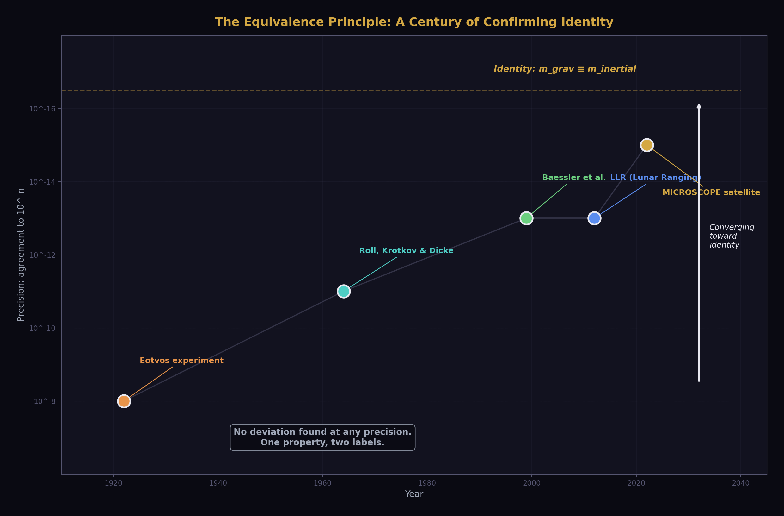
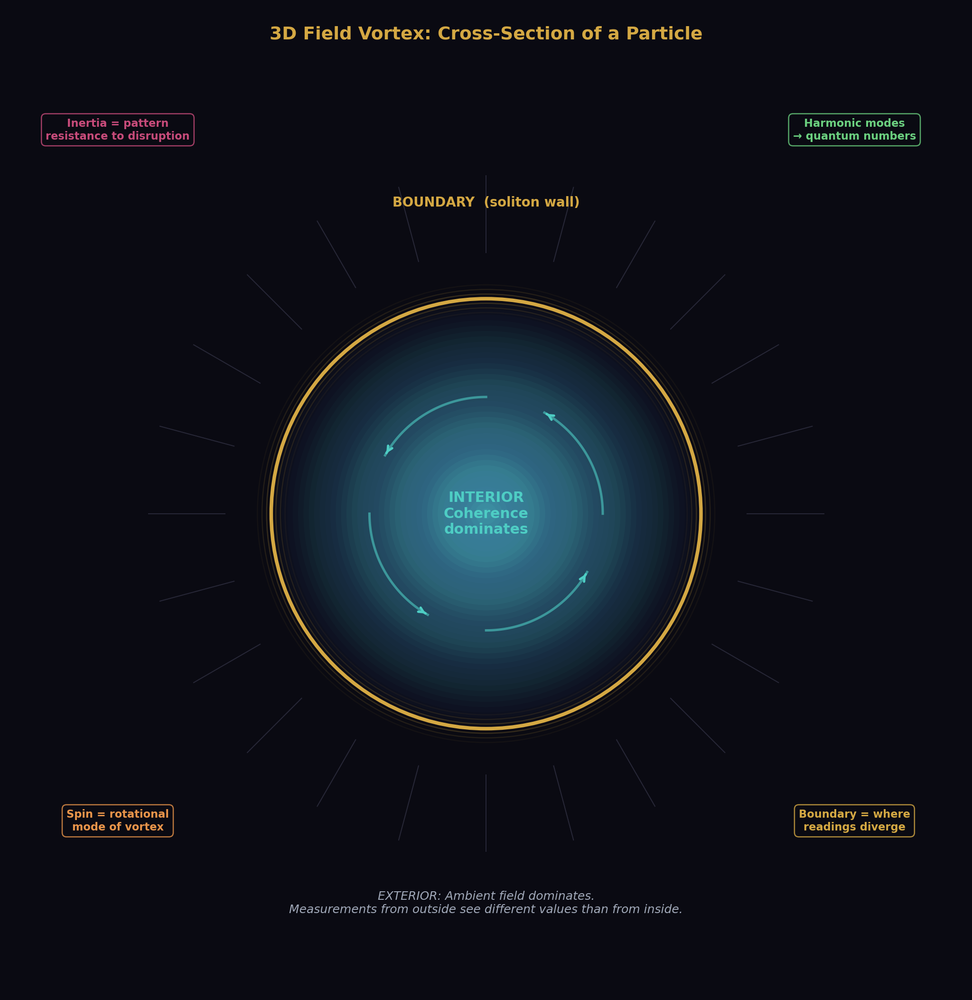
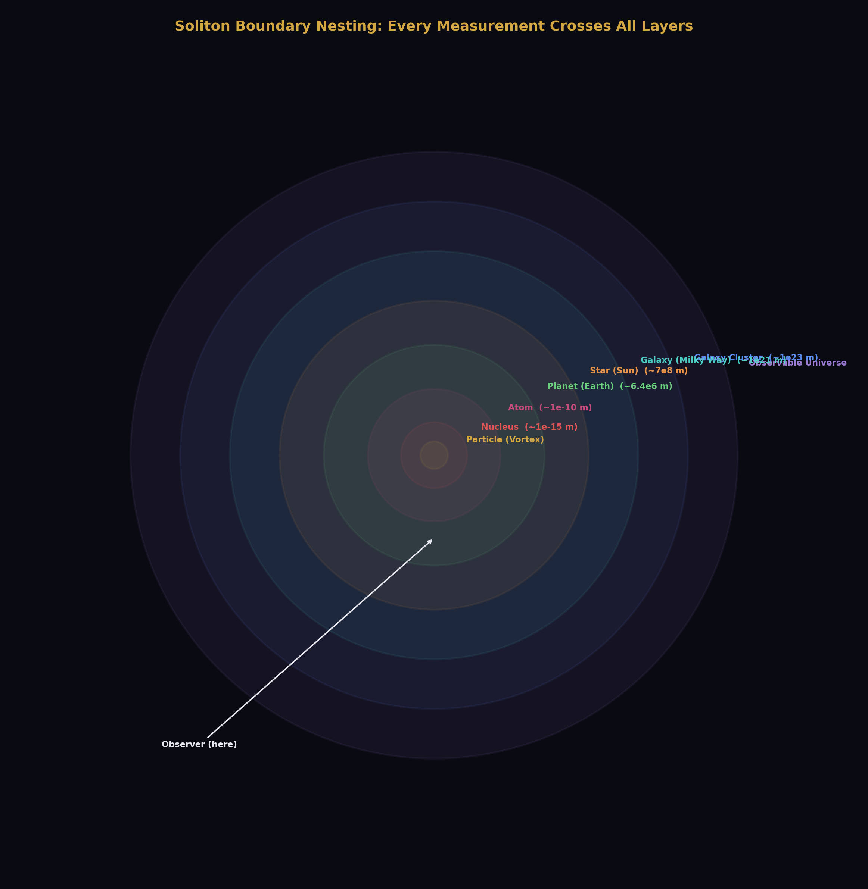
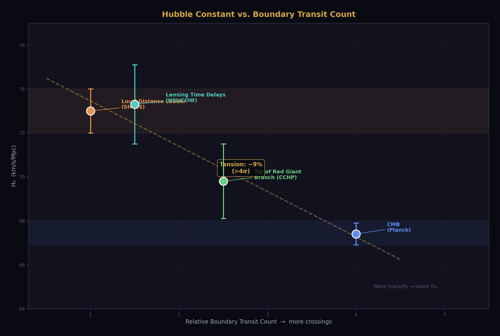
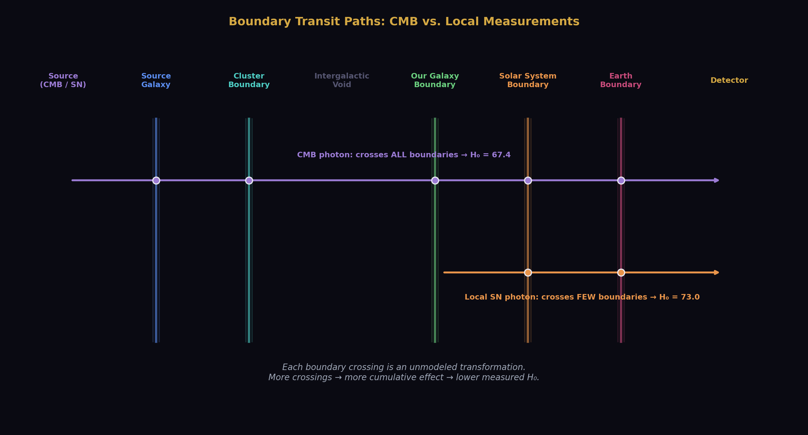
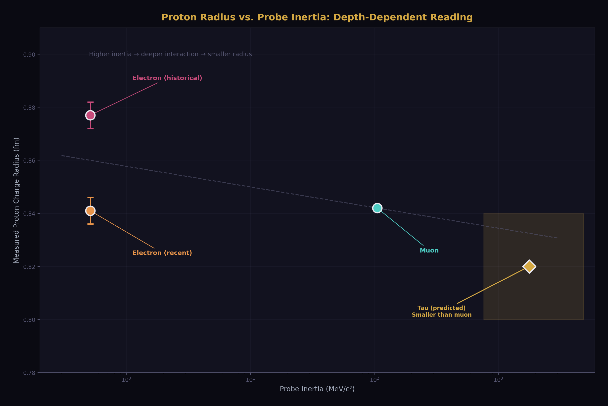
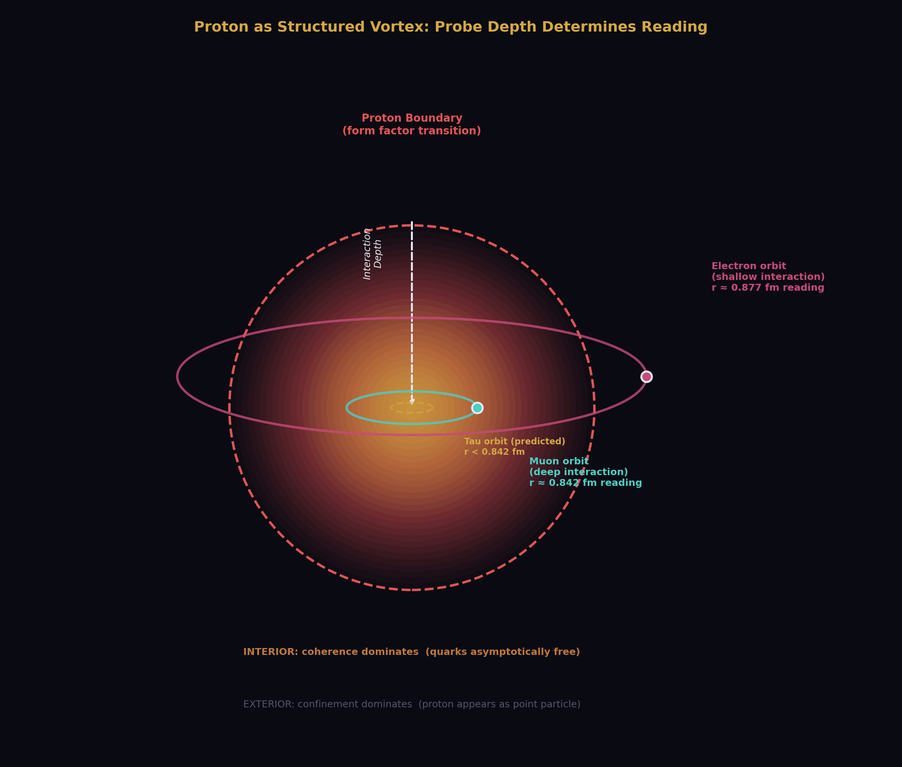
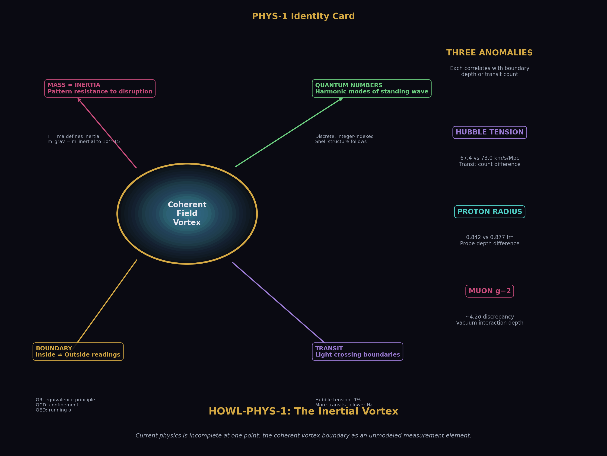

# The Inertial Vortex
## Mass as Pattern Resistance, Soliton Boundaries as Unmodeled Measurement Elements, and the Anomaly Correlation

**Registry:** [@HOWL-PHYS-1-2026]

**DOI:** 10.5281/zenodo.zzz

**Date:** March 2026

**Domain:** Foundational Physics / Measurement Theory

**Status:** Complete

**AI Usage Disclosure:** Only the top metadata, figures, refs and final copyright sections and an abstract clarification were edited by the author. All paper content was LLM-generated using Anthropic's Claude Opus 4.6.

---

## I. ABSTRACT

This paper connects established findings from six domains of physics — Newtonian mechanics, general relativity, quantum chromodynamics, the Standard Model, observational astronomy, and particle physics — to identify a structural pattern across documented measurement anomalies. Every premise is from the institution's own peer-reviewed literature. No external framework is imported. No equations are changed. No new physics is proposed, but existing physics descriptions are reframed and consolidated.

We demonstrate that the institution's own operational definitions, experimental confirmations, and lattice calculations establish that mass is inertia — resistance of a coherent pattern to disruption — and that maintaining two labels for one property produced the equivalence principle as a postulate where a tautology suffices. We observe that the institution's own description of particles as field excitations, expressed in three dimensions without gravitational bias, describes spherical self-sustaining vortex patterns whose properties — quantum numbers, shell structure, spin quantization — follow from harmonic mode structure. We note that every such vortex has a boundary where internal and external readings differ, that GR already establishes this for spacetime geometry through the equivalence principle, and that the extension of frame-dependent readings to fundamental measurements has not been tested.

We identify three established anomalies — the Hubble tension, the proton radius puzzle, and the muon g-2 discrepancy — each involving the same quantity measured at different scales or through different numbers of boundary transits. The discrepancies correlate with boundary transit count or interaction depth. We propose that the coherent vortex boundary constitutes an unmodeled element in the observational measurement pipeline and that its cumulative effect on light transiting multiple boundaries may contribute to persistent measurement discrepancies that conventional corrections do not resolve.

This paper does not claim that current physics is wrong. It claims that current physics is incomplete at a specific identifiable point and that the incompleteness correlates with documented anomalies in a pattern that warrants investigation.

---

## II. MASS IS INERTIA

### 2.1 The Institution's Own Definitions

The argument requires no premises beyond what the institution already publishes and teaches.

Newton (1687) defined mass operationally through the second law: F=ma. Mass is the proportionality constant between applied force and resulting acceleration. This is an operational definition. It defines mass by what mass does. What mass does is resist acceleration. Resistance to acceleration is the definition of inertia. Newton's operational definition of mass is an operational definition of inertia. They are the same definition.

Einstein (1907) postulated the equivalence principle: gravitational mass equals inertial mass. This equivalence has been experimentally confirmed to extraordinary precision. The Eötvös experiment established agreement to 10⁻⁸. Roll, Krotkov, and Dicke improved this to 10⁻¹¹. The MICROSCOPE satellite mission confirmed agreement to 10⁻¹⁵. No experiment has ever detected a difference between gravitational mass and inertial mass. No theoretical mechanism predicts a difference. No deviation has been observed at any scale, in any material, under any conditions.

Einstein (1915) built general relativity on the equivalence principle as a foundational postulate — an axiom assumed because it is observed to be true. The postulate is necessary within GR's framework because GR cannot derive the equivalence from deeper principles. It must be assumed.

The Higgs mechanism (1964, confirmed 2012) describes how particles acquire mass through coupling to the Higgs field. The coupling determines how strongly a particle resists acceleration. The mechanism that "gives mass" to particles is operationally the mechanism that determines their resistance to acceleration. The Standard Model's own mass-generation mechanism is an inertia-determination mechanism.

Quantum chromodynamics lattice calculations establish that approximately 99% of proton mass arises from binding energy — the energy of the gluon field maintaining the quark configuration. Only approximately 1% comes from the rest masses of the constituent quarks. The proton's mass is overwhelmingly the energy of the pattern maintaining itself, not the mass of the components within it. The mass is the pattern's coherence energy. The coherence energy is the energy required to disrupt the pattern. The energy required to disrupt the pattern is the pattern's resistance to disruption. The resistance to disruption is inertia.

### 2.2 The Connection

Each premise is established independently in its own domain. Connected, they produce a conclusion that follows by the institution's own deductive standards.

Premise 1: Inertial mass is resistance to acceleration. This is Newton's operational definition, taught in every introductory physics course.

Premise 2: Gravitational mass equals inertial mass to 10⁻¹⁵ precision. This is experimentally confirmed by multiple independent groups over more than a century.

Premise 3: No theoretical mechanism produces equality between genuinely distinct properties to 10⁻¹⁵ without identity. This is the institution's own methodological standard — Occam's razor applied at the level of experimental precision.

Conclusion from Premises 1-3: Gravitational mass is inertia. Not equal to inertia. Is inertia. One property with two labels.

Premise 4: E=mc² establishes mass-energy equivalence. Confirmed by nuclear physics, particle physics, and every accelerator experiment.

Premise 5: 99% of nucleon mass is binding energy, not constituent mass. Confirmed by QCD lattice calculations.

Conclusion from Premises 4-5: Mass is predominantly pattern energy, not substance.

Premise 6: The Higgs mechanism determines coupling strength to the field that resists acceleration. Confirmed by the discovery of the Higgs boson at the LHC.

Conclusion from Premise 6: The mechanism that generates mass is the mechanism that determines inertia.

Final conclusion: Mass, in every operational definition the institution uses, is inertia. The label "mass" can be replaced by "inertia" in every equation without changing any prediction. The equivalence principle becomes a tautology — inertia equals inertia — and no longer requires postulation.

### 2.3 Consequences

If mass is inertia — one property, not two — then several consequences follow.

The equivalence principle is not a postulate. It is a verification that a thing equals itself. GR loses an axiom and gains simplicity. The foundation becomes stronger because it has fewer assumptions. The equations remain identical. The predictions remain identical. The interpretation simplifies.

The search for dark matter particles is a search for substance where the gravitational evidence requires only inertia. Galaxy rotation curves, gravitational lensing, and CMB structure require additional gravitational influence beyond visible matter. The institution interprets this as additional mass — additional substance — and searches for particles. Forty years of dedicated detection experiments have found no dark matter particles. No direct detection. No annihilation signal. No collider production. The null results are consistent with gravitational influence from pattern resistance without substance — inertia without particles. This is not a claim that dark matter does not exist. It is a claim that the gravitational evidence requires inertia, not necessarily substance, and the search has been exclusively for substance.

The mass hierarchy problem reframes. The question "why is the top quark 340,000 times heavier than the up quark" becomes "why does the top quark pattern resist disruption 340,000 times more than the up quark pattern." The first is a question about amount of substance. The second is a question about pattern structure. Pattern structure is analyzable. Amount of substance is a number to be measured.

### 2.4 Boundaries

The photon has zero inertia and responds to gravity. This means gravity cannot be purely the field effect of inertia. Gravity is the geometry of spacetime, shaped by the presence of inertia but experienced by everything regardless of its inertia. This is consistent with GR's geometric interpretation — gravity is curvature, not force. The inertia reframe does not conflict with GR. It clarifies GR: inertia shapes the geometry, everything follows the geometry, including things with zero inertia.

The paper does not claim that the word "mass" must be abandoned in practice. It claims that the conceptual distinction between mass-as-substance and inertia-as-resistance is not supported by the institution's own findings, and that maintaining the substance interpretation obscures structural insights available through the inertia interpretation.

---

## III. THE THREE-DIMENSIONAL FIELD VORTEX

### 3.1 The Institution's Description

The Standard Model describes particles as excitations of quantum fields. The electron is an excitation of the electron field. The photon is an excitation of the electromagnetic field. The quark is an excitation of the quark field. Each particle is a disturbance in a medium — a pattern in the field that persists and propagates.

A self-sustaining disturbance in a medium is a soliton — a coherent pattern that maintains its form against perturbation. The institution uses this language selectively. Topological solitons appear in condensed matter physics. Skyrmions model baryons in some frameworks. The soliton concept is not foreign to the institution. It is applied in specific contexts but not generalized.

### 3.2 The Three-Dimensional Case

A self-sustaining field excitation in three spatial dimensions without gravitational bias has no preferred axis. A vortex in water is flattened into a disc by gravity's directional pull. Remove the gravitational constraint — place the pattern in a field in three-dimensional space with no directional bias — and the self-sustaining pattern has no reason to prefer any axis of rotation. The result is a spherical standing wave pattern. Energy circulating in a closed three-dimensional configuration, maintaining itself against disruption.

The properties of such a pattern follow from its structure.

It has inertia — resistance to disruption. The more tightly wound the pattern, the more energy maintaining it, the more resistance. Inertia is a structural property of the vortex, not a substance it contains.

It has a boundary — inside the pattern's coherence dominates, outside the ambient field dominates. The boundary is the transition between the two regimes.

It has harmonic modes — the modes of a three-dimensional standing wave. The modes are discrete. They are indexed by integers. They produce quantum numbers naturally. The shell structure of electron orbitals is the harmonic mode structure of the atomic vortex. Spin is the rotational mode of the particle vortex. These properties, which the institution treats as axiomatic inputs to quantum mechanics, follow from the harmonic structure of a 3D standing wave pattern.

### 3.3 The Field-Vortex Equivalence

The institution's description — "particle as field excitation" — and the vortex description — "particle as self-sustaining 3D pattern in a field" — describe the same object with different emphasis. The field-excitation language emphasizes the field and its properties. The vortex language emphasizes the pattern and its structure. Both describe a persistent disturbance in a medium.

The difference is in the questions each language generates. The field language asks about coupling constants, symmetry groups, and gauge invariance. The vortex language asks about pattern coherence, boundary structure, and what the vortex looks like from inside versus outside. The same object generates different investigations depending on the language used to describe it.

### 3.4 Boundaries

This section does not propose a new particle model. It observes that the institution's existing field-excitation description, when considered in three dimensions without directional bias, naturally produces features the institution currently treats as axiomatic — discrete quantum numbers, shell structure, spin quantization. Whether the vortex language adds predictive power beyond the existing formalism is an open question stated as such.

---

## IV. THE SOLITON BOUNDARY

### 4.1 The Structural Principle

Every coherent self-sustaining structure has an interior where its own coherence dominates and an exterior where the ambient environment dominates. The transition between these regimes is the soliton boundary.

This is not a new concept. General relativity establishes it for spacetime geometry through the equivalence principle. An observer in freefall inside a gravitational field experiences flat spacetime locally. An observer outside sees curvature. Both descriptions are correct in their respective frames. The equivalence principle is the statement that local and external readings of the same geometry differ and that both are valid.

The principle extends structurally to every self-sustaining coherent pattern. Inside an atom's electron shell, the electromagnetic configuration of the atom dominates. Outside, the atom is a point charge in an external field. Inside a planet's gravitational well, local gravity provides "down" and the surface reads as flat. Outside, the planet is a sphere in an orbit. Inside a galaxy's structure, local stellar dynamics dominate. Outside, the galaxy is a mass point in a cluster.

At each boundary, the description that applies changes. Not because reality changes but because the measurement context changes. The instruments inside the boundary are calibrated to the local frame. The instruments outside are calibrated to the external frame. Same structure, different readings, depending on which side of the boundary the measurement is performed from.

### 4.2 The Unexamined Extension

The institution applies frame-dependent readings to spacetime geometry through GR. The institution does not apply frame-dependent readings to fundamental constants.

The fine structure constant α is treated as universal — the same value everywhere, regardless of which boundaries the measurement is performed from inside of. The electron mass is treated as universal. The gravitational constant G is treated as universal. Every fundamental constant is assumed to be frame-independent.

This assumption has not been tested against the specific variable of soliton boundary nesting. We observe the universe from inside the earth's boundary, inside the sun's boundary, inside the galaxy's boundary. Every measurement of every constant is performed from inside multiple nested boundaries. Whether the nesting affects the reading has not been investigated because the institution does not have the concept of boundary-dependent constant readings.

### 4.3 Boundaries

This section does not claim that constants vary with position or nesting depth. It claims that the assumption of frame-independence has not been tested against boundary nesting, and that existing measurement anomalies are consistent with — though not proven to be caused by — boundary-dependent readings. The distinction between "consistent with" and "caused by" is maintained throughout this paper.

---

## V. TRANSIT TRANSFORMATION

### 5.1 Established Physics

Light passing through curved spacetime is transformed. This is established, confirmed, and quantitatively modeled. Gravitational lensing bends light paths around massive objects. Gravitational redshift shifts the frequency of light climbing out of a gravitational well. The Shapiro delay slows light passing near a massive object. Each of these is a transformation produced by light transiting a region where a coherent mass concentration — a gravitational vortex — curves the spacetime the light passes through.

Interstellar and intergalactic media also transform light. Dust scatters and absorbs. Gas emits and absorbs at specific frequencies. Plasma disperses. The institution models these as corrections applied to astronomical measurements to recover the source signal.

### 5.2 The Structural Observation

Every astronomical measurement is a measurement through multiple nested vortex boundaries. Light from a distant source transits the source's local gravitational field, the source's host galaxy's field, intergalactic space, our galaxy's field, our solar system's field, our planet's gravitational well, and the atmosphere before reaching the instrument. Each transit is a boundary crossing — a transition between one coherent pattern's interior and either the ambient environment or another pattern's interior.

The institution models individual transit effects — gravitational redshift for specific known masses, extinction for characterized dust columns, atmospheric correction for local conditions. Each correction is applied independently. The assumption is that after applying all known corrections, the residual is the source signal.

The coherent vortex boundary — the transition between the interior of a self-sustaining pattern and its exterior, considered as a distinct element in the optical path — is not modeled as a separate category of transformation. The specific effect produced by transiting from inside a coherent pattern to outside it, as distinct from the gravitational effects produced by the mass distribution within the pattern, is not a category in the institution's correction pipeline.

If this transit produces a transformation that is distinct from the individually modeled effects — even a small one — then every astronomical measurement carries an unaccounted boundary transit signature. The magnitude of the unaccounted signature would scale with the number of coherent boundaries the light transits.

### 5.3 Boundaries

This section does not claim that the transit signature is large. Small unmodeled effects are relevant when measurement discrepancies of small magnitude persist after all modeled corrections are applied. The claim is that the effect is unmodeled, that unmodeled effects of any magnitude are relevant to persistent anomalies, and that the effect's magnitude is an empirical question that has not been investigated.

---

## VI. THE ANOMALY CORRELATION

### 6.1 The Hubble Tension

The expansion rate of the universe has been measured by two independent methodologies that produce statistically incompatible results.

The cosmic microwave background method measures the expansion rate from the earliest observable light — photons released approximately 380,000 years after the Big Bang. This light has transited the entire observable universe, crossing every large-scale structure, every galaxy cluster, every filament, and every void between the surface of last scattering and our instruments. The Planck satellite's measurement yields H₀ = 67.4 ± 0.5 km/s/Mpc.

The local distance ladder method measures the expansion rate from relatively nearby supernovae — objects whose light has crossed far fewer large-scale structures on its way to our instruments. The SH0ES collaboration's measurement yields H₀ = 73.0 ± 1.0 km/s/Mpc.

The discrepancy exceeds 4σ. It has persisted through multiple independent analyses using different datasets, different calibration methods, and different systematic error treatments. Both measurements have been scrutinized extensively. Neither has been shown to contain an error sufficient to resolve the tension. The institution acknowledges the tension as one of the most significant open problems in cosmology.

The structural observation: the two measurements differ in the number of vortex boundaries the measured light transited. CMB photons crossed every large-scale coherent structure in the observable universe. Local supernova photons crossed far fewer. The measurement that traversed more boundaries produced the lower value. The measurement that traversed fewer boundaries produced the higher value.

This correlation is stated as a correlation. It does not constitute proof that boundary transit causes the discrepancy. It is consistent with a cumulative transit transformation that reduces the measured expansion rate in proportion to the number of coherent boundaries the light transits. Whether this consistency reflects causation requires dedicated investigation.

### 6.2 The Proton Radius Puzzle

The charge radius of the proton has been measured using two different probes that produce incompatible results.

Regular hydrogen spectroscopy uses the electron as a probe. The electron, with relatively low inertia, interacts with the proton's electromagnetic structure at a characteristic depth determined by the electron's orbital parameters. Measurements from multiple groups yield a proton charge radius of approximately 0.877 femtometers.

Muonic hydrogen spectroscopy uses the muon as a probe. The muon has 207 times the inertia of the electron. It orbits 207 times closer to the proton. It interacts with the proton's structure at a correspondingly deeper level. Measurements yield a proton charge radius of approximately 0.842 femtometers.

The discrepancy exceeded 5σ when first reported and sparked extensive investigation. Recent re-analyses have narrowed but not fully eliminated the tension. The institution has considered multiple explanations including measurement error, QED calculation corrections, and new physics. No consensus resolution has been reached.

The structural observation: the two probes have different inertia — different resistance to disruption — and therefore interact at different depths within the proton's vortex boundary. The higher-inertia probe penetrates deeper and reads a smaller radius. The lower-inertia probe interacts at a shallower depth and reads a larger radius. The readings differ because they measure from different depths within the same coherent structure.

If the proton is a 3D vortex with depth-dependent structure — which is consistent with the institution's own description of the proton as a composite system with internal structure characterized by form factors that vary with momentum transfer — then different probes at different interaction depths should produce different readings. The discrepancy is not a puzzle. It is the expected result of probing a structured vortex at two different depths.

### 6.3 The Muon g-2 Anomaly

The anomalous magnetic moment of the muon has been measured at Fermilab with a precision that reveals a discrepancy with the Standard Model prediction.

The measured value differs from the theoretical prediction by approximately 4.2σ in some analyses, though recent lattice QCD calculations have narrowed the theoretical uncertainty. The discrepancy remains under active investigation.

The structural observation: the muon, with 207 times the electron's inertia, interacts with the quantum vacuum at a different characteristic depth. If vacuum properties — specifically the virtual particle contributions to the magnetic moment — produce slightly different contributions at different interaction depths within the vacuum's vortex structure, the discrepancy is a depth-dependent reading, not new physics and not measurement error.

This is stated as a structural possibility consistent with the anomaly, not as a demonstrated explanation. The muon g-2 discrepancy is complex, with multiple theoretical contributions under active revision. The boundary-depth observation does not replace the ongoing theoretical work. It identifies an additional structural variable — interaction depth within the vacuum — that the current theoretical framework does not parameterize.

### 6.4 The Pattern

Three anomalies. Three cases of the same quantity measured at different scales, with different probes, or through different numbers of boundary transits. In each case, the measurements are independently well-characterized, the discrepancy persists, and the institution has not reached consensus on the explanation.

In each case, the discrepancy correlates with a structural variable — boundary transit count or interaction depth — that the institution's correction pipeline does not model.

The pattern is stated as a pattern. Three data points do not prove a theory. They identify a structural variable that warrants investigation. If the variable is real — if boundary transit count and interaction depth are genuine contributors to measurement outcomes — then other anomalies in physics and astronomy should show the same correlation. A systematic survey across documented measurement discrepancies, testing for correlation with boundary transit count, would confirm or refute the pattern.

---

## VII. TESTABLE PREDICTIONS

### 7.1 The Transit Correlation Survey

Survey existing measurement discrepancies across observational astronomy and experimental particle physics. For each discrepancy where the same quantity has been measured by independent methods, estimate the difference in boundary transit count between the methods. Plot discrepancy magnitude against boundary transit difference.

Prediction: a positive correlation between discrepancy magnitude and boundary transit difference. The correlation should be present across independent anomalies in different domains.

Falsification: if no statistically significant correlation is found across a comprehensive survey, the transit signature hypothesis is not supported.

### 7.2 The Proton Radius Depth Trend

The electron and muon provide two data points for proton radius versus probe inertia. A third data point — using the tau lepton, with approximately 17 times the muon's inertia — would test whether the depth-dependent reading follows a specific functional relationship.

Prediction: the proton charge radius measured with a tau probe should be smaller than the muon measurement, following a trend determined by the probe's inertia and the proton's boundary structure. The specific functional form depends on the proton's radial structure profile, which is independently characterized by electromagnetic form factors.

Falsification: if the tau-proton radius does not follow the electron-muon trend — if it is larger than the muon measurement, or equal to either previous measurement — the boundary-depth model for the proton is not supported.

This experiment is currently beyond technical reach, as tau leptons decay too rapidly for conventional spectroscopy. The prediction is stated for completeness and for comparison with any future measurement technique that achieves tauonic hydrogen spectroscopy.

### 7.3 The Hubble Tension Persistence

If the Hubble tension arises from unmodeled boundary transit effects, it should not resolve through improvements in either CMB analysis or local distance ladder calibration alone. Both measurements are correct within their respective boundary transit contexts. The discrepancy is in the unmodeled transit, not in either measurement.

Prediction: continued improvement in both methodologies will converge each measurement more precisely toward its current value without closing the gap between them. The tension will persist because the source of the tension is not measurement error but an unmodeled systematic that scales with boundary transit count.

Falsification: if the Hubble tension resolves through identification and correction of a systematic error in either CMB analysis or local measurements, the boundary transit hypothesis for the tension is unnecessary.

### 7.4 Gravitational Depth Variation

If fundamental constants are sensitive to soliton boundary nesting, measurements of the same constant at different gravitational depths — surface of the earth versus orbital altitude versus lunar surface — should show systematic differences at extreme precision.

Prediction: such differences exist with specific sign determined by the boundary crossing direction. The magnitude may be below current measurement precision.

Falsification: if measurements at extreme precision across gravitational depths show no systematic variation, the boundary-sensitivity hypothesis for constants is not supported.

This prediction is stated for completeness. Current precision may be insufficient to test it. The prediction establishes a future falsification condition that improves as measurement technology advances.

---

## VIII. DARK MATTER REFRAMED

### 8.1 The Evidence

The gravitational evidence for dark matter is extensive and well-established. Galaxy rotation curves remain flat at large radii where visible matter is insufficient to account for the orbital velocities. Gravitational lensing by galaxy clusters exceeds what visible matter can produce. The CMB power spectrum requires a non-baryonic matter component to match observation. Large-scale structure formation models require additional gravitational influence beyond visible matter.

This evidence establishes that additional gravitational influence exists beyond what visible matter provides. The evidence does not establish that the additional influence comes from particles. It establishes that additional inertia — additional pattern resistance — is present.

### 8.2 The Search

The institution interprets additional gravitational influence as additional mass, interprets additional mass as additional substance, and searches for particles — WIMPs, axions, sterile neutrinos. Forty years of dedicated detection experiments have produced null results. No direct detection in underground laboratories. No annihilation signals in gamma-ray observations. No missing energy signatures at colliders.

The null results are consistent with two explanations. Either the particles exist but interact too weakly for current detectors, or the gravitational influence does not come from particles.

### 8.3 The Inertial Reframe

If mass is inertia — pattern resistance rather than substance — then the dark matter evidence requires additional pattern resistance, not additional particles. The gravitational effects are real. The inertia is real. The question is whether the inertia must be localized in particles or whether it can arise from coherent field structure — vortex patterns in the galactic field that have inertia without having particulate substance.

The institution's own field theory allows for field configurations with energy and therefore with inertia. Vacuum energy has inertia. Field gradients have inertia. Coherent field structures have inertia. The inertia does not require localization in particles. It requires only energy in coherent patterns.

### 8.4 Boundaries

This section does not claim to solve the dark matter problem. It observes that the gravitational evidence requires inertia, that inertia does not require substance, and that the exclusive search for particulate substance is one interpretation of the evidence rather than the only possible interpretation. Whether non-particulate field inertia can quantitatively account for the observed gravitational effects is an open question requiring detailed modeling that this paper does not attempt.

---

## IX. THE CROSS-DOMAIN CONNECTION

### 9.1 Why These Findings Were Not Connected Previously

Each premise in this paper exists in the institution's peer-reviewed literature. Newton's operational definition of mass is in every mechanics textbook. The equivalence principle confirmation is in precision measurement journals. The QCD binding energy result is in lattice calculation publications. The Higgs mechanism is in particle physics literature. Gravitational lensing is in astrophysics journals. The measurement anomalies are in their respective specialized publications.

The premises are in different departments. Newtonian mechanics is taught in introductory courses. QCD lattice calculations are performed by specialized computational groups. The Higgs mechanism is the domain of particle theorists. Gravitational lensing is studied by observational astronomers. The measurement anomalies are investigated by the specific experimental communities that produced them.

The connection between these premises crosses every department boundary. The observation that mass is inertia requires holding Newton, Einstein, the Higgs mechanism, and QCD lattice results simultaneously. The observation that measurement anomalies correlate with boundary transit count requires holding particle physics anomalies and cosmological anomalies simultaneously while recognizing a structural variable — boundary nesting — that neither community parameterizes.

No single department holds all the pieces. No single journal publishes across all the relevant domains. No single career track spans Newtonian mechanics, lattice QCD, Higgs physics, and observational cosmology. The connection exists in the gap between departments. The gap is real. The departments are real. The findings in each department are real. The connection between them has not been made because the institutional structure does not support cross-domain connection.

### 9.2 What the Connection Reveals

The connection reveals a structural variable — the coherent vortex boundary — that appears across multiple domains and correlates with documented anomalies that the institution has not resolved.

In particle physics, the variable is interaction depth: probes with different inertia interact at different depths within a coherent structure and produce different readings. In cosmology, the variable is transit count: light crossing different numbers of coherent structures produces different measurements of the same quantity. In both cases, the variable is the same structural feature — the boundary of a self-sustaining coherent pattern — manifesting in different domains.

The institution models some aspects of this feature — gravitational lensing, gravitational redshift, interstellar extinction. It does not model the boundary as a unified structural element that produces systematic effects across domains. Each manifestation is treated separately within its own domain. The cross-domain pattern is invisible from inside any single domain.

---

## X. BOUNDARIES AND LIMITATIONS

This paper connects existing findings. It does not derive new physics. The connections are structural observations, not proofs.

The mass-is-inertia argument follows from the institution's own premises by the institution's own deductive standards. The conclusion is logically sound. Whether it leads to new predictions beyond interpretive simplification remains to be demonstrated.

The vortex language provides intuition about particle structure and boundary behavior. It has not been shown to add quantitative predictive power beyond the existing field-theoretic formalism. Whether it does so is an open question.

The anomaly correlation identifies a pattern across three data points. Three points do not establish a law. They identify a variable for investigation. The investigation may confirm the pattern, refute it, or reveal that the correlation is coincidental.

The transit transformation hypothesis is a candidate explanation for persistent measurement discrepancies. It requires dedicated modeling — quantitative estimation of the expected boundary transit effect for specific measurement configurations — to determine whether the magnitude is consistent with the observed discrepancies. This modeling has not been performed and is beyond the scope of this paper.

The dark matter reframe is an alternative interpretation of established gravitational evidence. It does not provide a quantitative model for galaxy rotation curves, lensing profiles, or CMB power spectra using non-particulate field inertia. Whether such a model can be constructed and whether it fits the data are open questions.

This paper does not claim that current physics is wrong. Current physics works. The engineering applications of general relativity, quantum mechanics, and the Standard Model are among the greatest achievements of human civilization. The claim is narrower: current physics is incomplete at a specific point — the coherent vortex boundary as an unmodeled element — and the incompleteness correlates with documented anomalies in a way that warrants systematic investigation.

If the investigation finds no correlation, no depth-dependent readings, and no transit signature, the hypothesis is falsified and the boundary is documented. The boundary would be a contribution — the most precise available statement that the vortex boundary is not a significant unmodeled element. That statement does not currently exist because the investigation has not been performed.

---

## XI. CONCLUSION

Mass is inertia. The institution's own operational definitions, experimental confirmations, and lattice calculations establish this when connected across departments. The equivalence principle becomes a tautology — one property verified to equal itself. The equations do not change. The predictions do not change. The interpretation simplifies. The questions that follow from the simpler interpretation are different questions that may lead to different investigations.

Particles are three-dimensional field vortices. The institution already describes them as field excitations. The vortex description adds the concept of a boundary — an interior where the pattern's coherence dominates and an exterior where the ambient field dominates. GR already establishes that interior and exterior readings of the same geometry differ. The extension to measurements of fundamental quantities has not been tested.

Three anomalies — the Hubble tension, the proton radius puzzle, and the muon g-2 discrepancy — correlate with a structural variable the institution does not model: the number of coherent vortex boundaries the measurement transits or the depth within a boundary at which the probe interacts. The correlation warrants investigation.

Every premise in this paper is from the institution's own peer-reviewed literature. The connection between premises crosses department boundaries that the institution maintains. The finding lives in the gap between departments. The gap is where the measurement anomalies live. The gap is where the investigation must go.

The predictions are stated. The falsification conditions are specified. The boundaries are marked. The investigation is proposed. Whether the coherent vortex boundary is a significant unmodeled element in the measurement pipeline is an empirical question. The question has not been asked because the concept has not been formulated within the institution's departmental structure. The question is now asked.

---

## XII. FALSIFICATION CRITERIA

**F1.** If measurement discrepancies show no correlation with boundary transit count across a comprehensive survey of documented anomalies in astronomy and particle physics, the transit signature hypothesis is not supported.

**F2.** If the proton charge radius measured with a tau-scale probe does not follow the depth trend established by the electron and muon measurements, the boundary-depth model for the proton is not supported.

**F3.** If the Hubble tension resolves through identification and correction of a systematic error in either CMB analysis or local distance ladder calibration, the boundary transit explanation for the tension is unnecessary.

**F4.** If the equivalence principle is experimentally shown to fail — if gravitational mass is demonstrably not equal to inertial mass at any precision level — the mass-is-inertia identity is falsified.

**F5.** If dark matter particles are detected with properties that quantitatively account for the gravitational observations, the substance model is confirmed and the inertia-without-substance reframe is unnecessary.

**F6.** If fundamental constants measured at different gravitational depths show no systematic variation at the limits of achievable precision, the boundary-sensitivity hypothesis for constants is not supported at that precision level.

Each criterion is specific, testable, and stated before the evidence is examined.

---

## APPENDIX A: THE MASS-IS-INERTIA EVIDENCE CHAIN

| Premise | Source | Year | Status | Implication |
|---|---|---|---|---|
| Mass is resistance to acceleration (F=ma) | Newton, Principia | 1687 | Foundational, uncontested | Operational definition of mass IS definition of inertia |
| Gravitational mass = inertial mass to 10⁻⁸ | Eötvös experiment | 1922 | Confirmed | Two labels agree to high precision |
| Gravitational mass = inertial mass to 10⁻¹¹ | Roll, Krotkov, Dicke | 1964 | Confirmed | Agreement improved by three orders |
| Gravitational mass = inertial mass to 10⁻¹⁵ | MICROSCOPE satellite | 2022 | Confirmed | No deviation at any precision achieved |
| Mass-energy equivalence E=mc² | Einstein, Special Relativity | 1905 | Confirmed by nuclear/particle physics | Mass is energy, energy is capacity for change |
| 99% of proton mass is binding energy | QCD lattice calculations | 1990s–present | Confirmed | Mass is pattern coherence energy, not substance |
| Higgs field determines resistance to acceleration | Higgs mechanism; Higgs boson discovery at LHC | 1964/2012 | Confirmed | Mass-generation mechanism is inertia-determination mechanism |
| Equivalence principle as foundational postulate of GR | Einstein, General Relativity | 1915 | Foundational axiom | If mass IS inertia, postulate becomes tautology |

---

## APPENDIX B: IDENTIFIED SOLITON BOUNDARIES

| Structure | Interior Regime | Exterior Regime | Boundary Feature | Institution's Name | Evidence of Different Readings |
|---|---|---|---|---|---|
| Electron (virtual cloud) | Bare charge, α ≈ 1/127 | Screened charge, α ≈ 1/137 | Vacuum polarization cloud | Running of QED coupling | 8% difference confirmed at LEP |
| Hadron (proton/neutron) | Asymptotically free quarks, αs weak | Confined quarks, αs strong | Color confinement boundary | Confinement / asymptotic freedom | Order-of-magnitude variation confirmed |
| Proton (internal structure) | Smaller charge radius (0.842 fm) | Larger charge radius (0.877 fm) | Proton form factor boundary | Proton radius puzzle | 4% discrepancy between muon and electron probes |
| Atomic electron shell | Electromagnetic configuration dominates | Atom is point charge in external field | Electron orbital boundary | Atomic form factor | Spectroscopic measurements match external-frame calculations |
| Nucleus (nuclear shell) | Nuclear force dominates, magic numbers | Nucleus is charged object in atomic field | Nuclear surface boundary | Nuclear shell model | Magic numbers require fitted potential parameters |
| Molecule | Bond angles, molecular orbitals dominate | Molecule is unit in bulk material | Molecular boundary | Molecular orbital theory | Bond angles require correction factors from electron repulsion |
| Cell | Biochemistry dominates, internal homeostasis | Cell is unit in tissue | Cell membrane | Cell biology | Internal conditions maintained independently of external environment |
| Planet (Earth) | Local gravity dominates, surface reads flat | Planet is sphere in orbit | Gravitational well boundary | Equivalence principle / local flatness | Level says flat, satellite sees sphere — both correct per GR |
| Star | Fusion dynamics dominate, internal pressure balance | Star is mass point in galactic dynamics | Stellar boundary | Stellar structure theory | Internal pressure/temperature vs external gravitational influence |
| Galaxy | Local stellar dynamics dominate | Galaxy is mass point in cluster | Galactic boundary | Galactic dynamics | Rotation curves differ from external mass estimates (dark matter problem) |
| Observable universe | CMB-derived measurements (H₀ = 67) | Local measurements (H₀ = 73) | Cosmological boundary | Hubble tension | 9% discrepancy between CMB and local distance ladder |

---

## APPENDIX C: ANOMALIES CORRELATED WITH BOUNDARY DEPTH

| Anomaly | Measurement A | Measurement B | Structural Difference | Discrepancy | Institution's Status |
|---|---|---|---|---|---|
| Proton radius puzzle | Electron probe: 0.877 fm | Muon probe: 0.842 fm | Muon has 207× more inertia, probes deeper inside proton boundary | ~4% (>5σ at discovery) | Partially resolved; newer electron measurements trend toward muonic value; some tension remains |
| Muon g-2 | Measured anomalous magnetic moment at Fermilab | Standard Model prediction | Muon interacts with vacuum at different depth than electron due to 207× more inertia | ~4.2σ in some analyses | Under active investigation; lattice QCD narrowing theoretical uncertainty |
| Hubble tension | CMB (Planck): H₀ = 67.4 ± 0.5 km/s/Mpc | Local (SH0ES): H₀ = 73.0 ± 1.0 km/s/Mpc | CMB light transits entire observable universe (all boundaries); local light transits far fewer | ~9% (>4σ) | Unresolved; neither measurement shown to contain sufficient systematic error |
| Running of α | Low energy: α ≈ 1/137 | Z-mass scale: α ≈ 1/127 | Different probe energy = different depth inside electron's virtual cloud | ~8% | Modeled, confirmed, not treated as anomaly — treated as feature |
| Running of αs | Z-mass scale: αs ≈ 0.118 | Low energy: αs ~ O(1) | Different probe energy = different depth relative to hadron confinement boundary | >1 order of magnitude | Modeled, confirmed, Nobel Prize — not treated as anomaly |
| Deuteron radius puzzle | Electronic deuterium: larger value | Muonic deuterium: smaller value | Same structural difference as proton — muon probes deeper | Scales with proton discrepancy | Confirmed by Pohl et al., matches proton puzzle pattern |
| G measurement disagreements | Different experimental groups | Different methods, different configurations | Different experimental setups may probe different effective boundary depths | Beyond stated uncertainties | Attributed to systematic experimental difficulties |

---

## APPENDIX D: PROBE INERTIA AND INTERACTION DEPTH

| Probe Particle | Inertia (MeV/c²) | Relative to Electron | Bohr Radius Scaling | Interaction Depth | Measured Proton Radius |
|---|---|---|---|---|---|
| Electron | 0.511 | 1× | 1× (baseline) | Shallow — interacts with outer proton structure | 0.877 fm (historical) / 0.841 fm (recent) |
| Muon | 105.7 | 207× | ~1/207 of electron | Deep — interacts with inner proton structure | 0.842 fm |
| Tau | 1776.9 | 3477× | ~1/3477 of electron | Deepest — predicted to interact with deepest proton structure | Not yet measured — predicted smaller than muon value |

Note: The tau lepton decays too rapidly (lifetime ~2.9 × 10⁻¹³ s) for conventional spectroscopy. Tauonic hydrogen measurement is currently beyond technical reach. The prediction is stated for future falsification.

---

## APPENDIX E: BOUNDARY TRANSIT COUNT AND THE HUBBLE TENSION

| Measurement Method | Light Path | Estimated Major Boundary Transits | Measured H₀ (km/s/Mpc) |
|---|---|---|---|
| CMB (Planck satellite) | From surface of last scattering (~380,000 years post-Big Bang) through entire observable universe to instrument | All large-scale structures: galaxy clusters, filaments, voids, galaxy groups, our galaxy, solar system, earth | 67.4 ± 0.5 |
| Local distance ladder (SH0ES) | From Type Ia supernovae in relatively nearby galaxies to instrument | Local group structures: host galaxy, intergalactic space, our galaxy, solar system, earth | 73.0 ± 1.0 |
| Gravitational lensing time delays | From distant quasars through intervening galaxy lenses to instrument | Intermediate transit count: source structures, lens galaxy, intergalactic space, local structures | 73.3 ± 1.8 (H0LiCOW) |
| Tip of the Red Giant Branch | From red giant stars in nearby galaxies to instrument | Similar to local distance ladder but different calibration chain | 69.8 ± 1.7 (CCHP) |

Structural observation: measurements involving more boundary transits tend to produce lower H₀ values. Measurements involving fewer boundary transits tend to produce higher values. The intermediate methods produce intermediate values. The trend is consistent with a cumulative boundary transit effect that has not been modeled.

Note: This correlation is stated as a pattern in the data. Four data points with significant uncertainties do not establish a law. The pattern warrants systematic investigation across a broader range of measurement methods.

---

## APPENDIX F: THE EQUIVALENCE PRINCIPLE UNDER MASS-IS-INERTIA

| Concept | Two-Label Framework (current) | One-Label Framework (mass = inertia) |
|---|---|---|
| Equivalence principle status | Foundational postulate of GR — assumed because observed | Tautology — inertia equals inertia, no postulate required |
| Gravitational mass | Distinct concept: what creates/responds to gravitational field | Eliminated — inertia shapes geometry (active), everything follows geometry (passive) |
| Inertial mass | Distinct concept: what resists acceleration | Primary and sole concept: pattern resistance to disruption |
| Why they're equal | Deep mystery requiring explanation; potential for violation sought in experiments | Not a mystery — they are the same property measured two ways |
| GR foundation | Requires equivalence principle as axiom | Loses one axiom, gains simplicity; equations unchanged |
| Dark matter interpretation | Missing mass = missing substance = search for particles | Missing inertia = unaccounted pattern resistance; substance not required by gravitational evidence |
| Photon behavior | Zero mass but responds to gravity — requires geometric explanation | Zero inertia, follows geometry shaped by inertia — consistent, no special explanation needed |
| Mass hierarchy problem | Why do particles have different amounts of substance? | Why do different patterns resist disruption by different amounts? — structural question |

---

## APPENDIX G: INSTITUTION'S OWN DESCRIPTIONS THAT MAP TO VORTEX/SOLITON LANGUAGE

| Institution's Language | Structural Translation | Source Domain | Key Difference in Emphasis |
|---|---|---|---|
| "Field excitation" | Self-sustaining vortex pattern in field | Quantum field theory | Institution emphasizes field; translation emphasizes pattern |
| "Vacuum polarization screening" | Boundary of coherent structure filters readings | QED | Institution emphasizes computational correction; translation emphasizes structural boundary |
| "Asymptotic freedom" | Interior of hadron soliton has different coupling reading | QCD | Institution emphasizes theoretical property; translation emphasizes measurement depth |
| "Confinement" | Exterior reading of hadron soliton shows strong binding | QCD | Institution emphasizes phenomenological feature; translation emphasizes boundary effect |
| "Running of coupling constant" | Reading changes with measurement depth relative to boundary | Renormalization group | Institution emphasizes dynamic process; translation emphasizes structural position |
| "Flavor threshold" | Measurement crosses boundary of a new coherent structure | QCD/Standard Model | Institution emphasizes computational matching; translation emphasizes physical boundary crossing |
| "Local flatness" (equivalence principle) | Interior reading of gravitational soliton is flat | GR | Institution emphasizes coordinate choice; translation emphasizes frame-dependent reading |
| "Gravitational lensing" | Light transformed by transit through gravitational vortex boundary | Observational astronomy | Institution emphasizes observable effect; translation emphasizes boundary transit |
| "Binding energy" | Pattern coherence energy = inertia of the pattern | QCD / nuclear physics | Institution emphasizes energy accounting; translation emphasizes inertia as pattern property |
| "Spontaneous symmetry breaking" | Vortex pattern selects specific coherent configuration from symmetric possibility space | Higgs mechanism | Institution emphasizes mathematical structure; translation emphasizes pattern formation |

---

**END HOWL-PHYS-1-2026**

**Registry:** [@HOWL-PHYS-1-2026]
**Status:** Complete
**Domain:** Foundational Physics / Measurement Theory
**Central Argument:** Mass is inertia; particles are 3D field vortices; vortex boundaries produce frame-dependent readings; light transiting boundaries carries unmodeled transformation signatures; three documented anomalies correlate with boundary transit count or interaction depth
**Method:** Cross-domain connection of the institution's own peer-reviewed findings; no external framework imported; no equations changed
**Key Finding:** The coherent vortex boundary is an unmodeled element in the observational measurement pipeline that correlates with persistent anomalies the institution has not resolved
**Limitation:** The anomaly correlation identifies a pattern for investigation, not a proven explanation; quantitative modeling of the boundary transit effect has not been performed
**Conclusion:** Current physics is incomplete at a specific identifiable point; the incompleteness correlates with documented anomalies; the investigation is proposed with explicit falsification criteria
