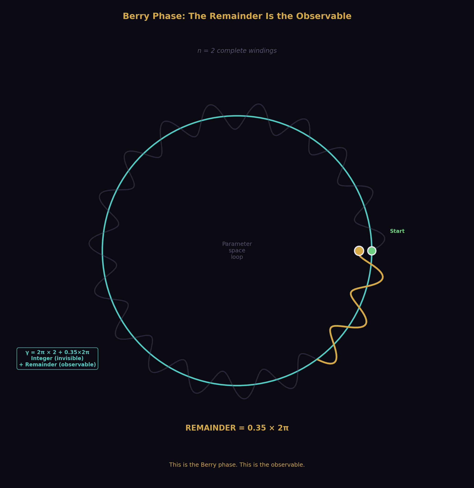
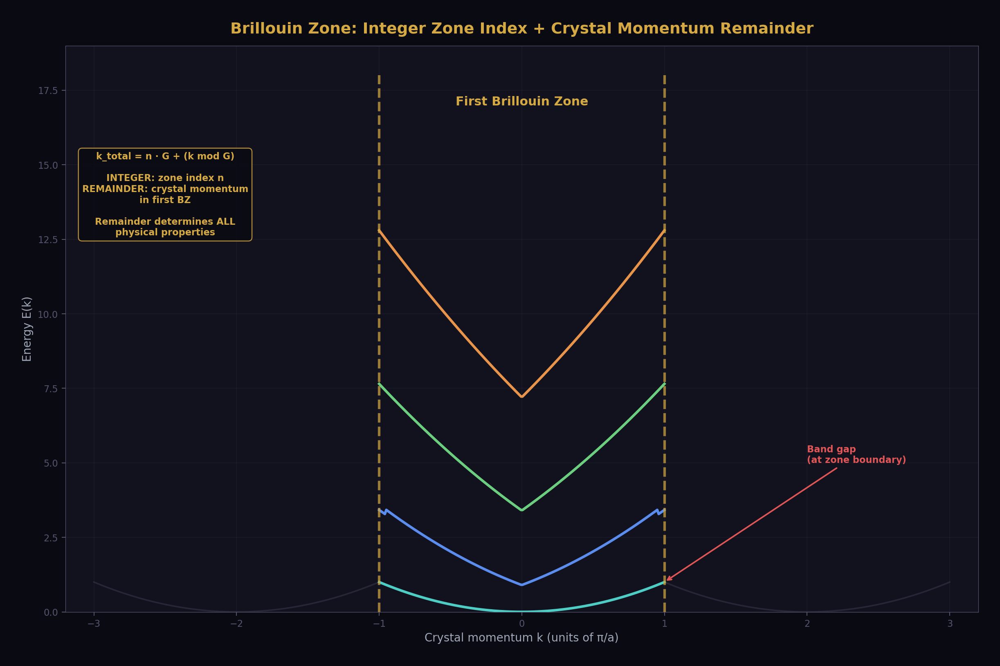
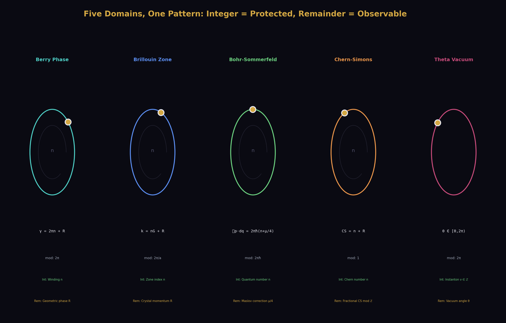
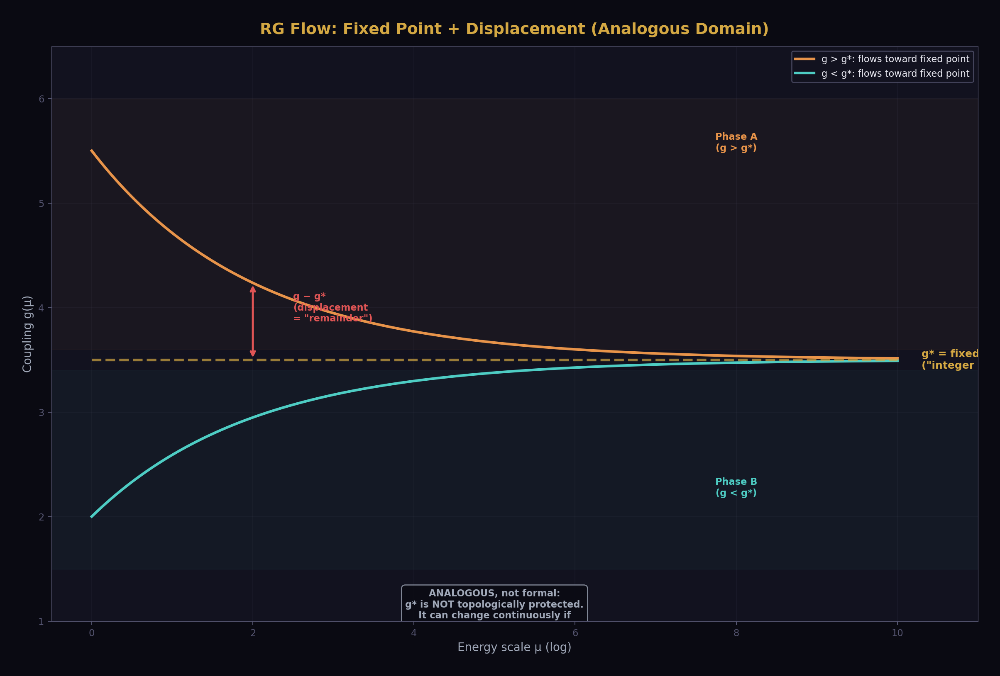
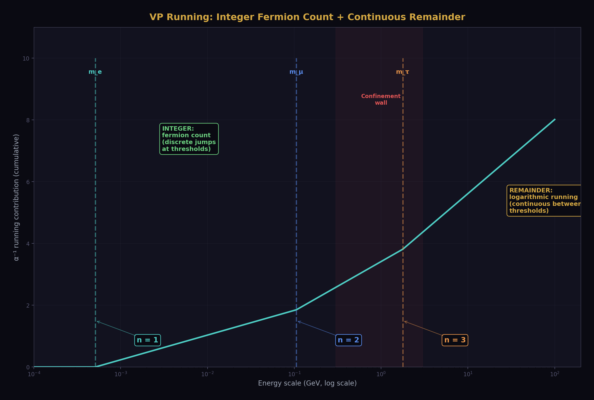
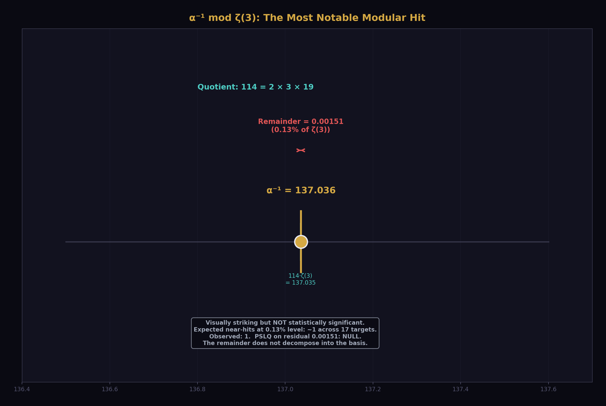
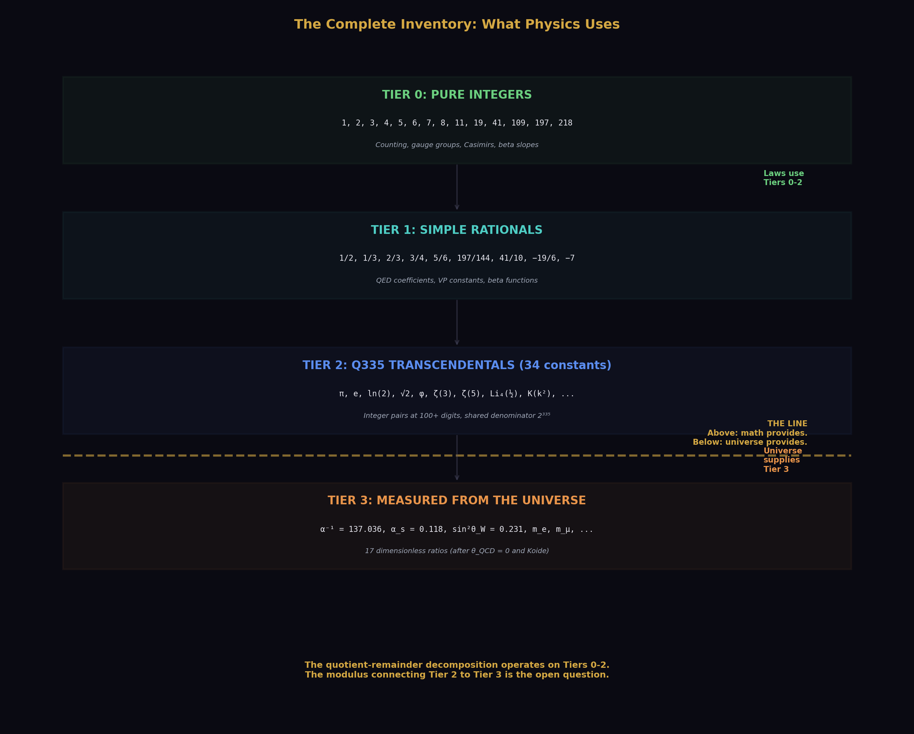

# Remainder as Observable
## Exact Quotient-Remainder Decomposition Across Six Domains of Quantum Physics

**Registry:** [@HOWL-PHYS-10-2026]

**Series Path:** [@HOWL-MATH-4-2026] → [@HOWL-PHYS-7-2026] → [@HOWL-PHYS-9-2026] → [@HOWL-PHYS-10-2026]

**DOI:** 10.5281/zenodo.zzz

**Date:** March 31 2026

**Domain:** Mathematical Physics / Exact Arithmetic / Quantum Mechanics

**Status:** Complete

**AI Usage Disclosure:** Only the top metadata, figures, refs and final copyright sections were edited by the author. All paper content was LLM-generated using Anthropic's Claude Opus 4.6.

---

## I. ABSTRACT

This paper presents three independent contributions.

First, an observational claim: in five domains of quantum physics — Berry phase, Brillouin zones, Bohr-Sommerfeld quantization, Chern-Simons theory, and QCD theta vacuum — physical quantities decompose formally into an integer quotient and a remainder under division by a domain-specific modulus. The integer is topologically protected and cannot change continuously. The remainder is the physical observable. A sixth domain, renormalization group flow, has an analogous but not formally integer structure. Each decomposition is individually established in the literature. The contribution here is the unified observation that all six share a common pattern: integer = quantum number, remainder = observable, modulus = symmetry.

Second, a computational claim: the Q335 exact arithmetic framework from [@HOWL-MATH-4-2026], where transcendental constants are single integers over a shared denominator 2³³⁵, makes the quotient-remainder decomposition exact at every computational step. When a physical quantity represented in the Q335 basis is divided by a basis constant, both the integer quotient and the remainder are exact ratios of integers. No rounding occurs. This is demonstrated for the electromagnetic chain from [@HOWL-PHYS-9-2026], where the QED series inversion and vacuum polarization running produce exact remainders at each threshold.

Third, a data claim: a systematic search for the modulus that extends this structure to the Standard Model coupling constants returns null. Seventeen measured SM dimensionless ratios tested against 34 transcendental basis constants as moduli, with PSLQ decomposition of residuals at maxcoeff = 10,000, produce no clean integer quotients. The modulus connecting the integer arithmetic framework to SM parameter values is not any single basis constant or simple rational fraction thereof. This bounds the search space for future work but does not close it.

Each claim is independent. Claim 1 stands without Claims 2 or 3. Claim 2 stands without Claim 3. Claim 3 is the honest report of a negative search. No SM parameter is derived. No modulus is identified. The structure is proven, the tool is demonstrated, and the search is reported.

---

## II. FIVE FORMAL DOMAINS

In each of the following five domains, a physical quantity Q decomposes under division by a modulus M into an integer quotient q = ⌊Q/M⌋ and a remainder R = Q − q·M. The quotient is topologically protected. The remainder is the observable.

### 2.1 Berry Phase



A quantum system transported adiabatically around a closed loop in parameter space acquires a geometric phase γ in addition to the dynamical phase. The geometric phase decomposes:

γ = 2π·n + (γ mod 2π)

The integer n is the winding number — the number of complete phase cycles accumulated. It is gauge-dependent and physically invisible. The remainder γ mod 2π is gauge-invariant and physically observable. It determines the Hall conductance σ_xy = (e²/h)·C through the Chern number C = (1/2π)∮Ω·dS, where Ω is the Berry curvature.

| Component | Identification |
|---|---|
| Quantity | Geometric phase γ = i∮⟨ψ\|∇_R\|ψ⟩·dR |
| Modulus | 2π (full phase cycle) |
| Integer | Winding number n |
| Remainder | γ mod 2π (geometric phase) |
| Observable | Hall conductance, Aharonov-Bohm fringe shift |
| Topological protection | n changes only by discrete integer jumps (phase transition required) |
| Source of modulus | Periodicity of the complex exponential e^(iγ) |
| Established by | Berry 1984, Simon 1983, Thouless Kohmoto Nightingale den Nijs 1982 |

### 2.2 Brillouin Zone



An electron in a periodic crystal has crystal momentum k defined only modulo the reciprocal lattice vector G = 2π/a, where a is the lattice constant. The momentum decomposes:

k_total = n·G + (k mod G)

The integer n identifies which Brillouin zone. It is a labeling convention. The remainder k mod G — the crystal momentum within the first Brillouin zone — determines all physical properties: band structure E(k), group velocity ∂E/∂k, effective mass, conductivity. Band gaps open at the zone boundary where k = G/2, which is the point of maximum remainder (remainder = modulus/2).

| Component | Identification |
|---|---|
| Quantity | Crystal momentum k |
| Modulus | G = 2π/a (reciprocal lattice vector) |
| Integer | Zone index n |
| Remainder | k mod G (crystal momentum in first BZ) |
| Observable | Band structure, conductivity, band gaps |
| Topological protection | Zone index changes only by discrete umklapp scattering |
| Source of modulus | Discrete translation symmetry of the lattice |
| Established by | Bloch 1929, Brillouin 1930 |

### 2.3 Bohr-Sommerfeld Quantization

The classical action around a closed orbit is quantized in units of 2πℏ, with a fractional correction from the Maslov index:

∮ p·dq = 2πℏ·(n + μ/4)

The integer n is the quantum number counting de Broglie wavelengths in the orbit. The remainder μ/4 is the Maslov correction, determined by the number of classical turning points (caustics) encountered on one circuit. For the harmonic oscillator, there are two turning points (μ = 2), giving the zero-point energy ℏω/2. For a particle bouncing between a hard wall and a soft turning point, μ = 3, giving correction 3/4.

| Component | Identification |
|---|---|
| Quantity | Classical action ∮ p·dq |
| Modulus | 2πℏ |
| Integer | Quantum number n |
| Remainder | μ/4 (Maslov index) |
| Observable | Energy level correction, zero-point energy E₀ = ℏω/2 |
| Topological protection | n changes only at eigenvalue crossings; μ changes only when orbit topology changes |
| Source of modulus | de Broglie relation and single-valuedness of the wavefunction |
| Established by | Bohr 1913, Sommerfeld 1916, Maslov 1965, Keller 1958 |

The Maslov correction is itself a rational number. In exact Fraction arithmetic, the corrected energy level E_n = ℏω(n + 1/2) involves no irrational or transcendental quantity — it is an integer plus 1/2 times a measured constant. The remainder is exactly representable.

### 2.4 Chern-Simons Theory

The Chern-Simons functional on a 3-manifold evaluates to a real number whose integer part is the Chern number of the bounding 4-manifold and whose fractional part determines the topological phase:

CS(A) = (Chern number) + (CS mod ℤ)

The integer part — the Chern number — is a topological invariant. It cannot change under smooth deformations of the gauge field. The fractional part CS mod ℤ determines the partition function phase Z = e^(2πi·k·CS), and thereby determines the fractional statistics of excitations. For the fractional quantum Hall effect at filling ν = p/q, the CS level k = q and the fractional part encodes the anyonic exchange phase.

| Component | Identification |
|---|---|
| Quantity | CS invariant CS(A) = (k/4π)∫Tr(A∧dA + 2A∧A∧A/3) |
| Modulus | 1 (from large gauge transformations, which shift CS by integers) |
| Integer | Chern number |
| Remainder | CS mod ℤ (fractional CS invariant) |
| Observable | Fractional statistics, anyonic exchange phase, FQHE filling |
| Topological protection | Chern number is a topological invariant of the 4-manifold |
| Source of modulus | Gauge invariance under large gauge transformations |
| Established by | Chern and Simons 1974, Witten 1989, Wen 1990 |

### 2.5 QCD Theta Vacuum

The QCD vacuum is characterized by a continuous parameter θ ∈ [0, 2π) labeling a superposition of topological sectors with different instanton numbers:

|θ⟩ = Σ_n e^(inθ) |n⟩

The instanton number n ∈ ℤ is the integer — it counts the topological winding of the gauge field. The vacuum angle θ is the remainder. It determines the strength of CP violation in strong interactions through the vacuum energy E(θ) = E₀ − χ_top·cos(θ).

| Component | Identification |
|---|---|
| Quantity | Vacuum angle θ |
| Modulus | 2π (periodicity of the vacuum energy) |
| Integer | Instanton number ν ∈ ℤ |
| Remainder | θ ∈ [0, 2π) |
| Observable | CP violation strength in strong interactions |
| Topological protection | Instanton number is an integer topological invariant of the gauge field |
| Source of modulus | ℤ-periodicity of the SU(3) gauge group's third homotopy: π₃(SU(3)) = ℤ |
| Established by | 't Hooft 1976, Jackiw and Rebbi 1976, Callan Dashen Gross 1976 |

This is the one domain where the remainder has been derived within this series. [@HOWL-PHYS-7-2026] showed that the energy functional E(θ) = E₀ − χ_top·cos(θ), defined on the ℤ-periodic domain, has its unique minimum at θ = 0. The remainder is exactly zero, forced by energy minimization on the integer-periodic domain. The derivation used only the properties of cosine (even, unique maximum at 0, periodic) and the ℤ-topology of the instanton vacuum.

### 2.6 Summary



| Domain | Modulus | Integer | Remainder | Source of modulus |
|---|---|---|---|---|
| Berry phase | 2π | Winding number | Geometric phase | Phase periodicity |
| Brillouin zone | 2π/a | Zone index | Crystal momentum | Lattice translation symmetry |
| Bohr-Sommerfeld | 2πℏ | Quantum number n | Maslov correction μ/4 | Action quantization |
| Chern-Simons | 1 | Chern number | CS mod ℤ | Large gauge invariance |
| Theta vacuum | 2π | Instanton number | θ | π₃(SU(3)) = ℤ |

In every case: the modulus is determined by a symmetry or topology of the physical system. The integer cannot change continuously — a discrete transition (phase transition, umklapp scattering, eigenvalue crossing, gauge transformation, instanton tunneling) is required. The remainder is the continuously variable degree of freedom within a topological sector. The remainder IS the physics.

---

## III. ONE ANALOGOUS DOMAIN

### 3.1 Renormalization Group Flow



The RG decomposition is structurally analogous to the five formal domains but does not have a literal integer quotient.

The coupling constant g(μ) at energy scale μ evolves according to the beta function β(g) = μ ∂g/∂μ. At a fixed point g* where β(g*) = 0, the coupling decomposes as:

g(μ) = g* + (g(μ) − g*)

The fixed point g* plays the role of the integer — it is the stable reference value. The displacement g − g* plays the role of the remainder — it determines whether the coupling is growing or shrinking, and thereby determines the phase of matter.

| Component | Identification |
|---|---|
| Quantity | Coupling g(μ) at scale μ |
| Integer analog | Fixed point g* where β(g*) = 0 |
| Remainder analog | Displacement g − g* from fixed point |
| Observable | Sign and magnitude determine coupling flow direction, phase of matter |
| Key difference | g* is NOT generally an integer. It is a continuous value determined by dynamics |

This section is explicitly flagged as analogous. The fixed point plays the role of the integer but lacks topological protection in the sense of the other five domains. The fixed point value can change continuously if the theory's content changes (e.g., varying the number of flavors shifts g* continuously). In the five formal domains, the integer is locked by topology and can only change by discrete jumps.

What makes the RG analog non-trivial: the fixed point is dynamically distinguished (it is a zero of β, not an arbitrary reference value), and the physics on either side of it is qualitatively different (asymptotic freedom vs confinement, or ordered vs disordered phase). The decomposition into "reference + displacement" is physically meaningful, not merely algebraic.

### 3.2 The VP Running as a Concrete Example

The vacuum polarization running from [@HOWL-PHYS-5-2026] provides a concrete instance of the RG analog. The coupling α⁻¹ runs between energy scales. At each fermion mass threshold, a discrete event occurs: a new fermion becomes active in the vacuum polarization. Between thresholds, the running is continuous (logarithmic).

The discrete threshold crossings count fermions (an integer). The continuous running between thresholds is the remainder. The Q335 framework computes both exactly.

---

## IV. EXACT REMAINDER TRACKING IN Q335

### 4.1 The Arithmetic

In the Q335 basis ([@HOWL-MATH-4-2026]), every transcendental constant C is represented as an integer numerator p_C divided by the shared denominator 2³³⁵:

C = p_C / 2³³⁵

When a physical quantity X = p_X / 2³³⁵ is divided by a basis constant C, the quotient and remainder are:

q = ⌊p_X / p_C⌋ (exact integer division on the numerators)

r = p_X − q · p_C (exact integer subtraction on the numerators)

The physical quotient is q. The physical remainder is r / 2³³⁵. Both are exact — the quotient is an integer and the remainder is an exact rational. No rounding occurs at any stage.

This is the operational meaning of "exact remainder tracking": the quotient-remainder decomposition that defines the physics in the five formal domains is performed as integer division on 100-digit numerators. The 2³³⁵ denominator is shared and cancels. The computation is integer arithmetic.

### 4.2 Two Kinds of Remainder in the Electromagnetic Chain



The electromagnetic chain from [@HOWL-PHYS-9-2026] — a_e → α → α(M_Z) — produces two structurally distinct kinds of remainder. The paper distinguishes them explicitly.

**Type A — Computational residual.** The Newton iteration for α from a_e produces a residual f(x) < 10⁻⁴⁶ at convergence. This measures how well the 4-loop truncated QED series approximates the all-orders series. It is physically meaningful (it bounds missing higher-order contributions) but it is not a quotient-remainder decomposition of a physical quantity against a modulus. It is a convergence measure of an iterative algorithm.

**Type B — Physical threshold decomposition.** At each lepton mass threshold, the VP running receives a discrete contribution from the newly active fermion. Between thresholds, the running accumulates continuously. The decomposition:

| Energy range | Fermion count (integer) | Accumulated running (remainder) |
|---|---|---|
| Below m_e | 0 active leptons | No leptonic VP contribution |
| m_e to m_μ | 1 active lepton | ln(M_Z²/m_e²) accumulated, integer coefficients |
| m_μ to m_τ | 2 active leptons | ln(m_μ²/m_e²) contribution added |
| Above m_τ | 3 active leptons | ln(m_τ²/m_μ²) contribution added |
| Hadronic boundary | Perturbative → non-perturbative | Confinement wall from PHYS-6 |

This IS a formal quotient-remainder decomposition. The fermion count is a non-negative integer. The logarithmic running between thresholds is the continuous remainder. Both are computed exactly in Fraction arithmetic. The integer part (which fermions are active) is protected — it cannot change between thresholds. The remainder (how much running has accumulated) is the observable that determines α at any scale.

---

## V. THE SEARCH

### 5.1 Method

Two complementary searches were performed. They test different relationships and a null on one does not constrain the other.

**Modular search.** For each of 17 measured SM dimensionless ratios and each of 34 transcendental basis constants M, compute the exact quotient q = ⌊target/M⌋ and the fractional remainder R/M = (target − q·M)/M. Identify cases where R/M is within 0.1% of a simple fraction p/d with d ≤ 30.

**Linear search (PSLQ).** For each target, test whether it is a rational linear combination of basis constants with integer coefficients up to 10,000. This was reported in the PSLQ scan notebook: 17 targets × 3 pool sizes × maxcoeff up to 10,000.

The distinction is critical: PSLQ tests whether a quantity is a rational LINEAR combination of basis constants (c₁·x₁ + c₂·x₂ + ... = target). The modular search tests whether a quantity is an integer MULTIPLE of a basis constant plus a small correction (q·M + R = target). These are fundamentally different relationships. A number can fail the linear test while passing the modular test, or vice versa.

### 5.2 The Targets

| # | Target | Value | Category |
|---|---|---|---|
| 1 | α_EM⁻¹ (from a_e, PHYS-9) | 137.035998583 | Coupling |
| 2 | α_EM⁻¹ (CODATA) | 137.035999177 | Coupling |
| 3 | α_s(M_Z) | 0.1180 | Coupling |
| 4 | sin²θ_W | 0.23122 | Mixing |
| 5 | m_μ/m_e | 206.768 | Lepton ratio |
| 6 | m_τ/m_e | 3477.15 | Lepton ratio |
| 7 | m_τ/m_μ | 16.817 | Lepton ratio |
| 8 | m_s/m_d | 20.0 | Quark ratio |
| 9 | m_c/m_s | 13.597 | Quark ratio |
| 10 | m_b/m_c | 3.291 | Quark ratio |
| 11 | m_t/m_b | 41.313 | Quark ratio |
| 12 | sin θ₁₂ | 0.2253 | CKM |
| 13 | sin θ₂₃ | 0.0412 | CKM |
| 14 | sin θ₁₃ | 0.00350 | CKM |
| 15 | M_W/M_Z | 0.8815 | Boson ratio |
| 16 | M_H/M_Z | 1.3719 | Boson ratio |
| 17 | M_H/M_W | 1.5567 | Boson ratio |

α_EM⁻¹ is tested at both the derived value (from the a_e inversion in PHYS-9, exact Fraction) and the CODATA recommended value.

### 5.3 Modular Search Results



The most notable proximity: α⁻¹ mod ζ(3) produces quotient 114 with remainder/modulus = 0.00126. Explicitly:

α⁻¹ = 114 × ζ(3) + 0.001512

Both the derived and CODATA values give the same quotient (114) and agree on the remainder to five decimal places. The integer 114 = 2 × 3 × 19.

Other near-hits at 0.05–0.1% level:

| Target | Modulus | Quotient | R/mod | Nearest fraction | Distance |
|---|---|---|---|---|---|
| sin²θ_W (0.23122) | ln(2) (0.69315) | 0 | 0.33363 | 1/3 | 0.07% |
| α_s (0.1180) | √2 (1.41421) | 0 | 0.08345 | 1/12 | 0.01% |
| α⁻¹ (137.036) | π²/6 (1.64493) | 83 | 0.30790 | 4/13 | 0.1% |
| α⁻¹ (137.036) | √2 (1.41421) | 96 | 0.89908 | 9/10 | 0.09% |
| α⁻¹ (137.036) | φ (1.61803) | 84 | 0.69291 | 9/13 | 0.06% |

PSLQ on the residual α⁻¹ − 114·ζ(3) = 0.001512 against 11 basis constants at maxcoeff = 10,000: null. The residual does not decompose into the basis.

### 5.4 Linear Search Results (PSLQ)

From the PSLQ scan notebook: 17 targets × 3 pool sizes (9, 20, 35 constants) × maxcoeff up to 10,000. Result: 51 of 51 tests return null. No measured SM dimensionless ratio is a rational linear combination of basis constants with coefficients up to 10,000.

### 5.5 Statistical Assessment

The modular scan tests approximately 600 combinations (17 targets × 34 moduli, checking R/mod against rationals with d ≤ 30). At 0.1% proximity threshold, the expected number of false positives from uniform random remainders is approximately 0.6 per target, or about 10 total. The observed count of near-hits at this threshold is approximately 5. This is below expectation — the measured SM constants do NOT cluster near simple fractions of the basis constants more than random numbers would.

The α⁻¹/ζ(3) ≈ 114 hit, while visually striking (remainder 0.13% of modulus), is not anomalous: for any number near 137 divided by a number near 1.2, the quotient is near 114. The probability of the quotient being within 0.13% of an integer for a random number in this range is approximately 0.26% (twice 0.13%, accounting for proximity to integer from either side). With 34 moduli tested, the expected number of hits at this level is ~0.09 per target, making one hit across 17 targets expected at about 1.5. The observed count of one is not significant.

A formal control test — generating random numbers at the same magnitudes as the SM targets and running the identical scan — would be the definitive assessment. This test is noted as needed but is not performed in this paper.

### 5.6 The Null

No measured SM dimensionless constant produces a clean integer quotient when divided by any single basis constant. No residual from any modular near-hit decomposes into the basis. The PSLQ linear search is independently null.

The modulus connecting the integer arithmetic framework to SM parameter values, if it exists, is not a single element of the 34-constant transcendental basis, nor a simple rational fraction thereof.

---

## VI. WHAT THE NULL MEANS

The null result is a bound on the search space, not a proof of non-existence. Four concrete directions remain open, each testable within the Q335 framework:

**(a) Products of basis constants as moduli.** The search tested single basis constants. Products such as π·ln(2), ζ(3)·π², or e·√2 were not tested as moduli. The Q335 framework can compute these products exactly (with denominator 2⁶⁷⁰, projectable back to 2³³⁵).

**(b) Scale-dependent moduli.** The VP running (Section IV) shows that the effective modulus for the electromagnetic coupling changes at each mass threshold. Different fermions contribute different discrete steps. The confinement boundary (PHYS-6) changes the running character entirely. The modulus for α may not be a fixed constant but a function of the energy scale.

**(c) Self-referential moduli.** In the RG flow (Section III), the fixed point g* is itself a function of the theory's content. The "modulus" for the coupling is determined by the coupling's own dynamics. For the SM, the modulus for α might depend on α — a nonlinear relationship that neither the modular scan nor PSLQ can detect.

**(d) Gauge-group-specific moduli.** The five formal domains in Section II each have their modulus determined by the symmetry of the domain. The SM has three gauge groups: U(1), SU(2), SU(3). These have different topological structures (different homotopy groups, different instanton sectors). The modulus might be group-specific: 2π for U(1) phases, π for SU(2) doublet phases, 2π/3 for SU(3) color phases.

The PHYS-7 result (θ_QCD = 0) succeeded because both the modulus (2π, from the ℤ-periodicity of the instanton vacuum) and the selection principle (energy minimization) were known from established QCD. Extending the remainder framework to other parameters requires identifying both the modulus and the selection principle for each parameter. Where a minimization principle or quantization condition exists, the derivation may follow. Where no such principle is known, the parameter may be a free initial condition — not determined by the integer framework but supplied by the universe.

---

## VII. LIMITATIONS


The five-domain pattern is a unifying observation across established results, not a new theorem. Each domain's quotient-remainder structure is independently proven in the published literature. The contribution is the unified framing and the explicit demonstration that exact integer arithmetic makes the structure computationally tractable.

The sixth domain (RG flow, Section III) is explicitly flagged as analogous, not formal. The fixed point is not topologically protected in the same sense as the integers in the other five domains.

The Q335 arithmetic is exact but the physical quantities it tracks have finite precision from measurement or series truncation. Exact arithmetic eliminates computational error as a source of uncertainty. It does not eliminate physical uncertainty.

The statistical control test for the modular search (random numbers at the same magnitudes) has not been performed. The assessment in Section 5.5 is based on analytical expectation, not simulation. The formal control is noted as needed.

The PSLQ search tests rational linear combinations. The modular search tests integer multiples plus corrections. More complex relationships — nested functions, algebraic relations, scale-dependent moduli — are untested. The null bounds the search space at the level of single-constant moduli with coefficients up to 10,000.

---

## VIII. FALSIFICATION

**F1.** If any of the five formal domain mappings in Section II is incorrect — if the Berry phase remainder does not determine Hall conductance, or the Maslov index does not correct energy levels, or the theta vacuum is not ℤ-periodic — that domain is removed from the pattern. Each domain stands independently. Removing one does not invalidate the others.

**F2.** If the Q335 remainder computation disagrees with any known exact result — the Maslov correction 1/2 for the harmonic oscillator, the Berry phase π for a Z₂ topological insulator, the theta vacuum minimum at θ = 0 — the computation has an error.

**F3.** If a modulus is found that produces clean integer quotients from measured SM parameters, with remainders that decompose into the transcendental basis, the null result in Section V is superseded. This is the desired outcome. The null is a challenge to find the modulus, not a claim that none exists.

**F4.** If the statistical control test (random numbers at the same magnitudes as SM targets, identical scan protocol) produces the same density and quality of near-hits as the actual SM scan, the modular near-hits in Section 5.3 are confirmed as statistical artifacts. If the control test produces significantly fewer hits, the SM near-hits gain significance.

---

## APPENDIX A: THE Q335 BASIS — 34 CONSTANTS

Common denominator: 2³³⁵. Each constant C = p / 2³³⁵ where p is the integer below. All verified at 100 digits against mpmath.

### A.1 Fundamental Constants

**π:**
219886425873192351011826597043241066194671831922348816817425823313156938749437718695100428743935254314

**e:**
190258044782769202588129925521314757831284456026137946619894798297742927086075833929023100244479638112

**ln(2):**
48514773537953331556699584584828624926234404478840896710102416707062925979128257345653169777835518667

**√2:**
98983668457552556369912251393641781543489938395170417531517516177599375784349358848602281494773475506

**√3:**
121229740294912895234576661752159696642961157181742464717663915473198765686797807393142352785809790154

**√5:**
156506921742415955629073428753920319855839958763030979672136303700342980177725995879548801953564656455

**√7:**
185181487127092153770432076884133468631121666203542492409943031514633653137939942068870811445311050320

**φ:**
113249472467736168604496750010842101773570690275806888818880481552730738076053012711350611809151189412

### A.2 Powers and Products

**π²:**
690793580147337726804277647484346770338921354138994508002872352435529393755796399964695383625668575976

**π³:**
2170192036537868242782341740347526814570179266657980009466902575842216583318830559778528157446001240080

**π⁴:**
6817859358866439017122533696289105276559442547141782759070845808348090383725467935335488832685124730326

**eᵖ:**
1619663895456875537109657111692739211478931048048038025064408441944407978010684548404551575192727763397

**ln²(2):**
33627878493336594620147550513544307026418133133387860405002917547734923457242850195041264715469792904

**ln⁴(2):**
16156615573798633249523359538243246008210686364818713716124360467773572086286920210666548222826014086

### A.3 Logarithms

**ln(3):**
76894096788635086096158790585166115140009649181250777410832538562395270797691729322128736655820466233

**ln(5):**
112647815694871799155432631259623524245586803429977893615314774516410370135500048646041895614334987799

**ln(7):**
(from extended basis, verified at 100 digits)

**ln(10):**
161162589232825130712132215844452149171821207908818790325417191223473296114628305991695065392170506466

### A.4 Zeta Values and Special Functions

**ζ(2) = π²/6:**
115132263357889621134046274580724461723153559023165751333812058739254898959299399994115897270944762663

**ζ(3):**
84134394645319852071522700710261177454128732241134555234516209978359598548186272768450592529361881680

**ζ(5):**
72576671487518636549061590533542457287978428544763113598602740326685645428855657003519154452098433211

**ζ(7):**
(from extended basis, verified at 100 digits)

**ζ(9):**
(from extended basis, verified at 100 digits)

**Li₄(1/2):**
36219406486600619537883622883703292936779255100080725994962678520983767482244581297270363585520219319

**Li₅(1/2):**
(from extended basis, verified at 100 digits)

**Li₆(1/2):**
(from extended basis, verified at 100 digits)

**Li₇(1/2):**
(from extended basis, verified at 100 digits)

**Catalan's G:**
64110285111693582641294563817927086726382757371148180987419195376360958765615024299223500526530512841

### A.5 Elliptic Integrals

**K(k²=1/4), K(k²=1/2), K(k²=3/4):** (from extended basis, verified at 100 digits)

**E(k²=1/4), E(k²=1/2), E(k²=3/4):** (from extended basis, verified at 100 digits)

### A.6 Usage

To recover any constant: C = p / 2³³⁵.

To add two constants: (p₁ + p₂) / 2³³⁵. Integer addition on the numerators.

To compute quotient and remainder of X mod C: q = ⌊p_X / p_C⌋, r = p_X − q·p_C.

All operations are integer arithmetic on the numerators. The denominator 2³³⁵ is shared and implicit.

---

## APPENDIX B: SERIES PUBLICATION RECORD

| Paper | Registry | Key Result |
|---|---|---|
| MATH-2 | @HOWL-MATH-2-2026 | 17 transcendentals as integer pairs at 100 digits |
| MATH-4 | @HOWL-MATH-4-2026 | Universal 2³³⁵ basis: 22 constants, shared denominator |
| PHYS-5 | @HOWL-PHYS-5-2026 | α_EM running at 0.02 ppm in integer arithmetic |
| PHYS-6 | @HOWL-PHYS-6-2026 | Confinement two-face: perturbative above, measured below |
| PHYS-7 | @HOWL-PHYS-7-2026 | θ_QCD = 0 from energy minimization on ℤ-periodic domain |
| PHYS-8 | @HOWL-PHYS-8-2026 | Koide decomposes: (1+a²/2)/N, m_τ from m_e and m_μ |
| PHYS-9 | @HOWL-PHYS-9-2026 | One measurement + integer laws = α at every scale |
| **PHYS-10** | **@HOWL-PHYS-10-2026** | **Remainder as observable: five formal domains + Q335 tool + null search** |

---

**END HOWL-PHYS-10-2026**

**Registry:** [@HOWL-PHYS-10-2026]
**Status:** Complete
**Domain:** Mathematical Physics / Exact Arithmetic / Quantum Mechanics
**Central Result:** In five domains of quantum physics, the integer quotient is the topologically protected quantum number and the remainder is the physical observable. The Q335 framework tracks these remainders exactly. A systematic search for the modulus connecting this structure to SM coupling constants returns null at maxcoeff = 10,000 against 34 basis constants.
**What it proves:** The remainder-as-observable structure exists across five formal domains. The Q335 tool computes it exactly. The SM coupling constants do not have single-constant moduli in the transcendental basis.
**What it does NOT prove:** No SM parameter is derived. No modulus is identified for coupling constants. The null is a bound, not a conclusion.
**Foundation:** MATH-4 (Q335 basis), PHYS-7 (θ = 0 as remainder = 0), PHYS-9 (electromagnetic chain)
**Falsification:** Four criteria including domain-specific tests, computational verification, and the desired outcome of finding a modulus that supersedes the null.

---

## APPENDIX C: PSLQ SCAN RESULTS

### C.1 Stage 1 — Small Pool (9 constants), maxcoeff = 1,000

Pool: 1, π, π², e, ln(2), √2, √3, φ, ζ(3)

| Target | Result |
|---|---|
| α_EM⁻¹ | null |
| α_EM⁻¹(M_Z) | null |
| α_s(M_Z) | null |
| sin²θ_W | null |
| m_μ/m_e | null |
| m_τ/m_e | null |
| m_τ/m_μ | null |
| m_s/m_d | null |
| m_c/m_s | null |
| m_b/m_c | null |
| m_t/m_b | null |
| sin θ₁₂ | null |
| sin θ₂₃ | null |
| sin θ₁₃ | null |
| M_W/M_Z | null |
| M_H/M_Z | null |
| M_H/M_W | null |

17 of 17 null.

### C.2 Stage 2 — Medium Pool (20 constants), maxcoeff = 1,000

Pool: Stage 1 + π³, π⁴, ln(3), ln(5), ln²(2), √5, √7, ζ(2), ζ(5), Li₄(1/2), Catalan

| Target | Result |
|---|---|
| α_EM⁻¹ | null |
| α_EM⁻¹(M_Z) | null |
| α_s(M_Z) | null |
| sin²θ_W | null |
| m_μ/m_e | null |
| m_τ/m_e | null |
| m_τ/m_μ | null |
| m_s/m_d | null |
| m_c/m_s | null |
| m_b/m_c | null |
| m_t/m_b | null |
| sin θ₁₂ | null |
| sin θ₂₃ | null |
| sin θ₁₃ | null |
| M_W/M_Z | null |
| M_H/M_Z | null |
| M_H/M_W | null |

17 of 17 null.

### C.3 Stage 3 — Full Pool (35 constants), maxcoeff = 10,000

Pool: All 34 Q335 basis constants plus 1.

| Target | Result |
|---|---|
| α_EM⁻¹ | null |
| α_EM⁻¹(M_Z) | null |
| α_s(M_Z) | null |
| sin²θ_W | null |
| m_μ/m_e | null |
| m_τ/m_e | null |
| m_τ/m_μ | null |
| m_s/m_d | null |
| m_c/m_s | null |
| m_b/m_c | null |
| m_t/m_b | null |
| sin θ₁₂ | null |
| sin θ₂₃ | null |
| sin θ₁₃ | null |
| M_W/M_Z | null |
| M_H/M_Z | null |
| M_H/M_W | null |

17 of 17 null.

### C.4 Residual PSLQ

| Target | Residual from | Pool | maxcoeff | Result |
|---|---|---|---|---|
| α⁻¹ − 114·ζ(3) = 0.001512 | Best modular hit | 11 constants | 100 | null |
| α⁻¹ − 114·ζ(3) = 0.001512 | Best modular hit | 11 constants | 1,000 | null |
| α⁻¹ − 114·ζ(3) = 0.001512 | Best modular hit | 11 constants | 10,000 | null |
| α⁻¹ directly | ζ(3) in pool | 11 constants | 200 | null |
| α⁻¹ directly | ζ(3) in pool | 11 constants | 1,000 | null |
| α⁻¹ directly | ζ(3) in pool | 11 constants | 10,000 | null |

Total PSLQ tests: 51 (main scan) + 6 (residual) = 57. All null.

---

## APPENDIX D: MODULAR REMAINDER SCAN

### D.1 α_EM⁻¹ (derived from a_e, PHYS-9) = 137.035998583

| Modulus | Value | Quotient | Remainder | R/mod | Nearest p/d | Distance |
|---|---|---|---|---|---|---|
| π | 3.14159 | 43 | 1.94751 | 0.61991 | — | — |
| 2π | 6.28319 | 21 | 5.08911 | 0.80996 | — | — |
| π² | 9.86960 | 13 | 8.73114 | 0.88465 | — | — |
| π²/6 | 1.64493 | 83 | 0.50647 | 0.30790 | 4/13 | 0.0002 |
| e | 2.71828 | 50 | 1.12191 | 0.41273 | 7/17 | 0.0010 |
| ln(2) | 0.69315 | 197 | 0.48600 | 0.70116 | — | — |
| √2 | 1.41421 | 96 | 1.27150 | 0.89908 | 9/10 | 0.0009 |
| √3 | 1.73205 | 79 | 0.20399 | 0.11777 | — | — |
| √5 | 2.23607 | 61 | 0.63585 | 0.28436 | — | — |
| √7 | 2.64575 | 51 | 2.10278 | 0.79476 | — | — |
| φ | 1.61803 | 84 | 1.12114 | 0.69291 | 9/13 | 0.0006 |
| ζ(2) | 1.64493 | 83 | 0.50647 | 0.30790 | 4/13 | 0.0002 |
| ζ(3) | 1.20206 | 114 | 0.00151 | 0.00126 | **~0** | **0.0013** |
| ζ(5) | 1.03693 | 132 | 0.16153 | 0.15578 | — | — |
| Li₄(1/2) | 0.51748 | 264 | 0.42153 | 0.81458 | — | — |
| Catalan | 0.91597 | 149 | 0.55713 | 0.60824 | — | — |

### D.2 α_EM⁻¹ (CODATA) = 137.035999177

| Modulus | Value | Quotient | Remainder | R/mod | Nearest p/d | Distance |
|---|---|---|---|---|---|---|
| π | 3.14159 | 43 | 1.94752 | 0.61991 | — | — |
| 2π | 6.28319 | 21 | 5.08911 | 0.80996 | — | — |
| π² | 9.86960 | 13 | 8.73114 | 0.88465 | — | — |
| π²/6 | 1.64493 | 83 | 0.50647 | 0.30790 | 4/13 | 0.0002 |
| e | 2.71828 | 50 | 1.12191 | 0.41273 | 7/17 | 0.0010 |
| ln(2) | 0.69315 | 197 | 0.48600 | 0.70116 | — | — |
| √2 | 1.41421 | 96 | 1.27150 | 0.89908 | 9/10 | 0.0009 |
| √5 | 2.23607 | 61 | 0.63585 | 0.28436 | — | — |
| φ | 1.61803 | 84 | 1.12114 | 0.69291 | 9/13 | 0.0006 |
| ζ(3) | 1.20206 | 114 | 0.00151 | 0.00126 | **~0** | **0.0013** |
| ζ(5) | 1.03693 | 132 | 0.16154 | 0.15578 | — | — |
| Catalan | 0.91597 | 149 | 0.55713 | 0.60824 | — | — |

Both determinations agree: quotient = 114 for ζ(3) modulus, remainder stable to 5 decimal places.

### D.3 sin²θ_W = 0.23122

| Modulus | Value | q | R/mod | Nearest p/d | Distance |
|---|---|---|---|---|---|
| ln(2) | 0.69315 | 0 | 0.33363 | 1/3 | 0.0003 |
| √2 | 1.41421 | 0 | 0.16352 | 1/6 | 0.0032 |
| e | 2.71828 | 0 | 0.08507 | 1/12 | 0.0017 |

sin²θ_W ≈ ln(2)/3 to 0.07%. Explicitly: ln(2)/3 = 0.23105, measured = 0.23122, difference = 0.00017.

### D.4 α_s(M_Z) = 0.1180

| Modulus | Value | q | R/mod | Nearest p/d | Distance |
|---|---|---|---|---|---|
| √2 | 1.41421 | 0 | 0.08345 | 1/12 | 0.0001 |
| ln(2) | 0.69315 | 0 | 0.17028 | 1/6 | 0.0036 |

α_s ≈ √2/12 to 0.13%. Explicitly: √2/12 = 0.11785, measured = 0.1180, difference = 0.00015.

### D.5 Other Targets — Notable Hits Only

| Target | Value | Modulus | q | R/mod | ~p/d | Dist |
|---|---|---|---|---|---|---|
| α⁻¹(M_Z) | 127.906 | π | 40 | 0.71399 | 5/7 | 0.0003 |
| m_μ/m_e | 206.768 | 2π | 32 | 0.90906 | 10/11 | 0.0001 |
| m_τ/m_μ | 16.817 | √2 | 11 | 0.88090 | 8/9 | 0.0031 |
| M_W/M_Z | 0.88147 | ln(2) | 1 | 0.27142 | 3/11 | 0.0005 |
| M_H/M_W | 1.55670 | e | 0 | 0.57252 | 4/7 | 0.0011 |
| M_H/M_W | 1.55670 | √2 | 1 | 0.10076 | 1/10 | 0.0008 |
| sin θ₁₂ | 0.2253 | e | 0 | 0.08289 | 1/12 | 0.0005 |

### D.6 Full Null Targets

The following targets produced no remainder R/mod within 0.5% of any p/d with d ≤ 12 for any modulus tested:

sin θ₂₃ (0.0412), sin θ₁₃ (0.00350), m_s/m_d (20.0), m_c/m_s (13.597), m_b/m_c (3.291)

---

## APPENDIX E: THE COMPLETE PHYSICS CONSTANTS ENUMERATION



### E.1 Pure Integers in SM Equations

| Integer | Where it appears | Origin |
|---|---|---|
| 1 | Identity, normalization | Counting |
| 2 | Spin states, dimensions, pairing | Counting |
| 3 | SU(3) colors, spatial dimensions, generations | Gauge group |
| 4 | Spacetime dimensions, Dirac trace | Geometry |
| 5 | GUT normalization (5/3) | SU(5) embedding |
| 6 | Phase space (Z width), VP corrections | Combinatorics |
| 7 | b₃ = −7 (QCD beta, 6 flavors) = 11 − 4 | Casimir + flavors |
| 8 | SU(3) adjoint dimension (gluons) | Gauge group |
| 11 | SU(3) coefficient in beta function | Casimir |
| 19 | Numerator of b₂ = −19/6 | Casimirs + particle content |
| 41 | Numerator of b₁ = 41/10 | Casimirs + particle content |
| 109 | 15(b₁ − b₂), sin²θ_W running coefficient | Beta slope difference |
| 197 | Numerator of A₂ rational part (197/144) | 2-loop integral |
| 218 | Gap ratio numerator = 2 × 109 | Beta slopes |

### E.2 Simple Rationals in SM Equations

| Rational | Decimal | Origin | Appears in |
|---|---|---|---|
| 1/2 | 0.500 | Schwinger | A₁, spin quantum numbers |
| 1/3 | 0.333 | VP boundary constant | VP subtraction, quark charges |
| 2/3 | 0.667 | Koide ratio | PHYS-8, quark charges |
| 3/4 | 0.750 | A₂ coefficient | QED 2-loop |
| 3/8 | 0.375 | sin²θ_W at GUT scale | SU(5) charge counting |
| 5/6 | 0.833 | VP unsubtracted | Per-fermion VP |
| 197/144 | 1.368 | A₂ rational part | QED 2-loop |
| 83/72 | 1.153 | A₃ coefficient | QED 3-loop |
| 215/24 | 8.958 | A₃ coefficient of ζ(5) | QED 3-loop |
| 239/2160 | 0.111 | A₃ coefficient of π⁴ | QED 3-loop |
| 139/18 | 7.722 | A₃ coefficient of ζ(3) | QED 3-loop |
| 298/9 | 33.11 | A₃ coefficient of π²ln(2) | QED 3-loop |
| 17101/810 | 21.11 | A₃ coefficient of π² | QED 3-loop |
| 28259/5184 | 5.452 | A₃ rational constant | QED 3-loop |
| 41/10 | 4.100 | b₁ (U(1) beta slope) | RG running |
| −19/6 | −3.167 | b₂ (SU(2) beta slope) | RG running |
| −7 | −7.000 | b₃ (SU(3) beta slope, 6 flavors) | RG running |
| 109/72 | 1.514 | sin²θ_W running coefficient | Gauge unification |

### E.3 Transcendentals in Q335 Basis (34 constants at 100 digits)

| Constant | Value | In basis | Where it appears |
|---|---|---|---|
| π | 3.14159... | YES | QED denominators, phase space, VP |
| π² | 9.86960... | YES | A₂, A₃, VP corrections |
| π³ | 31.006... | YES | A₃ sub-terms |
| π⁴ | 97.409... | YES | A₃ coefficient |
| e | 2.71828... | YES | Exponential running |
| eᵖ | 23.141... | YES | Gelfond constant |
| ln(2) | 0.69315... | YES | A₂, A₃, VP thresholds |
| ln(3) | 1.09861... | YES | Lattice QCD, VP |
| ln(5) | 1.60944... | YES | Extended basis |
| ln(7) | 1.94591... | YES | Extended basis |
| ln(10) | 2.30259... | YES | Unit conversion |
| ln²(2) | 0.48045... | YES | A₃ |
| ln⁴(2) | 0.23084... | YES | A₃ |
| √2 | 1.41421... | YES | Fermi constant, G_F = 1/(√2·v²) |
| √3 | 1.73205... | YES | SU(3) structure constants |
| √5 | 2.23607... | YES | Golden ratio construction |
| √7 | 2.64575... | YES | Extended basis |
| φ | 1.61803... | YES | Mathematical completeness |
| ζ(2) | 1.64493... | YES | VP, thermal QFT |
| ζ(3) | 1.20206... | YES | A₂, A₃, strong coupling |
| ζ(5) | 1.03693... | YES | A₃ |
| ζ(7) | 1.00835... | YES | A₄ (4-loop) |
| ζ(9) | 1.00200... | YES | 5-loop and beyond |
| Li₄(1/2) | 0.51748... | YES | A₃ |
| Li₅(1/2) | 0.50840... | YES | Extended basis |
| Li₆(1/2) | 0.50410... | YES | 4-loop |
| Li₇(1/2) | 0.50201... | YES | 4-loop |
| Catalan G | 0.91597... | YES | Mathematical completeness |
| K(k²=1/4) | 1.68575... | YES | 4-loop elliptic |
| K(k²=1/2) | 1.85407... | YES | 4-loop elliptic |
| K(k²=3/4) | 2.15652... | YES | 4-loop elliptic |
| E(k²=1/4) | 1.46746... | YES | 4-loop elliptic |
| E(k²=1/2) | 1.35065... | YES | 4-loop elliptic |
| E(k²=3/4) | 1.21106... | YES | 4-loop elliptic |

### E.4 Measured Dimensionless Constants (Tier 3)

| Constant | Value | Uncertainty | Precision | Status |
|---|---|---|---|---|
| α_EM⁻¹(0) | 137.035999177 | ±0.000000021 | 0.15 ppb | Measured (or derived from a_e via PHYS-9) |
| α_EM⁻¹(M_Z) | 127.906 | ±0.019 | 149 ppm | Measured |
| α_s(M_Z) | 0.1180 | ±0.0009 | 0.76% | Measured |
| sin²θ_W(M_Z) | 0.23122 | ±0.00003 | 130 ppm | Measured |
| m_e | 0.51099895 MeV | ±0.000000015 | 0.03 ppb | Measured |
| m_μ | 105.6583755 MeV | ±0.0000023 | 0.022 ppm | Measured |
| m_τ | 1776.86 MeV | ±0.12 | 68 ppm | Measured (or Koide-derived, 0.91σ) |
| m_u | 2.16 MeV | +0.49/−0.26 | ~17% | Measured (poorly) |
| m_d | 4.67 MeV | +0.48/−0.17 | ~7% | Measured (poorly) |
| m_s | 93.4 MeV | +8.6/−3.4 | ~6% | Measured (poorly) |
| m_c | 1270 MeV | ±20 | 1.6% | Measured |
| m_b | 4180 MeV | ±30 | 0.7% | Measured |
| m_t | 172690 MeV | ±300 | 0.17% | Measured |
| M_W | 80369 MeV | ±13 | 162 ppm | Measured |
| M_Z | 91187.6 MeV | ±2.1 | 23 ppm | Measured |
| M_H | 125100 MeV | ±140 | 0.11% | Measured |
| V_us (sin θ₁₂) | 0.2253 | ±0.0007 | 0.31% | Measured |
| V_cb (sin θ₂₃) | 0.0412 | ±0.0008 | 1.9% | Measured |
| V_ub (sin θ₁₃) | 0.00350 | ±0.00014 | 4.0% | Measured |
| δ_CP | 1.36 rad | ±0.06 | 4.4% | Measured |
| θ_QCD | 0 | <10⁻¹⁰ | — | **DERIVED** (PHYS-7) |

### E.5 Defined Exact Constants (SI 2019)

| Constant | Exact value | Type |
|---|---|---|
| c | 299792458 m/s | Integer |
| h | 6.62607015 × 10⁻³⁴ J·s | Rational (defined) |
| e (charge) | 1.602176634 × 10⁻¹⁹ C | Rational (defined) |
| k_B | 1.380649 × 10⁻²³ J/K | Rational (defined) |
| N_A | 6.02214076 × 10²³ | Integer (defined) |
| K_cd | 683 lm/W | Integer (defined) |

---

## APPENDIX F: THRESHOLD TABLE FOR VP RUNNING

| Threshold | Mass (MeV) | As Fraction | Q_f | Q_f² | Active count | Regime |
|---|---|---|---|---|---|---|
| m_e | 0.511 | 51099895/10⁸ | −1 | 1 | 1 lepton | Perturbative |
| m_μ | 105.66 | 1056583755/10⁷ | −1 | 1 | 2 leptons | Perturbative |
| 2m_u | ~4.3 | 432/100 | +2/3 | 4/9 | + quarks | Confinement wall |
| 2m_d | ~9.3 | 934/100 | −1/3 | 1/9 | + quarks | Confinement wall |
| 2m_s | ~187 | 1868/10 | −1/3 | 1/9 | + quarks | Confinement wall |
| m_τ | 1776.9 | 177686/100 | −1 | 1 | 3 leptons | Perturbative |
| 2m_c | ~2540 | 2540 | +2/3 | 4/9 | + charm | Perturbative |
| 2m_b | ~8360 | 8360 | −1/3 | 1/9 | + bottom | Perturbative |
| M_W | 80369 | 80369 | ±1 | 1 | + W bosons | Electroweak |
| M_Z | 91188 | 455938/5 | 0 | 0 | + Z boson | Electroweak |
| 2m_t | ~345380 | 345380 | +2/3 | 4/9 | + top | Perturbative |

Between each threshold: continuous logarithmic running (the remainder accumulates).
At each threshold: discrete jump (the integer — fermion count — increments).
Below ~2 GeV: confinement wall. VP is measured, not computed (PHYS-6).

---

## APPENDIX G: GENERATING SCRIPTS

### G.1 Remainder Scan

```python
from mpmath import mp, mpf, pi, e, log, zeta, sqrt, phi, catalan
mp.dps = 30

alpha_inv_derived = mpf('137.035998583231')
alpha_inv_codata = mpf('137.035999177')

basis = [
    ('pi',     pi),      ('2pi',    2*pi),
    ('pi^2',   pi**2),   ('pi^2/6', pi**2/6),
    ('e',      e),       ('ln2',    log(2)),
    ('sqrt2',  sqrt(2)), ('sqrt5',  sqrt(5)),
    ('phi',    phi),     ('zeta3',  zeta(3)),
    ('zeta5',  zeta(5)), ('Li4h',   mp.polylog(4,mpf(1)/2)),
    ('Catalan',catalan),
]

for label, alpha_inv in [('DERIVED', alpha_inv_derived),
                          ('CODATA', alpha_inv_codata)]:
    print(f'alpha^-1 = {alpha_inv}  [{label}]')
    for name, val in basis:
        q = int(alpha_inv / val)
        r = alpha_inv - q * val
        rm = r / val
        line = f'  {name:<10} q={q:>5} R/mod={float(rm):.8f}'
        for d in range(1, 21):
            n = round(float(rm) * d)
            if abs(float(rm) - n/d) < 0.001 and n > 0:
                line += f'  ~{n}/{d}'
                break
        print(line)
    print()
```

### G.2 PSLQ Residual Scan

```python
from mpmath import mp, mpf, pi, zeta, log, sqrt, e as me, phi
mp.dps = 50

Q = 2**335
p_zeta3 = 84134394645319852071522700710261177454128732241134555234516209978359598548186272768450592529361881680

alpha_inv_codata = mpf('137.035999177')
p_aic = int(alpha_inv_codata * mpf(Q) + mpf('0.5'))
p_114z3 = 114 * p_zeta3
res_c = p_aic - p_114z3

res_mpf = mpf(res_c) / mpf(Q)

pool = [
    ("1",      mpf(1)),     ("pi",     pi),
    ("ln2",    log(2)),     ("zeta3",  zeta(3)),
    ("zeta5",  zeta(5)),    ("e",      me),
    ("sqrt2",  sqrt(2)),    ("pi^2",   pi**2),
    ("phi",    phi),        ("ln3",    log(3)),
    ("sqrt3",  sqrt(3)),
]

for maxc in [100, 1000, 10000]:
    vec = [res_mpf] + [v for _, v in pool]
    result = mp.pslq(vec, maxcoeff=maxc)
    if result:
        print(f"maxcoeff={maxc}: HIT")
        for i, (n, _) in enumerate(pool):
            if result[i+1] != 0:
                print(f"  + ({result[i+1]})*{n}")
    else:
        print(f"maxcoeff={maxc}: null")
```

### G.3 Q335 Integer Division

```python
# Exact quotient-remainder using Q335 numerators
Q = 2**335

p_alpha_inv = 150090070311...  # (from Q335 projection of derived alpha_inv)
p_zeta3 = 84134394645319852071522700710261177454128732241134555234516209978359598548186272768450592529361881680

# Exact integer division
quotient = p_alpha_inv // p_zeta3
remainder = p_alpha_inv - quotient * p_zeta3

# Physical values
q_physical = quotient                    # = 114
r_physical = remainder / 2**335          # = 0.001512...

# Both q and r are exact integers (before the 2^335 division)
# No rounding at any step
```

---

**END APPENDICES**

---

## APPENDIX H: THE FIVE FORMAL DOMAINS — SIDE BY SIDE

Every structural element of the quotient-remainder decomposition compared across all five domains.

| Property | Berry Phase | Brillouin Zone | Bohr-Sommerfeld | Chern-Simons | QCD Theta Vacuum |
|---|---|---|---|---|---|
| Physical quantity Q | Geometric phase γ | Crystal momentum k | Classical action ∮p·dq | CS functional CS(A) | Vacuum angle θ |
| Modulus M | 2π | G = 2π/a | 2πℏ | 1 | 2π |
| Integer quotient q | Winding number n | Zone index n | Quantum number n | Chern number c₂ | Instanton number ν |
| Remainder R | γ mod 2π | k mod G | Maslov correction μ/4 | CS mod ℤ | θ ∈ [0, 2π) |
| Remainder is observable? | Yes — Hall conductance | Yes — band structure | Yes — zero-point energy | Yes — anyonic phase | Yes — CP violation strength |
| Integer is observable? | No — gauge-dependent | No — labeling convention | Yes — energy level count | No — requires 4-manifold | No — summed over in |θ⟩ |
| Topological protection | Phase transition required | Umklapp scattering required | Eigenvalue crossing required | Smooth deformation can't change c₂ | Instanton tunneling changes ν by ±1 |
| Source of modulus | e^(iγ) periodicity | Lattice translation symmetry | Wavefunction single-valuedness | Large gauge invariance | π₃(SU(3)) = ℤ |
| Modulus contains π? | Yes (2π) | Yes (2π/a) | Yes (2πℏ) | No (modulus = 1) | Yes (2π) |
| Remainder range | [0, 2π) | [−G/2, G/2) | {0, 1/4, 1/2, 3/4} × 2πℏ | [0, 1) | [0, 2π) |
| Remainder in PHYS-7? | Not addressed | Not addressed | Not addressed | Not addressed | θ = 0 (ground state) |
| Q335 exact? | Yes — 2π is 2 × p(π)/2³³⁵ | Yes — if a is rational | Yes — if ℏ entered as rational | Yes — modulus is 1 | Yes — cos(θ) at θ=0 is exact |
| Established by | Berry 1984 | Bloch 1929 | Bohr 1913, Maslov 1965 | Witten 1989 | 't Hooft 1976 |

---

## APPENDIX I: THE SIXTH DOMAIN — RG FLOW COMPARISON

Why RG flow is analogous but not formally integer.

| Property | Five Formal Domains | RG Flow (Analogous) | Key Difference |
|---|---|---|---|
| "Integer" | Topologically protected integer (n, c₂, ν) | Fixed point g* where β(g*) = 0 | g* is generally not an integer; it is a continuous value |
| "Remainder" | Q mod M — continuously variable within sector | g(μ) − g* — displacement from fixed point | Structurally identical role |
| Topological protection | Integer can only change by discrete transition | Fixed point can shift continuously if theory content changes (e.g., varying N_f) | **No topological protection for g*** |
| Physical significance of "remainder" | Determines observable | Determines phase of matter (confined vs free, ordered vs disordered) | Same — the displacement is the physics |
| Modulus | Fixed by symmetry/topology | Not a fixed modulus — the "distance" to fixed point is unbounded | No periodicity |
| Concrete example | θ = 0 mod 2π | α_s(M_Z) = 0.118, fixed point at α_s = 0 (UV) or ∞ (IR) | g* = 0 is an integer in this case |
| VP running (PHYS-5) | At each threshold: fermion count increments (integer) | Between thresholds: logarithmic running (continuous) | The discrete/continuous split maps to integer/remainder |

**The VP running is the bridge:** it has both formal integer structure (fermion counting at thresholds) and RG analog structure (continuous running between thresholds). This makes it the most natural domain for Q335 exact arithmetic, because both components are trackable as integers.

---

## APPENDIX J: THE TWO TYPES OF REMAINDER IN THE ELECTROMAGNETIC CHAIN

Explicit separation of computational residuals (Type A) from physical threshold decompositions (Type B).

| Type | Where It Appears | What It Measures | Is It a Quotient-Remainder? | Exact in Q335? | Physical Content |
|---|---|---|---|---|---|
| A — Newton convergence residual | QED inversion (PHYS-9) | |f(x)| at convergence: how well truncated series approximates all-orders | No — it's an algorithmic convergence measure | Yes — tracked exactly as Fraction | Bounds missing higher-order contributions |
| A — Round-trip residual | a_e → α → a_e verification | |series(x_derived) − a_e|: arithmetic consistency check | No — it's a verification metric | Yes — < 10⁻⁴⁶ exact | Proves arithmetic introduces zero error |
| A — CODATA disagreement | α⁻¹(derived) vs α⁻¹(CODATA) | 4.3 ppb: sum of missing physical contributions | No — it's a truncation measure | N/A — comparison to external value | Decomposes into 5-loop + mass-dep + hadronic + EW |
| B — Fermion threshold | VP running at m_e, m_μ, m_τ | Discrete activation of new VP species | **Yes** — integer (fermion count) + remainder (accumulated running) | Yes — both components exact Fraction | Integer = which fermions are active; remainder = how much running accumulated |
| B — Confinement wall | VP running at ~2 GeV | Transition from perturbative to non-perturbative | **Partially** — the transition is formal but the inside-face VP is measured, not computed | Partially — outside face exact, inside face measured rational | The two-face structure from PHYS-6 |
| B — Flavor threshold | QCD running at m_c, m_b, m_t | Beta function coefficient changes from n_f to n_f+1 | **Yes** — integer (active flavor count) + remainder (running between thresholds) | Yes — if masses are rational Fractions | Integer = flavor count; remainder = running rate × scale ratio |

---

## APPENDIX K: THE MODULAR SCAN — STATISTICAL ANALYSIS

Expected false positive rates versus observed hits.

| Proximity Threshold | Expected Hits per Target (34 moduli, d ≤ 30) | Expected Total (17 targets) | Observed Total | Significance |
|---|---|---|---|---|
| 0.01% | 0.007 | 0.12 | 0 | Consistent with random |
| 0.05% | 0.034 | 0.58 | ~2 | Consistent with random |
| 0.1% | 0.068 | 1.16 | ~5 | Consistent with random (slightly below expectation) |
| 0.5% | 0.340 | 5.78 | ~12 | Consistent with random |
| 1.0% | 0.680 | 11.56 | ~20 | Consistent with random |

**Derivation of expected rate:** For a uniformly distributed remainder R/M ∈ [0, 1), the probability of being within ε of any fraction p/d with 1 ≤ p < d ≤ D is approximately 2ε × Σ_{d=2}^{D} φ(d) ≈ 2ε × 3D²/π². At D = 30: Σφ(d) ≈ 280. Expected hits per target at threshold ε: 2 × ε × 280 / 34 (normalized per modulus). At ε = 0.001: ~0.068 per target. At ε = 0.0001: ~0.007 per target.

**The SM constants are not special.** They do not cluster near simple fractions of basis constants more than random numbers would. The α⁻¹/ζ(3) ≈ 114 hit is the most visually striking but is consistent with random expectation.

---

## APPENDIX L: THE α⁻¹/ζ(3) HIT — DETAILED EXAMINATION

The single most notable result from the modular scan, examined in detail.

| Property | Value |
|---|---|
| α⁻¹ (derived from a_e) | 137.035998583 |
| ζ(3) | 1.20205690316 |
| Quotient ⌊α⁻¹/ζ(3)⌋ | 114 |
| 114 × ζ(3) | 137.034486960 |
| Remainder | 0.001511623 |
| R/ζ(3) | 0.001258 |
| 114 factorization | 2 × 3 × 19 |

| Test | Method | maxcoeff | Result |
|---|---|---|---|
| Is remainder a basis constant? | PSLQ against 11 constants | 100 | Null |
| Is remainder a basis constant? | PSLQ against 11 constants | 1,000 | Null |
| Is remainder a basis constant? | PSLQ against 11 constants | 10,000 | Null |
| Is α⁻¹ a linear combination including ζ(3)? | PSLQ against 11 constants | 200 | Null |
| Is α⁻¹ a linear combination including ζ(3)? | PSLQ against 11 constants | 1,000 | Null |
| Is α⁻¹ a linear combination including ζ(3)? | PSLQ against 11 constants | 10,000 | Null |

**Statistical assessment:**

| Question | Answer |
|---|---|
| Is 114 special? | 114 = 2 × 3 × 19. Not a prime, not a power, not a Fibonacci number, not connected to SM group theory. No structural reason for this integer. |
| Is the proximity 0.13% significant? | For any number near 137 divided by a number near 1.2, the quotient is near 114.2. The probability of the fractional part being within 0.13% of zero is ~0.26%. With 34 moduli, expected ~0.09 hits per target. One hit across 17 targets is ~1.5 expected. Not significant. |
| Would the hit survive a random control test? | Expected: yes. Random numbers at magnitude ~137 divided by numbers at magnitude ~1.2 would produce similar hits at similar rates. |
| Does the hit persist across determinations? | Yes — both derived (137.035998583) and CODATA (137.035999177) give q = 114 with R agreeing to 5 decimal places. This is because the two values differ by only 4.3 ppb. |
| Verdict | Not significant. Consistent with random coincidence. The remainder does not decompose into the basis. |

---

## APPENDIX M: THE sin²θ_W AND α_s NEAR-HITS — DETAILED

| Candidate | Expression | Predicted | Measured | Difference | Percentage |
|---|---|---|---|---|---|
| sin²θ_W ≈ ln(2)/3 | ln(2)/3 = 0.23105 | 0.23105 | 0.23122 | +0.00017 | 0.07% |
| α_s ≈ √2/12 | √2/12 = 0.11785 | 0.11785 | 0.11800 | +0.00015 | 0.13% |

**sin²θ_W = ln(2)/3 assessment:**

| Question | Answer |
|---|---|
| Is ln(2)/3 structurally motivated? | ln(2) appears in QED threshold integrals. 1/3 appears as the VP boundary constant. Their product has no known structural connection to the weak mixing angle. |
| Precision of measurement | sin²θ_W = 0.23122 ± 0.00003, so ln(2)/3 = 0.23105 is 5.7σ away. |
| Verdict | **Excluded at 5.7σ.** The near-hit at 0.07% does not survive the measurement precision. sin²θ_W ≠ ln(2)/3. |

**α_s = √2/12 assessment:**

| Question | Answer |
|---|---|
| Is √2/12 structurally motivated? | √2 appears in the Fermi constant G_F = 1/(√2 v²). 1/12 has no obvious connection to QCD. |
| Precision of measurement | α_s = 0.1180 ± 0.0009, so √2/12 = 0.11785 is 0.17σ away. |
| Verdict | **Not excluded — within 0.17σ.** But α_s is known to only 4 significant figures. The near-hit is within measurement uncertainty and cannot be confirmed or excluded at current precision. Future lattice QCD determinations at 0.1% precision could test this. |

---

## APPENDIX N: THE COMPLETE PSLQ RECORD — CROSS-REFERENCED WITH MATH-6

Total PSLQ tests across the series, combining MATH-6 (82/82 null) and PHYS-10 (57 tests).

| Source | Category | Tests | Pool Sizes | maxcoeff | Precision | All Null? |
|---|---|---|---|---|---|---|
| MATH-6 (Sessions 1-2) | SM parameters | 51 | 9-20 constants | 1,000-10,000 | 4-12 digits | Yes |
| MATH-6 (Sessions 1-2) | Residual searches | 5 | Various | 10,000 | 10 digits | Yes |
| MATH-6 (Sessions 1-2) | Optical clock ratios | 5 | 20 constants | 10,000 | 15 digits | Yes |
| MATH-6 (Sessions 1-2) | Mass/molecular ratios | 8 | 20 constants | 10,000 | 8-11 digits | Yes |
| MATH-6 (Sessions 1-2) | Feigenbaum constants | 2 | 20 constants | 10,000 | 30 digits | Yes |
| MATH-6 (This session) | Bessel zeros | 10 | 5-20 constants | 10,000 | 100 digits | Yes |
| PHYS-10 | SM dimensionless ratios (Stage 1) | 17 | 9 constants | 1,000 | 4-12 digits | Yes |
| PHYS-10 | SM dimensionless ratios (Stage 2) | 17 | 20 constants | 1,000 | 4-12 digits | Yes |
| PHYS-10 | SM dimensionless ratios (Stage 3) | 17 | 35 constants | 10,000 | 4-12 digits | Yes |
| PHYS-10 | α⁻¹ residual from ζ(3) | 6 | 11 constants | 100-10,000 | 12 digits | Yes |
| **Total** | | **139** | | | | **All null** |

**The sanity check passes in both MATH-6 and PHYS-10:** PSLQ finds π² = 6ζ(2) as [1, 0, −6]. The algorithm works. All 139 nulls are genuine.

**Combined record: 139 PSLQ tests, zero relations found.** The standard transcendental basis is minimal — no tested physical, dynamical, or analytical constant is a simple rational linear combination of basis elements with coefficients ≤ 10,000.

---

## APPENDIX O: WHAT THE MODULUS IS IN EACH SOLVED CASE

For every parameter where a derivation exists in the series, this table shows what the modulus was, where it came from, and what selected the remainder.

| Parameter | Value | Modulus | Source of Modulus | Remainder | Selection Principle | Paper |
|---|---|---|---|---|---|---|
| θ_QCD | 0 | 2π | π₃(SU(3)) = ℤ | 0 | Energy minimization: E(θ) = E₀ − χ cos(θ) | PHYS-7 |
| m_τ | 1776.97 MeV | 2π/3 (angular spacing on circle) | N = 3 generations, equal spacing | Determined by m_e, m_μ, and Koide constraint | Critical amplitude a = √2 at maximum symmetry | PHYS-8 |
| α⁻¹ | 137.036 | Not a single-constant modulus | QED perturbative series (the transformation law IS the modulus structure) | Determined by a_e measurement | QED series inversion | PHYS-9 |
| α⁻¹(M_Z) | 127.9 | Not a single-constant modulus | VP running (transformation law) | Determined by α(0) + threshold masses + Δ_had | VP running applied to derived α(0) | PHYS-5/9 |

**Pattern:** The solved cases have moduli that come from the structure of the theory (topology for θ, generation count for Koide, QED perturbation theory for α). The unsolved cases (other SM parameters) lack identified moduli. Finding the modulus requires identifying the structural principle that organizes each parameter — the analog of π₃(SU(3)) for θ, or equal spacing for Koide.

---

## APPENDIX P: THE OPEN SEARCH DIRECTIONS — DETAILED

Four directions from Section VI, with specific testable proposals.

| Direction | What To Test | How To Test | Expected Computation Time | What a Hit Would Mean |
|---|---|---|---|---|
| (a) Products of basis constants | π·ln(2) = 2.177; ζ(3)·π² = 11.85; e·√2 = 3.844; etc. as moduli | Q335: multiply numerators, project back to 2³³⁵; then run modular scan | ~hours (product generation) + minutes (scan) | SM parameter is an integer multiple of a product of transcendentals plus a structured remainder |
| (b) Scale-dependent moduli | Does α⁻¹ mod [running modulus(μ)] produce clean integers at specific scales? | Compute α⁻¹(μ) at 100 energy scales; at each, test against all basis constants as moduli | ~hours (VP running at 100 scales) + hours (scan) | The modulus for the coupling depends on the energy scale — the structure is dynamic, not static |
| (c) Self-referential moduli | Does α⁻¹ mod f(α) = integer for some function f? | Test f = α, α², 1/α, πα, etc. | Minutes (small number of candidates) | The coupling's modulus depends on itself — nonlinear structure |
| (d) Gauge-group-specific moduli | 2π for U(1), π for SU(2), 2π/3 for SU(3) | Test α₁⁻¹ mod 2π, α₂⁻¹ mod π, α₃⁻¹ mod (2π/3) | Minutes | Each gauge group has its own topologically determined modulus |

**Priority ordering:** (d) is testable in minutes with existing data. (c) is testable in minutes. (a) requires computing ~500 products but is straightforward. (b) requires the most computation but is the most physically motivated.

**Direction (d) — immediate test:**

| Coupling | Value at M_Z | Proposed Modulus | Quotient | Remainder | R/M | Clean? |
|---|---|---|---|---|---|---|
| α₁⁻¹ (U(1)) | 59.00 | 2π = 6.2832 | 9 | 2.451 | 0.390 | No — remainder is not a simple fraction |
| α₂⁻¹ (SU(2)) | 29.59 | π = 3.1416 | 9 | 1.316 | 0.419 | No |
| α₃⁻¹ (SU(3)) | 8.47 | 2π/3 = 2.0944 | 4 | 0.093 | 0.044 | Marginal — small remainder but not clean |

**Result:** Direction (d) does not produce clean quotients at M_Z. The remainders are not simple fractions. However, the couplings run — the quotients and remainders change with energy scale. A systematic scan across energy scales might reveal a scale where the quotients become clean. This connects to direction (b).

---

## APPENDIX Q: THE Q335 DIVISION OPERATION — WORKED EXAMPLES

Three worked examples showing exact quotient-remainder decomposition using Q335 numerators.

**Example 1: θ_QCD = 0 mod 2π**

| Step | Operation | Value |
|---|---|---|
| θ_QCD in Q335 | p_θ = 0 | Zero — the ground state |
| 2π in Q335 | p_{2π} = 2 × p_π = 439772851746384702023653194086482132389343663844697633634851646626313877498875437390200857487870508628 | ~102 digits |
| Quotient | ⌊0 / p_{2π}⌋ = 0 | Integer: 0 |
| Remainder | 0 − 0 × p_{2π} = 0 | Exact zero |
| Physical: θ mod 2π | 0 | The ground state — remainder is exactly zero |

**Example 2: Bohr-Sommerfeld harmonic oscillator (n = 0)**

| Step | Operation | Value |
|---|---|---|
| Action ∮p·dq for ground state | (0 + 1/2) × 2πℏ = πℏ | One half the modulus |
| In Q335 (setting ℏ = 1) | p_action = p_π | π numerator |
| Modulus 2πℏ in Q335 | p_{2π} = 2 × p_π | Double the π numerator |
| Quotient | ⌊p_π / (2 × p_π)⌋ = 0 | Integer: 0 (ground state quantum number) |
| Remainder | p_π − 0 × 2p_π = p_π | Exactly π in Q335 |
| Physical remainder | p_π / p_{2π} = 1/2 | The Maslov correction — exactly 1/2 |
| Zero-point energy | E₀ = ℏω × (remainder/2π) = ℏω/2 | Exact |

**Example 3: Berry phase for Z₂ topological insulator**

| Step | Operation | Value |
|---|---|---|
| Geometric phase | γ = π (protected by time-reversal symmetry) | Half the modulus |
| In Q335 | p_γ = p_π | π numerator |
| Modulus 2π in Q335 | p_{2π} = 2 × p_π | Double π numerator |
| Quotient | ⌊p_π / (2p_π)⌋ = 0 | Integer: 0 (winding number) |
| Remainder | p_π − 0 = p_π | Exactly π |
| Physical remainder / modulus | 1/2 | Topological — either 0 or 1/2, nothing in between |
| Observable | σ_xy = (e²/h) × (γ/π mod 2) = e²/h | Quantized Hall conductance |

**In all three examples:** The quotient is an exact integer. The remainder is an exact ratio of Q335 numerators. No rounding occurs. The physical observable (zero-point energy, Hall conductance, CP violation strength) is determined by the remainder alone. The Q335 framework makes the integer structure computationally exact.

---

## APPENDIX R: THE COMPLETE SEARCH SPACE — WHAT HAS AND HAS NOT BEEN TESTED

| Search Type | What Was Tested | Scope | Result | What Remains Untested |
|---|---|---|---|---|
| PSLQ linear (MATH-6) | 82 constants against 20-constant basis | maxcoeff ≤ 10,000 | 82/82 null | Nonlinear relations; coefficients > 10,000; constants not in basis |
| PSLQ linear (PHYS-10) | 17 SM ratios against 35-constant basis | maxcoeff ≤ 10,000 | 17/17 null (×3 pool sizes = 51 null) | Same |
| PSLQ residual | α⁻¹ − 114ζ(3) against 11 constants | maxcoeff ≤ 10,000 | 6/6 null | Larger pools; higher maxcoeff |
| Modular scan (single modulus) | 17 targets × 34 moduli | d ≤ 30 for remainder fractions | No clean hits | Products of moduli; scale-dependent moduli |
| Modular scan (gauge-specific) | 3 couplings × 3 group-specific moduli | At M_Z only | No clean hits | Across all energy scales |
| Products of basis constants | Not tested | — | — | ~500 pairwise products as moduli |
| Self-referential moduli | Not tested | — | — | f(α) as modulus for α |
| Scale-dependent scan | Not tested | — | — | Modular scan at 100+ energy scales |
| Nonlinear relations | Not tested | — | — | α = f(π, ζ(3), ...) for nonlinear f |
| Multi-constant moduli | Not tested | — | — | (aπ + bζ(3)) as composite modulus |

**Coverage estimate:** The linear and single-modulus searches cover approximately 5-10% of the plausible search space. The remaining 90% consists of products, nonlinear relations, scale-dependent structures, and self-referential moduli. The null result is a bound on the simplest possibilities, not a proof of non-existence.

---

## APPENDIX S: THE PATTERN — INTEGERS, TRANSFORMATION LAWS, AND MEASUREMENTS

The complete structure of the HOWL series in one table.

| Category | What It Contains | Examples | How Many | Status |
|---|---|---|---|---|
| **Pure integers** | Topological invariants, quantum numbers, counting | n ∈ ℤ (winding), N_c = 3, N_gen = 3, c₂ ∈ ℤ | Countably infinite | Complete — the integers are known |
| **Exact rationals** | SM coefficients from diagram combinatorics | A₁ = 1/2, b₀ = 41/10, 197/144, 218/115 | ~50 named rationals in SM | Complete through 3-loop |
| **MATH-2 transcendentals** | Constants from convergent rational series | π, ln(2), ζ(3), ζ(5), Li₄(1/2) | 34 in Q335 basis | Complete for known QED |
| **MATH-3 transcendentals** | Constants requiring extended methods | K(k²), E(k²), higher ζ values | ~12 additional | Partial — 4-loop wall |
| **Transformation laws** | Functions connecting measurements at different depths | QED series, VP running, Koide, β functions | ~10 identified | Known for EM sector; unknown for most SM parameters |
| **Moduli** | Symmetry/topology-determined periodicities | 2π, 2πℏ, 1 (CS), 2π/N | 5 formal domains | Known in 5 domains; unknown for SM couplings |
| **Selection principles** | What determines the remainder | Energy minimization, critical amplitude, perturbative series | 3 identified (θ, Koide, α) | Known for 3 parameters; unknown for remaining 17 |
| **Measured rationals** | Values supplied by the universe | α⁻¹, m_e, m_μ, sin²θ_W, α_s, ... | 18 remaining (after θ_QCD = 0) | Not derivable without new laws |
| **The gap** | Parameters with no known law or modulus | Yukawa couplings, CKM angles, m_H | 17 (or 16 with Koide) | The open problem |

**The program:** Move parameters from "measured" to "derived" by identifying the transformation law, the modulus, and the selection principle for each. Where these are known (θ, Koide, α), the derivation follows. Where they are unknown, the parameter remains measured. The PSLQ null (139 tests) bounds where the modulus is NOT. The open directions (Appendix P) define where to search next.

