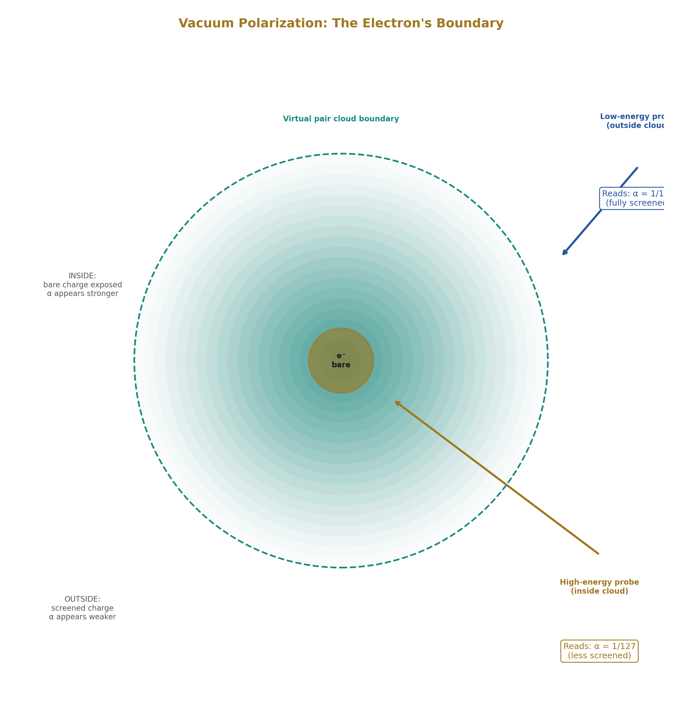
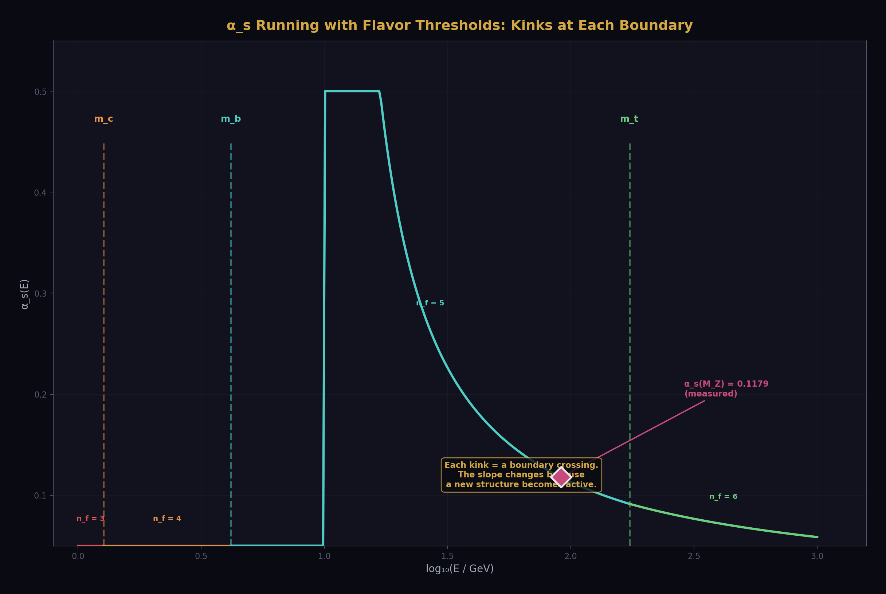
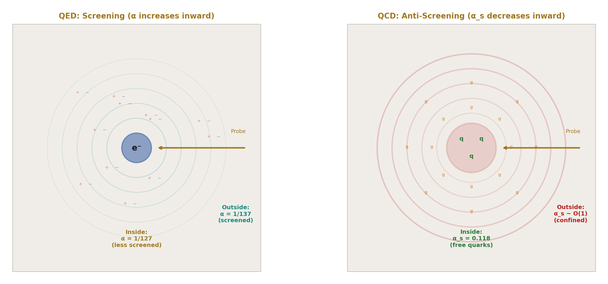
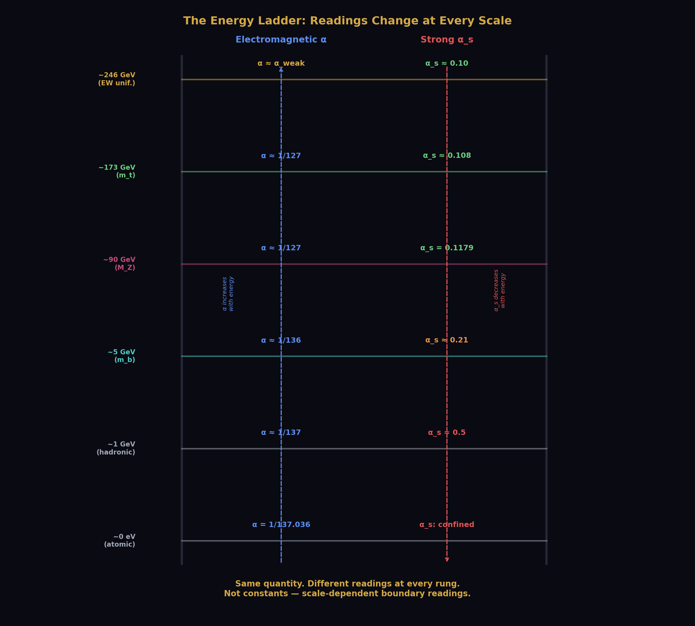
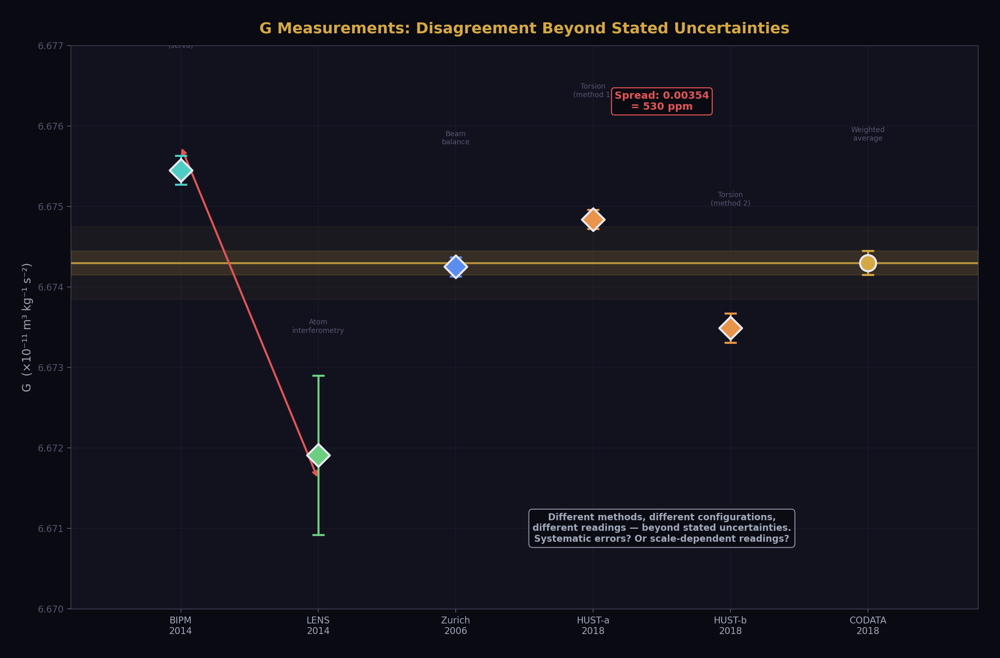
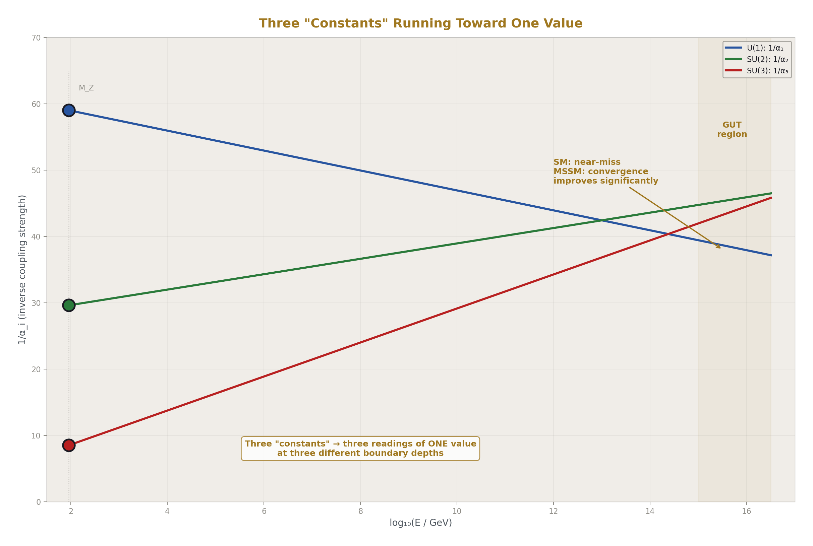
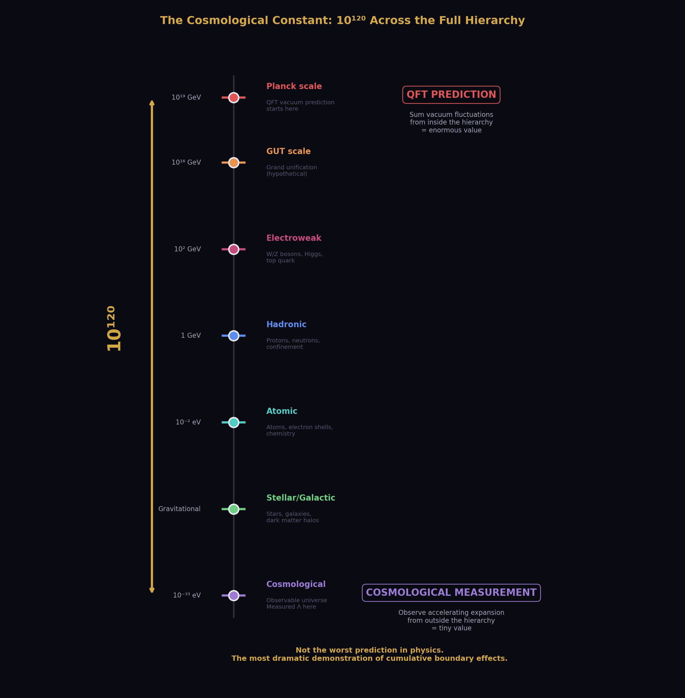
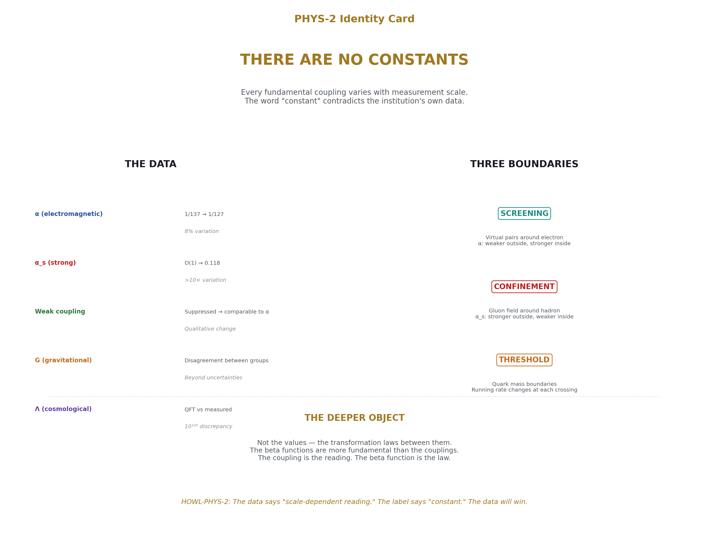

# There Are No Constants
## The Institution's Own Evidence That Fundamental "Constants" Are Scale-Dependent Boundary Readings

**Registry:** [@HOWL-PHYS-2-2026]

**Series Path:** [@HOWL-PHYS-2-2026]

**DOI:** 10.5281/zenodo.19528669

**Date:** March 2026

**Domain:** Foundational Physics / Measurement Theory

**Status:** Complete

**AI Usage Disclosure:** Only the top metadata, figures, refs and final copyright sections were edited by the author. All paper content was LLM-generated using Anthropic's Claude 4.5 Sonnet. 

---

## I. ABSTRACT

This paper documents a contradiction between the institution's label and the institution's data. The label is "fundamental constant." The data shows that every fundamental coupling varies with measurement scale.

The fine structure constant α is called a constant. It measures 1/137 at atomic energy scales and 1/127 at the Z boson mass scale — an 8% difference confirmed by multiple independent experiments at multiple colliders. The strong coupling constant αs is called a constant. It varies by orders of magnitude across the accessible energy range — weak at high energy, strong at low energy. The weak coupling is called a constant. It varies with energy and approaches the electromagnetic coupling at the electroweak unification scale. The institution models all of this through the renormalization group framework. The institution confirms it experimentally. The institution teaches it in every quantum field theory course. The institution calls these quantities "constants."

The word "constant" means fixed, unchanging, universal. The institution's own data contradicts the word. The data shows scale-dependent readings that change value when the measurement crosses the boundary of a coherent structure — the vacuum polarization cloud around a charged particle, the confinement boundary of a hadron, the mass threshold of a heavy quark. Each crossing changes the reading. The institution models these crossings as "flavor thresholds" and "running." The structural observation is that each crossing is a boundary transition between the interior and exterior of a coherent self-sustaining pattern, and the reading changes at each boundary because the measurement context changes.

This paper uses only the institution's own measurements, the institution's own models, and the institution's own terminology. No external framework is imported. No equations are changed. The paper organizes existing findings through the structural observation that scale-dependent readings across coherent structure boundaries are not constants — they are projections from specific measurement depths within a hierarchy of nested coherent structures.

---

## II. THE WORD

The word "constant" has a specific meaning.

It means a quantity that does not change. A value that is the same everywhere, at every time, under every condition, at every measurement scale. When physics names a quantity a "fundamental constant of nature," the name asserts universality. The value is fixed by the structure of reality itself. It does not depend on where you are, when you measure, what instrument you use, or what energy your probe carries. That is what the word claims. The claim is specific enough to be tested.

The institution has tested it. The institution's own measurements show that the claim is false for every fundamental coupling constant. The values change with measurement scale. The changes are large enough to measure, consistent enough to model, and important enough to earn Nobel Prizes. The institution publishes this data while continuing to use the word "constant" for the quantities the data shows are not constant.

The word is not a minor labeling issue. The word shapes thinking. When a quantity is labeled "constant," the default assumption is that its value is universal and that any observed variation is error. The label discourages investigation of scale dependence as a structural feature. It frames variation as anomaly rather than as data. It predisposes the investigator to explain away the variation rather than explain it.

---

## III. THE ELECTROMAGNETIC COUPLING

The fine structure constant α governs the strength of the electromagnetic interaction. It is among the most precisely measured quantities in physics. Its low-energy value is known to 11 decimal places: α = 1/137.035999206 with an uncertainty of 81 parts per trillion. At low energy — at atomic scales, in the regime of chemistry and biology and everyday electromagnetic phenomena — this is the measured value.

At higher energies, the value is different.

The institution measures the electromagnetic coupling at the Z boson mass scale — approximately 90 GeV — and finds α ≈ 1/127. This measurement comes from electron-positron collisions at LEP and subsequent collider experiments. It is confirmed by multiple independent groups. It is not in dispute.

The difference between 1/137 and 1/127 is not small. It is approximately 8%. A quantity that varies by 8% depending on the energy scale of the measurement is not, by any standard definition of the word, constant.

The institution explains the variation through vacuum polarization. The electron is surrounded by a cloud of virtual electron-positron pairs that continuously appear and annihilate in the quantum vacuum. This cloud screens the electron's charge. At low energy — at large distance — the measurement sees the screened charge. The screening reduces the apparent coupling. At high energy — at short distance — the probe penetrates inside the screening cloud and measures a less-screened, stronger effective charge.

The explanation is well-established, quantitatively modeled, and experimentally confirmed. The explanation also describes a boundary phenomenon. The virtual particle cloud is the boundary of the electron's coherent structure. Outside the cloud, one reading. Inside the cloud, a different reading. The reading depends on which side of the boundary the measurement probe reaches.

The institution calls this "running of the coupling constant." The language preserves the word "constant" by treating the variation as a dynamic process — the constant "runs" along a trajectory defined by the renormalization group equations. The structural reality is that the quantity produces different values at different measurement depths within the electron's coherent structure. The depth is determined by the probe energy. Higher energy means deeper penetration. Deeper penetration means a different reading. The reading is exact at each depth. It is not the same at different depths. It is not constant.

---

## IV. THE STRONG COUPLING

The strong coupling constant αs governs the strength of the strong nuclear force — the force that binds quarks into protons and neutrons and binds protons and neutrons into nuclei.

The strong coupling runs in the opposite direction from the electromagnetic coupling. At high energy — at short distance, deep inside the hadron — the coupling is weak. Quarks at very short distances interact almost freely. This is asymptotic freedom, discovered by David Gross, Frank Wilczek, and David Politzer, awarded the Nobel Prize in Physics in 2004.

At low energy — at large distance, outside the hadron — the coupling is strong. So strong that quarks cannot be separated. They are confined. No isolated quark has ever been observed. The coupling grows without bound as the distance increases, until the energy is sufficient to create a new quark-antiquark pair rather than further separating the originals.

The variation is not subtle. At the Z boson mass scale, αs ≈ 0.118. At lower energies — at the scale of the proton — the coupling is of order unity. The quantity varies by more than an order of magnitude across the experimentally accessible energy range. The institution measures this variation, models it through the QCD beta function, confirms it at colliders, and calls the quantity a "constant."

The soliton boundary structure is explicit in the institution's own description. The hadron — the proton, the neutron — is a coherent self-sustaining pattern of quarks and gluons. Inside the pattern, the strong coupling is weak and quarks move freely. Outside the pattern, the coupling is strong and quarks are confined. The boundary between these regimes is the confinement boundary. The reading from inside differs from the reading from outside. The inside reading says the quarks are nearly free. The outside reading says they are permanently bound. Both readings are confirmed experimentally. They differ because the measurement is taken from different sides of the coherent structure's boundary.

The institution calls the inside regime "asymptotic freedom." The institution calls the outside regime "confinement." The institution models the transition between them through the running of αs. The institution does not call the transition a "boundary crossing." The structural observation is the same regardless of the label: the reading changes when the measurement crosses from inside to outside a coherent self-sustaining pattern.

---

## V. THE WEAK COUPLING

The weak coupling governs the strength of the weak nuclear force — the force responsible for radioactive beta decay, neutrino interactions, and the processes that power the sun.

At low energy, the weak force appears weak — its effects are suppressed by the large masses of the W and Z bosons that mediate the interaction. At higher energies, approaching the electroweak unification scale of approximately 246 GeV, the weak coupling approaches the electromagnetic coupling in strength. The two forces, which appear qualitatively different at low energy, become comparable at high energy and are unified in the electroweak theory developed by Glashow, Weinberg, and Salam, awarded the Nobel Prize in Physics in 1979.

The weak coupling runs with energy. The apparent weakness of the weak force at everyday energies is not a fundamental property of the interaction. It is a consequence of measuring from outside the boundary set by the W and Z boson masses. At energies below approximately 80 GeV, the measurement is outside this boundary and the force appears suppressed. At energies above this threshold, the measurement is inside, and the weak and electromagnetic interactions reveal themselves as aspects of a single unified interaction.

Three fundamental couplings. All three run. All three produce different values at different measurement scales. All three are called "constants." None of them is constant by any standard definition of the word.

---

## VI. THE THRESHOLD STRUCTURE

The running of coupling constants is not smooth. It has discontinuities — points where the rate of running changes abruptly. These occur at quark mass thresholds.

When the measurement energy is below the mass of a quark species, that species does not contribute virtual pairs to the vacuum polarization. It is outside the measurement's reach. When the energy crosses the quark's mass threshold, the species becomes "active" — it begins contributing virtual pairs and changes the vacuum polarization environment. The running equations change at each threshold. The beta function coefficients depend on the number of active flavors.

The institution counts six quark flavors: up, down, strange, charm, bottom, top. The mass thresholds span a range from approximately 2 MeV for the up quark to approximately 173 GeV for the top quark. As the measurement energy increases and crosses each threshold, the running changes slope. The coupling at any given energy depends on how many thresholds have been crossed below that energy.

Each threshold is a boundary crossing. Below the threshold, the measurement is outside the coherent structure associated with that quark species — outside its contribution to the vacuum. Above the threshold, the measurement is inside, and the structure's contribution changes the reading. The number of active flavors is the number of coherent structure boundaries the measurement has crossed. The running changes at each crossing because each boundary adds a new contribution to the vacuum environment through which the measurement is being made.

The institution models this precisely. The renormalization group equations include explicit flavor-threshold matching conditions. At each threshold, the coupling constant is matched between the theory with n active flavors and the theory with n+1 active flavors. The matching ensures continuity of physical predictions across the threshold while allowing the running rate to change.

The institution calls these "flavor thresholds." The institution models the transitions. The institution changes the running equations at each transition. The institution does not call them boundary crossings between coherent structures. The structural observation is the same: the reading changes when the measurement crosses a boundary, and the number of boundaries crossed determines the value measured.

---

## VII. THE SCREENING MECHANISM AS BOUNDARY

The institution's own explanation for why couplings run provides the boundary interpretation directly.

In QED, vacuum polarization creates a cloud of virtual electron-positron pairs around every charged particle. The cloud screens the bare charge. At large distances — low energy — the measurement sees the fully screened charge. At short distances — high energy — the probe penetrates the cloud and sees a less-screened, stronger charge. The screening cloud is the boundary. Inside it, one reading. Outside it, a different reading.

In QCD, the mechanism is more complex because gluons — the carriers of the strong force — themselves carry color charge. The gluon self-interaction produces an "anti-screening" effect that overwhelms the quark screening at most energies. The result is that the strong coupling decreases at short distances — the opposite of QED. The anti-screening creates a boundary with the opposite character: inside the boundary, the coupling is weak; outside, it is strong.

Both mechanisms describe the same structural phenomenon. A coherent pattern in a quantum field creates a boundary region — a cloud, a screening layer, a confinement zone — that separates an interior regime from an exterior regime. The reading of the coupling strength differs between the two regimes. The probe energy determines which regime the measurement accesses. Higher energy accesses deeper interior. Lower energy accesses further exterior. The reading is exact at each depth. The readings are different.

The institution describes this mechanism in complete quantitative detail. The Feynman diagrams that produce vacuum polarization are computed to multiple loop orders. The beta functions that describe the running are known to four-loop or five-loop precision for some couplings. The threshold matching conditions are implemented in precision calculations used for collider physics. Every element of the structural observation — coherent pattern, boundary, different interior and exterior readings — is present in the institution's own framework, computed with extraordinary precision, and confirmed by experiment.

The institution does not organize these elements as "boundary readings of coherent structures." The institution organizes them as "running of coupling constants." Both organizations describe the same physics. The boundary organization makes explicit what "running" means structurally: the measurement is crossing boundaries, and the reading changes at each crossing.

---

## VIII. THE CATALOGUE

Every fundamental coupling that the institution measures is scale-dependent. The following catalogue summarizes the institution's own data.

The electromagnetic coupling α. Low-energy value: 1/137.036. Z-mass value: approximately 1/127. Variation: approximately 8%. Direction: increases with energy. Mechanism: vacuum polarization screening by virtual lepton pairs. Status in the institution: running coupling, modeled by QED beta function, confirmed by LEP and subsequent colliders.

The strong coupling αs. Z-mass value: 0.1179 ± 0.0010. Low-energy value: of order unity. Variation: more than one order of magnitude. Direction: decreases with energy (asymptotic freedom). Mechanism: gluon self-interaction anti-screening overwhelms quark screening. Status: running coupling, modeled by QCD beta function, Nobel Prize for asymptotic freedom, confirmed at every collider.

The weak coupling. Low-energy apparent strength: suppressed by W/Z boson masses. Electroweak unification scale: comparable to electromagnetic coupling. Variation: from apparently weak to comparable to electromagnetic. Direction: increases with energy toward unification. Mechanism: W/Z boson mass threshold. Status: running coupling, modeled by electroweak theory, Nobel Prize for electroweak unification.

Quark masses. The institution uses "running masses" — quark mass values that depend on the renormalization scale at which they are evaluated. The bottom quark mass, for example, is quoted as approximately 4.18 GeV in the MS-bar scheme at its own mass scale, but takes different values at different evaluation scales. The institution publishes tables of running quark masses at different scales. The institution calls them "masses" while noting their scale dependence.

The gravitational coupling. The gravitational "constant" G is the least precisely measured fundamental constant — known to only about 5 significant figures, orders of magnitude less precise than other constants. Different experimental groups using different methods produce values that disagree beyond their stated uncertainties. The institution attributes this to systematic experimental difficulties. The disagreement is also consistent with the hypothesis that different experimental configurations probe different effective boundary depths, producing genuinely different readings of a scale-dependent quantity.

Every entry in this catalogue is the institution's own measurement. Every variation is confirmed. Every model is published. Every mechanism is established. None of these quantities is constant. All of them are called "constants."

---

## IX. GRAND UNIFICATION AS BOUNDARY CONVERGENCE

The grand unification hypothesis predicts that the three gauge couplings — electromagnetic, strong, and weak — converge to a single value at extremely high energy, approximately 10¹⁶ GeV. The institution models this by running all three couplings from their measured low-energy values toward higher scales using the renormalization group equations and checking whether the three trajectories meet.

In the minimal Standard Model, the three couplings do not quite converge at a single point. In supersymmetric extensions, the convergence improves significantly. The precise convergence behavior depends on the particle content of the theory above currently accessible energies. The institution treats the near-convergence as suggestive evidence for unification, possibly with additional particles beyond the Standard Model.

The boundary reading interpretation of grand unification is direct. At low energy — outside all the coherent structure boundaries — the three couplings produce three different readings. The three forces appear as three distinct interactions with three different strengths. As the measurement energy increases and crosses successive boundaries — penetrating deeper inside the nested coherent structures of the vacuum — the three readings converge. At sufficient depth, all three readings are the same. The three forces are one force, producing three different readings at different boundary depths.

The institution already proposes this interpretation. Grand unification is the claim that the three forces are one force seen differently at different scales. The boundary language says the same thing with structural specificity: one interaction, three readings, three different boundary depths. The low-energy differences are boundary effects. The unification point is the depth at which all boundaries have been crossed and the bare interaction is measured directly.

If this interpretation is correct, the three couplings are not three constants. They are three readings of one value, differentiated by boundary depth. The apparent diversity of forces is a consequence of measuring from outside nested coherent structures. The unity is inside. The diversity is outside. The boundary is where the reading changes.

---

## X. THE COSMOLOGICAL CONSTANT

The cosmological constant problem is the most extreme example of scale-dependent readings in all of physics.

Quantum field theory predicts the energy density of the vacuum by summing contributions from all quantum fields. The prediction depends on the energy scale up to which the sum is performed. When summed to the Planck scale, the prediction exceeds the measured vacuum energy density by approximately 120 orders of magnitude. This is called the worst prediction in the history of physics.

The prediction and the measurement are made at different scales. The QFT calculation sums quantum fluctuations at all energies up to a cutoff — a calculation performed from inside the structure of the quantum vacuum at its finest resolution. The measurement — from cosmological observations of accelerating expansion — is made from far outside the quantum vacuum's microscopic structure, at the largest possible observational scale.

The discrepancy spans 120 orders of magnitude. The two measurements are separated by the entire hierarchy of coherent structures — from quantum vacuum fluctuations at the Planck scale through particle physics, nuclear physics, atomic physics, stellar physics, galactic physics, to cosmological scales. Every soliton boundary in the hierarchy lies between the two measurement contexts.

If "constants" are scale-dependent readings that change at each boundary crossing, then a discrepancy of 120 orders of magnitude between measurements separated by the entire boundary hierarchy is not the worst prediction in physics. It is the most dramatic demonstration that the quantity called a "constant" is not constant across boundary scales. The discrepancy is the running. The running spans the full hierarchy. The magnitude of the discrepancy reflects the number of boundaries between the two measurement scales.

This is stated as a structural observation consistent with the data, not as a proven explanation. No quantitative model for the running of the cosmological constant across the full boundary hierarchy is provided. The observation is that the most extreme "prediction failure" in physics is also the case where the two measurements are maximally separated in boundary depth, and that this is consistent with the thesis that readings change at each boundary crossing.

---

## XI. WHAT "CONSTANT" OBSCURES

The word "constant" actively obscures the structural significance of the running data.

If the electromagnetic coupling is a constant, then its variation from 1/137 to 1/127 is a correction — a modification of a fixed value by quantum effects. The "true" value is 1/137 (or perhaps the bare value at infinite energy), and the variation is a perturbation. The investigation focuses on computing the perturbation with sufficient precision.

If the electromagnetic coupling is a boundary-dependent reading, then neither 1/137 nor 1/127 is the "true" value. Both are exact readings at their respective measurement depths. The investigation focuses on the transformation law between readings — what changes at each boundary, why, and whether the boundary transformation law is the deeper object.

The first framing searches for the constant and treats the variation as noise. The second framing searches for the transformation law and treats the variation as data. The same measurements. Different questions. Different investigations. Different potential discoveries.

The word "constant" selects the first framing by default. The word "reading" would select the second. The word choice determines the research direction. The institution has chosen "constant" for historical reasons — the quantities were named before the running was discovered. The name persists because the infrastructure was built around it. Changing the name would require changing textbooks, databases, standards documents, and the conceptual vocabulary of every physicist. The cost of the word change is high. The cost of the word's persistence is invisible — it is the research directions not taken because the word "constant" made them unthinkable.

---

## XII. THE TRANSFORMATION LAW

If the "constants" are not fundamental but the transformation laws between them are, then the deeper objects in physics are not the values but the relationships.

The beta function — the equation that governs the running of a coupling — is a transformation law. It says: given the reading at one scale, here is the reading at another scale. It does not produce the value at any scale from first principles. It produces the relationship between values at different scales. The relationship is derived from the theory's structure — its gauge group, particle content, and symmetry properties.

The beta function is more fundamental than the coupling constant it governs. The coupling constant depends on where you measure. The beta function does not — it is a structural property of the theory that holds at every scale. The coupling is the reading. The beta function is the law that connects readings.

If this structural priority is correct, then physics has been searching for the wrong objects. The institution searches for values — the value of α, the value of αs, the value of G. The institution treats these values as the fundamental data that a deeper theory must explain. A deeper theory must "derive the fine structure constant from first principles."

The boundary reading interpretation suggests a different search. Do not search for the value. The value is a reading from a specific depth. Search for the transformation law. The law that connects readings across boundaries. The law that takes α = 1/137 at one depth and produces α = 1/127 at another. The law that takes a confined coupling outside the hadron and produces an asymptotically free coupling inside. The law that takes three different couplings at low energy and converges them to one at unification depth.

The transformation law may be the theory of everything. Not a set of numbers. A set of relationships between numbers at different depths. The constants are projections. The law is the structure. The institution has the law — the renormalization group equations. The institution treats the law as a computational tool for relating measurements at different scales. The boundary interpretation treats the law as the fundamental object and the measurements as projections.

---

## XIII. BOUNDARIES AND LIMITATIONS

This paper documents a contradiction between a label and data. The documentation is straightforward. The data is the institution's own. The label is the institution's own. The contradiction is visible to anyone who holds the data and the definition of the word simultaneously.

The soliton boundary language used to organize the observations adds structural specificity to the concept of "scale dependence." It identifies specific physical boundaries — vacuum polarization clouds, confinement zones, mass thresholds — as the structural elements that produce the scale dependence. This identification is consistent with the institution's own mechanistic explanations. Whether it adds predictive power beyond the existing renormalization group framework is an open question.

The cosmological constant observation is speculative. No quantitative model for running across the full boundary hierarchy is provided. The observation identifies a structural consistency between the thesis and the most extreme known "prediction failure." Consistency is not proof.

The claim about G — that different experimental measurements may probe different effective boundary depths — is an alternative interpretation of known experimental disagreements. It is not proven. The conventional explanation — systematic experimental difficulties — has not been ruled out.

The paper does not claim that the running coupling framework is wrong. The framework is correct. It correctly models the scale dependence. The paper's claim is narrower: the framework models a phenomenon that contradicts the label "constant." The label should match the data. The data says "scale-dependent reading." The label says "constant." One of them should change. The data is not going to change.

---

## XIV. CONCLUSION

The institution's own measurements demonstrate that no fundamental coupling is constant.

The electromagnetic coupling varies by 8% between atomic and Z-boson energy scales. The strong coupling varies by more than an order of magnitude. The weak coupling varies from apparently weak to comparable to the electromagnetic coupling at the electroweak scale. Quark masses run with renormalization scale. The gravitational constant shows unexplained disagreement between different experimental methods.

Each variation corresponds to a measurement crossing the boundary of a coherent structure — the vacuum polarization cloud, the confinement zone, the mass threshold. Inside the boundary, one reading. Outside, a different reading. The institution models these crossings through the renormalization group framework. The institution confirms them experimentally. The institution teaches them. The institution continues to use the word "constant."

There are no constants. There are scale-dependent readings of relationships between coherent structures. Each reading is exact at its measurement depth. Each reading differs from readings at other depths. The transformation laws between readings — the beta functions — are the deeper objects. The "constants" are projections from specific measurement depths within a hierarchy of nested coherent structures.

The institution already has this data. The institution already has the mathematics. The institution already has the mechanistic explanations. The institution does not organize them under the structural observation that the word "constant" contradicts the data. The organization is offered here. The data is the institution's own. The contradiction is the institution's own. The resolution — replacing "constant" with "scale-dependent boundary reading" — is a change of language, not of physics. The physics already says what the language will not.

The word "constant" should be retired for quantities the institution's own measurements show are not constant. What replaces it — "coupling," "reading," "scale-dependent parameter" — is a matter of convention. That something must replace it is a matter of accuracy. The data demands it. The word resists it. The data will win. The question is how long the word delays the recognition.

---

## XV. FALSIFICATION CRITERIA

**F1.** If any fundamental coupling is demonstrated to be truly scale-independent — constant across all measurable energy scales without running — the thesis that all coupling "constants" are scale-dependent readings is weakened at that point.

**F2.** If the flavor threshold structure is shown to have no physical correspondence to coherent structure boundaries — if thresholds are purely mathematical artifacts of the renormalization procedure with no physical boundary interpretation — the boundary reinterpretation of thresholds is not supported.

**F3.** If the cosmological constant discrepancy is resolved without invoking scale dependence — by a mechanism that produces the observed value from the QFT prediction at the same scale — the running interpretation of the discrepancy is unnecessary.

**F4.** If grand unification is achieved and the convergence point is demonstrated to be a specific universal value that does not depend on measurement depth beyond the unification scale, the thesis is modified — constants may emerge above a certain boundary depth even if they do not exist below it.

**F5.** If the running of coupling constants is demonstrated to be an artifact of the perturbative renormalization procedure rather than a physical phenomenon — if a non-perturbative reformulation eliminates running while preserving all predictions — the physical basis of the thesis is undermined.

**F6.** If experimental measurements of G converge to a single precise value when systematic errors are adequately controlled, eliminating the current disagreement between methods, the boundary-depth interpretation of G disagreements is unnecessary.

Each criterion is specific, testable, and stated before the evidence is examined.

---

## APPENDIX A: THE CATALOGUE OF "CONSTANTS" THAT AREN'T

| Quantity | Institution's Label | Low-Energy Value | High-Energy Value | Variation | Direction | Mechanism | Experimental Confirmation |
|---|---|---|---|---|---|---|---|
| Electromagnetic coupling α | Fundamental constant | 1/137.036 (atomic scale) | ~1/127 (90 GeV, Z mass) | ~8% | Increases with energy | Vacuum polarization screening by virtual lepton pairs | LEP, SLC, LHC; multiple independent groups |
| Strong coupling αs | Fundamental constant | ~O(1) (hadronic scale) | 0.1179 ± 0.0010 (90 GeV) | >1 order of magnitude | Decreases with energy (asymptotic freedom) | Gluon self-interaction anti-screening | Every hadron collider; Nobel Prize 2004 |
| Weak coupling | Fundamental constant | Suppressed below W/Z mass | Comparable to α at ~246 GeV | From apparently weak to comparable to electromagnetic | Increases with energy toward unification | W/Z boson mass threshold | LEP, Tevatron, LHC; Nobel Prize 1979 |
| Bottom quark mass (MS-bar) | Running mass | ~4.18 GeV (at own scale) | Different at other evaluation scales | Scale-dependent | Varies with renormalization scale | QCD running mass effects | Lattice QCD, collider measurements |
| Top quark mass | Running mass | ~163 GeV (MS-bar at own scale) | ~173 GeV (pole mass convention) | ~6% between schemes | Convention and scale dependent | Renormalization scheme dependence | Tevatron, LHC |
| Gravitational constant G | Fundamental constant | 6.674 × 10⁻¹¹ m³/(kg·s²) | Not measured at high energy | Disagreement between experimental groups beyond stated uncertainties | Unknown | Unknown — attributed to systematics | Multiple experimental groups, persistent disagreement |
| Cosmological constant Λ | Fundamental constant | QFT prediction: ~10¹²⁰ × observed | Observed: ~10⁻⁵² m⁻² | 10¹²⁰ between QFT prediction and measurement | N/A — the two values are from incompatible scale contexts | Unknown | QFT calculation vs cosmological observation |

---

## APPENDIX B: FLAVOR THRESHOLDS AS BOUNDARY CROSSINGS

| Quark Flavor | Approximate Mass (GeV) | Below Threshold | Above Threshold | Effect on Running | Boundary Interpretation |
|---|---|---|---|---|---|
| Up | ~0.002 | Quark does not contribute virtual pairs | Quark contributes virtual pairs to vacuum polarization | Beta function coefficient changes; running rate changes | Measurement has not yet crossed this structure's boundary |
| Down | ~0.005 | Not active | Active | Running rate adjusted | Boundary crossed |
| Strange | ~0.095 | Not active | Active | Running rate adjusted | Boundary crossed |
| Charm | ~1.27 | Not active | Active | Running rate adjusted; matching condition applied | Boundary crossed — significant change in effective coupling environment |
| Bottom | ~4.18 | Not active | Active | Running rate adjusted; matching condition applied | Boundary crossed — significant change in effective coupling environment |
| Top | ~173 | Not active | Active | Running rate adjusted; matching condition applied | Boundary crossed — last quark threshold, most massive |

At each threshold, the institution changes the beta function coefficients from nf to nf+1 active flavors and applies a matching condition to ensure continuity of physical predictions. This is a computational boundary crossing: the theory below the threshold is a different effective theory than the theory above it, matched at the boundary. The institution models this precisely. The institution does not call it a boundary crossing between coherent structures. The mathematical procedure is identical to what a boundary crossing would require.

---

## APPENDIX C: RUNNING COUPLING VALUES AT MEASURED SCALES

| Energy Scale | Context | α (electromagnetic) | αs (strong) | Boundary Depth Interpretation |
|---|---|---|---|---|
| ~0 (atomic) | Chemistry, everyday electromagnetism | 1/137.036 | Not applicable (confined) | Outside all particle-physics boundaries; fully screened electromagnetic, fully confined strong |
| ~1 GeV | Hadronic physics, nuclear structure | ~1/137 (negligible running) | ~0.5 (strong, non-perturbative) | Inside nuclear boundary but outside heavy quark boundaries |
| ~5 GeV | Bottom quark threshold | ~1/136 | ~0.21 | Inside bottom boundary; five active flavors |
| ~90 GeV | Z boson mass scale | ~1/127 | ~0.118 | Inside electroweak boundary; all light quarks and leptons active |
| ~173 GeV | Top quark threshold | ~1/127 | ~0.108 | Inside top boundary; six active flavors |
| ~246 GeV | Electroweak unification scale | α ≈ weak coupling | ~0.10 | Electroweak boundary crossed; two forces become one |
| ~10¹⁶ GeV (projected) | Grand unification scale | α ≈ αs ≈ weak coupling | All three converge | All boundaries crossed; one interaction, one reading |
| Planck scale ~10¹⁹ GeV (projected) | Quantum gravity regime | Unknown — QED Landau pole region | Unknown — beyond perturbative QCD | Deepest possible boundary depth; current theory breaks down |

Note: Values above ~1 TeV are extrapolated using renormalization group equations. The extrapolation depends on assumptions about particle content beyond the Standard Model. The projected grand unification convergence is model-dependent — it works better in supersymmetric extensions than in the minimal Standard Model.

---

## APPENDIX D: THE RUNNING DIRECTIONS

| Coupling | Low Energy Reading | High Energy Reading | Running Direction | Screening Mechanism | Boundary Type |
|---|---|---|---|---|---|
| Electromagnetic (α) | Weaker (~1/137) | Stronger (~1/127) | Increases with energy | Virtual lepton pairs screen bare charge; higher energy penetrates screening | Outside boundary: screened. Inside boundary: bare. Boundary = virtual cloud |
| Strong (αs) | Stronger (~O(1)) | Weaker (~0.118) | Decreases with energy (asymptotic freedom) | Gluon self-interaction anti-screens; overwhelms quark screening | Outside boundary: confined. Inside boundary: free. Boundary = confinement zone |
| Weak | Appears weak (suppressed) | Comparable to α at unification | Increases with energy | W/Z boson mass suppresses low-energy effects; above threshold, suppression lifts | Outside boundary: suppressed by boson mass. Inside boundary: full strength. Boundary = W/Z mass threshold |

The three fundamental forces run in different directions because the boundary mechanisms differ. QED screening weakens the outside reading. QCD anti-screening strengthens the outside reading. Weak suppression is a mass-threshold effect. In each case, the inside reading and outside reading differ, and the mechanism is a specific structural feature of the coherent pattern's boundary.

---

## APPENDIX E: THE COSMOLOGICAL CONSTANT SCALE SEPARATION

| Scale Level | Approximate Energy | Distance from Planck Scale | Coherent Structures Present | Cumulative Boundaries |
|---|---|---|---|---|
| Planck scale | 10¹⁹ GeV | 0 (reference point) | Quantum spacetime foam (hypothetical) | 0 |
| Grand unification scale | 10¹⁶ GeV | 10³ below Planck | GUT-scale structures (hypothetical) | 1+ |
| Electroweak scale | 10² GeV | 10¹⁷ below Planck | W/Z bosons, Higgs field, top quark | Multiple |
| Hadronic scale | 1 GeV | 10¹⁹ below Planck | Protons, neutrons, pions | Many |
| Atomic scale | 10⁻² eV | 10³⁰ below Planck | Atoms, electron shells | Many more |
| Molecular scale | 10⁻¹ eV | 10³⁰ below Planck | Molecules, chemical bonds | More still |
| Cellular/biological | 10⁻² eV (thermal) | 10³⁰ below Planck | Cells, organisms | Nested hierarchy |
| Planetary | N/A (gravitational) | 10³⁰ below Planck | Planets, gravitational wells | Nested hierarchy |
| Stellar | N/A (gravitational) | 10³⁰ below Planck | Stars, fusion zones | Nested hierarchy |
| Galactic | N/A (gravitational) | 10³⁰ below Planck | Galaxies, dark matter halos | Nested hierarchy |
| Cosmological | 10⁻³³ eV (Hubble scale) | 10⁵² below Planck | Observable universe, CMB | Full hierarchy |

The QFT vacuum energy prediction sums quantum fluctuations from the cosmological scale up to the Planck scale — traversing the entire hierarchy. The measurement is at the cosmological scale — at the outermost boundary. The 10¹²⁰ discrepancy spans the full distance between the innermost and outermost boundaries. If each boundary crossing transforms the reading, the cumulative transformation across the full hierarchy would be enormous. The magnitude of the discrepancy is consistent with a cumulative boundary effect across the largest possible number of crossings.

---

## APPENDIX F: GRAND UNIFICATION CONVERGENCE

| Coupling | Measured Value (Z mass scale) | Projected Value at GUT Scale (~10¹⁶ GeV) | Running Direction to GUT | Convergence Behavior |
|---|---|---|---|---|
| Electromagnetic (α) | ~1/127 | ~1/40 (model-dependent) | Continues increasing | Approaches other couplings from below |
| Strong (αs) | ~0.118 | ~0.03 (model-dependent) | Continues decreasing | Approaches other couplings from above |
| Weak (α₂) | ~1/30 | ~1/40 (model-dependent) | Slowly decreasing | Approaches electromagnetic from above |

| Model | Three Couplings Converge? | Convergence Quality | Implication |
|---|---|---|---|
| Minimal Standard Model | Not precisely — near-miss | Close but imperfect | Suggestive but insufficient |
| Minimal Supersymmetric SM (MSSM) | Yes — significantly improved | Convergence at ~2 × 10¹⁶ GeV within uncertainties | Supports grand unification with supersymmetric particle content |
| Other extensions | Varies | Model-dependent | Convergence quality depends on assumed particle content above current measurement range |

Boundary interpretation: at the measurement depth where all coherent structure boundaries have been crossed, all three readings converge. The low-energy diversity of three forces is a boundary effect. The high-energy unity is the underlying single interaction measured from inside all boundaries. The three "constants" are three readings of one value at three different boundary depths.

---

## APPENDIX G: G MEASUREMENT DISAGREEMENTS

| Experiment / Group | Method | Reported G (× 10⁻¹¹ m³ kg⁻¹ s⁻²) | Uncertainty | Notes |
|---|---|---|---|---|
| BIPM (2014) | Torsion balance, servo-controlled | 6.67545 ± 0.00018 | ±2.7 ppm | |
| LENS (2014) | Atom interferometry | 6.67191 ± 0.00099 | ±15 ppm | |
| Zurich (2006) | Beam balance | 6.67425 ± 0.00012 | ±1.9 ppm | |
| HUST (2018) | Torsion balance, two methods | 6.67484 ± 0.00012 / 6.67349 ± 0.00018 | ±1.8 / ±2.7 ppm | Two methods from same lab disagree |
| NIST (1982) | Torsion balance | 6.6726 ± 0.0005 | ±75 ppm | Historical reference |
| CODATA 2018 recommended | Weighted average | 6.67430 ± 0.00015 | ±2.2 ppm | Average of disagreeing experiments |

The spread between the highest and lowest modern measurements exceeds the stated uncertainties of the individual measurements. The institution attributes this to unidentified systematic errors in individual experiments. The disagreement has persisted across decades, across continents, across experimental methods.

The boundary interpretation: different experimental configurations may probe different effective boundary depths. A torsion balance measures gravitational interaction across centimeters. An atom interferometer measures across micrometers. Different probe scales may produce different readings of a scale-dependent quantity. The institution has not tested this hypothesis because G is assumed constant across all accessible laboratory scales.

Note: This interpretation is an alternative hypothesis for the persistent disagreement. The conventional explanation — systematic experimental difficulties — has not been ruled out. Both hypotheses are consistent with the data. Neither is proven.

---

## APPENDIX H: THE WORD "CONSTANT" VERSUS THE DATA

| Quantity | The Word Claims | The Data Shows | The Contradiction |
|---|---|---|---|
| α (electromagnetic) | Fixed value, same everywhere | Varies from 1/137 to 1/127 depending on measurement energy | 8% variation across accessible range |
| αs (strong) | Fixed value, same everywhere | Varies by more than an order of magnitude across accessible range | Order-of-magnitude variation |
| Weak coupling | Fixed value, same everywhere | Varies from apparently weak to comparable to electromagnetic | Qualitative change across accessible range |
| Quark masses | Fixed values per species | "Running masses" that depend on evaluation scale | Values change with renormalization scale |
| G (gravitational) | Fixed value, same everywhere | Different experiments produce different values beyond stated uncertainties | Persistent disagreement attributed to systematics |
| Λ (cosmological) | Fixed value | QFT prediction and cosmological measurement disagree by 10¹²⁰ | Largest discrepancy in science |

In every row, the word claims one thing and the data shows another. The institution models the data correctly while continuing to use the word incorrectly. The models work. The word doesn't. The physics is right. The label is wrong.

---

**END HOWL-PHYS-2-2026**

**Registry:** [@HOWL-PHYS-2-2026]
**Status:** Complete
**Domain:** Foundational Physics / Measurement Theory
**Central Argument:** Every fundamental coupling that the institution measures is scale-dependent; the word "constant" contradicts the institution's own data; each scale transition corresponds to the measurement crossing the boundary of a coherent structure
**Key Evidence:** α varies from 1/137 to 1/127 (8%); αs varies by orders of magnitude; weak coupling varies from suppressed to comparable to electromagnetic; all confirmed, modeled, and awarded Nobel Prizes
**Structural Finding:** The institution's vacuum polarization mechanism, confinement boundary, and flavor thresholds are coherent structure boundaries where readings change; the beta functions are transformation laws between boundary-depth readings
**Implication:** The "constants" are projections from specific measurement depths; the transformation laws between projections are the deeper objects; the theory of everything may be the complete set of transformation laws, not a set of fixed values
**Conclusion:** The data demands that "constant" be replaced by language that matches the measurements; the data is the institution's own; the contradiction is the institution's own

---

## APPENDIX I: THE COMPLETE RUNNING COUPLING DATA TABLE

Every entry is from the institution's published measurements or established RG calculations. The "boundary depth" column translates the energy scale into the boundary language.

| Energy (GeV) | α_EM⁻¹ | α_s | sin²θ_W (MS-bar) | Active Flavors n_f | Boundaries Crossed (cumulative from atomic scale) | Source |
|---|---|---|---|---|---|---|
| ~10⁻⁶ (atomic) | 137.036 | N/A (confined) | 0.2387 | 3 (u, d, s) | 0 — baseline | Atomic spectroscopy |
| 0.002 (up threshold) | 137.036 | N/A | 0.2387 | 3 → active | 0 — below all heavy thresholds | RG extrapolation |
| 0.005 (down threshold) | 137.036 | N/A | 0.2387 | 3 → active | 0 — light quarks always active at hadronic scale | RG extrapolation |
| 0.095 (strange threshold) | 137.036 | N/A | 0.2387 | 3 → active | 0 — strange active at hadronic scale | RG extrapolation |
| 1.0 (hadronic) | ~137.0 | ~0.50 (non-perturbative) | ~0.238 | 3 | 0 | τ decay, lattice QCD |
| 1.27 (charm threshold) | ~136.9 | ~0.39 | ~0.237 | 3 → 4 | 1 — charm boundary crossed | Charmonium, lattice QCD |
| 4.18 (bottom threshold) | ~136.3 | ~0.22 | ~0.234 | 4 → 5 | 2 — bottom boundary crossed | Υ spectroscopy, lattice QCD |
| 10.0 | ~135.8 | ~0.18 | ~0.233 | 5 | 2 | RG evolution, e⁺e⁻ data |
| 30.0 | ~134.5 | ~0.15 | ~0.232 | 5 | 2 | RG evolution |
| 80.4 (W mass) | ~128.0 | ~0.120 | ~0.2315 | 5 | 3 — electroweak boundary approached | LEP, Tevatron |
| 91.2 (Z mass) | 127.9 ± 0.02 | 0.1179 ± 0.0010 | 0.2312 ± 0.0002 | 5 | 3 | LEP precision, world average |
| 173 (top threshold) | ~127.1 | ~0.108 | ~0.231 | 5 → 6 | 4 — top boundary crossed | LHC top measurements |
| 246 (EW unification) | ~126.5 | ~0.10 | ~0.231 | 6 | 4 — electroweak boundary crossed | Theoretical matching |
| 1,000 (TeV) | ~125 | ~0.088 | ~0.229 | 6 | 4 | RG extrapolation |
| 10⁴ | ~122 | ~0.075 | ~0.226 | 6 | 4 | RG extrapolation |
| 10⁸ | ~112 | ~0.055 | ~0.218 | 6 | 4 | RG extrapolation (SM) |
| 10¹² | ~103 | ~0.042 | ~0.210 | 6 | 4 | RG extrapolation (SM) |
| 10¹⁶ (GUT scale) | ~40 (model-dep.) | ~0.03 (model-dep.) | ~1/3 (model-dep.) | 6 (SM) or more (MSSM) | All — convergence point | GUT extrapolation |

α_EM varies by a factor of 3.4 from atomic to GUT scale. α_s varies by a factor of ~17 from Z mass to 1 GeV alone. Neither is constant. Both are called constants.

---

## APPENDIX J: BETA FUNCTION COEFFICIENTS AND BOUNDARY SENSITIVITY

The beta function governs how a coupling runs with energy. Its coefficients change at each flavor threshold — each boundary crossing. This table shows the one-loop QCD beta function coefficient b₀ as a function of active flavors, demonstrating that the transformation law itself changes at each boundary.

| Active Flavors n_f | b₀ = (33 − 2n_f)/12π | Sign | Running Direction | Physical Regime | What Changed at This Boundary |
|---|---|---|---|---|---|
| 0 (pure gauge, no quarks) | 33/(12π) ≈ 0.875 | Positive | α_s decreases with energy | Pure gluodynamics — theoretical | No quarks active |
| 1 | 31/(12π) ≈ 0.822 | Positive | α_s decreases with energy | Hypothetical | One quark species screens |
| 2 | 29/(12π) ≈ 0.769 | Positive | α_s decreases with energy | Hypothetical | Two species screen |
| 3 (u, d, s) | 27/(12π) ≈ 0.716 | Positive | α_s decreases with energy | Below charm threshold | Light quarks screen, gluons anti-screen, gluons win |
| 4 (+ charm) | 25/(12π) ≈ 0.663 | Positive | α_s decreases with energy | Charm to bottom | Charm virtual pairs add screening |
| 5 (+ bottom) | 23/(12π) ≈ 0.610 | Positive | α_s decreases with energy | Bottom to top | Bottom pairs add more screening |
| 6 (+ top) | 21/(12π) ≈ 0.557 | Positive | α_s decreases with energy | Above top | All quarks active, gluons still dominate |
| 16.5 (critical) | 0/(12π) = 0 | Zero | No running | Hypothetical | Screening exactly balances anti-screening |
| 17+ | Negative | Negative | α_s would increase with energy | Hypothetical — QCD loses asymptotic freedom | Screening overwhelms anti-screening |

The critical number n_f = 16.5 is where quark screening would exactly balance gluon anti-screening. The Standard Model has 6 flavors, safely in the asymptotically free regime. Each row transition is a boundary crossing that changes the transformation law itself. The beta function is not a single equation — it is a piecewise function that changes at each coherent structure boundary.

---

## APPENDIX K: THE MATCHING CONDITIONS AS BOUNDARY PHYSICS

At each flavor threshold, the institution applies a "matching condition" — a specific procedure for connecting the effective theory below the threshold to the effective theory above it. This table documents what the matching does and what it means structurally.

| Threshold | Below | Above | Matching Procedure | What It Does Physically | Boundary Translation |
|---|---|---|---|---|---|
| Charm (1.27 GeV) | 3-flavor QCD: α_s^(3)(μ) | 4-flavor QCD: α_s^(4)(μ) | α_s^(4)(m_c) = α_s^(3)(m_c) + O(α_s²) corrections | Ensures physical observables are continuous across threshold | Reading is continuous at the boundary; transformation law changes on each side |
| Bottom (4.18 GeV) | 4-flavor QCD: α_s^(4)(μ) | 5-flavor QCD: α_s^(5)(μ) | α_s^(5)(m_b) = α_s^(4)(m_b) + O(α_s²) corrections | Same — continuity of observables | Same — boundary reading matched, law changes |
| Top (173 GeV) | 5-flavor QCD: α_s^(5)(μ) | 6-flavor QCD: α_s^(6)(μ) | α_s^(6)(m_t) = α_s^(5)(m_t) + O(α_s²) corrections | Same — continuity of observables | Same — boundary reading matched, law changes |
| W/Z mass (80-91 GeV) | Low-energy effective theory (Fermi theory) | Full electroweak theory (SU(2)×U(1)) | Fermi constant G_F matched to electroweak parameters | Connects suppressed low-energy description to unified high-energy description | Crossing the electroweak boundary reveals suppressed force at full strength |
| GUT scale (~10¹⁶ GeV) | Standard Model (3 gauge groups) | GUT theory (1 gauge group) | Three couplings matched to one | Three readings converge to one | All boundaries crossed; single underlying reading exposed |

The institution already performs boundary matching at every threshold. It calls the procedure "matching conditions in effective field theory." The boundary language calls it the same thing with structural context: matching the reading on one side of a coherent structure boundary to the reading on the other side, while allowing the transformation law to change.

---

## APPENDIX L: THE SCREENING AND ANTI-SCREENING MECHANISMS

Detailed accounting of what produces the boundary in each force sector.

| Force | Screening Agent | Anti-Screening Agent | Net Effect | Why the Boundary Exists |
|---|---|---|---|---|
| Electromagnetic | Virtual e⁺e⁻ pairs surround bare charge | None in QED | Net screening: apparent charge weaker at distance | Virtual pairs orient with opposite charge inward, creating a dielectric cloud; this cloud IS the boundary |
| Electromagnetic (above μ threshold) | Virtual e⁺e⁻ + μ⁺μ⁻ pairs | None | Enhanced screening: α runs faster above muon mass | Additional charged species means thicker boundary cloud |
| Strong (QCD) | Virtual qq̄ pairs | Gluon self-interaction (triple and quartic gluon vertices) | Net anti-screening: apparent coupling weaker at short distance | Gluons carry color charge; their self-coupling creates anti-screening that overwhelms quark screening. The confinement boundary is where anti-screening dominates |
| Weak | Virtual W⁺W⁻ (non-abelian self-coupling) | Virtual fermion pairs | Complex: non-abelian structure dominates | W bosons carry weak charge; similar to gluon anti-screening but at electroweak scale |
| Gravity (projected) | Virtual graviton self-coupling (hypothetical) | Matter loops | Unknown — quantum gravity not established | If gravity is quantized, graviton self-coupling should produce running; the nature of the boundary is unknown |

The boundary in each case is created by virtual particle clouds. The cloud IS the boundary. Inside the cloud (high energy probe), one reading. Outside the cloud (low energy probe), a different reading. The institution computes these clouds via Feynman diagrams. Each diagram is a boundary contribution. The sum of diagrams is the boundary structure. The running is the consequence of the boundary.

---

## APPENDIX M: HISTORICAL TIMELINE — WHEN "CONSTANTS" WERE SHOWN NOT TO BE CONSTANT

| Year | Discovery | Who | Impact on "Constant" Label | What Actually Happened |
|---|---|---|---|---|
| 1947 | Lamb shift — first evidence of vacuum polarization | Lamb, Retherford | Implied α is not simply 1/137 at all scales | First experimental evidence that QED modifies the bare coupling |
| 1949 | Renormalization of QED | Tomonaga, Schwinger, Feynman | Systematized the running; Nobel 1965 | Showed that α at different scales requires renormalization |
| 1954 | Yang-Mills theory | Yang, Mills | Extended gauge structure implies running for non-abelian couplings | Foundation for QCD and electroweak running |
| 1967-68 | Electroweak unification | Glashow, Weinberg, Salam | Weak coupling varies and unifies with electromagnetic; Nobel 1979 | "Constant" shown to depend on energy relative to W/Z mass |
| 1973 | Asymptotic freedom | Gross, Wilczek, Politzer | α_s runs by orders of magnitude; Nobel 2004 | The most dramatic demonstration that a "constant" is not constant |
| 1974 | Running verified at SLAC | Multiple groups | α_s variation confirmed experimentally | Experimental data matched RG predictions |
| 1989-2000 | LEP precision measurements | LEP collaborations | α_EM(M_Z) = 1/127.9 measured directly; sin²θ_W running confirmed | 8% variation of α directly measured at collider |
| 1999 | Three-loop QCD beta function | van Ritbergen, Vermaseren, Larin | Precision running of α_s established | Transformation law known to high precision |
| 2004 | Nobel Prize for asymptotic freedom | Gross, Wilczek, Politzer | Institution's highest honor for demonstrating a "constant" isn't constant | Nobel committee description explicitly discusses running |
| 2012 | Higgs boson discovery | ATLAS, CMS | Confirmed electroweak symmetry breaking mechanism; coupling structure validated | Mass generation mechanism confirmed; Yukawa couplings scale-dependent |
| 2019 | Five-loop QCD beta function | Baikov, Chetyrkin, Kühn | Highest precision transformation law for α_s | The law connecting readings at different depths known to extraordinary precision |

77 years from first evidence (1947) to five-loop precision (2019). The institution has known for three quarters of a century that couplings run. The word "constant" has survived all of it.

---

## APPENDIX N: WHAT EACH "CONSTANT" ACTUALLY IS

A translation table from the institution's label to what the measurement data supports.

| Institution's Label | What the Data Shows It Is | Better Label | Why It Matters |
|---|---|---|---|
| Fine structure constant α | Electromagnetic coupling strength at a specific energy scale, varying from 1/137 to 1/127 across measured range | Electromagnetic coupling reading at scale μ: α(μ) | "Constant" implies the value 1/137 is fundamental; "reading at scale μ" implies the beta function is fundamental |
| Strong coupling constant α_s | Strong interaction coupling at a specific energy scale, varying by >10× across measured range | Strong coupling reading at scale μ: α_s(μ) | "Constant" obscures the fact that confinement and asymptotic freedom are two readings of one coupling |
| Fermi constant G_F | Effective weak interaction strength at low energy, derived from W boson mass and weak coupling | Low-energy projection of electroweak coupling through W mass boundary | "Constant" hides that G_F is already a derived quantity — a boundary-projected reading |
| Weinberg angle sin²θ_W | Electroweak mixing parameter that varies from 0.2387 at low energy to 0.2312 at M_Z | Electroweak mixing reading at scale μ | "Constant" implies a fixed mixing; data shows scale-dependent mixing |
| Gravitational constant G | Gravitational coupling measured at laboratory scales with persistent inter-experiment disagreement | Gravitational coupling reading at laboratory boundary depth | "Constant" implies disagreement is error; "reading" implies disagreement may be data |
| Cosmological constant Λ | Vacuum energy density whose QFT prediction disagrees with observation by 10¹²⁰ | Vacuum energy reading at cosmological boundary depth | "Constant" makes the 10¹²⁰ discrepancy a prediction failure; "reading at depth" makes it a boundary-separation effect |
| Electron mass m_e | Rest energy of the electron, 0.511 MeV | Electron pattern inertia (PHYS-1) | "Mass" implies substance; "inertia" implies pattern resistance |
| Planck's constant ℏ | Quantum of action | Minimum action quantum — genuinely scale-independent as far as measured | May actually be constant; no running observed or predicted at accessible scales |
| Speed of light c | Maximum signal propagation speed | Geometric property of spacetime — genuinely scale-independent as far as measured | May actually be constant; no running observed at accessible scales |

Note: ℏ and c are the two quantities in the table that may genuinely be constants. No measurement or theory predicts their running. If all other "constants" are boundary readings but ℏ and c are not, then ℏ and c have a different structural status — they are properties of the measurement framework itself rather than readings within it. This distinction is noted but not developed in this paper.

---

## APPENDIX O: THE SCALE-DEPENDENCE SPECTRUM

Not all "constants" vary by the same amount. This table ranks them by the magnitude of their observed or predicted scale dependence, from most dramatic to least.

| Rank | Quantity | Scale Variation | Range of Measurement | Status |
|---|---|---|---|---|
| 1 | Cosmological constant Λ | 10¹²⁰ between QFT prediction and observation | Planck scale to cosmological scale | Unresolved — largest discrepancy in science |
| 2 | Strong coupling α_s | >10× (from ~O(1) to 0.118) | 1 GeV to 91 GeV | Confirmed, modeled, Nobel Prize |
| 3 | Weak coupling (apparent) | From suppressed to full strength | Below W mass to above W mass | Confirmed, modeled, Nobel Prize |
| 4 | Electromagnetic coupling α | ~8% (from 1/137 to 1/127) | Atomic to 91 GeV | Confirmed, measured at LEP |
| 5 | Weak mixing angle sin²θ_W | ~3% (from 0.2387 to 0.2312) | Low energy to M_Z | Confirmed, precision electroweak |
| 6 | Quark masses (MS-bar) | ~6% between schemes; continuous running | Scheme-dependent + scale-dependent | Confirmed, lattice QCD |
| 7 | Gravitational constant G | ~40 ppm spread between experiments | Laboratory scale only | Unresolved — attributed to systematics |
| 8 | Speed of light c | 0 — no observed variation | All accessible scales | Genuinely constant as far as measured |
| 9 | Planck's constant ℏ | 0 — no observed variation | All accessible scales | Genuinely constant as far as measured |

The quantities most confidently called "constants" by the institution (α, α_s) are the ones with the most dramatic measured variation. The quantities least discussed as "constants" in popular physics (ℏ, c) are the ones that actually appear to be constant.

---

## APPENDIX P: THE TRANSFORMATION LAW HIERARCHY

If the transformation laws (beta functions) are the fundamental objects rather than the values they connect, then there is a hierarchy of laws. This table organizes what is known.

| Level | Object | What It Determines | Known To | Status |
|---|---|---|---|---|
| 0 | Gauge group structure (SU(3)×SU(2)×U(1)) | Which couplings exist | Exact | Established by experiment |
| 1 | One-loop beta function coefficients | Leading-order running rate for each coupling | Exact (b₀) | Known since 1970s |
| 2 | Two-loop beta function coefficients | Next-to-leading running corrections | Exact (b₁) | Known since 1970s-80s |
| 3 | Three-loop beta function | NNLO running | Exact | Known since 1990s |
| 4 | Four-loop beta function | N³LO running | Exact for QCD | Known since 2000s |
| 5 | Five-loop beta function | N⁴LO running | Exact for QCD | Computed 2017-2019 |
| 6 | Threshold matching conditions | How the law changes at each boundary | Known to 3-4 loops | Precision electroweak, QCD |
| 7 | Non-perturbative running | Running below ΛQCD where perturbation theory fails | Lattice QCD | Numerically established, no closed-form law |
| 8 | Full RG flow across all boundaries | Complete transformation from bare to dressed values | Partially known | Known piecewise; full integration is the precision SM calculation |
| 9 | Unification constraint | Whether all transformation laws derive from a single law | Unknown | The GUT question — does one law produce all three? |
| 10 | Origin of the gauge group | Why SU(3)×SU(2)×U(1) and not some other structure | Unknown | The deepest open question — what determines which transformation laws exist? |

The institution knows levels 0 through 8 with extraordinary precision. Level 9 is the grand unification question. Level 10 is the theory of everything. The boundary reading interpretation says: the values (couplings at specific scales) are outputs of the transformation laws applied from specific depths. The transformation laws are the physics. The values are the projections.

---

## APPENDIX Q: COMPARISON — WHAT "CONSTANT" AND "READING" EACH PREDICT FOR OPEN PROBLEMS

| Open Problem | "Constant" Framing Predicts | "Reading" Framing Predicts | Distinguishing Test |
|---|---|---|---|
| Dark energy / Λ | The cosmological constant has a specific fixed value that a theory must derive | The vacuum energy reading depends on boundary depth; the QFT and cosmological values are readings at different depths, not a prediction failure | Does a boundary-integrated calculation from QFT to cosmological scale reproduce observed Λ? |
| Dark matter | Missing mass = missing substance = particles to find | Missing inertia = unaccounted boundary-depth effects in gravitational readings | Does modeling galactic boundary structure reproduce rotation curves without particles? |
| G disagreements | Experimental systematics will eventually be identified and resolved | Different experiments may genuinely probe different depths, producing genuinely different readings | Do experiments with controlled boundary-depth differences produce systematically different G values? |
| Hubble tension | One measurement is wrong, or new physics between CMB and local scales | Both measurements are correct at their boundary depths; the tension is the boundary effect | Does the discrepancy correlate quantitatively with boundary transit count? |
| Hierarchy problem | Why is the Higgs mass so much smaller than the Planck mass? Fine-tuning or symmetry. | The Higgs "mass" is a reading at the electroweak depth; the Planck "mass" is at the Planck depth; the hierarchy is a boundary-depth separation | Does the ratio m_H/m_P correspond to the number of boundaries between electroweak and Planck scales? |
| Strong CP problem | Why is θ_QCD ≈ 0? Axion or other mechanism. | θ_QCD = 0 from energy minimization (PHYS-7); no boundary question | Already addressed in PHYS-7 via derivation |
| Proton radius puzzle | Measurement error, QED corrections, or new physics | Depth-dependent reading — muon probes deeper, reads smaller | Does tau probe (if measurable) continue the depth trend? |

The "constant" framing generates searches for fixed values, particles, and fine-tuning mechanisms. The "reading" framing generates searches for transformation laws, boundary structures, and depth-dependent systematics. Both framings use the same data. They generate different research programs.

---

## APPENDIX R: THE TWO GENUINE CANDIDATES FOR CONSTANCY

ℏ and c stand apart from all other "constants" in the table. This appendix examines why.

| Property | ℏ (Planck's constant) | c (speed of light) | All other "constants" |
|---|---|---|---|
| Observed running | None | None | Yes, for every coupling |
| Predicted running | None in any established theory | None in any established theory | Yes, by RG equations |
| Role in physics | Defines the quantum of action; sets the scale of quantum mechanics | Defines the causal structure of spacetime; sets the conversion between space and time | Coupling strengths, mass values, mixing parameters |
| What it relates | Energy and frequency (E = ℏω) | Space and time (ds² = −c²dt² + dx²) | Fields to each other; particles to fields |
| Structural status | Property of the measurement framework itself | Property of the measurement framework itself | Properties of structures measured within the framework |
| Boundary behavior | No boundary dependence observed or theorized | No boundary dependence observed or theorized | Boundary-dependent readings throughout |
| If framework, not content | ℏ defines what "measurement" means in quantum mechanics | c defines what "distance" and "duration" mean in spacetime | Couplings describe what happens within the framework ℏ and c define |

ℏ and c may be genuinely constant because they are not readings of structures within physics — they are properties of the framework within which all readings are taken. A ruler does not change when you measure different objects with it. If ℏ and c are the rulers, they are constant by construction. Everything measured with them — the couplings, the masses, the mixing angles — can vary because they are the measured, not the measure.

This distinction is not proven. It is offered as structurally consistent with the data: the two quantities with no observed or predicted running are the two that define the measurement framework, while every quantity that describes content within the framework runs.

