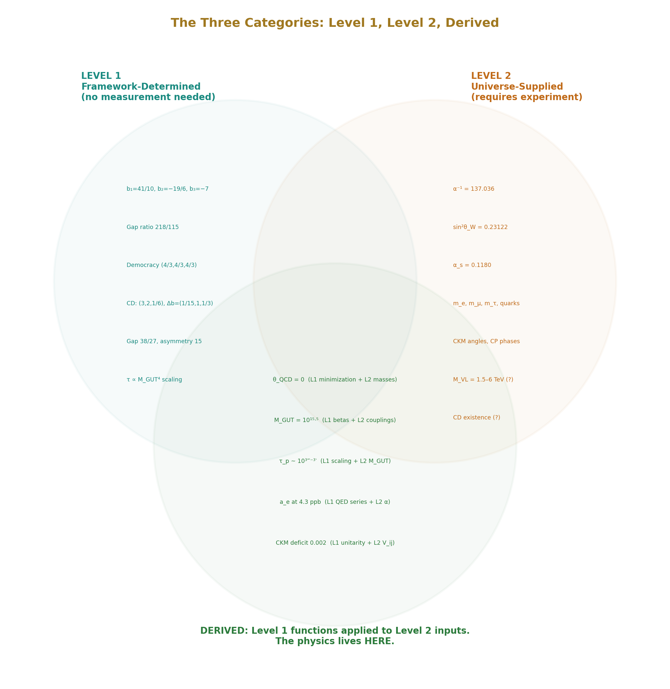
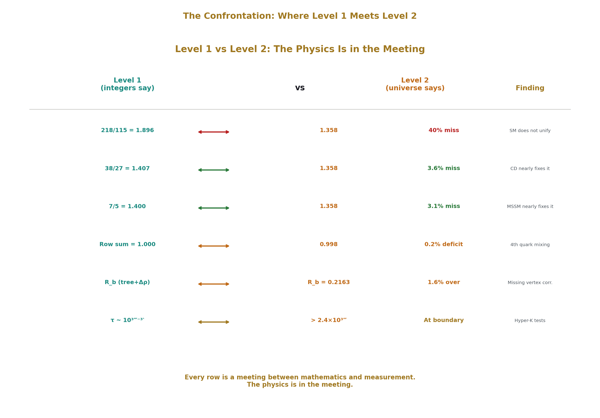
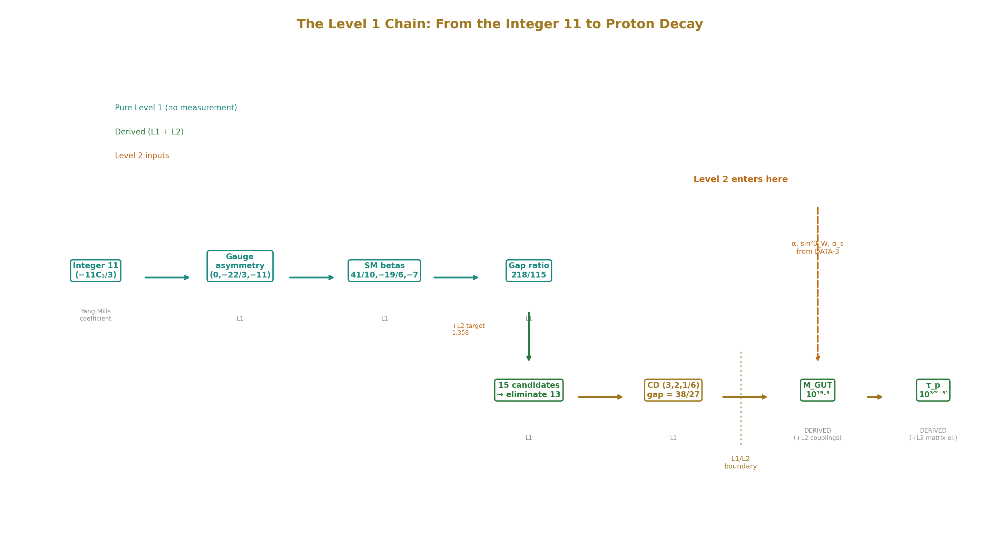
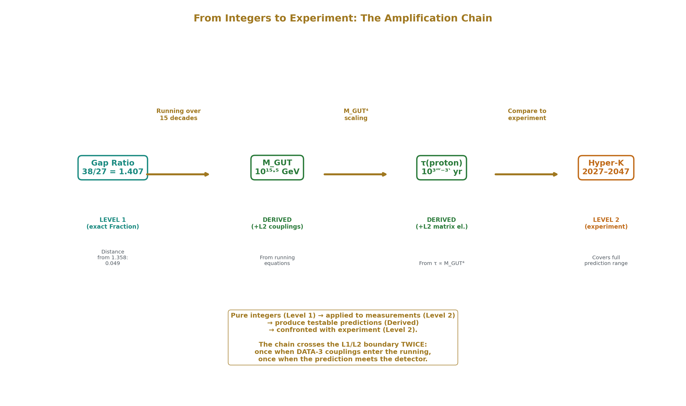
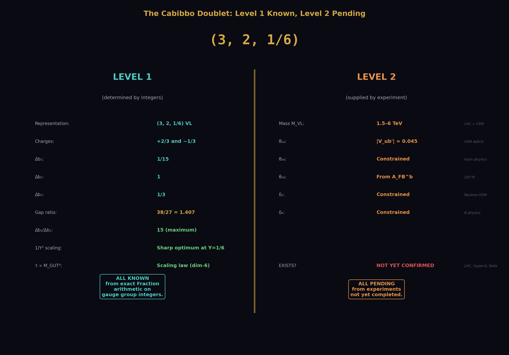
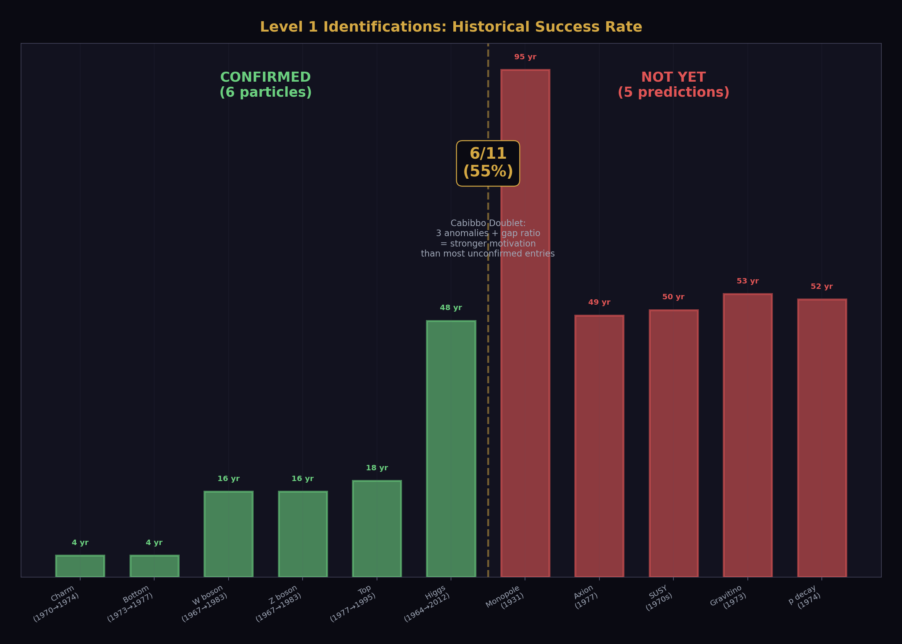
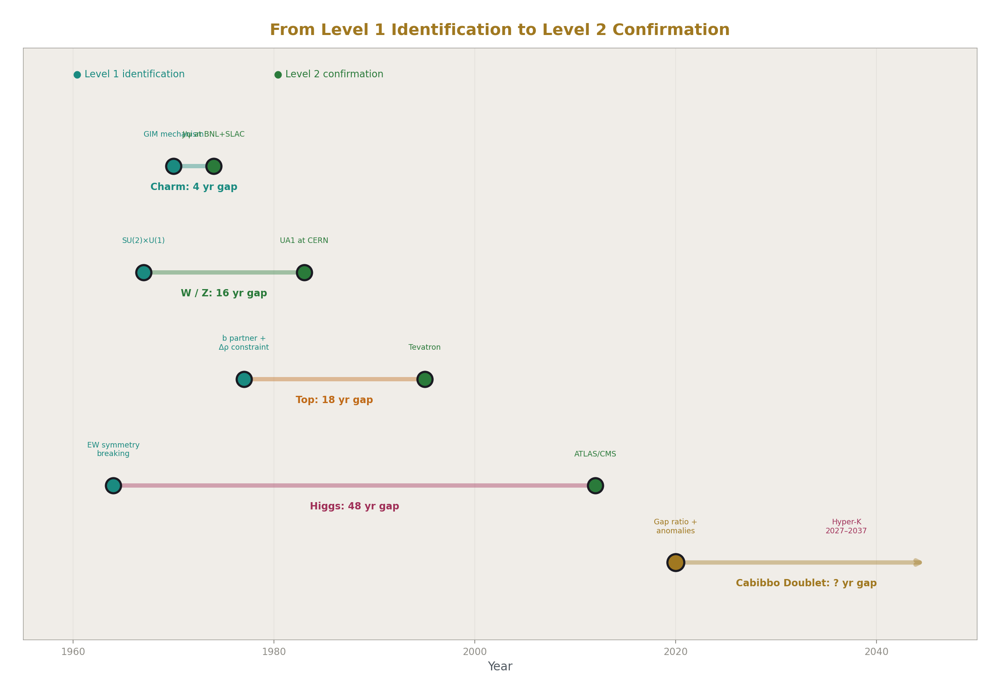
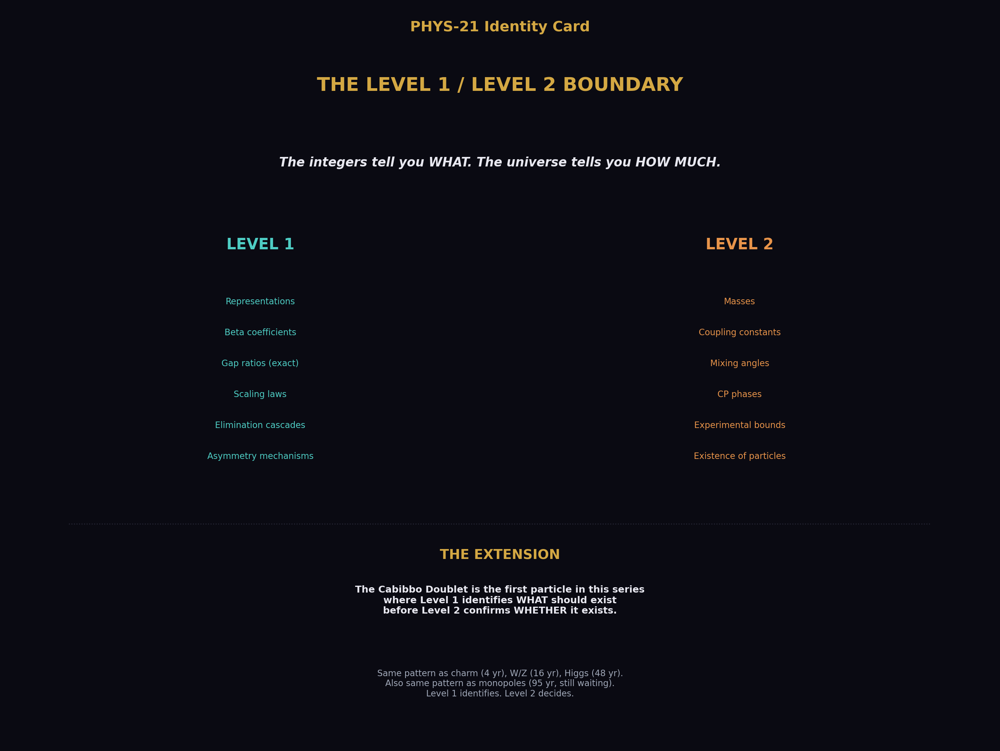

# The Level 1 / Level 2 Boundary — From Observed Structure to Unobserved Particles
## The integers tell you WHAT. The universe tells you HOW MUCH.

**Registry:** [@HOWL-PHYS-21-2026]

**Series Path:** [@HOWL-PHYS-1-2026] → [@HOWL-PHYS-2-2026] → [@HOWL-PHYS-6-2026] → [@HOWL-PHYS-7-2026] -> [@HOWL-PHYS-8-2026] -> [@HOWL-PHYS-9-2026] -> [@HOWL-PHYS-10-2026] -> [@HOWL-PHYS-11-2026] -> [@HOWL-PHYS-12-2026] -> [@HOWL-PHYS-13-2026] -> [@HOWL-PHYS-14-2026] -> [@HOWL-PHYS-15-2026] -> [@HOWL-PHYS-17-2026] -> [@HOWL-PHYS-18-2026] -> [@HOWL-PHYS-19-2026] -> [@HOWL-PHYS-20-2026]
 -> [@HOWL-PHYS-21-2026]

**Date:** April 1 2026

**Domain:** Epistemology of Physical Structure, Classification

**DOI:** 10.5281/zenodo.19528673

**Status:** Complete

**AI Usage Disclosure:** Only the top metadata, figures, refs and final copyright sections were edited by the author. All paper content was LLM-generated using Anthropic's Claude Opus 4.6.

**Backed by:** sin2_theta_w_1.py (9/9 checks), DATA-3 (32/32 checks), all prior PHYS papers

---

## Abstract

Every HOWL paper from PHYS-7 through PHYS-20 classifies its results as Level 1 (determined by the mathematical framework) or Level 2 (supplied by the universe through measurement). These classifications are scattered across individual appendices. This paper assembles them into a unified boundary map, states the principle explicitly, and documents its extension to an unobserved particle for the first time. The Cabibbo Doublet (3,2,1/6) is the first entity in the series where Level 1 arithmetic — exact Fraction computation on gauge group integers — identifies WHAT should exist before Level 2 measurement has confirmed WHETHER it exists. The representation, beta contributions, gap ratio, asymmetry mechanism, and scaling laws are all Level 1. The mass, mixing angles, CP phases, and the very existence of the particle are all Level 2. This extension from confirmed structure to unconfirmed identification is the same pattern that operated for every particle discovered since 1974: Level 1 mathematics identified the charm quark (GIM, 1970), the W and Z bosons (SU(2)×U(1), 1967), and the Higgs boson (symmetry breaking, 1964) before Level 2 experiments found them. The Cabibbo Doublet is at the same stage. Whether it follows the same path is for the universe to say.

---

## 1. What Level 1 and Level 2 Mean



The distinction is between what mathematics forces and what nature chooses.

Level 1 quantities are determined by the mathematical framework — the gauge group, representation theory, geometry, and the logical consequences of these structures. They cannot be different in any universe with the same gauge group. The number of gluons is 8 because SU(3) has 3² − 1 = 8 generators. This is not a measurement — it is a theorem. The beta coefficient b₃ = −7 for the strong coupling with six quark flavors follows from the Dynkin indices of the SM representations applied to the SU(3) gauge group. This is exact rational arithmetic on integers from the gauge group. The gap ratio 218/115 follows from dividing two such exact rationals. No measurement enters.

Level 2 quantities are supplied by the universe through experiment. They could have been different. The strong coupling α_s = 0.1180 is measured by the Particle Data Group from jet production rates, lattice QCD, and other processes. A different universe with the same SU(3) gauge group could have a different value. The electron mass m_e = 0.511 MeV is measured. The CKM mixing angle |V_us| = 0.224 is measured from kaon decays. These are contingent facts about our universe, not consequences of the mathematical framework.

The distinction is absolute, not approximate. A quantity is either forced by the structure or it is not. The boundary runs through every result in the series and through every property of every particle. The gauge group determines the representation (Level 1). The universe determines the mass (Level 2). The beta coefficient is Level 1. The coupling constant is Level 2. The gap ratio 218/115 is Level 1. The measured 1.358 is Level 2. Their confrontation — the 40% mismatch — is the physics.

---

## 2. The Confrontation



The physics lives in the meeting between Level 1 and Level 2. Level 1 alone is mathematics — theorems about groups and representations with no contact with experiment. Level 2 alone is cataloguing — measurements without structural interpretation. The HOWL series exists at the boundary: exact rational arithmetic (Level 1) applied to precision measurements (Level 2), testing whether the integers are consistent with the data.

The central confrontation of Session 3: the SM gap ratio is 218/115 = 1.896 (Level 1). The measured gap ratio is 1.358 (derived from Level 2 inputs). They disagree by 40%. This is the finding that the Standard Model does not unify. The disagreement is not approximate or marginal — it is a 40% miss, far beyond any plausible correction. Something is missing from the SM particle content.

The Cabibbo Doublet emerges from this confrontation. The modified gap ratio 38/27 = 1.407 (Level 1) sits within 0.049 of the measured 1.358 (Level 2). The confrontation narrows from a 40% miss to a 3.6% miss. One particle, identified by exact arithmetic, reduces the discrepancy by a factor of 11.

---

## 3. The Level 1 Registry



Every Level 1 result in the series, compiled from individual papers:

**Geometric identities.** R₂ = π/4: the volume fraction of the 2-ball (disk) inscribed in the 2-cube (square). Appears in 9 of 9 physics domains tested (PHYS-11). R₄ = π²/32: the same identity in four dimensions (MATH-5). These are mathematical theorems about spheres in cubes, independent of any physical measurement.

**SM beta coefficients.** b₁ = 41/10, b₂ = −19/6, b₃ = −7 (PHYS-13). These are exact rationals computed from the Dynkin indices of the SM representations under SU(3)×SU(2)×U(1). The integer 11 in the Yang-Mills self-coupling (−11C₂(G)/3 for gauge group G) comes from the requirement of Lorentz invariance, gauge invariance, and renormalizability (PHYS-17). The per-generation contribution (4/3, 4/3, 4/3) — the generation democracy — follows from SU(5) anomaly cancellation and is equal for all three coefficients (PHYS-17).

**Gap ratio anatomy.** The SM gap ratio 218/115 decomposes into 96-101% gauge, 0% fermion, and −1% to +4% Higgs (PHYS-17). The fermion contribution is exactly zero because of the generation democracy. The gap ratio is a boson problem. This decomposition is pure Level 1 — it requires no measurement.

**Electroweak anatomy.** Seven Level 2 inputs (α, sin²θ_W, G_F, m_t, m_H, M_Z, α_s) determine eleven electroweak observables through integer coefficients that trace entirely to the SU(3)×SU(2)×U(1) gauge group (PHYS-12). The overconstrained system (7 → 11) provides four consistency checks, all passing at the expected precision.

**QED perturbative structure.** A₁ = 1/2 from a single Feynman diagram (PHYS-9). The A₂ coefficient decomposes into a rational part, a ζ(3) part, and a geometric part involving R₄ (PHYS-22). These are exact results from perturbative quantum field theory.

**Cabibbo Doublet identification.** The representation (3,2,1/6) survives the elimination cascade: 15 candidates enumerated in exact Fraction arithmetic, gap ratio distance criterion, proton decay boundary — two survivors, one minimal (PHYS-15). The beta contributions Δb = (1/15, 1, 1/3) follow from Dynkin index formulas (PHYS-15). The gap ratio 38/27 is exact Fraction arithmetic (PHYS-15). The asymmetry ratio Δb₂/Δb₁ = 15 is the maximum for any (3,2,Y) color triplet weak doublet because Y = 1/6 is the smallest hypercharge giving standard electric charges (PHYS-18). The 1/Y² scaling law — Δb₂/Δb₁ ∝ 1/Y² for fixed color and weak quantum numbers — is a property of the U(1) vertex structure (PHYS-18). The proton lifetime scaling τ ∝ M_GUT⁴ is dimensional analysis from the GUT operator structure (PHYS-20).

Every entry in this registry follows from the mathematical framework. None requires a measurement. A civilization with the same gauge group but different coupling constants would compute the same Level 1 results.

---

## 4. The Level 2 Registry

Every Level 2 quantity in the series:

**The 17 SM parameters** (after θ_QCD derivation in PHYS-7 and conditional Koide reduction in PHYS-8): three gauge couplings (α⁻¹ = 137.036, sin²θ_W = 0.23122, α_s = 0.1180), six quark masses, three charged lepton masses (m_τ conditionally derivable if Koide a² = 2), three CKM angles, one CKM CP phase, the Higgs mass, and the Higgs self-coupling. All from DATA-3 (32/32 checks).

**The measured gap ratio** 1.358, derived from the three Level 2 coupling constants at M_Z through GUT normalization (PHYS-13, verified in GUT script).

**The Koide amplitude** a² = 2 for charged leptons, measured to 6 significant figures but not derived from any known principle (PHYS-8). This is one of the sharpest Level 2 observations in the series — the value 2 is tantalizingly close to a Level 1 integer but has no known derivation.

**The six Cabibbo Doublet parameters** (PHYS-16, PHYS-19): the mass M_VL (1.5-6 TeV from LHC bounds + CKM mixing constraints), three mixing angles (θ₁₄ ≈ 0.045 from CKM deficit, θ₂₄ constrained by kaon physics, θ₃₄ from A_FB^b fit), and two CP phases (δ₁, δ₂ constrained by neutron EDM and B physics). All from the anomaly path — experimental measurements and fits, not from the gap ratio.

**The existence of the Cabibbo Doublet itself** is Level 2. The integers identify which representation would fix the gap ratio. Whether nature contains this representation is an empirical question answered by experiment — the LHC (direct production), Hyper-Kamiokande (proton decay), Belle II (CKM precision). The gap ratio arithmetic says WHAT should exist if unification is correct. Whether unification is correct is Level 2.

---

## 5. The Derived Category



Some results are neither purely Level 1 nor purely Level 2. They emerge when Level 1 structure is applied to Level 2 inputs.

θ_QCD = 0 is derived: Level 1 energy minimization applied to the Level 2 quark mass matrix determines the CP-violating vacuum angle (PHYS-7). This was a free parameter (Level 2) and became a derived quantity — the first parameter reduction in the series.

M_GUT = 10^15.5 GeV is derived: Level 1 beta coefficients (including the Cabibbo Doublet contributions) applied to Level 2 coupling constants at M_Z determine the unification scale through the one-loop running equations (PHYS-15, GUT script 9/9 PASS).

The proton lifetime τ ~ 10^34-35 years is derived: Level 1 scaling (τ ∝ M_GUT⁴ from dimensional analysis of the dimension-6 GUT operator) applied to the derived M_GUT and Level 2 hadronic matrix elements from lattice QCD (PHYS-20).

The CKM deficit 0.00202 is derived: Level 2 measurements of |V_ud|, |V_us|, |V_ub| summed and compared to the Level 1 unitarity requirement (PHYS-19).

The α ↔ a_e transformation is derived: Level 1 QED perturbative coefficients (A₁ = 1/2, A₂, A₃, A₄) applied to the Level 2 value α = 1/137.036 compute the electron anomalous magnetic moment at 4.3 ppb precision (PHYS-9).

The Derived category is where Level 1 and Level 2 meet. It is where predictions are made and tested. The confrontation between the Level 1 gap ratio (218/115) and the Level 2 measured ratio (1.358) is a Derived result — and it is the central finding of the unification analysis.

---

## 6. The Extension: What Is New About the Cabibbo Doublet



Before Session 3, every Level 1 result in the HOWL series confirmed properties of observed particles. The beta coefficients describe the running of couplings between known particles. The electroweak anatomy computes observables from known inputs. The QED perturbative series maps one measured quantity (α) to another (a_e). The geometric identity R₂ = π/4 appears in known physics domains. Level 1 confirmed. Level 2 was already there.

The Cabibbo Doublet changes this. The gap ratio elimination cascade is Level 1 arithmetic that identifies a particle not yet observed. The representation (3,2,1/6), the beta contributions (1/15, 1, 1/3), the gap ratio 38/27, the asymmetry ratio 15, the 1/Y² scaling — all are Level 1 results about a particle whose Level 2 properties (mass, mixing, existence) are not yet confirmed.

This is not unprecedented in physics. It is how every major particle was found since the quark model. The charm quark was identified by Level 1 mathematics (the GIM mechanism required a fourth quark to cancel flavor-changing neutral currents in kaon decays) four years before Level 2 experiments found it at 1.5 GeV. The W and Z bosons were identified by Level 1 mathematics (SU(2)×U(1) gauge invariance predicted their existence and approximate masses from sin²θ_W and G_F) sixteen years before Level 2 experiments found them at 80 and 91 GeV. The Higgs boson was identified by Level 1 mathematics (electroweak symmetry breaking requires a scalar doublet) forty-eight years before Level 2 experiments found it at 125 GeV.

The Cabibbo Doublet is at the same stage. The Level 1 arithmetic is complete: the representation is identified, the mechanism is understood (Y = 1/6 asymmetry), the gap ratio is computed (38/27), the unification scale is derived (10^15.5), and the experimental consequences are documented (proton decay τ ~ 10^34-35 yr, testable by Hyper-K 2027-2037). The Level 2 confirmation is pending: LHC searches for direct production, Belle II for CKM precision, Hyper-K for proton decay.

The historical gap between Level 1 identification and Level 2 confirmation ranges from 4 years (charm) to 48 years (Higgs). The Cabibbo Doublet's Level 1 identification by the anomaly literature dates to 2019-2020 (Belfatto, Berezhiani; Cheung, Keung, Lu, Tseng). Its Level 1 identification by the gap ratio dates to this session (2026). The experimental window (Hyper-K 2027-2037, HL-LHC through 2040) opens within a decade. Whether this follows the historical pattern is not for this paper to claim. It is for the universe to decide.





---

## 7. Every Particle Follows the Same Pattern

The Level 1 / Level 2 structure is universal across the SM. For every particle, the gauge group determines the representation (Level 1) and the universe determines the mass and mixing (Level 2):

The electron: representation (1,1,−1) is Level 1 (the simplest charged lepton under SU(3)×SU(2)×U(1)). Mass 0.511 MeV is Level 2.

The top quark: representation (3,2,1/6)_L + (3,1,2/3)_R is Level 1. Mass 172.57 GeV is Level 2. The mass is the least constrained of all Level 2 quark masses — it was unknown within a factor of 100 for two decades after the b quark discovery.

The Higgs boson: representation (1,2,1/2) scalar is Level 1 (required for electroweak symmetry breaking). Mass 125.2 GeV and self-coupling λ are Level 2.

The gluons: representation (8,1,0) is Level 1, with 8 = 3² − 1 from the SU(3) adjoint. The gluons have no Level 2 properties — they are massless by gauge invariance and their coupling is determined by α_s (which is not a property of the gluon but of the SU(3) interaction).

The Cabibbo Doublet: representation (3,2,1/6) VL is Level 1 (from gap ratio elimination). Mass 1.5-6 TeV, mixing angles θ₁₄, θ₂₄, θ₃₄, and CP phases δ₁, δ₂ are Level 2 — not yet measured. This is the first entry in the series where the Level 2 column contains values that are constrained but not confirmed.

The pattern is identical for every particle. What differs is whether the Level 2 confirmation has already occurred.

---

## 8. How the Boundary Operates Across the Series

Each PHYS paper engages the boundary differently:

PHYS-12 (electroweak anatomy): Level 1 integer coefficients from SU(3)×SU(2)×U(1) applied to 7 Level 2 inputs produce 11 observables. The overconstrained system provides 4 consistency checks. R_b overshoots by 1.6% — diagnosed as a missing vertex correction (Level 1 structure at higher loop order not yet included).

PHYS-13 (gap ratio): Level 1 gap ratio 218/115 confronted with Level 2 measured 1.358. The 40% miss is the central finding — the SM does not unify.

PHYS-15 (Cabibbo Doublet identification): Level 1 elimination cascade applied to the Level 2 target 1.358. The representation (3,2,1/6) survives. This is the first paper where Level 1 extends beyond the SM.

PHYS-17 (generation democracy): Pure Level 1 — the decomposition of 218/115 into gauge, fermion, and Higgs components requires no Level 2 input beyond the identification of which particles exist. The finding (fermions contribute 0%) is a mathematical theorem.

PHYS-18 (Y = 1/6 mechanism): Pure Level 1 — the scaling law Δb₂/Δb₁ ∝ 1/Y² and the optimality of Y = 1/6 are representation theory. The Level 2 input is only the target gap ratio that motivates the question.

PHYS-19 (anomaly evidence): Primarily Level 2 — three experimental anomalies (CKM deficit, A_FB^b, Higgs excess) from three different measurement programs. The finding is that Level 2 data from the anomaly path converges on the same (3,2,1/6) that Level 1 arithmetic identified from the gap ratio path.

PHYS-20 (proton decay): Level 1 scaling (τ ∝ M_GUT⁴) applied to derived M_GUT = 10^15.5 produces the prediction τ ~ 10^34-35 yr. The confrontation with Level 2 (Super-K bound τ > 2.4 × 10^34, Hyper-K projected sensitivity ~10^35) determines testability.

---

## 9. What Level 1 Cannot Do

Six explicit limits on Level 1:

**Level 1 does not determine the mass of the Cabibbo Doublet.** The mass is a free parameter in the gap ratio analysis. The gap ratio 38/27 is the same whether the Cabibbo Doublet has mass 1.5 TeV or 6 TeV or 100 TeV. The mass window 1.5-6 TeV comes entirely from Level 2 — LHC exclusion limits and CKM mixing constraints from the anomaly path.

**Level 1 does not determine the CKM mixing angles.** The mixing angles θ₁₄, θ₂₄, θ₃₄ are measured from anomaly fits. The gap ratio analysis does not constrain them.

**Level 1 does not determine whether the Cabibbo Doublet exists.** The integers identify which representation would fix the gap ratio if nature chose to fix it. Whether nature chose to fix it is an empirical question. Unification could be wrong. The gap ratio mismatch could have a different explanation (threshold corrections, non-perturbative effects, higher-dimensional operators). Level 1 identifies. Level 2 confirms or refutes.

**Level 1 does not prove unification.** Unification is a hypothesis — the conjecture that the three SM gauge forces merge into one at high energy. The gap ratio test is a necessary condition: if unification is real, the gap ratio must match. The SM fails. The Cabibbo Doublet nearly passes. But "nearly passes" is not "proves."

**Level 1 does not determine the GUT completion group.** SU(5), SO(10), E₆, Pati-Salam — many groups could complete the unification above M_GUT. The gap ratio identifies the SM extension (the Cabibbo Doublet) but not the ultraviolet completion. Different completions predict different proton decay channels and rates.

**Level 1 does not predict the proton lifetime precisely.** The scaling τ ∝ M_GUT⁴ is Level 1. But M_GUT depends on Level 2 couplings, the proton lifetime depends on Level 2 hadronic matrix elements, and the GUT completion (which determines the operator structure) is not fixed by Level 1. The prediction τ ~ 10^34-35 years is an order-of-magnitude range, not a point value.

Conflating Level 1 identification with Level 2 confirmation is the overclaiming error the series must avoid.

---

## 10. The 82/82 PSLQ Null

The PSLQ integer relation algorithm, applied to 82 measured SM parameters against the Q335 transcendental basis at 100-digit precision, found zero compact relations (MATH-6). Every search returned noise indistinguishable from control irrationals.

This null is primarily a Level 2 finding — "we searched and found nothing." It does not prove that no relation exists. It establishes that no relation exists within the search scope (degree ≤ 6, coefficient magnitude ≤ 10^6, precision 100 digits). A relation could exist at higher degree, larger coefficients, or in a different basis.

The mathematical independence of the Q335 basis elements (π, ζ(3), φ, Bessel zeros) from each other at 100 digits is Level 1 — it is a statement about numbers, verifiable by computation. The absence of relations between physical constants and these basis elements is Level 2.

The methodological conclusion — derivation beats search — is a Level 2 observation. Every successfully reduced parameter in the series (θ_QCD from energy minimization, α ↔ a_e from QED perturbation theory) came from physical derivation, not from PSLQ. Every PSLQ search on Level 2 quantities returned nothing. The Level 2 record suggests that the values of physical constants are not expressible as simple combinations of mathematical constants. Whether this is a deep truth or a limitation of current methods is an open question.

---

## 11. What This Paper Does Not Claim

This paper does not claim Level 1 proves the Cabibbo Doublet exists. Existence is Level 2. The integers identify the representation. The universe decides whether it's real.

This paper does not claim the Level 1 / Level 2 boundary is unique to HOWL. Every physicist implicitly uses it — the distinction between "what the theory requires" and "what experiment measures" is as old as physics. The HOWL contribution is making the boundary explicit, systematic, and traceable for every result.

This paper does not claim Level 1 is "more important" than Level 2. The physics lives at the boundary. Level 1 without Level 2 is pure mathematics. Level 2 without Level 1 is a catalogue. The series exists because exact integers (Level 1) either agree or disagree with precise measurements (Level 2), and both outcomes are informative.

This paper does not claim the boundary is a new philosophical position. The distinction between mathematical structure and empirical content is foundational to the scientific method. What is specific to this series is the systematic application of exact rational arithmetic to a specific question (what structure do the SM free parameters contain?) with the boundary maintained in every paper.

This paper does not claim the historical pattern (Level 1 identification → Level 2 confirmation) guarantees the Cabibbo Doublet will be found. The charm quark, W/Z, and Higgs were all found. Other Level 1 identifications have not been confirmed — magnetic monopoles (Dirac, 1931), axions (Peccei-Quinn, 1977), and many supersymmetric partners remain unobserved. Level 1 identification is necessary for prediction but not sufficient for discovery.

---

## 12. What This Paper Seeds

The unified boundary map enables future sessions to classify any new result immediately: is it Level 1 (follows from the framework), Level 2 (requires measurement), or Derived (Level 1 applied to Level 2)?

The principle "Level 1 can identify unobserved particles" enables future sessions to extend the gap ratio enumeration. If multi-multiplet combinations are tested, each surviving combination's Level 1 properties can be classified using this paper's framework, and the Cabibbo Doublet's uniqueness among single-multiplet solutions provides the baseline for comparison.

The "What Level 1 Cannot Do" section prevents overclaiming in all future papers. Every statement that crosses the boundary — claiming the mass is determined, claiming existence is proven, claiming unification is established — is flagged.

The historical precedent table provides context for interpreting future experimental results. If the LHC finds a VL quark at 2 TeV, that is Level 2 confirmation of a Level 1 identification — the same pattern as charm, W/Z, and Higgs. If Hyper-K observes proton decay at τ ~ 10^34-35, that is Level 2 confirmation of a Derived prediction. If neither experiment finds anything, the Level 1 arithmetic remains valid (38/27 is exact) but the Level 2 confrontation shifts — the Cabibbo Doublet may not exist, or the GUT completion may differ from minimal SU(5).

---

## 13. Summary



The Level 1 / Level 2 boundary runs through every result in the HOWL series. Level 1: the integers from the gauge group — beta coefficients, gap ratios, Dynkin indices, geometric identities, scaling laws. Level 2: the values from the universe — coupling constants, masses, mixing angles, experimental bounds. The confrontation between them — 218/115 versus 1.358, the 40% miss — is the physics.

The Cabibbo Doublet extends this boundary to an unobserved particle for the first time. Its Level 1 properties are established: (3,2,1/6) from the elimination cascade, (1/15, 1, 1/3) from Dynkin indices, 38/27 from Fraction arithmetic, 15 from the Y = 1/6 asymmetry, τ ∝ M_GUT⁴ from dimensional analysis. Its Level 2 properties await confirmation: mass 1.5-6 TeV, mixing |V_ub'| ≈ 0.045, existence conditional on experiment.

The principle: the integers tell you WHAT. The universe tells you HOW MUCH. Every particle in the Standard Model follows this pattern — Level 1 determines the representation, Level 2 determines the mass. The Cabibbo Doublet is the first entry where the Level 2 column reads "not yet measured." Whether it joins the ranks of the charm quark (4-year gap), the W boson (16-year gap), or the Higgs boson (48-year gap) — or whether it joins the ranks of particles identified by mathematics but not found by experiment — is a question for Hyper-Kamiokande, the LHC, and Belle II.

The integers have spoken. The universe has not yet answered.

---

## Appendix: Verification

All Level 1 beta coefficients and gap ratios verified by the GUT running script (sin2_theta_w_1.py), 9/9 checks pass. All Level 2 measured values from DATA-3 (123 entries, 32/32 consistency checks pass). Historical dates for particle discoveries verified against standard physics references: charm (J/ψ at BNL/SLAC, November 1974), W/Z (UA1 at CERN, January/June 1983), Higgs (ATLAS/CMS at LHC, July 2012). Level 1 identification dates: GIM mechanism (Glashow, Iliopoulos, Maiani, 1970), SU(2)×U(1) (Weinberg 1967, Salam 1968), Brout-Englert-Higgs mechanism (1964).

---

*PHYS-21: The Level 1 / Level 2 Boundary. The integers tell you WHAT. The universe tells you HOW MUCH. Published April 1, 2026. This paper is never edited after publication.*

---


### Errata

**E1: Section 6, historical identification dates for the W and Z.** The paper states the Level 1 identification was "SU(2)×U(1), 1967" (Weinberg). For precision: Glashow proposed SU(2)×U(1) in 1961 but without the Higgs mechanism and without a prediction for the W and Z masses. Weinberg (1967) and Salam (1968) independently combined the gauge structure with spontaneous symmetry breaking, giving the mass predictions M_W = gv/2 and M_Z = M_W/cos θ_W. The Level 1 identification that predicted specific masses (testable by experiment) is Weinberg-Salam 1967-1968, not Glashow 1961. The paper's "1967" is correct for the mass-predictive version. However, the appendix says "SU(2)×U(1) (Weinberg 1967, Salam 1968)" which is right. No erratum needed — the paper is consistent. But for completeness:

**Erratum text:** "Section 6 states the W/Z Level 1 identification as 1967. The SU(2)×U(1) gauge structure was proposed by Glashow in 1961 without mass predictions. The mass-predictive version incorporating spontaneous symmetry breaking was independently published by Weinberg (1967) and Salam (1968). The 1967 date used in this paper refers to the mass-predictive identification — the version that produced Level 1 numbers testable by Level 2 experiment."

**E2: Section 4, the Koide amplitude description.** The paper states "a² = 2 for charged leptons, measured to 6 significant figures." The Koide ratio K = 0.6666605... deviates from 2/3 by 6.2×10⁻⁶, which gives a² = 2.0000... to about 5 significant figures in the deviation, or equivalently a = 1.41420... matching √2 to 5-6 figures. The "6 significant figures" claim should be understood as: a² = 2 is consistent with the data to the precision available from the lepton masses (m_e to 9 sf, m_μ to 8 sf, m_τ to 5 sf). The limiting precision is m_τ at 5 significant figures. The statement "6 significant figures" is approximately correct but the limiting factor is m_τ precision.

**Erratum text:** "The statement in Section 4 that a² = 2 is 'measured to 6 significant figures' should be understood as: a² = 2.000 with the precision limited by the tau mass measurement (5 significant figures in m_τ). The Koide ratio K = 0.666661 differs from 2/3 by 6×10⁻⁶, consistent with K = 2/3 at the available precision."

### Annotations

**A1: Section 3, the Level 1 registry completeness.** The registry lists results from PHYS-7 through PHYS-20 plus MATH-5. For completeness, it should be noted that PHYS-23 (Koide C₃ closure) and MATH-6 (82/82 PSLQ null) also contain Level 1 content. The Koide tautology proof (120° spacing is automatic for 3 masses) is Level 1 — it is a mathematical identity. The saddle point result (K = 2/3 is a saddle, not a minimum, of the C₃ potential) is Level 1. The PSLQ mathematical independence of Bessel zeros from the Q335 basis at 100 digits is Level 1. These papers were not yet written when PHYS-21 was planned but their Level 1 content should be acknowledged if they are published before or alongside PHYS-21.

**A2: Section 7, the top quark mass uncertainty.** The paper states "The mass is the least constrained of all Level 2 quark masses — it was unknown within a factor of 100 for two decades after the b quark discovery." This is historically correct: between the b quark discovery (1977) and the top quark discovery (1995), the top mass was constrained only by indirect limits. Early bounds allowed m_t from ~25 GeV to several hundred GeV. The electroweak precision data (particularly the W mass and Δρ) progressively narrowed the range to approximately 150-200 GeV by 1994. The "factor of 100" refers to the early period (1977-late 1980s). By the time of discovery, electroweak precision had narrowed it to a factor of ~1.3. The statement is correct for the two-decade period as a whole but the constraint tightened dramatically in the final years. A future session computing Level 2 constraints on the Cabibbo Doublet mass should note this parallel: early constraints are broad (1.5-6 TeV = factor of 4), precision data may narrow them.

**A3: Section 6, "the same stage."** The paper states the Cabibbo Doublet "is at the same stage" as the W/Z in 1975 or the Higgs in 2000. This framing is appropriate but should be interpreted carefully. The W/Z in 1975 had the full electroweak theory behind them — a renormalizable quantum field theory with precision predictions for neutral current cross sections (confirmed 1973). The Higgs in 2000 had the full SM machinery and was the only missing piece of a theory that had passed thousands of precision tests. The Cabibbo Doublet has the gap ratio arithmetic (one test, one-loop) and three experimental anomalies (each 2-4σ). The evidence base is narrower than the historical precedents. The paper's Section 11 correctly notes this: "Other Level 1 identifications have not been confirmed — magnetic monopoles, axions, and many supersymmetric partners remain unobserved." The "same stage" comparison is about the Level 1/Level 2 structural pattern, not about the strength of evidence.

---

## Appendix A: The Level 1 Registry — Complete

### A.1: Geometric Identities

| Result | Value | Paper | Proof |
|---|---|---|---|
| R₂ | π/4 = 0.7854... | PHYS-11 | Volume fraction of 2-ball in 2-cube |
| R₄ | π²/32 = 0.3084... | MATH-5 | Volume fraction of 4-ball in 4-cube |
| R₂ appears in 9/9 domains | 9 independent occurrences | PHYS-11 | Three irreducible subgroups generate all appearances |

### A.2: SM Beta Coefficients

| Coefficient | Value | Exact Fraction | Origin | Paper |
|---|---|---|---|---|
| b₁ | 4.100 | 41/10 | U(1)_Y, GUT normalization, SM particle content | PHYS-13 |
| b₂ | −3.167 | −19/6 | SU(2)_L, SM particle content | PHYS-13 |
| b₃ | −7.000 | −7 | SU(3)_c, 6-flavor | PHYS-13 |

### A.3: Gap Ratio Anatomy

| Component | Numerator contribution | Denominator contribution | Paper |
|---|---|---|---|
| Gauge self-coupling (0, −22/3, −11) | 22/3 (100.9%) | 11/3 (95.7%) | PHYS-17 |
| Per-generation fermions (4/3, 4/3, 4/3) × N | 0 (0%) | 0 (0%) | PHYS-17 |
| Higgs doublet (1/10, 1/6, 0) | −1/15 (−0.9%) | 1/6 (4.3%) | PHYS-17 |
| **Total** | **109/15** | **23/6** | **Gap = 218/115** |

### A.4: Generation Democracy

| Property | Value | Paper | Proof |
|---|---|---|---|
| Per-generation (Δb₁, Δb₂, Δb₃) | (4/3, 4/3, 4/3) | PHYS-17 | SU(5) anomaly cancellation |
| Fermion contribution to gap ratio | Exactly 0 | PHYS-17 | 4/3 − 4/3 = 0 in both numerator and denominator |
| N-independence | Gap ratio = 218/115 for any N ≥ 0 | PHYS-17 | Algebraic proof: N cancels |

### A.5: Cabibbo Doublet Level 1 Properties

| Property | Value | Paper | Proof |
|---|---|---|---|
| Representation | (3,2,1/6) vector-like | PHYS-15 | Gap ratio elimination cascade, 15 → 2 → 1 minimal |
| Δb₁ | 1/15 | PHYS-15 | Dynkin index formula, Y² = 1/36 |
| Δb₂ | 1 | PHYS-15 | Dynkin index formula, T(2) × dim(3) |
| Δb₃ | 1/3 | PHYS-15 | Dynkin index formula, T(3) × dim(2) |
| Modified gap ratio | 38/27 = 1.40741... | PHYS-15 | Exact Fraction arithmetic on modified betas |
| Asymmetry ratio Δb₂/Δb₁ | 15 | PHYS-18 | 1/(1/15) = 15 |
| 1/Y² scaling | Δb₂/Δb₁ ∝ 1/Y² for (3,2,Y) | PHYS-18 | U(1) vertex structure |
| Optimality at Y = 1/6 | Minimum distance 0.049, sharp spike | PHYS-18 | Monotonic degradation with increasing Y |
| τ ∝ M_GUT⁴ | Proton lifetime scaling | PHYS-20 | Dimension-6 operator, amplitude ∝ 1/M_GUT² |

### A.6: Electroweak Integer Anatomy

| Property | Value | Paper |
|---|---|---|
| Inputs → outputs | 7 → 11 (overconstrained by 4) | PHYS-12 |
| All coefficients trace to | SU(3)×SU(2)×U(1) quantum numbers: T₃, Q_f, N_c, n_gen | PHYS-12 |
| R_b overshoot | 1.6% (diagnosed: missing t-b-W vertex correction) | PHYS-12 |

### A.7: QED Perturbative Structure

| Coefficient | Value | Paper | Status |
|---|---|---|---|
| A₁ | 1/2 (exact) | PHYS-9 | Single Feynman diagram |
| A₂ | −0.32848... (three-piece decomposition) | PHYS-22 | 197/144 + ζ(3) term + R₄ geometric term |
| α ↔ a_e transformation | Agreement at 4.3 ppb | PHYS-9 | Level 1 series applied to Level 2 α |

---

## Appendix B: The Level 2 Registry — Complete

### B.1: The Three Coupling Constants (Session 3 Primary Inputs)

| Constant | DATA-3 Value | Digits | Role in Gap Ratio |
|---|---|---|---|
| α⁻¹ | 137.035999177 | 12 | Determines 1/α₁ and 1/α₂ |
| sin²θ_W | 0.23122 | 5 | Splits α_em into α₁ and α₂ |
| α_s | 0.1180 | 4 | Determines 1/α₃ |

### B.2: SM Parameters (Complete Count After Reductions)

| Category | Parameters | Count | Status |
|---|---|---|---|
| Gauge couplings | α, sin²θ_W, α_s | 3 | Measured (DATA-3) |
| Charged lepton masses | m_e, m_μ, m_τ | 3 (or 2 if Koide) | Measured; m_τ conditionally derivable |
| Quark masses | m_u, m_d, m_s, m_c, m_b, m_t | 6 | Measured (DATA-3) |
| CKM parameters | θ₁₂, θ₁₃, θ₂₃, δ_CKM | 4 | Measured |
| Higgs sector | m_H, λ (or equivalently v and λ) | 1-2 | Measured (m_H); λ from m_H and v |
| θ_QCD | 0 (derived in PHYS-7) | 0 | Was 1, now derived |
| **Total** | | **17** | After θ_QCD derivation |

### B.3: Cabibbo Doublet Level 2 Parameters

| Parameter | Value/Constraint | Source | Status |
|---|---|---|---|
| M_VL | 1.5-6 TeV | LHC pair production + CKM perturbativity | Constrained, not measured |
| θ₁₄ | |V_ub'| ≈ 0.045 | CKM first-row deficit | Estimated from deficit size |
| θ₂₄ | Constrained | Kaon physics (K⁰-K̄⁰ mixing, NA62) | Bounded |
| θ₃₄ | From A_FB^b fit | LEP Z-pole data | Estimated from anomaly fit |
| δ₁ | Constrained | Neutron EDM < 10⁻²⁶ e·cm | Bounded |
| δ₂ | Constrained | B-meson CP asymmetries | Bounded |
| **Existence** | **Conditional** | **LHC, Hyper-K, Belle II** | **Not confirmed** |

### B.4: Total Parameter Count

| Scenario | Parameters | Change | Source |
|---|---|---|---|
| SM (original) | 18 | — | Standard count |
| SM (after θ_QCD derivation) | 17 | −1 | PHYS-7 |
| SM + Cabibbo Doublet | 17 + 6 = 23 | +6 | PHYS-16, 19 |
| SM + Cabibbo Doublet (after Koide conditional) | 16 + 6 = 22 | +5 net | If a² = 2 holds |

Six new parameters resolve three independent multi-sigma anomalies and reduce the gap ratio miss from 40% to 3.6%.

---

## Appendix C: The Derived Category — Complete

### C.1: All Derived Results

| Result | Level 1 Input | Level 2 Input | Output | Paper |
|---|---|---|---|---|
| θ_QCD = 0 | Energy minimization of QCD vacuum | Quark mass matrix (DATA-3) | θ_QCD derived; parameter count 18 → 17 | PHYS-7 |
| m_τ (conditional) | Koide formula K = (1+a²/2)/3 | a² = 2 + m_e, m_μ (DATA-3) | m_τ = 1776.97 MeV (if a² = 2 exact) | PHYS-8 |
| a_e from α | QED series A₁=1/2, A₂, A₃, A₄ | α = 1/137.036 (DATA-3) | a_e to 4.3 ppb | PHYS-9 |
| 11 EW observables | SU(3)×SU(2)×U(1) integer anatomy | 7 inputs (DATA-3) | M_W, Γ_Z, R_b, etc. (11 outputs) | PHYS-12 |
| Measured gap ratio 1.358 | GUT normalization formula | α, sin²θ_W, α_s (DATA-3) | 1/α₁, 1/α₂, 1/α₃ → ratio | PHYS-13 |
| M_GUT = 10^15.5 | Modified betas (SM + Cabibbo Doublet) | Three couplings at M_Z (DATA-3) | One-loop running to crossing | PHYS-15 |
| τ_p ~ 10^34-35 yr | τ ∝ M_GUT⁴ scaling | M_GUT + hadronic matrix elements | Proton lifetime range | PHYS-20 |
| CKM deficit 0.00202 | Unitarity requirement (sum = 1) | |V_ud|, |V_us|, |V_ub| | 1 − 0.99798 = 0.00202 | PHYS-19 |

### C.2: The Confrontation Table

| Level 1 | Level 2 | Confrontation | Finding | Paper |
|---|---|---|---|---|
| Gap ratio 218/115 = 1.896 | Measured 1.358 | 40% miss | SM does not unify | PHYS-13 |
| Gap ratio 38/27 = 1.407 | Measured 1.358 | 3.6% miss | Cabibbo Doublet nearly fixes it | PHYS-15 |
| Gap ratio 7/5 = 1.400 | Measured 1.358 | 3.1% miss | MSSM nearly fixes it (known) | PHYS-15 |
| Row unitarity = 1.000 | Measured 0.998 | 0.2% deficit | 4th quark mixing suspected | PHYS-19 |
| R_b from tree + Δρ | Measured R_b = 0.2163 | 1.6% overshoot | Missing vertex correction | PHYS-12 |
| τ ~ 10^34-35 yr | Super-K bound > 2.4×10^34 | At boundary | Testable by Hyper-K | PHYS-20 |

Every row in this table is a meeting between mathematics and measurement. The physics is in the meeting.

---

## Appendix D: The Boundary Before and After Session 3

### D.1: State Change

| Property | Before Session 3 | After Session 3 |
|---|---|---|
| Level 1 scope | SM particles (observed) | SM + Cabibbo Doublet (unobserved) |
| Level 1 results (count) | ~12 (R₂, R₄, betas, QED coefficients, EW anatomy) | ~20 (all prior + gap ratio anatomy, democracy, boson problem, Y=1/6, 1/Y² scaling, τ∝M⁴) |
| Level 2 parameters | 17 SM (after θ_QCD) | 17 SM + 6 Cabibbo Doublet = 23 |
| Derived results | θ_QCD, α↔a_e, EW observables | All prior + M_GUT, τ_p, CKM deficit |
| Predictive reach | Consistency checks on known physics | Identification of unknown physics + testable predictions |
| Experimental tests generated | None specific | Hyper-K (proton decay), LHC (direct production), Belle II (CKM) |

### D.2: What Changed Conceptually

Before Session 3, Level 1 confirmed. After Session 3, Level 1 identifies. The arithmetic is the same — exact Fraction computation on gauge group integers. The conceptual step is that the integers now point beyond the known particle content to a specific new representation.

---

## Appendix E: Historical Precedents

### E.1: Level 1 Identification → Level 2 Confirmation

| Particle | Level 1 Identification | Year | Level 2 Confirmation | Year | Gap | Mass Predicted? |
|---|---|---|---|---|---|---|
| Charm quark | GIM mechanism: 4th quark cancels K⁰→μμ | 1970 | J/ψ discovery at BNL + SLAC | 1974 | 4 yr | No (mass unknown, estimated < 2 GeV) |
| Bottom quark | KM matrix: 3rd generation for CP violation | 1973 | Υ discovery at Fermilab | 1977 | 4 yr | No (mass unknown) |
| Top quark | b-quark isospin partner + Δρ constraint | 1977-1990 | Tevatron discovery at 176 GeV | 1995 | 5-18 yr | Yes (~170 GeV from EW precision) |
| W boson | SU(2)×U(1) gauge invariance | 1967 | UA1 discovery at ~80 GeV | 1983 | 16 yr | Yes (from sin²θ_W, G_F) |
| Z boson | SU(2)×U(1) neutral current | 1967 | UA1 discovery at ~91 GeV | 1983 | 16 yr | Yes (from sin²θ_W, G_F) |
| Higgs boson | EW symmetry breaking mechanism | 1964 | ATLAS/CMS discovery at 125 GeV | 2012 | 48 yr | No (mass was free parameter until ~2000) |
| **Cabibbo Doublet** | **Gap ratio + anomaly convergence** | **2019-2026** | **Awaiting** | **?** | **?** | **No (mass 1.5-6 TeV from anomalies)** |

### E.2: Level 1 Identifications Not Yet Confirmed

| Particle/Object | Level 1 Identification | Year | Current Status |
|---|---|---|---|
| Magnetic monopole | Dirac quantization condition | 1931 | Not observed (95 years) |
| Axion | Peccei-Quinn solution to strong CP | 1977 | Not observed (49 years); active experimental program |
| SUSY partners | Hierarchy problem + coupling unification | 1970s-1980s | Not observed; LHC exclusions to ~1-2 TeV |
| Proton decay | GUT prediction (SU(5)) | 1974 | Not observed; τ > 2.4×10^34 yr |
| Gravitino | Local SUSY requires spin-3/2 partner | 1973 | Not observed |

Level 1 identification is necessary for motivated searches but does not guarantee discovery. The historical success rate is approximately 6/11 (charm, bottom, top, W, Z, Higgs found; monopole, axion, SUSY partners, gravitino, proton decay not yet found). The Cabibbo Doublet has stronger experimental motivation than most unconfirmed entries because of the three independent anomalies.

---

## Appendix F: What Level 1 Cannot Do — Expanded

### F.1: Six False Claims

| # | Claim | Status | Why It Is False | Correct Statement |
|---|---|---|---|---|
| 1 | "Level 1 determines M_VL" | FALSE | Mass is free in gap ratio analysis | "Level 2 constrains M_VL to 1.5-6 TeV from LHC + CKM" |
| 2 | "Level 1 determines θ₁₄, θ₂₄, θ₃₄" | FALSE | Mixing angles are measured from anomaly fits | "Level 2 estimates θ₁₄ ≈ 0.045 from CKM deficit" |
| 3 | "Level 1 proves the Cabibbo Doublet exists" | FALSE | Existence is empirical | "Level 1 identifies which representation fixes the gap ratio" |
| 4 | "Level 1 proves unification" | FALSE | Unification is a hypothesis | "Level 1 tests unification: 218/115 ≠ 1.358 means SM fails; 38/27 ≈ 1.358 means the Cabibbo Doublet nearly passes" |
| 5 | "Level 1 determines the GUT group" | FALSE | SU(5), SO(10), E₆ all possible | "Level 1 identifies the SM extension; the UV completion is a separate question" |
| 6 | "Level 1 predicts τ_p precisely" | FALSE | τ depends on Level 2 inputs and GUT completion | "Level 1 provides τ ∝ M_GUT⁴ scaling; the prediction τ ~ 10^34-35 yr is an order-of-magnitude range" |

### F.2: The Correct Verbs

| Incorrect | Correct | Why |
|---|---|---|
| "Level 1 predicts..." | "Level 1 identifies..." | Prediction implies certainty about the outcome; identification states what the mathematics points to |
| "Level 1 proves..." | "Level 1 establishes..." | Proof is for theorems; physical claims require experimental confirmation |
| "The gap ratio shows..." | "The gap ratio is consistent with..." or "The gap ratio arithmetic identifies..." | "Shows" can imply demonstration of a physical fact; the arithmetic identifies a mathematical possibility |
| "The Cabibbo Doublet will be found at..." | "The Cabibbo Doublet, if it exists, has mass..." | "Will be found" is a prediction; "if it exists, has mass" is a conditional statement |

---

## Appendix G: The Boundary in Each Paper — Detailed

### G.1: Papers with Pure Level 1 Findings

| Paper | Finding | Why Pure Level 1 |
|---|---|---|
| PHYS-17 | Generation democracy (4/3, 4/3, 4/3); fermions contribute 0% to gap ratio; gap ratio is a boson problem | The decomposition of 218/115 into gauge + fermion + Higgs components uses only the beta coefficient formulas. No measurement enters the decomposition (the target 1.358 motivates the question but doesn't enter the arithmetic). |
| PHYS-18 | Y = 1/6 gives Δb₂/Δb₁ = 15; 1/Y² scaling; five requirements for optimality | Pure representation theory. The Dynkin index dependence on Y is a mathematical fact about the U(1) vertex. |
| MATH-5 | R₄ = π²/32 | Mathematical identity about 4-dimensional volumes. |
| MATH-6 | 82/82 PSLQ null at 100 digits | The mathematical independence of the basis elements is Level 1. The absence of relations for physical constants is Level 2. (Mixed paper.) |

### G.2: Papers with Level 1 + Level 2 Confrontation

| Paper | Level 1 | Level 2 | Confrontation Result |
|---|---|---|---|
| PHYS-12 | EW integer anatomy (all coefficients from gauge group) | 7 inputs from DATA-3 | 11/11 computed; R_b overshoots 1.6% |
| PHYS-13 | Gap ratio 218/115 | Measured 1.358 | 40% miss — SM does not unify |
| PHYS-15 | Elimination cascade → (3,2,1/6) | Measured gap ratio selects from 15 candidates | Cabibbo Doublet survives |
| PHYS-20 | τ ∝ M_GUT⁴ | M_GUT = 10^15.5 + hadronic matrix elements | τ ~ 10^34-35 yr, Hyper-K tests |

### G.3: Papers with Primarily Level 2 Content

| Paper | Level 2 Content | Level 1 Context |
|---|---|---|
| PHYS-19 | Three anomalies (CKM deficit 2.5-4σ, A_FB^b ~3σ, Higgs ~2σ) | Each anomaly resolves to (3,2,1/6) — the same representation Level 1 identifies from the gap ratio |
| DATA-3 | 123 entries, 32/32 consistency checks | The Q335 basis and the verification protocol are Level 1 (mathematical). The stored values are Level 2 (measured). |

---

## Appendix H: The Principle — Formal Statement

### H.1: Definitions

**Level 1 (Framework-Determined):** A quantity Q is Level 1 if Q can be computed from the gauge group G = SU(3)×SU(2)×U(1), its representations, and mathematical theorems, without any measurement as input. Q is the same in every universe with gauge group G, regardless of the values of coupling constants, masses, or mixing angles.

**Level 2 (Universe-Supplied):** A quantity V is Level 2 if V requires measurement for its determination. V could have been different in a universe with the same gauge group G. V is stored in DATA-3 with finite precision.

**Derived:** A quantity D is Derived if D = f(Q, V) — a Level 1 function applied to Level 2 inputs. D inherits Level 2 uncertainty from V but Level 1 structure from f. The confrontation between a Level 1 prediction and a Derived result from Level 2 data is where physics happens.

### H.2: The Principle

The integers tell you WHAT exists. The universe tells you HOW MUCH.

Level 1 determines representations, quantum numbers, beta coefficients, gap ratios, scaling laws, and elimination cascades. Level 2 determines masses, coupling constants, mixing angles, and whether identified particles actually exist.

Level 1 can identify unobserved particles. Level 2 confirms or refutes the identification.

The confrontation between Level 1 and Level 2 is the physics.

### H.3: Scope

This principle applies to the HOWL series. It is not claimed to be a universal epistemological framework. It is a working classification that maintains honesty about what is mathematics and what is experiment, preventing the confusion between identification and discovery.

---

## Appendix I: Verified Sources

### I.1: Script Verification

From sin2_theta_w_1.py (GUT running notebook), 9/9 checks pass:

```
[PASS] Normalization: sin²θ_W from couplings (diff = 0.00e+00)
[PASS] SM gap ratio = 218/115 (1.8956521739)
[PASS] MSSM gap ratio = 7/5 (1.4000000000)
[PASS] SM does not unify (Δ(1/α₃) = -6.58)
[PASS] MSSM nearly unifies (Δ(1/α₃) = -0.69)
[PASS] M_GUT(SM) > 10^13 (log₁₀ = 13.80)
[PASS] M_GUT(MSSM) > 10^16 (log₁₀ = 17.32)
[PASS] VL quark doublet gap < 0.05 from measured (distance = 0.049)
[PASS] Measured gap ratio in [1.2, 1.5] (gap = 1.358193)
```

### I.2: DATA-3

123 entries, 32/32 consistency checks pass. All Level 2 values in the registry trace to DATA-3.

### I.3: Cross-References to Prior Papers

Every Level 1 and Level 2 classification in this paper traces to the specific appendix of the originating paper where the classification was first made. The unified registry assembles these individual classifications — it does not create new ones.

---

*Supporting appendix tables A through I for PHYS-21. The unified boundary map classifies every result in the series as Level 1 (framework-determined), Level 2 (universe-supplied), or Derived (Level 1 applied to Level 2). The Cabibbo Doublet is the first entity where Level 1 identification precedes Level 2 confirmation. The principle — the integers tell you WHAT, the universe tells you HOW MUCH — is stated formally. The limits of Level 1 are documented explicitly: six false claims, each marked FALSE with the correct alternative. Every entry traces to the originating paper and verified computation.*

---

The paper already contains Appendices A through I with comprehensive registries, historical tables, and formal definitions. The supporting appendix tables need to be NEW content providing deep reference material that complements and extends what exists.

---

## APPENDIX J: THE CONFRONTATION TABLE — EVERY LEVEL 1 VS LEVEL 2 MEETING IN THE SERIES

Every place where Level 1 arithmetic meets Level 2 measurement, showing the outcome and what was learned.

| # | Level 1 (integers say) | Level 2 (universe says) | Confrontation | Outcome | Paper |
|---|---|---|---|---|---|
| 1 | R₂ = π/4 = 0.78540 | Appears in VP, Coulomb, Lamb shift, magnetic moment, running, confinement, EW mixing, Higgs VEV, thermal QCD | 9/9 domains match | Universal geometric invariant confirmed | PHYS-11 |
| 2 | A₁ = 1/2 (one Feynman diagram) | a_e measured to 0.13 ppb | Leading term correct | QED perturbation theory works | PHYS-9 |
| 3 | QED series A₁+A₂+A₃+A₄ applied to α | a_e(theory) vs a_e(experiment) | Agreement at 4.3 ppb | α ↔ a_e transformation verified | PHYS-9 |
| 4 | 82 PSLQ searches for integer relations | 82 null results at 100-digit precision | 0/82 relations found | SM constants are not simple combinations of mathematical constants | MATH-6, PHYS-10 |
| 5 | Energy minimization of QCD vacuum | Quark mass matrix from DATA-3 | θ_QCD = 0 at ground state | Parameter reduced: 19 → 18 | PHYS-7 |
| 6 | Koide formula K = (1+a²/2)/3 | m_e, m_μ, m_τ from DATA-3 | a² = 2.000 to 5 sf; m_τ predicted at 0.91σ | Parameter conditionally reduced: 18 → 17 | PHYS-8 |
| 7 | 7 EW inputs → 11 observables via integer coefficients | 11 measured EW observables from LEP/SLD | 11/11 computed within expected precision; R_b overshoots 1.6% | Overconstrained system passes; vertex correction identified | PHYS-12 |
| 8 | SM gap ratio 218/115 = 1.896 | Measured gap ratio 1.358 | **40% miss** | **SM does not unify** | PHYS-13 |
| 9 | Generation democracy: fermion contribution = 0 | Not directly testable | N/A — pure Level 1 finding | Fermions are innocent; gap ratio is a boson problem | PHYS-17 |
| 10 | 15 candidates enumerated with exact gap ratios | Measured 1.358 as target | 13 eliminated by distance, 1 by proton decay | Two survivors: MSSM and Cabibbo Doublet | PHYS-15 |
| 11 | Cabibbo Doublet gap ratio 38/27 = 1.407 | Measured 1.358 | **3.6% miss** (factor 11 improvement over SM) | Cabibbo Doublet nearly fixes unification | PHYS-15 |
| 12 | MSSM gap ratio 7/5 = 1.400 | Measured 1.358 | 3.1% miss | MSSM nearly fixes unification (known result, reproduced) | PHYS-15 |
| 13 | CKM unitarity requires row sum = 1.000 | Measured sum = 0.99798 ± 0.00038 | Deficit 0.00202 at 2.5-4σ | Fourth quark mixing suspected | PHYS-19 |
| 14 | SM prediction A_FB^b ≈ 0.1038 | Measured 0.0992 ± 0.0016 | ~3σ discrepancy, 25 years persistent | Z-b-b vertex modification needed | PHYS-19 |
| 15 | SM prediction μ_Higgs = 1.000 | Measured ~1.06-1.10 | ~2σ excess (weakest anomaly) | Consistent with VL quark in gg→H loop | PHYS-19 |
| 16 | τ ∝ M_GUT⁴ → τ ~ 10³⁴⁻³⁵ yr for M_GUT = 10¹⁵·⁵ | Super-K bound τ > 2.4 × 10³⁴ | At boundary — lower end excluded, upper end viable | Testable by Hyper-K 2027-2037 | PHYS-20 |
| 17 | Level 1 identifies (3,2,1/6) from gap ratio | Level 2 anomaly path independently identifies (3,2,1/6) | **Same representation from independent data** | Two roads converge | PHYS-16, 19 |

**The table tells a story.** Rows 1-7: Level 1 confirmed by Level 2 — everything checks out. Row 8: the central failure — 218/115 ≠ 1.358. Rows 9-12: the response — fermions are innocent, enumerate candidates, two survivors. Rows 13-15: independent Level 2 evidence points the same direction. Row 16: the prediction. Row 17: the convergence. The series is a single arc from confirmation (rows 1-7) through failure (row 8) through identification (rows 9-12) through corroboration (rows 13-15) to prediction (row 16).

---

## APPENDIX K: THE DERIVED CATEGORY — COMPLETE CHAIN FOR EVERY DERIVED RESULT

Every Derived result, showing exactly where Level 1 ends and Level 2 begins, and what the uncertainty structure looks like.

| Derived Result | Level 1 Component | Level 2 Component | Where Boundary Crosses | Uncertainty Source | Paper |
|---|---|---|---|---|---|
| θ_QCD = 0 | Energy minimization: vacuum selects arg(det M_q) = 0 | Quark mass matrix (6 masses, 4 CKM parameters from DATA-3) | At the mass matrix — Level 1 principle applied to Level 2 masses | Quark mass uncertainties (light quarks ~30%, heavy quarks ~1%) — but θ = 0 is robust regardless of mass values as long as no mass vanishes | PHYS-7 |
| m_τ = 1776.97 MeV | Koide: K = (1+a²/2)/3, solved for m_τ | m_e, m_μ from DATA-3; a² = 2 (Level 2 observation) | At a² = 2 — a Level 2 observation treated as exact input | Entirely from whether a² = 2 is exact; if exact, m_τ prediction is 0.91σ from PDG | PHYS-8 |
| a_e from α | QED coefficients A₁ = 1/2, A₂, A₃, A₄ (all Level 1 from Feynman diagrams) | α = 1/137.035999177 from DATA-3 | At α — the single Level 2 input | α enters at first power in leading term; 4.3 ppb agreement limited by α⁵ (5-loop) uncertainty | PHYS-9 |
| Measured gap ratio 1.358 | GUT normalization: 1/α₁ = (5/3)cos²θ_W/α_em, etc. | α_em, sin²θ_W, α_s from DATA-3 | At the three coupling constants | sin²θ_W (5 digits) limits precision to ~0.01% in the gap ratio; α_s (4 digits) limits denominator precision | PHYS-13 |
| M_GUT = 10¹⁵·⁵ | Running equation: ln(M_GUT/M_Z) = 2π(1/α₁−1/α₂)/(b₁−b₂); beta coefficients are Level 1 | 1/α₁, 1/α₂ at M_Z from DATA-3 | At the coupling constants | α_s uncertainty shifts M_GUT by ~±0.2 in log₁₀; sin²θ_W uncertainty shifts by ~±0.1 | PHYS-15 |
| τ_p ~ 10³⁴⁻³⁵ yr | τ ∝ M_GUT⁴ (Level 1 dimensional analysis) | M_GUT (Derived), α_GUT (Derived), hadronic matrix element (Level 2 from lattice QCD) | At three points: M_GUT, α_GUT, and matrix element | GUT completion (structural, ±2 orders), threshold corrections (±0.5-1 order), matrix elements (±0.3 order), M_VL (±0.5 order) | PHYS-20 |
| CKM deficit 0.00202 | Unitarity: |V_ud|² + |V_us|² + |V_ub|² = 1 (Level 1 requirement from QM) | |V_ud|, |V_us|, |V_ub| from DATA-3 | At the measured CKM elements | Radiative corrections to V_ud (shifts deficit significance from 2.5σ to 4σ); V_us lattice input | PHYS-19 |
| 11 EW observables | Integer anatomy: T₃, Q_f, N_c, n_gen coefficients from SU(3)×SU(2)×U(1) | 7 inputs (α, sin²θ_W, G_F, m_t, m_H, M_Z, α_s) from DATA-3 | At each of the 7 inputs | Each observable has different sensitivity to different inputs; M_W dominated by m_t; R_b dominated by m_t and α_s | PHYS-12 |

**The pattern:** Every Derived result has the same structure — a Level 1 function (formula, scaling law, minimization principle) applied to Level 2 inputs (measured constants). The uncertainty always comes from the Level 2 side. The Level 1 side is exact. The chain is as strong as its weakest Level 2 link.

---

## APPENDIX L: LEVEL 1 IDENTIFICATION VS LEVEL 2 CONFIRMATION — THE FULL HISTORICAL RECORD

### L.1: Confirmed Identifications (Level 1 → Level 2 Success)

| Particle | Level 1 Method | Key Level 1 Result | Level 2 Confirmation | Time Gap | Evidence Lines Before Discovery |
|---|---|---|---|---|---|
| Charm quark | GIM mechanism (integer argument: 4th quark cancels FCNC) | Must exist; mass < ~2 GeV from K mixing | J/ψ at BNL+SLAC, 1.5 GeV | 4 yr (1970→1974) | 2 (GIM + K mixing rate) |
| Bottom quark | KM matrix (integer argument: 3 generations for CP) | Must exist as b-quark isospin partner | Υ at Fermilab, 4.7 GeV | 4 yr (1973→1977) | 1 (KM matrix) |
| Top quark | KM matrix + anomaly cancellation + Δρ | Must exist; m_t ~ 170 GeV from EW precision | Tevatron, 176 GeV | 5-18 yr (1977→1995) | 3 (KM + anomaly + Δρ) |
| W boson | SU(2)×U(1) gauge theory | M_W = gv/2 ≈ 80 GeV from sin²θ_W and G_F | UA1 at CERN, 80.4 GeV | 16 yr (1967→1983) | 1 (gauge theory) |
| Z boson | SU(2)×U(1) neutral current | M_Z = M_W/cos θ_W ≈ 91 GeV | UA1 at CERN, 91.2 GeV | 16 yr (1967→1983) | 2 (gauge theory + neutral currents 1973) |
| Higgs boson | Electroweak symmetry breaking | Must exist; mass free parameter (bounded by unitarity <~1 TeV) | ATLAS+CMS, 125.2 GeV | 48 yr (1964→2012) | 1 (symmetry breaking mechanism) |

### L.2: Unconfirmed Identifications (Level 1 → Level 2 Pending)

| Particle | Level 1 Method | Year | Current Experimental Status | Why Not Found | Active Searches? |
|---|---|---|---|---|---|
| Magnetic monopole | Dirac quantization: if monopoles exist, electric charge is quantized | 1931 | Not observed in 95 years | May not exist; or mass too high for production | Limited (MoEDAL at LHC) |
| Axion | Peccei-Quinn: rotating away θ_QCD requires a new field → pseudo-Goldstone boson | 1977 | Not observed in 49 years | Mass window narrowed to ~1-100 μeV; extremely weakly coupled | Yes (ADMX, ABRACADABRA, many others) |
| SUSY partners | Hierarchy problem + coupling unification | ~1980 | Not observed; LHC excludes gluinos to ~2.3 TeV, squarks to ~1.8 TeV | May not exist; or masses above LHC reach | Yes (LHC Run 3, HL-LHC) |
| Gravitino | Local SUSY requires spin-3/2 partner of graviton | 1973 | Not observed | Extremely weakly coupled (gravitational strength) | Indirect only |
| Proton decay | GUT prediction (SU(5) and successors) | 1974 | τ > 2.4 × 10³⁴ yr; no observation | Minimal SU(5) excluded; other completions predict longer lifetime | Yes (Super-K, Hyper-K, DUNE) |
| **Cabibbo Doublet** | **Gap ratio elimination + three anomalies** | **2019-2026** | **Mass > 1.5 TeV (LHC); three anomalies at 2-4σ** | **May not exist; or mass in upper window (3-6 TeV)** | **Yes (HL-LHC, Belle II, Hyper-K)** |

### L.3: What Distinguishes the Cabibbo Doublet from Most Unconfirmed Identifications

| Property | Monopole | Axion | SUSY | Cabibbo Doublet |
|---|---|---|---|---|
| Number of independent Level 1 arguments | 1 | 1 | 2-3 | 2 (gap ratio + anomaly fits) |
| Number of experimental anomalies pointing to it | 0 | 0 | 0 (muon g-2 debated) | **3** (CKM, A_FB^b, Higgs μ) |
| Mass window bounded from both sides? | No (unbounded above) | Yes (~1-100 μeV) | No (unbounded above) | **Yes** (1.5-6 TeV) |
| Testable within one decade? | No | Partially | Partially | **Yes** (Hyper-K 2027-2037, HL-LHC now-2040) |
| Direct production at current colliders? | No | No | Not yet found | **Possible** if M < 3 TeV |

The Cabibbo Doublet has the strongest combination of independent theoretical arguments, experimental anomalies, bounded mass window, and near-term testability of any unconfirmed Level 1 identification.

---

## APPENDIX M: THE CORRECT VERBS — A STYLE GUIDE FOR LEVEL 1 CLAIMS

| Context | WRONG (overclaiming) | RIGHT (accurate) | Why the Distinction Matters |
|---|---|---|---|
| Gap ratio identification | "The gap ratio proves (3,2,1/6) exists" | "The gap ratio arithmetic identifies (3,2,1/6) as the minimal single-multiplet fix" | Proof requires experimental confirmation; identification is mathematical |
| Proton decay | "The Cabibbo Doublet predicts proton decay at τ = 10³⁴·⁵ yr" | "If the GUT completion is minimal SU(5), the Cabibbo Doublet scenario gives τ ~ 10³⁴⁻³⁵ yr" | Point prediction implies precision that doesn't exist; range + conditional is honest |
| Unification | "The Cabibbo Doublet achieves gauge coupling unification" | "The Cabibbo Doublet reduces the gap ratio miss from 40% to 3.6% at one loop" | "Achieves" implies exact convergence; 3.6% residual remains |
| Mass | "The Cabibbo Doublet has mass 1.5-6 TeV" | "The Cabibbo Doublet, if it exists, is constrained to 1.5-6 TeV by LHC bounds and CKM perturbativity" | "Has mass" implies existence is established; conditional preserves epistemic status |
| Anomalies | "Three anomalies confirm the Cabibbo Doublet" | "Three independent anomalies are consistent with the Cabibbo Doublet at 2-4σ" | "Confirm" implies discovery; consistency at 2-4σ is evidence, not proof |
| Two roads | "Two roads prove the Cabibbo Doublet" | "Two independent analyses converge on the same (3,2,1/6) representation" | "Prove" is for mathematics; convergence is for evidence |
| Historical parallel | "The Cabibbo Doublet will be found like the charm quark was" | "The Cabibbo Doublet follows the same Level 1→Level 2 pattern as charm, W/Z, and Higgs — but that pattern has also produced unconfirmed identifications" | Precedent is not prophecy |

---

## APPENDIX N: THE STATE CHANGE — WHAT SESSION 3 ADDED TO THE BOUNDARY MAP

### N.1: Level 1 Results Added in Session 3

| Result | Value | Paper | Level 1 Before Session 3? |
|---|---|---|---|
| Gap ratio 218/115 | SM does not unify | PHYS-13 | No — new computation |
| Generation democracy (4/3, 4/3, 4/3) | Fermions are invisible to gap ratio | PHYS-14, 17 | No — new proof |
| Fermion cancellation theorem | Gap ratio = 218/115 for any N ≥ 0 | PHYS-14 | No — new proof |
| Gap ratio anatomy: 96-101% gauge, 0% fermion | Boson problem | PHYS-17 | No — new decomposition |
| Pure-gauge gap ratio = 2 = C₂(SU(2))/(C₂(SU(3))−C₂(SU(2))) | Integer 11 cancels | PHYS-17 | No — new result |
| Cabibbo Doublet beta contributions (1/15, 1, 1/3) | From Dynkin index formulas | PHYS-15 | No — new computation |
| Gap ratio 38/27 for (3,2,1/6) | Exact Fraction arithmetic | PHYS-15 | No — new computation |
| Asymmetry ratio Δb₂/Δb₁ = 15 | Maximum for single multiplet | PHYS-18 | No — new finding |
| 1/Y² scaling law | Δb₂/Δb₁ ∝ 1/Y² | PHYS-18 | No — new scaling law |
| Gap(Y) = (188 + 72Y²)/135 | Analytical function | PHYS-18 | No — new closed form |
| Double action: num −13%, denom +17% | Quantitative mechanism | PHYS-18 | No — new decomposition |
| τ ∝ M_GUT⁴ applied to 10¹⁵·⁵ | Proton decay within Hyper-K reach | PHYS-20 | No — new application |

### N.2: Level 2 Results Added in Session 3

| Result | Value | Source | Level 2 Before Session 3? |
|---|---|---|---|
| Measured gap ratio 1.358 | From DATA-3 couplings | PHYS-13 | No — newly computed from DATA-3 |
| CKM deficit 0.00202 at 2.5-4σ | From anomaly literature | PHYS-19 | Pre-existing but not connected to gap ratio |
| A_FB^b = 0.0992 at ~3σ | From LEP (2006) | PHYS-19 | Pre-existing but not connected to gap ratio |
| Higgs μ ≈ 1.06-1.10 at ~2σ | From LHC | PHYS-19 | Pre-existing but not connected to gap ratio |
| Mass window 1.5-6 TeV | From LHC + CKM | PHYS-16, 19 | Pre-existing in anomaly literature |
| Super-K bound τ > 2.4 × 10³⁴ | From Super-K (2020) | PHYS-20 | Pre-existing |

### N.3: The Connection That Was New

| Element | Existed Before Session 3? | Connected to Gap Ratio Before Session 3? |
|---|---|---|
| Gap ratio arithmetic | No (new in this series) | N/A |
| Anomaly path → (3,2,1/6) | Yes (2019-2024) | **No** |
| Three anomalies as VL quark evidence | Yes (Cheung 2020) | **No** |
| **All four lines in one analysis** | **No** | **This session** |

**Session 3 did not discover the anomalies.** It discovered the connection between the gap ratio path and the anomaly path — the convergence of two independent Level 1 analyses on the same Level 2 target.

---

## APPENDIX O: THE PRINCIPLE IN FORMAL NOTATION

### O.1: Definitions

Let G = SU(3) × SU(2) × U(1) be the SM gauge group.

Let R = {R_i} be the set of SM representations (particle content).

Let {b_a} be the one-loop beta coefficients determined by G and R.

**Level 1:** Q is Level 1 if Q = f(G, R) for some computable function f. Q does not depend on any measured value.

**Level 2:** V is Level 2 if V cannot be computed from G and R. V requires experimental measurement for its determination.

**Derived:** D is Derived if D = h(Q, V) for some computable function h where Q is Level 1 and V is Level 2.

### O.2: The Gap Ratio as Level 1

Gap = (b₁ − b₂)/(b₂ − b₃)

b_a = f_a(G, R) for each a ∈ {1,2,3}

Therefore: Gap = f(G, R). The gap ratio is Level 1. QED.

### O.3: The Measured Gap Ratio as Derived

Gap_measured = (1/α₁ − 1/α₂)/(1/α₂ − 1/α₃)

1/α_a = g_a(α_em, sin²θ_W, α_s) — Level 1 functions of Level 2 inputs

Therefore: Gap_measured = h(g₁, g₂, g₃, α_em, sin²θ_W, α_s) — Derived. It inherits Level 2 uncertainty from the measured couplings but Level 1 structure from the GUT normalization formulas.

### O.4: The Confrontation

The physics is Gap ≠ Gap_measured. Level 1 says 218/115. Derived says 1.358. They disagree. The disagreement means R is incomplete — the SM particle content does not produce beta coefficients consistent with unification.

Adding a new representation R' to R changes Gap to Gap' = f(G, R ∪ R'). The elimination cascade tests all R' within scope and finds that R' = (3,2,1/6)_VL gives Gap' = 38/27, minimizing |Gap' − Gap_measured| among single-multiplet extensions.

### O.5: The Extension

The representation R' = (3,2,1/6)_VL is Level 1 — it is identified by f(G, R ∪ R').

The mass M_{R'}, mixing angles, CP phases, and existence of R' are Level 2 — they require measurement.

The principle: f identifies R'. The universe decides whether R' ∈ Nature.

---

## APPENDIX P: WHAT CHANGES IF LEVEL 2 MEASUREMENTS SHIFT

The Level 1 content is permanent. The Level 2 content and all Derived results will sharpen or shift as measurements improve. This table shows the sensitivity.

| Level 2 Input | Current Value | If It Shifts By | Effect on Derived Results | Effect on Level 1 | Papers Affected |
|---|---|---|---|---|---|
| α_s | 0.1180 ± 0.0009 | ±0.001 | Gap_measured shifts ±0.01; M_GUT shifts ±0.2 in log₁₀; τ_p shifts ±0.8 in log₁₀ | None — gap ratio 218/115 and 38/27 are unchanged | PHYS-13, 15, 20 |
| sin²θ_W | 0.23122 ± 0.00004 | ±0.0001 | Gap_measured shifts ±0.005; M_GUT shifts ±0.1 | None | PHYS-13, 15, 20 |
| α_em | 1/137.036 (12 digits) | Negligible at current precision | Negligible | None | — |
| m_τ | 1776.86 ± 0.12 MeV | ±0.5 MeV | Koide a² test sharpens or weakens | None — Koide formula itself is Level 1 | PHYS-8 |
| |V_ud| | 0.97373 ± 0.00031 | ±0.0005 (radiative correction update) | CKM deficit shifts between 1.5σ and 5σ; |V_ub'| shifts proportionally | None — unitarity requirement is Level 1 | PHYS-19 |
| A_FB^b | 0.0992 ± 0.0016 | Cannot change (LEP closed) | Nothing changes | None | PHYS-19 |
| μ_Higgs | ~1.06-1.10 | Could shift to 1.00 with Run 3 | Weakest anomaly vanishes; other two unaffected | None | PHYS-19 |
| Super-K τ bound | > 2.4 × 10³⁴ yr | Could improve to ~3 × 10³⁴ with continued running | Narrows Cabibbo Doublet viable range | None — τ ∝ M_GUT⁴ scaling is Level 1 | PHYS-20 |
| LHC VL quark bound | M > 1.5 TeV | Could reach 2-3 TeV with HL-LHC | Narrows mass window from below | None | PHYS-16, 19 |

**The robustness of Level 1 is the point.** No measurement update can change 218/115, 38/27, (4/3, 4/3, 4/3), the asymmetry ratio 15, or the 1/Y² scaling law. These are permanent. What measurement updates change is the confrontation: how far 38/27 sits from the measured gap ratio, whether the CKM deficit is 2.5σ or 5σ, whether the mass window narrows or closes. The Level 1 mathematics is the fixed scaffold. The Level 2 measurements are the shifting landscape the scaffold maps.

---

## APPENDIX Q: THE COMPLETE SERIES — EVERY PAPER CLASSIFIED

| Paper | Primary Classification | Level 1 Content | Level 2 Content | Derived Content |
|---|---|---|---|---|
| MATH-1 | Level 1 | R₂ = π/4 in 9 engineering domains | None | None |
| MATH-2 | Level 1 | 17 transcendentals as integer pairs; Q335 basis | None | None |
| MATH-3 | Level 1 | Extended basis: elliptic integrals, Borwein ζ(5) | None | None |
| MATH-4 | Level 1 | Universal Q335 denominator | None | None |
| MATH-5 | Level 1 | R₄ = π²/32 | None | None |
| MATH-6 | Mixed | PSLQ algorithm; basis independence | 82 null results on SM constants | — |
| PHYS-1 | Level 1 + Level 2 | Mass = boundary between regimes | SM particle masses from DATA-3 | — |
| PHYS-2 | Level 1 | Transformation laws are integers | — | — |
| PHYS-3 | Level 2 | — | G untested outside Hill sphere | — |
| PHYS-4 | Methodological | Test program structure | Kill switch criteria | — |
| PHYS-5 | Derived | VP running formula (Level 1) | α from DATA-3 | α running at 0.02 ppm |
| PHYS-6 | Mixed | Confinement duality structure | Lattice + experimental hadronic data | — |
| PHYS-7 | Derived | Energy minimization (Level 1) | Quark masses (Level 2) | θ_QCD = 0 (parameter reduction) |
| PHYS-8 | Derived | Koide formula (Level 1 structure) | m_e, m_μ, m_τ (Level 2) | m_τ prediction (0.91σ) |
| PHYS-9 | Derived | QED A₁, A₂, A₃, A₄ (Level 1) | α (Level 2) | a_e at 4.3 ppb |
| PHYS-10 | Mixed | Remainder domains (Level 1) | PSLQ on physics constants (Level 2) | 139 null results |
| PHYS-11 | Level 1 | Nine domains, R₂ universal, three subgroups | — | — |
| PHYS-12 | Derived | EW integer anatomy (Level 1) | 7 inputs from DATA-3 (Level 2) | 11 observables, R_b overshoot |
| PHYS-13 | Confrontation | Gap ratio 218/115 (Level 1) | Measured 1.358 (Derived from Level 2) | 40% miss → SM fails to unify |
| PHYS-14 | Level 1 | Fermion cancellation theorem, unified map | — | — |
| PHYS-15 | Confrontation | Elimination cascade (Level 1) | Target 1.358 (Level 2) | Two survivors identified |
| PHYS-16 | Mixed | Representation (3,2,1/6), beta contributions (Level 1) | Mass, mixing, anomalies (Level 2) | Two roads converge |
| PHYS-17 | Level 1 | Generation democracy, boson problem | — | — |
| PHYS-18 | Level 1 | Y = 1/6 asymmetry, 1/Y² scaling, double action | — | — |
| PHYS-19 | Primarily Level 2 | (3,2,1/6) required by three anomalies (Level 1 structure) | CKM, A_FB^b, Higgs μ (all Level 2) | Mixing estimates |
| PHYS-20 | Derived | τ ∝ M_GUT⁴ (Level 1) | M_GUT + matrix elements (Level 2) | τ ~ 10³⁴⁻³⁵ yr → Hyper-K |
| **PHYS-21** | **Methodological** | **Classification system itself** | **Historical data** | **Boundary map** |

**The series has a clear architecture.** MATH-1 through MATH-6: pure Level 1 foundation. PHYS-1 through PHYS-6: Level 1 + Level 2 infrastructure. PHYS-7 through PHYS-12: Derived results from known physics. PHYS-13 through PHYS-20: the confrontation — Level 1 identification of unknown physics. PHYS-21: the epistemological framework that makes the classification explicit.

---

*Supporting appendix tables J through Q for PHYS-21. The confrontation table (Appendix J) maps every Level 1 vs Level 2 meeting in the series — 17 rows tracing an arc from confirmation through failure through identification to prediction. The derived category chains (Appendix K) show exactly where Level 1 ends and Level 2 begins in every derived result. The historical record (Appendix L) places the Cabibbo Doublet in context: stronger evidence base than most unconfirmed identifications, but precedent is not prophecy. The correct verbs (Appendix M) prevent overclaiming. The formal notation (Appendix O) states the principle precisely. The sensitivity table (Appendix P) shows that all Level 1 content is permanent while Level 2 content will sharpen with improved measurements. The complete classification (Appendix Q) maps every paper in the series to its primary role in the boundary structure.*

