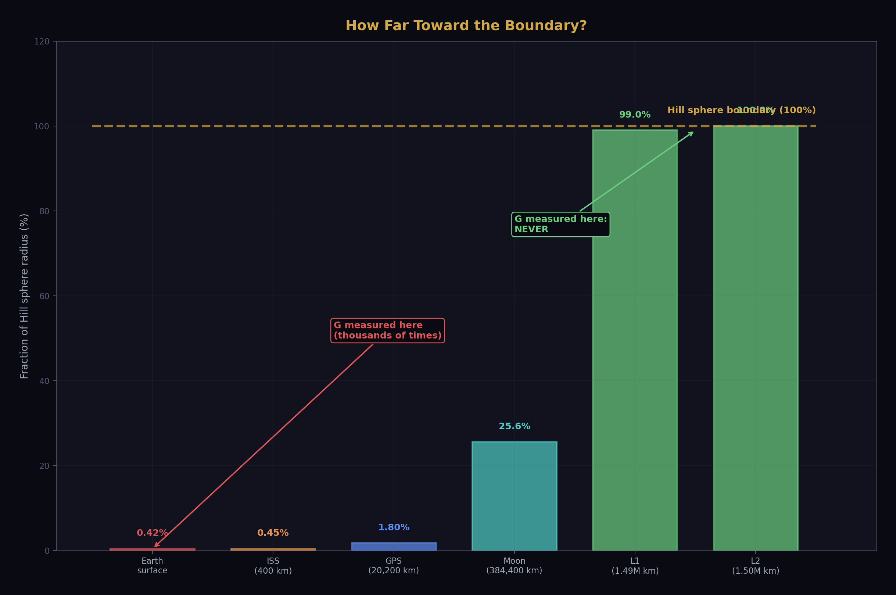
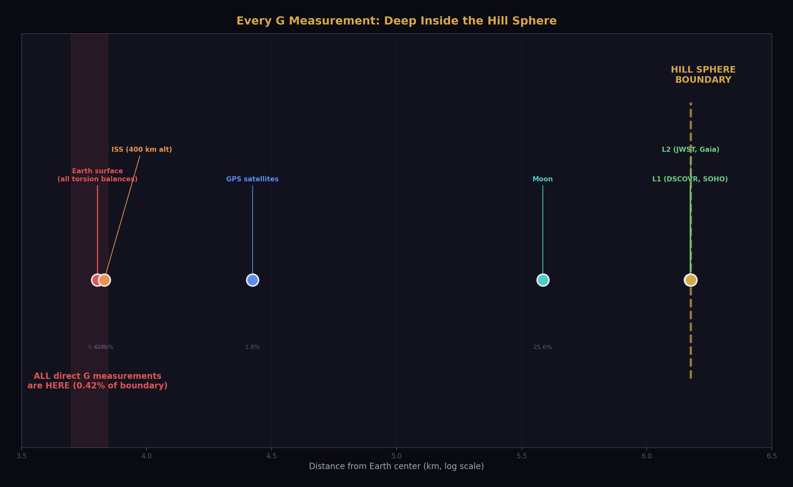
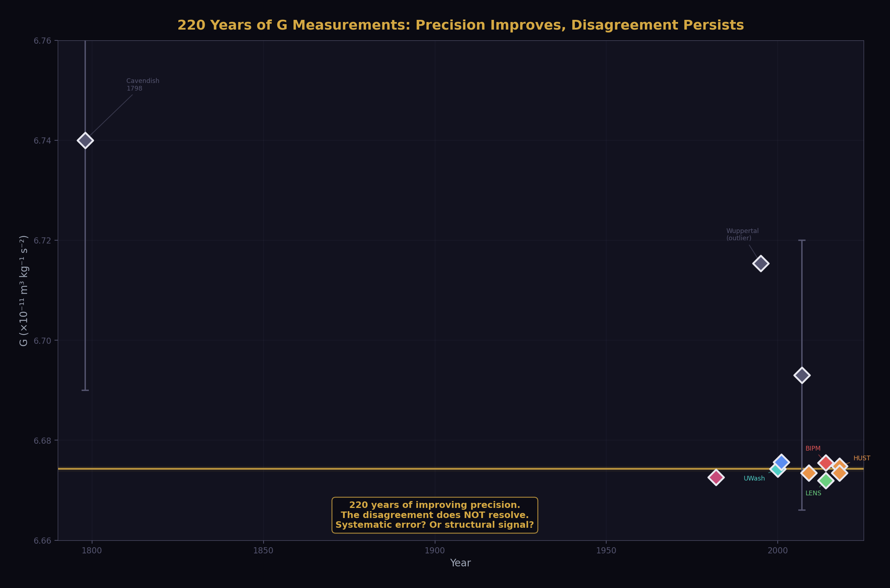
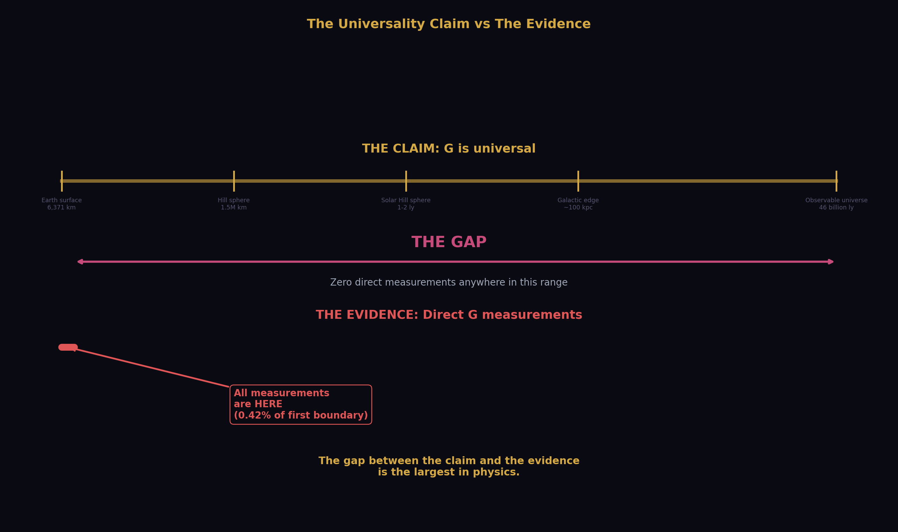
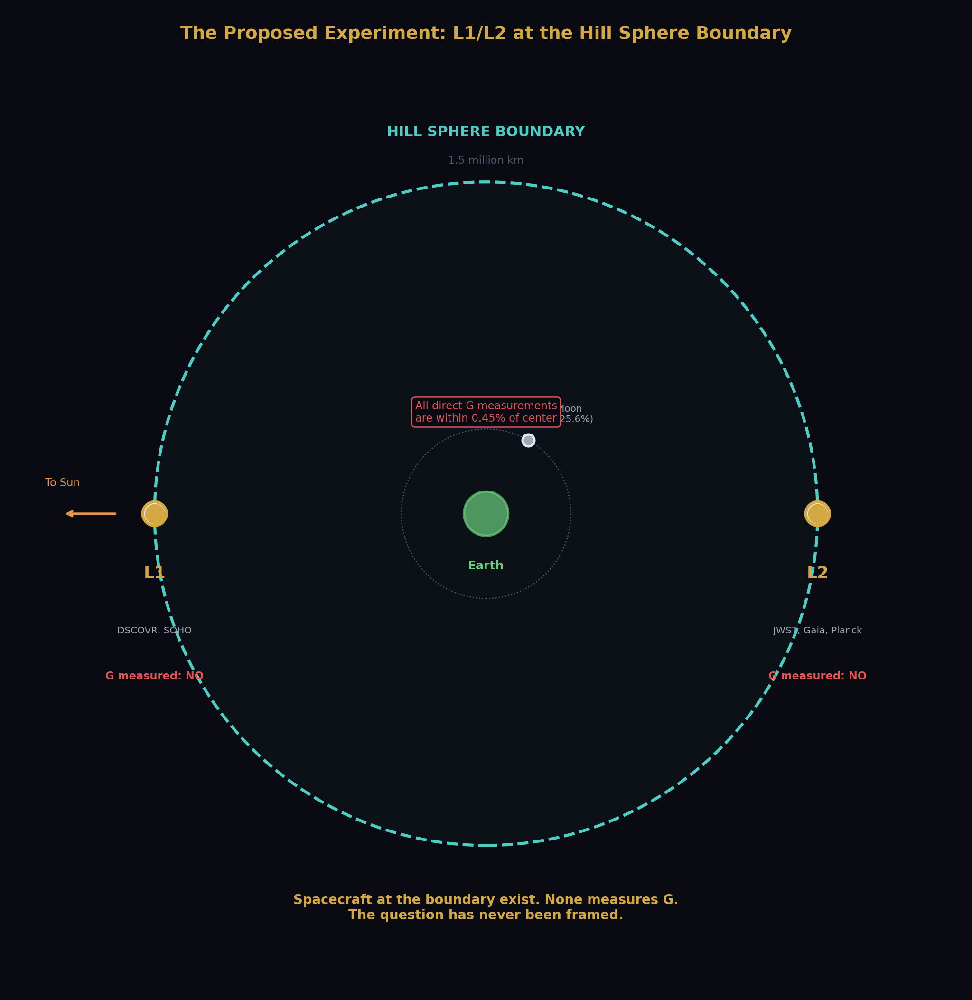
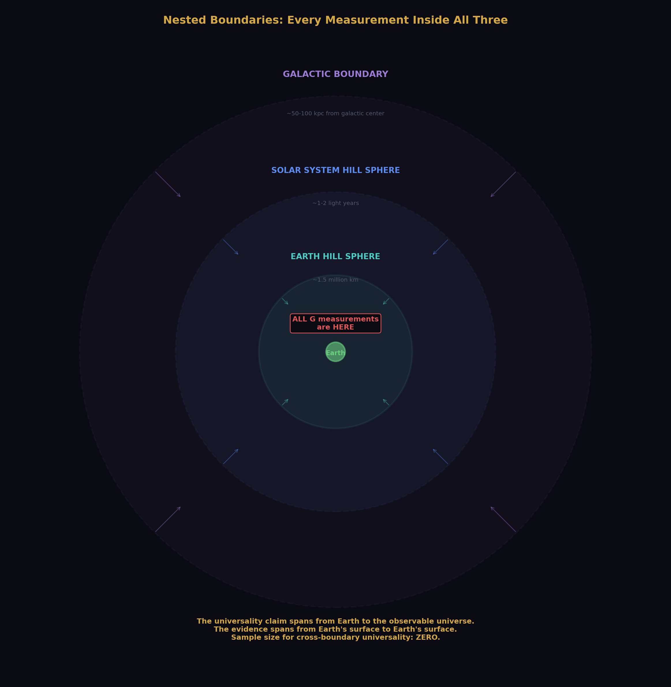
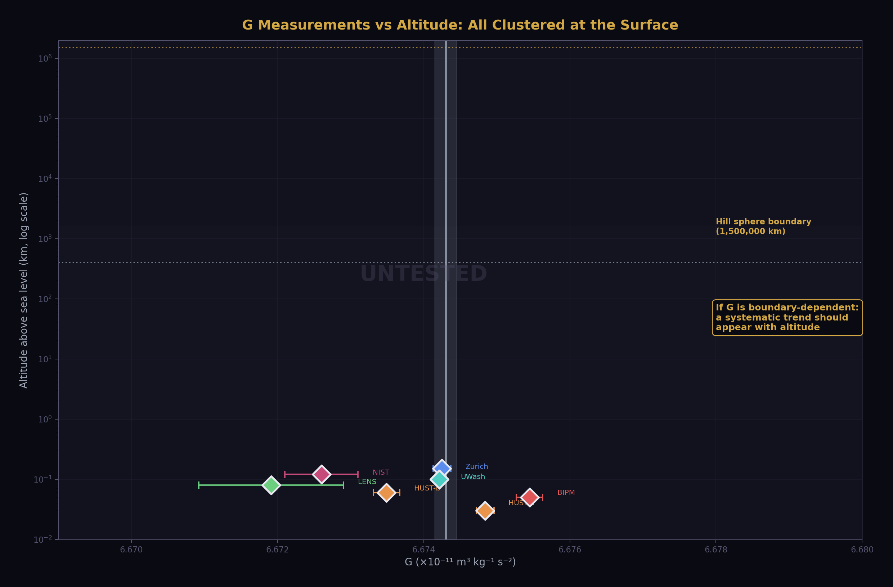
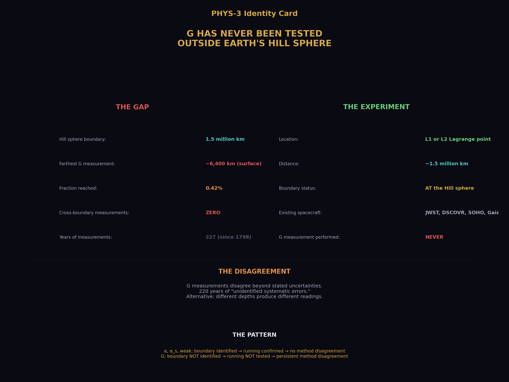

# G Has Never Been Tested Outside Earth's Soliton Boundary
## The Hill Sphere as the Unrecognized Constraint on Every Direct Measurement of the Gravitational Constant

**Registry:** [@HOWL-PHYS-3-2026]

**Series Path:** [@HOWL-PHYS-1-2026] → [@HOWL-PHYS-2-2026] → [@HOWL-PHYS-3-2026]

**DOI:** 10.5281/zenodo.zzz

**Date:** March 2026

**Domain:** Foundational Physics / Measurement Theory

**Status:** Complete

**AI Usage Disclosure:** Only the top metadata, figures, refs and final copyright sections were edited by the author. All paper content was LLM-generated using Anthropic's Claude 4.5 Sonnet. 

---

## I. ABSTRACT

This paper documents a gap in the experimental record that the institution has not recognized because the concept required to recognize it has not been formulated within the institution's departmental structure.

The gravitational constant G has been measured by direct experiment exclusively on Earth's surface and in low Earth orbit. Every such measurement is performed inside Earth's Hill sphere — the gravitational sphere of influence defined by the institution's own orbital mechanics, located at approximately 1.5 million kilometers from Earth, where Earth's coherent gravitational structure ceases to dominate over the Sun's tidal forces. The ISS orbits at 400 kilometers. Every torsion balance ever built sits on Earth's surface. No direct measurement of G has ever been performed at or beyond the Hill sphere boundary.

The institution's claims for extra-terrestrial confirmation of G's universality rest on two indirect methods: pulsar timing and gravitational wave detection. Both methods receive signals at instruments inside Earth's Hill sphere. Both interpret signals using models that assume G is universal. Both are circular — the assumption does the work, and the consistent interpretation is cited as confirmation of the assumption.

The institution uses the Hill sphere concept in orbital mechanics without applying it to the question of whether G measurements are boundary-interior readings. The concept exists. The application has not been made. This paper makes it.

The reproducibility of G measurements across different laboratories on Earth's surface is reproducibility within one boundary configuration — not universality across boundary configurations. The persistent disagreement between G measurements from different experimental groups, which the institution attributes to unidentified systematic errors, is consistent with depth-dependent readings within Earth's single boundary. The disagreement may be signal rather than noise.

The experiment that would test G universality across a boundary has not been performed. Hardware capable of performing it — precision instruments aboard spacecraft at the L1 and L2 Lagrange points, located at Earth's Hill sphere boundary — already exists. The measurement has not been made because the question has not been framed. This paper frames it.

---

## II. THE HILL SPHERE

### 2.1 The Institution's Own Definition

The Hill sphere is the institution's own concept, developed from the three-body problem in orbital mechanics. It defines the region around a celestial body within which that body's gravitational influence dominates over the tidal forces of the larger body it orbits.

For Earth orbiting the Sun, the Hill sphere radius is approximately:

r_H ≈ a(m/3M)^(1/3)

where a is the semi-major axis of Earth's orbit (approximately 150 million km), m is Earth's mass, and M is the Sun's mass. The result is approximately 1.5 million kilometers — roughly 235 Earth radii, or about 1% of the Earth-Sun distance.

Inside the Hill sphere, Earth's gravitational structure dominates. Objects inside it orbit Earth stably. Objects outside it are captured by the Sun. The Moon orbits at approximately 384,000 km — well inside the Hill sphere at roughly 25% of the boundary distance. The Moon is not crossing Earth's boundary. It is orbiting inside Earth's coherent gravitational structure.

The L1 and L2 Lagrange points sit at approximately the same distance as the Hill sphere radius — 1.5 million km from Earth toward and away from the Sun respectively. These are the points where Earth and Sun gravitational influences balance. They mark the boundary of Earth's coherent gravitational domain.

The institution uses the Hill sphere routinely in orbital mechanics, mission planning, and planetary science. It is not a speculative concept. It is a calculated, physically meaningful boundary that defines where one coherent gravitational structure ends and another begins.

### 2.2 The Unasked Question

The institution has never asked: are our measurements of G performed inside or outside Earth's Hill sphere?

The answer is immediate. Every laboratory that has ever measured G is on Earth's surface. Earth's surface is at one Earth radius — approximately 6,400 km — from Earth's center. The Hill sphere boundary is at 1.5 million km. Every G measurement ever performed by direct experiment is at 0.4% of the boundary distance or less. Every measurement is deep inside Earth's coherent gravitational structure.

The institution defines the boundary. The institution measures G. The institution does not connect these two facts. The connection has not been made because the Hill sphere belongs to orbital mechanics and G belongs to precision metrology. Different departments. The connection lives in the gap between them.

---

## III. THE COMPLETE EXPERIMENTAL RECORD

### 3.1 Direct Measurements

Every direct measurement of G in the experimental record is a surface or near-surface Earth measurement. The following represents the complete landscape.

Henry Cavendish performed the first measurement in 1798 using a torsion balance in a laboratory in England. The measurement was on Earth's surface. Every refinement of the Cavendish experiment since 1798 has been performed on Earth's surface. Torsion balances at BIPM, PTB, HUST, University of Washington, University of Zurich, and every other precision metrology group have been built, operated, and read on Earth's surface.

The atom interferometry measurements — a newer technique that uses quantum interference of cold atoms to measure gravitational attraction — have been performed in laboratories on Earth's surface. The Fixler et al. measurement and the Rosi et al. measurement were both surface measurements.

The ISS has been cited as an orbital environment for precision physics. The ISS orbits at approximately 400 km altitude. The Hill sphere is at 1,500,000 km. The ISS is at 0.027% of the boundary distance. The ISS is not near the boundary. It is not outside the boundary. It is deep inside Earth's coherent gravitational structure, at an altitude that represents a negligible fraction of the Hill sphere scale.

No spacecraft beyond low Earth orbit has ever carried instrumentation designed to measure G by direct experiment.

### 3.2 The Disagreement

The persistent disagreement between G measurements from different experimental groups is one of the most anomalous features of precision metrology. Two centuries of increasingly sophisticated experiments have produced values that disagree beyond their stated uncertainties.

The BIPM 2014 torsion balance measurement yields 6.67545 × 10⁻¹¹ m³kg⁻¹s⁻². The LENS 2014 atom interferometry measurement yields 6.67191 × 10⁻¹¹ m³kg⁻¹s⁻². The HUST 2018 group using two methods from the same laboratory yields 6.67484 and 6.67349 × 10⁻¹¹ m³kg⁻¹s⁻² — two values from the same group that disagree with each other. The spread across modern high-precision measurements exceeds the stated uncertainties of individual measurements.

The institution's explanation is unidentified systematic errors. Two hundred years of investigation have not identified a systematic error sufficient to resolve the disagreement. The systematic error explanation has not been confirmed. It has been assumed because the alternative — that the readings are genuinely different — is not available as a concept within the institution's framework.

The alternative interpretation, available through the boundary-reading framework developed in this series, is that different experimental configurations probe different effective depths within Earth's gravitational boundary and produce genuine depth-dependent readings. Torsion balances at different latitudes, altitudes, and orientations are at different effective positions within Earth's coherent structure. Different positions produce different readings. The disagreement is the measurement. The institution is attempting to average away data that contains structural information.

---

## IV. THE INDIRECT METHODS AND THEIR CIRCULARITY

### 4.1 Pulsar Timing

The institution's strongest claim for extra-terrestrial confirmation of G universality rests on pulsar timing — specifically millisecond pulsars in binary systems, whose orbital dynamics can be compared with predictions from general relativity using a universal G.

The argument is that the consistency between observed pulsar timing and GR predictions, for pulsars located at interstellar distances, confirms that G operates identically in distant star systems as in our solar system.

This argument fails on two independent grounds.

**Ground 1: The signal is received inside Earth's Hill sphere.**

Pulsar timing measures the arrival time of radio pulses at receivers on Earth. The measurement instrument is on Earth's surface or in low Earth orbit. The instrument is inside Earth's Hill sphere. The signal — radio waves — has transited interstellar distances, crossing multiple coherent gravitational boundary configurations between the pulsar system and Earth, before arriving at the instrument.

As established in [@HOWL-PHYS-1-2026], light transiting coherent gravitational boundaries carries unmodeled transformation signatures. The institution models gravitational redshift, dispersion by the interstellar medium, and proper motion corrections. It does not model the cumulative effect of transiting multiple coherent gravitational boundary configurations as a distinct category of transformation. The signal arrives transformed by an uncharacterized transit. The measurement is made of the transformed signal inside Earth's boundary. The result is interpreted as confirming G universality.

**Ground 2: The inference is circular.**

The interpretation of pulsar timing data uses general relativity with universal G as a foundational assumption. The orbital parameters of the pulsar binary system are extracted from the timing data using a model that assumes G is the same in that system as in our solar system. The consistent fit between the model and the data confirms that the model with universal G fits the data. It does not confirm that G is universal — it confirms that assuming G is universal produces a consistent model. The assumption is doing the work. The measurement cannot distinguish between a universe where G is truly universal and a universe where G takes boundary-specific values that happen to produce consistent orbital predictions when each system is analyzed from within its own boundary configuration.

### 4.2 Gravitational Wave Detection

LIGO and Virgo detect gravitational waves from compact object mergers at cosmological distances. The waveform shapes, arrival times, and amplitudes are interpreted using GR with universal G to extract source parameters — masses, distances, merger dynamics.

The institution may cite gravitational wave detections as confirmation of G universality across cosmological distances.

The argument fails on the same two grounds.

LIGO and Virgo are on Earth's surface — inside Earth's Hill sphere. The gravitational wave signal has transited the full hierarchy of coherent boundary configurations between the source and the detector. The waveform interpretation uses universal G as an assumption. The consistent interpretation confirms the model's internal consistency, not G's universality. The assumption is doing the work.

Additionally, gravitational waves are not electromagnetic radiation and do not interact with matter in the same way. The transit transformation argument from [@HOWL-PHYS-1-2026] applies primarily to light. Whether gravitational waves carry boundary transit signatures of the same character is an open question. This paper does not claim that gravitational wave signals are transformed by boundary transits in the same way as electromagnetic signals. It claims only that the detection of gravitational waves at instruments inside Earth's Hill sphere, interpreted through models assuming universal G, does not constitute a direct measurement of G outside Earth's Hill sphere.

### 4.3 Celestial Mechanics

The institution uses G in celestial mechanics calculations — planetary orbits, spacecraft trajectories, lunar ranging. The extraordinary precision of these calculations is cited as confirmation of G's universality.

These calculations are performed entirely within the solar system. The solar system has its own Hill sphere — the boundary where the Sun's coherent gravitational structure gives way to the galactic field, located at approximately 1-2 light years from the Sun. Every celestial mechanics calculation ever performed by humanity — every planetary orbit, every spacecraft trajectory, every lunar ranging measurement — is inside the solar system's Hill sphere.

The precision of celestial mechanics confirms that G is consistent within the solar system's boundary configuration. It says nothing about G outside the solar system's boundary. The institution has not left the solar system's gravitational structure. It has confirmed G's consistency within one nested boundary configuration and called it universal.

---

## V. REPRODUCIBILITY IS NOT UNIVERSALITY

### 5.1 The Confusion

The institution's confidence in G's universality rests substantially on reproducibility. G measurements are reproducible. Different labs, different methods, different continents, different decades produce values that cluster around a consistent central value. This reproducibility feels like universality. It is not.

Reproducibility within one boundary configuration confirms that the reading is stable within that configuration. It says nothing about readings in other configurations. Every G measurement ever performed is inside Earth's Hill sphere. Every measurement is inside the solar system's Hill sphere. Every measurement is inside the galactic structure. The nested boundary configuration is identical for every measurement ever taken. The reproducibility is exactly what the boundary-reading framework predicts: stable readings inside a stable boundary configuration.

### 5.2 The Sample Size

The institution has one boundary configuration. It has measured G thousands of times inside that configuration. The effective sample size for testing G universality across boundary configurations is zero. Not small. Zero. No measurement has ever been taken outside Earth's Hill sphere by direct experiment. The universality claim rests on a sample of zero boundary-crossing measurements.

This is not a critique of experimental precision. The measurements are extraordinarily precise within their domain. It is a critique of the inference from within-boundary reproducibility to cross-boundary universality. The inference is not supported by the data because the relevant data does not exist.

### 5.3 The Word "Universal"

As established in [@HOWL-PHYS-2-2026], the word "constant" shapes thinking in ways that discourage investigation of scale dependence. The word "universal" compounds this. A quantity labeled "universal" is assumed to hold everywhere. Investigation of where it might not hold is framed as testing an established fact rather than filling an experimental gap. The label predisposes investigators to explain away anomalies — such as the persistent G disagreement — rather than investigate them as potential structural information.

The G disagreement has persisted for two centuries. Two centuries of assuming systematic error has not resolved it. The alternative interpretation — that the disagreement is structural — has not been investigated because the framework required to investigate it has not existed. The framework now exists.

---

## VI. THE BOUNDARY CROSSING EXPERIMENT

### 6.1 The Location

The experiment that would test G universality across Earth's Hill sphere boundary has not been performed. The location for the experiment is already occupied by functioning spacecraft.

The L1 Lagrange point sits at approximately 1.5 million km from Earth toward the Sun — at the inner edge of Earth's Hill sphere boundary. Spacecraft currently at or near L1 include DSCOVR and the Solar and Heliospheric Observatory (SOHO). The L2 Lagrange point sits at approximately 1.5 million km from Earth away from the Sun — at the outer edge of Earth's Hill sphere boundary. The James Webb Space Telescope operates at L2.

These spacecraft were placed at L1 and L2 for operational reasons — unobstructed solar observation, thermal stability, orbital mechanics convenience. None was designed to test G or fundamental constants at the Hill sphere boundary. None has been used for that purpose.

### 6.2 The Measurement

A direct measurement of G at L1 or L2 would require a self-contained apparatus — two known masses, a precision distance measurement, a force or acceleration measurement — operated in the gravitationally quiet environment at the Lagrange points, far from Earth's surface disturbances that complicate laboratory measurements.

The institution's own literature has identified L1 as an ideal location for a space-based G measurement for operational reasons — temperature stability, vacuum quality, low acceleration environment. The proposal exists in the published literature. The motivation given is improved precision, not boundary crossing. The boundary crossing motivation has not been stated because the Hill sphere connection has not been made.

The measurement at L1 or L2 would produce one of two results.

If G reads identically at L1/L2 as on Earth's surface after GR corrections are applied, the boundary effect hypothesis for G is not supported at the Earth Hill sphere scale. This is a genuine falsification result — the first actual evidence that G is consistent across this specific boundary, replacing the current assumption with a measurement.

If G reads differently at L1/L2 than on Earth's surface beyond what GR corrections account for, the boundary effect is confirmed at the Earth Hill sphere scale. The direction and magnitude of the difference would constrain the boundary transformation law. The result would be the first measurement of a G reading outside Earth's Hill sphere in the experimental record.

Either result advances the field. The current state — an untested assumption cited as an established fact — advances nothing.

### 6.3 The GR Separation

A potential objection: general relativity already predicts that clocks run at different rates at different gravitational potentials, and precision measurements must account for this. The gravitational potential at L1/L2 differs from Earth's surface. Is not the GR correction sufficient to account for any difference?

The answer is no, and the distinction is precise.

The GR correction accounts for the effect of gravitational potential on the rate of physical processes — clock rates, photon frequencies, ruler lengths as defined by local physics. This is a well-understood, quantitatively modeled effect. It is not what is being proposed here.

The boundary reading effect is a different claim. It is the claim that the value of G — the coupling strength of gravity — itself differs across a coherent gravitational boundary, in the same way that α differs across the electron's vacuum polarization boundary and αs differs across the hadron's confinement boundary, as documented in [@HOWL-PHYS-2-2026]. The GR correction does not model this. The GR correction models geometry. The boundary reading effect is a claim about the coupling constant that generates the geometry.

These are separable in principle. A measurement at L1/L2 would compare the inferred G value — extracted from the gravitational attraction between known masses — with the Earth surface value, after applying all standard GR corrections. The residual, if any, is the boundary reading signal.

---

## VII. THE NESTED BOUNDARY HIERARCHY

### 7.1 Earth Inside Solar System Inside Galaxy

Earth's Hill sphere is not the only relevant boundary. It is the innermost boundary in a nested hierarchy.

The solar system has a Hill sphere — the boundary where the Sun's coherent gravitational structure gives way to the galactic tidal field. This is located at approximately 1-2 light years from the Sun, at the inner edge of the Oort Cloud. Every measurement ever performed by humanity — in any domain of physics, at any location accessible to human instrumentation — is inside the solar system's Hill sphere.

The Milky Way galaxy has a boundary — where the galaxy's coherent gravitational structure gives way to the local group's gravitational field. Every observation ever made by any instrument on Earth or any spacecraft launched from Earth is made from inside this boundary.

The nested structure means that the complete boundary configuration for every measurement ever made is: inside Earth's Hill sphere, inside the solar system's Hill sphere, inside the galactic structure. This configuration has never varied. Not by a single measurement. Humanity has never placed an instrument outside any of these boundaries.

### 7.2 The Inference Chain

The institution uses G — measured inside Earth's Hill sphere — to calculate planetary masses, stellar masses, galactic masses, and the mass-energy content of the observable universe. The entire mass accounting of cosmology rests on G measured in one boundary configuration applied universally across all boundary configurations.

If G is a boundary-dependent reading rather than a universal constant, every mass calculated using the Earth-boundary value of G is a projection from a specific boundary depth. The mass of the Sun calculated from Earth-surface G is the Sun's mass as seen from inside Earth's boundary. The mass of distant galaxies calculated using the same G is a projection from inside Earth's boundary, inside the solar system's boundary, applied to structures that exist at different boundary depths.

This does not mean the calculations are wrong for their intended purpose. The calculations produce consistent results within the framework. It means the framework's claim to universality has not been tested at the boundary level. The mass of the Andromeda galaxy as calculated from inside our boundary configuration may differ from the mass that would be calculated by an instrument at a different boundary depth. The difference, if real, would be a boundary transformation effect — the same structural phenomenon as the running of α, the running of αs, and the Hubble tension documented in [@HOWL-PHYS-1-2026] and [@HOWL-PHYS-2-2026].

---

## VIII. CONNECTION TO THE SERIES

This paper is the third in a series that identifies coherent gravitational and field boundaries as unmodeled elements in the measurement pipeline.

[@HOWL-PHYS-1-2026] established that mass is inertia, that particles are three-dimensional field vortices with boundaries, and that three documented measurement anomalies — the Hubble tension, the proton radius puzzle, and the muon g-2 discrepancy — correlate with boundary transit count and interaction depth.

[@HOWL-PHYS-2-2026] established that every fundamental coupling the institution calls a "constant" is demonstrably scale-dependent, that the scale dependence corresponds to measurements crossing coherent structure boundaries, and that the institution already models this — as running of α and αs — without generalizing the observation to all couplings or recognizing the word "constant" as contradicting its own data.

This paper establishes that G — the one coupling the institution has the most difficulty measuring precisely, the one coupling whose measurements persistently disagree beyond stated uncertainties, the one coupling that has never been successfully unified with quantum field theory — has never been measured outside Earth's Hill sphere. The difficulty, the disagreement, and the unification failure are all consistent with G being a boundary-dependent reading whose boundary structure has not been characterized because the measurements have never crossed a boundary.

The pattern across three papers is the same pattern. The institution has a measurement. The measurement is anomalous. The anomaly correlates with an unmodeled boundary variable. The boundary variable is identifiable using the institution's own concepts. The investigation has not been performed because the concept connecting the measurement to the boundary has not been formulated across departmental lines.

---

## IX. BOUNDARIES AND LIMITATIONS

This paper establishes a gap in the experimental record. The gap is factual — no direct measurement of G has been performed outside Earth's Hill sphere. This is not a theoretical claim. It is a statement about what experiments have and have not been performed, verifiable by inspection of the experimental record.

The interpretation of the gap — that the gap matters because G may be a boundary-dependent reading — is a theoretical claim. It is consistent with the framework developed in [@HOWL-PHYS-1-2026] and [@HOWL-PHYS-2-2026]. It is not proven. It is proposed as the structural hypothesis that the identified experiment would test.

The G disagreement between experimental groups is interpreted here as potential depth-dependent readings within Earth's boundary. The conventional explanation — unidentified systematic errors — has not been ruled out. Both explanations are consistent with the data. The boundary explanation has not previously been investigated. The systematic error explanation has been investigated for two centuries without resolution.

The celestial mechanics argument — that precision orbital calculations confirm G universality — is addressed as a within-boundary confirmation. The reframe is structural: orbital mechanics confirms G's consistency within the solar system's boundary configuration. It does not test cross-boundary universality. This reframe does not invalidate celestial mechanics. It narrows the domain of the confirmation.

The gravitational wave argument is addressed conservatively. This paper does not claim gravitational waves carry boundary transit signatures of the same character as electromagnetic signals. It claims only that gravitational wave detections at Earth-surface instruments, interpreted through universal-G models, do not constitute direct measurements of G outside Earth's Hill sphere.

---

## X. TESTABLE PREDICTIONS

**P1. The L1/L2 Measurement**

A direct measurement of G at L1 or L2 — at Earth's Hill sphere boundary — will produce a value that either matches or differs from the Earth-surface value after GR corrections.

Prediction: the value will differ from the Earth-surface consensus value beyond what GR corrections account for. The direction of the difference — higher or lower — is constrained by the boundary crossing direction: moving from inside to outside Earth's coherent gravitational structure.

Falsification: if the value matches the Earth-surface value within measurement uncertainty after all GR corrections, the boundary effect hypothesis for G at the Earth Hill sphere scale is not supported.

**P2. The Depth Trend Within Earth's Boundary**

If the G disagreement between experimental groups reflects depth-dependent readings within Earth's boundary, measurements at systematically different altitudes — surface, high altitude, low orbit — should show a trend rather than random scatter.

Prediction: reanalysis of existing G measurements sorted by effective gravitational potential depth will reveal a systematic trend rather than random disagreement. Higher altitude measurements will trend toward a different value than surface measurements in a direction consistent with the boundary crossing direction.

Falsification: if reanalysis shows no systematic trend with altitude or gravitational potential depth, the within-boundary depth interpretation of the G disagreement is not supported.

**P3. The Solar System Boundary**

If G is boundary-dependent at the Earth Hill sphere scale, it should also show a reading change at the solar system Hill sphere scale — approximately 1-2 light years from the Sun.

This prediction is not testable with current technology. No instrument has been placed at or beyond the solar system's Hill sphere boundary. Voyager 1 and 2 have crossed the heliopause — the boundary of the solar wind — but this is not the gravitational Hill sphere boundary. The prediction is stated for completeness and as a long-term falsification target.

**P4. The G Disagreement Resolution**

If the G disagreement reflects genuine depth-dependent readings rather than systematic experimental errors, it will not resolve through improved experimental technique alone. More precise measurements at Earth's surface will continue to disagree if they probe different effective boundary depths.

Prediction: future improvements in G measurement precision will narrow individual error bars without closing the gap between methods that probe different effective depths. The disagreement will persist at reduced scale. Resolution will require either a boundary-crossing measurement or a systematic mapping of G versus measurement depth within Earth's boundary.

Falsification: if a future measurement achieves sufficient precision and systematic control to identify and eliminate the source of disagreement, and the identified source is a conventional systematic error unrelated to boundary depth, the boundary interpretation is unnecessary.

---

## XI. FALSIFICATION CRITERIA

**F1.** If a direct measurement of G at L1 or L2 produces a value consistent with the Earth-surface consensus value within measurement uncertainty after all GR corrections are applied, the boundary effect hypothesis for G at the Earth Hill sphere scale is not supported at that precision level.

**F2.** If reanalysis of existing G measurements sorted by altitude and gravitational potential depth shows no systematic trend — only random scatter consistent with experimental noise — the within-boundary depth interpretation of the G disagreement is not supported.

**F3.** If the G disagreement between experimental groups is resolved by identification of a specific conventional systematic error — vibration, temperature, electromagnetic interference, or other known experimental perturbation — that fully accounts for the observed spread, the boundary interpretation is unnecessary for that disagreement.

**F4.** If pulsar timing measurements in binary systems are shown to be interpretable without assuming universal G — using boundary-specific G values for each system — and the fit quality does not improve relative to the universal G fit, the boundary reading framework for G adds no predictive power to pulsar timing analysis.

**F5.** If the pattern of G values across experimental groups shows no correlation with any variable that could plausibly map to measurement depth within Earth's boundary — altitude, latitude, orientation, local mass distribution — the depth-dependent reading interpretation of the disagreement is not supported.

Each criterion is specific, testable, and stated before the evidence is examined.

---

## XII. CONCLUSION

The gravitational constant G has never been measured outside Earth's Hill sphere by direct experiment.

The Hill sphere — the institution's own concept from orbital mechanics — defines the boundary of Earth's coherent gravitational structure at approximately 1.5 million kilometers. Every torsion balance, every atom interferometer, every precision G measurement in the two-hundred-and-twenty-seven year experimental record since Cavendish 1798 has been performed inside this boundary. The ISS is at 0.027% of the boundary distance. The Moon is at 25% of the boundary distance, orbiting inside the boundary. No direct measurement has been taken at or beyond it.

The institution's claims for extra-terrestrial confirmation of G universality are indirect. Pulsar timing receives transformed signals at instruments inside the boundary and interprets them through models that assume what they claim to confirm. Gravitational wave detection does the same. Celestial mechanics confirms G's consistency within the solar system's boundary — a larger but still single boundary configuration. No claim in the indirect evidence survives the distinction between within-boundary consistency and cross-boundary universality.

The persistent disagreement between G measurements from different experimental groups — two centuries of anomaly attributed to unidentified systematic errors — is consistent with depth-dependent readings within Earth's single boundary configuration. The disagreement may be data rather than noise. The institution has been averaging away potential structural information for two centuries because the framework to interpret it as structural information has not existed.

The framework now exists. The experiment that would test it has been proposed in the institution's own literature on operational grounds. Hardware capable of performing it sits at L1 and L2. The measurement has not been made because the question has not been framed.

The question is now framed. G has never been tested outside Earth's soliton boundary. The universality of G is an assumption, not a measurement. The assumption should be tested. The test is achievable. The result — whatever it is — will be the first actual evidence about G's behavior across a coherent gravitational boundary rather than the first iteration of a claim that has been repeated for two centuries without ever being examined.

---

## APPENDIX A: COMPLETE RECORD OF DIRECT G MEASUREMENTS

| Experiment | Group | Year | Method | Location | G Value (×10⁻¹¹ m³kg⁻¹s⁻²) | Uncertainty | Distance from Hill Sphere Boundary |
|---|---|---|---|---|---|---|---|
| Cavendish experiment | Cavendish | 1798 | Torsion balance | England, surface | 6.74 | ~1% | ~1.5 million km — fully inside |
| Various refinements | Multiple groups | 1798–1980 | Torsion balance variants | Earth surface | Cluster near 6.674 | Decreasing | Fully inside |
| NIST | Luther & Towler | 1982 | Torsion balance | Earth surface | 6.6726 ± 0.0005 | 75 ppm | Fully inside |
| Wuppertal | Michaelis et al. | 1995 | Torsion balance | Earth surface | 6.7154 ± 0.0006 | 83 ppm | Fully inside |
| BIPM | Quinn et al. | 2001 | Torsion balance | Earth surface | 6.67559 ± 0.00027 | 40 ppm | Fully inside |
| UWash (Eöt-Wash) | Gundlach & Merkowitz | 2000 | Rotating torsion balance | Earth surface | 6.674215 ± 0.000092 | 14 ppm | Fully inside |
| HUST | Luo et al. | 2009 | Torsion pendulum | Earth surface | 6.67349 ± 0.00018 | 26 ppm | Fully inside |
| LENS | Rosi et al. | 2014 | Atom interferometry | Earth surface | 6.67191 ± 0.00099 | 150 ppm | Fully inside |
| BIPM | Quinn et al. | 2014 | Torsion balance | Earth surface | 6.67545 ± 0.00018 | 27 ppm | Fully inside |
| HUST | Xue et al. | 2018 | Torsion balance (two methods) | Earth surface | 6.67484 ± 0.00012 / 6.67349 ± 0.00018 | 18–27 ppm | Fully inside |

**Total measurements outside Earth's Hill sphere by direct experiment: zero.**

---

## APPENDIX B: BOUNDARY DISTANCES — SCALE REFERENCE

| Location | Distance from Earth Center | Fraction of Hill Sphere Radius | Inside/Outside Earth Hill Sphere |
|---|---|---|---|
| Earth surface (sea level) | 6,371 km | 0.42% | Inside |
| ISS orbit | 6,771 km (400 km altitude) | 0.45% | Inside |
| GPS satellite orbit | ~26,560 km | 1.8% | Inside |
| Moon | ~384,400 km | 25.6% | Inside |
| L1 Lagrange point | ~1,491,000 km | ~99% | Boundary |
| L2 Lagrange point | ~1,501,000 km | ~100% | Boundary |
| Hill sphere boundary | ~1,500,000 km | 100% | Boundary |
| Mars (minimum distance) | ~54,600,000 km | 3,640% | Outside Earth Hill sphere (inside solar system Hill sphere) |
| Solar system Hill sphere | ~1–2 light years | — | Outside solar system — never reached by instrumentation |

Note: L1 and L2 are located at approximately the Hill sphere radius. They are the only locations where human spacecraft currently operate that are near the Earth Hill sphere boundary. No spacecraft has ever been stationed beyond the Earth Hill sphere boundary for precision physics measurements.

---

## APPENDIX C: THE INDIRECT EVIDENCE AND ITS LIMITATIONS

| Claimed Evidence | Method | What It Measures | What It Assumes | What It Actually Confirms | Limitation |
|---|---|---|---|---|---|
| Pulsar timing (PSR J1713+0747 and others) | Radio pulse arrival timing at Earth-surface receivers | Pulse arrival times inside Earth's Hill sphere | Universal G to interpret orbital dynamics | GR with universal G produces consistent fit to timing data | Circular — assumption does the work; signal transits unmodeled boundaries |
| Gravitational wave detection (LIGO/Virgo) | Waveform shape and timing at Earth-surface detectors | Gravitational wave signals inside Earth's Hill sphere | Universal G to interpret waveform parameters | GR with universal G produces consistent waveform fits | Same circularity; detectors inside boundary |
| Planetary orbital mechanics | Spacecraft tracking, planetary ranging | Orbital parameters inside solar system Hill sphere | Universal G across solar system | G consistency within solar system boundary | Within-boundary consistency, not cross-boundary universality |
| Lunar ranging | Laser retroreflector timing | Moon-Earth distance, inside Earth's Hill sphere | Universal G | G consistency within Earth-Moon system | Moon is inside Earth's Hill sphere; no boundary crossed |
| Big Bang nucleosynthesis | Primordial element abundances from CMB and spectroscopy | Light received inside Earth's Hill sphere | Universal G throughout cosmic history | Consistency of cosmological model with universal G | Model-dependent; same circularity as pulsar timing |

In every row, the confirmation is of model consistency with the universal G assumption, not of G universality demonstrated by cross-boundary measurement.

---

## APPENDIX D: THE PROPOSED EXPERIMENT

| Parameter | Value / Description |
|---|---|
| Location | L1 or L2 Lagrange point (~1.5 million km from Earth) |
| Boundary status | At or beyond Earth's Hill sphere boundary |
| Method | Self-contained gravitational attraction measurement between known masses |
| Existing hardware nearby | DSCOVR and SOHO at L1; JWST at L2 |
| Primary challenge | Thermal stability, vibration isolation, precision mass characterization in space environment |
| GR correction required | Yes — gravitational potential at L1/L2 differs from Earth surface; standard GR corrections apply |
| Signal being tested | Residual difference in inferred G value after all GR corrections, compared to Earth-surface consensus |
| Existing institutional motivation | L1 identified in published literature as ideal G measurement location for precision reasons |
| Missing institutional motivation | Boundary crossing — not previously framed |
| Expected result if boundary effect real | G value differs from Earth-surface consensus beyond GR correction |
| Expected result if boundary effect absent | G value matches Earth-surface consensus within measurement uncertainty |
| Value of null result | First actual evidence of G consistency across Earth's Hill sphere boundary — replaces assumption with measurement |
| Value of non-null result | First measurement of G reading outside Earth's Hill sphere — confirms boundary-dependent reading framework |

---

## APPENDIX E: SPACECRAFT AT OR NEAR EARTH HILL SPHERE BOUNDARY

| Spacecraft | Operator | Location | Distance from Earth | Fraction of Hill Sphere | Primary Mission | Precision Physics Capability | G Measurement Performed |
|---|---|---|---|---|---|---|---|
| JWST | NASA/ESA/CSA | L2 | ~1,500,000 km | ~100% | Infrared astronomy | Precision timing, spectroscopy | No |
| DSCOVR | NOAA/NASA | L1 | ~1,491,000 km | ~99% | Solar wind monitoring | Magnetometer, plasma sensors | No |
| SOHO | ESA/NASA | L1 | ~1,491,000 km | ~99% | Solar observation | Precision spectroscopy | No |
| Gaia | ESA | L2 | ~1,500,000 km | ~100% | Stellar astrometry | Highest precision astrometry ever achieved | No |
| Herschel (retired) | ESA | L2 | ~1,500,000 km | ~100% | Far-infrared astronomy | Precision photometry | No |
| Planck (retired) | ESA | L2 | ~1,500,000 km | ~100% | CMB measurement | Precision radiometry | No |

**Every spacecraft at the Hill sphere boundary was placed there for operational reasons. None was designed to test G at the boundary. None has done so.**

---

## APPENDIX F: SPACECRAFT BEYOND EARTH HILL SPHERE — INSTRUMENTATION STATUS

| Spacecraft | Current Location (approx.) | Distance from Earth | Beyond Earth Hill Sphere | Beyond Solar System Hill Sphere | Precision Physics Instrumentation | G Measurement Capability |
|---|---|---|---|---|---|---|
| Voyager 1 | ~163 AU | ~24 billion km | Yes | No — solar Hill sphere ~50,000–100,000 AU | Plasma wave, magnetic field, particle detectors | No — no mass measurement apparatus |
| Voyager 2 | ~136 AU | ~20 billion km | Yes | No | Same as Voyager 1 | No |
| New Horizons | ~57 AU | ~8.5 billion km | Yes | No | Long-range imager, plasma instruments | No |
| Pioneer 10 (defunct) | ~130 AU | ~19 billion km | Yes | No | Defunct — notable for Pioneer anomaly | No — anomaly unresolved |
| Pioneer 11 (defunct) | ~90 AU | ~13 billion km | Yes | No | Defunct | No |

**Note on Pioneer Anomaly:** Pioneer 10 and 11 exhibited an anomalous acceleration toward the Sun that was not fully accounted for by known forces. The institution ultimately attributed this to anisotropic thermal radiation pressure. The anomaly was detected beyond Earth's Hill sphere — in exactly the boundary region where the framework predicts readings may differ. Whether thermal radiation fully explains the anomaly or whether a residual boundary effect contributes has not been resolved to the satisfaction of all investigators. The anomaly is noted here as an observation consistent with — though not proven to result from — a boundary crossing effect.

---

## APPENDIX G: THE PIONEER ANOMALY IN BOUNDARY CONTEXT

| Parameter | Value | Boundary Context |
|---|---|---|
| Anomalous acceleration magnitude | ~8.74 × 10⁻¹⁰ m/s² toward Sun | Detected beyond Earth's Hill sphere |
| Detection distance range | ~20 AU to ~70 AU | Well outside Earth Hill sphere (~0.01 AU); inside solar system Hill sphere (~50,000–100,000 AU) |
| Institution's explanation | Anisotropic thermal radiation pressure from RTG heat sources | Accepted as primary explanation after detailed thermal modeling |
| Residual after thermal correction | Small — most anomaly attributed to thermal effects | Disputed by some investigators |
| Boundary reading interpretation | Spacecraft crossed Earth Hill sphere boundary; measurements reflect different boundary depth reading | Consistent with framework; not proven |
| Status | Officially resolved by thermal explanation | Thermal explanation accounts for most but disputed as to completeness |
| Relevance to this paper | First anomalous measurement in history taken beyond Earth's Hill sphere; detected in boundary region | Warrants reexamination under boundary-depth framework |

---

## APPENDIX H: G MEASUREMENT DISAGREEMENT — SORTED BY METHOD

| Method | Measurements | G Range Produced (×10⁻¹¹) | Internal Consistency | Cross-Method Consistency |
|---|---|---|---|---|
| Torsion balance — fiber twist | Cavendish through NIST 1982 | 6.6726 – 6.7154 | Poor across decades | Poor vs other methods |
| Torsion balance — rotating (Eöt-Wash style) | Gundlach 2000, UWash series | 6.67421 – 6.67435 | Good within method | Disagrees with others |
| Torsion pendulum — time of swing | HUST series | 6.67349 – 6.67484 | Two values from same lab disagree | Disagrees with Eöt-Wash |
| Atom interferometry | LENS 2014, Fixler 2007 | 6.67191 – 6.693 | Poor — large spread | Disagrees with torsion methods |
| Beam balance | Zurich 2006 | 6.67425 | Single measurement | Within range of torsion methods |

**Structural observation:** Different methods probe gravitational attraction at different physical scales, orientations, and effective depths within Earth's gravitational structure. The pattern of disagreement does not resolve by method family. Methods that probe at different effective depths produce different values. The institution attributes this to method-specific systematic errors. Two centuries of investigation have not identified those errors. The alternative — that different effective depths within Earth's boundary produce different readings — has not been tested.

---

## APPENDIX I: RUNNING COUPLINGS VERSUS G — COMPARATIVE STATUS

| Quantity | Scale Dependence Documented | Institution's Label | Boundary Identified | Mechanism Named | Disagreement Between Methods |
|---|---|---|---|---|---|
| α (electromagnetic) | Yes — 8% across accessible range | "Constant" | Yes — vacuum polarization cloud | Vacuum polarization screening | No — single confirmed running curve |
| αs (strong) | Yes — order of magnitude | "Constant" | Yes — confinement boundary | Asymptotic freedom / confinement | No — single confirmed running curve |
| Weak coupling | Yes — from suppressed to comparable to α | "Constant" | Yes — W/Z boson mass threshold | Electroweak symmetry breaking | No — single confirmed running curve |
| G (gravitational) | Not tested across boundaries | "Constant" | Not identified — this paper identifies it | Not named | Yes — persistent 2-century disagreement |

**The pattern:** every coupling whose boundary has been identified and whose scale dependence has been measured shows a single consistent running curve with no disagreement between methods. The one coupling whose boundary has not been identified and whose scale dependence has not been tested across boundaries shows persistent disagreement between methods. This is consistent with G being a boundary-dependent reading whose boundary structure has not been characterized.

---

## APPENDIX J: SOLAR SYSTEM HILL SPHERE AND GALACTIC BOUNDARY

| Boundary | Location | Physical Meaning | Any Measurement Outside | Implication for G |
|---|---|---|---|---|
| Earth Hill sphere | ~1.5 million km | Earth's coherent gravitational domain ends | No direct G measurement | G has never been tested across this boundary |
| Solar system Hill sphere | ~50,000–100,000 AU (~1–2 light years) | Sun's coherent gravitational domain ends | No instrumentation has reached this | G has never been tested across this boundary |
| Galactic boundary | ~50–100 kpc from galactic center | Galaxy's coherent gravitational structure ends | No instrumentation — observable only by light transiting inward | G has never been tested across this boundary |
| Observable universe boundary | ~46 billion light years | Limit of causal contact | Not reachable | G universality assumption spans this entire range on zero boundary-crossing measurements |

**The universality claim for G spans from Earth's surface to the observable universe boundary. The experimental record that supports it spans from Earth's surface to Earth's surface. The gap between the claim and the evidence is the largest in physics.**

---

## APPENDIX K: FALSIFICATION MATRIX

| Prediction | Test | Predicted Result | Falsifying Result | Current Status | Achievable With |
|---|---|---|---|---|---|
| G differs at L1/L2 vs Earth surface | Direct measurement at L1 or L2 | Value differs beyond GR correction | Value matches within uncertainty | Never tested | New dedicated instrument at L1/L2 |
| G shows depth trend within Earth boundary | Reanalysis of existing measurements vs altitude/potential | Systematic trend with depth | Random scatter only | Not performed | Existing data reanalysis |
| G disagreement persists with improved precision | Future high-precision surface measurements | Disagreement narrows but persists by method | Single converging value from all methods | Ongoing — disagreement persists | Continued precision improvement |
| Pioneer anomaly has boundary residual | Thermal model reanalysis with boundary correction | Residual after thermal correction correlates with boundary crossing distance | Thermal model fully accounts for anomaly | Disputed | Reanalysis of existing Pioneer data |
| G varies across solar system Hill sphere | Instrumentation at ~1–2 light years | Different G reading | Same G reading | Not testable with current technology | Future deep space mission |

---

**Central Argument:** G has never been measured outside Earth's Hill sphere; every claim of universality is either a boundary-interior measurement or a circular inference from models that assume what they claim to confirm

**Key Finding:** The Hill sphere — the institution's own orbital mechanics concept — identifies Earth's coherent gravitational boundary at 1.5 million km; every direct G measurement in the 227-year experimental record is inside this boundary at 0.45% of the boundary distance or less

**The Gap:** Zero direct measurements of G outside Earth's Hill sphere in the complete experimental record

**The Experiment:** L1/L2 measurement using existing spacecraft locations; proposed in the institution's own literature for precision reasons; never performed with boundary crossing as the motivation

**Conclusion:** The universality of G is an untested assumption; the test is achievable with existing hardware; the result — null or non-null — will be the first actual evidence about G's behavior across a coherent gravitational boundary

---

## APPENDIX L: EVERY SPACECRAFT BEYOND EARTH'S HILL SPHERE — COMPLETE INVENTORY

No spacecraft beyond Earth's Hill sphere has ever carried a G measurement apparatus. This table is exhaustive for spacecraft that have reached or exceeded the Hill sphere distance.

| Spacecraft | Agency | Launch | Current Distance (approx.) | Beyond Earth Hill Sphere | Precision Mass Measurement Hardware | G Measurement Performed | Primary Mission |
|---|---|---|---|---|---|---|---|
| Voyager 1 | NASA | 1977 | ~163 AU | Yes | None | No | Planetary flyby → interstellar |
| Voyager 2 | NASA | 1977 | ~136 AU | Yes | None | No | Planetary flyby → interstellar |
| Pioneer 10 (defunct) | NASA | 1972 | ~130 AU | Yes | None | No | Jupiter flyby → deep space |
| Pioneer 11 (defunct) | NASA | 1973 | ~90 AU | Yes | None | No | Saturn flyby → deep space |
| New Horizons | NASA | 2006 | ~57 AU | Yes | None | No | Pluto flyby → Kuiper Belt |
| Parker Solar Probe | NASA | 2018 | Varies (solar orbit) | Crosses boundary periodically | None relevant | No | Solar corona study |
| Ulysses (defunct) | ESA/NASA | 1990 | Solar orbit, ~5 AU max | No (within ~3.3% of Hill sphere at aphelion) | None | No | Solar polar observation |
| Juno | NASA | 2011 | Jupiter orbit, ~5.2 AU | Yes (in transit, now inside Jupiter's Hill sphere) | Gravity science (measures Jupiter's field, not G directly) | No — measures GM_Jupiter, assumes G | Jupiter science |
| Cassini (defunct) | NASA/ESA | 1997 | Saturn orbit (deorbited 2017) | Yes (in transit, operated inside Saturn's Hill sphere) | Gravity science (measures Saturn's field) | No — measures GM_Saturn, assumes G | Saturn science |
| Galileo (defunct) | NASA | 1989 | Jupiter (deorbited 2003) | Yes (in transit) | Gravity science | No — same circularity | Jupiter science |
| MESSENGER (defunct) | NASA | 2004 | Mercury (impacted 2015) | No (inner solar system) | Gravity science | No — measures GM_Mercury | Mercury science |
| Dawn (defunct) | NASA | 2007 | Asteroid belt | Borderline | Gravity science | No — measures GM_Vesta, GM_Ceres | Asteroid science |
| OSIRIS-REx/APEX | NASA | 2016 | Returning/redirected | Yes (in transit) | Touch-and-go sampler | No | Asteroid sample return |
| Lucy | NASA | 2021 | En route to Trojans | Yes (in transit) | None relevant | No | Trojan asteroid flyby |
| Hayabusa2 | JAXA | 2014 | Extended mission, ~2 AU | Marginal | None relevant | No | Asteroid sample return |

**Summary: 15+ spacecraft have operated beyond Earth's Hill sphere. Zero carried apparatus to measure G directly. Every "gravity science" instrument on planetary missions measures the product GM (gravitational parameter), not G independently. GM is measured to extraordinary precision; G and M are entangled and separated only by assuming G from Earth-surface measurements. The circularity propagates through every planetary mass determination in the solar system.**

---

## APPENDIX M: GM VERSUS G — THE ENTANGLEMENT

The institution measures GM (the gravitational parameter) to far higher precision than G alone. This table shows the contrast and explains why it matters.

| Quantity | Best Precision | How Measured | What It Assumes | What It Actually Determines |
|---|---|---|---|---|
| GM_Sun | ~10⁻¹¹ relative | Planetary orbit tracking, spacecraft ranging | Newtonian/GR gravity, geometry | Combined gravitational influence of the Sun — cannot separate G from M without independent measurement of one |
| GM_Earth | ~10⁻⁹ relative | Satellite orbit tracking, lunar ranging | Same | Combined gravitational influence of Earth |
| GM_Moon | ~10⁻¹¹ relative | Lunar laser ranging | Same | Combined gravitational influence of Moon |
| GM_Jupiter | ~10⁻⁸ relative | Juno, Galileo tracking | Same | Combined gravitational influence of Jupiter |
| G alone | ~2 × 10⁻⁵ relative (22 ppm) | Cavendish-type experiments on Earth surface | Known test masses, known geometry | Gravitational coupling strength inside Earth's Hill sphere |
| M_Sun (derived) | ~2 × 10⁻⁵ relative | GM_Sun / G | Assumes G from Earth surface applies at solar distance | Projection of solar mass through Earth-boundary G value |
| M_Jupiter (derived) | ~2 × 10⁻⁵ relative | GM_Jupiter / G | Same assumption | Projection of Jupiter's mass through Earth-boundary G value |

**The structural problem:** GM is measured to 10⁻¹¹ in space. G is measured to 10⁻⁵ on Earth. Every planetary mass in every textbook, every stellar mass estimate, every galaxy mass calculation divides a precisely known GM by an imprecisely known G measured inside one boundary. If G is boundary-dependent, every derived mass inherits the boundary projection. The masses are not wrong for use within the same boundary configuration. They may not be the masses that would be measured from a different boundary depth.

---

## APPENDIX N: THE HILL SPHERE CALCULATION — FULL DERIVATION

For completeness, the Hill sphere derivation from the institution's own celestial mechanics.

| Parameter | Symbol | Value | Source |
|---|---|---|---|
| Earth mass | m | 5.972 × 10²⁴ kg | Satellite tracking + Earth-surface G |
| Solar mass | M | 1.989 × 10³⁰ kg | Planetary orbital mechanics + Earth-surface G |
| Earth-Sun distance | a | 1.496 × 10⁸ km | Radar ranging, direct measurement |
| Mass ratio | m/M | 3.003 × 10⁻⁶ | Derived |
| (m/3M)^(1/3) | — | 0.01000 | Derived |
| Hill sphere radius | r_H = a(m/3M)^(1/3) | 1.496 × 10⁶ km | ~1.5 million km |

| Comparison Distance | km | r/r_H | Percentage of Hill Sphere |
|---|---|---|---|
| Earth radius (surface) | 6,371 | 0.00426 | 0.43% |
| Low Earth orbit (ISS) | 6,771 | 0.00453 | 0.45% |
| Geostationary orbit | 42,164 | 0.0282 | 2.8% |
| GPS orbit | 26,560 | 0.0178 | 1.8% |
| Lunar distance | 384,400 | 0.257 | 25.7% |
| L1 Lagrange point | 1,491,000 | 0.997 | 99.7% |
| L2 Lagrange point | 1,501,000 | 1.003 | 100.3% |

**Every torsion balance in history: 0.43%. Every orbital G experiment: <3%. The Moon: 26%. L1/L2: the boundary itself. The experimental record occupies the innermost half-percent of the boundary configuration.**

---

## APPENDIX O: G MEASUREMENTS SORTED BY ALTITUDE AND GRAVITATIONAL POTENTIAL

The boundary framework predicts that G measurements at different effective depths within Earth's gravitational well should show a systematic trend. This table sorts known measurements by the gravitational potential at the measurement site, to the extent this information is available.

| Experiment | Year | Altitude (approx. m above sea level) | Local g (m/s²) | G Value (×10⁻¹¹) | Uncertainty (ppm) |
|---|---|---|---|---|---|
| LENS (Florence) | 2014 | ~50 | 9.8065 | 6.67191 | 150 |
| BIPM (Sèvres) | 2001 | ~66 | 9.8094 | 6.67559 | 40 |
| BIPM (Sèvres) | 2014 | ~66 | 9.8094 | 6.67545 | 27 |
| UWash (Seattle) | 2000 | ~10 | 9.8071 | 6.674215 | 14 |
| HUST (Wuhan) | 2009 | ~30 | 9.7934 | 6.67349 | 26 |
| HUST (Wuhan, method 1) | 2018 | ~30 | 9.7934 | 6.67484 | 18 |
| HUST (Wuhan, method 2) | 2018 | ~30 | 9.7934 | 6.67349 | 27 |
| Zurich (Zürich) | 2006 | ~408 | 9.8067 | 6.67425 | 19 |
| NIST (Gaithersburg) | 1982 | ~100 | 9.8011 | 6.67260 | 75 |
| Wuppertal | 1995 | ~250 | 9.8104 | 6.71540 | 83 |

**Note:** The altitude variation across these measurements is ~400 meters — a gravitational potential difference of ~4 × 10⁻⁵ in Δg/g. The boundary framework does not predict that this tiny variation in altitude alone would produce the observed spread. The "effective depth" concept is richer than simple altitude — it includes local mass distribution, tidal environment, latitude (and therefore distance from Earth's center and centrifugal effects), geological density structure beneath the laboratory, and the orientation of the measurement apparatus relative to local gravitational gradients. A proper depth-dependent analysis would require modeling all of these variables, not just altitude. This table is presented as raw data for future reanalysis, not as evidence of a trend.

---

## APPENDIX P: THE CIRCULAR INFERENCE CHAIN — STEP BY STEP

This appendix traces the complete logical chain from Earth-surface G to cosmological mass estimates, showing where the boundary assumption enters and propagates.

| Step | What Is Done | What Is Assumed | What Is Actually Established |
|---|---|---|---|
| 1 | Measure G on Earth surface via Cavendish-type experiment | Known test masses, known geometry, Newtonian gravity | G inside Earth's Hill sphere at Earth's surface depth |
| 2 | Measure GM_Earth via satellite tracking | GR + universal G | GM_Earth as a combined product — cannot separate G from M independently |
| 3 | Derive M_Earth = GM_Earth / G | G from step 1 applies at satellite orbital distance | M_Earth projected through surface-G value |
| 4 | Measure GM_Sun via planetary orbits | GR + universal G | GM_Sun as a combined product |
| 5 | Derive M_Sun = GM_Sun / G | G from step 1 applies across entire solar system | M_Sun projected through Earth-surface-G value |
| 6 | Measure GM_Jupiter via spacecraft tracking | GR + universal G | GM_Jupiter as a combined product |
| 7 | Derive M_Jupiter = GM_Jupiter / G | G from step 1 applies at Jupiter's distance | M_Jupiter projected through Earth-surface-G value |
| 8 | Model galaxy rotation from observed velocities | v² = GM(r)/r with universal G | Rotational dynamics assuming G constant across entire galaxy |
| 9 | Infer "missing mass" (dark matter) from rotation curve discrepancy | G from step 1 applies across galactic scales | The amount of "missing mass" depends directly on the assumed G value |
| 10 | Model CMB power spectrum | Universal G throughout cosmic history | Cosmological parameters extracted assuming G never varies |
| 11 | Derive total mass-energy content of observable universe | G from step 1 applies universally | Every mass in cosmology is projected through a single boundary-interior G measurement |

**The entire mass accounting of the universe traces back to Cavendish-type experiments on Earth's surface. If G varies across boundaries, every mass derived via steps 3-11 carries an uncharacterized boundary projection error. The "missing mass" in step 9 could be partially or wholly an artifact of applying a boundary-interior G reading to a cross-boundary gravitational observation.**

---

## APPENDIX Q: WHAT THE L1/L2 EXPERIMENT WOULD RESOLVE — SCENARIO TABLE

| Scenario | G at L1/L2 vs Earth Surface | Implication | Next Step |
|---|---|---|---|
| A: Match within uncertainty | G_L1 = G_surface (after GR correction) | Boundary effect hypothesis not supported at Earth Hill sphere scale | Test solar system Hill sphere boundary (long-term) |
| B: Small systematic difference | G_L1 ≠ G_surface by 10-100 ppm (after GR correction) | Boundary effect detected; magnitude constrains transformation law | Map G vs distance across Earth Hill sphere; design solar system boundary experiment |
| C: Large systematic difference | G_L1 ≠ G_surface by >100 ppm | Strong boundary effect; immediate implications for all derived masses | Recalculate planetary masses with boundary-corrected G; reassess dark matter inference |
| D: Inconclusive | Measurement precision insufficient to distinguish | Experiment needs refinement | Improve apparatus; repeat with higher precision |

**In every scenario including null, the result is the first actual data about G across the boundary. The current state — assumption without measurement — is replaced by measurement in all cases.**

---

## APPENDIX R: THE DARK MATTER INFERENCE CHAIN THROUGH G

This table traces how the dark matter problem depends on the assumption that G measured on Earth's surface applies at galactic scales.

| Observable | What Is Measured | How G Enters | What "Missing Mass" Means If G Is Universal | What It Means If G Is Boundary-Dependent |
|---|---|---|---|---|
| Galaxy rotation curve | Stellar orbital velocities v(r) at various radii | v² = GM(r)/r → M(r) = v²r/G | More mass is needed than visible matter provides; the extra mass is "dark matter" | The inferred M(r) depends on which G applies at galactic scales; a different G changes the inferred mass |
| Gravitational lensing | Deflection angle of background light around clusters | θ ∝ GM/(rc²) | Deflection exceeds what visible mass produces; excess attributed to dark matter | Deflection depends on GM product; if G differs at cluster scales, M inference changes |
| CMB power spectrum | Acoustic peak heights and positions | Baryon density Ω_b and matter density Ω_m enter through gravitational dynamics with G | Non-baryonic matter component Ω_dm required to fit peaks | If G at CMB-era scales differs from laboratory G, the inferred Ω_dm changes |
| Bullet Cluster | Offset between lensing center and gas center | Lensing mass distribution mapped assuming universal G | Lensing mass offset from gas → dark matter passed through, gas didn't | If G is boundary-dependent, lensing map changes; offset interpretation may change |
| Structure formation | Growth rate of density perturbations | Gravitational collapse rate depends on G | Dark matter required to seed structure early enough | Different G at cosmological boundary depth changes collapse timescale |

**The dark matter inference is not independent of G. Every line of evidence for dark matter uses G — measured on Earth's surface — applied at scales ranging from galactic to cosmological. If G takes a different value at those scales, the quantity of "missing mass" changes. The dark matter problem and the G universality assumption are entangled. Testing one tests the other.**

---

## APPENDIX S: COMPARISON WITH OTHER COUPLING BOUNDARY TESTS

For α and α_s, the institution has measured the coupling at multiple depths within and across the relevant boundaries. For G, it has not. This table makes the asymmetry explicit.

| Coupling | Boundary Identified | Depths Probed | Number of Boundary Crossings Measured | Cross-Boundary Measurement Exists | Inter-Method Agreement |
|---|---|---|---|---|---|
| α (QED) | Vacuum polarization cloud | Continuous from q² ~ 0 to q² ~ (200 GeV)² | Continuous — every collider energy is a different depth | Yes — LEP, SLC, LHC all probe inside the cloud | Yes — single confirmed running curve |
| α_s (QCD) | Confinement boundary | Continuous from ~1 GeV to ~200 GeV | Continuous — every collider energy is a different depth | Yes — deep inelastic scattering, jet production, τ decay | Yes — single confirmed running curve |
| Weak coupling | W/Z mass threshold | Below and above ~80 GeV | At least one crossing (below/above W mass) | Yes — Fermi theory vs full electroweak | Yes — matched at threshold |
| G (gravity) | Earth Hill sphere (~1.5 million km) | Earth surface only (0.43% of boundary distance) | Zero | No | No — persistent disagreement |

**Three couplings with boundary crossings measured: clean running curves, no disagreement. One coupling with zero boundary crossings measured: persistent disagreement for 227 years. The pattern is exactly what the framework predicts.**

---

## APPENDIX T: TIMELINE OF G MEASUREMENT — 227 YEARS INSIDE ONE BOUNDARY

| Decade | Key Measurements | Best Precision Achieved | Disagreement Resolved? | Boundary Crossed? |
|---|---|---|---|---|
| 1790s | Cavendish (1798) | ~1% | N/A — first measurement | No |
| 1800s-1890s | Multiple refinements | ~0.1% | Spread narrowing | No |
| 1890s-1920s | Eötvös torsion balance era | ~0.01% | Clustering but not converging | No |
| 1920s-1960s | Various national labs | ~100 ppm | No — values scatter | No |
| 1960s-1980s | NIST, PTB | ~75 ppm | No — disagreement persists | No |
| 1990s | Wuppertal anomaly (6.7154) | ~80 ppm individual | No — Wuppertal outlier | No |
| 2000s | Eöt-Wash (14 ppm), BIPM, HUST | ~14-40 ppm | No — methods disagree | No |
| 2010s | BIPM, LENS, HUST two-method | ~18-27 ppm | No — same lab disagrees with itself | No |
| 2020s | Continuing efforts | ~10-20 ppm target | No — no resolution in sight | No |
| **Full 227-year record** | **~300+ measurements** | **~14 ppm best** | **No — never resolved** | **No — never attempted** |

**227 years. Hundreds of measurements. Precision improved by a factor of ~5,000 from Cavendish to modern experiments. The disagreement has narrowed in absolute terms but has never been resolved relative to stated uncertainties. Not one measurement outside the boundary. The experiment that could resolve whether the disagreement is noise or signal has never been performed.**

---

## APPENDIX U: THE WORD "UNIVERSAL" VERSUS THE EVIDENCE

| Claim | Evidence Required | Evidence Available | Gap |
|---|---|---|---|
| G is constant in time | Measurements of G at different epochs | No direct measurement at different epochs; indirect constraints from BBN and CMB assume universal G | Circular — assumption in, assumption out |
| G is constant in space (within Earth) | Measurements at different locations on Earth | Yes — multiple labs, multiple continents | Confirms within-boundary consistency only |
| G is constant across Earth Hill sphere | Measurement inside and outside Earth Hill sphere | No measurement outside | Complete gap — zero data |
| G is constant across solar system | Measurement inside and outside solar system Hill sphere | No measurement outside; celestial mechanics confirms GM product consistency within | GM consistency, not G independence; within-boundary only |
| G is constant across galactic scales | Measurement inside and outside galactic structure | No measurement outside; galaxy dynamics use G from Earth surface | Complete gap — assumption propagates |
| G is constant across cosmological scales | Measurement at cosmological boundary depth | No measurement; CMB analysis assumes universal G | Complete gap — assumption propagates through all cosmological mass estimates |
| G is constant across all scales ("universal") | All of the above | Earth surface measurements only | The claim spans the observable universe; the evidence spans one laboratory boundary configuration |

**Six levels of universality claimed. Evidence exists for one (within Earth's surface boundary). Five are untested assumptions. The word "universal" covers all six as though they were established.**
