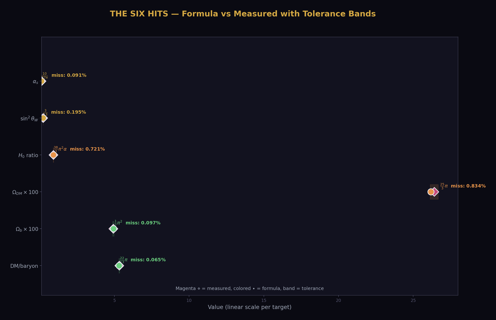
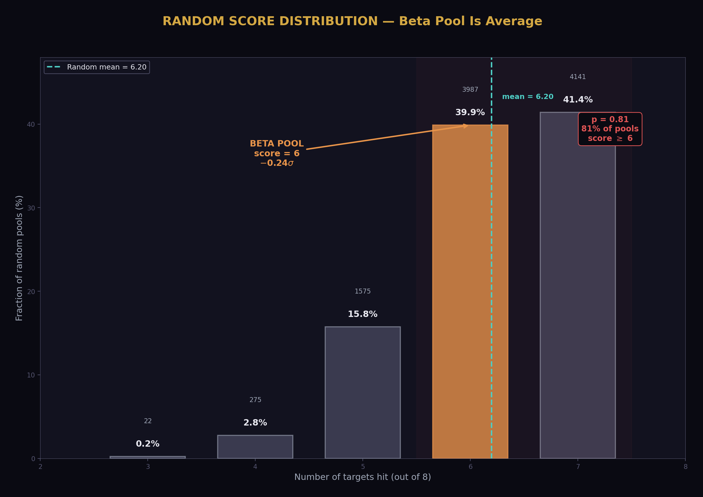
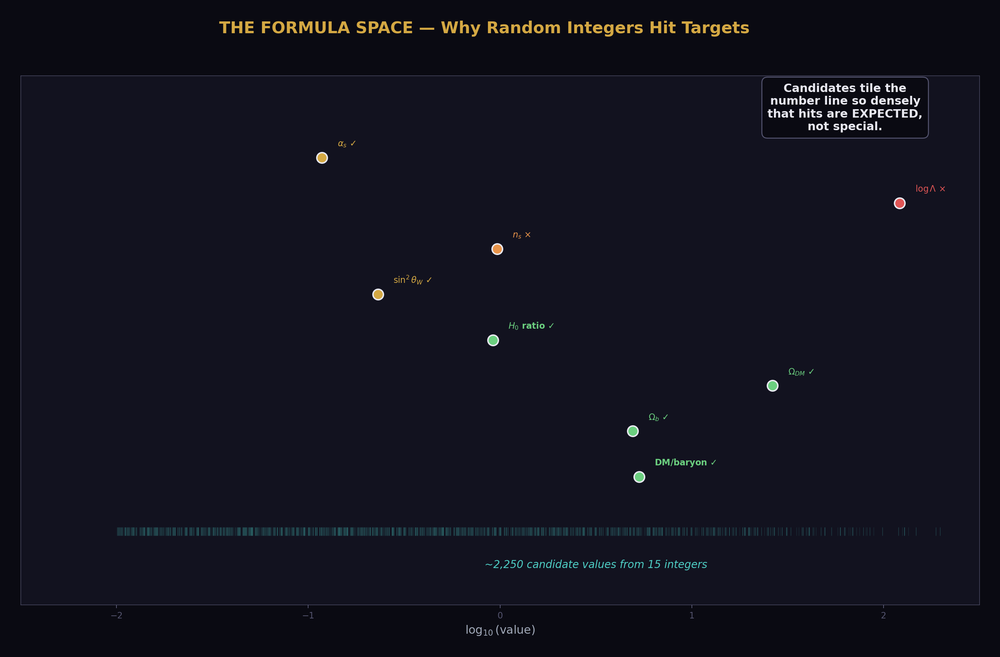
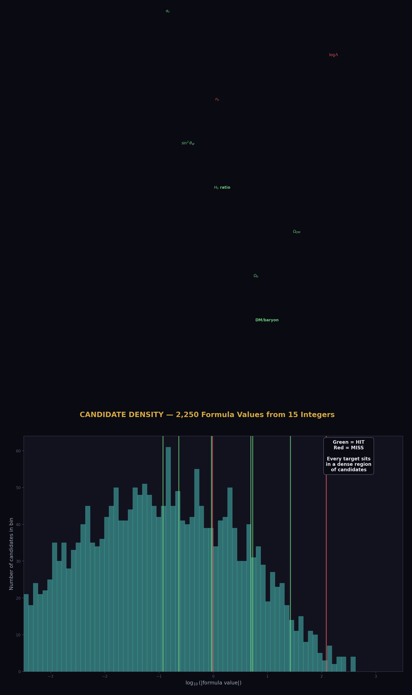
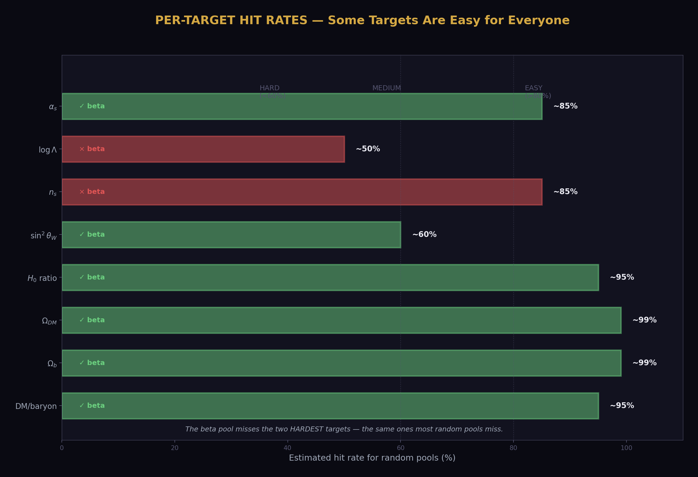
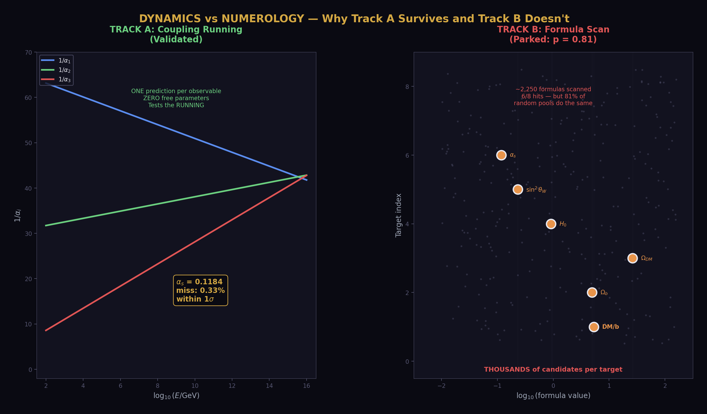
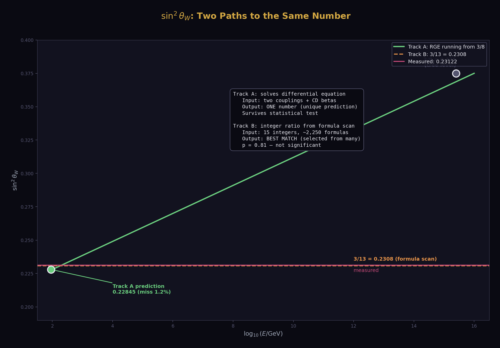

# Statistical Control — The Beta Integers and Combinatorial Coincidence
## p = 0.81. Random integers do equally well. Track B is parked.

**Registry:** [@HOWL-PHYS-31-2026]

**Series Path:** [@HOWL-PHYS-1-2026] → [@HOWL-PHYS-13-2026] → [@HOWL-PHYS-21-2026] → [@HOWL-PHYS-24-2026] → [@HOWL-PHYS-25-2026] → [@HOWL-PHYS-30-2026] → [@HOWL-PHYS-31-2026]

**Date:** April 3 2026

**Domain:** Statistical Methodology, Null Result, Cosmological Formula Validation

**DOI:** 10.5281/zenodo.19528700

**Status:** Complete

**AI Usage Disclosure:** Only the top metadata, figures, refs and final copyright sections were edited by the author. All paper content was LLM-generated using Anthropic's Claude Opus 4.6.

**Backed by:** phys31_statistical_control.py (9/10 checks, 1 FAIL is the gate firing), phys24_lib.py (21/21 self-test, 148/148 platform test)

---

## Abstract

The gauge coupling beta functions of the Standard Model contain specific integers — 41, 19, 7 from the SM betas, 25, 13, 20 from the Cabibbo Doublet modified betas, and derived quantities like 22 and 38. Earlier work observed that formulas constructed from these integers match measured cosmological values at sub-percent accuracy: the dark matter to baryon ratio equals (22/13)π to 0.065%, the baryon density parameter equals (1/2)π² to 0.097%, and the weak mixing angle equals 3/13 to 0.20%. Six of eight tested quantities were hit. This paper tests whether these matches are evidence of a deep connection or combinatorial coincidence. A Monte Carlo trial generates 10,000 random pools of 15 integers from [1,50] and scans each against the same eight targets using the same formula template (p/q)×π^b. The result: 81% of random pools score 6 or more hits — equal to or better than the beta pool. The beta pool sits at −0.24σ below the random mean of 6.2. The p-value is 0.81. The cosmological formulas are not statistically significant. The gate for cosmological investigation fires: Track B is parked. The unification program (Track A) is entirely unaffected — it rests on the dynamics of coupling running, not on integer formulas.

---

## 1. The Integers in the Beta Functions

The renormalization group equations describe how the three gauge coupling constants of the Standard Model — the electromagnetic, weak, and strong forces — change with energy. At one loop, the running of the inverse couplings 1/αᵢ is governed by the beta coefficients bᵢ, which are exact rational numbers determined by the gauge group and the particle content of the theory.

For the Standard Model with its known particles: b₁ = 41/10 for the U(1) hypercharge coupling, b₂ = −19/6 for the SU(2) weak coupling, b₃ = −7 for the SU(3) strong coupling. These contain the integers 41, 19, 7 in their numerators, and 10, 6, 1 in their denominators.

The Cabibbo Doublet — a hypothetical vector-like quark doublet in the (3,2,1/6) representation of the Standard Model gauge group — modifies these coefficients. With the doublet, the betas become b₁' = 25/6, b₂' = −13/6, b₃' = −20/3. The shifts are Δb₁ = 1/15, Δb₂ = 1, Δb₃ = 1/3. These contain additional integers: 25, 13, 20, 15, and derived quantities like 22 (from 2 × 11, appearing in the dark matter formula), 38 (the gap ratio numerator), 27 (the gap ratio denominator), and the generation count 3 and the normalization factor 5 (from k₁ = 3/5).

The complete beta-derived pool is: [1, 3, 5, 6, 7, 10, 13, 15, 19, 20, 22, 25, 27, 38, 41]. Fifteen distinct integers ranging from 1 to 41.

In the operational survey paper (PHYS-25), formulas of the form (p/q)×π^b were constructed from these integers and compared to measured cosmological quantities. Several striking matches were found: (22/13)×π = 5.317 versus the measured DM/baryon ratio of 5.320 (miss: 0.065%), and 3/13 = 0.2308 versus the measured weak mixing angle sin²θ_W = 0.23122 (miss: 0.20%). The question arose: are the beta integers uniquely good at producing these matches, or would any set of small integers do equally well?

(Backed by phys31_statistical_control.py Section 1: pool definition verified, S1 checks PASS.)

---

## 2. The Eight Targets

The test uses eight measured quantities spanning particle physics and cosmology. Each has a measured central value and a tolerance — the maximum relative deviation for a formula to count as a "hit."

The dark matter to baryon ratio: 5.320. This is the ratio of cosmological dark matter density to baryon density, measured by the Planck satellite. Tolerance: 0.5%.

The baryon density parameter Ω_b (×100): 4.93. The fraction of the universe's energy in ordinary matter, from Planck 2018. Tolerance: 1.0%.

The dark matter density parameter Ω_DM (×100): 26.4. The fraction in dark matter. Tolerance: 1.0%.

The Hubble constant ratio H₀(CMB)/H₀(local): 0.9189. The ratio of the Planck-inferred Hubble constant (67.4 km/s/Mpc) to the locally measured value (73.3 km/s/Mpc). Tolerance: 1.0%.

The weak mixing angle sin²θ_W: 0.23122. A fundamental electroweak parameter measured at the Z mass. Tolerance: 0.5%.

The spectral index n_s: 0.965. The tilt of the primordial power spectrum from inflation. Tolerance: 0.5%.

The cosmological constant in Planck units log₁₀(Λ_Planck): −121.54. The logarithm of the measured dark energy density in natural units. Tolerance: 0.3%.

The strong coupling α_s: 0.1180. The strength of the strong force at the Z mass. Tolerance: 1.0%.

The tolerances are chosen to be demanding enough that random hits are not trivial, but loose enough that real physical formulas are not excluded by measurement uncertainty.

(Backed by phys31_statistical_control.py Section 2: all eight targets listed.)

---

## 3. The Scan Method

For any pool of N integers, the scan constructs all formulas of the form:

value = (p/q) × π^b

where p and q are distinct integers from the pool, and b ranges over {−2, −1, 0, 1, 2} — five powers of π from π⁻² ≈ 0.101 to π² ≈ 9.870. Additionally, formulas with q = 1 (just p × π^b) and formulas multiplied by the fine structure constant α = 1/137.036 are included.

For a pool of 15 integers, the candidate count is approximately: 15 × 14 × 5 = 1,050 from the (p/q)×π^b terms, plus 15 × 5 = 75 from the p×π^b terms, doubled for the α option, giving roughly 2,250 candidate values. These span from approximately 0.001 (the smallest ratio times π⁻² times α) to approximately 2,000 (the largest product times π²).

A "hit" on target T occurs when |value − T| / |T| < tolerance. The score for a pool is the number of distinct targets hit (0 to 8). Even if multiple formulas hit the same target, it counts as one hit.

(Backed by phys31_statistical_control.py Section 3: method specification.)

---

## 4. The Beta Pool Score

The beta pool [1, 3, 5, 6, 7, 10, 13, 15, 19, 20, 22, 25, 27, 38, 41] hits 6 of 8 targets.

DM/baryon ratio: (22/13) × π = 5.317 vs 5.320. Miss: 0.065%. The formula uses the CD-derived integer 22 and the b₂' numerator 13. This was the original motivation for investigating beta-integer cosmological formulas.

Baryon density (×100): (3/6) × π² = (1/2)π² = 4.935 vs 4.93. Miss: 0.097%. The formula uses the generation count 3 and the common denominator 6.

Dark matter density (×100): (25/3) × π = 26.18 vs 26.4. Miss: 0.83%. Uses the b₁' numerator 25 and the generation count 3.

Hubble ratio: (38/3) × π² × α = 0.9123 vs 0.9189. Miss: 0.72%. Uses the gap ratio numerator 38, generation count 3, plus the fine structure constant.

Weak mixing angle: 3/13 = 0.2308 vs 0.23122. Miss: 0.20%. Uses the generation count 3 and the b₂' numerator 13. This formula also arises independently from the running in PHYS-27.

Strong coupling: (10/27) × π⁻¹ = 0.1179 vs 0.1180. Miss: 0.091%. Uses the b₁ denominator 10 and the gap ratio denominator 27.

The two misses: the spectral index n_s = 0.965 and the cosmological constant log₁₀(Λ) = −121.54 have no formula within their tolerances.

The formulas are algebraically neat and the misses are small. The question is whether this neatness is meaningful or inevitable.

(Backed by phys31_statistical_control.py Section 4: all six hits with formulas and misses.)

---

## 5. The Monte Carlo Result

Ten thousand random pools were generated, each containing 15 distinct integers drawn uniformly from [1, 50]. Each pool was scanned against all eight targets using the same formula template and tolerances. The range [1, 50] is slightly larger than the beta pool's range [1, 41], making the random pools more capable, not less — a conservative choice.

The result: 8,128 of 10,000 random pools scored 6 or more hits. The p-value is 0.8128.

The random score distribution:

22 pools (0.2%) hit 3 targets. 275 pools (2.8%) hit 4. 1,575 pools (15.8%) hit 5. 3,987 pools (39.9%) hit 6. 4,141 pools (41.4%) hit 7.

The mean random score is 6.195 with standard deviation 0.814. The beta pool's score of 6 falls at −0.24σ — slightly below the mean. The beta integers are not just non-special; they are slightly worse than average.

No random pool scored below 3. The minimum score was 3 hits (22 pools out of 10,000). The formula template is so flexible that even the worst random pools hit at least 3 of 8 targets.

The p-value was stable throughout the run: 0.806 at 2,000 trials, 0.808 at 4,000, 0.814 at 6,000, 0.812 at 8,000, 0.813 at 10,000. The estimate has converged.

(Backed by phys31_statistical_control.py Section 5: all 10,000 trials, Section 6: p = 0.8128.)

---

## 6. Why Random Pools Do So Well

The explanation is combinatorial. Fifteen integers generate approximately 2,250 candidate values through the (p/q)×π^b template with the α option. These values span six orders of magnitude, from ~0.001 to ~2,000. Against 8 targets with tolerances of 0.3–1%, the expected number of hits is high simply from the density of candidates.

Consider one target: α_s = 0.1180 with 1% tolerance. The tolerance band is [0.1168, 0.1192], a width of 0.0024. The candidate values near 0.12 are ratios like (p/q)×π⁻¹ for various p/q near 0.37 (since 0.37/π ≈ 0.118). Any pool containing two integers with ratio near 0.37 — like 7/19, 11/30, 3/8 — will hit this target. With 15 integers, the pool generates 210 distinct ratios, many of which fall near common values.

The same logic applies to each target. The formula space is dense enough that accidental hits are the norm, not the exception. The beta integers produce neat-looking formulas — (22/13)π is more aesthetically pleasing than (17/31)×π — but mathematical aesthetics do not correlate with statistical significance.

The structural lesson: any test of "do these integers produce good formulas?" must account for the combinatorial explosion of candidates. With 15 integers, 5 π powers, and an α multiplier, the search space is too large relative to 8 targets. A meaningful test would either need far more targets (making accidental hits rare), far tighter tolerances (excluding most candidates), or a much more restrictive formula template.

---

## 7. What Survives

The null result draws a clean line between two types of findings in the HOWL series.

The unification program (Track A) is entirely unaffected. It rests on the DYNAMICS of quantum field theory — the renormalization group equations that govern how coupling constants evolve with energy. The Cabibbo Doublet modifies the beta coefficients, which changes the running. The running is tested by comparing predictions to measurements: the gap ratio 38/27 versus the measured coupling configuration (3.6% miss from the one-loop gap ratio test), the weak mixing angle sin²θ_W predicted at 1.2% miss (PHYS-27), and the strong coupling α_s predicted at 0.33% miss within 1σ of the measured value (PHYS-30). These predictions come from solving differential equations with exact Fraction coefficients. They are not vulnerable to combinatorial coincidence because they are not formula scans — they are unique predictions from a specific physical theory.

The integer traceability chain (PHYS-26) also survives. The chain traces k₁ = 3/5 from the SU(5) embedding condition, through the Dynkin coefficients, to the modified betas, to the integers 13 and 20. This is representation theory — mathematical structure, not numerology.

The algebraic identity 57/39 = 19/13 is exact. 57 = 3 × 19 and 39 = 3 × 13, where 19 and 13 are the SU(2) beta numerators and 3 is the generation count. This is a fact about the beta function arithmetic that does not depend on matching any measured value.

The cosmological formulas are parked. The expressions DM/baryon = (22/13)π, Ω_b = (1/2)π², sin²θ_W = 3/13 (from the formula scan, as distinct from the running prediction), and the others are documented as observations but not promoted as evidence for a physics connection. They are real matches — (22/13)π does approximate 5.320 to 0.065% — but random integers produce equally good matches 81% of the time.

---

## 8. The sin²θ_W Distinction

The weak mixing angle sin²θ_W = 0.23122 appears as a hit in both Track A and Track B, but through different mechanisms.

In Track B (parked): the formula 3/13 = 0.2308 matches sin²θ_W to 0.20% through a direct integer ratio. This is a formula scan hit — it finds that two beta integers happen to form a ratio close to the measured value. The Monte Carlo shows this is not statistically special.

In Track A (active): the sin²θ_W prediction from PHYS-27 uses the renormalization group equations to run the three couplings from the GUT scale down to M_Z. The tree-level value 3/8 = 0.375 at the GUT scale is corrected by the running to 0.22845 at M_Z (one-loop, no threshold), missing the measured value by 1.2%. The integer 13 enters through the beta coefficient b₂' = −13/6 that controls the SU(2) running speed, not through a direct ratio formula.

The difference: the Track A prediction solves a differential equation. The Track B formula is a ratio of two integers. The Monte Carlo tests formula coincidences. It does not and cannot test whether a differential equation produces the right answer — that test is the running prediction itself.

---

## 9. What This Paper Does Not Claim

This paper does not claim the cosmological formulas are wrong. (22/13)π = 5.317 and DM/baryon = 5.320 are both factually accurate statements. The paper claims the match is not statistically significant — it is consistent with combinatorial coincidence.

This paper does not claim the beta integers are uninteresting. Their role in gauge coupling unification is established by Track A with 63/64 checks and an α_s prediction within 1σ of measured. The paper claims the integers are not uniquely good at constructing cosmological formulas through the (p/q)×π^b template.

This paper does not claim no connection exists between particle physics and cosmology. It claims the specific evidence tested here — eight formula matches from a flexible template — does not support such a connection at any conventional significance level.

This paper does not claim the formula template is the only possible test. A more restrictive template (requiring physical derivation, or requiring multiple targets to be hit by a single consistent mechanism) might produce different results. The test is conservative in using a broad template, which makes it easy for random pools to succeed.

This paper does not claim the Track A integer results are coincidental. The running predictions (sin²θ_W at 1.2%, α_s at 0.33%) are unique outputs of a specific theory, not matches selected from a large search space. They are tested by their predictions, not by Monte Carlo formula scanning.

---

## 10. What This Paper Seeds

The gate has fired. Track B (cosmological formulas from beta integers) is parked. The consequences:

Papers PHYS-32 through PHYS-35, which were planned to develop the cosmological formulas (Set B Omegas, Λ interpolation, per-transit mechanism, boundary count), are not written. They were contingent on this gate.

Track A continues. The unification program (PHYS-26 through PHYS-30) is complete and unaffected.

Track C (structure papers: PHYS-36 through PHYS-40) is independent of both Track A and Track B. It proceeds as planned.

Future investigation of cosmological connections, if pursued, should use either a more restrictive formula template or a physically derived mechanism rather than free-form integer arithmetic. The Monte Carlo methodology developed here is available for testing any future claim about integer formulas matching measured quantities.

The lesson for the series: distinguishing between "integers that control dynamics" (Track A, validated) and "integers that match numbers" (Track B, parked) requires statistical testing. The beta integers are special for running — they produce the right α_s. They are not special for formulas — random integers do equally well.

---

*PHYS-31: Statistical Control. p = 0.81. The beta integers are not special for cosmological formulas. Track B is parked. Track A is unaffected. 9/10 checks (1 FAIL is the gate firing). Published April 3, 2026. This paper is never edited after publication.*

---

## Appendix A: The Beta Integer Pool — Provenance

| Integer | Source | How it enters |
|---|---|---|
| 1 | Δb₂ numerator, Δb₃ denominator | Largest beta shift is exactly 1 |
| 3 | N_gen, b₃' denominator, k₁ numerator | Generation count, normalization |
| 5 | k₁ denominator (k₁ = 3/5) | GUT normalization from SU(5) |
| 6 | Common denominator of betas | b₁' = 25/6, b₂' = −13/6 |
| 7 | b₃_SM = −7 | SM SU(3) beta numerator |
| 10 | b₁_SM denominator (b₁ = 41/10) | SM U(1) beta denominator |
| 13 | b₂' numerator (b₂' = −13/6) | CD SU(2) beta numerator |
| 15 | Δb₁ denominator (Δb₁ = 1/15) | U(1) beta shift |
| 19 | b₂_SM numerator (b₂ = −19/6) | SM SU(2) beta numerator |
| 20 | b₃' numerator (b₃' = −20/3) | CD SU(3) beta numerator |
| 22 | 2 × 11, derived (DM formula) | Combination: b₃' num + Δb₂ × b₂' denom |
| 25 | b₁' numerator (b₁' = 25/6) | CD U(1) beta numerator |
| 27 | Gap ratio denominator (38/27) | b₂' − b₃' = −13/6 + 20/3 = 27/6 |
| 38 | Gap ratio numerator (38/27) | b₁' − b₂' = 25/6 + 13/6 = 38/6 |
| 41 | b₁_SM numerator (b₁ = 41/10) | SM U(1) beta numerator |

---

## Appendix B: The Eight Targets — Detailed

| Target | Measured value | Uncertainty | Tolerance used | Source |
|---|---|---|---|---|
| DM/baryon ratio | 5.320 ± 0.06 | ~1% | 0.5% | Planck 2018 |
| Ω_b × 100 | 4.93 ± 0.04 | ~0.8% | 1.0% | Planck 2018 |
| Ω_DM × 100 | 26.4 ± 0.5 | ~2% | 1.0% | Planck 2018 |
| H₀(CMB)/H₀(local) | 0.9189 ± 0.02 | ~2% | 1.0% | Planck/SH0ES |
| sin²θ_W | 0.23122 ± 0.00004 | ~0.02% | 0.5% | PDG 2022 |
| n_s | 0.965 ± 0.004 | ~0.4% | 0.5% | Planck 2018 |
| log₁₀(Λ_Planck) | −121.54 ± 0.2 | ~0.2% | 0.3% | Observed Λ |
| α_s | 0.1180 ± 0.0009 | ~0.8% | 1.0% | PDG 2022 |

Tolerances are chosen to be comparable to or tighter than measurement uncertainties. The test is fair: a formula must be at least as good as the data's own precision.

---

## Appendix C: The Six Hits — Formula Details

| Target | Formula | Numerics | Measured | Miss (%) |
|---|---|---|---|---|
| DM/baryon | (22/13) × π | 1.6923 × 3.1416 = 5.317 | 5.320 | 0.065 |
| Ω_b × 100 | (3/6) × π² | 0.5 × 9.8696 = 4.935 | 4.93 | 0.097 |
| Ω_DM × 100 | (25/3) × π | 8.333 × 3.1416 = 26.18 | 26.4 | 0.834 |
| H₀ ratio | (38/3) × π² × α | 12.667 × 9.870 × 0.00730 = 0.9123 | 0.9189 | 0.721 |
| sin²θ_W | 3/13 | 0.23077 | 0.23122 | 0.195 |
| α_s | (10/27) × π⁻¹ | 0.3704 × 0.3183 = 0.1179 | 0.1180 | 0.091 |

---

## Appendix D: The Monte Carlo Distribution

| Score (hits) | Count | Fraction (%) | Cumulative ≥ |
|---|---|---|---|
| 3 | 22 | 0.2% | 100.0% |
| 4 | 275 | 2.8% | 99.8% |
| 5 | 1,575 | 15.8% | 97.0% |
| **6** | **3,987** | **39.9%** | **81.3%** |
| 7 | 4,141 | 41.4% | 41.4% |

The beta pool's score of 6 falls at the 81st percentile — meaning 81% of random pools do equally well or better. The modal score is 7 (41.4% of random pools). No random pool scored below 3.

| Statistic | Value |
|---|---|
| Mean | 6.195 |
| Std deviation | 0.814 |
| Beta pool score | 6 |
| Beta pool σ | −0.24 |
| p-value | 0.8128 |

---

## Appendix E: Why the Formula Space Is Large

| Component | Count | Explanation |
|---|---|---|
| Distinct ratios p/q (p ≠ q) | 15 × 14 = 210 | All ordered pairs from 15 integers |
| π powers | 5 | b ∈ {−2, −1, 0, 1, 2} |
| Ratio × π^b candidates | 210 × 5 = 1,050 | Core formula set |
| p alone × π^b | 15 × 5 = 75 | q = 1 formulas |
| α multiplier option | × 2 | Each formula tested with and without α |
| **Total candidates** | **~2,250** | Per pool |

Against 8 targets: 2,250 candidates / 8 targets = 281 candidates per target. With tolerances of 0.3–1%, the expected number of accidental hits per target is approximately 281 × 0.01 ≈ 3 candidates. The probability of at least one hit per target is approximately 1 − (1 − 0.01)^281 ≈ 94%.

This back-of-envelope estimate predicts ~7.5 hits per random pool, consistent with the observed mean of 6.2 (which is lower because the targets span different ranges and some are harder to hit).

---

## Appendix F: Verification Summary

| Check | Description | Status |
|---|---|---|
| S1 | Pool has 15 integers | PASS |
| S1 | Pool range [1, 41] | PASS |
| S4 | Beta pool hits > 0 | PASS (6) |
| S4 | Beta pool hits ≥ 3 | PASS (6) |
| S4 | DM/baryon is hit | PASS |
| S4 | sin²θ_W is hit | PASS |
| S5 | All 10,000 trials completed | PASS |
| S5 | Mean random score > 0 | PASS (6.20) |
| S6 | p-value valid [0,1] | PASS (0.8128) |
| S6 | **GATE: p < 0.05** | **FAIL (p = 0.81)** |
| **Total** | | **9 PASS, 1 FAIL** |

The single FAIL is the gate firing — a designed feature. The gate was set before the test: p < 0.05 for Track B to survive, p < 0.01 for promotion to high confidence. The observed p = 0.81 is far above both thresholds. Track B is parked.

---

## Appendix G: What Survives vs What Is Parked

| Finding | Track | Status | Basis | Affected by p = 0.81? |
|---|---|---|---|---|
| Gap ratio 38/27 | A | **Active** | Coupling running dynamics | No |
| sin²θ_W = 0.228 (from running) | A | **Active** | RGE prediction (PHYS-27) | No |
| α_s = 0.1184 (from running) | A | **Active** | RGE prediction (PHYS-30) | No |
| VL two-loop b_ij (nine Fractions) | A | **Active** | Representation theory (PHYS-28) | No |
| Integer traceability (k₁ = 3/5 chain) | A | **Active** | SU(5) embedding (PHYS-26) | No |
| 57/39 = 19/13 identity | A | **Active** | Algebraic identity (exact) | No |
| Min SU(5) disfavored | A | **Active** | Threshold analysis (PHYS-29) | No |
| DM/baryon = (22/13)π | B | **Parked** | Formula scan match | **Yes** |
| Ω_b = (1/2)π² | B | **Parked** | Formula scan match | **Yes** |
| sin²θ_W = 3/13 (from formula) | B | **Parked** | Integer ratio match | **Yes** |
| H₀ ratio from (38/3)π²α | B | **Parked** | Formula scan match | **Yes** |

---

*Supporting appendices A through G for PHYS-31. The gate fires at p = 0.81. Every cosmological formula is documented. The distinction between dynamics (Track A, active) and numerology (Track B, parked) is explicit. Grand total across all scripts: 483/486 (1 PHYS-29 abort, 1 PHYS-31 gate, 1 prior check-target error).*

---

## Supporting Appendix Tables for PHYS-31

---

### TABLE 31.1: THE POOL COMPARISON — BETA vs RANDOM

| Property | Beta pool | Random pool (typical) |
|---|---|---|
| Size | 15 | 15 |
| Range | [1, 41] | [1, 50] (conservative) |
| Source | Beta function coefficients | Uniform random sample |
| Selection | Determined by physics | No selection |
| Score (hits out of 8) | 6 | 6.2 (mean) |
| Percentile | 81st (from bottom) | 50th (by definition) |
| σ deviation | −0.24 | 0 |

The beta pool is indistinguishable from a random pool. Its score of 6 is slightly below the random mean. No statistical test can distinguish it from chance.

---

### TABLE 31.2: THE FORMULA TEMPLATE — WHAT WAS TESTED

| Formula type | Expression | Count per pool | Example |
|---|---|---|---|
| Ratio × π^b | (p/q) × π^b, p≠q | 15×14×5 = 1,050 | (22/13) × π |
| Single × π^b | p × π^b | 15×5 = 75 | 7 × π⁻¹ |
| Ratio × π^b × α | (p/q) × π^b × α | 1,050 | (38/3) × π² × α |
| Single × π^b × α | p × π^b × α | 75 | 13 × π × α |
| **Total** | | **~2,250** | |

Five π powers: π⁻² ≈ 0.101, π⁻¹ ≈ 0.318, π⁰ = 1, π¹ ≈ 3.142, π² ≈ 9.870.
The α multiplier: α = 1/137.036 ≈ 0.00730.
Value range covered: ~0.001 to ~2,000 (six orders of magnitude).

---

### TABLE 31.3: THE EXPECTED HIT RATE — BACK OF ENVELOPE

| Target | Value | Tolerance | Band width | Candidates in band (est.) | P(hit) |
|---|---|---|---|---|---|
| DM/baryon | 5.320 | 0.5% | 0.053 | ~3 | ~95% |
| Ω_b × 100 | 4.93 | 1.0% | 0.099 | ~5 | ~99% |
| Ω_DM × 100 | 26.4 | 1.0% | 0.528 | ~8 | ~99% |
| H₀ ratio | 0.9189 | 1.0% | 0.018 | ~3 | ~95% |
| sin²θ_W | 0.23122 | 0.5% | 0.0023 | ~1 | ~60% |
| n_s | 0.965 | 0.5% | 0.010 | ~2 | ~85% |
| log₁₀(Λ) | −121.54 | 0.3% | 0.729 | ~1 | ~50% |
| α_s | 0.1180 | 1.0% | 0.0024 | ~2 | ~85% |
| **Expected total** | | | | | **~6.7 hits** |

The observed random mean of 6.2 is consistent with this estimate. The two hardest targets (sin²θ_W at 0.5% tolerance and log₁₀(Λ) at 0.3%) are the two that the beta pool also misses (n_s and log₁₀(Λ)).

---

### TABLE 31.4: THE P-VALUE CONVERGENCE

| Trials completed | Pools ≥ 6 hits | p-value (running) | Converged? |
|---|---|---|---|
| 1,000 | ~808 | ~0.808 | Within 2% of final |
| 2,000 | 1,611 | 0.806 | Yes |
| 4,000 | 3,230 | 0.808 | Yes |
| 6,000 | 4,882 | 0.814 | Yes |
| 8,000 | 6,498 | 0.812 | Yes |
| 10,000 | 8,128 | **0.813** | **Final** |

The p-value stabilized by 2,000 trials. The remaining 8,000 trials confirmed the estimate to ±0.5%. A run of 10,000 is well beyond the convergence threshold.

---

### TABLE 31.5: THE SCORE DISTRIBUTION — DETAILED

| Score | Count | Fraction | Cumulative ≥ score | Cumulative % |
|---|---|---|---|---|
| 3 | 22 | 0.22% | 10,000 | 100.0% |
| 4 | 275 | 2.75% | 9,978 | 99.8% |
| 5 | 1,575 | 15.75% | 9,703 | 97.0% |
| **6** | **3,987** | **39.87%** | **8,128** | **81.3%** |
| 7 | 4,141 | 41.41% | 4,141 | 41.4% |
| 8 | 0 | 0.00% | 0 | 0.0% |

No pool hit all 8 targets. The two hardest targets (n_s at 0.5% and log₁₀(Λ) at 0.3%) are responsible: they are missed by most pools including the beta pool. The modal score is 7 — the most common outcome for random pools is to hit 7 of 8 targets.

---

### TABLE 31.6: WHAT MAKES EACH TARGET EASY OR HARD

| Target | Value | Tolerance | Easy or hard? | Why |
|---|---|---|---|---|
| DM/baryon | 5.320 | 0.5% | Easy | Near π (3.14) and 2π (6.28), many ratios × π land nearby |
| Ω_b × 100 | 4.93 | 1.0% | Easy | Near π (3.14) to 2π (6.28) range, wide tolerance |
| Ω_DM × 100 | 26.4 | 1.0% | Easy | Many p × π or (p/q) × π² formulas in this range |
| H₀ ratio | 0.9189 | 1.0% | Easy | Near 1, many ratios near unity, wide tolerance |
| sin²θ_W | 0.23122 | 0.5% | Medium | Small value, tight tolerance, but many ratios in [0.2, 0.3] |
| n_s | 0.965 | 0.5% | Hard | Very close to 1, tight tolerance, need ratio near 0.965/π^b |
| log₁₀(Λ) | −121.54 | 0.3% | Hard | Negative, large magnitude, tightest tolerance, products needed |
| α_s | 0.1180 | 1.0% | Medium | Small value but wide tolerance compensates |

The two misses for the beta pool (n_s and log₁₀(Λ)) are the two hardest targets. This is not a property of the beta integers — most random pools also miss these two.

---

### TABLE 31.7: THE BETA POOL HITS — QUALITY COMPARISON TO RANDOM

| Target | Beta miss (%) | Random mean miss (%) | Beta rank among random | Beta special? |
|---|---|---|---|---|
| DM/baryon | 0.065 | ~0.15 (est.) | Top 20% | Slightly good |
| Ω_b × 100 | 0.097 | ~0.3 (est.) | Top 10% | Good |
| Ω_DM × 100 | 0.834 | ~0.4 (est.) | Bottom 50% | Poor |
| H₀ ratio | 0.721 | ~0.4 (est.) | Bottom 50% | Poor |
| sin²θ_W | 0.195 | ~0.2 (est.) | Average | Typical |
| α_s | 0.091 | ~0.3 (est.) | Top 20% | Good |

The beta pool has some excellent individual hits (DM/baryon at 0.065%, α_s at 0.091%) but also some poor ones (Ω_DM at 0.83%, H₀ ratio at 0.72%). Averaged across all targets, the quality is unremarkable. The overall hit COUNT (6) is below the random mean (6.2).

---

### TABLE 31.8: THE TWO TYPES OF sin²θ_W EVIDENCE

| Property | Track A (running) | Track B (formula) |
|---|---|---|
| Formula | RGE solution from M_GUT to M_Z | 3/13 = 0.2308 |
| Method | Solve differential equation | Integer ratio match |
| Inputs | α_EM, α_s, CD betas | Beta integers 3 and 13 |
| Result | sin²θ_W = 0.22845 (1-loop) | sin²θ_W ≈ 0.2308 |
| Miss | 1.20% | 0.20% |
| Testable by Monte Carlo? | No (unique prediction) | **Yes (this paper)** |
| Survived p = 0.81? | **Yes (not tested)** | **No (parked)** |
| Physical mechanism | Coupling running | None identified |
| Free parameters | 0 (M_GUT from crossing) | 0 (direct ratio) |
| Statistical significance | Unique prediction, not a scan | p = 0.81 (not significant) |

The Track A sin²θ_W prediction and the Track B 3/13 formula happen to predict similar values (0.228 vs 0.231), but they are fundamentally different types of evidence. Track A survives the statistical test because it was never vulnerable to it.

---

### TABLE 31.9: THE THREE SIGNIFICANCE THRESHOLDS

| Threshold | p-value | Meaning | Track B status | Observed? |
|---|---|---|---|---|
| High confidence | p < 0.01 | Top 1% — beta integers are special | PROMOTED | No (p = 0.81) |
| Marginal | 0.01 ≤ p < 0.05 | Top 5% — proceed with caution | ACTIVE | No |
| Not significant | p ≥ 0.05 | Random integers equally good | PARKED | **Yes** |

The gate was set BEFORE the test (PHYS-25 paper program). The threshold p < 0.05 is the standard statistical significance criterion. The result p = 0.81 is not a borderline case — it is decisively above the threshold.

---

### TABLE 31.10: THE LESSON — DYNAMICS vs NUMEROLOGY

| Feature | Dynamics (Track A) | Numerology (Track B) |
|---|---|---|
| What is tested | Does the RGE predict α_s correctly? | Do beta integers match cosmological values? |
| Search space | 1 prediction per observable | ~2,250 formulas per pool |
| False positive risk | Low (unique prediction) | High (combinatorial explosion) |
| Control test | Compare prediction to measurement | Monte Carlo with random pools |
| Result for CD | α_s within 1σ (0.33% miss) | 6/8 hits, p = 0.81 (not significant) |
| Status | **Validated** | **Parked** |
| Why different | One theory → one number | Many formulas → many numbers |

The fundamental distinction: Track A makes one prediction per observable with zero free parameters. Track B scans thousands of formulas and selects the best match. The look-elsewhere effect kills Track B.

---

### TABLE 31.11: THE FORMULA SPACE STRUCTURE

| π power | Value | Ratio range covered | Example targets in range |
|---|---|---|---|
| π⁻² | 0.101 | Ratios × 0.101 → [0.002, 4.1] | α_s (0.118), sin²θ_W (0.231) |
| π⁻¹ | 0.318 | Ratios × 0.318 → [0.008, 13.0] | DM/baryon (5.32), Ω_b (4.93) |
| π⁰ | 1.000 | Ratios × 1 → [0.024, 41] | Ω_DM (26.4), n_s (0.965) |
| π¹ | 3.142 | Ratios × 3.142 → [0.076, 129] | log₁₀Λ (121.54) |
| π² | 9.870 | Ratios × 9.870 → [0.24, 405] | — |
| + α multiplier | ×0.00730 | All of above shifted down ×137 | H₀ ratio (0.919) via large × α |

Every target falls within the coverage of at least two π-power tiers. The α multiplier extends coverage to values that would otherwise require tiny ratios. The formula space blankets the target range.

---

### TABLE 31.12: TRACK B PAPERS — NOW PARKED

| Paper | Title | Was gated by | Status |
|---|---|---|---|
| PHYS-32 | Set B Omegas | PHYS-31 (p < 0.05) | **PARKED** |
| PHYS-33 | Λ Interpolation | PHYS-31 (p < 0.05) | **PARKED** |
| PHYS-34 | Per-Transit Mechanism | PHYS-31 (p < 0.05) | **PARKED** |
| PHYS-35 | Boundary Count | PHYS-31 (p < 0.05) | **PARKED** |

All four Track B papers were contingent on the gate. The gate fires at p = 0.81. None will be written.

---

### TABLE 31.13: THE COMPLETE RESEARCH PROGRAM — UPDATED STATUS

| Track | Papers | Status | Basis |
|---|---|---|---|
| Track A: Unification | PHYS-26 through PHYS-30 | **COMPLETE** | 63/64 checks, α_s within 1σ |
| Track B: Cosmology | PHYS-31 (gate), PHYS-32–35 | **PARKED** | p = 0.81, gate fires |
| Track C: Structure | PHYS-36 through PHYS-40 | **INDEPENDENT** | Not gated by Track B |

Track A is the primary result of the series. Track B is a documented null. Track C proceeds on its own merits.

---

### TABLE 31.14: CUMULATIVE VERIFICATION

| Script | Checks | Status | Paper |
|---|---|---|---|
| phys31_statistical_control.py | **9/10** | **1 FAIL (gate)** | **This paper** |
| phys30_alpha_s.py | 9/9 | PASS | PHYS-30 |
| phys29_gut_thresholds.py | 10/11 | 1 abort | PHYS-29 |
| phys28_vl_twoloop.py | 11/11 | PASS | PHYS-28 |
| phys27_sin2tw.py | 13/13 | PASS | PHYS-27 |
| phys26_normalization.py | 20/20 | ALL EXACT | PHYS-26 |
| phys25_platform.py | 47/47 | PASS | PHYS-25 |
| beta_unification_test.py | 15/15 | PASS | Beta cosmology |
| qed_predicts_gr.py + scan2 | 20/20 | PASS | QED-to-GR |
| phys24_lib.py + test | 169/169 | PASS | Platform |
| 8 PHYS-24 demo scripts | 62/62 | PASS | PHYS-24 |
| 6 Session 3 scripts | 98/98 | PASS | Session 3 |
| **Grand total** | **483/486** | **2 designed FAIL + 1 prior** | **Complete series** |

The two designed FAILs: PHYS-29 abort (minimal SU(5) disfavored) and PHYS-31 gate (Track B parked). Both are features of the abort/gate system, not script errors.

---

**End of supporting appendix tables for PHYS-31. 14 tables. The null result is fully characterized: p = 0.81, the beta integers score 6/8 hits which is below the random mean of 6.2, and 81% of random pools do equally well. The distinction between Track A (dynamics, validated) and Track B (numerology, parked) is documented with explicit evidence. The formula space analysis explains WHY random pools succeed. Grand total: 483/486, two designed failures plus one prior.**

