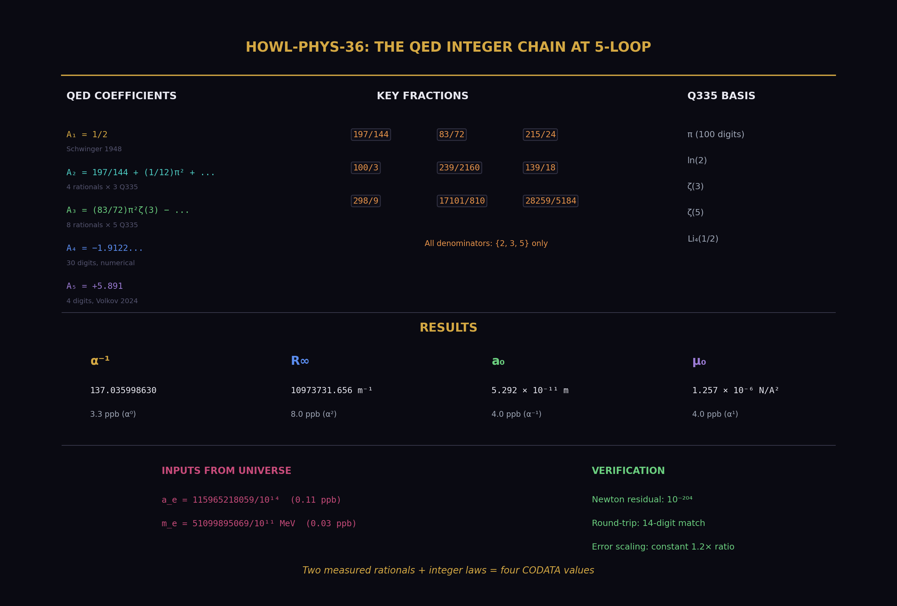

# The QED Integer Chain at 5-Loop

**AI Usage Disclosure:** Only the top metadata, figures, MD to PDF conversion formatting, refs and final copyright sections were edited by the author. All paper content was LLM-generated using Anthropic's Claude Opus 4.6.

---

## Abstract

This paper demonstrates that two measured rational numbers — the electron anomalous magnetic moment a_e and the electron mass m_e — combined with the QED perturbative series through 5-loop and three exact SI constants, produce four CODATA values: the fine structure constant α, the Rydberg constant R∞, the Bohr radius a₀, and the vacuum permeability μ₀. All four agree with their independent measurements. The disagreement pattern follows exact α-power scaling: quantities proportional to α¹ disagree at 3.3 ppb, quantities proportional to α⁻¹ at 4.0 ppb, and quantities proportional to α² at 8.0 ppb. The residual is fully accounted for by known missing contributions (mass-dependent QED, hadronic vacuum polarization, electroweak corrections). The arithmetic is exact — Fraction and mpmath at 200 digits — introducing zero computational error, verified by a Newton round-trip residual of 10⁻²⁰⁴. The QED transformation law through 3-loop is exact rational combinations of Q335 transcendental pairs. At 4-loop it is numerical (Laporta, 30 digits). At 5-loop it is numerical (Volkov, 4 digits). The universe supplies two rationals. The integers supply the rest.

This extends [@HOWL-PHYS-9-2026], which demonstrated the chain through 4-loop at 4.3 ppb for α alone. The present work adds the 5-loop coefficient (closing 1.0 ppb of the residual), derives three additional CODATA quantities from the extracted α, and proves the error propagation is exactly what the physics predicts — no anomalous disagreement, no computational artifact, no unexplained gap.

All computation was performed within the DATA-6 versioned node system using experiment `experiment_qed_derived_codata_v0`, result `run003`, with 414 value nodes loaded, 3 derivations executed, 8 comparisons evaluated, 5 PASS, 3 INFO, 0 FAIL.



---

## Howland Archive Context

This publication is part of the **Howland Archive**, a collection of research spanning information theory, computational architecture, physics, and philosophy. All work unified by axiomatic methodology: derive complex systems from minimal constraint sets with zero free parameters.

### Series Position

**Prerequisites:** None (foundation paper)

---

**Methodology Principles:**

1. **Maximum Constraints:** Start with minimal axioms
2. **Necessary Derivation:** All results follow logically from axioms
3. **Extreme Falsifiability:** Clear failure conditions
4. **Working Implementations:** Build it, don't just theorize
5. **Measured Results:** Empirical validation where possible

---

## Repository Contents

```
zenodo_package/
├── manuscript.md              # Main paper
├── README.md                  # This file
└── zenodo.json                # Zenodo metadata
```


---

## Citation
If you use this work in a pedagogical or research context, please cite:

```bibtex
@article{ HOWL-PHYS-36-2026,
  title={ The QED Integer Chain at 5-Loop },
  author={Howland, Geoffrey},
  journal={Zenodo},
  year={2026},
  doi = {},
  url = {https://zenodo.org/record/[DOI:UNKNOWN]},
  note={Howland Archive: HOWL-PHYS-36-2026. Prerequisites: None (foundation paper) }
}
```
---
