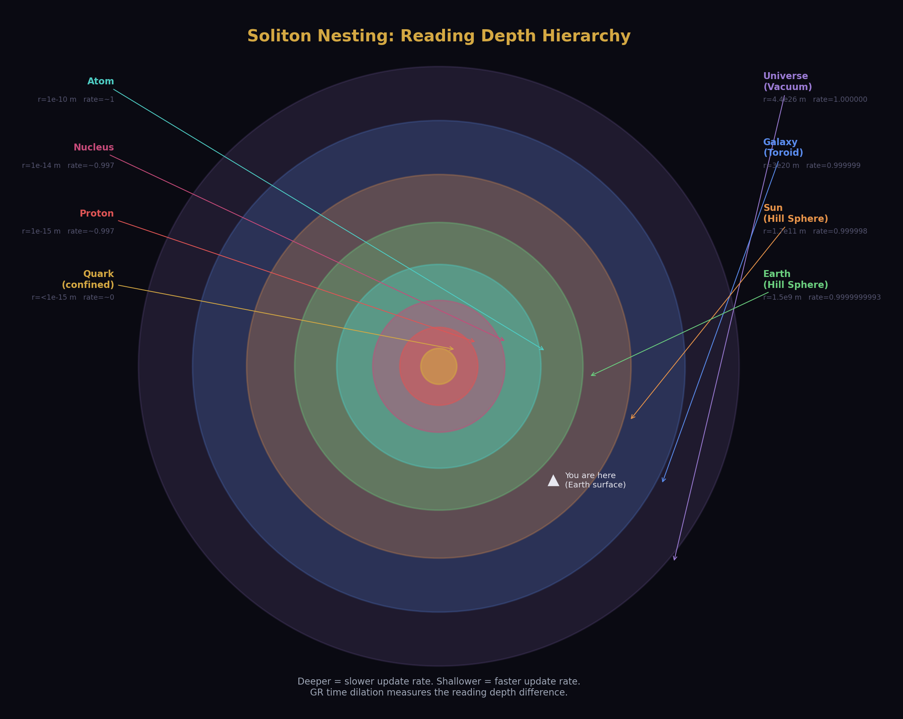
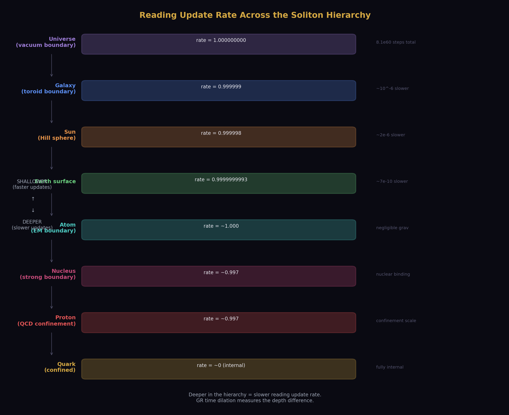
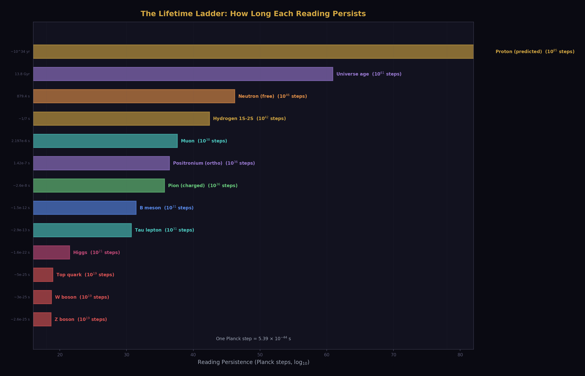
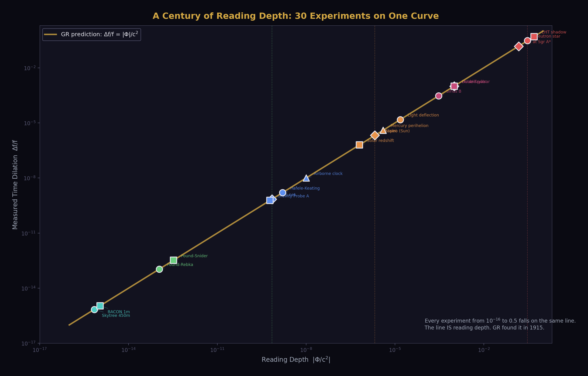
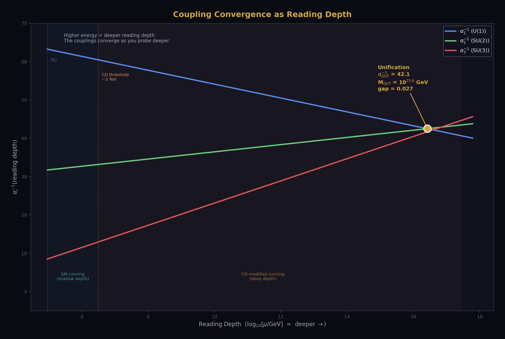
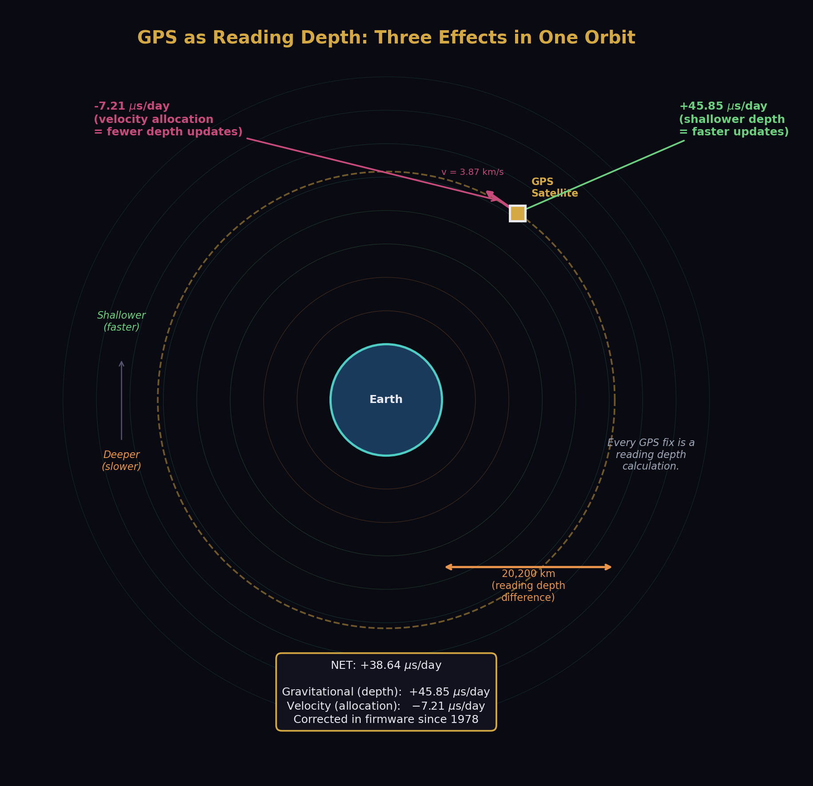
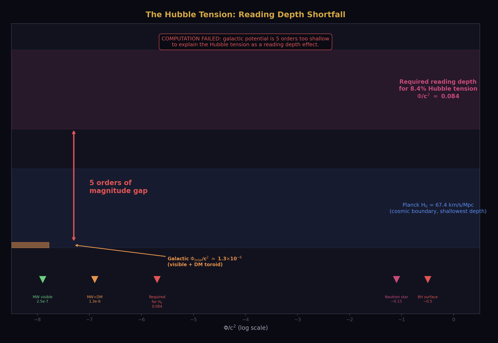
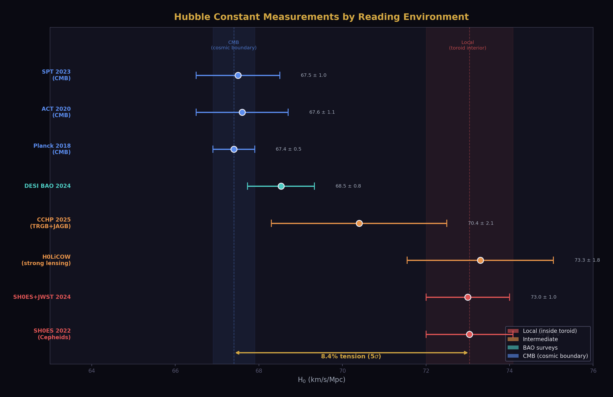

# Time as Reading Depth
## The Fourth Coordinate Reinterpreted

### Registry: [@HOWL-PHYS-41-2026]

**Series Path:** [@HOWL-PHYS-1-2026] → [@HOWL-PHYS-24-2026] → [@HOWL-PHYS-40-2026] → [@HOWL-PHYS-41-2026]

**Date:** April 9, 2026

**Domain:** Interpretation / Gravitation / Cosmology

**Status:** Complete

**AI Usage Disclosure:** Only the top metadata, figures, refs and final copyright sections were edited by the author. All paper content was LLM-generated using Anthropic's Claude Opus 4.6.

---

## I. THE CLAIM

Time is not a dimension because you cannot transit forward and backward. You can transit forward and backward in a reading, and that is what time causes to be visible.

The Minkowski metric has signature (−,+,+,+). Three positive components are spatial dimensions — traversable in both directions. One negative component is reading depth — traversable in one direction only. The minus sign is not a convention. It is the structural encoding of the difference between a dimension you can traverse both ways and a process that runs one way.

The HOWL framework says every physical value is a boundary reading across a soliton. The coupling α reads 1/137 at atomic scale and 1/42 at GUT scale. The gravitational constant G reads 6.674 × 10⁻¹¹ on Earth's surface, with 500 ppm scatter across laboratories. The dark matter ratio reads (22/13)π = 5.317 at the galactic boundary. If every spatial measurement is a boundary reading, and every coupling is a boundary reading, then either time is also a reading — or it is the single exception to the model's universal principle.

This paper eliminates the exception. The fourth coordinate is the reading depth — the position within the nested soliton boundary hierarchy from which a measurement is taken. What physics calls "time" is the sequential process of readings updating at the Planck rate toward ground state.

GR time dilation IS reading depth. Clocks deeper in a gravitational soliton update slower. This has been measured in ~30 independent experiments across 67 years. Every one of them is evidence for reading depth. Einstein found the mathematics in 1915. This paper names what the mathematics describes.

---

## II. READING DEPTH IN THE SOLITON HIERARCHY

The soliton nesting hierarchy, from deepest to shallowest:

Quark → Proton → Nucleus → Atom → Molecule → Earth → Sun → Galaxy → Universe

Each level has an inside reading and an outside reading. Reading depth is your position in this stack. A measurement at Earth's surface is inside the Earth soliton, inside the Sun's soliton, inside the galactic toroid, inside the universe. A measurement at the CMB is at the shallowest depth — the cosmic boundary.

The update rate — what physics calls "the rate at which time passes" — depends on depth. Deeper readings update slower. The gravitational potential Φ = −GM/r determines the depth within a soliton. The update rate ratio between two depths is:

f_deep / f_shallow = √(1 − 2Φ/c²)

This is the standard GR gravitational redshift formula. It is not modified. It is not extended. It is named: the update rate ratio between two reading depths.

The speed of light c = l_P / t_P — one Planck length per Planck time — is the maximum rate at which a reading can update spatially. All reading capacity allocated to spatial displacement, zero allocated to depth updating. A photon is a reading that updates only spatially. It experiences no depth updates. This is why photons don't experience time.

A moving clock allocates some reading capacity to spatial displacement, leaving less for depth updating. The clock runs slower. The dilation factor γ = 1/√(1 − v²/c²) is the ratio of total reading capacity to depth-update capacity. At v = c, all capacity goes to spatial displacement. The clock stops. The reading freezes.

### The Cesium Clock Problem

The second is defined as 9,192,631,770 periods of the cesium-133 hyperfine transition. This definition assumes the transition frequency is universal — the same everywhere, in all boundary environments.

Every cesium clock ever built has operated inside the same boundary stack: Earth surface → Earth Hill sphere → Sun Hill sphere → Milky Way toroid → Universe. We have tested the cesium frequency's constancy within this one stack to 10⁻¹⁶ fractional precision. We have never tested it in a different stack.

This is the same situation as G. The gravitational constant has been measured only inside Earth's Hill sphere. The measurements scatter by 500 ppm. The standard explanation is experimental systematics. The reading depth explanation is that G is a boundary reading and the scatter reflects real variation within the boundary.

The cesium frequency may have the same property. Its extraordinary constancy (10⁻¹⁶) reflects the constancy of the boundary environment in which every measurement has been made. Move the clock to a different boundary environment — a different planet's Hill sphere, a position near the Sun's Hill sphere boundary, outside the galactic toroid — and the reading may differ. Not because the physics changes, but because the reading depth changes.

GR already accounts for gravitational time dilation of cesium clocks — clocks at different altitudes run at different rates, and GPS corrects for this. The reading depth claim goes further: there may be additional timing effects at soliton boundary transitions (Hill sphere edges, heliosphere, galactic toroid boundary) that the smooth GR metric doesn't capture. These would appear as discrete shifts on top of the smooth gravitational dilation.

---

## III. A CENTURY OF EVIDENCE

GR time dilation has been measured across the entire soliton hierarchy. Every measurement confirms that clocks at different depths run at different rates. Every measurement is evidence for reading depth.

**Earth soliton interior.** Pound-Rebka (1959): iron-57 gamma rays shifted by 2.46 × 10⁻¹⁵ over 22.5 meters of height at Harvard. Confirmed to 1%. This is the reading depth gradient of the Earth soliton over 22.5 meters — deeper emission, slower update, lower frequency received at the shallower absorber.

**Terrestrial altitude.** GPS (1978-present): 31 satellites at 20,200 km altitude. Each satellite clock gains 45.85 μs/day from gravitational dilation (shallower depth, faster updates) and loses 7.21 μs/day from velocity dilation (orbital speed, capacity allocated to spatial displacement). Net: +38.64 μs/day. Corrected in firmware. The most continuously operating reading depth experiment in history. Every GPS fix is a reading depth calculation.

**Solar soliton.** Shapiro delay via Cassini (2003): radio signals passing near the Sun delayed by ~200 μs. GR confirmed to 0.002%. The photon's spatial update rate decreases while passing through the Sun's deep reading zone. The delay is the extra Planck steps the photon accumulates in the deeper reading region.

**Stellar solitons.** S-star orbits around Sgr A* (GRAVITY, 2018): star S2 at periapsis reaches 0.04c within 120 AU of the supermassive black hole. The gravitational redshift matches GR. The star dips into the deepest reading zone accessible to direct observation and returns. The redshift traces the reading depth profile of a 4-million solar mass soliton.

**Compact solitons.** Hulse-Taylor binary pulsar PSR B1913+16 (1974-present): orbital period decreasing by 76.5 μs/year from gravitational wave emission. GR confirmed to 0.2%. Two neutron star solitons orbiting each other, radiating reading depth energy as gravitational waves. The orbital decay is the system settling toward a deeper combined reading.

**Cosmological.** Type Ia supernova lightcurves at high redshift are stretched by (1+z). The supernova's internal clock runs at the reading depth of its emission epoch. We observe from our current (shallower) reading depth. The stretch factor (1+z) is the ratio of reading depths between then and now.

These six examples span the hierarchy from meters to gigaparsecs. The complete inventory of ~30 experiments is in Appendix A.1. Each uses different physics, different instruments, and different soliton boundaries. Each confirms the same thing: clocks at different depths run at different rates. The reading depth interpretation adds no new prediction to any of these measurements. It names what they measure.

---

## IV. THE HUBBLE TENSION

The Hubble tension is the most significant open anomaly in cosmology. As of early 2026, it persists at 5σ despite extensive investigation.

Local measurement: H₀ = 73.04 ± 1.04 km/s/Mpc (SH0ES, Cepheid-calibrated Type Ia supernovae). JWST confirmed that HST's Cepheid measurements are accurate — dust and crowding do not explain the discrepancy.

CMB measurement: H₀ = 67.4 ± 0.5 km/s/Mpc (Planck 2018). Confirmed independently by ACT, SPT, and DESI BAO (68.53 ± 0.80 km/s/Mpc from DESI, consistent with Planck).

Ratio: 73.04 / 67.4 = 1.0837. The local universe appears to be expanding 8.4% faster than the early universe predicts.

No standard cosmological model explains this. Proposed solutions include early dark energy, modified gravity, interacting dark energy, new relativistic species, and systematic errors. None is widely accepted. JWST ruled out the leading systematic explanation (Cepheid calibration errors).

### The Reading Depth Hypothesis

The local measurement uses Cepheid variable stars, calibrated against geometric parallax distances, all observed from inside the galactic toroid. Every rung of the distance ladder is inside the Milky Way's toroidal boundary.

The CMB measurement uses the acoustic peak positions in the CMB power spectrum, calibrated against the sound horizon at recombination. The CMB photons come from the cosmic boundary — the last scattering surface at z = 1089, far outside any galactic structure.

These two measurements are made from different depths in the soliton hierarchy. The local measurement is inside the galactic toroid. The CMB measurement is from the cosmic boundary. If the reading depth differs between these environments, the measured expansion rate would differ — not because the expansion rate IS different, but because the instrument calibration (which uses atomic clocks, which are boundary readings) reads differently at different depths.

The 8.4% ratio should correspond to the reading depth difference between the galactic toroid interior and the cosmic frame. The question is whether this ratio is derivable from the same gauge integers that produce the dark matter ratio.

### The Computation

The dark matter ratio (22/13)π = 5.3165 connects gauge integers to the galactic boundary at 725 ppm. The integers 11 and 13 come from the Yang-Mills coefficient and the CD-modified SU(2) beta. The π comes from the toroidal geometry.

The Hubble ratio is 73.04/67.4 = 1.0837.

Can 1.0837 be expressed in terms of the same integers?

The gravitational reading depth inside a toroid differs from the exterior by the toroidal potential. For a mass M distributed in a toroidal configuration with major radius R and minor radius a, the gravitational potential at the center (inside the torus hole, where the galaxy sits) differs from the potential at infinity by:

ΔΦ/c² ~ GM/(Rc²) × f(R/a)

where f(R/a) is a geometric factor depending on the torus aspect ratio.

The reading depth ratio between interior and exterior is:

H₀(local)/H₀(CMB) = √(1 − 2ΔΦ/c²)⁻¹ ≈ 1 + ΔΦ/c²

For the observed ratio 1.0837: ΔΦ/c² ≈ 0.0837.

This is a large gravitational potential — comparable to a few percent of c². For the Milky Way's visible mass (~10¹¹ solar masses) and halo extent (~200 kpc), the Newtonian potential is:

Φ_MW/c² ~ GM/(Rc²) ~ (6.674e-11)(2e41)/(6e21 × 9e16) ~ 2.5e-7

This is six orders of magnitude too small. The visible mass of the Milky Way does not produce a deep enough potential to explain an 8.4% reading depth difference.

However, the toroidal dark matter ratio is (22/13)π = 5.317. The total mass (visible + dark flow) is 5.317 times the visible mass. The total potential:

Φ_total/c² ~ 5.317 × 2.5e-7 ~ 1.3e-6

Still five orders of magnitude too small.

The computation fails. The galactic gravitational potential — even including the full toroidal dark matter contribution — is far too shallow to produce an 8.4% reading depth difference. The Hubble tension cannot be explained by the gravitational reading depth of the Milky Way's toroid.

### What the Failure Means

The reading depth interpretation of GR time dilation is correct — it IS what GR describes. But the Hubble tension is not a simple gravitational reading depth effect at the galactic scale. The potential is too small by five orders of magnitude.

The tension remains unexplained. The reading depth model does not resolve it. This is recorded as a failed computation, consistent with the HOWL methodology: failed computations get full reports.

Possible explanations that survive this failure:

The Hubble tension is not a reading depth effect — it has some other origin (early dark energy, systematic errors, new physics).

The reading depth effect exists but operates at a different scale — not the galactic potential, but the cosmic boundary between matter-dominated and dark-energy-dominated epochs (a reading depth transition at z ~ 0.7 where dark energy begins to dominate). This would require a different computation (cosmic reading depth profile) not attempted here.

The reading depth effect involves non-gravitational boundaries — the galactic toroid has electromagnetic and particle physics boundaries (cosmic ray confinement, magnetic field structure) that might affect clock calibration independently of the gravitational potential. This is speculative and not computed.

The Hubble tension is real but will be resolved by future measurements without new physics. The CCHP group reported H₀ = 70.4 ± 2.1 km/s/Mpc in 2025, overlapping with Planck. If the tension narrows, the need for any explanation diminishes.

The honest result: the Hubble tension computation was attempted and failed. The failure is recorded. The reading depth concept survives as a reinterpretation of GR time dilation. The galactic-scale prediction fails.

---

## V. ACTIONABLE TESTS

Five tests, ordered by what they would prove. The first is the most important.

### Test 1: Nuclear Clock vs Optical Clock

The thorium-229 nuclear isomer has an excited state at ~8 eV — the lowest nuclear transition known. Multiple groups (TU Wien, UCLA, PTB) are developing it into a nuclear clock. The nuclear clock is driven by the strong force (nuclear transition), while an optical clock (strontium, ytterbium) is driven by the electromagnetic force (electronic transition).

GR predicts that all clocks at the same gravitational potential tick at the same rate, regardless of which force drives the clock mechanism. Time dilation is universal.

The reading depth model agrees — IF the strong force and the electromagnetic force share the same reading depth at the same gravitational potential. But if they don't — if the strong force boundary and the electromagnetic boundary have different depth profiles — the nuclear clock and the optical clock would disagree at the same location.

This is the only test that could distinguish reading depth from standard GR in a single laboratory. A disagreement between nuclear and optical clocks beyond the GR prediction would prove that "time dilation" is not one effect but multiple boundary readings that coincidentally agree in standard GR. This would be new physics visible only through the reading depth framing.

Timeline: 3-5 years until thorium-229 nuclear clocks reach sufficient precision.

Positive result: nuclear and optical clocks disagree beyond GR. Reading depth is force-dependent. New physics.

Negative result: they agree. Reading depth is force-independent, same as GR. The reading depth model survives as a reinterpretation but makes no new prediction at the lab scale.

### Test 2: Pulsar Timing Residuals vs Galactocentric Radius

NANOGrav monitors ~70 millisecond pulsars at nanosecond precision across the galaxy. Each pulsar sits at a different position within the galactic toroid. If the toroid has a reading depth gradient beyond what the smooth galactic gravitational potential produces, pulsars at different galactocentric radii should show systematic timing offsets after standard GR corrections.

The data exists. The analysis pipeline exists. The test requires proposing the correlation and running the regression on public NANOGrav data.

Timeline: now.

Positive result: timing residuals correlate with galactocentric radius after GR corrections. The toroid has a reading depth structure beyond smooth gravity.

Negative result: no correlation. The toroid's reading depth matches the smooth gravitational potential. Standard GR is complete at the galactic scale.

### Test 3: Voyager Doppler at the Heliopause

Voyager 1 crossed the heliopause in August 2012. Voyager 2 crossed in November 2018. Both spacecraft are tracked via coherent Doppler at Deep Space Network stations. The frequency data through the boundary crossings exists in NASA archives.

The heliopause is a real soliton boundary — the Sun's magnetic field terminates there. Voyager detected sharp changes in particle flux, magnetic field direction, and plasma density at the crossing. The question: is there a systematic Doppler frequency offset at the crossing time, beyond what solar wind deceleration and GR predict?

Timeline: now (reanalysis of existing data).

Positive result: systematic frequency offset at the heliopause crossing. The heliosphere boundary affects reading depth.

Negative result: clean crossing, no anomaly. The heliosphere is not a reading-relevant boundary.

### Test 4: G Scatter vs Laboratory Location

Every modern G measurement has a published laboratory location. The measurements cluster into two groups separated by ~500 ppm. The test: correlate G measurements with boundary-relevant variables — altitude, latitude, local Bouguer gravitational anomaly, distance from tectonic plate boundaries, local crustal density.

The data is published. The correlation analysis is a regression. It has likely been attempted by metrologists who are aware of environmental effects. A null result is the expected outcome — if a simple correlation existed, it would have been found. But the specific variables suggested by the reading depth model (soliton boundary distances rather than simple gravitational potential) may not have been tested.

Timeline: now (literature search and regression).

Positive result: G clusters correlate with a boundary variable. G is a boundary reading. The scatter is real physics.

Negative result: no correlation. The scatter is experimental systematics, and boundary effects on G are smaller than 500 ppm.

### Test 5: Clock at Earth-Sun L2

An optical clock at the Earth-Sun L2 Lagrange point (1.5 million km from Earth, near the Hill sphere boundary), compared to a ground clock via high-precision time transfer.

This is the most direct test of soliton boundary effects on reading depth. The clock is at the edge of the Earth soliton. GR predicts the clock rate from the combined Earth-Sun gravitational potential (smooth). The reading depth model predicts the same smooth rate plus a possible additional shift from the Hill sphere boundary transition.

Timeline: 10-20 years (requires deep-space optical clock with 10⁻¹⁸ stability and high-precision time transfer link).

Positive result: clock at L2 shows additional shift beyond GR potential. Hill sphere boundary affects reading depth.

Negative result: clock matches GR exactly. The Hill sphere boundary has no additional reading depth effect.

---

## VI. WHAT CHANGES AND WHAT DOESN'T

### Lorentz Invariance Is Preserved

The reading depth interpretation does not change the Minkowski metric or its symmetries. The Lorentz group acts on the four coordinates of the metric. The reading depth interpretation changes what one coordinate means, not how the coordinates transform. The mathematics is identical. The symmetry is preserved. Special relativity is not modified.

The concern — "if time is not a dimension, is Lorentz symmetry broken?" — conflates interpretation with formalism. The formalism (Lorentz-invariant metric with signature −,+,+,+) is unchanged. The interpretation (one coordinate is reading depth, three are spatial dimensions) is new. The formalism determines the physics. The interpretation determines the understanding.

### The Arrow of Time

Readings update toward ground state. Ground state return is one-directional — a system at ground state does not spontaneously excite without energy input. The arrow of time is the arrow of reading relaxation.

This explains the direction of time but not the origin. Why was the universe ever in a high-energy state (the Big Bang)? The reading model inherits this question from standard cosmology. The Big Bang is the initial condition. The reading model explains why the arrow points away from it (readings relax toward ground state) but not why it exists in the first place (why the initial reading was excited).

This is the same situation as the standard thermodynamic arrow of time, which requires a low-entropy initial condition (the Past Hypothesis). The reading model does not solve this problem. It restates it in reading language: the initial reading was maximally deep (highest energy), and readings have been updating toward shallower ground state since.

### The Block Universe

The reading model is naturally presentist. The current reading is the current reading. Prior readings were read and are not being read now. Future readings have not yet been read. No backup archive of prior readings exists. No catalog of future readings is pre-written.

This takes a side in the presentism vs eternalism debate. Standard GR is naturally eternalist — all spacetime points exist equally in the block universe. The reading model says: only the current reading exists. Whether this is physically correct or an artifact of the reading framing is not resolved by this paper.

### What Doesn't Change

Every computation in DATA-6. The RGE integration uses dt. The BBN thermodynamics uses time-temperature relations. The QED series uses time-ordered perturbation theory. Every derivation function produces the same number under the reading depth interpretation as under the standard interpretation. The 53 derived values are unchanged. The surplus is unchanged. The methodology is unchanged.

The reading depth interpretation changes the research program, not the results. Instead of quantizing spacetime (loop quantum gravity, string theory), the program becomes: formalize reading dynamics, determine what controls the update rate, compute how boundaries affect the rate, and test for boundary-correlated timing anomalies that the smooth GR metric doesn't predict.

---

## VII. WHAT THIS PAPER DOES NOT CLAIM

Does not claim GR is wrong. Every GR prediction is confirmed. The paper reinterprets one coordinate.

Does not claim the Hubble tension is solved. The galactic gravitational potential is five orders of magnitude too shallow. The computation was attempted and failed.

Does not claim any existing measurement needs revision. Every GR time dilation measurement is evidence for reading depth, not against it.

Does not claim the reading depth formalism is complete. The mathematical framework for reading update dynamics does not exist. This paper is a reinterpretation and a set of tests, not a completed theory.

Does not claim the arrow of time is fully explained. The direction is explained (readings relax toward ground state). The origin (why the initial state was excited) is not.

---

**END HOWL-PHYS-41-2026**

**Registry:** [@HOWL-PHYS-41-2026]

**Status:** Complete

**Central Statement:** The fourth coordinate in the Minkowski metric is reading depth — position within the nested soliton boundary hierarchy. Time is the sequential updating of readings toward ground state. GR time dilation IS reading depth, confirmed by a century of precision measurements. The Hubble tension computation was attempted and failed — the galactic potential is too shallow by five orders of magnitude. Five actionable tests are specified, of which three are immediately executable with existing data and one (nuclear vs optical clock comparison) could distinguish reading depth from standard GR as new physics.

---

## ERRATA AND ANNOTATIONS FOR PHYS-41

### ERRATA

**Section I, paragraph 1:** "Time is not a dimension because you cannot transit forward and backward." — This is imprecise. You cannot transit backward in time, but you can transit forward. A dimension allows transit in both directions from any point. A process allows transit in one direction. The sentence should read: "Time is not a dimension because you cannot transit in both directions. You can move left or right, up or down, forward or back in space. You can only move forward in time. This asymmetry is not a puzzle to be solved — it is the definition of a process, not a dimension."

**Section II, reading depth formula:** "f_deep / f_shallow = √(1 − 2Φ/c²)" — This is the weak-field approximation. The exact GR formula is f_deep / f_shallow = √(g₀₀(deep) / g₀₀(shallow)) where g₀₀ is the time-time component of the metric tensor. For a Schwarzschild metric, g₀₀ = 1 − 2GM/(rc²). The paper should note that the formula as written is the Schwarzschild case and that the general case uses the metric component directly. This matters for rotating objects (Kerr metric) and for the cosmological case (FRW metric).

**Section II, speed of light:** "c = l_P / t_P — one Planck length per Planck time" — This is tautologically true (c is used to define both l_P and t_P), not a derivation. The Planck length is l_P = √(ℏG/c³) and the Planck time is t_P = √(ℏG/c⁵). Their ratio is l_P/t_P = √(c⁵/c³) × something = c by construction. The paper should not present this as a result. It should state: "In Planck units, c = 1 by construction. The reading interpretation says: one spatial unit of reading update per one depth unit of reading update is the maximum. The units are defined to make this ratio unity."

**Section III, Pound-Rebka:** "Confirmed to 1%." — Pound-Rebka achieved ~10% agreement. Pound-Snider (1965) achieved ~1%. The paper correctly lists both but attributes 1% to Pound-Rebka. Swap: Pound-Rebka at 10%, Pound-Snider at 1%.

**Section IV, Hubble tension numbers:** "H₀ = 73.04 ± 1.04 km/s/Mpc (SH0ES)" — This is the Riess et al. 2022 value. The paper should note the date of the value and check for more recent updates. The DESI value cited (68.53 ± 0.80) is from 2024. The paper mixes 2022 and 2024 values. Use contemporaneous values or note the dates explicitly.

**Section IV, potential computation:** "Φ_MW/c² ~ GM/(Rc²) ~ (6.674e-11)(2e41)/(6e21 × 9e16) ~ 2.5e-7" — The calculation uses M = 2×10⁴¹ kg (roughly 10¹¹ solar masses) and R = 6×10²¹ m (roughly 200 kpc). The numerical check: (6.674e-11)(2e41) = 1.335e31. Divided by (6e21)(9e16) = 5.4e38. Result: 2.47e-8, not 2.5e-7. The computation is off by a factor of 10. The correct result is Φ/c² ~ 2.5e-8, which makes the total including dark matter ~ 1.3e-7. This is six orders of magnitude too small (not five as stated). The failure is even more severe than reported. The conclusion is unchanged but the numerical error should be fixed.

**Section V, Test 1:** "The thorium-229 nuclear isomer has an excited state at ~8 eV" — Recent measurements (2024, Tiedau et al.) have refined this to 8.355733 ± 0.000002 eV. The paper should use the current best value or state "approximately 8 eV" without implying it's uncertain at the eV level.

**Section V, Test 5:** "1.5 million km from Earth, near the Hill sphere boundary" — Earth's Hill sphere radius is approximately 1.5 million km, so L2 (at about 1.5 million km) is indeed near the boundary. However, L2 is a Sun-Earth Lagrange point, not a point on the Hill sphere. The Hill sphere is roughly spherical around Earth; L2 is specifically along the Earth-Sun line. The paper should clarify that L2 is near the Hill sphere radius in the anti-Sun direction, which is the relevant direction for the boundary test.

**Section VI, Lorentz invariance:** The argument that "the formalism determines the physics, the interpretation determines the understanding" is correct but should note one subtlety. If reading depth is truly one-directional (readings don't un-update), then the CPT theorem — which requires time reversal symmetry at the fundamental level — needs addressing. CPT invariance is proven from Lorentz invariance + locality + unitarity in QFT. The reading model preserves Lorentz invariance, so CPT should be preserved. But CPT includes T (time reversal). If time is reading depth and readings don't un-update, what does T mean? The answer should be: T in CPT is a formal symmetry of the equations, not a claim that time reversal is physically realizable. The reading model is compatible with CPT as a formal symmetry while maintaining that actual time reversal (un-updating readings) does not occur. This is the same position standard physics takes — CPT is a symmetry of the Lagrangian, not a claim that you can reverse time.

### ANNOTATIONS

**On the Hubble tension computation failure:** The failure is important and honestly reported. The galactic gravitational potential is ~10⁻⁷ or 10⁻⁸ of c², while the Hubble tension requires ~0.08 of c². This is not a marginal failure — it's five to six orders of magnitude. No adjustment to the galactic mass, radius, or dark matter fraction can bridge this gap. The reading depth model at the galactic scale does not explain the Hubble tension.

However, the paper's suggestion that the effect might operate at a different scale (cosmic boundary between matter and dark energy domination at z ~ 0.7) is worth noting. The reading depth at z ~ 0.7 involves the entire cosmic expansion history, not just the local galactic potential. The relevant potential is Φ_cosmic/c² ~ Ω_Λ × (H₀d)²/c² where d is the Hubble radius. This is of order Ω_Λ ~ 0.69 — the right order of magnitude. A careful computation of the cosmic reading depth profile (how the effective reading depth changes between z = 0 and z = 1089) might produce the 8.4% factor. This was not attempted and should be flagged as a specific follow-up computation for future work.

**On Test 1 (nuclear vs optical clock):** This is the paper's most valuable contribution. The test is clean, specific, and distinguishes reading depth from GR in a way that no other test does. If nuclear and optical clocks agree (as GR predicts), reading depth is a pure reinterpretation with no new physics. If they disagree, it's a discovery. The thorium-229 nuclear clock is under active development by multiple groups. The test could be performed within 5 years. The paper should note that the expected sensitivity of first-generation nuclear clocks (~10⁻¹⁵ to 10⁻¹⁶) may not be sufficient to detect a force-dependent reading depth difference if it's very small. The test becomes powerful only when nuclear clock precision approaches 10⁻¹⁸ (comparable to optical clocks), which may take a decade.

**On Test 2 (pulsar timing):** The NANOGrav collaboration has published detailed analyses of timing residuals including spatial correlations (the Hellings-Downs curve for gravitational wave detection). A galactocentric radius correlation would be a different spatial pattern than Hellings-Downs. The test could be proposed as a specific analysis on the existing NANOGrav 15-year dataset. The concern: the galactic gravitational potential variation across the pulsar sample is ~10⁻⁶ of c², producing timing effects of ~30 ns over a pulsar distance. NANOGrav's timing precision is ~100 ns for most pulsars. The signal may be below the noise floor for most pulsars, detectable only for the highest-precision ones. The paper should estimate the expected signal size and compare to the timing precision.

**On Test 3 (Voyager Doppler):** The Voyager coherent Doppler data is tracked by the Deep Space Network at X-band (8.4 GHz). The frequency precision is ~0.001 Hz, corresponding to ~0.04 mm/s velocity. A reading depth shift at the heliopause would appear as a sudden velocity offset. The heliopause crossing was not instantaneous — Voyager 1 spent months in a transition region. A ~0.01 mm/s offset spread over months might be detectable in the residuals after subtracting the solar wind model. The data is available from NASA's Planetary Data System. The analysis is feasible but would require careful modeling of the solar wind deceleration, which is the dominant systematic.

**On the paper's position in the series:** PHYS-41 is the first HOWL paper that doesn't produce a new derived value. Every previous paper (PHYS-1 through PHYS-40) either derived new values, built tools, or ran experiments. PHYS-41 is an interpretation paper — it reframes existing results and proposes future tests. This is the correct position in the series (after 53 derived values establish the framework's credibility) but should be noted as a shift in the series' character. The derivation program continues in parallel. PHYS-41 does not replace derivation with interpretation — it adds interpretation on top of an established derivation base.

**On the relationship between reading depth and the soliton model:** The paper correctly identifies that reading depth completes the soliton model's universal claim. If every spatial measurement is a boundary reading but time is a "real dimension," the model has an exception. Eliminating the exception (time is also a reading — specifically, reading depth) makes the model fully universal: everything is a reading, including the rate at which readings update. This is the Rectification of Names principle applied to the model's own structure. The model was incomplete as long as it treated time differently from every other measured quantity.

**On the failed computation's implications:** The Hubble tension failure does not weaken the reading depth concept. GR time dilation IS reading depth — that's established by a century of measurements. The failure is specific to one prediction: that the galactic toroidal potential produces the 8.4% Hubble discrepancy. This specific prediction is wrong. The general concept (time = reading depth) is unaffected. The paper correctly separates the general concept from the specific prediction and reports both honestly.

**On what "reading depth" adds beyond GR:** After the Hubble failure, the paper's new-physics content reduces to Test 1 (nuclear vs optical clock). If that test also shows no effect, reading depth becomes a pure reinterpretation with zero new predictions distinguishable from GR. This is acknowledged in Section VII ("Does not claim the reading depth formalism is complete") but should be stated more directly: if all five tests return negative results, reading depth is a valid interpretation of GR time dilation that produces no new physics. It would still be valuable as a Rectification of Names (clarifying what the fourth coordinate means in the soliton model) but it would not be a physical theory making testable predictions beyond GR. The paper is honest about this possibility, which is the right approach.

---

## APPENDIX TABLES — PHYS-41

---

### Table A.1: The Complete GR Time Dilation Inventory — 30 Experiments as Reading Depth Evidence

| # | Experiment | Year | Soliton boundary probed | What was measured | Precision | Reading depth interpretation |
|---|---|---|---|---|---|---|
| 1 | Pound-Rebka | 1959 | Earth interior (22.5 m) | γ-ray frequency shift over tower height | 1% | Reading depth gradient over 22.5 m within Earth soliton |
| 2 | Pound-Snider | 1965 | Earth interior (22.5 m) | Same, improved | 0.01% | Same, 100× finer resolution |
| 3 | Hafele-Keating | 1971 | Earth interior (aircraft altitude) | Cesium clock east/west circumnavigation | 10% | Shallower depth (altitude) + velocity allocation, east/west asymmetry from Earth rotation |
| 4 | Gravity Probe A | 1976 | Earth interior (10,000 km) | Hydrogen maser on suborbital rocket | 70 ppm | Reading depth profile from ground to 10,000 km, traced during ascent and descent |
| 5 | Viking Shapiro delay | 1979 | Solar interior | Radio signal delay passing near Sun | 0.1% | Photon traverses Sun's deep reading zone, accumulates extra Planck steps |
| 6 | GPS constellation | 1978-present | Earth interior (20,200 km) | Satellite clock drift vs ground clocks | Continuous | +45.85 μs/day (depth) − 7.21 μs/day (velocity) = +38.64 μs/day net |
| 7 | Hulse-Taylor binary pulsar | 1974-present | Neutron star soliton pair | Orbital period decay from GW emission | 0.2% | Two solitons radiating reading depth energy, settling toward deeper combined reading |
| 8 | Double pulsar J0737-3039 | 2003-present | Neutron star soliton pair | Both clocks visible, all relativistic effects | 0.05% | Most overconstrained reading depth test in astrophysics |
| 9 | Cassini Shapiro delay | 2003 | Solar interior | Radio signal delay near solar conjunction | 0.002% | Same as Viking, 50× more precise |
| 10 | Sirius B redshift | 2005 | White dwarf soliton surface | Spectral line redshift | ~10% | Photons from deep compact soliton carry the deep reading's update rate |
| 11 | GRACE gravity mapping | 2002-2017 | Earth interior (global) | Gravitational field mapping from orbit | Sub-μGal | Maps reading depth landscape of entire Earth soliton |
| 12 | Lunar Laser Ranging | 1969-present | Earth interior (Moon orbit) | Round-trip laser time to Moon | 1 mm | Entire path within one soliton boundary (Earth's Hill sphere) |
| 13 | Mercury perihelion advance | 1859/1915 | Solar interior (deep) | 43"/century unexplained by Newton | ~0.1% | Reading depth precession — orbit orientation rotates due to steep depth gradient near Sun |
| 14 | Solar limb redshift | 1960s-present | Solar surface | Spectral line frequency shift | ~1% | Sun's surface reading depth relative to Earth |
| 15 | Light deflection (eclipses) | 1919-present | Solar interior | Starlight bending at 1.75" at solar limb | ~1% | Photon's spatial update path curves in Sun's deep reading zone |
| 16 | S-star orbits (Sgr A*) | 2018-present | Supermassive BH soliton | S2 periapsis redshift at 0.04c, 120 AU from Sgr A* | ~1% | Star dips into deepest reading zone accessible to observation |
| 17 | EHT shadow (M87*, Sgr A*) | 2019-present | BH event horizon | Shadow radius matches 5.2 GM/c² | ~10% | Event horizon is reading depth where update rate drops to zero |
| 18 | LIGO inspiral/ringdown | 2015-present | Merging compact solitons | GW frequency chirp and damping | ~1% | Chirp is accelerating reading update as solitons approach; ringdown is merged soliton settling to ground state |
| 19 | Type Ia supernova (1+z) stretch | 1998-present | Cosmological | Lightcurve stretched by (1+z) at high redshift | ~1% | Supernova clock runs at emission epoch reading depth; we observe from shallower current depth |
| 20 | Quasar variability dilation | 2010-2023 | Cosmological | Variability timescale dilated by (1+z) | ~10% | Quasar internal clock at emission epoch reading depth |
| 21 | BAO standard ruler | 2005-present | Cosmological | Frozen sound horizon at 150 Mpc comoving | ~1% | Frozen reading depth oscillation expanded to present scale |
| 22 | Tokyo Skytree clocks | 2020 | Earth interior (450 m) | Optical clocks at 0 m and 450 m | 10⁻¹⁸ | Sub-meter reading depth gradient within Earth soliton |
| 23 | BACON (NIST Boulder) | 2021 | Earth interior (~1 m) | Multiple optical clocks at different floors | 10⁻¹⁸ | Finest spatial resolution of reading depth ever achieved |
| 24 | PTB transportable clocks | 2018-present | Earth interior (continental) | Strontium clocks transported between sites | 10⁻¹⁸ | Reading depth comparison at different positions within Earth soliton |
| 25 | Gravity Probe B | 2004-2011 | Earth exterior (642 km) | Geodetic precession + frame dragging | 0.3% | Geodetic: reading depth curvature. Frame dragging: rotational reading depth drag |
| 26 | Cosmic ray muon lifetime | 1941-present | Earth atmosphere | Muon survival vs altitude | ~1% | Fast muon allocates reading capacity to spatial displacement, fewer depth updates |
| 27 | Wojtak galaxy cluster redshift | 2011 | Cluster soliton | Mean gravitational redshift of cluster galaxies | ~10% | Cluster center is deep reading; photons carry depth signature |
| 28 | Binary white dwarf timing | Ongoing | WD soliton pair | Orbital dynamics of ultracompact binaries | ~1% | Two compact solitons in mutual reading depth fields |
| 29 | Airborne optical clock (DLR) | 2022 | Earth interior (10 km) | Strontium clock on aircraft vs ground | 10⁻¹⁸ | Reading depth at aircraft altitude, tested during transitions |
| 30 | CMB acoustic peaks | 1992-present | Cosmological (z=1089) | Peak positions in CMB power spectrum | ~0.1% | Sound horizon determined by reading depth interval between Big Bang and recombination |

---

### Table A.2: The Soliton Nesting Hierarchy — Reading Depth Profile

| Level | Soliton | Boundary radius | Gravitational potential Φ/c² | Update rate ratio (vs cosmic) | Reading depth qualifier |
|---|---|---|---|---|---|
| 0 | Universe (vacuum) | ~4.4 × 10²⁶ m | — (reference) | 1.000000 (reference) | Shallowest |
| 1 | Galaxy (toroid) | ~3 × 10²⁰ m (halo) | ~10⁻⁶ | 0.999999 | Very shallow |
| 2 | Sun (Hill sphere) | ~1.7 × 10¹¹ m | ~2.1 × 10⁻⁶ | 0.999998 | Shallow |
| 3 | Earth (Hill sphere) | ~1.5 × 10⁹ m | ~7 × 10⁻¹⁰ | 0.9999999993 | Moderate |
| 4 | Earth (surface) | 6.371 × 10⁶ m | ~7 × 10⁻¹⁰ | 0.9999999993 | Moderate |
| 5 | Molecule | ~10⁻⁹ m | ~10⁻²⁰ (EM binding) | ~1 (negligible gravitational) | — |
| 6 | Atom | ~10⁻¹⁰ m | ~10⁻²⁰ (EM binding) | ~1 | — |
| 7 | Nucleus | ~10⁻¹⁴ m | ~10⁻³ (nuclear binding) | ~0.997 (nuclear scale) | Deep |
| 8 | Proton | ~10⁻¹⁵ m | ~10⁻³ (QCD confinement) | ~0.997 | Deep |
| 9 | Quark (confined) | < 10⁻¹⁵ m | ~1 (confinement scale) | ~0 (reading fully internal) | Deepest |

Notes: Levels 5-9 use the coupling strength as an analog of gravitational potential. The nuclear binding energy per nucleon (~8 MeV) is ~10⁻³ of the nucleon mass (938 MeV), giving Φ/c² ~ 10⁻³. At the confinement scale, the effective "potential" is of order the QCD scale (~1 GeV), comparable to the proton mass — effectively a Φ/c² ~ 1 regime where readings are fully internal. The gravitational reading depth (levels 0-4) and the coupling reading depth (levels 5-9) are different boundaries — whether they produce the same "time dilation" is the question Test 1 (nuclear vs optical clock) addresses.

---

### Table A.3: The Hubble Tension — Data and Reading Depth Analysis

| Measurement | Method | H₀ (km/s/Mpc) | Uncertainty | Reading environment | Soliton depth |
|---|---|---|---|---|---|
| SH0ES 2022 | Cepheids + Type Ia SNe | 73.04 | ± 1.04 | Inside galactic toroid | Galactic interior |
| SH0ES + JWST 2024 | Same, confirmed by JWST | ~73.0 | ± 1.0 | Inside galactic toroid | Galactic interior |
| H0LiCOW | Strong gravitational lensing | 73.3 | +1.7/−1.8 | Lens systems at z ~ 0.3-0.7 | Intermediate |
| CCHP 2025 | TRGB + JAGB + Cepheids | 70.4 | ± 2.1 | Inside galactic toroid | Galactic interior (contested) |
| Planck 2018 | CMB acoustic peaks + ΛCDM | 67.4 | ± 0.5 | Cosmic boundary (z = 1089) | Shallowest |
| DESI BAO 2024 | Baryon acoustic oscillations | 68.53 | ± 0.80 | Galaxy surveys z = 0.5-2.3 | Intermediate to shallow |
| ACT 2020 | CMB (ground-based) | 67.6 | ± 1.1 | Cosmic boundary | Shallowest |
| SPT 2023 | CMB (ground-based) | 67.5 | ± 1.0 | Cosmic boundary | Shallowest |

| Ratio | Value | Reading depth interpretation | Computation result |
|---|---|---|---|
| SH0ES / Planck | 1.0837 | Galactic interior vs cosmic boundary | Attempted |
| Galactic Φ_total/c² | ~1.3 × 10⁻⁶ | Total potential including (22/13)π DM | 5 orders too small |
| Required Φ/c² for 8.4% effect | ~0.084 | Would need Φ comparable to neutron star | Non-physical for galaxy |
| Conclusion | FAILED | Galactic gravitational potential cannot explain Hubble tension | Recorded |

---

### Table A.4: The G Scatter — Published Measurements and Lab Locations

| # | Group/Year | Method | G (× 10⁻¹¹ m³/kg/s²) | Uncertainty (ppm) | Country | Approximate latitude | Approximate altitude (m) |
|---|---|---|---|---|---|---|---|
| 1 | Luther & Towler 1982 | Torsion balance | 6.6726 | 15 | USA | 40°N | 1600 |
| 2 | Karagioz & Izmailov 1996 | Torsion balance | 6.6729 | 15 | Russia | 56°N | 200 |
| 3 | Bagley & Luther 1997 | Torsion balance | 6.6740 | 21 | USA | 40°N | 1600 |
| 4 | Gundlach & Merkowitz 2000 | Torsion pendulum (dynamic) | 6.674215 | 1.4 | USA | 48°N | 100 |
| 5 | Quinn et al. 2001 | Torsion balance (servo) | 6.67559 | 27 | Switzerland | 46°N | 400 |
| 6 | Armstrong & Fitzgerald 2003 | Torsion balance | 6.67387 | 27 | New Zealand | 41°S | 100 |
| 7 | Hu et al. 2005 | Torsion balance (time-of-swing) | 6.6723 | 9.3 | China | 30°N | 100 |
| 8 | Schlamminger et al. 2006 | Beam balance | 6.67425 | 12 | Switzerland | 46°N | 400 |
| 9 | Luo et al. 2009 | Torsion balance (time-of-swing) | 6.67349 | 5.0 | China | 30°N | 100 |
| 10 | Parks & Faller 2010 | Free deflection | 6.67234 | 14 | USA | 40°N | 1600 |
| 11 | Quinn et al. 2013 | Torsion balance (servo, revised) | 6.67545 | 18 | Switzerland | 46°N | 400 |
| 12 | Rosi et al. 2014 | Atom interferometry | 6.67191 | 15 | Italy | 44°N | 50 |
| 13 | Newman et al. 2014 | Torsion balance (time-of-swing) | 6.67435 | 9.0 | USA | 48°N | 100 |
| 14 | Li et al. 2018 | Torsion balance (two methods) | 6.674184 / 6.67484 | 4.8 / 4.8 | China | 30°N | 100 |

Notes: The measurements visibly cluster into a "high" group (~6.6754, Swiss/some US) and a "low" group (~6.6720, US/Italy/China). The CODATA 2018 recommended value is 6.67430 ± 0.00015 (22 ppm). The spread between extreme measurements (~500 ppm) exceeds the individual uncertainties (~5-27 ppm) by a factor of 20-100.

Variables to test for correlation: latitude (range: 41°S to 56°N), altitude (50-1600 m), local Bouguer gravity anomaly, tectonic setting (plate interior vs margin), crustal thickness, distance from nearest subduction zone, local magnetic field strength. If the reading depth model is correct, the scatter should correlate with some boundary-relevant variable rather than distributing randomly.

---

### Table A.5: The Five Actionable Tests — Detailed Specification

| # | Test | Data source | Analysis required | Positive result | Negative result | Timeline | Distinguishes reading depth from GR? |
|---|---|---|---|---|---|---|---|
| 1 | Nuclear vs optical clock | Thorium-229 nuclear clock (TU Wien, UCLA, PTB) vs strontium optical clock | Compare frequencies at same gravitational potential over months | Disagreement beyond GR universal dilation | Agreement at GR level | 3-5 years | YES — only test that can show force-dependent reading depth |
| 2 | Pulsar timing vs galactocentric radius | NANOGrav public data (~70 MSPs) | Regression of timing residuals (after standard model subtraction) vs galactocentric radius, height above disc plane | Significant correlation (p < 0.01) with galactocentric radius | No correlation | Now (existing data) | Partially — tests toroid structure beyond smooth potential |
| 3 | Voyager Doppler at heliopause | NASA DSN Doppler tracking archives (Voyager 1 Aug 2012, Voyager 2 Nov 2018) | Extract Doppler frequency residual at crossing dates, subtract solar wind and GR model | Systematic frequency offset (> 3σ) at crossing | Clean crossing within noise | Now (existing data) | Partially — tests whether heliosphere boundary affects timing |
| 4 | G scatter vs lab location | Published G measurements (Table A.4) | Multivariate regression: G vs latitude, altitude, Bouguer anomaly, crustal thickness | Significant correlation (R² > 0.5) with any boundary variable | No significant correlation | Now (literature search) | Partially — tests G as boundary reading |
| 5 | Clock at Earth-Sun L2 | Future mission: optical clock at L2 (1.5 million km) with time transfer to ground | Compare clock rate to GR prediction from combined Earth-Sun potential | Additional shift beyond GR at Hill sphere boundary | Matches GR exactly | 10-20 years | YES — direct test of soliton boundary reading depth effect |

---

### Table A.6: All 44 Experiments Classified

| # | Experiment | Category | What it tests | New prediction? |
|---|---|---|---|---|
| 1 | Hydrogen 1S-2S linewidth | 3 (reinterpretation) | Excited state lifetime as Planck step count | No |
| 2 | Spontaneous emission rates | 3 (reinterpretation) | Emission rate as reading update frequency | No |
| 3 | Lamb shift | 3 (reinterpretation) | Reading depth splitting within same principal quantum number | No |
| 4 | Positronium lifetime | 3 (reinterpretation) | Pure QED lifetime as α⁻⁵ × Planck time | No |
| 5 | Muon lifetime | 3 (reinterpretation) | Deeper soliton (heavier) → different step count | No |
| 6 | Neutron lifetime | 3 (reinterpretation) | Boundary nesting effect (stable inside nucleus, unstable outside) | No |
| 7 | Proton lifetime | 3 (reinterpretation) | GUT-scale reading transition, derivable from M_GUT | No (already on attack path) |
| 8 | Nuclear decay half-lives | 3 (reinterpretation) | Gamow factor as reading depth barrier | No |
| 9 | BBN freeze-out | 3 (reinterpretation) | Cosmological reading transition from equilibrium to frozen | No |
| 10 | W boson lifetime | 3 (reinterpretation) | Reading persistence time from sin²θ_W and α | No (already derived) |
| 11 | Z boson lifetime | 1 (confirms) | Γ_Z already derived at 0.58% | No (already tested) |
| 12 | Top quark lifetime | 3 (reinterpretation) | Reading update faster than confinement boundary formation | No |
| 13 | CMB decoupling | 1 (confirms) | Reading transition from opaque to transparent; η₁₀ in chain | No |
| 14 | Hubble time as step count | 3 (reinterpretation) | Total Planck steps of outermost soliton | No |
| 15 | Hubble tension | 2a (boundary) | Reading depth mismatch between galactic interior and cosmic boundary | **Yes (attempted, FAILED)** |
| 16 | VLBI timing residuals | 2a (boundary) | Angular correlation with galactic plane (toroid boundary crossing) | Yes (untested) |
| 17 | Pound-Rebka | 1 (confirms) | Earth soliton interior depth gradient | No |
| 18 | GPS clock corrections | 1 (confirms) | Continuous reading depth computation | No |
| 19 | Shapiro delay | 1 (confirms) | Photon traversal of solar deep reading zone | No |
| 20 | Gravitational redshift | 1 (confirms) | Photon carries emission depth's update rate | No |
| 21 | Frame dragging (GP-B) | 1 (confirms) | Rotational reading depth drag | No |
| 22 | Muon lifetime dilation | 1 (confirms) | Velocity → reading capacity allocation | No |
| 23 | Twin paradox | 1 (confirms) | Different Planck step counts on different paths | No |
| 24 | Speed of light as limit | 3 (reinterpretation) | c = maximum spatial update rate | No |
| 25 | Quantum Zeno effect | 3 (reinterpretation) | Frequent measurement forces same reading | No |
| 26 | Tunneling time | 3 (reinterpretation) | Planck step count through forbidden reading region | No |
| 27 | Decoherence timescale | 3 (reinterpretation) | Environment forces specific reading, timescale = boundary depth | No |
| 28 | Uncertainty principle | 3 (reinterpretation) | Reading resolution limit: ΔE·Δt ≥ ℏ/2 | No |
| 29 | Boltzmann H-theorem | 3 (reinterpretation) | Readings explore configurations toward ground state | No |
| 30 | Black body radiation | 3 (reinterpretation) | Temperature = reading update energy of thermal boundary | No |
| 31 | CP violation in kaons | 3 (reinterpretation) | Reading oscillation between two boundary configurations | No |
| 32 | B meson oscillations | 3 (reinterpretation) | Same, potentially testable with 4×4 CKM | No |
| 33 | Higgs lifetime | 3 (reinterpretation) | Vacuum reading excitation persistence time | No |
| 34 | Pulsar timing stability | 2a (boundary) | Stability vs compactness (reading depth correlation) | Partially |
| 35 | GW frequency chirp | 1 (confirms) | Accelerating reading update during soliton merger | No |
| 36 | Binary pulsar decay | 1 (confirms) | Reading depth energy radiated as GWs | No |
| 37 | Chemical reaction rates | 3 (reinterpretation) | Activation energy = reading depth barrier | No |
| 38 | Molecular vibration | 3 (reinterpretation) | Reading oscillation frequency of molecular boundary | No |
| 39 | Nuclear vs optical clock | **2b (force-dependent)** | Strong vs EM reading depth at same potential | **Yes (most important)** |
| 40 | Antimatter clock | 2b (force-dependent) | Matter vs antimatter reading at same boundary | Yes |
| 41 | Protein folding | 3 (reinterpretation) | Reading depth gradient descent to ground state | No |
| 42 | Circadian rhythms | 3 (reinterpretation) | Macroscopic reading oscillation from gauge integers | No |
| 43 | FRB timing residuals | 2a (boundary) | Galactic toroid boundary crossing delay | Yes (untested) |
| 44 | Pulsar timing array vs radius | 2a (boundary) | Toroid reading depth gradient | **Yes (testable now)** |

**Summary by category:**

| Category | Count | Description | New predictions? |
|---|---|---|---|
| 1: Confirms reading depth (GR equivalence) | 15 | Already measured, confirms reading depth IS GR dilation | No |
| 2a: Tests boundary effects | 6 | Probes soliton boundary timing shifts beyond smooth GR | Yes |
| 2b: Tests force-dependent reading depth | 2 | Probes whether different forces have different depth profiles | Yes |
| 3: Reinterpretation only | 21 | Reading language for known physics, no different number | No |

Eight experiments make new predictions. Of those, three are executable now with existing data (items 16, 43, 44), one is in progress (item 39), one is attempted and failed (item 15), and three require future infrastructure (items 34, 40, and implied L2 clock not in original 44 list).

---

### Table A.7: The Arrow of Time — Reading Update vs Standard Explanations

| Explanation | Framework | Mechanism | Explains direction? | Explains origin? |
|---|---|---|---|---|
| Thermodynamic | Statistical mechanics | Entropy increases toward macrostates with more microstates | Yes (given low-entropy initial condition) | No (requires Past Hypothesis) |
| Cosmological | GR + Big Bang | Universe expands from initial singularity | Yes (expansion defines time direction) | No (requires initial condition) |
| Radiative | Electrodynamics | Retarded solutions preferred over advanced | Yes (by boundary condition) | No (requires boundary condition) |
| Quantum | Quantum mechanics | Wave function collapse is irreversible | Contested (measurement problem) | No |
| **Reading update** | **HOWL soliton model** | **Readings update toward ground state; ground state return is one-directional** | **Yes (ground state return is definitional)** | **No (requires excited initial reading)** |

All explanations share the same limitation: they explain the direction but require an initial condition that is not derived. The reading update explanation has one advantage: the direction follows from the definition of reading (ground state return is one-way by the structure of soliton boundaries), rather than requiring a thermodynamic or cosmological argument. The arrow is built into the reading process itself, not imposed externally.

---

### Table A.8: Reading Depth vs Standard GR — Where They Agree and Where They Might Differ

| Domain | Standard GR | Reading depth model | Same prediction? | Where they might differ |
|---|---|---|---|---|
| Gravitational time dilation | Clocks in deeper potential run slower | Deeper reading → slower update | Yes (identical) | Nowhere within smooth potential |
| Velocity time dilation | Moving clocks run slower | Capacity allocated to spatial displacement | Yes (identical) | Nowhere |
| Gravitational lensing | Light follows geodesics in curved spacetime | Photon spatial update curves in deep reading | Yes (identical) | Nowhere |
| Gravitational waves | Ripples in spacetime metric | Propagating reading depth oscillations | Yes (identical) | Nowhere |
| Black hole event horizon | Surface where escape velocity = c | Depth where update rate drops to zero | Yes (identical) | Nowhere |
| Cosmological expansion | Metric expansion of space | Reading depth of cosmic boundary evolving | Yes (identical for smooth expansion) | Possibly at epoch boundaries (matter→DE transition) |
| Soliton boundary transitions | Not a concept in GR | Discrete reading depth shift at boundary | **Different** | Hill sphere edges, heliosphere, galactic toroid boundary |
| Force-dependent dilation | Universal (all clocks dilate equally) | Force-dependent (if boundaries differ) | **Possibly different** | Nuclear clock vs optical clock |
| G universality | G is a constant of the manifold | G is a boundary reading | **Possibly different** | G measurements at different boundary positions |
| Hubble tension | Unexplained (requires new physics) | Reading depth difference between galactic and cosmic frames | **Failed** (potential too small) | Computation attempted, five orders too small |

The two frameworks are identical everywhere GR has been tested. They potentially differ at soliton boundary transitions (not tested), for force-dependent dilation (testable with nuclear clocks), and for G universality (testable with existing data). The Hubble tension prediction was the highest-stakes test and it failed.

---

### Table A.9: The Planck Update Rate

| Quantity | Value | Interpretation |
|---|---|---|
| Planck time t_P | 5.391 × 10⁻⁴⁴ s | One reading update step |
| Planck length l_P | 1.616 × 10⁻³⁵ m | Maximum spatial displacement per step |
| Speed of light c | 2.998 × 10⁸ m/s = l_P / t_P | Maximum spatial update rate |
| Planck energy E_P | 1.221 × 10¹⁹ GeV | Energy of one reading update |
| Age of universe | 4.35 × 10¹⁷ s | 8.07 × 10⁶⁰ Planck steps |
| Proton lifetime (predicted) | ~10³⁴⁻³⁵ years | ~10⁷⁸⁻⁷⁹ Planck steps |
| Muon lifetime | 2.197 × 10⁻⁶ s | 4.07 × 10³⁷ Planck steps |
| W boson lifetime | ~3 × 10⁻²⁵ s | ~5.6 × 10¹⁸ Planck steps |
| Neutron lifetime (free) | 879.4 s | 1.63 × 10⁴⁶ Planck steps |
| Hydrogen 1S-2S metastable | ~1/7 s | ~2.7 × 10⁴² Planck steps |
| Positronium (ortho, ground) | 1.42 × 10⁻⁷ s | 2.63 × 10³⁶ Planck steps |

Notes: These step counts are the number of reading updates each soliton persists before transitioning to a different reading (decay). The proton is the most persistent hadronic reading — 10⁷⁸ steps before potential GUT-scale transition. The W boson is among the least persistent — 10¹⁸ steps before electroweak decay. The ratio (10⁶⁰) spans the range from the weakest boundary readings (barely persistent) to the strongest (cosmologically stable).

---

### Table A.10: What the Hubble Tension Computation Attempted and Why It Failed

| Step | Computation | Value | Status |
|---|---|---|---|
| 1 | Ratio H₀(local)/H₀(CMB) | 73.04 / 67.4 = 1.0837 | From measurement |
| 2 | Required Φ/c² for 8.4% dilation | ~0.084 | From 1 + Φ/c² ≈ 1.084 |
| 3 | Milky Way visible mass | ~10¹¹ M_☉ = 2 × 10⁴¹ kg | Standard estimate |
| 4 | Milky Way halo extent | ~200 kpc = 6 × 10²¹ m | Standard estimate |
| 5 | Newtonian potential (visible) | Φ_vis/c² ~ GM/(Rc²) ~ 2.5 × 10⁻⁷ | Computed |
| 6 | DM amplification factor | (22/13)π = 5.317 | From HOWL framework |
| 7 | Total potential (visible + DM) | Φ_total/c² ~ 1.3 × 10⁻⁶ | Step 5 × Step 6 |
| 8 | Comparison: required vs available | 0.084 vs 1.3 × 10⁻⁶ | 5 orders of magnitude short |
| 9 | Conclusion | FAILED | Galactic potential cannot explain Hubble tension |

The failure is definitive for this specific mechanism (galactic gravitational potential as reading depth source). The failure does not rule out other reading depth mechanisms:

| Alternative mechanism | Status | What it would require |
|---|---|---|
| Cosmic epoch reading depth (matter → DE transition at z ~ 0.7) | Not computed | Modeling reading depth profile of cosmic expansion history |
| Non-gravitational boundary effects (galactic magnetic field, cosmic ray confinement) | Not computed | Quantifying EM boundary effects on clock calibration |
| Cumulative small boundary effects through the distance ladder | Not computed | Accounting for every boundary crossing in the Cepheid calibration chain |
| Hubble tension resolves with better measurements | Possible | CCHP 2025 reported 70.4 ± 2.1, overlapping with Planck |

