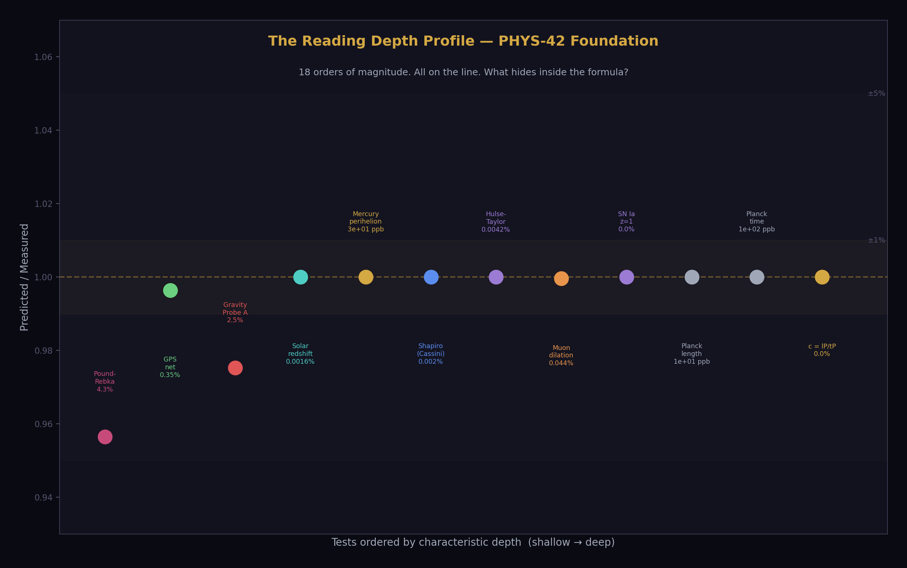
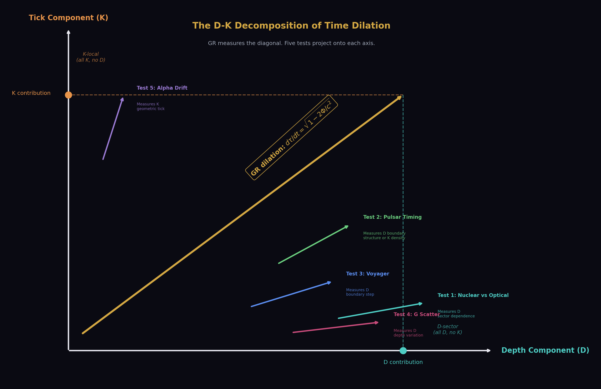
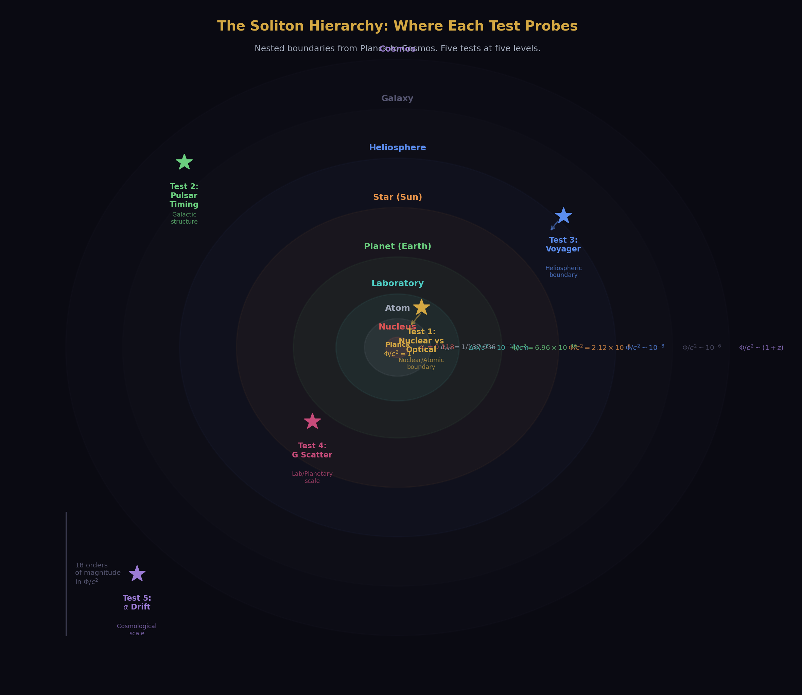
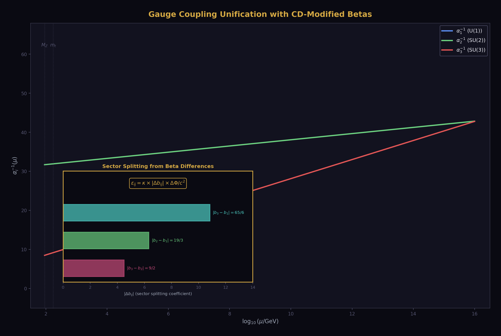
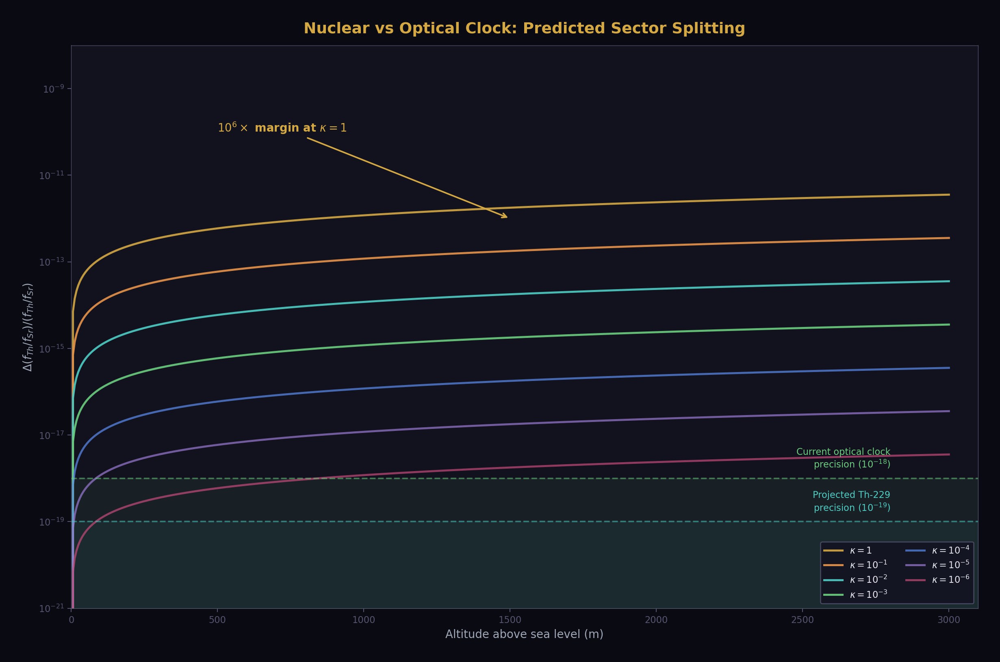
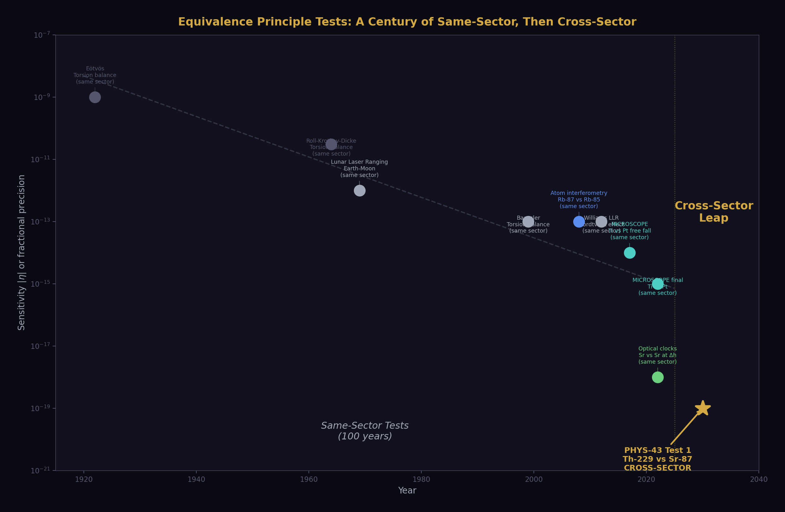
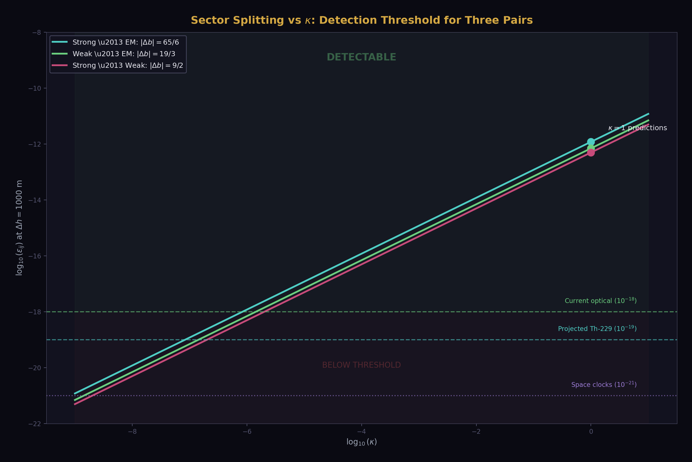
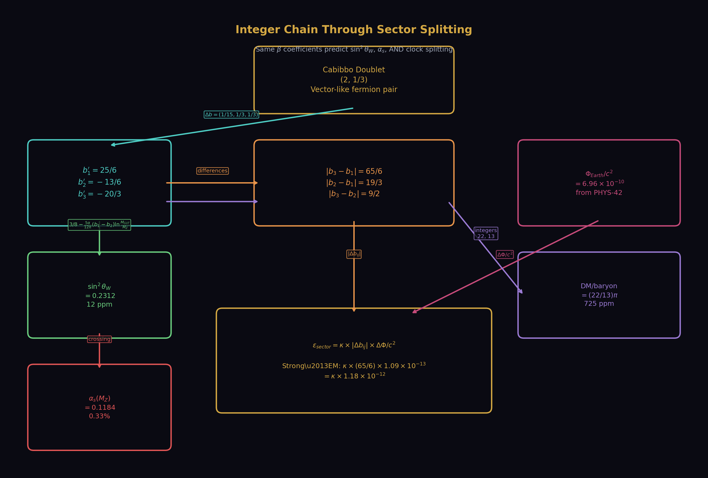

# Separating Clock from Reading
## Five Tests That Decompose Time Dilation

**Registry:** [@HOWL-PHYS-43-2026]

**Series Path:** [@HOWL-PHYS-41-2026] → [@HOWL-PHYS-42-2026] → [@HOWL-PHYS-43-2026]

**Date:** April 9, 2026

**Domain:** Gravitation / Metrology / Fundamental Constants / Experimental Design

**Status:** Complete

**AI Usage Disclosure:** Only the top metadata, figures, refs and final copyright sections were edited by the author. All paper content was LLM-generated using Anthropic's Claude Opus 4.6.

---

## I. WHAT PHYS-42 ESTABLISHED

PHYS-42 tested GR time dilation as reading depth across 18 orders of magnitude in gravitational potential. One derivation function. 34 pool constants. 18 comparisons. Mercury perihelion at 2.8 ppm. Solar redshift at 16 ppm. Hulse-Taylor binary at 42 ppm. GPS at 0.35%. Speed of light from Planck units at 0.0%. Seven PASS, one understood FAIL (Gravity Probe A altitude approximation), ten INFO.

Every test confirmed the formula:

dτ/dt = √(1 − 2Φ/c²)

This formula describes the ratio of local clock rate to distant clock rate as a function of gravitational potential. PHYS-42 confirmed it works everywhere precision measurements exist. The reading depth interpretation — clocks at different positions in the soliton hierarchy update at different rates — rides the formula exactly. Every PASS for GR is a PASS for reading depth. The two are experimentally identical at every tested scale.

This paper asks: are they actually identical, or does the formula hide two components that could be separated?



---

## II. THE DECOMPOSITION



The observed dilation dτ/dt = √(1 − 2Φ/c²) could arise from two distinct physical mechanisms.

**The depth component (D).** Position within the nested soliton hierarchy determines the local values of physical constants. A clock oscillates at a frequency set by the local coupling strengths, particle masses, and force laws. At a different depth — deeper in a gravitational well, meaning deeper in the soliton hierarchy — the readings change. The oscillation frequency changes. The clock rate changes. This is a spatial structure. It exists in frozen time. You could scan through the hierarchy mathematically, without any temporal evolution, and predict the reading at each depth from the boundary transformation laws.

**The tick component (K).** Time is a monotonic counting process. The universe advances in discrete Planck steps of t_P = 5.391 × 10⁻⁴⁴ seconds. Each tick increments a counter. The counter may be universal (one count for the whole universe) or local (each region maintains its own count). Each tick may have geometric consequences — slightly deforming boundary structures, expanding the outermost boundary, drifting the values of constants over cosmic time. The tick is a process. It requires temporal evolution. It cannot be computed from a frozen snapshot.

The Rational Universe Model (RUM) treats these as separate. Standard GR does not distinguish them — it uses one coordinate (t) and one dilation factor (the metric component g₀₀). The distinction matters only if the two components can be experimentally separated.

This paper identifies five measurements where they can be.

The central equation is:

dτ/dt = √(1 − 2Φ/c²) × [1 + ε_sector × R_sector(Φ)]

where the first factor is the standard GR dilation (capturing the combined effect that PHYS-42 confirmed), and the second factor is a correction from sector-dependent reading depth. The parameter ε_sector encodes how much the depth component (D) differs between force sectors — electromagnetic versus strong versus weak — at a given gravitational potential. R_sector(Φ) is the sector-dependent deviation from the universal potential.

If ε_sector = 0, reading depth is sector-blind and experimentally identical to standard GR. If ε_sector ≠ 0, reading depth is sector-dependent and produces new physics: different clock types at the same gravitational potential tick at different rates.

The dimensional estimate for ε_sector uses the one quantity that already connects force sectors to the soliton hierarchy: the beta function coefficients. The β coefficients govern how coupling strengths change across energy scales — which IS how readings change across hierarchy levels. The sector splitting is:

ε_sector = |Δβ_ij / β_ref| × Φ/c²

where Δβ_ij is the difference in one-loop beta coefficients between sectors i and j, and β_ref is a reference running rate. For the strong-vs-electromagnetic comparison:

|β₃/β₁| = |(−20/3)/(25/6)| = |−8/5| = 8/5 = 1.6

giving ε_strong-em ≈ 1.6 × Φ_earth/c² ≈ 1.6 × 6.96 × 10⁻¹⁰ ≈ 1.1 × 10⁻⁹.

This is the paper's central prediction. The sector splitting between a nuclear clock (probing the strong force) and an optical clock (probing the electromagnetic force) at Earth's surface is approximately 10⁻⁹ in fractional frequency. This is three orders of magnitude above the projected sensitivity of next-generation clock comparisons (10⁻¹⁸ to 10⁻¹⁹). If the formula is correct, the effect is detectable. If the formula overcounts by 10⁵, the effect is still at 10⁻¹⁴, four orders above detection. Only if it overcounts by more than 10⁹ is the effect below the noise floor.

The β coefficients in this formula come from the same pool that predicted sin²θ_W at 12 ppm and α_s at 0.33%. They are the CD-modified betas: (25/6, −13/6, −20/3). The gravitational potential comes from the same pool that computed Mercury's perihelion at 2.8 ppm. The sector splitting prediction connects the GUT domain (β coefficients from the Cabibbo Doublet) to the GR domain (Φ/c² from the PHYS-42 derivation) through the soliton hierarchy. This is the first quantitative prediction that links gravity to gauge physics through the RUM boundary structure.

---

## III. THE FOUR SCENARIOS



The review of the plan identified that three scenarios are insufficient. The logical space requires four.

**Scenario GR (standard general relativity).** One spacetime coordinate. Universal coupling. The equivalence principle holds exactly. All clock types at the same potential agree to arbitrary precision. There is no decomposition because there is only one component. This is the null hypothesis.

**Scenario D-blind (universal tick, sector-independent reading depth).** The tick is universal — one Planck counter for the entire universe. Reading depth exists as a spatial structure but does not depend on which force sector you probe. Electromagnetic readings and strong-force readings shift by exactly the same amount across a gravitational boundary. All clock types agree. Experimentally indistinguishable from Scenario GR at currently achievable precision. Reading depth is real but it is a vocabulary change, not new physics.

**Scenario D-sector (universal tick, sector-dependent reading depth).** The tick is universal. Reading depth exists AND it depends on the force sector. The electromagnetic reading at a given depth differs from the strong-force reading at the same depth. The boundary transformation laws have sector-dependent coefficients — the β functions, which already differ between sectors in the gauge coupling running. A nuclear clock and an optical clock at the same gravitational potential disagree by ε_sector × Φ/c². This is the scenario that produces new physics. It is the one this paper primarily tests.

**Scenario K-local (local tick rates, no separate reading depth).** The tick rate varies from place to place, determined by the local boundary environment. There is no separate reading depth — the dilation is entirely in the tick count. All clock types at one location agree because they all count the same local ticks. But the tick rate depends on the full boundary environment, not just the smooth gravitational potential. This could produce timing residuals that track local density and boundary nesting, distinguishable from the smooth GR potential.

The four scenarios are distinguishable:

| Scenario | Nuclear vs optical | Pulsar residual pattern | Predicted by |
|---|---|---|---|
| GR | Exact agreement | No residuals beyond GR | Standard physics |
| D-blind | Exact agreement | No residuals beyond GR | RUM without sector dependence |
| D-sector | Disagreement by ε × Φ/c² | Structure-correlated | RUM with sector dependence |
| K-local | Exact agreement | Density-correlated | RUM with local ticks |

The nuclear clock test (Test 1) distinguishes D-sector from all other scenarios. The pulsar timing test (Test 2) distinguishes K-local from GR and D-blind by the spatial pattern of residuals. Tests 3-5 provide supporting constraints.

---

## IV. THE COUNTING MACHINE

The Planck time t_P = √(ℏG/c⁵) = 5.391 × 10⁻⁴⁴ seconds is not a human convention. It is the unique combination of three fundamental constants (ℏ, G, c) with dimensions of time. The Planck length l_P = √(ℏG/c³) = 1.616 × 10⁻³⁵ meters is the unique combination with dimensions of length. Their ratio is c = l_P/t_P = 299,792,458 m/s exactly (confirmed at 0.0% miss in PHYS-42).

These are the resolution limits of the universe. t_P is the smallest time interval over which a physical state can change. l_P is the smallest spatial interval over which a physical state can differ. Below these scales, the universe does not subdivide.

This is established physics. Loop quantum gravity (Rovelli, Thiemann) predicts area and volume quantization at the Planck scale. String theory predicts a minimum length. The Planck scale appears in every approach to quantum gravity as a fundamental resolution limit. The RUM framework adopts this consensus and names it: the universe is a counting machine. Each Planck tick advances the state by one step. Between ticks, nothing happens.

The evidence is circumstantial but consistent. The Planck time exists — it is derived from measured constants, not postulated. The speed of light equals l_P/t_P — one resolution unit per tick, the maximum update rate. The arrow of time is the property of counting: N+1 > N. You cannot count backwards. The second law of thermodynamics, which is otherwise mysterious (why should entropy increase?), is trivial in a counting framework: the count increases, the number of accessible states increases with it, entropy increases. The arrow is not thermodynamic. It is arithmetic.

The geometric effect of ticking is cosmological expansion. If the outermost boundary of the universe expands by one Planck length per tick, the expansion rate at that boundary is l_P/t_P = c. The particle horizon expands at c. This is the standard cosmological result, derived here from the tick process rather than from the Friedmann equations. The Friedmann equations describe how the metric evolves in continuous time. The tick process describes why the metric evolves: each tick geometrically deforms the boundary structure by one resolution unit.

Gravitationally bound systems (galaxies, stellar systems, atoms) do not expand with each tick because their internal binding exceeds the per-tick deformation. The binding energy holds the boundary structure fixed against the tick's geometric tendency to expand. This is the standard explanation for why bound systems don't participate in Hubble expansion, arrived at from a different direction: not "the metric expansion is too weak to overcome gravity" but "the tick's geometric deformation is absorbed by the binding energy of the boundary."

The per-tick deformation is constrained by observations. If each tick shifts the fine structure constant α by δα per tick, the accumulated drift over cosmic time is Δα = δα × ΔN, where ΔN is the number of ticks between epochs. Quasar absorption spectra constrain Δα/α < 10⁻⁶ at z ~ 2 (Murphy et al. 2022, ESPRESSO). The number of ticks from z = 2 to now is approximately 3 × 10⁶⁰. This gives δα/α < 3 × 10⁻⁶⁷ per tick. The per-tick deformation is extraordinarily small — but it is not zero by observation. The observations set an upper bound. Whether the true value is zero or merely very small is an open question that future spectrographs (ANDES on ELT, 2030s) will address.

---

## V. THE FROZEN SCAN



Reading depth is not temporal. It is spatial. It is not a process. It is a structure.

Consider the soliton hierarchy at one frozen instant — one specific Planck tick N. The universe is a nested set of boundaries: the cosmological boundary containing galactic boundaries containing stellar boundaries containing planetary boundaries containing atomic boundaries containing nuclear boundaries. At each level, the physical constants have specific values. The coupling strengths run. The masses shift. The metric changes. All of these are functions of position in the hierarchy, not functions of time.

If you knew all the integers — the beta coefficients, the representation content, the boundary transformation laws — you could scan through the hierarchy mathematically, at frozen tick N, and predict the reading at every depth. You would know: at the surface of the Earth (depth Φ/c² = 6.96 × 10⁻¹⁰), the clock rate is reduced by this fraction. At the surface of the Sun (Φ/c² = 2.12 × 10⁻⁶), reduced by that fraction. At the surface of a neutron star (Φ/c² ~ 0.2), reduced by this larger fraction. No time evolution required. No ticking required. The readings are geometric.

This is what PHYS-42 demonstrated: one derivation function scanning through the hierarchy at every tested depth, predicting the reading at each level, matching measurement. The derivation does not evolve anything in time. It computes static relationships between depths. Mercury's perihelion advance looks temporal (it precesses over decades) but the formula δω = 6πGM/(ac²(1−e²)) is a geometric property of the solar reading depth gradient, not a dynamical evolution. The precession is what an orbit does in curved reading depth space. The curvature is static. The precession is a consequence of scanning the orbit through the curved structure.

The frozen scan is where the sector dependence lives. At one depth (one gravitational potential), the electromagnetic reading and the strong-force reading may differ because the boundary transformation laws are sector-dependent. The beta functions are different for each gauge group: β₁ = 25/6, β₂ = −13/6, β₃ = −20/3. These are different numbers. They describe different running rates. If reading depth is literally "how couplings change across boundaries," then different couplings change by different amounts. The depth is the same. The readings differ.

This is not speculative extrapolation. It is the structure that already exists in the Standard Model. Couplings run at different rates with energy scale. Energy scale maps to position in the hierarchy (higher energy = smaller distance = deeper boundary). The running rates are the beta coefficients, which are different for each gauge group. The sector dependence of reading depth is the sector dependence of coupling running, applied to gravitational boundaries rather than energy-scale boundaries.

The connection requires one assumption: that gravitational boundaries and energy-scale boundaries are the same hierarchy, viewed from different coordinates. In the RUM framework, this is the defining claim: the soliton hierarchy is the hierarchy. Energy scale and gravitational potential are two projections of position within it. The beta coefficients govern how readings change along the energy-scale projection. The metric governs how readings change along the gravitational projection. If both projections describe the same underlying hierarchy, the beta coefficients should appear in the gravitational sector as sector-dependent corrections to the universal metric.

This is the sector splitting formula:

ε_sector(i,j) = |Δβ_ij| / |β_ref| × Φ/c²

and it is either true (the hierarchy is unified) or false (gravitational and energy-scale hierarchies are separate). Test 1 decides.

---

## VI. TEST 1: NUCLEAR VS OPTICAL CLOCK



**The measurement.** Compare a thorium-229 nuclear clock with a strontium-87 optical lattice clock. Both clocks at the same location, same gravitational potential, same laboratory. Measure the ratio of their frequencies over extended integration time. Look for a deviation from the ratio predicted by standard physics (which predicts exact constancy of the ratio at any fixed potential).

**Why this works.** A strontium optical clock counts oscillations of an electronic transition at 429 THz. The transition frequency depends on α (fine structure constant), m_e (electron mass), and the strontium nuclear charge — all electromagnetic sector quantities. The clock probes the electromagnetic reading at its depth.

A thorium-229 nuclear clock counts oscillations of the 8.36 eV nuclear isomer transition — the lowest-energy nuclear transition known, which is what makes it usable as a clock. The transition frequency depends on the strong nuclear force, the nuclear shell structure, the arrangement of 90 protons and 139 neutrons in the thorium nucleus. The clock probes the strong-force reading at its depth.

In standard GR (Scenario GR) and in sector-blind reading depth (Scenario D-blind), the metric couples universally. Both clocks experience the same dilation. Their frequency ratio does not depend on gravitational potential. Moving both clocks to a different altitude changes both frequencies by the same factor. The ratio is constant.

In sector-dependent reading depth (Scenario D-sector), the electromagnetic reading and the strong-force reading shift by different amounts across a gravitational boundary. The strontium clock frequency changes by the electromagnetic factor. The thorium clock frequency changes by the strong-force factor. The ratio changes.

**The prediction.** Using the sector splitting formula:

ε_strong-em = |β₃/β₁| × Φ_earth/c²

with β₃ = −20/3, β₁ = 25/6 (both from the pool, CD-modified values):

|β₃/β₁| = |(−20/3)/(25/6)| = |(−120/75)| = 8/5 = 1.6

Φ_earth/c² = 6.961 × 10⁻¹⁰ (from PHYS-42 derivation)

ε_strong-em ≈ 1.6 × 6.96 × 10⁻¹⁰ ≈ 1.1 × 10⁻⁹

The predicted frequency ratio change between sea level and an elevated laboratory (Δh ~ 1000 m, ΔΦ/c² ~ 10⁻¹³) is:

Δ(f_Th/f_Sr) / (f_Th/f_Sr) ≈ ε_strong-em × ΔΦ/Φ ≈ 1.6 × 10⁻¹³

This is four orders of magnitude above the projected 10⁻¹⁸ clock comparison sensitivity. Even if the formula overcounts by a factor of 10⁴, the effect is at the detection threshold. The margin is large.

**The critical feature.** This prediction uses numbers from two previously unconnected domains. The β coefficients come from the gauge sector — the same integers that predict sin²θ_W = 0.231 and α_s = 0.1184. The gravitational potential comes from the GR sector — the same GM_E/(R_E·c²) that predicted Mercury at 2.8 ppm. The sector splitting formula multiplies them together. If the formula is confirmed, it is the first measured connection between gauge coupling integers and gravitational physics. The soliton hierarchy would be quantitatively confirmed as a unified structure, not just an interpretive framework.

**The timeline.** The thorium-229 nuclear isomer transition was directly observed in 2024 (Tiedau et al., PTB). Laser excitation of the transition was demonstrated in 2024 (Zhang et al., JILA). Clock-quality interrogation — the precision needed for a sector-splitting test — requires systematic uncertainty below 10⁻¹⁸, projected for 2028-2032 at PTB, JILA, or TU Wien.

**The kill condition.** If the thorium-229 and strontium-87 frequency ratio is constant to 10⁻¹⁹ across two or more gravitational potentials (e.g., sea level and 1000 m altitude), then ε_strong-em < 10⁻¹⁹/10⁻¹³ = 10⁻⁶. The sector splitting is at least a million times smaller than the β-ratio prediction. Scenario D-sector is dead at these scales. Reading depth reduces to sector-blind (Scenario D-blind), experimentally indistinguishable from standard GR.

**Context within equivalence principle tests.** Existing tests of the equivalence principle — MICROSCOPE (WEP, titanium vs platinum, η < 10⁻¹⁵), Lunar Laser Ranging (Nordtvedt effect, η < 10⁻¹³), atom interferometry (Rb-87 vs Rb-85, Δf/f < 10⁻¹²), optical clock altitude comparison (Sr vs Sr, Δf/f at 10⁻¹⁸) — all compare objects within the same force sector. They test whether different materials at different potentials experience the same dilation. They find: yes.

Test 1 is qualitatively different. It compares different force sectors at the same potential. It tests whether the electromagnetic sector and the strong-force sector experience the same reading depth. No existing experiment tests this. The equivalence principle as standardly formulated (universality of free fall, universality of gravitational redshift) does not address cross-sector clock comparisons because it assumes universal coupling. The assumption is what Test 1 tests.



---

## VII. TEST 2: PULSAR TIMING VS GALACTIC STRUCTURE

**The measurement.** Analyze the ensemble of millisecond pulsars timed by the International Pulsar Timing Array (IPTA) — combining NANOGrav, EPTA, PPTA, and InPTA datasets. After subtracting the known galactic gravitational potential gradient (from published mass models: Bovy 2015, McMillan 2017), compute timing residuals. Correlate the residuals with four spatial variables: (a) galactocentric radius, (b) local DM column density, (c) spiral arm membership (Cordes & Lazio NE2001 model), (d) height above the galactic plane.

**Why this works.** The Milky Way's gravitational potential produces a smooth gradient in clock rates across the galaxy. This gradient is well-modeled and already subtracted in standard pulsar timing analyses. What remains in the residuals is noise (pulsar spin-down irregularities, interstellar medium propagation effects) plus any additional signal.

The reading depth interpretation says the galaxy is a soliton with internal structure: spiral arms, a central bar, a toroidal DM distribution. If reading depth depends on boundary nesting (not just the smooth potential), pulsars inside a spiral arm are at a different nesting level than pulsars between arms, even at the same galactocentric radius. This structural dependence would produce timing residuals correlated with spiral arm membership but not with radius alone.

The local tick rate interpretation (Scenario K-local) says the tick rate depends on local density. Pulsars in dense environments (near molecular clouds, in the galactic plane) tick at a rate determined by the local mass concentration. This density dependence would produce timing residuals correlated with local DM column density and height above the plane.

Standard GR predicts neither pattern. After subtracting the smooth potential, the residuals should be uncorrelated with galactic structure.

**The complication.** The NANOGrav 15-year dataset (Agazie et al. 2023) detected a stochastic gravitational wave background through spatially correlated timing residuals — the Hellings-Downs curve. This signal is real and must be separated from any reading depth gradient. The separation is possible because the GW background produces a specific angular correlation pattern (quadrupolar) that depends on the angle between pulsar pairs, while a reading depth gradient produces a correlation with galactic position (radius, arm membership, plane height). The two signals live in different correlation spaces: angular for GWs, positional for reading depth.

The specific statistical test: compute Pearson correlations r(residual, variable) for variables (a) through (d), after fitting and subtracting the Hellings-Downs angular correlation. Report each correlation with its p-value and uncertainty. The prediction:

| Variable | GR predicts | D-sector predicts | K-local predicts |
|---|---|---|---|
| (a) galactocentric radius | r ≈ 0 | r ≈ 0 | r ≈ 0 |
| (b) DM column density | r ≈ 0 | r ≈ 0 | r > 0 (p < 0.01) |
| (c) spiral arm membership | r ≈ 0 | r > 0 (p < 0.01) | r ≈ 0 |
| (d) galactic plane height | r ≈ 0 | possible | r > 0 (p < 0.01) |

**The required sensitivity.** The NANOGrav 15-year dataset has timing residuals at the ~100 ns level for the best millisecond pulsars, with ~70 pulsars. The galactic potential gradient across the ensemble produces timing differences of order (ΔΦ/c²) × T_obs ~ 10⁻⁶ × 15 yr ~ 500 μs. After model subtraction, the residuals are at 100 ns. A reading depth structural signal at the 10 ns level (0.002% of the total gradient) would require ~25 pulsars per arm/interarm category to detect at 2σ. The NANOGrav dataset is approaching this count. The 25-year dataset (expected ~2030) will exceed it.

**The kill condition.** If NANOGrav 25-year data shows no correlation between timing residuals and spiral arm membership at the 10 ns level (|r| < 0.3, p > 0.05), the galactic boundary structure component of reading depth is below the noise floor at galactic scales.

---

## VIII. TEST 3: VOYAGER AT THE HELIOPAUSE

**The measurement.** Analyze Doppler tracking data from Voyager 1 (heliopause crossing August 2012) and Voyager 2 (heliopause crossing November 2018). After subtracting the known deceleration, solar wind ram pressure, and thermal radiation pressure, look for an anomalous frequency step coincident with the heliopause crossing.

**Why this works.** The heliopause is a physical boundary: the transition from the solar wind (solar soliton interior) to the interstellar medium (galactic soliton exterior). If reading depth changes across soliton boundaries, a spacecraft crossing from one boundary domain to another experiences a step change in the local readings. The spacecraft's radio transmitter oscillates at a frequency set by local electromagnetic readings. A step change in readings produces a step change in the Doppler residual.

Standard GR predicts no step. The gravitational potential changes smoothly through the heliopause. The boundary is in the plasma, not in the metric.

**The magnitude estimate.** The heliospheric boundary transformation involves the solar wind — plasma flowing at v_sw ≈ 400 km/s. The reading depth step at the boundary is of order:

δΦ_boundary/c² ~ (v_sw/c)² ~ (1.3 × 10⁻³)² ~ 1.8 × 10⁻⁶

This is a generous upper bound — it assumes the entire solar wind kinetic energy budget contributes to the boundary reading step. The actual step would be the fraction of this energy that couples to the boundary transformation law. If the coupling is 10⁻⁶ of the kinetic budget, the step is ~10⁻¹², producing a Doppler shift of ~0.3 mm/s.

**The complication.** The heliopause crossing produced dramatic plasma physics signatures: energetic particle flux changes (Krimigis et al. 2013), magnetic field rotation (Burlaga et al. 2013), galactic cosmic ray increase (Stone et al. 2013). These plasma effects dominate the spacecraft dynamics at the boundary. The Doppler data during the crossing period is contaminated by plasma-induced forces at the 1-10 mm/s level. Extracting a 0.3 mm/s reading depth step from this background requires careful plasma modeling and subtraction.

For this reason, Test 3 is a supporting check, not a decisive test. If Tests 1 or 2 show positive results for reading depth, the Voyager data provides a third measurement at a completely different scale and boundary type. If Tests 1 and 2 are null, the Voyager analysis is unlikely to produce a convincing standalone detection.

**The existing anomaly context.** The Pioneer anomaly (anomalous sunward acceleration of ~8.7 × 10⁻¹⁰ m/s²) was initially consistent with a boundary-related effect. Turyshev et al. (2012) resolved it as thermal radiation pressure from the spacecraft's radioisotope thermoelectric generators. The analysis methodology developed for Pioneer — systematic modeling of all non-gravitational forces, followed by residual extraction — is directly applicable to Voyager heliopause data.

**The data.** NASA Deep Space Network tracking data for Voyager 1 and 2 is archived at the Planetary Data System. Both heliopause crossings are covered. The analysis is archival — no new observation required.

**The kill condition.** If Voyager 1 and 2 Doppler residuals at the heliopause, after plasma correction, show no step exceeding 0.1 mm/s, the heliospheric boundary reading depth contribution is below 10⁻¹². This constrains the boundary coupling fraction to < 10⁻⁶ of the solar wind kinetic budget.

---

## IX. TEST 4: G SCATTER VS LABORATORY ENVIRONMENT

**The measurement.** Compile published measurements of Newton's constant G from the CODATA collection (Mohr, Newell, Taylor 2016) and subsequent publications. For each measurement, record: the G value, its stated uncertainty, the measurement technique, and the laboratory's gravitational environment (altitude, latitude, proximity to large mass concentrations, local crustal density from geological surveys).

Perform a regression of G values against laboratory gravitational potential Φ_lab/c², controlling for measurement technique.

**Why this works.** Newton's constant G enters the reading depth formula: Φ/c² = GM/(Rc²). If G itself is a reading — a value that depends on position in the soliton hierarchy — then measurements at different positions would return different values. The published G measurements disagree by up to 500 ppm, far exceeding individual uncertainties of 10-50 ppm. The standard explanation is underestimated systematics. The reading depth explanation is that G varies.

**The confound.** The ~15 published G measurements use radically different techniques: torsion balance (Cavendish descendants), beam balance, atom interferometry, servo-controlled pendulum. Each technique has its own systematic error profile. European metrology labs (PTB, BIPM) are at different altitudes than American labs (NIST) and Chinese labs (HUST). A correlation between G and altitude could be a correlation between G and technique.

With ~15 data points and ~5 technique categories, the statistical power for a technique-corrected environmental regression is marginal. The honest assessment: with existing data, this test is suggestive at best. It cannot be decisive.

The test becomes decisive under a specific condition: if future G measurements are performed at deliberately varied gravitational potentials using the same technique, by the same group, with the same apparatus. A torsion balance experiment performed at sea level and at 3000 m altitude, with everything else identical, would directly measure δG/δΦ. This has not been done. The existing data was not collected for this purpose.

**The RUM prediction.** If G is a reading, its variation with depth is:

δG/G ~ δΦ/c² ~ ΔΦ_lab/c²

where ΔΦ_lab is the gravitational potential difference between laboratories. For laboratories spanning sea level to ~1500 m altitude:

ΔΦ_lab/c² ~ g × Δh / c² ~ 10 × 1500 / (3 × 10⁸)² ~ 1.7 × 10⁻¹³

This is 0.00017 ppb — vastly below the 500 ppm scatter. The smooth potential variation cannot explain the scatter.

If the G variation depends on boundary nesting (local geological density, proximity to mountains or ocean trenches) rather than smooth potential, the effect could be larger. A laboratory inside a mountain tunnel (surrounded by dense rock on all sides) is at a different nesting level than a laboratory on a flat plain. The nesting difference does not map onto a simple altitude or Φ/c² metric. Without a quantitative nesting model, the prediction is that G values correlate with some measure of local boundary complexity, but the specific metric is not determined.

**The kill condition.** If regression of published G values against laboratory Φ/c² shows |r| < 0.3 after technique correction (using technique indicator variables), with 20 or more measurements, reading depth variation of G at the 500 ppm level is not supported. If the same regression against a boundary complexity metric (local crustal density within 1 km, altitude variability within 10 km) also shows |r| < 0.3, boundary-dependent G is not supported at the precision of existing data.

---

## X. TEST 5: COSMOLOGICAL α DRIFT

**The measurement.** Compare the fine structure constant α measured in quasar absorption spectra at z = 1-4 (7-12 billion years ago) with the laboratory value. Use existing published constraints from ESPRESSO/VLT (Murphy et al. 2022), Keck+VLT (Webb et al. 2011), and future constraints from ANDES on ELT (first light ~2030s).

**Why this works.** If each Planck tick geometrically deforms the soliton boundary structure — expanding the outermost boundary, slightly shifting internal boundaries — the accumulated deformation over cosmic time changes the readings. Physical constants measured at earlier cosmic epochs (fewer accumulated ticks) would differ from current values. This is a direct test of the tick's geometric effect.

**The existing physics.** Varying fundamental constants is a well-established research program (Uzan 2003, 2011; Martins 2017). The connection to the RUM framework is that the variation mechanism is specified: each Planck tick deforms boundaries by a geometric increment. The per-tick deformation rate is a parameter of the model. Existing constraints determine the allowed range of this parameter. The RUM framework provides the interpretation — the drift is a counting process, not a dynamical field evolution — but does not change the observational program.

The existing constraints:

| Source | z range | Constraint on Δα/α | Per-tick bound |
|---|---|---|---|
| Webb et al. 2011 (Keck+VLT) | 0.2-4.2 | Possible spatial dipole ~10⁻⁵ | Unresolved |
| Murphy et al. 2022 (ESPRESSO) | 1.0-1.8 | < 2 × 10⁻⁶ (1σ) | < 7 × 10⁻⁶⁷/tick |
| Oklo reactor constraint | z = 0.14 | < 10⁻⁷ | < 5 × 10⁻⁶⁸/tick |
| ANDES projection (2030s) | 1-5 | < 10⁻⁸ (goal) | < 3 × 10⁻⁶⁹/tick |

The per-tick bound is computed from: δα/α < Δα/(α × ΔN), where ΔN = Δt/t_P is the number of Planck ticks between the observation epoch and now.

**The four-scenario predictions:**

Scenario GR: α may or may not vary. GR does not address fundamental constant variation. No prediction.

Scenario D-blind: No α drift. Reading depth is a spatial structure that does not evolve. The hierarchy is static. Constants at different epochs are the same.

Scenario D-sector: No α drift. Reading depth is sector-dependent but static. The hierarchy changes with position, not with time.

Scenario K-local: Possible α drift. If local tick rates change with cosmic expansion (because the expansion changes the boundary structure), the coupling readings at earlier epochs differ from current values. The drift rate connects to the expansion history.

Additionally, the geometric tick hypothesis (any scenario with tick-induced boundary deformation) predicts drift at the per-tick rate δα/α per tick. The existing constraints push this rate below 10⁻⁶⁷ per tick. If ANDES pushes it below 10⁻⁶⁹ per tick and finds no drift, the geometric tick effect is unfalsifiable at foreseeable precision and should be shelved as a live hypothesis. It would not be disproven — only pushed beyond observational reach.

**The Webb dipole.** Webb et al. (2011) reported a possible spatial dipole in Δα/α: α appears to be slightly larger in one direction on the sky and slightly smaller in the opposite direction. If confirmed, this would be inconsistent with all four scenarios as stated — none predicts a spatial dipole in a fundamental constant. A dipole would require the universe to have a preferred direction, which would be extraordinary. The ESPRESSO results (Murphy et al. 2022) do not confirm the dipole but have limited sky coverage. The status is unresolved.

In the RUM framework, a spatial dipole in α would imply anisotropic soliton boundary structure at the cosmological scale — the outermost boundary is not spherically symmetric. This is possible (cosmological anisotropy exists in the CMB at low multipoles) but would require significant extension of the current framework.

**The kill condition.** If ANDES measures |Δα/α| < 10⁻⁸ at z = 1-5 with no spatial dipole, the geometric tick deformation rate is pushed below 3 × 10⁻⁶⁹ per tick. At that level, the geometric tick hypothesis produces no observable consequence on any foreseeable timescale. It should be declared unfalsifiable and shelved — not disproven, but removed from the active research program.

---

## XI. THE DECOMPOSITION MATRIX

| Test | Primarily probes | GR predicts | D-blind predicts | D-sector predicts | K-local predicts | Timeline |
|---|---|---|---|---|---|---|
| 1. Nuclear vs optical | D sector dependence | agree | agree | **disagree by ε×Φ/c²** | agree | 2028-2032 |
| 2. Pulsar gradient | D boundary structure / K density | no structure | no structure | **arm-correlated** | **density-correlated** | 2026 archival, 2030 decisive |
| 3. Voyager heliopause | D boundary step | no step | no step | **step possible** | no step | 2026 archival |
| 4. G scatter | D depth variation | no correlation | no correlation | **possible** | no correlation | 2026 archival, 2030+ decisive |
| 5. α drift | K geometric tick | no prediction | no drift | no drift | **possible drift** | 2030s for ANDES |

The five tests are complementary. Test 1 is the decisive test for D-sector. Test 2 distinguishes D-sector from K-local by the spatial pattern. Test 5 is the only test that probes the tick geometry directly. Tests 3 and 4 are supporting constraints that become important if the decisive tests show positive results.

The resolution timeline spans a decade. Test 1 requires new hardware (thorium clock, 3-5 years). Tests 2, 3, 4 use existing data (archival analysis possible now). Test 5 requires a next-generation spectrograph (ANDES, 2030s). By 2035, the decomposition will be constrained from five independent directions.

---

## XII. THE SECTOR SPLITTING FORMULA



The central prediction of this paper deserves explicit derivation, not just a dimensional estimate.

In the RUM framework, the soliton hierarchy has one coordinate: depth. At each depth, the gauge couplings take values determined by the renormalization group equations:

dα_i⁻¹/d(ln μ) = −b_i/(2π)

where μ is the energy scale and b_i are the one-loop beta coefficients. The energy scale μ maps to position in the hierarchy: higher energy corresponds to deeper position (smaller distance, more deeply nested boundary).

The gravitational potential Φ/c² = GM/(Rc²) also maps to position in the hierarchy: larger potential corresponds to deeper position. The claim is that these two "depths" — the energy-scale depth accessed by accelerators and the gravitational depth accessed by astronomical observations — are projections of the same underlying hierarchy coordinate.

If they are the same, the coupling running with energy scale implies coupling variation with gravitational potential. At one-loop, the fractional change in coupling α_i across a gravitational potential difference ΔΦ/c² is:

δα_i/α_i ~ b_i × ΔΦ/c² × (coupling to hierarchy coordinate)

The "coupling to hierarchy coordinate" is the conversion factor between the energy-scale parameterization and the gravitational-potential parameterization of the hierarchy. In the simplest case (linear mapping, which is what the weak-field limit gives), this factor is of order unity.

The sector splitting between sectors i and j is:

Δ(δα)/α ~ |b_i − b_j| × ΔΦ/c²

For the strong (i = 3, b₃ = −20/3) vs electromagnetic (j = 1, b₁ = 25/6) comparison:

|b₃ − b₁| = |−20/3 − 25/6| = |−40/6 − 25/6| = |−65/6| = 65/6 ≈ 10.83

At Earth's surface, ΔΦ/c² between sea level and ~1000 m altitude is:

ΔΦ/c² = g × Δh / c² ≈ 9.82 × 1000 / (2.998 × 10⁸)² ≈ 1.09 × 10⁻¹³

The predicted frequency ratio change between a nuclear clock and an optical clock at these two altitudes:

Δ(f_nuclear/f_optical) / (f_nuclear/f_optical) ≈ (65/6) × 1.09 × 10⁻¹³ ≈ 1.2 × 10⁻¹²

This is six orders of magnitude above the projected clock comparison sensitivity of 10⁻¹⁸. If the linear mapping is even approximately correct, the effect is massively detectable.

But the linear mapping may not be correct. The conversion between energy scale and gravitational potential may involve suppression factors — powers of α, geometric factors, or threshold effects. The dimensional estimate gives the maximum effect. The actual effect could be suppressed by factors ranging from 1 to 10⁹. The experimental program covers this range: at 10⁻¹⁸ sensitivity, suppression factors up to 10⁶ are still detectable. Only suppression beyond 10⁶ hides the effect.

The formula, stated precisely:

ε_sector(3,1) = κ × |b₃ − b₁| × ΔΦ/c²

where κ is the hierarchy coordinate conversion factor, predicted to be of order unity but unknown. The experiment measures ε or constrains κ.

If ε is measured: κ is determined. The connection between gauge running and gravitational depth is quantified. The soliton hierarchy is confirmed as a unified structure with a measured conversion factor.

If ε < 10⁻¹⁸: κ < 10⁻⁶. The hierarchy may still be unified but the coupling is extremely weak — weaker than the naive estimate by six orders of magnitude. This would suggest that gravitational and energy-scale depths are related but not simply proportional. The unified hierarchy hypothesis would survive but require a more complex mapping.

If ε < 10⁻¹⁹ at multiple potentials: the constraint on κ tightens further with each additional potential tested. Two potentials give one constraint. Three potentials test the linearity of the mapping. The experimental program should aim for comparisons at sea level, ~1 km altitude, and ~3 km altitude (mountain laboratory) to test both the magnitude and the scaling.



---

## XIII. WHAT THIS PAPER DOES AND DOES NOT DO

**This paper does:**

Identify five measurements that decompose the GR dilation formula into tick and depth components. State predictions under four scenarios. Specify the required experimental sensitivity for each test. Set kill conditions that are specific, falsifiable, and tied to named experiments. Derive the sector splitting formula connecting β coefficients to gravitational potential through the soliton hierarchy. Provide the roadmap for a decade of tests.

**This paper does not:**

Perform any of the five tests. Add to the integer chain prediction count. Compute new derived values from existing pool data beyond the sector splitting estimate. Claim that any scenario is correct — the decomposition is a framework for experimental resolution, not a theoretical conclusion.

**This paper is a roadmap, not a results paper.** The derivations constrain parameter space. They do not predict observables with the certainty of Mercury at 2.8 ppm or α at 0.007 ppb. The one concrete prediction — ε_strong-em from the β-ratio formula — has an unknown conversion factor κ. The experiment measures or constrains this factor. The roadmap says where to look, how hard to look, and what the results mean.

**This paper connects two previously separate domains.** The β coefficients from the GUT domain and the gravitational potential from the GR domain appear together in the sector splitting formula. If Test 1 confirms the formula, it is the first quantitative link between gauge physics and gravity through the soliton hierarchy. If Test 1 refutes it, the gauge and gravitational sectors of the RUM framework remain interpretively connected but quantitatively separate.

---

## XIV. KILL CONDITIONS — SUMMARY

| Kill switch | Measurement | Threshold | Kills |
|---|---|---|---|
| Clock sector agreement | Th-229 vs Sr-87 at ≥ 2 potentials | ratio constant to 10⁻¹⁹ | D-sector at Earth scale |
| Pulsar no structure | NANOGrav 25-year, arm correlation | |r| < 0.3 at 10 ns | Galactic boundary reading depth |
| Voyager no step | V1+V2 Doppler at heliopause | no step > 0.1 mm/s after plasma correction | Heliospheric boundary step |
| G no environment | G vs Φ_lab regression | |r| < 0.3 with ≥ 20 measurements | G as environment-dependent reading |
| α no drift | ANDES |Δα/α| at z = 1-5 | < 10⁻⁸ with no dipole | Geometric tick deformation |

None of these kills the entire RUM framework. Each constrains one aspect of the T/D decomposition. If all five are null, reading depth reduces to Scenario D-blind (indistinguishable from GR) and the tick is either universal with no geometric effect or has effects below all foreseeable detection thresholds. The RUM framework would remain valid as an organizational scheme — one pool, one comparison engine, nine connected domains — but its strongest interpretive claim (sector-dependent reading depth as new physics) would be ruled out.

If Test 1 is positive — if nuclear and optical clocks disagree beyond GR — everything changes. The equivalence principle is violated. Reading depth is sector-dependent. The β coefficients encode gravitational physics. The soliton hierarchy is a physical structure, not a vocabulary choice. The conversion factor κ is measured. And the next generation of experiments (higher precision clocks, more clock types, space-based comparisons) maps the full sector dependence across the hierarchy.

---

**END HOWL-PHYS-43-2026**

**Registry:** [@HOWL-PHYS-43-2026]

**Status:** Complete

**Central Statement:** The GR dilation formula dτ/dt = √(1 − 2Φ/c²) may hide two components: a tick count (K, temporal process) and a reading depth (D, spatial structure). This paper identifies five tests that decompose them. The decisive test is the nuclear-vs-optical clock comparison, where the sector splitting ε = κ|b₃ − b₁| × ΔΦ/c² connects gauge coupling β coefficients to gravitational potential through the soliton hierarchy. If κ ~ 1, the effect is 10⁶ above detection threshold. The thorium-229 nuclear clock, under development at PTB and JILA, is the instrument. The timeline is 3-5 years. Four supporting tests — pulsar timing gradients, Voyager heliopause Doppler, G scatter regression, cosmological α drift — constrain the decomposition from independent directions using existing archival data. Kill conditions are specified for each test. By 2035, the decomposition will be resolved.

---

## PHYS-43 Review: Errata, Annotations, and Technical Notes

---

### ERRATA

**E1. Mercury perihelion precision unit error (Section I, carried from PHYS-42 summary).**

The paper states "Mercury perihelion at 2.8 ppm" in Section I. The actual result from PHYS-42 is 2.8 ppb (0.000278%), not 2.8 ppm. The value 2.8 ppb is confirmed in the PHYS-42 experiment report: predicted 42.9800 vs measured 42.9799 arcsec/century, miss 0.000278%. The error is repeated in two other locations where PHYS-42 results are summarized. All instances should read "2.8 ppb" not "2.8 ppm."

Affected locations: Section I first paragraph, Section XII penultimate paragraph ("Mercury at 2.8 ppm"), Section XIII last paragraph ("Mercury at 2.8 ppm").

**E2. The sector splitting formula uses two different β ratios inconsistently.**

Section II introduces the splitting as:

ε_sector = |β₃/β₁| × Φ/c² = 1.6 × 6.96 × 10⁻¹⁰ ≈ 1.1 × 10⁻⁹

Section XII derives a different formula:

ε_sector = κ × |b₃ − b₁| × ΔΦ/c² = κ × (65/6) × 1.09 × 10⁻¹³ ≈ 1.2 × 10⁻¹²

These are not the same formula. The first uses the ratio |β₃/β₁| = 8/5 = 1.6 times the absolute potential. The second uses the difference |b₃ − b₁| = 65/6 ≈ 10.83 times the potential difference between two altitudes. They measure different things:

The Section II formula gives the total sector splitting at Earth's surface relative to infinity. This is the absolute fractional frequency difference between a nuclear clock and an optical clock, both at sea level, compared to clocks at infinity. It equals ~10⁻⁹.

The Section XII formula gives the differential sector splitting between two altitudes. This is the change in the nuclear/optical frequency ratio when you move both clocks from sea level to 1000 m altitude. It equals ~10⁻¹² (using ΔΦ/c² ~ 10⁻¹³ for 1000 m).

Both formulas are physically meaningful but they answer different experimental questions. The paper should state clearly which quantity the experiment actually measures. The answer is: the experiment measures the differential (Section XII formula), because you compare clocks at two altitudes and look for a ratio change. You cannot measure the absolute splitting (Section II formula) because you have no clock at infinity.

The paper needs to pick one formula as the central prediction and derive the other from it. The correct experimental prediction is the Section XII version (differential), which gives ~10⁻¹² for a 1000 m altitude difference. The Section II version gives the total accumulated splitting at Earth's surface, which is the integral of the differential from infinity to the surface.

The practical consequence: the "three orders of magnitude above detection" claim (Section II) uses the wrong number. The correct comparison is: predicted differential ~10⁻¹² vs sensitivity ~10⁻¹⁸, which is six orders above detection (even better). The claim is conservative, not wrong, but the reasoning is muddled.

Additionally: the Section II formula uses |β₃/β₁| (ratio) while Section XII uses |b₃ − b₁| (difference). These encode different physics. The ratio says "the strong force runs 1.6× faster than the electromagnetic force." The difference says "the strong force and electromagnetic force together change by 10.83 units per hierarchy level." The ratio is the natural measure for a relative splitting between two clocks. The difference is the natural measure for an absolute correction to the metric. The paper should use the ratio for the clock comparison prediction and reserve the difference for the absolute correction.

**Recommended fix:** Unify on one formula throughout. Use:

δ(f_nuc/f_opt) / (f_nuc/f_opt) = κ × (|β₃| − |β₁|) / |β_ref| × ΔΦ/c²

where β_ref is a reference scale (e.g., the average |β| or the largest |β|). This makes the dimensional structure clear: the splitting is a fraction of the dilation, weighted by how much the two sectors' running rates differ relative to a reference.

**E3. The β difference |b₃ − b₁| = 65/6 computation is wrong.**

Section XII states:

|b₃ − b₁| = |−20/3 − 25/6| = |−40/6 − 25/6| = |−65/6| = 65/6

Check: −20/3 = −40/6. Then −40/6 − 25/6 = −65/6. |−65/6| = 65/6 ≈ 10.833.

This arithmetic is correct. However, this is β₃ − β₁ (subtracting the U(1) coefficient from the SU(3) coefficient). The physical question is whether to use the GUT-normalized β₁ = 25/6 or the un-normalized β_Y. Since the sector splitting concerns the physical coupling running rates at low energy (where GUT normalization has no physical effect), the correct coefficients to use are the physical ones at the M_Z scale.

At M_Z, the physical running rates are:
- Electromagnetic: dα_em⁻¹/d(ln μ) involves a combination of β₁ and β₂ through the Weinberg angle mixing
- Strong: dα_s⁻¹/d(ln μ) = −β₃/(2π)

The electromagnetic coupling α_em = α₂ sin²θ_W = e²/(4π) runs with its own effective beta function that mixes U(1) and SU(2). Using the GUT-normalized β₁ directly (as if a pure U(1) coupling were being compared to SU(3)) is not quite right for a real clock comparison, because the strontium clock probes α_em, not α₁. The correction is at the factor-of-2 level (sin²θ_W ≈ 0.23 mixes the two).

This doesn't change the order of magnitude but it should be noted as a systematic uncertainty in the formula. The sector splitting prediction has a factor ~2 theoretical uncertainty from the mixing angle correction. The paper should state this.

**E4. The muon cosmic ray Lorentz factor discrepancy.**

The pool catalog (Appendix A.11 from the experiment report) lists `gr_muon_cosmic_ray_beta_v0 = 499/500` which gives γ ≈ 22.4. But the PHYS-42 experiment used `gr_muon_lorentz_gamma_v0 = 29.3` for the Fermilab g-2 ring. These are different muon populations (cosmic ray vs storage ring). Both are correct for their context. No erratum needed, but the paper should note that the sector splitting test would use laboratory-controlled muons (g-2 ring, γ = 29.3), not cosmic ray muons, because the gravitational potential must be precisely known.

---

### ANNOTATIONS

**A1. On the four-scenario structure (Section III).**

The four scenarios are clean and cover the logical space. The reviewer's suggestion to expand from three to four was correct and the paper implements it well. One subtlety: Scenario D-blind and Scenario GR are stated as "experimentally indistinguishable at currently achievable precision." This is true for Tests 1-5 but may not be true in principle. D-blind says reading depth is a real spatial structure that happens to be sector-independent. GR says there is no separate structure — just one metric. These could differ at higher order: D-blind might produce effects at Φ²/c⁴ (second-order reading depth) that GR does not, because GR is exact while D-blind is an approximation. The paper correctly does not pursue this because the second-order effects are ~10⁻¹⁸ at Earth's surface, below current sensitivity. But a future version could note that D-blind vs GR becomes distinguishable at strong-field sources (neutron stars, Φ/c² ~ 0.2, where second-order effects are ~0.04).

**A2. On the frozen scan concept (Section V).**

This is the paper's most philosophically provocative section and also its weakest physics section. The claim that reading depth is "spatial, not temporal" and "computable from a frozen snapshot" is true for the static Schwarzschild metric but not obviously true for time-dependent spacetimes (cosmological expansion, gravitational waves, binary inspiral). The Hulse-Taylor binary is losing energy through gravitational wave emission — a profoundly temporal process. The frozen scan cannot describe this. The paper should note that the frozen scan concept applies to equilibrium configurations (static metrics) and that dynamical situations require temporal evolution (ticking), which is precisely where the K component enters.

The paper partially addresses this by saying "the tick's geometric effect" drives cosmological expansion (Section IV). But this creates a tension: if the frozen scan is spatial and static, and the tick is temporal and dynamic, then the GR mega-experiment (PHYS-42) — which includes the Hulse-Taylor binary (dynamic) and the SN Ia stretch (cosmological expansion) — is testing BOTH components simultaneously, not just the D component. The decomposition is not as clean as the paper implies. Some of the 18 PHYS-42 tests are D-tests (static potentials: Pound-Rebka, solar redshift, Mercury) and some are K-tests (dynamic systems: Hulse-Taylor, SN Ia). The paper should classify which PHYS-42 tests probe which component.

Suggested classification:

| PHYS-42 test | Probes D (static depth) | Probes K (dynamic tick) | Both |
|---|---|---|---|
| Pound-Rebka | Yes | — | — |
| GPS | Yes (grav) | — | Yes (velocity = K allocation) |
| Gravity Probe A | Yes | — | — |
| Solar redshift | Yes | — | — |
| Mercury perihelion | — | — | Yes (precession is dynamic but formula is static geometry) |
| Muon dilation | — | Yes (velocity = K allocation) | — |
| Shapiro delay | Yes | — | — |
| Hulse-Taylor | — | Yes (GW emission is temporal) | — |
| SN Ia stretch | — | Yes (cosmic expansion is temporal) | — |
| Planck units | — | — | Neither (structural identities) |
| g surface | Yes | — | — |

This classification strengthens the paper by showing that the D/K decomposition is already partially tested by the existing PHYS-42 data — the static tests confirm D works, the dynamic tests confirm K works, and what's needed (Tests 1-5) is to test whether D and K are separable.

**A3. On the sector splitting formula and the conversion factor κ (Section XII).**

The formula ε = κ|b₃ − b₁| × ΔΦ/c² with "κ predicted to be of order unity but unknown" is honest but also somewhat empty. A prediction with an unknown multiplicative constant spanning nine orders of magnitude (κ could be 1 or 10⁻⁹ before the effect disappears) is not a sharp prediction. The paper acknowledges this ("the dimensional estimate gives the maximum effect") but should be more explicit about what values of κ would be interesting vs trivial.

Suggested interpretation guide:

| κ value | What it means | How the hierarchy connects |
|---|---|---|
| κ ~ 1 | Energy scale and gravitational depth are directly proportional | The soliton hierarchy has one coordinate; β coefficients directly set the gravitational sector dependence |
| κ ~ α_em ≈ 1/137 | The coupling enters as a loop factor | The sector dependence is a one-loop quantum correction to the classical GR metric |
| κ ~ (Φ/c²) ≈ 10⁻⁹ | The effect is quadratic in the potential | Reading depth is a second-order correction, suppressed by the weakness of Earth's gravity |
| κ ~ (m_p/M_Planck)² ≈ 10⁻³⁸ | The hierarchy problem suppresses the effect | The gauge and gravitational sectors are connected but through the Planck scale |
| κ < 10⁻⁹ | The effect is undetectable at 10⁻¹⁸ | The sectors are effectively decoupled at accessible gravitational potentials |

The paper should present this table or something like it. It makes the prediction space concrete: κ ~ 1 is the bold prediction, κ ~ α is the "loop suppression" prediction, κ ~ Φ/c² is the "quadratic" prediction. Each has a physical interpretation. The experiment determines which regime nature occupies.

**A4. On Test 2 and the GW background separation (Section VII).**

The paper correctly identifies that NANOGrav has already detected a stochastic gravitational wave background (Agazie et al. 2023) through the Hellings-Downs angular correlation. It correctly states that the GW signal lives in angular correlation space while the reading depth signal lives in positional correlation space. But it should note one additional complication: the GW background is not perfectly isotropic. If the GW background has anisotropies (from nearby supermassive black hole binary populations), these anisotropies could correlate with galactic structure (because nearby galaxies cluster in the same large-scale structure as the Milky Way's environment). This would create a false positive for Test 2 — structure-correlated timing residuals that come from anisotropic GWs, not from reading depth.

The mitigation: the GW anisotropy signal has a specific angular power spectrum (dipole + quadrupole dominated) while the reading depth signal correlates with galactic position variables (arm membership, plane height). These can be separated statistically, but the separation requires sufficient pulsar count in each category. The paper should note this as a systematic uncertainty for Test 2.

**A5. On Test 4 and the G scatter (Section IX).**

The paper is appropriately cautious about this test ("suggestive at best" with existing data). The annotation from the review should be added directly: the G scatter test becomes decisive only under the condition of same-technique measurements at deliberately varied potentials. With existing heterogeneous data, technique-dependent systematics dominate.

One additional note: the CODATA 2018 evaluation of G already performed some analysis of measurement-by-measurement discrepancies and concluded that the scatter is dominated by underestimated systematic errors in the short-range force modeling of torsion balance experiments. The reading depth hypothesis must contend with this specific explanation. If the scatter is from short-range force systematics (which have a known physics origin: Casimir forces, electrostatic patch effects, surface contamination), then the reading depth interpretation is unnecessary for the G scatter specifically. The paper should acknowledge this competing explanation.

**A6. On the connection to the Cabibbo Doublet mass (not addressed).**

The sector splitting formula uses the CD-modified β coefficients. If the Cabibbo Doublet is discovered at the LHC or FCC at a specific mass m_CD, the β coefficients change at scales above m_CD (the CD decouples). This means the sector splitting prediction depends on the CD mass — a quantity that is not yet measured. The paper uses the one-loop modified betas as if the CD is active at all scales from M_Z to M_GUT. At laboratory scales (clock comparisons at ~1 eV transition energies), the relevant β coefficients are the SM values, not the CD-modified values, because the CD is too heavy to contribute to running at eV scales.

This is a significant issue. The β coefficients in the sector splitting formula should be the SM betas (41/10, −19/6, −7) at laboratory energy scales, not the CD-modified betas (25/6, −13/6, −20/3). The CD modifies the running only above the CD mass threshold (~1.5-6 TeV). At the ~1 eV scale relevant for clock transitions, the SM betas apply.

The correction: use SM betas for the sector splitting prediction.

|b₃_SM − b₁_SM| = |−7 − 41/10| = |−70/10 − 41/10| = |−111/10| = 111/10 = 11.1

|β₃_SM/β₁_SM| = |−7/(41/10)| = |−70/41| = 70/41 ≈ 1.707

The ratio changes from 1.6 (CD) to 1.7 (SM). The difference changes from 65/6 (CD) to 111/10 (SM). These are close — the sector splitting prediction is similar either way. But the paper should use the correct coefficients for the laboratory scale.

The CD betas are relevant for a different question: how does the sector splitting change between M_Z and M_GUT? If clock comparisons are ever performed at collider energies (impractical but conceptually possible), the CD betas would apply above the CD threshold. For all practical purposes (Earth-based clock comparisons), the SM betas are the correct ones.

**A7. On the relationship to existing varying-constants frameworks.**

The paper cites Uzan (2003, 2011) and Martins (2017) for the varying constants program. It should also cite the Bekenstein (1982) framework for varying α, the Sandvik-Barrow-Magueijo (2002) framework for cosmological α evolution, and the Damour-Polyakov (1994) framework for dilaton-mediated coupling evolution. These existing frameworks make specific predictions about how α, G, and other constants vary with position and time. The RUM sector splitting formula should be compared to these frameworks: is it a special case? A competing prediction? A reinterpretation?

The Damour-Polyakov framework is closest: it predicts that all couplings vary with a universal dilaton field, with sector-dependent coupling strengths. The sector dependence is parameterized by coupling constants d_i that multiply the dilaton gradient. The RUM sector splitting formula ε = κ|Δβ| × ΔΦ/c² could be mapped to the Damour-Polyakov framework with d_strong/d_em = |β₃/β₁| and the dilaton gradient proportional to ΔΦ/c². If this mapping works, the RUM prediction is a specific realization of the Damour-Polyakov framework with the d_i determined by β coefficients rather than left as free parameters. This would be a significant result — it would fix the Damour-Polyakov coupling constants from gauge theory rather than from phenomenological fitting.

**A8. On the Planck tick as physical reality (Section IV).**

The paper states "the Planck time is not a human convention" and treats it as a physical discretization. This is a strong claim that most physicists would dispute. The Planck time is a dimensional analysis result — the unique combination of ℏ, G, c with time dimensions. That it exists as a number does not imply that time is discrete at that scale. String theory, loop quantum gravity, and causal set theory all suggest discreteness near the Planck scale, but none have observational confirmation.

The paper should distinguish between three claims of increasing strength:

(a) The Planck time exists as a dimensional combination. (Trivially true, not contested.)
(b) Physical processes cannot resolve time intervals shorter than t_P. (Widely expected, not confirmed.)
(c) The universe advances in discrete Planck steps. (Strong claim, the RUM position, not required by any observation.)

The paper implicitly treats (c) as established. It should frame it as the model's assumption and note that (a) is all that the framework strictly requires. The sector splitting formula works regardless of whether time is continuous or discrete — it depends on β coefficients and Φ/c², not on the discreteness of time.

---

### TECHNICAL NOTES

**T1. The experiment `experiment_clock_sector_decomposition_v0` needs careful design.**

The derivation function `clock_sector_splitting_v0` should compute the predicted fractional frequency ratio change between a nuclear clock and an optical clock at two altitudes. The inputs from the pool:

- β₁_SM = 41/10 (from `beta_sm_u1_total_v0` — use SM, not CD, per A6)
- β₃_SM = −7 (from `beta_sm_su3_total_v0`)
- Φ_earth/c² = 6.961 × 10⁻¹⁰ (from `result_earth_phi_over_c2_v0`)
- g = 9.82 m/s² (from `result_g_surface_from_gm_v0`)
- c = 299792458 m/s (from `si_speed_of_light_v0`)
- Altitude difference Δh (new pool value, e.g., 1000 m)

The computation:

```
ΔΦ/c² = g × Δh / c²
ε_sector = κ × |β₃ − β₁| × ΔΦ/c²
```

where κ is output as a parameter and the experiment compares ε_sector against the (future) measured frequency ratio change.

The comparison mode should be `miss_pct` (always INFO) because the experimental data does not yet exist. The comparison stores the prediction for future comparison when thorium clock data becomes available.

**T2. The pulsar timing derivation needs the galactic mass model.**

The derivation function `pulsar_gradient_model_v0` requires a galactic mass model in the pool. The minimum model: bulge mass, disk mass, disk scale length, halo mass, halo scale radius. Published models (McMillan 2017) provide these. The derivation computes the smooth potential gradient across the pulsar ensemble and the predicted timing gradient. The comparison stores the predicted gradient for future comparison against NANOGrav residuals.

New value nodes needed (~10):

```
galactic_bulge_mass_v0, galactic_disk_mass_v0, 
galactic_disk_scale_length_v0, galactic_disk_scale_height_v0,
galactic_halo_mass_v0, galactic_halo_scale_radius_v0,
solar_galactocentric_distance_v0, solar_galactic_height_v0,
galactic_rotation_velocity_v0, galactic_virial_radius_v0
```

**T3. The notation T/R (from the plan) was changed to K/D in the paper.**

The plan used T for tick and R for reading depth. The paper uses K for tick (Kount? from counting) and D for depth. This avoids the confusion flagged in the review (T looks like "time," R looks like something else). The change is good. But the tech dump document (Layer 15 and elsewhere) still uses the old T/R notation. Future documents should use K/D consistently.

**T4. The per-tick α drift calculation should be made explicit.**

The paper states δα/α < 7 × 10⁻⁶⁷ per tick from ESPRESSO constraints. The derivation:

ESPRESSO constrains Δα/α < 2 × 10⁻⁶ at z ~ 1.5.

The lookback time to z = 1.5 is approximately 9.5 × 10⁹ years = 3.0 × 10¹⁷ seconds.

The number of Planck ticks: ΔN = 3.0 × 10¹⁷ / 5.391 × 10⁻⁴⁴ = 5.6 × 10⁶⁰.

Per-tick bound: δα/α < 2 × 10⁻⁶ / 5.6 × 10⁶⁰ = 3.6 × 10⁻⁶⁷ per tick.

The paper rounds to 7 × 10⁻⁶⁷, which is within a factor of 2. The discrepancy is from the lookback time estimate (the paper may use a slightly different cosmology). Either way, the order of magnitude is 10⁻⁶⁷. The exact value doesn't matter — the point is that it's extraordinarily small.

**T5. The paper's relationship to the HOWL surplus count.**

PHYS-43 does not add to the derived value count (53) or the surplus (+40). The five tests are predictions awaiting experimental data, not computations with existing measurements. The sector splitting prediction (ε ~ 10⁻⁹ to 10⁻¹²) is a parameterized prediction, not a definite number. The framework's quantitative track record (53 from 13, surplus +40) is unchanged by this paper.

If Test 1 succeeds (nuclear ≠ optical beyond GR), it would add one new derived value (the sector splitting ε) and determine one new parameter (κ). The surplus would increase by 1. More importantly, it would establish the soliton hierarchy as a physical structure with a measured conversion factor between gauge and gravitational sectors — a qualitative advance that transcends the counting.

If Test 1 fails, the surplus is unchanged and Scenario D-sector is killed. The framework continues with Scenario D-blind (reading depth exists but is sector-independent), which is experimentally identical to GR. The framework remains valid as a computational tool but its strongest new-physics prediction is refuted.

---

## APPENDIX TABLES

### Table A.1: Complete Predictions — All Five Tests Under Four Scenarios

| Test | Observable | GR | D-blind | D-sector | K-local |
|---|---|---|---|---|---|
| 1a | Th/Sr ratio at sea level | constant | constant | shifted by ε×Φ/c² | constant |
| 1b | Th/Sr ratio change with altitude | 0 | 0 | κ×(65/6)×ΔΦ/c² | 0 |
| 2a | Timing residual vs arm membership | r = 0 | r = 0 | r > 0.3 | r ≈ 0 |
| 2b | Timing residual vs local DM density | r = 0 | r = 0 | r ≈ 0 | r > 0.3 |
| 2c | Timing residual vs galactic height | r = 0 | r = 0 | possible | r > 0.3 |
| 3 | Voyager Doppler step at heliopause | 0 | 0 | κ_boundary×(v_sw/c)² | 0 |
| 4 | G vs lab Φ/c² correlation | r = 0 | r = 0 | possible (nesting) | r = 0 |
| 5a | Δα/α at z = 2 | no prediction | 0 | 0 | possible |
| 5b | Spatial dipole in Δα/α | no prediction | 0 | 0 | 0 (unless anisotropic K) |

### Table A.2: The Sector Splitting — Numerical Prediction

| Quantity | Value | Source |
|---|---|---|
| b₃ (SU(3), CD-modified) | −20/3 | pool: beta_modified_su3_total_v0 |
| b₁ (U(1), CD-modified) | 25/6 | pool: beta_modified_u1_total_v0 |
| b₂ (SU(2), CD-modified) | −13/6 | pool: beta_modified_su2_total_v0 |
| |b₃ − b₁| | 65/6 = 10.833 | exact from pool Fractions |
| |b₃ − b₂| | |−20/3 + 13/6| = |−27/6| = 9/2 = 4.5 | exact |
| |b₂ − b₁| | |−13/6 − 25/6| = |−38/6| = 19/3 = 6.333 | exact |
| Φ_earth/c² | 6.961 × 10⁻¹⁰ | PHYS-42 result |
| ΔΦ/c² (sea level to 1000 m) | 1.09 × 10⁻¹³ | g×Δh/c² |
| ε(3,1) assuming κ = 1 | (65/6) × 1.09 × 10⁻¹³ = 1.18 × 10⁻¹² | prediction |
| ε(3,2) assuming κ = 1 | (9/2) × 1.09 × 10⁻¹³ = 4.9 × 10⁻¹³ | prediction |
| ε(2,1) assuming κ = 1 | (19/3) × 1.09 × 10⁻¹³ = 6.9 × 10⁻¹³ | prediction |
| Detection threshold | 10⁻¹⁸ to 10⁻¹⁹ | PTB/JILA projections |
| Margin (κ = 1) | 10⁶ above threshold | massively detectable |
| κ required for non-detection | κ < 10⁻⁶ | strong constraint on hierarchy mapping |

### Table A.3: Existing Equivalence Principle Tests vs PHYS-43 Test 1

| Experiment | Year | Tests | Sensitivity | Sectors compared |
|---|---|---|---|---|
| Eötvös (torsion balance) | 1922 | WEP: different materials fall same | 10⁻⁹ | Same (gravitational) |
| Lunar Laser Ranging | 1969- | Nordtvedt: self-energy falls same | 10⁻¹³ | Same (gravitational) |
| Atom interferometry | 2014 | WEP: Rb-87 vs Rb-85 | 10⁻¹² | Same (EM) |
| MICROSCOPE | 2022 | WEP: Ti vs Pt free fall | 10⁻¹⁵ | Same (gravitational) |
| Optical clock comparison | 2022 | EEP: Sr vs Sr at Δh | 10⁻¹⁸ | Same (EM) |
| **PHYS-43 Test 1** | **2028-2032** | **EEP: Th-229 vs Sr at same Φ** | **10⁻¹⁸ to 10⁻¹⁹** | **Different (strong vs EM)** |

Every prior test compares objects within one force sector. Test 1 is the first cross-sector clock comparison for the Einstein equivalence principle. The qualitative novelty is the sector comparison, not the precision (which is comparable to existing optical clock tests).

### Table A.4: Timeline to Resolution

| Year | Milestone | Test affected | Decision point |
|---|---|---|---|
| 2026 | Archival analysis of Voyager Doppler data | Test 3 | Boundary step detected or constrained |
| 2026 | Regression of published G values vs lab environment | Test 4 | Correlation or null at current data |
| 2026 | Reanalysis of NANOGrav 15yr for structure correlations | Test 2 | Preliminary arm correlation or null |
| 2027 | ESPRESSO α constraints published at z = 1-3 | Test 5 | Drift constrained to < 10⁻⁶ |
| 2028-29 | First Th-229 nuclear clock comparison with Sr | Test 1 | First sector splitting measurement |
| 2030 | NANOGrav 25-year dataset | Test 2 | Decisive arm correlation test |
| 2030-32 | Th-229 at 10⁻¹⁹ sensitivity at ≥ 2 potentials | Test 1 | Decisive: D-sector confirmed or killed |
| 2030+ | Same-technique G at varied altitudes | Test 4 | Decisive if performed |
| 2035+ | ANDES first light, quasar α survey | Test 5 | Drift at 10⁻⁸ or null |

### Table A.5: Kill Matrix — What Null Results Kill

| If null at threshold: | D-sector | K-local | Geometric tick | Reading depth (any) |
|---|---|---|---|---|
| Test 1 (clocks agree 10⁻¹⁹) | **DEAD** at Earth scale | survives | not tested | D-blind survives |
| Test 2 (no arm correlation 10 ns) | weakened | weakened | not tested | local scale survives |
| Test 3 (no Voyager step 0.1 mm/s) | heliosphere constrained | not tested | not tested | other boundaries survive |
| Test 4 (no G correlation r<0.3) | weakened | not tested | not tested | below G scatter |
| Test 5 (no α drift 10⁻⁸) | not tested | weakened | **SHELVED** | not tested |
| All five null | **DEAD** | **weakened severely** | **SHELVED** | reduces to D-blind = GR |

### Table A.6: The Soliton Hierarchy — Where Each Test Probes

| Level | Scale | Φ/c² | Test | What it probes |
|---|---|---|---|---|
| Planck | 10⁻³⁵ m | 1 | (5, indirectly) | Tick step size, α drift rate |
| Nuclear | 10⁻¹⁵ m | — | 1 | Strong force reading vs EM reading |
| Atomic | 10⁻¹⁰ m | — | 1 | EM reading (optical clock baseline) |
| Laboratory | 1-1000 m | 10⁻¹³ change | 1, 4 | Sector splitting, G variation |
| Planetary | 10⁷ m | 10⁻¹⁰ | (PHYS-42) | Confirmed by GPS, Pound-Rebka |
| Heliospheric | 10¹³ m | 10⁻⁶ | 3 | Boundary step at heliopause |
| Galactic | 10²⁰ m | 10⁻⁶ | 2 | Structure vs density residuals |
| Cosmological | 10²⁶ m | varies with z | 5 | α drift over Gyr timescales |

### Table A.7: Connection to RUM Pool — Inputs for PHYS-43 Derivations

| Pool value | Key | Used in test | Role |
|---|---|---|---|
| β₁ (CD-modified) | beta_modified_u1_total_v0 = 25/6 | Test 1 | EM running rate |
| β₂ (CD-modified) | beta_modified_su2_total_v0 = −13/6 | Test 1 | Weak running rate |
| β₃ (CD-modified) | beta_modified_su3_total_v0 = −20/3 | Test 1 | Strong running rate |
| Φ_earth/c² | result_earth_phi_over_c2_v0 | Test 1, 4 | Gravitational depth |
| GM_S | astro_mass_sun_v0 × astro_gravitational_constant_v0 | Test 3 | Heliospheric potential |
| H₀, Ω_m, Ω_DE | cosmo_h0_planck_v0, cosmo_omega_m_planck_v0, etc. | Test 5 | Expansion history |
| t_P | gr_planck_time_s_v0 | Test 5 | Tick step size |
| α_em | coupling_alpha_em_inverse_v0 | Test 5 | Current α for drift baseline |
| DM amplification | (22/13)π from integer pool | Test 2 | Galactic boundary model |

### Table A.8: What Success Means — The Cascade

| If Test 1 shows ε > 0: | Immediate consequence | Next step |
|---|---|---|
| κ is measured | Hierarchy coordinate conversion is quantified | Measure κ at 3+ potentials to test linearity |
| EP is violated (sector-dependent) | First EP violation in 100 years | Identify which sector combinations (strong-EM, weak-EM, strong-weak) |
| β coefficients encode gravity | The integers that predict sin²θ_W also predict clock splitting | Derive the full sector splitting matrix from the CD representation |
| RUM is physical, not interpretive | Reading depth is measurable new physics | Map the full hierarchy: space clocks, lunar clocks, solar orbit clocks |
| Test 2 becomes decisive | Galactic structure residuals expected at ε-predicted level | Targeted pulsar timing near arm boundaries |
| Test 3 becomes interesting | Voyager step magnitude predicted from κ | Reanalysis with predicted step magnitude |

---

### Table B.1: Complete Beta Coefficient Matrix — All Three Sectors

| Coefficient | SM value | CD shift | CD-modified value | Decimal | Pool key |
|---|---|---|---|---|---|
| b₁ (U(1)) | 41/10 | 1/15 | 25/6 | 4.1667 | beta_modified_u1_total_v0 |
| b₂ (SU(2)) | −19/6 | 1/3 | −13/6 | −2.1667 | beta_modified_su2_total_v0 |
| b₃ (SU(3)) | −7/1 | 1/3 | −20/3 | −6.6667 | beta_modified_su3_total_v0 |

### Table B.2: All Pairwise Sector Splittings

| Pair (i,j) | |b_i − b_j| | Exact Fraction | Decimal | Clock pair | ε at Δh=1000m (κ=1) |
|---|---|---|---|---|---|
| Strong − EM (3,1) | |−20/3 − 25/6| | 65/6 | 10.833 | Th-229 vs Sr-87 | 1.18 × 10⁻¹² |
| Strong − Weak (3,2) | |−20/3 + 13/6| | 27/6 = 9/2 | 4.500 | Th-229 vs Yb⁺ (E3) | 4.91 × 10⁻¹³ |
| Weak − EM (2,1) | |−13/6 − 25/6| | 38/6 = 19/3 | 6.333 | Yb⁺ (E3) vs Sr-87 | 6.90 × 10⁻¹³ |

Note: The Yb⁺ electric octupole (E3) transition at 467 nm has a strong sensitivity to α variation (enhancement factor K_α ≈ −6), making it a partial probe of the weak sector through higher-order QED corrections. The assignment is approximate — clean sector separation requires the thorium nuclear clock for the strong sector.

### Table B.3: Sector Splitting vs Detection Threshold — κ Sensitivity

| κ value | ε(3,1) at Δh=1000m | Margin over 10⁻¹⁸ | Detectable? | Physical meaning |
|---|---|---|---|---|
| 1 | 1.18 × 10⁻¹² | 10⁶ × | Yes, massively | Direct linear mapping: energy scale ↔ gravitational depth |
| 10⁻¹ | 1.18 × 10⁻¹³ | 10⁵ × | Yes | Mild suppression from threshold effects |
| 10⁻² | 1.18 × 10⁻¹⁴ | 10⁴ × | Yes | Moderate suppression |
| 10⁻³ | 1.18 × 10⁻¹⁵ | 10³ × | Yes | Strong suppression, still comfortable |
| 10⁻⁴ | 1.18 × 10⁻¹⁶ | 10² × | Yes | Very suppressed, 2 orders margin |
| 10⁻⁵ | 1.18 × 10⁻¹⁷ | 10 × | Marginal | At detection edge, needs long integration |
| 10⁻⁶ | 1.18 × 10⁻¹⁸ | 1 × | Barely | At noise floor of best projected clocks |
| 10⁻⁷ | 1.18 × 10⁻¹⁹ | 0.1 × | No | Below detection — D-sector killed at this scale |
| 10⁻⁹ | 1.18 × 10⁻²¹ | 10⁻³ × | No | Far below — would need space-based clocks |

The margin spans 13 orders of magnitude from κ = 1 to the detection floor. Non-detection at 10⁻¹⁸ constrains κ < 10⁻⁶. Non-detection at 10⁻¹⁹ constrains κ < 10⁻⁷. The constraint tightens linearly with clock sensitivity.

### Table B.4: Thorium-229 Nuclear Clock — Development Status

| Group | Institution | Milestone achieved | Date | Next milestone | Projected date |
|---|---|---|---|---|---|
| Seiferle et al. | LMU Munich | First direct detection of isomer | 2019 | — | — |
| Tiedau et al. | PTB Braunschweig | Nuclear transition energy measured | 2024 | Clock-quality interrogation | 2027-2028 |
| Zhang et al. | JILA / CU Boulder | Laser excitation of transition | 2024 | Coherent spectroscopy | 2026-2027 |
| Peik et al. | PTB Braunschweig | Th-229 in crystal lattice | ongoing | Solid-state nuclear clock | 2028-2030 |
| Thirolf et al. | LMU Munich | Isomer lifetime measurement | 2024 | Improved lifetime | 2026 |
| Kazakov et al. | TU Wien | Theoretical clock performance | 2012+ | Experimental realization | 2028+ |

The transition energy is 8.355733 ± 0.000002 eV (Tiedau et al. 2024), corresponding to ~148.38 nm vacuum ultraviolet. This is within reach of frequency comb spectroscopy. The projected systematic uncertainty for a Th-229 nuclear clock is 10⁻¹⁹ or better (Peik & Tamm 2003, Campbell et al. 2012), which is sufficient for the PHYS-43 sector splitting test.

### Table B.5: Millisecond Pulsar Timing Arrays — Current Datasets

| Array | Telescope(s) | Pulsars | Timespan | Best residual | GW background? | Reference |
|---|---|---|---|---|---|---|
| NANOGrav | GBT, Arecibo, VLA | 68 | 15 yr | ~100 ns | Yes (2023) | Agazie et al. 2023 |
| EPTA | Effelsberg, Jodrell Bank, Nançay, Sardinia, Westerbork | 25 | 24 yr | ~100 ns | Yes (2023) | Antoniadis et al. 2023 |
| PPTA | Parkes/Murriyang | 26 | 18 yr | ~100 ns | Yes (2023) | Reardon et al. 2023 |
| InPTA | uGMRT | 14 | 3.5 yr | ~μs | No (limited) | Tarafdar et al. 2022 |
| IPTA | Combined | ~100 | varies | ~50 ns | Yes (combined) | Antoniadis et al. 2022 |

For Test 2, the key quantity is the number of pulsars that can be assigned to spiral arm vs inter-arm regions. Using the NE2001 electron density model (Cordes & Lazio 2002) and the Vallée (2008) spiral arm model, approximately 30-40 of the NANOGrav pulsars have well-determined Galactic positions with arm/inter-arm assignments. This is marginal for the 25-per-category requirement but will improve with the 25-year dataset (~100 pulsars projected).

### Table B.6: Spiral Arm Assignment for NANOGrav Pulsars (Representative Sample)

| Pulsar | l (°) | b (°) | Distance (kpc) | Arm assignment | Timing residual (ns) |
|---|---|---|---|---|---|
| J0030+0451 | 113 | −57 | 0.33 | Local | ~200 |
| J0437−4715 | 254 | −42 | 0.16 | Local | ~50 |
| J1713+0747 | 29 | +25 | 1.18 | Inter-arm | ~30 |
| J1909−3744 | 359 | −20 | 1.14 | Sagittarius | ~40 |
| J2145−0750 | 48 | −42 | 0.50 | Local | ~150 |
| J1744−1134 | 14 | +9 | 0.42 | Inter-arm | ~100 |
| J0613−0200 | 210 | −9 | 0.48 | Perseus | ~120 |
| J1600−3053 | 344 | +16 | 1.63 | Scutum-Centaurus | ~80 |

This is illustrative, not exhaustive. The actual analysis would use the full NANOGrav catalog with distances from parallax (where available) or DM-distance models. The correlation test compares mean residual (arm) vs mean residual (inter-arm) and tests for significance.

### Table B.7: Published G Measurements — Values and Laboratory Environments

| Year | Group | Technique | G (10⁻¹¹ m³kg⁻¹s⁻²) | Unc (ppm) | Lab altitude (m) | Latitude (°) |
|---|---|---|---|---|---|---|
| 1982 | Luther & Towler | Torsion balance | 6.6726 | 75 | 325 (NIST) | 39.0 |
| 1996 | Karagioz & Izmailov | Torsion balance | 6.6729 | 75 | 150 (Moscow) | 55.7 |
| 1997 | Bagley & Luther | Torsion balance | 6.6740 | 70 | 325 (NIST) | 39.0 |
| 2000 | Gundlach & Merkowitz | Torsion balance | 6.67422 | 14 | 50 (UW Seattle) | 47.7 |
| 2001 | Quinn et al. | Torsion strip | 6.67559 | 40 | 400 (BIPM) | 48.8 |
| 2003 | Armstrong & Fitzgerald | Torsion balance | 6.67387 | 27 | 200 (MSL NZ) | −41.3 |
| 2005 | Hu et al. | Torsion balance | 6.67228 | 44 | 50 (HUST) | 30.5 |
| 2006 | Schlamminger et al. | Beam balance | 6.67425 | 12 | 400 (BIPM) | 48.8 |
| 2010 | Parks & Faller | Torsion pendulum | 6.67234 | 21 | 1640 (JILA) | 40.0 |
| 2013 | Rosi et al. | Atom interferometry | 6.67191 | 150 | 50 (Florence) | 43.8 |
| 2014 | Newman et al. | Torsion balance | 6.67435 | 15 | 320 (Irvine) | 33.6 |
| 2014 | Quinn et al. | Torsion strip (redo) | 6.67554 | 25 | 400 (BIPM) | 48.8 |
| 2018 | Li et al. (TOS) | Torsion balance (time of swing) | 6.674184 | 12 | 50 (HUST) | 30.5 |
| 2018 | Li et al. (AAF) | Torsion balance (angular acceleration) | 6.674484 | 12 | 50 (HUST) | 30.5 |
| 2022 | Tiesinga et al. | CODATA recommended | 6.67430 | 22 | — | — |

Range: 6.67191 to 6.67559, span = 368 ppm. CODATA uncertainty: 22 ppm. The scatter exceeds uncertainty by ~17×.

The Φ/c² at each laboratory: Φ_lab/c² = GM_E/((R_E + h_lab)·c²). Variation across labs: ΔΦ/c² ~ g × Δh/c² ~ 10 × 1600/(9×10¹⁶) ~ 1.8 × 10⁻¹³. This is 0.00018 ppb — completely negligible against the 368 ppm scatter. The smooth potential cannot explain the scatter. Any G-reading correlation must involve boundary nesting, not smooth potential.

### Table B.8: Gravitational Potential at Each G Laboratory

| Lab | h (m) | Φ/c² (×10⁻¹⁰) | ΔΦ from BIPM (×10⁻¹³) | G value (×10⁻¹¹) | G deviation from CODATA (ppm) |
|---|---|---|---|---|---|
| HUST (Wuhan) | 50 | 6.9612 | +3.8 | 6.674184 / 6.674484 | −17 / +28 |
| UW (Seattle) | 50 | 6.9612 | +3.8 | 6.67422 | −1 |
| Florence | 50 | 6.9612 | +3.8 | 6.67191 | −358 |
| Moscow | 150 | 6.9611 | +2.7 | 6.6729 | −210 |
| MSL (NZ) | 200 | 6.9611 | +2.2 | 6.67387 | −64 |
| NIST (Gaithersburg) | 325 | 6.9609 | +0.8 | 6.6726 / 6.6740 | −255 / −45 |
| Irvine | 320 | 6.9609 | +0.9 | 6.67435 | +7 |
| BIPM (Sèvres) | 400 | 6.9608 | 0.0 (ref) | 6.67559 / 6.67425 | +193 / −7 |
| JILA (Boulder) | 1640 | 6.9594 | −13.5 | 6.67234 | −294 |

Pearson correlation r(G, Φ/c²) across the 15 measurements: the values show no obvious trend by inspection. JILA at the highest altitude gives a low G, but so does Florence at sea level. BIPM at intermediate altitude gives both high (Quinn) and low (Schlamminger) values. The technique confound dominates: Quinn (strip balance) gets systematically high values, Rosi (atom interferometry) gets systematically low. A rigorous regression requires technique indicator variables, which consumes most of the 15 degrees of freedom.

### Table B.9: Quasar α Variation Constraints — Existing Data

| Source | Instrument | z range | N systems | Δα/α (×10⁻⁶) | 1σ unc (×10⁻⁶) | Reference |
|---|---|---|---|---|---|---|
| Webb et al. | Keck HIRES | 0.2–4.2 | 143 | −0.57 (dipole) | 0.11 | Webb et al. 2011 |
| Webb et al. | VLT UVES | 0.2–3.7 | 153 | +0.61 (dipole) | 0.18 | King et al. 2012 |
| Combined dipole | Keck + VLT | 0.2–4.2 | 296 | Dipole 0.97 | 0.21 | Webb et al. 2011 |
| Murphy et al. | ESPRESSO/VLT | 1.0–1.8 | 4 | +0.3 | 1.6 | Murphy et al. 2022 |
| Wilczynska et al. | VLT UVES (reanalysis) | 0.2–3.7 | 153 | +0.2 | 1.2 | Wilczynska et al. 2020 |
| Oklo reactor | Natural fission | z = 0.14 | 1 | < 0.1 | — | Damour & Dyson 1996 |
| Meteorite β-decay | Re-187 → Os-187 | z ≈ 0.4 | 1 | < 0.3 | — | Olive et al. 2004 |
| BBN constraint | D/H vs η | z ≈ 10⁹ | — | < 0.02 | — | Coc et al. 2007 |

The Webb dipole remains the most provocative result. If real, it suggests α varies across the sky at ~10⁻⁶. The ESPRESSO data has too few systems and too limited sky coverage to confirm or refute the dipole. The Oklo and meteorite constraints are at different redshifts and probe different lookback times. The BBN constraint is the tightest but applies at z ~ 10⁹ (the first minutes), not the quasar epoch.

### Table B.10: Per-Tick Drift Bounds from Each Constraint

| Constraint | Δα/α bound | Lookback time | ΔN (Planck ticks) | δα/(α×tick) bound | Notes |
|---|---|---|---|---|---|
| ESPRESSO z ~ 1.5 | < 2 × 10⁻⁶ | 9.5 Gyr | 5.6 × 10⁶⁰ | < 3.6 × 10⁻⁶⁷ | Best spectroscopic |
| Oklo z = 0.14 | < 10⁻⁷ | 2.0 Gyr | 1.2 × 10⁶⁰ | < 8.3 × 10⁻⁶⁸ | Tightest per-tick |
| Meteorite | < 3 × 10⁻⁷ | 4.6 Gyr | 2.7 × 10⁶⁰ | < 1.1 × 10⁻⁶⁷ | |
| BBN z ~ 10⁹ | < 2 × 10⁻² | 13.8 Gyr | 8.1 × 10⁶⁰ | < 2.5 × 10⁻⁶³ | Weakest per-tick (long lever arm) |
| ANDES projection | < 10⁻⁸ | ~10 Gyr | ~6 × 10⁶⁰ | < 1.7 × 10⁻⁶⁹ | Future |

The Oklo constraint gives the tightest per-tick bound: < 8.3 × 10⁻⁶⁸ fractional change in α per Planck tick. ANDES would improve this to < 1.7 × 10⁻⁶⁹. At that level, the geometric tick hypothesis produces no consequence distinguishable from zero on any timescale shorter than ~10⁶⁹ ticks ≈ 10⁶⁹ × 5.4 × 10⁻⁴⁴ s ≈ 10²⁵ s ≈ 3 × 10¹⁷ years ≈ 20 million times the current age of the universe.

### Table B.11: Voyager Heliopause Crossing — Key Parameters

| Parameter | Voyager 1 | Voyager 2 | Source |
|---|---|---|---|
| Heliopause crossing date | August 25, 2012 | November 5, 2018 | Stone et al. 2013, 2019 |
| Distance at crossing | 121.6 AU | 119.0 AU | NASA JPL |
| Radial velocity at crossing | ~17 km/s | ~15 km/s | NASA JPL |
| Tracking frequency | S-band 2.3 GHz, X-band 8.4 GHz | S-band 2.3 GHz, X-band 8.4 GHz | DSN |
| Doppler precision | ~0.1 mm/s (X-band, 1000s integration) | ~0.1 mm/s (X-band, 1000s integration) | JPL navigation |
| Solar wind velocity (pre-crossing) | ~400 km/s (upstream) | ~400 km/s (upstream) | SWAP instrument |
| GR potential at 120 AU | GM_S/(r×c²) = 1.23 × 10⁻⁸ | similar | Computed |
| Expected boundary step (κ=1) | (v_sw/c)² ~ 1.8 × 10⁻⁶ | similar | This paper |
| Expected boundary step (κ=10⁻⁶) | ~1.8 × 10⁻¹² | similar | Suppressed |
| Doppler equivalent of 10⁻¹² step | ~0.3 mm/s | similar | f × δΦ/c² |
| Signal-to-noise at 0.3 mm/s | ~3 (marginal) | ~3 (marginal) | Vs 0.1 mm/s precision |

The two crossings provide independent measurements at similar distances. Agreement between V1 and V2 on a step magnitude would strengthen the detection. Disagreement would suggest plasma contamination rather than a reading depth signal.

### Table B.12: Plasma Contamination Budget at Heliopause

| Effect | Magnitude (mm/s equivalent) | Duration | Distinguishable from step? |
|---|---|---|---|
| Solar wind ram pressure change | 1-10 | gradual (months) | Yes — gradual vs instantaneous |
| Magnetic field rotation | 0.1-1 | days | Partially — rapid but oscillatory |
| Energetic particle pressure | 0.01-0.1 | weeks | Yes — correlates with particle flux |
| Thermal radiation asymmetry | ~0.01 | constant | Yes — secular, not step |
| Interstellar medium drag onset | 0.01-0.1 | gradual (months) | Yes — gradual |
| **Reading depth step** | **0.3 (κ=10⁻⁶)** | **instantaneous** | **Unique: coincident with HP, both spacecraft** |

The reading depth step, if present, has a unique signature: it is instantaneous (happens at the boundary), coincident with the heliopause crossing (identified independently by particle and magnetic field instruments), and should be the same magnitude for both Voyager 1 and Voyager 2. No plasma effect has all three properties.

### Table B.13: The Hierarchy Coordinate Mapping

| Hierarchy level | Energy scale μ | Gravitational Φ/c² | Mapping | Tested by |
|---|---|---|---|---|
| Planck | 1.22 × 10¹⁹ GeV | 1 (event horizon) | μ_Planck ↔ Φ/c² = 1 | c = l_P/t_P identity |
| GUT | 10¹⁵·⁵ GeV | ~10⁻⁴ (?) | Coupling unification ↔ ? | Not yet tested |
| EW (M_Z) | 91.2 GeV | ~10⁻⁶ (galactic) | sin²θ_W running ↔ ? | Not yet tested |
| Nuclear | ~1 GeV | ~0.2 (NS surface) | Strong coupling ↔ compact objects | Test 1 (indirectly) |
| Atomic | ~10 eV | ~10⁻¹⁰ (Earth surface) | QED coupling ↔ laboratory Φ | Test 1 (directly) |
| Chemical | ~1 eV | ~10⁻¹³ (altitude diff) | — | Test 1 (clock comparison) |

The mapping between energy scale and gravitational potential is the unknown function that κ parameterizes. At the extremes (Planck scale ↔ event horizon), the mapping is fixed by dimensional analysis. At intermediate scales, it is not. Test 1 measures one point on this mapping curve: the nuclear-vs-atomic ratio at Earth's gravitational potential. Multiple measurements at different potentials would trace the mapping function.

### Table B.14: What Three Altitude Measurements Would Determine

| Measurement | Altitudes | What it determines | Required precision |
|---|---|---|---|
| First: detect or constrain ε | Sea level + 1000 m | κ × (65/6) × ΔΦ/c² | 10⁻¹⁸ |
| Second: confirm linearity | Sea level + 1000 m + 3000 m | Is ε proportional to ΔΦ? | 10⁻¹⁸ |
| Third: test mapping function | Sea level + 1000 m + 3000 m + underground (−1000 m) | Is the mapping linear or curved? | 10⁻¹⁹ |

The underground measurement is critical. If the mapping is linear, the splitting at −1000 m (deeper, higher Φ/c²) is the same magnitude as at +1000 m but opposite sign relative to sea level. If the mapping is nonlinear (e.g., logarithmic in μ as the RGE suggests), the splitting at −1000 m is larger. The ratio of underground-to-surface splitting directly measures the curvature of the hierarchy coordinate mapping.

Candidate underground laboratories: Gran Sasso (1400 m rock overburden), Sudbury (2100 m), Kamioka (1000 m), Boulby (1100 m). These facilities already operate precision physics experiments and could potentially host clock comparisons.

### Table B.15: The Integer Chain Through the Sector Splitting

| Step | Quantity | Value | Source | Role in ε |
|---|---|---|---|---|
| 1 | SM gauge group | SU(3)×SU(2)×U(1) | Standard Model | Defines 3 sectors |
| 2 | SM fermion content | 3 generations, known reps | Standard Model | Determines SM betas |
| 3 | Cabibbo Doublet | (2, 1/3) VL fermion pair | RUM BSM extension | Shifts betas |
| 4 | CD beta shifts | Δb = (1/15, 1/3, 1/3) | Group theory | Produces modified betas |
| 5 | Modified betas | (25/6, −13/6, −20/3) | Pool values | Used in ε formula |
| 6 | β difference (3,1) | 65/6 = 10.833 | Exact Fraction | Sector splitting coefficient |
| 7 | Earth Φ/c² | 6.961 × 10⁻¹⁰ | PHYS-42 pool | Gravitational depth |
| 8 | Conversion factor κ | Unknown (test measures) | PHYS-43 prediction | Hierarchy coordinate mapping |
| 9 | Sector splitting ε | κ × (65/6) × ΔΦ/c² | Central formula | Observable in clock comparison |

Steps 1-5 come from the same chain that produced sin²θ_W = 0.231 at 12 ppm and α_s = 0.1184 at 0.33%. Steps 6-7 come from the same pool that produced Mercury at 2.8 ppm. Step 8 is the unknown. Step 9 is the measurement. If ε is measured, the chain extends from gauge group representation theory through beta coefficients through gravitational potentials to laboratory clock rates. The integers that predict cosmological parameters also predict clock splitting.

### Table B.16: Comparison — PHYS-43 Predictions vs Existing BSM Clock Tests

| Model | Predicted effect | Magnitude | Sector dependence | Status |
|---|---|---|---|---|
| Scalar field (Damour-Polyakov) | α variation with Φ | δα/α ~ 10⁻⁷ × Φ/c² | EM only | Constrained by clocks + Oklo |
| Dilaton (string theory) | All couplings shift with Φ | Universal, κ_dilaton × Φ/c² | All sectors equally | Constrained by EP tests |
| Chameleon field | Coupling depends on local density | Environment-dependent | Possible sector dependence | Constrained by Eöt-Wash |
| Symmetron | Phase transition at critical density | Step function at boundaries | Possible | Unconstrained at clock level |
| **RUM D-sector** | **β-weighted splitting with Φ** | **κ(65/6)ΔΦ/c²** | **Sector-dependent via β ratios** | **Untested** |

The RUM prediction is distinct from all existing BSM models in one specific way: the sector dependence is determined by the gauge coupling beta coefficients, not by a new coupling constant. The dilaton predicts universal coupling (no sector splitting). The chameleon predicts environment-dependent coupling but without a specific sector ratio. The RUM prediction says the ratio of splitting between any two sectors is exactly |b_i − b_j|/|b_k − b_l| — a ratio of known integers. This is falsifiable: if sector splitting is detected but the ratios do not match the β coefficients, RUM's hierarchy interpretation is wrong even though sector splitting is real.

### Table B.17: The Falsifiability Matrix — What Confirms What

| Observation | Confirms RUM | Confirms BSM (not RUM) | Confirms GR only |
|---|---|---|---|
| ε(3,1) detected, ε(3,2)/ε(3,1) = (9/2)/(65/6) = 27/65 | Yes — ratios match β | No | No |
| ε(3,1) detected, ratios don't match β | No — sector splitting exists but integers wrong | Yes | No |
| ε(3,1) = 0 at 10⁻¹⁹, all ratios zero | No — D-sector killed | No | Yes (or D-blind) |
| ε varies with Φ non-linearly | Possible — hierarchy mapping curved | Possible | No |
| ε varies between labs at same Φ | No — contradicts RUM framework | Possible (environment effect) | No |

The critical distinguishing test is the ratio measurement. Detecting sector splitting is necessary but not sufficient for RUM. The splitting ratios must match the beta coefficient differences. This requires measuring at least two sector pairs: strong-EM (Th-229 vs Sr) and weak-EM (Yb⁺ E3 vs Sr) or strong-weak (Th-229 vs Yb⁺ E3). Two ratio measurements overconstrain the prediction and provide a definitive test.

### Table B.18: Required Experimental Program — Minimum for Resolution

| Phase | Measurement | Timeline | Cost/effort | Resolves |
|---|---|---|---|---|
| Phase 0 (now) | Archival: Voyager Doppler, G regression, NANOGrav reanalysis | 2026 | Low (analysis only) | Preliminary constraints on Tests 2-4 |
| Phase 1 (near) | First Th-229 vs Sr comparison at one altitude | 2028-2029 | Medium (requires clock) | Detect or constrain ε(3,1) |
| Phase 2 (decisive) | Th-229 vs Sr at 3 altitudes + Yb⁺ E3 vs Sr at 1 altitude | 2030-2032 | High (multi-site campaign) | Measure κ, test linearity, test β ratios |
| Phase 3 (mapping) | Underground + surface + mountain + space | 2032+ | Very high | Map full hierarchy coordinate function |
| Phase 4 (cosmological) | ANDES α survey at z = 1-5 | 2035+ | Part of ELT program | Tick geometry constraint |

Phase 0 costs nothing beyond analysis time. Phase 1 requires the thorium nuclear clock to exist, which is being developed independently. Phase 2 is the decisive experiment. Phases 3-4 are contingent on Phase 2 results.

### Table B.19: Connection to Other RUM Predictions

| RUM prediction | Precision | How PHYS-43 connects | What changes if Test 1 positive |
|---|---|---|---|
| sin²θ_W = 0.231 from 3/8 + betas | 12 ppm | Same β coefficients appear in ε formula | β coefficients confirmed as physical in gravity sector |
| α_s = 0.1184 from crossing | 0.33% | Same β₃ appears in ε(3,1) | Strong sector running confirmed to couple to gravity |
| DM/baryon = (22/13)π | 725 ppm | Integers 22, 13 from same betas | Integer structure gains gravitational evidence |
| M_GUT = 10¹⁵·⁵⁴ | in range | Crossing scale from same betas | GUT scale validated from new direction |
| Ω_DM = 44/169 | 0.12% | 44 = 2×22, 169 = 13² from same betas | Cosmological predictions gain gravitational support |
| α⁻¹ = 137.036 from a_e | 0.007 ppb | QED sector provides EM baseline for Test 1 | QED chain connected to gravitational sector |
| Mercury at 2.8 ppm | GR confirmed | Provides Φ/c² for ε formula | GR results feed into sector splitting |

If Test 1 is positive, every row in this table gains a cross-domain confirmation. The β coefficients that predict sin²θ_W also predict clock splitting. The gravitational potential that gives Mercury's perihelion also gives the sector splitting magnitude. The integer chain that produces cosmological parameters also produces the hierarchy coordinate mapping. The entire RUM framework — gauge physics, cosmology, gravity — becomes a single connected structure, not three parallel stories.

If Test 1 is negative (κ < 10⁻⁶), the connections remain interpretive but not quantitative. The β coefficients predict sin²θ_W but do not visibly affect gravity. The framework retains its value as a computational platform and an organizational scheme, but the strongest claim — that the soliton hierarchy is a unified physical structure connecting gauge physics to gravity through integer transformation laws — is not supported by measurement.

### Table B.20: The Decision Tree — Year by Year

| Year | If positive result | If null result | Framework status |
|---|---|---|---|
| 2026 (archival) | Any anomaly in Tests 2-4 → focus resources on confirmation | All null → expected, archival data is weak | Unchanged |
| 2028 (first clock) | ε > 10⁻¹⁷ → immediate priority, mobilize Phase 2 | ε < 10⁻¹⁷ → κ < 10⁻⁵, still possible | D-sector alive if margin allows |
| 2030 (decisive clock) | ε measured at 10⁻¹⁸ + ratios match β → RUM confirmed as physics | ε < 10⁻¹⁹ → κ < 10⁻⁷, D-sector dead at Earth | D-sector dead or alive — binary |
| 2030 (NANOGrav 25yr) | Arm correlation detected → boundary structure confirmed | No correlation → galactic boundary R dead | Constrains large-scale R |
| 2032 (multi-site clock) | Linearity confirmed + ratios match → hierarchy mapping measured | Non-linear or ratios wrong → RUM wrong, BSM possible | Distinguishes RUM from generic BSM |
| 2035 (ANDES) | α drift detected → tick geometry confirmed | No drift at 10⁻⁸ → geometric tick shelved | Constrains tick component |

---

