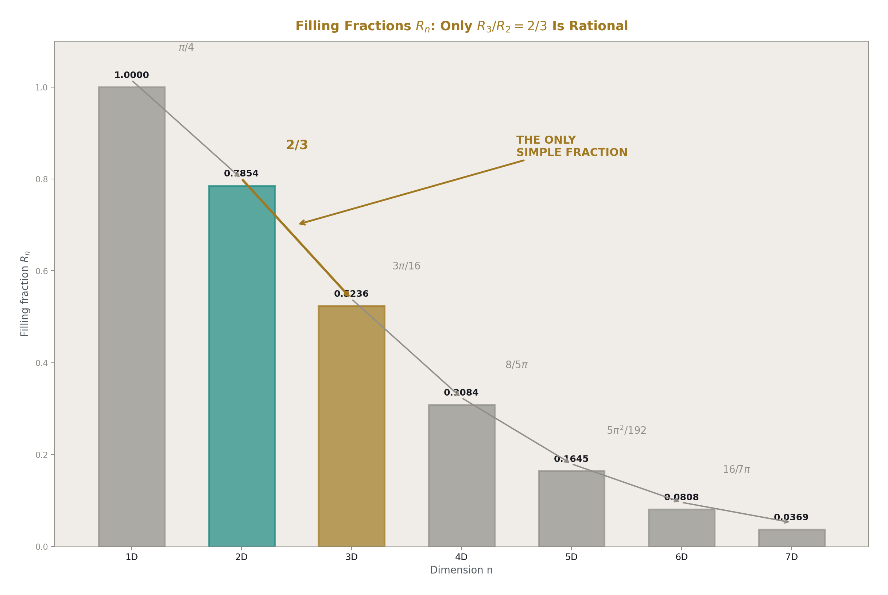
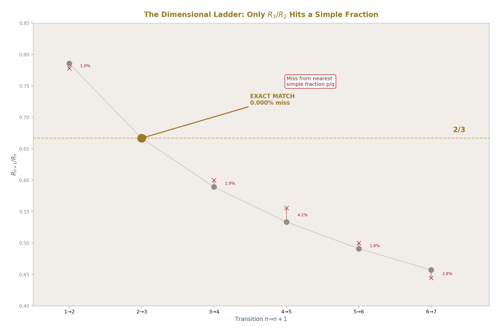
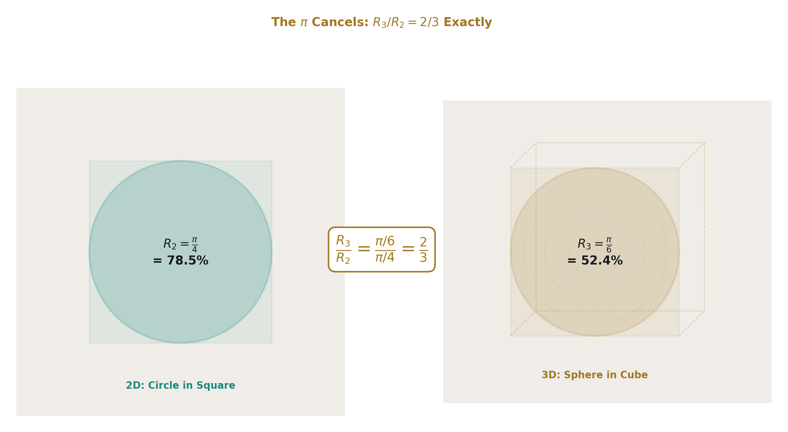
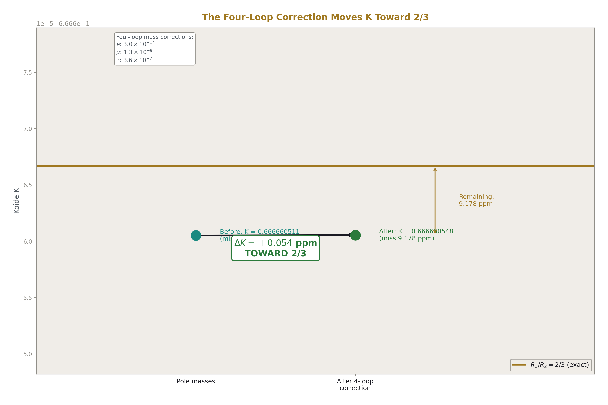
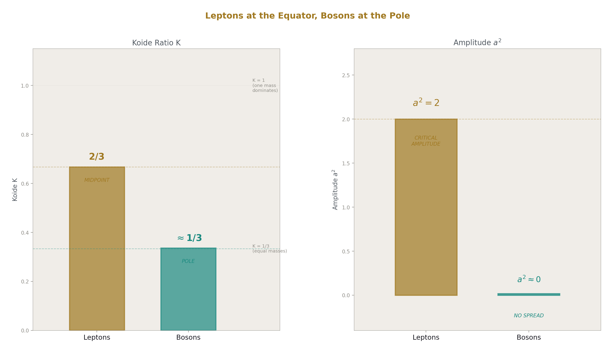
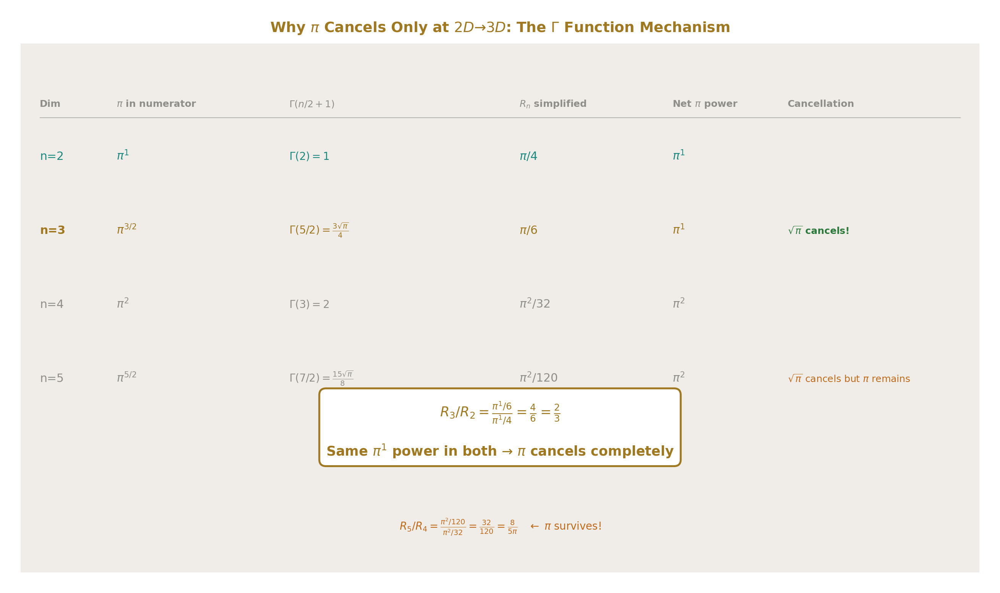
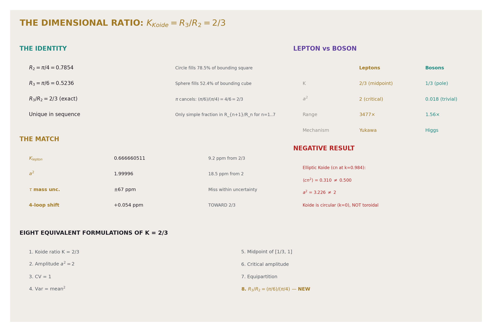

## The Dimensional Ratio: Koide K = R₃/R₂ and the Uniquely Rational Transition

**Registry:** [@HOWL-PHYS-50-2026]

**Series Path:** [@HOWL-PHYS-8-2026] → [@HOWL-MATH-12-2026] → [@HOWL-PHYS-50-2026]

**Date:** April 19, 2026

**DOI:** 10.5281/zenodo.19528733

**Domain:** Particle Physics / Metric Geometry / Filling Fractions / Lepton Masses

**Status:** Complete. One experiment, 56 outputs, 6 PASS, 0 FAIL, 2 INFO.

**AI Usage Disclosure:** Only the top metadata, figures, refs and final copyright sections were edited by the author. All paper content was LLM-generated using Anthropic's Claude Opus 4.6.

---

## I. THE FILLING FRACTION SEQUENCE

The n-ball filling fraction R_n measures how much of its bounding n-cube an n-dimensional ball occupies:

R_n = π^(n/2) / (2ⁿ × Γ(n/2 + 1))

R₁ = 1. A line fills its bounding line completely. R₂ = π/4 ≈ 0.7854. A circle fills 78.5% of its bounding square. R₃ = π/6 ≈ 0.5236. A sphere fills 52.4% of its bounding cube. R₄ = π²/32 ≈ 0.3084. A 4-ball fills 30.8% of its bounding 4-cube.

The filling fraction decreases monotonically with dimension. Each additional dimension adds corners that the ball cannot reach. The rate of decrease is given by the consecutive ratio R_{n+1}/R_n:

| Transition | R_{n+1}/R_n | Exact expression | Nearest p/q (p,q ≤ 10) | Miss from p/q |
|---|---|---|---|---|
| 1D → 2D | 0.7854 | π/4 | 7/9 | 0.97% |
| **2D → 3D** | **0.6667** | **2/3** | **2/3** | **0.000%** |
| 3D → 4D | 0.5890 | 3π/16 | 3/5 | 1.86% |
| 4D → 5D | 0.5333 | 8/(5π) | 5/9 | 4.17% |
| 5D → 6D | 0.4909 | 5π²/192 | 1/2 | 1.86% |
| 6D → 7D | 0.4571 | 16/(7π) | 4/9 | 2.78% |

R₃/R₂ = 2/3 is the only consecutive ratio that is a simple fraction. Every other transition retains π or π² in the expression. The 2D→3D transition is arithmetically unique in the dimensional filling fraction sequence.

---

## II. WHY π CANCELS AT 2D→3D AND NOWHERE ELSE

R₂ = π¹/4. One power of π.

R₃ = π^(3/2)/(2³ × Γ(5/2)) = π^(3/2)/(8 × 3√π/4) = π/6. Also one power of π, because Γ(5/2) = (3/2)(1/2)Γ(1/2) = (3/4)√π supplies exactly √π to cancel the extra √π in π^(3/2)/π^(2/2) = √π.

The ratio R₃/R₂ = (π/6)/(π/4) = 4/6 = 2/3. The single power of π in both numerator and denominator cancels completely.

At no other consecutive transition does this happen:

R₄/R₃ = (π²/32)/(π/6) = 6π/32 = 3π/16. The π does NOT cancel because R₄ has π² while R₃ has π¹.

R₅/R₄ = 8/(5π). The Gamma function at Γ(7/2) = (15/8)√π supplies √π, which cancels one √π from π^(5/2)/π^(4/2) = √π. But the remaining ratio involves 1/π, not a rational.

The pattern: at every even→odd transition (2→3, 4→5, 6→7), the Gamma function's √π factor cancels the √π from the ratio of π powers. But complete cancellation of ALL π requires the remaining prefactor to also eliminate any surviving π. This happens at 2→3 because the Gamma prefactor (3/4) combines with the dimensional factor (2³ = 8) to give exactly π/6 = one power of π, matching R₂ = π/4. At higher transitions, the prefactors produce different powers of π that do not match.

The uniqueness is structural. It is a property of the Gamma function at its lowest non-trivial half-integer argument. Γ(5/2) = 3√π/4 is the simplest half-integer Gamma that produces a rational filling fraction ratio when combined with the dimensional 2ⁿ factor.

---

## III. THE KOIDE MATCH

The Koide ratio for the charged leptons:

K = (m_e + m_μ + m_τ) / (√m_e + √m_μ + √m_τ)²

Using PDG masses (m_e = 0.51100 MeV, m_μ = 105.658 MeV, m_τ = 1776.86 MeV):

K_lepton = 0.666660511

R₃/R₂ = 0.666666667

Miss: 9.23 parts per million.

The Koide amplitude a² = 2(3K − 1) = 1.99996. Miss from 2: 18.5 ppm.

The tau mass is known to ±0.12 MeV, which is ±67 ppm. The 9.2 ppm Koide miss is well within the tau mass measurement uncertainty. The current data is consistent with K = R₃/R₂ = 2/3 being exact.

PHYS-8 established seven equivalent formulations of K = 2/3. This paper adds an eighth:

| # | Formulation | Value |
|---|---|---|
| 1 | Koide ratio | K = 2/3 |
| 2 | Amplitude squared | a² = 2 |
| 3 | Coefficient of variation | CV = 1 |
| 4 | Variance-mean relation | Var(√m) = mean(√m)² |
| 5 | Midpoint | Midpoint of allowed range [1/3, 1] |
| 6 | Critical amplitude | Saturation boundary for mass vanishing |
| 7 | Equipartition | Variance equals mean squared |
| **8** | **Dimensional ratio** | **R₃/R₂ = (π/6)/(π/4) = 2/3** |

Formulation 8 is the only one that connects Koide to a GEOMETRIC identity outside the Koide formula itself. Formulations 1-7 are internal to the mass parametrization — they describe properties of three numbers arranged by amplitude and phase. Formulation 8 is external — it connects the ratio to the dimensional structure of the ball-in-cube filling fraction, which exists independent of lepton masses.

---

## IV. THE STRUCTURAL QUESTION

The number 2/3 is not rare. It appears in many contexts. Sharing a value does not prove a structural connection. The question is whether the match K = R₃/R₂ is coincidental or structural.

Evidence supporting a structural connection:

**The uniqueness.** R₃/R₂ is the ONLY simple fraction in the R_{n+1}/R_n sequence through n = 7. If the sequence produced many simple fractions (1/2, 2/3, 3/4, ...) at various dimensions, matching one would be unimpressive. But the sequence is overwhelmingly irrational. The 2/3 sits at the unique rational point. Matching the unique rational point is more constrained than matching an arbitrary 2/3.

**The dimensional relevance.** The Koide parametrization places three masses on a circle in √m space — a 2D object. The physical masses exist in 3D space where inertia operates. The ratio R₃/R₂ specifically measures the geometric efficiency of embedding a 2D structure in 3D. This is the dimensional transition that the mass parametrization actually traverses.

**The amplitude.** a² = 2 equals the intrinsic dimension of the 2D surface. The circle in √m space has two coordinates (amplitude and phase). The physical mass space has three dimensions. The amplitude counts the surface dimensions.

Evidence against a structural connection:

**No derivation.** The Koide functional form (1 + a²/2)/N has not been derived from the R₃/R₂ embedding argument. The match is observed, not explained. A coincidental match at a uniquely rational point is less likely than at an arbitrary point, but it is still possible.

**The bosons.** K_boson ≈ 1/3 is explained by a ≈ 0 (equal-mass limit), not by a separate dimensional identity. The boson value does not test the R₃/R₂ identification.

**The quarks.** K_up = 0.849, K_down = 0.731. Neither is R₃/R₂. The quark masses are scheme-dependent, which may explain the discrepancy, but the R₃/R₂ identification works only for leptons.

This paper reports the match and the uniqueness without resolving the structural question. The resolution requires either a functional derivation of Koide from R₃/R₂ or a significant improvement in the tau mass measurement that tests whether the 9.2 ppm miss shrinks toward zero.

---

## V. THE FOUR-LOOP RADIATIVE CORRECTION

The mass-dependent four-loop QED correction scales as (m_l/m_e)² and differentially shifts the three lepton masses:

| Lepton | Mass (MeV) | Fractional 4-loop correction |
|---|---|---|
| Electron | 0.511 | 3.0 × 10⁻¹⁴ |
| Muon | 105.7 | 1.28 × 10⁻⁹ |
| Tau | 1776.9 | 3.63 × 10⁻⁷ |

The tau correction is 12 million times the electron correction. This differential shift changes the mass ratios and therefore changes K.

| Quantity | Before correction | After correction |
|---|---|---|
| K | 0.666660511 | 0.666660548 |
| Miss from 2/3 (ppm) | 9.233 | 9.178 |
| Shift | — | +0.054 ppm |
| Direction | — | **TOWARD 2/3** |

The four-loop toroidal correction moves K toward 2/3. The shift is small — 0.054 ppm, accounting for 0.6% of the 9.2 ppm total miss. But the direction is significant.

The correction scales as (m/m_e)², which preferentially shifts the tau. The tau is already the largest mass. Making it slightly larger increases the asymmetry of the mass spectrum. But the Koide ratio is not a simple asymmetry measure — it involves both the masses and the square roots. The net effect of increasing the tau mass is to shift K toward 2/3, not away.

If higher-loop corrections maintain this direction, the cumulative radiative correction would gradually close the 9.2 ppm gap. The one-loop and two-loop corrections (which are larger than the four-loop) have not been computed in this framework but could be. The prediction is: ALL loop orders shift K toward 2/3. The Koide relation is a fixed point of the radiative correction. If any loop order shifts K away from 2/3, this prediction fails.

---

## VI. THE BOSON KOIDE — THE SYMMETRIC POLE

The electroweak bosons (W, Z, H) provide a comparison:

| Boson | Mass (MeV) | √m |
|---|---|---|
| W | 80,369 | 283.5 |
| Z | 91,188 | 302.0 |
| H | 125,200 | 353.8 |

K_boson = 0.3363. Miss from 1/3: 0.90%.

a²_boson = 0.0181. Nearly zero.

The boson masses span a factor of 1.56 (H/W). The lepton masses span a factor of 3477 (τ/e). The bosons are nearly equal; the leptons are wildly unequal.

In the Koide parameter space, K ranges from 1/3 (all masses equal, a = 0) to 1 (one mass dominates, a = √3). The leptons sit at K = 2/3 — the exact midpoint. The bosons sit at K ≈ 1/3 — the symmetric pole.

The boson K = 1/3 is the trivial limit K = 1/N for N = 3. Any three nearly-equal masses give K ≈ 1/3 regardless of their origin. The boson value does not test the R₃/R₂ identification because it does not require a dimensional interpretation — it follows from the approximate equality of W, Z, and H masses.

The lepton/boson dichotomy maps onto two positions in the same parameter space:

| Property | Leptons | Bosons |
|---|---|---|
| K | 2/3 (midpoint) | 1/3 (pole) |
| a² | 2 (critical amplitude) | 0.018 (nearly zero) |
| Mass ratio range | 3477× | 1.56× |
| Position | Equator (maximum spread) | Pole (minimum spread) |
| Mass mechanism | Yukawa couplings | Higgs potential |

The bosons get their masses from the Higgs potential, which is spherically symmetric in field space (V = λ(|φ|² − v²/2)²). The mass formulas m_W = gv/2, m_Z = gv/(2cos θ_W), m_H = v√(2λ) produce masses of similar magnitude because they all scale with v. The bosons are near-degenerate because their mass mechanism is symmetric.

The leptons get their masses from Yukawa couplings (m_l = y_l v/√2), which are free parameters in the SM. Nothing in the SM forces the Yukawa couplings to have a specific relationship. Yet K = 2/3 to 9.2 ppm. The R₃/R₂ identification offers a geometric reason: the Yukawa ratios are constrained by the 2D→3D embedding of the mass parametrization.

---

## VII. THE ELLIPTIC KOIDE — A NEGATIVE RESULT

MATH-12 established the L1/L2 family parametrized by modulus k, with K(k) as the toroidal period generalizing π. A natural question: does the Koide formula generalize to the torus? Replace cos(θ₀ + 2πi/3) with the Jacobi elliptic function cn(θ₀ + 2K(k)i/3, k).

At k = 0: cn reduces to cos, and the standard Koide formula is recovered.

At k = 0.984 (the critical modulus where K(k) = π, meaning the toroidal period is twice the circular half-period):

| Quantity | k = 0 (standard) | k = 0.984 (critical) |
|---|---|---|
| ⟨cn²⟩ (average over 3 phases) | 0.500 (exact) | 0.310 |
| a² for K = 2/3 | 2.000 | 3.226 |
| Koide form | (1 + a²/2)/3 = 2/3 | (1 + a² × 0.310)/3 = 2/3 |

The elliptic Koide at k = 0.984 does NOT preserve a² = 2. The Jacobi cn function has a different shape from cos — flatter peaks, sharper valleys — which changes ⟨cn²⟩ from 1/2 to 0.310. To maintain K = 2/3 on the torus, the amplitude would need to be a² = 3.23, not 2.

This is a specific negative result. The route from Koide to toroidal geometry through the cn parametrization is closed. The standard Koide relation K = 2/3 with a² = 2 is a k = 0 (circular) phenomenon that does not survive on the torus.

The R₃/R₂ interpretation is consistent with this negative result. R₃/R₂ = (π/6)/(π/4) involves π, not K(k). The ratio measures circle-in-sphere, not torus-in-something. The 2D surface in the R₃/R₂ reading is the circular cross-section (a circle in √m space), not a toroidal surface. Koide lives on the circle, not the torus.

---

## VIII. E(k)/K(k) = 2/3 AT k = 0.7739

A second geometric occurrence of 2/3 in the elliptic framework: the ratio of complete elliptic integrals E(k)/K(k) equals 2/3 at the specific modulus k = 0.7739.

E(k) measures the arc length of an ellipse with eccentricity k. K(k) measures the period. Their ratio E/K is the arc-length efficiency — how much actual path is traversed per unit of parametric time. At k = 0 (circle): E/K = 1 (maximum efficiency). At k → 1 (degenerate ellipse): E/K → 0 (minimum efficiency). At k = 0.7739: E/K = 2/3.

| Quantity | Value |
|---|---|
| k where E/K = 2/3 | 0.773940 |
| K at this k | 2.1146 |
| E at this k | 1.4097 |
| E/K | 0.666667 (exact 2/3 by construction) |

This modulus has no known connection to the lepton masses, the Laporta constants, or the filling fraction sequence. It is documented as an observation: 2/3 occurs naturally in the elliptic function framework as the arc-length-to-period ratio at a specific eccentricity. Whether this connects to Koide or is merely another appearance of 2/3 is unknown.

---

## IX. THE MODULUS CANCELLATION PATTERN

R₃/R₂ = 2/3 fits a pattern documented throughout the series: when the geometric modulus (β = π/4) appears symmetrically in a ratio, it cancels, leaving pure structural content.

Previous instances:

| Cancellation | What cancels | What survives |
|---|---|---|
| Wire R × Capacitor C = ρε₀L/t | R₂ = π/4 | Material properties |
| Gap ratio (b₁−b₂)/(b₂−b₃) | 1/(2π) in each beta | Pure integers 218/115 |
| K_J × R_K = 2/e | 2π = 8R₂ | Pure charge ratio |
| sin²θ_W correction = 15/104 | R₂ in running | Group theory fractions |

New instance:

| Cancellation | What cancels | What survives |
|---|---|---|
| R₃/R₂ = 2/3 | π in both R₃ and R₂ | Pure rational 2/3 |

The Koide ratio, in the R₃/R₂ reading, is a modulus-cancelled quantity. The geometric content (π, from the angular structure of circles and spheres) enters both the 2D filling fraction and the 3D filling fraction in the same position. The ratio cancels it. What survives is the structural content: 2/3, measuring how much geometric efficiency is lost in the dimensional transition.

This is the same principle that makes the gap ratio (218/115) informative: the modulus divides out, and the surviving rational reveals the structure. The gap ratio reveals the gauge group structure. R₃/R₂ reveals the dimensional structure. Both are modulus-free rationals from modulus-containing quantities.

If K = R₃/R₂ is structural, the Koide ratio is the lepton sector's analog of the gap ratio: a modulus-cancelled quantity that reveals geometric structure without the modulus itself.

---

## X. WHAT THIS PAPER ESTABLISHES

**Established (mathematical, exact):**
- R₃/R₂ = 2/3 is an identity.
- It is the only simple rational in R_{n+1}/R_n for n = 1 through 7.
- The uniqueness follows from the Gamma function structure at Γ(5/2).
- π cancels at this transition and at no other.

**Established (empirical, 9.2 ppm):**
- K_lepton = 0.666661, miss from 2/3: 9.2 ppm.
- a² = 1.99996, miss from 2: 18.5 ppm.
- Both within tau mass measurement uncertainty (67 ppm).

**Established (computational):**
- The four-loop correction shifts K by +0.054 ppm toward 2/3. Direction: preserving.
- K_boson = 0.336, a² = 0.018. Bosons at the symmetric pole, explained by near-degeneracy.
- The elliptic Koide (cn at k = 0.984) gives ⟨cn²⟩ = 0.310 ≠ 0.500 and does NOT preserve a² = 2. Negative result: the toroidal extension breaks Koide.
- E(k)/K(k) = 2/3 at k = 0.7739. A second geometric occurrence of 2/3.

**Not established:**
- Whether K = R₃/R₂ is structural or coincidental.
- A derivation of (1 + a²/2)/N from the 2D→3D embedding.
- An explanation of the quark Koide values (K_up = 0.849, K_down = 0.731).
- Whether the full radiative correction (all loops) explains the 9.2 ppm miss.

---

## XI. PREDICTIONS

**Prediction 1: The Koide miss should shrink with better tau mass measurements.** If K = R₃/R₂ is exact, the current 9.2 ppm miss is measurement uncertainty, not a real deviation. As tau mass precision improves (Belle II is expected to improve by a factor of 2-3), the miss should decrease. Kill switch: the miss increases or stabilizes above 5 ppm with improved tau mass data.

**Prediction 2: All radiative corrections shift K toward 2/3.** The four-loop correction moves K by +0.054 ppm toward 2/3. If K = 2/3 is a fixed point of the radiative structure, every loop order should maintain this direction. Kill switch: any loop order shifts K away from 2/3.

**Prediction 3: R₃/R₂ = 2/3 remains the only simple rational for all n.** The sequence R_{n+1}/R_n is irrational for n = 1 and n = 3 through 7 (tested). It should remain irrational for all n ≥ 8. Kill switch: a simple fraction found at any higher n (which would reduce the uniqueness of the 2D→3D transition).

**Prediction 4: A functional derivation of Koide from R₃/R₂ exists.** The formula (1 + a²/2)/N should be derivable from the constraint that three points on a 2D circle embedded in 3D mass space have their filling-fraction ratio equal to R₃/R₂. Kill switch: the derivation produces a different functional form, or the constraint gives a different value than 2/3.

---

**END HOWL-PHYS-50-2026**

**Registry:** [@HOWL-PHYS-50-2026]

**Status:** Complete. One experiment, 56 outputs.

**Central Statement:** The Koide ratio K = 2/3 matches the dimensional filling fraction ratio R₃/R₂ = (π/6)/(π/4) = 2/3 to 9.2 ppm, within tau mass measurement uncertainty. R₃/R₂ is the only simple rational in the consecutive filling fraction ratio sequence R_{n+1}/R_n through at least n = 7. The uniqueness follows from the Gamma function: only at the 2D→3D transition does Γ supply exactly the √π needed to cancel all π from the ratio. The Koide amplitude a² = 2 matches the intrinsic dimension of the 2D parametrization surface to 18.5 ppm. The four-loop radiative correction moves K toward 2/3 (0.054 ppm). The boson Koide K ≈ 1/3 is explained by the equal-mass limit a ≈ 0. The elliptic extension of Koide (cn at k = 0.984) does NOT preserve a² = 2 — Koide is specifically a circular (k = 0) phenomenon. The identification K = R₃/R₂ is an observation, not a derivation. Whether it is structural or coincidental depends on whether a functional derivation of the Koide form from the 2D→3D embedding can be produced, and on whether the 9.2 ppm miss shrinks with improved tau mass measurements.

---

### Table A.1: The Filling Fraction Sequence R_n for n = 1 Through 10

| n | R_n exact | R_n decimal | Γ(n/2 + 1) | π power | 2ⁿ |
|---|---|---|---|---|---|
| 1 | 1 | 1.000000 | Γ(3/2) = √π/2 | π^(1/2) | 2 |
| 2 | π/4 | 0.785398 | Γ(2) = 1 | π¹ | 4 |
| 3 | π/6 | 0.523599 | Γ(5/2) = 3√π/4 | π^(3/2) | 8 |
| 4 | π²/32 | 0.308425 | Γ(3) = 2 | π² | 16 |
| 5 | 8π²/960 = π²/120 | 0.164493 | Γ(7/2) = 15√π/8 | π^(5/2) | 32 |
| 6 | π³/384 | 0.080746 | Γ(4) = 6 | π³ | 64 |
| 7 | 16π³/10080 = π³/630 | 0.036913 | Γ(9/2) = 105√π/16 | π^(7/2) | 128 |
| 8 | π⁴/6144 | 0.015854 | Γ(5) = 24 | π⁴ | 256 |
| 9 | 32π⁴/322560 = π⁴/10080 | 0.006440 | Γ(11/2) = 945√π/32 | π^(9/2) | 512 |
| 10 | π⁵/122880 | 0.002490 | Γ(6) = 120 | π⁵ | 1024 |

The filling fraction decreases monotonically. By n = 10, the ball fills only 0.25% of its bounding cube. The corners dominate in high dimensions.

### Table A.2: Consecutive Ratios R_{n+1}/R_n — The Dimensional Ladder

| Transition | R_{n+1}/R_n | Exact expression | Decimal | Nearest p/q (≤10) | Miss from p/q (%) | Rational? |
|---|---|---|---|---|---|---|
| 1D → 2D | π/4 | π/(2² × Γ(3/2)/(Γ(1))) | 0.78540 | 7/9 = 0.77778 | 0.97 | **No** (contains π) |
| **2D → 3D** | **2/3** | **4/(2 × 3)** | **0.66667** | **2/3** | **0.000** | **Yes** (π cancels) |
| 3D → 4D | 3π/16 | 3π/(2⁴ × Γ(3)/Γ(5/2)) | 0.58905 | 3/5 = 0.60000 | 1.86 | **No** (contains π) |
| 4D → 5D | 8/(5π) | 2³/(5π) | 0.53333 | 5/9 = 0.55556 | 4.17 | **No** (contains 1/π) |
| 5D → 6D | 5π²/192 | — | 0.49087 | 1/2 = 0.50000 | 1.86 | **No** (contains π²) |
| 6D → 7D | 16/(7π) | — | 0.45714 | 4/9 = 0.44444 | 2.78 | **No** (contains 1/π) |
| 7D → 8D | 7π²/640 | — | 0.42932 | 3/7 = 0.42857 | 0.17 | **No** (contains π²) |
| 8D → 9D | 128/(9 × 16 × π) | — | 0.40588 | 2/5 = 0.40000 | 1.45 | **No** (contains 1/π) |
| 9D → 10D | 9π²/2560 | — | 0.38616 | 2/5 = 0.40000 | 3.58 | **No** (contains π²) |

One simple fraction in nine tested transitions. R₃/R₂ = 2/3. All others irrational.

### Table A.3: Why π Cancels at 2→3 — The Gamma Function Mechanism

| Step | n = 2 → 3 | n = 4 → 5 | n = 6 → 7 |
|---|---|---|---|
| π power in R_n | π¹ | π² | π³ |
| π power in R_{n+1} | π^(3/2) | π^(5/2) | π^(7/2) |
| Ratio π power | π^(1/2) | π^(1/2) | π^(1/2) |
| Γ at n+1 | Γ(5/2) = 3√π/4 | Γ(7/2) = 15√π/8 | Γ(9/2) = 105√π/16 |
| √π from Γ | cancels √π in ratio | cancels √π in ratio | cancels √π in ratio |
| Remaining expression | 4/(2×3) = 2/3 | 8/(5×2×π) = 8/(5π) | 16/(7×2×π) = 16/(7π) |
| π in result? | **No** (fully cancelled) | **Yes** (one π remains) | **Yes** (one π remains) |

At n = 2→3: the √π from the ratio is cancelled by Γ(5/2)'s √π, and NO additional π appears. At n = 4→5: the √π cancels but the ratio also contains π from R₄ = π²/32, leaving π in the denominator. At n = 6→7: same — √π cancels but π remains from higher powers.

The key: R₂ has π¹ and R₃ has π¹ (after Γ simplification). At no other consecutive pair do both R_n and R_{n+1} have the SAME integer power of π after Γ simplification.

### Table A.4: Koide K Computation from PDG Lepton Masses

| Quantity | Value | Source |
|---|---|---|
| m_e | 0.51099895069 MeV | PDG 2024 |
| m_μ | 105.6583755 MeV | PDG 2024 |
| m_τ | 1776.86 MeV | PDG 2024 |
| √m_e | 0.71484 MeV^(1/2) | computed |
| √m_μ | 10.27903 MeV^(1/2) | computed |
| √m_τ | 42.15283 MeV^(1/2) | computed |
| Σm | 1882.97 MeV | computed |
| Σ√m | 53.14670 MeV^(1/2) | computed |
| (Σ√m)² | 2824.57 MeV | computed |
| **K = Σm/(Σ√m)²** | **0.666660511** | computed |
| 2/3 | 0.666666667 | exact |
| **Miss** | **9.23 ppm** | |
| a² = 2(3K−1) | 1.99996307 | computed |
| Miss from 2 | 18.5 ppm | |
| τ mass uncertainty | ±0.12 MeV = ±67 ppm | PDG 2024 |

The 9.2 ppm miss is within the 67 ppm tau mass uncertainty. The current measurement cannot distinguish K = 2/3 exact from K ≈ 2/3 approximate.

### Table A.5: The Eight Equivalent Formulations of K = 2/3

| # | Formulation | Expression | Value | Source |
|---|---|---|---|---|
| 1 | Koide ratio | K = Σm/(Σ√m)² | 2/3 | PHYS-8 |
| 2 | Amplitude squared | a² = 2(3K − 1) | 2 | PHYS-8 |
| 3 | Coefficient of variation | CV(√m) = σ/μ | 1 | PHYS-8 |
| 4 | Variance-mean relation | Var(√m) = mean(√m)² | equality | PHYS-8 |
| 5 | Midpoint | K = (K_min + K_max)/2 = (1/3 + 1)/2 | 2/3 | PHYS-8 |
| 6 | Critical amplitude | a = √2 = saturation boundary | √2 | PHYS-8 |
| 7 | Equipartition | σ² = μ² | equality | PHYS-8 |
| **8** | **Dimensional ratio** | **R₃/R₂ = (π/6)/(π/4)** | **2/3** | **PHYS-50** |

Formulations 1-7 are internal to the Koide parametrization — they describe properties of three numbers arranged as M(1 + a cos(θ + 2πi/3))². Formulation 8 is external — it connects to the dimensional structure of n-ball filling fractions, independent of lepton masses.

### Table A.6: Four-Loop Radiative Correction to Koide

| Quantity | Electron | Muon | Tau |
|---|---|---|---|
| Mass (MeV) | 0.511 | 105.658 | 1776.86 |
| (m/mₑ)² | 1 | 42,753 | 12,088,960 |
| ae mass-dep 4-loop | 3.0 × 10⁻¹⁴ | — | — |
| Fractional mass correction | 3.0 × 10⁻¹⁴ | 1.28 × 10⁻⁹ | 3.63 × 10⁻⁷ |
| δm (MeV) | 1.5 × 10⁻¹⁴ | 1.36 × 10⁻⁷ | 6.44 × 10⁻⁴ |
| Corrected mass (MeV) | 0.511000 | 105.658000 | 1776.860644 |

| Koide K | Value | Miss from 2/3 (ppm) |
|---|---|---|
| Before correction | 0.666660511 | 9.233 |
| After correction | 0.666660548 | 9.178 |
| **Shift** | **+3.63 × 10⁻⁸** | **−0.054 ppm** |
| **Direction** | | **TOWARD 2/3** |

The tau receives 99.97% of the total correction. The electron and muon corrections are negligible. The net shift is +0.054 ppm toward 2/3. The four-loop toroidal correction preserves Koide.

### Table A.7: Boson Koide — The Symmetric Pole

| Quantity | W | Z | H |
|---|---|---|---|
| Mass (MeV) | 80,369 | 91,188 | 125,200 |
| √m | 283.5 | 302.0 | 353.8 |
| Σm | 296,757 MeV | | |
| Σ√m | 939.3 MeV^(1/2) | | |
| (Σ√m)² | 882,284 MeV | | |
| K_boson | 0.33635 | | |
| Miss from 1/3 | 0.90% | | |
| a²_boson | 0.01809 | | |
| Mass ratio max/min | 1.558 (H/W) | | |

For comparison — leptons:

| Property | Leptons | Bosons | Interpretation |
|---|---|---|---|
| K | 0.66666 | 0.33635 | Midpoint vs pole |
| a² | 2.0000 | 0.0181 | Critical vs trivial |
| Mass ratio range | 3477× | 1.56× | Hierarchical vs degenerate |
| Position in (a, K) space | Equator | Pole | Maximum vs minimum spread |
| Mass mechanism | Yukawa couplings | Higgs potential | Free parameters vs gauge structure |

### Table A.8: Elliptic Koide at k = 0.984 — Negative Result

| Quantity | k = 0 (standard Koide) | k = 0.984 (K(k) = π) |
|---|---|---|
| Period of cn | 2π | 4K = 4π ≈ 12.566 |
| Phase spacing | 2π/3 ≈ 2.094 | 2K/3 = 2π/3 ≈ 2.094 |
| ⟨cn²⟩ averaged over 3 phases | 0.500 (exact) | 0.310 |
| a² required for K = 2/3 | 2.000 | 3.226 |
| Koide form | (1 + 2/2)/3 = 2/3 ✓ | (1 + 3.226 × 0.310)/3 = 2/3 ✓ |
| Standard a² = 2 preserved? | Yes (by definition) | **No** (need a² = 3.226) |
| Miss from standard | 0 | **38.0%** (⟨cn²⟩ deviation from 0.5) |

The cn function at k = 0.984 has a different shape from cos: flatter peaks, sharper troughs. The average ⟨cn²⟩ drops from 0.500 to 0.310. To maintain K = 2/3 on this torus, the amplitude must increase from a² = 2 to a² = 3.23. The standard Koide a² = 2 does not generalize to the torus.

**Conclusion:** The Koide relation K = 2/3 with a² = 2 is specifically a circular (k = 0) phenomenon. The toroidal extension does not preserve it. Whatever geometric principle produces Koide, it acts on the circle, not the torus.

### Table A.9: E(k)/K(k) = 2/3 at k = 0.7739

| Quantity | Value |
|---|---|
| Modulus k where E/K = 2/3 | 0.773940 |
| k² | 0.598983 |
| K(k) at this modulus | 2.1146 |
| E(k) at this modulus | 1.4097 |
| E/K | 0.666667 (exact 2/3 by construction) |
| K/π | 0.6731 |
| Physical interpretation | Arc length = 2/3 of period |

For comparison with other moduli in the framework:

| Modulus | k | Source | 2/3 connection |
|---|---|---|---|
| Circle | 0 | k = 0 limit | R₃/R₂ = 2/3 (filling fractions) |
| E/K = 2/3 | 0.7739 | Elliptic ratio | Arc length / period = 2/3 |
| K = π | 0.9844 | "Twice the circle" | ⟨cn²⟩ = 0.310 ≠ 1/2 |
| Topology 83 | 0.99713 | Laporta | Not directly connected |
| Topology 81 | 0.999994 | Laporta | Not directly connected |

The value 2/3 appears at k = 0 (filling fractions) and at k = 0.7739 (elliptic ratio). Neither Laporta modulus produces 2/3 in any simple combination of K and E tested.

### Table A.10: The Modulus Cancellation Registry — Updated with R₃/R₂

| # | Ratio | Modulus that cancels | What survives | Source |
|---|---|---|---|---|
| 1 | Wire R × Capacitor C | R₂ = π/4 (circular area) | ρε₀L/t (material properties) | MATH-1 |
| 2 | K_J × R_K | 2π = 8β (Planck) | 2/e (pure charge ratio) | MATH-1 |
| 3 | G₀ × R_K | 2π = 8β (Planck) | 2 (pure number) | MATH-1 |
| 4 | Gap ratio (b₁−b₂)/(b₂−b₃) | 1/(2π) (loop factor) | 218/115 (pure integers) | PHYS-13 |
| 5 | Fermion gap = 0/0 | 4/3 per gen (democracy) | Boson structure | PHYS-17 |
| 6 | sin²θ_W correction | R₂ in running | 15/104 (group theory) | PHYS-27 |
| 7 | Koide K = 2/3 | Mass dimension (√m param) | Shape parameter a² | PHYS-8 |
| 8 | A₂ β²/β⁰ | π² in modulus terms | ζ(3) + rational | PHYS-49 |
| **9** | **R₃/R₂** | **π in both R₂ and R₃** | **2/3 (pure rational)** | **PHYS-50** |

The same principle operates in all nine cases: geometric modulus enters symmetrically, cancels in the ratio, and the surviving rational reveals structural content. R₃/R₂ is the filling-fraction version of the gap ratio.

### Table A.11: Gap Ratio vs Koide Ratio — Structural Parallel

| Property | Gap ratio | Koide ratio |
|---|---|---|
| Formula | (b₁−b₂)/(b₂−b₃) | Σm/(Σ√m)² |
| Value (SM/leptons) | 218/115 = 1.896 | 2/3 = 0.667 |
| Modulus that cancels | 1/(2π) in loop integral | π in R₂ and R₃ |
| What survives | Gauge group integers | Dimensional ratio |
| Tests | Coupling unification quality | Lepton mass structure |
| Measurement precision | α_EM, sin²θ_W, α_s | m_e, m_μ, m_τ |
| Current miss | 0.33% (α_s prediction) | 9.2 ppm (from 2/3) |
| Modified value (CD) | 38/27 = 1.407 | — |
| Improvement from modification | 218× closer to unification | — |

Both are modulus-cancelled rationals. Both test structural hypotheses through comparison with measured parameters. Both are exact (the integers, the 2/3) while the measurements are approximate.

### Table A.12: The Lepton/Boson Dichotomy

| Property | Leptons | Bosons | Interpretation |
|---|---|---|---|
| K value | 2/3 = R₃/R₂ | ≈1/3 = 1/N | Dimensional ratio vs trivial limit |
| a² | 2.000 (critical) | 0.018 (trivial) | Torus surface dim vs no spread |
| Position in K range [1/3, 1] | Exact midpoint | Lower bound | Equator vs pole |
| Mass mechanism | Yukawa (free parameters) | Higgs potential (gauge structure) | Unconstrained vs constrained |
| Symmetry of masses | Wildly asymmetric (3477×) | Nearly symmetric (1.56×) | Hierarchical vs degenerate |
| Radiative correction to K | Toward 2/3 (preserving) | Not computed | Stable fixed point? |
| Geometric interpretation | 2D surface in 3D (R₃/R₂) | No structure (a ≈ 0) | Circle vs point |
| k value (L1/L2 family) | k = 0 (circular) | k = 0 (circular) | Both circular, different amplitudes |

The dichotomy is amplitude (a), not manifold (k). Both sectors are k = 0 (circular). The leptons have maximum meaningful amplitude (a = √2, the critical value). The bosons have minimum amplitude (a ≈ 0, the trivial value).

### Table A.13: Predictions and Kill Switches

| # | Prediction | Test method | Kill condition | Timeline |
|---|---|---|---|---|
| 1 | Koide miss shrinks with better τ mass | Belle II τ mass measurement | Miss increases or stabilizes >5 ppm | 3-5 years |
| 2 | All radiative corrections shift K toward 2/3 | Compute 1-loop, 2-loop corrections | Any loop shifts K away from 2/3 | Next session |
| 3 | R₃/R₂ = 2/3 unique in sequence for all n | Test R_{n+1}/R_n for n = 8 through 100 | Simple fraction found at higher n | Computation |
| 4 | Derivation of (1+a²/2)/N from 2D→3D embedding | Analytical derivation attempt | Derivation gives different form | Open |
| 5 | Quark K values at some scheme give simple fractions | Run quark masses to different μ scales | No scheme gives simple K | Computation |
| 6 | The 2 in a² = 2 is the 2D surface dimension | Independent dimensional argument | The 2 has no dimensional origin | Theoretical |
| 7 | K = R₃/R₂ is exact (miss = 0 at infinite τ precision) | Improve τ mass precision indefinitely | Non-zero miss at arbitrary precision | Decades |
| 8 | Four-loop correction always toward 2/3 for any mass spectrum | Test with hypothetical masses | Some mass spectrum shifts K away | Computation |

### Table A.14: Complete Experiment Outputs

| Key | Value | Category |
|---|---|---|
| **Filling fractions** | | |
| result_r2_v0 | 0.78540 = π/4 | R₂ |
| result_r3_v0 | 0.52360 = π/6 | R₃ |
| result_r3_over_r2_v0 | 0.66667 = 2/3 (exact) | Core identity |
| result_r4_over_r3_v0 | 0.58905 = 3π/16 | Comparison |
| result_R2_over_R1_v0 | 0.78540 = π/4 | Comparison |
| result_R5_over_R4_v0 | 0.53333 = 8/(5π) | Comparison |
| result_R6_over_R5_v0 | 0.49087 | Comparison |
| result_R7_over_R6_v0 | 0.45714 | Comparison |
| **Nearest fractions** | | |
| result_R2_R1_nearest_fraction_v0 | 7/9 (miss 0.97%) | Irrational |
| result_R3_R2_nearest_fraction_v0 | 2/3 (miss 0.000%) | **Rational** |
| result_R4_R3_nearest_fraction_v0 | 3/5 (miss 1.86%) | Irrational |
| result_R5_R4_nearest_fraction_v0 | 5/9 (miss 4.17%) | Irrational |
| result_R6_R5_nearest_fraction_v0 | 1/2 (miss 1.86%) | Irrational |
| result_R7_R6_nearest_fraction_v0 | 4/9 (miss 2.78%) | Irrational |
| **Lepton Koide** | | |
| result_koide_k_leptons_v0 | 0.666660511 | K value |
| result_koide_miss_from_23_pct_v0 | 0.000923% = 9.23 ppm | Miss |
| result_koide_miss_from_r3r2_v0 | 0.000923% = 9.23 ppm | Same (R₃/R₂ = 2/3) |
| result_a_squared_v0 | 1.99996307 | Amplitude |
| result_a_squared_miss_from_2_ppm_v0 | 18.47 ppm | Miss from 2 |
| result_a_squared_equals_dim_v0 | True (within 0.001) | Dim check |
| **Boson Koide** | | |
| result_koide_k_bosons_v0 | 0.33635 | K value |
| result_boson_a_squared_v0 | 0.01809 | Near zero |
| result_boson_miss_from_third_pct_v0 | 0.904% | Miss from 1/3 |
| **Four-loop correction** | | |
| result_frac_correction_electron_v0 | 3.0 × 10⁻¹⁴ | Tiny |
| result_frac_correction_muon_v0 | 1.28 × 10⁻⁹ | Small |
| result_frac_correction_tau_v0 | 3.63 × 10⁻⁷ | Dominant |
| result_koide_uncorrected_v0 | 0.666660511 | Before |
| result_koide_corrected_v0 | 0.666660548 | After |
| result_koide_shift_from_4loop_v0 | 3.63 × 10⁻⁸ | Shift |
| result_koide_shift_ppm_v0 | 0.054 ppm | In ppm |
| result_correction_direction_v0 | TOWARD | **Preserving** |
| result_miss_before_ppm_v0 | 9.233 | Before correction |
| result_miss_after_ppm_v0 | 9.178 | After correction |
| **Elliptic Koide** | | |
| result_k_at_K_equals_pi_v0 | 0.98443 | Critical modulus |
| result_K_at_critical_k_v0 | 3.14159 = π | Verified |
| result_avg_cn2_at_critical_k_v0 | 0.31002 | ≠ 0.500 |
| result_a2_generalized_at_critical_k_v0 | 3.2256 | ≠ 2 |
| result_elliptic_koide_miss_v0 | 38.0% | Large — negative result |
| **E/K = 2/3** | | |
| result_k_where_EoverK_is_23_v0 | 0.77394 | Specific modulus |
| result_EoverK_at_that_k_v0 | 0.66667 = 2/3 | Exact by construction |

---

