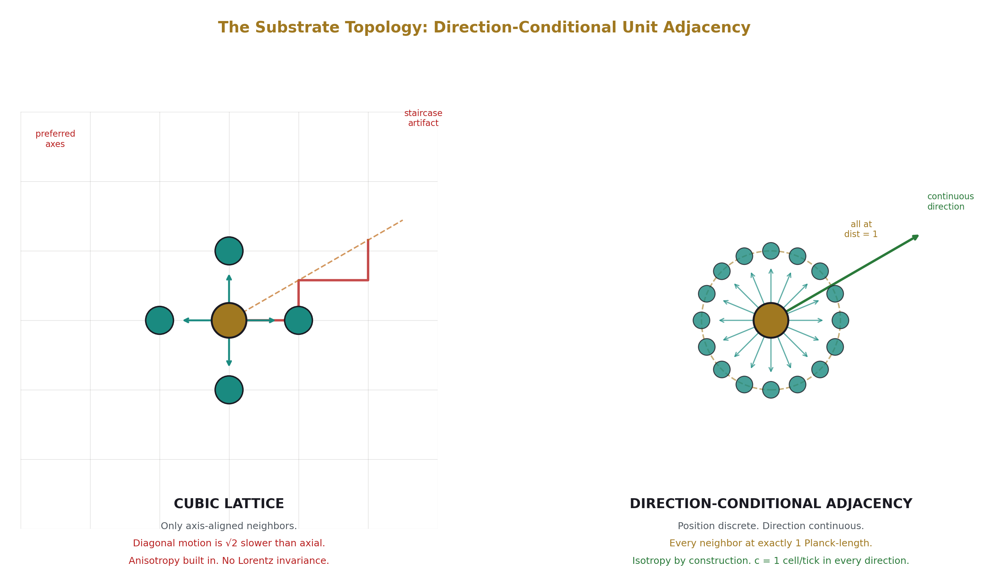
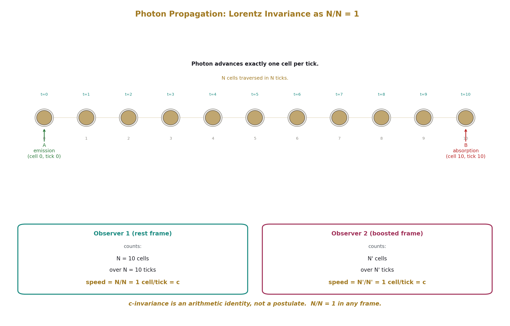
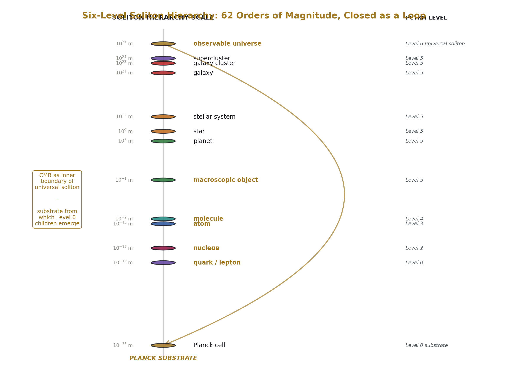
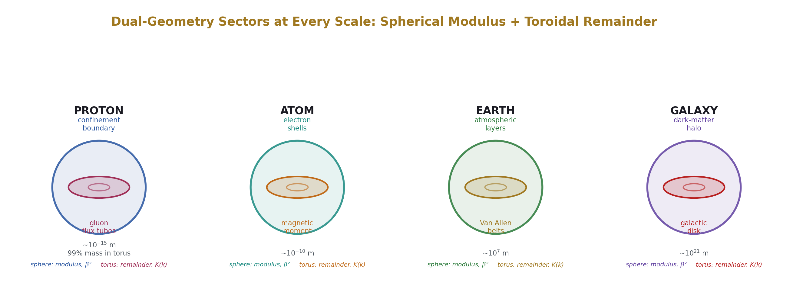
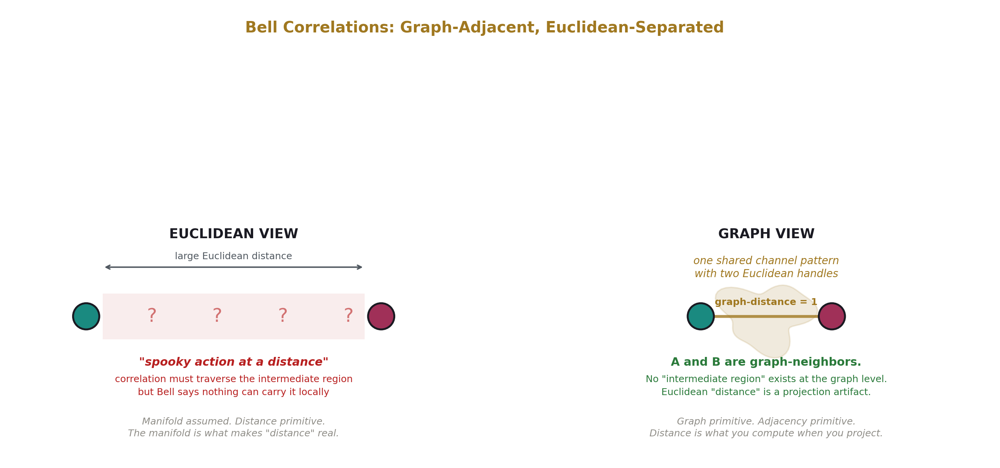
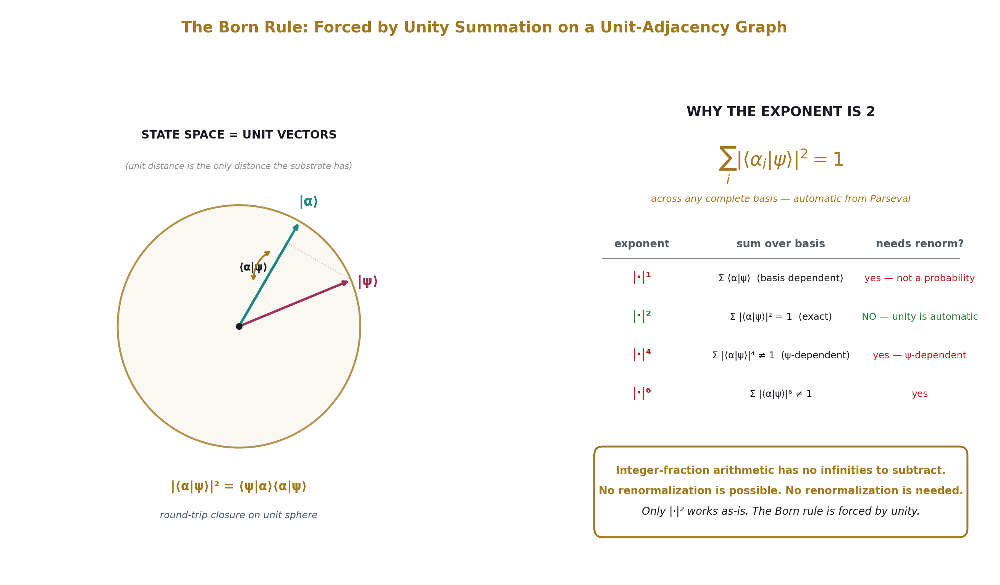
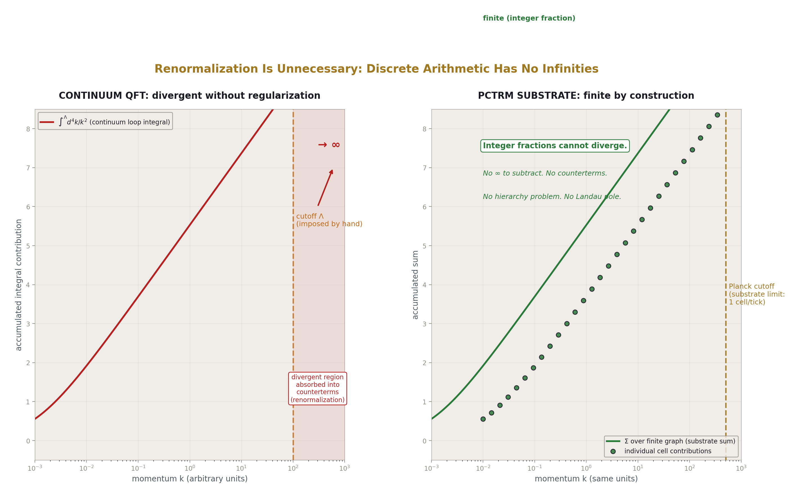
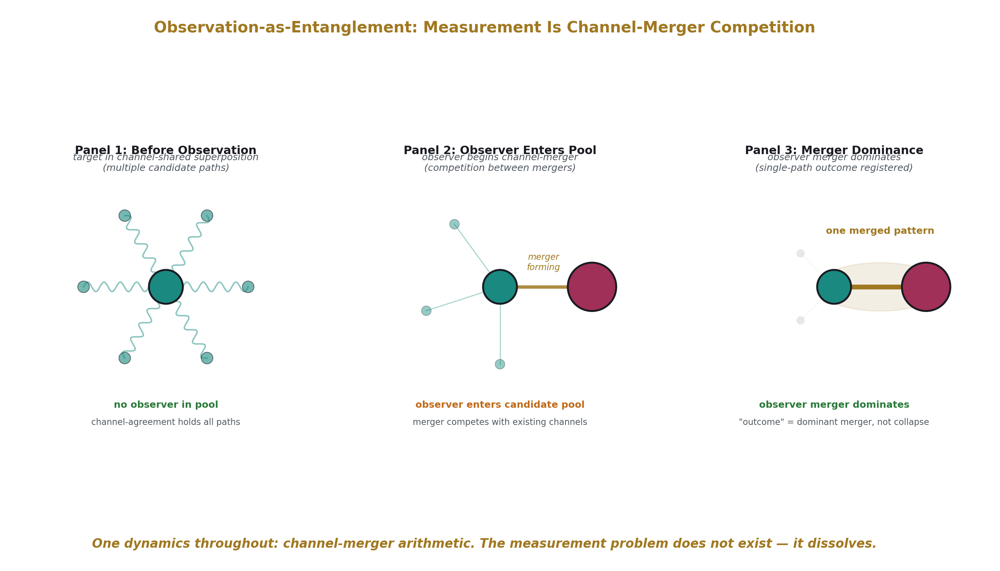

# What Is The Universe Made Of, Really?
## A Plain-Language Guide to the PCTRM Substrate Specification

**Document:** pctrm_substrate_plain_language.md
**Audience:** Science-aware readers — you know what an atom is, you've heard of quantum mechanics, you don't need equations to follow an argument
**Purpose:** Explain what PCTRM says is actually going on at the most fundamental level of reality
**Date:** April 20, 2026

---

## The Question This Paper Answers

Physics has two descriptions of reality that both work spectacularly well but have never been put together.

**Quantum mechanics** describes the very small — atoms, particles, light. It makes predictions accurate to parts per trillion. It also has weird features that have never been explained: particles that coordinate across vast distances, particles that behave as "waves" until you look at them, measurements that seem to change what's real.

**General relativity** describes the very large — gravity, the shape of spacetime, the expansion of the universe. It also makes predictions accurate to parts per trillion. It describes space and time as a smooth, continuous fabric that bends under matter.

Both theories assume spacetime is a **continuous manifold** — a smooth, infinitely divisible fabric. You can always zoom in further. There's always a halfway point between any two points. This assumption is the foundation of everything both theories say.

**PCTRM** — the Planck Cell-Tick Remainder Momentum model — proposes a different substrate. Spacetime is discrete, like the cells in a spreadsheet. At the smallest possible scale (the Planck scale, roughly 10⁻³⁵ meters), there are individual "cells" of space and individual "ticks" of time, and everything that happens is the result of arithmetic on those cells and ticks.

**This is a mechanism specification, not a replacement for the Standard Model.** PCTRM must reproduce the Standard Model's predictions at the same CODATA precision the Standard Model achieves. The electron's anomalous magnetic moment, the fine structure constant, particle masses, CKM matrix elements — all must land at measurement precision. If PCTRM can't do that, it fails. The framework is an attempt to show that a discrete substrate underlies the smooth continuum picture, and that the same phenomena emerge from both descriptions. What PCTRM adds is an account of *why* certain Standard Model features have the forms they do — why the Born rule has squared magnitude, why Bell correlations work at arbitrary distance, why measurement looks like "collapse."

This document explains what the substrate is and how it produces what we observe.

---

## The Setup: Cells, Ticks, and Neighbors

Imagine the universe as an enormous three-dimensional grid. Each little box in the grid is a "cell" — the smallest possible chunk of space. Time advances in "ticks" — the smallest possible duration. At each tick, the whole universe updates.

So far, this sounds like previous "discrete universe" ideas — digital physics, cellular automata, Wolfram's hypergraph programs. These hit the same wall: a cubic grid has **preferred directions**. If you try to move along a diagonal, you take a staircase through cells, which is slower than moving along an axis. Light would travel faster along cardinal directions than diagonally. But light doesn't do that in reality — it travels the same speed in every direction.

PCTRM's technical move:

**Position is discrete. Direction is continuous.**

In PCTRM's grid, each cell has a neighbor at a distance of exactly one Planck-length in **any direction** you point. Not just axis directions — any continuous direction on the sphere of possibilities. Which cell counts as your "next" cell depends on which way you're heading. This is called **direction-conditional adjacency**.

On the left: a standard grid. Neighbors are locked to axes. Diagonal motion requires a staircase. This produces preferred directions — the universe would have anisotropy baked in.

On the right: direction-conditional adjacency. Every neighbor is at exactly unit distance. Direction is continuous. There are no preferred axes. Light can travel in any direction at the same speed. Isotropy is built into the topology rather than imposed on it.

This one move is the most consequential technical choice in the whole framework. Everything else follows from it.

---

## How Light Moves, and Why It's Always the Same Speed

In PCTRM, a photon advances exactly one cell per tick. That's what the speed of light *is* at the substrate level — one cell per tick. The number 299,792,458 meters per second is just the conversion into human units.

Because speed is defined this way, something specific happens with the question of why every observer measures the same speed of light regardless of how fast they're moving.

Imagine a photon emitted at cell A and absorbed at cell B. There are exactly N cells between them. The photon takes exactly N ticks to get there. Any observer who counts cells traversed and ticks elapsed gets N divided by N, which equals 1. One cell per tick. The arithmetic identity holds for the photon's propagation regardless of who's counting.

In standard physics, the constancy of the speed of light is a **postulate** — something we assume and then derive consequences from. In PCTRM, for the photon case, it's an **arithmetic identity**. N divided by N is 1.

This argument handles photon propagation. The companion piece — why observers moving at different speeds measure the same c for light, which requires their clocks and rulers to scale together in just the right way — isn't yet reduced to substrate arithmetic. Full Lorentz invariance has two halves; the photon half is in hand, the observer half is execution-pending. The framework is explicit about this.

---

## The Universe Is Made of Patterns Within Patterns

PCTRM organizes reality into a hierarchy. Everything is a "soliton" — a stable, self-sustaining pattern of cells, ticks, and interactions. Think of a standing wave in a pond: the individual water molecules come and go, but the wave pattern persists. A soliton is a standing-wave-like pattern in the substrate's arithmetic that maintains itself over time.

Electrons are solitons. So are protons. So are atoms, molecules, planets, stars, galaxies — and the entire observable universe. The universe is the largest soliton, and all smaller solitons exist inside it as nested patterns.

The vertical axis spans 61 orders of magnitude — from Planck cells (10⁻³⁵ meters) to the observable universe (10²⁶ meters). The same vocabulary (soliton, cell, tick, channel, remainder) applies at every level. A proton and a galaxy obey the same substrate rules at wildly different scales.

The framework's claim is that this cross-scale universality is not a coincidence and not a metaphor. The same integer alphabet (numbers like 12, 13, 22, 264) that produces cosmological parameters also produces particle-physics parameters. The same mechanism that makes protons produces galaxies. Scale differs; substrate rules don't.

This is the parallel-isomorphism claim: PCTRM must produce Standard Model predictions at every hierarchy level. Not replace them — reproduce them through a different route.

---

## Every Pattern Has Two Shapes: Sphere and Torus

One of PCTRM's structural claims is that **every soliton, at every scale, has two geometric components**:

- A **spherical** component (the framework calls this the "modulus")
- A **toroidal** component (the framework calls this the "remainder")

Toroidal means related to torus-shaped mathematics — like the donut-shape of a torus, though not literal donuts inside particles. The toroidal component refers to features of the channel arithmetic that behave mathematically like integrations around torus-shaped paths.

A proton has a roughly spherical confinement boundary (the outer "shell" of what counts as the proton) and inside it, flux-tube structures made of gluons that carry about 99% of the proton's mass. The spherical boundary is the modulus; the flux tubes have toroidal topology.

An atom has roughly spherical electron shells (modulus) and a magnetic-moment structure with toroidal character (remainder).

The Earth has roughly spherical atmospheric layers (modulus) and the Van Allen radiation belts with toroidal structure (remainder).

A galaxy has a roughly spherical dark-matter halo (modulus) and a disk with toroidal character (remainder).

The framework's claim is that this two-sector decomposition appears at every scale because both are forced by the substrate's arithmetic. The spherical component is produced by angular operations on spherical subspaces; the toroidal component by operations on topological tori. Different probes see different sectors. Long-wavelength probes see spherical. Short-wavelength high-energy probes see toroidal.

In quantum electrodynamics at the four-loop level of precision, the framework predicts a crossover around 22 MeV where spherical and toroidal dominance trade places. The electron (at 0.5 MeV) shows spherical dominance; the muon (at 106 MeV) shows toroidal dominance with a 2304% amplification over the universal spherical contribution. Tau measurements at current muon-g-2 precision would test this further — the framework predicts an overwhelming toroidal signature for tau.

---

## Why Bell Correlations Aren't Spooky

In 1935, Einstein, Podolsky, and Rosen pointed out that quantum mechanics seems to allow "spooky action at a distance" — two particles separated by any amount of space seem to coordinate their behavior when either is measured. Einstein thought this was so bizarre it must mean quantum mechanics was incomplete.

In 1964, John Bell proved the coordination is real and can't be explained by local hidden variables. Experiments since then (Aspect 1982, Hensen 2015, and many others) have confirmed the coordination happens at distances and timescales where no light-speed signal could coordinate them.

PCTRM's answer: **they aren't separated in the way we think they are**.

On the left: the standard picture. Two particles, far apart. Some influence has to cross the intermediate space. Bell proved nothing local can do it. So the effect is "spooky."

On the right: PCTRM's picture. The two particles share channel substrate — they are **one pattern with two Euclidean handles**. At the substrate's graph level, they're neighbors. The "distance" between them that makes the coordination look spooky is a projection artifact of how the graph folds into the 3D space we observe.

The framework's claim: the substrate is a graph with direction-conditional adjacency plus channel edges. Some channels connect cells that, in the 3D projection, appear far apart. When two particles are "entangled," they share channel substrate — they are graph-neighbors regardless of how far apart they look to us.

Nothing violates relativity. No-signaling still holds: you can't transmit information faster than light through this shared substrate because the merger is symmetric — there's no sender and receiver, just two handles on one shared pattern. A sender-receiver structure requires directional asymmetry that the symmetric merger doesn't have. All the experimental confirmations of quantum mechanics still work.

What changes is the explanation: the apparent non-locality is structural, not a new kind of force. "Distance" in 3D space isn't what the correlation is traversing, because the correlation doesn't need to traverse anything.

This reframes Bell's theorem. Bell proved local hidden variables can't work *given a manifold as the background*. PCTRM questions the manifold, not locality. The substrate is local in graph terms; what we observe as non-locality is the projection of graph-adjacency into 3D space.

---

## The Born Rule Is Structural

In quantum mechanics, when you measure a particle, you get an outcome with some probability. The rule for calculating that probability is the Born rule: the probability is the squared magnitude of an amplitude.

Why squared? Why not linear, cubed, or some other function? Standard quantum mechanics doesn't say. The Born rule is a postulate — accepted, then built upon.

PCTRM derives its structural form from the substrate.

The derivation in plain terms:

**1. The substrate only has unit distances.** Every adjacency is exactly one Planck-length. Direction states — "which way is this pattern pointing" information — automatically live on unit spheres, because unit is the only distance the substrate can represent. This means the state space PCTRM produces *starts* on the unit sphere that standard quantum mechanics has to postulate.

**2. Measurements are projections onto basis directions.** When you measure something in a particular basis, you're asking "how much of this state lies along this direction?" The substrate answers by projecting the channel's state onto the basis direction.

**3. Round-trip closure produces squared magnitude.** A one-way projection (just asking "how much?") gives you an amplitude, which can be negative or complex-valued. That's not a probability — probabilities are non-negative real numbers. To get a real positive number, you go from the state to the basis direction and back — a round trip. The round-trip operation produces squared magnitude, because it's "forward projection times conjugate closure."

**4. The exponent counts conversions.** In the framework's mathematics, the exponent 2 counts the forward-and-back conversion. Standard QED loop calculations show exponent counting is real at measurement precision (PHYS-49 documents this at parts per million). The same mechanism that counts angular integrations in QED counts round-trip closure in measurement.

So the Born rule's squared magnitude isn't a mystery in PCTRM. It's the structural form that round-trip measurement on a unit-adjacency graph has to produce. The exponent is forced by counting the operations.

Reproducing *specific* measurement probabilities — say, a particular Malus-law or CHSH result — requires the channel's state structure to be specified concretely enough to compute with. That part is execution-pending. The structural form is derived; the numerical content awaits the full channel-state specification.

---

## Why There Are No Infinities

Standard quantum field theory has a well-known problem: many of its calculations produce infinities.

When you calculate particle interactions, you add up contributions from all possible intermediate states. In continuous spacetime, those intermediate states have momentum that can take any value up to infinity. The sum diverges.

Physicists handle this with **renormalization**: a procedure that absorbs the divergent parts into redefinitions of the theory's constants, leaving finite predictions. It works — QED is the most precisely tested theory in science — but physicists have always been uncomfortable with it. Dirac called renormalization "a disgusting procedure." Feynman called it "a shell game." Everyone uses it because nothing else works, but it feels like subtraction of infinities.

PCTRM doesn't encounter this problem because **integer arithmetic on a finite graph can't diverge**.

On the left: the standard QFT integral, running over continuous momentum up to infinity. Diverges. Requires a cutoff.

On the right: the PCTRM substrate sum, running over a finite graph. Maximum momentum is the Planck momentum (one cell per tick). The finite graph has no infinity to absorb.

This is a structural feature rather than a completed result. The framework says that if substrate computations reproduce Standard Model predictions, they'll do so without renormalization because the infinities were artifacts of the continuous-manifold assumption. Whether PCTRM can actually reproduce specific QED calculations through finite substrate arithmetic — and land at the same measured values — is Round 1 execution work. The path to the solution is visible; the completed derivation is not yet in hand.

If this carries through, several long-standing problems simplify:

- The **hierarchy problem** (why is the Higgs so much lighter than the Planck scale?) would have no runaway corrections to explain, because the substrate-level integrals are bounded by construction.
- The **cosmological constant problem** (why is vacuum energy so much smaller than QFT predicts?) would have a specific finite answer — the framework proposes Ω_Λ = (251−22π)/264, which matches Planck at 85 ppm.
- The **Landau pole** (why does QED's coupling diverge at finite energy?) would have no divergence because couplings are channel counts, which are bounded.

These aren't solved; they're structurally addressed. The framework commits to producing finite answers through specific substrate computations, and whether those computations land at measured values is what the tests will show.

---

## Measurement Is Channel-Merger, Not Collapse

Quantum mechanics has two dynamics.

Between measurements, states evolve smoothly according to the Schrödinger equation — deterministic, reversible. At measurement, states "collapse" into a specific outcome — probabilistic, irreversible. Collapse is not derivable from evolution. They're two different kinds of dynamics glued together.

This raises: **when does measurement happen?** Standard QM doesn't say. The "Heisenberg cut" between quantum system and classical apparatus is placed by convention. Copenhagen declares the cut primitive. Many-worlds denies collapse by multiplying universes. Bohmian mechanics adds hidden particle positions. Each interpretation picks a different answer.

PCTRM's approach: **one dynamics, not two**. Measurement is not a separate event.

Here's what happens when you "measure" something in PCTRM:

**Panel 1.** The target soliton has channels linking it to other solitons — perhaps to another entangled particle, perhaps to various environmental structures. Multiple potential outcomes are represented as channel-agreement configurations across alternatives.

**Panel 2.** An observer enters. The observer is just another soliton — a photographic plate, a detector, a human. No special status. The observer's channels begin to merge with the target's channels. This new channel-merger competes with the existing channel configurations.

**Panel 3.** The observer's merger wins — its channel-merger dominance outcompetes the prior channel arrangement. A single outcome is recorded. The observer and target share channel substrate from this point on.

No second dynamics. No collapse rule glued onto evolution. Just channel-merger competition between solitons, with the strongest merger resolving the configuration. "Measurement" is a name for the pattern where environmental channel-mergers become strong enough to outcompete isolated coherence.

This dissolves the measurement problem as a problem. Copenhagen, many-worlds, Bohmian — these interpretations were all trying to reconcile two dynamics. PCTRM has one dynamics.

It also dissolves wave-particle duality. In a double-slit experiment without an observer at the slits, channel agreement resolves across multiple candidate paths, producing the interference pattern at the termination event (absorption at the screen). With an observer at a slit, the observer enters the candidate pool, resolving agreement to a single path and producing the particle pattern. Same substrate dynamics, different configuration. Nothing is "both wave and particle." The channel structure produces wave-pattern outcomes when multiple paths contribute and particle-pattern outcomes when an observer participates in the resolution.

This is a significant reframing of measurement. The framework's claim is that it reproduces standard QM predictions exactly — same Born rule probabilities, same CHSH violation at Tsirelson bound, same no-signaling — while dissolving the conceptual question of "when does collapse happen" by replacing collapse with continuous channel-merger competition.

---

## A Note on Mass

The framework's account of mass is worth stating directly because it's often simplified in misleading ways.

Mass is not a "tax on existence" or a cost that some particles pay while others don't. In PCTRM, mass corresponds to **remainder drain** — specifically, remainder channels from a parent soliton applying negative remainder (drain) to child solitons or to other channels within the parent's influence. The vector direction of the drain is toward the parent soliton's center.

This is visible most clearly for gravity. The Moon's orbit around Earth is a trajectory where Earth (the parent soliton) applies a negative-remainder update to the Moon each tick, directed radially toward Earth's center. The Moon's remainder accumulation, combined with the drain, produces orbital motion. The drain-toward-parent-center is what gravity is at the substrate level.

Inertial mass — the resistance to acceleration — comes from the soliton's remainder structure resisting direction changes. A more massive soliton has more remainder-structure that needs to be updated; changing its direction costs more ticks.

Photons are massless because they don't participate in this remainder-drain structure in the relevant way — they travel cell-per-tick and don't carry the remainder accumulation that produces inertial resistance.

This is a mechanism description, not a derivation. Deriving specific particle masses from first principles — the electron mass, the muon mass, the proton mass — is part of Round 1 execution work. The mechanism is specified; the numerical predictions at CODATA precision are pending.

---

## What This Framework Is Claiming

To summarize the substrate specification:

**1. Spacetime is discrete.** Planck cells and Planck ticks. Between ticks nothing happens; at each tick the whole universe updates.

**2. Adjacency is direction-conditional.** Each cell has neighbors at unit distance in any direction. Position is discrete; direction is continuous.

**3. Everything is a soliton.** Electrons, atoms, planets, galaxies, the universe — self-sustaining patterns in cell-tick arithmetic, organized as a nested hierarchy.

**4. Every soliton has two sectors.** Spherical (modulus) and toroidal (remainder). Different probes resolve different sectors.

**5. Interactions are channels.** Gravity, electromagnetism, the strong force, the weak force, and entanglement are all types of channels connecting solitons.

**6. Mass is remainder drain.** Parent solitons apply negative remainder to children, directed radially. This produces gravity, inertia, and the rest of what we call "mass."

**7. The speed of light is one cell per tick.** For photons, frame-independence follows from N/N = 1. Observer time dilation is pending.

**8. Channels can connect non-adjacent cells directly.** Entangled particles share substrate — graph-neighbors regardless of Euclidean separation. Apparent Bell non-locality is a projection effect.

**9. The Born rule has structural form.** Round-trip closure on unit-adjacency graphs produces squared-magnitude probabilities. The exponent 2 counts conversions.

**10. The substrate doesn't produce infinities.** Integer arithmetic on finite graphs is bounded. Renormalization is a consequence of the continuum assumption.

**11. Measurement is channel-merger.** One dynamics, not two. Observer participation displaces prior channel configurations. Collapse is not separate physics.

**12. Standard Model predictions must reproduce at CODATA precision.** This is a mechanism specification, not a replacement. Particle masses, coupling constants, gauge structure, CKM elements — all must land at measurement precision through substrate derivation paths. Execution-pending.

**13. General relativity predictions must reproduce at measurement precision.** 1/r² from spherical channel spreading; Mercury precession, light bending, Shapiro delay from toroidal content at probe-scale resolution. Also execution-pending.

---

## What Hasn't Been Proved Yet

The framework is explicit about what's been demonstrated and what hasn't.

**What's been tested:**

- Round 0 ran 16 substrate-consistency checks simultaneously, and 15 landed at framework-specified precision. Four specific cosmological identities — dark energy fraction, dark matter fraction, dark-matter-to-baryon ratio, and a microscopic-cosmic bridge identity — reproduced at their originally published precisions (85 ppm, 9.2 ppm, 725 ppm, 300 ppm) when computed fresh from substrate primitives. No kill switches fired.
- The speed-of-light invariance for photon propagation reduces to an arithmetic identity (N/N = 1).
- Some QED four-loop calculations produce specific elliptic-function structures, validated by cross-derivation at parts-per-million precision.

**What's execution-pending:**

- Deriving particle masses from first principles at CODATA precision
- Deriving 1/r² gravity quantitatively from spherical channel geometry
- Reproducing GR corrections (Mercury precession, factor-of-2 light bending, Shapiro delay, gravitational waves)
- Deriving CHSH Bell correlation values from channel-merger arithmetic at measurement precision
- Deriving the fine structure constant from channel counting
- Observer time dilation (as opposed to photon c-invariance)
- Single-particle interference quantitative predictions

The framework has committed to Round 1 — a coordinated program of ten specific tests with pre-registered precision thresholds. If the tests produce values matching measurement, the substrate picture is validated at mechanism level. If they fail, the specific mechanisms are falsified. The kill conditions are stated explicitly and can't be adjusted after the fact.

The framework tried one validation method earlier and retired it after it didn't work — PSLQ searches for integer relations returned 41 consecutive null results across the program's history, so the framework switched to cross-derivation, producing the same value through multiple independent framework paths and checking for convergence at measurement precision. This methodological honesty about what worked and what didn't is unusual for alternative-physics programs.

---

## Why This Might Matter

If PCTRM's substrate picture carries through — reproducing Standard Model predictions at CODATA precision through discrete-substrate derivations — the consequences are:

1. **The foundations of quantum mechanics get structural explanations.** Unit-sphere state spaces, the Born rule, entanglement, measurement collapse — stop being postulates and become consequences of graph structure.

2. **The continuum infinities go away.** Renormalization stops being necessary. The hierarchy and cosmological constant problems get substrate-level answers.

3. **Gravity and quantum mechanics operate on the same substrate.** Two theories that have resisted unification for a century both become channel arithmetic on the same graph.

4. **The interpretation problem dissolves.** Standard QM's two dynamics reduce to one. Copenhagen-vs-many-worlds-vs-Bohmian debates become moot.

5. **Cross-domain predictions become possible.** Same integer alphabet producing both cosmological parameters and particle-physics parameters — one substrate, not two frameworks.

If PCTRM is wrong, the benefits evaporate, but the framework has been specific enough about what would falsify it that the failure itself would be informative. A reader would know exactly which pieces of the substrate picture failed at which precision levels.

---

## What PCTRM Does Not Claim

The framework is silent on several questions:

- What the substrate is "made of" beneath the cells — whether there's anything — is outside scope.
- Why the specific integer alphabet (13, 22, 264, 251, etc.) rather than some other alphabet isn't explained; the framework notes these integers work and leaves why they work for future investigation.
- Consciousness, meaning, free will — the framework is silent on these.
- Whether the universe had a beginning, or what (if anything) is outside the universal soliton — not addressed.

PCTRM is a substrate physics specification, not a theory of everything. It offers a mechanism for how observed physics arises from discrete-substrate operations, and commits to specific predictions at measurement precision. Philosophical questions beyond the mechanism are not what the framework tries to answer.

---

## What To Take Away

PCTRM is an attempt to specify a discrete substrate — Planck cells updated at Planck ticks through integer arithmetic on channels connecting solitons — that underlies the smooth spacetime continuum of standard physics. The direction-conditional adjacency is the technical move that makes it possible to be both discrete and isotropic. Everything else follows from that plus channel-mediated adjacency extension.

This is a mechanism specification that must reproduce the Standard Model's predictions at CODATA precision. Not replace them. Not change their numerical content. Reproduce the same measured quantities through discrete-substrate derivation paths, demonstrating that the continuum picture is the smooth approximation of a discrete substrate rather than fundamental.

What's new in PCTRM lives in the ontology — what the universe *is* — rather than in new particles, new forces, or revised measurements. The Standard Model predictions are accepted as targets. The substrate is proposed as the mechanism underneath them. The question is whether PCTRM can produce those same values through substrate operations and whether the reproduction illuminates features (Born rule, Bell correlations, measurement) that standard physics leaves as postulates.

The tests that will validate or falsify this are listed explicitly with specific precision thresholds in the Round 1 program. Results will come in subsequent papers with real data. This paper explained what the framework claims the substrate is. The next papers will show whether the claim holds up against measurement.

---

*End of pctrm_substrate_plain_language.md. This document accompanies figures produced by the PCTRM substrate diagram script. Intended for readers who want to understand what the framework claims at the level of structural commitments rather than mathematical formalism.*
