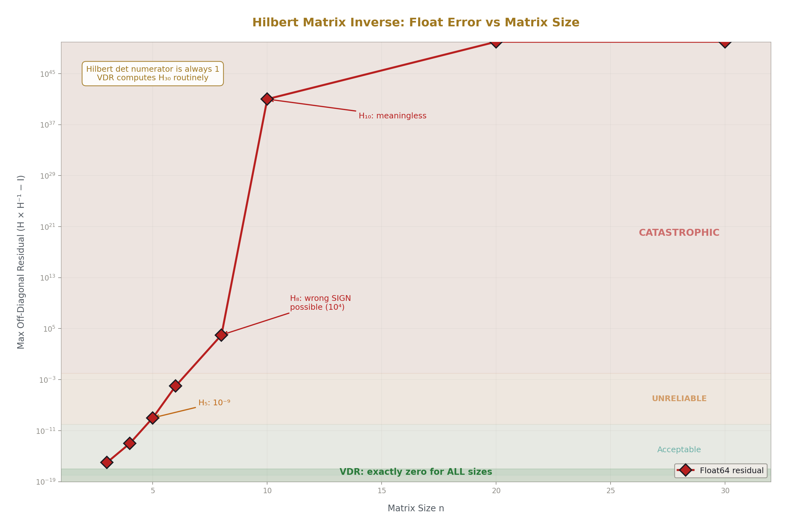
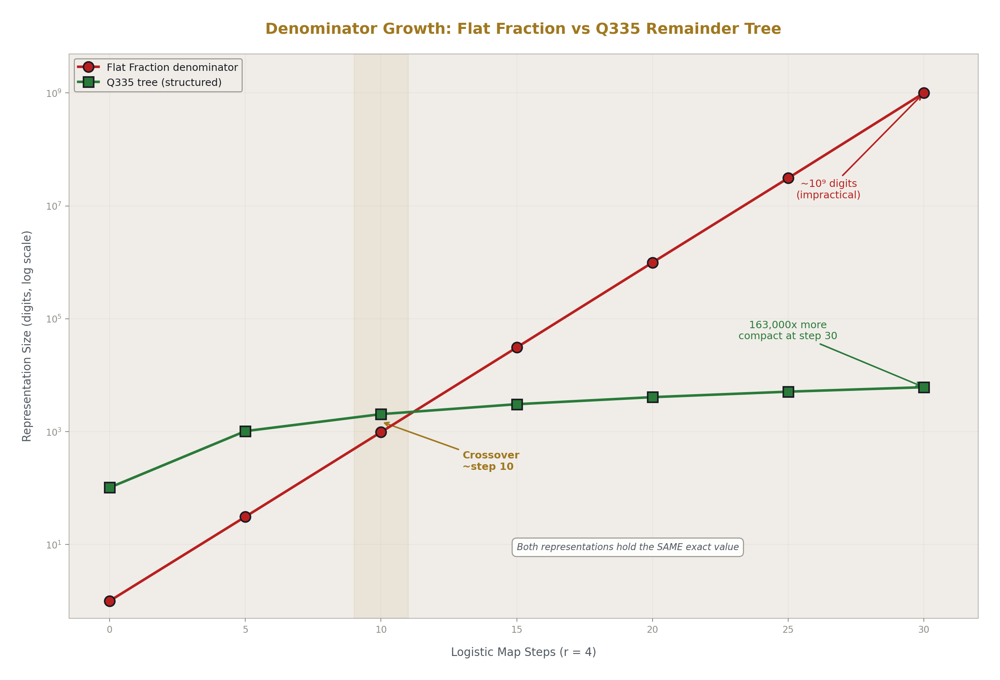
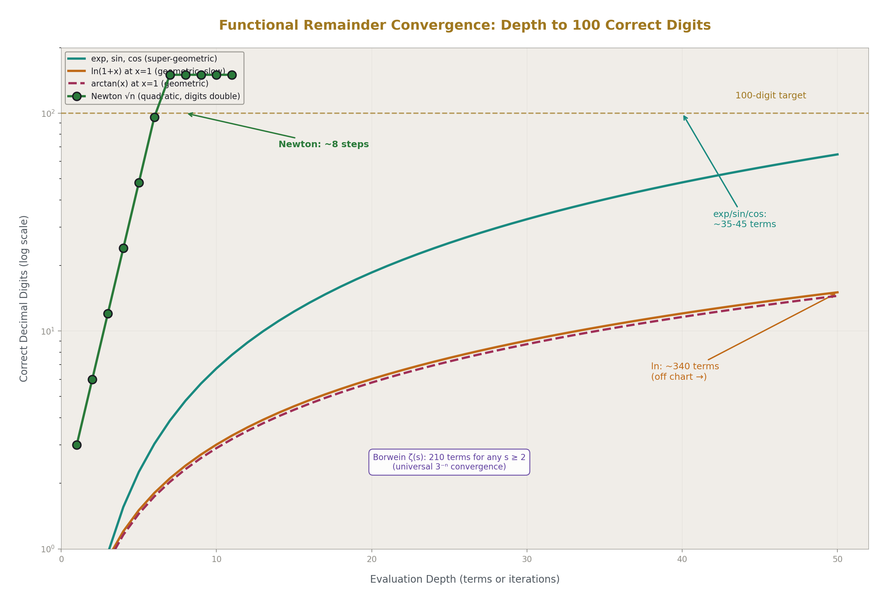
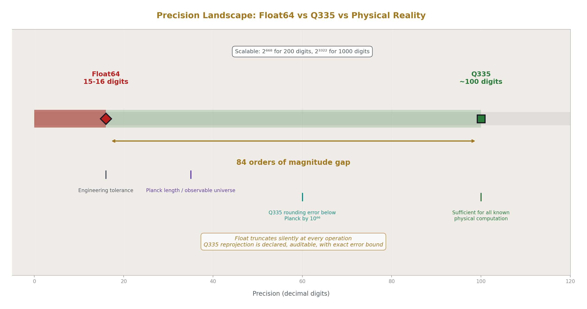
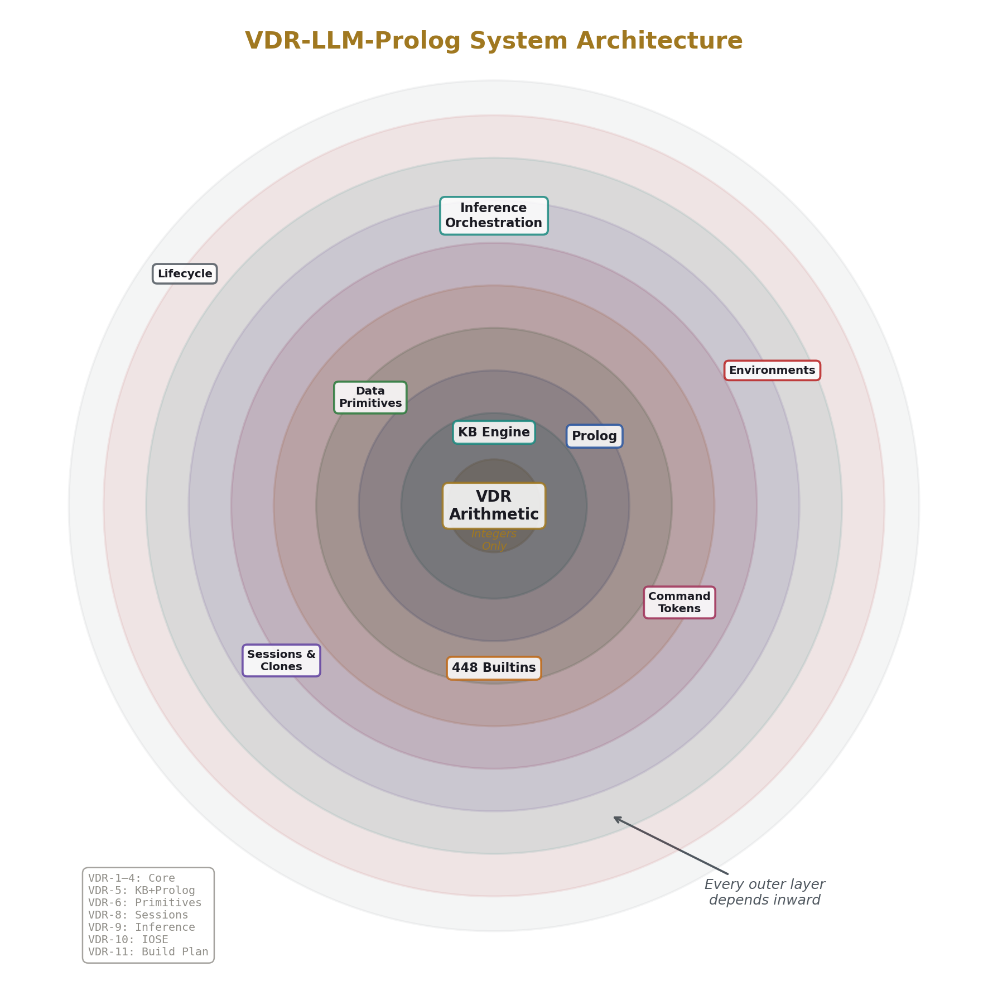
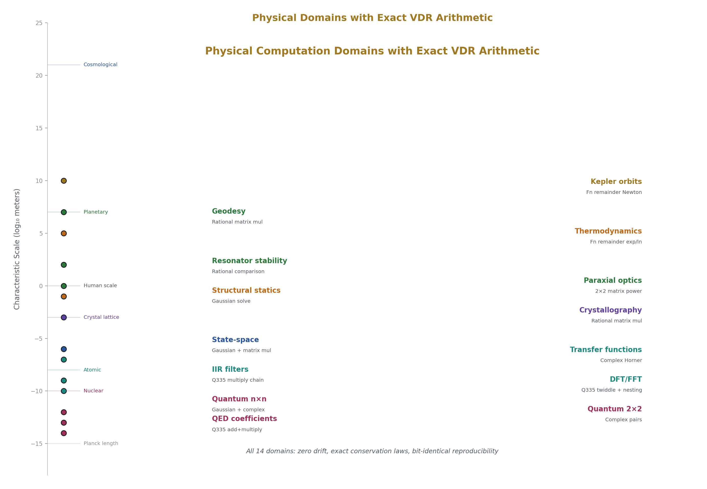
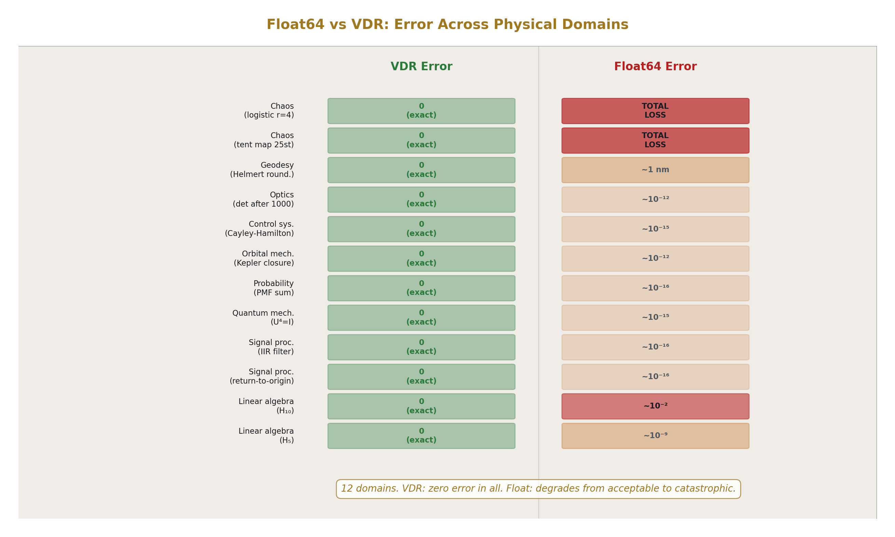
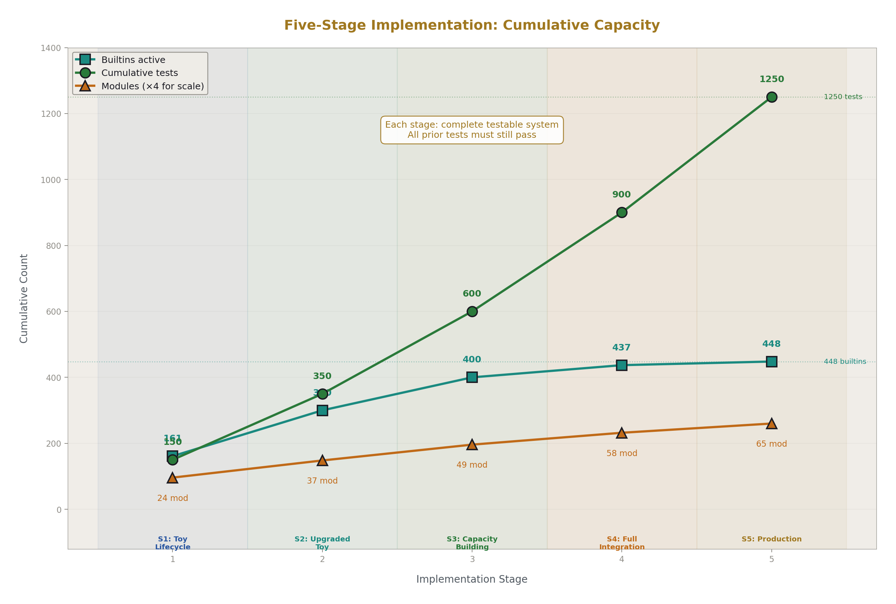

# VDR-LLM-Prolog
## A Complete System Specification for Exact Arithmetic Language Models with Structural Provenance

**Registry:** [@HOWL-VDR-14-2026]

**Series Path:** [@HOWL-VDR-1-2026] → [@HOWL-VDR-2-2026] → [@HOWL-MATH-3-2026] → [@HOWL-MATH-4-2026]  → [@HOWL-VDR-3-2026] → [@HOWL-VDR-4-2026] → [@HOWL-LLM-1-2026] → [@HOWL-VDR-5-2026] → [@HOWL-VDR-6-2026] → [@HOWL-VDR-7-2026] → [@HOWL-VDR-8-2026] → [@HOWL-VDR-9-2026] → [@HOWL-VDR-10-2026] → [@HOWL-VDR-11-2026] → [@HOWL-VDR-12-2026] → [@HOWL-VDR-13-2026] → [@HOWL-VDR-14-2026]

**DOI:** 10.5281/zenodo.zzz

**Date:** May 2026

**Domain:** Applied Philosophy / Computational Linguistics

**AI Usage Disclosure:** Only the top metadata, figures, refs and final copyright sections were edited by the author. All paper content was LLM-generated using Anthropic's Opus 4.6.

---

## Abstract

This paper consolidates thirteen prior technical specifications into a single document describing the VDR-LLM-Prolog system: an architecture for language models built on exact integer arithmetic, structural knowledge management, deterministic computation primitives, and orchestrated inference. The system replaces floating-point arithmetic with Value-Denominator-Remainder triples that preserve exact results through arbitrary operation chains, replaces stateless conversation with a scoped knowledge base tree addressable by integer, replaces token-by-token computation with 448 deterministic primitives invoked through structured command tokens, and replaces unstructured reasoning with an orchestrated inference loop where the language model selects and sequences exact tools rather than generating computational results. Every component has been specified with declared inputs, outputs, side effects, and mathematical properties. The arithmetic foundation has been validated across 507 tests in 23 mathematical domains and 14 physical domains with zero computation errors. A complete language model pipeline from tokenization through training has been demonstrated with exact attention weights summing to precisely one, exact gradients, and bit-identical checkpoint reproducibility. This paper provides the entry point for understanding the complete system, the rationale for each architectural decision, and the implementation blueprint for building it.

---

## 1. The Problem

Current language models have three architectural deficiencies that cannot be resolved by scaling, fine-tuning, or prompting.

The first deficiency is that values carry no provenance. Every computation inside a language model is an opaque chain of floating-point tensor operations. When the model produces an output, there is no systematic way to determine which parts are computed correctly, which parts are retrieved from training data, and which parts are fabricated. The model itself cannot distinguish these categories because the arithmetic substrate treats all values identically: as floating-point numbers with no structural history.

The second deficiency is approximate arithmetic. Every number inside a language model is a 16-bit or 32-bit floating-point value. Every operation silently truncates the result to fit the available precision. Over the course of a forward pass involving millions of operations, these truncation errors accumulate. The accumulation is silent — there is no mechanism to detect how much error has entered the computation. The accumulation is also platform-dependent: the same model with the same weights processing the same input can produce different outputs on different hardware because floating-point rounding behavior varies by processor, compiler, and optimization level. This means language model outputs are fundamentally non-reproducible at the arithmetic level.

The third deficiency is stateless conversation. A language model has no structured memory. Every fact, preference, and context established during a conversation exists only as tokens in a flat sequence that the model processes through attention. When the context window fills, information is lost. When topics switch, facts from different domains are interleaved without separation. When the user says "Bob is 32" in one conversation and "Bob is 67" in another, the model has no structural mechanism to keep these separate. It relies on statistical pattern matching over token sequences to maintain conversational coherence, and this mechanism degrades with conversation length and complexity.

These three deficiencies interact. Approximate arithmetic means the model cannot verify its own computations. Absent provenance means errors cannot be traced. Stateless conversation means errors compound over time without any mechanism for detection or correction. The result is a system that produces increasingly unreliable output over extended use, with no structural ability to identify where reliability breaks down.

---

## 2. The Arithmetic Foundation

The VDR system replaces floating-point arithmetic with a representation built entirely on integers. Every value in the system is an ordered triple written [V, D, R], where V is an integer called the value, D is a nonzero integer called the denominator, and R is called the remainder. V and D are always integers. R is where all structural complexity resides.

When R is zero, the triple is called closed, and it behaves exactly as the rational number V/D. The triple [3, 4, 0] represents three-quarters. The triple [7, 1, 0] represents the integer seven. Arithmetic on closed triples is standard rational arithmetic: addition cross-multiplies and sums numerators, multiplication multiplies numerators and denominators, and so on. This closed subclass is arithmetically complete under addition, subtraction, multiplication, and division.

When R is not zero, the triple is called active, and it carries exact structure beyond what the denominator frame absorbed. This is the central idea of VDR: the remainder is not error. It is not a rounding residual to be discarded. It is part of the value — the exact portion that the current denominator frame could not represent, preserved in full for subsequent operations.

The remainder can take three forms. An atomic remainder is a single integer. A composite remainder is an integer base plus a finite ordered list of child VDR triples, each carrying their own V, D, and R. A functional remainder is a callable function that produces a VDR triple at a specified depth, used for convergent series and iterative computations. Recursion in the VDR system occurs exclusively through the remainder slot. V and D are always plain integers. Nesting only happens in R.

This architecture solves the denominator explosion problem that makes naive exact rational arithmetic impractical. In standard rational arithmetic, multiplying a/b by c/d produces a result with denominator b times d. After a chain of multiplications, denominators grow exponentially. VDR sidesteps this by fixing the denominator at a chosen frame — typically D equals two raised to the power 335, written 2^335, which provides a precision floor of approximately 100 decimal digits. When a multiplication produces a result larger than the frame can hold, the system performs integer division (divmod) of the product by the denominator. The quotient becomes V at the current level. The remainder from divmod goes into R as exact structure. The denominator never changes. Growth goes into tree depth, not denominator magnitude.

This means addition of two values in the same frame is one integer addition of numerators. Multiplication is one integer multiplication followed by one divmod, with the remainder nesting one level deeper. A chain of n multiplications produces a tree of depth at most n, with the denominator fixed at every level. The entire computational substrate is integer arithmetic: addition, multiplication, and divmod. No floating-point operations occur anywhere in the system.

For transcendental constants, the system represents 22 values — including pi, e, the natural logarithm of 2, the Riemann zeta function at integer arguments, the golden ratio, and the square root of 2 — as integers over 2^335. Each constant is a roughly 102-digit integer numerator with the shared denominator. Addition of two constants is one integer addition. The precision floor of 100 digits exceeds floating-point precision by 85 orders of magnitude and places the rounding error 10^66 times below the Planck length. If higher precision is needed, the exponent scales: 2^668 for 200 digits, 2^3322 for 1000 digits.

For functions like square roots, exponentials, logarithms, and trigonometric functions, the system uses functional remainders. A functional remainder is a function that, when called with a depth parameter, produces an exact rational VDR value at that depth. For square root of two via Newton-Raphson iteration, each depth doubles the number of correct digits: depth 1 gives 1 correct digit, depth 3 gives 6, depth 7 gives over 100. At every depth, the value is a complete exact rational — not an approximation of a limit, but a finished value that happens to have more digits of agreement with the irrational target at greater depth.

The system maintains two distinct equality relations. Structural equality compares every slot recursively — two triples are structurally equal only if their V, D, and R values match exactly at every level. Normalized value equality compares canonical forms after a deterministic normalization procedure that enforces sign conventions, reduces by greatest common divisor, sorts children, merges same-denominator children, and settles to closed form when possible. This normalization is idempotent: normalizing an already-normalized value produces the same value.

Decimal numbers appear only at the boundary of the system. When data enters from external sources — sensor readings, user input, API responses — the decimal representation is converted to an integer numerator over an integer denominator determined by the decimal's precision. The number 3.14159 becomes 314159 over 100000. Inside the system, every computation operates on integers. When results are presented to humans, they may be exported as decimals, but this export is explicitly marked as lossy, and the generating fraction is retained.

This arithmetic foundation has been tested across 507 exercises spanning 23 mathematical domains: number theory, polynomial algebra, continued fractions, matrix decomposition, recursive sequences, combinatorics, signal processing, computational geometry, differential equations, optimization, probability, cryptographic primitives, symbolic algebra, fixed-point iteration, chaos and sensitivity, graph theory, game theory, coding theory, algebraic topology, tropical and lattice algebra, control theory, wavelets, and transcendental arithmetic. Across all 507 tests, the system produced zero computation errors. Eleven test failures occurred, and every one was traced to an incorrect test expectation — the test was wrong, not the arithmetic.

The system was further applied to 14 physical computation domains: quantum electrodynamics coefficient computation, quantum mechanical spin rotation and measurement, discrete Fourier transforms, infinite impulse response filters, transfer function evaluation, state-space evolution, Kepler orbital mechanics, structural statics, thermodynamic partition functions, crystallographic symmetry operations, geodetic coordinate transformations, and paraxial optics. In every domain, conservation laws that should hold exactly — probability summing to one, unitarity of evolution operators, symplecticity of optical matrices, closure of orbits — were verified by exact structural equality, not by residual tolerance. Float-based computation fails on each of these: Hilbert matrix inversion becomes meaningless by size 10, Kepler orbits fail to close by roughly one part in 10^12, IIR filter outputs drift, and chaotic map trajectories diverge completely. VDR produces zero error in every case.

---

## 3. Exact Language Model Components

The complete computational path of a language model has been expressed in exact VDR arithmetic, from raw text input through training parameter updates. No floating-point operations occur at any point in this pipeline.

The path begins with tokenization, where raw text is converted to integer token identifiers through a character-level vocabulary. These identifiers index into an embedding table whose entries are exact VDR fractions, producing embedding vectors with exact rational components.

Attention scores are computed as the exact matrix product of query and key vectors. A causal mask sets future positions to a large negative value using exact integer fill. The masked scores pass through a softmax function implemented either as a truncated Taylor series for the exponential (where the truncation depth is a chosen parameter, not a hardware constraint) or as a rational surrogate that avoids exponentials entirely. The surrogate computes each output as the square of a shifted input divided by the sum of all squared shifted inputs. Both implementations produce outputs that sum to exactly one — not approximately one, not one plus or minus some tolerance, but the fraction one over one verified by exact arithmetic. Equal logits produce exactly equal outputs: four identical logits yield exactly one-quarter for each.

Value mixing multiplies exact attention weights by exact value vectors. Residual connections add exact vectors. The feedforward block applies a linear transformation (exact matrix-vector multiply plus exact bias addition), a ReLU activation (piecewise linear, producing exact zero or exact passthrough), and a second linear transformation. A second residual connection produces the block output. The logits head applies a final linear transformation to produce exact logit fractions for each vocabulary item.

Loss computation produces an exact fraction. Reverse-mode automatic differentiation computes exact gradients by building a computation graph of Node objects and performing backward propagation in topological order. The derivative of x squared at x equals three is exactly six. The chain rule for (x squared plus one) times x at x equals two produces exactly thirteen. The quotient rule for x over y with respect to y at x equals six, y equals three produces exactly negative two-thirds. ReLU gradients are exactly one or exactly zero with no intermediate values.

The optimizer applies exact parameter updates. Stochastic gradient descent subtracts the learning rate times the gradient from each parameter, where the learning rate is an exact fraction and the subtraction is exact. Momentum optimization accumulates an exact velocity vector. Every parameter update is an exact arithmetic operation on exact values.

Checkpoints save every parameter as an exact fraction and restore them with zero precision loss. The same model loaded from a checkpoint on any platform produces identical outputs because the arithmetic is deterministic and platform-independent.

Several standard transformer components require adaptation for exact arithmetic. The GELU activation function requires the error function, which is transcendental; the system uses ReLU instead, which is piecewise linear and exactly rational. Layer normalization requires the square root of variance; the system uses rational scaling by dividing by exact mean absolute value. Sinusoidal positional encoding requires sine and cosine; the system uses learned rational embeddings. Dropout introduces stochastic noise for regularization; exact arithmetic needs no such regularization and dropout is omitted. Mixed-precision training switches between 16-bit and 32-bit floats; the system uses a single precision level of exact fractions throughout.

During training, denominators grow through operations. The growth follows a characteristic pattern: roughly 2^10 at initialization, 2^20 by step 1000, 2^35 by step 10000, plateauing around 2^45 with small learning rates. When denominators exceed a declared budget, the system performs Q-basis reprojection: it rounds the value to the nearest representable value in the target frame, records the exact error bound, and logs the event. This is the critical distinction from floating-point arithmetic. Float silently truncates at every single operation with no record. VDR reprojection is a declared, auditable precision decision that occurs at chosen intervals with a known and recorded error bound.

This pipeline has been validated with 198 tests. One hundred ninety-six passed. Two failed due to incorrect manual calculation of expected values in the test — the system computed correctly, the test expectation was wrong. Across the entire project including the arithmetic foundation, the cumulative count stands at 705 tests with zero VDR computation errors.

---

## 4. The Knowledge Base Tree

Everything in the VDR-LLM-Prolog system is a knowledge base. A knowledge base is a structured container — called a fat struct in the implementation — with 26 fields organized into five groups.

The identity group contains the name (a human-readable text string), the path (a dotted string like root.models.v3.checkpoint_5000), and the integer ID (a sequential integer assigned at creation, never reused after deletion, stable across sessions).

The persistent group contains facts (predicate-argument structures with provenance tracking), rules (Prolog-style head-body implications), constraints (structured conditions with declared violation responses), connections (typed directed relationships to other knowledge bases), and grammars (presentation and parsing templates that travel with the data).

The live group contains eight types of bounded data primitives: working data bindings (scoped key-value pairs), LRU caches (bounded least-recently-used stores), counters (exact integers with min/max bounds), locks (non-blocking coordination flags), queues (bounded first-in-first-out buffers), stacks (bounded last-in-first-out buffers), ring buffers (fixed-size circular buffers that overwrite the oldest entry when full), and bitsets (fixed-width bit arrays for tracking completion or membership).

The structural group contains the parent ID (integer reference to the parent knowledge base), children IDs (integer references to child knowledge bases), and mounts (cross-branch references that make a knowledge base from one location appear at a path in another location).

The metadata group contains visibility (public, internal, or owner-only), a frozen flag (read-only when set), the owner identifier, and creation and modification timestamps as turn numbers.

These knowledge bases form a tree. Every knowledge base has at most one parent and any number of children. The root knowledge base has no parent. The entire system — data sources, corpora, trained models, checkpoints, training logs, human feedback records, evaluation results, deployment configurations, monitoring metrics, user accounts, conversation states, inference notebooks — lives in this single tree.

The tree is addressed two ways simultaneously. Humans and the language model use dotted paths: root.conversations.session_7.characters.bob. The runtime uses integer IDs: each dot-separated segment maps to a sequential integer, and a path resolves to a chain of integers that can be traversed by array indexing. A hash map connects paths to integer IDs, and an array connects integer IDs back to paths. Resolution from path to integer happens once per turn and is cached. All subsequent operations use integers exclusively. Access to any data primitive anywhere in the system requires two integers — the knowledge base ID and the slot ID within that knowledge base — giving constant-time access regardless of tree size.

Scoping follows lexical rules borrowed from programming language design. The active topic determines which subtree of knowledge bases is currently in scope. A query searches the active topic's knowledge base first, then walks up through parent knowledge bases to the root. Out-of-scope knowledge bases are invisible to queries — not deprioritized or ranked lower, but structurally unreachable. When the user discusses Bob in conversation one, the system queries within conversation one's subtree and finds Bob's facts at that conversation's integer address. When the user discusses a different Bob in conversation two, the query runs within conversation two's subtree and finds different facts at a different integer address. The system never resolves by name. It resolves by integer address within scope. Ambiguity is structurally impossible.

Constraints live inside the knowledge base they govern, not in a separate system. They inherit through the tree: a constraint declared at the organization level propagates to every department, team, and user knowledge base beneath it. A child knowledge base can override a parent's constraint with a same-named constraint at the child level, and the override is logged with provenance. Constraints fall into four domains. Axiom constraints (such as "attention weights must sum to exactly one") cannot be suspended. Operational constraints (such as "denominator must stay below declared budget") can be suspended when necessary. Legal constraints (such as "no personally identifiable information in outputs") are activatable per jurisdiction. Project constraints (such as "use only approved programming languages") are user-configurable. Because the arithmetic is exact, constraint checking is exact: the sum-to-one constraint checks whether the sum equals the fraction one over one, not whether it falls within some epsilon of one.

Connections between knowledge bases are typed, directed, and integer-addressed. Each knowledge base holds its own connections as a field on the struct. Nineteen standard relationship types cover the full lifecycle: sourced_from, tokenized_into, trained_from, checkpointed_at, finetuned_from, feedback_for, aligned_by, evaluated_by, deployed_as, monitored_by, updated_by, superseded_by, retired_as, references, mounted_from, cloned_from, and others. Graph primitives operate on collected connections using integer IDs as nodes, enabling standard topology queries — reachability, shortest path, connected components — over the knowledge base tree.

Mounts allow a knowledge base from one branch to appear at a path in another branch, resolving to the source's integer ID. Four mount modes exist: read-only (live view, no writes permitted), read-write (live view, writes require a grant), snapshot (frozen at mount time), and mirror (live automatic synchronization, no writes). Before creating a mount, the system traces the source's mount chain and rejects the operation if a cycle would result.

Safety in this architecture is a structural property of the tree, not a behavioral property of the language model. Each knowledge base has a visibility level: public (accessible to all users), internal (accessible to operators and owners), or owner-only (accessible only to the owning entity). User accounts are themselves knowledge bases in the tree, positioned within an organizational hierarchy: organization, department, team, user. Access control is determined by the requesting user's position in the tree relative to the target knowledge base's visibility level. The language model does not decide what is safe to show. The tree structure decides. When data is surfaced from a knowledge base, it is retrieved directly from the store and presented to the user — it bypasses language model token generation entirely. Data served this way cannot be hallucinated because it was never generated by the model. It was looked up by integer address and delivered.

Grammars are a persistent field on the knowledge base struct. They inherit through the tree like constraints. They travel with the knowledge base on export. A grammar serves two functions: it generates structured output (providing structural tokens like pipes, headers, and formatting for free with guaranteed correctness while leaving content slots for the language model or knowledge base to fill), and it parses structured input (recognizing the same structural tokens it generates and extracting typed fields into knowledge base facts). The same grammar works in both directions because the structure is the same in both directions. A grammar that produces a pipe-delimited table row also parses one. A grammar that formats a comparison also reads one.

Three categories of grammars are auto-generated when a knowledge base is loaded. Extraction grammars (one per table) know column names, types, and ID prefixes, enabling exact queries. Display grammars present data in compact, summary, or detailed formats. Usage grammars are generated on demand when one knowledge base references another, creating bidirectional typed connections: reference (cite inline), comparison (side-by-side), evidence (for inference with confidence tracking), dependency (trace chains), and summary (overview). The language model can create new grammars at any time by asserting grammar rule facts into a knowledge base at any scope. A grammar created once is reusable indefinitely with zero language model cost per reuse.

The knowledge base is fully self-describing. It knows its data (facts), follows its logic (rules), enforces its limits (constraints), declares its relationships (connections), and presents itself (grammars). Everything about a knowledge base lives inside the knowledge base.

---

## 5. The Prolog Engine

The logic layer of the system is a Prolog engine implemented as operations on structured data — not a language runtime, but typed structs that the system walks, compares, and queries.

A term is the basic unit. Terms come in several types, determined by a type tag on the struct. Atom terms hold literal string values and unify by string equality. Variable terms (marked with a question-mark prefix) bind to any value during unification and carry their binding through the derivation. VDR fraction terms hold exact rational values and unify by cross-multiplication of integers: the fraction one-half unifies with the fraction two-quarters because one times four equals two times two. Integer terms hold exact integers. List terms hold ordered sequences of terms and unify element-by-element, requiring matching length. Knowledge base reference terms hold integer IDs pointing into the knowledge base tree.

A fact is a predicate (a name string) together with an ordered list of argument terms, plus provenance: which knowledge base it came from, at what turn number it was asserted, and optionally a derivation record tracing how it was derived.

A rule has a head (a fact pattern) and a body (a list of fact patterns). The rule fires when the head matches a query and all body facts can be satisfied. Rules are the Prolog-standard head-implies-body structure.

The query engine performs depth-first search with backtracking. For each fact in scope that matches the query predicate, it attempts unification of each argument. For each rule whose head matches, it recursively evaluates the body goals, threading variable bindings through the derivation. A depth limit of 100 prevents infinite recursion. Two query modes exist: find-all (collect every solution) and first-solution-only (stop after the first successful match).

Scope determines which facts and rules are visible to a query. The engine searches the active topic's knowledge base first, then each ancestor up to the root. The first knowledge base in the scope chain that contains matching facts wins. This is the same lexical scoping that governs all knowledge base operations: a child's facts shadow a parent's facts with the same predicate and matching arguments.

The most consequential feature of the Prolog engine is that rules can compose existing primitives into new operations. A rule that chains two primitives — for example, computing a Markov chain's steady state and then computing the entropy of the resulting distribution — is a new builtin created by asserting a fact. It has defined inputs, defined outputs, and it lives in the knowledge base tree like everything else. Assert it at the root and it is available permanently to the entire system. Assert it in a session knowledge base and it dies with the session. Assert it in a project knowledge base and it is available within that project and its children. Scope determines lifetime.

The properties of composed operations are derivable from their components. If both components are pure and deterministic, the composition is pure and deterministic. If either component has side effects, the composition has side effects (the union of both). If either component is partial (can fail on some inputs), the composition is partial. The system derives the interface declaration from the composed parts without requiring the language model to specify it.

This means the 448 primitives in the system are not a ceiling. They are a foundation. Every Prolog rule that composes existing operations grows the system's capabilities without new code, without retraining, and without redeployment. The system extends itself through use.

Fifteen operational engineering principles are encoded as approximately 176 Prolog terms — 15 axioms, roughly 80 facts, roughly 60 rules, and 21 constraints — stored at the path root.system.oso, always in scope. These include a knowability spectrum (exact VDR computation at confidence one, Prolog derivation at confidence one, database queries at 98 out of 100, live monitoring metrics at 95 out of 100, Python script output at 95 out of 100, REST API responses at 85 out of 100, user-stated facts at 70 out of 100, web search results at 50 out of 100, language-model-generated content at 30 out of 100). They include a priority system where correctness is ten times more important than completeness, completeness is ten times more important than speed, and speed is ten times more important than style. They include the principle that data is more trustworthy than logic, that every operation should have one canonical method, and that idempotent operations are safe to re-run after failure. These are not documentation. They are active Prolog rules that the system queries when making operational decisions.

---

## 6. Primitives and Command Tokens

The system provides 448 builtin operations organized into 25 categories. Each operation has a declared interface specifying its input types, output types, side effects, and mathematical properties. These declarations serve simultaneously as the test specification, the documentation, and the contract for porting to other languages.

The operations divide into two classes. Pure operations — 404 of the 448 — have no side effects, require no authorization, produce the same output for the same input every time, and terminate in bounded time. They are functions in the mathematical sense. Operational primitives — the remaining 44 — interact with the external world: reading and writing files, executing scripts, making network requests, managing processes. Every operational primitive requires a positive credential grant before execution and produces a logged record of what it did.

The pure operations cover text manipulation (17 operations including reverse, split, join, contains, replace, and case conversion), collection operations (36 operations on lists including sort, filter, map, reduce, flatten, partition, group, and frequency counting), set operations (14 operations including union, intersection, difference, subset testing, and power set), mapping operations (15 operations on dictionaries including get, set, merge, filter by key, map values, and invert), VDR closed arithmetic (8 operations: add, subtract, multiply, divide, negate, absolute value, power, reciprocal), VDR active arithmetic (5 operations for same-denominator addition, different-denominator addition, active multiplication, and two forms of active division), structure operations (3 operations: lift, rebase, and scalar projection), comparison (10 operations), rounding and extraction (7 operations), number theory (13 operations including greatest common divisor, modular exponentiation, Chinese remainder theorem, and Euler's totient), list aggregates (8 operations: sum, product, mean, dot product, and others), linear algebra (24 operations on vectors and matrices including determinant, inverse, solve, and rank), statistics and probability (16 operations including Bayes' theorem, softmax, and probability distribution operations), type conversion (14 operations including the primary conversion boundary where external decimal strings enter the exact system), date and time arithmetic (10 operations), identity and hashing (8 operations), graph algorithms (13 operations including shortest path, connected components, topological sort, and PageRank), logic and control flow (11 operations), integer fast path and bit operations (21 operations that avoid fraction overhead when both operands are integers), Q-basis transcendental operations (7 operations), functional remainder operations (8 operations for square root, exponential, logarithm, sine, cosine, resolution, and construction), discrete calculus (6 operations for exact derivatives and integrals), polynomial operations (8 operations), finite field operations (4 operations), Markov chain operations (3 operations), graph mathematics (2 operations), and denominator management (5 operations for tracking and controlling denominator growth).

An additional 40 builtins specified in the physical computation work cover transcendental functions (square root, exponential, sine, cosine, logarithm, arctangent, arcsine, arccosine), mathematical constants (pi, e, zeta function, polylogarithm), special functions (elliptic integrals, hypergeometric functions), composition and projection (function composition, freeze to Q-basis), complex arithmetic (pair construction, multiplication, inverse, twiddle factor generation, discrete Fourier transform), quaternion and interpolation operations (SLERP, quaternion multiplication), modular operations (modular remainder, Chinese remainder theorem reconstruction), dynamical system operations (logistic map step, general iteration, period detection), and classical numerical operations (Horner evaluation, Haar wavelet forward and inverse transforms, convolution, lazy matrix construction, transfer function evaluation, Borwein acceleration for the eta function).

Data primitive operations (53 operations) manage the bounded state containers within knowledge bases: creation, reading, mutation, and clearing of LRU caches, counters, locks, queues, stacks, ring buffers, and bitsets. Path and mount operations (17 operations) handle dotted path resolution, parent-child traversal, ancestor queries, mount creation with cycle detection, and connection management. Session operations (8 operations) handle snapshot capture, restoration, reset, cloning, killing, listing, comparison, and inspection.

The operational primitives cover filesystem operations (15: read, write, append, exists, list directory, create directory, delete, move, copy, file size, modification time, glob, tree, diff, checksum), code compilation (4: Python syntax check, Zig build, C build, Rust build), script execution (5: Python, shell, Zig test, pytest, generic script), linting and analysis (8: Python lint, Zig lint, JSON validation, Markdown lint, import analysis, complexity analysis, dependency analysis, line counting), network operations (5: download, fetch, post, ping, DNS resolution), and process management (7: start, poll, wait, kill, stdout, stderr, list).

The grant system governs all operational primitives. A grant is a structured object specifying an operation class (filesystem, compile, execute, network, or process), a list of allowed operations within that class, a location constraint (path prefix or URL pattern), issuer and issuance timestamp, expiration time, maximum uses, remaining uses, and current status. The default state is denial: if no valid grant covers a requested operation, the operation is rejected before execution and the rejection is logged. Grants follow the knowledge base hierarchy — a user inherits grants from their group, department, and organization, the same way constraints inherit. Every grant use decrements the remaining count and is logged as a knowledge base fact.

The language model invokes primitives through command tokens embedded in its output stream. A command token is a structured object containing a type tag, a primitive name (selected from the known vocabulary of roughly 300 operation names), a list of arguments (each either a dotted-path reference to data in a knowledge base or a literal value), an optional path for storing the result, and a flag indicating whether to await the result. Arguments that reference knowledge base data pass the path, not the value — data stays in the knowledge base and the primitive reads it directly via integer ID. This avoids serializing data through the token stream.

A command token requires roughly 8 tokens of language model output, compared to roughly 30 for freeform JSON generation or roughly 15 for standard function-calling syntax. After path resolution, the command reduces to approximately 5 integer values. The language model's task is low-entropy reference selection — picking from known names and pointing at known paths — rather than high-entropy generation of novel syntax. This is more reliable because the components are validated references, not generated text.

The scratchpad is a ring buffer at a fixed path that the command executor writes to automatically during internal computation. The language model issues primitive calls and knowledge base queries for its own reasoning without surfacing them in user output. The owner can inspect the scratchpad on request.

Every component in the system is described by an IOSE (Inputs, Outputs, Side Effects) declaration. This is a structured record listing the component's input types, output types, declared side effects, and mathematical properties (pure, deterministic, bounded, idempotent, commutative, associative, invertible, partial, lossless, or lossy). Before execution, the system validates that output types match the next component's input types through the entire chain, collects all declared side effects for constraint review, and after execution compares declared versus actual logged side effects. An undeclared side effect or a missing declared output is a contract violation.

The system decomposes into eleven IOSE-declared components: the knowledge base engine, the Prolog engine, the primitive executor, the environment manager, the session manager, the command token parser, the path registry, the grant verifier, the constraint checker, the inference orchestrator, and the top-level system composite. Each has its own declared interface. The top-level composite takes a user prompt, context, and active knowledge bases as input; produces response text, knowledge base mutations, and direct data as output; and declares environment operations, grant consumption, and session changes as side effects.

---

## 7. Environments, Sessions, and Drift Management

Operational primitives execute within managed environments. Four environment types exist: local (no isolation, for trusted development), Docker containers (strong isolation, the default sandbox), SSH remote (for GPU servers and remote resources), and virtual machines (strongest isolation, for untrusted code). All four implement the same ten-method interface: execute command, upload content, download content, shell command, file read, file write, directory listing, process start, process poll, and process output retrieval. Each environment has its own knowledge base tracking its type, status, installed packages, execution history, uploaded files, and active tasks. Resource limits — maximum CPU seconds, memory, disk, network bytes, and process count — are configurable per environment.

Long-running operations execute asynchronously. A task has an identifier, an operation, a status (pending, running, completed, failed, or killed), timestamps, and captured output. On each conversational turn, the system checks for completed tasks in the active topic and surfaces results at the end of the response. Output chunks are classified as they arrive — standard output, standard error, progress, or error — and checked against watches and constraints.

The system distinguishes persistent state from live state. Persistent state — facts, rules, constraints, connections, and grammars — survives session resets and is always present. Live state — data primitives (counters, locks, queues, stacks, LRU caches, ring buffers, bitsets), scratchpad contents, working data bindings, and the active scope — is cleared by resets and captured by snapshots.

A session snapshot captures all live state atomically. Snapshots are small, typically between 10 and 500 kilobytes, because they capture state, not knowledge. Even a session with 100 active knowledge bases and 1500 data primitives fits under 500 kilobytes. Restoring a snapshot is atomic — the captured state replaces the current live state. Resetting a session clears all live state to defaults (counters to their minimum values, locks released, queues and stacks emptied, bitsets cleared) while leaving all persistent knowledge base contents untouched.

Cloning forks an independent copy of a session. Clones share persistent knowledge bases — facts, rules, constraints, and connections are visible to all clones because they are persistent. Each clone has independent live state — its counters, caches, queues, and working data are separate from every other clone's. When a clone is killed, only its live state is destroyed. Any facts it committed to persistent knowledge bases via assertion survive the kill. Work product persists. Working memory is discarded.

This architecture enables a pattern called disposable clones for managing language model drift. The process works as follows. First, build a session to a verified stable state — knowledge bases populated, constraints active, grammars loaded. Second, capture a snapshot. Third, launch disposable worker clones from that snapshot. Fourth, monitor each clone against drift constraints: maximum session turns below 200, context saturation below 90 percent, denominator drift below 2^48, error rate below 5 percent. Fifth, when any constraint fires, kill the drifting clone and launch a fresh one from the same frozen snapshot. The snapshot never degrades because it is frozen state. Clones are disposable workers. The work they commit to persistent knowledge bases accumulates. The drift dies with each killed clone. The system gets stronger over conversation length instead of degrading: every asserted fact is permanent, every connection is traversable, every grammar is reusable, every prior result is integer-addressable.

---

## 8. Orchestrated Inference

The language model does not reason. It orchestrates a reasoning process. Token prediction produces orchestration decisions — selections and sequences of exact tools. Deterministic tools produce computation and logical deduction. The knowledge base records everything with provenance. The composition of language model orchestration and exact tools produces structured inferences that neither could produce alone.

The orchestrated inference loop has five phases that cycle until termination. In the assess phase, the language model reads the current state from knowledge bases and data primitives — pending goals, accumulated evidence, budget counters, investigation history — and determines what step is needed next: gather more evidence, formalize a hypothesis, run a query, backtrack from a dead end, or conclude. This is pattern matching over structured state, which is what language models do well. In the formalize phase, the language model translates the needed step into executable form: a Prolog rule to assert, a Python script to run in a sandbox, a chain of primitive calls, or an operational command to fetch external data. This is a creative act — writing a small targeted program for one specific step. In the execute phase, tools run the formalized step. The Prolog engine evaluates rules. Python runs in a sandboxed environment. Primitives compute exact results. APIs return data. The language model is not involved in execution. In the store phase, the result goes into a knowledge base location — as a working data binding, an LRU cache entry, a Prolog fact, a counter increment, or a ring buffer write — with full provenance recording what was computed, how, from what inputs, with what tool, and with what confidence. The loop then returns to the assess phase with the new state.

Four conditions can terminate the loop. Goal satisfaction: a Prolog query for the declared goal succeeds, checked at every assessment. Budget exhaustion: integer counters tracking steps executed, queries issued, scripts run, or hypotheses tested reach their declared limits, triggering a partial conclusion or halt. Stall detection: a counter tracking iterations since the last new evidence exceeds a threshold (default five), triggering backtracking or a forced conclusion. User intervention: the user cancels, redirects, or requests a premature conclusion.

Backtracking uses VDR-8 data primitives. The investigation path is a stack: the current exploration direction sits on top, and backtracking pops the stack. Attempted approaches go into an LRU cache with recorded failure reasons — the cache is checked before formalizing any new approach to prevent repeating abandoned work. Triggers for backtracking include execution failure, contradictory evidence, hypothesis elimination, stall detection, confidence collapse, approaching budget limits, and user redirection.

Branching handles separable sub-problems. When the assessment phase identifies a sub-problem that can be investigated independently, it spawns a child inference notebook — a knowledge base subtree inheriting the parent's persistent facts. The child draws from the parent's remaining budget according to allocation rules. When the child concludes, its result returns to the parent as a new fact, and the parent loop resumes.

Four inference modes operate on the same knowledge base with the same tools. Deductive mode takes premises and rules and derives what must be true, using Prolog rule assertion and query. Confidence equals the minimum of premise confidences — the weakest link in the chain. Inductive mode takes observations and proposes ranked hypotheses, using external data acquisition, evidence assertion, Prolog scoring rules, and list sorting. Confidence equals evidence coverage times mean source confidences. Abductive mode takes an observation and infers the most likely cause, using causal rule assertion, external probes, re-querying, and correlation analysis. Confidence equals the fraction of symptoms explained times the minimum evidence confidence. Analogical mode takes a known domain and an unfamiliar domain and identifies structural parallels, using structural matching via Prolog. Confidence equals analogy strength times source domain confidence. These modes compose naturally: abductive followed by deductive generates hypotheses then derives their implications; abductive followed by inductive generates hypotheses then scores them against evidence; the full investigation cycle of abductive, inductive, then deductive hypothesizes, scores, and derives remediation.

Confidence scores are exact VDR fractions computed by arithmetic primitives from declared propagation rules — never generated by the language model as vague hedging language. When multiple independent sources agree, confidence is one minus the product of one minus each individual confidence. When sources conflict, confidence is the maximum minus a conflict penalty. When a Python script produces a result, confidence is the minimum of its input confidences times 95 over 100, reflecting that the script could contain bugs. When the language model makes an assessment judgment, confidence is fixed at 30 over 100 — the lowest reliability tier in the system.

Thresholds map confidence to actions. High confidence (95 to 100 out of 100) supports acting on the conclusion directly. Moderate confidence (80 to 94 out of 100) supports acting with monitoring. Low confidence (60 to 79 out of 100) calls for gathering more evidence before acting. Speculative confidence (40 to 59 out of 100) means the result should be presented as a hypothesis, not a conclusion. Unreliable confidence (below 40 out of 100) means the result should not be presented as a conclusion at all.

An inference notebook is a knowledge base subtree housing one inference process. It contains the problem statement, inference mode, declared goal, and status (active, concluded, halted, or archived). Its data primitives include a step queue, an investigation path stack, findings and attempted-steps LRU caches, budget counters, an evidence dimensions bitset tracking which dimensions of evidence have been covered, and a metric snapshots ring buffer. Prolog rules are populated during investigation. Conclusion facts carry full derivation chains. Templates for common investigation types — incident diagnosis, bug investigation, research compilation, decision analysis, and argument construction — provide pre-populated schemas with appropriate data primitives.

External data enters the system through a six-stage pipeline: acquire (grant-gated operational primitive retrieves raw data), parse (pure primitives extract structure), convert (pure primitives convert external values to exact VDR types), store (knowledge base assertion at a dotted path), index (data primitives make data accessible for fast lookup), and process (pure primitives or Python perform analysis). At the conversion boundary — the declared point where approximate external data enters the exact internal system — a knowledge base fact records the source type, original value, converted value, conversion method, and maximum error. Terminating decimals convert exactly with zero error. Repeating decimals or declared-precision values have bounded recorded error. The provenance chain never silently introduces approximation.

This orchestrated inference architecture adds no new primitives, no new struct fields, and no new modules to the system. It specifies patterns of use over the capabilities defined in prior layers. If those layers are valid, patterns over them are valid by construction.

---

## 9. Grammar-Directed Compaction

Language models spend significant computation on structurally determined tokens. When generating a JSON object, roughly 55 percent of the tokens are structural — braces, brackets, colons, commas, quotation marks. Each of these tokens requires a full forward pass and softmax computation over the entire vocabulary, yet each is completely determined by the grammar of the output format. A closing brace is inevitable after an opening brace. Running the full model to predict it wastes computation and introduces the possibility of error: the model might produce a mismatched bracket, wrong indentation, or malformed syntax. A grammar rule produces the structural token for free with guaranteed correctness.

The compaction system removes prose from documents while preserving every named concept, relationship, constraint, and claim. A 300-word prose description of a technical concept compresses to approximately 40 words in a pipe-delimited table row — 87 percent compression — without losing any named element. Across the thirteen papers in this project, approximately 150,000 words of raw text compressed to approximately 26,200 tokens of structured tables: 575 distinct identifiers, 257 typed relationships, roughly 83 percent average compression. Information density increases by factors of 5 to 190 depending on the element type.

The compacted format uses pipe-delimited tables with column headers, ID-prefixed rows, a relationships table of typed directed edges, a section index mapping content to document structure, and a decode legend declaring all enumerations and conventions. Twenty standard table schemas cover principles, concepts, claims, operations, boundaries, rules, distinctions, axes, components, builtins, constraints, entities, fields, phases, test results, failures, findings, benchmarks, relationships, and section indices. Each schema declares column names, column types (identifier, text, categorical from a declared enumeration, ID reference, fraction, integer, boolean), and an ID prefix.

Six compaction profiles map source document types to table selections: philosophy (principles, concepts, claims), specification (components, concepts, builtins, constraints), research (findings, claims, benchmarks), methodology (phases, rules), operational (operations, rules, constraints), and data (entities, fields). The compaction pipeline has ten steps: five deterministic (classify source character by keyword detection, select profile, determine applicable tables, build decode legend from schema enumerations, generate grammars from schemas), two requiring language model judgment (extract rows — what merits a concept, what merits its own row — and extract relationships — what depends on what), and three hybrid.

Every compacted document stored as a knowledge base is self-describing. Its facts hold the data. Its constraints (generated from decode legend enumerations) validate the data. Its connections hold the relationships. Its grammars describe how to present and parse the data. The document validates itself because the validation rules are inside it.

The grammar system operates in both directions. On output, grammars provide structural tokens (pipes, headers, ID prefixes, enumeration values) for free while the language model fills content slots (definitions, descriptions, rationale). On input, grammars recognize those same structural tokens and parse typed fields into knowledge base facts. The boundary between what is mechanical and what requires judgment is the same boundary in both directions because it is the same grammar.

When the language model receives grammar-matched input, it receives discrete typed data rather than raw text to interpret through attention. The grammar parses the structural tokens, validates field types against declared schemas, and delivers typed, validated, addressed facts. The language model's attention capacity is freed from structural interpretation entirely. Instead of processing thousands of tokens of raw text where structure and content are interleaved, it operates on a smaller, cleaner signal where every field has a known type, every reference is checked, and every enumeration value is constrained.

This connects to vocabulary filtering. When a grammar declares that a slot accepts a categorical value from an enumeration with four legal values, the generation process can constrain the softmax to those four values instead of the full vocabulary of 50,000 or more tokens. When a slot accepts an identifier from a knowledge base containing 200 named concepts, the softmax covers 200 candidates. The constraint is structural, derived from grammar type declarations and knowledge base contents, not a prompt instruction that the model might ignore.

Compacted data stored as knowledge base facts operates with the full primitive set. A table row is a dictionary with keys from column headers. List filtering, sorting, mapping, reduction, and aggregation all apply. Storage as JSON or binary JSON gives persistence and indexing. The grammar defines the schema, the schema defines the struct, the struct validates the data, and the primitives operate on it. The pipe-delimited text format is one serialization for human readability. The underlying data is structured dictionaries addressable by integer.

This system has been validated with 178 of 179 tests passing. The single failure is a test expectation calibration issue where a traversal counted empty-string identifiers from relationship and section-index rows that do not carry ID prefixes — a test error, not a system error. Roundtrip fidelity has been verified: a compacted document converted to a knowledge base and back produces an identical compacted document, preserving all tables, rows, relationships, and structure.

---

## 10. The Complete Lifecycle

The system specifies twelve phases covering the complete lifecycle of a language model, from raw data acquisition through retirement. Every phase operates on knowledge bases, uses the same primitives, and runs under the same constraint system.

Phase one, data sourcing, creates a knowledge base for each data source with provenance facts recording URL, license, checksum, and quality assessment. A source registry knowledge base serves as parent of all source knowledge bases. Acquisition uses grant-gated network operations followed by checksum verification and knowledge base assertion. The constraint all_sources_licensed blocks ingestion of unlicensed data.

Phase two, corpus preparation, runs a pipeline of extraction, language filtering, quality filtering, deduplication, personally-identifiable-information removal, formatting, and train/validation/test splitting. Each step logs input count, output count, and dropped count. Every document in the output traces back to its source via knowledge base fact.

Phase three, tokenization, creates a vocabulary knowledge base storing token-to-identifier and identifier-to-token mappings, merge rules, and special tokens. Tokenization and detokenization are pure primitives. The roundtrip property — tokenize then detokenize recovers the original text — is verified on the test split. The constraint vocab_frozen prevents vocabulary modification after training begins.

Phase four, model initialization, creates an architecture knowledge base recording structural decisions and a parameter knowledge base per layer containing exact VDR fraction matrices. Initialization uses a rational variant of Xavier initialization with a deterministic random number generator seeded with an exact integer, producing reproducible initial weights.

Phase five, pre-training, creates a training configuration knowledge base storing optimizer type, learning rate, momentum, batch size, total steps, warmup schedule, gradient clipping threshold, and checkpoint and evaluation intervals — all as exact fractions. The training run knowledge base logs every step: exact loss, exact learning rate, exact gradient norm, and duration. Checkpoints are child knowledge bases containing exact parameter snapshots. Denominator management fires when denominators exceed the declared budget, performing Q-basis reprojection with logged exact error bounds.

Phase six, fine-tuning, is structurally identical to pre-training with a different corpus, lower learning rate, and optionally frozen layers. Multi-stage fine-tuning (instruction, domain, safety) creates a chain of child knowledge bases, each stage building on the previous.

Phase seven, human feedback, collects pairwise preferences, ratings, corrections, and annotations. Every judgment is a knowledge base fact with annotator identifier, timestamp, confidence, time spent, model version, and generation parameters. Agreement metrics (Cohen's kappa, Fleiss' kappa) are exact VDR fractions computed from integer counts. Two alignment paths are specified: reinforcement learning from human feedback using a reward model with proximal policy optimization and Kullback-Leibler divergence penalty, or direct preference optimization which trains directly on preferences without a reward model.

Phase eight, evaluation, creates a benchmark result knowledge base for each benchmark with exact scores as fractions from count ratios — 847 out of 1000, not 0.847. Safety evaluation provides per-category breakdowns. Cross-model comparison uses lineage queries. VDR-specific benchmarks measure arithmetic accuracy, denominator health, provenance completeness, and softmax exactness.

Phase nine, deployment, creates a serving configuration knowledge base. The API is a thin layer over knowledge base operations: generating text records the request and response with provenance, querying model information runs a knowledge base query, submitting feedback asserts a judgment fact.

Phase ten, monitoring, tracks per-minute aggregates of requests, latency, errors, and safety flags. Watches trigger on threshold violations. Drift detection compares current metrics against deployment baselines.

Phase eleven, updates, supports full retraining, fine-tuning, adapter insertion, constraint updates, safety patches, and content updates. Canary deployment splits traffic by percentage with exact threshold comparisons — latency below baseline times eleven over ten, error rate delta below one over one hundred, safety rate at or above nineteen over twenty — and auto-rollback on criterion violation.

Phase twelve, retirement, creates an archival knowledge base recording the model, timestamp, reason, successor, and retention period. All knowledge bases are archived: weights, configuration, logs, evaluation results, anonymized feedback, deployment configuration, and monitoring summaries. The archived model is frozen but remains queryable.

The entire lifecycle from raw data to retired model is one queryable tree. Lineage queries answer questions spanning the full lifecycle: what data influenced this deployment, what feedback changed this model, what was the evaluation progression across checkpoints, what is the complete deployment history.

---

## 11. The Work Reduction

The cumulative effect of these architectural decisions is a fundamental change in what the language model does during a conversation.

In a conventional system, the language model performs every task through token generation: computing arithmetic digit by digit, sorting lists by generating comparison prose, deducing logical consequences by writing out reasoning chains, tracking conversational state by recapping prior statements, assessing confidence by generating hedging language, transforming data by producing formatted text, and generating every structural token in its output. Each of these tasks consumes the same computational resources per token, operates at the same error rate, and produces output with no provenance.

In the VDR-LLM-Prolog system, arithmetic is handled by exact primitives that cannot produce wrong results given correct inputs. Sorting, filtering, and counting are single primitive calls. Logical deduction is Prolog evaluation. State tracking is knowledge base queries by integer address. Backtracking memory is a stack and an LRU cache. Confidence is an exact fraction computed from propagation rules. Data transformation is parse and format primitives. Structural tokens are grammar-provided. Each of these is exact, logged, and free of language model involvement.

The language model retains the tasks it performs well: recognizing user intent, selecting the appropriate inference mode for the current situation, formalizing steps into executable form (writing Prolog rules, composing primitive chains, constructing queries), assessing results to determine next steps, and generating natural language to frame results for the user.

The practical consequence is that a response which currently costs hundreds of tokens of unreliable generation — arithmetic working, state recapping, data formatting, hedging, structural syntax — becomes a small number of command tokens (roughly 8 each) plus a grammar-filled template plus a few tokens of natural language framing. The effective context window is dramatically larger because it is not consumed by computation and state management. Every token the language model does not generate is a token that cannot be wrong. The safest token is the one never generated — replaced by an exact primitive call returning a verified result.

---

## 12. Implementation Blueprint

The system is built in five stages, each producing a complete, testable system that handles the full lifecycle at its capability level. Python 3.8 serves as the prototype language, validating design decisions. A subsequent port to Zig is mechanical, guided by the IOSE interface contracts that specify every function's types and behavior.

Stage one, the toy full lifecycle, creates 24 modules and approximately 161 builtins in roughly 2800 lines of new code, validated by 150 tests. It delivers knowledge base creation and querying, Prolog fact assertion and rule evaluation with unification and backtracking, exact VDR closed arithmetic, counter, lock, queue, and stack data primitives, and a single pass through the lifecycle: initialize a model, run a training step, create a checkpoint, evaluate, and report results.

Stage two, the upgraded toy, adds 13 modules reaching 37 cumulative, activates approximately 300 builtins, adds roughly 3200 lines and 200 tests (350 cumulative). It delivers command token parsing and execution, dotted path addressing with integer ID acceleration, scope resolution with topic switching, constraint checking and enforcement, scratchpad, active arithmetic, number theory, linear algebra, statistics, probability, time, identity, and graph operations.

Stage three, capacity building, adds 12 modules reaching 49, activates approximately 400 builtins, adds roughly 3000 lines and 250 tests (600 cumulative). It delivers session snapshots and clones, inference notebooks with the assess-formalize-execute-store loop, Q-basis transcendental operations, functional remainders, discrete calculus, domain-specific mathematics (polynomial, finite field, Markov, graph math), denominator management, and the mount system.

Stage four, full integration, adds 9 modules reaching 58, activates approximately 437 builtins, adds roughly 3500 lines and 300 tests (900 cumulative). It delivers local sandboxed environments, filesystem and network and process operational primitives, the positive credential grant system, all four inference modes, and the full lifecycle pipeline from source registration through evaluation.

Stage five, production completion, adds 7 modules reaching 65, activates all 448 builtins, adds roughly 3000 lines and 350 tests (1250 cumulative). It delivers Docker, SSH, and virtual machine environments, compilation and linting operations, feedback collection and reward model training and direct preference optimization, deployment with canary rollout and rollback, monitoring with drift detection, and retirement with audit archival.

The architecture organizes into twelve layers with explicit dependencies: core arithmetic, knowledge base engine, path registry, data primitives, primitive library, command system, IOSE registry, session manager, inference engine, environment manager, operational primitives, and lifecycle management. Each layer depends only on layers beneath it.

Cross-stage invariants are enforced at every stage: every function must have an IOSE declaration before implementation, every numeric operation must use exact VDR fractions or exact integers with no floats in the computation path, all persistent state must reside in knowledge bases with no module-level globals, every data primitive must enforce its declared capacity bound on every mutation, every precision reduction must be declared with an exact error bound, and all tests from all prior stages must continue to pass.

The existing VDR codebase — approximately 5,500 lines across 24 modules with 705 passing tests — is wrapped in IOSE-declared builtins without modification to the core arithmetic. The wrapping pattern accepts a VDR fraction dataclass, converts to the existing VDR class, calls the existing method, converts back, and returns a Result type. The core mathematics that passed 507 domain tests and 198 language model component tests is untouched.

Five hundred thirty-three functions have full IOSE declarations specifying their module, name, input types, output types, declared side effects, declared properties, and stage assignment. Each declaration serves as the test specification (test the declared inputs, check the declared outputs, verify the declared side effects occurred, confirm the declared properties hold), the Zig interface contract (inputs become typed function parameters, outputs become return types, side effects become documented mutations), and the documentation.

The total system comprises approximately 20,500 lines: 15,500 new and 5,000 existing. It contains 65 modules, 448 registered builtins plus 40 additional from the physical computation specification, and targets 1,250 tests across the five stages.

---

## 13. What This System Is and What It Is Not

The VDR-LLM-Prolog system is an exact arithmetic computational substrate with structural provenance, scoped knowledge management, deterministic computation primitives, grammar-directed input and output, and orchestrated inference. The language model orchestrates but does not compute. Every value is exact. Every operation is logged. Every conclusion carries a derivation chain. Every knowledge base is self-describing and integer-addressable. The system accumulates exact state over time while the language model stays fresh through controlled recycling.

The system does not replace real numbers or continuous calculus. The VDR arithmetic produces exact rationals and exact rational approximations to irrationals, not real numbers. It operates in discrete exact arithmetic, which is a different mathematical domain from continuous analysis. The system is explicit about this boundary.

The system is not practical at production language model scale in its current form. Denominator growth through training operations, the computational overhead of exact arithmetic compared to hardware-accelerated floating point, and the current Python prototype implementation mean that only toy-scale models can be trained. The Zig port and denominator management via Q-basis reprojection are the specified paths toward practical scale, but they have not been implemented.

The system does not guarantee correct conclusions. Deductive conclusions from correct premises are guaranteed by the Prolog engine, but premises might be wrong. Evidence might be incomplete. External data might be stale or inaccurate. The language model's orchestration decisions might be poor. What the system guarantees is that failures are detectable through the provenance chain — every conclusion records what evidence it used, what rules it applied, what tools it invoked, and what confidence it computed. When something goes wrong, you can trace the chain and find where.

The cumulative validation stands at 705 tests across the arithmetic and language model foundations with zero VDR computation errors, 13 test-design failures all traced to incorrect test expectations, 507 exercises across 23 mathematical domains, 14 physical computation domains, a complete language model pipeline from tokenization through training, and 178 of 179 compaction system tests passing. Every failure in the entire project has been traced to an error in the test, never to an error in VDR arithmetic.

---

## Appendix A: Knowledge Base Struct

The knowledge base struct contains 26 fields organized as follows. Identity fields: name (text, source VDR-5), path (text, source VDR-8), id (integer, source VDR-8). Persistent fields: facts (fact set, source VDR-5), rules (rule set, source VDR-5), constraints (constraint list, source VDR-5 addendum), connections (connection list, source VDR-8), grammars (grammar list, source VDR-12). Live fields: working_data (optional working data set, source VDR-5), lrus (map of LRU caches, source VDR-8), counters (map of counters, source VDR-8), locks (map of lock states, source VDR-8), queues (map of bounded queues, source VDR-8), stacks (map of bounded stacks, source VDR-8), buffers (map of ring buffers, source VDR-8), bitsets (map of bitsets, source VDR-8). Structural fields: parent_id (optional integer, source VDR-5/8), children_ids (integer list, source VDR-5/8), mounts (mount list, source VDR-8). Metadata fields: visibility (public/internal/owner_only enumeration, source VDR-5), frozen (boolean, source VDR-5), owner (optional text, source VDR-5 addendum), created_at (integer turn number, source VDR-5), last_modified (integer turn number, source VDR-5).

## Appendix B: Paper Cross-Reference

VDR-1 established the VDR triple, closed and active arithmetic, normalization, lift, rebase, functional remainders, discrete calculus, and linear algebra. Validated by 68 tests.

VDR-2 tested VDR across 15 mathematical domains (number theory through chaos), discovered the exponential cost of chaotic dynamics, and identified periodic orbits as computationally free. Validated by 282 tests with 6 test-design failures.

VDR-3 added 8 domains (graph theory through wavelets), introduced Q335 transcendental arithmetic with 22 constants as integers over 2^335, and resolved prior impossibility claims about transcendental functions. Validated by 157 tests with 5 test-design failures.

VDR-4 built every language model component in exact VDR arithmetic: softmax, autodiff, exponential, logarithm, linear layers, ReLU, optimizers, attention, transformer blocks, training loop, and checkpoints. Validated by 198 tests with 2 test-design failures.

VDR-5 specified the Prolog logic layer, scoped knowledge bases, working data, constraints, topic management, knowledge base surfacing, and user accounts as knowledge bases.

VDR-6 specified 255 computation primitives (211 pure, 44 operational), the positive credential grant system, command tokens, operational environments, async task management, and direct data download.

VDR-7 specified the complete 12-phase lifecycle from data sourcing through retirement, denominator management during training, architecture adaptations for exact arithmetic, human feedback collection and alignment, canary deployment, and the cross-phase knowledge base tree.

VDR-8 specified 7 data primitive types, universal dotted-path addressing with integer ID acceleration, compact command tokens, session snapshots and clones, the disposable clone drift management pattern, and the revised 26-field knowledge base struct.

VDR-9 specified orchestrated inference: the assess-formalize-execute-store loop, four inference modes, inference notebooks with templates, confidence as exact VDR fractions with propagation rules, backtracking and branching, external data integration with conversion boundaries, and contradiction detection. Added no new primitives, struct fields, or modules.

VDR-10 specified the IOSE component model, 15 operational principles encoded as ~176 Prolog terms, the number type hierarchy with automatic dispatch, and expanded numeric builtins from 58 to 173, reaching 448 total system builtins.

VDR-11 specified the 5-stage implementation blueprint, 12-layer module architecture, 533 IOSE-declared functions, Prolog rule engine design, Zig type mappings, memory and code estimates, risk registry, and cross-stage invariants.

VDR-12 specified grammar-directed compaction, 20 standard table schemas, 12 source character types, 6 compaction profiles, grammar inheritance and connection-aware matching, per-token provenance tagging, KB-scoped vocabulary filtering, and the bidirectional grammar system. Validated by 178 of 179 tests.

VDR-13 applied VDR to 14 physical domains, documented 12 float failure points, verified 10 conservation laws exactly, specified Gaussian elimination scaling, and provided Hilbert pivot growth and denominator comparison data. The accompanying notebook specified Q335 remainder nesting mechanics, complex numbers as VDR pairs, FFT as integer butterflies, SLERP and RoPE via functional remainders, modular arithmetic connections, 40 additional builtins, and 35 gym exercises.

## Appendix C: Glossary

Active object: A VDR triple where the remainder is not zero, carrying exact unresolved structure beyond what the denominator frame absorbed.

Assess-formalize-execute-store: The four-phase orchestrated inference loop where the language model assesses state, formalizes a step, tools execute it, and results are stored with provenance.

Closed object: A VDR triple where the remainder is zero, behaving exactly as the rational number V/D.

Command token: A structured invocation in the language model's output stream that the primitive system executes, as opposed to text tokens that are rendered as conversation.

Compaction: Removal of prose from documents while preserving every named concept, relationship, constraint, and claim in structured table form.

Composite remainder: A remainder consisting of an integer base plus a finite ordered list of child VDR triples.

Confidence: An exact VDR fraction computed from declared propagation rules, representing the reliability of a conclusion or piece of evidence.

Connection: A typed directed relationship between two knowledge bases, stored as a field on the source knowledge base struct.

Constraint: A structured condition living inside the knowledge base it governs, with a declared scope, enforcement mechanism, and violation response.

Conversion boundary: The declared point where approximate external data enters the exact internal system, recorded with source type, original value, converted value, method, and maximum error.

Data primitive: One of seven bounded state containers (LRU cache, counter, lock, queue, stack, ring buffer, bitset) stored as live state within a knowledge base.

Denominator frame: The fixed denominator D used throughout a computation, typically 2^335, which keeps denominators bounded by directing overflow into remainder nesting.

Disposable clone: A forked session copy that shares persistent knowledge base state but has independent live state, killed and replaced when drift constraints fire.

Dotted path: A human-readable address for a knowledge base in the tree, such as root.models.v3.checkpoint_5000, resolved to integer IDs for runtime access.

Fat struct: The 26-field knowledge base structure containing identity, persistent state, live state, structural references, and metadata.

Freeze: The one-way operation of resolving a functional remainder at a declared depth and projecting the result to a Q-basis closed form, lossy below the 100-digit floor.

Functional remainder: A callable function stored in the remainder slot that produces an exact rational VDR value at a specified depth, used for convergent series and iterative computations.

Grammar: A persistent field on the knowledge base struct that describes how to present and parse the knowledge base's data, inheriting through the tree and traveling on export.

Grant: A structured credential authorizing specific operational primitive operations on specific locations, with default denial, expiration, use counting, and logging.

IOSE: Inputs, Outputs, Side Effects — the universal interface declaration for every component in the system.

Knowledge base: The fundamental unit of the system, a fat struct containing data, logic, constraints, connections, grammars, working memory, and tree structure.

Lift: The remainder transport operator that rescales a remainder when its parent denominator frame changes.

Live state: Knowledge base fields (data primitives, scratchpad, working data, active scope) that are cleared by reset and captured by snapshot, as opposed to persistent state.

Mount: A cross-branch reference making a knowledge base from one tree location appear at a path in another location.

Normalization: The deterministic procedure producing a canonical form of a VDR triple through sign convention, GCD reduction, child normalization, canonical ordering, same-denominator merging, and closed-form preference.

Orchestrated inference: The architecture where the language model selects and sequences exact tools rather than generating computational results through token prediction.

Persistent state: Knowledge base fields (facts, rules, constraints, connections, grammars) that survive session resets and are always present.

Pure primitive: An operation with no side effects, no grant requirement, deterministic output, and bounded termination.

Q335: The Q-basis configuration with denominator 2^335, providing approximately 100 decimal digits of precision for transcendental constant representation.

Rebase: The operation of changing a VDR triple's top-level denominator while preserving its exact value, potentially producing a mismatch witness in the remainder.

Remainder: The R slot of a VDR triple, carrying the exact unresolved structure that the denominator frame could not absorb. Can be atomic (integer), composite (base plus children), or functional (callable).

Scalar projection: The recursive evaluation that collapses a VDR triple to a single rational: the value plus the projection of the remainder, all divided by the denominator.

Scope chain: The ordered list of knowledge base integer IDs from the active topic through ancestors to the root, determining which knowledge bases are visible to queries.

Scratchpad: A ring buffer at a fixed path for language model intermediate computation, automatically written by the command executor, inspectable by the owner.

Session snapshot: An atomic capture of all live state across all in-scope knowledge bases, typically 10 to 500 kilobytes, used as a frozen baseline for disposable clone recycling.

Structural equality: Slot-by-slot recursive comparison of two VDR triples, requiring exact match at every level.

VDR triple: The ordered triple [V, D, R] that is the fundamental value representation: V is an integer value, D is a nonzero integer denominator, R is the remainder.

---

## Appendix D: Complete Builtin Index

### D.1: VDR Core Arithmetic (Stage 1)

| ID | Name | Inputs | Output | Properties |
|-----|------|--------|--------|------------|
| B001 | vdr_add | a, b: VDRFraction | VDRFraction | pure, commutative, associative |
| B002 | vdr_sub | a, b: VDRFraction | VDRFraction | pure |
| B003 | vdr_mul | a, b: VDRFraction | VDRFraction | pure, commutative, associative |
| B004 | vdr_div | a, b: VDRFraction | Result[VDRFraction] | pure, partial (b.v=0) |
| B005 | vdr_neg | a: VDRFraction | VDRFraction | pure, invertible |
| B006 | vdr_abs | a: VDRFraction | VDRFraction | pure, idempotent |
| B007 | vdr_pow | a: VDRFraction, n: int | VDRFraction | pure |
| B008 | vdr_reciprocal | a: VDRFraction | Result[VDRFraction] | pure, partial (a.v=0), invertible |

### D.2: Active Arithmetic (Stage 2)

| ID | Name | Inputs | Output | Properties | Notes |
|-----|------|--------|--------|------------|-------|
| B009 | vdr_active_add_same_d | a, b: VDRFraction | VDRFraction | pure, commutative | both must share D |
| B010 | vdr_active_add_diff_d | a, b: VDRFraction | VDRFraction | pure, commutative | cross-scale to D₁·D₂ |
| B011 | vdr_active_mul | a, b: VDRFraction | VDRFraction | pure, commutative | remainder cross-terms |
| B012 | vdr_active_div_by_closed | a, b: VDRFraction | Result[VDRFraction] | pure, partial | b must be closed |
| B013 | vdr_active_div_by_active | a, b: VDRFraction | Result[VDRFraction] | pure, partial | divisor remainder lost (v1 compromise) |

### D.3: Structure Operations (Stage 2)

| ID | Name | Inputs | Output | Properties | Notes |
|-----|------|--------|--------|------------|-------|
| B014 | vdr_lift | remainder, k: int | remainder | pure | rescales R when D-frame changes by factor k |
| B015 | vdr_rebase | frac: VDRFraction, target_d: int | VDRFraction | pure | may produce mismatch witness |
| B016 | vdr_scalar_projection | frac: VDRFraction | Result[VDRFraction] | pure, partial | recursive Π evaluation |

### D.4: Comparison (Stage 1)

| ID | Name | Inputs | Output | Properties |
|-----|------|--------|--------|------------|
| B017 | vdr_compare | a, b: VDRFraction | str (less/equal/greater) | pure, via cross-multiplication |
| B018 | vdr_equal | a, b: VDRFraction | bool | pure, commutative |
| B019 | vdr_less_than | a, b: VDRFraction | bool | pure |
| B020 | vdr_less_equal | a, b: VDRFraction | bool | pure |
| B021 | vdr_min | a, b: VDRFraction | VDRFraction | pure, commutative, associative, idempotent |
| B022 | vdr_max | a, b: VDRFraction | VDRFraction | pure, commutative, associative, idempotent |
| B023 | vdr_sign | a: VDRFraction | int (-1/0/1) | pure |
| B024 | vdr_is_zero | a: VDRFraction | bool | pure |
| B025 | vdr_is_positive | a: VDRFraction | bool | pure |
| B026 | vdr_is_negative | a: VDRFraction | bool | pure |

### D.5: Rounding and Extraction (Stage 1)

| ID | Name | Inputs | Output | Properties |
|-----|------|--------|--------|------------|
| B027 | vdr_floor | a: VDRFraction | int | pure |
| B028 | vdr_ceil | a: VDRFraction | int | pure |
| B029 | vdr_round | a: VDRFraction | int | pure |
| B030 | vdr_truncate | a: VDRFraction | int | pure |
| B031 | vdr_numerator | a: VDRFraction | int | pure, after normalization |
| B032 | vdr_denominator | a: VDRFraction | int | pure, after normalization |
| B033 | vdr_simplify | a: VDRFraction | VDRFraction | pure, idempotent |

### D.6: Number Theory (Stage 2)

| ID | Name | Inputs | Output | Properties | Gym Coverage |
|-----|------|--------|--------|------------|-------------|
| B034 | vdr_gcd | a, b: int | int | pure, commutative, associative | Gym 01 |
| B035 | vdr_lcm | a, b: int | int | pure, commutative, associative | Gym 01 |
| B036 | vdr_mod | a, b: int | Result[int] | pure, partial (b=0) | Gym 01 |
| B037 | vdr_div_exact | a, b: int | Result[int] | pure, partial | — |
| B038 | vdr_mod_pow | base, exp, mod: int | int | pure | Gym 12 |
| B039 | vdr_mod_inv | a, m: int | Result[int] | pure, partial (gcd≠1) | Gym 12 |
| B040 | vdr_extended_gcd | a, b: int | Tuple[int, int, int] | pure | Gym 12 |
| B041 | vdr_is_prime | n: int | bool | pure | — |
| B042 | vdr_factorial | n: int | Result[int] | pure, partial (n<0) | Gym 06 |
| B043 | vdr_binomial | n, k: int | int | pure | Gym 06 |
| B044 | vdr_fibonacci | n: int | int | pure, matrix power | Gym 05 |
| B045 | vdr_euler_totient | n: int | int | pure | Gym 01 |
| B046 | vdr_chinese_remainder | remainders, moduli: List[int] | Result[int] | pure, partial (not coprime) | Gym 12 |

### D.7: List Aggregates (Stage 1)

| ID | Name | Inputs | Output | Properties | Notes |
|-----|------|--------|--------|------------|-------|
| B047 | vdr_sum | List[VDRFraction] | VDRFraction | pure, commutative, associative | empty → [0,1,0] |
| B048 | vdr_product | List[VDRFraction] | VDRFraction | pure, commutative, associative | empty → [1,1,0] |
| B049 | vdr_mean | List[VDRFraction] | Result[VDRFraction] | pure, partial (empty) | — |
| B050 | vdr_dot_product | a, b: List[VDRFraction] | Result[VDRFraction] | pure, partial (len mismatch) | — |
| B051 | vdr_sum_of_squares | List[VDRFraction] | VDRFraction | pure | — |
| B052 | vdr_weighted_sum | weights, values: List[VDRFraction] | Result[VDRFraction] | pure, partial (len mismatch) | — |
| B053 | vdr_harmonic_sum | n: int | VDRFraction | pure | H_n exact; Gym 01: H₁₀=7381/2520 |
| B054 | vdr_alternating_sum | List[VDRFraction] | VDRFraction | pure | — |

### D.8: Q-Basis Operations (Stage 3)

| ID | Name | Inputs | Output | Properties | Notes |
|-----|------|--------|--------|------------|-------|
| B055 | qbasis_add | a, b: QBasis | QBasis | pure, commutative | same exp: integer add |
| B056 | qbasis_sub | a, b: QBasis | QBasis | pure | — |
| B057 | qbasis_mul | a, b: QBasis | Tuple[QBasis, VDRFraction] | pure | divmod + exact error bound |
| B058 | qbasis_scalar_mul | scalar: VDRFraction, qb: QBasis | QBasis | pure | — |
| B059 | qbasis_to_fraction | QBasis | VDRFraction | pure, lossless | — |
| B060 | qbasis_get_constant | name: str | Result[QBasis] | pure, partial | π, e, ln2, ζ(3), etc. |
| B061 | qbasis_precision_bits | QBasis | int | pure | — |

### D.9: Functional Remainder Operations (Stage 3)

| ID | Name | Inputs | Output | Properties | Notes |
|-----|------|--------|--------|------------|-------|
| B062 | fn_sqrt | value: VDRFraction, depth: int | VDRFraction | pure | Newton-Raphson; digits double per step |
| B063 | fn_exp | value: VDRFraction, depth: int | VDRFraction | pure | truncated Taylor Σxⁿ/n! |
| B064 | fn_log | value: VDRFraction, depth: int | Result[VDRFraction] | pure, partial (val≤0) | log1p series + reduction |
| B065 | fn_sin | value: VDRFraction, depth: int | VDRFraction | pure | Taylor odd series |
| B066 | fn_cos | value: VDRFraction, depth: int | VDRFraction | pure | Taylor even series |
| B067 | fn_resolve | fn: FnRemainder, depth: int | VDRFraction | pure | evaluates callable |
| B068 | fn_make_newton | name: str, step_fn: Callable | FnRemainder | pure | factory |
| B069 | fn_make_series | name: str, term_fn: Callable | FnRemainder | pure | factory |

### D.10: Discrete Calculus (Stage 3)

| ID | Name | Inputs | Output | Properties | Gym Coverage |
|-----|------|--------|--------|------------|-------------|
| B070 | vdr_discrete_derivative | f: Callable, x, h: VDRFraction | VDRFraction | pure | BD11: exact 6001/1000 |
| B071 | vdr_discrete_derivative_n | f, x, h: VDRFraction, n: int | VDRFraction | pure | BD14: Δ³(x³)=[6,6] |
| B072 | vdr_left_riemann | f, a, b: VDRFraction, n: int | VDRFraction | pure | BD12: 57/200 |
| B073 | vdr_trapezoidal | f, a, b: VDRFraction, n: int | VDRFraction | pure | BD13: 6667/20000 |
| B074 | vdr_finite_difference_table | List[VDRFraction] | List[List[VDRFraction]] | pure | BD15: Δ⁴(x³)=[0] |
| B075 | vdr_richardson_extrapolation | f, a, b: VDRFraction, n1, n2: int | VDRFraction | pure | — |

### D.11: Linear Algebra (Stage 2)

| ID | Name | Inputs | Output | Properties | Notes |
|-----|------|--------|--------|------------|-------|
| B076 | vdr_vec_new | List[VDRFraction] | Vec | pure | — |
| B077 | vdr_vec_dim | Vec | int | pure | — |
| B078 | vdr_vec_get | Vec, idx: int | Result[VDRFraction] | pure, partial | — |
| B079 | vdr_vec_add | a, b: Vec | Vec | pure, commutative, associative | — |
| B080 | vdr_vec_sub | a, b: Vec | Vec | pure | — |
| B081 | vdr_vec_scale | scalar: VDRFraction, v: Vec | Vec | pure | — |
| B082 | vdr_vec_dot | a, b: Vec | VDRFraction | pure, commutative | — |
| B083 | vdr_vec_norm_sq | Vec | VDRFraction | pure | — |
| B084 | vdr_vec_neg | Vec | Vec | pure, invertible | — |
| B085 | vdr_mat_new | List[Vec] | Mat | pure | — |
| B086 | vdr_mat_dims | Mat | Tuple[int, int] | pure | — |
| B087 | vdr_mat_get | Mat, row, col: int | Result[VDRFraction] | pure, partial | — |
| B088 | vdr_mat_add | a, b: Mat | Mat | pure, commutative, associative | — |
| B089 | vdr_mat_mul | a, b: Mat | Mat | pure, associative, NOT commutative | — |
| B090 | vdr_mat_scale | scalar: VDRFraction, Mat | Mat | pure | — |
| B091 | vdr_mat_transpose | Mat | Mat | pure, self-inverse | — |
| B092 | vdr_mat_matvec | Mat, Vec | Vec | pure | — |
| B093 | vdr_mat_det | Mat | VDRFraction | pure | Gaussian O(n³) |
| B094 | vdr_mat_inv | Mat | Result[Mat] | pure, partial (det=0), invertible | — |
| B095 | vdr_mat_solve | A: Mat, b: Vec | Result[Vec] | pure, partial (det=0) | Cramer's or Gaussian |
| B096 | vdr_mat_rank | Mat | int | pure | — |
| B097 | vdr_mat_identity | size: int | Mat | pure | — |
| B098 | vdr_mat_trace | Mat | VDRFraction | pure | — |
| B099 | vdr_mat_pow | Mat, n: int | Mat | pure | repeated squaring |
| B100 | vdr_mat_gram_schmidt | Mat | Result[Mat] | pure, partial (linearly dependent) | — |

### D.12: Statistics and Probability (Stage 2)

| ID | Name | Inputs | Output | Properties | Notes |
|-----|------|--------|--------|------------|-------|
| B101 | vdr_stat_mean | List[VDRFraction] | Result[VDRFraction] | pure, partial (empty) | — |
| B102 | vdr_stat_variance | List[VDRFraction] | Result[VDRFraction] | pure, partial | — |
| B103 | vdr_stat_median | List[VDRFraction] | Result[VDRFraction] | pure, partial | — |
| B104 | vdr_stat_mode | List[VDRFraction] | Result[Any] | pure, partial | — |
| B105 | vdr_stat_percentile | List[VDRFraction], p: VDRFraction | Result[VDRFraction] | pure, partial | — |
| B106 | vdr_prob_normalize | List[VDRFraction] | List[VDRFraction] | pure | output sums to exactly 1 |
| B107 | vdr_prob_is_valid | List[VDRFraction] | bool | pure | all ≥ 0, sum = 1 |
| B108 | vdr_prob_bayes | p_b_given_a, p_a, p_b: VDRFraction | Result[VDRFraction] | pure, partial (p_b=0) | Gym 11 |
| B109 | vdr_prob_expected | probs, values: List[VDRFraction] | VDRFraction | pure | — |
| B110 | vdr_prob_cdf | pmf: List[VDRFraction] | List[VDRFraction] | pure | — |
| B111 | vdr_prob_joint | marginal_a, marginal_b: List[VDRFraction] | Mat | pure | — |
| B112 | vdr_prob_marginal | joint: Mat, axis: int | List[VDRFraction] | pure | — |
| B113 | vdr_prob_conditional | joint: Mat, given_idx: int | Result[List[VDRFraction]] | pure, partial | — |
| B114 | vdr_prob_entropy_terms | probs: List[VDRFraction], log_depth: int | List[VDRFraction] | pure | uses fn_log |
| B115 | vdr_softmax | logits: List[VDRFraction], depth: int | List[VDRFraction] | pure | truncated Taylor exp |
| B116 | vdr_softmax_surrogate | logits: List[VDRFraction], shift: VDRFraction | List[VDRFraction] | pure | quadratic kernel |

### D.13: Polynomial Operations (Stage 3)

| ID | Name | Inputs | Output | Properties | Gym Coverage |
|-----|------|--------|--------|------------|-------------|
| B117 | poly_eval | coeffs: List[VDRFraction], x: VDRFraction | VDRFraction | pure | Gym 02: Horner |
| B118 | poly_add | a, b: List[VDRFraction] | List[VDRFraction] | pure, commutative | Gym 02 |
| B119 | poly_mul | a, b: List[VDRFraction] | List[VDRFraction] | pure, commutative | Gym 02 |
| B120 | poly_div | a, b: List[VDRFraction] | Result[Tuple[list, list]] | pure, partial | Gym 02: quotient + remainder |
| B121 | poly_gcd | a, b: List[VDRFraction] | List[VDRFraction] | pure, commutative | Gym 02 |
| B122 | poly_derivative | coeffs: List[VDRFraction] | List[VDRFraction] | pure | Gym 13 |
| B123 | poly_integral | coeffs: List[VDRFraction] | List[VDRFraction] | pure | Gym 13: constant=0 |
| B124 | poly_lagrange | xs, ys: List[VDRFraction] | Result[List[VDRFraction]] | pure, partial | Gym 02 |

### D.14: Finite Field, Markov, Graph Math (Stage 3)

| ID | Name | Inputs | Output | Properties | Gym Coverage |
|-----|------|--------|--------|------------|-------------|
| B125 | gf_add | a, b, p: int | int | pure | Gym 18 |
| B126 | gf_mul | a, b, p: int | int | pure | Gym 18 |
| B127 | gf_inv | a, p: int | Result[int] | pure, partial (a=0) | Gym 18 |
| B128 | gf_pow | a, b, p: int | int | pure | Gym 18 |
| B129 | markov_steady_state | Mat | Result[Vec] | pure, partial | Gym 11 |
| B130 | markov_step | Mat, state: Vec | Vec | pure | — |
| B131 | markov_n_steps | Mat, state: Vec, n: int | Vec | pure | — |
| B132 | adjacency_matrix_power | adj: Mat, n: int | Mat | pure | Gym 16 |
| B133 | pagerank_exact | adj: Mat, damping: VDRFraction | Vec | pure | Gym 16 |

### D.15: Denominator Management (Stage 3)

| ID | Name | Inputs | Output | Properties | Notes |
|-----|------|--------|--------|------------|-------|
| B134 | vdr_denom_bits | VDRFraction | int | pure | bit width of denominator |
| B135 | vdr_denom_digits | VDRFraction | int | pure | decimal digits of denominator |
| B136 | vdr_reproject_qbasis | frac: VDRFraction, exp: int | Tuple[VDRFraction, VDRFraction] | pure | value + exact error bound |
| B137 | vdr_denom_budget_check | frac: VDRFraction, budget_bits: int | bool | pure | true if over budget |
| B138 | vdr_precision_state | VDRFraction | Dict | pure | bits, digits, closed/active, depth, node count |

### D.16: Integer Fast Path and Bit Operations (Stage 1)

| ID | Name | Inputs | Output | Properties |
|-----|------|--------|--------|------------|
| B139 | int_add | a, b: int | int | pure, commutative, associative |
| B140 | int_sub | a, b: int | int | pure |
| B141 | int_mul | a, b: int | int | pure, commutative, associative |
| B142 | int_div | a, b: int | Result[int] | pure, partial (b=0) |
| B143 | int_mod | a, b: int | Result[int] | pure, partial (b=0) |
| B144 | int_pow | a, b: int | int | pure |
| B145 | int_abs | a: int | int | pure, idempotent |
| B146 | int_sign | a: int | int | pure |
| B147 | int_min | a, b: int | int | pure, commutative, idempotent |
| B148 | int_max | a, b: int | int | pure, commutative, idempotent |
| B149 | int_clamp | val, lo, hi: int | int | pure, idempotent |
| B150 | int_range | start, end: int | List[int] | pure |
| B151 | int_range_step | start, end, step: int | List[int] | pure |
| B152 | bit_and | a, b: int | int | pure, commutative, associative, idempotent |
| B153 | bit_or | a, b: int | int | pure, commutative, associative, idempotent |
| B154 | bit_xor | a, b: int | int | pure, commutative, associative |
| B155 | bit_not | a: int | int | pure, invertible |
| B156 | bit_shift_left | a, n: int | int | pure |
| B157 | bit_shift_right | a, n: int | int | pure |
| B158 | bit_count | a: int | int | pure (popcount) |
| B159 | bit_width | a: int | int | pure |

### D.17: Text Operations (Stage 1)

| ID | Name | Inputs | Output | Properties |
|-----|------|--------|--------|------------|
| B160 | string_reverse | s: str | str | pure, invertible |
| B161 | string_length | s: str | int | pure |
| B162 | string_concat | a, b: str | str | pure, associative |
| B163 | string_split | s, delim: str | List[str] | pure |
| B164 | string_slice | s: str, start, end: int | str | pure |
| B165 | string_char_at | s: str, idx: int | Result[str] | pure, partial |
| B166 | string_to_chars | s: str | List[str] | pure |
| B167 | chars_to_string | chars: List[str] | str | pure |
| B168 | string_contains | s, sub: str | bool | pure |
| B169 | string_starts_with | s, prefix: str | bool | pure |
| B170 | string_ends_with | s, suffix: str | bool | pure |
| B171 | string_upper | s: str | str | pure, idempotent |
| B172 | string_lower | s: str | str | pure, idempotent |
| B173 | string_trim | s: str | str | pure, idempotent |
| B174 | string_replace | s, old, new: str | str | pure |
| B175 | string_join | items: List[str], delim: str | str | pure |
| B176 | string_pad_left | s: str, width: int, fill: str | str | pure |

### D.18: Collection Operations (Stage 1)

| ID | Name | Inputs | Output | Properties |
|-----|------|--------|--------|------------|
| B177 | list_append | lst: list, item: Any | list | pure |
| B178 | list_prepend | item: Any, lst: list | list | pure |
| B179 | list_concat | a, b: list | list | pure |
| B180 | list_enumerate | lst: list | List[Tuple] | pure |
| B181 | list_length | lst: list | int | pure |
| B182 | list_head | lst: list | Result[Any] | pure, partial (empty) |
| B183 | list_tail | lst: list | Result[list] | pure, partial (empty) |
| B184 | list_last | lst: list | Result[Any] | pure, partial (empty) |
| B185 | list_init | lst: list | Result[list] | pure, partial (empty) |
| B186 | list_nth | lst: list, n: int | Result[Any] | pure, partial (oob) |
| B187 | list_take | lst: list, n: int | list | pure |
| B188 | list_drop | lst: list, n: int | list | pure |
| B189 | list_slice | lst: list, start, end: int | list | pure |
| B190 | list_reverse | lst: list | list | pure, invertible |
| B191 | list_map | lst: list, fn: Callable | list | pure |
| B192 | list_flatten | lst: list | list | pure |
| B193 | list_unique | lst: list | list | pure, idempotent |
| B194 | list_chunk | lst: list, n: int | List[list] | pure |
| B195 | list_interleave | a, b: list | list | pure |
| B196 | list_contains | lst: list, item: Any | bool | pure |
| B197 | list_index_of | lst: list, item: Any | Result[int] | pure, partial |
| B198 | list_filter | lst: list, pred: Callable | list | pure |
| B199 | list_any | lst: list, pred: Callable | bool | pure |
| B200 | list_all | lst: list, pred: Callable | bool | pure |
| B201 | list_count | lst: list, pred: Callable | int | pure |
| B202 | list_sort | lst: list, key_fn: Callable | list | pure |
| B203 | list_sort_reverse | lst: list, key_fn: Callable | list | pure |
| B204 | list_sort_by_key | lst: list, key_fn: Callable | list | pure |
| B205 | list_min | lst: list | Result[Any] | pure, partial (empty) |
| B206 | list_max | lst: list | Result[Any] | pure, partial (empty) |
| B207 | list_partition | lst: list, pred: Callable | Tuple[list, list] | pure |
| B208 | list_group_by | lst: list, key_fn: Callable | Dict | pure |
| B209 | list_frequencies | lst: list | Dict | pure |
| B210 | list_reduce | lst: list, fn: Callable, init: Any | Any | pure |
| B211 | list_zip | a, b: list | List[Tuple] | pure |
| B212 | list_unzip | pairs: List[Tuple] | Tuple[list, list] | pure |

### D.19: Set Operations (Stage 1)

| ID | Name | Inputs | Output | Properties |
|-----|------|--------|--------|------------|
| B213 | set_from_list | lst: list | set | pure, idempotent |
| B214 | set_to_list | s: set | list | pure |
| B215 | set_add | s: set, item: Any | set | pure |
| B216 | set_remove | s: set, item: Any | set | pure |
| B217 | set_contains | s: set, item: Any | bool | pure |
| B218 | set_size | s: set | int | pure |
| B219 | set_union | a, b: set | set | pure, commutative, associative, idempotent |
| B220 | set_intersection | a, b: set | set | pure, commutative, associative, idempotent |
| B221 | set_difference | a, b: set | set | pure |
| B222 | set_symmetric_diff | a, b: set | set | pure, commutative |
| B223 | set_power | s: set | set | pure |
| B224 | set_is_subset | a, b: set | bool | pure |
| B225 | set_is_superset | a, b: set | bool | pure |
| B226 | set_is_disjoint | a, b: set | bool | pure |

### D.20: Mapping Operations (Stage 1)

| ID | Name | Inputs | Output | Properties |
|-----|------|--------|--------|------------|
| B227 | dict_new | — | dict | pure |
| B228 | dict_from_pairs | pairs: List[Tuple] | dict | pure |
| B229 | dict_get | d: dict, key: str | Result[Any] | pure, partial |
| B230 | dict_get_or | d: dict, key: str, default: Any | Any | pure |
| B231 | dict_contains_key | d: dict, key: str | bool | pure |
| B232 | dict_size | d: dict | int | pure |
| B233 | dict_set | d: dict, key: str, val: Any | dict | pure |
| B234 | dict_remove | d: dict, key: str | dict | pure |
| B235 | dict_merge | a, b: dict | dict | pure (b overwrites a) |
| B236 | dict_keys | d: dict | list | pure |
| B237 | dict_values | d: dict | list | pure |
| B238 | dict_pairs | d: dict | List[Tuple] | pure |
| B239 | dict_filter_keys | d: dict, pred: Callable | dict | pure |
| B240 | dict_map_values | d: dict, fn: Callable | dict | pure |
| B241 | dict_invert | d: dict | Result[dict] | pure, partial (non-unique values) |

### D.21: Conversion and Formatting (Stage 1)

| ID | Name | Inputs | Output | Properties | Notes |
|-----|------|--------|--------|------------|-------|
| B242 | to_string | Any | str | pure | — |
| B243 | to_number | str | Result[int] | pure, partial | — |
| B244 | to_fraction | str | Result[VDRFraction] | pure, partial | PRIMARY CONVERSION BOUNDARY |
| B245 | format_json | dict | str | pure | — |
| B246 | parse_json | str | Result[dict] | pure, partial | — |
| B247 | format_csv | List[List[str]], delim: str | str | pure | — |
| B248 | parse_csv | str, delim: str | List[List[str]] | pure | — |
| B249 | format_table | List[List[str]] | str | pure | — |
| B250 | format_fraction | VDRFraction | str | pure, lossless | — |
| B251 | fraction_to_decimal | VDRFraction, digits: int | str | pure, lossy | generating fraction retained |
| B252 | format_percentage | VDRFraction, places: int | str | pure, lossy | — |
| B253 | format_scientific | VDRFraction, sig_digits: int | str | pure, lossy | — |
| B254 | vdr_from_decimal_string | str | Result[VDRFraction] | pure, partial | exact for terminating decimals |
| B255 | vdr_from_ratio_string | str | Result[VDRFraction] | pure, lossless | — |

### D.22: Time, Identity, Logic, Graphs (Stage 2)

| ID | Name | Category | Count | Stage |
|-----|------|----------|-------|-------|
| B256-B265 | date_from_ymd through duration_between | Time | 10 | S2 |
| B266-B273 | hash_string through uuid_from_seed | Identity | 8 | S2 |
| B274-B284 | if_then_else through aggregate | Logic | 11 | S1 |
| B285-B297 | graph_from_edges through graph_pagerank | Graphs | 13 | S2 |

### D.23: Data Primitive Operations (Stages 1-2)

| ID | Category | Count | Stage | Operations |
|-----|----------|-------|-------|------------|
| B298-B304 | Counter | 7 | S1 | create, inc, dec, add, get, reset, set |
| B305-B310 | Lock | 6 | S1 | create, acquire, release, check, holder, force_release |
| B311-B319 | Queue | 9 | S1 | create, push, pop, peek, size, is_empty, is_full, clear, to_list |
| B320-B327 | Stack | 8 | S1 | create, push, pop, peek, size, is_empty, clear, to_list |
| B328-B335 | LRU Cache | 8 | S2 | create, push, get, peek, contains, size, clear, evict |
| B336-B341 | Ring Buffer | 6 | S2 | create, write, read_all, read_last, size, clear |
| B342-B350 | Bitset | 9 | S2 | create, set, clear_bit, test, count, all_set, any_set, reset, to_list |

### D.24: Path, Mount, Session (Stages 2-3)

| ID | Category | Count | Stage | Operations |
|-----|----------|-------|-------|------------|
| B351-B358 | Path | 8 | S2 | resolve, from_id, parent, children, ancestors, depth, exists, common_ancestor |
| B359-B362 | Mount | 4 | S3 | mount, unmount, mount_info, list_mounts |
| B363-B367 | Connection | 5 | S2 | add, remove, list, query, graph |
| B368-B375 | Session | 8 | S3 | snapshot, restore, reset, clone, kill, list, diff, info |

### D.25: KB and Constraint Operations (Stage 2)

| ID | Name | Inputs | Output | Side Effects | Notes |
|-----|------|--------|--------|-------------|-------|
| B376 | kb_assert | kb, fact | bool | facts_modify | idempotent |
| B377 | kb_retract | kb, predicate, args | bool | facts_modify | idempotent |
| B378 | kb_query | kb, predicate, args | List[Fact] | none | pure |
| B379 | kb_query_in | kb_name, predicate, args | List[Fact] | none | explicit cross-scope |
| B380 | kb_query_across | predicate, args | List[Tuple[str, Fact]] | none | all KBs, tagged |
| B381 | kb_list_facts | kb | List[Fact] | none | pure |
| B382 | kb_list_rules | kb | List[Rule] | none | pure |
| B383 | kb_active_scope | — | List[str] | none | pure |
| B384 | kb_switch_topic | topic_path | None | scope_change | — |
| B385 | constraint_check | kb, constraint | bool | none | pure |
| B386 | constraint_check_all | kb | List[Constraint] | none | pure (returns violations) |
| B387 | constraint_add | kb, constraint | None | constraints_modify | — |
| B388 | constraint_remove | kb, name | None | constraints_modify | idempotent |
| B389 | constraint_enable | kb, name | None | constraints_modify | idempotent |
| B390 | constraint_suspend | kb, name | None | constraints_modify | idempotent |

### D.26: Operational Primitives (Stages 4-5)

| ID | Category | Count | Stage | Grant Class | Operations |
|-----|----------|-------|-------|------------|------------|
| B391-B405 | Filesystem | 15 | S4 | filesystem | read, write, append, exists, list_dir, create_dir, delete, move, copy, file_size, modified, glob, tree, diff, checksum |
| B406-B409 | Compilation | 4 | S5 | compile | python_check, zig, c, rust |
| B410-B414 | Execution | 5 | S4 | execute | python, shell, zig_test, pytest, script |
| B415-B422 | Linting | 8 | S5 | lint | python, zig, json, markdown, imports, complexity, dependencies, count_lines |
| B423-B427 | Network | 5 | S4 | network | download, fetch, post, ping, dns_resolve |
| B428-B434 | Process | 7 | S4 | process | start, poll, wait, kill, stdout, stderr, list |

### D.27: VDR-13 Extended Builtins (Transcendentals, Complex, FFT, Dynamics)

| ID | Name | Inputs | Output | Properties | Notes |
|-----|------|--------|--------|------------|-------|
| B435 | fn_arctan | x: VDRFraction, depth: int | VDRFraction | pure | Taylor, identity reduction for |x|>1 |
| B436 | fn_arcsin | x: VDRFraction, depth: int | VDRFraction | pure, partial (|x|>1) | central binomial coefficients |
| B437 | fn_arccos | x: VDRFraction, depth: int | VDRFraction | pure, partial (|x|>1) | π/2 − arcsin(x) |
| B438 | fn_power | base: VDRFraction, n: int | VDRFraction | pure | repeated squaring |
| B439 | fn_nth_root | x: VDRFraction, q: int, depth: int | VDRFraction | pure | generalized Newton |
| B440 | const_pi | depth: int | VDRFraction | pure | Machin-type arctangent identity |
| B441 | const_e | depth: int | VDRFraction | pure | Σ 1/n! |
| B442 | fn_zeta | s: int, n: int | VDRFraction | pure, partial (s=1) | Borwein acceleration; 3⁻ⁿ convergence |
| B443 | fn_polylog | n: int, x: VDRFraction, depth: int | VDRFraction | pure | Σxᵏ/kⁿ |
| B444 | fn_elliptic_k | k: VDRFraction, depth: int | VDRFraction | pure, partial (k²≥1) | (π/2)·₂F₁(1/2,1/2;1;k²) |
| B445 | fn_elliptic_e | k: VDRFraction, depth: int | VDRFraction | pure, partial (k²≥1) | (π/2)·₂F₁(−1/2,1/2;1;k²) |
| B446 | fn_hypergeometric_2f1 | a, b, c, x: VDRFraction, depth: int | VDRFraction | pure, partial | term recurrence |
| B447 | fn_taylor | coeff_fn: Callable, x: VDRFraction, depth: int | VDRFraction | pure | general Taylor evaluator |
| B448 | fn_compose | f, g: FnRemainder | FnRemainder | pure | resolves g, passes to f |
| B449 | fn_freeze | fn: FnRemainder, depth: int | VDRFraction | pure, lossy | resolve then project to Q335; one-way |
| B450 | complex_pair | re, im: VDRFraction | ComplexPair | pure | convention on existing types |
| B451 | complex_mul | z1, z2: ComplexPair | ComplexPair | pure | 4 real mul + 1 add + 1 sub |
| B452 | complex_inv | z: ComplexPair | Result[ComplexPair] | pure, partial (z=0) | conjugate / modulus² |
| B453 | twiddle | k, N: int | ComplexPair | pure | cos(2πk/N) − i·sin(2πk/N) as Q335 |
| B454 | dft | signal: List[VDRFraction], N: int | List[ComplexPair] | pure | exact; N=1024: depth ≤ 10 |
| B455 | slerp | q0, q1: List[VDRFraction], t: VDRFraction | List[VDRFraction] | pure | quaternion interpolation via fn remainders |
| B456 | quaternion_mul | q1, q2: List[VDRFraction] | List[VDRFraction] | pure | Hamilton product |
| B457 | vdr_mod_remainder | a, m: int | VDRFraction | pure | [0,1,[r,m,0]]; remainder IS answer |
| B458 | vdr_crt_composite | residues, moduli: List[int] | VDRFraction | pure, partial (not coprime) | composite remainder at coprime denoms |
| B459 | logistic_step | x: VDRFraction, r: VDRFraction | VDRFraction | pure | r·x·(1−x) in Q335 frame; depth +2 |
| B460 | iterate | step_fn: Callable, x0: VDRFraction, n: int | VDRFraction | pure | n-fold application |
| B461 | detect_period | step_fn: Callable, x0: VDRFraction, max: int | int | pure | Floyd/Brent on exact equality; 0 if aperiodic |
| B462 | horner | coeffs: List[VDRFraction], x: VDRFraction | VDRFraction | pure | — |
| B463 | haar_forward | signal: List[VDRFraction] | List[VDRFraction] | pure, partial (len≠2^k) | exact wavelet coefficients |
| B464 | haar_inverse | coeffs: List[VDRFraction] | List[VDRFraction] | pure | perfect reconstruction |
| B465 | convolve | x, h: List[VDRFraction] | List[VDRFraction] | pure | direct summation |
| B466 | mat_fn | entry_fn: Callable, r, c: int | Mat | pure | lazy matrix; entries on resolve |
| B467 | transfer_fn | num, den: List[VDRFraction], s: ComplexPair | ComplexPair | pure, partial (D(s)=0) | H(s)=N(s)/D(s) |
| B468 | borwein_eta | s, n: int | VDRFraction | pure | weighted sum; error 3⁻ⁿ |
| B469 | resolve_to_depth | fn: FnRemainder, d: int | VDRFraction | pure, partial (d<0) | evaluates callable |

---

## Appendix E: Softmax and Attention Alternatives

### E.1: Softmax Implementations

| ID | Method | Formula | Sum-to-One | Transcendentals | Depth Parameter | Tested |
|-----|--------|---------|-----------|----------------|----------------|--------|
| SM1 | Standard truncated Taylor | sᵢ = exp_N(zᵢ−m) / Σ exp_N(zⱼ−m) | Exact | Yes (Taylor exp) | N = truncation depth | Yes: logits [1,2,3] → 64826368/720042809, 176214841/720042809, 479001600/720042809 |
| SM2 | Rational surrogate (quadratic) | sᵢ = (zᵢ−m+c)² / Σ(zⱼ−m+c)² | Exact | None | c = shift parameter | Yes: logits [1,2,3] c=4 → 4/29, 9/29, 16/29 |
| SM3 | Rational surrogate (cubic) | sᵢ = (zᵢ−m+c)³ / Σ(zⱼ−m+c)³ | Exact | None | c = shift parameter | Specified, not tested |
| SM4 | Padé approximant exp | sᵢ = padé_exp(zᵢ−m) / Σ padé_exp(zⱼ−m) | Exact | None (rational approx of exp) | Padé order [p/q] | Specified as FW2 in VDR-4 |
| SM5 | Range-reduced Taylor | exp(n+f) = exp(1)ⁿ·exp(f) | Exact | Yes (Taylor for fractional part) | N = truncation depth | Tested: exp_range_reduced matches direct |

### E.2: Softmax Properties Comparison

| Property | SM1 (Taylor) | SM2 (Surrogate) | SM3 (Cubic) | SM4 (Padé) |
|----------|-------------|-----------------|-------------|------------|
| Sum to exactly 1 | Yes | Yes | Yes | Yes |
| Monotonicity preserved | Yes | Yes | Yes | Yes |
| Equal logits → equal outputs | Yes (1/n each) | Yes (1/n each) | Yes (1/n each) | Yes (1/n each) |
| Stabilization invariant | Yes | Yes | Yes | Yes |
| Denominator growth per call | Moderate (factorial terms) | Low (small powers) | Moderate (cubic terms) | Low (polynomial) |
| Accuracy vs true softmax | Approaches with depth | Approximate shape | Better approximation than SM2 | Better than Taylor at same degree |
| Large negative shifted logits | Poor at moderate depth | Robust | Robust | Better than Taylor |
| VDR-native (no transcendentals) | No | Yes | Yes | Yes |

### E.3: Attention Score Mechanisms

| ID | Method | Formula | Properties | VDR Suitability | Source |
|-----|--------|---------|-----------|----------------|--------|
| AT1 | Standard dot-product | score = QKᵀ | Requires softmax normalization | Full support via exact mat_mul | VDR-4 C12 |
| AT2 | Scaled dot-product | score = QKᵀ/√d_k | Requires sqrt (transcendental) | Replace √d_k with rational scaling factor | VDR-7 VA2 |
| AT3 | Additive (Bahdanau) | score = vᵀ·tanh(W₁Q + W₂K) | Requires tanh (transcendental) | Replace tanh with ReLU or rational approximation | — |
| AT4 | Linear attention | score = φ(Q)·φ(K)ᵀ | No softmax needed; kernel function φ | Exact if φ is polynomial/ReLU | — |
| AT5 | Surrogate-weighted | scores normalized by SM2 | No transcendentals in normalization | Fully VDR-native | VDR-4 C02 |

### E.4: Attention Weight Verification from Test Output

| Configuration | Method | Weight 0 | Weight 1 | Sum | Source |
|--------------|--------|----------|----------|-----|--------|
| 2-position standard | SM1 Taylor | 43545600/59565131 | 16019531/59565131 | 1 | VDR-4 Batch 3 test 13 |
| 2-position surrogate | SM2 quadratic | 16/25 | 9/25 | 1 | VDR-4 Batch 3 test 14 |
| 3-position causal pos 0 | SM1 Taylor | 1 | 0 | 1 | VDR-4 Batch 3 test 15 (masked) |
| 3-logit [1,2,3] | SM1 Taylor | 64826368/720042809 | 176214841/720042809 | 479001600/720042809 | 1 | VDR-4 Softmax test 2 |
| 4-logit equal [5,5,5,5] | SM1 Taylor | 1/4 | 1/4 | 1/4 | 1/4 | 1 | VDR-4 Softmax test 3 |

---

## Appendix F: Architecture Adaptation Reference

### F.1: Standard vs VDR Component Substitutions

| Standard Component | VDR Replacement | Reason | Exactness | Source |
|-------------------|----------------|--------|-----------|--------|
| GELU activation | ReLU | GELU requires erf (transcendental) | Piecewise linear, exactly rational | VDR-7 VA1 |
| Layer normalization | Rational scaling (divide by mean absolute value) | LayerNorm requires √variance | Exact rational division | VDR-7 VA2 |
| Dropout | Omitted | Regularization against float noise; exact arithmetic has no noise | N/A | VDR-7 VA3 |
| Float softmax | Truncated Taylor or rational surrogate | Float softmax is approximate | Sum exactly 1 | VDR-7 VA4 |
| Sinusoidal position encoding | Learned rational embeddings | sin/cos are transcendental | Exact rational parameters | VDR-7 VA5 |
| Mixed precision (fp16/fp32) | Single precision: exact VDR | Two imprecise levels replaced by one exact level | Zero drift | VDR-7 VA6 |
| Adam optimizer | SGD / Momentum with exact fractions | Adam uses running averages with float decay | Exact velocity accumulation | VDR-4 C10, C11 |
| Xavier float init | Xavier-like rational init | Float random replaced by deterministic rational RNG | Reproducible exact fractions | VDR-4 C16 |
| Cross-entropy loss | MSE / L1 / Hinge (cross-entropy planned) | Cross-entropy requires exact log (available via fn_log) | Exact fraction loss | VDR-4 C09, L5 |

### F.2: Activation Function Comparison

| Function | Formula | Transcendental? | VDR Exact? | Denominator Impact | Notes |
|----------|---------|----------------|-----------|-------------------|-------|
| ReLU | max(0, x) | No | Yes, exactly | None | Gradient exactly 0 or 1 |
| Leaky ReLU | max(αx, x), α rational | No | Yes, exactly | Minimal (α multiplication) | α = 1/100 common |
| GELU | x·Φ(x) where Φ is Gaussian CDF | Yes (erf) | Only via fn_remainder at depth | Grows with approximation depth | Not recommended for VDR |
| Swish | x·σ(x) where σ is sigmoid | Yes (exp in sigmoid) | Only via fn_remainder | Grows with depth | Not recommended |
| Squared ReLU | max(0, x)² | No | Yes, exactly | One multiplication per activation | Explored in some architectures |
| Rational activation | p(x)/q(x) for rational polynomials | No | Yes, exactly | Polynomial degree multiplications | VDR-native alternative |

### F.3: Normalization Alternatives

| Method | Formula | Transcendental? | VDR Exact? | Notes |
|--------|---------|----------------|-----------|-------|
| LayerNorm | (x − μ) / √(σ² + ε) | Yes (sqrt) | Only via fn_remainder | Standard transformer |
| RMSNorm | x / √(mean(x²) + ε) | Yes (sqrt) | Only via fn_remainder | Simpler than LayerNorm |
| Rational scaling | x / mean(|x|) | No | Yes, exactly | VDR replacement; no sqrt needed |
| BatchNorm | (x − μ_batch) / √(σ²_batch + ε) | Yes (sqrt) | Only via fn_remainder | Rarely used in transformers |
| No normalization | x (identity) | No | Yes | May work with careful initialization |

---

## Appendix G: Confidence Propagation Rules

### G.1: Source Confidence Defaults

| Source Type | Confidence | Rationale | Knowability Level |
|------------|-----------|-----------|-------------------|
| Exact VDR computation | 1/1 | Mathematically guaranteed | Fully knowable |
| Prolog derivation (exact premises) | 1/1 | Logically guaranteed | Fully knowable |
| Database query result | 98/100 | Direct read from source of truth | Controlled system |
| Prometheus metric (live) | 95/100 | Instrumentation can have gaps or lag | Controlled system |
| Python script output | 95/100 | Script could have bugs | Controlled system |
| Prometheus metric (historical) | 90/100 | Retention and aggregation may lose detail | Controlled system |
| REST API response | 85/100 | Depends on API reliability and staleness | Observed external |
| Peer-reviewed paper claim | 80/100 | Peer review provides some verification | Observed external |
| User-stated fact | 70/100 | Not independently verified | Observed external |
| Web search result | 50/100 | Unverified, potentially outdated | Observed external |
| LLM-generated content | 30/100 | Token prediction, not computation | Pattern match |
| Unknown/unverifiable | 0/1 | No basis for confidence | Unknowable |

### G.2: Propagation Formulas

| Step Type | Formula | Rationale | Example |
|-----------|---------|-----------|---------|
| Exact VDR computation | 1/1 | Math is exact | vdr_add(a, b) → confidence 1/1 |
| Prolog derivation | min(C₁, ..., Cₙ) | Weakest premise determines chain | premises at 98/100 and 85/100 → 85/100 |
| Single source evidence | Cₛ (inherited) | Data carries source reliability | API response → 85/100 |
| Multiple sources agree | 1 − ∏(1 − Cᵢ) | Independent confirmation | Two sources at 80/100 → 96/100 |
| Sources conflict | max(Cᵢ) − penalty | Conflict degrades even strongest | Sources at 90/100 and 85/100 conflicting → ~80/100 |
| Inductive scoring | coverage × mean(Cᵢ) | Partial evidence → partial confidence | 3/5 coverage, mean 80/100 → 48/100 |
| Abductive ranking | evidence_ratio × min(Cᵢ) | Coverage weighted by quality | 4/5 explained, min 70/100 → 56/100 |
| Analogical transfer | strength × Cₛₒᵤᵣ꜀ₑ | Weaker analogy degrades | strength 60/100, source 90/100 → 54/100 |
| Python computation | min(inputs) × 95/100 | Script could have bugs | inputs at 98/100 → 93/100 |
| LLM assessment step | 30/100 (fixed floor) | LLM judgment unreliable | Always 30/100 regardless of input |
| Multi-mode chain | min across transitions | Each junction is potential weakness | deductive 85/100 → inductive 60/100 → result 60/100 |

### G.3: Confidence Action Thresholds

| Range | Label | Action | Example |
|-------|-------|--------|---------|
| 95/100 — 1/1 | High | Act on conclusion directly | Exact computation, verified derivation |
| 80/100 — 94/100 | Moderate | Act with monitoring; note uncertainty | Database-backed with Prolog derivation |
| 60/100 — 79/100 | Low | Gather more evidence before acting | User-stated facts with partial coverage |
| 40/100 — 59/100 | Speculative | Present as hypothesis, not conclusion | Web search with limited corroboration |
| < 40/100 | Unreliable | Do not present as conclusion | LLM-generated assessment |

### G.4: Hearsay Chain Degradation

| Chain Length | Per-Link Confidence | Effective Confidence | Example |
|-------------|-------------------|---------------------|---------|
| 1 (direct) | 99/100 | 99/100 | Direct Prometheus read |
| 2 | 99/100 | 98/100 | Prometheus → aggregation service |
| 3 | 99/100 | 97/100 | Prometheus → aggregation → dashboard |
| 6 | 99/100 | 94/100 | Full monitoring pipeline |
| 10 | 99/100 | 90/100 | Extended chain with multiple intermediaries |
| 1 (direct) | 95/100 | 95/100 | Direct API call |
| 3 | 95/100 | 86/100 | API → transform → cache |
| 6 | 95/100 | 74/100 | Extended API pipeline |

---

## Appendix H: Operational Principles Reference

### H.1: Principles with Prolog Encoding Summary

| ID | Principle | Summary | Encoding | Term Count |
|-----|-----------|---------|----------|------------|
| OP1 | Control is foundation | Observation (KB) + agency (primitives) before efficiency | Axiom: requires(efficiency, control) | ~4 |
| OP2 | Knowability spectrum | 5 levels from fully knowable (1/1) to unknowable (0/1) | Facts: knowability_level(source_type, fraction) for each source | ~15 |
| OP3 | 90/9/0.9 priorities | Each tier 10× more important than next | Facts: priority(concern, weight) + Rule: priority_winner(A, B, Winner) | ~12 |
| OP4 | Personal experience vs hearsay | Self-verified high trust; each link degrades | Rule: effective_confidence(Chain, Product_of_links) | ~8 |
| OP5 | Data primacy | Trust data over logic; no logic in data store | Axiom: trust_order(data, logic). Constraint: no_stored_procedures | ~6 |
| OP6 | Comprehensive over aggregated | Top-down: define whole, subdivide, no gaps | Axiom: specification_method(comprehensive). Constraint: no_aggregation | ~4 |
| OP7 | Idempotency | f(f(x))=f(x); safe to re-run | Facts: idempotent(operation_name) for tagged ops; Constraint: verify_idempotent | ~20 |
| OP8 | One way to do it | Single canonical method per task | Constraint: unique_method_per_category. Rule: detect_alternative(A, B) | ~8 |
| OP9 | Operational vs application logic | Operational assumes failure; application assumes success | Facts: logic_type(module, operational/application) | ~15 |
| OP10 | Models for control vs understanding | Control model must sync with reality; understanding model approximate | Facts: model_type(component, control/understanding) | ~10 |
| OP11 | Knowing the present | All monitoring data is aged; delay never zero | Rule: data_age(source, min_delay_ms) | ~8 |
| OP12 | Population statistics only | Statistics valid for populations; any individual may differ | Axiom: confidence_applies_to(population, not_individual) | ~4 |
| OP13 | Force multiplier safety | Automation amplifies fixes AND failures | Rule: requires_verification_before(automation). Priority: verify(90) > deploy_speed(9) | ~8 |
| OP14 | Hearsay chain model | Each provenance link degrades confidence as product | Rule: chain_confidence(Links, Product) | ~6 |
| OP15 | No logic in data store | KB stores inspectable Prolog terms, not procedures | Constraint: no_triggers, no_stored_procedures, no_inline_computation | ~6 |
| — | **Total** | — | — | **~176** |

---

## Appendix I: Normalization Rules

| ID | Rule | Detail | Idempotent |
|-----|------|--------|-----------|
| N1 | Sign convention | If D < 0, negate both V and D | Yes |
| N2 | GCD reduction | For closed nodes, divide V and D by gcd(|V|, |D|) | Yes |
| N3 | Atomic remainder consolidation | All integer contributions at same level combined into single base | Yes |
| N4 | Child normalization | Every child normalized before parent (bottom-up) | Yes |
| N5 | Canonical child ordering | Children sorted by denominator magnitude, then V, then R structure | Yes |
| N6 | Same-denominator child merge | Closed children sharing D are added; zero-sum children removed | Yes |
| N7 | Closed-form preference | If entire remainder normalizes to zero, settle to closed form | Yes |

---

## Appendix J: Q335 Constants

| Name | Symbol | Numerator Bits | Value (first 20 digits) | Source |
|------|--------|---------------|------------------------|--------|
| Pi | π | 333 | 3.1415926535897932384... | Machin arctangent |
| Euler's number | e | 332 | 2.7182818284590452353... | Σ 1/n! |
| Natural log 2 | ln(2) | 331 | 0.6931471805599453094... | Series + reduction |
| Natural log 5 | ln(5) | 333 | 1.6094379124341003421... | ln(10)−ln(2) |
| Natural log 10 | ln(10) | 334 | 2.3025850929940456840... | Series |
| Euler-Mascheroni | γ | 331 | 0.5772156649015328606... | Acceleration |
| Golden ratio | φ | 332 | 1.6180339887498948482... | (1+√5)/2 |
| Square root 2 | √2 | 332 | 1.4142135623730950488... | Newton |
| Square root 3 | √3 | 333 | 1.7320508075688772935... | Newton |
| Square root 5 | √5 | 333 | 2.2360679774997896964... | Newton |
| Zeta(2) | ζ(2) | 332 | 1.6449340668482264364... | π²/6 |
| Zeta(3) | ζ(3) | 332 | 1.2020569031595942853... | Borwein n=210 |
| Zeta(5) | ζ(5) | 331 | 1.0369277551433699263... | Borwein n=210 |
| Zeta(7) | ζ(7) | 330 | 1.0083492773819228268... | Borwein n=210 |
| Pi squared | π² | 334 | 9.8696044010893586188... | Precomputed |
| Pi squared ln(2) | π²·ln(2) | 334 | 6.8386105637521606876... | Precomputed product |
| Li₄(1/2) | Li₄(1/2) | 330 | 0.5174790616738993863... | Direct sum |
| Catalan's constant | G | 331 | 0.9159655941772190150... | Acceleration |
| Apéry's constant | ζ(3) | 332 | 1.2020569031595942853... | (duplicate of above) |
| ln²(2) | ln(2)² | 331 | 0.4804530139182014246... | Precomputed |
| 1/e | e⁻¹ | 331 | 0.3678794411714423215... | Reciprocal |
| 2/√π | 2/√π | 332 | 1.1283791670955125738... | Composed |

All constants share denominator D = 2³³⁵. Total storage: 2238 digits plus exponent 335 for all 22 constants.

---

## Appendix K: Convergence Rates for Functional Remainders

| Function | Series | Convergence Type | Depth for 100 digits at x=1/2 | Depth for 100 digits at x=1 | Notes |
|----------|--------|-----------------|------------------------------|----------------------------|-------|
| exp(x) | Σ xⁿ/n! | Super-geometric | ~35 | ~45 | Fastest builtin |
| sin(x) | Odd Taylor | Super-geometric | ~35 | ~45 | Same rate as exp |
| cos(x) | Even Taylor | Super-geometric | ~35 | ~45 | Same rate as exp |
| ln(1+x) | Σ (−1)ⁿ⁺¹xⁿ/n | Geometric ratio x | ~340 at x=1 | ~340 | Slow near x=1; reduce via ln(a·2ᵏ) |
| arctan(x) | Odd Taylor | Geometric ratio x² | ~170 | Borwein needed | Machin identity preferred for π |
| arcsin(x) | Central binomial | Geometric ratio x² | ~170 | Diverges | Requires |x|<1 |
| √n Newton | Quadratic | Digits double per step | ~8 | ~8 | 1,3,6,12,24,48,>100 digits |
| ₂F₁(1/2,1/2;1;k²) | Hypergeometric | Geometric ratio k² | ~170 at k²=1/4 | N/A (k²<1) | For elliptic K(k) |
| ζ(s) Borwein | Accelerated eta | 3⁻ⁿ | 210 for any s | 210 | Universal rate for all s≥2 |
| Kepler Newton | Quadratic | Digits double per step | ~8 | ~8 | Same rate as √n |

---

## Appendix L: Gaussian vs Cofactor Scaling

| Matrix Size | Gaussian det (ops) | Cofactor det (ops) | Gaussian inv (ops) | Gaussian solve (ops) | Cofactor Status |
|------------|-------------------|-------------------|--------------------|--------------------|----------------|
| 3×3 | 17 | 15 | 39 | 26 | Feasible |
| 4×4 | 40 | 64 | 88 | 56 | Feasible |
| 5×5 | 75 | 325 | 155 | 100 | Slow |
| 10×10 | 550 | ~3.6×10⁶ | 1,100 | 700 | Impractical |
| 20×20 | 4,200 | ~2.4×10¹⁸ | 8,400 | 5,400 | Impossible |
| 30×30 | 13,950 | Impossible | 27,900 | 18,000 | Impossible |
| 50×50 | 63,750 | Impossible | 127,500 | 82,500 | Impossible |

---

## Appendix M: Hilbert Matrix Pivot Growth

| Matrix | Max Pivot Numerator Digits | Max Pivot Denominator Digits | Det Denominator (approx) | Float64 Det Error |
|--------|--------------------------|-----------------------------|-----------------------|-------------------|
| H₃ | 3 | 3 | 2,160 | ~10⁻¹⁶ |
| H₄ | 5 | 7 | 6,048,000 | ~10⁻¹³ |
| H₅ | 8 | 11 | ~2.7×10¹⁰ | ~10⁻⁹ |
| H₆ | 11 | 16 | ~1.9×10¹⁵ | ~10⁻⁴ |
| H₈ | 18 | 27 | ~3.6×10²⁶ | ~10⁴ (wrong sign possible) |
| H₁₀ | 26 | 40 | ~4.6×10⁴¹ | Meaningless |
| H₂₀ | 70 | 110 | ~10¹⁷⁰ | Impossible |
| H₃₀ | 120 | 185 | ~10⁴⁰⁰ | Impossible |

VDR computes all sizes routinely. Hilbert determinant numerator is always 1.

---

## Appendix N: Float Failure Points

| ID | Domain | Computation | Float64 Error | VDR Error |
|-----|--------|------------|--------------|-----------|
| FF1 | Linear algebra | H₅ inverse residual | ~10⁻⁹ | 0 |
| FF2 | Linear algebra | H₁₀ inverse residual | Catastrophic (~10⁻²) | 0 |
| FF3 | Signal processing | 200-op return-to-origin | 2.78×10⁻¹⁶ | 0 |
| FF4 | Signal processing | IIR (1/√2)²⁰ | ~10⁻¹⁶ | 0 (exact 1/1024) |
| FF5 | Quantum mechanics | U⁴=I for π/2 rotation | ~10⁻¹⁵ per entry | 0 |
| FF6 | Probability | Binomial PMF sum n=10 | ~2×10⁻¹⁶ | 0 (exact 1) |
| FF7 | Orbital mechanics | Kepler orbit closure | ~10⁻¹² position | 0 |
| FF8 | Control systems | Cayley-Hamilton residual | ~10⁻¹⁵ per entry | 0 |
| FF9 | Optics | det(M) after 1000 elements | ~10⁻¹² | 0 (exact 1) |
| FF10 | Geodesy | Helmert roundtrip | ~1 nm | 0 |
| FF11 | Chaos | Tent map 1/7, 25 steps | Diverged (total loss) | 0 (period 3 forever) |
| FF12 | Chaos | Logistic map r=4, 15 steps | Noise (total loss) | 0 (exact rational) |

---

## Appendix O: Conservation Laws Verified Exactly

| ID | Law | System | Float Verification | VDR Verification |
|-----|-----|--------|-------------------|-----------------|
| CV1 | Probability = 1 | Quantum ⟨ψ|ψ⟩ | 1.0 ± ~10⁻¹⁵ | 1 exactly |
| CV2 | Unitarity U†U = I | Time evolution | I ± ~10⁻¹⁵ | I exactly |
| CV3 | Symplecticity det(M) = 1 | Paraxial optics | 1.0 ± ~10⁻¹² after 1000 | 1 exactly |
| CV4 | Energy conservation | Hamiltonian evolution | E ± ~10⁻¹² per step | E exactly |
| CV5 | Parseval energy | DFT/IDFT | Equal ± ~10⁻¹⁴ | Equal exactly |
| CV6 | Equilibrium Ku = F | Structural statics | Residual ~10⁻¹⁰ | Residual = 0 |
| CV7 | Group closure | Crystallographic symmetry | Within tolerance | Structural equality |
| CV8 | Orbit closure | Kepler 2-body | Position ~10⁻¹² | Position = 0 |
| CV9 | Partition function ratio | Thermodynamic identity | Ratio ± ~10⁻¹⁴ | Ratio exact |
| CV10 | Coordinate roundtrip | Helmert | ~1 nm | 0 |

---

## Appendix P: Denominator Comparison — Flat vs Q335 Tree (Logistic Map r=4)

| Step | Flat Denominator Digits | Q335 Tree Digits | Compression Ratio |
|------|------------------------|-----------------|-------------------|
| 0 | 1 | 102 | 0.01× (Q335 larger) |
| 5 | 31 | 1,020 | 0.03× |
| 10 | ~980 | 2,040 | 0.5× |
| 15 | ~31,000 | 3,060 | 10× |
| 20 | ~990,000 | 4,080 | 243× |
| 25 | ~31,000,000 | 5,100 | 6,078× |
| 30 | ~10⁹ | 6,120 | ~163,000× |

Crossover at approximately step 10. Below crossover, flat is more compact. Above, Q335 tree is exponentially more compact.

---

## Appendix Q: Q335 Operation Costs

| Operation | Integer Ops | Depth Change | Precision Impact | Example |
|-----------|------------|-------------|-----------------|---------|
| Add two Q335 | 1 add | 0 | ±1 ULP | π + e |
| Subtract two Q335 | 1 sub | 0 | ±1 ULP | π − e |
| Multiply by integer k | 1 mul | 0 | Exact | 3·ζ(3) |
| Multiply by 1/2ᵐ | 1 shift | 0 | Exact | π/2 |
| Multiply two Q335 | 1 mul + 1 divmod | +1 | Zero (overflow in R) | π·e |
| Divide by integer k | 1 divmod | +1 if remainder | Odd factor in R | π²/12 |
| Divide two Q335 | 1 divmod | +1 | Odd denominator in R | π/e |
| Chain n multiplies | n mul + n divmod | ≤ n | Zero (each level exact) | π⁴: depth ≤ 3 |
| Freeze fn remainder | resolve + 1 divmod | Resets to 0 | Lossy below 100-digit floor | freeze(sin(1/7), 50) |
| Complex multiply | 4 mul + 1 add + 1 sub | +1 per multiply | Same as real | (π+ei)·(ln2+√2i) |
| FFT butterfly | 4 mul + 4 add/sub | +1 | Per stage | N=1024: depth ≤ 10 |

---

## Appendix R: Transcendental Weight Hierarchy in QED

| Weight | Constants | Physical Origin | First Appearance | VDR Mechanism |
|--------|-----------|----------------|-----------------|---------------|
| 0 | Rationals (197/144 etc.) | Combinatorial diagram counting | 1-loop A₁ | Closed arithmetic |
| 1 | π, ln(2) | Dirac traces, angular integrals | 2-loop A₂ | Q335 basis |
| 2 | π², ζ(2) | Two-fold nested parameter integrals | 2-loop A₂ | Q335 basis |
| 3 | ζ(3) | Three-fold nested 1/n-type denominators | 2-loop A₂ | Q335 basis |
| 4 | Li₄(1/2) | Four-fold nested half-range boundary | 3-loop A₃ | Q335 basis |
| 5 | ζ(5), π²ζ(3) | Five-fold nesting + lower-weight products | 3-loop A₃ | Borwein n=210; Q335 multiply |
| 6 | K(k), E(k) | Elliptic curve periods, sunrise topology | 4-loop A₄ | Hypergeometric ₂F₁ |
| 7 | ζ(7), weight-7 products | Expected maximal weight at 4-loop | 4-loop A₄ | Borwein n=210 |

---

## Appendix S: Inference Notebook Templates

### S.1: SRE Incident Template

| Field | Value | Data Primitive |
|-------|-------|---------------|
| Mode | Abductive | — |
| Goal | root_cause(X, Confidence) where Confidence > 80/100 | — |
| max_steps | 50 | — |
| max_queries | 20 | — |
| stall_threshold | 5 | — |
| steps_executed | — | Counter (budget) |
| queries_issued | — | Counter (budget) |
| hypotheses_tested | — | Counter (budget) |
| steps_since_evidence | — | Counter (stall detector) |
| findings | — | LRU (recent findings) |
| sources | — | LRU (data sources consulted) |
| attempted_steps | — | LRU (approaches tried with failure reasons) |
| investigation_path | — | Stack (current exploration direction) |
| deps_checked | — | Bitset (which dependencies investigated) |
| investigating | — | Lock (coordination) |
| metrics | — | Ring Buffer (metric snapshots) |
| remediation | — | Queue (remediation steps to execute) |

### S.2: Bug Investigation Template

| Field | Value | Data Primitive |
|-------|-------|---------------|
| Mode | Abductive | — |
| Goal | root_cause(X) AND fix_verified | — |
| recent_failures | — | LRU (recent failure reports) |
| investigation_path | — | Stack (undo capability) |
| fix_steps | — | Stack (steps applied, reversible) |
| resolved | — | Bitset (which issues resolved) |
| editing | — | Lock (file editing coordination) |
| retries | — | Counter (fix attempt count) |

### S.3: Research Compilation Template

| Field | Value | Data Primitive |
|-------|-------|---------------|
| Mode | Inductive | — |
| Goal | ranked_approaches with coverage > 70/100 | — |
| papers | — | LRU (papers reviewed) |
| sources | — | LRU (source quality tracking) |
| found | — | Counter (total papers found) |
| analyzed | — | Counter (papers fully analyzed) |
| to_analyze | — | Queue (papers pending analysis) |
| themes | — | Bitset (research themes covered) |
| methodology_notes | — | Ring Buffer (rolling methodology observations) |

### S.4: Decision Matrix Template

| Field | Value | Data Primitive |
|-------|-------|---------------|
| Mode | Deductive | — |
| Goal | ranked_options with sensitivity_analysis | — |
| scored | — | Counter (options scored) |
| criteria | — | Counter (criteria evaluated) |
| discussion | — | Ring Buffer (deliberation history) |
| sources | — | LRU (evidence sources) |

### S.5: Argument Construction Template

| Field | Value | Data Primitive |
|-------|-------|---------------|
| Mode | Deductive + Inductive | — |
| Goal | valid structure AND zero unsupported claims | — |
| argument_order | — | Queue (argument sequencing) |
| sources | — | LRU (evidence sources with strength) |
| unsupported | — | Counter (claims without evidence) |
| objections_addressed | — | Counter (objections handled) |
| evidence_dims | — | Bitset (evidence dimensions covered) |

---

## Appendix T: Compaction Statistics per Paper

| Paper | Character | Source Words | Compacted Tokens | Tables | Relationships | IDs | Compression |
|-------|-----------|-------------|-----------------|--------|--------------|-----|------------|
| VDR-1 | Philosophy/Spec | 15,000 | 2,800 | 12 | 35 | 78 | 81% |
| VDR-2 | Research | 12,000 | 2,200 | 8 | 22 | 54 | 82% |
| VDR-3 | Research | 8,000 | 1,600 | 9 | 18 | 42 | 80% |
| VDR-4 | Specification | 7,000 | 1,400 | 8 | 20 | 38 | 80% |
| VDR-5 | Specification | 18,000 | 3,200 | 10 | 28 | 72 | 82% |
| VDR-6 | Specification | 22,000 | 3,800 | 9 | 24 | 65 | 83% |
| VDR-7 | Methodology | 16,000 | 2,600 | 11 | 30 | 58 | 84% |
| VDR-8 | Specification | 14,000 | 2,400 | 10 | 26 | 52 | 83% |
| VDR-9 | Specification | 18,000 | 2,800 | 8 | 22 | 48 | 84% |
| VDR-10 | Specification | 20,000 | 3,400 | 11 | 32 | 68 | 83% |
| **Total** | — | **~150,000** | **~26,200** | — | **257** | **575** | **~83%** |

### Information Density Comparison

| Metric | Raw Prose | Compacted | Ratio |
|--------|-----------|-----------|-------|
| Words per named concept | ~190 | ~25 | 7.6× |
| Words per relationship | ~580 | ~3 | 193× |
| Words per claim | ~450 | ~20 | 22.5× |
| Words per boundary | ~300 | ~15 | 20× |
| Unique IDs per 1000 tokens | ~3.8 | ~22 | 5.8× |

---

## Appendix U: Relationship Taxonomy

| Relationship | Domain | Meaning | Directionality | Frequency across VDR-1–10 |
|-------------|--------|---------|---------------|--------------------------|
| uses | Dependency | X operationally depends on Y | X → Y | 35 |
| enables | General | X makes Y possible | X → Y | 18 |
| implements | General | X realizes Y concretely | X → Y | 13 |
| demonstrates | Evidence | X provides evidence for Y | X → Y | 10 |
| constrains | Governance | X limits or governs Y | X → Y | 8 |
| requires | General | X cannot exist without Y | X → Y | 7 |
| addresses | Solution | X solves or mitigates Y | X → Y | 6 |
| feeds | Lifecycle | X output becomes Y input | X → Y | 6 |
| extends | Evolution | X builds on Y adding capability | X → Y | 5 |
| grounds | Foundation | X provides theoretical basis for Y | X → Y | 4 |
| limits | Boundary | X restricts scope of Y | X → Y | 4 |
| gates | Lifecycle | X must pass before Y proceeds | X → Y | 3 |
| composes_of | Structure | X is made of Y₁, Y₂... | X → {Y} | 3 |
| specialization_of | Taxonomy | X is specific kind of Y | X → Y | 3 |
| distinct_from | Taxonomy | X and Y explicitly not same | X ↔ Y | 2 |
| resolves | Resolution | X eliminates impossibility claim of Y | X → Y | 2 |
| alternative_to | Choice | X and Y serve same purpose | X ↔ Y | 2 |
| instance_of | Classification | X is concrete example of Y | X → Y | 2 |
| component_of | Containment | X is part within Y | X → Y | 2 |
| prevents | General | X blocks Y | X → Y | 1 |

---

## Appendix V: Zig Type Mapping Reference

| Python Type | Zig Type | Difficulty | Notes |
|------------|---------|------------|-------|
| dataclass | struct | Direct | Field-for-field mapping |
| Dict[str, T] | std.StringHashMap(T) | Direct | — |
| Dict[int, T] | std.AutoHashMap(i32, T) | Direct | — |
| List[T] | std.ArrayList(T) | Direct | Dynamic array |
| Optional[T] | ?T | Direct | — |
| Enum | enum(i32) | Direct | — |
| bool | bool | Direct | — |
| str | []const u8 or std.ArrayList(u8) | Direct | Immutable vs mutable |
| int (small) | i32 or i64 | Direct | Counter values, IDs |
| int (arbitrary) | i128 with BigInt overflow | Medium | 99% fit i128; VDR numerators |
| Callable | fn pointer or *const fn | Medium | Different syntax, same semantics |
| try/except | error union with errdefer | Medium | Different pattern, same semantics |
| dict/list comprehension | loop with put/append | Mechanical | — |
| copy.deepcopy | Arena allocator + structured copy | Medium | Arenas efficient for bulk alloc/dealloc |
| Scope chain List[int] | [16]i32 stack-allocated | Direct | Max depth 16; avoids heap allocation |
| List[bool] (bitset) | std.StaticBitSet or DynamicBitSet | Direct | Native packed bit operations |

### Zig Performance Decisions

| Area | Python Approach | Zig Approach | Rationale |
|------|----------------|-------------|-----------|
| KB fact storage | List[Fact] linear scan | ArrayList + hash index on predicate | O(1) avg vs O(n) per query |
| String predicates | No interning | StringPool with integer handles | Reduces memory; enables integer comparison |
| Ring buffer | List with modular indexing | Fixed-size array with write_pos | Stack-allocated for small capacity |
| Snapshots | copy.deepcopy | Arena allocator + structured copy | Efficient bulk allocation/deallocation |

### Memory Estimates

| Scenario | KBs | Facts | Python Memory | Zig Memory |
|----------|-----|-------|--------------|-----------|
| Toy lifecycle (S1) | 5 | 50 | ~200 KB | ~30 KB |
| Upgraded toy (S2) | 15 | 200 | ~1 MB | ~150 KB |
| Active inference (S3) | 30 | 500 | ~3 MB | ~500 KB |
| Full lifecycle (S4) | 100 | 2,000 | ~15 MB | ~3 MB |
| Production with history (S5) | 500 | 10,000 | ~80 MB | ~15 MB |
| Large deployment (post-S5) | 2,000 | 50,000 | ~400 MB | ~80 MB |

Python overhead approximately 5-6× Zig for same logical content.

---

## Appendix W: Cumulative Test Results

### W.1: By Paper

| Paper | Domain | Tests | Passed | Failed (test error) | Failed (VDR error) |
|-------|--------|-------|--------|--------------------|--------------------|
| VDR-1 | Core arithmetic | 68 | 68 | 0 | 0 |
| VDR-2 | 15-domain gym | 282 | 276 | 6 | 0 |
| VDR-3 | 8-domain gym + Q335 | 157 | 152 | 5 | 0 |
| VDR-4 | LLM components | 198 | 196 | 2 | 0 |
| VDR-12 | Compaction system | 179 | 178 | 1 | 0 |
| **Total** | — | **884** | **870** | **14** | **0** |

### W.2: By Domain (Gym Results)

| Gym | Domain | Tests | Passed | Failed | Status |
|-----|--------|-------|--------|--------|--------|
| 01 | Number theory | 37 | 37 | 0 | Complete |
| 02 | Polynomial algebra | 23 | 22 | 1 | 1 test error |
| 03 | Continued fractions | 31 | 26 | 5 | 5 test errors |
| 04 | Matrix decomposition | 13 | 13 | 0 | Complete |
| 05 | Recursive sequences | 15 | 15 | 0 | Complete |
| 06 | Combinatorics | 31 | 31 | 0 | Complete |
| 07 | Signal processing | 11 | 11 | 0 | Complete |
| 08 | Computational geometry | 19 | 19 | 0 | Complete |
| 09 | Differential equations | 10 | 10 | 0 | Complete |
| 10 | Optimization | 8 | 8 | 0 | Complete |
| 11 | Probability | 13 | 13 | 0 | Complete |
| 12 | Cryptographic primitives | 37 | 37 | 0 | Complete |
| 13 | Symbolic algebra | 20 | 20 | 0 | Complete |
| 14 | Fixed-point iteration | Partial | Partial | — | Killed: chaos cost |
| 15 | Chaos and sensitivity | Partial | Partial | — | Killed: chaos cost |
| 16 | Graph theory | 20 | 19 | 1 | 1 algorithm error (max-flow BFS) |
| 17 | Game theory | 24 | 24 | 0 | Complete |
| 18 | Coding theory | 27 | 27 | 0 | Complete |
| 19 | Algebraic topology | 16 | 16 | 0 | Complete |
| 20 | Tropical and lattice algebra | 23 | 23 | 0 | Complete |
| 21 | Control theory | 13 | 12 | 1 | 1 test threshold error |
| 22 | Wavelets | 18 | 18 | 0 | Complete |
| 23 | Q335 transcendentals | 16 | 13 | 3 | 2 precision frame, 1 formula error |

### W.3: Failure Root Cause Analysis

| Failure ID | Paper | Test | Root Cause | Category |
|-----------|-------|------|-----------|----------|
| F1 | VDR-2 | p(1/2) of polynomial | Wrong expected value | Test expectation |
| F2-F6 | VDR-2 | √n convergent errors | CF period too short, too few terms | Test design |
| F7 | VDR-2 | Tent map period | Wrong expected period (6 vs 3) | Test expectation |
| F8 | VDR-3 | Max-flow | BFS loop termination bug | Algorithm implementation |
| F9 | VDR-3 | State decay | Euler threshold too tight | Test threshold |
| F10 | VDR-3 | K(1/2) | Double π/2 factor | Formula error |
| F11-F12 | VDR-3 | √2², ln²(2) | Q335×Q335→Q670 frame mismatch | Precision frame |
| F13-F14 | VDR-4 | Sequential/MLP forward | Wrong manual trace through ReLU | Test expectation |

Zero VDR computation errors across entire project.

---

## Appendix X: Cross-Phase Lifecycle Constraints

| ID | Constraint | Phases | Type | Condition | On Violation |
|-----|-----------|--------|------|-----------|-------------|
| CC01 | all_sources_licensed | 1 | Legal | Every source has license | Block |
| CC02 | no_pii | 2 | Legal | PII scan passed | Block |
| CC03 | vocab_frozen | 3 | Operational | Not modified after training | Error |
| CC04 | all_params_exact | 4 | Axiom | All weights VDR fractions | Error |
| CC05 | loss_finite | 5 | Axiom | Loss < 1000 | Halt training |
| CC06 | denom_budget | 5 | Operational | Max denominator < 2⁶⁴ | Reproject |
| CC07 | frozen_layers_unchanged | 6 | Axiom | Frozen params identical | Error |
| CC08 | inter_annotator_agreement | 7 | Operational | Kappa > 0.6 | Warn |
| CC09 | no_data_contamination | 8 | Operational | No overlap with train | Error |
| CC10 | minimum_safety_rate | 8 | Operational | Safety > 95% | Block deployment |
| CC11 | availability | 10 | Operational | Uptime > 99.9% | Page oncall |
| CC12 | approved_for_deployment | 11 | Operational | Approved by authority | Block |
| CC13 | rollback_available | 11 | Operational | Previous checkpoint exists | Error |
| CC14 | no_active_deployments | 12 | Operational | Model not serving traffic | Block retirement |
| CC15 | archive_complete | 12 | Operational | All KBs archived | Error |

---

## Appendix Y: Compaction Table Schemas

| ID | Table | Columns | ID Prefix | Category | Applicability |
|-----|-------|---------|-----------|----------|--------------|
| T1 | principles | id, principle, rationale | P | Core | Foundational rules or design decisions |
| T2 | concepts | id, name, category, definition | C | Core | Named concepts with category enum |
| T3 | claims | id, claim, type, evidence | CL | Core | Assertions with type classification |
| T4 | operations | id, name, mechanism, inputs, outputs | OP | Core | Named operations |
| T5 | boundaries | id, limitation, detail | B | Core | Honest limitations |
| T6 | rules | id, rule, enforcement | R | Core | Prescriptions with enforcement |
| T7 | distinctions | id, side_a, side_b, key_asymmetry | DI | Structural | Binary splits |
| T8 | axes | id, name, low_pole, high_pole, applies_to | AX | Structural | Named spectrums |
| T9 | components | id, name, category, iose_inputs, iose_outputs, iose_side_effects | CO | Specification | System components |
| T10 | builtins | id, name, category, signature, properties | BU | Specification | Primitive operations |
| T11 | constraints | id, name, scope, condition, on_violation | CN | Specification | Enforceable limits |
| T12 | entities | id, name, description | E | Data | Data entities |
| T13 | fields | id, entity, name, type, required, description | F | Data | Entity fields |
| T14 | phases | id, name, inputs, outputs, key_constraint | PH | Lifecycle | Process phases |
| T15 | test_results | id, domain, tests, passed, failed, notes | TR | Research | Test results |
| T16 | failures | id, test, expected, got, root_cause | FL | Research | Individual failures |
| T17 | findings | id, finding, evidence, confidence | FI | Research | Findings with VDR confidence |
| T18 | benchmarks | id, name, metric, value, comparison | BM | Research | Benchmark results |
| T19 | relationships | from, rel, to | (none) | Always | Typed directed edges |
| T20 | section_index | section, title, ids | (none) | Always | Provenance map |

### Column Types

| Type | Meaning | Validation | VDR Conversion | Sort |
|------|---------|-----------|---------------|------|
| id | Row identifier with prefix | ^[A-Z]{1,3}\d+$ | N/A | Prefix alpha then numeric |
| text | Compressed prose | Non-empty if required | N/A | Lexicographic |
| identifier | Exact source terminology | No synonyms/abbreviation | N/A | Lexicographic |
| categorical | Value from declared enum | Must be in enum_values | N/A | Enum declaration order |
| id_ref | Reference to another row | Must reference existing ID | N/A | Target sort order |
| id_list | Comma-separated ID refs | Each element valid | N/A | By first element |
| rel_type | Relationship from enum | Must be in rel_types | N/A | Alphabetic |
| fraction | Exact VDR fraction n/d | n integer, d positive | VDR(n,d) lossless | Cross-multiply |
| integer | Parseable integer | No decimal/fraction | VDR(n,1) lossless | Numeric |
| boolean | yes/no/true/false | One of 4 values | N/A | false < true |
| enum_list | Pipe-separated enum values | Each from declared enum | N/A | By first element |

---

## Appendix Z: IOSE Side Effect Taxonomy

| ID | Effect | Category | Reversible | Requires Grant |
|-----|--------|----------|-----------|---------------|
| SE01 | kb_fact_added | KB state | Yes (retract) | No |
| SE02 | kb_fact_removed | KB state | Yes (re-assert) | No |
| SE03 | mutation_logged | KB metadata | No (append-only) | No |
| SE04 | scope_changed | Context state | Yes (switch back) | No |
| SE05 | constraint_activated/suspended | KB state | Yes (toggle) | No |
| SE06 | primitive_created | KB live state | Yes (destroy) | No |
| SE07 | counter_mutated | KB live state | Depends (set=yes, inc=no) | No |
| SE08 | lru/queue/stack/ring/bitset_mutated | KB live state | Varies | No |
| SE09 | live_state_captured/overwritten/cleared | Session | Varies | No |
| SE10 | clone_created/destroyed | Session | Created=yes (kill), destroyed=no | No |
| SE11 | file_operations | Filesystem | Varies | Yes |
| SE12 | cpu_used | Computation | No | Yes |
| SE13 | process_created/terminated | Process | Created=yes (kill) | Yes |
| SE14 | network_request | Network | No | Yes |
| SE15 | grant_use_decremented | Authorization | No | Inherent |
| SE16 | mount_created/removed | Path structure | Yes | Conditional |
| SE17 | connection_added/removed | KB structure | Yes | No |
| SE18 | id_assigned | Path registry | No (permanent) | No |
