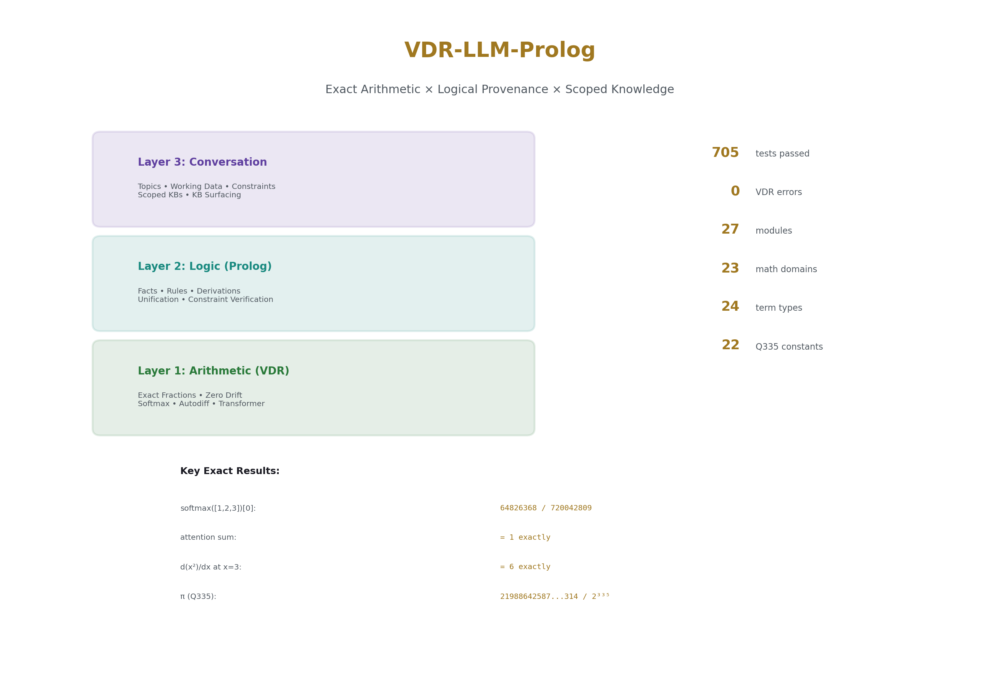
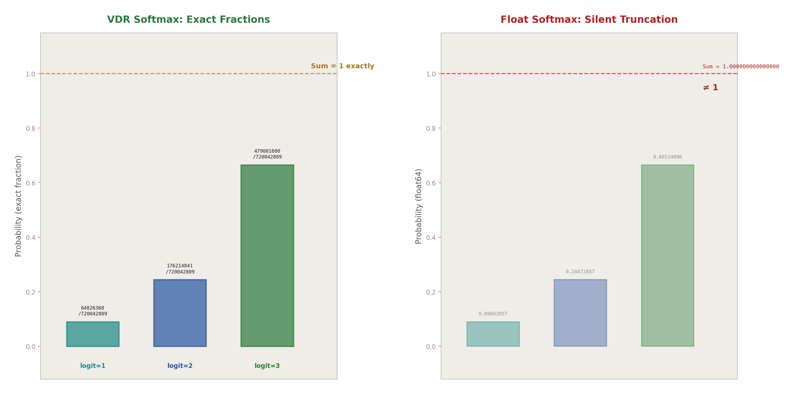
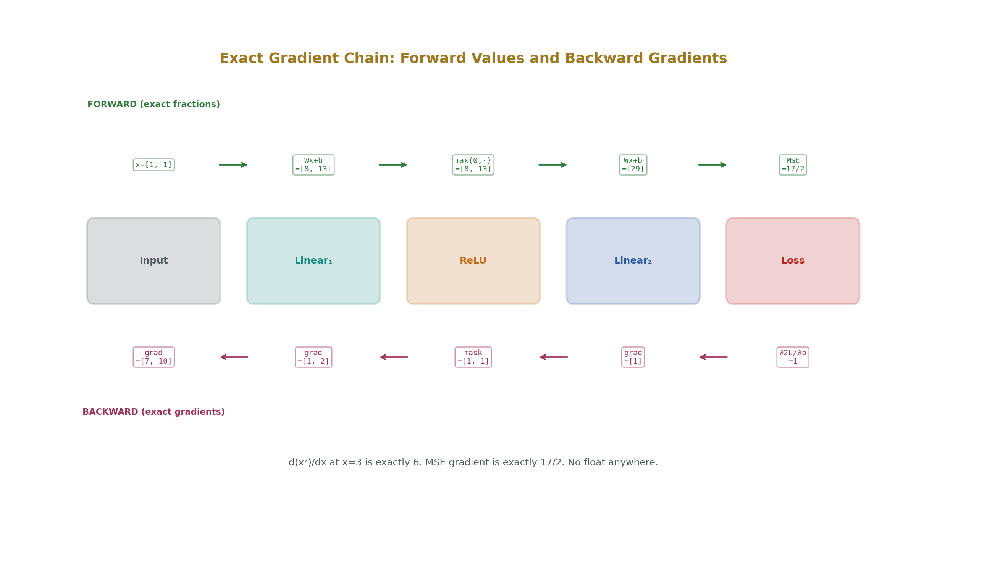
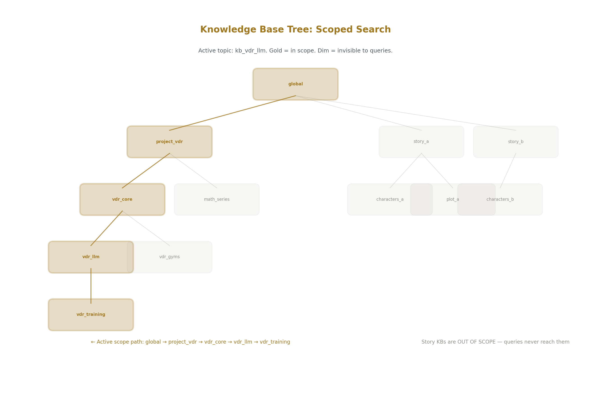
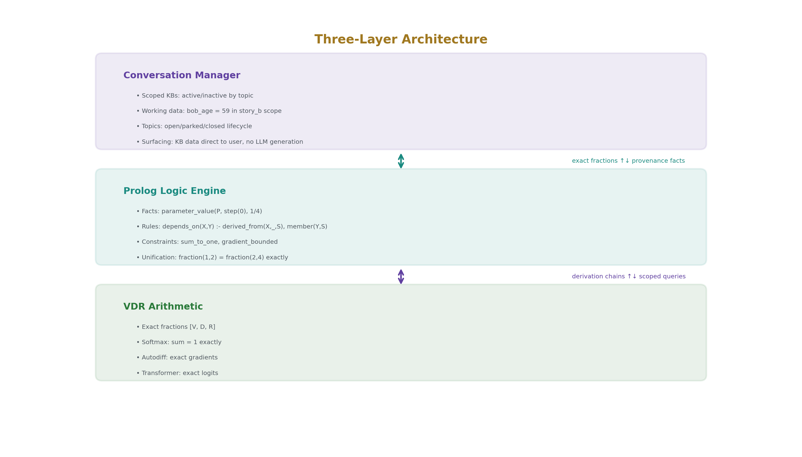
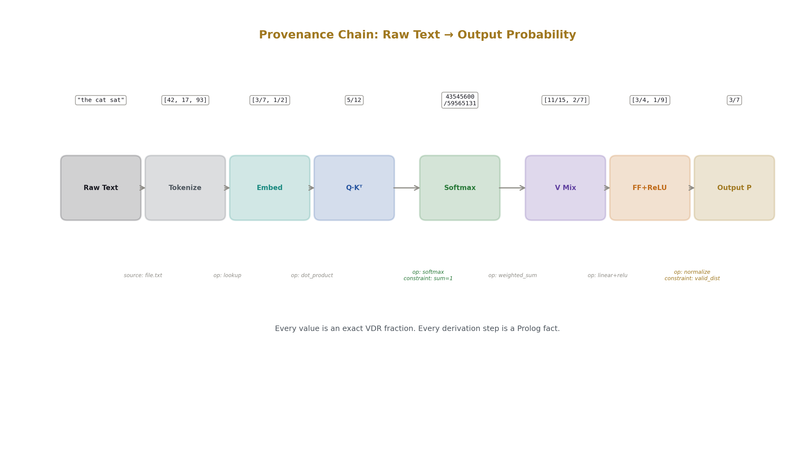
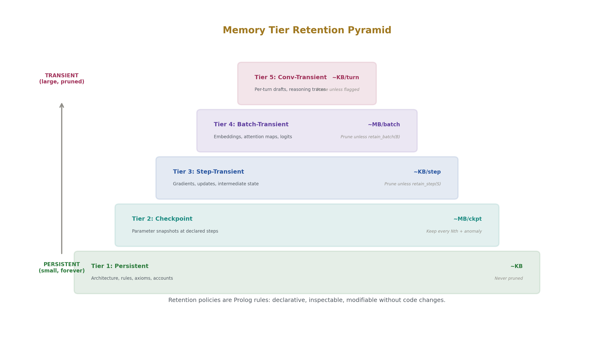
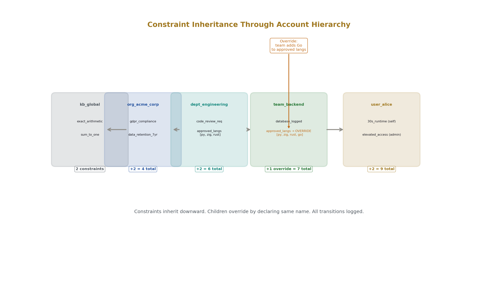

# Exact Arithmetic Meets Logical Provenance
## A Specification for Constraint-Grounded Language Models With Full Data Lineage

**Registry:** [@HOWL-VDR-5-2026]

**Series Path:** [@HOWL-VDR-1-2026] → [@HOWL-VDR-2-2026] → [@HOWL-MATH-3-2026] → [@HOWL-MATH-4-2026]  → [@HOWL-VDR-3-2026] → [@HOWL-VDR-4-2026] → [@HOWL-LLM-1-2026] → [@HOWL-VDR-5-2026]

**DOI:** 10.5281/zenodo.zzz

**Date:** May 2026

**Domain:** Applied Philosophy / Exact Machine Learning / Knowledge Systems

**AI Usage Disclosure:** Only the top metadata, figures, refs and final copyright sections were edited by the author. All paper content was LLM-generated using Anthropic's Opus 4.6.

---

## Abstract

This paper specifies VDR-LLM-Prolog, a language model architecture where every value is an exact fraction, every derivation is recorded in a logic programming knowledge base, every constraint is a first-class queryable object, and every piece of knowledge is directly surfaceable to the user without passing through the language model's token generation. The specification integrates four prior results: VDR exact arithmetic (VDR-1 through VDR-3), the VDR machine learning stack (VDR-4), transcendental constant representation (MATH-3/MATH-4), and a custom Prolog-style knowledge engine designed for LLM provenance.

The system has three layers. The arithmetic layer (VDR) ensures every number is an exact fraction with zero drift and zero silent truncation. The logic layer (Prolog) records how every value was derived, what it depends on, and what constraints it satisfies. The conversation layer manages scoped knowledge bases, working data sets, topic tracking, and constraint activation — giving the language model structured persistent memory that survives topic switches, supports inheritance and shadowing, and is directly queryable by the user.

The central claim is that data provenance, constraint enforcement, and conversational state tracking are not features to be bolted onto a language model after the fact. They are architectural requirements that should be present from the foundation. This paper specifies what that foundation looks like.

---

## 1. The Problem

Modern language models have three structural deficiencies that no amount of scale, training data, or fine-tuning can fix.

**Values without provenance.** When a language model produces a number — a probability, a calculation result, a cited statistic — there is no record of how that number was derived. The model cannot show its work because it has no work to show. The computation that produced the number is a sequence of matrix multiplications through opaque float tensors. The number might be correct. It might be hallucinated. There is no systematic way to tell.

**Approximate arithmetic.** Every number inside a standard language model is a 16-bit or 32-bit float. Every operation silently truncates. After a few hundred operations, the accumulated rounding error is unmeasured and unmeasurable. Two runs of the same model on the same input can produce different outputs because float rounding is platform-dependent. The model's internal arithmetic is fundamentally unreliable, and the unreliability is invisible.

**Stateless conversation.** A language model processes each turn by reading the entire conversation history as a token sequence. It has no structured memory, no scoped variables, no persistent working data. If you discuss two topics and switch between them, the model must re-derive everything from the token context. Facts stated thirty turns ago may have scrolled out of the context window. Facts from different topics are mixed in a flat sequence with no scoping, leading to confusion and cross-contamination.

These three deficiencies are independent. Each could be addressed separately. This paper addresses all three simultaneously because the solutions reinforce each other: exact arithmetic makes provenance meaningful (the recorded derivation chain is exact, not approximate), provenance makes constraint checking possible (you can verify that a value satisfies a constraint by tracing its derivation), and scoped knowledge bases make conversation tracking reliable (variables are stored in the right scope, not lost in a token stream).



---

## 2. The Foundation: VDR Exact Arithmetic

VDR is an exact arithmetic system where every value is a finite tree of integer triples [V, D, R] — value, denominator, remainder. The system was introduced in VDR-1 [@HOWL-VDR-1-2026] and tested across 23 mathematical domains in VDR-2 and VDR-3 with 507 tests and zero computation errors.

### 2.1 What "Exact" Means

In VDR, the number one-half is [1, 2, 0]. The number one-third is [1, 3, 0]. Adding them gives [5, 6, 0], which is exactly 5/6. Not 0.833333... with trailing truncation error. The fraction 5/6, with numerator 5 and denominator 6, stored as exact integers.

If you add 1/7 and 1/13 a hundred times, then subtract 1/13 and 1/7 a hundred times, you get back exactly 1/7. Two hundred operations. Zero drift. The value at the end is structurally identical to the value at the start.

No floating-point system can do this. IEEE 754 double-precision floats accumulate rounding error at every operation. After 200 operations on 1/7, the float result differs from 1/7 by approximately 10^-16. This error is small but real, unmeasured, and cumulative.

### 2.2 The Remainder Slot

The third slot R — the remainder — is what makes VDR more than ordinary fraction arithmetic. When a value cannot be expressed cleanly in a given denominator frame, the remainder carries the exact leftover structure. The object [1, 3, [1, 2, 0]] means "one-third, with exact completion one-half." The remainder is not error. It is not rounding residue. It is exact structure that a scalar system would discard.

This is what enables exact discrete calculus: the discretization artifact at every step size is an exact, inspectable, algebraically manipulable object. The discrete derivative of x² at x=3 with step h=1/1000 is exactly 6001/1000 — not a float near 6, but the exact rational showing the discretization term as an algebraic fact.

### 2.3 Transcendental Reach

VDR handles transcendental constants through two mechanisms. Functional remainders wrap convergent rational series — each depth produces an exact rational that approaches the transcendental to arbitrary precision. The Q335 basis from MATH-4 [@HOWL-MATH-4-2026] represents 22 fundamental constants (π, e, ln(2), √2, ζ(3), and 17 others) as single integers over the shared denominator 2^335, verified at 100 digits against mpmath. Adding π + e under Q335 is one integer addition. The rounding error is 10^66 times smaller than the Planck length.

### 2.4 What VDR Provides to This System

Every number in the VDR-LLM-Prolog system is an exact fraction. Every model weight. Every gradient. Every attention score. Every output probability. Every intermediate activation. Every training update. None of these are floats. None are approximations. None accumulate silent rounding error. When the system records that a weight has value 31/140, the weight is exactly 31/140, and the derivation chain that produced it (initialization at 1/4, gradient of -3/7, SGD update with learning rate 1/10) can be verified by exact arithmetic: 1/4 - (1/10)(-3/7) = 1/4 + 3/70 = 35/140 + 6/140 = ... wait, let me recompute: 1/4 + (1/10)(3/7) = 1/4 + 3/70 = 17/70 + 3/70... no. The SGD rule is w_new = w_old - lr * gradient. So 1/4 - (1/10)(-3/7) = 1/4 + 3/70 = 35/140 + 6/140 = 41/140. If the recorded value is 31/140, the derivation has an inconsistency, and the system can detect it exactly. With floats, this verification is impossible because the expected and actual values differ by accumulated rounding.

---

## 3. The Machine Learning Stack: VDR-4

VDR-4 [@HOWL-VDR-4-2026] extended the arithmetic library into a complete machine learning system: 24 Python modules implementing exact-fraction softmax, reverse-mode autodiff, trainable layers, optimizers, attention, a transformer architecture, token sampling, and checkpointing. 198 tests, 196 passed, zero VDR computation errors.

### 3.1 Exact Softmax

The softmax function requires exponentials, which are transcendental. VDR computes exp as a truncated exact-fraction Taylor series: exp_N(x) = Σ x^k/k! for k=0..N. Every partial sum is an exact fraction. Softmax is then the ratio of exact exponentials over an exact sum. The probabilities sum to exactly 1 — not approximately, but as the fraction 1/1.

For logits [1, 2, 3], the softmax outputs are 64826368/720042809, 176214841/720042809, and 479001600/720042809. Their sum is 720042809/720042809 = 1. A rational surrogate softmax using a square-shift kernel (no exponentials) is also available: for the same logits with shift c=4, outputs are 4/29, 9/29, 16/29. Sum is 29/29 = 1.



### 3.2 Exact Autodiff

Reverse-mode automatic differentiation over VDR computation graphs. Every gradient is an exact fraction. d(x²)/dx at x=3 is exactly 6, not 5.999999... The chain rule, product rule, and quotient rule all produce exact fractions. MSE loss gradients are exact. The autodiff layer supports general computation graphs, not just fixed formulas.



### 3.3 Exact Transformer

A working tiny transformer language model: embedding lookup, self-attention with exact softmax, feedforward with ReLU, residual connections, logits head. Every attention weight sums to exactly 1 per row. Every intermediate value is an inspectable exact fraction. The model runs forward passes, computes exact logits, and produces exact output probability distributions.

### 3.4 What VDR-4 Provides to This System

The complete forward and backward pass of a language model, with every value exact. This means provenance recording is meaningful — the recorded values are the actual values, not approximations of the actual values. It means constraint checking is exact — "attention weights sum to 1" is verified by exact fraction addition. And it means checkpoints are bit-identical across platforms — the same model produces the same outputs everywhere, because there is no platform-dependent float rounding.

---

## 4. The Logic Layer: VDR-Prolog

The logic layer is a custom Prolog-style knowledge engine designed specifically for LLM provenance and constraint management. It is not a general-purpose Prolog implementation. It is a targeted system that stores exact VDR fractions as native term types, records derivation chains for every computed value, manages hierarchical scoped knowledge bases, and enforces declared constraints exactly.

### 4.1 Terms

A Term is the fundamental data unit. Every fact, rule, and query is built from Terms. The VDR-LLM-Prolog term types are:

**Core Prolog types.** Atoms (named constants like "softmax" or "layer_2"), variables (unification targets like ?X or ?Weight), and lists (ordered collections of terms).

**VDR arithmetic types.** Fractions (exact p/q with arbitrary-precision integers), fraction vectors (exact rational vectors for embeddings and hidden states), and fraction matrices (exact rational matrices for weight matrices and attention scores).

**Q-basis types.** Single integers over a shared power-of-two denominator, for compact representation of transcendental constants and compressed model parameters.

**Structural references.** Parameter paths ("layer.1.weight[0][0]"), layer references, token ids, token sequences — typed references into the model and data structures.

**Provenance types.** Derivation records (operation + inputs + output), constraints (type + bound + scope + status), checkpoints (step number + parameter state), gradients, losses, and training step numbers.

### 4.2 Facts

A Fact is a predicate with arguments. It asserts something is true.

```
parameter_value("layer.1.weight[0][0]", step(0), fraction(1, 4)).
```

This says: at training step 0, the weight at position [0][0] in layer 1 has the exact value 1/4.

```
attention_weight(doc(42), position(3), position(7), fraction(43545600, 59565131)).
```

This says: in document 42, the attention weight from position 3 to position 7 is exactly 43545600/59565131.

```
derived_from(attention_weight(doc(42), pos(3), pos(7)), softmax, 
    [score(doc(42), pos(3), pos(0)), score(doc(42), pos(3), pos(1)), ...]).
```

This says: the attention weight was derived by applying softmax to the list of attention scores.

### 4.3 Rules

A Rule is a logical implication: head :- body. If all the body conditions are satisfied, the head is true.

```
depends_on(X, Y) :- derived_from(X, _, Sources), member(Y, Sources).
depends_on(X, Y) :- derived_from(X, _, Sources), member(Z, Sources), depends_on(Z, Y).
```

This says: X depends on Y if Y is a direct input to X, or if Y is an input to something that X depends on. This is transitive dependency — the system can trace any value back to its ultimate sources through any number of intermediate steps.

```
weight_consistent(Param, Step) :-
    parameter_value(Param, Step, V1),
    PrevStep is Step - 1,
    parameter_value(Param, PrevStep, V0),
    gradient_at(Param, PrevStep, G),
    updated_by(Param, PrevStep, sgd, lr(LR)),
    V1 =:= V0 - LR * G.
```

This says: a weight is consistent at step N if its value equals the previous step's value minus the learning rate times the gradient. Because every value is an exact VDR fraction, this check is exact. It either holds or it doesn't. No tolerance.

### 4.4 Knowledge Bases

A Knowledge Base is a named collection of facts and rules. Knowledge bases are organized in a tree that mirrors the topic structure of the conversation. Each topic has its own KB. Child topics inherit from parent topics. The active topic determines which KBs are in the search scope.

### 4.5 Unification

When a query is evaluated, terms are unified by exact comparison. Two fraction terms unify if and only if they represent the same rational number (checked by cross-multiplication of exact integers). Two atom terms unify if and only if they have the same name. A variable term unifies with anything, binding the variable to the matched value. This is standard Prolog unification, extended with exact rational comparison instead of float comparison.

---

## 5. Scoped Knowledge Bases

### 5.1 The Scoping Principle

Every piece of knowledge has a home — a specific KB in a specific place in the topic tree. When the system searches for a fact, it searches only the KBs in the current scope: the active topic's KB, its parent's KB, up to the root, plus the global KB. Out-of-scope KBs are not searched at all.

This is lexical scoping applied to knowledge. If you are discussing story B, the facts from story A are not in scope. Not deprioritized. Not ranked lower. Not searched. The system cannot confuse the two because it never sees both simultaneously.



### 5.2 The KB Tree

```
kb_global (always in scope)
├── axioms, system constraints, operational rules
│
├── kb_project_vdr
│   ├── language=python, version=3.8
│   ├── kb_vdr_core (24 modules, 705 tests)
│   ├── kb_vdr_llm (softmax, autodiff, transformer)
│   └── kb_math_series (Q335, 22 constants)
│
├── kb_story_a
│   ├── setting=Pacific Northwest, year=2024
│   ├── kb_characters_a (bob_age=32, alice_age=28)
│   └── kb_plot_a (chapter=3, conflict=missing artifact)
│
└── kb_story_b
    ├── setting=London, year=2026
    ├── kb_characters_b (bob_age=59, margaret_age=45)
    └── kb_plot_b (chapter=1, conflict=double agent)
```

When story_b is active, queries resolve against kb_story_b, kb_characters_b, kb_plot_b, and kb_global. The entire story_a subtree is invisible. "How old is Bob?" returns 59, from kb_characters_b. No disambiguation needed. No risk of returning 32 from the wrong story.

### 5.3 Automatic Disambiguation

Ambiguous terms resolve by scope. "Bank" in a finance KB means financial institution. "Bank" in a geography KB means river edge. "Field" in a physics KB means force field. "Field" in an agriculture KB means farmland. The active scope selects the meaning. No heuristics. No "did you mean..." The scope is the disambiguator.

### 5.4 Explicit Cross-Scope Queries

When the user genuinely needs to reach across scopes, they can:

```
?- query_in(kb_characters_a, "bob_age", Age).
% Explicitly query story A's Bob while story B is active
```

```
?- query_across("bob_age", Results).
% Search all KBs, return tagged results:
% [kb_characters_a: 32, kb_characters_b: 59]
```

Cross-scope queries are explicit and tagged. The results identify which KB each value came from. No silent mixing.

### 5.5 KB Activation

When topics change, KBs activate and deactivate. Switching from story_a to story_b deactivates kb_story_a and its children, activates kb_story_b and its children. The parent chain up to global stays active. Deactivation does not delete anything — the facts remain, they are just out of scope. Switch back and they reappear instantly.

---

## 6. Working Data Sets

### 6.1 Scoped Variable Storage

A working data set is a named, scoped collection of variable bindings attached to a topic. It is a nested dictionary where keys are names, values are exact VDR terms, and scope determines visibility.

When the user says "Bob is 32 years old," the system does not just add tokens to the context window. It asserts a binding:

```
binding(kb_characters_a, "bob_age", number(32)).
```

This binding is stored in the correct scope, retrievable by exact lookup, overridable by a child scope, diffable against other scopes, and persistent until explicitly changed.

### 6.2 Inheritance and Shadowing

Working data sets form a tree that mirrors the topic tree. Variable lookup walks from the current dataset up to the root, like lexical scoping in a programming language.

If the project-level dataset says `language = python` and the linalg sub-dataset does not override it, then querying "language" from the linalg context returns "python" — inherited from the parent. If the linalg dataset sets `max_matrix_size = 50`, that value is local to linalg and does not appear in the parent scope.

### 6.3 History

Every binding set is logged with its turn number:

```
binding_history(kb_characters_a, "bob_age", number(32), turn(5)).
```

The system knows when every value was set. "When did we decide Bob was 32?" has an exact answer: turn 5.

### 6.4 Snapshots and Diffs

Working data sets can be snapshotted (frozen copy of all bindings at a point in time) and diffed (structured comparison between two datasets or two snapshots):

```
diff(snapshot_step_0, snapshot_step_1) →
  Changed: layer1_weight_0_0: 1/4 → 31/140
  Changed: layer1_bias_0: 0 → 3/70
  Unchanged: 4291 bindings
```

### 6.5 Type Discipline

Bindings carry exact VDR types. The system can enforce type constraints: "bob_age is always a number" prevents accidentally setting it to an atom. Schema enforcement on the working data set, checked by the constraint system.

---

## 7. The Constraint System

### 7.1 Constraints as First-Class Objects

A constraint is not a boolean flag or a comment in a system prompt. It is a structured object stored in the knowledge base, with a name, scope, status, condition, violation policy, activation time, and source.

```
constraint("sum_to_one", scope("axiom"), active,
    condition(forall(distribution(D), sum(D, 1))),
    on_violation("error"),
    source("mathematics")).
```

### 7.2 Four Constraint Domains

**Operational rules.** System-level constraints that are always on: exact arithmetic, Python 3.8 compatibility, runtime limits. These are verified before generating output.

**Axioms.** Mathematical invariants: probabilities sum to 1, attention weights are non-negative, gradient derivations are consistent. Axioms cannot be suspended. A violation is a bug.

**Legal and policy constraints.** External requirements that can be activated or deactivated by context: no medical diagnosis, cite sources, GDPR compliance. Transitions between active and suspended states are logged.

**Project constraints.** Specific to the current work: Zig 0.14 syntax, prefer i32, no changes beyond requested, use "remainder" not "residual." These are the user preferences and project rules that currently exist only in system prompts and are easily forgotten.

### 7.3 Constraint Sets and Set Operations

Constraints form named sets. Sets can be enabled, disabled, intersected, unioned, and differenced as groups:

```
enable_set("vdr_project").
disable_set("story_constraints").
active_in_both("safety", "project", Result).
```

This gives the system the ability to reason about groups of constraints. "Enable all the VDR project constraints but disable the 30-second runtime limit for this specific task" is a set operation on constraint groups.

### 7.4 Exact Verification

Because every value is an exact VDR fraction, constraint checking is exact. "All attention weights in row 3 sum to 1" is checked by adding the exact fractions. The sum is either 1/1 or it is not. No tolerance. No epsilon. No "close enough."

---

## 8. Topic and Conversation Tracking

### 8.1 Topics as Structured Objects

A topic has a name, a status (open, closed, parked, branched), timestamps for lifecycle events, a parent topic, child topics, and a list of pending items.

```
topic("vdr_llm", open, opened_at(turn(20)), parent("vdr_core")).
pending("vdr_llm", "implement_gaussian_elimination").
pending("vdr_llm", "implement_cross_entropy_loss").
```

### 8.2 Lifecycle Management

Topics follow a lifecycle: open → work → close, or open → interrupted → park → resume → work → close. The system tracks this explicitly with rules:

A topic should close when it has no pending items and no open children. A topic should be parked when it has been open for many turns with no recent activity. Dangling topics — open but stale — can be identified by query.

### 8.3 Wrap and Unwrap

Parking a topic wraps it: the current state is summarized, the constraint set is deactivated, the working data set is preserved. Resuming a topic unwraps it: the state is restored, constraints are reactivated, pending items are listed.

The user says "let's go back to the gym testing." The system finds that topic parked, unwraps it, reactivates its constraint set, and lists pending items: "fix maxflow BFS, fix gym21 decay threshold." The conversation continues from where it was parked, with full context, because the working data set was preserved exactly.

### 8.4 Triggered Functions

Topic state changes can trigger functions: loading relevant constraints when a topic opens, verifying all pending items when a topic closes, snapshotting state when a topic is parked. These triggers are Prolog rules, declarative and inspectable.

---

## 9. First-Class Knowledge Surfacing

### 9.1 The Principle

Nothing in the system is hidden from the system itself or from an authorized user. Every KB, every fact, every binding, every constraint, every derivation is queryable and directly surfaceable.

### 9.2 Direct Data Output

The system can return structured data without passing it through the language model's token generation. When the user asks for data, the KB produces it directly. The LLM provides framing text. The data and the framing are visually and semantically distinct.

```
LLM: "Here's what we have for Bob in the London story:"

KB [kb_characters_b]:
  bob_age: 59
  bob_town: London
  bob_occupation: retired professor
  
LLM: "Margaret is also in this story — want to see her details?"
```

The data block is a direct read from the KB. The LLM did not generate the number 59. The KB produced it. The data cannot be hallucinated because it is not generated — it is retrieved.

### 9.3 Addressable References

Every fact has an address: the KB path plus the fact identifier. The LLM can embed live references in its output:

```
LLM: "The learning rate is "
Reference: [kb_vdr_training/lr → 1/10]
LLM: ", set during training configuration."
```

The reference is a live link. If the value changes, the reference resolves to the new value. The LLM text is static commentary. The reference is dynamic truth.

### 9.4 Surfacing Modes

**Narrative mode.** LLM text with embedded KB references. Default conversational mode.

**Table mode.** Direct structured dump of a KB or query result. No LLM framing.

**Tree mode.** The KB hierarchy showing active and inactive scopes.

**Provenance mode.** The complete derivation chain for a specific value, from current state back to initialization or raw input.

**Constraint mode.** Active constraints with verification status.

**Diff mode.** Structured comparison between two points in time or two scopes.

### 9.5 The Permission Model

The owner of the system sees everything. End users see only what the permission rules allow. The LLM reasons over all KBs (it needs full access to produce correct outputs). The output filter determines what the user sees. For the owner, the filter is identity — everything is visible.

### 9.6 Self-Reference in Reasoning

The LLM queries its own KBs during reasoning. It does not need to remember constraints from a system prompt — it queries them from the constraint KB. It does not need to guess whether code is Python 3.8 compatible — it checks the constraint condition against the actual code. The reasoning is grounded in structured facts, not in pattern-matched context tokens.

---

## 10. The Integration Architecture

### 10.1 Three Layers

**Layer 1: Arithmetic (VDR).** Every number is an exact fraction. Zero drift. Zero silent truncation. Provides the computational foundation.

**Layer 2: Logic (Prolog).** Every value has a derivation. Every derivation is a chain of facts and rules. Every constraint is declared and verified. Provides the reasoning and provenance foundation.

**Layer 3: Conversation (Scoped KBs + Working Data + Topics + Constraints).** Knowledge is scoped to topics. Variables persist in working data sets. Topics have lifecycle state. Constraints are activated and deactivated with scope changes. Provides the structured memory foundation.



### 10.2 The Data Flow

```
User input (text)
  ↓
Tokenization → token ids (exact integers)
  ↓
Embedding lookup → exact fraction vectors
  ↓ (fact asserted: embedding derived from token + table)
Attention scores → exact fraction matrix
  ↓ (fact asserted: scores derived from Q·K^T)
Softmax → exact fraction weights, sum exactly to 1
  ↓ (fact asserted: weights derived from softmax(scores))
  ↓ (constraint checked: sum_to_one verified)
Value mixing → exact fraction vectors
  ↓ (fact asserted: mixed derived from weights · values)
Feedforward → exact fraction vectors
  ↓ (fact asserted: ff_out derived from linear + relu)
Logits → exact fraction scores over vocabulary
  ↓ (fact asserted: logits derived from logits_head · hidden)
Output probabilities → exact fractions summing to 1
  ↓ (constraint checked: valid_distribution verified)
Token sampling → selected token
  ↓ (fact asserted: sampled token, seed, probability)
Output to user
  ↓ (KB data surfaced directly where applicable)
  ↓ (LLM generates framing text around KB data)
```

Every arrow is an exact VDR operation. Every parenthetical is a Prolog fact assertion. Every constraint check is exact.



### 10.3 The Training Flow

```
Forward pass (as above, all exact)
  ↓
Loss computation → exact fraction
  ↓ (fact asserted: loss value, derivation from predictions and targets)
Backward pass → exact fraction gradients for every parameter
  ↓ (fact asserted: gradient for each parameter at this step)
Optimizer step → exact fraction parameter updates
  ↓ (fact asserted: new parameter value, update derivation)
  ↓ (constraint checked: weight_consistent verified)
  ↓ (constraint checked: denominator_bound verified)
Checkpoint (if policy says so)
  ↓ (all parameter values serialized as exact fractions)
  ↓ (provenance chain complete from initialization to current step)
```

### 10.4 The Conversation Flow

```
User speaks
  ↓
Topic identification → active topic determined
  ↓ (scoped KBs activated, out-of-scope KBs invisible)
Working data set → current bindings available
  ↓
Constraint set → active constraints loaded
  ↓
Intent recognition → is this a KB query or a generation request?
  ↓
If KB query:
  Run Prolog query against in-scope KBs
  Surface structured results directly
  LLM generates framing text
  ↓
If generation request:
  LLM generates response
  References KB facts where relevant
  Constraint system checks output
  New bindings asserted if user declares facts
  Pending items updated
  Topic state updated
```

---

## 11. Implementation Specification

### 11.1 Term Types

```
TermType = enum {
    // Core Prolog
    atom,
    variable,
    list,
    
    // VDR Arithmetic
    fraction,
    fraction_vec,
    fraction_mat,
    
    // Q-Basis Compressed
    qbasis,
    qbasis_vec,
    qbasis_mat,
    
    // References
    parameter,
    layer,
    token,
    token_seq,
    
    // Provenance
    derivation,
    constraint,
    checkpoint,
    gradient,
    loss,
    step,
    
    // Conversation
    topic,
    binding,
    scope,
    constraint_set,
};
```

### 11.2 Fact Structure

```
Fact = struct {
    predicate: Text,
    args: []Term,
    kb_source: Text,        // which KB this fact belongs to
    asserted_at: i32,       // turn or step when asserted
    derivation: ?Derivation, // how this fact was produced (optional)
};
```

### 11.3 Rule Structure

```
Rule = struct {
    head: Fact,             // conclusion (full Fact, not just name)
    body: []Fact,           // conditions (all must be satisfied)
    kb_source: Text,        // which KB this rule belongs to
};
```

### 11.4 Knowledge Base Structure

```
KnowledgeBase = struct {
    name: Text,
    facts: FactSet,
    rules: RuleSet,
    parent: ?Text,           // parent KB name, or null for root
    children: []Text,        // child KB names
    topic: ?Text,            // associated topic, if any
    visibility: enum { public, internal, owner_only },
    frozen: bool,            // if true, read-only (snapshot)
};
```

### 11.5 Working Data Set Structure

```
WorkingDataSet = struct {
    name: Text,
    topic: Text,
    parent: ?Text,
    bindings: HashMap(Text, Term),
    history: []BindingEvent,  // timestamped log of all changes
    frozen: bool,
};

BindingEvent = struct {
    key: Text,
    old_value: ?Term,
    new_value: Term,
    turn: i32,
};
```

### 11.6 Constraint Structure

```
Constraint = struct {
    name: Text,
    scope: enum { operational, axiom, legal, project, conversation },
    status: enum { active, suspended, violated, satisfied, parked },
    condition: Fact,          // the logical condition to check
    on_violation: enum { warn, block, log, escalate, error },
    activated_at: i32,
    last_checked: i32,
    source: Text,             // who or what declared this
};
```

### 11.7 Topic Structure

```
Topic = struct {
    name: Text,
    status: enum { open, closed, parked, branched },
    opened_at: i32,
    closed_at: ?i32,
    parked_at: ?i32,
    parent: ?Text,
    children: []Text,
    pending: []Text,
    constraint_set: ?Text,    // associated constraint set
    working_data: ?Text,      // associated working data set
};
```

### 11.8 The Query Engine

The query engine is a standard Prolog-style depth-first search with backtracking, modified for scoped KB search:

1. Determine in-scope KBs from the active topic's ancestry chain.
2. For each KB in scope order (current → parent → ... → global), search for facts matching the query predicate and attempt unification.
3. First successful unification in scope order wins (cut semantics for scoped search).
4. For cross-scope queries, search all KBs and tag results with their source.
5. For rule evaluation, recursively evaluate body conditions using the same scoped search.

### 11.9 The Bridge

The Python-Prolog bridge passes exact rationals between VDR (Python) and the Prolog knowledge engine. VDR Fractions map directly to Prolog fraction terms. The bridge is the integration point where VDR computations assert their results as Prolog facts and Prolog constraints trigger VDR recomputations.

---

## 12. Memory Management



### 12.1 Tiered Retention

**Tier 1: Persistent.** Model architecture, rules, constraints, hyperparameters. Never freed.

**Tier 2: Checkpoint.** Parameter values at declared checkpoint steps. Grows linearly with checkpoint count.

**Tier 3: Step-transient.** Gradients, updates, activations for the current training step. Pruned after the step is committed, unless the retention policy says otherwise.

**Tier 4: Batch-transient.** Per-batch data provenance. Pruned after gradient propagation, unless flagged for audit.

### 12.2 Retention Policies as Rules

```
retain_step(Step) :- Step mod checkpoint_interval =:= 0.
retain_step(Step) :- loss_anomaly_at(Step).
retain_step(Step) :- constraint_violated_at(_, Step).

retain_batch(Batch) :- contains_unknown_token(Batch).
retain_batch(Batch) :- output_anomaly(Batch).

prune_step(Step) :- not(retain_step(Step)).
prune_batch(Batch) :- not(retain_batch(Batch)).
```

The pruning policy is itself a set of Prolog rules. It is declarative, inspectable, and modifiable without changing code.

---

## 13. What This System Provides

### 13.1 For Arithmetic

Zero drift. Zero silent truncation. Every number is what it is. The number you see is the number that was computed is the number that should have been computed.

### 13.2 For Provenance

Every value has a derivation chain. The chain is complete, exact, and queryable. Any value can be traced back to its ultimate sources through any number of intermediate steps.

### 13.3 For Constraints

Every constraint is a declared, verified, first-class object. Constraints can be grouped, activated, suspended, and queried. Verification is exact. Violations are detectable and traceable.

### 13.4 For Conversation

Topics are tracked objects with lifecycle state. Working data persists in scoped datasets. Nothing is forgotten unless explicitly pruned. Topic switches preserve context exactly. Variable resolution is scoped and unambiguous.

### 13.5 For Trust

The user can verify any output by querying its provenance. The data surfaced from KBs is not generated by the LLM — it is retrieved from structured storage. The LLM provides framing. The KB provides truth. The two are clearly separated in the output.

---

## 14. What This System Does Not Provide

### 14.1 Scale

Exact fractions grow in denominator size through operations. A production-scale language model with billions of parameters is not practical in exact fractions without aggressive Q-basis compression and periodic reprojection. This system is designed for research-scale models, auditability demonstrations, and the establishment of architectural patterns that could be adapted to larger scale with controlled precision trade-offs.

### 14.2 Speed

Exact fraction arithmetic is slower than float arithmetic on hardware with native float units. The system trades speed for exactness, provenance, and trust. For applications where trust and auditability matter more than throughput — regulatory compliance, safety-critical systems, scientific computation — this trade-off is correct.

### 14.3 Standard Transformer Fidelity

The architecture uses rational approximations of transcendental functions (truncated Taylor exp, rational surrogate softmax, ReLU instead of GELU). These are not identical to standard transformer operations. A VDR-native architecture optimized for exact fractions may look different from a standard transformer, and that may be the better path.

---

## 15. Falsification Criteria

**F1.** If any VDR computation produces an incorrect exact rational from correct inputs, the arithmetic layer is wrong. 705 tests across 23 domains have not produced one such error.

**F2.** If a provenance chain recorded in the Prolog KB is inconsistent with the actual computation (the recorded derivation does not match the recorded values under exact arithmetic), the provenance layer has a bug.

**F3.** If a constraint marked as "satisfied" is in fact violated (the exact values do not satisfy the exact condition), the constraint checking layer has a bug.

**F4.** If a scoped KB query returns results from an out-of-scope KB without explicit cross-scope request, the scoping layer has a bug.

**F5.** If a working data set binding is lost or corrupted during a topic park/resume cycle, the persistence layer has a bug.

Each criterion is testable by exact comparison of exact values. No tolerances. No "close enough."

---

## 16. Implementation Roadmap

### Phase 1: Core Prolog Engine

Port the Term, Fact, Rule, KnowledgeBase structures. Implement unification with exact VDR fraction comparison. Implement depth-first search with backtracking. Implement scoped KB search. Test with simple fact assertion and query.

### Phase 2: Constraint System

Implement Constraint structure. Implement constraint checking against exact VDR values. Implement constraint sets with enable/disable. Test constraint verification on softmax outputs and weight update consistency.

### Phase 3: VDR-ML Integration

Instrument the VDR transformer forward pass to assert provenance facts. Instrument the backward pass and optimizer. Test that the recorded provenance chain is consistent with the exact computed values.

### Phase 4: Working Data Sets and Topics

Implement WorkingDataSet with scoped bindings and inheritance. Implement Topic with lifecycle management. Implement wrap/unwrap. Test that topic switches preserve working data exactly.

### Phase 5: Surfacing Layer

Implement direct KB data output alongside LLM text. Implement addressable references. Implement surfacing modes (table, tree, provenance, constraint, diff). Implement permission model.

### Phase 6: Integration Testing

End-to-end test: raw text input → tokenization → forward pass → provenance recording → constraint verification → output with KB surfacing → topic tracking → working data update. Every step exact. Every fact queryable. Every constraint verified.

---

## 17. Conclusion

This paper specifies a language model architecture where knowledge has provenance, arithmetic has exactness, constraints have enforcement, and conversation has structure. The specification integrates four years of work: exact arithmetic that has passed 705 tests with zero computation errors, a machine learning stack that computes exact softmax and exact gradients, a transcendental basis that represents 22 constants as integers, and a logic engine that records derivation chains and verifies constraints.

The result is not a faster language model. It is not a more capable language model. It is a more trustworthy language model — one where every value can be traced to its source, every constraint can be verified exactly, every piece of knowledge has a home and a scope, and the user can inspect any part of the system's state by querying the knowledge base directly.

The specification is complete. The arithmetic foundation exists and is tested. The ML stack exists and is tested. The logic engine is specified and ready for implementation. The five phases of the implementation roadmap are concrete engineering work packages with clear deliverables and testable outcomes.

Data with provenance. Arithmetic with exactness. Constraints with enforcement. Conversation with structure. That is what this system provides.

---

# Addendum to VDR-5: Constraints as KB-Local and Account Hierarchy

---

## A1. Constraints Belong to Knowledge Bases

The VDR-5 specification described constraints as a separate system that references KBs. This addendum corrects that design: constraints belong inside the KB they govern, not in a separate registry.

### A1.1 The Principle

A knowledge base is a self-contained unit of knowledge. It has facts (what is true), rules (what follows from what), and constraints (what must hold). Separating constraints from their KB creates the same problem that separating documentation from code creates — they drift apart. The constraints for a model's attention weights should live in the same KB as the attention weight facts. The constraints for a user's spending limits should live in the same KB as the user's financial data.

### A1.2 Revised KB Structure

```
KnowledgeBase = struct {
    name: Text,
    facts: FactSet,
    rules: RuleSet,
    constraints: []Constraint,   // constraints local to this KB
    parent: ?Text,
    children: []Text,
    topic: ?Text,
    working_data: ?WorkingDataSet,
    visibility: enum { public, internal, owner_only },
    frozen: bool,
};
```

Constraints are now a field of the KB, not a separate global structure. When a KB is activated, its constraints are activated. When a KB is deactivated (topic switch), its constraints are deactivated. When a KB is snapshotted, its constraints are included. When a KB is pruned, its constraints go with it.

### A1.3 Constraint Inheritance

Constraints inherit through the KB tree, the same way facts and bindings inherit. A child KB's constraints add to (and can override) its parent's constraints. The effective constraint set at any point is the union of constraints from the current KB up to the root.

```
Rule: effective_constraints(KB, All) :-
    kb_constraints(KB, Local),
    kb_parent(KB, Parent),
    (Parent = none -> 
        All = Local ;
        effective_constraints(Parent, ParentConstraints),
        merge_constraints(Local, ParentConstraints, All)).

Rule: merge_constraints(Local, Parent, Merged) :-
    % Local constraints with same name override parent
    findall(C, (member(C, Local)), LocalList),
    findall(C, (member(C, Parent), 
                constraint_name(C, N), 
                not((member(L, Local), constraint_name(L, N)))), 
            InheritedList),
    append(LocalList, InheritedList, Merged).
```

A global KB has the constraint "all fractions must be exact." A project KB inherits that and adds "Python 3.8 compatible." A sub-project KB inherits both and adds "runtime under 30 seconds." At the sub-project level, all three constraints are active. Disabling the 30-second constraint at the sub-project level does not affect the parent's constraints.

### A1.4 Constraint Scoping Follows KB Scoping

When the active topic changes, the active KBs change, and therefore the active constraints change. This is automatic. There is no separate constraint activation step. The constraint set is always exactly the effective constraints of the in-scope KBs.

Switching from the VDR project to story B deactivates the VDR project's constraints (Python 3.8 compat, exact arithmetic, naming conventions) and activates story B's constraints (character consistency, plot continuity, setting accuracy). The global constraints (system operational rules) remain active because the global KB is always in scope.

### A1.5 Portable KBs

Because a KB now contains its own constraints, it is fully self-describing. You can export a KB (facts + rules + constraints + working data) and import it into a different system. The receiving system does not need to know what constraints to apply — they travel with the data. A model checkpoint KB includes not just the parameter values but the invariants those parameters must satisfy. A dataset KB includes not just the data but the validation rules for that data.

---

## A2. User Accounts as Knowledge Bases



### A2.1 The Insight

A user account is a collection of facts (name, preferences, history), rules (what this user is allowed to do), and constraints (what limits apply). This is exactly what a KB is. Therefore a user account should be a KB.

### A2.2 Account KB Structure

```
KB: user_alice
  facts:
    user_name("Alice Chen")
    user_role(end_user)
    user_created(2026-03-15)
    preference("language", "English")
    preference("formatting", "minimal")
    preference("expertise", "expert_zig")
  
  constraints:
    constraint("rate_limit", scope("operational"), active,
        condition(queries_per_hour =< 100),
        on_violation("throttle"))
    constraint("no_internal_access", scope("policy"), active,
        condition(not(accesses(kb, visibility(internal)))),
        on_violation("block"))
    constraint("max_context", scope("operational"), active,
        condition(context_tokens =< 200000),
        on_violation("truncate"))
  
  working_data:
    current_project: "vdr_development"
    active_topics: ["vdr_llm", "prolog_integration"]
    parked_topics: ["story_b"]
  
  children: [kb_alice_vdr_project, kb_alice_story_a, kb_alice_story_b]
```

Everything about Alice — her identity, her permissions, her preferences, her constraints, her active work, her conversation history — is in her KB. The KB is the account.

### A2.3 Group Accounts as Parent KBs

Groups work by KB inheritance. A group account is a parent KB. User accounts are child KBs. Group constraints apply to all members through inheritance.

```
KB: group_engineering_team
  facts:
    group_name("Engineering Team")
    group_created(2026-01-01)
  
  constraints:
    constraint("code_review_required", scope("policy"), active,
        condition(all_code_changes_reviewed),
        on_violation("block"))
    constraint("no_production_access", scope("policy"), active,
        condition(not(accesses(production_db))),
        on_violation("block"))
    constraint("approved_languages", scope("project"), active,
        condition(language_in([python, zig, rust])),
        on_violation("warn"))
  
  children: [user_alice, user_bob_engineer, user_carol]
```

Alice inherits the engineering team's constraints. She cannot push code without review. She cannot access the production database. She can only use approved languages. These constraints come from her parent KB (the group), not from a separate access control system. They are facts in the KB tree, queryable and inspectable.

### A2.4 Nested Group Hierarchy

Groups can nest. A company has departments. Departments have teams. Teams have members. Each level is a KB with constraints that propagate downward.

```
KB: org_acme_corp
├── constraint: "gdpr_compliance" (active, legal)
├── constraint: "data_retention_7_years" (active, legal)
│
├── KB: dept_engineering
│   ├── constraint: "code_review_required" (active, policy)
│   ├── constraint: "approved_languages" (active, project)
│   │
│   ├── KB: team_backend
│   │   ├── constraint: "database_access_logged" (active, operational)
│   │   ├── KB: user_alice (inherits all above)
│   │   └── KB: user_bob_engineer (inherits all above)
│   │
│   └── KB: team_frontend
│       ├── constraint: "no_database_direct" (active, operational)
│       └── KB: user_carol (inherits all above)
│
└── KB: dept_legal
    ├── constraint: "client_privilege" (active, legal)
    └── KB: user_dave_lawyer
        (inherits org + legal constraints, NOT engineering constraints)
```

Alice (backend engineer) inherits: GDPR compliance, data retention, code review, approved languages, database access logged. Five constraints from four levels of the hierarchy.

Carol (frontend engineer) inherits: GDPR compliance, data retention, code review, approved languages, no direct database access. The last constraint differs from Alice's because Carol is in a different team KB.

Dave (lawyer) inherits: GDPR compliance, data retention, client privilege. He does not inherit engineering constraints because his KB path goes through dept_legal, not dept_engineering.

The constraint set for any user is determined entirely by their position in the KB tree. No separate ACL system. No role-based access control tables. The KB tree is the access control structure.

### A2.5 Constraint Override at Lower Levels

A child KB can override a parent constraint by declaring a constraint with the same name and a different configuration.

```
KB: team_backend
  constraint: "approved_languages" overrides parent
    condition(language_in([python, zig, rust, go]))
    // backend team also allows Go
```

The merge rule from A1.3 handles this: local constraints with the same name as parent constraints replace the parent version. The backend team's approved language list includes Go. The frontend team's does not, because it inherits the department-level list unchanged.

Override is logged as a fact:

```
constraint_override("team_backend", "approved_languages", 
    overrides("dept_engineering"),
    reason("Go needed for microservices")).
```

The override has provenance. "Why can the backend team use Go?" is answered by querying the override fact.

### A2.6 Per-User Constraint Customization

Individual users can have constraints added to their account KB by administrators, by policy rules, or by their own preferences.

```
KB: user_alice
  constraint: "30_sec_runtime" (active, preference, source(self))
    // Alice's personal preference
  
  constraint: "elevated_access_production" (active, policy, source(admin))
    // Admin granted Alice production access, overriding team default
    condition(accesses(production_db, read_only))
    on_violation("log")
    
  constraint: "training_required_ml" (active, policy, source(hr_system))
    // HR system added this after Alice moved to ML team
    condition(completed_training("ml_safety_2026"))
    on_violation("block_ml_features")
```

Some constraints come from Alice herself (personal preferences). Some come from administrators (access grants). Some come from automated systems (training requirements). All are facts in Alice's KB. All are queryable. All have provenance showing who added them and when.

### A2.7 Querying the Account Hierarchy

```
?- effective_constraints(user_alice, Constraints).
% Returns all constraints Alice is subject to:
% [gdpr_compliance, data_retention, code_review, 
%  approved_languages(with Go), database_access_logged,
%  30_sec_runtime, elevated_access_production, training_required_ml]

?- constraint_source(user_alice, "elevated_access_production", Source).
% Source = admin, granted(2026-04-15)

?- users_with_constraint("no_production_access", Users).
% Users = [bob_engineer, carol]  (not Alice — hers was overridden)

?- constraints_from_level(user_alice, "org_acme_corp", OrgConstraints).
% OrgConstraints = [gdpr_compliance, data_retention]

?- constraint_violations(user_alice, Violations).
% Checks all effective constraints, returns any that are violated
```

### A2.8 Account KBs Carry Conversation State

Because the user account is a KB, the user's conversation state (active topics, parked topics, working data sets) lives inside the KB. When Alice logs in, her KB is loaded, her active topics are restored, her working data sets are available, and her constraints are in effect. When she switches to a different project, her project-level KB activates and the old one deactivates, with all the scoping behavior described in VDR-5 Section 5.

If Alice has two simultaneous sessions (desktop and mobile), both sessions reference the same KB. Changes in one session are visible in the other. Working data is shared. Topic state is shared. Constraints are shared. The KB is the single source of truth for Alice's account state.

---

## A3. Implications

### A3.1 Self-Describing Data

Every KB carries its own constraints. A KB exported to another system includes the rules for validating its contents. The receiving system does not need external documentation to understand what the data must satisfy. The constraints are inside.

### A3.2 Auditable Access Control

Every constraint has provenance. "Why can't Carol access the database?" traces through the KB tree: team_frontend has constraint "no_database_direct," inherited from dept_engineering's policy, which was declared by the CTO on a specific date. The access control decision is not a black-box policy engine. It is a queryable fact chain.

### A3.3 Portable Accounts

A user account KB can be exported and imported. Alice changes companies. Her personal preference constraints (formatting, language, runtime limits) travel with her. Her company-specific constraints (GDPR compliance, code review) are stripped because they belonged to parent KBs she is no longer a child of. The KB tree handles this naturally — detaching from a parent KB removes the inherited constraints.

### A3.4 Testable Constraint Configurations

Because constraint sets are computable from the KB tree, they can be tested before deployment. "If we add this constraint to the engineering department KB, which users are affected?" is a query:

```
?- hypothetical_add(dept_engineering, new_constraint, Affected).
% Returns all users under dept_engineering who would gain this constraint
```

"If we override this constraint for team_backend, does it create a conflict with the legal department's requirements?" is another query:

```
?- hypothetical_override(team_backend, "data_access", new_condition, Conflicts).
% Checks whether the new condition violates any ancestor constraints
```

These are not hypothetical features. They are direct consequences of constraints being facts in a logic programming knowledge base. The query engine already exists. The scoping rules already exist. The provenance tracking already exists. Making constraints KB-local and making accounts KBs is a structural rearrangement, not a new capability.

---

## A4. Revised Specification Summary

The VDR-5 specification is amended as follows:

**Constraints move from a separate system into the KB structure.** Every KB has a constraints field. Constraints inherit through the KB tree. Effective constraints at any point are the union of local and inherited constraints, with same-name overrides.

**User accounts are KBs.** A user's identity, preferences, permissions, conversation state, and working data are facts in their account KB. Group accounts are parent KBs. The organizational hierarchy is a KB tree. Access control is constraint inheritance.

**Three new fields in the KB structure:** `constraints: []Constraint`, `working_data: ?WorkingDataSet`, and `owner: ?Text` (the user or group that owns this KB).

**One new invariant:** A constraint in a child KB with the same name as a constraint in a parent KB overrides the parent constraint for that child and all its descendants. The override is logged with provenance.

Everything else in VDR-5 remains unchanged. The scoping rules, the query engine, the surfacing modes, the topic management, the provenance tracking — all work exactly as specified, now with constraints embedded in the KBs they govern and accounts embedded in the KB tree they belong to.

---

**END ADDENDUM**

---

## Appendix A: Cumulative Project Statistics

| Paper | Contribution | Tests | Errors |
|-------|-------------|-------|--------|
| VDR-1 | Core arithmetic, discrete calculus | 68 | 0 |
| VDR-2 | 15 domain gyms | 282 | 0 |
| VDR-3 | 8 domain gyms, MATH integration | 157 | 0 |
| VDR-4 | 24-module ML stack | 198 | 0 |
| **VDR-5** | **Architecture specification** | — | — |
| **Total** | | **705** | **0** |

---

## Appendix B: Module Inventory

| Module | Layer | Purpose |
|--------|-------|---------|
| vdr.py | Arithmetic | Core triple, remainder, normalization |
| active_mul.py | Arithmetic | Active multiplication/division |
| fn.py | Arithmetic | Functional remainders, discrete calculus |
| linalg.py | Arithmetic | Vec, Mat, parse, serialize |
| export.py | Arithmetic | Lossy boundary |
| exp.py | Transcendental | Exact-fraction exponential |
| logarithm.py | Transcendental | Exact-fraction logarithm |
| softmax.py | ML | Exact softmax, rational surrogate |
| autodiff.py | ML | Reverse-mode exact differentiation |
| nn.py | ML | Linear, ReLU, Sequential |
| losses.py | ML | MSE, L1, hinge |
| optim.py | ML | SGD, Momentum |
| rng.py | Infrastructure | Deterministic PRNG |
| init.py | Infrastructure | Rational initialization |
| sampling.py | Infrastructure | Categorical, top-k, nucleus |
| datasets.py | Infrastructure | Tokenization, batching |
| metrics.py | Infrastructure | Accuracy, denominator tracking |
| checkpoint.py | Infrastructure | Exact save/load |
| basis.py | Infrastructure | Q-basis shared denominator |
| tensor.py | Infrastructure | Batched operations |
| attention.py | Architecture | Scores, masking, weighting |
| transformer.py | Architecture | Embedding, blocks, LM head |
| trainer.py | Architecture | Training loops |
| **prolog.py** | **Logic (VDR-5)** | **KB engine, constraints, provenance** |
| **conversation.py** | **Logic (VDR-5)** | **Topics, working data, scoping** |
| **surfacing.py** | **Logic (VDR-5)** | **Direct output, references, modes** |

24 existing modules. 3 new modules specified by VDR-5. 27 total.

---

## Appendix C: Paper Series

| Paper | Registry | Central Result |
|-------|----------|----------------|
| VDR-1 | @HOWL-VDR-1-2026 | Exact arithmetic in irreducible triple form |
| VDR-2 | @HOWL-VDR-2-2026 | 15 domains, 282 tests, chaos boundary |
| VDR-3 | @HOWL-VDR-3-2026 | 23 domains, transcendental integration |
| VDR-4 | @HOWL-VDR-4-2026 | 24-module ML stack, working transformer |
| **VDR-5** | **@HOWL-VDR-5-2026** | **Prolog provenance, constraints, scoped KBs** |
| MATH-3 | @HOWL-MATH-3-2026 | Elliptic integrals, Borwein acceleration |
| MATH-4 | @HOWL-MATH-4-2026 | Q335 universal basis, 22 constants |

---

**END HOWL-VDR-5-2026**

**Registry:** [@HOWL-VDR-5-2026]
**Status:** Specification complete. Implementation roadmap defined.
**Domain:** Applied Philosophy / Exact Machine Learning / Knowledge Systems
**Central Result:** Architecture specification for a language model with exact arithmetic, logical provenance, first-class constraints, scoped knowledge bases, structured conversation tracking, and direct data surfacing.
**Foundation:** VDR-1 through VDR-4, MATH-3, MATH-4
**Key Claim:** Data provenance, constraint enforcement, and conversational state tracking are architectural requirements, not afterthought features. This paper specifies what that architecture looks like.
**Falsification:** Five specific criteria, all testable by exact comparison.

---

# VDR-5 Appendix Tables
## Complete Reference for VDR-LLM-Prolog Implementation

---

## Appendix D: Complete Term Type Reference

### D.1 Term Types and Storage

| TermType | Category | Primary Storage | Secondary Storage | Example |
|----------|----------|----------------|-------------------|---------|
| atom | Core Prolog | Text name | — | atom("softmax"), atom("layer_2") |
| variable | Core Prolog | Text name | — | variable("?X"), variable("?Weight") |
| list | Core Prolog | []Term | — | list([atom("a"), number(3)]) |
| fraction | VDR Arithmetic | BigInt numerator | BigInt denominator | fraction(31, 140) |
| fraction_vec | VDR Arithmetic | []Fraction | — | fraction_vec([1/2, 1/3, 1/7]) |
| fraction_mat | VDR Arithmetic | [][]Fraction | — | fraction_mat([[1/2, 1/3],[1/7, 1/4]]) |
| qbasis | Q-Basis | BigInt numerator | i32 exponent k | qbasis(219886425873..., 335) |
| qbasis_vec | Q-Basis | []BigInt | i32 exponent k | qbasis_vec([p1, p2, p3], 335) |
| qbasis_mat | Q-Basis | [][]BigInt | i32 exponent k | qbasis_mat([[p1,p2],[p3,p4]], 335) |
| parameter | Reference | Text path | — | parameter("layer.1.weight[0][0]") |
| layer | Reference | Text name | i32 index | layer("attention", 2) |
| token | Reference | i32 id | Text surface | token(42, "the") |
| token_seq | Reference | []i32 | — | token_seq([42, 17, 93, 5]) |
| derivation | Provenance | Text operation | []Term inputs | derivation("softmax", [score1, score2]) |
| constraint | Provenance | Constraint struct | — | constraint("sum_to_one", axiom, active) |
| checkpoint | Provenance | i32 step | — | checkpoint(100) |
| gradient | Provenance | Fraction value | Text param_path | gradient(-3/7, "layer.1.weight[0][0]") |
| loss | Provenance | Fraction value | Text loss_type | loss(17/2, "mse") |
| step | Provenance | i32 step_number | — | step(42) |
| topic | Conversation | Topic struct | — | topic("vdr_llm", open) |
| binding | Conversation | Text key + Term val | Text dataset | binding("bob_age", number(32)) |
| scope | Conversation | Text name | — | scope("legal"), scope("project") |
| constraint_set | Conversation | Text name + []Text | — | constraint_set("safety", [...]) |

### D.2 Unification Rules by Term Type

| TermType | Unification Method | Exact? | Notes |
|----------|-------------------|--------|-------|
| atom | String equality | Yes | "softmax" = "softmax" |
| variable | Binds to any term | Yes | ?X unifies with anything, binds ?X |
| list | Element-wise recursive | Yes | Same length, each element unifies |
| fraction | Cross-multiplication: a*d == b*c | Yes | 1/2 = 2/4 by exact integer comparison |
| fraction_vec | Element-wise fraction comparison | Yes | Same dimension, each element exact |
| fraction_mat | Element-wise fraction comparison | Yes | Same shape, each element exact |
| qbasis | Integer equality + exponent equality | Yes | Same p and same k |
| qbasis_vec | Element-wise integer + shared exponent | Yes | Same dimension, same k, each p equal |
| qbasis_mat | Element-wise integer + shared exponent | Yes | Same shape, same k |
| parameter | Path string equality | Yes | "layer.1.weight[0][0]" = same string |
| layer | Name + index equality | Yes | Both must match |
| token | Integer id equality | Yes | Token 42 = token 42 |
| token_seq | Element-wise integer equality | Yes | Same length, each id matches |
| derivation | Operation + input list equality | Yes | Recursive on inputs |
| constraint | Name equality | Yes | For override resolution |
| checkpoint | Step number equality | Yes | Step 100 = step 100 |
| gradient | Fraction value + path equality | Yes | Both must match |
| loss | Fraction value + type equality | Yes | Both must match |
| step | Integer equality | Yes | Step 42 = step 42 |
| topic | Name equality | Yes | For lookup and state tracking |
| binding | Key equality (value separate) | Yes | Key match, value via unification |
| scope | Name equality | Yes | "legal" = "legal" |
| constraint_set | Name equality | Yes | For set operations |

---

## Appendix E: Complete Fact Predicate Reference

### E.1 Model Architecture Facts

| Predicate | Arity | Arg Types | Example | KB Location |
|-----------|-------|-----------|---------|-------------|
| model_name | 1 | atom | model_name("tiny_transformer_v1") | kb_model |
| model_vocab_size | 1 | number | model_vocab_size(3) | kb_model |
| model_embed_dim | 1 | number | model_embed_dim(2) | kb_model |
| model_num_layers | 1 | number | model_num_layers(1) | kb_model |
| model_num_heads | 1 | number | model_num_heads(1) | kb_model |
| model_context_length | 1 | number | model_context_length(3) | kb_model |
| model_activation | 1 | atom | model_activation("relu") | kb_model |
| model_softmax_type | 1 | atom | model_softmax_type("surrogate") | kb_model |
| model_softmax_depth | 1 | number | model_softmax_depth(12) | kb_model |
| layer_type | 2 | number, atom | layer_type(0, "attention") | kb_model |
| layer_input_dim | 2 | number, number | layer_input_dim(0, 2) | kb_model |
| layer_output_dim | 2 | number, number | layer_output_dim(0, 2) | kb_model |

### E.2 Parameter Facts

| Predicate | Arity | Arg Types | Example | KB Location |
|-----------|-------|-----------|---------|-------------|
| parameter_value | 3 | parameter, step, fraction | parameter_value("layer.1.weight[0][0]", step(0), fraction(1,4)) | kb_params |
| parameter_shape | 2 | parameter, list | parameter_shape("layer.1.weight", [2, 2]) | kb_params |
| parameter_count | 1 | number | parameter_count(6) | kb_params |
| initialized_from | 3 | parameter, atom, number | initialized_from("layer.1.weight[0][0]", "xavier", seed(42)) | kb_params |
| gradient_at | 3 | parameter, step, fraction | gradient_at("layer.1.weight[0][0]", step(0), fraction(-3,7)) | kb_training |
| updated_by | 4 | parameter, step, atom, fraction | updated_by("layer.1.weight[0][0]", step(0), "sgd", lr(fraction(1,10))) | kb_training |
| param_denominator | 3 | parameter, step, number | param_denominator("layer.1.weight[0][0]", step(1), 140) | kb_training |

### E.3 Data Provenance Facts

| Predicate | Arity | Arg Types | Example | KB Location |
|-----------|-------|-----------|---------|-------------|
| raw_text | 2 | atom, atom | raw_text(doc(1), "the cat sat") | kb_data |
| tokenized | 2 | atom, token_seq | tokenized(doc(1), token_seq([42, 17, 93])) | kb_data |
| token_id | 3 | atom, number, number | token_id(doc(1), pos(0), id(42)) | kb_data |
| embedding | 3 | atom, number, fraction_vec | embedding(doc(1), pos(0), fraction_vec([3/7, 1/2])) | kb_inference |
| attention_score | 4 | atom, number, number, fraction | attention_score(doc(1), pos(0), pos(1), fraction(5,12)) | kb_inference |
| attention_weight | 4 | atom, number, number, fraction | attention_weight(doc(1), pos(0), pos(1), fraction(43545600,59565131)) | kb_inference |
| hidden_state | 3 | atom, number, fraction_vec | hidden_state(doc(1), pos(0), fraction_vec([...])) | kb_inference |
| logits | 3 | atom, number, fraction_vec | logits(doc(1), pos(2), fraction_vec([3/7, 1/5, 2/9])) | kb_inference |
| output_prob | 4 | atom, number, token, fraction | output_prob(doc(1), pos(2), token(17), fraction(3,7)) | kb_inference |
| sampled_token | 4 | atom, number, token, number | sampled_token(doc(1), pos(2), token(17), seed(1234)) | kb_inference |

### E.4 Derivation Facts

| Predicate | Arity | Arg Types | Example | KB Location |
|-----------|-------|-----------|---------|-------------|
| derived_from | 3 | term, atom, list | derived_from(attention_weight(d,p,q,w), "softmax", [scores...]) | kb_inference |
| operation_type | 2 | atom, atom | operation_type("softmax", "nonlinear") | kb_model |
| operation_inputs | 2 | atom, list | operation_inputs(op_id(42), [input_ref_1, input_ref_2]) | kb_inference |
| operation_output | 2 | atom, term | operation_output(op_id(42), fraction(5, 12)) | kb_inference |
| computation_step | 3 | atom, number, atom | computation_step(op_id(42), order(7), "attention_score") | kb_inference |

### E.5 Loss and Training Facts

| Predicate | Arity | Arg Types | Example | KB Location |
|-----------|-------|-----------|---------|-------------|
| loss_at | 2 | step, fraction | loss_at(step(0), fraction(17,2)) | kb_training |
| loss_type | 1 | atom | loss_type("mse") | kb_training |
| learning_rate | 2 | step, fraction | learning_rate(step(0), fraction(1,10)) | kb_training |
| optimizer_type | 1 | atom | optimizer_type("sgd") | kb_training |
| momentum_coeff | 1 | fraction | momentum_coeff(fraction(9,10)) | kb_training |
| batch_size | 1 | number | batch_size(2) | kb_training |
| epoch | 2 | number, number | epoch(1, steps(3)) | kb_training |
| checkpoint_at | 1 | step | checkpoint_at(step(100)) | kb_training |

---

## Appendix F: Complete Rule Reference

### F.1 Provenance Rules

| Rule | Head | Body | Purpose |
|------|------|------|---------|
| Direct dependency | depends_on(X, Y) | derived_from(X, _, Sources), member(Y, Sources) | X directly uses Y |
| Transitive dependency | depends_on(X, Y) | derived_from(X, _, Sources), member(Z, Sources), depends_on(Z, Y) | X indirectly uses Y |
| Affected by parameter | affected_by_param(P, V) | parameter_value(P, _, _), depends_on(V, P) | V depends on parameter P |
| Root sources | root_source(X, S) | depends_on(X, S), not(derived_from(S, _, _)) | S is an underived input to X |
| Derivation depth | derivation_depth(X, 0) | not(derived_from(X, _, _)) | Underived fact has depth 0 |
| Derivation depth | derivation_depth(X, D) | derived_from(X, _, Sources), max_depth(Sources, MD), D is MD + 1 | Derived depth is max input depth + 1 |

### F.2 Consistency Rules

| Rule | Head | Body | Purpose |
|------|------|------|---------|
| Weight consistent | weight_consistent(P, S) | parameter_value(P, S, V1), S1 is S-1, parameter_value(P, S1, V0), gradient_at(P, S1, G), learning_rate(S1, LR), V1 =:= V0 - LR * G | SGD update is exact |
| Loss decreasing | loss_decreasing(S) | loss_at(S, L1), S0 is S-1, loss_at(S0, L0), L1 < L0 | Training is improving |
| Distribution valid | valid_distribution(D) | sum_list(D, 1), forall(member(P, D), P >= 0) | Probabilities are valid |
| Attention valid | attention_valid(Doc, Pos) | findall(W, attention_weight(Doc, Pos, _, W), Ws), valid_distribution(Ws) | Attention row is valid |
| Gradient bounded | gradient_bounded(P, S, B) | gradient_at(P, S, G), abs(G) =< B | Gradient within bound |
| Denominator bounded | denom_bounded(P, S, B) | parameter_value(P, S, fraction(_, D)), D =< B | Denominator within bound |

### F.3 Scoping Rules

| Rule | Head | Body | Purpose |
|------|------|------|---------|
| In scope | in_scope(KB) | active_topic(T), kb_belongs_to(KB, T) | Current topic's KB |
| In scope parent | in_scope(KB) | active_topic(T), topic(T, _, _, parent(P)), P \= none, kb_belongs_to(KB, P) | Parent topic's KB |
| In scope global | in_scope(KB) | kb_belongs_to(KB, "global") | Global always in scope |
| In scope secondary | in_scope(KB) | secondary_scope(T), kb_belongs_to(KB, T) | Explicitly activated scope |
| Out of scope | out_of_scope(KB) | kb_exists(KB), not(in_scope(KB)) | Everything else |
| Scoped query | query(Pred, Args, Result) | in_scope(KB), fact_in(KB, Pred, Args, Result), ! | First in-scope match |
| Cross query | query_across(Pred, Args, Results) | findall(KB-R, (kb_exists(KB), fact_in(KB, Pred, Args, R)), Results) | All KBs, tagged |
| Qualified query | query_in(KB, Pred, Args, Result) | fact_in(KB, Pred, Args, Result) | Specific KB, bypass scope |

### F.4 Working Data Rules

| Rule | Head | Body | Purpose |
|------|------|------|---------|
| Resolve binding | resolve(Var, Val) | active_topic(T), active_dataset(T, DS), resolve_in(Var, DS, Val) | Scoped lookup |
| Local resolve | resolve_in(Var, DS, Val) | binding(DS, Var, Val) | Found locally |
| Inherited resolve | resolve_in(Var, DS, Val) | not(binding(DS, Var, _)), dataset(DS, _, parent(P)), P \= none, resolve_in(Var, P, Val) | Walk to parent |
| Unbound | resolve_in(Var, DS, unbound) | not(binding(DS, Var, _)), dataset(DS, _, parent(none)) | Reached root, not found |
| Set binding | set_binding(Var, Val) | active_dataset(_, DS), retractall(binding(DS, Var, _)), assert(binding(DS, Var, Val)), assert(binding_history(DS, Var, Val, current_turn)) | Store with history |
| Visible bindings | visible_bindings(All) | active_dataset(_, DS), collect_all(DS, All) | Everything in scope |
| Diff | diff(DS1, DS2, Add, Rem, Chg) | findall(K-V, (binding(DS2,K,V), not(binding(DS1,K,_))), Add), findall(K-V, (binding(DS1,K,V), not(binding(DS2,K,_))), Rem), findall(K-V1-V2, (binding(DS1,K,V1), binding(DS2,K,V2), V1\=V2), Chg) | Structured comparison |

### F.5 Topic Management Rules

| Rule | Head | Body | Purpose |
|------|------|------|---------|
| Should close | should_close(T) | topic(T, open, _, _), not(pending(T, _)), not((topic(C, open, _, parent(T)))) | No pending, no open children |
| Should park | should_park(T) | topic(T, open, O, _), current_turn(N), N-O > 20, not(recently_discussed(T, 5)) | Stale topic |
| Recently discussed | recently_discussed(T, W) | current_turn(N), last_mentioned(T, M), N-M =< W | Active within window |
| Dangling | dangling_topics(Ts) | findall(T, (topic(T, open, _, _), should_park(T)), Ts) | Open but stale |
| Topic depth | topic_depth(T, 0) | topic(T, _, _, parent(none)) | Root topic |
| Topic depth | topic_depth(T, D) | topic(T, _, _, parent(P)), topic_depth(P, PD), D is PD+1 | Nested depth |
| Wrap | wrap(T) | summarize(T, S), retract(topic(T,open,_,_)), assert(topic(T,parked,_,_)), log(wrapped(T,S)) | Park with summary |
| Unwrap | unwrap(T) | retract(topic(T,parked,_,_)), assert(topic(T,open,_,_)), list_pending(T), log(unwrapped(T)) | Resume from park |

### F.6 Constraint Rules

| Rule | Head | Body | Purpose |
|------|------|------|---------|
| Effective constraints | effective_constraints(KB, All) | kb_constraints(KB, Local), kb_parent(KB, P), (P=none -> All=Local ; effective_constraints(P, PC), merge_constraints(Local, PC, All)) | Inherited union |
| Merge with override | merge_constraints(L, P, M) | findall(C, member(C,L), LL), findall(C, (member(C,P), name(C,N), not((member(X,L), name(X,N)))), IL), append(LL, IL, M) | Local overrides parent |
| All satisfied | all_satisfied(KB) | effective_constraints(KB, Cs), forall(member(C, Cs), constraint_satisfied(C)) | Every constraint passes |
| Violations | violations(KB, Vs) | effective_constraints(KB, Cs), findall(C, (member(C,Cs), not(constraint_satisfied(C))), Vs) | Failed constraints |
| Enable set | enable_set(Name) | constraint_set(Name, Ms), forall(member(C,Ms), activate(C)) | Group activation |
| Disable set | disable_set(Name) | constraint_set(Name, Ms), forall(member(C,Ms), suspend(C)) | Group suspension |
| Set union | set_union(S1, S2, R) | constraint_set(S1,A), constraint_set(S2,B), union(A,B,R) | Combine sets |
| Set intersect | set_intersect(S1, S2, R) | constraint_set(S1,A), constraint_set(S2,B), intersection(A,B,R) | Common constraints |
| Set diff | set_diff(S1, S2, R) | constraint_set(S1,A), constraint_set(S2,B), subtract(A,B,R) | Remove set from set |

---

## Appendix G: Complete Constraint Type Reference

### G.1 Constraint Types

| Type | Domain | Can Suspend? | Violation Action | Verification Method |
|------|--------|-------------|-----------------|---------------------|
| sum_to_one | axiom | No | error | Exact fraction sum == 1/1 |
| non_negative | axiom | No | error | Every fraction >= 0/1 |
| gradient_consistent | axiom | No | error | w_new == w_old - lr * grad exactly |
| denominator_bounded | operational | Yes | warn | Denominator <= declared bound |
| runtime_bounded | operational | Yes | warn | Estimated runtime <= bound |
| python_38_compat | operational | Yes | block | AST contains no forbidden constructs |
| exact_arithmetic | operational | No | block | No float operations |
| rate_limit | operational | Yes | throttle | Queries per hour <= bound |
| gdpr_compliance | legal | Yes | block | No PII in specified outputs |
| data_retention | legal | Yes | block | Data older than limit pruned |
| cite_sources | policy | Yes | warn | Claims have source references |
| code_review | policy | Yes | block | Changes have review approval |
| approved_languages | project | Yes | warn | Code uses approved language set |
| naming_convention | project | Yes | warn | Names match declared patterns |
| no_changes_beyond | project | Yes | block | Diff only touches requested areas |
| character_consistent | conversation | Yes | warn | Character facts match declared values |
| plot_continuous | conversation | Yes | warn | Plot events follow declared sequence |

### G.2 Constraint Status Transitions

| From | To | Trigger | Logged? |
|------|-----|---------|---------|
| active | satisfied | Verification passes | Yes |
| active | violated | Verification fails | Yes |
| active | suspended | User or system suspends | Yes |
| active | parked | Topic parked | Yes |
| suspended | active | User or system reactivates | Yes |
| parked | active | Topic resumed | Yes |
| violated | active | Underlying issue fixed, reverify | Yes |
| violated | suspended | User acknowledges and suspends | Yes |
| any | any | — | All transitions logged with turn, source, reason |

### G.3 Constraint Scope Hierarchy

| Scope | Applies To | Inherited? | Overridable? | Example |
|-------|-----------|-----------|-------------|---------|
| axiom | All KBs | Yes, always | No | sum_to_one |
| operational | System-level | Yes | By admin only | rate_limit |
| legal | Organization-level | Yes | By legal authority only | gdpr_compliance |
| policy | Group/team-level | Yes | By group admin | code_review |
| project | Project-level | Yes | By project lead | approved_languages |
| conversation | Topic-level | No (local only) | By user | character_consistent |

---

## Appendix H: Complete KB Hierarchy Reference

### H.1 KB Node Structure

| Field | Type | Required | Default | Purpose |
|-------|------|----------|---------|---------|
| name | Text | Yes | — | Unique identifier |
| facts | FactSet | Yes | empty | Stored facts |
| rules | RuleSet | Yes | empty | Logical rules |
| constraints | []Constraint | Yes | empty | Local constraints |
| parent | ?Text | No | none | Parent KB for inheritance |
| children | []Text | No | [] | Child KB names |
| topic | ?Text | No | none | Associated topic |
| working_data | ?WorkingDataSet | No | none | Scoped variable bindings |
| visibility | enum | Yes | public | Access control level |
| frozen | bool | Yes | false | Read-only flag |
| owner | ?Text | No | none | Owning user/group |
| created_at | i32 | Yes | current_turn | Creation timestamp |
| last_modified | i32 | Yes | current_turn | Modification timestamp |

### H.2 KB Types by Purpose

| KB Type | Parent Pattern | Typical Contents | Retention | Example |
|---------|---------------|------------------|-----------|---------|
| Global | none (root) | Axioms, system rules | Permanent | kb_global |
| Organization | Global | Legal constraints, org policies | Permanent | kb_acme_corp |
| Department | Organization | Team policies, access rules | Permanent | kb_engineering |
| Team | Department | Team-specific constraints | Permanent | kb_backend |
| User account | Team or Organization | Identity, preferences, conversation state | Permanent | kb_user_alice |
| Project | User or Team | Project facts, project constraints | Long-term | kb_project_vdr |
| Sub-project | Project | Module-specific facts | Long-term | kb_vdr_llm |
| Model | Project | Architecture, hyperparameters | Long-term | kb_model |
| Training run | Model | Parameter history, gradients, losses | Checkpoint-retained | kb_training_run_1 |
| Inference batch | Training run | Activations, attention, outputs | Batch-transient | kb_batch_42 |
| Story/creative | User | Characters, plot, setting | User-managed | kb_story_a |
| Snapshot | Any | Frozen copy of another KB at a point | Read-only | kb_snapshot_step_100 |

### H.3 KB Visibility Levels

| Level | Owner Sees | Operator Sees | End User Sees | LLM Reasons Over |
|-------|-----------|--------------|--------------|------------------|
| public | Yes | Yes | Yes | Yes |
| internal | Yes | Yes | No | Yes |
| owner_only | Yes | No | No | Yes |

### H.4 KB Search Order

| Priority | KB Source | Condition | Stop on Match? |
|----------|----------|-----------|----------------|
| 1 | Active topic's KB | Always searched first | Yes (cut) |
| 2 | Parent topic's KB | If not found at level 1 | Yes (cut) |
| 3 | Grandparent topic's KB | If not found at level 2 | Yes (cut) |
| ... | Ancestors up to root | Walk up tree | Yes (cut) |
| N | Global KB | Always searched last | Yes (cut) |
| — | Secondary scope KBs | Only if explicitly activated | Yes (cut) |
| — | Out-of-scope KBs | Only via query_in() or query_across() | N/A |

---

## Appendix I: Complete Working Data Set Reference

### I.1 Binding Operations

| Operation | Signature | Effect | Logged? |
|-----------|----------|--------|---------|
| set | set_binding(Key, Value) | Assert binding in active dataset | Yes: key, old_val, new_val, turn |
| get | get_binding(Key) → Value | Resolve with inheritance | No (read-only) |
| delete | delete_binding(Key) | Retract binding from active dataset | Yes: key, old_val, turn |
| list | visible_bindings() → All | Collect with inheritance | No (read-only) |
| list_local | local_bindings() → Local | Current dataset only, no inheritance | No (read-only) |
| snapshot | snapshot(Name) | Frozen copy of all visible bindings | Yes: name, turn, binding_count |
| restore | restore(Snapshot, Target) | Copy all bindings from snapshot to target | Yes: source, target, turn |
| diff | diff(DS1, DS2) → Changes | Added, removed, changed bindings | No (read-only) |
| merge | merge(Source, Target) | Copy source bindings into target, source wins conflicts | Yes: source, target, turn, conflict_count |
| clear | clear(DS) | Remove all bindings from dataset | Yes: dataset, turn, count |

### I.2 Binding History Event Types

| Event | Fields | Example |
|-------|--------|---------|
| created | key, value, turn, source | created("bob_age", number(32), turn(5), "user") |
| updated | key, old_value, new_value, turn, source | updated("bob_age", number(32), number(33), turn(12), "user") |
| deleted | key, old_value, turn, source | deleted("bob_age", number(33), turn(20), "user") |
| inherited | key, value, from_dataset, turn | inherited("language", atom("python"), "kb_project", turn(1)) |
| shadowed | key, local_value, parent_value, turn | shadowed("max_n", number(50), number(6), turn(15)) |
| snapshot | snapshot_name, turn, binding_count | snapshot("before_refactor", turn(30), 42) |
| restored | snapshot_name, turn | restored("before_refactor", turn(35)) |

### I.3 Type Constraints for Bindings

| Type | Check | Example Valid | Example Invalid |
|------|-------|--------------|-----------------|
| number | Term.type == number | number(32) | atom("thirty-two") |
| fraction | Term.type == fraction | fraction(1, 4) | number(0.25) |
| atom | Term.type == atom | atom("Portland") | number(42) |
| fraction_vec | Term.type == fraction_vec | fraction_vec([1/2, 1/3]) | list([1, 2]) |
| fraction_mat | Term.type == fraction_mat | fraction_mat([[1/2]]) | fraction_vec([1/2]) |
| token | Term.type == token | token(42, "the") | number(42) |
| any | Always passes | — | — |

---

## Appendix J: Complete Topic Lifecycle Reference

### J.1 Topic States

| State | Meaning | KB Active? | Constraints Active? | Working Data? | Can Query? |
|-------|---------|-----------|--------------------|--------------|-----------| 
| open | Currently active or accessible | Yes | Yes | Read/write | Yes |
| closed | Completed, no pending items | No | No | Read-only | Via query_in only |
| parked | Temporarily suspended | No | No | Preserved (read-only) | Via query_in only |
| branched | Split into child topics | Yes (parent) | Yes (parent) | Read-only (parent) | Yes (parent) |

### J.2 State Transitions

| From | To | Trigger | Precondition | Side Effects |
|------|-----|---------|-------------|-------------|
| — | open | User opens topic | — | Activate KB tree, load constraints, create working data |
| open | closed | User closes or auto-close rule | No pending items, no open children | Deactivate KB tree, summarize, freeze working data |
| open | parked | User parks or auto-park rule | — | Snapshot state, deactivate KB tree, preserve working data |
| open | branched | User creates subtopic | — | Create child topic with own KB, parent stays open |
| parked | open | User resumes | — | Restore state, activate KB tree, list pending |
| closed | open | User reopens | — | Unfreeze working data, reactivate KB tree |
| branched | open | All children closed | No open children | Resume normal open state |
| any | any | — | — | Transition logged with turn, source, reason |

### J.3 Topic Triggered Actions

| Trigger | Action | Purpose |
|---------|--------|---------|
| on_open | activate_kb_tree(Topic) | Make facts visible |
| on_open | load_constraints(Topic) | Apply topic's constraints |
| on_open | restore_working_data(Topic) | Make bindings available |
| on_close | verify_no_pending(Topic) | Ensure completeness |
| on_close | summarize(Topic) | Record what was accomplished |
| on_close | freeze_working_data(Topic) | Prevent accidental modification |
| on_close | deactivate_kb_tree(Topic) | Remove from scope |
| on_park | snapshot_state(Topic) | Preserve for later resume |
| on_park | log_park_reason(Topic) | Record why parked |
| on_park | deactivate_kb_tree(Topic) | Remove from scope |
| on_resume | restore_state(Topic) | Bring back snapshot |
| on_resume | activate_kb_tree(Topic) | Make facts visible again |
| on_resume | list_pending(Topic) | Remind user of open items |

---

## Appendix K: Complete Surfacing Mode Reference

### K.1 Surfacing Modes

| Mode | Trigger | Output Type | LLM Involvement | Data Source |
|------|---------|------------|-----------------|-------------|
| Narrative | Default conversation | LLM text + KB references | LLM generates framing | KB provides data |
| Table | "/show KB" or data request | Structured rows | None (direct) | KB dump |
| Tree | "/tree" | Hierarchical KB display | None (direct) | KB structure |
| Provenance | "/provenance ref" | Derivation chain | Optional summary | KB derivation facts |
| Constraint | "/constraints" | Status table | None (direct) | Constraint facts |
| Diff | "/diff A B" | Added/removed/changed | Optional summary | KB comparison |
| Query | "/query ..." | Prolog query results | None (direct) | Query engine |
| History | "/history key" | Binding change log | None (direct) | Binding history |
| Pending | "/pending" | Open items list | None (direct) | Topic pending lists |
| Context | "/context" | Active scope summary | Optional summary | KB tree + topic state |

### K.2 Output Block Types

| Block Type | Source | Can Hallucinate? | Editable? | Live? |
|------------|--------|-----------------|-----------|-------|
| LLM text | Language model generation | Yes | No | No (static) |
| KB data | Direct KB read | No | Via KB operations | Yes (resolves current value) |
| Reference | KB address + current value | No | Via KB operations | Yes (updates on change) |
| Query result | Prolog query execution | No | No | Snapshot at query time |
| Constraint status | Constraint verification | No | Via constraint operations | Yes (re-verifiable) |

### K.3 Permission Filtering

| User Role | Sees LLM Text | Sees Public KB Data | Sees Internal KB Data | Sees Owner-Only Data | Sees Reasoning Trace |
|-----------|--------------|--------------------|--------------------|--------------------|--------------------|
| Owner | Yes | Yes | Yes | Yes | Yes |
| Operator | Yes | Yes | Yes | No | Optional |
| End User | Yes | Yes | No | No | No |
| Auditor | Yes | Yes | Yes | Yes (read-only) | Yes (read-only) |

---

## Appendix L: Complete Account Hierarchy Reference

### L.1 Account KB Structure

| Field | User Account | Group Account | Organization Account |
|-------|-------------|--------------|---------------------|
| name | user_alice | team_backend | org_acme_corp |
| facts | Identity, preferences, history | Group metadata, policies | Org metadata, legal facts |
| rules | Personal rules | Team rules | Org-wide rules |
| constraints | Personal + inherited | Team + inherited | Org + global |
| parent | Group or org KB | Org KB | Global KB |
| children | Project KBs, story KBs | User KBs | Department KBs |
| working_data | Current session state | Shared team state | Shared org state |
| visibility | owner_only | internal | internal |
| owner | self | group admin | org admin |

### L.2 Constraint Inheritance Through Account Hierarchy

| Level | Example KB | Constraints Defined Here | Inherited From Above | Total Effective |
|-------|-----------|------------------------|---------------------|----------------|
| Global | kb_global | exact_arithmetic, sum_to_one | — | 2 |
| Organization | kb_acme_corp | gdpr_compliance, data_retention | 2 from global | 4 |
| Department | kb_engineering | code_review, approved_languages | 4 from above | 6 |
| Team | kb_backend | database_logged, go_allowed (override) | 6 from above | 7 (one override) |
| User | kb_user_alice | 30_sec_runtime, elevated_access | 7 from above | 9 |

### L.3 Constraint Override Rules

| Scenario | Parent Constraint | Child Override | Effective at Child | Logged As |
|----------|------------------|---------------|-------------------|-----------|
| No override | approved_languages([py,zig,rust]) | — | approved_languages([py,zig,rust]) | inherited |
| Expand | approved_languages([py,zig,rust]) | approved_languages([py,zig,rust,go]) | approved_languages([py,zig,rust,go]) | overridden(expand) |
| Restrict | rate_limit(100/hr) | rate_limit(50/hr) | rate_limit(50/hr) | overridden(restrict) |
| Suspend | code_review(active) | code_review(suspended) | code_review(suspended) | overridden(suspend) |
| Cannot override | sum_to_one (axiom) | — | sum_to_one (axiom) | override_blocked |
| Cannot override | gdpr_compliance (legal) | — | gdpr_compliance (legal) | override_blocked |

### L.4 Account Operations

| Operation | Who Can Do It | Effect | Logged? |
|-----------|--------------|--------|---------|
| Create user | Org admin, group admin | New user KB as child of group | Yes |
| Delete user | Org admin | Remove user KB and all children | Yes |
| Move user to group | Org admin | Reparent user KB | Yes: old_parent, new_parent |
| Add constraint to user | Admin, automated system | Assert constraint in user KB | Yes: source, reason |
| Remove constraint from user | Admin with sufficient level | Retract constraint | Yes: source, reason |
| Override group constraint | Group admin | Assert same-name constraint in child KB | Yes: override details |
| Grant KB access | KB owner, admin | Assert kb_granted(KB, User) | Yes |
| Revoke KB access | KB owner, admin | Retract kb_granted(KB, User) | Yes |
| Export account | User (own), admin (any) | Serialize user KB and children | Yes |
| Import account | Admin | Deserialize KB, attach to parent | Yes |

---

## Appendix M: Memory Tier Reference

### M.1 Retention Tiers

| Tier | Contents | Lifetime | Pruning Policy | Typical Size |
|------|----------|----------|---------------|-------------|
| 1: Persistent | Architecture, rules, axioms, accounts, org structure | Never pruned | — | Small (KB) |
| 2: Checkpoint | Parameter snapshots, model state at checkpoint steps | Until explicitly deleted | Keep every Nth step + anomaly steps | Medium (MB per checkpoint) |
| 3: Step-transient | Gradients, updates, intermediate state for current step | Until step committed | Prune unless retain_step rule matches | Small per step (KB) |
| 4: Batch-transient | Per-batch inference: embeddings, attention, logits, outputs | Until batch processed | Prune unless retain_batch rule matches | Medium per batch (KB-MB) |
| 5: Conversation-transient | Per-turn working state, draft outputs, reasoning traces | Until turn complete | Prune unless flagged | Small per turn (KB) |

### M.2 Retention Policy Rules

| Rule | Condition | Effect | Override |
|------|-----------|--------|----------|
| retain_step(S) | S mod checkpoint_interval == 0 | Keep full step state | — |
| retain_step(S) | loss_anomaly_at(S) | Keep for diagnosis | — |
| retain_step(S) | constraint_violated_at(_, S) | Keep violation context | — |
| retain_step(S) | user_flagged(S) | User explicitly requested | — |
| retain_batch(B) | contains_unknown_token(B) | Keep for analysis | — |
| retain_batch(B) | output_anomaly(B) | Keep for diagnosis | — |
| retain_batch(B) | user_flagged(B) | User explicitly requested | — |
| prune_step(S) | not(retain_step(S)) | Free step-transient data | Cannot override |
| prune_batch(B) | not(retain_batch(B)) | Free batch-transient data | Cannot override |

### M.3 Storage Estimates

| Component | Per-Parameter | Per-Step | Per-Batch | Per-Checkpoint |
|-----------|-------------|---------|----------|----------------|
| Parameter value | ~20 bytes (fraction) | — | — | ~20 bytes |
| Gradient | — | ~20 bytes | — | — |
| Update record | — | ~50 bytes | — | — |
| Attention weight (per position pair) | — | — | ~20 bytes | — |
| Embedding (per token) | — | — | ~dim*20 bytes | — |
| Logits (per position) | — | — | ~vocab*20 bytes | — |
| Derivation fact | — | — | ~100 bytes | — |
| Constraint check | — | ~50 bytes | ~50 bytes | — |

For a tiny model (6 parameter groups, 2-dim, 3 vocab): ~120 bytes per parameter per checkpoint, ~500 bytes per step, ~2KB per batch inference with full provenance.

---

## Appendix N: Query Pattern Reference

### N.1 Weight Archaeology Queries

| Query | Purpose | Returns |
|-------|---------|---------|
| parameter_value(P, step(S), V) | Value at specific step | Exact fraction |
| parameter_value(P, step(0), V), parameter_value(P, step(100), V) | Steps where value equals initial | Step numbers or failure |
| findall(S, (parameter_value(P, step(S), V), V > fraction(1,1)), Steps) | Steps where weight exceeds 1 | List of step numbers |
| gradient_at(P, step(S), G), abs(G) > fraction(100,1) | Gradient explosion detection | Parameter + step pairs |
| param_denominator(P, step(S), D), D > 2^64 | Denominator growth detection | Parameter + step + denominator |

### N.2 Data Lineage Queries

| Query | Purpose | Returns |
|-------|---------|---------|
| depends_on(output_prob(D,P,T,_), embedding(D,Pos)) | Which input positions influenced output | Position list |
| root_source(attention_weight(D,P,Q,_), S) | Ultimate inputs to an attention weight | Raw sources |
| affected_by_param(P, output_prob(D,Pos,T,_)) | Does this parameter affect this output | Yes/no |
| derivation_depth(V, D) | How many computation steps produced V | Integer depth |

### N.3 Constraint Queries

| Query | Purpose | Returns |
|-------|---------|---------|
| effective_constraints(KB, Cs) | All constraints in scope | Constraint list |
| violations(KB, Vs) | Currently violated constraints | Violation list |
| constraint_source(User, C, Source) | Who added this constraint | Source + timestamp |
| users_with_constraint(C, Users) | Who is subject to constraint C | User list |
| hypothetical_add(KB, C, Affected) | Impact of adding new constraint | Affected KB list |

### N.4 Conversation Queries

| Query | Purpose | Returns |
|-------|---------|---------|
| dangling_topics(Ts) | Open but stale topics | Topic list |
| findall(P, pending(_, P), All) | All pending items globally | Item list |
| topic(T, open, _, parent(P)) | Open subtopics of P | Topic list |
| binding_history(DS, Key, _, Turn) | When was key last changed | Turn number |
| visible_bindings(All) | Everything in current scope | Key-value list |
| diff(snap1, snap2, A, R, C) | Changes between snapshots | Added, removed, changed |

### N.5 Account Queries

| Query | Purpose | Returns |
|-------|---------|---------|
| user_can_see(User, KB) | Access check | Yes/no |
| effective_constraints(user_alice, Cs) | Alice's full constraint set | Constraint list with inheritance chain |
| constraint_override(Team, C, Details) | Override details | Original + override + reason |
| users_under(Group, Users) | All users in group hierarchy | User list |
| kb_owner(KB, Owner) | Who owns this KB | Owner reference |

---

## Appendix O: Falsification Test Matrix

### O.1 Arithmetic Layer Tests

| Test | Input | Expected | Falsifies If |
|------|-------|----------|-------------|
| Fraction addition | 1/2 + 1/3 | 5/6 exactly | Result != 5/6 |
| 200-op roundtrip | +100, -100 on 1/7 | 1/7 exactly | Result != 1/7 |
| Hilbert inverse | H4 * H4^-1 | Identity exactly | Any element != 0 or 1 |
| Softmax sum | softmax([1,2,3]) | Sum exactly 1 | Sum != 1 |
| Gradient x^2 | d(x^2)/dx at x=3 | Exactly 6 | Result != 6 |
| 705 existing tests | Various | Various | Any VDR computation error |

### O.2 Logic Layer Tests

| Test | Input | Expected | Falsifies If |
|------|-------|----------|-------------|
| Fact assert/query | Assert fact, query it | Fact found | Fact not found or different |
| Unification exact | fraction(1,2) vs fraction(2,4) | Unify (same rational) | Fails to unify |
| Scope isolation | Query out-of-scope KB | Not found | Found (scope leak) |
| Inheritance | Query binding from parent KB | Found via parent | Not found |
| Shadowing | Local binding overrides parent | Local value returned | Parent value returned |
| Derivation chain | Trace value to source | Complete chain | Missing link |
| Constraint check | Sum-to-one on exact distribution | Satisfied | Violated |

### O.3 Conversation Layer Tests

| Test | Input | Expected | Falsifies If |
|------|-------|----------|-------------|
| Topic park/resume | Park topic, resume later | Exact state restored | Any binding changed or lost |
| Working data scope | Switch topic, query binding | Correct scope value | Wrong scope value |
| Constraint inheritance | Child KB query effective constraints | Union of ancestor chain | Missing or extra constraint |
| Override | Same-name constraint in child | Child version wins | Parent version wins |
| KB surfacing | /show kb_name | Exact KB contents | Missing or modified data |
| Cross-scope query | query_in(other_kb, ...) | Tagged result from specified KB | Result from wrong KB |

### O.4 Account Layer Tests

| Test | Input | Expected | Falsifies If |
|------|-------|----------|-------------|
| Permission check | End user queries internal KB | Blocked | Data returned |
| Owner full access | Owner queries any KB | All data returned | Any data blocked |
| Group inheritance | User inherits group constraint | Constraint effective | Constraint missing |
| Override logged | Team overrides dept constraint | Override fact recorded | No record |
| Account export/import | Export user KB, import elsewhere | Identical KB | Any difference |

---

**END VDR-5 APPENDIX TABLES**
