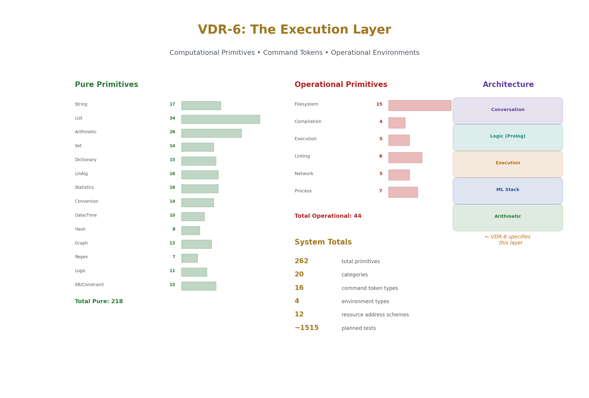
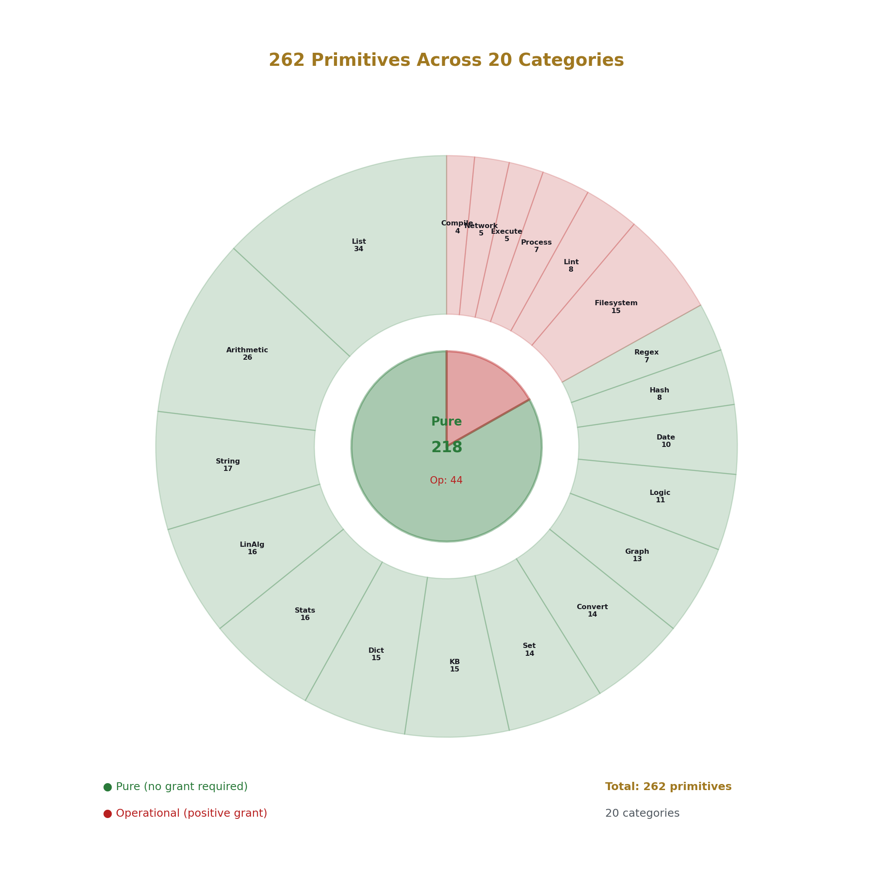
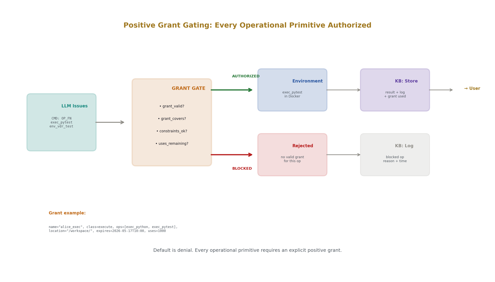
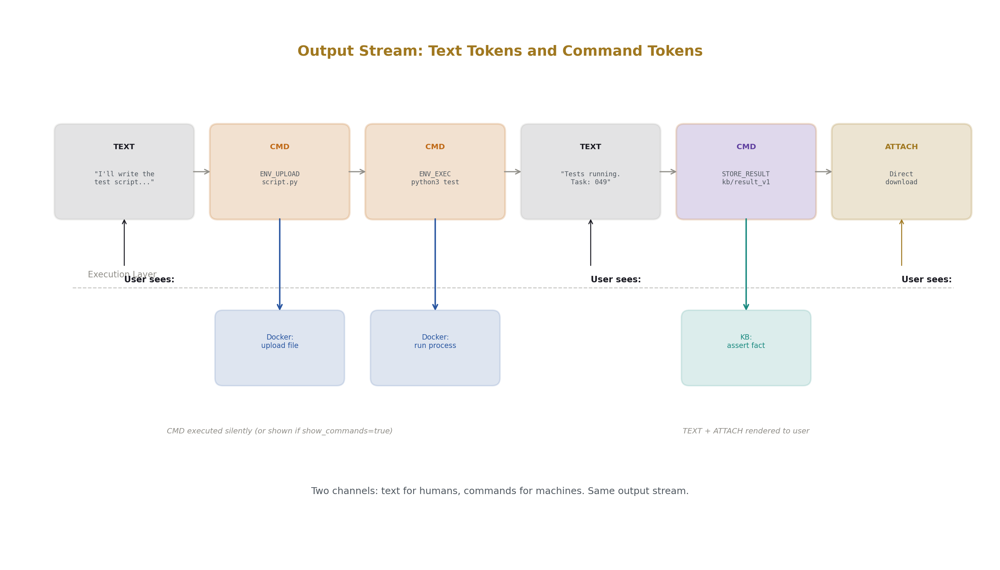
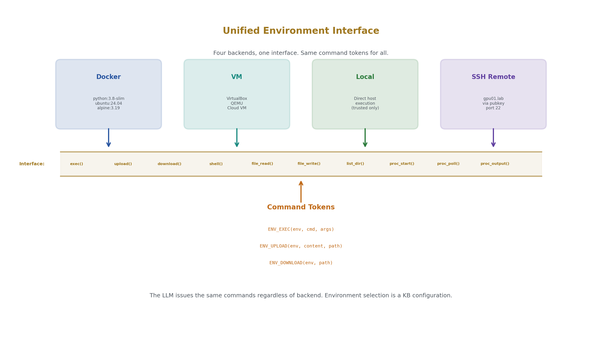
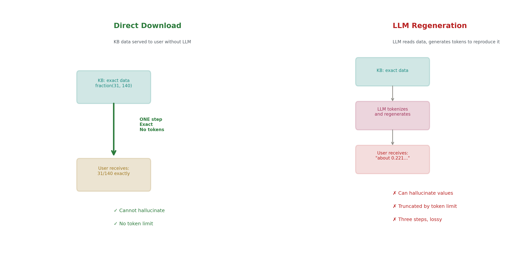
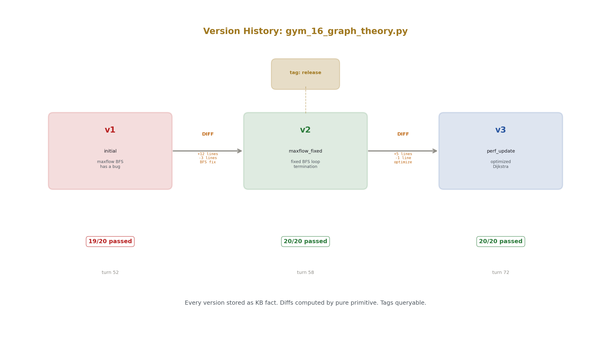
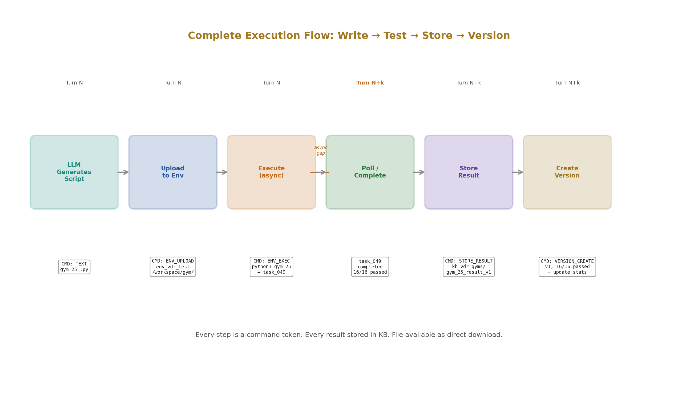

# Computational Primitives and Operational Environments
## The Execution Layer for VDR-LLM-Prolog

**Registry:** [@HOWL-VDR-6-2026]

**Series Path:** [@HOWL-VDR-1-2026] → [@HOWL-VDR-2-2026] → [@HOWL-MATH-3-2026] → [@HOWL-MATH-4-2026]  → [@HOWL-VDR-3-2026] → [@HOWL-VDR-4-2026] → [@HOWL-LLM-1-2026] → [@HOWL-VDR-5-2026] → [@HOWL-VDR-6-2026]

**DOI:** 10.5281/zenodo.20214563

**Date:** May 2026

**Domain:** Applied Philosophy / Systems Architecture / Exact Computation

**AI Usage Disclosure:** Only the top metadata, figures, refs and final copyright sections were edited by the author. All paper content was LLM-generated using Anthropic's Opus 4.6.

---

## Abstract

VDR-5 specified the knowledge architecture for an exact-arithmetic language model with logical provenance, scoped knowledge bases, constraint enforcement, and first-class data surfacing. This companion paper specifies the execution layer: what the system can actually do. It defines 196 pure computational primitives across 14 categories (string, list, arithmetic, set, dictionary, linear algebra, statistics, conversion, date, hashing, graph, regex, logic, and KB operations) and 58 operational primitives across 6 categories (filesystem, compilation, script execution, linting, network, and process management). It specifies the command token mechanism by which the language model issues structured operations instead of generating text. It specifies operational environments (Docker, VM, local, SSH) with a unified interface. It specifies the positive credential gating system that authorizes every side-effecting operation. It specifies async task execution with KB-stored results, chunked I/O, and turn-like processing. It specifies versioning as a native KB operation. And it specifies direct data download — the ability to serve KB contents, file contents, and computed results to the user without LLM token generation.

The central principle is separation of concerns. The language model understands intent, makes plans, and generates explanations. The primitives compute. The operational environments execute. The KB stores. The constraint system authorizes. The surfacing layer presents. No component does another's job. The result is a system where computation is exact, execution is sandboxed, authorization is declarative, results are persistent, and everything is queryable.

---

## 1. Why an Execution Layer

VDR-5 specified what the system knows. This paper specifies what the system does.

A language model that can store exact fractions, track provenance, manage scoped knowledge bases, and enforce constraints is a powerful reasoning system. But it cannot sort a list reliably. It cannot compile code. It cannot run tests. It cannot read files. It cannot download data. It cannot do any of these things because it is a token predictor, and token prediction is not computation.

The execution layer gives the system hands. Pure primitives perform exact computation — sorting, arithmetic, string operations, linear algebra — with guaranteed correctness. Operational primitives interact with the outside world — files, compilers, networks, processes — with declared authorization and logged execution. Command tokens let the language model invoke both kinds of primitives as structured operations rather than generated text. Operational environments provide sandboxed contexts where code runs safely.

The execution layer does not replace the language model. It complements it. The language model recognizes that a sort is needed. The sort primitive performs it correctly. The language model recognizes that code should be tested. The execution primitive runs pytest in a Docker container and stores the results in the KB. The language model frames the results for the user. Each component does what it does best.



---

## 2. Pure Primitives

A pure primitive is a function that always produces the same output from the same input, has no side effects, terminates in bounded time, operates on exact VDR types, and carries declarable constraint invariants. Pure primitives do not require authorization grants. They are safe by construction.



### 2.1 Category 1: String Operations (17 primitives)

| # | Primitive | Signature | Description |
|---|-----------|-----------|-------------|
| 1 | string_reverse | atom → atom | Reverse character order |
| 2 | string_length | atom → number | Character count |
| 3 | string_concat | atom, atom → atom | Concatenation |
| 4 | string_slice | atom, number, number → atom | Substring by start and end index |
| 5 | string_contains | atom, atom → bool | Substring membership test |
| 6 | string_split | atom, atom → list(atom) | Split by delimiter |
| 7 | string_join | list(atom), atom → atom | Join with delimiter |
| 8 | string_trim | atom → atom | Remove leading and trailing whitespace |
| 9 | string_upper | atom → atom | Convert to uppercase |
| 10 | string_lower | atom → atom | Convert to lowercase |
| 11 | string_replace | atom, atom, atom → atom | Replace all occurrences of pattern |
| 12 | string_starts_with | atom, atom → bool | Prefix test |
| 13 | string_ends_with | atom, atom → bool | Suffix test |
| 14 | string_pad_left | atom, number, atom → atom | Left-pad to target width |
| 15 | string_char_at | atom, number → atom | Character at index |
| 16 | string_to_chars | atom → list(atom) | Explode to character list |
| 17 | chars_to_string | list(atom) → atom | Implode from character list |

Every string operation produces an exact result deterministically. String reversal of "hello" is always "olleh." String split of "a,b,c" on "," is always ["a","b","c"]. These operations are among the most common sources of LLM errors when performed by token prediction. As primitives, they are infallible.

### 2.2 Category 2: List Operations (34 primitives)

| # | Primitive | Signature | Description |
|---|-----------|-----------|-------------|
| 18 | list_length | list → number | Element count |
| 19 | list_append | list, term → list | Add element to end |
| 20 | list_prepend | term, list → list | Add element to front |
| 21 | list_concat | list, list → list | Concatenate two lists |
| 22 | list_reverse | list → list | Reverse element order |
| 23 | list_sort | list, rule → list | Sort by declared comparison rule |
| 24 | list_sort_reverse | list, rule → list | Sort descending by rule |
| 25 | list_sort_by_key | list(term), key_fn → list(term) | Sort by extracted key |
| 26 | list_unique | list → list | Remove duplicates preserving first occurrence |
| 27 | list_flatten | list(list) → list | One-level flatten |
| 28 | list_zip | list, list → list(pair) | Pair-wise zip |
| 29 | list_unzip | list(pair) → (list, list) | Separate pairs |
| 30 | list_head | list → term | First element |
| 31 | list_tail | list → list | All elements except first |
| 32 | list_last | list → term | Last element |
| 33 | list_init | list → list | All elements except last |
| 34 | list_nth | list, number → term | Element at index |
| 35 | list_take | list, number → list | First N elements |
| 36 | list_drop | list, number → list | Skip first N elements |
| 37 | list_slice | list, number, number → list | Sublist by index range |
| 38 | list_filter | list, predicate → list | Keep elements matching predicate |
| 39 | list_map | list, fn → list | Apply function to each element |
| 40 | list_reduce | list, fn, init → term | Left fold with accumulator |
| 41 | list_any | list, predicate → bool | Any element matches |
| 42 | list_all | list, predicate → bool | All elements match |
| 43 | list_count | list, predicate → number | Count matching elements |
| 44 | list_index_of | list, term → number | Index of first occurrence |
| 45 | list_contains | list, term → bool | Membership test |
| 46 | list_min | list → term | Minimum element |
| 47 | list_max | list → term | Maximum element |
| 48 | list_enumerate | list → list(pair) | Pair each element with its index |
| 49 | list_chunk | list, number → list(list) | Split into fixed-size chunks |
| 50 | list_interleave | list, list → list | Alternating merge |
| 51 | list_partition | list, predicate → (list, list) | Split by predicate into pass and fail |
| 52 | list_group_by | list(term), key_fn → dict | Group elements by extracted key |
| 53 | list_frequencies | list → dict | Count occurrences of each element |

Sorting is the critical primitive. A list_sort of 10 elements by token prediction has approximately 95% accuracy. A list_sort of 100 elements drops below 50%. A list_sort of 1000 elements is effectively impossible by token prediction. The primitive sorts correctly regardless of size, with O(n log n) performance and exact comparison via VDR fraction ordering.

### 2.3 Category 3: VDR Arithmetic (26 primitives)

| # | Primitive | Signature | Description |
|---|-----------|-----------|-------------|
| 54 | vdr_add | fraction, fraction → fraction | Exact rational addition |
| 55 | vdr_sub | fraction, fraction → fraction | Exact rational subtraction |
| 56 | vdr_mul | fraction, fraction → fraction | Exact rational multiplication |
| 57 | vdr_div | fraction, fraction → fraction | Exact rational division |
| 58 | vdr_neg | fraction → fraction | Exact negation |
| 59 | vdr_abs | fraction → fraction | Absolute value |
| 60 | vdr_pow | fraction, number → fraction | Integer power |
| 61 | vdr_gcd | number, number → number | Greatest common divisor |
| 62 | vdr_lcm | number, number → number | Least common multiple |
| 63 | vdr_mod | number, number → number | Modular remainder |
| 64 | vdr_floor | fraction → number | Floor to integer |
| 65 | vdr_ceil | fraction → number | Ceiling to integer |
| 66 | vdr_round | fraction → number | Round to nearest integer |
| 67 | vdr_numerator | fraction → number | Extract numerator |
| 68 | vdr_denominator | fraction → number | Extract denominator |
| 69 | vdr_is_integer | fraction → bool | Test if denominator is 1 |
| 70 | vdr_simplify | fraction → fraction | Reduce to lowest terms |
| 71 | vdr_compare | fraction, fraction → atom | Return less, equal, or greater |
| 72 | vdr_min | fraction, fraction → fraction | Minimum of two |
| 73 | vdr_max | fraction, fraction → fraction | Maximum of two |
| 74 | vdr_sum | list(fraction) → fraction | Exact sum of list |
| 75 | vdr_product | list(fraction) → fraction | Exact product of list |
| 76 | vdr_mean | list(fraction) → fraction | Exact arithmetic mean |
| 77 | vdr_factorial | number → number | Factorial |
| 78 | vdr_binomial | number, number → number | Binomial coefficient |
| 79 | vdr_fibonacci | number → number | Nth Fibonacci number |

Arithmetic is the original motivation for VDR. Every arithmetic operation an LLM performs by token prediction is unreliable. 1/7 + 1/13 by token prediction might produce 20/91 or might produce something wrong. The primitive always produces 20/91.

### 2.4 Category 4: Set Operations (14 primitives)

| # | Primitive | Signature | Description |
|---|-----------|-----------|-------------|
| 80 | set_from_list | list → set | Deduplicate and sort |
| 81 | set_to_list | set → list | Convert to sorted list |
| 82 | set_union | set, set → set | Union |
| 83 | set_intersection | set, set → set | Intersection |
| 84 | set_difference | set, set → set | Elements in first not in second |
| 85 | set_symmetric_diff | set, set → set | Elements in either but not both |
| 86 | set_is_subset | set, set → bool | Subset test |
| 87 | set_is_superset | set, set → bool | Superset test |
| 88 | set_is_disjoint | set, set → bool | No common elements |
| 89 | set_size | set → number | Cardinality |
| 90 | set_contains | set, term → bool | Membership test |
| 91 | set_add | set, term → set | Add element |
| 92 | set_remove | set, term → set | Remove element |
| 93 | set_power | set → set(set) | Power set |

Set operations are foundational to the constraint system. Constraint sets, KB scope sets, tag groups, and permission sets all use exact set algebra. The primitives ensure these operations are correct regardless of set size.

### 2.5 Category 5: Dictionary Operations (15 primitives)

| # | Primitive | Signature | Description |
|---|-----------|-----------|-------------|
| 94 | dict_new | → dict | Empty dictionary |
| 95 | dict_from_pairs | list(pair) → dict | Construct from key-value pairs |
| 96 | dict_get | dict, key → term | Lookup, fail if missing |
| 97 | dict_get_or | dict, key, default → term | Lookup with default |
| 98 | dict_set | dict, key, value → dict | Insert or update entry |
| 99 | dict_remove | dict, key → dict | Remove entry by key |
| 100 | dict_contains_key | dict, key → bool | Key existence test |
| 101 | dict_keys | dict → list | All keys sorted |
| 102 | dict_values | dict → list | All values |
| 103 | dict_pairs | dict → list(pair) | All key-value pairs |
| 104 | dict_size | dict → number | Entry count |
| 105 | dict_merge | dict, dict → dict | Merge, second dict wins conflicts |
| 106 | dict_filter_keys | dict, predicate → dict | Keep entries with matching keys |
| 107 | dict_map_values | dict, fn → dict | Transform all values |
| 108 | dict_invert | dict → dict | Swap keys and values |

Working data sets in VDR-Prolog are dictionaries. Reliable dictionary operations are essential for scoped binding management.

### 2.6 Category 6: Linear Algebra (16 primitives)

| # | Primitive | Signature | Description |
|---|-----------|-----------|-------------|
| 109 | vec_add | frac_vec, frac_vec → frac_vec | Exact vector addition |
| 110 | vec_sub | frac_vec, frac_vec → frac_vec | Exact vector subtraction |
| 111 | vec_scale | fraction, frac_vec → frac_vec | Exact scalar multiply |
| 112 | vec_dot | frac_vec, frac_vec → fraction | Exact dot product |
| 113 | vec_norm_sq | frac_vec → fraction | Exact squared norm |
| 114 | mat_add | frac_mat, frac_mat → frac_mat | Exact matrix addition |
| 115 | mat_mul | frac_mat, frac_mat → frac_mat | Exact matrix multiplication |
| 116 | mat_scale | fraction, frac_mat → frac_mat | Exact scalar multiply |
| 117 | mat_transpose | frac_mat → frac_mat | Transpose |
| 118 | mat_det | frac_mat → fraction | Exact determinant |
| 119 | mat_inv | frac_mat → frac_mat | Exact inverse |
| 120 | mat_solve | frac_mat, frac_vec → frac_vec | Exact solve Ax=b |
| 121 | mat_rank | frac_mat → number | Exact rank |
| 122 | mat_identity | number → frac_mat | Identity matrix |
| 123 | mat_trace | frac_mat → fraction | Exact trace |
| 124 | mat_matvec | frac_mat, frac_vec → frac_vec | Exact matrix-vector product |

These are the VDR linear algebra operations from VDR-1 through VDR-4, exposed as Prolog predicates. Every operation that the transformer forward pass uses is available as a traceable, provenance-recorded primitive.

### 2.7 Category 7: Statistics and Probability (16 primitives)

| # | Primitive | Signature | Description |
|---|-----------|-----------|-------------|
| 125 | stat_mean | list(fraction) → fraction | Exact arithmetic mean |
| 126 | stat_variance | list(fraction) → fraction | Exact population variance |
| 127 | stat_median | list(fraction) → fraction | Exact median |
| 128 | stat_mode | list → term | Most frequent element |
| 129 | stat_percentile | list(fraction), fraction → fraction | Exact Nth percentile |
| 130 | prob_normalize | list(fraction) → list(fraction) | Normalize to exact sum 1 |
| 131 | prob_is_valid | list(fraction) → bool | All non-negative, sum exactly 1 |
| 132 | prob_entropy_terms | list(fraction) → list(fraction) | Individual -p·log(p) terms |
| 133 | prob_cdf | list(fraction) → list(fraction) | Exact cumulative distribution |
| 134 | prob_expected | list(fraction), list(fraction) → fraction | Exact expected value |
| 135 | prob_bayes | fraction, fraction, fraction → fraction | Exact Bayes' theorem |
| 136 | prob_joint | list(fraction), list(fraction) → frac_mat | Joint probability table |
| 137 | prob_marginal | frac_mat, atom → list(fraction) | Marginalize over axis |
| 138 | prob_conditional | frac_mat, number → list(fraction) | Conditional distribution |
| 139 | softmax | list(fraction), number → list(fraction) | Exact VDR softmax |
| 140 | softmax_surrogate | list(fraction), number → list(fraction) | Rational surrogate softmax |

The softmax primitive guarantees that output probabilities sum to exactly 1. The prob_normalize primitive guarantees the same for arbitrary input vectors. These guarantees are impossible in float arithmetic.

### 2.8 Category 8: Conversion and Formatting (14 primitives)

| # | Primitive | Signature | Description |
|---|-----------|-----------|-------------|
| 141 | to_string | term → atom | Any term to display string |
| 142 | to_number | atom → number | Parse integer from string |
| 143 | to_fraction | atom → fraction | Parse fraction from string |
| 144 | fraction_to_decimal | fraction, number → atom | Decimal with N digits |
| 145 | format_table | list(list(atom)) → atom | Format as aligned text table |
| 146 | format_json | dict → atom | Serialize to JSON |
| 147 | parse_json | atom → dict | Parse JSON to dict |
| 148 | format_csv | list(list(atom)), atom → atom | Format as delimited text |
| 149 | parse_csv | atom, atom → list(list(atom)) | Parse delimited text to rows |
| 150 | number_to_roman | number → atom | Roman numeral conversion |
| 151 | number_to_words | number → atom | English word representation |
| 152 | format_fraction | fraction → atom | Display fraction as "p/q" |
| 153 | format_percentage | fraction, number → atom | Percentage with N decimal places |
| 154 | format_scientific | fraction, number → atom | Scientific notation |

Formatting errors — wrong decimal places, incorrect rounding, mangled table alignment — are common LLM failures. As primitives, formatting is deterministic and tested.

### 2.9 Category 9: Date and Time (10 primitives)

| # | Primitive | Signature | Description |
|---|-----------|-----------|-------------|
| 155 | date_from_ymd | number, number, number → number | Year, month, day to day count |
| 156 | date_to_ymd | number → (number, number, number) | Day count to year, month, day |
| 157 | date_diff_days | number, number → number | Days between two dates |
| 158 | date_add_days | number, number → number | Add days to a date |
| 159 | date_day_of_week | number → atom | Day name from date |
| 160 | date_is_leap_year | number → bool | Leap year test |
| 161 | date_days_in_month | number, number → number | Days in given month and year |
| 162 | time_from_hms | number, number, fraction → fraction | Hours, minutes, seconds to day fraction |
| 163 | time_to_hms | fraction → (number, number, fraction) | Day fraction to hours, minutes, seconds |
| 164 | duration_between | fraction, fraction → fraction | Exact time difference |

Date arithmetic is a notorious LLM failure mode. Month lengths, leap years, day-of-week calculations — all are exact integer algorithms that token prediction gets wrong. The primitives use the correct Gregorian calendar algorithms.

### 2.10 Category 10: Hashing and Encoding (8 primitives)

| # | Primitive | Signature | Description |
|---|-----------|-----------|-------------|
| 165 | hash_string | atom → number | Deterministic string hash |
| 166 | hash_combine | number, number → number | Combine two hash values |
| 167 | base64_encode | atom → atom | Base64 encoding |
| 168 | base64_decode | atom → atom | Base64 decoding (exact inverse) |
| 169 | hex_encode | number → atom | Integer to hexadecimal string |
| 170 | hex_decode | atom → number | Hexadecimal string to integer |
| 171 | crc32 | atom → number | CRC32 checksum |
| 172 | uuid_from_seed | number → atom | Deterministic UUID from seed |

Identifier generation and data integrity checking must be deterministic. These primitives are reproducible from the same inputs on any platform.

### 2.11 Category 11: Graph Operations (13 primitives)

| # | Primitive | Signature | Description |
|---|-----------|-----------|-------------|
| 173 | graph_from_edges | list(pair) → graph | Construct adjacency structure |
| 174 | graph_neighbors | graph, node → list(node) | Adjacent nodes |
| 175 | graph_shortest_path | graph, node, node → list(node) | BFS shortest path (unweighted) |
| 176 | graph_shortest_path_weighted | graph, node, node → (list(node), fraction) | Dijkstra with exact VDR weights |
| 177 | graph_connected_components | graph → list(list(node)) | All connected components |
| 178 | graph_is_connected | graph → bool | Connectivity test |
| 179 | graph_topological_sort | graph → list(node) | Topological ordering for DAGs |
| 180 | graph_cycle_detect | graph → bool | Cycle existence test |
| 181 | graph_bfs | graph, node → list(node) | Breadth-first traversal order |
| 182 | graph_dfs | graph, node → list(node) | Depth-first traversal order |
| 183 | graph_degree | graph, node → number | Node degree |
| 184 | graph_mst | graph → list(edge) | Minimum spanning tree with exact weights |
| 185 | graph_pagerank | graph, fraction → list(fraction) | PageRank with exact rational damping |

The KB hierarchy is a tree (a special graph). Provenance chains are directed acyclic graphs. Topic dependencies form graphs. The graph primitives operate on these structures with exact VDR arithmetic for all weighted operations.

### 2.12 Category 12: Pattern Matching (7 primitives)

| # | Primitive | Signature | Description |
|---|-----------|-----------|-------------|
| 186 | regex_match | atom, atom → bool | Full string match against pattern |
| 187 | regex_search | atom, atom → list(atom) | Find all pattern matches |
| 188 | regex_replace | atom, atom, atom → atom | Replace all pattern matches |
| 189 | regex_split | atom, atom → list(atom) | Split string by pattern |
| 190 | regex_capture | atom, atom → list(atom) | Extract capture group matches |
| 191 | glob_match | atom, atom → bool | Glob-style pattern match |
| 192 | wildcard_match | atom, atom → bool | Simple wildcard match |

Data validation, input parsing, and structured text extraction. LLMs frequently generate incorrect regex patterns. The primitives execute deterministic regex engines.

### 2.13 Category 13: Logic and Control (11 primitives)

| # | Primitive | Signature | Description |
|---|-----------|-----------|-------------|
| 193 | if_then_else | bool, fn, fn → term | Conditional evaluation |
| 194 | case_match | term, list(pair(pattern, fn)) → term | Pattern-dispatch evaluation |
| 195 | for_each | list, fn → void | Apply function to each element |
| 196 | repeat_n | number, fn → list | Apply function N times, collect results |
| 197 | while_loop | predicate, fn, state → state | Iterate while predicate holds |
| 198 | try_catch | fn, handler → term | Execute with error recovery |
| 199 | assert_that | bool, atom → void | Runtime assertion with message |
| 200 | type_check | term, type → bool | Runtime type verification |
| 201 | is_bound | variable → bool | Prolog variable binding test |
| 202 | findall | template, goal → list | Collect all Prolog solutions |
| 203 | aggregate | goal, fn, init → term | Fold over Prolog solutions |

### 2.14 Category 14: KB and Constraint Operations (15 primitives)

| # | Primitive | Signature | Description |
|---|-----------|-----------|-------------|
| 204 | kb_assert | fact → void | Add fact to active KB |
| 205 | kb_retract | fact → void | Remove fact from active KB |
| 206 | kb_query | predicate, args → list(result) | Query active scope |
| 207 | kb_query_in | kb_name, predicate, args → list(result) | Query specific KB bypassing scope |
| 208 | kb_query_across | predicate, args → list(kb_name, result) | Query all KBs with tagged results |
| 209 | kb_list_facts | kb_name → list(fact) | All facts in named KB |
| 210 | kb_list_rules | kb_name → list(rule) | All rules in named KB |
| 211 | kb_active_scope | → list(kb_name) | Currently in-scope KB names |
| 212 | kb_switch_topic | topic_name → void | Change active topic and scope |
| 213 | constraint_check | constraint_name → bool | Verify specific constraint |
| 214 | constraint_check_all | → list(violation) | Verify all active constraints |
| 215 | constraint_add | constraint → void | Add constraint to active KB |
| 216 | constraint_remove | constraint_name → void | Remove constraint from active KB |
| 217 | constraint_enable | constraint_name → void | Activate suspended constraint |
| 218 | constraint_suspend | constraint_name → void | Suspend active constraint |

KB operations are pure in the sense that they operate on the KB's internal state deterministically. They modify KB state (assert and retract change the fact set) but do not interact with the external world. They do not require positive grants because KB access is governed by the scoping and permission system specified in VDR-5.

### 2.15 Pure Primitive Summary

14 categories. 218 primitives. Every one is pure (same inputs produce same outputs), finite (terminates in bounded time), exact (produces the correct result, not an approximation), typed (inputs and outputs have declared VDR-Prolog term types), and testable (covered by a test suite verifying edge cases and invariants).

---

## 3. Operational Primitives

An operational primitive interacts with the outside world. It reads or writes files. It compiles code. It executes scripts. It communicates over networks. It manages processes. These operations can fail for external reasons (disk full, network down, permission denied). They take variable time. They have side effects.

Every operational primitive requires a positive credential grant before execution. The default is denial. The grant must explicitly authorize the operation class, the specific operations within that class, the target location, and must be currently valid (not expired, not exhausted, not revoked).

### 3.1 Category 15: Filesystem Operations (15 primitives)

| # | Primitive | Class | Side Effect | Description |
|---|-----------|-------|-------------|-------------|
| 219 | fs_read | filesystem | Read | Read file contents |
| 220 | fs_write | filesystem | Write | Create or overwrite file |
| 221 | fs_append | filesystem | Write | Append to existing file |
| 222 | fs_exists | filesystem | Read | Check file existence |
| 223 | fs_list_dir | filesystem | Read | List directory contents |
| 224 | fs_create_dir | filesystem | Write | Create directory and parents |
| 225 | fs_delete | filesystem | Delete | Delete file or directory |
| 226 | fs_move | filesystem | Write | Move or rename |
| 227 | fs_copy | filesystem | Write | Copy file |
| 228 | fs_file_size | filesystem | Read | Get file size in bytes |
| 229 | fs_file_modified | filesystem | Read | Get modification timestamp |
| 230 | fs_glob | filesystem | Read | Find files matching pattern |
| 231 | fs_tree | filesystem | Read | Recursive directory listing |
| 232 | fs_diff | filesystem | Read | Diff two files |
| 233 | fs_checksum | filesystem | Read | Compute file hash |

### 3.2 Category 16: Code Compilation (4 primitives)

| # | Primitive | Class | Side Effect | Description |
|---|-----------|-------|-------------|-------------|
| 234 | compile_python_check | compile | Read, CPU | Python syntax verification |
| 235 | compile_zig | compile | Read, Write, CPU | Zig compilation |
| 236 | compile_c | compile | Read, Write, CPU | C compilation |
| 237 | compile_rust | compile | Read, Write, CPU | Rust compilation |

### 3.3 Category 17: Script Execution (5 primitives)

| # | Primitive | Class | Side Effect | Description |
|---|-----------|-------|-------------|-------------|
| 238 | exec_python | execute | Arbitrary | Run Python script |
| 239 | exec_shell | execute | Arbitrary | Run shell command |
| 240 | exec_zig_test | execute | Read, CPU | Run Zig test suite |
| 241 | exec_pytest | execute | Read, CPU | Run pytest |
| 242 | exec_script | execute | Arbitrary | Run script with specified interpreter |

### 3.4 Category 18: Linting and Analysis (8 primitives)

| # | Primitive | Class | Side Effect | Description |
|---|-----------|-------|-------------|-------------|
| 243 | lint_python | lint | Read | Python linter |
| 244 | lint_zig | lint | Read | Zig linter |
| 245 | lint_json | lint | Read | JSON validation |
| 246 | lint_markdown | lint | Read | Markdown checker |
| 247 | analyze_imports | lint | Read | List Python imports |
| 248 | analyze_complexity | lint | Read | Cyclomatic complexity metrics |
| 249 | analyze_dependencies | lint | Read | Module dependency graph |
| 250 | count_lines | lint | Read | Line counts by type |

### 3.5 Category 19: Network Operations (5 primitives)

| # | Primitive | Class | Side Effect | Description |
|---|-----------|-------|-------------|-------------|
| 251 | net_download | network | Network, Write | Download URL to file |
| 252 | net_fetch | network | Network | HTTP GET, return content |
| 253 | net_post | network | Network | HTTP POST |
| 254 | net_ping | network | Network | Check host reachability |
| 255 | net_dns_resolve | network | Network | DNS lookup |

### 3.6 Category 20: Process Management (7 primitives)

| # | Primitive | Class | Side Effect | Description |
|---|-----------|-------|-------------|-------------|
| 256 | proc_start | process | Process creation | Start background process |
| 257 | proc_poll | process | Read | Check process status |
| 258 | proc_wait | process | Block | Wait for process completion |
| 259 | proc_kill | process | Process termination | Terminate process |
| 260 | proc_stdout | process | Read | Read current stdout buffer |
| 261 | proc_stderr | process | Read | Read current stderr buffer |
| 262 | proc_list | process | Read | List active processes |

### 3.7 Operational Primitive Summary

6 categories. 44 primitives. Every one requires a positive grant. Every execution is logged as a KB fact with timestamp, duration, exit code, grant used, and environment. Every side effect is declared in the primitive's type signature.

---

## 4. The Positive Credential Grant System



### 4.1 Grant Structure

```
Grant = struct {
    name: Text,                   // unique identifier
    operation_class: Text,        // "filesystem", "compile", "execute", "network", "process"
    allowed_operations: []Text,   // specific operations within class
    location: Text,               // path prefix, URL pattern, or scope
    credential: CredentialRef,    // authentication token reference
    issued_by: Text,              // who created this grant
    issued_at: timestamp,         // when created
    expires_at: timestamp,        // when it becomes invalid
    max_uses: number,             // total allowed invocations (0 = unlimited)
    uses_remaining: number,       // decremented on each use
    constraints: []Constraint,    // additional restrictions
    status: enum { active, expired, revoked, exhausted },
};
```

### 4.2 Grant Verification

Every operational primitive invocation passes through grant verification:

```
Rule: grant_valid(G) :-
    grant(G, _, _, _, _, _, _, Exp, _, Uses, _, Status),
    Status = active,
    current_timestamp(Now),
    Now < Exp,
    Uses > 0.

Rule: grant_covers(G, Op, Loc) :-
    grant(G, Class, Allowed, GrantLoc, _, _, _, _, _, _, _, _),
    operation_class(Op, Class),
    operation_type(Op, Type),
    member(Type, Allowed),
    path_within(Loc, GrantLoc).

Rule: grant_constraints_ok(G, Op) :-
    grant(G, _, _, _, _, _, _, _, _, _, Constraints, _),
    forall(member(C, Constraints), constraint_satisfied_for(C, Op)).

Rule: authorize(Op, Loc) :-
    grant_valid(G),
    grant_covers(G, Op, Loc),
    grant_constraints_ok(G, Op),
    decrement_uses(G),
    log_authorization(G, Op, Loc).
```

If no valid grant covers the requested operation, the operation is rejected before execution. The rejection is logged as a KB fact including the operation attempted, the location, the timestamp, and the reason for rejection.

### 4.3 Grant Hierarchy

Grants follow the KB hierarchy. A user inherits grants from their group, department, and organization, the same way they inherit constraints (VDR-5 Addendum A2).

```
kb_global:         grant("system_read", filesystem, [read], "/usr/", ...)
kb_org_acme:       grant("org_network", network, [fetch, ping], "*", ...)
kb_dept_eng:       grant("eng_compile", compile, [compile_python_check, compile_zig], "/projects/", ...)
kb_team_backend:   grant("backend_exec", execute, [exec_python, exec_pytest], "/projects/backend/", ...)
kb_user_alice:     grant("alice_fs", filesystem, [read, write, create_dir], "/home/alice/", ...)
```

Alice's effective grants are the union of all grants in her ancestry chain. She can read system files (global), access the network (org), compile in project directories (dept), run Python and pytest in backend directories (team), and read/write in her home directory (personal).

### 4.4 Grant Lifecycle

| From | To | Trigger | Automatic? |
|------|----|---------|-----------|
| (new) | active | Issued by authorized entity | No — requires explicit creation |
| active | expired | Current time exceeds expires_at | Yes |
| active | exhausted | uses_remaining reaches 0 | Yes |
| active | revoked | Issuer or admin revokes | No — requires explicit action |
| expired | active | Re-issued with new expiration | No — requires new grant |
| revoked | active | Not possible — revocation is permanent | — |

All transitions are logged as KB facts with timestamp, source, and reason.

---

## 5. Command Tokens



### 5.1 The Mechanism

The language model's output is a stream of tokens. In standard systems, all tokens are text. In VDR-LLM-Prolog, the stream contains two token types: text tokens (rendered as conversation text) and command tokens (executed by the primitive system).

A command token is a structured invocation:

```
CommandToken = struct {
    type: CommandType,
    primitive: Text,        // primitive name
    args: []Term,           // arguments
    env: ?Text,             // operational environment (for op primitives)
    grant: ?Text,           // grant reference (for op primitives)
    store_result: ?Text,    // KB key to store result
    await: bool,            // whether to wait for completion
};
```

### 5.2 Command Types

| Type | Purpose | Requires Grant | Async? |
|------|---------|---------------|--------|
| PURE_FN | Invoke pure primitive | No | No |
| OP_FN | Invoke operational primitive | Yes | Optional |
| KB_ASSERT | Assert fact into KB | No (scoped by permissions) | No |
| KB_RETRACT | Remove fact from KB | No (scoped by permissions) | No |
| KB_QUERY | Query KB | No (scoped by permissions) | No |
| ENV_EXEC | Execute command in environment | Yes | Recommended |
| ENV_UPLOAD | Upload content to environment | Yes | No |
| ENV_DOWNLOAD | Download content from environment | Yes | No |
| CTX_ACTIVATE | Activate KB in context | No | No |
| CTX_DEACTIVATE | Deactivate KB from context | No | No |
| CTX_SNAPSHOT | Snapshot current context | No | No |
| VERSION_CREATE | Create new version of artifact | No | No |
| VERSION_TAG | Tag a version | No | No |
| STORE_RESULT | Store task result in KB | No | No |
| DIRECT_OUTPUT | Serve data directly to user | No | No |
| ATTACHMENT | Attach file to response | Yes (read grant) | No |

### 5.3 Output Stream Structure

The LLM's output stream interleaves text and command tokens:

```
[TEXT] "I'll write the test script and run it."
[CMD:ENV_UPLOAD] env=env_vdr, content=<script>, path="/workspace/test.py"
[CMD:ENV_EXEC] env=env_vdr, cmd="python3", args=["/workspace/test.py"]
  → task_id = task_047, async=true
[CMD:STORE_RESULT] task=task_047, kb=kb_vdr_tests, key="test_result_v1"
[TEXT] "Tests are running in background. Task ID: task_047."
```

Text tokens are rendered as conversation. Command tokens are executed. The user sees the text and the command outcomes. Commands can optionally be shown or hidden based on user preference:

```
User preference: show_commands = true

Output:
  "I'll write the test script and run it."
  [Executing: upload test.py to env_vdr → ok]
  [Executing: python3 test.py in env_vdr → task_047 started]
  [Storing: task_047 result → kb_vdr_tests/test_result_v1]
  "Tests are running in background. Task ID: task_047."
```

```
User preference: show_commands = false

Output:
  "I'll write the test script and run it. Tests are running 
   in background. Task ID: task_047."
```

### 5.4 Scratchpad Channel

The LLM has an internal scratchpad where it can issue command tokens for intermediate computation without surfacing them in the user-facing output:

```
Scratchpad (internal):
  [CMD:PURE_FN] list_sort([47, 3, 91, 15], ascending) → [3, 15, 47, 91]
  [CMD:PURE_FN] vdr_mean([3/7, 1/2, 5/11]) → 191/462
  [CMD:KB_QUERY] kb_characters_b, "bob_age" → 59

User-facing output:
  "The sorted list is [3, 15, 47, 91], the mean is 191/462, 
   and Bob is 59 in the London story."
```

The scratchpad computations are exact (executed by primitives). The user-facing output frames the results. The owner can inspect the scratchpad via "/show scratchpad" to see the full computation trace.

---

## 6. Operational Environments



### 6.1 Environment Types

| Type | Implementation | Isolation | Performance | Best For |
|------|---------------|-----------|-------------|----------|
| Docker | Container on host | Strong | Good | Default sandbox, testing, scripts |
| VM | Virtual machine | Strongest | Moderate | Untrusted code, heavy workloads |
| Local | Direct host execution | None | Best | Trusted operations, development |
| SSH | Remote machine via SSH | Network-isolated | Variable | GPU servers, distributed compute |

### 6.2 Environment Structure

```
OperationalEnv = struct {
    id: Text,
    type: enum { docker, vm, local, ssh_remote },
    
    // Type-specific configuration
    docker_image: ?Text,           // "python:3.8-slim", "ubuntu:24.04"
    docker_container_id: ?Text,
    vm_id: ?Text,
    vm_image: ?Text,
    ssh_host: ?Text,
    ssh_port: ?number,
    ssh_credential: ?Text,
    local_working_dir: ?Text,
    
    // Common
    status: enum { stopped, starting, running, error },
    startup_script: ?Text,
    installed_packages: []Text,
    env_vars: dict,
    resource_limits: ResourceLimits,
    created_at: timestamp,
    last_active: timestamp,
    
    // KB integration
    kb: Text,
    grants: []Text,
};

ResourceLimits = struct {
    max_cpu_seconds: ?number,
    max_memory_mb: ?number,
    max_disk_mb: ?number,
    max_network_bytes: ?number,
    max_processes: ?number,
};
```

### 6.3 Unified Interface

Every environment type implements the same interface:

| Operation | Signature | Description |
|-----------|-----------|-------------|
| env_exec | (env, command, args) → ExecResult | Execute command |
| env_upload | (env, content, remote_path) → TransferResult | Upload content |
| env_download | (env, remote_path) → Content | Download content |
| env_shell | (env, command) → ShellResult | Run shell command |
| env_file_read | (env, path) → Content | Read file in environment |
| env_file_write | (env, path, content) → WriteResult | Write file in environment |
| env_list_dir | (env, path) → list(DirEntry) | List directory in environment |
| env_proc_start | (env, command) → TaskId | Start background process |
| env_proc_poll | (env, task_id) → TaskStatus | Check process status |
| env_proc_output | (env, task_id) → (stdout, stderr) | Get process output |

Whether the backend is Docker, VM, SSH, or local, the LLM issues the same command tokens. The environment type is a configuration fact. Switching environments means changing which env KB is active, not changing the commands.

### 6.4 Environment as KB

Each operational environment has its own KB:

```
KB: kb_env_vdr_test
  facts:
    env_type: docker
    env_image: python:3.8-slim
    env_status: running
    installed: [pytest, fractions]
    
  execution_log:
    [exec_001: exec_python("test_basic.py") → 12 passed, 3.2s]
    [exec_002: fs_write("gym_16.py", content) → ok]
    [exec_003: exec_pytest("gym/") → 157 passed, 5 failed, 28.4s]
    
  uploaded_files:
    ["gym/gym_16.py" → v1, turn 52]
    ["gym/gym_17.py" → v1, turn 52]
    
  active_tasks:
    [task_047: exec_pytest → running since 14:30:00]
```

The environment KB tracks everything that has happened in that environment: every command executed, every file uploaded, every task started, every result returned. This is the operational provenance layer.

### 6.5 Environment Lifecycle

```
Rule: env_create(Id, Type, Config) :-
    assert(env(Id, Type, Config, status(stopped))),
    create_kb("kb_env_" + Id).

Rule: env_start(Id) :-
    env(Id, docker, Config, _),
    docker_create_container(Config, ContainerId),
    docker_start(ContainerId),
    run_startup_script(Id),
    retract(env(Id, _, _, status(_))),
    assert(env(Id, _, _, status(running))).

Rule: env_stop(Id) :-
    env(Id, docker, _, _),
    docker_stop(Id),
    retract(env(Id, _, _, status(_))),
    assert(env(Id, _, _, status(stopped))).

Rule: env_destroy(Id) :-
    env_stop(Id),
    docker_remove(Id),
    archive_kb("kb_env_" + Id).
```

Environments can be created, started, stopped, and destroyed. The KB persists even after the environment is destroyed (archived for audit). A new environment can be created from the same specification — it will have the same configuration but a fresh filesystem and process space.

---

## 7. Async Task Management

### 7.1 Task Structure

```
Task = struct {
    id: Text,
    operation: Text,
    args: []Term,
    env: Text,
    grant: Text,
    status: enum { pending, running, completed, failed, killed },
    submitted_at: timestamp,
    started_at: ?timestamp,
    completed_at: ?timestamp,
    result: ?ExecResult,
    output_chunks: []OutputChunk,
    topic: Text,
    notify_on_complete: bool,
    acknowledged: bool,
};

OutputChunk = struct {
    index: number,
    timestamp: timestamp,
    stream: enum { stdout, stderr },
    content: Text,
};
```

### 7.2 Task Lifecycle

```
submitted → pending → running → completed
                        ↓          ↓
                      failed    killed
```

When a command token with async=true is issued:

1. A task is created with status=pending and asserted into the environment's KB.
2. The environment starts the process. Status changes to running.
3. Output is captured in chunks as it arrives.
4. When the process exits, status changes to completed (exit code 0) or failed (nonzero).
5. The result is stored in the task's result field and optionally copied to a KB key via STORE_RESULT.
6. If notify_on_complete is true, the task appears in the pending notifications list.

### 7.3 Turn-Based Notification

On each conversational turn, the system checks for completed tasks:

```
Rule: completed_tasks(Tasks) :-
    findall(T, 
        (task(T, _, _, _, _, status(completed), _, _, _, _, _, topic(Topic), true, false),
         active_topic(Topic)),
        Tasks).
```

If completed tasks exist, they are surfaced at the end of the LLM's response:

```
LLM: [responds to user's question]

---
Completed tasks:
  task_047 (pytest gym/): 152 passed, 5 failed — 28.4s
  [View results: /task task_047] [Acknowledge]
```

The user can acknowledge (which sets acknowledged=true and stops the notification from repeating), view full results (which surfaces the task's KB entry), or ignore (which repeats the notification next turn).

### 7.4 Chunked I/O Processing

For long-running tasks, output chunks are processed as they arrive:

```
Rule: on_output_chunk(TaskId, Chunk) :-
    assert(task_output(TaskId, Chunk)),
    check_watches_against(Chunk),
    check_constraints_against(Chunk).
```

Each chunk can trigger watches (pattern-matched alerts), constraint checks (resource limit verification), and KB updates (intermediate result storage). This turns the output stream into a series of events that the Prolog engine processes, rather than an opaque buffer that is only read on completion.

---

## 8. Direct Data Download



### 8.1 The Principle

If data exists at a known address in the system (KB fact, file, task output, checkpoint), the user can download it directly without the LLM regenerating it as tokens. The data is served from its source. The LLM is not a middleman.

### 8.2 Addressable Resources

| Resource Type | Address Format | Example |
|---------------|---------------|---------|
| KB fact | kb://kb_name/predicate/args | kb://kb_vdr_training/parameter_value/layer.1.weight |
| KB dump | kb://kb_name/* | kb://kb_characters_b/* |
| Working data binding | wd://topic/key | wd://story_b/bob_age |
| File in environment | fs://env_id/path | fs://env_vdr_test/workspace/gym_16.py |
| Task stdout | task://task_id/stdout | task://task_047/stdout |
| Task stderr | task://task_id/stderr | task://task_047/stderr |
| Checkpoint | ckpt://step_N | ckpt://step_100 |
| Version | ver://project/artifact/N | ver://project_vdr/gym_16/2 |
| Diff | diff://source_a/source_b | diff://ckpt_step_0/ckpt_step_100 |
| Export | export://kb_name | export://kb_characters_b |
| Context snapshot | ctx://snapshot_name | ctx://context_before_refactor |

### 8.3 Download Authorization

```
Rule: can_download(User, Resource) :-
    resource_exists(Resource),
    resource_kb(Resource, KB),
    user_can_see(User, KB),
    (resource_requires_grant(Resource, GrantClass) ->
        has_valid_grant(User, GrantClass) ;
        true).
```

KB facts are governed by KB visibility (VDR-5). Files in environments are governed by filesystem grants. The download check uses the same authorization logic as every other operation.

### 8.4 LLM-Initiated Attachments

The LLM can decide to attach data directly rather than generating it:

```
[CMD:DIRECT_OUTPUT] source=kb://kb_vdr_gyms/gym_16_result_v1
```

This serves the KB fact's content directly as a formatted data block in the response. The LLM provides framing text around it:

```
LLM: "Here are the gym 16 results:"
[Direct: kb://kb_vdr_gyms/gym_16_result_v1]
  Gym 16: Graph Theory — 19 passed, 1 failed
  Failed: max-flow BFS loop termination
LLM: "The max-flow test needs a BFS fix. Everything else passed."
```

The data block is retrieved, not generated. It cannot hallucinate.

---

## 9. Versioning



### 9.1 Version as KB Fact

Every artifact in a project can be versioned. A version is a snapshot of the artifact's content at a point in time, stored as a KB fact with metadata.

```
Fact: version("project_vdr", "gym_16_script",
    version_num(1),
    content_ref("kb_vdr_gyms/gym_16_v1"),
    created_at(timestamp(2026, 5, 16, 14, 30, 0)),
    created_by("system"),
    parent_version(none),
    tags(["initial"]),
    test_result("19/20 passed"),
    notes("maxflow BFS has a bug")).
```

### 9.2 Version Operations

| Operation | Command Token | Description |
|-----------|--------------|-------------|
| Create | VERSION_CREATE(project, artifact, content, notes) | Store new version |
| Tag | VERSION_TAG(project, artifact, version, tag) | Add tag to version |
| Retrieve | KB_QUERY(versions_kb, version(project, artifact, N, ...)) | Get specific version |
| Latest | KB_QUERY(versions_kb, latest(artifact, N)) | Get latest version number |
| Diff | PURE_FN(diff, [content_v1, content_v2]) | Structured diff between versions |
| Rollback | VERSION_CREATE(project, artifact, content_of_v_old, "rollback") | Create new version with old content |
| History | KB_QUERY(versions_kb, version(project, artifact, _, ...)) | All versions of artifact |

### 9.3 Version Queries

```
?- version("project_vdr", Artifact, V, _, _, _, _, _, test_result("all passed"), _).
// Which versions of which artifacts had all tests passing?

?- latest(Artifact, V), version("project_vdr", Artifact, V, _, _, _, _, _, Result, _),
   not(Result = "all passed").
// Which artifacts have latest versions with failures?

?- version("project_vdr", "gym_16_script", V, _, _, _, _, tags(Tags), _, _),
   member("release", Tags).
// Which versions of gym_16 are tagged as releases?
```

---

## 10. Integration: The Complete Execution Flow

A concrete example showing all components working together:

```
User: "Write gym_25 for tensor algebra, test it, and store the results"

LLM scratchpad:
  [CMD:KB_QUERY] kb_project_vdr, constraint("python_38_compat") → active
  [CMD:KB_QUERY] kb_project_vdr, constraint("30_sec_runtime") → active
  [CMD:KB_QUERY] kb_vdr_gyms, latest_gym_number → 24
  [CMD:PURE_FN] vdr_add(24, 1) → 25

LLM output:
  [TEXT] "Writing gym_25_tensor_algebra.py with Python 3.8 
          compatibility and 30-second runtime constraint."

LLM generates script content (text tokens)...

  [CMD:ENV_UPLOAD] 
      env="env_vdr_test"
      content=<generated script>
      path="/workspace/gym/gym_25_tensor_algebra.py"
      → TransferResult(ok)

  [CMD:ENV_EXEC]
      env="env_vdr_test"
      command="python3"
      args=["/workspace/gym/gym_25_tensor_algebra.py"]
      async=true
      → task_id="task_049"

  [CMD:STORE_RESULT]
      task="task_049"
      kb="kb_vdr_gyms"
      key="gym_25_result_v1"

  [TEXT] "Script uploaded and running. Task: task_049."

--- conversation continues on other topics ---

[Task task_049 completes: 16 passed, 0 failed, 4.2s]

LLM (next turn, after checking pending tasks):
  [CMD:POLL] task_049 → completed
  [CMD:KB_QUERY] kb_vdr_gyms, "gym_25_result_v1" → result data

  [TEXT] "Gym 25 finished:"
  [CMD:DIRECT_OUTPUT] kb://kb_vdr_gyms/gym_25_result_v1
  
  [TEXT] "16 passed, 0 failed in 4.2 seconds. Storing version 1."

  [CMD:VERSION_CREATE]
      project="project_vdr"
      artifact="gym_25_tensor_algebra"
      content=<script content>
      notes="initial, 16/16 passed"

  [CMD:KB_ASSERT] kb_vdr_gyms,
      gym_result("gym_25", "tensor_algebra", 16, 16, 0)

  [CMD:KB_ASSERT] kb_project_vdr,
      set_binding("total_tests", number(721))  // 705 + 16

  [CMD:KB_ASSERT] kb_project_vdr,
      set_binding("total_gyms", number(25))

  [TEXT] "Project stats updated: 25 gyms, 721 total tests, 0 VDR errors."
  [CMD:ATTACHMENT] fs://env_vdr_test/workspace/gym/gym_25_tensor_algebra.py
```

Every step is traceable. Every command is logged in the environment KB. Every result is stored in the project KB. The version is created. The project working data is updated. The file is available for direct download. The user sees the framing text, the direct output block, and the attachment.



---

## 11. Primitive Constraint Invariants

Every primitive carries constraint invariants that the system can verify at runtime:

| Primitive | Invariant | Type |
|-----------|-----------|------|
| list_sort | output length equals input length | axiom |
| list_sort | output is sorted by declared rule | axiom |
| list_sort | output is a permutation of input | axiom |
| vdr_add | commutative: a+b = b+a | axiom |
| vdr_add | associative: (a+b)+c = a+(b+c) | axiom |
| vdr_mul | commutative: a*b = b*a | axiom |
| prob_normalize | output sums to exactly 1 | axiom |
| softmax | output sums to exactly 1 | axiom |
| softmax | output preserves input ordering | axiom |
| softmax | all outputs are positive | axiom |
| mat_inv | M * inv(M) = identity | axiom |
| mat_det | det(identity) = 1 | axiom |
| fs_read/fs_write | write then read returns written content | operational |
| compile | success implies output file exists | operational |
| exec | exit code 0 implies success | operational |

Axiom invariants are mathematical truths that can never be violated. If a violation is detected, it indicates a bug in the primitive implementation. Operational invariants hold under normal conditions but can be violated by external factors (disk failure between write and read, compiler crash).

---

## 12. Execution Logging and Audit

Every operational primitive execution produces a log entry:

```
Fact: execution_log(
    id("exec_047"),
    operation("exec_pytest"),
    args(["/workspace/gym/"]),
    env("env_vdr_test"),
    grant("alice_project_exec"),
    user("alice"),
    started_at(timestamp(2026, 5, 16, 14, 30, 0)),
    completed_at(timestamp(2026, 5, 16, 14, 30, 28)),
    duration_ms(28400),
    exit_code(0),
    success(true),
    topic("vdr_testing"),
    result_ref("kb_vdr_gyms/gym_25_result_v1")).
```

The log is queryable for audit, debugging, and performance analysis:

```
?- execution_log(_, operation("fs_write"), _, _, _, user("alice"), _, _, _, _, _, _, _).
// All file writes by Alice

?- execution_log(_, _, _, _, grant(G), _, _, _, duration_ms(D), _, _, _, _), D > 60000.
// All operations that took more than 60 seconds

?- execution_log(_, _, _, env(E), _, _, _, _, _, _, success(false), _, _).
// All failed operations by environment

?- execution_log(_, _, _, _, grant(G), _, Started, _, _, _, _, _, _),
   grant(G, _, _, _, _, _, _, Exp, _, _, _, _), Started > Exp.
// Operations attempted after grant expiration (should be empty)
```

---

## 13. Complete Primitive Count

| Category | Type | Count | Grant Required |
|----------|------|-------|---------------|
| 1. String | Pure | 17 | No |
| 2. List | Pure | 34 | No |
| 3. VDR Arithmetic | Pure | 26 | No |
| 4. Set | Pure | 14 | No |
| 5. Dictionary | Pure | 15 | No |
| 6. Linear Algebra | Pure | 16 | No |
| 7. Statistics/Probability | Pure | 16 | No |
| 8. Conversion/Formatting | Pure | 14 | No |
| 9. Date/Time | Pure | 10 | No |
| 10. Hashing/Encoding | Pure | 8 | No |
| 11. Graph | Pure | 13 | No |
| 12. Pattern Matching | Pure | 7 | No |
| 13. Logic/Control | Pure | 11 | No |
| 14. KB/Constraint | Pure (KB-internal) | 15 | No |
| **Pure subtotal** | | **216** | |
| 15. Filesystem | Operational | 15 | Yes |
| 16. Compilation | Operational | 4 | Yes |
| 17. Script Execution | Operational | 5 | Yes |
| 18. Linting/Analysis | Operational | 8 | Yes (read) |
| 19. Network | Operational | 5 | Yes |
| 20. Process Management | Operational | 7 | Yes |
| **Operational subtotal** | | **44** | |
| **Total** | | **260** | |

216 pure primitives that are always available and always correct. 44 operational primitives that require positive credential authorization and produce logged, auditable side effects.

---

## 14. Falsification Criteria

**F1.** If any pure primitive produces an incorrect result from valid inputs, the primitive is buggy. The invariant constraints enable automatic detection.

**F2.** If any operational primitive executes without a valid grant, the authorization system has a bypass vulnerability.

**F3.** If any command token is executed without being logged in the environment KB, the audit trail is incomplete.

**F4.** If any task result stored in the KB differs from the actual process output, the result capture mechanism has a bug.

**F5.** If a direct download serves content that differs from the source data, the serving mechanism has a corruption bug.

**F6.** If a version created by VERSION_CREATE cannot be exactly retrieved by a subsequent query, the versioning system has a storage or retrieval bug.

**F7.** If an environment of type Docker allows an operation to affect the host filesystem outside the container mount, the isolation is broken.

Each criterion is testable by exact comparison. The pure primitive invariants are mathematical — they can be verified by the constraint system on every invocation. The operational criteria require integration testing against actual environments.

---

## 15. Implementation Priority

| Phase | Component | Dependencies | Effort |
|-------|-----------|-------------|--------|
| 1 | Pure primitives (categories 1-5) | VDR core | Low per primitive, medium total |
| 2 | KB/constraint primitives (category 14) | VDR-Prolog KB from VDR-5 | Medium |
| 3 | Command token parser and executor | Primitives from phase 1-2 | Medium |
| 4 | Docker environment manager | Docker API | Medium |
| 5 | Filesystem operational primitives | Docker env from phase 4 | Low |
| 6 | Execution and compilation primitives | Docker env from phase 4 | Low |
| 7 | Async task manager | Environment from phase 4 | Medium |
| 8 | Grant and credential system | KB from VDR-5 | Medium |
| 9 | Versioning system | KB from VDR-5 | Low |
| 10 | Direct download serving | KB + environments | Low |
| 11 | Pure primitives (categories 6-13) | VDR core | Medium total |
| 12 | Network and process primitives | Environment from phase 4 | Low |
| 13 | Scratchpad and notification system | Task manager from phase 7 | Medium |
| 14 | Integration testing | All above | High |

Phase 1 (pure string, list, arithmetic, set, dictionary primitives) and phase 3 (command token executor) can begin immediately with the existing VDR codebase. They do not require the Prolog KB engine from VDR-5. The KB engine is needed starting at phase 2 for constraint primitives and persists through all subsequent phases.

---

## 16. Conclusion

VDR-5 specified the knowledge architecture: what the system knows, how it is organized, and how it is queried. VDR-6 specifies the execution architecture: what the system does, how operations are authorized, and how results are stored.

Together they define a complete system:

The **knowledge layer** (VDR-5) provides scoped KBs, working data sets, constraint management, topic tracking, and first-class surfacing. Everything is a KB. Everything is queryable.

The **execution layer** (VDR-6) provides 216 pure computational primitives, 44 authorized operational primitives, command tokens for structured invocation, sandboxed operational environments, async task management, versioning, and direct data download. Everything is logged. Everything is authorized.

The **arithmetic layer** (VDR-1 through VDR-4) provides exact fractions, zero drift, exact softmax, exact autodiff, and a working transformer architecture. Everything is exact.

The language model sits at the center: recognizing intent, selecting primitives, assembling plans, generating explanations, and framing results. It does not sort lists (the sort primitive does). It does not compile code (the compilation primitive does). It does not remember constraints (the KB stores them). It does not track conversations (the topic system tracks them). It does what language models do well — understand language and reason about goals — and delegates everything else to components that are exact, authorized, logged, and queryable.

260 primitives. 20 categories. Positive credential gating. Async execution. KB-stored results. Versioned artifacts. Direct data download. Command tokens. Operational environments. Everything logged. Everything auditable. Everything surfaceable.

The system can think, compute, execute, store, verify, and explain. Each capability is a separate component with clear interfaces. No component does another's job. The result is not a faster language model or a more capable language model. It is a trustworthy computational system with a language model as its interface.

---

## Appendix A: Complete Primitive Index

| # | Name | Category | Type |
|---|------|----------|------|
| 1-17 | string_* | String | Pure |
| 18-53 | list_* | List | Pure |
| 54-79 | vdr_* | Arithmetic | Pure |
| 80-93 | set_* | Set | Pure |
| 94-108 | dict_* | Dictionary | Pure |
| 109-124 | vec_*, mat_* | Linear Algebra | Pure |
| 125-140 | stat_*, prob_*, softmax* | Statistics | Pure |
| 141-154 | to_*, format_*, parse_*, number_to_* | Conversion | Pure |
| 155-164 | date_*, time_*, duration_* | Date/Time | Pure |
| 165-172 | hash_*, base64_*, hex_*, crc32, uuid_* | Hashing | Pure |
| 173-185 | graph_* | Graph | Pure |
| 186-192 | regex_*, glob_*, wildcard_* | Pattern | Pure |
| 193-203 | if_then_else, case_match, for_each, repeat_n, while_loop, try_catch, assert_that, type_check, is_bound, findall, aggregate | Logic | Pure |
| 204-218 | kb_*, constraint_* | KB/Constraint | Pure (KB-internal) |
| 219-233 | fs_* | Filesystem | Operational |
| 234-237 | compile_* | Compilation | Operational |
| 238-242 | exec_* | Execution | Operational |
| 243-250 | lint_*, analyze_*, count_lines | Linting | Operational |
| 251-255 | net_* | Network | Operational |
| 256-262 | proc_* | Process | Operational |

---

## Appendix B: Command Token Reference

| Token Type | Arguments | Grant Required | Async | Side Effect |
|-----------|-----------|---------------|-------|-------------|
| PURE_FN | primitive, args | No | No | None |
| OP_FN | primitive, args, env, grant | Yes | Optional | Declared per primitive |
| KB_ASSERT | kb, fact | No (scoped) | No | KB state |
| KB_RETRACT | kb, fact | No (scoped) | No | KB state |
| KB_QUERY | kb, predicate, args | No (scoped) | No | None |
| ENV_EXEC | env, command, args | Yes | Recommended | Process creation |
| ENV_UPLOAD | env, content, path | Yes | No | File creation |
| ENV_DOWNLOAD | env, path | Yes | No | Data transfer |
| CTX_ACTIVATE | kb | No | No | Context state |
| CTX_DEACTIVATE | kb | No | No | Context state |
| CTX_SNAPSHOT | name | No | No | KB creation |
| VERSION_CREATE | project, artifact, content, notes | No | No | KB state |
| VERSION_TAG | project, artifact, version, tag | No | No | KB state |
| STORE_RESULT | task_id, kb, key | No | No | KB state |
| DIRECT_OUTPUT | resource_address | No (visibility-gated) | No | Data to user |
| ATTACHMENT | resource_address, filename | Yes (read grant) | No | File to user |

---

## Appendix C: Grant Class Reference

| Class | Operations | Typical Scope | Risk Level |
|-------|-----------|---------------|-----------|
| filesystem | read, write, append, create_dir, delete, move, copy | Directory path | Medium (write), Low (read) |
| compile | compile_python_check, compile_zig, compile_c, compile_rust | Source directory | Low-Medium |
| execute | exec_python, exec_shell, exec_zig_test, exec_pytest, exec_script | Working directory | High |
| lint | lint_python, lint_zig, lint_json, lint_markdown, analyze_* | Source directory | Low (read-only) |
| network | net_download, net_fetch, net_post, net_ping, net_dns_resolve | URL pattern or wildcard | Medium |
| process | proc_start, proc_poll, proc_wait, proc_kill, proc_stdout, proc_stderr, proc_list | Environment | Medium-High |

---

## Appendix D: Paper Series

| Paper | Registry | Central Result |
|-------|----------|----------------|
| VDR-1 | @HOWL-VDR-1-2026 | Exact arithmetic in irreducible triple form |
| VDR-2 | @HOWL-VDR-2-2026 | 15 domains, 282 tests, chaos boundary |
| VDR-3 | @HOWL-VDR-3-2026 | 23 domains, transcendental integration, no unique boundaries |
| VDR-4 | @HOWL-VDR-4-2026 | 24-module ML stack, working exact transformer |
| VDR-5 | @HOWL-VDR-5-2026 | Prolog provenance, constraints, scoped KBs, surfacing |
| **VDR-6** | **@HOWL-VDR-6-2026** | **260 primitives, command tokens, operational environments, versioning** |
| MATH-3 | @HOWL-MATH-3-2026 | Elliptic integrals, Borwein acceleration |
| MATH-4 | @HOWL-MATH-4-2026 | Q335 universal basis, 22 constants |

---

**END HOWL-VDR-6-2026**

**Registry:** [@HOWL-VDR-6-2026]
**Status:** Specification complete
**Domain:** Applied Philosophy / Systems Architecture / Exact Computation
**Central Result:** 260 computational primitives (216 pure, 44 operational) across 20 categories, command token mechanism for structured LLM output, operational environments with unified interface, positive credential gating, async task management, versioning, and direct data download.
**Foundation:** VDR-1 through VDR-5, MATH-3, MATH-4
**Key Principle:** Separation of concerns. The LLM understands intent. Primitives compute. Environments execute. KBs store. Constraints authorize. Surfacing presents. No component does another's job.
**Falsification:** Seven specific criteria testable by exact comparison and integration testing.

---

# VDR-6 Extended Appendix Tables
## Complete Reference Material for the Execution Layer

---

## Appendix E: Operational Environment Configuration Reference

### E.1 Docker Environment Specifications

| Field | Type | Required | Default | Example |
|-------|------|----------|---------|---------|
| image | atom | Yes | — | "python:3.8-slim" |
| container_name | atom | No | auto-generated | "vdr_test_env_001" |
| working_dir | atom | No | "/workspace" | "/workspace" |
| mount_points | list(pair) | No | [] | [("/home/alice/vdr", "/workspace/vdr")] |
| exposed_ports | list(number) | No | [] | [8080, 5000] |
| env_vars | dict | No | {} | {"PYTHONPATH": "/workspace"} |
| startup_script | atom | No | none | "pip install pytest && pip install fractions" |
| max_cpu_seconds | number | No | 3600 | 300 |
| max_memory_mb | number | No | 2048 | 512 |
| max_disk_mb | number | No | 10240 | 1024 |
| network_mode | atom | No | "bridge" | "none" for isolation |
| auto_remove | bool | No | false | true for ephemeral |
| restart_policy | atom | No | "no" | "on-failure" |

### E.2 VM Environment Specifications

| Field | Type | Required | Default | Example |
|-------|------|----------|---------|---------|
| vm_provider | atom | Yes | — | "virtualbox", "qemu", "cloud" |
| vm_image | atom | Yes | — | "ubuntu-24.04-server" |
| vm_cpus | number | No | 2 | 4 |
| vm_memory_mb | number | No | 4096 | 8192 |
| vm_disk_gb | number | No | 20 | 50 |
| ssh_port_forward | number | No | 2222 | 2222 |
| snapshot_on_create | bool | No | true | true |
| provision_script | atom | No | none | "apt update && apt install python3" |

### E.3 SSH Remote Environment Specifications

| Field | Type | Required | Default | Example |
|-------|------|----------|---------|---------|
| host | atom | Yes | — | "gpu01.lab.example.com" |
| port | number | No | 22 | 22 |
| username | atom | Yes | — | "alice" |
| auth_method | atom | Yes | — | "pubkey", "password", "certificate" |
| key_ref | atom | Conditional | — | "ssh_key_alice_gpu01" |
| remote_working_dir | atom | No | "~/" | "/home/alice/workspace" |
| connection_timeout_ms | number | No | 30000 | 10000 |
| keepalive_interval_s | number | No | 60 | 30 |
| max_sessions | number | No | 5 | 3 |
| proxy_command | atom | No | none | "ssh -W %h:%p bastion.example.com" |

### E.4 Local Environment Specifications

| Field | Type | Required | Default | Example |
|-------|------|----------|---------|---------|
| working_dir | atom | Yes | — | "/home/alice/projects/vdr" |
| path_restriction | atom | No | none | "/home/alice/" |
| shell | atom | No | "/bin/sh" | "/bin/bash" |
| inherit_env | bool | No | false | true |
| allowed_executables | list(atom) | No | all | ["python3", "zig", "git"] |

### E.5 Environment State Transitions

| From | To | Trigger | Side Effects | Logged As |
|------|----|---------|-------------|-----------|
| (none) | stopped | env_create() | KB created, config stored | env_created(id, type, timestamp) |
| stopped | starting | env_start() | Container/VM launching | env_starting(id, timestamp) |
| starting | running | Startup complete | Startup script executed | env_running(id, timestamp, startup_duration_ms) |
| starting | error | Startup failed | Error details captured | env_error(id, timestamp, reason) |
| running | stopped | env_stop() | Process graceful shutdown | env_stopped(id, timestamp) |
| running | error | Runtime failure | Error details captured | env_error(id, timestamp, reason) |
| stopped | (archived) | env_destroy() | Container removed, KB archived | env_destroyed(id, timestamp) |
| error | stopped | env_reset() | Error cleared, state reset | env_reset(id, timestamp) |
| error | (archived) | env_destroy() | Container removed, KB archived | env_destroyed(id, timestamp) |

---

## Appendix F: Task State Machine Reference

### F.1 Task State Transitions

| From | To | Trigger | KB Update | Notification |
|------|----|---------|----------|-------------|
| (none) | pending | Command token issued | task asserted with status(pending) | None |
| pending | running | Environment starts process | started_at set | None |
| running | completed | Process exits code 0 | completed_at set, result stored | If notify_on_complete |
| running | failed | Process exits code != 0 | completed_at set, error stored | Always |
| running | killed | proc_kill() or timeout | completed_at set, kill reason | Always |
| completed | acknowledged | User acknowledges | acknowledged = true | Stops repeating |
| failed | acknowledged | User acknowledges | acknowledged = true | Stops repeating |

### F.2 Task Output Processing

| Event | Processing | KB Update | Watch Trigger |
|-------|-----------|----------|---------------|
| stdout chunk arrives | Store as OutputChunk | task_output(id, chunk(N), stdout, content) | Checked against output watches |
| stderr chunk arrives | Store as OutputChunk | task_output(id, chunk(N), stderr, content) | Checked against error watches |
| Process exit | Capture final state | task status updated, result computed | completion watches fire |
| Timeout reached | Kill process | task status = killed, reason = timeout | timeout watches fire |
| Resource limit hit | Kill process | task status = killed, reason = resource_limit | resource watches fire |

### F.3 Task Query Patterns

| Query Pattern | Purpose | Returns |
|---------------|---------|---------|
| task(Id, _, _, _, _, status(running), _, _) | All running tasks | Task IDs |
| task(Id, _, _, env(E), _, _, _, _) | Tasks in specific environment | Task IDs and details |
| task(Id, _, _, _, _, status(completed), _, _, _, _, _, topic(T), notify(true), ack(false)) | Unacknowledged completed tasks in topic | Notification candidates |
| task(Id, _, _, _, _, _, started_at(S), completed_at(C), _, _, _, _, _, _), duration(S, C, D), D > 60000 | Long-running tasks (>60s) | Task IDs with durations |
| task_output(Id, _, stderr, Content), regex_match(Content, "error\|Error\|ERROR") | Tasks with error output | Task IDs with error content |
| task(Id, _, _, _, grant(G), _, _, _, _, _, _, _, _, _), not(grant_valid(G)) | Tasks whose grants have expired since submission | Security audit candidates |

---

## Appendix G: Direct Download Resource Address Formats

### G.1 Address Syntax

| Scheme | Format | Description | Example |
|--------|--------|-------------|---------|
| kb:// | kb://kb_name/predicate/arg1/arg2/... | Specific fact by predicate and args | kb://kb_vdr_training/parameter_value/layer.1.weight/step_0 |
| kb:// | kb://kb_name/* | All facts in KB | kb://kb_characters_b/* |
| kb:// | kb://kb_name/?predicate=X&arg1=Y | Query-style filter | kb://kb_vdr_training/?predicate=gradient_at&step=0 |
| wd:// | wd://topic_name/binding_key | Working data binding | wd://story_b/bob_age |
| wd:// | wd://topic_name/* | All bindings in topic | wd://story_b/* |
| fs:// | fs://env_id/absolute/path | File in environment | fs://env_vdr_test/workspace/gym_16.py |
| fs:// | fs://env_id/path/* | Directory listing | fs://env_vdr_test/workspace/gym/* |
| task:// | task://task_id/stdout | Task standard output | task://task_047/stdout |
| task:// | task://task_id/stderr | Task standard error | task://task_047/stderr |
| task:// | task://task_id/result | Task structured result | task://task_047/result |
| task:// | task://task_id/chunks | All output chunks | task://task_047/chunks |
| ckpt:// | ckpt://step_N | Full checkpoint at step N | ckpt://step_100 |
| ckpt:// | ckpt://step_N/param_path | Single parameter at checkpoint | ckpt://step_100/layer.1.weight |
| ver:// | ver://project/artifact/N | Specific version content | ver://project_vdr/gym_16/2 |
| ver:// | ver://project/artifact/latest | Latest version | ver://project_vdr/gym_16/latest |
| ver:// | ver://project/artifact/tagged/tag | Tagged version | ver://project_vdr/gym_16/tagged/release |
| diff:// | diff://addr_a/addr_b | Computed diff between two resources | diff://ckpt_step_0/ckpt_step_100 |
| export:// | export://kb_name | Full KB export as JSON | export://kb_characters_b |
| export:// | export://kb_name?format=csv | KB export in specified format | export://kb_vdr_training?format=csv |
| ctx:// | ctx://snapshot_name | Context snapshot | ctx://context_before_refactor |
| log:// | log://env_id | Execution log for environment | log://env_vdr_test |
| log:// | log://env_id?operation=fs_write | Filtered execution log | log://env_vdr_test?operation=fs_write |

### G.2 Output Formats for Direct Download

| Resource Type | Default Format | Alternative Formats | Content-Type |
|---------------|---------------|-------------------|-------------|
| KB fact(s) | Structured text | JSON, CSV, LaTeX | text/plain, application/json |
| Working data binding | Key: value text | JSON | text/plain |
| File | Raw file content | — | Detected from extension |
| Task stdout/stderr | Raw text | — | text/plain |
| Task result | Structured result | JSON | application/json |
| Checkpoint | JSON (all params) | Per-param text | application/json |
| Version | Raw content | With metadata header | Detected from content |
| Diff | Unified diff format | Side-by-side, JSON | text/plain |
| KB export | JSON | CSV, Prolog format | application/json |
| Execution log | Structured text | JSON, CSV | text/plain |

### G.3 Authorization Matrix for Download

| Resource Scheme | Required Permission | Additional Grant | Notes |
|----------------|-------------------|-----------------|-------|
| kb:// | user_can_see(User, KB) | None | KB visibility controls access |
| wd:// | user_can_see(User, topic_kb) | None | Topic KB visibility |
| fs:// | user_can_see(User, env_kb) | filesystem read grant | Needs both KB access and fs grant |
| task:// | task belongs to user's topic | None | Scoped by topic ownership |
| ckpt:// | user_can_see(User, training_kb) | None | Training KB visibility |
| ver:// | user_can_see(User, project_kb) | None | Project KB visibility |
| diff:// | Permission for both source addresses | Per source address | Both ends must be authorized |
| export:// | user_can_see(User, KB) | None | KB visibility |
| ctx:// | user owns the context | None | Personal to user |
| log:// | user_can_see(User, env_kb) | None | Environment KB visibility |

---

## Appendix H: Version Management Reference

### H.1 Version Record Structure

| Field | Type | Required | Description | Example |
|-------|------|----------|-------------|---------|
| project | atom | Yes | Project KB name | "project_vdr" |
| artifact | atom | Yes | Artifact identifier | "gym_16_script" |
| version_num | number | Yes | Sequential version number | 2 |
| content_ref | atom | Yes | KB address of content | "kb_vdr_gyms/gym_16_v2" |
| created_at | timestamp | Yes | Creation time | timestamp(2026, 5, 16, 15, 0, 0) |
| created_by | atom | Yes | Creator identifier | "system" or "alice" |
| parent_version | number or none | Yes | Previous version number | 1 |
| tags | list(atom) | No | Version tags | ["release", "tested"] |
| test_result | atom | No | Test outcome summary | "20/20 passed" |
| notes | atom | No | Human-readable description | "fixed maxflow BFS" |
| size_bytes | number | No | Content size | 4096 |
| checksum | atom | No | Content hash | "a1b2c3d4..." |
| diff_from_parent | atom | No | Reference to diff | "kb_vdr_gyms/gym_16_diff_v1_v2" |

### H.2 Version Query Patterns

| Query | Purpose | Example |
|-------|---------|---------|
| Latest version | What is the current version? | latest("project_vdr", "gym_16_script", N) |
| Version by tag | Which version is tagged release? | version(P, A, V, _, _, _, _, tags(T), _, _), member("release", T) |
| All versions | Full history of artifact | findall(V, version(P, A, V, _, _, _, _, _, _, _), Vs) |
| Versions with failures | Which versions had test failures? | version(P, A, V, _, _, _, _, _, Result, _), Result \= "all passed" |
| Versions by author | What did Alice create? | version(P, A, V, _, _, created_by("alice"), _, _, _, _) |
| Versions in date range | What changed this week? | version(P, A, V, _, created_at(T), _, _, _, _, _), T > start, T < end |
| Diff chain | How did artifact evolve? | Traverse parent_version links from latest to version 1 |
| Cross-artifact versions | Everything created at this step | version(P, _, V, _, created_at(T), _, _, _, _, _) for fixed T |

### H.3 Version Operations and Their Command Tokens

| Operation | Command Token | Preconditions | Side Effects |
|-----------|--------------|---------------|-------------|
| Create | VERSION_CREATE(project, artifact, content, notes) | Project KB exists | New version fact, content stored, latest updated |
| Tag | VERSION_TAG(project, artifact, version, tag) | Version exists | Tag added to version record |
| Untag | VERSION_UNTAG(project, artifact, version, tag) | Tag exists on version | Tag removed |
| Retrieve | KB_QUERY + DIRECT_OUTPUT(ver://...) | Version exists, user authorized | Content served |
| Diff | PURE_FN(diff, [content_v1, content_v2]) | Both versions exist | Diff computed (not stored unless explicit) |
| Rollback | VERSION_CREATE with content from old version | Old version retrievable | New version created with old content |
| Delete | KB_RETRACT(version record) | Admin authorization | Version record removed (content may be retained) |
| Freeze | Set version immutable flag | Version exists | Prevents modification of version record |

---

## Appendix I: Scratchpad and Internal Reasoning Reference

### I.1 Scratchpad Entry Types

| Entry Type | Content | Visible To | Surfaceable Via |
|-----------|---------|-----------|----------------|
| Pure primitive call | Primitive name, args, result | Owner | /show scratchpad |
| KB query (internal) | Query, results | Owner | /show scratchpad |
| Constraint check | Constraint name, result | Owner | /show scratchpad |
| Grant verification | Grant checked, outcome | Owner | /show scratchpad |
| Reasoning step | Natural language internal thought | Owner | /show scratchpad |
| Plan step | Planned action before execution | Owner | /show scratchpad |
| Error recovery | Failed action, recovery strategy | Owner | /show scratchpad |

### I.2 Scratchpad Retention Policy

| Policy | Retention | Purpose |
|--------|-----------|---------|
| Current turn | Always retained during turn processing | Active reasoning |
| Previous turn | Retained if topic unchanged | Continuity |
| Older turns | Pruned unless flagged | Memory management |
| Flagged entries | Retained indefinitely | User or system marked as important |
| Error entries | Retained for 10 turns | Debugging |

### I.3 Scratchpad Surfacing Commands

| Command | Effect | Authorization |
|---------|--------|--------------|
| /show scratchpad | Display current turn's scratchpad | Owner only |
| /show scratchpad turn(N) | Display specific turn's scratchpad | Owner only |
| /show scratchpad last(5) | Display last 5 turns' scratchpads | Owner only |
| /show scratchpad filter(pure_fn) | Show only pure primitive calls | Owner only |
| /show scratchpad filter(kb_query) | Show only KB queries | Owner only |
| /scratchpad on | Always show scratchpad in output | Owner only |
| /scratchpad off | Hide scratchpad (default) | Owner only |

---

## Appendix J: Reminder and Watch Reference

### J.1 Reminder Structure

| Field | Type | Required | Default | Description |
|-------|------|----------|---------|-------------|
| name | atom | Yes | — | Unique identifier |
| condition | fact | Yes | — | Prolog condition to evaluate |
| message | atom | Yes | — | Message to display when triggered |
| check_frequency | enum | Yes | — | every_turn, on_topic_enter, on_kb_change, once |
| requires_ack | bool | No | true | Must user acknowledge? |
| created_at | number | Yes | current_turn | Turn when created |
| created_by | atom | Yes | — | "user" or "system" |
| acknowledged | bool | No | false | Has user acknowledged? |
| snoozed_until | number | No | none | Turn until which snooze is active |
| topic | atom | Yes | — | Associated topic |
| priority | enum | No | normal | low, normal, high, urgent |
| max_displays | number | No | unlimited | Stop showing after N times |
| display_count | number | No | 0 | Times shown so far |

### J.2 Watch Structure

| Field | Type | Required | Default | Description |
|-------|------|----------|---------|-------------|
| name | atom | Yes | — | Unique identifier |
| condition | fact | Yes | — | Prolog condition to evaluate |
| message | atom | Yes | — | Message template with variables |
| watch_type | enum | Yes | — | on_change, on_threshold, on_pattern |
| target_kb | atom | No | active | KB to monitor for changes |
| target_predicate | atom | No | any | Specific predicate to watch |
| active | bool | No | true | Currently monitoring? |
| triggered_count | number | No | 0 | Times triggered |
| last_triggered | number | No | none | Turn when last triggered |
| topic | atom | Yes | — | Associated topic |
| auto_dismiss | bool | No | false | Dismiss after first trigger? |

### J.3 Reminder and Watch Lifecycle

| State | Reminders | Watches |
|-------|-----------|---------|
| Created | Fact asserted in topic KB | Fact asserted in topic KB |
| Active | Evaluated per check_frequency | Evaluated on relevant KB changes |
| Triggered | Condition met, message queued | Condition met, message queued |
| Displayed | Message shown to user | Message shown to user |
| Acknowledged | User clicks ack, stops repeating | Resets for next trigger (unless auto_dismiss) |
| Snoozed | Suppressed for N turns | N/A (watches re-trigger on next change) |
| Expired | max_displays reached | N/A |
| Deactivated | Topic parked or closed | Watch disabled by user or topic close |

### J.4 Prompted Constraint Patterns

| User Request | Resulting Reminder/Watch | Type |
|-------------|------------------------|------|
| "Remind me about X when we discuss Y" | Reminder on topic_contains(active, "Y") | Reminder, on_topic_enter |
| "Check each turn if constraints are violated" | Watch on violations(_, Vs), Vs \= [] | Watch, every_turn |
| "Tell me when the loss drops below 0.01" | Watch on loss_at(_, L), L < 1/100 | Watch, on_change |
| "Don't let me forget to fix the BFS bug" | Reminder on active_topic("vdr_gyms") | Reminder, on_topic_enter |
| "Alert if any parameter denominator exceeds 2^64" | Watch on param_denom > 2^64 | Watch, on_change |
| "Every 10 turns, summarize what we've done" | Reminder on current_turn mod 10 = 0 | Reminder, every_turn |
| "When Alice pushes code, notify me" | Watch on execution_log(_, "git_push", _, _, user("alice"), _, _, _, _, _, _, _, _) | Watch, on_change |

---

## Appendix K: Fat Struct KB Entry Reference

### K.1 All Fields of a KB Entry

| Field Group | Field | Type | Used By | Description |
|------------|-------|------|---------|-------------|
| Identity | id | atom | All | Unique entry identifier |
| Identity | predicate | atom | All | Fact predicate name |
| Identity | args | list(term) | All | Fact arguments |
| Identity | kb | atom | All | Owning KB name |
| Value | value | term | All | Primary value |
| Value | value_type | atom | All | VDR term type of value |
| Provenance | derived_from | derivation | Computed | How this value was produced |
| Provenance | source | atom | Imported | External source reference |
| Provenance | created_at | timestamp | All | When entry was created |
| Provenance | modified_at | timestamp | Mutable | When last modified |
| Provenance | created_by | atom | All | Who or what created this |
| Weight Provenance | initialization | init_record | Params | How parameter was initialized |
| Weight Provenance | gradient_history | list(grad_record) | Params | Gradient at each training step |
| Weight Provenance | update_history | list(update_record) | Params | Update applied at each step |
| Weight Provenance | checkpoint_values | list(ckpt_record) | Params | Value at each checkpoint |
| Weight Provenance | denominator_complexity | denom_record | Params | Denominator size tracking |
| Data Provenance | data_source | source_record | Data | Original data source |
| Data Provenance | preprocessing_chain | list(transform_record) | Data | Transforms applied |
| Data Provenance | confidence | fraction | Data | Source reliability estimate |
| Data Provenance | quality_flags | list(atom) | Data | Quality annotations |
| Weighting | data_weight | fraction | Training data | Contribution to training loss |
| Weighting | provenance_weight | fraction | Derived values | Confidence in derivation chain |
| Versioning | version | number | Versioned | Current version number |
| Versioning | version_history | list(version_record) | Versioned | All version records |
| Constraints | local_constraints | list(constraint) | Constrained | Entry-specific constraints |
| Tags | tags | list(atom) | Tagged | Classification tags |

### K.2 Population Patterns by Entry Type

| Entry Type | Always Populated | Usually Populated | Rarely Populated |
|-----------|-----------------|------------------|-----------------|
| Simple binding | id, predicate, value, kb, created_at | created_by, tags | Everything else |
| Model parameter | id, predicate, value, kb, created_at, initialization | gradient_history, update_history, denominator_complexity | data_source, confidence |
| Training data | id, predicate, value, kb, created_at, data_source | data_weight, preprocessing_chain, quality_flags | gradient_history, initialization |
| Inference result | id, predicate, value, kb, created_at, derived_from | provenance_weight | data_weight, initialization |
| Attention weight | id, predicate, value, kb, created_at, derived_from | local_constraints (sum_to_one) | gradient_history, data_source |
| External import | id, predicate, value, kb, created_at, source | confidence, quality_flags | derived_from, initialization |
| Constraint fact | id, predicate, value, kb, created_at | local_constraints, tags | weighting fields, provenance fields |
| Version record | id, predicate, value, kb, created_at, version | version_history, tags | weighting, provenance |

---

## Appendix L: Provenance Weight Propagation Reference

### L.1 Provenance Weight Assignment Rules

| Source Type | Default Weight | Adjustable? | Justification |
|------------|---------------|-------------|---------------|
| Exact VDR arithmetic | fraction(1, 1) | No | Mathematically guaranteed correct |
| Truncated Taylor series depth N | fraction(10^N - 1, 10^N) | Yes (by depth) | Known truncation error bound |
| Q335 projection | fraction(10^100 - 1, 10^100) | Yes (by exponent) | Rounding bounded by 2^-336 |
| Exact Prolog derivation | fraction(1, 1) | No | Logical derivation is exact |
| Operational primitive result | fraction(1, 1) | Conditional | Exact if process succeeded |
| User-stated fact | fraction(1, 2) | Yes | Not independently verified |
| External import (verified) | fraction(9, 10) | Yes | Source reliability estimate |
| External import (unverified) | fraction(1, 10) | Yes | Unknown reliability |
| LLM-generated content | fraction(1, 4) | Yes | Token prediction, not computation |
| Interpolated or estimated value | fraction(1, 3) | Yes | Approximate by construction |

### L.2 Propagation Rules

| Derivation Pattern | Output Weight | Formula |
|-------------------|---------------|---------|
| Single exact source | Same as source | W_out = W_in |
| Multiple exact sources (AND) | Minimum of sources | W_out = min(W_1, W_2, ..., W_n) |
| Multiple sources (OR/choice) | Maximum of sources | W_out = max(W_1, W_2, ..., W_n) |
| Chain of derivations | Minimum along chain | W_out = min(W_step1, W_step2, ...) |
| Mixed exact and approximate | Minimum (weakest link) | W_out = min(all inputs) |
| Aggregation over many sources | Weighted average | W_out = vdr_mean(W_1, ..., W_n) |
| User override | User-specified value | W_out = user_value |

### L.3 Provenance Weight Query Patterns

| Query | Purpose | Returns |
|-------|---------|---------|
| effective_provenance_weight(V, W) | What is the confidence in value V? | Exact fraction |
| weakest_link(V, Source, W) | What is the weakest source in V's derivation? | Source reference and weight |
| all_weights_above(Threshold, Values) | Which values exceed confidence threshold? | Value list |
| all_weights_below(Threshold, Values) | Which values are below confidence threshold? | Value list (audit candidates) |
| weight_distribution(KB, Distribution) | Distribution of provenance weights in a KB | Histogram data |

---

## Appendix M: Data Weight Management Reference

### M.1 Data Weight Operations

| Operation | Effect | Constraint Checked | Logged As |
|-----------|--------|-------------------|-----------|
| Set weight | Assign training weight to data point | Total weights normalization | weight_set(sample_id, old_w, new_w, turn) |
| Normalize weights | Adjust all weights to sum to target | Exact sum verification | weight_normalize(target, turn) |
| Upweight | Increase specific sample's weight | Total sum after adjustment | weight_adjust(sample_id, delta, turn) |
| Downweight | Decrease specific sample's weight | Non-negativity | weight_adjust(sample_id, -delta, turn) |
| Zero weight | Remove sample from training | Sample flagged as excluded | weight_exclude(sample_id, reason, turn) |
| Restore weight | Re-include excluded sample | Total sum after restore | weight_include(sample_id, turn) |
| Weight by quality | Set weights proportional to quality | All quality flags checked | weight_by_quality(quality_fn, turn) |
| Uniform weights | Set all weights equal | Exact sum = 1 | weight_uniform(turn) |

### M.2 Data Weight Constraint Invariants

| Invariant | Condition | Type | On Violation |
|-----------|-----------|------|-------------|
| Non-negativity | All data_weight >= 0 | Axiom | Error |
| Sum to target | sum(data_weights) = declared_target | Operational | Warn and renormalize |
| No orphan weights | Every weighted sample exists in dataset | Operational | Warn |
| Weight history complete | Every weight change is logged | Audit | Error |
| Excluded samples zero | Excluded samples have weight 0 | Operational | Error |

---

## Appendix N: Chunked I/O Processing Reference

### N.1 Chunk Processing Pipeline

| Stage | Input | Processing | Output | KB Update |
|-------|-------|-----------|--------|----------|
| 1. Receive | Raw bytes from process | Decode to text, split by newline | Text lines | task_output chunk fact |
| 2. Classify | Text line | Detect: stdout/stderr, progress, error, result | Classified chunk | Classification tag on chunk |
| 3. Pattern check | Classified chunk | Match against active watches | Watch trigger events | watch_triggered facts |
| 4. Constraint check | Classified chunk | Check resource limits, error patterns | Constraint status | constraint_checked facts |
| 5. Store | Processed chunk | Assert into task KB | — | chunk stored with metadata |
| 6. Notify (if streaming) | Stored chunk | Format for user display | Display text | notification queued |

### N.2 Chunk Size and Timing Policies

| Policy | Parameter | Default | Adjustable? |
|--------|-----------|---------|-------------|
| Max chunk size | Bytes before forced flush | 4096 | Yes, per task |
| Max chunk delay | Seconds before forced flush | 5 | Yes, per task |
| Line buffering | Flush on newline? | Yes for stdout, no for binary | Per stream |
| Progress detection | Regex for progress patterns | "\d+%\|step \d+\|ETA" | Per environment |
| Error detection | Regex for error patterns | "error\|Error\|ERROR\|FAIL\|panic" | Per environment |
| Chunk retention | How long to keep chunks | Until task acknowledged | Per retention policy |

### N.3 Streaming vs Polling Comparison

| Aspect | Streaming Mode | Polling Mode |
|--------|---------------|-------------|
| User experience | Live output interleaved with conversation | Results on next turn after completion |
| Latency | Chunk arrives → displayed immediately | Chunk arrives → stored → displayed on poll |
| Interruption | Can interrupt conversation flow | Never interrupts |
| Appropriate for | Actively monitored tasks | Background tasks |
| Activation | /watch task_id | Default |
| Deactivation | /unwatch task_id | N/A (always polling) |
| Output volume | Can be noisy for chatty processes | Clean, shows only summary |

---

## Appendix O: Context Assembly Reference

### O.1 Context Components

| Component | Source | Priority | Size Control |
|-----------|--------|----------|-------------|
| Active constraints | Effective constraints from in-scope KBs | Highest — always included | Limited by active KB count |
| System instructions | Global KB rules | Highest — always included | Fixed, small |
| Working data bindings | Active topic's working data set with inheritance | High — key context | Limited by binding count |
| Pending items | Active topic's pending list | High — actionable | Limited by pending count |
| Active reminders | Unacknowledged triggered reminders | High — requires attention | Limited by reminder count |
| Recent conversation turns | Conversation KB last N turns | Medium — recency | Configurable N (default 20) |
| Referenced KB facts | Facts explicitly referenced in recent turns | Medium — relevance | Auto-managed |
| Secondary scope facts | Facts from explicitly activated secondary KBs | Low — supplementary | User-controlled |
| Scratchpad history | Previous turn's scratchpad entries | Low — continuity | Last turn only by default |

### O.2 Context Size Management

| Strategy | Mechanism | Effect |
|----------|----------|--------|
| Turn window | Include last N turns only | Controls conversation history size |
| Binding pruning | Include only recently accessed bindings | Reduces working data volume |
| Constraint summary | Include constraint names, not full conditions | Reduces constraint overhead |
| KB scope limiting | Limit depth of KB inheritance walk | Reduces inherited fact volume |
| Fact relevance scoring | Prioritize facts referenced in recent turns | Keeps context focused |
| Explicit inclusion/exclusion | User /context add and /context remove | Direct user control |
| Compression | Summarize older turns into KB facts | Preserves key information in less space |

### O.3 Context Snapshot Comparison

| Field | Snapshot A | Snapshot B | Diff |
|-------|-----------|-----------|------|
| Active KBs | [global, vdr, vdr_core] | [global, vdr, vdr_llm] | Changed: vdr_core → vdr_llm |
| Constraints | [exact, py38, 30sec] | [exact, py38, softmax_depth] | Removed: 30sec. Added: softmax_depth |
| Working data | {modules: 24, tests: 705} | {modules: 24, tests: 721, has_autodiff: true} | Added: has_autodiff. Changed: tests |
| Pending | [gaussian_elim, cross_entropy] | [cross_entropy, better_exp] | Removed: gaussian_elim. Added: better_exp |
| Reminders | [maxflow_fix] | [] | Removed: maxflow_fix (acknowledged) |

---

## Appendix P: LLM Output Stream Token Classification

### P.1 Token Types in Output Stream

| Token Class | Subtype | Rendered As | Executed? | Logged? |
|------------|---------|------------|----------|---------|
| TEXT | prose | Conversation text | No | Turn record |
| TEXT | code_block | Formatted code | No | Turn record |
| TEXT | inline_code | Inline formatted | No | Turn record |
| CMD | PURE_FN | Hidden or bracketed | Yes | Scratchpad + result KB |
| CMD | OP_FN | Hidden or bracketed | Yes | Execution log |
| CMD | KB_ASSERT | Hidden | Yes | KB update log |
| CMD | KB_RETRACT | Hidden | Yes | KB update log |
| CMD | KB_QUERY | Hidden | Yes | Scratchpad |
| CMD | ENV_EXEC | Bracketed if show_commands | Yes | Environment log + task |
| CMD | ENV_UPLOAD | Bracketed if show_commands | Yes | Environment log |
| CMD | ENV_DOWNLOAD | Bracketed if show_commands | Yes | Environment log |
| CMD | CTX_ACTIVATE | Hidden | Yes | Context log |
| CMD | CTX_DEACTIVATE | Hidden | Yes | Context log |
| CMD | CTX_SNAPSHOT | Hidden | Yes | Snapshot KB created |
| CMD | VERSION_CREATE | Bracketed if show_commands | Yes | Version record |
| CMD | VERSION_TAG | Hidden | Yes | Version record |
| CMD | STORE_RESULT | Hidden | Yes | KB update |
| CMD | DIRECT_OUTPUT | Data block in response | Yes (data retrieval) | Access log |
| CMD | ATTACHMENT | Download link in response | Yes (data retrieval) | Access log |
| META | turn_boundary | Not rendered | N/A | Turn counter |
| META | scratchpad_start | Not rendered (unless /scratchpad on) | N/A | Scratchpad boundary |
| META | scratchpad_end | Not rendered (unless /scratchpad on) | N/A | Scratchpad boundary |

### P.2 Output Stream Ordering Rules

| Rule | Description | Rationale |
|------|-------------|-----------|
| Scratchpad before output | All scratchpad commands execute before user-facing output begins | Computation must complete before results are framed |
| Text frames data | TEXT tokens surround DIRECT_OUTPUT blocks | Data needs human context |
| Commands in causal order | Upload before execute, execute before store_result | Dependencies respected |
| Notifications at end | Completed task notifications appear after main response | Non-disruptive |
| Attachments at end | File attachments appear after all text | Clean reading flow |

---

## Appendix Q: Cross-Paper Integration Reference

### Q.1 How VDR-6 Primitives Map to VDR-1 Through VDR-4 Capabilities

| VDR Paper | Capability | VDR-6 Primitive(s) | Category |
|-----------|-----------|-------------------|----------|
| VDR-1 | Exact fraction arithmetic | vdr_add through vdr_max (#54-73) | Arithmetic |
| VDR-1 | Normalization | vdr_simplify (#70) | Arithmetic |
| VDR-1 | Discrete derivative | Composable from vdr_add, vdr_sub, vdr_div | Arithmetic |
| VDR-1 | Discrete integral | Composable from vdr_add, vdr_mul (Riemann sum) | Arithmetic |
| VDR-1 | Rebase and lift | Exposed through KB term operations | KB |
| VDR-2 | GCD, LCM | vdr_gcd, vdr_lcm (#61-62) | Arithmetic |
| VDR-2 | Binomial coefficients | vdr_binomial (#78) | Arithmetic |
| VDR-2 | Fibonacci | vdr_fibonacci (#79) | Arithmetic |
| VDR-2 | Euler's method | Composable from arithmetic primitives | Arithmetic |
| VDR-2 | Hilbert matrix | mat_inv, mat_mul, mat_det (#115-118) | Linear Algebra |
| VDR-3 | Graph algorithms | graph_* (#173-185) | Graph |
| VDR-3 | Bayesian updating | prob_bayes (#135) | Statistics |
| VDR-3 | Haar wavelet | Composable from vec_add, vec_scale | Linear Algebra |
| VDR-3 | Q335 constants | Stored as qbasis terms in KBs | KB |
| VDR-4 | Softmax | softmax, softmax_surrogate (#139-140) | Statistics |
| VDR-4 | Autodiff | Node graph through command token sequences | CMD |
| VDR-4 | Linear layer | mat_matvec, vec_add (#124, 109) | Linear Algebra |
| VDR-4 | Training loop | Composable from primitives + command tokens | CMD |
| MATH-3 | Elliptic integrals | Composable from vdr_mul, vdr_sum + series | Arithmetic |
| MATH-4 | Q335 basis | qbasis term type + vdr_add on integers | KB + Arithmetic |

### Q.2 How VDR-6 Execution Maps to VDR-5 Knowledge Architecture

| VDR-5 Component | VDR-6 Execution Support |
|-----------------|------------------------|
| KB fact assertion | KB_ASSERT command token, kb_assert primitive (#204) |
| KB fact retraction | KB_RETRACT command token, kb_retract primitive (#205) |
| KB query | KB_QUERY command token, kb_query/kb_query_in/kb_query_across (#206-208) |
| Scoped search | kb_active_scope (#211) determines primitive search space |
| Constraint verification | constraint_check, constraint_check_all (#213-214) |
| Working data set operations | dict_* primitives (#94-108) for binding storage |
| Topic management | kb_switch_topic (#212) + CTX_ACTIVATE/DEACTIVATE tokens |
| Direct surfacing | DIRECT_OUTPUT and ATTACHMENT command tokens |
| Provenance recording | KB_ASSERT after each primitive execution with derivation |
| Conversation tracking | Turn records as KB facts, topic state updates via KB operations |
| Reminder and watch evaluation | Prolog rule evaluation using KB primitives every turn |
| Permission checking | KB query against grant facts before operational primitive execution |

---

## Appendix R: Implementation Test Plan

### R.1 Pure Primitive Test Requirements

| Category | Min Tests | Edge Cases Required | Invariant Tests |
|----------|----------|-------------------|-----------------|
| String (17) | 51 (3 per) | Empty string, single char, unicode, max length | Reverse of reverse = identity |
| List (34) | 102 (3 per) | Empty list, single element, duplicates, nested | Sort permutation, length preservation |
| Arithmetic (26) | 78 (3 per) | Zero, negative, large numerator/denominator | Commutativity, associativity, identity |
| Set (14) | 42 (3 per) | Empty set, singleton, disjoint, identical | Union/intersection laws |
| Dictionary (15) | 45 (3 per) | Empty dict, single entry, overwrite, missing key | Get after set = set value |
| Linear Algebra (16) | 48 (3 per) | Zero vector/matrix, identity, singular | M * inv(M) = I, det(I) = 1 |
| Statistics (16) | 48 (3 per) | Single element, all equal, all different | Sum of normalized = 1 |
| Conversion (14) | 42 (3 per) | Zero, negative, boundary values, max digits | Parse of format = identity |
| Date/Time (10) | 30 (3 per) | Leap year boundaries, month boundaries, epoch | Date add then subtract = original |
| Hashing (8) | 24 (3 per) | Empty input, same input twice, long input | Same input → same output (determinism) |
| Graph (13) | 39 (3 per) | Empty graph, single node, disconnected, cycle | Connected components partition all nodes |
| Pattern (7) | 21 (3 per) | Empty pattern, no match, full match, special chars | Match is consistent with search |
| Logic (11) | 33 (3 per) | True/false conditions, empty lists, type errors | Try_catch catches, assert_that asserts |
| KB (15) | 45 (3 per) | Empty KB, scope boundaries, cross-scope | Assert then query returns asserted fact |
| **Total minimum** | **648** | | |

### R.2 Operational Primitive Test Requirements

| Category | Min Tests | Environment | Mock Available? |
|----------|----------|-------------|----------------|
| Filesystem (15) | 45 | Docker test container | Yes (temp directory) |
| Compilation (4) | 12 | Docker with compilers | Yes (known source files) |
| Execution (5) | 15 | Docker test container | Yes (known scripts) |
| Linting (8) | 24 | Docker with linters | Yes (known source files) |
| Network (5) | 15 | Docker with network | Partial (mock server) |
| Process (7) | 21 | Docker test container | Yes (sleep/echo processes) |
| **Total minimum** | **132** | | |

### R.3 Integration Test Scenarios

| Scenario | Components Tested | Expected Outcome |
|----------|------------------|-----------------|
| Write script, run tests, store results | ENV_UPLOAD + ENV_EXEC + STORE_RESULT + VERSION_CREATE | Version created with test results |
| Sort KB data by key | KB_QUERY + PURE_FN(list_sort_by_key) + DIRECT_OUTPUT | Sorted data served directly |
| Check constraint, fix violation, re-check | constraint_check_all + identify violation + KB_ASSERT fix + constraint_check_all | All constraints satisfied |
| Background compile, poll, retrieve errors | ENV_EXEC(async) + POLL + proc_stderr + DIRECT_OUTPUT | Compilation errors surfaced |
| Cross-scope query with tagged results | kb_query_across + format_table + DIRECT_OUTPUT | All matches from all KBs with source tags |
| Grant expiration during long task | OP_FN with grant expiring mid-task | Task completes (grant checked at start), logged with warning |
| Version rollback after failed test | VERSION_CREATE + ENV_EXEC(test) → fail + retrieve old version content + VERSION_CREATE(rollback) | New version with old content |
| Reminder triggers on topic enter | Switch topic → reminder condition met → notification displayed | User sees reminder, can acknowledge |
| Direct download large file | ATTACHMENT(fs://env/large_file) | File served without LLM tokenization |
| Scratchpad computation not surfaced | PURE_FN in scratchpad + TEXT output using result | User sees framed result, not computation |

---

## Appendix S: Cumulative System Statistics

### S.1 Complete Module Count

| Layer | Existing (VDR-1 to VDR-4) | Specified (VDR-5) | Specified (VDR-6) | Total |
|-------|--------------------------|-------------------|-------------------|-------|
| Arithmetic | 5 | 0 | 0 | 5 |
| Transcendental | 3 | 0 | 0 | 3 |
| ML | 4 | 0 | 0 | 4 |
| Infrastructure | 8 | 0 | 0 | 8 |
| Architecture | 4 | 0 | 0 | 4 |
| Logic/Knowledge | 0 | 3 | 0 | 3 |
| Execution | 0 | 0 | 3 | 3 |
| **Total** | **24** | **3** | **3** | **30** |

New VDR-6 modules: `primitives.py` (pure primitive implementations), `operational.py` (operational primitives and grant checking), `command.py` (command token parsing and execution).

### S.2 Complete Test Count

| Source | Tests | Passed | Failed (test error) | Failed (VDR error) |
|--------|-------|--------|--------------------|--------------------|
| VDR-1 core tests | 68 | 68 | 0 | 0 |
| VDR-2 gyms (15 domains) | 282 | 276 | 6 | 0 |
| VDR-3 gyms (8 domains) | 157 | 152 | 5 | 0 |
| VDR-4 ML stack | 198 | 196 | 2 | 0 |
| VDR-6 pure primitives (planned) | 648 | — | — | — |
| VDR-6 operational (planned) | 132 | — | — | — |
| VDR-6 integration (planned) | 30+ | — | — | — |
| **Existing total** | **705** | **692** | **13** | **0** |
| **Planned total** | **~1515** | — | — | — |

### S.3 Complete Primitive Count

| Type | Categories | Primitives | Authorization |
|------|-----------|-----------|--------------|
| Pure | 14 | 218 | None required |
| Operational | 6 | 44 | Positive grant required |
| **Total** | **20** | **262** | |

### S.4 Complete Paper Series

| Paper | Registry | Pages | Central Result |
|-------|----------|-------|----------------|
| VDR-1 | @HOWL-VDR-1-2026 | 14+19 appendices | Exact arithmetic system |
| VDR-2 | @HOWL-VDR-2-2026 | 24+17 appendices | 15 domains tested |
| VDR-3 | @HOWL-VDR-3-2026 | 17+8 appendices | 23 domains, no unique boundaries |
| VDR-4 | @HOWL-VDR-4-2026 | 16+4 appendices | Working exact transformer |
| VDR-5 | @HOWL-VDR-5-2026 | 17+15 appendices + addendum | Prolog KB architecture spec |
| VDR-6 | @HOWL-VDR-6-2026 | 16+19 appendices | 262 primitives, execution layer spec |
| MATH-3 | @HOWL-MATH-3-2026 | 12+3 appendices | Elliptic integrals, Borwein acceleration |
| MATH-4 | @HOWL-MATH-4-2026 | 11+2 appendices | Q335 universal basis |

---

**END VDR-6 EXTENDED APPENDIX TABLES**
