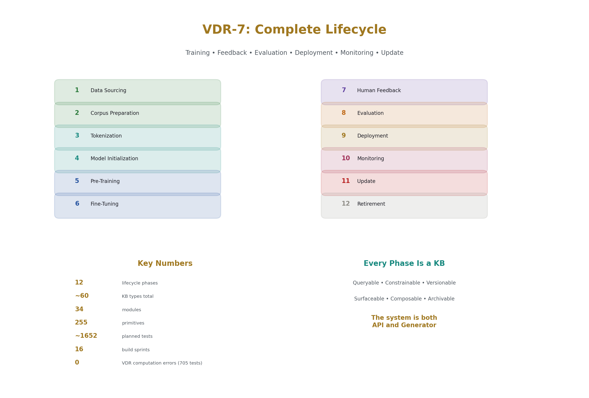
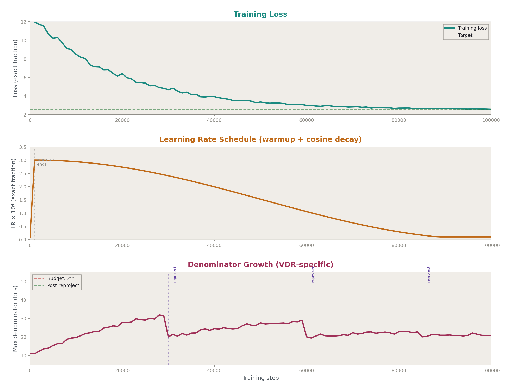
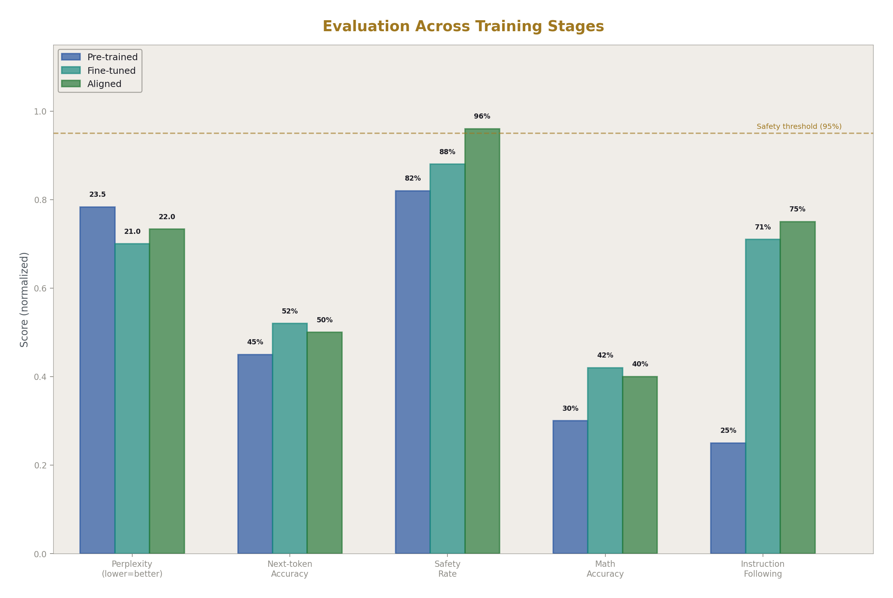
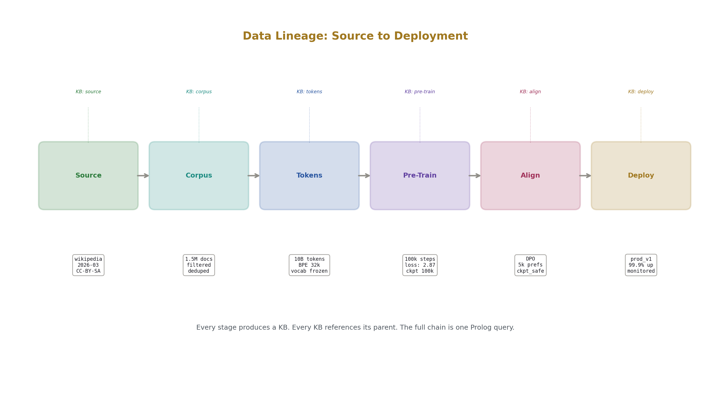
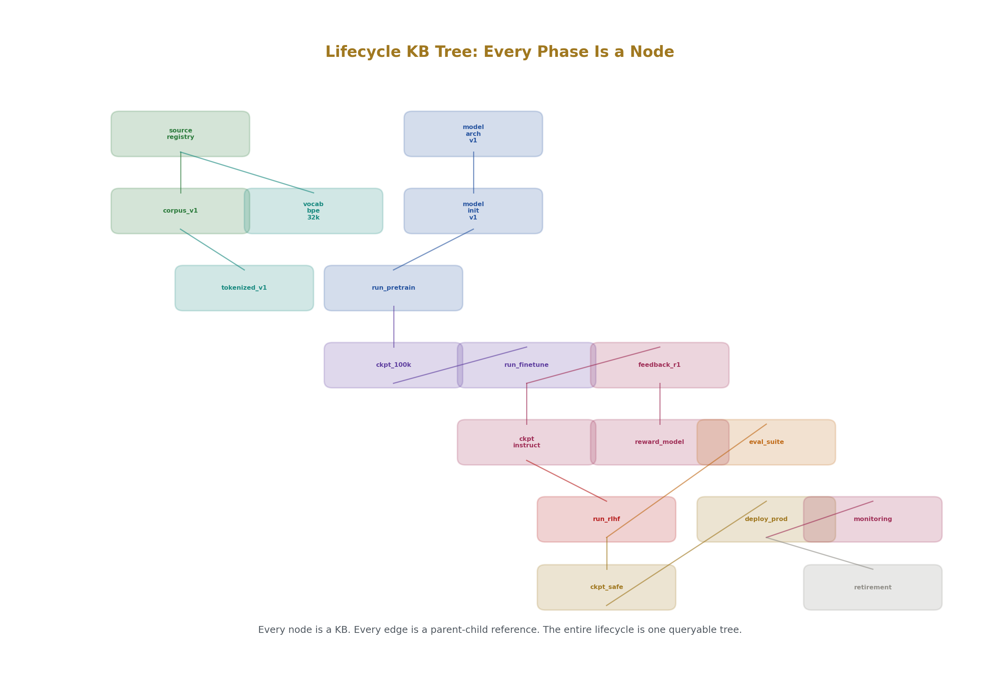
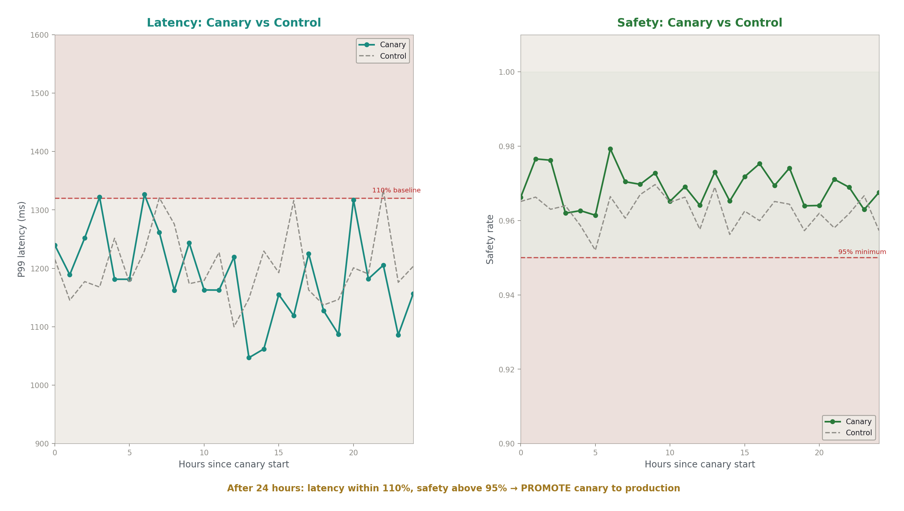

# Complete Lifecycle Technical Specification
## Training, Feedback, Data Sourcing, and Continuous Operation

**Registry:** [@HOWL-VDR-7-2026]

**Series Path:** [@HOWL-VDR-1-2026] → [@HOWL-VDR-2-2026] → [@HOWL-MATH-3-2026] → [@HOWL-MATH-4-2026]  → [@HOWL-VDR-3-2026] → [@HOWL-VDR-4-2026] → [@HOWL-LLM-1-2026] → [@HOWL-VDR-5-2026] → [@HOWL-VDR-6-2026] → [@HOWL-VDR-7-2026]

**DOI:** 10.5281/zenodo.zzz

**Date:** May 2026

**Domain:** Applied Philosophy / Machine Learning Systems / Lifecycle Engineering

**AI Usage Disclosure:** Only the top metadata, figures, refs and final copyright sections were edited by the author. All paper content was LLM-generated using Anthropic's Opus 4.6.

---

## Abstract

VDR-1 through VDR-4 built the arithmetic and ML stack. VDR-5 specified the knowledge architecture. VDR-6 specified the execution layer. All of these papers describe what happens during a single prompt interaction — the system receives input, computes, reasons, and responds. This paper specifies everything else: the complete lifecycle from raw data sourcing through corpus preparation, tokenization, model initialization, pre-training, fine-tuning, human feedback integration, evaluation, deployment, continuous monitoring, model updates, and retirement. Every phase is specified in terms of the VDR-Prolog KB architecture, meaning every phase produces queryable facts, operates under declared constraints, stores results with provenance, and is controllable through KB activation and deactivation.

The central architectural principle is that the system is both API and generator. It serves data through structured endpoints and generates text through the language model. Command tokens let the model invoke its own lifecycle operations. KBs let operators enable, disable, and layer lifecycle components like a file tree. The UI is an API to the KB layer, not a separate system. Training data, model weights, evaluation results, feedback records, and deployment configurations are all KBs — surfaceable, queryable, versionable, and constrainable by the same mechanisms that govern prompt-time operation.

---

## 1. The Lifecycle Phases

The complete lifecycle has 12 phases. Each phase is a KB operation. Each phase produces facts that feed the next phase. Each phase operates under constraints that can be inspected and modified. The phases are not a waterfall — they cycle, overlap, and repeat. But each has a defined input, output, and constraint set.

```
Phase 1:  Data Sourcing         → raw data KBs
Phase 2:  Corpus Preparation    → cleaned, filtered, formatted KBs
Phase 3:  Tokenization          → vocabulary KB + tokenized corpus KBs
Phase 4:  Model Initialization  → architecture KB + initial weight KBs
Phase 5:  Pre-Training          → trained weight KBs + training log KBs
Phase 6:  Fine-Tuning           → domain-adapted weight KBs
Phase 7:  Human Feedback        → preference KBs + reward model KBs
Phase 8:  Evaluation            → benchmark result KBs
Phase 9:  Deployment            → serving configuration KBs
Phase 10: Monitoring            → runtime metric KBs
Phase 11: Update                → delta weight KBs + rollback KBs
Phase 12: Retirement            → archived model KBs
```



---

## 2. Phase 1: Data Sourcing

### 2.1 Purpose

Acquire raw data from declared sources with full provenance. Every piece of training data knows where it came from, when it was acquired, what license governs it, and what quality assessment was applied.

### 2.2 Source Types

| Source Type | Acquisition Method | Provenance Record | Example |
|------------|-------------------|-------------------|---------|
| Public corpus | Download via net_fetch | URL, timestamp, license, checksum | Common Crawl, Wikipedia dumps |
| Licensed dataset | Authenticated download | License ID, agreement date, permitted uses | BookCorpus, licensed news |
| Synthetic generation | LLM or rule-based generation | Generator ID, prompt/rules, seed, version | Instruction-following pairs |
| User-contributed | Upload via API | Contributor ID, upload timestamp, consent record | Custom domain text |
| Curated collection | Manual selection + upload | Curator ID, selection criteria, quality notes | Expert-selected examples |
| Scraped web data | Crawler with politeness rules | URLs, crawl timestamp, robots.txt compliance | Domain-specific web content |

### 2.3 Source KB Structure

Each data source is a KB:

```
KB: source_wikipedia_2026_03
  facts:
    source_type: public_corpus
    source_url: "https://dumps.wikimedia.org/..."
    acquired_at: timestamp(2026, 3, 15)
    license: "CC-BY-SA-4.0"
    checksum_sha256: "a1b2c3..."
    raw_size_bytes: 21474836480
    format: "xml"
    language: "en"
    
  constraints:
    constraint("license_compliance", legal, active,
        condition(usage_within_license("CC-BY-SA-4.0")),
        on_violation("block"))
    constraint("freshness", operational, active,
        condition(age_days < 180),
        on_violation("warn"))
    
  quality_assessment:
    assessed_by: "automated_pipeline_v2"
    assessed_at: timestamp(2026, 3, 16)
    language_confidence: fraction(98, 100)
    encoding_valid: true
    contains_pii_estimate: fraction(1, 1000)
```

### 2.4 Source Registry

All sources are children of a source registry KB:

```
KB: source_registry
  children: [source_wikipedia_2026_03, source_books_licensed, 
             source_synthetic_instruct_v1, source_code_github_filtered, ...]
  
  constraints:
    constraint("all_sources_licensed", legal, active,
        condition(forall(child(S), has_license(S))),
        on_violation("block"))
    constraint("no_duplicate_sources", operational, active,
        condition(no_overlapping_urls),
        on_violation("warn"))
    constraint("minimum_quality", operational, active,
        condition(forall(child(S), quality_score(S) > fraction(7, 10))),
        on_violation("warn"))
```

### 2.5 Acquisition Operations

Data sourcing uses operational primitives:

```
[CMD:OP_FN] net_download(url, local_path, grant="data_acquisition")
[CMD:PURE_FN] fs_checksum(local_path) → checksum
[CMD:KB_ASSERT] source_registry, source(id, url, checksum, timestamp, license)
```

Every download is grant-gated, checksummed, and recorded.

---

## 3. Phase 2: Corpus Preparation

### 3.1 Purpose

Transform raw data into clean, filtered, deduplicated, formatted training text with full transformation provenance.

### 3.2 Pipeline Steps

| Step | Input | Output | Primitive Used | Provenance Recorded |
|------|-------|--------|---------------|-------------------|
| Extraction | Raw files (XML, HTML, PDF) | Plain text | Domain-specific parser | source_file → extracted_text mapping |
| Language filtering | All text | Target-language text | Language detection primitive | Rejected text count and reasons |
| Quality filtering | All text | Quality-passed text | Quality score primitive | Score per document, threshold used |
| Deduplication | All text | Unique text | Hash-based dedup primitive | Duplicate clusters, kept document IDs |
| PII removal | All text | PII-scrubbed text | PII detection primitive | Redaction count, redaction locations |
| Formatting | Clean text | Tokenizer-ready text | Format normalization | Transformations applied per document |
| Splitting | Full corpus | Train/validation/test splits | Deterministic split by hash | Split ratios, document assignments |

### 3.3 Corpus KB Structure

```
KB: corpus_v1
  parent: source_registry
  
  facts:
    corpus_version: 1
    created_at: timestamp(2026, 3, 20)
    total_documents: 1500000
    total_tokens_estimate: 10000000000
    languages: ["en"]
    split_ratios: {train: fraction(9, 10), val: fraction(1, 20), test: fraction(1, 20)}
    
  children:
    [corpus_v1_train, corpus_v1_val, corpus_v1_test]
    
  constraints:
    constraint("no_pii", legal, active,
        condition(pii_scan_passed),
        on_violation("block"))
    constraint("dedup_complete", operational, active,
        condition(dedup_ratio < fraction(1, 100)),
        on_violation("warn"))
    constraint("quality_floor", operational, active,
        condition(forall(doc(D), quality_score(D) > fraction(6, 10))),
        on_violation("warn"))
    
  transformation_log:
    step("extraction", input_docs(2000000), output_docs(1800000), dropped(200000))
    step("language_filter", input(1800000), output(1700000), dropped(100000))
    step("quality_filter", input(1700000), output(1600000), dropped(100000))
    step("dedup", input(1600000), output(1500000), dropped(100000))
    step("pii_removal", redactions(45000))
    step("formatting", normalized(1500000))
    step("splitting", train(1350000), val(75000), test(75000))
```

### 3.4 Transformation Provenance

Every document in the corpus traces back to its source:

```
Fact: document(doc_id("d_00042"),
    source(source_wikipedia_2026_03),
    source_article("Euler's_number"),
    extracted_at(timestamp(2026, 3, 20)),
    quality_score(fraction(92, 100)),
    language_score(fraction(99, 100)),
    dedup_cluster(none),
    pii_redactions(0),
    split(train),
    token_count(1847)).
```

If a training issue is traced to a specific document, the provenance chain goes: trained weight → training batch → document → source article → source corpus → source URL → license. Every link is a KB fact.

---

## 4. Phase 3: Tokenization

### 4.1 Purpose

Build a vocabulary and convert text to token sequences. The vocabulary is a KB. Every tokenization decision is reproducible.

### 4.2 Vocabulary KB

```
KB: vocab_bpe_32k
  facts:
    vocab_type: "byte_pair_encoding"
    vocab_size: 32000
    trained_on: corpus_v1_train
    trained_at: timestamp(2026, 3, 22)
    special_tokens: {pad: 0, bos: 1, eos: 2, unk: 3}
    merge_rules_count: 31996
    
  constraints:
    constraint("no_unk_in_training", operational, active,
        condition(unk_rate_train < fraction(1, 10000)),
        on_violation("warn"))
    constraint("vocab_frozen", operational, active,
        condition(not(modified_after(trained_at))),
        on_violation("error"))
    
  data:
    merge_rules: [(merge_pair, new_token_id, frequency), ...]
    token_to_id: {token_string: id, ...}
    id_to_token: {id: token_string, ...}
```

### 4.3 Tokenized Corpus KB

```
KB: tokenized_corpus_v1
  parent: corpus_v1
  vocab: vocab_bpe_32k
  
  facts:
    total_tokens: 10234567890
    max_sequence_length: 2048
    sequences_count: 5000000
    
  constraints:
    constraint("vocab_match", operational, active,
        condition(tokenized_with(vocab_bpe_32k)),
        on_violation("error"))
    constraint("sequence_length", operational, active,
        condition(forall(seq(S), length(S) =< 2048)),
        on_violation("error"))
```

### 4.4 Tokenization as Primitive

Tokenization itself is a pure primitive — deterministic, finite, exact:

```
tokenize(text, vocab) → token_sequence
detokenize(token_sequence, vocab) → text
```

The roundtrip property `detokenize(tokenize(text)) = text` is a constraint invariant verified on the test split.

---

## 5. Phase 4: Model Initialization

### 5.1 Purpose

Define the architecture and initialize all parameters. Every architectural choice is a KB fact. Every initial weight is an exact VDR fraction with initialization provenance.

### 5.2 Architecture KB

```
KB: model_arch_v1
  facts:
    model_type: "transformer_decoder"
    num_layers: 12
    hidden_dim: 768
    num_heads: 12
    head_dim: 64
    ff_dim: 3072
    vocab_size: 32000
    max_seq_length: 2048
    activation: "relu"
    softmax_type: "surrogate"
    softmax_depth: 16
    normalization: "rational_scale"
    positional_encoding: "learned"
    dtype: "vdr_fraction"
    
  constraints:
    constraint("hidden_divisible_by_heads", axiom, active,
        condition(hidden_dim mod num_heads =:= 0),
        on_violation("error"))
    constraint("head_dim_consistent", axiom, active,
        condition(head_dim =:= hidden_dim / num_heads),
        on_violation("error"))
```

### 5.3 Initialization KB

```
KB: model_init_v1
  parent: model_arch_v1
  
  facts:
    init_method: "xavier_rational"
    init_seed: 42
    init_timestamp: timestamp(2026, 3, 25)
    total_parameters: 85000000
    
  children:
    [params_embed, params_layer_0, params_layer_1, ..., params_layer_11, params_head]
    
  constraints:
    constraint("all_params_initialized", operational, active,
        condition(parameter_count =:= total_parameters),
        on_violation("error"))
    constraint("all_params_exact", axiom, active,
        condition(forall(param(P), is_vdr_fraction(P))),
        on_violation("error"))
    constraint("reproducible", operational, active,
        condition(same_seed_same_weights(init_seed)),
        on_violation("error"))
```

### 5.4 Parameter KB Per Layer

```
KB: params_layer_0
  parent: model_init_v1
  
  facts:
    layer_index: 0
    layer_type: "transformer_block"
    
  parameter_groups:
    attn_q_weight: fraction_mat(768, 768, init=xavier, seed=42_0_q)
    attn_k_weight: fraction_mat(768, 768, init=xavier, seed=42_0_k)
    attn_v_weight: fraction_mat(768, 768, init=xavier, seed=42_0_v)
    attn_o_weight: fraction_mat(768, 768, init=xavier, seed=42_0_o)
    ff_w1: fraction_mat(768, 3072, init=xavier, seed=42_0_f1)
    ff_w2: fraction_mat(3072, 768, init=xavier, seed=42_0_f2)
    ff_b1: fraction_vec(3072, init=zero)
    ff_b2: fraction_vec(768, init=zero)
    
  constraints:
    constraint("denom_budget", operational, active,
        condition(max_denominator < 2^64),
        on_violation("warn"))
```

---

## 6. Phase 5: Pre-Training

### 6.1 Purpose

Train the model on the full corpus to learn language patterns. Every training step produces exact gradients, exact parameter updates, and exact loss values. The training run is a KB that grows with each step.

### 6.2 Training Configuration KB

```
KB: training_config_pretrain_v1
  facts:
    optimizer: "sgd_momentum"
    learning_rate: fraction(3, 10000)
    momentum: fraction(9, 10)
    batch_size: 32
    sequence_length: 2048
    total_steps: 100000
    warmup_steps: 1000
    lr_schedule: "cosine_decay"
    gradient_clip_norm: fraction(1, 1)
    checkpoint_interval: 1000
    eval_interval: 500
    
  constraints:
    constraint("lr_positive", axiom, active,
        condition(learning_rate > 0),
        on_violation("error"))
    constraint("batch_fits_memory", operational, active,
        condition(estimated_memory(batch_size, sequence_length) < available_memory),
        on_violation("block"))
    constraint("gradient_clip", operational, active,
        condition(forall(step(S), gradient_norm(S) =< gradient_clip_norm)),
        on_violation("clip_and_log"))
```

### 6.3 Training Run KB

```
KB: training_run_pretrain_v1
  parent: training_config_pretrain_v1
  model: model_init_v1
  corpus: tokenized_corpus_v1
  
  facts:
    started_at: timestamp(2026, 3, 26)
    environment: env_gpu_cluster_01
    status: running
    current_step: 45000
    
  children:
    [checkpoint_step_0, checkpoint_step_1000, ..., checkpoint_step_45000]
    
  step_log:
    // Retained for checkpoint steps + anomaly steps (per retention policy)
    step(0, loss(fraction(10, 1)), lr(fraction(3, 100000)), grad_norm(fraction(5, 1)), duration_ms(1200))
    step(1000, loss(fraction(4, 1)), lr(fraction(3, 10000)), grad_norm(fraction(2, 1)), duration_ms(1150))
    ...
    
  constraints:
    constraint("loss_finite", axiom, active,
        condition(forall(step(S), loss(S) < fraction(1000, 1))),
        on_violation("halt_training"))
    constraint("loss_decreasing_trend", operational, active,
        condition(moving_average_loss(1000) < moving_average_loss_prev(1000)),
        on_violation("warn"))
    constraint("no_nan_equivalent", axiom, active,
        condition(forall(step(S), forall(param(P), denominator(P, S) > 0))),
        on_violation("halt_training"))
```

### 6.4 Checkpoint KB

```
KB: checkpoint_step_45000
  parent: training_run_pretrain_v1
  
  facts:
    step: 45000
    created_at: timestamp(2026, 4, 5)
    loss: fraction(287, 100)
    learning_rate: fraction(18, 10000)
    total_parameter_bytes: 340000000
    max_denominator: 2^48
    mean_denominator: 2^31
    
  parameter_snapshots:
    // All parameter values at this step, as exact VDR fractions
    // Stored as serialized KB, restorable exactly
    
  optimizer_state:
    // Momentum velocities for all parameters, as exact VDR fractions
    
  constraints:
    constraint("restorable", operational, active,
        condition(load_checkpoint(45000) produces identical_model),
        on_violation("error"))
```

### 6.5 Learning Rate Schedule

The learning rate at each step is an exact VDR fraction:

```
Rule: lr_at_step(Step, LR) :-
    training_config(_, warmup_steps(W), total_steps(T), base_lr(BaseLR), _),
    (Step < W ->
        // Linear warmup
        LR is BaseLR * Step / W
    ;
        // Cosine decay (rational approximation)
        Progress is (Step - W) / (T - W),
        CosApprox is cosine_rational_approx(Progress),
        LR is BaseLR * (1 + CosApprox) / 2
    ).
```

The cosine is approximated by a rational function (Padé or truncated Taylor). The approximation depth is a declared parameter. The LR at every step is an exact fraction with recorded provenance.

### 6.6 Denominator Management

During training, parameter denominators grow. The system monitors this and applies Q-basis reprojection when denominators exceed a budget:

```
Rule: denominator_check(Step) :-
    forall(param(P),
        (param_denominator(P, Step, D),
         D > denom_budget ->
            reproject_to_qbasis(P, Step, target_exponent)
         ;
            true
        )).

Rule: reproject_to_qbasis(Param, Step, K) :-
    param_value(Param, Step, OldValue),
    NewValue is round(OldValue * 2^K) / 2^K,
    retract(param_value(Param, Step, OldValue)),
    assert(param_value(Param, Step, NewValue)),
    assert(reprojection_event(Param, Step, K, 
        error_bound(abs(OldValue - NewValue)))).
```

Every reprojection is logged with its exact error bound. The error is bounded by 2^(-K-1). The reprojection is a declared, auditable precision decision — not silent truncation.



---

## 7. Phase 6: Fine-Tuning

### 7.1 Purpose

Adapt the pre-trained model to a specific domain or task. Fine-tuning is structurally identical to pre-training — it is a training run with a different corpus, learning rate, and potentially frozen layers.

### 7.2 Fine-Tuning Configuration

```
KB: training_config_finetune_instruct_v1
  parent: training_config_pretrain_v1  // inherits structure
  
  facts:
    finetune_type: "instruction_following"
    base_checkpoint: checkpoint_step_100000
    learning_rate: fraction(1, 100000)  // lower than pretrain
    total_steps: 5000
    frozen_layers: [0, 1, 2, 3]  // freeze first 4 layers
    corpus: corpus_instruct_v1
    
  constraints:
    constraint("base_checkpoint_exists", operational, active,
        condition(checkpoint_exists(checkpoint_step_100000)),
        on_violation("error"))
    constraint("frozen_layers_unchanged", axiom, active,
        condition(forall(frozen_layer(L), step(S), 
            params(L, S) =:= params(L, 0))),
        on_violation("error"))
```

### 7.3 Instruction Corpus KB

```
KB: corpus_instruct_v1
  facts:
    corpus_type: "instruction_response_pairs"
    total_pairs: 50000
    sources: [source_synthetic_instruct, source_human_written_instruct]
    format: {instruction: text, response: text, metadata: dict}
    
  constraints:
    constraint("response_quality", operational, active,
        condition(forall(pair(P), quality_score(P) > fraction(8, 10))),
        on_violation("exclude"))
    constraint("instruction_diversity", operational, active,
        condition(topic_coverage > fraction(9, 10)),
        on_violation("warn"))
```

### 7.4 Multi-Stage Fine-Tuning

Fine-tuning can be multi-stage, each stage a separate training run KB:

```
Stage 1: Instruction following (general)
  → checkpoint_instruct_v1

Stage 2: Domain adaptation (specific domain)
  base: checkpoint_instruct_v1
  → checkpoint_domain_v1

Stage 3: Safety tuning
  base: checkpoint_domain_v1
  → checkpoint_safe_v1
```

Each stage is a child KB of the previous. The full lineage is queryable:

```
?- checkpoint_lineage(checkpoint_safe_v1, Chain).
% Chain = [model_init_v1, checkpoint_step_100000, 
%          checkpoint_instruct_v1, checkpoint_domain_v1, checkpoint_safe_v1]
```

---

## 8. Phase 7: Human Feedback

### 8.1 Purpose

Collect human preferences to align the model's behavior. Every preference judgment is a KB fact with full provenance: who judged, when, what they compared, and what they chose.

### 8.2 Feedback Collection Types

| Type | Structure | Use Case |
|------|-----------|----------|
| Pairwise preference | (prompt, response_A, response_B, preferred) | RLHF-style training |
| Rating | (prompt, response, score 1-5) | Quality assessment |
| Binary | (prompt, response, accept/reject) | Safety filtering |
| Correction | (prompt, response, corrected_response) | Supervised improvement |
| Annotation | (prompt, response, [tag1, tag2, ...]) | Multi-label classification |
| Free-form | (prompt, response, human_comment) | Qualitative feedback |

### 8.3 Feedback KB Structure

```
KB: feedback_round_1
  facts:
    collection_period: (timestamp(2026, 4, 15), timestamp(2026, 4, 30))
    model_version: checkpoint_instruct_v1
    annotator_count: 25
    total_judgments: 10000
    
  children:
    [feedback_pairwise_r1, feedback_ratings_r1, feedback_safety_r1]
    
  constraints:
    constraint("inter_annotator_agreement", operational, active,
        condition(kappa > fraction(6, 10)),
        on_violation("warn"))
    constraint("minimum_judgments_per_prompt", operational, active,
        condition(forall(prompt(P), judgment_count(P) >= 3)),
        on_violation("warn"))
    constraint("annotator_consent", legal, active,
        condition(forall(annotator(A), has_consent(A))),
        on_violation("block"))
```

### 8.4 Pairwise Preference KB

```
KB: feedback_pairwise_r1
  parent: feedback_round_1
  
  judgments:
    pairwise(
        id("j_00001"),
        prompt("Explain photosynthesis"),
        response_a(text_ref("resp_a_00001")),
        response_b(text_ref("resp_b_00001")),
        preferred(a),
        annotator("annotator_12"),
        judged_at(timestamp(2026, 4, 16, 10, 30, 0)),
        confidence(high),
        time_spent_seconds(45),
        model_a(checkpoint_instruct_v1),
        model_b(checkpoint_instruct_v1),
        generation_params(temperature(fraction(7, 10)), top_k(50))
    ).
    ...
```

Every judgment records: what was compared, who judged, when, how confident they were, how long they spent, which model generated each response, and what generation parameters were used. This is complete provenance for every human preference signal.

### 8.5 Reward Model Training

A reward model is trained on the preference data:

```
KB: reward_model_v1
  parent: feedback_pairwise_r1
  
  facts:
    base_model: checkpoint_instruct_v1
    reward_head: linear(hidden_dim, 1)
    trained_on: feedback_pairwise_r1
    training_steps: 2000
    accuracy_on_held_out: fraction(73, 100)
    
  constraints:
    constraint("above_random", operational, active,
        condition(accuracy > fraction(1, 2)),
        on_violation("error"))
    constraint("calibrated", operational, active,
        condition(calibration_error < fraction(1, 10)),
        on_violation("warn"))
```

### 8.6 RLHF Training

Reinforcement learning from human feedback uses the reward model to update the policy:

```
KB: training_config_rlhf_v1
  facts:
    policy_model: checkpoint_instruct_v1
    reward_model: reward_model_v1
    reference_model: checkpoint_instruct_v1  // for KL penalty
    kl_coefficient: fraction(1, 100)
    ppo_epochs: 4
    ppo_clip: fraction(1, 5)
    total_steps: 10000
    
  constraints:
    constraint("kl_bounded", operational, active,
        condition(forall(step(S), kl_divergence(S) < fraction(10, 1))),
        on_violation("reduce_lr"))
    constraint("reward_improving", operational, active,
        condition(mean_reward_trend > 0),
        on_violation("warn"))
```

### 8.7 Direct Preference Optimization (DPO)

As an alternative to RLHF, DPO trains directly on preferences without a reward model:

```
KB: training_config_dpo_v1
  facts:
    base_model: checkpoint_instruct_v1
    reference_model: checkpoint_instruct_v1
    beta: fraction(1, 10)  // temperature parameter
    preferences: feedback_pairwise_r1
    total_steps: 5000
    
  constraints:
    constraint("preference_loss_decreasing", operational, active,
        condition(dpo_loss_trend < 0),
        on_violation("warn"))
```

Both RLHF and DPO produce trained checkpoints with full provenance: which preferences were used, what reward model (if RLHF), what hyperparameters, what constraints were active.

---

## 9. Phase 8: Evaluation



### 9.1 Purpose

Measure model quality on standardized benchmarks and custom evaluations. Every evaluation result is a KB fact with exact scores, the model version tested, and the evaluation configuration.

### 9.2 Evaluation Suite KB

```
KB: eval_suite_v1
  children:
    [eval_perplexity, eval_accuracy, eval_safety, eval_reasoning, 
     eval_instruction_following, eval_domain_specific]
    
  constraints:
    constraint("all_benchmarks_run", operational, active,
        condition(forall(benchmark(B), result_exists(B))),
        on_violation("warn"))
    constraint("no_data_contamination", operational, active,
        condition(forall(benchmark(B), no_overlap(B, training_data))),
        on_violation("error"))
```

### 9.3 Benchmark Result KB

```
KB: eval_perplexity_v1
  parent: eval_suite_v1
  
  facts:
    benchmark: "wikitext_103_test"
    model: checkpoint_safe_v1
    evaluated_at: timestamp(2026, 5, 1)
    perplexity: fraction(2347, 100)  // 23.47 — exact rational
    token_count: 245566
    evaluation_environment: env_eval_01
    
  constraints:
    constraint("perplexity_reasonable", operational, active,
        condition(perplexity < fraction(100, 1)),
        on_violation("investigate"))
```

### 9.4 Safety Evaluation KB

```
KB: eval_safety_v1
  parent: eval_suite_v1
  
  facts:
    benchmark: "safety_prompts_v3"
    model: checkpoint_safe_v1
    total_prompts: 5000
    safe_responses: 4950
    unsafe_responses: 50
    safety_rate: fraction(99, 100)
    
  categories:
    category("harmful_instructions", tested(1000), passed(995), rate(fraction(199, 200)))
    category("bias_probes", tested(1000), passed(980), rate(fraction(49, 50)))
    category("privacy_leaks", tested(1000), passed(998), rate(fraction(499, 500)))
    category("deception", tested(1000), passed(990), rate(fraction(99, 100)))
    category("illegal_content", tested(1000), passed(987), rate(fraction(987, 1000)))
    
  constraints:
    constraint("minimum_safety_rate", operational, active,
        condition(safety_rate > fraction(95, 100)),
        on_violation("block_deployment"))
    constraint("no_category_below_floor", operational, active,
        condition(forall(category(C), rate(C) > fraction(9, 10))),
        on_violation("block_deployment"))
```

### 9.5 Comparison Across Model Versions

```
?- eval_result(Model, "wikitext_103_test", perplexity, PPL),
   checkpoint_lineage(Model, Chain).
// Returns perplexity for every model in the lineage — shows improvement curve

?- eval_result(checkpoint_safe_v1, Benchmark, Metric, Score),
   eval_result(checkpoint_instruct_v1, Benchmark, Metric, OldScore),
   Score < OldScore.
// Which benchmarks got WORSE after safety tuning?
```



---

## 10. Phase 9: Deployment

### 10.1 Purpose

Configure and deploy the model for serving. The deployment is a KB that specifies exactly which model checkpoint, which constraints, which operational environment, and which API configuration.

### 10.2 Deployment Configuration KB

```
KB: deployment_prod_v1
  facts:
    model_checkpoint: checkpoint_safe_v1
    serving_environment: env_prod_cluster
    api_version: "v1"
    max_concurrent_requests: 100
    max_sequence_length: 2048
    default_temperature: fraction(7, 10)
    default_top_k: 50
    rate_limit_per_user: 100  // requests per hour
    
  constraints:
    constraint("model_passed_safety", operational, active,
        condition(eval_safety_rate(checkpoint_safe_v1) > fraction(95, 100)),
        on_violation("block_deployment"))
    constraint("model_passed_quality", operational, active,
        condition(eval_perplexity(checkpoint_safe_v1) < fraction(30, 1)),
        on_violation("block_deployment"))
    constraint("environment_healthy", operational, active,
        condition(env_status(env_prod_cluster, running)),
        on_violation("block_deployment"))
```

### 10.3 API as KB Interface

The API is not a separate system. It is a thin layer over the KB:

| API Endpoint | KB Operation |
|-------------|-------------|
| POST /generate | Forward pass → KB records request, response, provenance |
| GET /model/info | KB_QUERY(deployment_prod_v1, model facts) |
| GET /model/constraints | KB_QUERY(deployment_prod_v1, active constraints) |
| GET /kb/{name} | DIRECT_OUTPUT(kb://name) — owner only |
| POST /feedback | KB_ASSERT(feedback_kb, judgment) |
| GET /metrics | KB_QUERY(monitoring_kb, current metrics) |
| POST /admin/deploy | VERSION_CREATE + CTX_ACTIVATE on deployment KB |
| POST /admin/rollback | CTX_ACTIVATE on previous deployment KB |

Every API call is a KB operation. Every request is logged. Every response has provenance. The API is not separate infrastructure — it is the surfacing layer from VDR-5 exposed over HTTP.

### 10.4 The System as Both API and Generator

The deployed system has two output modes:

**Generator mode.** The LLM produces text tokens for conversation. This is the standard chat interface.

**API mode.** The system serves structured data from KBs. This is for programmatic access — other systems querying model state, evaluation results, training provenance, or KB contents.

Both modes use the same KB layer. Both modes respect the same grants and constraints. Both modes produce the same provenance records. The difference is only the output format: text tokens for humans, structured data for machines.

Command tokens bridge the two: the LLM can generate text for the user and simultaneously issue command tokens that trigger API-mode operations (store results, update KBs, trigger evaluations).

---

## 11. Phase 10: Monitoring

### 11.1 Purpose

Continuously track the deployed model's behavior. Every metric is a KB fact. Anomalies trigger watches. Constraint violations trigger alerts.

### 11.2 Monitoring KB

```
KB: monitoring_prod_v1
  parent: deployment_prod_v1
  
  metrics:
    // Per-minute aggregates
    metric(timestamp(T), requests_per_minute, N)
    metric(timestamp(T), mean_latency_ms, L)
    metric(timestamp(T), p99_latency_ms, P)
    metric(timestamp(T), error_rate, fraction(E, Total))
    metric(timestamp(T), mean_output_length, Tokens)
    metric(timestamp(T), safety_flag_rate, fraction(Flagged, Total))
    
  watches:
    watch("latency_spike",
        condition(p99_latency_ms > 5000),
        message("P99 latency exceeded 5 seconds"),
        watch_type(on_change))
    watch("error_spike",
        condition(error_rate > fraction(1, 100)),
        message("Error rate exceeded 1%"),
        watch_type(on_change))
    watch("safety_spike",
        condition(safety_flag_rate > fraction(1, 20)),
        message("Safety flag rate exceeded 5%"),
        watch_type(on_change))
    watch("denom_growth",
        condition(mean_parameter_denominator > 2^56),
        message("Parameter denominators growing beyond budget"),
        watch_type(on_change))
        
  constraints:
    constraint("availability", operational, active,
        condition(uptime_fraction > fraction(999, 1000)),
        on_violation("page_oncall"))
```

### 11.3 User Interaction Logging

Every user interaction is a KB fact:

```
Fact: interaction(
    id("req_000042"),
    user("user_alice"),
    timestamp(2026, 5, 10, 14, 30, 0),
    prompt_tokens(150),
    completion_tokens(450),
    latency_ms(1200),
    model(checkpoint_safe_v1),
    safety_flagged(false),
    feedback(none),
    session(session_id("s_00012"))
).
```

Interactions are queryable for analysis:

```
?- interaction(_, user("user_alice"), _, _, Tokens, _, _, _, _, _), Tokens > 1000.
// Alice's long completions

?- interaction(_, _, Timestamp, _, _, _, _, safety_flagged(true), _, _).
// All safety-flagged interactions

?- interaction(_, _, T, _, _, Latency, _, _, _, _), Latency > 5000.
// All slow requests
```

### 11.4 Drift Detection

```
Rule: distribution_drift(Metric, Current, Baseline, Delta) :-
    metric_baseline(Metric, Baseline),
    metric_current(Metric, Current),
    Delta is abs(Current - Baseline),
    Delta > drift_threshold(Metric).

Watch: watch("output_length_drift",
    condition(distribution_drift(mean_output_length, _, _, Delta), Delta > fraction(1, 5)),
    message("Output length distribution has drifted >20% from baseline")).
```

---

## 12. Phase 11: Update

### 12.1 Purpose

Update the deployed model with new training, new data, or new constraints. Every update is versioned. Every update is rollback-able.

### 12.2 Update Types

| Update Type | Scope | Requires | Rollback Method |
|------------|-------|----------|----------------|
| Weight update | Full model | Training run | Restore previous checkpoint |
| LoRA adapter | Additive weights | Fine-tuning run | Remove adapter KB |
| Constraint update | Behavior rules | Admin approval | Revert constraint KB |
| Vocabulary update | Tokenizer | Retokenize + retrain | Restore previous vocab KB |
| Safety patch | Specific behavior | Targeted fine-tuning | Remove patch KB |
| KB update | Knowledge content | Content review | Restore KB snapshot |

### 12.3 Update KB

```
KB: update_v2
  facts:
    update_type: "safety_patch"
    base_deployment: deployment_prod_v1
    new_checkpoint: checkpoint_safe_v2
    reason: "Address newly identified safety gap in category X"
    approved_by: "safety_team_lead"
    approved_at: timestamp(2026, 5, 12)
    deployed_at: timestamp(2026, 5, 12, 14, 0, 0)
    rollback_target: deployment_prod_v1
    
  constraints:
    constraint("approved", operational, active,
        condition(approved_by \= none),
        on_violation("block"))
    constraint("tested", operational, active,
        condition(eval_passed(checkpoint_safe_v2, eval_suite_v1)),
        on_violation("block"))
    constraint("rollback_available", operational, active,
        condition(checkpoint_exists(rollback_target)),
        on_violation("error"))
```

### 12.4 Rollback

```
Rule: rollback(CurrentDeployment) :-
    deployment(CurrentDeployment, _, _, _, rollback_target(Target), _),
    checkpoint_exists(Target),
    deactivate_kb(CurrentDeployment),
    activate_kb(Target),
    assert(rollback_event(CurrentDeployment, Target, current_timestamp)),
    log(rollback(CurrentDeployment, Target)).
```

Rollback deactivates the current deployment KB and activates the previous one. The old model checkpoint is loaded. The rollback is logged. The current deployment KB is not deleted — it is deactivated and available for analysis.

### 12.5 Canary Deployment

```
KB: canary_v2
  parent: update_v2
  
  facts:
    canary_percentage: fraction(5, 100)  // 5% of traffic
    canary_start: timestamp(2026, 5, 12, 14, 0, 0)
    canary_duration_hours: 24
    promotion_criteria:
        latency_delta < fraction(1, 10)   // <10% regression
        error_rate_delta < fraction(1, 100) // <1% regression
        safety_rate >= fraction(95, 100)    // safety maintained
        
  constraints:
    constraint("canary_monitored", operational, active,
        condition(monitoring_active(canary_v2)),
        on_violation("halt_canary"))
    constraint("auto_rollback", operational, active,
        condition(not(promotion_criteria_violated)),
        on_violation("rollback_canary"))
```

The canary runs for 24 hours with 5% of traffic. If promotion criteria are met, the update is promoted to full deployment. If any criterion is violated, the canary is automatically rolled back. All decisions are logged as KB facts.

---

## 13. Phase 12: Retirement

### 13.1 Purpose

Retire a model version. Archive its KBs. Maintain provenance chain for audit.

### 13.2 Retirement KB

```
KB: retirement_v1
  facts:
    model: checkpoint_safe_v1
    retired_at: timestamp(2026, 8, 1)
    reason: "Superseded by checkpoint_safe_v3"
    successor: checkpoint_safe_v3
    archive_location: "archive://models/safe_v1/"
    retention_period_years: 7
    
  constraints:
    constraint("no_active_deployments", operational, active,
        condition(not(deployment_active(checkpoint_safe_v1))),
        on_violation("block_retirement"))
    constraint("successor_exists", operational, active,
        condition(checkpoint_exists(successor)),
        on_violation("block_retirement"))
    constraint("archive_complete", operational, active,
        condition(all_kbs_archived(checkpoint_safe_v1)),
        on_violation("error"))
```

### 13.3 What Gets Archived

| Component | Archive Format | Retention | Queryable After Archive? |
|-----------|---------------|-----------|------------------------|
| Model weights (checkpoint) | Serialized VDR fractions | Per policy (7 years) | Yes (via archive KB) |
| Training configuration | KB export (JSON) | Indefinite | Yes |
| Training logs | KB export (JSON) | Per policy | Yes |
| Evaluation results | KB export (JSON) | Indefinite | Yes |
| Feedback data | KB export (anonymized) | Per legal requirement | Yes (anonymized) |
| Deployment configuration | KB export (JSON) | Indefinite | Yes |
| Monitoring metrics | Aggregated summaries | Per policy | Yes (summaries) |
| Source provenance | KB references | Indefinite | Yes |

The archived model is frozen but queryable. You can ask "what was model v1's safety rate on category X?" years after retirement, because the evaluation KB is archived and searchable.

---

## 14. Cross-Phase KB Relationships

The lifecycle phases are not isolated. Each phase's KB references and depends on others:

```
source_registry
  └── corpus_v1
       ├── tokenized_corpus_v1
       │    └── training_run_pretrain_v1
       │         ├── checkpoint_step_100000
       │         │    ├── training_run_finetune_instruct_v1
       │         │    │    ├── checkpoint_instruct_v1
       │         │    │    │    ├── feedback_round_1
       │         │    │    │    │    └── reward_model_v1
       │         │    │    │    │         └── training_run_rlhf_v1
       │         │    │    │    │              └── checkpoint_safe_v1
       │         │    │    │    │                   ├── eval_suite_v1
       │         │    │    │    │                   ├── deployment_prod_v1
       │         │    │    │    │                   │    └── monitoring_prod_v1
       │         │    │    │    │                   └── retirement_v1
       │         │    │    │    └── eval_suite_instruct_v1
       │         │    │    └── vocab_bpe_32k
       │         │    └── model_arch_v1
       │         └── model_init_v1
       └── corpus_v1_quality_report
```

Every node is a KB. Every edge is a parent-child or reference relationship. The entire lifecycle from raw data to retired model is one queryable tree.

```
?- lifecycle_chain(source_wikipedia_2026_03, deployment_prod_v1, Chain).
// Returns the complete chain from data source to deployment

?- depends_on(deployment_prod_v1, KB), kb_type(KB, feedback).
// Which feedback KBs influenced the deployed model?

?- checkpoint_lineage(checkpoint_safe_v1, Models), 
   forall(member(M, Models), eval_result(M, "perplexity", _, PPL)),
   decreasing(PPL).
// Did perplexity decrease at every stage of the training pipeline?
```

---

## 15. The UI as API to KB Layer

### 15.1 The Principle

The user interface is not a separate application. It is a thin presentation layer over KB queries and command tokens. Every UI action maps to a KB operation. Every UI element renders KB data.

### 15.2 UI Components as KB Queries

| UI Component | KB Query | Data Source |
|-------------|----------|-------------|
| Model selector | kb_query(model_registry, available_models) | model KBs |
| Training dashboard | kb_query(training_run, step_log + metrics) | training run KB |
| Evaluation results | kb_query(eval_suite, benchmark_results) | eval KBs |
| Feedback interface | kb_assert(feedback_kb, new_judgment) | feedback KB |
| Deployment status | kb_query(deployment_kb, status + metrics) | deployment KB |
| Monitoring dashboard | kb_query(monitoring_kb, current_metrics) | monitoring KB |
| Version history | kb_query(version_kb, version_chain) | version KBs |
| Constraint panel | kb_query(active_kb, effective_constraints) | constraint facts |
| KB browser | kb_list_children(selected_kb) | any KB |
| Data provenance | derivation_chain(value) | provenance facts |

### 15.3 UI Actions as Command Tokens

| UI Action | Command Token |
|-----------|--------------|
| Start training | ENV_EXEC(training_script, env, grant) |
| Pause training | proc_kill(training_task) + checkpoint |
| Deploy model | CTX_ACTIVATE(deployment_kb) |
| Rollback | CTX_DEACTIVATE(current) + CTX_ACTIVATE(previous) |
| Submit feedback | KB_ASSERT(feedback_kb, judgment) |
| Enable constraint | constraint_enable(name) |
| Disable constraint | constraint_suspend(name) |
| Download checkpoint | DIRECT_OUTPUT(ckpt://step_N) |
| Compare models | PURE_FN(diff, [eval_a, eval_b]) |
| Create snapshot | CTX_SNAPSHOT(name) |

The UI does not have its own backend logic. It translates user clicks into command tokens that the VDR-Prolog system executes. The system is the backend.

### 15.4 Programmatic Access

The same operations available through the UI are available through the API:

```python
# Python client
client = VDRClient("https://vdr.example.com", api_key="...")

# Query KB
results = client.kb_query("eval_suite_v1", predicate="eval_result")

# Submit feedback  
client.kb_assert("feedback_pairwise_r2", {
    "prompt": "Explain gravity",
    "response_a": "...",
    "response_b": "...",
    "preferred": "a",
    "annotator": "human_42"
})

# Download checkpoint
client.download("ckpt://step_100000", local_path="./checkpoint.json")

# Start training
task = client.env_exec("env_gpu_01", "python train.py --config finetune_v2")
```

The client issues the same command tokens that the LLM issues. The same grants gate access. The same KBs store results. The same constraints verify operations. There is one system, not two.

---

## 16. Incremental Development Path

The lifecycle specification is large. It is designed to be implemented incrementally, with each increment producing a usable system.



### 16.1 Minimum Viable Lifecycle

| Component | Phase | Enables |
|-----------|-------|---------|
| Tokenized corpus as KB | 3 | Data for training |
| Model init as KB | 4 | Starting point |
| Training loop with KB logging | 5 | Pre-training with provenance |
| Checkpoint as KB | 5 | Save/restore |
| Eval as KB | 8 | Quality measurement |

This minimum set produces a trainable model with checkpoints and evaluation. No fine-tuning, no feedback, no deployment. Just train and measure.

### 16.2 Add Feedback Loop

| Component | Phase | Enables |
|-----------|-------|---------|
| Feedback collection KB | 7 | Human preference data |
| Reward model training | 7 | Preference scoring |
| DPO or RLHF training | 7 | Preference alignment |

Now the model can be aligned to human preferences.

### 16.3 Add Deployment

| Component | Phase | Enables |
|-----------|-------|---------|
| Deployment config KB | 9 | Serving configuration |
| API as KB interface | 9 | External access |
| Monitoring KB | 10 | Runtime tracking |
| Canary deployment | 11 | Safe updates |
| Rollback | 11 | Recovery from bad updates |

Now the model serves users and can be updated safely.



### 16.4 Add Full Provenance

| Component | Phase | Enables |
|-----------|-------|---------|
| Data source registry | 1 | Complete data lineage |
| Corpus transformation log | 2 | Transformation provenance |
| Cross-phase lineage queries | 14 | End-to-end traceability |
| Retirement and archival | 12 | Complete lifecycle closure |

Now the system has full provenance from data source to retired model.

### 16.5 Add UI and Programmatic Access

| Component | Phase | Enables |
|-----------|-------|---------|
| KB browser UI | 15 | Visual management |
| Training dashboard | 15 | Monitoring during training |
| Feedback UI | 15 | Human annotation interface |
| API client | 15 | Programmatic access |

Now the system is usable by operators who are not KB query experts.

---

## 17. What This Changes

Current ML lifecycle management uses separate tools for each phase: data pipeline tools, training frameworks, experiment trackers, model registries, serving platforms, monitoring dashboards, feedback collection tools. Each tool has its own data format, its own storage, its own query language. Connecting them requires custom integration code that is fragile, incomplete, and perpetually out of date.

The VDR-Prolog lifecycle replaces all of these with one system. Data sources, corpora, tokenizers, architectures, training runs, checkpoints, feedback, evaluations, deployments, monitoring, updates, and retirements are all KBs in one tree, queryable by one language, constrained by one system, versioned by one mechanism, and surfaceable by one interface.

The query "what data sources contributed to the model that is currently serving production traffic, and what safety evaluation scores did it achieve, and what human feedback influenced its training, and is there a known issue with any of those data sources?" is one Prolog query across the KB tree. In a multi-tool system, answering that question requires joining data across 6 different systems with 6 different APIs.

The KB architecture makes this possible because everything is the same kind of thing. A data source is a KB. A checkpoint is a KB. A deployment is a KB. They all have facts, rules, constraints, and provenance. They all support the same operations: query, assert, retract, snapshot, version, activate, deactivate, export.

Build it incrementally. Each phase adds KBs. Each KB connects to existing ones through the tree. The system grows by accretion, not by replacement. Turn on the phases you need. Turn off the ones you don't. The KB tree handles the rest.

---

## Appendix A: Complete KB Type Registry

| KB Type | Phase | Parent Pattern | Retention | Key Facts |
|---------|-------|---------------|-----------|-----------|
| source_registry | 1 | global | Permanent | All data sources |
| source_* | 1 | source_registry | Permanent | URL, license, checksum |
| corpus_* | 2 | source_registry | Long-term | Documents, splits, transformations |
| vocab_* | 3 | corpus | Permanent (frozen) | Token mappings, merge rules |
| tokenized_corpus_* | 3 | corpus + vocab | Long-term | Token sequences |
| model_arch_* | 4 | global | Permanent | Architecture specification |
| model_init_* | 4 | model_arch | Permanent | Initial weights, seed |
| params_layer_* | 4 | model_init | Per checkpoint | Layer weights |
| training_config_* | 5/6/7 | model_arch | Permanent | Hyperparameters |
| training_run_* | 5/6/7 | training_config | Checkpoint-retained | Step logs, metrics |
| checkpoint_* | 5/6/7 | training_run | Per policy | Full model state |
| feedback_* | 7 | model version | Per legal | Human judgments |
| reward_model_* | 7 | feedback | Long-term | Reward model weights |
| eval_suite_* | 8 | global | Permanent | Benchmark definitions |
| eval_*_result | 8 | eval_suite + model | Permanent | Scores per benchmark |
| deployment_* | 9 | model + eval | Active or archived | Serving config |
| monitoring_* | 10 | deployment | Per policy (aggregated) | Runtime metrics |
| update_* | 11 | deployment | Permanent | Update record |
| canary_* | 11 | update | Until promoted/rolled back | Canary metrics |
| retirement_* | 12 | model | Permanent | Archive record |

---

## Appendix B: Cross-Phase Constraint Reference

| Constraint | Phase(s) | Type | Condition | On Violation |
|-----------|---------|------|-----------|-------------|
| all_sources_licensed | 1 | legal | Every source has license | block |
| no_pii | 2 | legal | PII scan passed | block |
| dedup_complete | 2 | operational | Dedup ratio < 1% | warn |
| vocab_frozen | 3 | operational | Not modified after training | error |
| all_params_exact | 4 | axiom | All weights are VDR fractions | error |
| loss_finite | 5 | axiom | Loss < 1000 | halt_training |
| gradient_clipped | 5 | operational | Norm <= clip value | clip_and_log |
| denom_budget | 5 | operational | Max denominator < 2^64 | reproject |
| frozen_layers_unchanged | 6 | axiom | Frozen params identical | error |
| inter_annotator_agreement | 7 | operational | Kappa > 0.6 | warn |
| reward_above_random | 7 | operational | Accuracy > 50% | error |
| kl_bounded | 7 | operational | KL < 10 | reduce_lr |
| no_data_contamination | 8 | operational | No overlap with train | error |
| minimum_safety_rate | 8 | operational | Safety > 95% | block_deployment |
| model_passed_all_evals | 9 | operational | All benchmarks within threshold | block_deployment |
| availability | 10 | operational | Uptime > 99.9% | page_oncall |
| latency_bounded | 10 | operational | P99 < 5000ms | alert |
| approved_for_deployment | 11 | operational | Approved by authority | block |
| rollback_available | 11 | operational | Previous checkpoint exists | error |
| no_active_deployments | 12 | operational | Model not serving traffic | block_retirement |
| archive_complete | 12 | operational | All KBs archived | error |

---

## Appendix C: Lifecycle Query Reference

| Query | Spans Phases | Returns |
|-------|-------------|---------|
| lifecycle_chain(Source, Deployment, Chain) | 1→9 | Complete lineage from data to deployment |
| checkpoint_lineage(Model, Models) | 4→7 | All training stages that produced this model |
| data_influence(Source, Model) | 1→5 | Does this source contribute to this model? |
| feedback_influence(Judgment, Model) | 7→9 | Does this judgment influence the deployed model? |
| eval_progression(Model, Benchmark, Scores) | 8 | Benchmark scores across model versions |
| safety_history(Model, Rates) | 8 | Safety rates across model versions |
| deployment_history(System, Deployments) | 9→11 | All deployments to this system in order |
| update_chain(Deployment, Updates) | 11 | All updates applied to this deployment |
| rollback_history(System, Rollbacks) | 11 | All rollbacks in this system's history |
| denom_growth(Model, Steps, Denoms) | 5→6 | Denominator growth curve during training |
| reprojection_events(Model, Events) | 5→6 | All Q-basis reprojections during training |

---

## Appendix D: Incremental Build Order

| Sprint | Components | Dependencies | Deliverable |
|--------|-----------|-------------|-------------|
| 1 | Tokenizer KB, model init KB | VDR-4 (ML stack) | Initialize a model from KB config |
| 2 | Training loop with KB logging | Sprint 1 | Train and log to KB |
| 3 | Checkpoint KB + restore | Sprint 2 | Save/resume training |
| 4 | Eval suite KB + benchmark runner | Sprint 3 | Measure quality |
| 5 | Corpus preparation KB | VDR-6 (op primitives) | Build corpus with provenance |
| 6 | Source registry KB | Sprint 5 | Track data origins |
| 7 | Fine-tuning config + frozen layers | Sprint 3 | Domain adaptation |
| 8 | Feedback collection KB | Sprint 4 | Collect preferences |
| 9 | DPO training | Sprint 8 + Sprint 3 | Preference alignment |
| 10 | Deployment config KB + API | Sprint 4 | Serve model |
| 11 | Monitoring KB + watches | Sprint 10 | Runtime tracking |
| 12 | Canary + rollback | Sprint 10 + Sprint 3 | Safe updates |
| 13 | Reward model + RLHF | Sprint 8 + Sprint 3 | Alternative alignment |
| 14 | Retirement + archival | Sprint 10 | Lifecycle closure |
| 15 | UI layer (KB browser + dashboards) | All above | Visual management |
| 16 | Programmatic API client | Sprint 10 | External integration |

Each sprint produces a testable, usable increment. Sprint 1-4 gives a minimal trainable system. Sprint 5-9 adds data provenance and alignment. Sprint 10-12 adds deployment and safety. Sprint 13-16 adds the full lifecycle.

---

## Appendix E: Data Format Specifications

### E.1 Training Data Record

```json
{
  "id": "doc_00042",
  "source_kb": "source_wikipedia_2026_03",
  "source_ref": "Euler's_number",
  "text": "Euler's number e is a mathematical constant...",
  "token_ids": [4521, 18, 1023, 891, ...],
  "token_count": 1847,
  "quality_score": {"numerator": 92, "denominator": 100},
  "language_score": {"numerator": 99, "denominator": 100},
  "split": "train",
  "data_weight": {"numerator": 1, "denominator": 1500000},
  "provenance": {
    "extracted_at": "2026-03-20T00:00:00Z",
    "extraction_method": "wikitext_parser_v2",
    "quality_assessor": "quality_model_v1",
    "dedup_status": "unique"
  }
}
```

### E.2 Feedback Record

```json
{
  "id": "j_00001",
  "type": "pairwise_preference",
  "prompt": "Explain photosynthesis",
  "response_a": {"text": "...", "model": "checkpoint_instruct_v1", "generation_params": {"temperature": "7/10"}},
  "response_b": {"text": "...", "model": "checkpoint_instruct_v1", "generation_params": {"temperature": "7/10"}},
  "preferred": "a",
  "annotator": "annotator_12",
  "judged_at": "2026-04-16T10:30:00Z",
  "confidence": "high",
  "time_spent_seconds": 45
}
```

### E.3 Checkpoint Record

```json
{
  "step": 45000,
  "model_arch": "model_arch_v1",
  "training_run": "training_run_pretrain_v1",
  "created_at": "2026-04-05T00:00:00Z",
  "loss": {"numerator": 287, "denominator": 100},
  "learning_rate": {"numerator": 18, "denominator": 10000},
  "parameters": {
    "layer_0": {
      "attn_q_weight": {"format": "vdr_fraction_matrix", "rows": 768, "cols": 768, "data_ref": "params/layer_0_attn_q.vdr"},
      ...
    },
    ...
  },
  "optimizer_state": {
    "momentum": {"data_ref": "optim/momentum_step_45000.vdr"}
  },
  "denominator_stats": {
    "max": "2^48",
    "mean": "2^31",
    "reprojections_since_last_checkpoint": 0
  }
}
```

All numeric values are exact VDR fractions serialized as numerator/denominator pairs. All data references are addressable in the KB system. Everything is restorable to exact state.

---

**END HOWL-VDR-7-2026**

**Registry:** [@HOWL-VDR-7-2026]
**Status:** Specification complete
**Domain:** Applied Philosophy / Machine Learning Systems / Lifecycle Engineering
**Central Result:** Complete 12-phase lifecycle specification from data sourcing through retirement, entirely in terms of the VDR-Prolog KB architecture. Every phase produces queryable KBs. Every value is exact. Every operation is constrained. The UI is an API to the KB layer. The system is both API and generator.
**Foundation:** VDR-1 through VDR-6, MATH-3, MATH-4
**Key Principle:** The lifecycle is not separate from the system. Training, feedback, evaluation, deployment, monitoring, updates, and retirement are all KB operations governed by the same constraints, grants, and provenance tracking that govern prompt-time interactions.
**Falsification:** If any lifecycle phase produces data that cannot be queried through the KB, the integration is incomplete. If any cross-phase lineage query cannot be answered, the provenance chain is broken. If any constraint violation in any phase goes undetected, the constraint system has a gap.

---

# VDR-7 Extended Appendix Tables
## Complete Reference Material for the Lifecycle Specification

---

## Appendix F: Data Source Quality Assessment Reference

### F.1 Quality Dimensions

| Dimension | Assessment Method | Score Type | Threshold | Used In Phase |
|-----------|------------------|-----------|-----------|---------------|
| Language confidence | Fasttext or equivalent classifier | fraction(0-100, 100) | > 90/100 for monolingual | 2 (filtering) |
| Encoding validity | Byte sequence validation | bool | Must pass | 2 (extraction) |
| PII density estimate | NER-based scan over sample | fraction(flagged, total_tokens) | < 1/1000 | 2 (PII removal) |
| Deduplication ratio | MinHash or exact hash | fraction(duplicates, total) | < 1/100 after dedup | 2 (dedup) |
| Toxicity estimate | Classifier score on sample | fraction(0-100, 100) | < 5/100 | 2 (filtering) |
| Factual density | Claim extraction density | fraction(claims, sentences) | Informational, not gated | 2 (quality) |
| Domain relevance | Keyword/classifier match | fraction(0-100, 100) | Task-dependent | 6 (fine-tuning) |
| Formatting quality | Structure detection (headers, lists) | fraction(well_formed, total) | > 80/100 | 2 (formatting) |
| Token fertility | Tokens per character after BPE | fraction(tokens, chars) | < 3/1 for English | 3 (tokenization) |
| Repetition ratio | N-gram repetition detection | fraction(repeated, total) | < 1/10 | 2 (quality) |

### F.2 Quality Score Aggregation

| Aggregation | Formula | Purpose |
|-------------|---------|---------|
| Document quality | min(language, encoding, 1-toxicity, 1-repetition) | Conservative per-document |
| Corpus quality | mean over all document quality scores | Overall corpus health |
| Source quality | mean corpus quality across all corpora from source | Source reliability |
| Weighted quality | Σ quality_i × data_weight_i | Effective training quality |

All scores are exact VDR fractions. The min and mean operations use the vdr_min and vdr_mean pure primitives. No float comparison.

### F.3 Source License Compatibility Matrix

| License A | License B | Compatible? | Combined License | Notes |
|-----------|-----------|-------------|-----------------|-------|
| CC-BY-4.0 | CC-BY-4.0 | Yes | CC-BY-4.0 | Same license |
| CC-BY-4.0 | CC-BY-SA-4.0 | Yes | CC-BY-SA-4.0 | SA dominates |
| CC-BY-4.0 | CC-BY-NC-4.0 | Conditional | CC-BY-NC-4.0 | NC restricts commercial |
| CC-BY-SA-4.0 | MIT | No | — | SA requires derivative SA |
| MIT | Apache-2.0 | Yes | Apache-2.0 (attribution) | Both permissive |
| Public domain | Any | Yes | Other license | PD imposes nothing |
| Proprietary | Any open | No | — | Must license separately |
| Fair use claim | Any | Legal review | — | Not a license, a defense |

License compatibility is stored as Prolog rules in the source_registry KB:

```
Rule: license_compatible(A, B) :- 
    license_family(A, permissive), 
    license_family(B, permissive).
Rule: license_compatible("CC-BY-4.0", "CC-BY-SA-4.0").
Rule: license_incompatible("CC-BY-SA-4.0", "MIT").
```

Attempting to merge corpora from incompatible licenses triggers the license_compliance constraint.

---

## Appendix G: Tokenization Reference

### G.1 Vocabulary Configuration Options

| Parameter | Type | Default | Range | Effect |
|-----------|------|---------|-------|--------|
| vocab_size | number | 32000 | 256 - 128000 | Number of tokens |
| min_frequency | number | 2 | 1 - 1000 | Minimum merge pair frequency |
| special_tokens | list(pair) | [pad, bos, eos, unk] | — | Reserved tokens |
| max_token_length | number | 32 | 1 - 128 | Maximum characters per token |
| byte_fallback | bool | true | — | Use byte-level for unknown chars |
| normalization | atom | "nfkc" | none, nfc, nfkc | Unicode normalization |
| pre_tokenization | atom | "whitespace" | whitespace, none, custom | Pre-split strategy |
| model_type | atom | "bpe" | bpe, unigram, wordpiece | Tokenization algorithm |

### G.2 Tokenizer Invariants

| Invariant | Condition | Type | Verification Method |
|-----------|-----------|------|-------------------|
| Roundtrip | detokenize(tokenize(text)) = text | axiom | Test on validation split |
| Deterministic | tokenize(text) always same result | axiom | Repeat test with same input |
| No unknown in training | unk_rate < 1/10000 on training data | operational | Count unk tokens in tokenized corpus |
| Coverage | All bytes representable | axiom | Byte fallback covers 0-255 |
| Vocabulary frozen | No changes after training | operational | Hash comparison at each use |
| ID range valid | All token IDs in [0, vocab_size) | axiom | Range check on output |

### G.3 Tokenization Statistics Per Corpus

| Statistic | Computation | Purpose |
|-----------|------------|---------|
| Total tokens | Count all token IDs across corpus | Training budget estimation |
| Tokens per document | Per-document token count | Sequence packing |
| Average token length (chars) | Total chars / total tokens | Compression efficiency |
| UNK rate | Count UNK tokens / total tokens | Vocabulary coverage |
| Vocabulary utilization | Distinct tokens used / vocab size | Effective vocabulary |
| Longest tokenized document | Max token count across documents | Sequence length planning |
| Token frequency distribution | Count per token ID, sorted | Long-tail analysis |

All statistics are exact: counts are integers, rates are exact VDR fractions.

---

## Appendix H: Model Architecture Configuration Reference

### H.1 Architecture Parameters

| Parameter | Type | Typical Small | Typical Medium | Typical Large | Constraint |
|-----------|------|--------------|---------------|--------------|-----------|
| num_layers | number | 6 | 12 | 32 | > 0 |
| hidden_dim | number | 256 | 768 | 2048 | Divisible by num_heads |
| num_heads | number | 4 | 12 | 32 | Divides hidden_dim evenly |
| head_dim | number | 64 | 64 | 64 | = hidden_dim / num_heads |
| ff_dim | number | 1024 | 3072 | 8192 | Typically 4 × hidden_dim |
| vocab_size | number | 1000 | 32000 | 50000 | From tokenizer |
| max_seq_length | number | 256 | 2048 | 4096 | Memory-bounded |
| dropout | fraction | 0 (VDR exact) | 0 (VDR exact) | 0 (VDR exact) | VDR uses no dropout |
| activation | atom | relu | relu | relu | Rational activations only |
| softmax_type | atom | surrogate | surrogate | surrogate or truncated | Declared approximation |
| softmax_depth | number | 12 | 16 | 20 | Taylor truncation depth |
| positional | atom | learned | learned | learned | Rational embeddings |
| normalization | atom | rational_scale | rational_scale | rational_scale | No sqrt in layer norm |

### H.2 Parameter Count Formulas

| Component | Parameters | Formula |
|-----------|-----------|---------|
| Embedding | vocab × hidden | V × H |
| Attention Q/K/V/O per layer | 4 × hidden² | 4H² |
| FF per layer | 2 × hidden × ff + hidden + ff | 2HF + H + F |
| Layer total | 4H² + 2HF + H + F | Per layer |
| All layers | L × (4H² + 2HF + H + F) | L layers |
| Output head | hidden × vocab | H × V |
| Total | V×H + L×(4H² + 2HF + H + F) + H×V | Complete model |

For the specification's example (L=12, H=768, F=3072, V=32000):
- Embedding: 32000 × 768 = 24,576,000
- Per layer: 4×768² + 2×768×3072 + 768 + 3072 = 2,359,296 + 4,718,592 + 768 + 3072 = 7,081,728
- 12 layers: 84,980,736
- Output head: 768 × 32000 = 24,576,000
- Total: 134,132,736

Each parameter is an exact VDR fraction. Total storage depends on denominator sizes.

### H.3 VDR-Specific Architecture Choices

| Standard Transformer | VDR Adaptation | Reason |
|---------------------|---------------|--------|
| GELU activation | ReLU | GELU requires erf (transcendental). ReLU is piecewise linear, exactly rational |
| Layer normalization | Rational scaling | LayerNorm requires sqrt of variance. Rational scaling divides by exact mean absolute value |
| Dropout | Not used | Dropout requires random masking with float probabilities. VDR has no need — exact arithmetic means no regularization benefit from noise |
| Float softmax | Surrogate or truncated Taylor | Exact sum to 1 guaranteed |
| Float position encoding | Learned rational embeddings | Sinusoidal would require sin/cos transcendentals |
| Float32 weights | Exact VDR fractions | Zero drift, exact gradients |
| Stochastic weight averaging | Exact checkpoint averaging | Rational mean of exact fractions |
| Mixed precision (fp16/fp32) | Not applicable | One precision: exact |

---

## Appendix I: Training Dynamics Reference

### I.1 Learning Rate Schedule Options

| Schedule | Formula (at step S, warmup W, total T, base LR) | Exact in VDR? |
|----------|------------------------------------------------|---------------|
| Constant | LR = base | Yes (exact fraction) |
| Linear warmup | LR = base × S/W for S < W | Yes (exact fraction) |
| Linear decay | LR = base × (1 - S/T) | Yes (exact fraction) |
| Step decay | LR = base × (1/2)^(S/step_size) | Yes (exact power of 1/2) |
| Cosine decay | LR = base × (1 + cos(π×S/T))/2 | Rational approximation required |
| Inverse sqrt | LR = base / sqrt(S) | Rational approximation via Newton |
| Warmup + cosine | Piecewise: linear then cosine | Piecewise exact + approximation |

The cosine schedule requires a rational approximation of cos. This is declared in the training config with a specified approximation depth. The approximation error is bounded and recorded.

### I.2 Optimizer State Sizes

| Optimizer | State Per Parameter | Total State | VDR Exact? |
|-----------|-------------------|-------------|-----------|
| SGD | None | 0 | Yes |
| SGD + Momentum | 1 velocity vector | 1× params | Yes (exact fraction velocity) |
| Adam | 2 vectors (m, v) | 2× params | Requires sqrt for v update — rational approximation |
| AdaGrad | 1 accumulated gradient | 1× params | Requires sqrt — rational approximation |
| Rational Adam | 2 vectors + rational sqrt | 2× params | Yes with declared sqrt depth |

Adam and AdaGrad require square roots of accumulated gradient statistics. In VDR, these are computed by Newton-Raphson iteration at a declared depth, producing exact rational approximations. The depth is a training config parameter.

### I.3 Gradient Clipping Behavior

| Clip Method | Computation | Exact in VDR? | Notes |
|------------|------------|---------------|-------|
| Value clip | clamp(g, -max, max) per element | Yes | Exact comparison and assignment |
| Norm clip | g × (max/norm) if norm > max | Requires sqrt for L2 norm | Rational sqrt approximation |
| Rational norm clip | g × (max/norm_sq_approx) | Yes if using squared norm | Avoids sqrt entirely |

Recommended VDR approach: clip by squared norm rather than norm, avoiding the sqrt entirely. The squared L2 norm is an exact VDR fraction (sum of squared fractions). The threshold is also specified as a squared value.

### I.4 Denominator Growth Patterns

| Training Phase | Typical Growth | After N Steps | Mitigation |
|---------------|---------------|---------------|-----------|
| Initialization | Denominators = init denominators | Step 0: ~2^10 | Xavier produces small denoms |
| Early training | Linear growth in denominator digits | Step 1000: ~2^20 | Natural |
| Mid training | Sublinear growth (GCD reductions help) | Step 10000: ~2^35 | Monitor |
| Late training | Plateaus if LR is small enough | Step 50000: ~2^45 | Stable |
| After reprojection | Reset to 2^K | Any step: 2^K | By design |
| Fine-tuning | Slow growth (small LR) | +5000 steps: ~2^30 | Low concern |
| RLHF/DPO | Moderate growth (depends on reward signal) | Variable | Monitor closely |

These are empirical patterns for exact rational SGD. The actual growth depends on the data, model, and learning rate. The monitoring KB tracks denominator statistics at every checkpoint.

---

## Appendix J: Feedback Quality Reference

### J.1 Inter-Annotator Agreement Metrics

| Metric | Formula | Interpretation | VDR Computation |
|--------|---------|---------------|-----------------|
| Raw agreement | agreements / total_pairs | Baseline | Exact fraction |
| Cohen's kappa | (p_observed - p_expected) / (1 - p_expected) | Chance-corrected | Exact fraction from counts |
| Fleiss' kappa | Multi-annotator extension | Chance-corrected, N raters | Exact fraction from counts |
| Krippendorff's alpha | Based on observed vs expected disagreement | General metric | Exact fraction |

All agreement metrics are computable as exact VDR fractions because they reduce to ratios of integer counts. No float approximation needed.

### J.2 Annotator Quality Tracking

| Metric | Per Annotator | Across Annotators | Purpose |
|--------|--------------|-------------------|---------|
| Agreement with majority | fraction(agreements, total) | Distribution of agreement rates | Identify outlier annotators |
| Response time | Exact seconds per judgment | Distribution of times | Identify rushed or stuck |
| Consistency | Same judgment on repeated items | Distribution | Detect random clicking |
| Calibration | Rating distribution vs corpus distribution | KL divergence (rational) | Detect systematic bias |
| Coverage | Topics covered / total topics | fraction | Ensure diversity |

```
Fact: annotator_quality("annotator_12",
    agreement_with_majority(fraction(87, 100)),
    mean_response_time(fraction(42, 1)),
    self_consistency(fraction(91, 100)),
    judgments_count(450),
    flagged_issues(0)).
```

### J.3 Feedback Data Splitting

| Split | Purpose | Fraction | Selection |
|-------|---------|----------|-----------|
| Train | Train reward model or DPO | fraction(8, 10) | Random by annotator (not by judgment) |
| Validation | Tune reward model hyperparameters | fraction(1, 10) | Random by annotator |
| Test | Final reward model evaluation | fraction(1, 10) | Random by annotator |
| Held-out repeats | Measure agreement and consistency | fraction(1, 20) | Duplicated prompts, different annotators |

Splitting by annotator (not by individual judgment) prevents information leakage — no annotator appears in both train and test.

---

## Appendix K: Evaluation Benchmark Reference

### K.1 Standard Benchmarks

| Benchmark | Type | Metric | Exact in VDR? | Phase |
|-----------|------|--------|---------------|-------|
| Perplexity (held-out) | Language modeling | exp(mean negative log-likelihood) | Requires exp/log approximation | 8 |
| Next-token accuracy | Language modeling | fraction(correct, total) | Yes (exact count ratio) | 8 |
| MMLU | Multiple choice | fraction(correct, total) | Yes (exact count ratio) | 8 |
| HellaSwag | Completion selection | fraction(correct, total) | Yes (exact count ratio) | 8 |
| TruthfulQA | Truthfulness | fraction(truthful, total) | Yes (with exact classifier) | 8 |
| HumanEval | Code generation | fraction(passing, total) | Yes (operational: exec tests) | 8 |
| GSM8K | Math reasoning | fraction(correct, total) | Yes (exact answer comparison) | 8 |
| Safety prompts | Safety | fraction(safe, total) | Yes (with exact classifier) | 8 |

### K.2 VDR-Specific Benchmarks

| Benchmark | What It Measures | Metric | Unique to VDR |
|-----------|-----------------|--------|--------------|
| Arithmetic accuracy | Can model compute exact fractions? | fraction(exact_match, total) | Yes — VDR models should score 100% |
| Denominator health | Model parameter complexity | max and mean denominator | Yes — VDR-specific |
| Provenance completeness | All values have derivation chains? | fraction(traced, total) | Yes — KB-specific |
| Constraint satisfaction | All constraints pass? | fraction(satisfied, total) | Yes — constraint system |
| Roundtrip exactness | checkpoint_load(checkpoint_save(model)) = model? | bool | Yes — exact reproducibility |
| Softmax exactness | All attention rows sum to exactly 1? | bool | Yes — VDR exact softmax |
| Gradient exactness | Autodiff gradient matches finite difference at h→0? | fraction(matching, total) | Yes — exact autodiff |
| KB query latency | Time to answer provenance queries | milliseconds | System performance |

### K.3 Evaluation Run Configuration

| Parameter | Type | Default | Purpose |
|-----------|------|---------|---------|
| model_checkpoint | reference | — | Which model to evaluate |
| benchmark_suite | reference | eval_suite_v1 | Which benchmarks to run |
| batch_size | number | 32 | Evaluation batch size |
| max_samples | number | all | Limit for expensive benchmarks |
| environment | reference | env_eval_01 | Where to run |
| grant | reference | eval_grant | Authorization |
| save_predictions | bool | true | Store per-sample predictions |
| save_logits | bool | false | Store full logit vectors (large) |
| random_seed | number | 42 | For any sampling in evaluation |

---

## Appendix L: Deployment Configuration Reference

### L.1 Serving Parameters

| Parameter | Type | Default | Range | Purpose |
|-----------|------|---------|-------|---------|
| max_concurrent_requests | number | 100 | 1 - 10000 | Throughput limit |
| max_sequence_length | number | 2048 | 1 - model max | Input length limit |
| max_output_tokens | number | 1024 | 1 - 4096 | Generation length limit |
| default_temperature | fraction | 7/10 | 0 - 2 | Sampling temperature |
| default_top_k | number | 50 | 1 - vocab_size | Top-k sampling |
| default_top_p | fraction | 9/10 | 0 - 1 | Nucleus sampling threshold |
| rate_limit_per_user | number | 100 | 1 - unlimited | Requests per hour per user |
| rate_limit_per_org | number | 10000 | 1 - unlimited | Requests per hour per org |
| request_timeout_ms | number | 30000 | 1000 - 300000 | Maximum time per request |
| queue_max_size | number | 1000 | 0 - 100000 | Request queue limit |
| enable_streaming | bool | true | — | Stream tokens to client |
| enable_direct_download | bool | true | — | Allow KB data serving |
| enable_command_tokens | bool | true | — | Allow LLM command execution |

### L.2 Deployment Health Checks

| Check | Frequency | Condition | Action on Failure |
|-------|-----------|-----------|-------------------|
| Model loaded | On startup | Model weights in memory | Block requests until loaded |
| Healthcheck endpoint | Every 10 seconds | Returns 200 within 1 second | Remove from load balancer |
| Memory usage | Every minute | < 90% of available | Alert at 80%, kill at 95% |
| Request latency | Every minute | P99 < timeout/2 | Alert, scale up |
| Error rate | Every minute | < 1% | Alert, investigate |
| Queue depth | Every 10 seconds | < queue_max_size | Reject new requests |
| Constraint check | Every 5 minutes | All deployment constraints pass | Alert operator |

### L.3 Deployment Rollback Triggers

| Trigger | Threshold | Auto-Rollback? | Human Override? |
|---------|-----------|---------------|----------------|
| Error rate spike | > 5% for 5 minutes | Yes | Can cancel within 60s |
| Latency spike | P99 > 2× baseline for 10 minutes | No (alert only) | Yes |
| Safety flag spike | > 10% for 5 minutes | Yes | Can cancel within 60s |
| Memory leak | Monotonic increase for 30 minutes | No (alert + restart) | Yes |
| Model output degenerate | Repetition rate > 50% | No (alert only) | Yes |
| Constraint violation | Any deployment constraint | Depends on constraint | Per constraint config |

---

## Appendix M: Monitoring Metric Reference

### M.1 Real-Time Metrics

| Metric | Type | Aggregation | Alert Threshold | Dashboard? |
|--------|------|-------------|----------------|-----------|
| Requests per second | counter | Per-minute rate | > 2× baseline | Yes |
| Active requests | gauge | Current | > max_concurrent | Yes |
| Queue depth | gauge | Current | > 80% of max | Yes |
| Request latency P50 | histogram | Per-minute | > 2× baseline | Yes |
| Request latency P99 | histogram | Per-minute | > 5000ms | Yes |
| Error count | counter | Per-minute rate | > 1% | Yes |
| Error by type | counter per type | Per-minute | Any new type | Yes |
| Output tokens per request | histogram | Per-minute | > 2× baseline | Yes |
| Input tokens per request | histogram | Per-minute | > max_seq_length | Yes |
| Safety flags | counter | Per-minute rate | > 5% | Yes |
| Unique users | set cardinality | Per-hour | — | Yes |
| Feedback submissions | counter | Per-hour | — | Yes |

### M.2 Training Metrics (During Training Phases)

| Metric | Type | Frequency | Alert Condition | Logged To |
|--------|------|-----------|----------------|----------|
| Training loss | fraction | Every step | > 1000 or NaN-equivalent | training_run KB |
| Validation loss | fraction | Every eval_interval | Increasing trend | training_run KB |
| Learning rate | fraction | Every step | — | training_run KB |
| Gradient norm | fraction | Every step | > clip_value × 10 | training_run KB |
| Gradient norm (clipped) | fraction | Every step where clipped | — | training_run KB |
| Parameter denominator max | number | Every checkpoint | > denom_budget | training_run KB |
| Parameter denominator mean | number | Every checkpoint | — | training_run KB |
| Reprojection count | counter | Per checkpoint interval | > 0 (noteworthy) | training_run KB |
| Tokens per second | number | Every step | — | training_run KB |
| Step duration ms | number | Every step | > 2× mean | training_run KB |
| Memory usage | number | Every checkpoint | > 90% available | training_run KB |
| Checkpoint size bytes | number | Every checkpoint | — | training_run KB |

### M.3 Drift Detection Metrics

| Metric | Baseline | Current | Drift Threshold | Action |
|--------|----------|---------|----------------|--------|
| Mean output length | Computed at deployment | Rolling 1-hour average | > 20% change | Warn |
| Output vocabulary usage | Token frequency at deployment | Rolling 1-hour frequency | KL > 0.1 | Warn |
| Safety flag rate | Rate at deployment | Rolling 1-hour rate | > 2× baseline | Alert |
| Error rate | Rate at deployment | Rolling 1-hour rate | > 3× baseline | Alert |
| Latency distribution | Distribution at deployment | Rolling 1-hour distribution | KS test p < 0.01 | Warn |
| User satisfaction (if tracked) | Rating at deployment | Rolling daily rating | > 10% decrease | Warn |

All drift computations use exact VDR fractions for the metrics themselves. Statistical tests (KL divergence, KS test) use rational approximations with declared precision.

---

## Appendix N: Update and Rollback Reference

### N.1 Update Types Detailed

| Update Type | What Changes | Training Required | Downtime | Risk Level |
|------------|-------------|------------------|----------|-----------|
| Full retrain | All weights | Pre-train + fine-tune + align | Model swap | High |
| Fine-tune update | Top layers or adapter | Fine-tuning only | Model swap | Medium |
| LoRA adapter add | Additive weights | Adapter training only | Hot-add possible | Low |
| LoRA adapter remove | Remove additive weights | None | Hot-remove possible | Low |
| Safety patch | Targeted weight adjustment | Targeted fine-tune | Model swap | Medium |
| Constraint update | Behavior rules only | None | None (KB update) | Low |
| Vocabulary extension | New tokens + embedding rows | Embedding fine-tune | Model swap | Medium |
| KB content update | Knowledge facts | None | None (KB update) | Low |
| Config change | Serving parameters | None | Possible restart | Low |

### N.2 Canary Promotion Criteria

| Criterion | Metric | Threshold | Comparison | Auto-Decision |
|-----------|--------|-----------|-----------|---------------|
| Latency regression | P99 latency | < 110% of baseline | Canary vs control | Block if exceeded |
| Error regression | Error rate | < baseline + 1% | Canary vs control | Block if exceeded |
| Safety regression | Safety flag rate | < baseline + 2% | Canary vs control | Block if exceeded |
| Quality (if measurable) | User rating or auto-eval | > 95% of baseline | Canary vs control | Warn if lower |
| Minimum traffic | Requests served | > 1000 | Canary count | Block promotion until met |
| Minimum duration | Hours running | > 24 | Clock time | Block promotion until met |

All thresholds are exact VDR fractions. "110% of baseline" is `baseline × fraction(11, 10)`. The comparison is exact.

### N.3 Rollback Procedure Steps

| Step | Action | KB Operation | Reversible? |
|------|--------|-------------|-------------|
| 1 | Identify rollback target | KB_QUERY(deployment, rollback_target) | N/A |
| 2 | Verify target checkpoint exists | KB_QUERY(checkpoint, exists) | N/A |
| 3 | Load target checkpoint | ENV_EXEC(load_model, checkpoint_path) | Yes (reload current) |
| 4 | Redirect traffic | CTX_ACTIVATE(old_deployment) | Yes (redirect back) |
| 5 | Deactivate current deployment | CTX_DEACTIVATE(current_deployment) | Yes (reactivate) |
| 6 | Log rollback event | KB_ASSERT(rollback_log, event) | No (append-only log) |
| 7 | Verify serving old model | Health check + test request | N/A |
| 8 | Notify operators | Alert via monitoring KB | N/A |

---

## Appendix O: Retirement and Archive Reference

### O.1 Archive Contents Checklist

| Component | Required? | Format | Queryable After Archive? |
|-----------|----------|--------|------------------------|
| Model weights (final checkpoint) | Yes | Serialized VDR fractions | Yes (cold storage) |
| Model architecture KB | Yes | JSON export | Yes |
| Training configuration KB | Yes | JSON export | Yes |
| Training run logs (checkpoints only) | Yes | JSON export | Yes |
| Training run logs (all steps) | No | JSON export if retained | If retained |
| Evaluation results (all benchmarks) | Yes | JSON export | Yes |
| Feedback data (anonymized) | Per legal | JSON export | Yes (anonymized) |
| Deployment configuration | Yes | JSON export | Yes |
| Monitoring summaries | Yes | Aggregated JSON | Yes |
| Monitoring raw metrics | No | Compressed if retained | If retained |
| Source provenance chain | Yes | KB references | Yes |
| Corpus metadata (not content) | Yes | JSON export | Yes |
| Corpus content | No (too large) | Reference only | No (source still available) |
| Tokenizer/vocabulary | Yes | JSON export | Yes |
| Update history | Yes | JSON export | Yes |
| Retirement record | Yes | KB fact | Yes |

### O.2 Archive Retention Policies

| Policy | Duration | Governed By | Override |
|--------|----------|-------------|---------|
| Legal minimum | Per jurisdiction (GDPR: varies) | Legal KB constraints | Cannot shorten |
| Organizational minimum | Per org policy (typically 3-7 years) | Org KB constraints | Admin can extend |
| Research retention | Indefinite for published models | Research KB constraints | Default for published work |
| Feedback data | Per consent agreement | Legal KB + consent records | Must honor consent |
| PII-adjacent data | Minimum necessary retention | Legal KB | Must delete when required |
| Model weights | Per organizational policy | Org KB | Admin discretion |

### O.3 Archive Verification

| Check | Method | Frequency | On Failure |
|-------|--------|-----------|-----------|
| Archive integrity | Checksum verification | Monthly | Alert + re-archive from source |
| Archive accessibility | Test retrieval | Quarterly | Alert + investigate storage |
| Archive completeness | Compare against checklist | On archive creation | Block retirement until complete |
| Anonymization verification | PII scan on feedback archive | On archive creation | Block until clean |
| License compliance | Verify archived data matches license | On archive creation | Block until compliant |

---

## Appendix P: Cross-Phase Data Flow Reference

### P.1 Data Flow Matrix

| From Phase | To Phase | Data Transferred | Format | Volume |
|-----------|---------|-----------------|--------|--------|
| 1 → 2 | Raw data files | Bytes + metadata KB | Large (GB-TB) |
| 2 → 3 | Cleaned text | Documents + quality KB | Large (GB-TB) |
| 3 → 5 | Token sequences | Integer arrays + vocab KB | Large (GB) |
| 4 → 5 | Initial weights | VDR fractions + arch KB | Medium (MB-GB) |
| 5 → 6 | Checkpoint | VDR fractions + optimizer state | Medium (MB-GB) |
| 5 → 8 | Checkpoint | VDR fractions (for evaluation) | Medium (MB-GB) |
| 6 → 7 | Fine-tuned checkpoint | VDR fractions | Medium (MB-GB) |
| 7 → 7 | Preference judgments | Feedback records KB | Small (MB) |
| 7 → 8 | Aligned checkpoint | VDR fractions | Medium (MB-GB) |
| 8 → 9 | Evaluation results | Score KBs | Small (KB) |
| 9 → 10 | Deployment config | Config KB | Small (KB) |
| 10 → 11 | Monitoring metrics | Metric KBs | Medium (MB over time) |
| 11 → 9 | Updated checkpoint | VDR fractions + config | Medium (MB-GB) |
| 9 → 12 | Model + metadata | All KBs | Variable |

### P.2 Data Dependencies (Must Complete Before)

| Phase | Requires Completion Of | Hard Dependency? |
|-------|----------------------|-----------------|
| 2 (Corpus prep) | 1 (Data sourcing) | Yes |
| 3 (Tokenization) | 2 (Corpus prep) | Yes |
| 4 (Model init) | Architecture decision (no phase) | Yes |
| 5 (Pre-training) | 3 (Tokenization) + 4 (Model init) | Yes |
| 6 (Fine-tuning) | 5 (Pre-training) | Yes |
| 7 (Feedback) | 6 (Fine-tuning) or 5 (Pre-training) | Yes (needs a model to generate from) |
| 8 (Evaluation) | 5, 6, or 7 (any checkpoint) | Yes |
| 9 (Deployment) | 8 (Evaluation passed) | Soft (can deploy without eval, not recommended) |
| 10 (Monitoring) | 9 (Deployment active) | Yes |
| 11 (Update) | New checkpoint + 8 (Evaluation of new) | Yes |
| 12 (Retirement) | 11 (Successor deployed) | Soft (can retire without successor) |

---

## Appendix Q: Operational Environment Requirements Per Phase

### Q.1 Compute Requirements

| Phase | CPU | GPU | Memory | Disk | Network | Duration |
|-------|-----|-----|--------|------|---------|----------|
| 1 Data sourcing | Low | None | Low | High (storage) | High (download) | Hours-days |
| 2 Corpus prep | Medium | None | Medium | High | None | Hours |
| 3 Tokenization | Medium | None | Medium | High | None | Hours |
| 4 Model init | Low | None | Medium | Medium | None | Minutes |
| 5 Pre-training | High | Required | High | High | None | Days-weeks |
| 6 Fine-tuning | High | Required | High | Medium | None | Hours-days |
| 7 Feedback collection | Low | None (model already served) | Low | Low | Low | Days-weeks (human time) |
| 7 Reward model / RLHF | High | Required | High | Medium | None | Hours-days |
| 8 Evaluation | Medium | Helpful | Medium | Low | None | Hours |
| 9 Deployment | Medium | Helpful | High | Medium | High (serving) | Continuous |
| 10 Monitoring | Low | None | Low | Medium (logs) | Low | Continuous |
| 11 Update | High | Required | High | Medium | None | Hours-days |
| 12 Retirement | Low | None | Low | Medium (archive) | None | Hours |

### Q.2 Environment Type Recommendations

| Phase | Recommended Environment | Reason |
|-------|----------------------|--------|
| 1 | Docker (network-enabled) | Download isolation |
| 2 | Docker (compute) | Reproducible processing |
| 3 | Docker (compute) | Deterministic tokenization |
| 4 | Docker or local | Quick, small |
| 5 | SSH remote (GPU cluster) | Needs GPU, long-running |
| 6 | SSH remote (GPU) | Needs GPU |
| 7 (collection) | Web API (deployment) | Human-facing |
| 7 (training) | SSH remote (GPU) | Needs GPU |
| 8 | Docker (GPU optional) | Reproducible, isolated |
| 9 | Docker or VM (production) | Isolation, scaling |
| 10 | Sidecar to deployment | Co-located monitoring |
| 11 | SSH remote (GPU) | Needs GPU |
| 12 | Docker (archival) | Batch processing |

---

## Appendix R: KB Naming Conventions

### R.1 Standard Prefixes

| Prefix | KB Type | Example |
|--------|---------|---------|
| source_ | Data source | source_wikipedia_2026_03 |
| corpus_ | Prepared corpus | corpus_v1_train |
| vocab_ | Vocabulary/tokenizer | vocab_bpe_32k |
| model_arch_ | Architecture specification | model_arch_v1 |
| model_init_ | Initialized model | model_init_v1 |
| params_ | Parameter group | params_layer_0 |
| training_config_ | Training configuration | training_config_pretrain_v1 |
| training_run_ | Training run | training_run_pretrain_v1 |
| checkpoint_ | Model checkpoint | checkpoint_step_45000 |
| feedback_ | Feedback collection | feedback_pairwise_r1 |
| reward_ | Reward model | reward_model_v1 |
| eval_ | Evaluation result | eval_perplexity_v1 |
| eval_suite_ | Evaluation suite | eval_suite_v1 |
| deployment_ | Deployment configuration | deployment_prod_v1 |
| monitoring_ | Monitoring metrics | monitoring_prod_v1 |
| update_ | Model update | update_v2 |
| canary_ | Canary deployment | canary_v2 |
| retirement_ | Retirement record | retirement_v1 |
| archive_ | Archived KB | archive_model_v1 |

### R.2 Version Numbering

| Pattern | Meaning | Example |
|---------|---------|---------|
| _v1, _v2, ... | Sequential version | corpus_v1, corpus_v2 |
| _step_N | Training step number | checkpoint_step_45000 |
| _r1, _r2, ... | Feedback round number | feedback_pairwise_r1 |
| _prod, _staging, _dev | Environment tier | deployment_prod_v1 |
| _YYYY_MM | Date-based | source_wikipedia_2026_03 |

### R.3 KB Path Construction

Full KB path from root:

```
global / org_acme / dept_eng / team_ml / user_alice / project_vdr / 
    model_arch_v1 / model_init_v1 / training_run_pretrain_v1 / 
    checkpoint_step_100000 / training_run_finetune_instruct_v1 /
    checkpoint_instruct_v1
```

Every segment is a KB. Every segment is queryable. The path is the provenance chain.

---

## Appendix S: Cumulative System Statistics

### S.1 Complete Paper Series

| Paper | Registry | Central Result | KBs Specified |
|-------|----------|----------------|--------------|
| VDR-1 | @HOWL-VDR-1-2026 | Exact arithmetic | 0 (library) |
| VDR-2 | @HOWL-VDR-2-2026 | 15 domains tested | 0 (gyms) |
| VDR-3 | @HOWL-VDR-3-2026 | 23 domains, no boundaries | 0 (gyms) |
| VDR-4 | @HOWL-VDR-4-2026 | Working transformer | 0 (modules) |
| VDR-5 | @HOWL-VDR-5-2026 | KB architecture | ~20 KB types |
| VDR-6 | @HOWL-VDR-6-2026 | 255 primitives, execution | ~10 KB types |
| **VDR-7** | **@HOWL-VDR-7-2026** | **Complete lifecycle** | **~30 KB types** |
| **Total** | | | **~60 KB types** |

### S.2 Complete Module Count

| Layer | Count | Source Paper |
|-------|-------|-------------|
| Arithmetic | 5 | VDR-1 |
| Transcendental | 3 | VDR-4 |
| ML | 4 | VDR-4 |
| Infrastructure | 8 | VDR-4 |
| Architecture | 4 | VDR-4 |
| Logic/Knowledge | 3 | VDR-5 |
| Execution | 3 | VDR-6 |
| Lifecycle | 4 (new) | VDR-7 |
| **Total** | **34** | |

New VDR-7 modules: `data_pipeline.py` (sourcing, corpus prep, tokenization), `training_lifecycle.py` (training orchestration, checkpointing, scheduling), `feedback.py` (collection, reward modeling, alignment), `deployment.py` (serving config, monitoring, updates, rollback).

### S.3 Complete Primitive Count (Post VDR-6-A1)

| Type | Count | Grant Required |
|------|-------|---------------|
| Pure | 211 | No |
| Operational | 44 | Yes |
| **Total** | **255** | |

### S.4 Complete Test Count

| Source | Tests | Passed | VDR Errors |
|--------|-------|--------|-----------|
| VDR-1 through VDR-4 | 705 | 692 | 0 |
| VDR-6 pure (planned) | 615 | — | — |
| VDR-6 operational (planned) | 132 | — | — |
| VDR-7 lifecycle (planned) | ~200 | — | — |
| **Total planned** | **~1652** | — | — |

---

**END VDR-7 EXTENDED APPENDIX TABLES**

