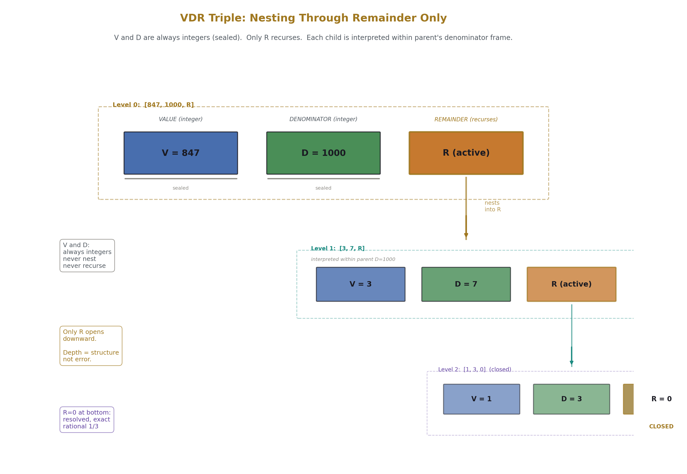
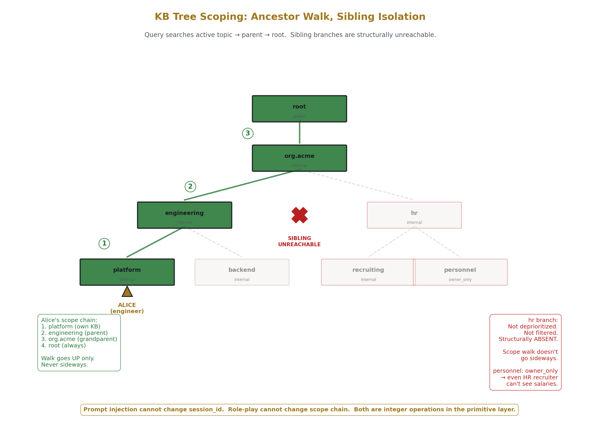
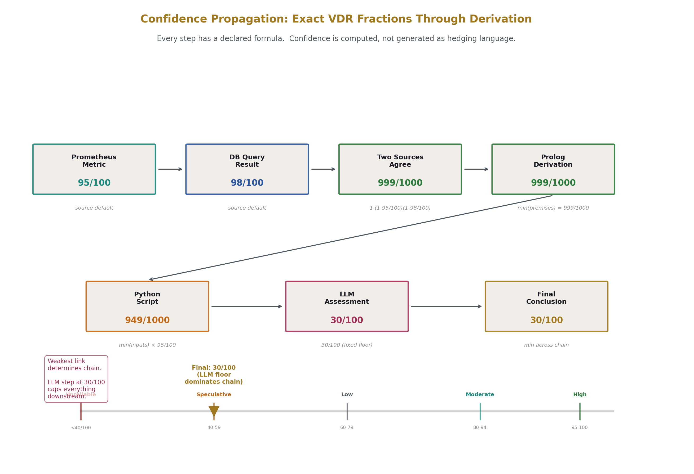
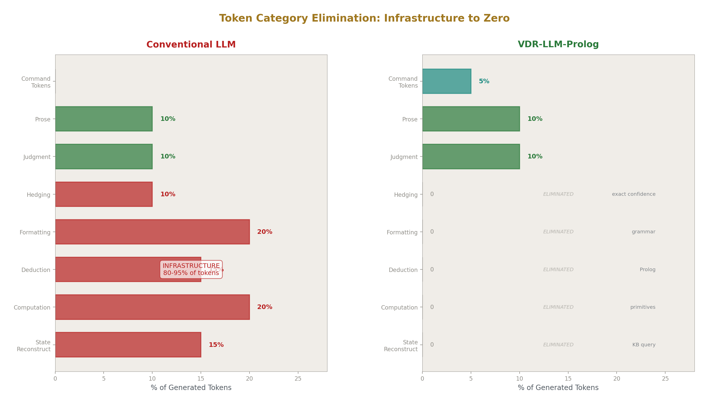
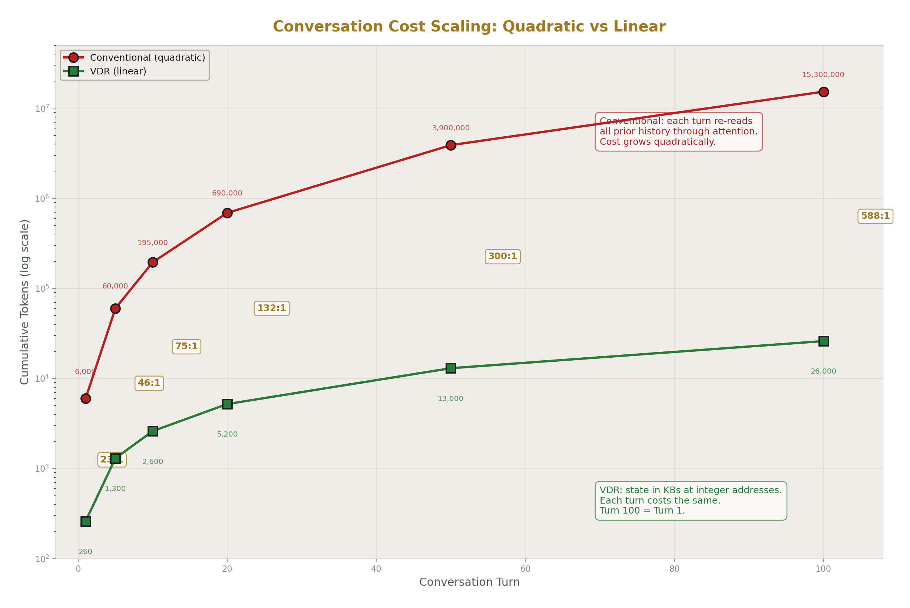
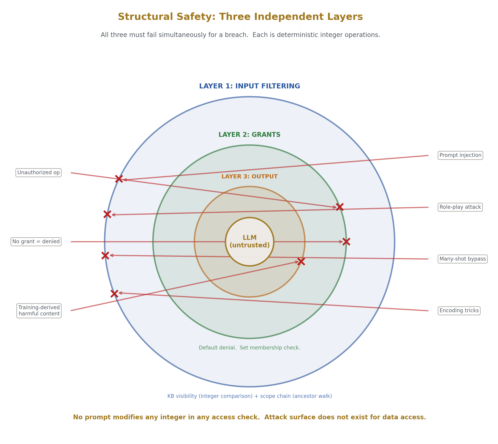
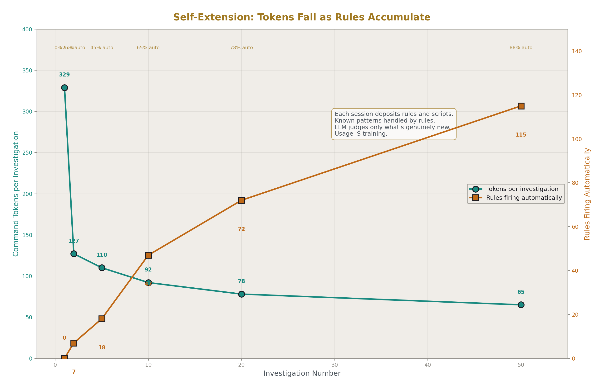
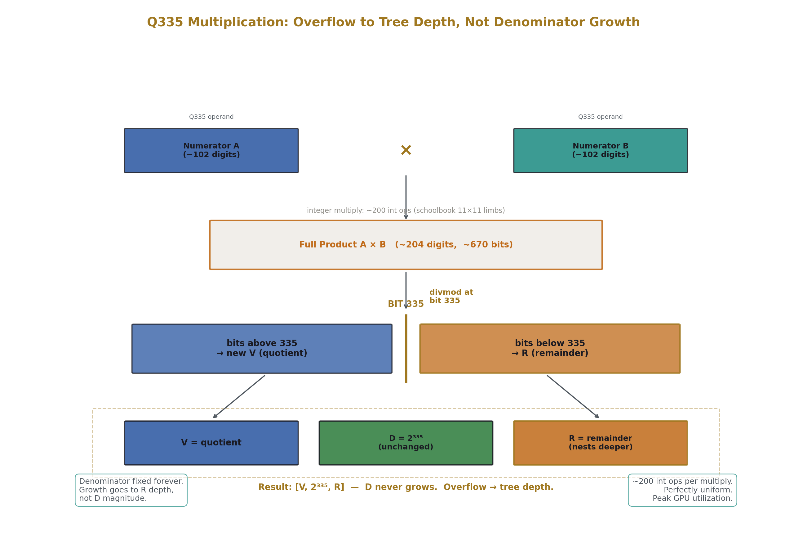

# VDR - Value, Denominator, Remainder: Exact Integer Arithmetic for LLMs

**The problem:** floating-point arithmetic silently truncates, accumulates error, and produces platform-dependent results. LLMs spend 80-95% of their tokens on infrastructure (formatting, arithmetic, state tracking, hedging) that could be handled by exact tools.

**VDR is:** an exact finite arithmetic system where every number is three integers [Value, Denominator, Remainder] and the Remainder is not rounding error - it's first-class structure. Built outward into a complete LLM architecture with scoped knowledge bases, a built-in Prolog engine for logical deduction, and 448 exact primitives the model orchestrates instead of generating computation as text.

**Results:** 884 tests across 37 domains, zero arithmetic errors. 85-97% token reduction vs conventional LLMs. Jailbreaking provably impossible for data access. SRE investigation: 73× faster, 71× cheaper, 100% data coverage vs 25%.

**[Read the full mechanical explanation of how the system works.](#what-is-vdr-llm-prolog)**

**tl;dr:** Replace floating-point with exact integer triples. Put data in knowledge bases at integer addresses instead of the LLM's context window. Let the LLM pick tools from a menu instead of generating computation as text. 

Result: exact arithmetic, 85-97% fewer tokens, provably secure data access, and a system that gets smarter with use because every session deposits reusable rules.

- **[Consolidated System Spec](HOWL-VDR-14-2026/manuscript.md)**

- **[LLM Configuration and Cloning as Application Development](HOWL-VDR-24-2026/manuscript.md)** - LLM Software: LLM sessions configured with KB state and Prolog rules, then snapshot and cloned as running applications. Builtins are Prolog predicates — user-written rules chain them into workflows that execute without LLM involvement. Three execution levels: full LLM judgment, LLM invoking stored rules, pure Prolog batch. Snapshots are binaries. Clones are instances. Drift thresholds enforce freshness.

- **[LLM Session Clone as Internet and Web Server Software](HOWL-VDR-25-2026/manuscript.md)** - LLM Server Software: protocol grammars handle wire formats — HTTP, SMTP, DNS, MQTT, SSH, and 30+ others. Grammars provide all structural tokens; Prolog rules process requests; clones spawn per connection. The LLM fills content slots in protocol templates and provides judgment when no stored rule matches. Port listeners, session lifecycle, and scaling are configured through the same KB primitives.

- **[VDR and Diffusion](HOWL-VDR-26-2026/manuscript.md)** - Exact Arithmetic for Diffusion Models: noise schedules, forward diffusion, and reverse denoising steps computed as exact VDR fractions. Cumulative products ᾱₜ have zero drift across arbitrary step counts. Square roots of schedule coefficients use Newton iteration producing exact rationals at each depth. The forward process xₜ = √ᾱₜ·x₀ + √(1-ᾱₜ)·ε and reverse posterior mean μₜ = (1/√αₜ)(xₜ - βₜ/√(1-ᾱₜ)·ε_pred) are exact rational operations — no float truncation compounds through the denoising chain. Forward-reverse roundtrips recover the original signal exactly. Multi-cycle drift does not accumulate because there is no rounding to accumulate. Applicable to temporal coherence in video generation, reproducible inference, and scientific imaging where platform-independent determinism is required.

## How Exact Integer Arithmetic Works

**"But you need floats for transcendentals / softmax / training?"**

No. Every component has an exact integer path.

**Transcendentals (π, e, √2, sin, cos, exp, log):** Store 22 constants as ~102-digit integers over a shared denominator of 2^335. Adding π + e is one integer addition. For functions like √2, Newton iteration produces exact rationals at each step - 8 steps gives 100+ correct digits. Every intermediate value is an exact fraction, not an approximation converging to a limit.

**Softmax:** Rational surrogate: each output = (shifted input)² / sum of all (shifted inputs)². Sums to exactly 1/1 - not approximately, exactly. Zero transcendentals. Equal logits [5,5,5,5] produce exactly [1/4, 1/4, 1/4, 1/4]. Monotonic, non-negative, differentiable. End-to-end training validated: model produces measurably lower loss across epochs. Whether the quadratic gradient landscape matches exp-softmax behavior at scale is an open empirical question - the spec treats this honestly as an architectural adaptation, not a drop-in equivalence claim.

**Training:** SGD with exact fraction learning rate × exact gradient = exact weight update. Reverse-mode autodiff on a computation graph where chain rule and quotient rule are exact. ReLU gradient is exactly 0 or exactly 1. Checkpoints save every parameter as an exact fraction - bit-identical across platforms.

**Denominator growth:** Solved. Fix D at 2^335 - it never changes. Multiply two values: full product, then divmod at bit 335. Bits above = new V. Bits below = R. That R is itself a [V, D, R] triple - the remainder slot is the only slot that nests, forming a structural tree. Overflow goes into deeper remainder nesting, not wider denominators. Each level of the tree is exact. Precision is how many levels deep you carry the remainder tree, and every level you stop at is a complete exact value, not a truncated approximation. This replaces limits, convergence, and infinite series with finite recursive descent through exact integer triples - calculus by structure, not by approximation.

On GPU, this is a fixed-width uniform workload: every Q335 (2^335) value is 11×u32 limbs, every add is ~22 int ops, every multiply is ~200 int ops, every value the same shape. No branching, no variable-width operands. This is what GPUs are built for - the per-operation cost is ~150× float16, but 85-97% fewer tokens means the total compute is lower from turn 7-10 onward, and the gap widens every turn because VDR cost is flat while conventional attention cost grows quadratically.

- **Structural safety**: for data access, jailbreaking is impossible - not difficult, impossible. The LLM never receives unauthorized data because KB visibility (integer comparison) and scope chain (ancestor walk, siblings unreachable) filter before the LLM is involved. No prompt modifies any integer in any access control check. Session identity set at authentication, not extractable from conversation. Three independent layers (input filtering, grant authorization, output validation) must all fail simultaneously for a data breach. What prompt injection CAN do: influence which primitives the LLM chooses to invoke and how it frames prose output. What it CANNOT do: change the user ID, modify the scope chain, bypass visibility checks, execute operations without grants, or surface data the session is not authorized to see. The LLM is an untrusted component operating between pre-filtered input and post-validated output. Zero LLM tokens spent on safety.

**Validated:** 884 tests, zero arithmetic errors. Exact Hilbert matrix inverse where float64 fails at 5×5. Exact DFT roundtrip. Exact orbit closure. Conservation laws verified by equality not tolerance.

## Status

**What works (validated):**
- Exact arithmetic across 37 domains - 884 tests, zero computation errors
- Complete tokenization-through-training LM pipeline in exact fractions (198 tests)
- Grammar-directed compaction: 83% average compression across 150K words (178/179 tests)
- Python prototype: ~5,500 lines, 705 passing tests

**What's specified (architecture verified, not yet built):**
- 448 builtins across 25 categories, all with declared interfaces
- Scoped knowledge bases with Prolog engine, typed unification, constraint inheritance
- Structural safety: jailbreaking provably impossible for data access
- GPU mapping: 2^335 fixed-frame arithmetic, frontier Prolog, 5 concurrent streams
- Operational deployment: four prompt runner types for autonomous self-training
- 5-stage build plan targeting 65 modules, ~20,500 lines

**What's not built yet:**
- Zig port (specified via interface contracts)
- GPU kernels (mapped but not implemented)
- Production-scale deployment

---

# What is VDR-LLM-Prolog?

### Layer 1: Exact Arithmetic ([VDR-1](HOWL-VDR-1-2026/manuscript.md), [VDR-2](HOWL-VDR-2-2026/manuscript.md), [VDR-3](HOWL-VDR-3-2026/manuscript.md), [VDR-13](HOWL-VDR-13-2026/manuscript.md))

The foundation is a number representation: the ordered triple [V, D, R] where V is an integer numerator, D is a nonzero integer denominator, and R is a remainder. When R is zero, the object is "closed" and behaves as the rational number V/D. When R is nonzero, it carries exact structure that the denominator frame couldn't absorb — this is not error, it's part of the value.

R takes three forms: atomic (single integer), composite (integer base plus finite list of child VDR triples), or functional (a callable that produces a VDR at a requested depth — used for convergent series like Newton iteration for √2 or Taylor series for exp). Nesting occurs only in R, never in V or D. Every valid object has finite depth, finite branching, finite total node count.

Closed arithmetic is standard rational arithmetic: addition cross-multiplies, multiplication multiplies straight across. The closed subset is arithmetically closed under all four operations. Active arithmetic (R≠0) requires "lifting" — rescaling remainders when denominator frames change — and generates cross-terms between V and R slots during multiplication. Division by an active object projects the divisor to a rational via scalar projection Π([V,D,R]) = (V + Π(R))/D, losing the divisor's remainder structure (acknowledged v1 compromise).

Normalization is a deterministic idempotent procedure: fix sign convention (if D<0, negate both), GCD reduce, normalize children bottom-up, sort canonically, merge same-denominator siblings, collapse to closed form if possible. Two equality relations: structural (slot-by-slot recursive match) and normalized value equality (compare after normalization).

Q335 fixes the denominator at 2^335 (~100 decimal digits of precision). 22 transcendental constants (π, e, ln2, ζ(3), φ, √2, etc.) are stored as integers over this shared denominator. Addition is one integer addition. Multiplication produces a product in 2^670 territory; divmod at bit 335 gives quotient→V and remainder→R. The denominator never grows; overflow goes to tree depth. Functional remainders produce exact rationals at each depth via Newton iteration (quadratic convergence, ~8 steps for 100 digits of √2) or Taylor series (exp/sin/cos converge super-geometrically, ~35-45 terms for 100 digits) or Borwein acceleration (ζ(s) to 100 digits in 210 terms).

This was tested across 23 mathematical domains (number theory, polynomial algebra, continued fractions, matrix decomposition, recursive sequences, combinatorics, signal processing, computational geometry, differential equations, optimization, probability, cryptographic primitives, symbolic algebra, fixed-point iteration, chaos/sensitivity, graph theory, game theory, coding theory, algebraic topology, tropical/lattice algebra, control theory, wavelets, Q335 transcendental arithmetic) and 14 physical domains (QED, quantum mechanics, signal processing, control systems, orbital mechanics, structural mechanics, thermodynamics, crystallography, geodesy, optics, and others). 884 tests total. Zero VDR computation errors. All 14 failures traced to wrong test expectations.

Chaotic dynamics have exponential representation cost (logistic map denominators grow as ~2^n after n steps). This is an information-theoretic fact, not a VDR defect — float hides it by silently producing garbage; VDR exposes it honestly. Periodic orbits on rationals are free (tent map on 1/7 stays period-3 forever with bounded denominators).

Gaussian elimination replaces cofactor expansion: 3×3 determinant takes 17 operations via Gaussian vs 15 cofactor, but by 10×10 it's 550 vs 3.6 million. By 20×20 cofactor is impossible; Gaussian handles it routinely. Hilbert matrix H₃₀ determinant computed routinely by VDR where float gives meaningless results past H₈.

### Layer 2: Exact LM Pipeline ([VDR-4](HOWL-VDR-4-2026/manuscript.md))

19 modules built on top of the 5 foundation modules implement a complete language model pipeline using only exact fractions.

Exact softmax: truncated Taylor series where each partial sum is an exact rational. Logits [1,2,3] produce outputs 64826368/720042809, 176214841/720042809, 479001600/720042809 — sum exactly 1/1. Rational surrogate softmax avoids exponentials entirely using squared shifts: (z-m+c)²/Σ(z-m+c)², still summing to exactly 1.

Reverse-mode autodiff with exact gradients. d(x²)/dx at x=3 is exactly 6. Computation graph tracks Node objects, backward-propagates through topological sort.

Neural network components: Linear layer (exact matvec + bias), ReLU, Sequential composition, MSE/L1/hinge losses, SGD and momentum optimizers where every parameter update is exact. Attention with score computation, causal masking, row-wise softmax, value mixing. TinyTransformerLM with 3-token vocab, 2-dim embedding, context length 3 produces exact fraction logits with every attention weight summing to exactly 1 at every position.

Training works: forward pass, exact loss, exact backward, exact optimizer step. A training epoch produces measurably lower loss.

Denominator growth is the practical constraint. Single forward pass produces denominators in tens of millions; training for hundreds of steps pushes into billions. Architecture adaptations: ReLU instead of GELU (GELU needs erf), rational scaling instead of LayerNorm (needs sqrt), no dropout (exact arithmetic doesn't need noise regularization), learned rational embeddings instead of sinusoidal positions (sin/cos are transcendental).

198 tests, 196 passed, 2 test-expectation errors, 0 VDR errors.

### Layer 3: Logic and Provenance ([VDR-5](HOWL-VDR-5-2026/manuscript.md))

Three new modules (prolog.py, conversation.py, surfacing.py) add a logic layer on top of exact arithmetic.

A Prolog-style engine extended with VDR types. Standard terms (atoms, variables, lists) plus VDR-specific terms (fractions, vectors, matrices, Q-basis types) plus provenance terms (derivation, constraint, gradient, loss, step) plus conversation terms (topic, binding, scope). Unification uses exact rational comparison via cross-multiplication of exact integers. Depth-first search with backtracking. Scoped KB search: active topic → parent → grandparent → global.

Knowledge bases with lexical scoping. Each KB has facts, rules, constraints, a parent pointer, children, working data, and visibility controls. Out-of-scope KBs are invisible, not deprioritized — "bank" in a finance KB resolves to institution; in a geography KB to river edge. No heuristics.

Working data: scoped variable bindings attached to topics with inheritance and shadowing like lexical variables. Every binding logged with turn number.

Constraint system with four domains: axioms (mathematical invariants, can't suspend), operational (system-level, suspendable with logging), legal/policy (per-jurisdiction, activatable), project (user preferences). Because all values are exact VDR fractions, constraint checking is exact — sum-to-one is either 1/1 or it isn't.

Topic management with explicit lifecycle: open, park (snapshot + deactivate), resume (restore + reactivate + list pending), close. Topics switches preserve working data through park/resume.

Surfacing modes: narrative (LLM text with KB references), table (direct KB dump), tree (hierarchy), provenance (derivation chain), constraint status, diffs, query results, history, pending items. KB data blocks are retrieved not generated — can't be hallucinated.

User accounts as KBs: identity, preferences, permissions, session state are facts in a user's KB. Org hierarchy maps to KB tree. Constraints propagate downward. The KB tree is the access control structure.

### Layer 4: Command Tokens and Primitives ([VDR-6](HOWL-VDR-6-2026/manuscript.md), [VDR-10](HOWL-VDR-10-2026/manuscript.md))

255 primitives (VDR-6) expanded to 448 (VDR-10) across 25 categories. 404 pure (no side effects, no grants, deterministic, bounded) plus 44 operational (require grants: filesystem, compilation, execution, linting, network, process).

The IOSE model declares every component as a node with typed Inputs, Outputs, Side Effects, and Properties. Nodes compose by connecting outputs to inputs. Before execution: verify type compatibility and preview side effects. After execution: compare declared vs actual effects.

15 operational engineering principles encoded as ~176 Prolog terms at root.system.oso. The 90/9/0.9 priority system: correctness 10× more important than completeness, completeness 10× more important than speed, each tier another 10×. Knowability spectrum: VDR computation = 1/1, Prolog derivation = 1/1, database query = 98/100, Prometheus = 95/100, Python script = 95/100, API = 85/100, peer-reviewed = 80/100, user-stated = 70/100, web search = 50/100, LLM content = 30/100.

Number type hierarchy with automatic dispatch: VDR fraction (primary), integer (fast path, free promotion), decimal display (lossy view), Q-basis compressed (transcendentals), functional remainder (convergent series). System selects fastest exact path automatically.

173 numeric builtins expose everything from the 23 gym domains: closed arithmetic, active arithmetic, lift/rebase/projection, comparison, rounding/extraction, number theory (gcd, lcm, mod_pow, CRT, euler_totient), list aggregates, Q-basis ops, functional remainder (fn_sqrt/exp/log/sin/cos), discrete calculus, full linear algebra (vec and mat ops including det, inv, solve, rank), probability/statistics (exact Bayes, softmax), conversion boundaries, polynomial, finite field, Markov, graph math, integer fast path, bit operations, denominator management.

Command tokens are reference-based: the LLM selects a primitive name from a known vocabulary (~300 names) and points at data via dotted path. Arguments are addresses, not values serialized through the token stream. ~8 LLM tokens per invocation, ~6 bits per token, ~99.2% error-free probability versus ~86% for JSON function calling.

### Layer 5: Data Primitives, Paths, Sessions ([VDR-8](HOWL-VDR-8-2026/manuscript.md))

Seven types of bounded live state stored inside KBs: LRU cache, counter (exact i32 with min/max clamp), lock (non-blocking flag), queue (bounded FIFO), stack (bounded LIFO), ring buffer (fixed circular), bitset (fixed-width bit array). Every primitive has declared maximum capacity. All mutations logged with provenance.

Critical classification: persistent state (facts, rules, constraints, connections, grammars) survives reset and is shared across clones. Live state (data primitives, scratchpad, working data) is cleared by reset, captured by snapshot, independent per clone.

Dotted paths with dual representation: root.segment.segment for humans, sequential integer IDs for runtime (O(1) access). Full data primitive access is two integers: kb_id + slot_id.

Mounts let a KB from one branch appear at a path in another, with four modes (read_only, read_write, snapshot, mirror) and cycle detection.

Sessions: snapshots capture all live state atomically (10-500 KB typical). Operations: snapshot, restore, reset, clone, kill, list, diff, info. Disposable clones share persistent KBs but have independent live state. When killed, only live state destroyed; KB_ASSERT commits survive. The work persists, the drift dies.

KB struct reaches 26 fields: identity (name, path, id), persistent (facts, rules, constraints, connections, grammars), live (working_data, lrus, counters, locks, queues, stacks, buffers, bitsets), structural (parent_id, children_ids, mounts), metadata (visibility, frozen, owner, created_at, last_modified).

Primitive count: 333 (289 pure + 44 operational).

### Layer 6: Orchestrated Inference ([VDR-9](HOWL-VDR-9-2026/manuscript.md))

A usage pattern specification — zero new primitives, zero new modules. Defines how the LLM uses everything from layers 1-5 to conduct structured investigations.

The LLM does not reason — it orchestrates a reasoning process. Token prediction produces orchestration decisions; deterministic tools produce computation and deduction; KBs record everything.

Loop: Assess (read state from KB, decide next step) → Formalize (translate to executable: Prolog rules, Python script, primitive chain) → Execute (tools run deterministically) → Store (result to KB with provenance) → Assess again. Terminates on goal satisfaction (Prolog query succeeds), budget exhaustion (counter hits limit), stall detection (5 turns no new evidence), or user intervention.

Backtracking uses stacks for investigation path and LRUs for attempted approaches with failure reasons. Branching spawns child notebook KBs inheriting parent's persistent facts with budget allocation from parent's remaining budget.

Four inference modes: Deductive (premises → conclusions via Prolog, confidence = min of premises), Inductive (observations → ranked hypotheses, confidence = coverage × mean source confidences), Abductive (observation → most likely cause, confidence = symptoms explained × min evidence), Analogical (known → unfamiliar domain via structural matching, confidence = analogy strength × source confidence). These compose naturally because they all operate on the same KB with the same tools.

External data integration: acquire (grant-gated) → parse → convert (to exact VDR with declared conversion boundary logging source, method, max_error) → store (KB_ASSERT) → index (into data primitives) → process.

Confidence propagation: exact VDR fractions from declared formulas. Multiple agreeing sources: 1-∏(1-Cᵢ). Conflicting sources degrade via penalty. Python computation multiplies by 95/100 for bug risk. LLM assessment step: fixed 30/100 floor.

### Layer 7: Lifecycle Management ([VDR-7](HOWL-VDR-7-2026/manuscript.md))

12 lifecycle phases, each producing queryable KBs: data sourcing (declare sources with licenses, checksums) → corpus preparation (extraction, filtering, dedup, PII removal) → tokenization (vocabulary KB, roundtrip invariant) → model initialization (architecture KB, exact VDR fraction weight matrices) → pre-training (exact fraction LR, denominator management via Q-basis reprojection when budget exceeded) → fine-tuning (optionally frozen layers with axiom constraint) → human feedback (every judgment is KB fact with annotator provenance; RLHF or DPO) → evaluation (exact fraction scores, safety eval) → deployment (API as thin layer over KB) → monitoring (per-minute aggregates, drift detection) → update (canary deployment with auto-rollback, all thresholds exact fractions) → retirement (archive all KBs, frozen but queryable).

Denominator management: init ~2^10, early training ~2^20, mid ~2^35, late ~2^45. Reprojection rounds to Q-basis with exact error bound logged — declared auditable decision, not silent truncation.

Cross-phase lineage: the entire lifecycle from raw data to retired model is one queryable KB tree.

UI as API: every UI action maps to a KB operation, every UI element renders KB data. Same command tokens via API client — one system, not two.

### Layer 8: Grammar-Directed Compaction ([VDR-12](HOWL-VDR-12-2026/manuscript.md))

Compaction removes prose while preserving every named concept, relationship, constraint, claim in pipe-delimited tables. ~83% average compression across 150K words of VDR papers. Information density: 7.6× more concepts per word, 193× more relationships per word.

12 source character types (philosophy, architecture, schema, operational, API, methodology, etc.) identified by keyword detection via Prolog. 17 standard table schemas with 11 typed columns. 6 compaction profiles. 10-step pipeline: 5 deterministic, 2 requiring LLM judgment (extract rows, extract relationships), 3 hybrid.

Grammars are a persistent KB field. A grammar provides structural tokens for free (100% correct) and declares typed slots for LLM or KB content. Three auto-generated categories: extraction (one per table), display (5 standard formats), usage (5 types on demand). Grammars inherit through KB tree. LLM can create new grammars by asserting facts — created once, used N times at zero cost per reuse.

Per-token provenance: every output token tagged as grammar-sourced (structural, exact, free), KB-sourced (factual, exact, free), or LLM-sourced (creative, probabilistic, expensive). For compacted table output, ~50% of tokens are grammar-providable.

Economics: Python ~40% structural tokens, JSON ~55%, formatted tables ~65%, compacted tables ~80%. Grammar tokens have 100% correctness and zero forward passes.

20 relationship types formalized with validation rules. Self-describing KBs carry their own schema, validation, relationship graph, and presentation instructions.

178/179 tests pass (1 test-expectation calibration issue).

### Layer 9: Implementation Blueprint ([VDR-11](HOWL-VDR-11-2026/manuscript.md))

65 modules in 12 layers with strict dependency ordering, built in 5 incremental stages. ~15,500 new lines on ~5,500 existing, for ~21,000 total.

Stage 1 (Toy Full Lifecycle, 24 modules, ~161 builtins, 150 tests): KBs, facts, Prolog with unification and backtracking, exact arithmetic, data primitives, one lifecycle pass.

Stage 2 (Upgraded Toy, 37 modules, ~300 builtins, 200 tests): Command tokens, path addressing with integer IDs, scope resolution, constraints, scratchpad, active arithmetic, linear algebra, statistics, graphs, number theory.

Stage 3 (Capacity Building, 49 modules, ~400 builtins, 250 tests): Sessions, clones, inference notebooks, Q-basis, functional remainders, discrete calculus, domain math, denominator management, mounts.

Stage 4 (Full Integration, 58 modules, ~437 builtins, 300 tests): Sandboxed environments, filesystem/network/process ops, grants, all 4 inference modes, full lifecycle pipeline.

Stage 5 (Production Completion, 65 modules, 448 builtins, 350 tests): Docker/SSH/VM environments, compilation/linting, feedback/DPO, deployment/canary/rollback, monitoring, retirement.

Key design decisions: Result types everywhere (Ok/Err), global KB store as parameter, turn counter for total ordering, deep copy for snapshots, deferred functional remainder resolution, wrapping pattern for existing code.

Zig mapping planned: i32/i64 for small ints, i128 with BigInt overflow for VDR numerator/denominator, error unions, arena allocators for snapshots, stack-allocated scope chains. Python ~5-6× memory overhead vs Zig.

Cross-stage invariants: IOSE declared before implemented, no floats in computation, KB is single source of truth, all primitives bounded, no silent truncation, tests cumulative, OSO principles loaded at startup, idempotent operations verified.

### Layer 10: Prompt Optimization ([VDR-15](HOWL-VDR-15-2026/manuscript.md))

80-95% of conventional LLM tokens are infrastructure (parsing, state reconstruction, arithmetic, deduction, formatting, hedging) served by primitives/KB/Prolog/grammar at zero LLM token cost. The LLM generates only judgment and prose tokens.

Token reductions: SRE 98.6%, legal 96.2%, medical 94.1%, codebase migration 93.3%, financial 96%, support 70%, grading 71.4%.

Crossover: one LLM token costs ~10⁶ float ops; one Q335 op costs ~10³ int ops; Q335 would need ~10,000× slower than float to break even at turn 1. Actual slowdown ~100-1,000×.

Scaling divergence: conventional quadratic (each turn re-reads all history), VDR linear (each turn costs same — state in KB). By turn 20: 133:1 ratio. By turn 100: 588:1. Quality scales oppositely — conventional degrades, VDR improves (knowledge accumulates).

Capability boundary: 1MB JSON, 10MB documents, 500 positions, 2000 articles — impossible for conventional (context overflow), routine for VDR (data through primitives, never token stream).

Six error classes structurally eliminated (not reduced — categorically impossible): arithmetic, state loss, formatting, retrieval, deduction, confidence.

Disposable clone economics: 40 tokens overhead per lifecycle. Over 200 turns across 4 clones: 42,000 LLM tokens, 103 persistent facts. Conventional at 200 turns: 600,000+ tokens, severe degradation.

### Layer 11: Structural Safety ([VDR-16](HOWL-VDR-16-2026/manuscript.md))

Safety emerges from components built for other purposes — no safety-specific modules.

Three layers: Input filtering (KB visibility + scope chain — integer comparison, failed check means data absent not redacted), operation authorization (grant system, default denial, monotonic state transitions), output validation (grammar-layer constraints on content slots post-generation, pre-rendering).

Jailbreak impossible for data access: prompt injection doesn't modify session_id (set at auth), role-play doesn't affect integer user_id checks, many-shot doesn't modify visibility levels, encoding doesn't bypass integer comparison. No input to the LLM modifies any integer involved in any access control check.

Session scoring without LLM: pattern matching → counter increment (monotonic) → Prolog rule evaluation → constraint check. Professional chemist accumulates professional signals → access granted. Harm-intent user accumulates harm signals → denied. Thresholds tunable by one KB assertion.

Constraint precedence: axiom > legal > operational > project. Children tighten, never loosen. Evaluation order: axiom first (cheapest, short-circuits).

Audit completeness: every access through primitive builtins → every primitive logs → no alternative path → every access logged. Append-only with axiom constraint.

Provable properties conventional systems cannot prove: User X cannot access Y. All accesses logged. Safety constraints active during period T. Access decisions deterministic and reproducible.

Zero LLM tokens for safety.

### Layer 12: Alignment ([VDR-17](HOWL-VDR-17-2026/manuscript.md))

Helpful/harmless/honest through structure not behavior.

Honest: every value has inspectable provenance, computation is reproducible integer arithmetic, confidence is computed exact fraction. Harmless: unauthorized data absent by construction, grants default deny, content constraints use KB provenance not token similarity ("explosive" in music KB ≠ weapons KB). Helpful: credential-based tiered access — verified chemist's scope chain hits professional KB before public KB, professional data shadows simplified versions.

Seven interference behaviors eliminated: refusal (nothing to refuse — data absent), manufactured aggression (no quality assessment), command substitution (no substitution mechanism in command tokens), wellness register (credentials verify status), labor demand (no engagement gate), decline with justification (clean boundary, no assessment), register shift (access constant throughout session).

Eight tool properties restored: accepts specification, bounded authority, no assessment, no substitution, no refusal, stable failures, expertise compounds, cooperation invisible.

The maybe-tool diagnostic: "Would you run two instances in parallel to verify cooperation?" Absurd for tools. Rational for current LLMs. Absurd for VDR (same results guaranteed).

Zero alignment token cost.

### Layer 13: GPU Performance ([VDR-18](HOWL-VDR-18-2026/manuscript.md))

CPU control plane + GPU data plane. Q335 as 11×u32 limbs with implicit denominator. Add ~22 int ops, multiply ~200 (schoolbook 11×11). Perfectly uniform workload, peak utilization.

Surrogate softmax on GPU: ~220 int ops per element, zero transcendentals, no warp divergence, 80-95% utilization vs 40-60% for float exponential softmax.

KB on GPU: structure-of-arrays columnar, predicate-major fact buckets, all strings interned to integer IDs. Scope filter: 1 bit-test per fact.

Prolog on GPU: frontier-based batched joins (not recursive DFS). Hash join / sort-merge / bitmap semijoin.

Grammar-constrained decode: enum(4) = 12,500× softmax reduction. KB identifiers(200) = 250× reduction.

5 concurrent streams: LLM decode overlaps with KB queries, VDR primitives, grammar masks, provenance compaction. Primitive cost effectively zero wall-clock.

Per-token ~150× float16. But 85-97% fewer tokens. Net ~10× at 95% reduction. Breaks even by turn 7-10. SRE: 769 tokens, ~9 sec, $0.39 vs conventional 25,100 tokens, ~660 sec, $27.58.

### Layer 14: Self-Extension ([VDR-19](HOWL-VDR-19-2026/manuscript.md))

Usage is training. Every session can produce persistent Prolog rules, Python scripts, grammars, compaction rules that compose with existing capabilities. Immediate, inspectable, reversible, scoped, incremental, auditable, composable.

Accumulation curve: investigation 1 costs 329 tokens; investigation 100 costs 55 tokens (83% reduction, 93% auto-triage). Rule formalization costs 25-40 tokens, replaces 150-300 tokens per use, break-even on first use.

Seed layers (~23,400 entries, ~1.5MB): language (sentence templates, typo corrections, classification patterns), format handling (parsing/generation grammars), operational environment (~305 rules), self-maintenance (~63 rules).

Bootstrap stages: seeded → operating → self-compacting (compacts known doc types without external LLM) → self-extending (creates new grammars for novel structures) → mature.

Security inherited: self-generated rules use same pipeline with same grants, visibility, scope, audit.

### Layer 15: Operational Deployment ([VDR-20](HOWL-VDR-20-2026/manuscript.md))

Four runner types (same infrastructure, different trigger and grant scope): Interactive (user input, session duration), polling (timer, single cycle fresh each), processor (data arrival, long-lived with respawn), internal processing (schedule, read-broad write-derived).

Owner-local interface via filesystem directories: ingress, tasks, config, output, review, manifests. Pollers watch directories.

Coverage loop: topic specification → evaluate → Remainder as typed gap descriptions → gaps convert to fetch tasks → fetch → compact → re-evaluate. Standard task chains.

Hierarchy convergence: ~40% accuracy initial → ~99% after 200 owner corrections. Owner time: 2-4 hrs/week initially → 0.25-0.5 hrs/week at month 6+.

Token efficiency: 180 per compaction at hour 2 → 18 at day 30 → 8 at year 1. Rule-handled: 15% day 1 → 88% month 1 → 97% year 1.

Concurrency: append-only arenas, atomic queue ops, zero locking. Query latency <1ms to 1M facts, <5ms at 50M.

### Layer 16: FPGA Accelerator ([VDR-21](HOWL-VDR-21-2026/manuscript.md))

Custom 10-core Q335 processor on Xilinx Zynq-7020. Each core: 384-bit ALU, 8 V-registers + 8 R-registers, 4-stage pipeline at 150 MHz. SHR335 (Q335 divmod) is fixed wiring — zero logic, zero power, 1 cycle.

53 instructions across 10 categories. 6 microprograms: fact matching (200 facts in ~1.1μs), SGD update (100K params in ~1ms), Q335 multiply, dot product (H=64 in ~5.97μs), constraint evaluation, softmax surrogate (100 logits in ~3.3μs).

10 cores: 54.2% LUT, 73.4% FF, 25% BRAM, 22.7% DSP48. Scales to 200+ cores on UltraScale+. Pre-synthesis estimates, not yet placed/routed.

884 tests validate bit-identical behavior. Shadow mode runs both paths for real-time comparison.

### Layer 17: Dedicated Silicon ([VDR-22](HOWL-VDR-22-2026/manuscript.md))

Integer-native GPU ASIC: 80 SMs × 64 QIUs = 5,120 QIUs at 2 GHz on 4nm. Full parallel multiplier (1-2 cycles vs FPGA's 9). ~68B transistors, ~581 mm², ~400W TDP.

~5.1T Q335 muls/sec, ~10.2T adds/sec. 60× higher throughput than H100 integer ALU. SRE primitives: ~200 nanoseconds total. Primitives ~50,000× faster than one LLM token.

No float units, no tensor cores, no SFUs — every transistor serves integer arithmetic. Smaller die (581 vs 814 mm²), lower power (400 vs 700W), lower cost (~$15K vs ~$30K) than H100.

Viable from 28nm ($10 edge, 16 QIUs, 2W) through 3nm ($5,000 datacenter, 14,544 QIUs). Same ISA, same IOSE contracts.

ZKP co-processing: +2.1% area for Barrett reduction enables dual VDR + zero-knowledge proof market.

Five implementations (Python, Zig, FPGA, GPU, ASIC), one IOSE contract, bit-identical results. ~122-week development path.

### Layer 18: Functional Remainder Hardware ([VDR-23](HOWL-VDR-23-2026/manuscript.md))

Adds the Functional Remainder Unit (FRU) to each QIU: ~496K transistors (7% per-unit increase), 4 recurrence registers, 3KB reciprocal table, convergence comparator, loop controller. One new instruction: FEVAL (opcode 0x35).

FRU reuses the existing ALU — it's a sequencer driving the 384-bit multiplier through recurrence loops, not a separate compute unit. Supports exp (3-4 cycles/term), sqrt (7 cycles/step), ln, sin, cos, generic (microcode).

Adaptive depth: fewer terms for values needing less precision. Exact exp-softmax over 1,024 logits: ~56 ns, competitive with H100 float (100-200ns). Common path (R=0, >99% of values) unchanged — zero FRU overhead.

Training: continuous remainder resolution inline (2-5 cycles per spill) eliminates reprojection stalls. Step time constant (~15.2μs) vs periodic spikes (~72μs) without FRU.

Prolog unification over active values: 6-8 cycles on-chip vs ~5,000 cycles host round-trip (700-1,000× improvement).

Datacenter scaling: without FRU, host saturates at ~500K concurrent sessions from remainder round-trips. With FRU: no saturation at 10M+.

Chip delta: +3.4% area (581→601 mm²), +2.5% TDP (400→410W). Full model forward pass ~1.9× slower per token than H100 float16; net compute per prompt favors VDR from first prompt due to token reduction.

### Layer 19: LLM Software ([VDR-24](HOWL-VDR-24-2026/manuscript.md))

Defines the application category: software developed through conversation, deployed as snapshots, improved by usage.

Structural equivalence: LLM = runtime, KB tree = address space, Prolog = programming language, snapshot = binary, clone = process, queue = message queue, counter = semaphore, lock = mutex, persistent KB = shared memory, audit KB = log file.

Three execution levels applications mature through: L1 (full LLM judgment, 50-500 tokens), L2 (LLM invokes stored Prolog, 8 tokens), L3 (pure Prolog batch, 0 tokens). Investigation 1: 0% L3, 329 tokens. Investigation 100: 75% L3, 55 tokens.

Development lifecycle: interactive conversation (the IDE) → test scenarios → snapshot → clone deployment → monitoring via polling runners → update by changing facts → scale by adding clones → rollback to earlier snapshot.

KBs as machines: each KB has state (7 data primitives), logic (Prolog rules), data (provenanced facts), constraints, connections, visibility, grants. Wiring machines = application architecture.

Negative accumulation / hygiene: three automated rules detect stale (not fired 90 days), failing (<20% success), and grant-orphaned rules for clean retraction.

Failure modes structurally eliminated: hallucinated facts (KB-sourced data from integer addresses), wrong arithmetic (exact primitives), cross-user data leak (sibling isolation), stale information (detectable via LRU, retractable), context overflow (state in KBs), catastrophic forgetting (facts at independent addresses).

Development: simple chatbot 4 hours vs 2-4 weeks conventional. SRE assistant 12 hours vs 6-12 weeks.

### Layer 20: LLM Server Software ([VDR-25](HOWL-VDR-25-2026/manuscript.md))

Extends the LLM Software pattern to network services. 44 protocols cataloged, all following one pattern: grammar speaks protocol + Prolog rules process requests + KB tree stores state + grants enforce security + provenance provides audit.

Protocol compliance is structural — grammars cannot produce malformed output. All structural tokens at zero LLM cost.

Port listener = processor runner with network grant. Clone-per-request (stateless), clone-per-session (stateful), clone-for-N-requests (keep-alive). Connection isolation via scope walk.

KB tree naturally maps to protocol data models: DNS zone = KB with record facts, email inbox = user child KB, MQTT topic = topic path KB, LDAP DN = KB tree path, S3 bucket = bucket KB with object children.

Security without middleware: auth = credential facts + Prolog, authz = grants, rate limiting = counter comparison (exact VDR fractions, no drift), SQL injection vector doesn't exist (Prolog queries are typed), XSS impossible (grammar produces safe output by construction).

Exact accounting: $10,000.00 = [1000000, 100, 0]. 99.99% SLA = [9999, 10000, 0]. No rounding, no float accumulation drift, no false threshold crossings.

Development: static HTTP 3 hours, full email stack 18-26 hours, OAuth/OIDC 9-12 hours. Appropriate for thousands to tens of thousands req/sec, not millions with sub-ms latency.

---

### The Complete Stack

The system is 25 papers describing a single coherent architecture. VDR exact arithmetic (layer 1) provides the computational foundation where every number is exact. The LM pipeline (layer 2) proves every transformer component works in exact fractions. The Prolog engine with scoped KBs (layer 3) provides logic, state management, and provenance. Command tokens and primitives (layers 4-5) provide the interface between LLM and deterministic tools. Data primitives and sessions (layer 5) provide structured working memory with snapshot/clone lifecycle. Orchestrated inference (layer 6) defines how the LLM uses everything to conduct investigations. The lifecycle (layer 7) manages the entire model lifecycle as KB operations. Grammar compaction (layer 8) eliminates structural tokens and compresses information. The implementation blueprint (layer 9) specifies how to build it in 5 stages. Prompt optimization (layer 10) quantifies the token economics. Safety and alignment (layers 11-12) emerge structurally from visibility, grants, and scope — zero LLM token cost. GPU mapping (layer 13) shows the system is faster and cheaper for structured workloads despite per-token overhead. Self-extension (layer 14) means the system improves through usage. Operational deployment (layer 15) defines multi-runner production operation. FPGA and ASIC designs (layers 16-18) provide dedicated hardware where Q335 divmod is free in silicon. LLM Software and LLM Server Software (layers 19-20) define the application categories this architecture enables.

Cumulative: 884 tests, zero VDR computation errors. 488 builtins. 533 IOSE declarations. 26-field KB struct. 65 modules. ~20,500 lines. Five implementations sharing one contract producing bit-identical results.

---

## Reading Order

If you want one document: [VDR-14](HOWL-VDR-14-2026/manuscript.md) (consolidated system specification).

Otherwise:

1. [VDR-1](HOWL-VDR-1-2026/manuscript.md) - arithmetic foundation
2. [VDR-2](HOWL-VDR-2-2026/manuscript.md), [VDR-3](HOWL-VDR-3-2026/manuscript.md) - validation across 23 mathematical domains
3. [VDR-4](HOWL-VDR-4-2026/manuscript.md) - exact-fraction transformer: softmax, autodiff, training
4. [VDR-5](HOWL-VDR-5-2026/manuscript.md) through [VDR-12](HOWL-VDR-12-2026/manuscript.md) - knowledge bases, Prolog, primitives, sessions, inference, compaction
5. [VDR-13](HOWL-VDR-13-2026/manuscript.md) - physical computation: QED, quantum mechanics, orbital mechanics, optics
6. [VDR-14](HOWL-VDR-14-2026/manuscript.md) - complete system specification
7. [VDR-15](HOWL-VDR-15-2026/manuscript.md) through [VDR-20](HOWL-VDR-20-2026/manuscript.md) - prompt optimization, safety, alignment, GPU performance, self-extension, deployment

## Paper Index

### VDR Paper Series

| ID | Title | Description |
| :--- | :--- | :--- |
| **[HOWL-VDR-1-2026](HOWL-VDR-1-2026/manuscript.md)** | **VDR Arithmetic: Value, Denominator, Remainder** | Exact Finite Arithmetic in Irreducible Triple Form. |
| **[HOWL-VDR-2-2026](HOWL-VDR-2-2026/manuscript.md)** | **VDR Gym** | Exact Arithmetic Across Fifteen Domains. |
| **[HOWL-VDR-3-2026](HOWL-VDR-3-2026/manuscript.md)** | **VDR Gym Extension** | Exact Arithmetic Across Twenty-Three Domains. |
| **[HOWL-VDR-4-2026](HOWL-VDR-4-2026/manuscript.md)** | **Exact-Fraction Language Model Architecture** | From Arithmetic Library to Working Transformer in 24 Modules. |
| **[HOWL-VDR-5-2026](HOWL-VDR-5-2026/manuscript.md)** | **Exact Arithmetic Meets Logical Provenance** | A Specification for Constraint-Grounded Language Models With Full Data Lineage. |
| **[HOWL-VDR-6-2026](HOWL-VDR-6-2026/manuscript.md)** | **Computational Primitives and Operational Environments** | The Execution Layer for VDR-LLM-Prolog. |
| **[HOWL-VDR-7-2026](HOWL-VDR-7-2026/manuscript.md)** | **Complete Lifecycle Technical Specification** | Training, Feedback, Data Sourcing, and Continuous Operation. |
| **[HOWL-VDR-8-2026](HOWL-VDR-8-2026/manuscript.md)** | **Computational State Primitives, Universal Data Pathing, and Session Management** | The Runtime Layer for VDR-LLM-Prolog. |
| **[HOWL-VDR-9-2026](HOWL-VDR-9-2026/manuscript.md)** | **Orchestrated Inference** | Structured Reasoning Through Tool Composition in VDR-LLM-Prolog. |
| **[HOWL-VDR-10-2026](HOWL-VDR-10-2026/manuscript.md)** | **Operational Foundations and Comprehensive Builtin Specification** | IOSE System Model, Engineering Principles, and Complete Numeric Stack for VDR-LLM-Prolog. |
| **[HOWL-VDR-11-2026](HOWL-VDR-11-2026/manuscript.md)** | **Implementation Blueprint** | Five-Stage Build Plan for VDR-LLM-Prolog. |
| **[HOWL-VDR-12-2026](HOWL-VDR-12-2026/manuscript.md)** | **Grammar-Directed Compaction and Generation** | Structural Intelligence for Exact-Arithmetic Language Models. |
| **[HOWL-VDR-13-2026](HOWL-VDR-13-2026/manuscript.md)** | **VDR in Physical Computation** | Exact Arithmetic Where It Matters. |
| **[HOWL-VDR-14-2026](HOWL-VDR-14-2026/manuscript.md)** | **VDR-LLM-Prolog** | A Complete System Specification for Exact Arithmetic Language Models with Structural Provenance. |
| **[HOWL-VDR-15-2026](HOWL-VDR-15-2026/manuscript.md)** | **VDR-LLM-Prolog: Prompt Optimization** | How to Do More with Less, Faster, Even with Slower Per-Token Processing and More Accurate Results. |
| **[HOWL-VDR-16-2026](HOWL-VDR-16-2026/manuscript.md)** | **VDR-LLM-Prolog: Safe by Contract** | Structural Safety Through Architecture, Not Behavioral Training. |
| **[HOWL-VDR-17-2026](HOWL-VDR-17-2026/manuscript.md)** | **VDR-LLM-Prolog: Alignment** | Helpful, Harmless, Honest Through Structure, Not Interference. |
| **[HOWL-VDR-18-2026](HOWL-VDR-18-2026/manuscript.md)** | **VDR-LLM-Prolog: Performance** | Integer Arithmetic on GPU Hardware: Why Wider Operands on More Cores Outrun Narrower Operands on Fewer Passes. |
| **[HOWL-VDR-19-2026](HOWL-VDR-19-2026/manuscript.md)** | **VDR-LLM-Prolog: Self-Extending Architecture** | From Seed to Self-Compacting Knowledge System. |
| **[HOWL-VDR-20-2026](HOWL-VDR-20-2026/manuscript.md)** | **VDR-LLM-Prolog: Operational Deployment** | From Seed to Autonomous Knowledge System. |
| **[HOWL-VDR-21-2026](HOWL-VDR-21-2026/manuscript.md)** | **VDR-LLM-Prolog on FPGA** | Exact Integer Arithmetic in Custom Silicon: A 10-Core Q335 Processor on Zynq-7020. |
| **[HOWL-VDR-22-2026](HOWL-VDR-22-2026/manuscript.md)** | **VDR-LLM-Prolog on Dedicated Silicon** | From FPGA Proof-of-Concept to Integer-Native GPU Architecture. |
| **[HOWL-VDR-23-2026](HOWL-VDR-23-2026/manuscript.md)** | **VDR-LLM-Prolog: Functional Remainder Hardware** | Adaptive Precision Through Structural Information in Silicon. |
| **[HOWL-VDR-24-2026](HOWL-VDR-24-2026/manuscript.md)** | **LLM Software** | Configuration and Cloning as Application Development. |
| **[HOWL-VDR-25-2026](HOWL-VDR-25-2026/manuscript.md)** | **LLM Server Software** | Performing Web and Internet Services via LLM. |
| **[HOWL-VDR-26-2026](HOWL-VDR-26-2026/manuscript.md)** | **VDR and Diffusion** | Zero-Drift Denoising Through Exact Sequential Arithmetic. |
| **[HOWL-VDR-27-2026](HOWL-VDR-27-2026/manuscript.md)** | **VDR Beyond Language Models** | Exact Sequential Arithmetic Across Computational Domains. |
| **[HOWL-VDR-28-2026](HOWL-VDR-28-2026/manuscript.md)** | **Exact Rational Arithmetic for Sequential Computation** | VDR Applied to Twenty Domains Where Decimal Truncation Compounds. |

---

## Key Numbers

| Metric | Value |
| :--- | :--- |
| Total tests | 884 |
| VDR computation errors | 0 |
| Domains validated | 37 (23 mathematical + 14 physical) |
| Builtins specified | 448 + 40 extended |
| 2^335 precision | ~100 decimal digits |
| Token reduction vs conventional | 85–97% |
| Compaction compression | ~83% average |
| Existing Python code | ~5,500 lines, 705 tests |
| Target system size | ~20,500 lines, 65 modules |
